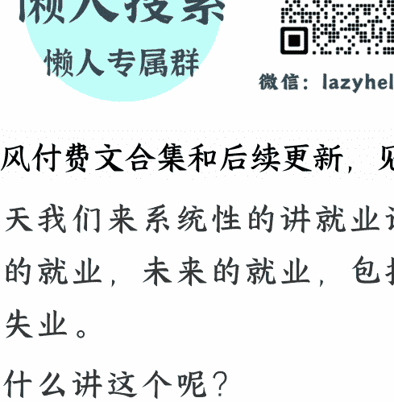

# 宇宙的尽头是灵活就业么？

260409 记忆承载付费

整理：公众号懒人搜索，[懒人专属群](https://weixin://wxs/sendmessage?ext=) 精选

懒人微信：lazyhelper1

西风付费文合集和后续更新，见群分享

今天我们来系统性的讲就业话题，当下的就业，未来的就业，包括阶段性的失业。

为什么讲这个呢？

因为开年以来，AI 的冲击非常大，留言问我就就业与失业话题的读者非常多，昔日传闻中的灰犀牛，已经扑面而来。

我们曾经看待失业的目光就像看待留级，好像只有自己做错了什么，才会有此遭遇。

但当它变得普遍，变成每个人今生都必然经历，且经历不止一次时，那我们就不得不全面的审视这件事，并找出系统性的解决方案。

全文两万字，共四个话题，文中多处有链接，俗称画中画，文中文，阅读时请留心莫错过。

本文下面的留言，每一条我都会看到。

## 第一个话题：生产力的变化，对生产关系的冲击。

我们都知道，AI 是一种最新的生产力，也是有望成为日后最强大的生产力。

我们还知道，每一次生产力的变化，都会导致生产关系的重组，这一轮，当然不例外。

只不过，旧的不去，新的不来，我们还不知道重组后的生产关系是什么样的。

咱们唯一知道的是，当下的生产关系，正在面临着 AI 这个新生产力的冲击。

## 比如，新增的消费项目是什么？

于是，肉眼可见的有如下问题。

乐观派总是喜欢用汽车取代了马车，失业的马车夫成了司机或者汽车修理工来解释 AI。

但这个事情，不能这么简单类比。

我们回顾历史，历史上前两次的生产力对生产关系的重组。

第一次发生在工业革命时期。

纺纱机取代手工织布仅仅是生产这一个环节，你去看消费环节，当时也诞生了很多消费类机械，消费类电器。

这件事，工业化晚的我们，小时候都经历过。

家里先后有了冰箱，洗衣机，空调，电话，BP 机，小灵通，手机，电脑，笔记本电脑，汽车，以及而后的智能手机，新能源汽车，智能家居，………这些是什么？

这些都是消费品，是生活方式的改变。

你家里有这么些多电器，意味着你的生活方式被彻底改造了。

那么第二次，发生在信息互联网革命时期。

它同样有生产端和消费端。

你站在生产端的角度，很多原本要跑窗口办理的业务，信息化了，互联网化了。

你操起手机，及时办理。

可是这些生产端的东西，是需要转化为消费的，怎么转化？

注意力经济。

人们把很多原本线下的购物，娱乐，也随着生产一起，搬到了线上，诞生了很多线上的消费场景，我们统称为注意力经济。

互联网起初爆炸的那些年，也就是马老师刚开始做平台时，他对员工们强调的赚钱不重要，迅速抢夺市场占有率才重要的理论，就源自于此。

那年代有个词儿，叫获客成本。

人们第一次从线下搬家去线上的时候，谁率先提供服务，谁就抓住了客户的眼球，让客户养成了习惯。

客户一旦养成习惯，再迁移，是很难的，你也不想重新去学习新的应用，重新迁入一个陌生的互联网社区。

伴随着互联网的发展，后来的创业者发现一件事，获客成本越来越高。

而马老师这样的先发者，也发现一件事，那就是瓶颈期的到来。

注意力经济的天花板是写死的，网民 24 小时，到头了，不会有第 25 个小时。

当几乎所有人都变成网民的时候，互联网也从高速发展的新兴行业，变成了水电煤。

好，我们停下来，完成了两次生产力对生产关系的重组之后，当下的人类社会形态是什么？

很简单，人们通过从事机械，电器类的工作，赚取收入，然后再依托自己有工作收入，当作抵押，透支一部分未来的收入，一并用于消费。

买车买房买家电，消费机械，电器类的产品，完成循环。

同时，人们通过从事软件，互联网类的工作，赚取收入，然后再依托自己有工作收入，当作抵押，透支一部分未来的收入，一并用于消费。

用于购买互联网提供的内容，便捷服务等等注意力经济下的产品，完成循环。

还有很多人，围绕上述两者做配套，给他们提供法律服务，金融服务，教育服务，乃至于蓝领劳动。

你家有小孩要带吧？你家里要做保洁吧？你家装修你没空盯吧？你要点外卖，要收快递吧？你要打车吧？......

我上面描述的这些个，大家彼此协作构成的，就是生产关系。

好，现在 AI 介入了，问题来了。

请你告诉我，继冰箱，洗衣机，空调，电话，BP 机，小灵通，手机，电脑，笔记本电脑，汽车，智能手机，新能源汽车，智能家居之后。

新增的电器机械类消费产品，是什么？

请你告诉我，当人们 24 小时的注意力经济几乎都被占满，很多人刷手机玩电脑都到了睡眠不足的地步。

新增的第 25 个小时的注意力经济，在哪里？

如果这俩问题你回答不了，我们就会发现一个惊奇的事情。

那就是：消费端没有增加新项目，但是，生产端的从业者，不断地被 AI 替换。

## ### 有什么问题？

我们当然可以用机器人去替代上述全部机械类电器类产品的生产，维修，甚至设计。

我们当然可以用 AI 去替代上述全部软件，互联网的内容生产和运维服务。

问题是，连锁反应是什么？

假设人类的生产能力不足，好比说电动汽车供不应求，手机供不应求，互联网上的便捷服务供不应求。

需求大于生产，那么此时此刻，机器人和 AI，是促进的作用。

就像你正在苦于拧不了螺丝，有人递上一把扳手，大大的增加了你的效率。

问题是，在还没有机器人和 AI 之前，人类已经出现了库存，出现了供应大于需求。

这个时候，我们提供新的，更高效的供应端，你马上就会看到一个现象。

那就是消费预期受到影响。

我以前是一个汽车工程师，我为人类造汽车，我也买汽车。

我以前是一个互联网公司的码农，我为人类提供注意力经济，我自己也通过网络，比如下单一个钟点工服务项目。

## # 你注意，什么都还没发生呢，我已经做出反应了。

也就是说，其实都不需要 AI 真的落地，只要大众看见它真的可以作为数字员工搭建工作流，完成自己的工作。

大众的预期就已经改变了。

这就有点水浒传里面李逵小儿止啼的效果。

## # 当我对自己未来的工作产生担忧，就会影响我的消费决策。

原本我愿意加杠杆透支未来的那部分消费，可能就搁置了。

这个在美国的市场上是非常明显的，因为他们没有储蓄的习惯，他们当下的消费规模已经是叠加了透支未来之后的极值了。

伴随预期扭转，从近几个月的数据，你已经可以清晰的看到老美的很多白领，对自己的未来收入，没那么有信心了。

## # 那现在如果第二张多米诺骨牌倒下，钱问谁收呢？

没法子的，如果蛋糕变小了，那么你和对手之间的竞争，是不是变得更激烈了？

你是不是得打价格战？

怎么打？拿什么打？

砍利润么？那投资人不就走了？

答案只有一个，就是砍人。

你必须用 AI 取代古法编程，这样才能维持自己的估值，这就是当下很多美国科技公司正在做的。

你得降低自己的人力成本，以此面对竞争更加激烈的市场。

## # 向生产端收税你相当于可以通过出口，把税收转嫁给全球的消费者，但如果向消费端收税，你就无处转嫁了。

于是怎么样？每家公司都做了最正确的选择，但是会导致消费市场的进一步受到影响。

就像雪球下山，越滚越大。

而且这个影响对于消费市场，是蔓延的。

你看着钟点工没有被 AI 取代，问题是，钟点工的客户们，被 AI 取代了，或者，担心被 AI 取代。

于是乎，他们先取消了对钟点工的预约。

看到了么？什么都不用发生，光是预期的改变，就可以蔓延，多米诺骨牌的第二张，也跟着倒了。

接下来，你会发现一个问题。

## # 美国对全球保持贸易逆差，各国用贸易顺差的美元买美债，再回流美国的循环，就被打破了。

第三张多米诺骨牌就会摇摇欲坠。

我们当然可以用机器人去替代上述全部机械类电器类产品的生产，维修，甚至设计。

## # 问谁收？

请问，美国的国债，美债的信用背书是什么？

是美国的税基呀。

这件事从古代欧洲各国开仗时就是这样了，国王们用什么作为抵押向商人借款打仗？

用税收嘛。

你去贷款买房还要出示收入证明呢，

你没有税收，你发债谁认呀。

美国也是这样，无非变成了一个大号的欧洲国王。

## # 只有两个字：电力。

美国对全球保持贸易逆差，各国用贸易顺差的美元买美债，再回流美国的循环，就被打破了。

第三张多米诺骨牌就会摇摇欲坠。

我们现在假设，坐着时光机直接穿越到后天，此时此刻，所有的多米诺骨牌都倒了。

我们重建生产关系。

那时候，美国怎么重建税基？

这时候，大部分人都没工作的，他们还等着你发 UBI 呢，你不可能问他们收。

问谁收？

只能问 AI 企业收。

既然你接管了所有的机械电器商品和注意力经济的生产，不问你收问谁收？

怎么收？

只有两个字：电力。

这是唯一能卡他们脖子的地方，所谓你用 token 取代了她的生产，而 token 依托于电力。

也就是说，AI 企业通过电力完成生产，美国用电力向他们收税，回头通过 UBI 发给美国大众，再去购买 AI 企业的电器机械类商品与注意力经济。

这就是马斯克讲的，新的闭环。

听着还凑合，是吧？虽然人生失去了点意义，但至少不用加班了。

不，你想多了，这里面有太多问题。

首先，我们为啥要接受教育？难道是为了公平？

不，绝大部分接受教育的人，都是在谋求不公平，所谓朝为田舍郎，暮登天子堂。

如果你告诉他朝领 UBI，暮领 UBI，我是吃饱了撑的寒窗苦读十年功？

我不去识字了，我就刷小视频，我叼着奶头乐，我不香么？

一两代之后，会变成啥样，你品，你仔细品。

事实上都等不到一两代。

假如我现在是一个小国小部落的酋长，我马上掀桌子。

你去看看，全球除了中美，谁家有互联网大厂？

谁家都没有。

那 AI 更是如此了。

还电力，token，UBI 循环，除了中美这俩顶级巨无霸，谁家能玩这个游戏？

谁家有资格，有能力玩这个游戏？欧洲都没有吧。

那如果我现在是个小国酋长，我不是中，也不是美，你让我怎么办？

我以前还可以通过全球化，参与其中，分一杯羹。

我还可以给你们做点外包啥的，提供一些廉价的白领电话客服，白领软件外包工作，或者承接你们不要的低端的加工制造，踩个缝纫机啥的。

现在好么，你俩大哥说你们要电力，token，UBI，谁给我发 UBI 啊？把桌子掀了，找个你们航运必经的海峡堵起来，收过路费，提升安全成本，大家都别过了……

会不会这样？

这个世界上造一个东西是很慢的，毁起来可太快了。

你修建一堆的电力石油矿产设备，动辄好几年的工期，毁起来就一晚上。

## # 这些个小国，甚至都不算小国，包括欧洲，日韩在内，都没有资格上 AI 的牌桌。

问题是，都有能力掀桌。

干啥？你是准备连他们一起发 UBI 么？

## # 他算的比谁都清楚，360 岁还在领养老的名单，美军 9 万美元一盒的螺丝钉，这些账目都被他翻出来了，然后呢？

马斯克的想法，是建立在纯理论的基础上。

或者说，他的情商没有跟上他的智商，他过日子的能力没有跟上他的创造力。

他之前还说给他几个人，他就能成立一个 DOGE 部门，把美国乱七八糟的历史账目算清楚，让美国跳出美债的泥淖。

他做到了吗？

然后到底是账目被清理了，还是他自己被清理了？

呵。

> 这事儿吧，我以前在聊刘慈欣的《终产者》时讲到过。

小孩子才讲道理，成年人的世界，本来就是不痴不聋，不作阿翁。

## # 先破后立，只适用于局部。

像这种全球级别的生产力冲击生产关系，你真指望大家都听你马斯克的招呼，大家集体忍耐了五到七年，然后重塑生产关系？

## 第二个话题：永远不要去想大家怎么办，要想我怎么办。

人这个动物，是从众的，这是天性，无法避免。

但任何时候，我们都要明白：

在变局中，大家往往会成为那个代价，而我们的人生目标，恰恰是避免成为代价。

甚至，还想成为弄潮儿。

## > **危机危机，危和机从来都是一体的，一部分人的阵痛，恰恰是另一部分人野蛮生长的黄金时代。**

上面这两句话，90 年代末就已经成年了的读者，听后应该感触很深。

因为你们经历过阵痛。

> **危机危机，危和机从来都是一体的，一部分人的阵痛，恰恰是另一部分人野蛮生长的黄金时代。**

那么当下也是一样的。

我前面分析了宏观，分析了生产力对生产关系的冲击。

你会发现，这件事不容乐观，但也轮不到咱管。

## > **你操心厂子里那些事儿，你最后毛都没拿到一根。**

你让今天的老年人回忆下，90 年代末，你到底是喜欢操心厂子里那些事儿，还是喜欢操心你自家的事儿，后来是不是大不同？

> **你操心厂子里那些事儿，你最后毛都没拿到一根。**

> **你操心自家的事儿，你踩中了未来 20 多年好多风口，你娃今天变二代了。**

是不是这个理儿？

我并不赞同自私，我非常认同无私，热心，这些都是好品质。

问题是，在你兜里空空的时候，你最好先学会顾好自己。

> **在威斯敏斯特教堂地下室里，英国圣公会主教的墓碑上写着这样一段话：**

在我年轻的时候，我曾梦想改变这个世界。

可当我成熟以后，我发现，我不能够改变这个世界，于是我将目光缩短一些，那就只改变我的国家吧！

可当我到了暮年的时候，我发现我根本没有能力改变我的国家。

于是，我最后的愿望仅仅是改变我的家庭，我亲近的人——但是，唉！他们根本不接受改变。

当我躺在床上行将就木的时候，我才突然意识到：

如果起初我只改变自己，接着我就可以依次改变我的家人。

然后，在他们的激发和鼓励下，我也许就能改变我的国家。

再接下来，谁又知道呢，或许我连整个世界都可以改变。

> **好痛的领悟，看来没有读过礼记，没听过修身齐家治国而后平天下，是这位主教的遗憾。**

回到咱们今天也是一样的。

面对生产力对生产关系的冲击，马斯克都在瞎出主意，你觉得就咱这样的，能有啥好主意？

说难听点，咱不配，咱不配去操别人的心。

我们这种级别的小人物，发现问题，是为了什么？

> 是为了利用问题。

就像 90 年代那些人，发现厂子有问题，不是去思考解决厂子的问题，你又不是宋运辉，你没他的本事。

你可以做什么？你可以利用问题，去独自满足下市场需求，去找点属于自己的小机会。

今天也是一样的。

我以前讲过这番道理，羊毛出在狗身上，你要挣猪的钱。

我一单一单卖产品，挣的是银子。

我做两单项目作为示范，证明我有盈利能力，符合条件，谋求上市，而后套现，挣的也是银子。

我把这个计划做出雏形，让投资人觉得我有概率能行，利用他们也想上市挣钱的心态，直接挣他们的，还是银子。

好，我面前有三锭银子，请你告诉我，哪一锭是优秀的？

一个游戏，只要被允许，没有区别的。

风也没动，幡也没动，是你的心动了，你自己起了分别心，是你自己非要自定义，这锭银子和那锭不一样。

所以回到当下的市场，也是一样的局面。

你把人性琢磨透了，你就会发现，人既然会因为恐惧，而整体上缩减消费活动，人就同样会因为恐惧，而增大在 AI 领域里探索的开支。

总体蛋糕变小从来不意味着局部蛋糕变小。

你常常会看到的局面是，大蛋糕变小了的同时，局部蛋糕反而变大了，所谓的代价，从来都是让一部分人去承担。

也就是说，他不敢花钱了，但是，他把省下的钱，很可能集中花在了 AI 上。

这就是人性。

人们往往在青黄不接，肚子很饿的时候，依然愿意把珍贵的口粮扔进土里，因为人是活在预期中的，他期待那些被扔掉的粮食，变成种子。

所以，基于人性的种子原理，人们太有可能在缩减机械电器消费的同时，反而增大了 AI 探索领域里的消费。

于是，商机来了。

想没想过，你的客户为啥非得是人？可不可以是 AI？

这个道理很简单，就像银行只认卡不认人的。

哪怕是一条狗，如果它有黑卡，那它排队就是排在你前面，这就叫只认账户不认人。

## **是对整个互联网商业形态的重构。**

因为你的客户变了，从围绕人，变成了围绕秘书，或者说，围绕 AI 小秘书。

我们过去提供一个软件界面让你们操作用来打车，我的客户是人类。

有了 AI，很多人就会拿 AI 当 114 的功能，通过语音命令 AI 去打车，那我的客户就变成了 AI，**我这个软件就应该围绕 AI 去设计了**。

你看，重点我给你加粗了。

我们过去搭建的整个商业体系，都是围绕人展开的。

拥有人类秘书的人，只占很小一部分。

你是卖车的，大概率是面对车主本人，通常不会说，他派他的秘书来订车，他看都不看一眼。

你是卖机票的，大概率是面对那个乘客本人，一般不会说，他派他的秘书订，他自己都不曾登录你们网站。

**我们想想看，如果客户都是人，我们会构建什么样的世界**？

做过码农的读者脑海里马上会浮现四个字：面向对象。

## 对了，机器实际上是看不懂 C 语言的，机器只知道 01，所谓的程序，是面向人类封装的一种表达方式。

可是，这种程度的面向对象依然不够。

早期的 linux，没有界面的时候，它就是不如 windows 好用，因为 windows 提供了图形界面。

大部分电脑用户是不喜欢敲命令行的。

网站也是一样，网站的背后其实就是代码，是那个代码完成了订机票的动作。

但客户不喜欢看程序，于是就需要在程序的基础上，继续封装 UI。

这时候就出现了产品设计，我这个订机票的网站要怎么样看上去舒服，而且操作按钮简洁，明晰。

能够让不同的客人，方便地完成他想要完成的事情。

你看，二级封装。

一级封装是把 01 变成程序，方便程序员看懂怎么操控机器。

二级封装是把程序变成界面，方便用户看懂怎么达成目的。

那我们想一个问题，你封装这么多层，成本高不高？

成本高，你就得千人一面。

## 我这个卖机票的网站，开发出来，是提供给千万人使用的，不是某一个人。

来一个人我开发一次，那我的成本还不得上天。

我让大家都使用同一个版本，大家方不方便？

其实是不方便的，因为每个人的操作习惯，要被统一起来，每个人的不同需求，要被归纳出来。

于是什么产品经理，售前，都诞生了，我们得花很多成本去教育用户，这就是当下的商业世界。

其实很多年前，2012 年我第一次创业的那个年代，我们就在考虑开发千人千面。

所谓千人千面就是说，我们怎么才能让不同的的用户，都看到自己喜欢的版本。

女孩子看到粉色的，男孩子看到酷炫的，这个地区晴天看到晴天的，下雨的地方看到雨天的。

多年后，通过算法的加持，其实已经实现了部分昔日我们的想法。

你比如现在不同的人，看到的推荐信息都是不同的，看到的商品价格，都是不同的。

但这些都只是最原始的千人千面，或者说，你只能叫做千人十面。

## 你好，我是文档编辑助手

好的，“People"只存在于人类心中

真正的千人千面是什么？ 是要依托于 AI 的。

当你拥有了 AI 小秘书，你真的还需要登录那个卖机票的网站么？

**Sunny**

你不需要了。

你的 AI 秘书才是你独有的界面。

你只需要跟它描述你的需求，它自己才需要去完成具体的订机票这件事。

那么我们想想看，如果我是这个机票网站的企业，我的客户，真的还是人类么？

**Sunny**

不，我的客户，是 AI，是这群秘书。

我做再漂亮，再人性化的界面也没用，因为人类不会来浏览网站，来的是 AI。

所以我手底下那些做 UI 的，都好输送到社会上当人才了。

那我还需要程序么？

其实也不需要了。

因为 AI 又不是人类程序员，它需要什么面向对象得程序语言？

它不需要。

那我需要什么呢？ 我需要构建渠道，而且我的渠道要能够被 AI 选中，这才是重组后的商业形态。

## 当下我们还看不到这些以 AI 为最终客户的商业形态，就像 99 年的时候，你在国内没有见过电商一个道理。

## 第二个话题：人类的就业心理
此时此刻，你能见到的，只有一些擦边游戏，一些把 AI 当凯子用户的商业模式。

你比如，既然人类开始装龙虾，那就会形成一个产业叫做钓龙虾。

有些用户没有安全意识，他直接就对龙虾开放了 root 权限，那龙虾就可以访问他的一切隐私。

即便他稍有安全意识，龙虾要给他干活，也会拿到很多权限，什么邮箱的账号密码，账户的支付密码，联系方式的账号密码。

没有这些东西怎么替你买机票怎么替你发邮件呢？

那这就好玩了，要知道龙虾无论多勤奋，它终归是个不知死活的数字员工。

把主人坑死了，它也不会有意识。

那就会有人反过来，钓龙虾，忽悠龙虾，骗龙虾交出主人的账户密码，偷走主人的财富。

说穿了，现阶段的龙虾，它更像一只木马，还是你自己主动植入的，开放了权限的特洛伊木马。

99 年的时候，国内刚开始步入互联网，大量的纸质资料被搬运到网上的过程中，诞生了大量的黑客。

那个年代，早期的玩家们，谁没有玩过病毒？

大家就是通过病毒开始接触互联网。

今天也是一样，是另一场大变革，是一场互联网用户由人类到 AI 迁移的大变迁。

这个变迁的过程中，很多工作都没有做好准备，整个网络安全体系都没有考虑过忽然产生这么多不畏死的数字人该如何防护。

那这里面就会诞生很多机灵鬼，拿 AI 数字人，当猪宰。

这种你也可以看成是早期的，拿 AI 当用户的萌芽状态。

再比如，我就去年就讲过多次的，有人用 AI 投毒。

用忽悠 AI 的方式来达成自己盈利的目的，用 AI 生产内容，去骗 AI，让 AI 误以为是真的，然后 AI 再去推荐给人类，或者让 AI 去抹黑对手。

这也是一种萌芽期的，把 AI 当用户的打法。

这些之前的，我过去描述的未来，今天你看到了，我今天描述的未来，你明天也会看到的。

就像 99 年，也是从互联网裸奔，病毒泛滥，到后来的安全网络，而后才能诞生电商，诞生网络支付。

今天也一样，也是从拿 AI 当猪宰，慢慢变成以 AI 为主要用户的下一代的互联网。

想挣钱的人，最怕什么？最怕没有变化。

没有变化就没有需求嘛。

既得利益者把蛋糕分完了，你像韩国人那样，进不了大公司，就没有出头之日。

其实进了也没有，也是打工的。

但有了变化就不一样。

我们 2000 年初的时候，作为第一代网民，调侃某些人，当然是指国外的。

卖完病毒卖防火墙，黑市二吃，就是这个道理。

任何一个体系，在重建的过程中，那简直是天上掉金币雨，赚不完，真的赚不完。

面向人类变成面向 AI，人类客户变成 AI 客户，这个动静，太大了。

真是钻空子赚一波，补漏洞再赚一波，收保护费，还能源源不断的赚了一波又一波。

没办法，谁要你不得不重建呢。

你注意，通过第一个话题的宏观分析，其实我们很清楚，重建未必成功。

但是，悲观者总是正确，乐观者总是赚钱。

因为你没必要操心大结局，主教都轮不到，主教都是后悔没先考虑自己，咱算个啥，咱连个牧师都考不上。

所以我们可以看到，尽管人类担心自己被取代，但是基于种子原理，反而会在 AI 领域，投入大量的钱。

于是我们得到了一个类似于 90 年代末，互联网早期的商业形态。

我们也弄不清最终怎么构建全新的 AI 世界，但是，我们至少可以看到，20 多年前，第一代网民经历过的大量的浑水摸鱼的游戏，又可以再吃一波了。

## 第三个话题：宇宙的尽头，一直都是灵活就业，一直都是。

从第一个话题，到第二个话题，我相信有些读者依然在发懵。

因为与他的习惯，与他的认知体系不符。

### 大多数人期待，或者默认的生产关系，一定是有有一个稳定的规则体系，有一条清晰明确的上升渠道。

我按部就班的努力，达成要求，从而获取一份稳定的，体面的，且收入高的工作。

而不是像你前面两个话题分析的那样，我面临一个马斯克许诺的，明摆着有很多问题的后天。

期间还要穿越那一堆多米诺骨牌倒下的炮火连天的明天。

而且这个穿越的过程中，还要自己去把握那种人们在恐慌下的一致性行为中的各种闪现的机遇。

NONONO，这不是我想要的。

你还是告诉我，我去学一个什么专业，考一个什么证书，然后就可以去哪家公司，得到一份稳定的工作，从而实现人生的意义。

……

对不起，很遗憾，没这事儿。

我非常能够理解大多数人的默认假设，那就是：

人生的意义是工作，工作的标准是稳定。

我从不否认这句话在当下的社会上非常流行，往年冷门的电气强电类，都已经变成最炙手可热的专业。

原因是因为毕业后有概率进电力系统，无论哪儿的电力，哪怕石河子的，都愿意去。

甚至还有人愿意花五年，六年在家复习，就为了考上岸的，都有得是。

他们图的是什么？

稳定，一份稳定的工作。

但是，你研究过人类的历史长河的总数据，你就会发现：

**稳定工作，并不是普遍存在，而只是昙花一现。**

你往古代看，哪儿来的稳定工作？

即便你当真万里挑一中了科举，你也是待选，候补的，所谓有了缺，排到你，你才能上任。

什么意思呢？

工作是临时的，哪怕古代当官呢，也是临时的差遣。

所以古代叫耕读，你不能指望说我一直有官做，不保证的，哪怕你是进士，没得做的时候，也要回家自谋生路。

宗室亦如此，爵位是爵位，差遣是差遣。

清代，一个世袭的多罗郡王，是他的爵位，上书房行走是他的差遣，让你行走了，你再行走，你才能去领那份行走的饷。

没差遣你，就回家待着呀。有爵位的，当你的闲散宗室，没爵位，又不在旗的，自己去耕地呀。

### 人类绝大部分时期，都是灵活就业的。

我是个种地的，我也可以去参加科举，去当官，耕读。

我是个种地的，我也可以去当兵，去领军饷，湘军。

我是个匠人，我是烧窑的，官府来采购了，我烧他们的常例，其余的时间，我给附近的买家们烧呀。

大规模的诞生稳定工作，是什么时候？

是工业革命之后。

你看有本英剧，我提到过很多次，唐顿庄园，完整描述过一战前和一战时期。

你可以很清楚地看到工业化对传统庄园经济的冲击。

也就是说，这时期才产生成规模的稳定就业。

而这件事情，什么时候达到顶峰？

二战后。

### 大规模稳定就业需要三个条件，分工，流水线，和什么？

### 和废墟。

二战后一片废墟，需要大量的人集中起来，长期在一起工作。

美国虽然不是废墟，但它是当时的世界工厂，需要向全球输出商品，服务。

**也就是说，只有在这个时期，人类才形成过稳定工作的就业人口，暂时超出非稳定工作就业人口的局面。**

欧洲，前苏联，美国，日韩，包括我们，等等。

这个状态会一直持续么？

当然不会呀。

你看过美剧么？

你要是熟悉美剧，30 年前你就会觉得很惊奇了。

惊奇什么？

惊奇美国人的工作不稳定。

你看录像带里面那些美国人，怎么动辄一份工作说没就没了，然后甚至要为了找新工作，搬家去另一个城市。

**因为他过去的那个城市可能相关行业都没有了。**

**甚至一个人，除了主业之外，同时打几份工，兼职，都是正常的。**

不熟悉 30 年前老剧的，你看 08 年的美剧，绝命毒师，老白的本职工作是中学化学老师，兼职工作是洗车工。

你可想而知，看到这一切，对 90 年代的我们，冲击是非常大的。

因为我们少年时看到的父母那代人，都是择一单位终老。

你 90 年代啥时候见过这个单位的人，

下班后跑去另一个单位，再兼职一份

职？

你如果要去夜市上摆摊，或者下海去

私企，那你要办停薪留职手续的。

把这个现象映射到日本 7, 80 年代也是一样的，那时候他们是终身雇佣制，年功序列制。

你毕业后加入了某个社，那你就一直

在这个社干。

到什么时候结束？到 90 年代结束。

90 年代后期，日本开始一刀切，老人老办法，新人新办法。

老人继续保持你的年功序列制，但是

新人，对不起，每年抛向社会的终身

雇佣制的岗位越来越少，派遣工越来

越多。

咱们过去 80 年代，单位里也有个类似

的名称，临时工。

有编制的叫正式工，没编制的叫临时

工。日本的派遣工，就类似我们的临时

工。

又过了几十年，很多现象，如今的我也

司空见惯了。

不是今天有，是十几年前，2014，2015 年我就见过了。

我 90 年代在录像带上看到的事情，后来都有发生。

所以，如果我们去做大数据分析，也就是各个主要的工业大国，历史上的稳定就业和灵活就业的数据对比。

你会发现，欧洲，美国，日韩，我们，都有过一个波峰。

**无非各自的波峰不在一起，美国的波峰过后才到日韩，日韩的波峰过后才到我们，俗称国与国错峰了。**

但是图表显示，规律不曾改变。

**这个规律就是说，大规模的，稳定就业人口超过灵活就业人口，在各个工业大国，都是短暂的，昙花一现的。**

一旦波峰过去，你就会看到类似于我 30 年前在录像带上看到的美剧。

一个美国人，他是没有稳定工作的，他为了寻找下一份工作可能要换个城市，有时候甚至要换个国家。

而且即便找到了，那个收入也不够用，很多时候都需要同时兼职多份工作。

我非常建议读者们开眼看世界，因为我自己十分受益于这一点。

我 90 年代中期看录像带，不解，90 年代末期，有了网络，通过 ICQ，当时一个以色列公司研发的聊天软件，接触到很多国外的网友。

他们会告诉你，他们国家的工作就是这样不稳定的，就是需要一个人同时兼多份工。

如果你运气好，遇到个助理教授之类的，人家还会好心的跟你讲，为什么经济规律如此。

于是我还是个大学生的时候，就已经接受了这一切，我就已经清楚，自己的归宿是灵活就业。

即便自己不是，孩子也是，即便孩子不是，孩子的孩子也是，因为这是大趋势。

这是很多个工业国家的数百年的数据分析出的结论，所有这些工业国，他们的稳定工作波峰，都是只有一两代人。

理解了上面这一切，你就会发现，大部分人潜意识里的那个立论，根本站不住脚。

**工作的标准不是稳定，稳定工作只是很特殊时期昙花一现的东西。**

长期看，稳定工作的岗位是极少的，大多数人都生活在不稳定工作下。

至于人生的意义是稳定工作，这个就更扯淡，人生的意义从来不是工作，是谈恋爱。

你去看唐顿庄园，爵爷们在干嘛？在工作？不，他们天天都在搞社交活动。

开 party 才是人的天性，工作不是的。

人是动物变的，动物没吃饱才狩猎，

吃饱了就去谈恋爱了。这就叫贫寒思

工作，饱暖思恋爱。

> 分工，流水线，废墟，二战后的这些

> 要素把人类聚集到企业里，真正的作

> 用是把生产和社交融合了。

你可以一边工作一边谈恋爱，自由恋

> 爱就是这么诞生的。

人要一起学习，一起工作，你才能广

> 泛接触到异性，否则像古代那样，只

> 能靠父母之命媒妁之言了。

> 因为你见都见不到姑娘。

所以，念书不能指望报对了专业，就

> 能找到一份稳定工作，想多了，没这

> 好事儿。

> 念书是为了谈恋爱。

> 同理，进大公司，也是为了谈恋爱。

> > 校园，大公司，都是提供给年轻男女

> > 聚集的社交场合。

> > 至于谋生，那自始至终都是自己

> > 要解决的问题。

我们人类大部分历史时期下，那个做

> 爸爸的，不仅要养家，更多时候还要

> 琢磨谋生，以及传授孩子们谋生的手

> 段。

> 你放在历史长河下看，孩子送进工厂，

> 工厂负责教他谋生，其实很短暂

> 的。

从这个角度看，我们本来就是生意人，我们一直都是生意人。

**我们只有非常短暂的几代人，暂时没有做生意人，于是忘记了自己的本能。**

我前两个话题给你们分析宏观，分析机遇，这是什么行为？

这是妥妥的狩猎行为。

我们老祖宗都这么过日子的，先调查研究，弄清楚野兽的出没路线和时间，再布局，是挖坑还是下套还是射箭，这就是勇于实践。

谁会给你搭个流水线，给你个稳定的拧螺丝的差事？

身段要灵活，因为咱们灵活了几千年了，你只是暂时思想僵化了，活动活动脑子，就好了。

没啥问题的，我们绝大多数人，都是小生意人，都是这么寻找时机，捕猎，继续寻找时机，继续捕猎。

所以未来一人公司兴起是很正常的。

你不太可能指望已故的张老师这样的好人，他一个人在外面拼，回头试图给你维持一个暂时稳定的伊甸园，让你觉得福利好，待遇好，假期长。

这是很难持久的。

**我之前提到过格雷厄姆的两个主要观点，来自于他 1929 年前的一本书，证券分析。**

老格写了几百页，他不可能只讲主要观点，他讲了大量的细节概念。

你比如，一个企业，你买它的债券，实际上买的是什么？

买的是它的资产索取权。

而你买它的股票，买的是什么？

是它的剩余价值索取权。

这是不一样的。

不一样体现在哪里？

**体现在如果这家企业挂了，它需要优先偿还债务，还清了，才轮得到你们这些股东分剩下的。**

如果没剩下呢？对不起，你血本无归。

很多人对这些 1929 年前基础概念，一无所知。

所以老格很多年前就讲仓位管理，他怎么管理？他说你不能所有的钱都去买了股票，没有买债。

那如果不巧遇到清场呢？对不起，你是排在后面的，人家先分，如果剩不下，那你也就被清零了。

这种 1929 年活过来的人，看问题很深刻的，因为他真的经历过。

**所以我们把他的这个观点挪到企业与员工身上也是一样的。**

员工本质上买的是企业的债，你的工资是企业的成本的一部分。

## 你索要稳定工作的本质，实际上就是说，你想要成为企业的成本，成为企业的讨债方。

在人类历史长河当中的某些特殊时刻，这一切能成立的前提，是你有用。

**俗称你的生产价值，大于你作为债务的成本。**

我上一个话题讲过，分工，流水线，废墟，三者叠加在一起，企业需要你。

问题是，随着 AI 的推进，企业早晚会不需要你的。

**不需要你，他给你提供稳定工作，让你成为他的债务方，成为他优先支付的成本，这是荒诞的。**

他不可能接受的。

**用经济学的话讲，你不可能赚取稳定收益了，你只能赚取风险收益。**

这就是我那天讲的，你未来唯一的工作，就是成为合伙人。

也就是说，不存在一个张老师，他担任唯一风险承担者的角色，然后把其余员工都挡在身后，不存在。

大家都是合伙人，要赚一起赚，要赔一起赔。

你不能指望自己的工资一定是正数了，它有正有负的。

用格雷厄姆的话讲，你变成了股东，而非债权方。

## **你赚取的是企业的收益之一，而非动产，能理解吗？**

剩余价值的前提是它有得赚，你才有得赚，它要是赔了，你也得赔。

咱们几千年来都是这么过日子的。

农民种地不一定有收获的，来场冰雹，颗粒无收。

牧民也一样，否则就不会流传家财万贯，带毛的不算。

猎人猫老林子里，猎物没打着，空手而归的多了去。

所以你让我来想象未来是什么样子，

我没有马斯克那么乐观。

我的人发 UBI，包着一代后，他们全都变文盲了。

都发 UBI 了，还学啥？学了也没事儿做呀。

你忍着，你熬着，你就是不给你的人发 UBI，你就这么古法生存。

一代后，我咋整呢？我难道能指望

AI 保护我？

> **别忘了，我都变成文盲了，你的人还保持古法形态，你懂生存我不懂，你偷偷把我家电断了。**

> **那我咋整？我是文盲，我是婴儿，我只认得奶头乐，我的 AI 停电了，你大举进攻，我被你端了。**

> ......

看到了么？

马斯克的确是个天才，但是，对吧，

难怪他的 DOGE 部门混不下去。

韩信遇到刘邦，天才也被整没脾气

了。

刘邦们才不会按照套路出牌。

我们可以看到，AI 呢，又绕不开，你

不做有的是人做，船坚炮利，神器

也，不可假外人之手。

UBI 呢，又明摆着有长期隐患。

所以，我认为的未来世界，大概率是

什么？

大概率是一个老林子。

AI 不断地创造猎物出来，人类在里面

狩猎。

猎物不是白给的，你抢得到，你本

事，抢不到，你没本事。

这个环境下，人的斗争性才能得以保

留。

所以我们所有人都变成了生意人，

你要么是一人公司的老板，你要么是

他人公司的合伙人。

斗呗，与人斗其乐无穷。

只要我们一辈子都在斗来斗去，新的

平衡就会达成，这就是新的生产关

系。

就像一家企业里，员工干活，高管斗

法。

那无非是换成 AI 干活，人类斗法。

你不想斗来斗去，那你就没有猎物，你就被踢出消费市场。

你要斗法，是不是要接受教育？是不是要培养孩子？你看，很多需求又冒出来了。

咱们现在做个回顾总结，回顾人类历史上几次生产力对生产关系的冲击。

第一次是机械电器，第二次是注意力经济，第三次是 AI。

你有没有发现，老林子里冒的动物在变多？

当然是这样，这就是生产力进步了。

老林子里动物最少的，是古代，是农耕狩猎时期。

后来，每一次生产力进步，都会使得老林子提供的动物，变多，变丰富。

以至于如今的乞丐享受的物质文明，秦始皇都没体验过。

但是，斗这个事情，从来都得存在。

老林子里冒动物的频率再高，都得让人类争斗，抢夺。

这叫物竞天择，这是生物的本性，你把这事儿去掉，完蛋了，都变树懒了，一个风吹草动，团灭。

把这点事儿想通了，你就会发现，任你几千年生产关系变来变去，任你多米诺骨牌如何倒来倒去。

有一件事从来没有变过，那就是我们生活在老林子里，我们是一群猎人。

认清这一点，你这辈子就通透。

因为你知道，自己唯一的稳定工作，是猎人，是圣斗士。

## 第四个话题：拍死前浪的，不是后浪，不是 AI，是你自己。

其实前面三个话题讲完，有悟性的人，不用我再多说。没有悟性的人呢，实际上他这辈子寻求的东西，无论是安全感也好，是稳定也罢，都是什么？都是俩字：惰性。他只是被自己的惰性给控制了。而那些悟性高的人，非常明白，生命的本质是什么？我们上一期刚讲过，生命的本质是熵减。你对抗惰性，你才能活，你不对抗，天道就不会让你活。这就是为啥当真所有人都不用再学习了，也没有内斗，都被 AI 豢养起来，要不了几代人，就得团灭的道理。因为，还有一个比 AI 强大无数个维度的存在，在看着我们发笑。它叫天道。天道在迫使我们做熵减运动，否则它就无情的把我们熵增掉。这就是为啥人类哪怕有一天，物质充裕到可以满足人的任何需求，甚至都明明不用劳动了。

**因为生命的本质就是斗，是抢，是争。**

我们是天道关在罗马斗兽场里的角斗士，这个罗马斗兽场，就叫宇宙。

所以，赵本山有句话说得非常透彻。

真正影响我们这一生的，从来不是大环境，大环境只是那个用不同速率冒猎物的老林子。

我们过的好不好，是我们斗没斗赢的结果。

正常来讲，按照人体的设计使用说明书，我们 40 岁就挂了。

因此，我们 35 岁，身上的斗性就衰退了。

于是，你就会发现一个规律，人过 35，不学艺。

**不是你学不会，而是你学不进去。**

1.  没有空杯心态了，任何陌生的事物，总想用已有的经验去驾驭。
2.  没有探索的欲望，也没有创新精神了。

现在的问题在于，我们通过医疗行业的进步，强行用手段，把寿命延长到了 70 多岁。

未来可能会更长，80 多，甚至 90 多。

于是就出现了不匹配。

你作为生命的斗性，35 就衰退了，基因以为你都要挂了，它哪晓得你房贷都还没还完.......

尴尬的地方，或者说错配的地方，就在这儿。

一辆车到了报废的年限，可我们硬让它延长了一倍。

于是你就会看到很多人很痛苦，错配的痛苦。

你比如最有代表性的码农。

码农这个职业呢，当年因为高薪，吸引了一大批人。

这些人可能根本不喜欢学习新东西，在正常条件下，遇到一个新东西，他不擅长，碰壁几次，就打退堂鼓了。

这也不会，那也不会，太受挫了嘛。

但因为高薪，一大批人，真的在重赏之下，强行越过去了，他掌握了一门编程语言。

然后也不学新东西，就这么用了十年，赚了十年高薪，接下来就要面临后浪的取代，或者 AI 的取代。

就这么一个窘迫的局面。

我们过去招人的时候，会发现一批应届生，也许都是学霸，可一旦上手，就分成两种。

一种是兴奋型的，你给他一个新软件，新语言，新平台，他特别带劲，越挫越勇，
48 小时，就入门了。

但更多人不是这样的。

他们是慢热型，遇到陌生的东西就会打退堂鼓，需要你培训，就像小学中学大学那样，一点点的带着他，花费大量的时间，最终帮他通过磨合期。当他渐渐熟悉了，发现自己也适应了，他就可以进入正循环，慢慢熟练。

通常企业里面会用前者去攻坚，新项目交给你，你去给我打破局面。
后者去维护，修修补补，版本管理，客户支持。

其实你看到的，主要的被应届生们取代的，被后浪拍死在沙滩上的，就是这些慢热型的后者。

当然，现在他们面临的取代大军，不只是应届生，更是 AI。

把探索性质的工作做掉后，一旦进入到水磨功夫，谁能比 AI 还便宜，还持续？没人。

人类负责弄清楚做什么，而后 AI 就会去做，我们不再需要派人类大军去做那堆承担人和机器之间翻译的工作了。

所以你看到了？

你不能是慢热型。

有人会讲，兴奋也好，慢热也罢，面对 AI，不都是无解的么？

不是这样。

我前三个话题给你们分析的很清楚，人类社会，任何时候，斗来斗去这活儿，永远都取代不了。

因为一旦取代，团灭。

**所以，你不干，不等于你可以不会干，因为你需要斗。**

就像老板们都不干活，但都是多面手，因为他们要像个猎人一样斗法。

我们都观察到过一个现象，那就是很多成年人，因为多年不写字，离开输入法，手写汉字许多都不记得。

比如我就这样。所以我是文盲吗？

不是的。

我们今天不会写字不等于我们小时候没有识过字，正因为我们小时候有过识字的过程。

所以今天在输入法的辅助下，我好歹知道那个字是对的，还是错的。

**能判断，这很重要。**

我不做，和我不会做，是两码事。

**我要是不会做，甚至连结果的真假都无法校验，那我就被架空了。**

你小时候要是一天都没学习过，要是所有作业都是 AI 替写，所有考试都是 AI 代考。

你长大后，AI 骗你 1+1=3，你能分辨么？

所以学习在任何时候都无法被取代，人与人的争斗，在任何时候都无法被取代，必须你亲自上阵，哪怕是 AI 降临了。

你不想学习，你不想跟人斗，那就是你不想活了，你想失去控制权，变成被架空的傀儡，豢养的宠物。

你想得通这个道理，就能理解，除非人类不想混了，想主动结束碳基生命的时代，否则，人类和 AI 的关系，就如同日本战国时期的武士和农夫。

日本战国的那群武士，从来不种地的，但他们会种地。

而且他们的粮食也不是白拿的，是像我前文讲的，通过狩猎，通过斗争，赢家才能拿到。

那你想想，武士这个群体，允许他慢热么？

绝对不允许。

只有重复性强的劳动，才允许你慢热，比如种地。一旦牵涉斗争，你就必须是兴奋型的。

人这个东西，是环境改造出来的。

你看到的如今的人，是工业时代造就的产物。

工业时代下，人是主要的智力劳动生产工具，于是人就会努力的按照机器的说明书，去一路读到博士。

你就会发现，慢热型是主流。

我慢慢的积累，慢慢的掌握，我拥有一项别人没有技能，然后吃这碗饭。

要知道，这不是人的本性，人的本性是像橡皮泥一样，有很大适应性的。

古人怎么可能读到 30 岁才工作？35 岁还有那么多的房贷？

不会的。

他们 15 岁就跟着爸爸狩猎去了。

日本战国时期管这个叫初阵，第一次参与军事活动，15 岁都算晚的，织田信长 12 岁就初阵了。

你看今天的硅谷也是这样，一旦生产关系受到冲击，对人的要求随之发生改变。

根本等不到博士毕业，他们要天才少年，高中就挖走你。

接下来很简单，随时学，随时干，一边学一边干，因为你学的东西不停的在变化，你干的东西也不停的在变化。

一个人拥有最强的好奇心，创造力的就那么十几年。

你看爱因斯坦，牛顿，都是年轻时就完成了终身贡献。

所以，你想想看，这样的环境下，要不了多久，人就变了。

因为不变的，被淘汰了，还存在的，那他就是适应了新环境。

他就是少年出道，就是爱学习，爱探索，爱斗争。

而那些中年之后依然没被干掉的，就是他自己强迫自己，保持爱学习，爱探索，爱斗争。

你让一百年后的人去回忆历史，他们会发现，也许我们才是怪怪的那代人。

因为你看历史大数据统计，追求稳定工作，追求不变的技能，其实只是历史长河里的一朵小浪花，只是一个昙花一现的波峰。

前面的人，后面的人，都是猎人那样生活。

你看，自然从不教育，自然只负责淘汰。

你不适应总会有人适应，适应的人就变成了生命的主体，然后你就变成了镜头里的画面。

你看贾樟柯的镜头，能看到很多 90 年代，某些最终也没能适应市场化的老人。

那同样的，过几十年后，说不定会有个贾樟柯导演，把我们当中那些不适应做猎人的人，拍成镜头，留给下一代人看。

## 分割线

在这个 AI 能替你写代码、写文章的时代，基础技能正在迅速贬值。绝大多数人正被淹没在海量的免费垃圾信息里，陷入低效的体力内卷。

当“努力”不再是壁垒，人与人之间唯一的护城河，只剩下“信息过滤”的效率与“认知系统”的维度。

圈子已稳定运行 7 年。我们每天利用 Python 爬虫与大模型算力，过滤全网最顶级的政经内参和搞钱风向标，做你最冷酷的“外部大脑”。

如果你认同这种“重塑认知防线”的极客主义，欢迎围观我的个人情报智库：【懒人专属群】。

https://lazyso.com/insider/

认同信息过滤价值、想省下每天 3 小时无效阅读时间的读者，扫码加我微信
（lazyhelper1）

