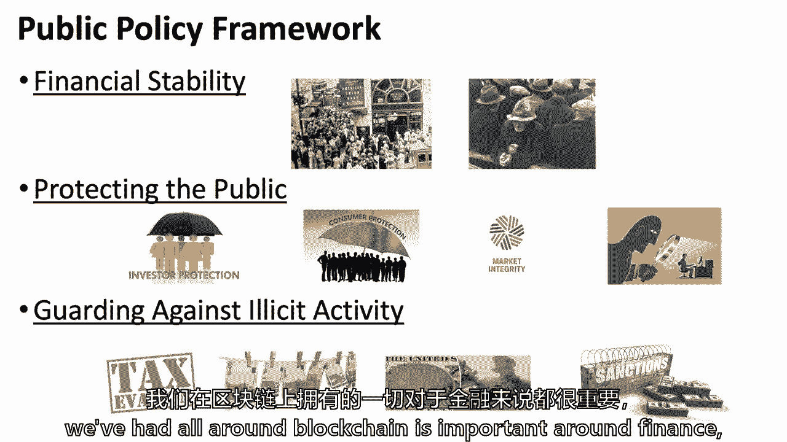
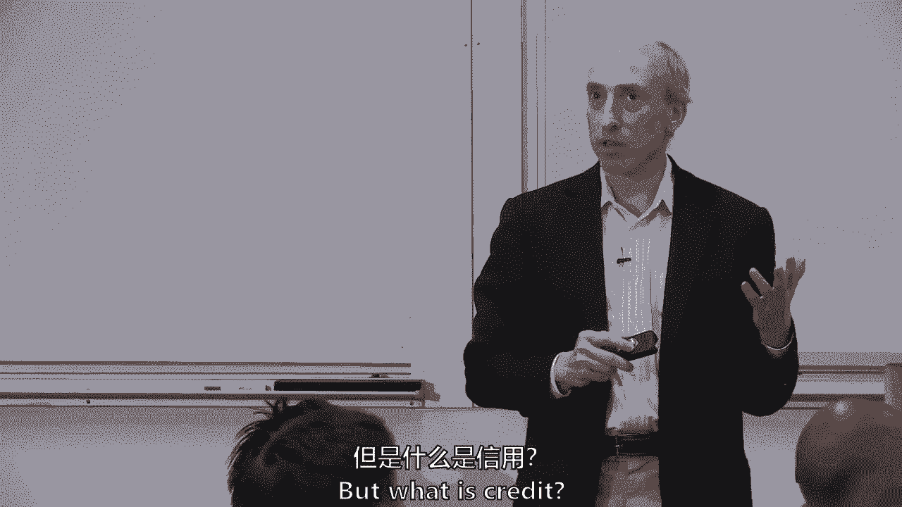
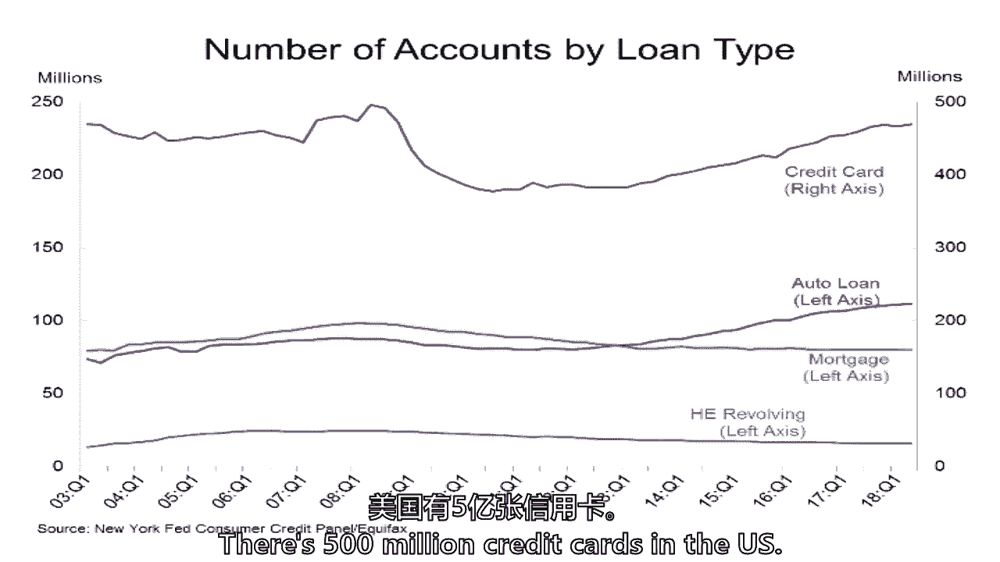

# 【麻省理工大学公开课】区块链与货币 - P10：10、金融体系的挑战与机遇 - 闰土聊Web3 - BV1sL411N7Mm

感谢大家回来，我想晚些会有几个人进来，还在按报纸上的发送按钮，我想感谢所有在第九堂课前提交论文的人，因为我真的有机会读了那两六，因为官方实际上有84个，85人报名参加了这个班。

我很想知道是否有五九份报纸进来，人性，人性，这些只是这个班的统计数据，正如你们中可能看到的那样，我展示了这里的部分体验实际上是眼睛，意思是，我关注你的论文并发表评论，如果你不想要评论，你只是想打分。

你可以随时给我提个醒，给我发电子邮件，我会花更少的时间，我想称赞大家，他们很好，我是说，有一个很好的订婚，好的对话，你偶尔会看到，我没有给你你想要的一切，但是有几个观察，这真的是一个机会。

你可以选择任何主题，在下半学期，直到可能的两三节课，拜托了，如果你们七十个人在第二三节课上交，那是你的权利，那是你的选择，只是，只是会更难，Sabrina带领他并达到一个等级。

但这是对那一周的主题使用批判性推理，所以让我提两三件事，你们中的一些人做到了，我不打算对此苛刻，但你们中的一些人做到了，那不是我要找的，我不只是想解决三个学习问题，这三个学习问题是关于我们在一起的。

其次，只是为了谈谈，我不是在找你读六周前的书，并描述阅读或三周前，这样如果你选择，如果你将来选择11月15日，我知道11月15日，因为我们将有，这将是我们第二次与外部扬声器，这是一个非常重要的。

如果你看那个类，在那个类上写一些东西，当它，我们很幸运杰夫·斯普雷彻，谁是大陆交易所的首席执行官，凯利·洛夫勒是Back的首席执行官，要来和我们一起上一堂关于支付系统的课。

洲际交易所和纽约证券交易所试图在支付系统中做什么，我只是在用那个，如果你写这个，真的是关于那个，不是之前的一切，当我们到得更早的时候，关于那堂课，我可能会说得更多，我们很幸运有一位美国真正伟大的企业家。

加入我们杰夫·斯普雷彻，他是白手起家的，在20年内创建了一家市值500亿的公司，所以这些是我的评论，论文总体上是好的，真正寻找批判性推理，基本真理，你在哪里拿东西，你们中的一些人带来了很棒的叙事声音。

顺便说一句，我得称赞一下，有几个杯子，一把，我真的发现你们是很好的作家，除了是一个好的商科学生，所以这些就是我今天的想法，我要经历，哦，我们有，下周二我们有一位有趣的客人，但我不会说更多。

你会发现星期二很有趣，第十六届，什么是中本，中本，智史，中本不，否，还有其他猜测吗，我不会给任何线索，但我会告诉你下周二你会玩得很开心，第十六届，做客，你在其他任何课上都不会看到，嗯，所以今天我想谈谈。

啊，坟墓在想这件事，对呀，好奇，我们现在要谈谈金融，只是作为背景的一种方式，我在金融行业呆了三九年，所以这是我花80分钟来谈论金融的机会，和你们所有人在一起，我们确实有读数，它就会和它绑在一起。

所以概述，我们要谈谈读数，当然啦，因为我们总是做三块金融，金融和金融机构，什么是金融机构，那个词是什么意思，我们是怎么想的，金融和技术，所以三个快速的金融切片，它的信用是什么，国外的资本市场又是怎样的。

有点绅士对它的看法，也许，但我仍然认为你可以。

它以学术文献为基础，嗯，那么有什么风险。

我在高盛工作了很长时间，我做的最后一件事就是，财务官也坐在公司里，广泛风险委员会，因此，让人们看到了金融中的风险管理，或者至少在金融和危机的资本市场方面。

我要花几分钟讨论八大危机，从一个经历过的人的角度来看，然后区块链世界的一些机会会试图包装。

三点离开这里，像往常一样五五，嗯，所以研究问题，现在，我知道，大概有五八篇关于这件事的论文，在收件箱里，嗯，我觉得，但有人想帮忙吗，我是说时间变短了，现在名单上只有二十个人。

但这意味着你们中有25%的人认为课堂参与并不重要。

我们得想办法。

如果有人在一段时间内还在这个名单上，我不会给别人一个糟糕的分数。

因为30%的分数是课堂参与，我只是说我对此很幽默，我愿意和那些，如果你的语言技能不在那里。

你只是害羞，或者你有问题，但是，莫妮卡想帮我，是啊，是啊，所以我回到这里，所以我谈到的一个权衡，嗯，在我的论文中，我们从一篇文章中看到，因为银行家赚了更多的钱，有一个更大的，收入差距。

我们在整个扇区看到的，然后我谈到的另一件事是，这些机构结合在一起，他们创造了这些巨大的企业集团，然后呃，这种行为放松了管制，允许这种情况发生的空间，所以莫妮卡从，可能是哈佛的论文。

但是关于收入差距的两件事，还有人们从哈佛学到的注意力和其他东西，我知道有点密，但这张纸是一只手举起来。

那不是，你确定，哦，来吧，来吧，你叫什么名字？cdc cha，所以我不在呃，类表，但是国家访问，麻省理工学院和霍普，今天的课怎么样。

CC是作为监听器来的，谢谢。

所以耶，我在哈佛的论文里，我只是觉得很有趣，嗯。

就是1994年的那次行动，本质上导致了它，是金融服务业大规模整合的催化剂。

所以这就是最终导致，不成比例的工资或不成比例的经济租金，当与生产力有关时，好的，所以你能提醒我，这是因为我94岁了，敲响了铃铛。

我是说，格雷厄姆·利奇·布利是1999年，我不知道94年是否有什么东西。

丹斯提出，它也是法规和法律对它有很大的影响，许多行业都在进行合并。

金融并不是与那些行业分开的，五六十年前，你有当地的药店，现在我们有了很大的变化，像CVX之类的，我刚提到整合经常发生，另一方面，我会说一件事，实际观察和观察了其中的一些是。

有合并许多银行业的愿望，但美国与其他国家相比，一直到20世纪70年代都没有州际银行，银行必须在自己的内部。

五十个州之一，从字面上看，它开始崩溃，七十年代末。

它开始帝王尼奥，和94几乎是凯蒂酒吧，门，我们可以有国家银行，到了1999年我们也可以把商业银行和投资银行结合起来，也就是格雷厄姆·利奇·布莱利因为我想回到这里。

但在丹旁边，我想说基本上报纸是，基本上去了一个可能的消除什么可以解释更高的经济租金。

基本上检查了清单上的所有东西，并说这基本上是一种操纵，因为这个有更多的力量。

合并了右亚伦的银行，你认为这是操纵吗，或者只是一个得到一些，我只是，我只是在辨别操纵这个词，是啊，是啊，我猜，我猜他们是什么，是啊，是啊，我是说，我想这是我的意思，在更高的意义上的操纵。

也许以一种不存在的方式占便宜，在一个不那么巩固的市场上。

比如加拿大，他做了很多，我知道每个企业家在商业环境中的愿望，也许不是在道德意义上是能够收集经济租金，就像你一开始是个破坏者。

在旅途中，你真的希望成为一个收集超额利润的人，我不是，我不是说你真的想利用别人，但你确实想收取多余的租金，所以这是一种自然的转变。

对不起，是一只手在这里，是啊，是啊，它是相似的，什么埃里克，呃最后说，呃还比较了调节浓度，或浓度，通过放松对市场的管制，通过放松管制，现任者能够承担更多的风险，这对财务策略不利，对呀，不是从报纸上。

从个人经验出发，所以在我看来，呃，金融机构越来越多地试图，在许多不同企业的不同价值观的中心，并拥有许多创新产品，它们是一种连接，就像一个支点，呃，这个链条，所以他们有点，呃，给你某种反身体。

它与这些维度中的许多其他口味有关，当金融桥梁，它连接了平衡中所有不同的参与者，对呀。

上升也是，所以金融，部分原因是它的中心性，它在经济中，试图添加其他产品或添加其他东西，并处于价值主张或链条的中心，我会争辩说，也有非金融公司试图在金融领域做同样的事情，现在这么大的科技。

如果你想想苹果支付，或者想想阿里巴巴和中国，那么蚂蚁金融是最重要的。

所以有时它会以另一种方式出现，如果你能利用一个网络，利用你在市场中的中心地位，增加产品，但我同意你。

它是双向的，虽然，阅读中的其他评论，伊莎贝拉。

你认为这些文章也是为了，就像带来一项新技术的好处，我知道其中一篇文章教了她采访，就像这不是会发生的事情，尤其是当人们试图推翻，弗兰克，这是狗的多德吗？是啊，是啊，所以好像不是真的朝那个方向走。

但有些人说了很多。

我们过几分钟再聊。

我是说，字面上回到汉谟拉比法典被编写的时候，有管制利率，我们在欧洲经历了很长一段时间，实际上，在不同的社会中，收取数百年的利率是非法的，所以有一个潮起潮落，现在情况复杂多了，在某种意义上。

伊莎贝尔刚刚提到多德·弗兰克在美国通过了，这是一次危机后的改革，那将是一个时期，你会想得很好，然后当你远离危机时刻，你看到一些缓和，在过去的几十年里，总是有一种振荡，我们为什么不在最后再拍一张呢？

呃，所以我想，这篇文章提到的另一个有趣的事情是，花旗集团案，这基本上突出了权衡，从积极的方面来看，完全如此，如果你看看城市群，花旗集团，它试图做的是试图提供普遍的服务。

所以它是你所有金融服务的一站式商店，而，是否有人认为，应该为这场危机做的一件事就是把它拆散，因为有一个通用的一站式商店的问题是如果它失败了，那么美联储就有义务实际防止它。

所以观众提出了关于花旗集团或城市公司的事情。

这变成了一种一站式商店的感觉，金融产品的购物中心，也许它应该分手，但谁想告诉我什么，希拉啤酒，他是联邦存款的负责人，保险公司说，因为在对希拉的采访中，她谈到了城市，呃，阿尔法，是啊，是啊，她说，嗯。

她几乎，我想不会后悔，让他们重组，让他们失败，因为创造了这种保护，人们认为市场可以被发现，这些都很大，像这样低效的压力，凯利，都是，你会问一些。

我以为她的采访，很难读出，她真的在说，因为它是用，就像偏见的小弦，嗯，显然是一个，因为她经历了危机，几乎促成了这笔交易，第二是因为她参与了政治策略，所以很难说出她的想法一定是什么样的。

最有利于金融体系的健康，就像她说的，银行利润不错，股息强劲，他们大幅度减税，他们应该建立他们的资本buff，对呀，但你的意思是，很难说希拉在花旗银行的什么地方，例如，嗯，它也只是像你怎么知道她的状态。

很多，所以说，希拉熊，她在她的核心，作为堪萨斯州人，当时她为美国多数党领袖工作，s，有点草原民粹主义，如果这些术语对班上有什么意义，她进入了管理联邦存款保险公司的角色，很早就看到了，但坦率地说。

比大多数人都早一点，当危机真正袭来，她最终是团队的一员，不是在头上，或者在任何国家，谁在作战室里，某种设置，在危机和滚动电话会议和会议中，试图整理事情，但希拉肯定是，你知道的，在下一个层次，在美国。

我读到她在读，也只是亲自认识她，上周五我和她一起参加了一个会议，我想她在华盛顿安排了这次危机，我想她的解读是阿尔法说的，我想这只是，你说的对，她是个政治演员，并为此感到自豪，我是说，那是她的命根子。

三十年来她在哪里，但她也是一个非常有政策的人，并绑在，有点民粹主义，她的静脉，她可能更希望看到城市重组或接管，因为阿尔法说的话，存在道德风险，市场可能会认为，总会有救助的，等待最大的银行。

那是她在那里说的话的翻译。

让我让我偶然发现，那么金融的作用是什么。

这个中心角色是什么，当我们把它简化到本质时，我们这里有十几个金融大师，那么他们在教什么，安迪·劳教什么，我不知道，有没有人在上安迪的入门课？

没人想告诉我金融的作用，在这里，在这里，我们去，你是金融硕士吗？

是啊，是啊，NBA，他是金融大师，哦不，所有的权利。

金融的作用很简单，就像电梯里的东西，我想这个地方是陨石之间，就像商业的不同功能，也喜欢帮助你提供，所以中介帮助社会，它是什么中介这两件事它中介和金融学生，资源和风险，资源和风险，所以他们移动。

分配和定价，真的很重要，价格、分配和移动资金与风险，只是简单的图片，金钱是有价值和风险的东西，你会在一大堆幻灯片上看到这个沙漏，因为我已经思考金融整整四十年了，我一直在它周围是沙漏墙。

街道就在沙漏的脖子上，金融资产和负债，因为资产负债表的两边，他们可以在资产周围移动，或者他们可以在沙漏的脖子上再次转移债务。

那么金融的关键功能是什么，我要列出的是什么，但是金融的功能是什么，与角色相对，其他人，有其他人举起手来，当然谈分配，资本分配，我想这不是我要找的，但这是一个很好的市场，使资本配置市场，支付董事长款项。

付款，提供，提供流动资金，我同意他们所有人的观点，你应该写我的幻灯片，我应该修改幻灯片。

所以我说这基本上是投资，基本上是价值和信用的储存，本质上是借用价值。

记住钱是什么，我知道，罗斯看着我就像，是两边，我们对金钱的社会概念可以追溯到几千年前，在某个时间点，如果我想存储价值或借用价值怎么办，它的两边，又来了，以社会结构为中心，因此。

金融中介机构就坐在沙漏的脖子上。

并转化风险，可能是一家正在转换风险的银行，短期存款，或借出或长期借出。

所以就在银行系统的中心，商业银行体系就是所谓的期限转换，短期存款与长期贷款，这不是我们要废除的东西，事实上我们应该说这是件好事，而是因为有成熟度转换。

你也可以了解已知的，银行挤兑。

哪些是关键部门，我要在这里扔一点，六七区，但你想到的部门是什么，也许你们中的一些人在。

我不记得你的名字了，罗斯罗斯，资产管理，资产管理保险，资产管理，安东银行经纪人，哦哇哦，那是两个区，商业银行和经纪人，私募股权。

私募股权，我会打电话给资产管理公司，所以我有时把商业银行放在美国。

s，我们有七八千个信用社，和9000家商业银行，欧洲和许多国家的投资银行和经纪公司，他们是全能银行，他们在商业银行内部，但它们执行的功能有点不同，商业银行想拿储户的钱，投资银行的核心仍然是承销。

但它通常与基于市场的，而不是使用他们自己的资产负债表，但是基于市场的证券和经纪保险是一种风险转换，如果我出了车祸，我需要保险。

如果我的房子着火了，我需要掩护，所以我买了保险，经典保险形式，然后是各种形式的资产管理和集体投资工具，我把它做成两个不同的桶，因为集体投资工具是当你把一些东西放进一个共享的资产负债表，就像共同基金。

资产管理公司实际上只是得到一笔费用，但两者是重叠的。

当然还有交易所和清算所的所有基础设施，它可能会在一天内雇佣四分之一的人，但你知道，我想的是不同的部门。

当你思考区块链的用例时，它可能在这些部门中的任何一个。

在这些函数中的任何一个中，一级市场和二级市场有什么区别。

呃，凯尔一级市场是当你发行一种对世界来说是新的股票时，就像你把公司上市一样好吧，我要暂停你在那里，这是个好答案，所以凯尔的主要市场是当发行人，如果我能加上一个词，发行人首次发行证券并收到有价值的东西。

我们称之为钱，那是主要的主要的，因为这是第一次发行，什么是二级市场，这是相关的，不仅仅是因为它们有不同的市场结构和不同的生态系统，但他们也有一点不同的规定，嗯，其中体积较大的，我要占领他们的市场。

二级市场。

有很多问题与市场上的快速联系在一起。

但是马尔代夫的一级市场，或者一些可怕的问题，但这是每个公司的随机问题，很有趣，虽然二级市场的交易量比一级市场大得多，有些市场的比率与市场的比率不一样，有很大的盈利能力，如果你在考虑金融。

在那里你可以自己做生意和赚钱，一级市场上有很多果汁，有很多活动，流动性非常差或不可交易的二级市场，而，就像股票市场，高流动性股票市场，二级市场的所有动作。

我认为苹果在过去的十多年里没有进行过任何首次发行，也许在股票市场上呆了几十年，但苹果股票的二级市场肯定相当强劲，然而，有些事情只与一级市场有关，贷款辛迪加实际上是一个一级市场，也没有很多二级贷款的交易。

所以不是所有的东西都在一个地方。

一次又一次，当你考虑用例时，重要的是，因为它是大容量还是小容量，有很多果汁吗，就是边缘，利润，收入。

非技术术语，对不起。

我包括在资本市场，收费的资产管理公司，黑色的岩石和忠诚。

或者小资产管理公司，然后所有的基础设施，交易所，清算所之类的。

钻回我们之前的地方。

有分类账和支付系统，谁来提醒我什么是账本，哦等等等等不，它可以记录交易，普里亚普里亚，交易记录和交易记录，我知道你很累而且很安静，但如果我给你考试，二十个问题中的一个。

我会给你词汇表，分类账，因为分类账对区块链很重要，区块链对分类账很重要，我不是说区块链技术没有用，缺席分类账，但我很难想象，你知道在金融领域有一个非常好的用例，一些有价值的东西的记录。

如果你在记录有价值的东西，那么区块链的不可篡改性就变得更加相关，如果不是值钱的东西，我只是说我有点难，问您为什么需要这个数据库结构的复杂性，您可以使用其他数据库结构来保存它，即使。

斯图尔特·哈伯有那个奇妙的区块链，发表在《纽约时报》上的公证人。

所以账簿是经济活动的记录，金融关系嵌入了金融的每一个部分，保险公司有分类账，投资银行有分类账。

中央银行在每一个地方都有账簿，它们已经存在了几千年，他们就在区块链的中心，因为比特币中设置的Utxo是账本的一种形式，什么是支付结算系统，有人想试一试吗，阿尔法，我要把钱转给你。

一个支付系统正在把钱从加里转移到阿尔法，你不必回答这个问题，阿基拉支付系统正在为我把钱转移到阿尔法，它在干什么，我正要回二等舱，但是修改和记录字母更改的方法，对呀，这只是一个。

这是一个，我正在分解，这是一次转移，阿基拉是绝对正确的，它把加里的价值从我身上转移到阿尔法身上，但凯利是对的。

它在修改两个账簿，它要修改我这边的账本，消极的，希望意味着阿尔法是积极的，所以它在修改和记录账簿，也是这些系统，他们必须首先授权一些东西，他们必须做一些叫做清理的事情。

我们会得到所有这些，在学期晚些时候，你可能会觉得，哦，这就是金融的无聊之处，而是授权结算记录，而区块链的关键词是最终转移，区块链可能有应用的原因是，这是一种最终移动的方式，我不是说几个世纪以来，我是说。

如果我想通过U把钱转移到阿尔法，s，银行系统，它可能几天都不会动。

区块链是一个可以更即时性的应用程序，最后结算，当我们讨论读数的时候，我们讨论了一点这个。

这并不新鲜，这不仅仅是后金融危机，它不是全球后工业经济的一部分，千百年来都是如此，到了人们进监狱的地步，有人知道债务人监狱是什么吗，如果你不还债，你基本上就得进监狱，抽出一定的时间来还清你的债务。

或者只是在那里，凯尔提到了债务人，监狱，你真的必须进监狱，如果你没有还清你的债务，你知道那是什么时候在美国消失的吗，s，或者在欧洲，或者在中国，在任何国家，不，我以为是18世纪的。

但你是说你认为那是十九世纪。

我还没有研究债务人监狱最终是什么时候消失的，当人们无法偿还债务时，我们怎么办，以及破产法如何反映。

因为破产法是一种社会建构。

本质上你不会进监狱，但你有机会还清这些债务，我只是强调这个，这不是什么新鲜事。

区块链，不是吗？我们不一定需要一套新的规定，这是因为金融是经济的核心。

现在，你之前看到这个小框架。

但我把它重新叠起来了，这是这是现在的堆栈，我认为在财务方面，金融稳定第一，虽然你不能近距离看到，这是银行挤兑和多萝西娅·拉格的精彩照片，叫做白天使面包线，但这基本上是金融稳定，几个世纪以来。

问题是我们如何确保银行有支持，当他们在家里拿钱的时候，我们如何确保我们不会有灾难性的事情，甚至在法定货币之前，嗯，在法定货币之前，我们有繁荣和萧条的经济周期。

就像在17世纪。

郁金香球茎热潮。

荷兰的郁金香球茎，我猜，嗯，但我们在南海也经历了令人难以置信的繁荣和萧条时期，在勘探等过程中创建的股份公司，保护公众，就像我们在区块链中谈到的那样，我会说非区块链，对消费者保护的重视程度要高得多。

对消费者保护的高度重视，我们当然讨论过投资者保护等问题，我们围绕区块链的非法活动对话。

围绕金融很重要，但它不是主角，不是矛尖，这不是几十年或几个世纪以来这场辩论的地方，嗯，坦率地说，更多的是在过去的三四十年里，随着货币转向数字化的电子手段，银行保密法，之类的。

但如果你看看19世纪或20世纪初的历史，财务条例，有一点关于防范非法活动，即使在二十世纪三十年代，它在当时的金融危机中，大部分是关于银行挤兑，支持银行系统，建立存款保险，保护投资者。

当我们从实物形式的现金转移到电子形式的时候，你发现了更多，是呀，请在公共政策讨论中，如何定义金融稳定，更像是通货膨胀吗，这是个很好的问题，记得我。

你的名字，金融稳定与通货膨胀有关吗，否则它确实包括通货膨胀，但金融稳定更广泛。

本质上是，导致经济不稳定，可能几千年来都是真的，但是你可以读肯·罗格夫的书的研究。

我不知道你们是否读过，肯·罗维尔的书，是一本关于危机和经济周期历史的精彩书籍，四到六年前出来了。

我可以给你它的名字，但是嗯。

繁荣和萧条早在菲亚特之前就存在了，货币和银行业，但循环中有繁荣和萧条，金融稳定，本质上，正试图消除循环，你会说中央银行出现了，最初是在17世纪晚期，但到了二十世纪初，在货币方面。

大多数国家都有中央银行作为对主权的制衡，这就是你关于通货膨胀的问题，如果货币可以通过通货膨胀贬值，会导致不稳定，但这是所有形式的不稳定，尤其是因为杠杆是金融杠杆的中心，意味着金融机构的资产。

或者什么是什么，什么是金融中介资产。

如果你看资产负债表，存款井存款通常是负债方的，但是古巴首都，你是说资本，和别人好吧，再来一个，我是说贷款，这些都是很好的答案，1。安全状况良好，在另一边，安全，贝恩。

商业资产负债表或非财务资产负债表与财务资产负债表之间的差额，很容易弄清楚这一点，他们拥有植物，旧时代的设备，我是说，现在是无形资产，比如，和财务资产负债表，几乎所有的财务资产负债表。

你看看他们所有的资产或其他金融资产，贷款是金融资产，证券是金融资产，存款是这样的，有资产，他们有一点砖头和灰泥，也许一点点商誉或知识产权，和许多其他金融资产，资产负债表的右手边是一堆负债，和一点点资本。

所以他们被杠杆，这导致了不稳定，金融和技术，我主张，金融与科技早已形成共生关系。

它只是取决于当时的技术，我们已经谈过了，钱开始了，你知道吗，看起来像这样，我们已经做了一些，但向下做，沿着这条路走下去，或者技术出现了。

它可能是这样的，但这都是技术进化，有时是革命，我们从。

现在有时技术会偏离，我们有私人纸币而不是法定纸币等等，但这只是技术的形式。

都有这种共生的一点，从债务人监狱到我们现在的地方，谢天谢地，我们没有债务人监狱，是呀，是呀，我要上楼去读今天班的研究报告，我在想，也许这是金融市场的本质和结构，呃，进入壁垒很高的大公司。

因为辐射和大量的资本需求，近年来，他们与技术创新的关系并不那么稳定，直到最近的到来，嗯，金融科技初创企业展示，因为有一种自满的感觉，从某种意义上说，他们一直在进行技术创新，你看到治愈现任者。

我很惊讶地注意到了同样的事情，在美国也一样，大银行仍然使用非常旧的遗留系统，他们可以通过增量创新，他们把全新的移动应用程序，埃里克。

我想埃里克至少提高了三分，但也许有四五个，我想念他们，是呀，金融一直是关于技术的，但你认为在过去的一段时间里，有什么东西加速了吗，它更多的是关于技术，这才是重点，第二点是他们似乎适应得很慢。

他们真的是一堆遗留系统的笨拙，他们很慢，这是两个要点，也许还有第三或第四个，我会我会同意，虽然我不会过分强调，他们必须努力解决的第一个问题，当电报线和电话来的时候意味着什么，我是说也许不一样。

可能是加速了，但它仍然是，嗯，和，据说他们说，大约两百年前在伦敦证券交易所做得最好的人，滑铁卢战役发生了，有人知道滑铁卢战役，我是说它也在我面前，那时我不在，所以说，谢谢。那很好吗。

比利时的比利时是什么，但谁是伟大的将军，谁是谁是谁，惠灵顿，所以说，据说威灵顿勋爵把信鸽送回了伦敦，这应该是一个真实的故事，那些信鸽携带着信息，和以前交易信鸽的伦敦商人，其他人知道结果。

信鸽在某种意义上，是当时的技术，所以我只是说技术和金融的交集，尤其是对那些拥有最好信鸽的人来说，它现在很有效，我以前用这个故事，有时在听证会上，什么时候，高频交易员会来到商品期货交易委员会面前。

他们走了，哦，他们说，请不要打电话给高频交易员，承运商推销公司，但我的观点是，我想你是对的，埃里克，我想它加速了，但这并不是说它是，我确实认为大的现任者有时适应得很慢，这是机会的一部分，一个区块链。

区块链可能不会比他们正在做的更好，但区块链可能是颠覆者的工具，现任者对他们目前的遗留系统投入太多，无法实现这一目标，所以这可能是一个机会来了解他们正在做的事情。

嘿嘿，你是说建立一个建立在。

区块链，作为扰乱银行业的机会，或者在…的活动中使用区块链，好吧，看看，那不是，那不是问题，我要回答，你们都可以在期末项目中回答这个问题，我怀疑你会更窄，如果你的项目被破坏了，建立一个完整的银行。

我期待着阅读这个项目。

但我怀疑你会更有针对性，最成功的机会，在任何成功的程度上，大多数都会失败，但在任何成功的程度上，我的预感会比那更有针对性，但我把它留给这个班上有创造力的人，法定货币，我们已经讨论过了。

这是商业银行和中央银行的责任，它被接受为税收和法定货币。

我这么做是因为，如果今天是一堂关于金融的课，我不能不谈法定货币，是呀，它依赖于一个分类账系统，对不起，我得把它放进去，但是中央银行的分类账上有一个条目，美国有九千家商业银行，我不想漏掉任何其他国家。

但形式和时尚是一样的，如果英国有六百家商业银行，我不知道号码，或者中国有一千个，总是那么回事，中央银行的一个大账本，然后每家银行，商业银行有准备金账户，准备金账户在中央银行的总分类账上，本质上。

这只是一些来自原始楔形文字的分类帐技术。

IBM三百六十分之一，九百六十一个革命性的金融，IBM不仅，但它是革命性的金融，IBM 360真的开始在许多金融领域被采用，二十世纪七十年代，在二十世纪六十年代，有文书工作的问题。

纽约证券交易所不得不关闭几天。

六十年代末，因为他们基本上有太多的纸，金融支付和结算系统的物理限制已经走了很长的路。

那是托马斯杰斐逊在给自己写支票，但托马斯·杰斐逊给自己的支票，在1889年，是一种改变的形式，两个分类账账户，告诉X信不信由你，还有一些电传机。

当我刚在高盛工作的时候，在一九七九年，我当时六岁，嗯，电传机是二十世纪五十年代的一项重大革新，允许通信和发送，现在，被重要技术所克服，后来，所有这些技术都是在大繁荣之前，我称之为加密密码学。

以及如何保护通信，以及公钥和私钥密码学的整个形式，和其他形式的密码学，所有这些都在今天的银行业中使用，区块链前，几乎所有在，区块链有某种形式的密码学被用于它，和它在一起。

所以区块链和上升可能是一种新技术，使用密码学和数据库，并以不同的方式进行，问题是，我们能通过它找到金融中的用例吗，那么今天的一些技术是什么，这不是鳍科技课程，如果是鳍科技课程，将要发生的每一件事。

这张幻灯片会被谈论，但有人想找点乐子吗，金融技术领域发生了什么。

世界，区块链是我要列出的八件事之一，有人想在这里猜一下吗，所有的权利，i gee度量。

火灾度量，我们有八个中的两个，把眼睛打开，打开后很好，我们有八个中的三个，这很好，我们看看进展如何，丹尼尔，谢谢。大数据，大数据好吧，那不是一个，但是是的，是呀，我同意，我没有把它放在那里，那是什么。

你想告诉全班同学什么，RPA是机器人处理，是呀，机器人加工自动化，雨果，哦，因为这是对机器学习的测试，机器学习，是呀，所有的权利，所以AI机器学习，区块链，没人说云，因为现在你们都认为云是理所当然的。

所以也许云甚至不应该出现在这一页上，但它仍然在改变一些开放的API，对不起，我想过，但是我们有很多关于把数据放在云上的规定，至少在巴西，就像，我们不，我们不能把任何数据，你是怎么处理在银行打架的。

我们就是放不下，所以你是说即使是我们，我们确实有一朵云，但这和它的。

所以说，里奥纳罗说，在巴西，你不能把某些信息放在云上，在许多国家可能是真的，某些信息，很多银行信息，大量的财务信息，在大多数国家现在都在云端。

十年前，它不是，所以它是，它还在移动，可能一个国家接一个国家，按管辖权划分的管辖权，我怀疑在很多国家。

官方部门甚至不知道云中有什么，但后来提到了其他生物识别技术。

有趣的是，没人提到聊天机器人，我的最爱之一，但是聊天机器人是金融领域的一个重要组成部分，等等，嗯，你不喜欢聊天机器人，雨果，有多少人喜欢聊天机器人，你喜欢汤姆哪一点？你喜欢聊天机器人的什么。

如果我要通过机器人系统，是不是像自动印刷机，一个按钮，我宁愿通过自动系统给我答案，它应该是像压头一样，直到我最终和埃里克，你说你喜欢聊天机器人，是啊，是啊，但不是从客户方面，但从另一边看，哦，从客户端。

有多少人真的不喜欢聊天机器人，我是说，这不是一个很好的客户体验，但也许有人会花在那里，大量的技术、金钱和独创性，一些斯隆麻省理工学院的团队会解决这个问题，这是一个更好的客户体验。

只是对任何倾听的人的观察。

如果这部电影看过，你知道，um信用，让我说说什么是功劳。

我早些时候已经定义了这个，但什么是信用。

它基本上是借一些有价值的东西，但重要的是，我们同意以后归还它，随着时间的流逝，大概可以追溯到2万到3万年前，一些最早的文字是关于它是什么，但这里有一张关于你的图表。

China’中国的私人和公共债务占国内生产总值的百分比，它是基于，嗯，美联储的数字。

我有张图表，我努力寻找这张140年的图表，如果你看不到它，我们目前在美国的债务，它大约占我们经济的百分之三百五十，我们的经济是20万亿美元，债务总额约为70万亿美元。

只是简单，这些天的简单数学，什么时候达到顶峰，上一次是在一千九百二十九年。

百分之三百，我们以百分之三百的速度前进，我们经历了2008年的危机，它一直在下降，我不是说我们要远道而来，回到百分之一百四，但我举起这张图表说，现代经济体中的债务是经济运行的重要组成部分。

你知道吗，这些是切片，政府，商业。

金融户，每个约占美国的四分之一，在其他国家会爆发一点不同，当然啦，然后是美国债券市场，现在美国债券市场只有大约40万亿，和债务市场，这两者有什么区别？那是什么？这是债券市场。

所以债券市场上所有的政府债务。

但很多商业债务是银行贷款，你是对的。

很多家庭用纸也被证券化了，所以你必须去掉一些重复计算，有各种各样的重复计算等问题。

40万亿美元债券市场，但根据美联储的统计，总数接近70万亿。

我想说会很有趣，全球的债券和股票市场是什么，我们的债券和股票市场加起来，大约我们经济的360%，欧盟与中国，你现在可以看到。

这可能意味着我们有一个被高估的股票市场，我们的股票市场现在大约有三个。

它可能没有那么好，也许，但它徘徊在30万亿左右，我想最多是三个，两三个，三万亿，今天做得不好的是什么，是啊，是啊，是啊，是啊，但它给你一种感觉，不仅仅是美国关心这些数字。

这就是四大司法管辖区非金融公司的融资方式，美国更关注证券，这意味着我们有非常发达的债券和股票市场和贷款。

大家可以看到，只提供大约11%或12%的商业资金，如果你是一家小公司，你从银行贷款，如果你是一家大公司，你去证券市场，詹姆斯，这些公共拖车公司，或者任何公司，我没有做研究，sifma，哪个是证券业协会。

每年向我们发布一份报告，我从两周前发布的SIFMA报告中抓取了这些，这样我就可以看报告了，但我不知道，我认为这不仅仅是上市公司，我认为这是最广泛的经济，嗯，我不打算经历这些，但我这里有两张幻灯片。

一个是股票市场，一是债券市场，说美国债券的持有者。

它是相当多样化的，但持有债券的是许多其他金融公司，很多其他金融公司，而股票是家庭，它要么是一个直接的家庭，通过共同基金的家庭，或者一个家庭现在通过他们的养老金，只有40%是直接的。

大约三分之一是通过共同基金。

大约12%或15%是通过养老基金，但它是家庭拥有的，许多股权和金融公司拥有，一堆债务，粗制滥造粗制滥造，你们中任何一个金融硕士，你可以告诉我，如果你知道我要出轨，嗯，还有家庭债务，然后我就不看幻灯片了。

家庭债务主要是抵押贷款债务，这里的橙色是所有的抵押债务，我们有大约9万亿的抵押贷款债务，但你们可能都认同红色。

是啊，是啊，你不必告诉我，但你们可能都亏损了，那是学生债务，美国的学生债务现在是1。5万亿美元，我只是在表达我对公共政策的看法，但它是它不是，我不认为这是，我认为把每个人都抵押出去不好。

她刚上完大学和研究生院，我只是在表达一个观点，以前不是这样的，对我来说，这是一张有趣的图表，是帐户数，再次，u，s，我们本可以得到更广泛的国家，有5亿张信用卡。

在美国，s，三百二十，八百万美国人大约是一点零一点，六，一分。

7%，但是汽车贷款、抵押贷款和抵押贷款，或者向左访问是七八千万，所以这些都是大市场，这些只是有汽车贷款或汽车贷款的人数，这些是抵押贷款的数量，然后h。

e，房屋净值是循环的吗，这就是四大。

然后房屋净值和汽车贷款是我在这张图表上看不到的。

但汽车贷款在他们身后。

让我们谈谈风险，这是我在风险管理期间的几个想法。

有人想给我三大风险吗，如果你在管理高盛，你每天都会担心的，不是欧元是否会崩溃，但广泛的局部休息，什么是，经营中的信用风险，所有的权利，市场风险，信用风险操作，交易对手风险与资本，人力资本，那是个好主意。

我喜欢它，风险委员会通常不会讨论这个问题，尽管这是一个重要的风险，虽然，但通常不被占用，那么我有什么市场风险。

各种不同类型的市场风险，信用和承保信用是，会有人还我钱吗，承保通常有，我很好地判断了风险，所以这可能是一个保险风险，以及承销证券，有三件事我没听到你的消息，全部，我并不感到惊讶，我没听到。

但这是导致危机的三个因素。

市场风险，信用风险与承保风险，即使即使公司搞砸了，他们通常会这么做，通常董事会理解这一点，我观察失败公司的经验，流动性资金和结算风险，流动性意味着，当我想卖的时候我能卖吗，或者当我想覆盖资金时。

我可以购买对冲或覆盖吗，我可以延期我的资金吗，因为很多金融都是关于短期资金和长期资产的，它通常误解了危机中的流动性，你可以整天卖东西，当事情好的时候，但当市场开始变得虚弱和单薄时，你的流动性枯竭。

所以做模特是一件疯狂的事情，这是一件很艰难的事情，我是说，伟大的经济学家，伟大的金融学者可以为其建模，但在一天结束时，这有点艰难，因为它消失得很快，这是一个有趣的数学公式，当你看到什么就走开。

数学并不重要，当你卖不出去的东西，你觉得它值98美元，你不能卖88英镑，另一个大的是模特，风险或相关性，你可以围绕各种金融资产建立一个相关矩阵，它可以在大多数市场上工作，它可以在市场上工作。

我要说的是与标准有两到三个标准差，但是当你处于市场环境中时，你的相关矩阵还能起作用吗，这与正常情况有四五个标准差，对不起，想想钟形曲线，想想一些人所说的尾部风险，但我不是在说价格，我说的是那个。

模型中的所有相关性，你可以把它们扔出窗外，在我的经验中，这四个流动性融资、结算和相关性是，公司陷入一堆麻烦，或者他们不是，也许它实际上不是虫子，但这是一个特点，这有点像在说，我把所有的风险。

这就是为什么当我从事金融工作时，我能获得超额回报的原因，你知道有一百次我的公司要破产了，但这就是风险所在，我带凯莉，我不知道是否，我们将在接下来的几分钟里讨论这个问题，但你能谈谈。

配偶内部的压力测试解决了这些问题，好的，所以我有操作，网络风险在过去应该是操作的。

现在每个人都把注意力集中在网络上。

这是正确的，这是一个很大的风险，银行和保险公司都专注于法律、合规和声誉风险。

字面上。

如果你回到三十年前，人们不会在他们的风险委员会管理声誉法律风险，但是一个运行良好的风险委员会，一家大银行拿走了所有这些东西，这些类别中的每一个都应该提交给风险委员会，以某种方式丹。

然后我会试着回答凯利的问题。

当然，这不是一个公司可以控制的。

但你能谈谈政治风险和背景吗，它可能会装满一堆这些。

总的来说，丹关于政治风险的历史，嗯，经典的想法是你不能做到这一点，在风险委员会，你可以在你的华盛顿或布鲁塞尔管理它，或伦敦办事处处理，政策可能会改变，这是政策风险，法规可以改变，你试图影响它。

降低你的利润率，但在这里，你通常不会用同样的方式来管理它，所以丹，你说的对，有政治风险，还有第二件事，即征用风险，在许多国家，这不再是一个大挑战，但它是它是，当然对大银行来说也是如此。

在早期的几十年里，有很大的征用风险，危机，大家可以看到，沙漏有点碎了，脖子断了，金融在哪里，这里有一些，只是我不想这么说，但在我的记忆里。

我希望你们都有丰富的事业，三四十年后，你可以在麻省理工学院这样的地方教书，但你会有这个，不管你住在哪个国家，你会有一些清单，你可以，我没有去维基百科，我刚才说，哦耶，拉丁美洲债务危机。

我确实去网上提醒自己，在二十世纪七十年代，我还在上高中，但我只是说，我实际上记得所有这些危机。

他们发生，他们来了，他们走了，他们是其中的一部分，二千零八年，那么我对此有什么快速的看法，就像在，你知道在十分钟或更短的时间内，你知道的，但我会回答任何问题，我认为核心是软弱的，承保实务。

承销是指银行正在发放贷款，或者保险公司在冒险，每当有人冒险，你必须做一些概率加权，有什么风险？就像，我们去银行，我会得到回报吗，你不会得到百分之百的贷款，但是承保是一个概念，在保险中解决这个问题。

房子烧毁的承保风险等等，承保标准薄弱，在它的上面，许多不良做法和掠夺性贷款凯尔，只是一个问题，你认为掠夺性贷款和你知道。

接受贷款，什么时候，也许你想偿还，以及发放贷款是一个。

是愿意承担更多风险的症状，或者没有意识到你正在冒的风险，凯尔加注，随便你怎么称呼它，六万四千美元的问题在床中间。

风险管理，我是说，因为我们可以回到这一页，这些风险管理中的每一个你都做得不完美，它只是如此容易受到高等数学的影响，每一个都有数学，可能只是没有意识到风险是存在的，我想这就是你的问题。

只是没有意识到街上发生了这么糟糕的事情，还是很好，我们意识到了，但我们愿意冒这个险，我想两者都有一点，我认为，主要投资银行，雷曼兄弟，和其他一些承销的人，很多次级抵押贷款，没有医生贷款。

没有文件贷款被调用，无医生贷款，首付在减少，因为这很容易受到数学的影响，你可以看到首付越来越低，但我不认为他们知道街上发生的一切，真正糟糕的动作，我在美国作证，s，作为一个部门的秘书副秘书。

关于掠夺性贷款，不是我有先见之明，我被要求作证，我们出去了，我们在许多城市举行了公开听证会，我们写了一份报告并提出了建议，和美联储的内德·格雷厄姆，很有帮助，住房部的安德鲁·科莫，他现在是纽约州长，嗯。

所以在某种意义上是众所周知的，但我认为广大社区的许多人，政策界和银行界倾向于另眼相看，部分原因是利润太多，部分原因是在繁荣的上升期，感觉就像是，它是，它永远不会转。

即使是像我们在2000年春天所做的那样的小报告，公平地说，我们没有，我们对桌子的敲击不够，也许我在那里作证，我离开了，就这样，你知道，阿尔·戈尔正在奔向成功，比尔·克林顿，你知道，行政部门。

不能让法律改变，即使我们当时尝试过，但尽管如此，所以我认为从个人经验来看，有时两者都有一点，但回到危机中，嗯，所以我认为那一周承保和掠夺性贷款混杂在一起，但也不止于此。

部分原因是利率太低了。

我们从后期出来，二十世纪九十年代，我们从股市的资产泡沫，美联储，降低利率，在很长一段时间内保持低利率，我们现在甚至看到，特朗普总统和，在利率应该走向何方的问题上有一点分歧，美联储现在正在提高美国的利率。

嗯，但总有那种动力，每个国家都有一点背压，我们喜欢认为我们有独立的中央银行，但在一些国家，这是一场拔河，我们现在看到了这一点，部分，由外国政府提供，甚至中国，在某种意义上，我是说人们愿意买U，s，纸。

还有金融衍生品，尤其是信用违约互换导致了更多的杠杆，以及相互联系，衍生品把每个人都联系在一起，更多的杠杆也是，基于接受模型的银行资本规则。

另一件事是，我认为我们有很多糟糕的风险管理回到凯尔的观点，风险管理激励结构差，银行的基本激励结构有很多奖金，你们中的一些人在银行工作，但在某种程度上，它是头，我赢尾巴，你输了。

我是说如果你把一个大的头寸放在，它得到了回报，你是个商人，你在雷曼管理抵押贷款部门，它得到了回报，你说好吧，我的五百万或一千万奖金在哪里，我是说如果你掌管这个部门，我是说希望你们中的一些人会这么做。

但如果你在另一边，公司倒闭了，那我就说请把那五百万或一千万还给我，所以有不对称的激励结构，野蛮和那些被广泛报道的，学术上，我是说我们确实有很多不对称的激励结构，在这一点上，你还将加上评级机构的影响。

在危机中，所以刷，评级机构说呢，我绝对会用这两个词来形容他们的激励结构，塞得满满当当的，谢谢。评级机构因发布评级而获得报酬，但他们不是，你知道，如果你弄错了，就把钱还给我，所以这是反常的激励结构。

在奖金结构方面，就业薪资结构，评级机构收费，天生的，金融有很多利益冲突，我们不会，我们不会摆脱利益冲突，金融界总有人想把客户和他们的钱分开，这是事物的本质，但从某种意义上说，星巴克想把你分开。

当他们说，你要大杯子吗？或者大的而不是大的，这就是商业的本质，所以在U开始发生多次失败。

2007年，贝尔斯登开始倒闭，那么好，在这一切的中心之前，你在美国，k，谁詹姆斯，你们国家第一个失败的是什么，北岩是什么？所以你知道，在哪里，在哪里，但木材是干的，就像火要灭了一样。

但这个系统也许能承受一次故障，北方摇滚歌手贝尔斯登，但到了这个国家的八月夏天，当大型金融抵押贷款公司，房利美和房地美，不得不在2008年劳动节前后进行破产管理，只是它摇摇欲坠，然后呢。

当然如果有人记得在9月或15号之前，它是，只是系统，如果没有政府的干预，将会崩溃，该系统将完全，我们有点，我们会在其中一个时刻，从十八世纪或十九世纪开始，我们和，甚至是二十世纪三十年代。

在那里我们很可能已经爆炸了，他们是你们的一些国家，就是这样，你看到它发生了，我不知道这里有代表的所有国家，但是嗯，这就是我对金融危机的简要解读。

但如果这不是一个关于它的讲座。

但我想得很好，为什么不把它扔在金融上，关于雨果有什么问题吗，不完全是在危机上，但如果你必须衡量财务状况，就像我们现在的财务，你觉得怎么样，我们现在的处境比十年前好吗？所以你们，是呀。

我们在一个比十年前更好的地方，在许多方面是的，但就像希拉·贝尔在其他方面写的那样，没什么不同，所以我觉得，我们有一个，但它不是杠杆资产类别，因为有大量的借款来对抗资产泡沫，所以我们没有办法，而你有。

在冰岛，当银行倒闭时，在许多国家，当你看到巨大的失败时，有很多借款，当重估来临时债务，该资产类别的数据高于该资产类别的估值，通常会导致一些。

需要一段时间，债务，债务响亮的泡沫，债务水平泡沫更大，所以回到今天，我想我们有一点泡沫，因为我们已经低利率很长时间了，我们有相当好的经济增长，即使它没有完全平等地分享，但是大量的经济增长，嗯。

我认为银行业更强大，这是更多的资本，欧洲改革的结果之一，和U，s，系统中有更多的资本，意味着更少的杠杆，但另一方面，银行业更加集中，集中导致了额外的风险，另一件事，这也许是我的感觉。

因为我们没有在经济中广泛分享经济福祉，中等收入的美国，尤其是中等收入的欧洲，没有分享那么多，我认为这在两个方面伤害了我们，如今，并没有那么多的经济是由消费主导的，没有那么多的能力对消费做出反应，和两个。

我想这也撕裂了我们的社会结构，现在我说的更多的是政治，但在某种程度上，共识的社会结构较少，当事情发生时，很抱歉去触及消费方面，我想希拉提到消费者支出是金融危机的一个重要部分，她建议与其提供线索。

政府应该做的，而是为消费者提供救济，我想知道你对，这就是希拉熊的观点，我们做了很多事情来救助大机构，我们对业主的帮助不够，事实上我认为她是对的。

然后你得说形容词对吗，就像我们为大型机构提供了数万亿美元的支持，而不是为了个人，这就是争论的地方，和所有的挑战，我认为这是正确的，蒂姆盖特纳写了一本书，如果你有机会读它，关于这场危机的报道很生动。

很容易读懂，他说有时候就像，你知道吗，把纵火犯救出来，你知道吗，我想那是蒂姆在书中的原话，但如果我错了，对不起，蒂姆引用错了你的话，嗯，但这是一个艰难的公共政策挑战。

伯南克、蒂姆和其他人在那个时候所面临的，但我认为Sheilis实际上是对的，然后我为你离开，让我只提一下金融部门，我正在关闭这个遗留的杯子界面，当你在考虑任何区块链解决方案时，就像埃里克说的，这是遗产。

都是，他们放慢了速度，都是，他们移动缓慢，在某个时候，它必须是数据密集型的，我不认为区块链有多大用处，如果不是数据密集型，有经济租金吗，如果没有经济租金，你可能不太可能把被子掖好。

但如果有很大的经济租金，就像两点，付款的7%，像这样的地方可能是一个地方，你可以吃一个新的颠覆者策略，有时有集中的风险，我们谈到了基础设施成本，我知道早些时候，谈交易对手风险，等等，好消息是。

人们广泛接受采用新技术，我不打算说，它将拯救一个糟糕的区块链想法，我不是在找一堆关于，你知道吗，骗局和欺诈，但得到了广泛的接受，有百分之七点五的U，s，经济，和类似的数字。

大多数经济体中大概有5%到7%是在金融领域，嗯，顺便说一句，因为资本市场和股票市场大约占经济的百分之五，当你把所有其他幻灯片加起来时，大约是一百万亿美元，金融收入7。5%，所以这大约是1。5%大。

那是一个古老的术语，你知道的，赌场，利息是多少？要多少钱？金融占了大约7。5%，除以大约百分之五，或者大约是1。5%，并不是所有地方都是这样，但资产管理可能需要50或80个基点。

银行业可能会采取更广泛的措施，但很大程度上，这就是我一直提到的机会，我再提一件事，你会有一个惊喜的客人，你会和惊喜的客人玩得很开心的，我向你保证，我保证如果你只是想找点乐子，你会记得下星期二有一段时间。

但我增加了一个额外的阅读，那是从今天开始的，我来上课前看过了，我不能说这是必需的，只是额外的，但它是活泼的，他只是在区块链技术上打了一巴掌，但对于那些读过它的人来说，那将是我们讨论的一部分，下周二也是。

因为我们将谈论区块链的经济学，我将更多地关注克里斯汀·卡塔里尼的论文，但保罗·克鲁格曼是他的两页纸。

这些是比特币和区块链极简主义者，下周四有点接近最大化，但我想谈谈经济学，我称之为，第二幕，所以我谢谢你，我应该让你走，我已经走了两分钟了。

