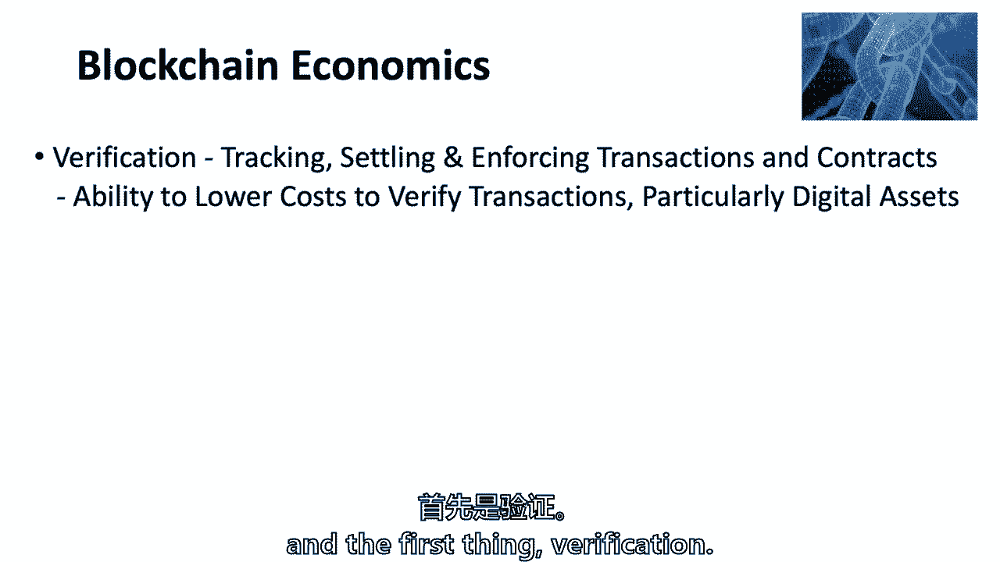
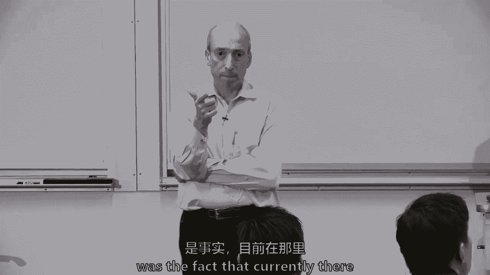
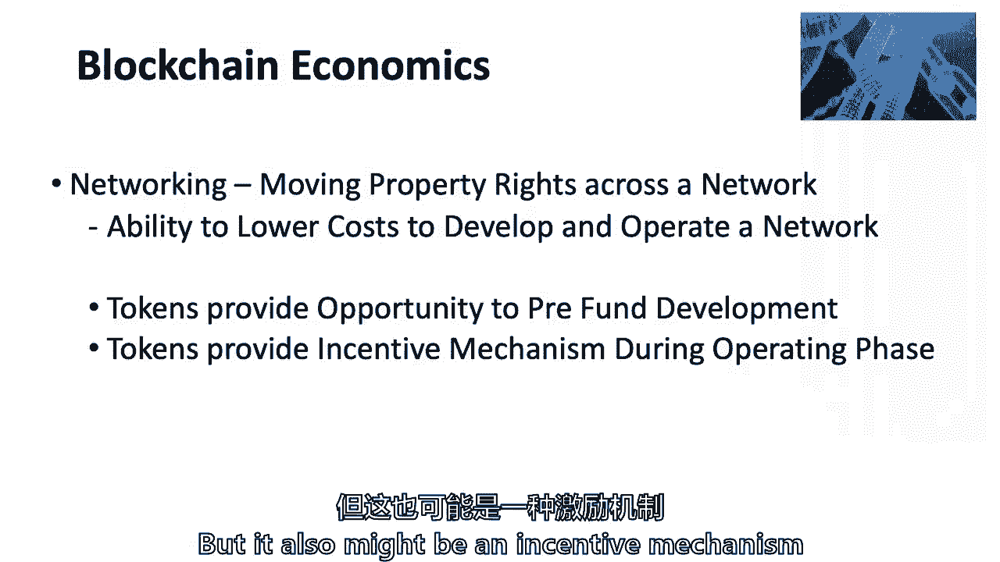
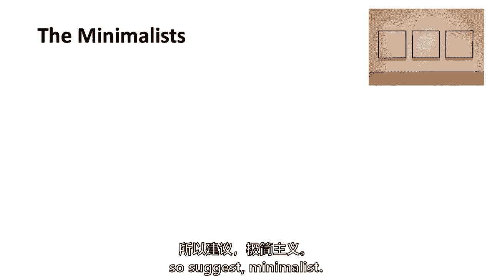
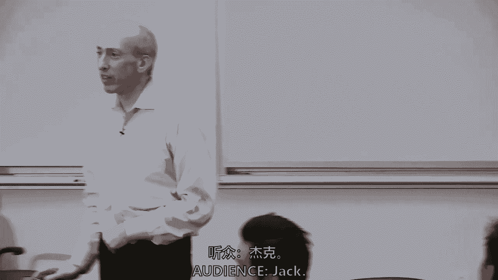
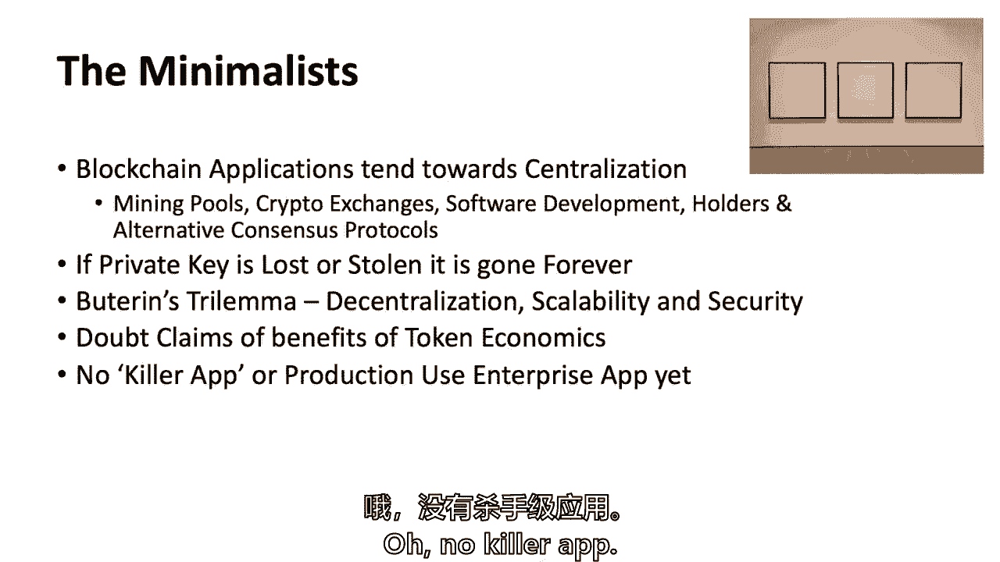
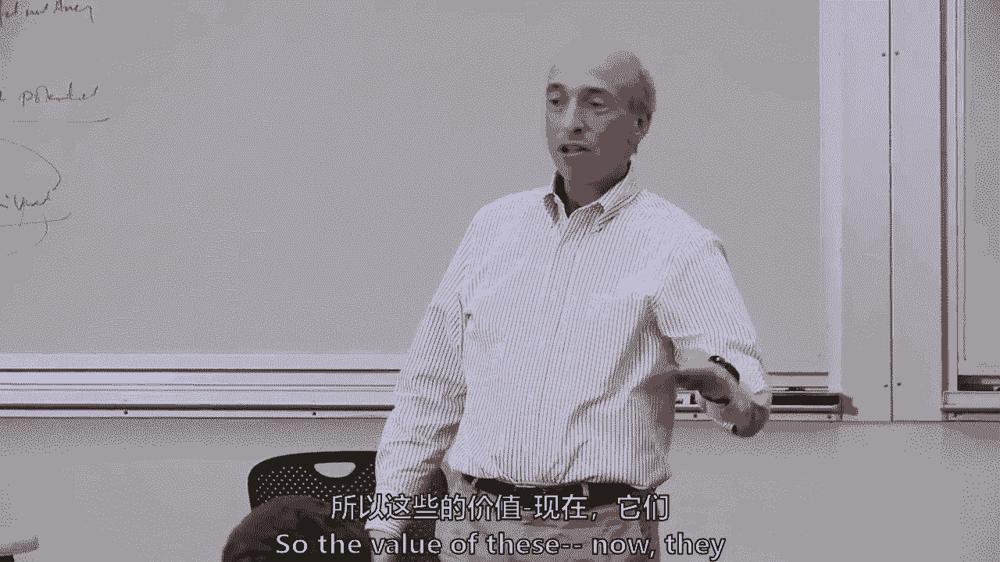
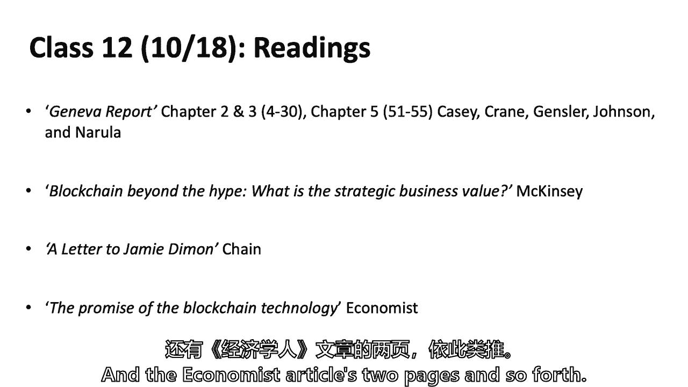
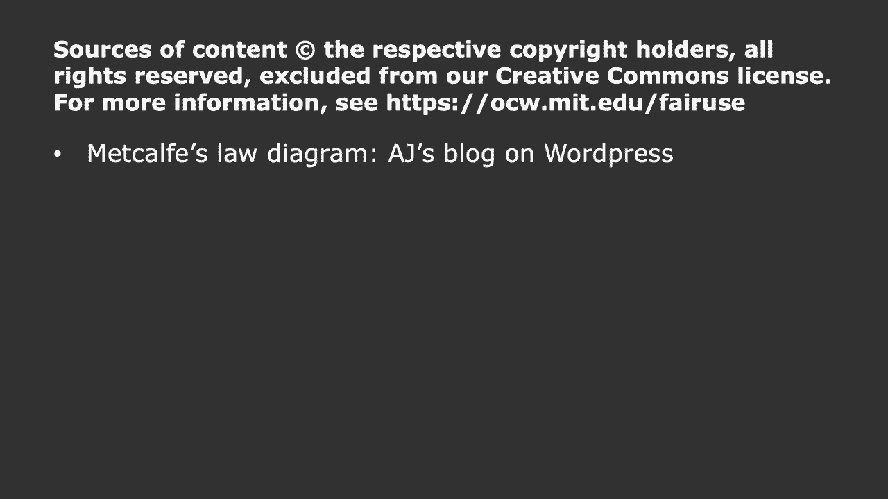
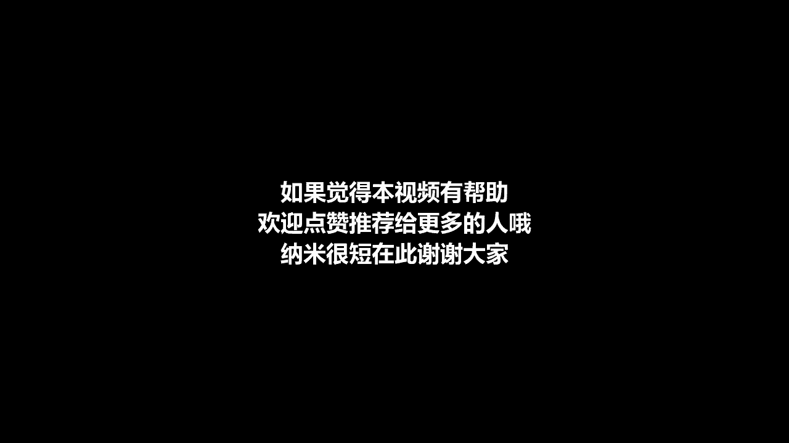

# 【麻省理工大学公开课】区块链与货币 - P11：11、区块链经济学 - 闰土聊Web3 - BV1sL411N7Mm

欢迎回来，人们可以坐在后面的桌子上或者抢劫，你想上来，所以我说你上课的时候特别注意你自己，我是他的孪生兄弟，每个人都可以是我的孪生兄弟罗布，罗伯不是你的演讲嘉宾，他是我的客人，但他稍后会说话。

当我们谈论新的时候，拉比尼和拉宾对区块链经济学的思考，罗布在T Price工作了两年五年，两年四年，在老华尔街和所罗门兄弟之前20年，他是华尔街的所罗门兄弟，他创办了自己的对冲基金，但没有成功。

所以他关闭了对冲基金，他为特价品公司工作了二十年。他经营着一家全球股票基金，但在那之前，他做电信和投资，但我会问，罗布作为资产经理，他在某个时间点管理着200亿美元的资金，并在这方面取得了成功。

他对这种加密货币的想法，加密相位，他没有，与班上的每个人相反，但我知道你们都读过，也许，但那将是，当我们谈论区块链极简主义时，我们现在进入第二幕，我们已经谈了很多关于区块链的经济学。

但现在我们要利用今天和星期四，现在真的要深入一点经济学，当然，我们谈论的是整个学期的经济学，但这将只是，你知道我们会继续的，因为我在这段旅程中的目标，我们都离地面更近了一点，将炒作与现实分开的真相。

我试着把读数放进去，如果你，如果你选择了，即使是略读，看看一些区块链极简主义，就像你有的努里尔·鲁比尼的作品，没有比拉宾的作品更简约的了，但我认为知道保罗·克鲁格曼或。

诺拉·鲁比尼或乔·斯蒂格利茨或其他人都在这项技术上，我不同意他们的看法，但我不在另一边，我不是提姆·德雷珀的人，昨天我有幸出现在纽约市的一个会议上，保真推出的地方，他们的新区块链，所以我是设置扬声器。

我猜，但是另一个演讲者是迈克，诺沃格拉茨，他创办了一家名为Galaxy的公司，我会把迈克，和其他一些更接近最大化者，还是他警告我，他不是十分，他大概是八分，但我试着把这些阅读和这门课。

这样你就可以带着批判性推理技能离开这门课，经济学到底是什么，所以今天让我们一起踏上这段旅程，我还说，想想我们今天谈论的一些事情，根据你的最终项目，因为你会在金融领域寻找一些痛点。

或者和我在金融之外进行一点特别的讨论，并说出什么是用例，所有这些疯狂的区块链和东西可以聚集在一起，并努力工作，所以嗯所以概述，当然一如既往，我会谈谈我们的读数，我看看我们能不能用苏格拉底的方法。

所以我们要谈谈区块链经济学，关于区块链与互联网的一点，那是乔伊，伊藤的文章那种设置，乔伊几年前写道，所以他现在可能会写得有点不同，但我仍然认为落后真的很相关，我们如何看待区块链与互联网。

我称他们为极简主义者，不管是拉比尼、克鲁格曼还是斯蒂格利茨，但是或者詹斯勒，你会听到那个Gensler后面的一个人的消息，他比这个詹斯勒晚了三分钟，他可能比我先来，实际上是因为罗布你住在博茨瓦纳。

难道他们不相信第二次分娩是第一次怀孕吗，但我们是一样的，所以也许它没有那样的方式和一些成本，我很抱歉，我是说，你知道的，哦是的，我们得做双胞胎的事，你知道，有多少，这个班有多少对双胞胎。

你说你的秘鲁同卵双胞胎，我有一个和它一模一样的，我有一个医生，1。他从头到尾都在听，顺便说一句，他们确实说第二个是，第二次送货有点，年龄越大，与生俱来的权利也是如此，我是第一个，所以我倾向于不同意。

罗布在秘鲁有与生俱来的权利，我们将讨论成本和权衡，我们过去做过一点这样的事情，然后我们把它包起来，少一点幻灯片，我把这个缩小了，这样我们就可以多讨论了，但是研究质疑，如何去中心化区块链应用。

影响验证成本和联网成本，有人想深入研究吗，或者我们想在我做这个的时候潜入其中，我会读到区块链是如何变化的，核查和联网，这是克里斯蒂安·卡塔里尼报纸上的两件事，我知道你不喜欢，我签了一份30多页的文件。

但是站在最前沿的基督徒，他在斯隆学院和一个，他不在这儿，他这学期算是休假，但是克里斯蒂安的报纸，他站在区块链经济学的前沿，你不能上好区块链课程，不读卡塔里尼的报纸，这不仅仅是因为他是个斯隆。

我想他有点明白了，然后与互联网的比较，所以它是这两个大项目，我知道有人说读数太多了，只需要五个，当然，鲁宾的只是垂手可得的果实，因为他上周四给了，它是一个，有多少人读了鲁比尼的文章，不是必需的。

但大约三分之一或一半，你同意，就像一记耳光，你觉得呢，艾琳，太搞笑了，我喜欢它，你喜欢它，你不能真正完成它，但那太搞笑了，你们中有多少人读了鲁比尼的文章，发现你同意他说的大部分话，好的，这是一个二三。

四五，哦，我瘦了六个，所有的权利，我不知道，每次我读到一个，我就像，是啊，是啊，他们完全知道自己在说什么，我在船上，我对现在所有的极简主义者都有同样的感觉，所以你是，你现在认同极简主义者了。

好的好的星期四，那种去，它不是一个最大化者，但它有点，另一个，然后是可选的位，让我们从区块链经济学开始，第一件事就是验证。

那么你是什么，费用是多少，任何真正潜入或潜入更长的卡塔里尼作品的人，核查费用，这些都是我不只是展示的东西，因为有人写了这件事，我想我认为基督徒对此是对的，我认为区块链并不总是，但真的可以降低验证的成本。

但是你有，你，你刚才说的，呃，有效地验证和审计以其成本发生的事务，也是，以及降低审计交易的成本，你们还谈了什么，凯利，这种效率的一部分是目前。

有许多第三方参与者参与其中，比如将输入和输出分开，对呀，所以你可能会有更少的人在链条上，演员少，他们还提到了隐私成本，还有审查权，好的，所以让我让我你提高到隐私和审查，你有没有，你想说什么，或者其他人。

隐私是怎么回事，我是说，因为这些都是区块链能做的非常关键的事情，所以有隐私权，地址是假名的，就像地址上没有名字一样，这样你就可以在别人不知道你是谁的情况下与你互动，但这有什么关系。

那么为什么人们会花更多的钱来做到这一点呢，是的嗯，这样就有了一种理解，找到权利是一项基本权利，你不想让全世界都知道你这么做，有些是关于权利和价值观的，詹姆斯，关键因素是黑客攻击，这个明确的例子。

在那里人们的信息是如此容易获得，和第三方你必须，我完全同意，但现在发生的大商业事情是什么，在大数据中，安葬在这里可以从他们收集我们的信息中获利，我是说占主导地位的，对不起，什么是转售用户数据以及厨房。

那又怎样，肖恩和埃里克说，当今科技界占主导地位的收入模式，不管是像这样的大科技，脸书和谷歌等等，或者任何技术，主导收入模式，不仅仅是给我一些你的数据，我来分析一下，要么做广告反对它。

或者现在用机器学习和人工智能来分析它，并真正向你推销其他产品，也许我们都这么做，我们生活在这个，我们放弃我们的数据，有些人比其他人更多，有些不是这样，但这是卡塔里尼比赛中的一大块区块链，嗯。

也许你可以得到更多的隐私，如果你愿意，它可能是收入的一部分，审查制度怎么样，审查制度有什么意义，所以当你和中央当局打交道时，商业银行，那是一种审查制度，这是分配东西的一种形式，但它可以简单到。

是否卖给你电影院的票，你知道的，在某种意义上，这种事并不经常发生在我们身上，但是，来自验证的任何其他东西，所以让我们看看我们是怎么做到的，这就是我收回这六点的方式，直接成本，可能会有成本，权衡。

区块链可以有更低的验证成本，那并不总是，但是，关于分类帐，我们在这门课上谈了很多，记录产权的分类账，所以你可以让一家银行记录产权，记录产权的另一家银行，可能是股票的所有权，可能是现金。

所以它可以降低很多直接成本，我会说在许可区块链空间，许多大银行都在关注第一点，我们只是降低了后台的直接成本，2。简单明了地在那儿停下来，我们的和解成本少得多，隐私和数据泄露成本，我称之为双重隐私。

听起来你知道，雨果，我想要我的个人隐私，或者我只是知道Facebook在拿走我的数据，我称之为数据泄漏，你知道我不是很担心，但是上帝，它是它是某样东西，所以我很好奇，这里有用例吗。

因为我真的觉得看到一个像，我可以看到隐私，从某种意义上说，你可以把硬币从匿名消费者转移到匿名接受者，你甚至可以隐藏金额，这对生意很有用，因为生意是另一个生意，知道他们在做什么，还有什么其他用例，哦。

我想这是个很好的问题，每个人都有链接的答案，因为我有，但我就是这么做的，哦，就像一个业务用例，用户可能不会放弃他们的数据和隐私，好的，我要用优步，哦，你，是啊，是啊，我想我能想到的一个例子是对冲基金。

在对冲基金中，正如我在这个行业提到的，你不会想知道的，因为，比如说，很多对冲基金，他们躲在经纪人后面，他们对经纪人有一定的了解，所以他们不必审查收购，他们制定的法案，他们也试图在5%的门槛下做你的立场。

所以这样因为任何动作，他们的行动，也许可以推动某只股票的市场，好的，所以作为资产管理公司有一个商业情况，我可能不想让别人知道什么交易，我在做我所采取的立场，我本想利用个人情况。

你可以想象优步是在区块链上创建的，它不在区块链上，但我是说你可以想象得到，和司机，就像三个社区，3。谁拥有这辆车，谁开车，谁需要汽车在区块链中聚集在一起，也许我喜欢区块链的部分原因，优步，也许我是。

我可能有几个女朋友，我不希望任何人跟踪，我在拜访不同的女朋友，这就是你所说的隐私，但很完美，我是单身，我单身，但我只是说，你知道这是完全合法的事情，确实，我想分享这些数据，我们都共享大量的数据。

如果我们使用信用卡，尤其是在当今机器学习的世界里，你可以根据某人的消费模式来缩小范围，让我们举个例子，说我有某种宗教信仰或某种我支持gonor，抗淋病，任何方向，我可能会让你有足够的消费模式。

你可以拼凑起来，那可能是你，那可能是你的宗教信仰，那可能是你的性取向，那可能是那个国家，你来自少数民族，如果你有足够的消费模式，再加上机器学习，和AI So So用例，人们真的在谈论。

也许我可以给你一点隐私，保留属性，它不会是主要的用例，但有些东西，今天的课是关于经济学的，这是合法的经济行为，这里有一只手吗，对呀，审查风险，基本上就是，哦，对不起，我能问一个相关的问题吗。

所以在隐私方面，文章还提到了，还有那些呃，像以前这样的金融机构，他们可以把他们的数据，呃，洞察力，只可能揭示这一点来调节，如果我们用区块链，他们需要在公共场合做所有这些事情，这有点像。

另一个与保密正好相反，你说过，我是说就像，说一件事它让你匿名，所以这是对隐私的保护，另一方的辩论，你需要，否则可能只是一些，某些机构，你让我想起了你的名字，珍妮弗，珍妮弗，珍妮弗是对的，有一种紧张。

像比特币这样的传统区块链两者都有，他们掩盖了很多数据，因为假名，但它并没有真正完全掩盖，因为你可以使用法医和跟踪东西，并验证一个无许可的区块链，都是公开的，所以我同意你，它是双向的，嗯，有技术方法。

是否通过零知识，证明和其他有更多隐私的方法，但我是说有一个合理的经济原因，保罗·克鲁格曼在他的专栏文章中的最后一句话是，告诉我一个用例，告诉我，记得克鲁格曼说过，他是诺贝尔奖得主，保罗才华横溢。

他在那里为《纽约时报》写了雄辩的文章，在詹妮弗身上，你说的对，它还不完美，但是你可以给一个系统一些隐私属性，我确实想澄清，我只有一个女朋友，1。她宗纽约，我只想确定有一个关于优步的假设，哈哈哈哈哈哈哈。

意识到我们在拍电影，别人都以为是我，给你，给你，结算，我们已经讨论过了，我想如果你对定居点没有一些经济学知识，你不需要一些不可改变的权利运动记录，特别是财产权，您还不如使用传统数据库。

我不能肯定我说的是否完全正确，可能会有一些允许的区块链值得，但我有点，如果你不移动一些，重要的事情，和解意味着最终的结果，我们在六八节课前简短地谈到了苏格兰的那场古老的诉讼，克劳福德·克劳福德的案子。

如果詹姆斯从我这里偷了一块钱，然后把美元交给安德鲁，我不能从安德鲁那里拿回来，我没有合法权利从安德鲁那里得到我的美元，我可能对詹姆斯有合法权利，但这是最后的决定，有最终的解决办法，这是安德鲁的，所以说。

有些事情你只想要终结，我想说的一件事是很多商人，我们不喜欢支付他们销售额的2。5%到3%，到支付系统，签证急救等，其中很多都去了银行，不签证和第一数据，其中很多也是为了所谓的退款。

所以我是希拉里竞选团队的首席财务官，我们输了真的很糟糕因为很多原因，除了关于区块链的讨论，因为我们不得不结束一场运动，我们不得不处理我称之为电脑和冰箱墓地的问题。

你知道我们在总部工作的数百人离开了设备他们离开了，但60天来我不得不处理的另一件事是退款，你知道捐赠者可以去找Visa说不，我并不真的相信那笔捐款，你知道不管是五十元，你知道低美元或两千七百美元。

你知道，所以我有一个私人的，你知道吗，感觉这整个收费的事情，现在对政治竞选的捐款和你购买的服务是不同的，但这是商人经常处理的事情，雨果，商人有责任吗，然后支付签证，给客户退款，还是签证。

我们做的第一件事，本质上是商人，而且是的，我们必须支付竞选费用，正如每一次失败的竞选中都会发生的那样，它已经没有什么可做的了，把他们安排好，那是个问题，那是个真正的问题，支付处理公司，那样的话。

这是有案可查的事，我们用了一家叫Stripe的公司，而不是急救，等等，我是说，这个世界的条纹正在冒一些对手的风险，现在大多数商家都没有关门，我们正在关闭，你知道吗，但是是的，如此有效，在商人身上。

信任是有代价的，但它相信代码，计算机代码，你信任比特币核心开发者，可以说和协商一致议定书，所以当有人说它是不可信的，它不是真正的不可信，你还是要相信代码，你必须信任共识协议而不是对中央中介的信任。

所以这是一种是的权衡，阿里，你也相信比特币的网络，只是一个提醒，是呀，你相信比特币的网络是一个很好的观点，我想总的来说，我们都信任网络，即使我们也在和花旗银行打交道，但你是对的。

就在区块链解决方案的中心，你信任网络的所有通信，但即使在中央中介，对网络有一些信任，是啊，是啊，但不是为了正确，所以在比特币中，如果网络，如果你从不搞砸，但是在权限算法中，您不能加倍，会把。

有不同的问题，我同意你可以，你我是说，我会更进一步，说你也信任，ip，不仅仅是城市，但你信任中间人，让你进入City Ven的网站，那倒是真的，把你的假网站放在中间。

是的是的所以在整个过程中都有一层信任是的，我开车，不是当我在波士顿，当我开车的时候，我也相信化油器，我真的不知道化油器是怎么工作的，所以有各种各样的信任层，但我想说区块链的核心交易是。

你不再相信中间的中心了，你信任代码和共识，嗯，然后是经济租金，我们已经谈过了，我是说，这不是支付系统花费0。5%的原因，占全球GDP的百分之一，但其中一部分是经济租金，和金融部门的合作，u。

这是一万亿美元，也就是我们经济的百分之七点五，这里有相当程度的经济租金，所以这些是六七件事，不仅如此，我认为从克里斯蒂安·卡纳尔的论文中值得一看，但也是给保罗·克鲁格曼的，你会说一些合理的事情。

我们也许可以降低验证的成本，卡塔里尼的第二大块，他谈到了网络，现在这是我的话，不是他的，但基本上是价值网络，移动产权，但又一次，因为我认为区块链是关于产权的，我是说我们可以用不同的方式说话。

但是移动一些产权或计算机代码，这将触发智能合约，这将被安装并转移一些产权，区块链是否有能力降低成本，发展或经营网络，基本上用卡塔里尼的话来说，启动网络，或者克服集体行动的挑战集体行动的挑战者总是在工作。

当你试图创业时，一些企业，很难克服集体行动的问题，我是说，我不知道你们中有人会读到联邦快递的商业案例，但当我第一次去商学院的时候，他们在联邦快递上还有一个案子，因为这位先生，我想是弗雷德·史密斯。

他开始了这个不可思议的想法，你们怎么做隔夜送货，第一天，你如何确保你有足够的飞机飞行，他箱子里所有去田纳西州孟菲斯的包裹，然后飞翔，包裹在其他没有客户的地方，你没有员工。

你在一个公司里有所有这些集体行动问题，优步，不得不跳过去建立一个网络脸书，建立了一个网络，你知道的，关于如何建立网络有各种各样的研究，以及你如何走向一个网络，并获得一个网络的大发薪日。

区块链可以是其中的一部分，我不是说这是唯一的办法，但这是一回事，克里斯蒂安说了两件事，一个信物，是的，象征性经济学可能与许多事情没有太大关系，但可乐可能会激励和帮助资助网络，所以这是一种新的众筹形式。

和，从经济上讲，众筹已经有几个世纪了，但我的意思是这是一种新的众筹形式，在Kickstarter和其他人所做的基础上，基本上有一个感兴趣的社区在一个项目发挥作用之前为其预筹资金，现在。

我们进入了各种各样的公共政策问题，以及它是否是一种证券，但原始经济学是，这是一种形式，这是一种新的众筹形式，在剧院演出之前，但它也可能是运营阶段的激励机制。

这是一个我不太确定的地方，我不得不承认，我可能在一到十的范围内，有点二三分，我不希望我的偏见影响到你们，虽然，因为有些人认为真的有很多象征性的经济学来帮助运作，我认为第一个是一个很好的方式来聚集资金。

我想这已经表现出来了，我想这已经被证明了，第二个我不太确定，我们需要代币和代币经济学来运行一个平台吗，但我们不要忘记，有很多游戏网站有效地拥有代币，它们可能被称为锤子和剑，你们中有多少人是游戏玩家。

你不想承认，可能有六七个，那么你要花很多钱买什么，现在它是护剑还是护锤，实际上我要去动视暴雪工作，但是呃，你必须有一个大的是皮肤，是皮，是啊，是啊，两位数好的，是啊，是啊，所以有一个社会社区。

游戏是有奖励制度的，这是非常真实的，已经被深入研究过了，这是一种奖励，一种亲和力，一种身份，我是说你们中的一些人可能有亲和力或同一性点，或航空里程，有人收集航空里程吗？好的，你知道吗。

你这么做只是为了你能得到的旅行吗，还是加分的时候觉得有点凉，你不必承认汤姆，我什么都要，我可以很酷对吧，你知道，你还记得吗，乔治·克鲁尼电影《在空中》，有多少人在空中看到，你还记得后来的一个场景吗。

当他最终获胜时，他就像一千万英里，所以有一部分人性，和在最后一点上最大化的人，说这是激励系统的一部分，就像那一幕在空中，我倾向于极简主义广告，但我必须尊重它，在这一点上我应该更中立一些，梅特卡夫定律。

有人知道吗，除了精瘦的野蛮人之外的梅特卡夫定律，是啊，是啊，是啊，是啊，我是野蛮人，你告诉过班上，你有博士学位吗，某处或某事，否，不不不不不，你知道就像你知道，这是一个流传较慢的词，它谈到了网络的价值。

它与，右边的数字，因此，值随着节点数的增加而增加是一个重要的概念，如果我只能叫阿尔法，阿尔法可以叫我，2。他觉得打给我没什么大不了的，但这就是问题所在，但是如果阿尔法现在可以叫五个人。

他不认为这只是价值的五倍，是五的平方，节点数，现在，进一步的研究表明，那真的不管用，一旦你可能超过100或150个节点，阿尔法真的不在乎一旦他能打电话给他的前150个人，你知道的，它真的会继续上涨吗。

log n，但不管实际价值是什么，概念是它是非线性的，这也是为什么，在他们交易的地方交易，为什么它们价值五千亿到一万亿美元，罗布会告诉我们为什么，你知道在市场上，但其中一部分是梅特卡夫定律。

它是非线性的，有二十亿，因此，围绕梅特卡夫定律的象征性经济学的一部分，你会听到人们这样说，所以我想我会确保你有它所以回到乔伊，伊托·汤姆跳到这个，当我在读报纸的时候，我一直在想交易成本和散列的成本。

尤其是比特币和工作证明系统，那些事情我仍然无法把我的大脑缠绕在一起，比特币变得如此分散的想法，但交易费用足够小，那是可能的，你担心的是，在比特币的情况下，功的证明、电和散列功能只是通过设计。

在很长一段时间内都是昂贵的，对呀，我是说我们回想起去年冬天，交易太多的地方，比特币的区块链和交易费用，对呀，所以所以其中一个大的，我要把这一点保持一会儿，但你会看到一件大事，极简主义者。

我称它们为极简主义者，会说它本质上是设计的。

区块链注定是复杂的，这意味着有一些延迟，因为它没有中央权力，有一个中央当局的权衡是一些复杂的，你称之为散列，工作证明，另一个网络会说，嗯，你得，你必须在网络上传播。

你在比特币的情况下有一些延迟每十分钟添加一次区块，不管是什么复杂性和设计特性，都没有一个中央权威，就其本质而言，极简主义者说，永远不会以任何可扩展的方式起飞，尽管我尊重那个论点的每一个部分。

我想我们可以采取其他协商一致的方式。第二，它不必在每个用例中都起飞，问题是，在某些用例中，是否会提供中央中介的替代方案，你想一想，但如果你说的是比特币，它现在是如何设计的。

我认为比特币很难获得非常大的可扩展解决方案，对呀，比如用比特币买杯咖啡和我的维萨卡，当所需的交易成本可能太高，现在，那可能是真的，但我们将在11月15日举行听证会，在那里我们不仅有客人，但是特邀演讲者。

当杰夫和凯利，杰夫·斯普雷彻和凯利·拉夫勒要来了，杰夫是洲际交易所的首席执行官，我希望你能坚持上课，或者即使你不坚持上课，你来了，因为杰夫和凯利·凯利是他们新创业公司的首席执行官，背靠，把你的问题留到。

杰夫和凯利杰夫是美国最伟大的企业家之一，你是嗯，伊藤在报告中提出的问题是比特币，下一层，我们去了吗，你知道互联网的所有这些协议，这只是已知的四大，还有几十种其他协议，子协议等等，但比特币是下一个协议吗。

你们都从乔伊身上拿走了什么，一次又一次地工作，那是大约三年前，但如果乔伊今天在这里，他仍然，这是他的建筑，他他开始，他经营媒体实验室，他开始，两三岁时在东京的浴室里成为第一个互联网服务提供商，他经历过。

他的作品有什么想法吗，我也冷叫，阿基拉，你读了，是啊，是啊，对我来说有趣的是电子邮件，这是权利的杀手级应用程序，比特币可能是区块链的第一个杀手级应用，是啊，是啊，那么你觉得呢。

你同意伊藤有争议吗方法的一部分是比特币，因为医生在，所以区块链与互联网，有些想法两者都是开放协议，我是说他们的协议有点不同，但你知道，大致适用于这一级别，两者都是开放协议，两个围绕分布式网络传输数据包。

现在，在区块链的情况下，或者比特币，这些数据包是表示某种产权的数据包，这些产权后来被称为值，还记得区块链是从什么时候开始的吗，比特币开始的时候，一文不值，这是一个想法，但突然间它值一分钱了，可以这么说。

当那两个披萨送到的时候，五月二千二千零一零年，任何人都花了一年半的时间来处理，两个披萨一万比特币，它开始有一些价值，但一开始只是一个电子代码，财产权，而互联网是内容，两者都有基于协议级别的应用程序。

所以Facebook实际上是一个协议级别上的应用程序，在协议级别之上还有许多其他应用程序，我们研究了智能合约，所以你知道你对这个的思考，如果你在投资，或者如果你在管理周围，这是有人在协议层面上向你推销。

像以太坊，就像比特币一样，建立在其他东西之上的新协议级别，或者在它之上构建的应用程序中，通常通过智能合约，并不总是第一层就像比特币和以太，第二层就像闪电网络，也许应该有一些互操作的东西。

他想到比特币的原因之一是一个应用程序，我不用那个词汇，没有固定的词汇，你所强调的，没有固定的词汇，像这样，做词汇测试会是一门很棒的课，因为为了对学生公平起见，没有固定的词汇。

甚至在区块链或许可系统这个词上，区块链与否，纯粹主义者会说不，我会说好，是呀，是区块链，我可能没那么纯洁，现在是这样吗，罗布不会回答的，两者都被认为是开放的网络发展，但我会在这两个方面都竞争。

和乔伊一起写一群人，我真的可以做很多集中的，我说的是互联网协议，而不是上面的应用程序，当然还有比特币核心开发者，或者以太坊，如果维塔利克，布特兰打喷嚏，3。大家都想知道他是怎么打喷嚏的。

所以有很多围绕开发的集中，但它是开放的，在GitHub上，它是开源的，但它是高度集中的，在这两种情况下都有互操作性，这又回到了乔伊的观点，比特币不能与以太互操作，它不能与EOS互操作，等等，等等。

他们都在自己的空间里，他们不是终极基层，所以我想到了，我可能做错了，这个词几乎就像有一个私人内部网的那一年，这不是真正的互联网，内部网这个词不是指网络之间的交流，阿兰会在这里纠正我的话。

比特币与以太坊互操作意味着什么，所以为了所有的意图和目的，现在，你可以做这些原子交叉链交换，在那里你可以交换，比特币的以太坊，所以这本身就很神奇，你还想要什么，所以艾琳在说哇哦，哇喔，等一下，等一下。

慢下来，你可以从一个分类账系统中转移一些有价值的东西，比特币账本系统，到以太坊分类账系统，通过一种叫做原子交换的东西，我们说过的，它是层的一种形式，也许我不想要更多，也许这就解决了这个问题。

但还是有一个问题，比特币代码脚本代码，不同于以太坊脚本代码，你可能会这么说，谁在乎，但它们是独立的网络，你必须有这种原子交换才能在比特币和以太之间跳跃，你可能必须有一个不同的协议才能跳，从以太到EOS。

但是是的，但是他们解决了不同的问题，所以说，这就是比特币的脚本不同的原因，比EVM和以太坊，比如说，所以从本质上来说，它们必须是不同的，我以前对这个班说过这句话，我认为很多互操作性挑战会。

我们会越过他们的，但我们真的处于不同的阶段，二十世纪九十年代以前的互联网，万维网在91年或92年，它仍然像更多的私人网络，感觉我们离互联网的那个阶段还很近，指出好，也许我们离万维网更近了。

因为解决方案是原子交换和跳跃，对不起，我要去，我要跳进去罗布，大声说出来，因为我听不见，对不起，如果你听不到我，但它们就像日元的欧元和美元，你还是要担心货币汇率，不管你们这些技术人员在这里做什么。

对不起可以说，哦，但我可以在睡梦中做到这一点，是啊，是啊，但这对我有什么价值，因为这个价格在上涨，那个价格在下降，当你得到货币兑换和价值问题的时候，不是天衣无缝的，好的，只是不是天衣无缝。

技术上可能是无缝的，但这就是启动以太坊的全部意义，启动比特币，你会有两种不同的货币，所以下定决心，就像罗布·罗巴斯特一样，辩论，没有对错之分，但是罗布在提高，有摩擦吗，如果有价值储存，发生了什么。

相对于这种其他货币，另一个，所以只是为了澄清，我不明白人们的意思，当他们说互操作性时，比如，我真的不知道他们是什么意思，我经常听到这个，我不知道他们是什么意思，他们想要什么，这就是我想说的，好的。

我的意思是，我应该明白他们的意思，因为我是个技术人员，右右，但是你，你还没拿到博士学位，所有的权利，所有的权利，金钱方面的互操作性，这就是我要说的，你知道，技术上互操作可能没问题。

但钱的方面是他们有一点，一个值两个，一个值三个吗，所以我所说的互操作性是什么意思，你的摩擦力最低，人们甚至可以说无缝地在这个空间中的各种分类账上移动，我是说互操作在其他地方可能意味着不同的事情，但就像。

如果我是一家金融公司我建立了一个区块链系统，它能与我的遗留数据库对话并移动信息、数据和价值吗，对区块链来说，这不会是零摩擦的，会有一些摩擦力移动东西，从遗留系统到这个系统，如果又是区块链到区块链。

我想到的是，你能用最低的摩擦成本，成本是否，或者罗布在说什么，比如货币风险成本，或者只是如何连接API或原子交换，摩擦力最小，因此，从用户界面来看，它是无缝的，如果我是机构用户，我可以跳吗，跳过。

跨越这些系统，让我继续前进，但那是我的外行定义，嗯，在区块链，尤其是比特币，你有矿工，但有激励措施，即使在你有的互联网上，乔伊谈到的注册和注册，但你有其他激励措施，总得有人有动力让这东西活着。

最后我想谈谈政府，有点来自政府，U，s，和一个叫DARPA的东西，在二十世纪六十年代末，有点，最终在20世纪90年代对互联网采取了轻触式的方法，但互联网并不是诞生于自由主义者，比特币和智史，中本。

纸都是来自密码朋克，自由主义精神与文化，所以文化背景有点不同，这并不意味着互联网爱政府，它只是有一点不同的背景，亚历克西斯·罗塞塔，或者你只是在想，我应该说还有一点，重大投资。

互联网需要20到25年的时间，扔了很多钱，大量的钱涌入互联网，到90年代中后期亚马逊，eBay和其他一些我想是在1995年开始的，网景和正在发生的一切，但是到了98万9千2百万你有了巨大的资金雪崩。

进入区块链的资金雪崩没有那么大，但它来得更早，研究实验室安静地发展了15到20年，在雪崩般的资金来到互联网之前，在这里我们有更快的速度，这些就像我对一些差异的感觉，用它，所以现在让我们来谈谈极简主义者。

他们很有趣，这些是角落里的画，有点暗示极简主义。

这是我想在汤姆之前谈论过的一个，那么极简主义者还说了什么，我要吃10到15样东西，谁是极简主义者，艾琳是个极简主义者，还有谁，这种同意拉比尼，现在，任何人好吧，所以我有，你还来上课，这很好，这很好。

我不知道极简风格的帽子里还有什么，准备好，因为你会给出你的观点，所以类是一个教程体是另一个教程体，因为班级不是，所以说，你是说这不是一个很好的价值储存，所有的权利，不是很好的价值储存。

让我们只是种滚动汤姆，我不知道这是不是一样的，但它没有内在价值，它没有内在价值，我来开枪，我想那真的是，让我想起你的名字，千斤顶千斤顶。

相似的一点是它是一个领导者，班上不只一个千斤顶，杰克，它并不是真正分散的，所以有一些统计数据，百分之九十九的交易都是通过集中交易所进行的，对，所以我通常在谈话中问，昨天有多少人拥有比特币。

我在纽约参加一个非常高端的会议，一百五十到两百，我称之为精心策划的邀请名单，忠诚正在推出，这个重大的宣布，所以房间里的人有点订婚了，和迈克·诺沃格拉茨，他个人在博彩上赚了5亿美元，关于以太和比特币。

与其说是比特币，不如说是乙醚，但在这两个人身上，我问有多少人在比特币上，三分之二的手交换了她自己的，比特币，三分之二的手举起来，就像你想的那样，在那样的房间里，有多少人直接在区块链上拥有它。

意思是他们下载了软件，他们有我上去的大约一百只手的节点，拥有它的人，或者交易了三只手在那个相当黑暗和复杂的高接触区，所以它相当集中，因为加密交换，其他，百分之五十一的问题。

像一种未成年人几乎是法律上的盟友，所以它受到百分之五的多数的攻击，正如拉比尼指出的，对于小硬币来说，这可能更正确，如果你开始一个硬币，只有一百万美元的价值，甚至五千万的价值，只有十几个或一百个节点。

比比特币这样的东西更容易压倒它，它生活在野外，人们可以说在沼泽里呆了十年，而是一个有几个可能是个位数的数十亿可以胡闹的国家行为者，甚至可以对比特币进行5-1攻击，你知道的，或者坦率地说，在中国。

我不知道，但是或者俄罗斯政府，有一个大型矿业民意调查，他们，你知道，所以五一攻击，这是一件有趣的事情，其他事情，没有杀手级应用程序，所以很难，没有杀手级应用程序，所以嘿，那儿在哪儿，在那里。

就像里面有很多书一样，很多虫子，里面有虫子，所以还有很多事情要做，所以让我给你看一下名单，然后罗布会告诉我们他的想法，有很多技术挑战，我们已经讨论过了，在早些时候的一次演讲中，又结束了，我一直在争论。

我想在个位数的几年里，不是几个月，而是岁月，我们将通过许多这些可伸缩性的事情，也许我太自大了，对麻省理工学院和其他地方的技术人员的能力持乐观态度，但我想我们会度过很多，我们不一定能通过治理。

仍然有一堆集体行动问题，但我想也许我们已经通过了互操作性，我想那里还有事情要做，嗯，它们缺乏内在价值，说了你没说，有很大的波动性，很多人提出来，这些东西有很大的波动性，那不是技术上的身材。

但这是密码本身的一个特点，我们谈到了有限的收养，保罗克鲁格曼的文章说嘿，他们不被接受纳税，它们不是法定货币，法定货币有优势，因为在过去的三四百年里，世界上几乎每个社会都说，让我们接受他的税收和法定货币。

保罗·克鲁格曼的好观点，他是对的，你不能回避这一点，有多种货币的，经济史与逻辑中的计数器，这是拉宾的观点，但我们真的需要250到100万种不同的货币吗，也许不是，但在另一边，为什么，你叫它什么皮，皮肤。

是啊，是啊，为什么有些人会在游戏网站中间看重皮肤，或者亲和点，所以我不一定会完全丢弃它，就像，我只是觉得这太简单了，不能完全抛弃它，我们已经谈过了，比特币你每年最多可以拥有200万枚比特币，二一四十。

它被放入代码中，我们希望它成为基础货币吗，从技术上讲，这不是货币政策，这是基本的货币政策，只编码，还是我们想要人类，极简主义者也会告诉你区块链倾向于集中化，不管是加密交换，不管是发展，采矿池本身。

持有人，甚至替代共识议定书，所以现在你在想，你要走到门口，走出这个区块链课堂，但了解这些事情很重要，现在好好想想，哪里能有它的位置，没人提起私钥的事，您丢失了私钥，你完蛋了，在大多数分类账系统中。

如果我丢失密码，我们有后门方法来纠正，如果一家银行有时被黑客攻击，有一个后门和防止损失的方法，这是终结的另一面，如果我们真的想要最终解决，这是另一边，布田三难困境，我不会再复习了，我们说过。

然后人们怀疑象征性经济学的说法，我可能有点在那个阵营，哦，没有杀手级应用程序。

骗局和欺诈，所有的权利，抢劫，你觉得怎么样，罗布阅读200亿美元基金，他没有读教学大纲上的任何东西，我连区块链的东西都没读过，在九十年代，我是德州双胞胎，是啊，是啊，在九十年代。

我是一个科技和电信投资者，告诉我的偏见是相关的，因为我看到，你知道的，谷歌并不是第一个上市并进入我们办公室的搜索引擎，它甚至不是前五名，那是第六或第七次，如果我记得搜索引擎。

前五个在谷歌没有货币化的案例，最终解开了谜题，我只是说，我看到了90年代的一切，在科技领域，在科技崩溃中，所有让我感兴趣的是，我不是极简主义者，这对区块链，它没有经济基础，它实际上可能是这样的。

总会有人发现的，这提醒了我，我要给你球的一面，然后我会给你，我的真实是，当我在80年代第一次见面时，实际上贝尔实验室的负责人，如果有人不知道这是一个TS，你知道吗，呃，实验室和他所说的。

我问他这么多年的研究，最大的教训是什么，我可以在我的科技投资中学习，他说，当大的变化发生时，发生的时间总是比你想象的要长，总是长得多，他说，但当它这样做的时候，它发生的速度比你想象的要快得多。

当它最终做到的时候，好的，与所有的技术进化相比，即使是这个和这个也是我担心的，也许我错了，因为我实际上是看跌的，但也许我错了，所以我要给出为什么，我可以你也许我们在第一阶段，所有的炒作都在那里发生。

因为通常你会有兴奋，炒作失望，几年后的用例，广泛的用例实际上发生了，因为现在我真的强烈地感觉到我们正处于第一次兴奋的炒作中，我不知道广泛的用例是否会发生，它可能，但我特别担心比特币的是。

我不只是一个市场人，好的，这就是我的全部，我没多想，我是一个，我是一个，我是个实际的人，不是搞研究的，在市场上就像，好的，比特币出现了，而且还在上涨，因为出租车司机在谈论这件事，每个人都在里面。

他们为什么拥有比特币，他们拥有它是因为更大的完整理论，我要找人给我更高的价钱，好吧，我会错过的，如果我不知道，我必须参与，和所有其他的，然后你看到还有多少其他硬币，如果你把硬币放在网上，或者就像，哦。

我的上帝供应，你知道你最不想要的是互操作性，如果你有互操作性，那么供应是无限的，好的，所以这些的价值现在他们可能仍然有一个惊人的用例。

作为一个实用程序来提供这个，你知道交易的便利性和所有积极的事情，但我要展示的是比特币的价值，如果你知道我不在区块链上有价值，但如果它们都是可互操作的，其实这样也挺好的。

或者医疗系统是否都想出了保存医疗记录的方法，以某种更好的方式使用区块链，哇哦，那不是很好吗？但是我们会把比特冷却作为一个非常有价值的东西吗，我也被提醒，我想比特币对不起，我真的有偏见，这个。

我不希望政府，世界上任何地方的官员都知道一些事情，我想创造一个超越治理的系统，你发现什么了吗，也许在人类历史上，有一些官方的东西，官方部门不会卷土重来，获得公平的份额。

所以我认为区块链可以作为一个很好的实用工具，做很多其他的东西，就像，会有哪些杀手级应用，当杀手级应用出现时，互联网也是如此，猜猜亚马逊是什么杀手级应用，苹果是一个杀手级应用，而苹果就不一样了。

但是脸书等等，哦，顺便说一句，他们都是如此，因为你在说为什么，我说他们是五千亿或一万亿，有一个安装的价值基础，亚马逊的案例，他们可以很好地扰乱100%的全球零售，他们还不到百分之五。

我不知道你是否应该持有亚马逊股票，我不是想这么说，但是好吧，你知道所有的全球广告，你知道谷歌就是这样，你知道的，哇哦，他们是破坏性的，好的，所以比特币可能会成为一些应用程序所依赖的实用工具，那就是。

你知道的，这在十年或十五年内变得足够普遍，我真的认为会发生一些事情，它会让我们惊叹不已，我们甚至没有考虑过的一切，但它处于第二阶段，不是在炒作失望的第一阶段，我不认为我们会失望，失望需要多年的时间。

我就像浴火重生的凤凰，它又升起了，一旦分布式过程都出来了，没有比特币这样的节点，节点，但是用户节点，就像，你猜怎么着，你知道的，这些东西在我们的手机手中分发这些，直到这些都在那里，你不能有脸书。

Facebook首先需要这个，这是一种奇怪的感觉，或者他们首先需要这个的桌面版本，我仍然认为我们在这方面还处于早期阶段，真正的价值就会产生，我告诉你，这是唯一的主要投资，五年的毒液，也许十年或十五年后。

它将是某种东西，因为这个而启用，但不会是第一批人，供应太多，所以我不知道他要说什么，但六十年来一直如此，所以你有一个问题要问，然后我要再做几张幻灯片，肖恩问这个问题，我觉得这真的很有趣。

你提到亚马逊已经晒黑了，嗯和Facebook有一段时间，在去年泡沫的高峰期，人们指的是总可寻址标记的时间，可寻址总数，去吧，呃去市场去市场，你对此有什么看法，你认为那是真的两千英镑吗。

带着一种现实的假设，我猜，但黄金在五千年甚至更长的时间里一直是稀缺资源，没有人明白，我当然不知道，但这是你唯一知道的采矿，所以它有很大的稳定性，如果比特币真的是唯一，但他们说有多少，他们有一百六十人。

你刚才说它们都是可互操作的，所以我不知道货币兑换，所以供应真的很有限，我不知道所以，我不知道，也许你知道一个更好的答案，因为我知道我知道比较是一个真正的挑战，关于估值的一件事，关于加密的价值之一。

我一开始就告诉过你，我只是不打算开一门教你如何投资的课，进入或退出密码，但这里只是一个，并随时提出更多问题，但如果有任何代币的话，我说的不仅仅是比特币，任何令牌都可以是文件共享应用程序。

像FIL硬币有很好的用途，它正在被使用，你得开始跳起来说，令牌的速度是多少，你们中任何一个学过一点宏观经济学的人，你知道钱的速度，就是一张货币翻了多少次，这是一种经济除以货币基础，不管你的尺度是多少。

那么在数字时代，这是一笔货币周转的多少次，它可以翻得更快，如果只是文件存储，我会从詹姆斯那里得到文件存储，然后詹姆斯想，你知道的，从雨果那里得到文件存储，如果有高速，你需要更少的硬币，几乎就像速度越高。

硬币中的价值越小，所以你几乎需要一些人来抓住詹姆斯，想抱着它，因为他认为这是一个很好的价值储存，而不是将其用于文件存储，因为如果你所做的只是把它翻过来，不管是文件，存储或其他任何东西，它降低了价值。

较高的速度，但这有点违背它，所以我不知道，投机的估值模式是混合的，储值，可用性，但速度不要太快，我要说最后一件事，我相信有巨大的价值将被创造出来，但它是在能够通过它来完成的事情上，它不在。

我不知道你是叫它们硬币还是代币什么的，他们是推动者，如果你有一个非常昂贵的，别人会有更便宜的，这将使所有这些巨大的潜力，有人会，会有很大的价值，我只想掩盖它，你可以熬夜罗布，我只想。

所以我们已经谈过这个了，但我只想提醒你这一点，当我们都在一起思考经济学的时候，你可以再次改变斜坡，权力下放的成本可能会下降到橙色的一个，但如你所知，我有点接近许可系统，比无许可系统，和传统数据库方面。

我们以前做过，但公共区块链与传统数据库的对比，我不是每一个字都是认真的，你需要记住什么的，但如果你不需要账本，如果你根本不需要一些东西来改变财产权，我想你可能是在传统数据库方面，你可以移到中间。

如果你认为20世纪90年代初的一项发明只附加数据库，区块链洒，上面有一大堆密码学，哈希函数和数字签名，那是你的许可，数据库系统，所以它可以给你最终的解决，它能给你很多，但这是俱乐部的交易。

在大型商业银行中或窃听一些系统，他们在那里做了很多，我想去右手边，我们需要把这些表演抛诸脑后，在一些个位数的年份，使表演跟上速度，但即使在那三五年六年之后，当我们让表演跟上速度。

我想你得说两件事中的一件，一个是这是一个较低的验证成本，它可能是，我对你的最后项目说这句话，如果你发现一个经济租金高的痛点，这可能是一个较低的成本，如果你发现隐私的痛点，围绕审查制度的痛点。

就像这取决于痛点是什么，或者如果你只是一个还没有集中的东西，我仍然相信，如果你想攻击，如果你们都试图用区块链攻击一个集中的系统，你基本上必须通过降低验证成本的大门，较低的经济租金，较低的私密性。

降低审查，但降低了一些验证成本，如果它目前是一个分散的事情，没有集中的中介，它可能是令牌，经济学是一种启动的方式，共识和集体行动，但我提醒你，即使在没有集中的医疗记录中，你还是要思考。

这怎么才能启动并越过这个道恩，存在了几十年的集体行动问题，或贷款辛迪加是另一个例子，集体行动它可能它可能，顺便说一句，高盛和摩根，摩根和银行，nationale，他们彼此信任，只是在一定程度上。

所以即使是中间，中间类别，这些俱乐部的交易有点奇怪，我也是，所以我只是重复一遍，这将是你见过的东西，那么你能降低验证成本吗，那是我的核心，你能降低验证成本吗，不管是直接费用，隐私，审查制度。

结算和终结风险，以及信任的成本或经济租金，如果可以的话，这可能是集中式数据库的替代方案，还是会跳，从一些奖励亲和力开始，我喜欢这个滑道，你知道，它是否以某种方式帮助你跳跃，开始某事，嗯，对不起，是啊。

是啊，我只是在想什么，你的想法是什么，集体，双重口角，所以比特币是我的意思，没有内在价值，就像直接，就像佩格，在那里你可以说像，你知道这和这个有关，但是一些资产的象征性化呢，你知道，如果你在新的。

你知道，呃，在新找到的令牌上，对呀，你有点明白，你知道的，销售可比性，等等，从标记资产是更低的交易成本，以及节省成本的价值，从不必支付那些交易费用，所以真正的问题是区块链技术是否有应用。

使用令牌进行数字化，或流动资产，但你也可以说，有区块链令牌的角色吗，下面是石油，或者下面是黄金，或者它的基础是一篮子股票甚至法定货币，我想是的，这是一种更新的现代版本的交易所交易基金。

或者是现代版的仓单，纸币就是这样开始的，纸币就像，拜托了，你能帮我储存粮食并给我一张仓单吗？然后是黄金，我要一张仓单，换纸也更容易，仓库收据比黄金或小麦，等等，所以我不得不说，从经济角度来看。

有很长的历史，答案必须是肯定的，然而，当你接触液体时，尤其要小心，它真的会创造流动性吗，在没有流动性的地方，黄金是非常可替代的，它现在可能在仓库里，可能是他们开始发行太多的纸，所以我想我得答应。

加上一个大大的脚注，我不太确定，当你到达曲线的液体端，但对高度液体的，曲线的商品端，但即使在商品端，你可能会说嗯，为什么这比交易所交易基金好，把圣水洒在上面，它可能看起来像交易所交易基金。

埃里克只是一个很大的观点，从那个点回到，有一点，我想当你有，呃，与数字版本的表示相匹配的脱机的必要性，那么你就不会获得同样的降低成本，就像你处理一个纯数字的时候一样，实际上可以为某种合作奠定基础的资产。

现有的中介机构可以在，呃，确保脱机和数字版本匹配正确，我觉得埃里克在报纸上说的是，与其他数字资产绑定的数字令牌，可能比把它绑在离线的东西上有更高的好处，我通俗地称它们为液体。

但并不是所有离线的东西都是非流动性的，嗯，他的观点是，基本上，如果它是数字对数字的，它可能有更多的好处，嵌入的成本更低，它可以用更少的摩擦力，这就是为什么，它可能在金融界有更大的适用性。

比它对钻石世界或供应链管理的影响更大，但我认为它可能对供应链管理有真正好处的原因之一是，供应链管理过去没有处理集体行动问题，因此，而不是核查，供应链管理和医疗保健记录在网络的某个地方。

也许这是一种开始跳跃的方式，开始或获得一些网络效果，在这里，启动或操作的OOPS，我就知道这一页上还有别的东西，你还有什么要补充的吗？否，所以我们星期四要做同样的事情，你没有五个读数和五个可选的。

我知道名单很长，让我们看看，我知道你们是一群商学院的学生，和经济学人的文章两页等等。

麦肯锡是如此如此，我不打算说，所有这些麦肯锡和普华永道，我放进去的总和，它们是一般的调查，但我喜欢把它们和学术论文一起写，因为这是商界略读的，他们看着这些东西，是麦肯锡，你们中的一些人要去做咨询工作。

所以你知道知道这些词汇是很好的，世界是关于日内瓦报告的，你读过一些，当然是西蒙斯和尼哈的，约拿，米迦勒，为什么我们走到一起，但我们也试图提出一些经济问题，还有其他问题吗，还有什么问题要问罗布吗。

谁真正知道一些相关的事情，是呀，一些，的一些评论，从极简主义的角度来看，其实是关于钱的，他们，他们认为，但如果它们是证券，所以不需要交换媒介，不需要货币政策，可能是为了发行证券，呃，政策，不是货币政策。

所以如果不是硬币，我只是不同意，如果不是货币，我不同意一些评论，所以你能让我退后一步吗，我希望你们中的许多人，在这段旅程中，做这些阅读，不需要同意写的许多东西，不管是极简主义者还是最大化主义者。

无论是技术人员还是麦肯齐正在做的，你知道的，那种光鲜的商业评论，我希望你能有自己的判断和看法，就像你有，我会对你说的话做出反应，我认为，它可能与业务案例有关，但我不是，我不同意你的看法。

我可能不和你在一起，我真的不在乎，如果你称之为货币，或者称之为加密资产，我有点感兴趣的是什么，就是区块链技术和传教士，无许可方式，一些可以扰乱现任者的东西，做得便宜点，做验证，更便宜，做数据库。

分类帐更便宜，还是一种整洁漂亮的跳跃方式，开始一个新的网络，从字面上看，如果我们今天没有优步，我看得很清楚，这将是一个有趣的用例，你可以用这样的东西把一群拥有汽车的人联系起来，想开车的人，想租车的人。

如果有人活着失去了很多钱，为别人和破坏者赚了很多钱，你自己想想，因为我只是比特币和区块链，我把它们放在一起做这份声明，只是，它会破坏传统的价值储存吗，货币体系，美元，欧元，是啊，是啊，你可能会破坏它。

还是医疗记录的破坏者还是优步类型的，它是扰乱其他行业的推动者吗，我赌第二个案子，我真的认为有一天这会对一些行业产生颠覆性的影响，就像，猜猜互联网，我们当时不知道，那一年是出租车行业的颠覆者。

不知何故发生了，你知道在90年代没有人预见到这一点，但出租车行业被打乱了，等等等等，你知道吗，酒店业的Airbnb，等等等等，所有这些东西，因此，它可能会扰乱货币体系，那是一个赌注，我其实是消极的。

我对那个赌注感到尴尬，但我很看好，它将破坏我们所做的事情，甚至还没有谈论，我没有考虑过，或者你们有，我认为更有趣的讨论是，作为一个支持平台，什么会扰乱，所以我觉得你，我们将以你的问题结束。

但也要记住周四，对于那些觉得自己想要另一种方式参与课堂的人来说，它不是必需的，也不是必需的，你可以参加，我们会有一些关于它是否是极简主义的讨论，最大化者，区块链经济学周四。

