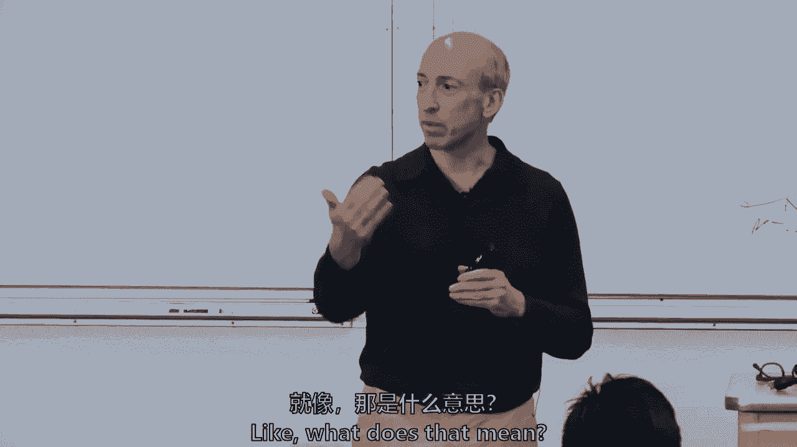
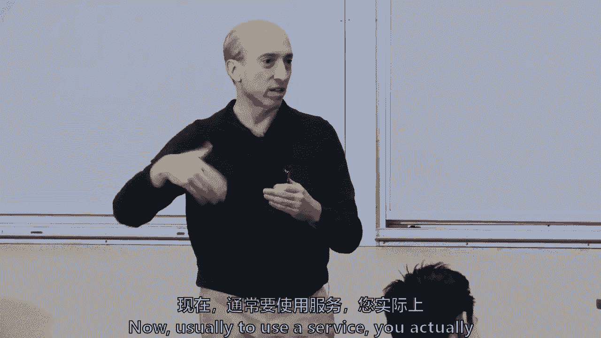

# 【麻省理工大学公开课】区块链与货币 - P12：12、评估用例 - 闰土聊Web3 - BV1sL411N7Mm

 So we're going to come back again today to blockchain economics。

 A lot of what we're going to talk about today， while again anchored in the readings， will。

 also be relevant as we now turn to sort of after SIP week to act three when we're going。

 through use cases， but also hopefully relevant as you're starting to think， okay， what about。

 this final project and so forth and what do we need to do？

 We're going to talk about the five or six of the groups that come in， either as an individual。

 person or teams of three or four have come in and sort of bounced ideas off of me。

 So I want to thank all of the groups that have come in because you've helped me also organize。

 some of my talking points for today as to what we're going through。

 And those of you who haven't come in， feel free to set things up if you find it helpful。

 But you can also thank the six groups that have come in because now I'm trying to anticipate。

 your questions as well along the way。 So the overview， of course。

 our reading and study questions will come through。

 There was the letter to Jamie Diamond， so we're going to kind of dive into that one a little， bit。

 I found it interesting when I read it about a year ago and then I thought， why not。

 throw it into the mix here。 The McKinsey report， which again， I've found this to be true for years。

 It's not just this class that you can find some consultant that's put a generalized paper， out。

 It does sort of just skim the tops， but you're getting a sense of how they're trying to， you。

 know， gin up business。 Their business model is to write some of these reports and some of you are going to go into。

 consulting and maybe even write these reports at some point in time。

 But it's often a good way to see what I'll call just a survey， a topical survey and how。

 folks think about things。 Quickly a little bit on potential use cases in the heart of today's discussion and kind。

 of the heart for thinking about the final projects is how to really assess the cost and。

 benefits of any potential use case。 So I'll skip through the study questions。

 but these were the key。 I didn't see anybody go in the discussion board。 I kind of looked。

 Did you see anything there？ No。 All right。 We did set it up。

 But what are the potential benefits and how do you assess the cost of trusts？

 And that is going to be true in every single project you look at。

 If you take anything from this class， it's this core critical reasoning of like， and。

 I hopefully after the rebenie paper last Tuesday， we're going to come out of the dull。

 drums and we're going to pull back out of the minimalist side and a little bit get more。

 in the middle。 I might not get a lean out of the minimalist side。 I don't know。

 It's interesting some groups come in and I find the three or four people that are sitting， there。

 I ask。 And even amongst the group， there's somebody who's a maximalist and somebody who's a minimalist。

 So I think we're being successful that we're not going to come out all in the same place。

 So of course， since we're going to talk about the reading， let's jump through a letter to。

 Jamie Diamond。 Jamie， I want to tell me what you took from that letter。 I really love this article。

 It was my favorite reading so far。

 Oh my gosh。 Twelve classes。 All right。 So I've thought that he did a really great job of stripping some of the hyperbole。

 both。

 the maximalist and the minimalist hyperbole surrounding this outfit to lay down really。

 what it is and how a very clear explanation of how it works。

 And then also the notion of caution to see these are the dimensions around which you。

 should wait until you put a word in。 But these are the reasons why there's potentially big limitations。

 I'm going to hold there was a hand before Aline。 Yeah， no。 I already would say something similar。

 but I thought he highlighted a lot between the trade。

 off between trust and the decentralized properties of blockchain versus the cost you must be willing。

 to pay。 And Remat， Remami， your first name？ Leonardo。 Leonardo， all right， Aline。

 I agree with both of them。 Also very good writing and style。

 One thing that I didn't like is that at some point he raised the question， well， who。

 needs censorship resistance？ He just gave two vague broad answers， but didn't answer that question。

 So I think that's a really good question。 Who needs this stuff anyway？ All right， all right。

 Censorship resistance。 We're going to come back to it， Stephanie。 Yeah。

 so I actually-- I thought censorship resistance was also one of the more interesting。

 parts of this letter because to me， when you read through what they highlighted that。

 Jamie Diamond had said， one of the things was people who used Bitcoin or backhanded are， criminals。

 And I didn't find that his focus on censorship resistance really rebutted Jamie Diamond's argument。

 So short。 Oh， I think that censorship resistance really interesting in a way that actually on the。

 scale， why we spend so much time and energy on trying to understand public policy， why。

 it's public policy such a big thing in response to decentralized advertising。

 This is a huge question for you。 So I think of--， Well， I just wanted to-- I mean。

 I definitely agree。 And because that was one of Diamond's points， I'm like， well， yeah。

 if you're a criminal， like this could be useful。 And then he talked about how it'll enforce a lot of aspect of censorship resistance。

 But I think the analogy he used was like the rise in encrypted messaging that has just。

 become-- like it wasn't a predictable analogy such a big thing。

 But now that's got new cases in the world。

 So it seems like people really liked the writing， not just the style， but that it took。

 on and had a balanced approach。 But you're highlighting， wait a minute。

 he ends with censorship resistance but then， doesn't take it the next way。 Like。

 what does that mean？

 And so I think we're going to try to tease that out a little bit。 But I think of it in two ways。

 It's the individual。 Any one of us could be blocked from doing something。

 We could not get a service。 We could not be allowed to take credit if somebody's allocating credit。

 Think about Uber。 If Uber was censoring， we can't get a ride any longer。 I mean。

 how many of us rate everybody a five when we ride our Ubers？ Because we think， well。

 maybe they'll pick me up。 I rated everybody a three， maybe they'll censor me。 I don't know。

 but maybe you all give more legitimate feedback。

 I just hit five。 So it's the individual censorship。

 But I think of it as a second thing also is barriers to entry。

 A commercial more broad market barrier。

 And that in some ways the blockchain technology might allow to build something where incumbents。

 already have barriers to entry。 They might have used public policy to get the barriers， by the way。

 They might have regulatory barriers as well。 But more specifically。

 he did define it as kind of interesting crypto assets。

 And he was one-- I'm trying to remember the gentleman who wrote it because it was on chain。

 It was the head of the chain。 What's that？ Adam。 Adam。 Ludman。 But he too said。

 let's not use the word cryptocurrency。 Let's use the word crypto assets。

 They enable a decentralized application。 And that was a key thing he was trying to say to Jamie Diamond。

 It depends on how much you believe in decentralized applications。

 If you don't see a value in decentralized applications， Ludman said， all right， I get， it。

 I'll agree with you， Mr。 Diamond。 But there is a benefit for decentralized applications and a mechanism to allocate resources to a。

 specific organization。

 So some incentive way， some way to allocate resources。 I would say this。

 I studied money a lot this semester， the medium of exchange， unit of a cat， store of value。

 But it's also possible that these crypto assets have some other benefit。

 That they're not really truly competing with the US dollar or competing with the euro。

 But maybe they're competing with-- who's my friend who's the gamer over here？ Skins。 Yeah。

 What's your name again？ Mike。 Mike。 I'm not right for the-- but it could be an incentive and be competing with Skins in a。

 sense。 And so I took that that Mr。 Diamond， don't think of it only versus the euro or the dollar。

 because maybe you're right。 But it could have something to do with decentralized applications。

 Kelly。 Kind of add effects。 Bitcoin is capital， so you should love it。

 You should still love Bitcoin and capitalism。 And that the banks aren't going away。

 They will probably still have banks。 I think it's incredible that he's not going to do blockchain till the very end。

 you know， to ask straight sensei。 You'll notice I didn't use blockchain。 Right。

 And I just kind of genius way to kind of separate the odds of--， Right。

 I'm not as genius as him because， you know， the whole chorus is called blockchain and， money。 Oh。

 well。 So what are decentralized applications， at least in this write-up？ Or anybody？

 I want to-- Kelly。 Basically just says it allows you to do it， but without like the trusted party。

 So you don't need a centralized trusted party。 I mean。

 that's the-- that's what in the 1990s so many people tried and failed with。 And in a sense。

 the internet became this way in a decentralized way to distribute packets， of information。

 even though there is centralization on the internet as well， as we discussed Tuesday， and so forth。

 But this decentralized application。 So in this context。

 he was using it broader than just something built on top of Ethereum。

 through smart contracts because he even said Bitcoin was a decentralized application。

 So he was using it in the broader context， not in what some people call DAPs。

 But a new model for creating financing， operating software。

 And this is what Christian Catalini wrote about as well， that it might be that there's。

 a new way to finance a software development。

 Maybe raise some money for the file sharing before you have the file sharing。

 Might be an incentive system as well。 And then he talked about two structural trade-offs from the design。

 Now this design， this blockchain design has a lot of complexity。 Has a lot of additional costs。

 whether it's mining costs for proof of work or some other， costs to basically secure the data。

 And so there has to be a trade-off。 And what can kind of pull you out of the minimalist end of this is whether there's some benefits。

 as well。 And we're going to chat about that in five or ten minutes again。

 And then the censorship resistance。 These are my words， not his。

 I really do think it's the individual censorship， but also what I'll broadly call the market。

 Are there barriers to entry in the current system that are in essence are censoring economic。

 activity broadly， not individually？ And I think though that was not how he defined it and I agree with Aline it would have been。

 great if he had written a few more paragraphs or another page。

 But I think it's not just the individual。 It's some barriers to entry for whole market structures。

 And often centralized institutions because they have such a networking effect。

 It's hard to break in when somebody is basically the hub of a hub and spokes network for almost。

 anything。 I mean how do you topple Facebook at this point in time because it's kind of it can。

 censor other market activity as an example。 So then we had the McKinsey report。

 Something that people took from yet what more survey paper that you've had。 Akira。

 It's just because I can see your name on the board there。

 From a interview about the use case how use case should be assessed。

 And the one thing I'm interested in switching costs because the income and financial decisions。

 have to think about not only the benefit of cost reaction but also we have to think about。

 switching costs。 I mean this is infrastructure。 I don't know the effect on the people what we want。

 So Akira has raised a very important thing about switching costs and we wrote about this。

 even though I'm not detailing it again in the joint paper that Simon Johnson and Nahon。

 and Michael and Joan and I wrote that you've now this is the last time it's the third time。

 you had to come back and supposedly read a little bit more of the Geneva report but。

 we talked there about the switching cost as well。 And by the way to Eileen's question from Tuesday about interoperability。

 A lot of switching costs relate to interoperability。

 If you're an institution and you're thinking about putting in place some blockchain solution。

 permission to or permission list but how does it how does it communicate with the existing。

 network if the Australian stock exchange is putting in a new back end clearing and settlement。

 system on a blockchain and they are and they're using digital asset holding。

 They have to think about well all of our customers are currently communicating with a legacy。

 database system and now we're creating a blockchain system。 How does that communicate？

 How does the old system literally move information over into the new system and all of those。

 from a business perspective or a question of how do you operate or inter operate with。

 the legacy system and all the network because any blockchain solution that you're going。

 to come up with is likely to be replacing some other economic activity and likely you're。

 not going to try to replace the entire network you're going to be surgical。

 You're going to decide I'm not trying to give anything away Eric but can I say what you're。

 you all are talking about in your final project。 I mean you have intellectual property so I don't know if you wanted to share it but。

 you want to say what you elaborate on you more and in the point where you're discussing。

 what's kind of law。 Well so Eric's group and Broderish and Catalina and Ross are talking about maybe doing a permission。

 to blockchain application for credit reports not credit reports for the commercial side。

 but consumer credit basically an opportunity。 Are you competing with them did I just。 No okay。

 All right maybe you are so I shouldn't say much more。 No it's all right but I won't say anymore。

 Maybe it would be interesting to point out that the fundamental or one of the interesting。

 things that comes up from the discussion of the topic we're engaging is that how to approach。

 blockchain solution from a entrepreneurial perspective because if you're selling that。

 you're going back to the letter to Jamie Diamond。 We're replacing we're trying to get rid of intermediaries or getting economic grants。

 and with that different kind of paradigm that justifies the costs of using a blockchain。

 approach to promote this in translation。 That's a tremendous entrepreneurial point of view you would end up trying to get some。

 benefit from that kind of implementation so you don't want to replace intermediaries， with another。

 So you would have to be a kind of really creative insurance of how to come up with a really。

 lowering costs and gaining some profit in the process。

 Eric's raising that if you're just replacing one intermediary with another intermediary。

 will you be successful as an entrepreneur？ Yes if you're providing a better service or a lower cost structure or lower economic。

 rents so I wouldn't be doubt yourself I would say we might be able to do it。 In your use case。

 apologies of using maybe it's multiple maybe there's two or three groups。

 thinking about there's a lot of market power right now and thus a lot of economic rents。

 but a lot of market power and economic rents and credit reporting。 Equifax。

 First Union and others earn a certain fees for all of those FICO scores。

 We're in the US we use this if you're getting a job somebody runs a credit report on you。

 if you're buying an automobile and taking out an auto loan。

 I mean it feels like each of us probably have a credit report pulled on us multiple times。

 a year sometimes we don't even know it but back to interoperability and switching costs。

 just to pull it all together how could you convince the commercial banks to use I'll call。

 it Eric's project and it's four people but how could you convince all the banks to use。

 their project and how about all the auto dealerships on the other side who right now are very。

 comfortable using First Union everybody's probably paying a little bit extra and there's。

 a fat market power economic rents but and so that's part of the switching costs that。

 Akira mentioned and to the interoperability they I believe they'll be more successful if。

 they don't try to completely change how data flows that at some point you need to know。

 that you can't be successful by biting off too much all at once I'm sorry Catalina。

 but I was going to say that precisely that one of the forms of not being raised in the。

 paper and it's like it does not change your money in the term in the area but for other。

 but actually what they say is that it's going to be more successful for like looking to be。

 more successful in the permission ready to permission less because the incumbents are。

 more willing to work on the permission and as I said you might be more successful not。

 trying to disrupt the entire community whatever that community and some ecosystem some business。

 community and do it in a permission versus permission less but we're gonna play with。

 that a little long Kelly like that they address the timeline of where the value is for example。

 they said currently the best way to like reap benefits from blockchain art to focus on business。

 and then they say like however feasibility at scale they say is probably three or five。

 years away exactly what you've been saying so my god we could both be wrong right Jack。

 something else I found interesting is a lot of talk right now about robotics and supply。

 chain using blockchain and with the kids you work on touchdown at like how secure the。

 blockchain is when you start involving actual real products and assets like it can be clean。

 corrupted just you have to block chain for works right and also it's interesting I think。

 Jack if I can pick further on that when you have something on the blockchain even if it。

 arguably should be there it's a property right and so forth but it's an off chain asset it's。

 not just a digital asset and secured and verified on a blockchain but it's in supply chain it's。

 often an off chain asset and often a physical asset then it's there's there's additional。

 challenges I think there's some really interesting use cases but it it it's it's a little bit。

 of a different place James and then I'm gonna know so they the McKinsey sort of defines a。

 blockchain and and they point out doesn't have to necessarily disintermediate to generate。

 value and it's kind of I thought that was an interesting intuition don't always think。

 that you have to disintermediate to generate value they might be right or there might be。

 wrong but you might you might actually still end up with something that's kind of it as。

 Catalina said or I can't remember now who said it but they also said they gave a time。

 scale you know short term value might be predominantly or Kelly did sorry three to five。

 years away how to capture value be pragmatic and skeptical but you need to go down to a。

 granular level and that's also what I'm going to ask you to do in the final paper is really。

 to kind of challenge yourself challenge your group to go down to the granular level and。

 say wait what transactions are we actually going to change the flow what ledger system。

 might be shift and even though it's kind of the the back office and to some people you。

 might say oh my god that's kind of the boring side of business but that's really what block。

 chains about it's a database and ledger management system also and to be successful you have to。

 kind of get down to that granular level and and figure it out in terms of whatever that。

 current ecosystem is or the regulatory system and they said it's particularly valuable in。

 low trust environments and that could be where currently we can't trade directly and you've。

 created a new way to go to peer to peer or where there's not currently a central intermediary。

 I mean you can go right at it you could be like this bold group that says I want to take。

 on transunion I want to take on Equifax that's that's something which is a central intermediary。

 right now but it is correct we're not really trading directly it's not like when I walk。

 into the auto shop or the buy a car and I'm going to take a loan out that I can transact。

 they they want to validate that I can pay back that door and loan so yes。

 two points particularly the fact of where you're in a very concrete directly now but there's。

 a lot of trade happening where there you know where you don't have an intermediary but some。

 sort of intermediary would help good help but think of like ag markets and very remote。

 parts of agriculture and agriculture markets and like very remote parts of the world where。

 actually being networked and precisely there's no trust like you know that kind of environment。

 exists so the use case for that would you know it's a stream like remote parts of the。

 world where internet is there but not necessarily financial institutions are right like a major。

 trade environment and there are many parts particularly in the third world that are still。

 unbanked I mean I've said this statistic before but the World Bank report on on the bank the。

 banking in 2017 half of sub-Saharan african was still unbanked but half of that half has。

 mobile phones so it's it's just those gaps might change but then it will move yes they。

 might have a banking account but it will be not something they can really do what what。

 agriculture so two opportunities I'm gonna come to the question is like do you go head。

 one against a central intermediary and use this technology to do it better look at that。

 I should turn this off the head one against a central intermediary or some market structure。

 that has no really core intermediary but you can build a better kind of trustless peer to。

 peer network yeah it says that when it comes to permission private permission architecture。

 blockchain it's highly likely to be more scalable。

 highly likely to be more scalable yes so permission blockchains by their their they've。

 made a trade off so Nakamoto's paper comes out for a few years people don't really notice。

 it but then it starts to get some lift and folks are looking at it in 2013 to 2015 and。

 the financial industry starts to think about this and says this actually is pretty interesting。

 we're not sure what it's gonna do but we're pretty interested and they get attracted to。

 a cuz it might be a way to move data around it might be able to literally lower the cost。

 of the back office many banks keeping the same set of records I have an equity trading business。

 you have an equity trading business we both have to confirm and and correct those records。

 but we keep full databases what they found attractive was real but then remembers bitcoin。

 can only do seven transactions a second so all of those challenges of scalability privacy。

 security led them to think about was there a way that we could toss literally toss some。

 of the technical things all over the side and and most of them thought we don't need a native。

 token we don't need an incentive structure and if we limit the number of nodes in the。

 network we can increase scalability and we can get rid of proof of work so my narrative。

 might not matter but it's important to understand it was sort of permissionless thing comes along。

 and then they say it's not scalable what can we toss overboard and make it scalable and。

 what they tossed overboard they didn't even feel they needed the native token and they。

 tossed overboard proof of work consensus and had a club deal and in the australian stock。

 exchange example they might only have two or three nodes but in some of these there's。

 fifteen or twenty so why is it more scalable fewer nodes and much more efficient consensus。

 mechanisms but the tradeoff is you better darn well trust now those fifteen or twenty。

 nodes and when we talk about fifty one percent attacks you could you could revise a whole。

 permission blockchain if those fifteen parties wanted to now some people say well you could。

 just do a hash function remember that whole hashing you do a hash function of a whole。

 permission blockchain once a day once a week once an hour and store it somewhere else in。

 fact you could store the hash of all of that on bitcoin you could use a ledger like bitcoin。

 and just store store it there so there's some feedback loops but does that help give you。

 sense it's also just gonna build on that so so the power of permission blockchain is that。

 unlike ethereum or bitcoin it's not public right so there is no public ledger you can。

 make it public but it's permissioned not permissioned left because you need to have trust and entities。

 in this network so this can also be you could say a feature not a bug when it comes to scaling。

 essentially you only grow you control the scale so you control these nodes and then。

 like mentioned these nodes are only relevant because they are trusted pieces of this puzzle。

 yeah right but I think it's easier to get scale but there's not enough our large can。

 not to market to actually make it scale or make it reach to the critical mass so are。

 you worried that you there's not enough to get to the critical mass and I'm not sure。

 I'm so I a permissionless blockchain and a permission blockchain both can be open to public users。

 you could have millions of people use a permission blockchain but only 15 have the right to amend。

 the records so one might think of who has a right to read it who has a right to write。

 on it read right but also absent even that it might provide a service like file sharing。

 or some service there might even be a third list of who has a right to use the service。

 usually to use the service you actually have to read the data but you could you could partition。

 and say how much can be read as well yes and remind me your first name I'm sorry。

 what right I really appreciate you expected from how do you envision the path where you。

 said the future of permission blockchain in terms of its relationship with public。

 chain I mean do you think it would be like a path to path paved the way towards the true。

 decentralization eventually or you were just so sure that not a new form of information。

 silos or which is become irrelevant just as as the intern as compared to internet so。

 Schwann's question is unanswerable but I'll try to give my opinion and 2018 and then we'll。

 say and it's being recorded so we'll see how much how I'll do but the question really is。

 is what's the relationship for permissioned and permissionless blockchains and what is。

 it going to be longer term I think today in 2018 because of the scalability issues and。

 some of the privacy and security issues the dominant place that the investment will be。

 is on the permissioned side especially on what's called enterprise applications the banks the。

 lords institutions there's not enough scalability because 1000 users a day or 1500 users a day。

 on the big big apps right now on the Ethereum network that's just not enough you know beyond。

 gaming sites and some small hobbyist type things like crypto kitties I mean it's fun it's interesting。

 but it's not truly scalable to you know seven billion people living around the globe but。

 I wouldn't and I've said this to some IBM folks I said and they have a thousand people。

 at IBM in the hyperledger team so I mean anybody who's a blockchain minimalist you haven't。

 heard this number？ 2500。 2500 alright so it's more than I thought。

 No no so 1000 to 2500 I knew it was more than a thousand I mean IBM has thrown a lot of。

 money there now they might be doing that to protect their risk they might be investing。

 even if all those thousand people ultimately produce nothing but there but I think that。

 five years from now or seven years from now the gap will close I think that permissionless。

 systems will always have a lot of challenge about governance collective action how you。

 have collective action is not just a matter of technical and coding and smart scientist。

 at MIT and elsewhere I think that's going to still be a challenge and they'll be trade。

 offs so it might be that they coexist but I think the gap will close and you said well。

 will it be like the intranet sort of went away and the internet was there there are some。

 people that believe that and that might be I'm probably not there I'm probably not all。

 the way there but I think when the gap closes some of these permission systems will not。

 be as necessary zero knowledge proofs other ways that come along that make it more usable， yes。

 I totally understood I'm still a little bit skeptical on the permission blockchains one。

 of the are you skeptical if I can interrupt you and thus it moves you over to traditional。

 databases or skeptical and you're moved over to permissionless open so I don't know which。

 way is it pushing you know。 Depending on the use case for enterprises I think traditional databases for the enterprise。

 use case the reading here it's I just this line killed me it's an eccentric developed。

 immutable blockchain in which the content of individual blocks can be modified and that's。

 like it's a ridiculous statement considering you know the definition of blockchain is like。

 anti this is the antithesis of basically so。 So I'm sure created an immutable blockchain that isn't immutable is what you're saying。

 it can be amended so it's a backdoor I can I can I can change and yet the economics of。

 it is in a lot of times people do want a backdoor and the and the challenges and these are the。

 weaknesses as well as Noria Rubini says well why would you create a system where if you。

 forget your private key lose your private key or the cave collapses that you're hiding。

 the private key in a cave and maybe it floods that you've lost your assets wouldn't you。

 want a backdoor would be and and but but I respect you would say this isn't even a blockchain。

 I'm trying to teach this class in a little bit neutral between permissionless and permission。

 blockchains but you need something to get out of the traditional databases and I've chosen。

 at least for purposes of this class that means you've got to have an append only log you have。

 to have time stamp and you've got to have to have to have the basis of some more multiple。

 people writing to the ledger even if it's only three or five but but these are not well。

 defined vocabulary terms。 Elaine。 Why would you stop using them and this is a perfect opportunity to actually talk about。

 a pendonly ledgers because that's actually meaningful and meaningful in launching that's。

 been studied in computer science for decades or consensus algorithms which is another meaningful。

 notion studied in computer science for decades and consensus algorithms on permissionless。

 on a pendonly ledgers sometimes referred to colloquially as blockchain and then we would。

 know what we're actually talking about if we use it sometimes sometimes。

 I will try to help but we're only 80 people and there's like a lot of people using these。

 terms and when you go outside of this class or even when you read like an open letter to。

 Jamie Diamond I mean of the of the you know somewhere between 25 and 50 readings you had。

 so far this semester they've used the word blockchain in multiple ways I'm agreeing with。

 you you're just asking me not to ever use the word blockchain again。 Oh my god。 Oh my god。

 He's sitting in the center of the class。 Let's keep going。

 So we're going to study these this is just this list that we've talked about but in act。

 three we're going to come to it after sip week and start to go through venture capital。

 payment systems and so forth。 It might be some of what you're picking up for senior you know for the final projects。

 but you know here and I stress the word potential use cases。

 Well these all work will they be places。 In the non-financial sort of space supply chain management I put on this list but it's。

 kind of financial and I want to do include it。 Digital identity is both within finance and outside of finance property and asset registries。

 you can call it finance but I'm not going to sort of dig into that a lot in the rest。

 of the semester medical records internet of things and so forth。

 This isn't going to be exhaustive if you come on Tuesday October 30th the blockchain dinner。

 that or BitCoin blockchain dinner that Simon Johnson sponsors will have somebody doing。

 election and voting。 So there's a lot of other interesting applications。

 I tend to be a little doubtful about the voting because I think official sector and governments。

 want something so centralized and that but maybe it will be more decentralized。

 But maybe it's only a penned only without a consensus。

 So oh McKinsey they broke it down into six buckets。

 They had the record keeping and the transaction based and a lot of these are the similar kind。

 of buckets。 It's just to give sort of a spur to all of it so accessing costs and benefits。

 So we've talked about what are the benefits。 These are the questions that I would be saying and some of this was in the Geneva report but。

 rather than trying to tease it out of all of the discussion。

 Here I'm going to sort of lay out four big buckets as to how I think about this and how。

 I might get your feedback。 If you see other ways to look at this I want to learn from you all as well。

 When I say four this is the first bucket。 Basically what are the benefits of using this technology。

 Whether it's this idea about consumer credit or some of you have had ideas about government。

 procurement or payments or wherever you are you know what is the true benefit。

 You've got to find a pain point。 Every entrepreneur always has to find a pain point and something that you can be solving。

 it for a group of stakeholders and who are the stakeholders you're solving something for。

 or if your company is at an internal pain point。 Pain point is some constraint to making more profits more revenues or it's a friction。

 It's a cost and you want to get rid of a cost。 But what is the pain point for providing a good service or making more money。

 How can you capture the value。 As an entrepreneur if you do something for iliomocinary purposes meaning you don't care。

 about making money。 I applaud that。 That's terrific。

 You can even hand that in for your final project。 But I'm assuming that you're going to be thinking like me how do you capture value。

 Not only do something but also capture that value and get a little of somebody else's。

 economic rents if possible。 Thirdly， what are the competition doing？ What are the competitors doing？

 Even if they're using traditional databases how are they addressing the same pain point。

 and anything you're doing。 And why is blockchain technology or is iliomocinary wish me to say why are a pen only longs and。

 consensus protocols。 What is the answer？ What is it about a pen only longs with their time stamping with their final settlement。

 the finality of that settlement。 What about that or even a full consensus protocol and a native currency。

 So I'd add a third thing because permissionless would also have an incentive system and a native。

 currency。 So what is it about a pen only logs consensus protocol and a native currency。

 How am I doing？

 I love it。 Yeah， I love it。 She's。 Talk like this all the time。 Yeah。 Oh my god。 I need this。

 But that's the core and I sort of， I talk about it being the final project but this is。

 really， this is going on right now。 $28 billion has been raised in initial coin offerings and a few extra billion。

 three or， four other billions been raised by direct venture capital in this world but call it $30 billion。

 But it's starting， it's not fully mature but it's maturing and a lot of venture capitalists。

 are kind of saying， wait a minute， wait a minute， we're past the hype stage。

 What pain pointer you're trying to address， how are you creating value， what are the competitions。

 doing and why do you need a pen only logs consensus protocols and possibly native。 tokens。

 I just wanted to follow up on that point about the Accenture。 We had a define something。 All right。

 Kelly。

 The Accenture thing you was talking about from the Accenture。 It's immutable but amenable。 Right。

 So we ask ourselves a question like that seems a little bit， it doesn't， what it defeats。

 the purpose， right？ So I then ask myself what value is being created by doing that。 Is it some。

 if it's not necessarily for like their customers， where's the internal value， line？

 I don't know what the application was but I think that in every application that we， find in this。

 not just in blockchain but in other applications， you have to ask。 Absolute final settlement。

 If you can never amend it， if it is truly immutable， what cost does that also make？

 I assume that in this application that was too great a cost for them and they wanted， a back door。

 a way to amend that which was supposed to be immutable。 Again。

 I don't know that application but that is one of the， I think it's a feature。

 of blockchain but it's about the feature and to some a bug that you cannot amend something。 Yeah。

 It says that one of the benefits was that it allowed different entities involved to draw。

 the same record and so like， yeah of course I can see with that's valuable but then it。

 also spikes the question like if you want to change it then why not just use the traditional。

 database。 That's what I'm going to add in 2016， helped when the， an organization called DAO， the。

 DAO， was a decentralized autonomous organization。 Thank you for those who。

 it was one of the largest at the time initial coin offerings。

 that raised about 160 US million and very quickly right in the smart contract。

 It wasn't in the base， Ethereum layer but I believe it was in the smart contract on top。

 Somebody saw what was later been called a bog。 I don't know if it's truly a bog。

 it was programmed in in a sense but there was a way。

 that they could see how to get in there and they took about a third of the tokens， so。

 they're equivalent of about 50 million。 But the way the programming worked there was about two weeks before it actually was truly。

 final。 I mean it was something in the code also that， and that wasn't a bog and the whole Ethereum。

 community was debating it and Vitalik Buteran said no we can't let this happen。

 So in a sense they big footed it。 It wasn't it。 They almost did what Accenture。

 Now he might say no actually it was right at the 11th hour and 59th minute but because。

 it was this like 10 day or two week period but they basically Vitalik Buteran even did。

 kind of what Accenture did at that moment。 I don't even know was it a technical fork because of how they did it？

 Can't right at that moment。 The stall in 50 million or whatever the number of tokens。

 So that led to the fork。 The majority of the community went with Vitalik rather than what the fork happened。

 So how immutable is immutable if there's a broad consensus？ That's the back door sense。

 Second but was there another hand or I'm sorry brodish。 I think the kind of two address points。

 So I think when people are talking about blockchain as a term。

 Essentially referring to a set of potential benefits of this technology and some of them。

 can be relevant for a particular use case。 Some of them might actually be an obstacle for that particular use case。

 So the way it can be thought of is that we have an umbrella term which talks about different。

 potential benefits。 We take what is required from that。 It could be happened only。

 It could be not happened only。 It could be consensus。

 It could be permission permissionless whatever。 And then we kind of collaborate with them and create a solution which is applicable for。

 the particular use case that I want to look at。 That is why even if it is not immutable it is still a potential use case of blockchain。

 in my understanding。 Because we are bringing up some of the benefits of the umbrella term。

 I think you are correct but I'm not going to go all the way to where you are。

 I think you are correct that broadly speaking many people are using this term to promote。

 their own innovation the innovation of their colleagues and so forth。

 And yet someone a backdoor like a such a make it less immutable and so all of a sudden。

 if it is like has a big backdoor and you can amend is it really an append only log any， longer。

 What I do want to say is in this class I am going to say anything you are working on。

 for your final paper it has to be at least a permissioned or permissionless system。

 Thus it has to have a pen。 What is that？ You are going to get there。 You are going to get there。

 You are going to get there。 As I told you earlier in the day get to yes but if it is a traditional database that。

 is not I am saying stretch your mind try to figure out something even if it has got a。

 little bit of risk into it as to how you get to using a pen only logs and even in a permissioned。

 close lose private consensus but some consensus think about whether you use a token that kind。

 of gets to permissionless。 Oh Eric is going to。 I am just going to try to quickly reconcile。

 And then I need to keep going。 Yeah。 Those two apparently divergent points。

 I want to say the point is that he might agree with you。

 I am sitting in the middle。

 From a technical standpoint it is true。 You have a pen only log in a consensus mechanism that make up the original use case that brought。

 the term blockchain。 What is the native token in that one？

 But to the point of what happens if you want to change or amend the log then is that really。

 a blockchain that is exactly the reason why the term distributed ledger technologies came。

 up because to a certain purist extent it is not an app and only log because you are actually。

 updating it from a purist definition。 That makes sense of course but then the nature of a distributed database that is not a bit。

 of a problem located in an instrument that governs the updates and whatever changes you， make it。

 It is the reason that make up the distributed ledger technologies that are blockchain inspired。

 if you make it。 So it is okay。 You can say if you amend the log then it is not blockchain。

 But it is DLT。 DLT is blockchain inspired。 So we can keep everything in the neighborhood。

 We are going to keep this discussion and debate going and it is probably not all that far， off。

 It is not about vocabulary。 It is also about I am trying to spur you all to get to yes even if you are a minimalist。

 like to think about some project that uses the essence of this and not just inspired。

 So then what are the specifics of this append only long consensus use case or blockchain， use case。

 So what cost of verification or networking are you actually reducing back to Catalini's。

 work about verification cost and networking cost that we talked about on Tuesday。

 What is that cost you are actually reducing？ Which transactions need to be recorded？

 What accounts or transactions you might say need to be recorded on this log？

 What stakeholders need to be able to write？ If there is only one stakeholder that needs to update something I am not really entirely。

 sure that you would be in this distributed decentralized place。

 So I list these questions that were not directly in the readings but I list these questions。

 and say this is a way to start to get your mind around where this technology however。

 we label it this technology can help in essence。 Does it lower cost of verification and networking and if so which ones？

 Which ones are you trying to address？ Which ones are you trying to dig and basically create value for your startup？

 What transactions or accounts are you trying to record？

 Things like changing property rights or moving around birth records or land records or supply。

 chain but where is that？ What stakeholders actually need to write to this distributed ledger？

 Because if it is only one party I am still trying to get my head around why the Australian。

 Stock Exchange really needs it but okay what is it that there is multiple parties need。

 to write to this shared collective state of what is there。

 And then the last one is also terribly important is what is the customer user interface。

 And a lot of challenges are basically like currently we are not in a place where a lot。

 of blockchain applications or distributed applications have great customer user interfaces but that。

 is well。 Then what are the cost of the transitions？

 Akira mentioned this from the Geneva report and the other readings but what is it cost。

 and challenges。 Well of course we still have a bunch of scalability and performance issues。

 We have the privacy issues and coordination。 I am not trying to hold us out of that by the way for your final projects。

 If we are not going to get to scalability for 5 or 7 years I am not going to say well。

 then you all have to write about permission systems。 No。

 I am okay if you kind of say well this is a pilot and somebody else is going to solve。

 through layer 2 or ZK snarks or something these other things。

 But I would like you to at least identify what are the issues of scalability performance。

 privacy security those issues that might hold your implementation out。

 And permission blockchain adequately addresses whatever the use case is。

 And how can you actually get jump start broad adoption。 That is your network challenges。

 How when you start Uber can you get a lot of people to use your Uber app but in this。

 case if I can use the consumer credit。 I thought the consumer credit idea was really a neat one。

 Maybe it could go right at the heart of a lot of market power but now how do you get all。

 the auto dealers how do you get all the employers how do you get the banks to actually say I。

 want to get rid of first union and I want the blockchain and money final project teams。

 And by the way just replacing one central monopolist with another central monopolist。

 a lot of commercial banks aren't terribly excited about that。

 Maybe you are going to have to give some ownership。

 Maybe you will have to give 50% of your ownership to the 20 banks that are now part of this。

 I mean there are other ways to build incentives。 Maybe you put a native token in there and you give the native token。

 So there may be other incentive ways to beat the current monopolist。

 But having been around commercial banks for a long time they really are looking for ways。

 to replace their aggregators in their back office whether it's clearing， settlement， exchanges。

 credit agencies but they are deeply understanding because they are pretty ambitious and very。

 good at making money as well。 They deeply understand that every idea that is pitched to them is somebody who currently。

 is small but wants to get big and gain market power。

 So they are also always thinking about how to ensure that there is a check to slow down。

 your startup from gaining market power 5， 10 and 15 years from now。

 They don't want you to be the next clearing house like the Chicago Mercantile Exchange。

 or intercontinental exchange。 They don't want you to be the next central node of market power。

 So you might share some of that with them or you might find an incentive system。

 And then what are the net？ So key questions for companies designing blockchains。

 This is something from MIT's own Sloan Management Review。

 It was not a required reading but I thought it was a nice little way to do it。

 What are you trying to do？ Are you trying to record something， track something， verify something。

 aggregate something。 This is in the fall MIT review。 What value do you want to capture？ Literally。

 here is a list of the things you might want to capture。 Is it about contracts？

 Is it about permission？ But what is the value we are trying to capture and for whom？

 Obviously， is it for suppliers or customers and so forth。

 So it's another slice by thoughtful people， MIT。 That's a link to the reading if you do want to read it。

 It was a well-written five page article。 It even held back on one reading。

 So the benefits of blockchain， we reviewed this last Tuesday。

 So I'm not going to go through it again。 But again。

 as you're thinking about this and thinking about which use case is and so forth。

 think of these cost of verification， which of these are you really trying to hit or is。

 it networking？ And I changed the networking a little bit， but a token and set of system。

 which could。

 be like the skins， rewards and affinity identity， could help you start it up or operate it。

 Or it could be like crypto kitties where it's like a collectible。

 So that's another way that you have token economics floating in。 So this you've seen。

 I've flipped it around， but basically， do you use a traditional database？

 Do you think about a private blockchain？ Do you think about a public blockchain？

 If you're over here， I really ask you， Brodish， you've got to get to yes。 You've got to get to here。

 I mean， you wouldn't want me to just be teaching a traditional database， how do you build something。

 in Sloan， right？ This is block-chated money。 Or as a lean wants me to relabel it， append only logs。

 consensus protocols and money。 And a native currency。 But how many of you would sign up？

 Would you recommend that I list it in the course catalog that way for next September？ Really？ No。

 not really。

 Alright， but if you want to really kind of juice get to here， put it append only log in there。

 in some even private permissioned system or be bold。

 Try to get all the way to there。 Don't stay there， please。 Alright， I made my point。

 James， where are you？ Are you there there？ I think we're in the middle， right？

 The private blockchain。 It's all cool。 What's up， buddy？ Alright。 Yeah， but they're not。

 They're going to get at least there。 They're not staying there。 They want to get a good grade。 No。

 no， really。 This is going to be fun。 Listen， I get it。

 It's not just like any Sloan class where you have a final and everything。

 I've given you a hard task。 There's $30 billion chasing around to try to find uses。

 There's thousands， 2500 at IBM or whatever。 There's thousands of people trying to do this and there's no really true market-wide。

 applications right now。 But that's the nature of what we're doing here together。

 And I'm not asking that somebody actually be able to go raise money and actually start， it。

 You don't have to code it except for you， Alene。 But you don't have to actually code this thing。

 But I'm really kind of looking like for your business savvy。

 It's more about critical reasoning skills。 And these four or five pages。

 pull it off of Canvas and think about how it kind of fits， in with your projects or not。 Yes？

 Given the question in previous slides are helpful， but I still find it's hard to decide。

 whether we should really use blockchain database for the traditional database。

 So is there a non-technical model or framework that we can assess or plot ourselves between。

 those two？ I think of it。 I apologize if I go back to the slide， so I'll try not to。

 But I think about it is are you moving around something of value？

 Do you need multiple people to be able to help in that network？

 Whether it's because it's peer to peer。 If it were the 80 or 90 of us in this room。

 you might be just there right now that there's， a benefit of that peer to peer movement of something of value。

 Or frankly， even back to this， if there's a lot of economic rents， if there's market power， in this。

 if there's big market power and somebody's just collecting lots， that might be your opportunity。

 because this is the technology that can get you there。 And you might say， "Well。

 I don't absolutely have to have an append-only consensus， native， currency type of technology。

 but it's how I get to peer to peer。"， So it might be that that's the way that I'm going to disrupt the party with the big economic。

 rents。 Like the letter to Jamie Diamond， if there's a bunch of things about censorship risk。

 And again， I don't know what use cases you're thinking about。

 But I think if you don't have one of these six， the verification costs， it's unlikely。

 you need an append-only log and consensus in the whole mechanism。

 But I think if you do have something here， hopefully not just economic rents， but market， power。

 this might be the way you get underneath it by having a decentralized peer to peer， approach。

 So that helps。 And it could be something that has no central authority right now。

 no central intermediary， and it's just how to jumpstart something。

 I think in that circumstance it's more likely you need a native token。

 I think if you're trying to jumpstart a network， and there's a lot of collective action reasons。

 that will still face you， some of our colleagues， Andy Lippmann and others over at the Media， Lab。

 spent a lot of time a year， a year and a half ago on a medical records approach with。

 Beth Israel Hospital locally here。 And if Andy were here， he'd say。

 "But I still have the collective action issues。 How do I get a bunch of hospitals and a bunch of doctors？

 And how do I get all that collective action to work together to use kind of one database， system。

 if you wish？"， So I think to get over that collective action issues you start getting into， "Well。

 this， native token might be an interesting way to do that。"， Great。

 It seemed that Uber satisfied the things you just mentioned。 They did。 They did。

 But would they have done it differently if they started in a different era？ Yeah， I don't know。

 I mean， it's remarkable that they took on and just completely transformed the ride， share， business。

 the taxi business， if you wish。 But I'm pretty confident of this。

 There will be something that we don't envision right now that really transforms the next thing。

 And as my brother said when he said， "It might be five and ten years from now and you。

 won't even expect it。"， Who would have thought the internet in the 1990s was going to go straight and transform。

 the taxi business？ Nobody in the New York taxi business would have envisioned that。

 Which was one of the things that he mentioned。 So why use blockchain versus traditional database？

 We sort of did that。 I know。 You got it， bro， right there。 Okay。 I'm having some fun。

 So the trade-offs we've talked about。 So these are costs。

 This is the cost of centralization versus decentralization。 We've looked at this slide before。

 Over time， I think this was an earlier question， over time I think what's going to happen is。

 these graphs might have different slopes。 So it's just sort of like， okay。

 what if the slopes change？ I think that the cost of decentralization are going to come down。

 But that's my sort of more my kind of forecasting， prognostic-case thing。

 And then you'll have more applications that feel more comfortable over using something。

 around this space。 Now it could be wrong and it could go the other way。 Just saying， you know。

 and this would be more the minimalist side and said， well， you。

 can address some of those centralization costs and it comes down the other way。

 So it's just a visual way to think about what will happen over time with innovation。

 But I think innovation will pull down the slope towards that from where we are today。

 Because the newer technology that's decentralized， how can we do this？

 And I think there will be more opportunities around it。 Alright。

 so on the 30th we're going to be talking about basically our first kind of area。

 We're going to talk about payments。 We're going to talk a lot about payments。

 I'm going to take two days to talk about payments。

 So we're going to kind of lay out a lot about what's going on in finance outside of a pen。

 and only logs and consensus protocols and block chain。 Alright。

 but we're going to have fun because it's what we all live together and some of。

 you actually live in these countries but whether it's Alipay， Intention and M-Pesa。

 So all these initiatives and then how could maybe blockchain fit into it。

 In terms of the use cases， these are all those use cases that we're going to be doing from。

 October 30th to December 6th。

 But this gives you a sense， what I call Act 3。 And we're going to really be trying to challenge each other about。

 And some weeks I'm going to give you a heads up。 It's going to be a little thin。

 I'm going to be looking for like who's got really good use cases。

 If you have something to bring into the classroom that you're saying， "Hey， this reading list。

 I put together in late August and by November it might be that there's somebody that's actually。

 moved something further。"， So don't be bashful。 Shoot it into me in time。

 I'll distribute it to the whole class。 But in a couple of places， digital ID for instance。

 I was really like， I thought it was， thin。 I mean， there's the Estonia case but it's not really。

 not sure it's a blockchain。

 I mean， so I'm admitting in advance some of these are a little thin but still good。

 And the readings for the 30th， the Federal Reserve Payment Study really shows a bunch。

 of information and you don't have to read the words。 Just look at the few charts。

 But it's going to give you trends。 You're going to really see some interesting trends in there。

 What the best mobile apps are and the global payment report and things like that。

 Any questions on anything like that。 And then what do we talk about？

 Blockchain technology can address costs through verification and networking。

 The potential use cases。 The devil is in the detail。

 It's true in most things in life but it really is。

 This is kind of like nanny little details about what transactions。

 Who am I going to try to disintermediate？ Where am I going to create value？

 Why use a permission or permissionless blockchain rather than a traditional database？

 And really kind of get some value。 I think you really have to address this question。

 But I think there's potential there or why a public blockchain versus a private is a。

 token going to help you jumpstart something。 And remember。

 there's kind of two different types of tokens。 There's the broad currency type token。

 That might be Bitcoin and they might have won the thing。 Or it'll be somebody else。

 And there might be two or three。 I personally don't think there'll be hundreds of those。

 But then there might be in essence use case specific tokens。 Right now we have 1。

600 and most will fail。 So that's kind of it。 Any other queries or anything？

 Yeah。 >> I'm just thinking once all the bitcoins are mined， then what？ >> 2040 or 2300。 >> 20。

 >> 20。 >> 21。 >> 21。 >> 21。 >> 2040。 It's a very slow inflation curve。

 It's probably a slow inflation curve in the middle of the 2030s。

 >> What's the incentive if there will continue to be incentives for node operators to continue。

 operating whenever there's no further incentives？ >> So the question is what happens in 20 when there's very few mining rewards。

 And the answer is， I'm going to have some fun with you here。 I'm going to show you one other thing。

 The answer is yes because it's fees。 And the fees in the system， I apologize。

 It's just one thing that I want to show you that's fun。 The fees in the system。

 The fees in the system， so right now you can have fees。

 If you remember how they're fees in the system。 And instead of having mining rewards。

 right now they're very small fees。 So for every transaction you put into Bitcoin。

 you can actually say instead of taking out， exactly that the inputs equal the output。

 you have inputs greater than the outputs and， the net is fees。

 And what is the case there is that what's the case there is that in 2030 or something like， that。

 I think the fees will continue to increase。 I think if this takes off。

 the question is does it take off？ So I just had some fun because this day is an important day for me since you met him。

 So who？ Who is whom？ I sent this picture to Rob this morning because today is our birthday。

 no， no， no， no， no， no， no， that's how I--， no， no。 No， no， no， no， no， no， no。 [ syncing ]。

 ['ve been playing ]， ['re playing ]， ['s been playing ]， [ were playing ]， So， so。 who is who？

 -You were the lager boy。 -Wait， wait， wait， wait， for the strip shirt or。or not？ -Okay。 -All right。

 how many striped shirters？ All right， all right。 How many solid shirters？ Wow。 So。

 I sent it to Rob this morning， and I sent it to my three daughters， and I sent it to my girlfriend。

 I said， "I'm gonna， you know， who is this？"， It's split view there， too。 [ laughter ]。

 I went with striped shirt， but Rob said he doesn't know。 [ laughter ]。

 We were three years old there。 And， and， so that's just a goof around with you。

 So， all right， thank you all。

 [ "I'm a High-Time" plays ]， ♪♪。

