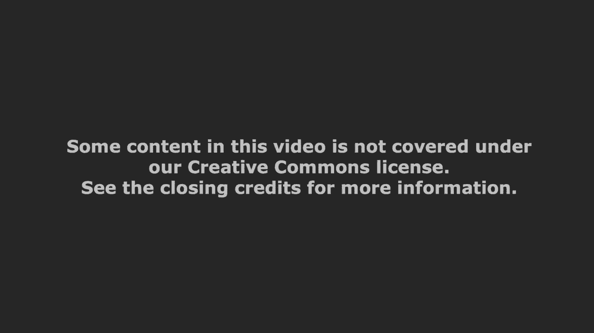
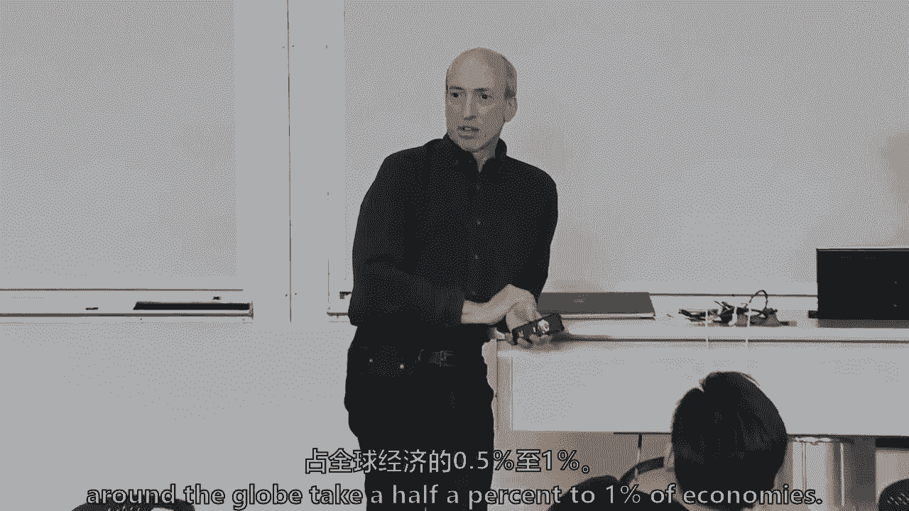
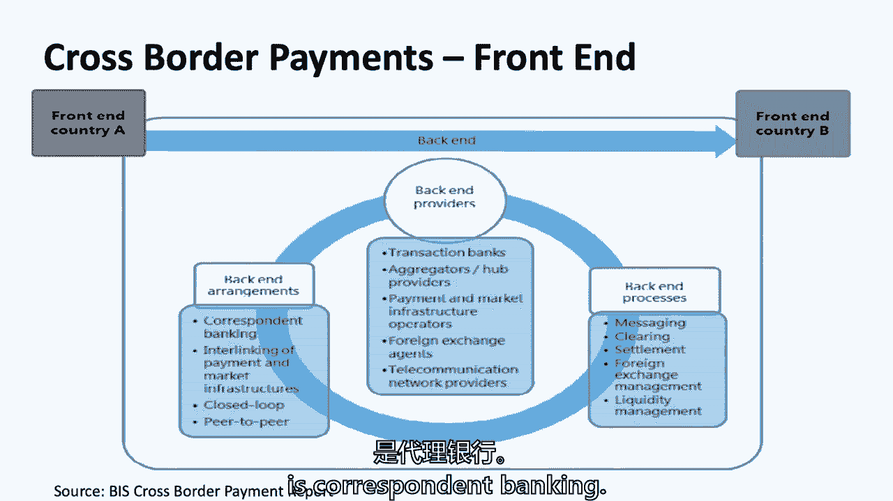

# 【麻省理工大学公开课】区块链与货币 - P13：13、付款-第1部分 - 闰土聊Web3 - BV1sL411N7Mm

今天我们要回到区块链和货币。

本课程的第三幕，现在我们已经做了一些基础知识，一点点经济学，现在是一些从金融角度来看的用例，为什么我认为这样安排课程是值得的，我希望我们都能从接下来的10到11节课中得到什么，就是，我认为这很重要。

在奠定了一些基础后，区块链技术可能存在于加密货币中，也可能不存在于加密货币中，当然，谈论经济学是使用一个领域，这是目前关于区块链技术潜在应用的最主要领域，也就是金融，这不是唯一的区域。

但财务完全依赖分类账，它完全依赖于在多方之间转移产权，当然，这是第一个关于比特币的用例，那就是，你知道的，点对点的钱，所以我想，即使你是从医疗保健的角度考虑这个问题，从互联网的角度来思考，事物的，等等。

很多，许多其他用例，为什么现在不学金融呢？也恰好是我的比较背景，在过去的三四十年里，我一直在金融领域度过，所以我可以很有帮助，深入挖掘，你知道的，可能就像你想进入抵押贷款市场一样深，支付市场，外汇市场。

我可能在我职业生涯的某个时候去过那里，或者仍然有联系人和网络，并对其进行了研究，但毫无疑问在座的八十个人大概有九十个，你要逼我，我喜欢这样，3。我得说上个周末过得非常愉快，阅读五十多篇论文，嗯那个嗯。

只有大约两个，你们中的五个人决定在二到九年级提前交论文，但是十班是，你知道的，你们50多人，所以我真的对班级有感觉，你对金融和区块链的看法，当然你也会这么做，我想下次我可能会设计得不同。

但如果你们都上交，如果你们五六十个人交二班的试卷，三个，会的，你有这个权利，我不会剥夺你们任何人的权利，但这意味着我可能会推迟拿回所有的项目，我想说，总的来说还有两三件事，就我们所处的位置而言。

我们这学期已经过半了，塞布丽娜和托莱多，我做得很好，只是说，我们在课堂参与方面做得怎么样，我开过很多玩笑，我经常开玩笑说，你知道谁在说话等等，我们现在只剩下你们中的15个人在这12年中从未说过话。

你知道的，所以我想和你一起工作，我不想折磨任何人，我真的希望你们不要太担心自己的成绩，我想让你有点担心，但不要太在意你的成绩，但如果你还没有说话，你还没有上网，两个人已经上线了，我已经回复了他们两个。

你知道的，来找我，试着弄清楚如何成为这个社区和这个讨论的一部分，不管是在课堂上还是在网上，在某种程度上，因为我再次希望这对每个人来说都是一次积极的学习经历，就论文而言，总的来说，只是一些整体的事情。

他们很好，有些非常好，我是说，这是你所期望的，有这么一群才华横溢的人，但有些真的让我思考，挑战我，等等，它是一个钟形的曲线，另一方面，有些，没有多少人错过了标记，所以我只想说几件事。

一个是这不仅仅是回答三个学习问题，学习问题确实刺激了这里的对话，这三个问题，你们不多，只有两三个人，只是想回答这些，把它当成制服，三页纸，五是极限，你们中的一两个人写了六七页，那很好，但这只是你不需要。

从某种意义上说，这对我们来说是更多的工作，第二，我真的试着给出反馈和评论，总的来说，我们试图得到的是这里的经济学，有什么，仅追加日志，多方写入共享分类账，所以多方，你知道，更新某些经济状况。

一种真正的财产权或其他东西的经济状态，以及核查费用，可以降低哪些网络成本，嗯，这是不公平的，因为你们所有人都要一起想出一个最终的项目，我周末回去看了最后的项目，我想你正在考虑一些非常好的想法。

但核心是核查费用，你可以降低哪些网络成本，为什么只附加多方之间的日志共识，共享一个分类帐，可能还有一个本机令牌，因为您不必对无权限的本机令牌做一些事情，但我想你们中的一些人会到达那里。

我们会有一些令人兴奋的想法，所以那些就是那些就是我的想法，如果我在对你论文的评论中说，我只做了两三次，来找我，别害怕，可能只是，我想追求，我在一些非常优秀的论文上说过这句话，我说过一两次，那只是我想嗯。

值得谈谈，嗯，但我想和你一起度过这一切你学会了吗，这些是我们进行到一半的一些总体想法，今天我们要谈谈付款的问题，如果你想被麦克风，我有一个麦克风在这里，给你的地方，因为我要去拜访你。

或者你可以在那里说话，但我会很大声，非常大声，是啊，是啊，那并不难，是不是，那么我们该怎么办，我们要谈谈一个，只是，在这学期剩下的时间里，我们要学习什么，算是叫它，H二、区块链和货币，读数，支付系统。

分类账和信用卡，只是一点点历史，那时你要去见艾琳，不是计算机科学阿琳，但是付款线，我们将讨论移动支付，这是全球范围内支付的一个非常重大的变化，然后全局和U，s付款，统计，比特币和区块链，我们要回到。

然后得出结论，记住是不是这周，下周或下周，这只是想说，嗯，等一下，这些用例是什么，给我们讲讲区块链，这些用例是什么，告诉我们加密货币，我的目标不是这里的每个人都是支付专家。

但如果你的最终项目是在支付空间周围，或者如果你最终想成为一名企业家，在这个领域做一些成功的事情，希望今天和周四的这两节课能有所帮助，我记不清楚了，所以下周我们将转向中央银行，数字货币，瑞典发生了什么。

为什么E克朗项目很有趣，但是加拿大如何通过他们的碧玉项目来看待它，中国在想什么，为什么他们有点担心这个空间，而且是的，私营部门在稳定价值代币方面做了什么，所以你会有类似的事情发生。

来自中央银行和私营部门，我刚参加完一个会议，拉里的一个同事，他是哈佛商学院的，哈佛商学院的一位教授过来，因为他有一个稳定的价值代币项目，所以这有点，下周，然后我们要去谈论科斯。

你不能上区块链和货币的课程，如果我们不谈论最初的硬币发行，当然已经筹集了250到300亿美元，你们中任何一个想在这门课程后成为风险投资和企业家的人都有机会，但这也是一个重要的考验，在某些经济中。

本地令牌是合适的，它会刺激作为一种激励，一个我不愿意放弃的功能，我知道你们中的一些人是极简主义者，我还在想游戏玩家中的皮肤，拉里，当你不在的时候，我们确定了班上最狂热的游戏玩家，所以我们总是提到皮肤。

盾牌和剑作为游戏网站中的一种本土象征，但在可能有经济学的地方，象征性经济学，所以我们会转向这个，11月15日，我们有几个在杰夫，斯普彻和凯利·雷夫勒，他们经营着洲际交易所、纽约证券交易所和其他。

但有真正的实时支付和加密交换，我们要转向，哦，对不起，我把它弄乱了，一级市场，科斯是感恩节前后，我猜，然后做一点后台方面的工作，场地的背面是清理和沉降，我是说，为什么澳大利亚证券交易所使用许可制度。

可能会用别的东西，为什么国际掉期和交易商协会现在使用智能合约，试图使他们的许多支付流程合理化，所以我们将得到真实的用例，围绕智能合约和许可清算系统发生的事情，一点点贸易融资，数字ID。

我知道至少有一个小组在做，这里的一个小组正在做一些关于数字ID的事情，所以你会在我们前面，所以这是对H2的回顾，嗯，所以我们有很多读数，他们中的一些人很短，我不知道，因为你在戒酒周，你是否能通过它们。

但你知道，也许我只是问，有人想告诉我一些主要的趋势和支付，我不知道大家有多困，还是普瑞亚，我看到你的手了，或者你在挠鼻子，我去好的，所以数字钱包是一件大事，嗯现在嗯，所有的文章，不是你怎么知道的。

有点类似，根据你在中国看到的，你有一个数字钱包，他们直接把我们不能做的中间人都砍掉了，所以一个很大很大的趋势，我是说我对此有很多讨论，但让我们只识别数字钱包或移动钱包，还有什么大趋势，可以吗？

所以人与人之间的付款，斯蒂芬妮代币化就像苹果支付，您喜欢将信用卡数据转换为令牌的方式，所以标记化，你可以真正转换，你的身份变成一个令牌，本质上，右克里斯，支付有很多社会方面，例如例如，在中国，有微信。

他们花了数百万美元在这些红包里，以前都是现金，人们在整个新年里花几个小时，互相发送这些，所以你称之为付款社会化，可以这么说，任何其他人，只是杰克，生物识别技术，光纤度量，所以有点，另一个胎面。

所以发生了很多事情，对不起，所以我要提到一件在统计数据中引起我注意的事情，是越大，所以检查，支票的数量在下降，但价值略有上升，所以说，在我看来，远程支付或数字支付并没有捕捉到，超过一千元的付款价值。

我觉得部分原因是总的来说对于小价值而言，我们中的一些人不再使用支票了，事实上，我会问这个房间里有多少人写过体检，上个月的任何书面支票，好的，但是有多少人开了一张低于100美元的物理国际象棋支票。

所有的权利，有些，我都不记得了，上次我开了一张不到一百美元的支票，但是Priya在，这是我的两个特点，这不是一个判决，我不是想，哦普瑞亚，对不起，但我想我们有时会开出更高的租金支票。

尽管我现在在网上付房租，所以还有一个变化，你说涟漪，谁，那些真的是活的吗，或者你是说这些事情会很好地发生，波纹是活的，尤其是在日本和韩国，那么人们可以吸取什么样的教训，我们将更多地讨论。

m pesa和ali pay等等，但是什么什么教训，凯利，我从他们中的一些人那里得到的东西，我喜欢全球社区的文章，因为这有点像你提到的中国的趋势，它在不同的国家采取了趋势，并确定了他们自己的统计数据。

你看到了很多国家，人们不觉得他们是，或者他们的支付身份在许多移动和数字设备上是安全的，缺乏安全感阻止了他们进入数字零售，有多少人看了那篇世界付费文章，读了你自己的国家，说我不知道好像有什么。

每个国家只有一个球场，所以说，当然它没说那么多，但是，我不记得了，有关于埃塞俄比亚的一页吗，不幸的是，还没有，但在豌豆上，你知道肯尼亚的大成功故事吗，他们做得很好，它的建设就像。

移动支付和钱包的巨大成功，但有趣的是，他们能够通过合作获得客户，具有可见的代理网络，一次又一次，对许多这些公司来说，未来可能必须是，你得小心点，你不能完全分散或完全自动化，是啊，是啊，那是一些身体上的。

我是说，最初是梅佩萨，它在肯尼亚，你读了一下，但它是从手机里出来的，手机上存储的移动分钟的价值，人们本质上是在交易，所以用户网络是，肯尼亚的这些商店，你可以去哪里拿你的分钟，有点和豌豆在一起。

除了基本上像你知道的，容易，我是说方便，以及更低的交易成本，像豌豆，比如说，在腐败案件中发挥了重要作用，不断让人们知道基本上减少腐败是正确的，所以在阿富汗有一个例子，有人记得从阅读中，警官们。

突然意识到他们得到了30%的加薪，但实际上他们没有加薪，就像把腐败的中间人或中间人剪掉一样，我想说性别中立，但不管是谁，可能是男人，但在阿富汗，那么跨境支付有什么挑战，嗯。

我可能有50%的同学对跨境支付有个人挑战，但你从阅读中遇到的最大挑战是什么，或者你的个人生活和跨境，你说，支付服务提供商，到另一端，就是有这么多层，这是一个不可思议的钱是如何从。

对我的国家来说似乎很容易，所以很多层的中介，成吨的，跨境成本成本中的其他任何东西，你可能有过，所以让我们来看看，我在介绍一位客人，你去，你想站起来。

所以艾琳他是麻省理工学院媒体实验室数字货币项目的负责人，围绕闪电网络和第二层解决方案的所有努力，他有大约两百人向他汇报，还有一个大企业，两亿美元的P和L，那是收入，对呀，是啊，是啊，我是说。

如果利润对你更好，然后他在创业世界呆了三年，所以他是个大人物，如果你对区块链和数字货币倡议感兴趣，不管怎样，你应该了解一下，但如果你对支付世界之外的初创企业感兴趣，艾伦很棒，他今天和星期四会在这里。

不仅仅是当我犯错的时候，但有几次，我要请你上来谈谈付款是如何运作的，但他就像嵌入了麻省理工学院的区块链社区，所以支付系统又一次，什么是支付系统，它在转移资金，当然啦，但在某种程度上。

这是一种修改和记录分类账条目的方式，因为账本是我们现在存钱的方式，当然是在数字世界，它总是记录在某个地方的账本上，所以有一个授权阶段，有一个清理阶段，然后最终结算，除了倾斜，还有人想休息一下吗。

授权付款意味着什么，只是为了授权付款，它可能不在读数中，但它只是用你的语言技能告诉我，授权付款可能意味着什么，汤姆，你的笑声让你被吸引住了，我很难不用这个词来描述它，授权对我来说是谎言。

当我在宾夕法尼亚大学上英语课的时候，我不得不在不使用电话这个词的情况下描述电话，呃，所以我的意思是，就像数字系统现在使用的那样，就像当你点击，发送文莫，就像你授权账户一样，钱是你的讲座好吧。

所以你只是用授权这个词来定义这个词，核定数，只是，哦，回到这里，对不起，我不记得你的名字了，那是什么爸爸，是啊，是啊，我只是觉得这是你的，你赞成，钱的实际转移，你的意思是，没关系，这是正确的，1。

见到你真高兴，你们这些家伙，我也是，c，安曼，并授权，中心的身份和资金来源，它来自哪些国家，如果超过一定的阈值或一定的数量，金融机构有支票，所以大多数付款，大多数系统做什么，一个万岁广告说。

他们不得不说，我们知道那个人是谁，2。他们在某个账户上有存款，所以他们就是他们所说的那样，或者至少在数字上是，他们在一个账户里有一定的余额和金额，他们有合法的能力转移这笔钱，都不用权威这个词。

本质上清除，有人知道清理是什么吗，还是我得去找一个精瘦的詹姆斯，是中间的第三方证实了这笔钱，有进展了，它要去某个地方，是啊，是啊，也和织网有关，有时清理可以，如果这个房间里的一百个人都发出一万个动作。

都在同一天，在一天结束的时候，你可能会把所有这些动作都网下来，所以实际的动作比较少，所以历史性的清理，这可以追溯到几个世纪前也是降低摩擦力的方法，把这个房间里的一百个人都带走。

所以Viva的授权用于交换，所以如果有人想交易，好的，所以对美元，所以你也必须把它发挥出来，就像你说的平衡，对呀，所以在外汇方面，任何情况，这在证券界也是如此，你会听到清净和安定的话语，天知道。

我们所有人有时都对这两个词有点困惑，但清算是预先结算，清算是交易的净额，整理纸张，当我们还在纸的世界里，都在一起，把所有的身体检查都放在同一个地方，在正确的地方，那么这个镜头的结算是什么呢？

是为了排出排泄物，我喜欢那样，从顶部看接收器，它把余额从10变成11或10变成9，这是结算，在证券上也是如此，所以对我来说，这太迷人了，因为这种被授权的理论和解决方案背后必须有一段历史。

货币的三部分流动，因为如果你想到一个计算机系统，或者如果你想到区块链，如果你想，没有必要做任何正确的事情，你只要做该死的交易，它是原子的一个动作，给B的钱，你做得就像，这是怎么发生的。

比如我们希望有一个计算机系统，这太无聊了，在计算机系统中你不需要这些，那么为什么你还在计算机系统中这样做，这是从哪里演变而来的呢？我希望能从小组中出来，所以我要去另一个倾斜。

但我们为什么有这些已经有几个世纪的历史了，但这会让我留在这里，因为我是这么想的，首先，我很高兴能想到这个，因为它很棒，所以当我看到幻灯片的时候，我你知道我说我说这将是昨晚的幻灯片。

所以我看到这一切都有一个非常有趣的历史成分，正如你所指出的，对呀，这整个来了，来自这里大约40年的进化所以它开始于，你知道你从一个非常复杂的方式开始，就像现在看起来的那样，它实际上发出了纸质收据。

你知道，就像有一张塑料卡片，如果你愿意，那必须记录下来，然后你知道你首先需要说，好的，那个人有钱吗，钱在那儿吗？我在授权的右边，我会马上得到答复的，说是，钱在那里，好的，我刚授权，但这是一个非常简单的。

像粉红色，来来回回对，所以从你开始，这需要一个非常小的交易，你开始说，好的，现在，让我们，让我们批量交易并进入清算，然后从那里开始你真的把钱寄来了，所有这些有趣的部分是它是在时间上进化的，所以这项技术。

如果你现在就做，用我们可以使用的所有工具，现在你做得不一样了，完全，付款，正如加里将在接下来的几张幻灯片中指出的那样，经过几十年的有机进化，你知道他们一开始就和我们在一起，呆在一起只是为了。

这是托马斯·杰斐逊在1809年写给自己的一张支票，但那是付款指示，从一个托马斯·杰斐逊帐户到另一个托马斯·杰斐逊帐户，但这是付款指示，它实际上并没有移动钱，只是付款指示，这是西联电报。

电报是在十九世纪四十年代出现的，如果我记得，但是西联汇款公司花了几十年的时间才说我们可以发送指令来移动价值，使用电报和电传机，那是二战后，是的，我长大了，可以说，高盛还有电报机。

当我在1979年开始的时候，您将键入以键入指令，所以你在问，它是从哪里来的，它来自技术，从第一次授权，一方是否有合法权利移动某物，移动值，他们有足够的价值吗，在他们的账户里够吗，等等，那是授权阶段。

现在，你会说好，这一切难道不能同时进行吗？答案是肯定的，也许，但大多数支付系统仍然基于授权清算，然后结算，金融分类账也是分类账记录经济活动的原因，我们之前已经谈过了，在这个学期里，他们记录交易或账户。

比特币是一个交易分类账，以太坊等都是账本，但它们都是账本，它们都是记录一些有权利的东西的形式，数据通常围绕某个权利或令牌使用，但最早的分类帐是在几千年前，我想在那些账本上，我不知道他们是怎么分开的。

授权，清算和结算，但它们是账本的一种形式，我喜欢总统，我喜欢美国历史，所以我把乔治·华盛顿，用于使用个人分类账，单条目分类帐，但是IBM 360是在20世纪60年代初出现的。

它彻底改变了金融和分类账的世界，还是花了大约十四年的时间，我想是在二十世纪七十年代初，在华尔街的一次大文书工作崩溃后，意思是字面上的物理纸片，我们在二十世纪六十年代末四处走动。

他们不得不关闭纽约证券交易所，我想一两天，因为他们已经落后了几周或几个月，清理文件，他们已经通过了授权，它是在结算证券交易，会有中央清理和结算，DTCC本质上是为了解决，从那个巨大的混乱和问题中走出来。

但在科技的支持下甚至可以做到，回答你的问题有帮助吗，但我的问题有点改变了，所以我会和全班同学谈谈，好的，是啊，是啊，我们来做一个问题，是啊，是啊，从阅读资料中我发现了一件事，我想这是通过支票解决的。

但现金转移是如何体现在这一切中的，现金现金现金现金现金，对呀，因为现在你有了数字化的一切，一切都很容易追踪，嗯，就像你谈论机密交易或私人交易，如果你给我十美元，世界上没有人知道你给了我十美元。

现在这正在被记录下来，它被看到了，所以你会把它还给我，但这个不，你可以拿着，你现在可以拿了，是啊，是啊，是啊，是啊，还记得苏格兰诉讼中增加了什么诉讼吗，但是那个账单，上面说什么？在上面，美联储票据。

这是联邦储备券，是联邦储备券，从字面上看，这是中央银行的负债，U，现在，那是我们讨论过的社会结构，并不是说有一屋子的金子，或者后面装满麦子的房间，在诺克斯堡有一些金子，但这是分类账交易的一种形式。

如果你仔细阅读一点，你能看到右上角，里面有东西，美利坚合众国，不，好吧，有序列号吗，每个都有一个唯一的序列号，美联储指出，唯一的序列号本质上是将其与分类账联系在一起的，美联储的负债。

但这是一张有标记的分类帐收据，我已经把它交给你了，它是匿名的，它不是匿名的，因为它是在电影中捕捉到的，但它是匿名的，因为它是一份象征性的报纸，其实是亚麻布，它不是真正的纸。

任何人都知道谁是唯一的消息来源，进入美联储纸币的亚麻布制造商，起重机，CRA和E是有合同的公司的名称，嗯，但为了回答你的问题，它是特定序列化分类帐的标记形式，关于美联储，但只有当它进出机构时。

它才会被触发，如果你是，如果这张账单来找我，然后去找别人，这个东西换东西的东西，是啊，是啊，那么这些交易都不会被跟踪，这是正确的，但在像文莫这样的东西上，他们很好，他们也是，所以我们要搬家了。

在过去的五十年里，有一个大趋势正在发生，我们我们有，如果你回到两百年前，几乎是，一旦你进入二十世纪，它开始越来越数字化，甚至二十世纪初的商业，大商业开始进入银行系统，但在过去的五十年里。

当然也是过去的二十年里，不是中等经济国家，但那是正确的，但这仍然与账本有关，我待会儿再拿回来，第一本关于信用卡的大作是一本18世纪80年代的书，What’这说明了一年的世界会是什么样子。

两千十五或二十次，在书中，它用了信用卡这个词，他们虚构了信用卡的未来，我没有读过这本书，但我只是喜欢它写在18世纪80年代，但是信用令牌使用的实际开始，如果不是信用卡，实际上始于19世纪末。

这个想法是你可以有一个特定商人的代币，到了二十世纪二十年代，你有了他们来获得你的汽油，当汽车开始流行等等的时候，但它们不是广义的信用代币，它们是一个商人的信用信物，所以把他们当成商人。

布鲁克林20世纪40年代的特定代币，纽约，某人，本质上，创新是有一个更普遍的令牌，一旦发生了这种情况，当然啦，信用卡在美国首先兴起，s，用餐者卡，然后美国银行发现，他们创建了一个网络。

美国银行是一家加州银行，不是你现在想到的银行，在那些日子里，它是以加利福尼亚为基地的，但也许我们可以有一个横跨整个，U S和那个网络实际上是成为Visa的网络，它是一群银行之间的共享所有权服务。

但卡片必须处理，有没有人，有没有人，即使看到处理，在左边，在中间，在美国和欧洲，否，你可能是打印机，仍然存在着，有一些出租车司机仍然会，就像那些机器，但它们仍然存在，所以它们仍然存在。

所以技术让我们提前移动了，所以在这里我们要做现代支付系统，我想这对我有帮助，你有客人了，你会看到这场戏的，但这就是，这是一个复杂的系统，客户有开证行，我要说是我，我是加里·詹斯勒，是美国银行。

我可能会用信用卡指示我的银行，我可能需要一张支票，我可能会用借记卡，我实际上有三张信用卡，借记卡和支票，我可以用这三种方法中的任何一种来指导他们，但我还有其他方法来构建它们，我可以指示美国银行的人电汇。

我可以在美国，请他发送自动清算所付款，电线更实时，最多需要两天，现在这是最长的形式了吗，好的，那么为什么代理人一直承受着一些压力，现在他们实际上提供了真正的几乎实时的时间，但传统上，电线是你做的事情。

更直接，所谓的更慢，所以实际上有五种方法，我可以让我的美国银行送一些有价值的东西，它必须通过一些网络，太小了，看不见，但是第一个蓝色的小箭头，有Visa万事达卡，它可能通过信用卡网络。

第二支箭是这家伙以前工作的地方，首先，数据条，有几十个付款，所以你有信用卡，但你也可能有一个叫PSP的人，有人在这个房间里创业吗，商人，我肯定有人做了什么，你得雇一个支付系统处理器。

你雇了谁第一步第一步数据，当我还是希拉里竞选团队的首席财务官时，我们不得不雇了一个带条纹的支付系统处理器，所以所有的捐款，有人可以用万事达卡，可以用签证，我们没有任何法律合同，我们是个商人。

但我们是商人，你是个商人，你雇佣了第一个数据，所以当你创业的时候，不管是杂货店，酒吧，你是个商人，你不想和一堆信用卡公司打交道，你想要一个支付系统处理器，您选择了第一个数据，我们选择了条纹。

然后在另一边，有希拉里竞选的商业银行，那是合并银行，谁是你的银行，你在乎吗，那是在韩国，那是在韩国，韩国第一银行，我们就叫它韩国第一银行吧，嗯，是的，但是顾客突然，它在到达你的银行之前已经有五层了。

然后你当然可以访问等等，你是顾客，所以所有这些步骤都在这个链条中，这是现代支付系统，我们谈到的非常详细的数字钱包，我们将更多地谈论数字钱包，最大的问题是加密货币是否会有一些东西，但在你接触数字钱包之前。

这是支付流，部分答案倾向于，这就是为什么你需要授权，清算和结算是，这里面有很多步骤，在传统的货币运动中，这只是国内的，你可以添加数字钱包，你可以添加比特币，问题是加密货币，跳过中间的这些东西。

数字钱包能从其中一些开始吗，答案是数字钱包需要做所有这些事情，如果他们要跳，他们必须存储价值，他们得做一些授权，相当于清算，如果有任何清理，然后移动它，也就是定居，所以这些是你想要的费用可以。

我可以我有一些东西，是啊，是啊，拜托了，不接受，多带几样东西，对呀，首先你，你必须意识到这是一个银行为银行创造的系统，对呀，我认为这就是，你知道的，它显示了整个价值链，我们之后会经历的。

呃基本上依赖于消费者，使用此过程向收件人付款，它可以是商人或其他权利，商人喜欢他们获得价值的事实，他们不喜欢我得付很多钱，对呀，这样就有一个，有一种意图，这实际上表现在许多方面，呃，但这很重要对吧。

所以只是动态是这样的，呃，外面的黑人，把我带到这里来，最终我们为商人提供了一些乐队，对呀，这里有趣的是，这种轴方法可能是整个价值链中最被低估的方面，如果你想到有一次你去一个商人或网站，或者你所知道的。

管理接入点的人，这可能是最重要的事情，你可能有最好的解决方案，如果您不在该访问方法中，该方法必须没有，我认为这是进口的东西，当你去去，你知道在哪里，在这个价值链中，价值在哪里积累。

你将要看到的是他们中的一个，现在方法是任何有意义的改变的典型症结，因为这些都是艰难的变化，适合一个大商人，在那一点上改变很难，所以这是要记住的，对吧，我想说的另一件事是你知道我们谈论的事情之一。

如何准确地获得大规模的大变化，对呀，你必须有两样东西，你得有技术，这是可以的，不是很好吧，这是一种古老的，我们曾经是真正伟大的大约二三十年前，但这并不神奇，但这是一个难以置信的商业模式。

如果你看看商业模式的运作方式。

消费者喜欢它，消费者喜欢它是对的，所以消费者得到，你知道吗，我可以付钱，哪里很棒，右岸喜欢它，你知道他们从中赚了很多钱，他们得到了所谓的改变，银行喜欢它，所有这些其他的东西都存在，因为它。

我想说他们对此持中立态度，对呀，他们不喜欢它的很多方面，但处理现金也很贵，所以如果你想理解，好的，我想在哪里改变这里的事情，实际支付空间中的其他人会告诉你，付款是一种，你知道吗，这有点管用。

它真的不起作用，如果你是如果你是边缘，但如果你喜欢在中间的那种工作，这是一个相当好的系统，我们现在现有模式的美妙之处实际上是商业模式，途中，它起作用了，所以我就停在那里，但它很贵，它有一个。

它有很大的摩擦力，世界银行的统计数据显示，全球的支付系统占经济的0。5%到1%。

如果我们没有支付系统，现在的经济会小得多，因为如果没有某种形式的支付系统，我们可能永远不会走出黑暗时代，在过去的五十年里，我认为这是中国经济持续增长的一部分。在互联网阶段。

你知道我们是怎样在网上交易的吗？

但如果你除了它很复杂之外什么都不拿，有很多摩擦点，那我就完成了我的工作，你不需要知道所有单独的部分，除非你个人真的想，你知道吗，比如与贝宝、Venmo或Zell竞争，或，呃，这就是你有一天可能会做的。

是啊，是啊，只是谣传。

这种事情是你知道你现在会看到的，然后来了一个玩家，他说我们要扰乱报纸，它是最难的产品之一，这是一个很难在很大程度上扰乱的地方，我觉得，因为集体行动问题，有数以百万计的商家依赖几十个支付系统提供商，是呀。

在任何国家只依赖三到六家信用卡或借记卡公司，通常有两到三个占优势的，并不总是Visa和万事达卡，当然不是在中国，例如，商人和有如此巨大的集体行动，这就是为什么艾琳专注于接入点，如果你要破坏这一切。

你得想办法让别人收养你，商人阶层的广泛采用，这是从，嗯，彭博社的文章，彭博社评论中国的文章，两美元七十五美分，平均每购买100美元，你就会得到100美元，顺便说一句，如果你花一千美元购买，是二十七。

我曾经认为，当我是希拉里竞选团队的首席财务官时，他慷慨地给了我们两千七百美元，这是政治候选人的法律限制，在那个循环中，我们付了70美元，It’帮助选举总统的美元，2。7%现在是2700万美元。

我不是说我们在这上面花了700万美元，因为我们能够鼓励一些捐赠者给我们支票，但我会告诉你，即使是在现代经济中，很难说服别人给你一张支票，即使是那些慷慨地支持政治候选人赢得总统大选的人，你说，嗯。

如果你给我们一张支票，我们实际上可以得到70多个，是啊，是啊，但我有信用卡，所以是的，如果你说你给了2770美元，所以这是联邦选举委员会律师的一个法律问题，但我们问了那个问题，我们确实问过这个问题。

这是不允许的，这是不允许的，因为它超出了法律限制，根据我们的联邦法律，竞选捐款，这将被认为是两千七百七十美元的捐款，即使捐赠者以某种方式直接支付70英镑，顺便说一句，我们无法解决，我们没能解决这个问题。

因为支付系统提供商，在我们的例子中，Stripe或First Data实际上是商家的供应商，本质上是商人，你和我在一起吗，肖恩，你会在一百万美元的捐款中获得什么积分，不是你有什么，如果你赚了一百万美元。

一百万美元，这是违法的，但是好吧，哈哈哈哈，我正在被拍摄，我只想，你不是，你不是真的赚了一百万，因为你得到了一个什么，也许有一点，你最后学分的5%或2%，哦耶，所有的权利，所以肖恩只是在观察那口井。

实际上捐赠者得到了一些分数，所以这只是平均数和平均数，有时大量的东西，但是两美元二十美分，2。75美元实际上回到了发布的报价，所以如果你在美国银行做什么，美国银行可能会给你积分，并慷慨地分享。

许多银行程序将共享，可能高达一半，每一百美元你可能会得到一美元，或者每一百分得一分，但他们得到了两美元二十美分，但你是对的，有一些捐赠者说好，我在拿回我的分数，如果他们给了一千美元而不是一百万。

你知道他们可能会得到相当于10美元一分的回报，嗯，1。这是正确的，所以商家对这次拆分并不热情，这是U，S模型，在印度没这么贵，在中国没这么贵，所以在许多其他国家，跳跃是从信用卡支付系统开始的。

它的成本要低得多，但在U，s，我们的支付系统是在信用卡轨道上显著建立的，像铁轨一样，所以跨界，我不打算看这两张图表，这些是西蒙，我认为美国有些独特，从某种意义上说，支付作为一种服务是捆绑在一起的。

这些现在正在分拆，但不一定是这样，并不总是这样，所以钦的观点是，我们中的许多人当商家说给我你的付款数据时，我们给他们一张信用卡，尽管我们实际上可能每月定期还清信用卡，许多美国人不，但许多美国人这样做。

你说得很对，因为当互联网在我们国家出现的时候，我们建立了信用卡支付轨道和大多数互联网支付，不管是为了你的抵押贷款，嗯，通常不抵押，但不管是为了你的公用事业，或者你的小额支付是建立在信用卡轨道上的。

你的抵押贷款，大多数抵押贷款人会说不，我不想付2。7%，嗯，我们没有足够的市场支配力，让人们用支票给我们，或者向我们付款，但这2。7是经济租金，这是一种经济出租欺诈，有人知道这个国家的诈骗数字吗？

我去了，我在过去的两天里去看了看，所以它不在读数中，总的欺诈大约是十到二十个基点，所以这个，二百七十个基点，或者2。7%，只有不到10%的钱真正用于欺诈，现在，欺诈真的是一件大事，别误会我的意思。

但这只是其中的一小部分，它不是，这不是这里的主要特征，信用风险成本是多少，那是由二十二所涵盖的，所以银行是，有，信用卡通常会有损失，用，所以有一件事，我会说，我认为刚才的观点是，真的很有用对吧。

你确实想从概念上考虑付款，它们只是不同的产品，这是一种非常私人的关系，对呀，你知道，你真的不能，你可以看着兔子，基本上是猜一猜，正确的，你知道，天生的，他们是如此，某种类型的设备，有所谓的借记付款。

对呀，当你用钱的时候，你已经很好了，信用风险比，你不会还我的，如果我这么想，所以这个，我会说，我会做的大事，我鼓励每个人都把两者分开，甚至更多，什么是，信用风险，我想说可能不是这样，我不知道电话号码。

我会研究的，但我要警告说，功劳，对信用的补偿不仅仅来自于此，它也是从，从18%到27%的利率，他们在收费，所以当你想起来的时候，所以说，这是一个，它是双模的，它是，是这样的，这不仅仅是为了付款。

但我想说这主要是为了使用信用卡栏杆，作为支付轨道，然后你收取利差，超过一千个基点，通常，与基础银行借款的利差往往是，从1000到1800个基点，但我不是，我不是说，它是分开的，是两个，这是两种商业模式。

我来我来开，让我们简单地问一下，只适用于信用卡吗，还有什么借记卡，这是信用卡用的，借记卡往往差不多，但在多德·弗兰克法案之后，借记卡的价格必须接近成本，另外，我不记得这是否是一个合理的资本回报。

美联储对此制定了规则，借记卡号码由此大幅下降，我只是不知道确切的数字，但借记卡上还有一百多个基点，但这不是二百七十个好问题，所以我不打算详细说明，但跨境支付更复杂，我不打算通过。

但痛苦这就是我所说的前端，你左边有付款人，右边有收款人，想想美国的某个人，给菲律宾的某人汇款，也许我需要一个支付系统处理器，那是上面的气泡，我需要他们有一些支付系统处理器，它们的两端都在前端。

所以只要想想更复杂的事情，系统中更多的摩擦力，真正的原因是因为你从一种钱跳到另一种钱，或者你可以想到的另一种方式是，你通常是从一个分类帐系统跳到另一个分类帐系统，如果你像电脑和录音一样思考，嗯和后端。

我应该把这个叫做后端，但我把它们都贴上了标签，前端，对不起里面有一堆东西，我刚才要提到的是代理银行。

这是几个世纪以来银行业的一个特征，可以说你现在可能不那么需要它了，但我的概念是我是美国的一家小型地区性银行，我要寄东西给菲律宾的某个人，菲律宾不承认这个小的地区性银行，比如说在堪萨斯州。

我需要一家他们可以信任的代理银行，因此，它可以从一个国家的银行流出，这是信任的代价，或者你甚至在这两个国家都有代理银行，但通常中间有一家国际银行，吃那个，如果有的话，对比特币网络有了足够的信任，3。

那可以作为往来银行吗，在哪里，就像你在美国一样，你去追逐，什么的，他们把你的美元转成比特币，你在菲律宾上空，他们转移你的比特币，没必要那样，所以雨果问比特币或任何加密货币，可以发挥代理银行的作用。

或者有效地发挥菲亚特到加密之间的桥梁货币，美元对比特币，你说过，另一个国家是什么，只有菲律宾，菲律宾，这是一个比索，那个，如果那个比索是多少，是啊，是啊，所以美元，菲亚特到加密，比特币对菲律宾比索。

那叫桥，加密货币或桥接货币，事实上，这正是ripple试图用xrp做的事情，所以Riple是一家以信息传递起家的公司，付款，与Swift竞争的消息服务，以及我们将进一步讨论的消息服务。

最近许多银行都采用星期四，在二十八年，他们推出了一个使用加密令牌的原型，XRP是一种桥梁货币，我会说是的，有可能，我想还有一个问题，如果你有很大的波动性，这意味着它的，可能会很贵，但如果它是稳定的值。

所以你可以，你可以降低成本，两种方式，降低密码的波动性，或者降低时间，XRP相信他们有一个解决方案，可以缩短到几秒钟，因此，即使有波动，在几秒钟内，它不会动那么多，摩擦将是你必须卖出美元来购买X或P。

然后卖出X或P买比索，也可以插入任何过桥货币，稳定价值代币最重要的机会之一，我们将在几节课上讨论，也许我们可以称之为跨境桥梁货币，啊，是呀，问题是费用是多少，如果从经济角度来看这是有意义的，呃对。

所以说，西联汇款和其他汇款公司有时可以收取高达9%或10%的费用，特别是小额汇款，我不知道你们有没有人跨境汇款，但如果它很小，这可能是非常重要的费用，如果它很大，数百万美元的交易。

你进入了公司的财务职能，所以在区块链支付解决方案方面，你要一直想着，这是针对零售小额交易方面的吗，你试图进入8%到10%的费用结构，但又一次，如果只有50到200美元的交易。

你必须想出如何把你的成本结构降低到那里，还是为了数百万美元的金库功能，为了财富，他们真的在谈论摩擦，以基点为单位的，但仍然是桥梁货币，我会打电话给公司财务职能部门，一直到零售汇款端，收费结构。

费用的百分比是不同的，你只需要能说好，我能进入那些低效的地方吗，在零售方面，汇款需要两到五天，所以你能进入时间吗，瘦子，所以当我还是浪漫主义者的时候，我觉得有一件事很有用。

试图区分从一个账户向一个账户汇款，那么如何解释人与人之间的关系，我知道它们听起来一样，但他们不对，一个人的意思是嘿，你知道吗，我妈妈作为一个人没有银行账户，如果她有一个会计，这将是一个相当的权利。

但如果她没有银行账户，那不是，那没那么容易，对呀，大部分的大部分的价值，所有这些西联，或者任何他们被估价的东西，事实上，他们有很多地方可以让人们走进来，拿到他们的钱，然后马上出去。

很多人现在正在寻求解决方案，他们正试图用这个帐户来解决我们的问题，就像嘿，你知道吗，如果你有一堆后面在这里，韩国的银行账户，我没那么复杂，对，加密电流实际上可能在那里竞争得相当好，然而，如果你想说嘿。

你知道吗，我在这里有背景，但是我的母亲在韩国没有银行健康，好的，我怎么把钱给她，如果我说像Fine这样的加密货币，我该怎么做才对，所以你要考虑的真正问题是，两端的外文在哪里，对呀，你到底要怎么把它弄到。

实际上使用那些，也是现在，因为没有加密的经济广泛使用，如果你想在全球范围内转移价值，在另一端，它可能是菲亚特加密，加密到菲亚特，所以很可能是两次货币兑换，如果要储值，如果它是储值。

很多人仍然愿意在加密中存储价值，但直到它长大，在任何经济范围的解决方案中，它都不是交换媒介，所以这是一张幻灯片，你以前见过的，我们不会花太多时间，但在付款方面，其中有些重要，有些不重要。

我想我做了我的小事，有些会长得很好，是啊，是啊，就这样所有的非法活动，在公共政策中记住，有一种叫做银行保密法的东西，如果你在想支付空间里的任何事情，你可能在移动有价值的东西，知道你的顾客包的保密性。

类型的东西，U，在2013年你可能还要处理一些消费者保护问题，这就是为什么底部的盒子长得像。

你只是不会失去他们的钱或偷他们的钱，也许是关于隐私的，不管是GDPR，欧洲或其他地方的隐私类型，你不担心投资者保护，但在这个国家你得担心如何注册成为货币服务提供商，在其他国家，类似寄存器。

所以我只是提出来，当我们在H2中浏览用例时，我会一直用这个开头说好，什么公共政策问题，你不用担心SCC，可能是，但也许一些稳定的价值代币可能是交易所交易基金，技术正在影响我们，这是一张幻灯片。

我想我以前用过，和大家在一起，但我想得很好，等一下，这八个是什么？有更多的技术影响金融，但这八种主要的支付方式是什么，当我添加付款时，嗯，我想大概有四五个，区块链正在影响支付，但是生物识别技术。

我们谈到了早期的生物识别技术，绝对是移动电话，开放API，这是英国的倡议，他们说英国，银行必须允许商人和能力进入这些银行账户，基本上它被称为开放API，因为他们有一个直接进入银行账户的接口。

甚至机器人刮取数据，rpa，我想它们在某种程度上都与付款有关，或者一切，也许云、人工智能和机器学习，但我觉得我觉得这五个人，所以区块链是改变支付的因素之一，这不是唯一的，然后记得90年代的一些尝试。

90年代做数字现金的一堆方法，我们在课程的第一节课就讨论过这个问题，从根本上说，为什么他们都失败了，有人记得他们为什么失败吗，他们没有解决双重支出，他们没有花掉，解决了双重支出问题。

是解决双重支出的一种方法，没有什么是百分之百的解决办法，它也有一些挑战，但这是解决双重支出问题的办法，嗯，所以在比特币之前，我们有一堆手机，移动支付，现在之后，我只想把我们最后的时间都花在聊天上。

有哪些经验教训，所以首先，支付宝和微信谁想告诉我一点点，可能有人手机上有阿里支付和微信，托莱多，你想告诉我们吗，不，继续，克里斯，好的，所以我们一开始只是聊天，嗯，只是一个聊天服务。

所以他们建立了一个巨大的用户群，这是微信和支付宝相似的关键，所以一旦他们有了工作基础，他们想开始货币化，这就是支付系统被添加在顶部的地方，所以当我们聊天和支付宝开始的时候，他们开始了一个通信，基本上。

和阿里支付是关闭的喜欢是合适的肖恩称之为喜欢，中国eBay和亚马逊的混合体，是一个平台，以及它是如何成为一个电子商务平台的，所以它有一个组合，我不认为这是一个惊喜，中国在信用卡方面不如美国发达，s。

这两家公司解决了一个问题，因为没有，因为它发展了银行系统和信用卡系统，这些系统的成本比美国低，It’它比二百七十个基点还多，s，支付系统将被动摇，我不知道答案，但你知道，也许他们会被这两个吓一跳。

梅佩萨的故事怎么样，有人手机上有M pesa吗，谁想给梅佩萨一个机会，这三个基本上都是电话移动分钟，和第二个传统的银行功能，非银行进行的价值储存，你觉得怎么样，中央银行和官方部门做到了，他们进来。

开始侵犯这些权利，比如说，在我们的阅读中，他们谈论比萨饼，实际上肯尼亚政府监督了信托基金，所以即使不喜欢跑出了生意，人们仍然可以用钱的工作与豌豆，所以让我们把它分解，所以一个是官方部门说哇哦。

我们必须把这个问题纳入公共政策框架，然后两个，他们说，在肯尼亚的案例中，必须建立一个信托基金，和价值，存储的价值必须在银行系统中，字面上，所以所有那些小埃里克，是啊，是啊。

我只是想在你的列表中添加一个例子，这实际上与刚才描述的相反，这个模型是酿造模型，房间模型模型的倡议，是啊，是啊，它是由秘鲁的一位前生产部长解决或开始的，他们真的想过这个潜在的问题，她开始向。

给所有当地的银行和所有当地的塔把他们都聚集在一起，并创造了一个完整的模型，叫做垃圾箱电影，西班牙语中的移动钱包，自2006年以来，它一直在增长，作为一种手段。

作为向得不到充分服务的人口提供金融普惠的一种手段，没有银行账户的人，因为银行认为这是一个获得更多客户的机会，所以埃里克，我能问你几个问题吗？你知不知道，这是一种公正的支付手段吗。

还是他们真的在这个系统中储存了价值，两者都是，它是，是啊，是啊，它是，你可以用你的手机向另一个人支付给商家，比如说，有另一部手机的小商店，或者你实际上可以兑现到一个，它被带进来了吗，它以一个。

它现在是一个旋转作为一个作为一个，但我们也看到Anonima，这是某种，呃，私营公司，但它基本上是一个由世界上所有银行组成的财团，所以如果你，如果你能给我发一封有它名字的电子邮件，我很乐意。

也许我会把它写在画布上，但在所有这些情况下，它们都是付款，但他们也有，嗯，他们开始储存价值，我想提到的另一个是星巴克，星巴克，有多少人的手机上有星巴克，他们有权，所以等一下，等等，我看到后面有只手。

拉里·吉兹，我要去拜访你，然后呢，谁知道好吧，它储存价值吗，是啊，是啊，它窃取价值，就像你有一个最低限度的触摸量，所以20美元，比如说，每当它在下面，最少再踢二十次，所以你永远不会，所以说。

他们基本上拿走了20美元，并永久持有它，所以他们从你的银行账户里取出来，对呀，你给了他们那个词的授权，授权从你的银行账户里取钱，所以这是过去的一种形式，当拉里和我还是孩子的时候，你可以有实体预付卡。

礼品卡，我生日的时候买的，你知道这是一张礼品卡，但现在它是你手机上的预付卡，我想如果星巴克在每个人的20美元中有数十亿美元，美联储可能会敲他们的门，并说你必须注册为银行，或者你在中国有。

基本上这就是阿里巴巴的遭遇，全球最大的货币市场基金是蚂蚁金融支付宝，最大的大约是三千亿美元，但我想星巴克也会发生同样的事情，在肯尼亚，他们说你得把它放在信托基金里，顺便说一句。

我们希望你把这些钱百分之百地存入银行系统，官方部门说，我们不想让商业银行脱离中间，现在他们没这么写，在一份声明中，他们可能把这一切都写在了消费者保护上。

但本质上结果是他们通过这样做保持了商业银行系统的活力，星巴克，我不知道他们在干什么，拉里和你的二十个，但你也不知道，否，但我不认为，星巴克与洲际交易所合作令人惊讶，你应该问，你知道的，杰夫和凯利。

当他们和我们在一起，嗯，为什么这种联系，对不起，有几只手，我看到了吉赫，我看到了阿里，我只想指出你可能需要，将自动订户设置为，哦不，你可以告诉拉里的建议，1。他是怎样设定自己的自动取款机的？这是正确的。

我是说，我想基本上每次都要经历，我想重新加载，但显然那只是在浪费我的时间，所以我失去的兴趣可能值得我花时间，你知道的，所以我不是说我有，但它是惊人的，一定是灯光，是啊，是啊，我不是，他们在为你服务。

我不是说他们不做服务，我再告诉你一件事，普里亚，然后我要去巡回演出，有趣的背景故事，和狩猎，我曾经为一个非政府组织工作，因为这在整个非洲都是省钱的概念，在肯尼亚发生的事情是，你有这些团体。

像成千上万的人在非常偏远的地方，这些群体，你知道他们有每年的储蓄周期，最终你知道他们节省了很少的钱，但他们在存钱，他们没有办法进入正规经济，你知道的，所以钱就留在那里。

它实际上是存放在一个有三把锁的盒子里的钱，有很多，你知道的，这是一种即使没有识字也能做到的方式，当时竞争，英国海外发展署，赞助了一些非政府组织来做这项工作，财团最大的问题是现在，我们怎么。

这就像是微软的相反方法，这就是在肯尼亚的重点，这一突破是在储蓄团体终于有了一些钱的时候发生的，在他们的村庄里发生的第一件事，就像没有银行会开门一样，一根树枝在移动的长凳树枝周围有动静，但即使这样。

对于每个小组节省的钱来说，这也是非常昂贵的，所以第一批操作员出现了，这几乎就像是一种沮丧的行为，你知道的，喜欢好的，我们在这个盒子里有现金，不能储存，所以现在我们要错过，所以让我来捕捉它。

所以有些主题是，在有市场缺口的地方，在肯尼亚，没有银行的人有一个缺口，顺便说一句，撒哈拉以南非洲的一半仍然没有银行，但一半没有银行的人有手机，但在中国有一个缺口，所以支付宝和微信等等开始填满它。

今天有什么空白是你们都可以填补的，其次，区块链技术解决方案是否有助于填补这一空白，中的275个基点可能会造成很大的差距，u，s，二又四分之三，并使用信用卡轨道付款，没有银行的人可能会有缺口。

客户用户界面可能会有很大的差距，因为当前银行业务中的许多客户用户界面并不是很好，当我们转向手机时，二维码，和，有一个很好的评论，看看你是否有评论，我记得你在网上说的话，但是有一个关于二维码的很好的评论。

二维码在哪里使用，U，S和我甚至会争辩，欧洲不再处于支付的前沿，因为我们有一些现有的大型遗留系统，但这可能意味着那些建立在信用卡轨道上的大型遗留系统，主要可能是脆弱的，快速的事情。

只是方法这是从你的报告中出来的，但我只是想在2016年，百分之二十九，仍然信用卡估计，五年后全世界，降至15%，他的钱包是18比46，这些趋势如果他们是对的，当然他们不会完全正确，但那些趋势。

当你有巨大的变化，人们正在改变方式时，他们做的事情通常是商业机会或你有，嗯，这太详细了，但我觉得这有点迷人，美联储每年让我们出去一次，总是陈旧的数据，但我带走的最重要的东西是我们有了巨大的变化。

发生在这里的事，即使在美国，嗯，但不像以前那样移动支付正在发生巨大的变化，顺便说一句，一半的信用卡支付是在网上完成的，不是亲自，所以那些统计数据，如果你要建立一个真正的企业。

而不仅仅是一个最终项目的业务，用于，你知道吗，根勒课程，你会想深入研究这些统计数据，你想看的，机会在哪里，统计数据的趋势是什么，然后比特币出现了，我们不会再聊了，但我只想说，就在还剩两分钟的时候。

别忘了经济学，我再说一遍，回到周末读了50份报纸，当你在这学期剩下的时间里写作的时候，管它什么管它什么区，你是否在付款上写，无论你写在中央银行，无论你在上面写什么，记得想一下，区块链有什么好处。

真正的细节是什么，特别是它如何降低验证或网络成本，就像克里斯蒂安·卡塔里尼写的那样，但正如我们所说的，到我办公室来，询问办公时间，说，等一下，这真的需要这样发生吗，最重要的是，净效益是什么。

我一直来找我的朋友野蛮，否，不要做传统的数据库，你必须找到一个私人区块链，这不是传统的数据库课程。

我们是关于许可区块链或无许可区块链，记住区块链只是附加日志，有一定共识，多方有权更改分类账的状态，所以有点像，什么时候有价值，我相信这是有价值的，但不是在每一种情况下，当然，如果有一个本地令牌。

为什么需要本机令牌，是为了启动网络吗，是为了帮助象征性经济学吗，记住，每个司法管辖区有一种货币有很大的网络效应，但我们不要忘记，某些多管辖区货币已经失效，多管辖区货币的历史，他们几乎总是失败。

我们还没有看到结局，或者URL会发生什么，我是说，几十年后，我是说，别忘了还有皮和剑，所以我们星期四又在一起了，我们要在那一天付款，我们将更多地投入到付款方面，实际区块链，技术和支付。

