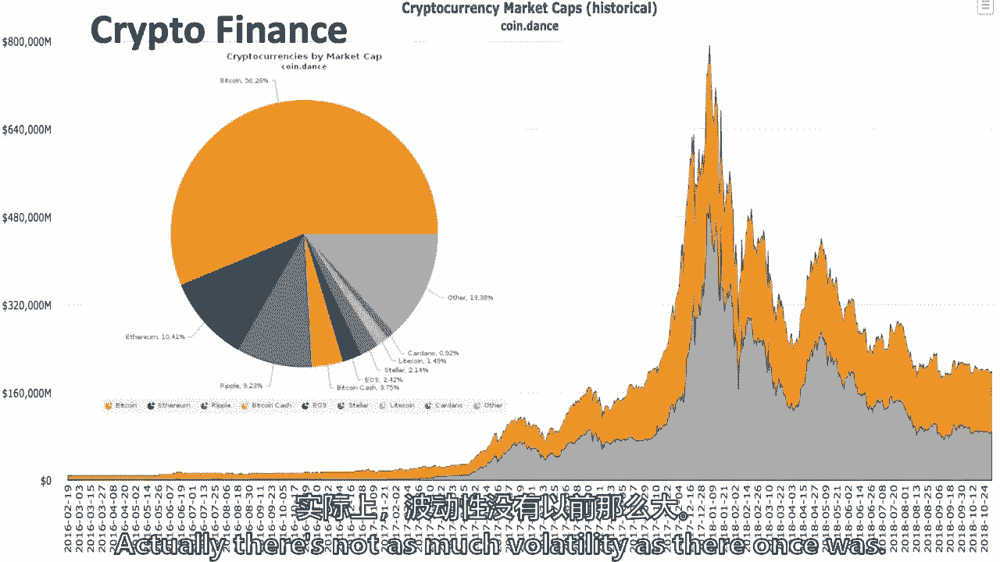
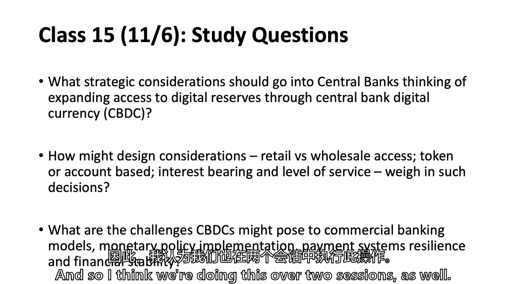
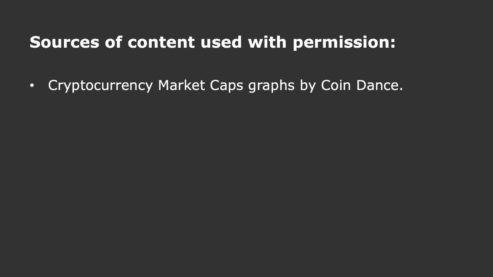
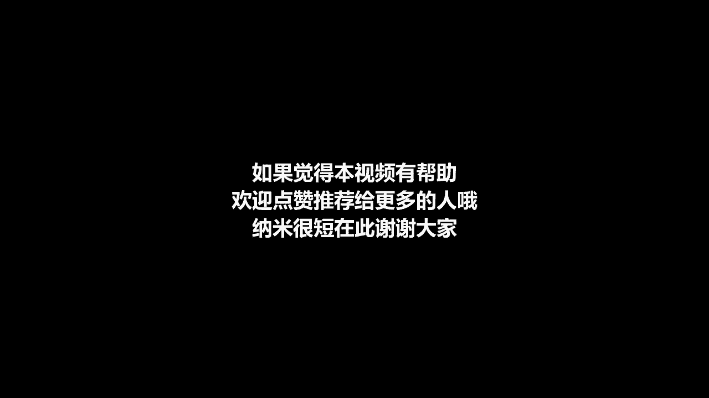

# 【麻省理工大学公开课】区块链与货币 - P14：14、付款-第2部分 - 闰土聊Web3 - BV1sL411N7Mm

所以付款，第二部分，我们今天要谈谈概述，读数，当然啦，就像我们一直做的那样，然后昨天是什么，有人想告诉我昨天是什么吗，昨天还有什么，今天是万圣节不，又不是我生日，停下汤姆，我们要聊一会儿。

我们会有一些关于周年快乐或生日的乐趣，你叫它生日还是周年纪念日，在这个领域真的没有既定的词汇，那是什么，生日雨果，为什么生日在一月生日，音乐真的会消亡，你得到了，你听到了吗，出生也意味着死亡，我有吗。

所以拉希姆说她会和周年纪念日一起去，但我们在这里有出生，我们会聊一下这个，尝试存在主义，然后我们将讨论支付系统和一些痛点，我们将进行热烈的讨论，你认为支付系统的痛点是什么，我我，当然会列出一些。

但你的投入是最重要的，区块链如何融入这个支付体系，为什么到目前为止还没有任何真正的经济范围或系统范围的收养，然而，所以有人甚至会说，区块链技术的痛点有哪些，还没有一些收养，我要去。

我们要聊聊一些支付区块链支付公司，也不多，我是说有很多白皮书，但真正起飞的并不多，然后把它包起来，我们要深入研究，而不是现在，但只是，你知道的，可以吸取什么教训，到目前为止，第二层可能会帮助我们。

当我们深入挖掘痛点时，我们会回到这些，有什么机会和跨界等等，以及使用许可和无许可系统的权衡，周年快乐，十年前的生日快乐，这是了不起的，其实，有人说是11月1日，因为我想当它真正出现在网站上时。

那是11月1日，在世界的一些地方，那么我们对十周年纪念日了解多少，只是一些有趣的统计数据，这一切都发生在十年内，所以价格大约是6300美元的比特币什么都没有，智史，中本，它的规模是一千一百亿美元。

十年后我们可能不会都认识对方，但在一张纸上为自己写下，这是一次真正的练习，我要求你为自己做，自己写下来，把这张纸放在某个地方，或者把它放在你的笔记本电脑上，你可以把它放下。

你认为十年后比特币的价格会在哪里，在20周年纪念日，十年后记住这门课，回首往事，嘲笑自己，只是你知道，我们不会都认识对方，也许会有一个群聊，但那个阿里是什么，你不会想猜它在哪里的，你不需要和我分享，不。

不，但写下来想想，你知道你认为十年后会在哪里吗，这是个很难回答的问题，什么阿尔法，你想和全班同学分享你的号码吗，我们甚至只是在定向辩论，它真的会更高，有多少人认为十年后会更低，好的，我看大约是三点五。

有多少高，是啊，是啊，大约是百分之六十五，艾琳，两人分道扬镳，它将是零，我想那会更低，这是因为十年后这个系统可能会发生如此巨大的变化，即使称之为十年公平也可能是不公平的，它可能已经进化成了其他的东西。

谁在后面，请评论是一个真正的问题，比如市值，因为这就是人们实际上使用货币的目的，因为关于价格的问题将被假定为一个步数，股票将成为代币，所以人们在未来开采硬币的方式，也要看价格。

所以我认为你提出了一个很好的问题，如果你在写什么，你可以把市值写下来，而不是价格，你可以说，我是说，在利兹的一个案例中，你还是会说两个都是零，但你可能会说，当然啦，因为这取决于有多少硬币，有多少股。

有人想从另一个Eleni那里拿走另一边吗，我想你会零分，当你的价格为零时，它的价格就会为零，雨果井，我只是回应另一个评论，对呀，你知道大约十年后会有多少比特币。

从现在开始我们真的知道十年后会有多少比特币，雨果说雨果说你有，因为它被写进了代码，提醒我你的名字，以撒，我觉得挖矿太多了，我知道有些人可能在采矿和称重方面有更好的技术背景，以价格为基础的资源。

但我看到一个摇头，不是它的另一块，我想只是在想流动，对呀，思考实际正在交易或交易的大的，如果有限制市值，这类似于在中国看大涨的股票交易，你知道你实际上没有真正的价格，嗯，我同意那些，还有一个原因。

我们可能不知道，他们可以停止采矿，人们会在五年内停止采矿，如果是欧洲，哦，那是如果它真的只是减少了，没人愿意扩张，但还有另一个原因，为什么它可能是一个不同于Shimon A fork的数字，对呀。

五个人可能会达成共识，在此节点上更改，我所说的货币政策，我们在以太坊见过两次，以太坊有一定的采矿或区块奖励，他们把它切成两半，或者他们把它从五个削减到三个，我想现在他们从三个变成了两个。

它不在最初的以太坊里，所以可以达成共识，它不是，写的不多，但它可能是所谓的叉子，或者几乎是一致的，每个人都想改变货币政策好吧，所以这只是一点点乐趣，其他一些快速数字和事实，现在有一千七百三十万枚硬币。

到目前为止已经开采了1700万枚硬币，五十五万个街区，大约一百八十九场演出，每日交易，25万笔交易，然后如果我的小数是对的，哈希率是10的18乘以50，这比2009年困难了7万亿倍。

比特币现在比九年或十年前，它需要世界上三分之一的电力，一夜之间有一些不错的评论，在这节课的讨论中，关于这是否是一件好事，也许这不是一件好事，但那是比特币周年纪念日，其他几件事，唯一地址。

有五十多万个唯一的地址，比特币地址，所以如果有数千万人拥有比特币，只有50万个比特币地址，这是什么意思，大概有两三千万人相信他们拥有比特币，但没有比特币地址，他们在哪里拥有它，詹姆斯·安交换，在交易所。

或者在一些拘留中，本质上依赖别人，如果有50万个唯一的地址，但人们认为有两千万到三千万个账户，一万个节点，一点节点，是一个可以看到节点在哪里的网站，以及它对实际节点位置的集中，如此美丽的散布。

埃塞俄比亚没有阿尔法，然而，事实，我在肯尼亚没看到，你看到了什么，两个在肯尼亚，来自格陵兰岛的任何人，当然，它刺激了这整件事，我们以前见过这张地图，但最初的硬币发行大约筹集了20亿美元。

我们不知道这些数字是否正确，但这是它开始十年的十周年纪念日，这意味着现在有很多资本在追逐这个领域，有人想写下，他们是否认为科斯在十年后还会存在，有多少人认为最初的硬币发行会在，所以另一个，哦。

我知道倾斜在哪里，但你们其余的人，我其实不知道，我想他们会慢下来的，我想在2019年，2020年，他们会慢下来，因为很多人会失败，会有更多，市场会说，嗯，我们不打算投资这些，除非有一个更好的商业模式。

所以它被刺激了，这只是一桶别的硬币，一共有一千六百多个硬币，可能有1500多个会失败，或者除了1500人之外的1600人都可能失败，我可能会完蛋，哦耶，加密金融，实际上。

没有以前那么大的波动性了，我们慢慢地得到了一个更稳定的硬币，这并不意味着它会一直这样，但只要比特币在，定价并长期稳定，可能会有更多的用途，但我不会读六个月，并没有创造足够的历史来说，这件事真的很不稳定。

所有的权利，让我们回到支付系统，所以我要问，我的意思是痛点是什么，也许只要贴上图表就能告诉你痛点在哪里，但这是我们周二谈到的图表，关于一些挑战是什么，有人想给我一些想法吗，这一端是消费者。

另一端是消费者，它碰巧是一个U，S模型，但在大多数国家并没有什么不同，但区块链可以帮助解决哪些痛点，一个系统这样的痛点，有人想给我野蛮，系统中有太多的中间体。

这意味着太多的平行层是如此多的具有平行分类账的中介，你猜还有什么，通常的嫌疑人会有很高的成本，这么高的成本，通常的嫌疑犯，世界银行估计数，它占世界国内生产总值的0。5%到1%之间，这将是。

所以执行的速度，执行速度，那么你是什么意思，当你说，执行和付款速度，我想交易对手收到钱的能力，并能够花掉它，所以最终的解决方案，有时是授权，结算结算，但最终的结算往往在几天内不会发生。

但我想从客户的角度补充一点，刚刚关闭三秒钟，所以这是一个非常有趣的，有一个分叉的市场，从顾客的角度来看，商人一方的结算速度很快，商人可能没有你强调的东西，对不起在学生，所以他们不是为了生活。

我从来没有一袋牛和财政，所以我很难参加所有这些课程，对呀，金融包容性，所以我们有成本金融包容性延迟，至少对商家来说，正如布罗什所说，有很多中间人，有很多分类帐，是多分类帐。

这可能会给他们带来一些和解和成本，当然可以，肖恩，实时外汇七，实时外汇结算，你做什么，你说那里是什么意思，当你有一种货币的时候，您基本上可以转换，如果你有方向的美元，然后如果可以的话，保证一种加密货币。

你实际上可以使用它，你没有令牌，你可以马上解决治疗问题，所以我想我和你在一起，基本上是跨境移动，从一种货币跳，一种法定货币兑换另一种法定货币，从技术上来说，这恰好是从一个分类账系统跳转而来的，U。

美元分类账系统，你是说卢布吗，卢布，他们那里有账簿吗？是啊，是啊，他们那里有信，的，你知道的，作为背景故事，我过去经常参加在瑞士举行的金融稳定委员会会议，我想接下来会在阿根廷，但那是在俄罗斯的一年。

在我的区域，导数空间，所以我知道了，他们有分类账的总和是什么，我只想说，我确实知道，但我从你的费用延迟结算中听到了什么，尤其是对商家来说，我没听到任何人谈论收费，有人想告诉我为什么商人不喜欢。

所谓的退款，或者这是我们更野蛮的事情，所以我们在最后一堂课上看到了一百美元，2。75，美元被给了不同的多个中间人，就像溪岸，所以有很多成本，美国的二又四分之三，当它越过信用卡的铁轨。

但其中一个特点是收费，这笔交易缺乏终局性，所以我想你在竞选结束后谈到了竞选的例子，不得不让人打扫卫生，指控是欺诈或其他什么，不得不从，所以商人，商人并没有真正的终局性，杰克，有时收费。

对实际上没有花掉的东西的追索权，所以这种效果，比如消费者可能不愿意进入具有这种终结性的交易，所以我想，让我想起你的名字，丹和杰克在这件事上真的有两面性，从消费者那里，对不起，杰克是消费者，丹是商人。

从商人那里，他们想要最终的和解，他们想让我卖给你一个好，我在为竞选工作，我们卖的不是好东西，但我们得到了一笔捐款，我们想知道那里有两千七百人，在那里我卖了一个很好的，一杯咖啡，就完成了。

但从杰克的角度来看，嗯，我可能没有得到好的或服务，我要对此提出异议，你说我是纽约时报的订户，我不是纽约时报的订户，我不想每个月付15美元，因为我收不到纽约时报，这叫做收费，所以消费者和商人确实有点不同。

但在美国，这是第二和第三的一部分，百分之四，但美国的商人可能至少会说我宁愿不在那里，然后是客户是否会反击欺诈，当然是隐私，我没听到有人说，但是目前的付款轨道，实际上在现代计算机时代。

给了链条上的每个人很多关于我们所有人的信息，现在，我们很多人都不介意，我还想用我的Visa卡，我想用我的银行账户，但要知道我们都在放弃一点个人身份，因为他们知道我们是怎么花的，根据这些支出模式。

他们可以知道我们喜不喜欢枪，我们不喜欢枪，在政治领域，人们会看到这些东西，或者你如何过你的生活，以好的方式，我也是，因为这意味着他们可以向我们推销我们想要的东西，我们想读什么书，我们想喝什么酒。

但这也是隐私，提到了金融包容性，拉希姆，所以为了隐私，网络攻击，网络攻击和身份盗窃，所以我会说，这是一个很大的痛点，所以我应该很好，我同意你，网络攻击，等等，所以这些，有这些痛点，问题是区块链会不会。

帮助解决其中一些或所有这些，所以我们回到区块链的好处，你一直听我说的两大好处是什么，从……喷出，不管是来自克里斯蒂安·卡塔里尼的报纸还是凯利，网络的成本，然后是这样的成本，核查费用和联网费用。

我们不会再回去了，但这在某种程度上降低了验证成本，基本上这些痛点，包括网络安全问题，它们在哪里结合在一起，我是说一个，我会加一个，所以它可能会解决一些问题，但增加了其他问题。

然后我们需要把这些问题联系起来，看看，不不，这很好，这很好，事实上，我要去挑战，你要添加哪些问题，可扩展性，可扩展性，还有什么问题，粗野的，我从那边听说，i交易成本高，它是一种锁链。

处理这笔交易需要几天时间，它很慢，所以很慢，所以可伸缩性慢，可能交易成本比较高，阿莱克修斯能力，互操作性，所以都是我们的朋友，斯蒂芬妮，还有错误解决的问题，错误分辨率，当消费者试图预测错误时。

这是一个很好的选择，就像，你知道零件交易或类似区块链的东西，如果它是不变的，你做不对，所以这是一种权衡，这有点像杰克所说的，客户方面的退款，可能会有实际错误，这是一种不同类型的错误，而是一个错误。

我想说，我不再上纽约时报了，我向纽约时报道歉，我只是挑，但你说有可能是真的，空气西蒙，你有没有，不像核心系统，我们有这样的，这些延迟和不是真正的技术，但这是一个商业问题，因为平庸是丹尼斯。

终局性为欺诈打开了大量的曝光率，或者你知道，所以我们看到的目前的水平可能会上升很多，如果有人能，你知道给了系统同时取出他们的现金，对呀，很难成为，很难追根溯源，如此闪亮的升起，也许我们没有，我们有。

也许我们推迟了结算，也许我们没有立即的最终结果，因为作为一个市场特征，我们想要一些延迟的和解，以防止欺诈，以确保没有错误，正如斯蒂芬妮所说，可能是生意上的原因耽搁了，但是凯利，你知道吗。

有人想站在另一边吗，我想有人去另一边，这个艾伦，我是说，我有偏见，我承认，但我认为基本上这说明，让我们有一个劣质的系统在那里，因为它就像，是啊，是啊，我是说。

我想在某种程度上你确实希望有一个地方定居的好处，但有终局性也有很多好处，那么为什么不两者兼得呢，你知道的，你不需要只是拥有它，你是那种系统在那里说好的，这是一个声明，你也可以再带一个，你知道的。

另一个社会权利实际上为那些想要所有权利的人提供了终结，如果大家还记得艾琳在数字货币倡议工作，他过去是做收银员的。他承认他可能有一点偏见，但他说很好，你想要延迟结算吗？但我们不应该有另一种选择吗。

因为不是每个市场都希望延迟结算，埃里克是的，只是想把这两个观点和另一个挑战联系起来，这是关于治理的处理问题，因为在这里的情况下，比如说，有一点更精细，区块链的分布式排列，因为一个四所以处理一个集中的。

嗯安排比区块链容易得多是完全正确的，拜托了，另一个挑战是政府对反洗黑钱和，所以我编造了凯莉，我不确定这是否与它的结局有关，但其中一篇文章谈到了一点，事实上，管理流动性有一个问题，鉴于交易的速度。

特别是在公司一级，其中交易的价值要高得多，有一点机会成本交易对吧，所以我们一会儿要讨论的是，尤其是使用加密货币，作为两种法定货币之间的桥梁，但这与，随着加密货币的波动。

但我要说的是我要回到艾琳和丹的对决，我认为这项新技术是在我们可以缩短，还有很多付款的延迟结算，在华尔街证券，我们以前有，你会做股票交易，交易日加上比我们任何人都早五天，在我出生之前，然后我去了交易日期。

加三个，在欧洲，他们去交易加两天，证券交易结算二日，十年或十五年前的某个地方，当美国赶上，美国落后了，刚刚去交易加两天，但我认为技术在证券上可能是T+零，在付款中，你可以实时付款。

美联储有一个很大的过程，在那里他们得到了公众的评论，他们正在向所谓的实时支付迈进，现在，也许它会在2021年被采纳，因为它需要更长的时间来推出，但我认为技术确实提供了更多的选择，在某些情况下。

市场将继续延迟结算，因为这只是历史，这只是遗产，其他时候会延迟结算，因为他们实际上更喜欢，我想在证券界有些人实际上更喜欢延迟结算，我们将在几节课中讨论这个问题，但他们更喜欢，因为它允许做空证券。

当你真的借了别人的证券然后卖掉的时候，你通常在借之前先把它卖掉，所以做空，我们资本市场的整个部分都是围绕延迟结算建立的，因为你通常是卖借还，而不是借，出售和结算，把证券借贷放在区块链上。

你可以立即指出借来的东西，你得到并追溯，当你有证券贷款的时候，你可以做空T 0，并确切地知道什么证券将被借入，我认为把股票借款转移到一个在技术上是可行的，到区块链，我同意这一点。

但问题是这个市场的经济学，市场参与者是否想在出售之前实际安排借款，因为目前他们在安排借款之前就出售了，但他们必须在同一天找到，好吧，当它不是加两个取决于，对不起，我说的是金融，但也许你会帮我，好吧，我。

我们必须得到，我以前是做销售和培训的，我们不得不借一个参考号码，在有人做空东西之前，所以他们不能做空，我不知道它是否变了，所以我不，我不知道不，否，可能是，我是，我是老练的狗，那是现在你在说。

它们更紧了，但客户想做空一些东西，他们会叫我，然后我得打电话给做市商，在参考号码中借款，他们会切下那笔钱，他们想借的任何东西，所以其他人都买不到，然后他们把它卖了，所以就像在账本上做的那样，但因此。

市场可能已经在朝着它前进，所以我在证券借贷部工作，他以前叫，这就是我要说的，它在2008年后生效没有裸卖空，所以你必须让它们定位，你借的钱不是在同一天清零的，但我们实际上要到三点才需要借股票。

你只需要找到，你只需要像，但我想我的问题是，如果你认为区块链的证券借贷交易，你可以立即借用它，并能够追踪，然后当谈到召回时，所以对于那些不太了解金融和股票贷款的人来说，和股票借款，讨论的重点是。

市场是建立在延迟结算的基础上的，延迟的解决很可能是因为它们都是从纸进化而来的，不是电脑时代，所以我们有授权许可，在支付世界定居，但在库存借阅中你必须找到一个安全是一个细胞，听起来好像有一些市场演变后。

你实际上必须添加一个标识符，虽然你不必借，我的观点是所有这些都可以放在区块链上，但也有经济市场的现实，即有人是否想，我想让我们看看你是不是丹，你不想要退款，但杰克还是想要，在延迟结算中。

西蒙想保留他推迟的和解协议，艾琳想走另一条路，我怀疑在一些市场上，让我们和丹、埃琳娜一起去吧，决赛将是重要的，区块链允许什么，它允许终局性经济学成为一场公平的辩论，在某种意义上，水平，而在过去。

你甚至不能进行辩论，因为它是如此的纸张密集，这就是区块链改变经济学的地方，让我倒回去滑一滑，只是说为什么，也许也许区块链为什么，支付对区块链技术世界的可能适用性是什么，这些是我吐的，支付系统。

二手分类账，天啊好吧，那是他们使用分类帐的最佳地点，这整件事对多方肯定想读，在很多情况下，多方想写到账本上，就像实际记录到分类账上一样，所以就在这中间，您可能能够降低验证成本，但更重要的是。

核查费用对支付的经济性确实至关重要，你所拥有的，你说你有的钱，或者您将其发送到此帐户的值，而不是那个账户，所以从某种意义上说，我看着这个，我说，这感觉就像沃土，尚未开垦的沃土，因为十年，十年，周年纪念。

或者生日，任何其他想法，我是说小额支付是另一个，但是艾琳，你是专家，是啊，是啊，我是说，的，我认为这对一些人来说是令人兴奋的一件事，在DCI中，包括我自己在内的事实是。

你可以将代码附加到这些有价值的运动中，所以你可以开始编程这些金钱的圣歌，你是说附上代码来识别这是凯利的付款吗，或者是詹姆斯的报酬，还是你说它没有，智能合约形式的I代码，基本上智能合约权，只会说嘿。

你知道，我会把，呃，你知道这是视觉标志，同时这也是个人的一面，然后你把钱弄对了，这增加了额外的复杂性，传统的签证支付方式没有权利，所以你得到了一个全新的层，因为缺乏一个更好的可能性世界，当你开始添加。

好的，嗯，好的，我要去，你知道，我要给你一些东西，如果是，呃，如果外面阳光明媚，好的，我们可以实时实现这一点，我们没有真正的需要，一些调用集，我是说签证什么的，一个小梯子就一个星期。

我想我明白他的意思了，是呀，但我的意思是这将消除信任问题，就是签证，我不确定我得到了成本和交易的运动，验证不会被取消吗，是呀，你有智能合约正在添加层，但另一方面也消除了另一个过程中的一些层，是啊，是啊。

我不知道这么假设，我总是这样所以责任在建造这个的技术上，确保你不会失去功能，你在签证世界里，因为否则没人会用这种全新的支付方式，因此，假设你保持了技术提供的同等水平，然后添加附加功能，我要说。

我对打开的笔记本电脑很放松，我对人们在课堂上发短信不太放松，我知道我们都是多面手，但我只是，我是最放松的，你可以想象，但我开始有点紧张了，所以我得到了区块链允许智能合约，它显然是一个更蛮力的系统。

当我们谈论附加代码时，或者付款是自动的，我想就像我设置了一个自动支付我的有线电视账单每个月，所以一旦这笔钱到了我这里，我已经预先授权它通过，那么为什么你不能在非区块链中，设置已建立。

基本上是一个智能合约，那就有更多的有条件有条件的付款，那么你必须有区块链才能有智能合约吗，所以一个一个，如果我能回应这个权利，我听过的最酷的用例之一，我不会说出任何实体的名字，但你知道这个基于区块链的。

让我们说一个公司，因为没有更好的词，呃，谁想付钱给他们的员工，我说看，你和我一起在这里，现在我们要，我们要做一个聪明的合同，这基本上是支付你未来三年的服务费用，就是这样，除了这样一个频率，没有额外的。

现在和萨那签约，就是这样，你必须得到正确的报酬，然后你开始工作，你实际上有一个非常保险的方式，我会得到报酬，没有人能阻止它，你没有这个权利，有很多事情可能会发生，你知道管理发生了什么。

你知道无论发生什么，我可以想办法到处走走，所有的权利，这对确保嘿很有用，我会得到报酬的，那很有用所以，但你必须把它放在一边，就像，如果我是你的雇主，3。我得把我三年的薪水放进锁眼里，我对此无能为力。

如果你问，可能三岁，这是一个限制，是啊，是啊，但我并不是说所有这些都是一个限制，又不是你突然有钱了，这对每个人都有好处，对呀，但它们是有用的东西，我们从未想过的有用的事情，所以我想我是说有很多可能性。

我不知道有什么权利，它的用例，我不知道这只是一个例子，我以为就像，哦，哇真漂亮，我可以用这个，但你知道你是对的，我的意思是有很多含义，但事实上你对我来说有一个全新的探索，哇真令人兴奋。

就像我们看到了系统的作用一样，我们没看错，你知道，就像我们把90%的人存入银行一样，如果你在十个里，这对NAND来说是一种成功，它的工作原理是正确的，你知道你有很深的光，做，这是真棒，对呀。

但就像我们已经达到了这个系统的上限，也许还有一个额外的方法，让我们看看那里会发生什么，我邀请靠，因为你需要更多的最大化，对不起，詹姆斯，但是回到，前面的点，是这样的，我们真的需要区块链，做很多事情。

承诺要做的智能合约，我是说我在英国建立了我的，我说的是直接借记，只是在我的账户上消失了，在某一时间段，不涉及码头链，我可以看到区块链的一些好处，但又一次，很多智能合约，我们可以不用现有的系统吗。

使系统更好，这又回到了整个支付系统，这个领域有很多球员还没有被发明出来，在过去的二十年里一直没有创新，我们读到的，但他们能不能让现有的系统变得更好，没有区块链，所以问题是你真的需要区块链吗。

还是会成为遗留系统的催化剂，做他们在技术上可以做的事情，但这是一种尖锐的踢腿，在后面和后面，做得更好一点，这是一个很好的观点，对呀，这是我们争论很多的事情，实际上就像我们现在坐着的时候。

绝对有可能这条路是正确的，所以一个经常出现的例子是Vittoria，所以对于那些不知道的人来说，维多利亚时代，这是一种在线分享视频的方式，没有人，你知道它有很多问题，但它催化并改变了整个，你知道吗。

媒体分发，对呀，它是，你知道它有很多问题，所以它没有完全到达树林，但它仍然改变了整个行业，区块链绝对有可能夺回这一点，现在还不清楚，但实际上区块链可能只是一个催化剂，就像BitTorrent。

然后突然在一天结束时，我们得到了，苹果专卖店，谢谢。但在你想做的事情上，是啊，是啊，我只是想在此基础上再接再厉，我想那是我们的，我已经看到了这种情况，就像我最近在调查斯威夫特一样。

我认为在过去几年区块链之后，他们发起了全球支付创新倡议，看起来还可以，我们认识到我们的基础设施是遗产，我们需要做些什么来保持最新，他们花了很多钱，比如在消息传递平台上统一标准，让它更容易使用。

所以不是区块链解决方案，但肯定是一个发明家，所以它是斯威夫特的催化剂，Riple一直是Swift的催化剂，我们一会儿要讨论的，但其他人也是，但我还是会挑战团队，这是我们在这里都在努力做的事情。

是否仍然有机会只追加日志，你要附加的，您正在向注册表或分类账添加信息，你没有很好地删除它，这会很好的，你需要多方的共识写到分类账上，一位特殊的客人，你了解我，很多人可能，现在是Pre，他重要的。

另一个丈夫，我觉得，但这不是原因，他在这里，他不在这儿，他是来付钱的，其实没有，但你是一个报酬，给大家介绍一下，我不是专家，我和万事达卡一起工作，我碰巧也是个牧师，对呀，无价之宝，准确地说。

我们还在运行，所以你在万事达支付，给我们你的想法，所以说，我其实是障碍，来自区块链和加密货币有几个原因，所以你是极简主义者，你叫它巴里斯特，我呃，我相信你可以做到区块链承诺的一切，使用我们目前的系统。

这有几个原因，第一个是密码，很贵，是为了一笔交易，您总是可以在我们今天的系统中保护交易，使用现有的技术，所以你不需要有比特币或区块链，作为一个例子，我们所说的不可挽回性，说到比特币，另一个，呃。

这种优势是关于分布式信件，一切都可以通过我们今天的系统来完成，他们只是不选择去做，因为它很贵，当你将区块链扩展到数百万人时，这将是昂贵的，在其他行业，它也会变成那里。

在支付系统中最重要的两件事是接受度和规模简单，如果你达到了对区块链的接受度和规模，肯定行得通，每个人都在使用区块链和比特币，我想一切都会成功的，问题是，我们花了四十年的时间才得到大规模的接受。

获得Visa和万事达卡，整个生态系统中的问题，花了很长时间，它起作用了，如果你想用这个新系统取代它，并达到相同的接受度和规模，想想这是多么大的努力，几乎是不可能的，你必须在这方面花费的美元，什么好吧对。

所以我明白了，如果有几个人想带雨果，你要走另一边，我可以开始，然后我们要继续前进，但我只是我想听听另一面，因为我感谢你愿意直言不讳，因为它真的很有帮助，我不知道你的卷轴，掌握和弦。

但它只是什么是产品管理，但你是在为自己说话，或万事达卡，万事达卡也在用区块链翻倍，所以我不是为它个人说话，是啊，是啊，因为万事达卡实际上向美国申请了专利，s，密码专利局，部分银行业务和美国银行有四个。

密码空间的三项专利，Visa在书中为专利而发展，所以你有签证，美国银行，万事达卡等申请区块链专利，部分银行付款等，所以这是有趣的一面，莱斯格教授，只有一个资格，这有点取决于你现在是谁，我是说。

那么这些变量上的系数会发生显著变化，所以如果你没有可靠的法律基础设施，那么区块链技术就变成了一个真正的，加上相对于一个拥有非常可靠的基础设施的世界，很明显是发达的，所以拉里和我们分享的是。

有很多不同的国家，一百八十，世界上仍有17亿人没有存入银行，撒哈拉以南非洲的一半，例如，所以你知道还有一个挑战，对不起，雨果，我们，我本想说类似的话，我很欣赏你的论点，但听起来好像没坏，别把它弄得像。

我们花了这么多钱建立这个系统，所以你知道它现在起作用了，但就像，让我们不要看什么技术创新，我的意思是这不是，如果它没有坏的话，别修了，在过去的四十年里，我们在这个世界上取得了如此大的成就，改善它。

同时保持今天存在的基础设施的优点，而不是区块链只是一个撕裂和取代乐的东西，这并不能解决目的，当然我是的，我不认为区块链是一站式的，就像我更像比特币最大化者的一面，我想肯定的地方，如果你有一个全球货币。

你可以去任何地方使用它，你知道它是至高无上的，如果你做到了这一切，那就太好了，我知道你喜欢万事达卡和维萨卡，有兴趣说喜欢，我们花了这么多钱，就像你在世界上大多数地方都可以使用硕士学位一样。

但就像发生的事情，如果你进入，就像…的中间，我不知道印度或撒哈拉以南的某个村庄，非洲或其他地方，他们不接受信用卡，但他们有一部带比特币钱包的手机，好像我还能在那里交易，你可以用货币，也对，不，我。

但他们必须经历这个过程，所有的权利，所以让我们把刷子，然后我们就，我们会很好地讨论来印度，所以是的，所有的权利，所以我们现在有权利，所以他们喜欢，也可能是另一个解决方案，所以呃，我们有一个在。

在上一堂课的阅读中也是如此，关于印度的联合支付接口，这不是一个选项解决方案，所以印度政府实际上推广了一些东西，一个叫做支付银行的新实体，就像没有朋友一样，无服务，有点回到，呃，呃，促进金融普惠，基于此。

只需使用唯一的标识号和移动设备，你可以支付任何面额的任何款项，也可以是非常非常低的当地货币，你可以实时完成所有这些，没有任何这些中间人，这些都是低成本交易，没有利用区块链技术，所以你需要一个。

你需要一个，这就像不止，好像是九点，全国95%以上的覆盖率，以法院的名义，我就像你需要某种形式的身份证明，所以印度在过去的几年里真的是最前沿的，我看两三年吧，部分原因是他们可以跳过一些车轨。

没有广泛的采用或访问，正如sri在印度谈到的信用卡，和我们在肯尼亚看到的很相似，我们周二在中国谈到了，我们在哪里，在印度，更多的是，而不是私营部门，说我们想把很多人纳入一个系统，所以他们创建了一个ID。

唯一的ID系统，我记不起这些东西的名字了，那是，就是这张卡片，他们创建了一个付款，如果我是对的，或者没有人知道这件事，这样我就不会这么做了，不是二百七十个基点的支付系统，但可能以单至低两位数基点计算。

嗯，进入这个，身份证系统也有生物识别技术，现在可能会有网络安全风险，这就是一切，在某种意义上有点集中，但印度有点跨越式，挺有意思的，但我们进行了激烈的辩论，是终局性，我们想要或不想要的东西，是收费。

我们想要或不想要的东西，没有区块链你能做到这一切吗，还是区块链，需要的东西，当然，问题是，即使区块链真的很整洁很好，它会让现任者更多地进行创新吗，并降低成本，你想结束这个吗，我想我们是的。

我们可能会添加一些其他的东西，它抵制审查，这样你就可以，每个人都可以交换比特币，没有任何政府禁止，对呀，那是另外一回事了，这是一件有趣的事情，你知道吗，如果它抵制审查，你必须给我赊帐。

你不能决定我是否得到学分，基于我的种族、宗教或族裔，等等，那可能是什么，很多人会说这很好，但如果它抵制审查，社会可能会说好，那不是我们想要的，所以这是一套有趣的，你知道吗，当技术允许你抵抗审查时。

但社会说好，还是你知道的，我用的是，你知道很容易抓住，所以这是一个有趣的辩论，是呀，我想是的，当我们谈到，呃，不发达的发展中部分，呃，经济和支付的一部分和古典文学教授，呃是的。

我和我想我们有一个地址是最后一英里，就是流动性，所以即使区块链地址，比方说责任或转移，它没有解决的问题，是地面最后一英里的实际流动性和利用率，这对一个发展中的经济是非常重要的，对不起，让我想起英杰华。

所以英杰华，你是说最后一英里，有人可以在商店里使用这种加密货币，买他们的灰色和或他们的商品为一周的权利，以维持他们的家人，是啊，是啊，所以这并不能解决收养和许多问题，你知道的，可扩展性，对呀，法定货币。

在我们有纸币之前，我们有硬币和一切，金钱是一种社会结构，我们已经谈过了，并超越其优势，它是用来交税的，对所有的债务都有好处，公共和私人，在大多数国家，它真的正是，英杰华说。

整个社会说我将把这作为一个计算单位，或者是我为养家糊口而买的磨碎的货物，数百年来，人们采用的就是这种计算单位，直到他们没有，我不知道在委内瑞拉呆了多久，尽管它一直用他们的货币作为记账单位。

所以有时会有最后一英里的问题，即使有法定货币，但我我不仅听到你，我分享你的想法，你知道的，在最后一英里，如果你说得好，我们中的一些人谈到了挑战，有哪些公司，嗯，有加密，我只是列出了两三个。

但如果你想谈论别人，我刚在加密中列出，有创业公司，比特支付，最受欢迎的之一，它基本上是在对商人说，如果你想拿比特币，将为您将比特币转换为菲亚特，我是说，这就是他们这样做的本质。

我们有一些捐赠者想给我们比特币，从某种意义上说，我们是个商人，但我们也想选举一位总统，那些捐赠者可能想给我们比特币，所以我的一个同事，嗯，必须调查，我们能把比特币，根据联邦选举法，这意味着什么。

诸如此类的事情，我们研究了更高的出价是否，或者像那样的人，等等，我们选择不，因为我们不认为，有足够多的捐赠者真的想给我们足够的比特币，因为我们要宣布她是比特币候选人什么的汤姆，我们错过了吗。

这本可以赢得威斯康星州，我们用它切了一个威斯康辛州，好的，我会为那次选举道歉到死，但这是这是对的，但这是一个真实的故事，我的一个同事调查了这件事，我不是想让他背黑锅什么的，但就像，我的天啊。

我们要和珀金斯在一起的时间，Cooi，律师事务所和我们必须支付的费用，好好想想，我们只能拿两千七百美元，所以你知道你必须，每天，会是不同数量的比特币，不可能超过二千七百美元，因为我们不可能违反选举法。

所以最终我们把它排序，项目取消了，我分享这个故事的原因是现在很多商人，也许就像英杰华在最后一英里说的那样，商人们都在说，我不确定我是否需要这么做，但有一种方法可以做到这一点。

如果在座的任何人创办了一家公司，你说我想带加密，有公司会，为您提供接口和他们的费用，有谁知道，比特支付费用，这不是读数的一部分，但除了一个乐，所有的权利，艾琳，百分之一，所以说，如果你是商人。

星巴克希拉里竞选，如果你是商人，你说我想有不到两分，百分之七，我可以有一次费用，我想要终结，我不想要退款，取决于你站在这一边，他们只是想把它作为一个低成本的解决方案，百分之一的Priya一个类似的故事。

但也许有一个更快乐的结局，所以比没有赢得选举要高兴得多，所以对于很多慈善组织来说，这正在成为一个非常现实的问题，所以硅谷社区基金会报告说，它的捐赠增加了30%，由于数字资产捐赠。

这也发生在一些社区基金会，这是一个越来越有趣的领域，甚至有一个故事，我是说，没有一个真正发生的故事，其中一个交易所做这项服务，将数字捐款转换为，你知道你有货币，它崩溃了，因为音量太大了。

他们甚至不能喜欢涓涓细流，他们跟不上，但这现在正成为现实，也有一点声誉风险，因为你想确保这些资金不是非法资金，我的意思是它只是，有一点声誉风险，也许星巴克不会，当你在买咖啡的时候，我是说我不是。

我从没开过星巴克，但如此如此，加密交换机和比特支付提供了很多服务，电子钱包公司提供服务，肖恩，我只是好奇，该剧如何管理波动性，那个，如何套现，它如何管理波动性，所以只需要交易价值的百分之一。

但是接近的波动性可以超过几秒钟，那么在这种情况下，他们如何管理，所以他们是，它们基本上是由一些加密交换机排列的，我曾经知道，但我不知道他们是安排三个人还是五个人什么的，他们基本上在。

所以他们有接近实时的定价，所以我要去买一杯咖啡，按照技术的工作方式，让我们说什么是星巴克，一杯五美元的咖啡，挺贵的，不是吗？取决于你买什么，你想喝什么咖啡？二二五二二五，所有的权利，但是实时的应用程序。

BitPay应用程序正在计算，那是什么，他们觉得在几秒钟内他们转换了，他们拿了一些，他们承担波动风险，他们有可能在某些交易中赚取，嗯，波动性把整个都吃掉了，是呀，但他们基本上在他们的定价模型中有这一点。

美元和美元去星巴克，他们保证星巴克，你知道，两个，两个，五减百分之一，但这些大部分，至少第二个，第三和第四是机构服务，现在可能有零售服务，我不是法定人数是由J开始的，p，摩根，我想它甚至可能还属于J。

它要被旋转出来了，但R三波纹，这些真的是制度性的，B两个B或金融公司对金融公司，我在零售领域找不到一个真正好的初创公司，但两周后你会有杰夫，撒布器和凯利，在这里，你可以，你会在11月15日回来吗。

但你可以挑战，嗯，他们的比特币会有一个零售支付系统，所以会很有趣，一个零售支付解决方案是，如果有人走进14号楼，现在媒体实验室里有一台自动售货机，谢谢麻省理工学院，谢谢数字货币倡议，谢谢。阿琳。

但你确实有，你想描述一下，你贴二维码了吗，是啊，是啊，所以是的，绝对的所以任何想这么做的人，我们就可以，我们可以走过去看看，它有交叉链交换，所以你可以在三种不同的货币之间实时交易，你可以拿比特币生命币。

你知道，假人，美元，我们称之为，但这是你知道的，它基本上是一个稳定的点，这是一个稳定的点，所以比特币轻币和稳定币，媒体实验室里有一台自动售货机，你在上面放一个二维码，如果我记得，所以你在你扫描的机器上。

我们发布了一个应用程序，你基本上你知道，扫描您的主节点或计算机，您允许您的手机控制您的计算机，然后你就可以把钱从家里实时地送到你的自动售货机上，但在这种情况下自动售货机接收比特币，否。

所以我们实际上也添加了Arduino，将比特币转化为脉冲诱骗机器说，这些是硬币，所以自动售货机实际上得到了，你知道我们告诉我们如何我们去那里，嗯嗯，去媒体实验室看看，它是为媒体实验室成员推出的。

一周实际上是两周前，所以嗯，然后是现任者，ISIS启动支持，我确实在他们的流上放了万事达卡，我确实喜欢，你知道吗，但值得注意的是，有多少专利被申请，数百项专利正在申请，但他们几乎都是由现任者，现在。

是因为他们想阻止别人进去，还是他们试图制造进入障碍，还是他们这样做是因为他们看到了真正的前景和机会，他们想追求它，可能两者都有一点，拉里，你在摇头，都是障碍，都是障碍，你不认为这是任何不。

都是进入的障碍，然后像这样的争论，我们的系统很棒，你猜怎么着，追求你的系统的法律成本将是如此，一路上我们会得到一些专利，否，那些专利是非法的，是啊，是啊，专利诉讼的威胁足以阻止，便士，所以如果你是一个。

如果，你是个风险投资家，他们走进来，就像你宣布的前一天晚上，嗯，你死定了，是啊，是啊，美国后面有四个三个，所以在区块链空间，我阅读了每个主要现任者的战略，你知道，所以这里没有什么新鲜事。

所以这是一个迹象，这里有一些真实的东西，初创企业可能会有一些东西，你知道被弄清楚，签证创业对企业付款，在2016年连接，他们甚至宣布了签证，甚至宣布它没有得到很多收养，他们不确定，顺便说一句。

我认为更多的是允许而不是不允许，但这有点，现在，有人在自己的阅读中，也许瘦，我是说，我不是想详尽无遗，但由于这里的一些问题，没有太多的，这些都是真正的挑战，但我想说这些都是真正的可能性，我也是。

凯利然后是艾琳，那么一些退出的公司呢，就像在阅读罢工中，结束了他们的，听起来像是一个相当失败的情况，但我真的不太明白为什么，呃，呃，我们想回答条纹问题，是呀，我是说，Stripe不是比特币。

Stripe想在服务客户时使用比特币，他们不是这家初创公司，所以我认为备份是有意义的，因为他们的客户，有很多创业公司还在这里或不在，是啊，是啊，就像背景一样，Stripe是一家支付系统提供商。

比如Visa或万事达卡，或者他们不是一个网络，比如Visa和万事达卡，但他们是一家支付系统提供商商家会雇佣Stripe与万事达卡接口，嗯，但是为什么条纹决定不继续这个，部分原因是他们没有看到很多收养。

是我拿的，但阿里和你打算，是啊，是啊，只是我想要的几件事，所以这是一个很棒的列表，我认为这是一个很好的起点，我想在三个月前的某个时候，我的规则是，呃，在加密货币空间，嗯，大多数非投机资金。

所以现在我就像，我要低价买进，卖得很高，它要么来自交易所，要么来自矿工，所以你知道你得到了这个或我的，是呀，所以那是赚钱的地方，如果你不推测，你要么是未成年人，你赚钱，或者任何陌生人，把我的变成小调。

我想那会很有趣，我想我会把Bitmain放在那里，因为我想就是这样，比特主所以比特主，对于那些不知道正在经历ICO的人来说，呃首字母，呃，对不起，IPO，初次，呃，的，好的，他们呃，你知道他们有很多钱。

他们很坏，你知道，非常高的费率，他们想开始生产人工智能芯片，人工智能芯片对吧，所以他们很擅长生产芯片，然后我们去那里，他们要去那种，但在支付领域使用区块链支付的是我，我是说他们投资了一个圈子。

这并不是很奇怪，所以你知道他们就像，我是说他们有很多钱，他们试图把它放在其他公司身上，所以呃，是啊，是啊，所以偏见的交换，或者所有其他的人，有很多赚钱的变化，其他的都是这样的，周二我想谈谈跨境。

我们贴了一张复杂的图表，我不需要再经历一次，但我们都知道，这里有很多人可能会寄钱回来，当你移动某物时，c's，你从一辆菲亚特转到另一辆菲亚特，货币，需要一些时间，几个世纪以来。

银行系统已经形成了一种方式来做到这一点，从一种钱转到另一种钱，而我们说一个分类帐系统通过代理银行到另一个分类帐系统，昨晚群聊里发了一个学生，在这个领域只有十家银行，顺便说一句，我不知道那是否准确。

但这是一个非常集中的业务，因为他们是大型国际银行，不管是十个还是二十个，它是，你知道，他们可以多收一点钱，因为他们必须有通信，他们必须和当地所有的银行有关系，他们承担了一些信用风险。

处于某种信用风险之间的代理银行，的，两边的本地银行，在美国等等，在，比如说墨西哥，如果是在美国和墨西哥之间，所以一个一直存在的想法，它是，它被广泛地与涟漪联系在一起，但它不仅与涟漪有关。

就是这个简单的图表，如果我把菲亚特换成加密和加密呢，到菲亚特，这抓住了一座桥，加密货币或桥梁货币，我可以说我可以从美元变成比特币，或XRP，你填在中间，然后转向另一辆菲亚特，在我的例子中，墨西哥比索。

这可能会从系统中减少一些成本吗，我们之前有肖恩的波动性问题，如果密码波动很大，这引起了一些问题，如果有很大的成本或摩擦，因为现在你在做两种货币兑换，不是为了这个目的我称之为加密货币的。

我知道加密在技术上不是一种货币，但此时此刻，让我称之为，你有两个货币兑换所，因此，你有两个偏差差需要支付，只是做市商，你需要支付两次偏差差，你有一些波动性，如果中间的密码在移动。

但这个简单的图表是涟漪试图创造的很大一部分，X快速右X X电流是一个涟漪消息应用程序，它在和雨燕竞争，它有一些合理的采纳，很多银行开始使用它，但不要把它和另一种产品混淆，这是一个有趣的产品。

那种做这个的菲亚特加密，加密到菲亚特，那么什么问题，这会解决什么痛点，如果它在跨境有效，有人想提醒全班同学吗，用Tom减少了中介的数量，你不必有你的银行，与函授银行接洽，它与当地一家银行合作，那个。

然后我有点好，所以它可能，我想说这可能会降低中介，因为你仍然有菲亚特的两边，去银行，一家本地银行和一家银行，做十字架，你需要一些做市功能，在瑞波的情况下，他们试图构建到应用程序中。

他们有做市商提供流动性，有一个问题，有人提到流动性，一些流动性，但这可能会减少中介机构的数量，它还能做什么，通常在，嗯，兑换货币，在结算时间和你支付的费用之间有一个平衡，所以如果你想快速解决。

你得付更高的费用，或者你可以接受像更低的B，但有时需要几天才能结束，所以说，你可能会解决这个问题，这基本上是一种缩短结算时间的方法，这可以在几秒钟内完成，我不是说你不会多付一点钱，但这可以很快完成。

如果你有安排，所以有些人认为，我在会议上和他们谈过，大银行说那太荒谬了，大银行说不，我们可以提供美元与欧元、美元与日元之间的实时跨境现金流动，你不需要在中间插入什么，这需要大量的现金储备来抵御波动。

不仅仅是密码的波动性，但是那个特定国家实际法令的波动性，所以问题是，它需要大量的流动性吗，基本上你用了一个不同的词，也许，但储备，而是一个能创造市场规模的人，在加密对FIA中，在加密对FIA中。

我想答案是肯定的，就唯一的，唯一，目前唯一可能有足够流动性的代币，大小可能是比特币，尽管涟漪正在推广这一点，这是一种有趣的技术，他们有一个软件X Rapid，你现在就可以做到这一点。

但是有足够的流动性吗，你能移动超过一百万美元吗，可能不是，你可能无法在不改变市场的情况下移动一亿美元的付款，回到金融，回到金融的唯一途径，金融学教授写的很好，这项工作是受制于套利这项权利的成本。

你不关心x或p的值，只要你不是两者之间的英勇关系，呃是的，这是正确的，这是正确的，如果他们是这样，这些摩擦，不能从下面穿过去，如果你是苹果，我得到，我是说他们可能会把你，你知道，你知道这是，我是说。

喜欢什么，什么是，两种主要货币是什么，价差就像在下降，BIP是一个，上升的百分之一，基本上我是说它很紧，只是我不确定，我不确定，所以支持者，然后我们会回来的支持者，说，是啊，是啊，但他们真的在。

你知道吗，一美元比索或一美元凯尼恩，当然好的，假设他们不是，50个基点的利差是10个基点，嗯，这将是通过建设，的，你知道的，如果你往那边走，我也是，对呀，所以西蒙说摩擦可能是有代价的，嗯，我觉得。

这一点的支持者也会说，时间上有摩擦，从美元到比索，让我想起你的名字，那绝对是真的，即使是比索或任何货币，就像所有这些报价一样，任何人都得到了非常紧，但仍然有一个问题，比如周末，比如说，周末根本不报价。

所以如果周末有重大事件发生，这会改变你屁股或货币的价值，那你要到星期一才能交易，星期日，星期日香港，所以仍然有这样的，就像一个三六个小时的时间段，在，因此，全球货币市场依赖于，银行和银行确实有假期。

我知道有时候很难相信，但是，所以有一个问题，所以有一个摩擦力的问题，西蒙会说什么，即使你花了半个百分点，它最好进去，嗯，有一个解决的问题，延迟，这可能会更快，但你是说他们可以改变这一点，然后是周末。

你有一百六十的吗？每周一小时，我要去找亚历克西斯，然后回到这里，是啊，是啊，我只是在想，因为这个系统像印度一样，归根结底，就像这取决于两个Afrate，在两个菲亚特费率上，就像普通的马林鱼一样，对呀。

就像，即使我们不能交易，星期天，就像，呃，站台上的价格会有变化，呃，基于点赞，我不知道假设，比如明天的价格是多少，就像它会正常调整一样，你应该调整好，因为，作为以前筹集的资产，喜欢调整，无套利。

发生得很像，即使有可能，这个系统不是像，在以下方面增加更多风险，就像两种不同的风险，对密码的恐惧，密码，恐惧和仅仅因为总会有潜在的风险，菲亚特对菲亚特，因为它总是基于一个喜欢，我保留你的问题。

因为我想看看另一个是否进来，我拿到了，这是风险，我刚想说一下，你知道，非第一世界国家或未被禁止的国家，我就不那么担心搬家了，你知道，像院子一样移动，更喜欢关心，喜欢好，嗯，也许我得处理，就像。

你想为房间翻译吗，什么是院子，我的高盛，天数，我知道院子是什么，但是一些非银行家，现在是十亿美元十亿美元，你可以努力，什么交易大厅，你在做什么，现在，你可以在城市工作，一码就是高盛的十亿美元，楼层。

我也是，如果你想要点赞，如果你想交易，可能不到一百美元，从你知道的，呃美元给你知道的，随便啦，否，没有一家大银行会为你开立账户，你得像商业银行那样做，如果你可以访问它，那里有一种非常普遍的。

所以如果你能通过应用程序做到这一点，通过稳定的硬币或涟漪，或者你能以更便宜的价格做的任何事情，如果你在做微交易，所以我要做出反应，然后试着把它们放在一起总结，这是最后一张幻灯片。

所以亚历克西斯关于风险的观点，我同意，我认为所有这些观点都是有效的，有额外的费用，在这个例子中有两个啤酒花，还有额外的风险，所以真正的商业案例问题是另一边是否有足够的附加值，你是否缩短了结算周期。

你能在周末做吗，当你做不到的时候，你能把小额的美元，也许是零售，因为西联汇款仍然收取8%到10%的跨境汇款费用，所以寄点钱到菲律宾，只需几百美元，你可能花了10%，现在有人能在这些类型的里面建造吗。

两百美元的运动，十美分二十美元，你仍然要降低交易成本，固定交易成本下降，但如果你能降低固定的交易成本并处理，有足够的流动性，这是一种，我不会把这个算在内，我有点怀疑，苹果将在美元和欧元之间使用。

但我想说，这是广谱，这只是一个有趣的罐头密码，过桥货币的，在价值稳定的世界里，它可能是不稳定的吗，我希望我是说，这是一次很好的讨论，因为这就是本学期剩下的内容，我们将逐个用例进行讨论，穿过它。

学习的目标是让我们所有人带着一点批判性的推理技能离开，何时只有多方协商一致的追加日志，也许一个原生令牌是有意义的，通常被称为区块链，但精益不再让我称之为区块链技术，所以我要做我的推销，如果你是美国公民。

请投票，如果你不是，我不会要求你们投票，但请投票，你知道吗，所以我想我们也要在两次会议上这样做。

所以谢谢你，周年快乐。

