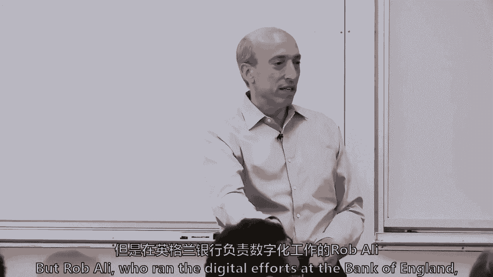
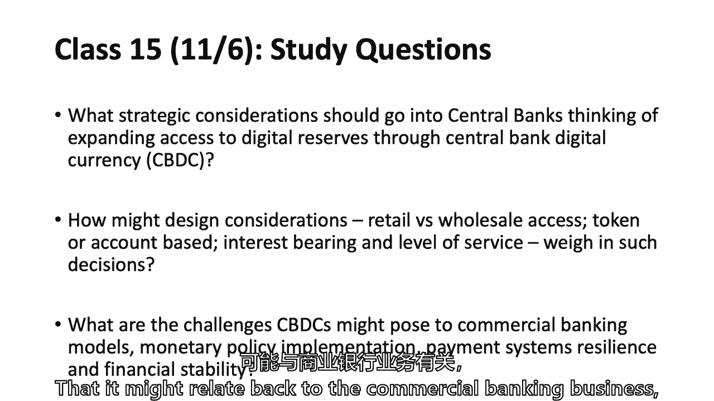
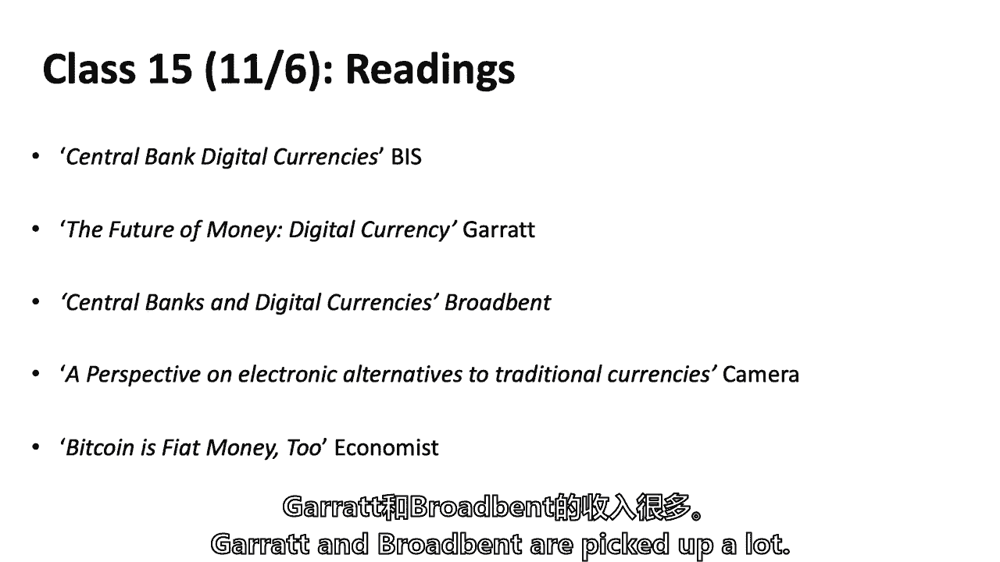
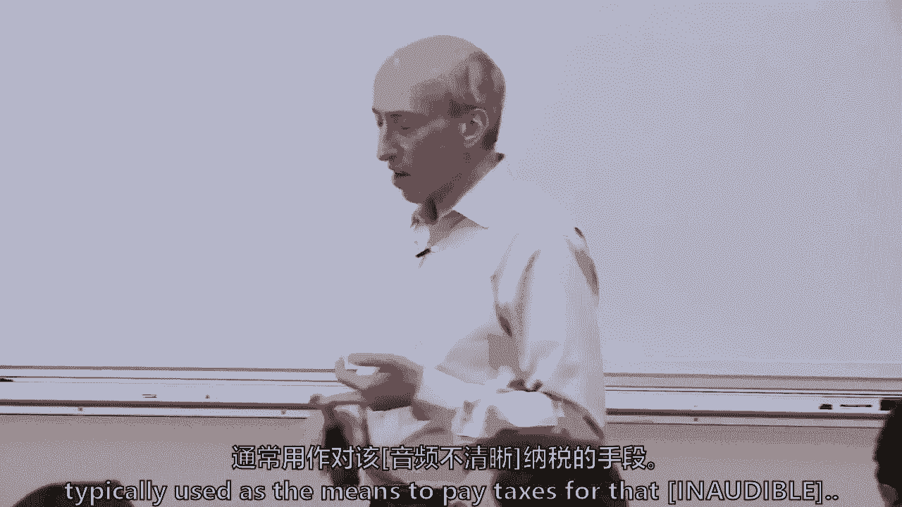
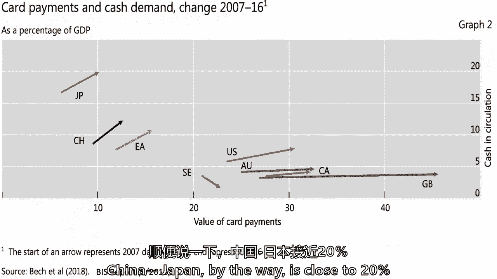
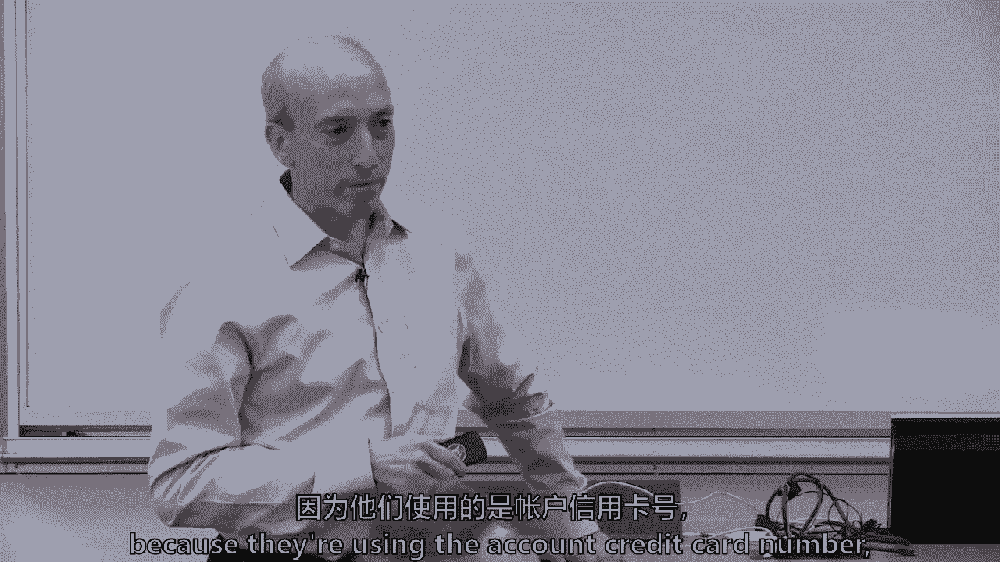
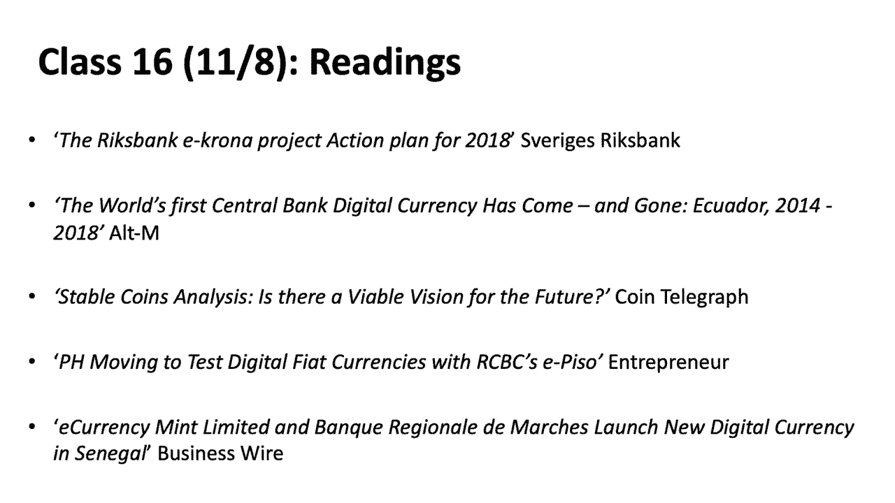
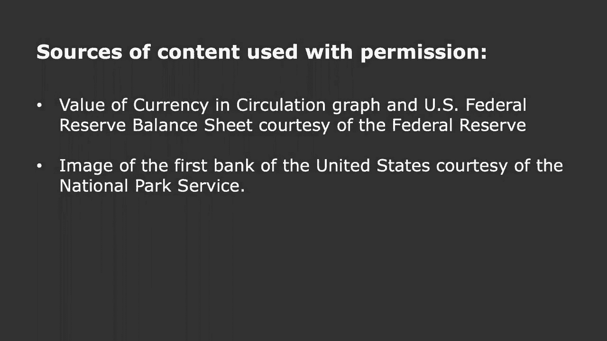
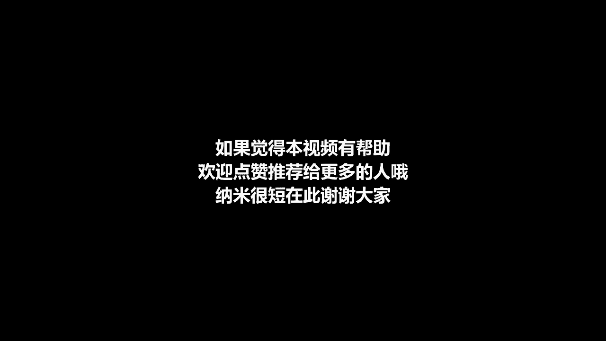

# 【麻省理工大学公开课】区块链与货币 - P15：15、中央银行和商业银行-第1部分 - 闰土聊Web3 - BV1sL411N7Mm

我们要，就在金融体系的核心，我们在考虑，区块链，我们将在两节课上做这个，我们很幸运，我们在房间里有一些真正的专业知识，我不是在说我自己，但是在英格兰银行负责数字工作的罗布·阿里。

现在是，已经有一段时间了，媒体实验室数字货币倡议的一部分，会时不时地出现，给出他的观点，不仅从麻省理工学院媒体实验室的角度，也从他所做的历史中，他在这方面写了许多论文，他和技术人员一起工作，创建。

多项技术，但我会让罗布，告诉你一点他在中央银行的工作，西蒙·约翰逊也加入了我们，他是国际货币基金组织的前首席经济学家，他告诉我他不想被抓住把柄，但我会邀请西蒙在某个时候给出他的观点。

从国际货币基金组织时代开始，但大家都知道，西蒙是，斯隆教师，一个伟大的老师自己教了你们很多，全球市场课程和G实验室课程，诸如此类的事情还有西蒙，我在春天教一门公共政策和私营部门的课程。

这只是我再一次把它塞进去，那也是个不错的课程，现在让我们先谈谈中央银行和区块链，关于我们的阅读和学习问题，我们要做些什么，我们将从法定货币开始，然后再回到法定货币，它如何适应中央银行。

所以今天最初的20%或30%是关于中央银行，它如何与货币相适应，他们的方法是什么，我们将讨论中央银行采取的四种不同方法，然后潜入这四种支付系统中的一种，他们现在如何看待支付系统，所谓的金钱花。

你可能还记得bis报告中的钱花等等，然后把它包起来，所以那是，这就是我们试图研究的一点，问题实际上是关于中央银行的，他们在想什么，他们是如何考虑数字储备等等的，因为我有一位客人和我在一起。

我不会做那么多冷冰冰的电话，因为我们要把时间留给罗布，站在这里，在我们经历的时候给出他的一些想法，但关键问题真的是，他们会如何看待设计方面的考虑，我们将在课程的后半部分深入讨论，设计零售与批发接入。

应该是基于令牌还是基于帐户，是否计息，我们周四会讨论很多关于，为什么瑞典现在发表了他们最近的论文，这不是指定的阅读，因为报纸大约一周前出版了，但他们说他们认为他们应该对，这是我不一定预料到的。

但那是他们的想法，截至2018年10月，那么与广告相关的挑战是什么。

银行业务，整体经济，这是一点背景，这些是读数，我向你道歉，因为这周的阅读量可能有点大，这意味着你们都略读了，而不是真的跳进。

其中一个读数，宽边罗布，罗布·本特写的，我得坦白，这都是本的作品，我看了一份他发给大家的草稿并对此发表了一些意见，我只能说，我以为可能是罗布写的，或者回顾了一下，和在U面前作证的加勒特。

在这些问题上经常被国际设置银行和其他机构引用，所以如果你真的想考虑两个，加勒特与宽带。

或者捡了很多，经济学家的文章有点生动，一路带我们回到亚当·史密斯身边，有人读过经济学家的文章吗？记住什么是什么，有人记得亚当·史密斯·詹姆斯吗，我想他基本上争论了所有做得对和错的事情，用货币。

比特币到底发生了什么，正是比特币正在发生的事情，在经济学人的文章中，它谈到了17世纪70年代，当他们开始从金币转向纸币时，他们在1773年建立了一个清算所，处理所有银行之间的票据，亚当·史密斯显然写道。

这是空中的马车轮子，黄金是金钱的高速公路，但是纸币和纸币的中央清理是空中的马车轮，所以经济学家基本上是说这些争论和时间一样古老。

但也许这也是现在发生的事情，所以我之前已经介绍过数字货币倡议的罗布研究科学家，麻省理工学院他帮助宽带，他想说他做了，但他帮助宽带做了他在英格兰银行所做的一切，西蒙，谁在狂热地做笔记，我得到了。

我做对了吗，是啊，是啊，好照片。

这幅画有什么不确定的，所以法定货币有人会提醒我，什么法定货币是野蛮的，你有点没精打采地坐在椅子上，所以是呃，我看到通常由中央银行或国家政府发行，也就是，呃，我觉得，那就是，呃，它不是生态系统中的规范。

所以它是由一个中央背部发出的，这是系统中的规范，什么是什么是两个，法定货币非常重要的经济特征，这使得它在我们谈到的任何经济体中都被广泛接受，原因之一是它通常被用作豆子，为此纳税。

所有的权利，所以税收，另一个是什么，几乎每个国家你都可以为Priya使用它的大的一个，你在看我吗，肖恩什么，是啊，是啊，你可以用它来偿还债务，所以社会聚集在一起，说你可以用它来偿还所有的债务。

公共和私人，你可以用它来缴税，它给了它巨大的网络效应，在任何经济中都有优势，然后发生的是我们社会中的许多人，然后用它作为记账单位，有大量的网络效应，货币的原始经济学是其他人会使用它并交换它。

因此它成为交换的媒介，计算单位和价值储存单位，所以它是由中央银行纸币代表的，商业银行的存款依赖于分类账系统，这使得它有一定的适应性，为什么区块链在这个领域很有趣，税收和债务。

所以我拼凑了一张幻灯片来思考，最终你会明白我要去哪里，但是商业银行和中央银行都有钱，中央银行货币是储备和现金，所以不仅仅是我们口袋里的现金，也是储备，银行存款实际上是一种货币形式，所以一个小图。

如果中央银行在顶端，这些是银行的数量，商业银行，准备金是商业银行在中央银行的存款，当中央银行在两三百年前开始时，商业银行想从政府那里得到一些东西，他们想要一些支持，他们想要一个最后的贷款人。

他们必须在中央银行开立账户，但今天当我们有了统一的分类账，然后中央银行向银行系统发放准备金，这些储备是一种货币形式，接下来就是，下面是公众，鲍勃·爱丽丝和查理，我们都有钱，这叫银行存款。

但这个谜题还有另一块，如果我能得到它是现金，所以三种形式的货币，我们都可以口袋里有现金，因为我通常在这里拉这个，我要看着你，雨果，我要看着你，但没有，否，但那是什么，对呀，美联储票据是一种代表。

在中央银行，他们为我储存了一些价值，它有一个序列号，从某种意义上说，那张纸本身并不是价值的储存，即使我们接受它，你会说，那是一种价值储存，在某种程度上，价值的储存，我知道它值20美元。

为什么它值二十个特别的东西呢？如此如此，看看会发生什么，如果你把它交给抢劫，我们要了，所以你才知道它有价值，但这是一种象征性的金钱手段，这是一个物理标记，中央银行在那里储存了一些东西，但你也有银行存款。

如果你去星巴克，你在星巴克买东西，詹姆斯，如果你在星巴克买东西，你给他们什么，小菜一碟，好的亚麻布，但你到底是谁在这里好吗，所以当你给信用卡的时候，你给星巴克什么，最终一个想法。

我有一些钱在我的银行账户，你可以拿去换咖啡，换咖啡，你要，我希望你给他们的不仅仅是一个概念，从信用卡公司收到一笔应收款，付款系统会做什么，他们只是有权得到报酬，从信用卡，那家公司会检查以确保他们愿意。

最终该应收款将被移除，银行存款，银行存款，你永远不会递给我一张20美元的钞票，那是什么好吧罗伯，那是一笔很大的学费在麻省理工学院很便宜，嗯，但是罗斯，你想经历这些，所以应收款将是银行存款。

他们从信用卡公司收款，谁会把钱从他们的账户转到星巴克的账户上，然后信用卡公司寄给你一张账单，所以有两种不同的关系，所以当他们检查你的卡时，只是一家信用卡公司，检查它的记录。

看看他们是否愿意发行以接受当地的开始，所以你真正做的是，你在花一种叫做银行存款的钱，你又回到了假设会下降，星巴克要做什么？往上走，所以三种形式的货币，现金，因为中央银行给了一些钱。

所有这些都是在分类账结构中处理的我们讨论过，所以账目，他们的中央银行账户和银行账户，只是账目是总账，我刚改了词，它通过一个系统移动，我们上周谈到的一个支付系统，我把实时总结算，上面那个小盒子。

实时总结算是银行和中央银行之间的系统，几乎每个国家都有某种形式的实时总结算系统，在这里，我们可以称之为联邦电线，我看到一个倾斜是一个实时的总结算，也可能不是不，他们不仅仅是联邦电线，还有一只。

但我给他们薯片，芯片，芯片，所以在美国，我们有芯片和联邦电线，实时总结算，和中央银行，然后你有各种各样的系统，那个小盒子里的东西读起来不那么重要，基本上是在背部之间移动，所以这是中央支持。

以及它是如何融入金钱抢劫的，到目前为止我们做得怎么样，1。你什么时候来都行，所有的权利，那是什么好吧，我们得到了一些反馈，虽然，但我只想用现金做两件事，经济中的现金正在上升一点。

为深入阅读的人提供的bis报告，这只是一张图表，它来自你的阅读，这是现金，占国内生产总值的百分比，你会看到一支箭向下，瑞典，瑞典只有大约2%的经济是现金，美国在上涨，大约是百分之八。

我们有20万亿美元的经济，我们有一点，在这20美元的钞票中，有6万亿美元，所以在大多数国家，它都在上升，中国。

顺便说一句，日本的现金占其国内生产总值的近20%，我加了这个图表西蒙，这是为了让你猜测，嗯是的，为什么这么高，为什么为什么日本人这么高，我们这里有谁是从日本来的你想回答这个问题吗，阿基拉。

人们肯定倾向于使用现金而不是信用卡，呃，人们尽量避免使用信用，使用帐户。

信用卡号码，叫做，这是一个非常好的，呃，所有的人，我觉得用那个号码不舒服，所以有点文化，我是怎么想的，是啊，是啊，和技术或更多的文化，所以年轻一代有权使用信用卡，但年纪大的人不会。

我想这张幻灯片有趣的是，瑞典的许多其他中央银行，就像矿井里的金丝雀，他们看到腰果掉下来了，他们在思考这样一个基本的问题，公众是否应该获得中央银行的资金，他们现在有现金。

我们应该提供一个数字版本的不再方便了，从二十年前开始说，这个颜色，所以它在捕捉，银行在市场上购买大量面的影响，所以问题是，这是否反映了，因为我们在27到2016年开始，还有别的事吗。

但在这段时间里还发生了什么，这一时期根本发生了什么，抵押贷款危机，抵押贷款危机，或者更广泛的金融危机，所以有，所以应该有一个实物现金的运行，这不是金子吗？但这更多的是，在某些情况下是安全的，现在我爸爸。

如果他会好起来，他在这段时间还活着，但他会把钱从银行取出来，西蒙，你没听过这个故事，但我爸爸总是有一些金币和一些钻石，他没有，他大部分时间也带着枪，在这段时间里，你不容易得到金子，很多人去现金。

你认为U值多少钱，s是1。6万亿，我们经济的8%是像这样的20美元钞票和10美元钞票，你觉得一张一百美元的钞票多少钱，但它不在读数中，我只是有点好奇，这里的人是怎么想的，是啊，是啊。

我觉得100美元的钞票，所以百分之八十，1。6万亿中的80%，有人有不同的想法吗，这是我从20个中抽出的一张图表，一万六千亿中的十七个，看起来大约1。3万亿是100美元的钞票，那么在美国扩张的是什么。

不是二十美元钞票和十美元钞票的使用，这是数百个的使用，我本可以再贴一张图表，这些100美元钞票中的一半以上被认为是在国际上持有的，他们甚至没有被控制在50，继续，阿拉斯加夏威夷的四个八个大陆州。

他们不在国内关押，所以成为储备货币是很棒的，作为一个价值储存器是很棒的，罗斯，我正要问价值得分的问题，也许我以前听到过你，当我们经过二十个，你说它是一种价值储存吗，我以为你拒绝了。

如果其中一半是100和海外，那就是价值的储存，是啊，是啊，我不认为有真正的答案，我想说这代表了一种价值储存，最终在中央银行的账本上，因为中央银行可以，如果他们想否认使用这个，他们没有。

他们已经几十年没有了，但我是说有人可能会说这是一个糟糕的序列号，但大多数人会说20美元的亚麻布是一种价值储存，我本来想问，你会期望它们的速度是相反的吗，逆相关，就像20美元的钞票。

我是说他们的速度可能比100美元的钞票还快，尤其是如果它们是商店的价值，对呀，我是的，所以问题是20的速度比数百的速度高，是呀，意味着它们翻转得更快，它的一个衡量标准是有多快，必须更换，和一美元的钞票。

我想平均寿命大约为18个月，他们不断进出系统，我也不完全确定，但我想20年或3-4-5年，我为那些不是美国人的人道歉，但现在很难找到鲁本斯，鲍勃·鲁宾或本森的，那是20美元钞票上90年代初的签名，现在。

部分原因是货币设计一直在变化，嗯，所以数百个不像他们翻转的那样经常使用，因为货币设计改变了，因为即使在非法活动中，你宁愿要新的一百块也不愿要旧的一百块，因为新的一百个更安全，它不太容易被伪造。

当我在美国服役的时候，我不得不花很多时间，你知道我必须在这些安全的房间里见面他们把我们锁在里面，你知道是谁伪造了钱刷，让我们回到上一次航班，所以我在这里看到的是，在大多数经济体中，垂直变化较小，呃。

我假设这意味着，呃，现金交易价值，或者也为较低的较低交易这样做，如果是这样的话，那么增加i值节点的基本原理是什么，这只是对不起，我是说，我是说，为什么要多几百美元，与较小面额相比。

现金似乎更多的是低价值现金，所以Brosh在问为什么，中央银行有几个选择，他们可以发行纸币来满足需求，需求实际上是通过这个叫做这个的东西来证明的，公众要求现金吗，这就是大部分正在发生的事情。

或者他们能不能放一些配额制，或政府法令，就像在印度，他们说不，你得把旧钞票都上交，印度有一个积极的愿望，从系统中取出现金，但在美国，我们没有这样的经历，我们没有任何真正大的政府兴趣把它从系统中删除。

所以你所拥有的是，你对数百个作为成本储存价值的需求越来越大，不管是为了非法活动还是直接合适的，你知道活动，中央银行正在促进这一点，我们国内生产总值的8%，或者1。6万亿美元的纸币。

对美国来说是免息借款吗，s，政府，埃里克，是啊，是啊，我只是想就价值储存发表一个简短的评论，然后回到，我们在第一堂课上讨论的是，它实际上是一种社会结构，相信你会，呃，解决呃，迪奥或纳税没有，没有货币。

让我想起了一个故事，是这个，这是真的，这是一个南美毒枭家族，这个，这个陷阱，没有在被抓住的边缘，他们所有的资产都被政府没收了，这个故事是他儿子讲的，他实际上坐在一个公寓里，被一堆堆的美钞包围着。

他们实际上什么也做不了，他们实际上用它们来燃烧并获得一些热量，然后你回去想，是不是，真的，呃，呃，作为内在的货币，是回到社会契约，对呀，因为他们的钱对任何人都没有好处，呃，在那个特定的南美国家的商人。

原来如此，如果你的意思是，这是一种社会结构，我是一个同意的人，同意，那样的话，也许也是一点点时间，纸币价值，他就要被捕了，你知道，所以可能有，所以说，我对那种情况了解得不够，但可以肯定的是。

让我们来谈谈中央银行，我选择了美国，但是它，这在全球都是真的，因此，中央银行已经承担了一些经济政策目标，在美国，它在20世纪70年代被写入法律，一九七七年，准确地说，所谓的双重授权，有趣的是。

这是一句名言，有效促进实现最大就业目标，逗号，物价稳定，长期利率适中，这就是已知的，就像在美国，美联储的双重使命，你可能会说这看起来像三个任务，西蒙，你有什么想法，你们的价格适中，所以这是其中一个。

因此，大多数人称之为双重任务是价格稳定，最大就业，你知道的，取决于你怎么不会这么说，成为联邦储备委员会成员，但我不对吗，你在这两个州竞选总统的一些经济学家，如果你想竞选欧洲中央银行行长。

因为他们只有一个任务，所以在全球范围内，中央银行可能有不同的任务，但几乎我会说，虽然我没有研究过一百八十家中央银行，它们都将保持价格稳定，或者确保没有太多的通货膨胀。

因为他们的业务是获得公众授权来获得资金，这才是现在的核心，他们是做什么的，他们理财，我认为它是供应和价格，但这是关于供应和货币的，供应是实物现金，我们是否继续发行更多的实物现金，这一点，六万亿现金。

但还有更广泛的东西叫做货币基础，这不在阅读中，有人想告诉我像M2和M3这样的事情吗，学金融课程的人，你在研究什么是货币基础吗，或者我一个，或者我两个，或者我三个，没有对你的反思，可能是斯隆的倒影。

我现在只是问问，所以中央银行对货币有不同的衡量标准，一个通常是最硬的核心钱，在美国，它过去只是现金或现金和活期存款，s系统，大约是3。5到4万亿，所以大约一半是现金，然后他们添加。

美联储称银行的活期存款，或者就像现金一样，这可以追溯到四五十年前，开始说辛苦钱，m 1是m 2包括其余的存款，所以美国的M2大约是14万亿，在美国，大约有13万亿，或者我们经济的65%是存款。

银行系统有你来自的每个国家都有不同的数字，我只是以美国为例，所以存款比现金多，独联体大约1。5到2万亿，存款是13万亿，你把它们加在一起，你大概，我用的是这个术语，松散地，我是二。

这是一种更广泛的货币形式，这里大约有14万亿美元，在美国也有一个M3，还有其他衡量金钱的标准，美联储试图管理这一点，他们不仅通过印刷多少实物现金来管理它，但这也是银行系统中的杠杆。

如果你让银行系统高度杠杆化，那么你本质上是在创造更多的钱，如果银行系统需要更多的资本，那么它发展经济的能力就会减少，这些都是美联储或英格兰银行的大工具，或者任何中央银行都必须基本上塑造货币供应。

但他们也做了一些事情来塑造货币价格，那就是利率，钱的价格就像，我借给抢劫的钱，一年后他要还给我，钱的价格是多少？两个大工具，货币供应量与货币价格，如果你想成为你的中央银行行长，你在法定货币里，生意抢劫。

我有什么想法吗，是啊，是啊，你知道那差不多是对的，呃，很明显，这一切都有点像现代中央银行，出现在70年代中期，当布雷特·伍兹走到尽头，所以这就像浮动汇率，更多的是Reum，有一些这方面的好书，有一个呃。

最近出版了一本书，欧元区的历史，就像欧洲的监督联盟一样，大约有40年的历史，给予或拿走不同的皮肤，呃，休克与身体，国际货币基金组织有个家伙，我想在，呃，大危机，他写了一本很好的书，就像欧盟的历史一样。

这是如何工作的，这经历了很多，就像任何一个需要，基本上去红杉的尽头，我觉得离合器在1971年的一个周末，如果我的年份正确的话，二十世纪七十年代初理查德，尼克松，带到戴维营。

那是马里兰州西部的总统度假胜地，他需要在一个周末聚在一起的领导人，他当时必须是保罗·沃尔克，但他召集了四五个人，在一个周末参加了U，It’金本位制结束了，我们在20世纪30年代有点脱离了金本位制。

但二战后，有一个国际共识，布雷顿森林，中央银行和中央银行仍然可以用货币兑换黄金，所以我们仍然处于金本位，罗布可能有不同的观点，我的一个好朋友杰夫·加顿正在写一本关于那个周末的书。

但是法国人想要回他们的一些金子，他们把它找回来了，但后来英国人开始制造噪音，英格兰银行开始制造噪音，他们想要回他们的一些金子，理查德·尼克松面临着挑战，所以他决定取消我们的金本位制。

有很多历史学家争论是否英格兰银行强迫它，或者不是西蒙，所以他们的目标就是我们的目标，他们想用他们的美元换我们的黄金，这就是他们想要的，我我明白了，所以说，约翰逊教授说这实际上是，Let’学校在等，是U。

上帝还是英国的上帝，他们有美元余额，他们积累的权利，这一切都是公平和好的，在这种情况下，你可以将你的美元余额兑换成黄金，直到理查德·尼克松说你不能，所以问题是这是谁的金子，在理查德尼克松的观点下。

我想西蒙也同意，我不知道，因为你是双重国籍，你不是吗？我只是不知道当你说我们的黄金，谁是金子，所以你的英国口音把我甩了，好的，所以理查德·尼克松会同意约翰逊教授的观点这是我们的黄金，直到今天。

英国人都会说，我们不是真的要求，后面有人对此发出了一些声音，嗯，我不知道，如果是这样的话，甚至可能是，你就会翻滚，那么他们做了什么，中央银行实际上是做什么的，他们监督部分银行系统，还要规范银行体系。

我是说，如果你坐在这一切的顶部，你可能想调节整个系统，这就是为什么在全球范围内，有时像在英国，他们把它交给了另一家机构，然后把它拉回来，雨果，是啊，是啊，我有个问题。

所以我理解中央银行是如何将新的货币引入系统的，但是试图减少现金供应的机制是什么，会增加，就像，不允许商业银行使用军事杠杆，或者他们如何把钱带回来并处理掉，所以你可以你可以。

你可以把一个很好的问题应用到你去，说着，你怎么能改变钱的数量，我将使用所有数字形式的货币，不仅仅是实物现金，但是所有的数字论坛，你可以有效地说，任何一家银行都需要更多的资本或更多的准备金。

所以你降低了部分银行业务的乘数效应，如果你需要百分之五的资本，这意味着每1美元的资本可以有20张资产负债表，如果你突然说不，你需要百分之十，那么你就会把银行系统缩小一半，例如，所以有很多工具。

但其中一个直接的工具是准备金要求和资本要求，它不是唯一的工具，因此，这将是对商业银行的授权，它不一定会直接与零售商互动，零售，正确，是呀，纠正美联储以多种方式管理货币供应，但是一些直接的方式。

他们有直接的需求，但他们也需要非常重要的，第三个要点，促进安全及有效率的支付系统，在一些国家，在座的许多国家，在建立中央银行的立法法案中的书面权利，表示他们必须促进一个安全有效的支付系统。

如果没有写入立法，它是每个中央银行的核心，他们也是最后的贷款人，当银行倒闭时，他们进来支持他们，我们的中央银行成立于一千九百一十三年，在一千九百零七年，我们遇到了危机，到处都是银行倒闭。

有人知道那次危机的历史吗，谁实际上是最后的贷款人，在美国，1987年的经济，不是U，中国的政府，j p，摩根，银行，JP摩根，那个男人，那个男人，我是说，他有一家银行，他有一个图书馆。

他有很多其他的事情要做，当然，你知道的，你可以说他是他那个时代的比尔·盖茨或沃伦·巴菲特，但从某种意义上说他比沃伦·巴菲特或比尔·盖茨更有影响力，在一千九百零七年，我们已经走了，我们有一个，事实上。

那张照片，右上角是费城的美国第一银行，十七年设立，它是建立在一个20年的宪章上的，汉密尔顿和杰斐逊大吵了一架，华盛顿否决了它，汉密尔顿错了，华盛顿给汉密尔顿一周时间写报告，它是，这是一份写得很好的报告。

我已经好几年没读过它了，但当我回去读的时候，我是一个金库，一周后，华盛顿签署了这项法案，杰斐逊从来没有原谅汉密尔顿和其他许多事情，但它是一个，这是一个妥协，在1811年，我们不再有中央银行，所以我们在。

u，There’中央银行有中央权力，经常是加密的，无政府主义者说你知道，因为货币是由金本位制支持的，或者因为部分准备金银行业务，幻想是毫无价值的，我想你会怎么回应，所以银行就在房间里。

你对此会有什么反应，我是说钱是作为一种社会结构的东西回来的，对，任何事情都可以做，如果你想几乎任何事情，所以如果你有足够多的人认为某样东西是钱，你没有它的价值，一美元和比特币也是如此。

但我想问题是你如何在系统中产生信任，我想美国政府通过让一个国家，还有其他一切比特币有这个矿工网络和这个代码，你知道把他们的信仰，所以它只是以不同的方式产生信任，但喜欢说像钱只是一文不值。

如果每个人都认为它一文不值，或者像一群重要的人，所以津巴布韦元一文不值，是的但是菲亚特是一个毫无价值的概念，我的意思是，你知道吗，现在你有一个选择，你可以选择，一种密码，如果你想的话，根据您的喜好。

但我认为很难维持它一文不值，当很多人一直在使用它的时候，你可以用它来换取商品和服务，我也想，法定货币在危机中遇到了很多挑战，通常与国家糟糕的财政政策有关，政府正在超支其税收能力，因为税收就是收入。

然后通常与战争有关的支出，但并不总是，嗯，或者对货币政策，本质上，过去大量的印钞，在新的日子里，这是货币的实物印刷，它是数字化的，这是监督，银行业，一些最大的银行危机导致了一个重大的，本质上。

扩大货币基础，在爱尔兰，还有其他国家等等，但我们在美国并不独特，s，这可能会破坏社会对法定货币的共识，以二十世纪四十年代末的中国为例，每隔几分钟你就得担心，你有足够的现金来支付你的餐馆账单吗。

如果你在餐馆等等，在任何处于恶性通货膨胀之中的国家，你通常是一个社会结构，但它很少没有被另一种法定货币取代，也许有更强大的军队或更强大的中央银行，或者，但在一些危机之后。

它偶尔会被另一个国家的法定货币所取代，有许多拉丁美洲国家说得很好，这不管用，我们要去美国，美元，该死的，我们不会相信我们的君主，我们要相信别人，记得我曾经说过，我想在这门课上，历史和西蒙保释了我。

和罗布建立了我，但英格兰银行的历史是，英国国王正在和法国国王打仗，需要借一些钱，但不能轻易借到，我想大概有150万英镑，一些贵族说，我们就这样给你钱，如果我们设置一个板，最初是英格兰银行。

本质上是君主和贵族领主之间的契约，也就是说我们必须检查，然后战争继续，我不记得了，你们可能赢了，打败了法国人，但正处于战争之中，那很好，顺便说一句，你被记录在案了，视频抢劫，是啊，是啊。

我是说自行车会出去找更多的霜，是为了资助与法国的战争，但有趣的是，这是因为英国内战实际上是在17世纪中叶，所以在那之后不久，所以那是在国王的权力被显著削弱之后，所以袋子差不多是在同一时间出来的。

同样的检查君主的精神，所以让我们继续一点，这样我们就可以了解中央银行在做什么，但本质上中央银行所做的是，他们监督银行系统，我的意思是他们通过稳定的价格来促进经济，在一些国家也有双重任务的概念。

他们通过供应和定价来管理法定货币，监督银行系统，基本上是政府的银行家，回想一下16世纪90年代一些贵族资助国王，仍然会发生，中央银行有时确实为政府提供资金，所以美联储的资产负债表。

我不打算在这上面花时间，它将在画布中的幻灯片中，嗯，区块链与密码，有些，我想说大多数人都在监控研究美联储会是这样，因为他一直在和中央银行说话，但监控和学习是主导，限制，限制其使用。

它们是监视器和学习的混合体，因为，其中一个读数实际上来自一名高级政策人员，他每隔几个月就写一些出色的作品，有一块在像，或ccn，这是一份加密时事通讯，或者玉米电报，现在，我对中国中央银行了解不多。

他总是把它放在最下面，这些是我的个人观点，但我怀疑，他不会被允许写这些东西，如果不是，但您可以限制加密的使用，一些国家，比如中国，我们正在这样做，我们要谈谈支付系统的实验，然后有一个叫做中央银行的东西。

数字货币倡议，罗布和我知道答案，但我对这群人很好奇，靠区块链技术吗，是或否，所以是的，它靠我的手，不要紧，靠区块链技术吗，我没看到一只手，不如不，有多少人认为不好，你做了你的阅读，你读了吗？谢谢。

她是西蒙，但它不一定依赖于区块链技术，但我认为这是这门课的核心，区块链技术和货币研究的核心，因为它绝对受到了整个运动的启发，尽管第一个写这件事的人是托宾，在二十世纪八十年代，如果我是对的，我是吗是的。

是啊，是啊，一九八七年什么的，我认为托宾写的基本上是给公众一个直接的象征性的手段，超越纸币，帐户的数字手段，你让我感到骄傲，你说不，让我们谈谈上次的痛点，星期四的讲座，但是有一些支付系统的痛点。

因为你的反馈，我加了一两个，但费用延迟结算，退款，欺诈，隐私，金融包容性，之类的，嗯，为了罗布和西蒙，这是上周四的讨论，所以公共部门正在做的一些是非区块链倡议，完全非区块链倡议，欧洲联盟。

美国其他国家正在做一些关于更快的支付的事情，基本上是试图将支付系统转移到20，每天四小时，一周七天，周末不锁起来，在那里你可以真正移动，商人可以像银行一样做这件事，那么不管是目标即时支付系统。

或者在欧洲被称为小费或更快支付工作队，这导致了更快的付款，一种机制，我想我猜普里的丈夫正在做这件事，他在特遣部队工作，RM上周四加入了我们，他说他在万事达卡，所以发生了很多事情。

我只知道我把另外两个国家，印度的即时支付服务实际上是政府赞助的，政府，我想其中一位先生，西蒙，几周后你要在麻省理工学院发表演讲，Arvind在上面工作，在英国，他们说。

我们不仅在更新我们的实时总结算系统，但有政府的授权，银行必须向所谓的开放API开放他们的银行账户，很多事情都发生在非区块链上，与付款有关的，使其更快更容易访问，但在这中间。

以下是区块链领域正在发生的一点事情，在南非白皮书的帮助下，我把它分成三个阶段，所以我感谢南非中央银行，首先是第一阶段，三个国家写了论文，加拿大、巴西和新加坡，加拿大和新加坡，甚至叫他们什么。

它在加拿大被称为碧玉项目，在新加坡被称为乌宾项目，他们做了一些实验，全部基于以太坊网络，你们能做一个更好的支付系统吗，基于以太坊，所以一个开源的区块链无许可系统，他们测试了一个新的实时总结算系统。

他们通常的做法是让他们国家的银行，如果你阅读他们的每一份详细报告，有一些相似之处，也有一些不同之处，但总的来说，在你的国家得到一组银行，使用平台，试着做一个谈话，看看它是否有效，阿里，建立无任务系统。

他们想看看，如果他们能利用以太坊网络建立一个更好的支付解决方案，或者你是说他们在当前的以太坊上开发了一个智能合约，或者他们会部署他们自己的以太坊无许可网络，他们做了哪一个，我想是，他们只是爬上以太坊。

像部署一样部署它，在矿坑外就不一样了，我不知道怎么做共识机制，现在，你会看到什么，因为我想快速进入第二阶段，第二阶段，他们都没有用以太坊，第二阶段，又发生了两个两个倡议，日本和欧洲一起。

当我说日本和欧洲的时候，日本和欧洲增加，和南非，所有这些都已经出版了，在那些不同的州已经发生了，在十七岁中后期到十八岁，我们都得到许可，他们在看科尔达，超分类账结构和仲裁，超分类帐织物和Corda。

所以我想伊莱恩，这种开始回答你的问题，然后他们说好，否，在没有许可的情况下是行不通的，他们中的每一个都在第一阶段，他说，我们认为这在一个无许可的系统上行不通，然后让我们进入第二阶段实验。

我们现在处于第三阶段或第三波，我们最近没有收到巴西的信，我不知道那个项目是否基本停止了，能有支付系统解决方案吗，所以我只想谈谈新加坡，给你一个阅读之外的味道，但新加坡项目的一点点。

但它通过谈论这个项目捕捉到了所有这些，这是他们报纸上的，嗯，但他们真的看到我们处于一个多阶段的过程中，他们愿意公开说我们将比现在走得更远，现在，我们想到达国内交货和付款的地方。

以及未来支付与支付系统的关系，钱对钱，交货与付款，DVP基本上是一种安全与金钱的对抗，所以如果你看到DVP这个词，是做证券生意的，同时移动证券和付款，而且没有信用风险，我不会给罗布担保的。

除非他把钱给我，反之亦然，有一天问我，在我们有DVP之前，市场是什么样的，嗯，所以新加坡愿意公开宣布，我们要把这个，我们能走多远就走多远，相互支付和证券的跨境结算，d对p对p就是他们所说的。

你可以认为是证券的D，他们会成功吗，他们需要留在区块链上吗，我不能，我无法预测，但他们是，他们愿意说，我们要试一试，他们现在在哪里，第二阶段，当他们测试科达时，超，分类账，织物和法定人数。

他们有一份整整60页的报告，他们在一两个月前发表了，关于他们每个人是如何工作的，基本上付款与付款，现金，大额现金流动，但以下是他们测试的六个标准，他们说他们现在通过了每一个，我看了完整的报告。

我不得不说我突然意识到他们可能通过了，但我不是一个足够的专家，这东西变得非常颗粒，问题仍然是，你能用Oracle数据库做同样的事情吗，这是一个公平的问题，但他们基本上测试了它，你能把付款数字化吗。

你能分散处理吗，你能排队吗，排队付款，和很多跨实体支付，你必须把付款净额，我要付钱给罗布，罗布要付钱，雨果，雨果会给我很高的报酬，这说不通啊，你把它都网住了，在所有这些实时总付款中，这是一个排队因素。

那么这里的集中处理是什么，这是在哪个国家新加坡，新加坡，新加坡，中央银行综合症，或者它显然是非常集中的，中心是什么，他们写的是，他们认为你可以降低，没有中央银行，他们积极地，这是中央银行。

写论文说我们可以在系统中有更多的弹性，如果数据库是分布式的，在这种情况下，他们有11个银行参与，这11个银行有单独的节点，现在它仍然是一个允许的系统，你可能会说，不知何故，中央银行有一个公证节点。

也许吧，但它是十一家银行中的一家，对这个系统来说，比把它集中起来更有弹性，货币政策还抢吗，你做什么，你想对此添加什么，因为你罗布是这样游泳的，我也不，是啊，是啊，我是说，我想是，这是最大的挑战之一。

对呀，因为，我认为很重要，因为如果你有一个系统，因为我觉得有一种本能，当然，一些中央银行他们想，你知道保持肾上腺素，这个系统很好，好的，但我们想有一个特殊的节点，对于中央银行来说。

我们可以在另一边做这一切，我的论点是，你实际上想尽可能地限制中央银行的权力，因为在某种程度上，中央银行对这个系统有特殊的权力，这在系统中造成了一个弱点，因为如果这些知识被接管，那你认识的人都可以去。

你知道改变系统已经有效地，所有的力量如此糟糕，这就剥夺了权力下放的好处，如果有什么原因，但在我看来，放权点增加了，通过说好攻击的代价，攻击系统，我们必须攻击其中50%的节点或其他什么。

但如果你有一个特殊的模式，可以做任何事情，那么你只需要攻击一个负载，它有点挫败了对象，所以我认为当你和中央银行交谈时，你必须说服他们需要一个他们喜欢的系统，几乎把它设置好，让它走了，而不是你知道。

必须不断地干涉，必须有这些特殊的权力，这么多国家有什么有趣的，会有各种各样的，我真的认为许多中央银行都在监控和研究，滑流和一对夫妇在，让我们限制使用，滑流甚至瓷器，上面说我们限制使用，还在研究这个。

但一些国家，如新加坡和加拿大，走在了前列，说着，让我们弄清楚，也许这项技术会使支付系统，因此，法定货币体系更具弹性，它是它仍然是未知的，但他们真的他们真的想测试边缘，所以也许这只是一个奇怪的观察。

但我觉得很像，智史和比特币试图去中间化，是那些从中获得灵感的人然后试图推进他们自己的技术，它觉得这是一个竞争威胁，像什么脱节，就像，他们怎么想用这个，为了一些基本上是为了分解它们而建造的东西，首先。

佩服你的第一次，所以Zon在问，它在做一些不仅仅是分散的事情，但你知道，不信任不可靠的系统，无论是在电子和电信领域，还是在其他地方的初创企业，如果他们有什么好东西，现任者将研究这项技术。

看看自己该采用什么，部分原因是他们受到初创企业的威胁，在这种情况下，我真的认为中央银行已经感觉到他们的脖子上有一点热，一点点热，比如我们必须考虑我们的支付解决方案和货币解决方案。

也许区块链技术有什么东西，但不管是脖子上的热量还是机会，现任者总是会关注技术，这就是为什么你读到的报纸，有时日内瓦报道说西蒙和我们的三个同事还有我，今年夏天写的，叫做区块链技术，我们是不可知论者。

部分原因是我们五个人共同创作了它，嗯，但我们觉得这抓住了我们的五个观点，坦率地说，这根本不必在区块链上，也可能是一些做了独特事情的初创公司，我的意思是，超越密码虫的独特之处，你知道的不止这些，嗯，嗯嗯。

我知道你会，呃，所以我只是好奇，关于这个时间表的细节，在再说一遍，嗯，关于时间的其他细节，就像，中央银行处理一笔付款需要多长时间，就像一直到定居点，这种法定货币，所以不是研究的时间表，不是这个时间线。

但你说的是一个时间表，特定于这一特定项目，以及他们定义的六个标准，我得回头看，这是个好问题，我想新加坡没有说过，他们将在2019年以前完成这项工作。但我不知道他们是不是说约会，像二二一或二二。

但这是一个针对特定交易的多年项目，一直处理到结算，需要多长时间，哦，新加坡和加拿大的测试用例在几秒钟内，但我不知道这是否像纳秒，否，它很快，还有一个问题要问你们三个，嗯，还是需要担心的后期问题，报告。

当我读到这些报告时，我们将在周四主要讨论，但我想把它设置好，因为罗伯不会和我们在一起，星期四报道，这将创建一个数据库，新加坡11家银行之间的这一许可区块链，这只是一个测试。

它只是一个测试基本上是一个账本的形式，所以我不认为他们已经建立了任何客户，用户界面和报告方式，但交易分类账与银行分类账相似，正如我所理解的，但他们没有建立用户界面，除非抢劫，你知道其他的。

所以让我们来谈谈下一个，可能是基于区块链技术，也可能不是基于区块链技术，但他们绝对受到区块链技术的启发，我们之前看到了，已经是数字货币了，然后是物理令牌，我一直盯着这个物理标记，所以这就是金钱的形式。

然后商业银行在美国发行银行存款，对公众和银行存款来说，这大约是13万亿美元，只有一点，其中7万亿，所以银行存款是最大的货币形式，而且都是数字的，本质上，银行存款是中间人，那是我的话，但它是数字货币。

银行存款，只是不是直接和中央银行在一起，它介于两者之间，如果你回到我之前的流程图，因此，私营部门也在试验稳定价值代币，我们要谈谈这个，星期四，有一些读数，我现在不打算深入讨论，有一点竞争。

所以这就像Z前面的问题，私营部门，圆和系绳和其他人都有这些稳定的价值标记，所以那边有一点竞争，所以中央银行的战略问题是，我们是否应该允许直接访问数字储备，我们有一个中间的中央银行数字储备，叫做银行存款。

但我们应该有直接的东西，就像现金一样，中央银行和持有者之间的直接关系，这才是真正的战略问题，当你我相信，当你远离技术，你不必知道哈希函数或任何东西，这是战略问题，为什么我认为有一些机会。

本周四我们将深入讨论更多，但我想让罗布看看他是否想谈谈这件事并告诉我们，我想这是一个真正的问题，在瑞典，已经凸显出来了，他们希望继续参与支付手段，瑞典已经下降到gdp的2%左右，或GDP的1。5%。

他们是克洛诺斯吗，身体上的克罗诺斯，美国仍在8%或9%，但是他们说没有人再接受肉体的克朗了，在瑞典和挪威等等很快，大多数零售商不会接受他们，所以他们说，也许政府需要有一个持续的直接关系。

它能否促进银行系统的竞争，因为否则，如果你没有，那么银行正在控制支付系统和支付手段，促进金融包容性，不是每个人都有银行账户，嗯，也许他们可以有某种数字形式的中央银行货币，而不是银行账户，痛点，我会说。

对一些国家来说，避免U的数字货币，s，制裁，委内瑞拉和伊朗都有中央银行的项目，数字货币，当然啦，区块链技术可能与这六个原因或五个原因有关，你不需要区块链技术，但我要说的是，区块链技术可能是相关的。

分类账上的法定货币，验证和联网成本对货币经济学至关重要，所以我不会把区块链技术排除在外，因为区块链技术可以降低验证和联网成本，但我想我们现在知道是否，但它可能会产生影响，所以挑战，这周四我们将再次潜水。

抢劫，你想说这些挑战吗，是啊，是啊，我是说，我认为本擅长宽带演讲，是的，本在概述这个方面做得很好，我认为最基本的是这个，对呀，这才是真正的，目前在英国和欧洲，我想，除非美国，但对美国来说。

这在很大程度上是正确的，也是，你非常依赖，如果你做了一些基本上从银行抽干存款的事情，你喜欢从根本上改变系统的性质吗，你要如何建立一个系统让人们喜欢为抵押贷款提供资金，或为企业提供资金，或者不管是什么。

我认为这是最大的挑战，嗯，所以他们问，就像，的，中心问题，我想我想是子弹，经济是我认为对中央市场影响最大的，所以基本上，如果你把袋子分离出来，银行不再收款了，使用U，s数字，十三万亿存款。

但只有12万亿的存款，或者六万亿的存款，因为三到五个世纪以来，或者肯定是工业革命以来，银行是我们经济中的一个重要特征，我们六八节课前就有了这个，在U中的这张图。

China’中国欠我们经济的债务约为3个百分点，我们经济的八到三八成都在负债，不全是银行债务，但银行黛比是其中的一大部分，嗯，答案必须在某种程度上，是呀，但是什么是，那样做的利弊是什么，不是你能不能。

而是这是否是一个更好的系统，更好的经济，无论有没有它，都有更好的增长，肖恩，我只是好奇，你能用不同的利率来代表不同的风险水平吗，他们使用一个微分兴趣点，作为资助公司的一种方式。

他们可能会因为太糟糕而得到低，哦，他们可以得到这个角色，所以问题是，你能试着用利率来做吗，这将我们引向设计考虑，基本上我列出了你可以放的最后一个，有趣的是，我们周四会更多地讨论，瑞典说不。

他们认为他们把利率放在上面，但你不能做利率，我想听听你的想法，星期四，嗯，为什么瑞典会出现在那里，这有意义吗，你可以对它设置限制或上限，说这些只是低美元账户，你只能有一百欧元或一百克朗，你知道多少美元。

这真的只是很小的事务性计数，相当于20美元的钞票，不是一百美元或五百欧元的钞票，所以你可以设定限制或上限或没有利率等等，你是否让它被广泛使用等等，所以有所有这些设计考虑，我猜是罗布。

你已经和很多中央银行谈过了，他们在这些问题上有什么看法，就像你在2018年看到的那样，对它的意见，我认为歌词或cathing是一件很难实际实现的事情，总是那种，嗯，对此持怀疑态度，就像。

如果你有这些账户，你说好，我们只有一个，要给它上一定数量的钱的人，跑步中实际发生的事情，我是说政府真的会说，嗯，否，你不能再放更多的像，在任何危机中都会有很大的政治压力，所以我认为猫不被视为可行的。

然后我觉得生息的事情很有趣，我是说，现金不是他们利息的唯一原因是，因为从他们的兴趣出发写一篇论文在技术上很难，所以我认为有了数字货币，他们可能，你知道你可能会给自己一个选择，所以是的，如果你愿意。

我们可以把利率为零，但为什么要限制自己说，嗯，我们不收利息，因为再一次，就像，这是来自实体银行技术的限制，没有真正的必要把它导入数字世界，当你可以通过设置圆零来达到同样的效果时，如果你想。

一些国家探索这一选择的原因之一是，他们认为制定货币政策会更容易，因为你会有负利率，实物现金很难，哦，没人喜欢那样，嗯哼，现在，你不喜欢负利率的两个外星人，有一段时间，我们实际上是负利率，当然是公司存款。

嗯，但如果是的，如果一切都是数字化的，没有实物现金，中央银行说我们可以，我们实际上可以去，没有下限，利率无零约束，我想你在某种程度上不一定需要那个，因为如果你能创造更多的钱并把它注入经济。

它有同样的效果，对呀，所以什么抢劫传奇你可以通过货币供应来影响它，而不是货币定价，所以对我来说，这两个都是最有趣的，第二个项目符号是基于令牌或帐户的，两者融合在一起，在某种意义上，这张纸是信物。

没有人在帐户里存钱，当我把这个交给罗布的时候，你可以拿着它，罗布，那是你的费用，记得没有人，所以这是一个基于令牌的，一点钱，它就是这么叫的，基于令牌的，基于令牌的，钱更匿名，你可以保留更多，匿名。

帐户基础是当您实际上将所有权保存在注册表的某个地方时，即使那张20美元的钞票是在某个地方登记的，它有一个序列号，这是象征性的一点钱，他们必须改变法律，他们自己的中央银行法律，现在我不记得了。

但如果是基于令牌的，他们有，这将受到他们的电子货币法的约束，我认为他们不需要改变法律来做到这一点，但在瑞典，他们将不得不改变他们的中央银行法律来进行电子存款。

因为他们实际上会向商业银行以外的其他机构开放他们的中央银行，就是这样，他们必须，而不是基于令牌的，如果我记得，所以你可能需要做其中一个或另一个也有一些法律原因，但一个会比另一个更匿名。

这些是关于这个令牌与帐户模型的注释，就是，它没有很好的定义，人们说代币是什么意思，还有很多不同的东西，嗯，还有从事比特币工作的人，他们会这么想，当我看到令牌，我想到了比特币交易的特殊结构。

当我想到以太坊的每一个交易结构的账户时，这就是我如何区分这两件事，他们对此有不同的看法，因为电子钱就像，你可以考虑一下，我对我很刻薄吗，那是一种会计制度，所以它是，嗯，但是但是一些银行家认为对不起。

因此，值得注意的是，这一领域的定义非常不稳定，所以嗯，我们要把这个留到星期四，我不打算经历这些，在其中一个读数中，国际沉积物银行捡到了这个叫做钱花的东西，但我会保存这个，我要把这事推迟到星期四。

但基本上是四件容易获得的东西，是数码的吗，是中央银行吗，是基于令牌的吗，取决于这些相交的地方，你能拿的任何形式的钱，你可以说好，不是中央银行发行的，它是基于令牌的。

私人数字代币在右手边的角落是其中的一小块，这只是一种将这四个重要特征，这是在这一切的中间，这叫储备，但是我们要，我们将在星期四举行，但是这个疯狂的小钱花，在这个世界上的中央银行家，他们一直在用这个。

因为加勒特教授想出来的，我是说我在其他报纸上看到过这个，他们很喜欢，你知道我不知道，钱和花在一起，你去吧，但抢劫，我不知道你是否想上来帮忙关上它，但这些是我们周四要讨论的，既然罗伯星期四不在这儿。

我有点好奇他对这些有什么看法，你也可以在这里看到他，你可能真的被阻止了，所以我最近读了一些东西，那个呃，你你英国政府，我想英格兰银行的提示，虽然他们的指尖不是直接在上面，我可以想象他们是幕后黑手。

我想呃，你是个有趣的人，嗯，我最近去了乌拉圭中央银行的一个演示，这个项目有趣的是，它实际上是外面的生命，在…手中，你知道人们，你知道用镜头支付东西，我想这就是它与其他许多东西的区别，um项目，嗯。

所以例如，之前谈到的那些，比如说新加坡和加拿大，真的只是在家里，概念证明，而乌拉圭项目对我来说实际上是有效的，他们早到了，嗯，瑞典的也是相当早期的阶段，有一个，呃，那个不在外面，然而。

他们刚刚开始探索它，突尼斯的那个很有趣，我和一个正在做这个的人谈过了，仅此而已，这很有趣，因为这是一个现场项目，而且还在继续，不像葡萄酒项目，这是一个持续的项目，所以看看外面的情况会很有趣。

实际做这件事是，他们不知道这会对银行系统或其他什么产生什么影响，我想当你开始看到人们真正尝试它时你就会开始看到，然后你就会有一个真正的飞行员或者一个现实世界的例子，然后你可以研究并说好。

实际上像这样有效，对银行系统会有什么影响，这个猜想你可以建立一个模型，但这很难，但我想一旦你开始看到这些国家真的发布了它们，然后你把证据拿进来，然后我觉得你你几乎就像一个级联效应，这项技术很快就会在。

越来越多的国家会发行它们，也因为资金效应，我是说加里之前说过现金的事，呃美元，就像美元，实物现金实际上是一种，六万亿免息，美国政府借来的，嗯，如果美国政府发行了数字美元。

那么可以说你可以在国债到期后退休然后用金钱来代替，所以有这些很大的财政影响，屏障和联邦文件，也就是我的同事，杂志上写道，在我们关闭西蒙之前，因为你很少和我们在一起，但从你的角度来看。

要么从你的首席经济学家那里，在国际货币基金组织的日子，就因为你的作业主持了周二晚上的区块链研讨会晚宴，顺便说一句，两年三年，所以西蒙遥遥领先，有人可能会说他是区块链和比特币的最大化者，三年前。

我觉得你更倾向于中间，你可以自我声明你在哪里，和西蒙，Johnson，和尼哈，阿罗拉和迈克尔·凯西，我将开设区块链实验室课程，在春天，所以西蒙，你的问题是什么，你对这一切有什么看法。

也许在最后一分钟对你们俩来说，我是说这一页上有九个人都在摸索，但是是的，我想这里根本没有什么技术问题，我想你知道罗伯和罗伯很久以前就叫这个了，我认为问题在于罗布说了什么，谁真的想用艰难的方式找出答案。

它有什么作用在危机中会发生什么，当每个人，你知道的，假设你没有为数字中央银行支付利息，你可以在银行账户上获得利息，但有一个危机，你和你说好，我不想再承担私人银行的责任了，我想承担中央银行的责任。

不是每个人都跑去中央银行吗，如果不在上面运行一些东西，你要怎么解决这个问题，和两个预测，比我们国家一百八十个国家早了多少年，其中九个已经在冒泡了，这两个厄瓜多尔人停了下来，你的灰色可能会停止，和U，k。

皇家造币厂可能会被自己的政府阻止，但你认为我们什么时候能看到一个国家，实际上有一个直接的数字账户到他们的储备零售公众，可能要几年，我是说，她需要把最多的问题，至少几年，是啊，是啊，对于第一个，是啊。

是啊，我们只广泛存在了两年，但在这之后的三年内，所以当周四一起回来的时候，我们将回到这九个方面，更多地讨论，钱花和阅读，我想这是，就像我一直做的那样，我列出了他们。

其中一些更有趣，它们也更短，我们周四下午2点32分再见。

