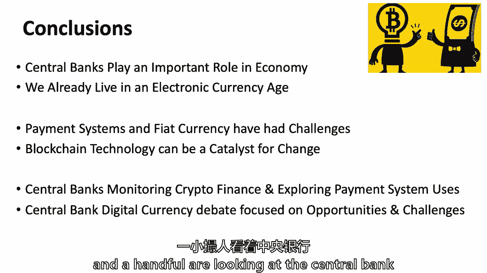

# 【麻省理工大学公开课】区块链与货币 - P16：16、中央银行和商业银行-第2部分 - 闰土聊Web3 - BV1sL411N7Mm

所以我们要，我们将回到中央银行，我我认为有两节课是合适的，当我在八月份布置整个学期的时候，思考如何构建类，部分原因是中央银行在金融世界中扮演着如此重要的角色，但这实际上是关于他们在金钱中的作用。

货币和中央银行已经交织在一起三四百年了，它们是法定货币的保管人的本质，当然，这门课是区块链和货币，我们在这里谈论的许多事情，实际上与比特币和加密金融有关，即使中央银行。

数字货币不必与区块链技术捆绑在一起，但我要做一点。

回到我们周二讨论的，部分原因是罗布·李周二和我们在一起，我把今天的一些内容也提前到了那时，只是为了，经历那个，嗯，当然，如果我们真的提前结束了，我们总是可以谈论星期二的选举，我也是，没关系，所以我们要。

一如既往，有点接触读数，我要问你们所有人，一堆关于厄瓜多尔和塞内加尔的问题，和瑞典，也许菲律宾在阅读中等等，但你知道这一切，都是，我们要，我们要谈谈，我会试着回到我们刚才谈论的话题上来，星期二。

为什么又来了，我认为这与区块链技术的任何课程都相关，尤其是如果你对比特币和加密金融感兴趣，引入新学科，真的，它是稳定值令牌，这是现在实验的重要组成部分，在加密金融的世界里。

但把它们与私人钞票的世界联系起来，因为我在当前稳定值令牌的方法中看到了，我们过去看到的类似的东西，我们在周二介绍了，这将是我们今天谈论的大部分内容，你要，希望我们能好好讨论一下。

你们所有人都想到了这些瑞典，塞内加尔，厄瓜多尔和菲律宾一点，这就是我们要做的，嗯，我们将再次深入到这些问题中，当我们穿过这四个国家时，我们谈了一点万事达卡，当RIM和我们在一起的时候。

Priya的丈夫和我们在一起，因为他和万事达卡在一起，但我们可以回头，今天的阅读真的很好，万事达卡获得了部分银行业务的专利，嗯。

中央银行的目标和职能，有人记得我们星期二说的吗，关于中央银行是关于什么的，他们的主要目标是什么，及其职能，有人想，呃，最大就业，呃，素食性，呃，以及温和的长期利率，哇哦，那很不错，你有三样东西进入U。

的双重任务，所以说，促进经济，但占主导地位，这是关于价格稳定，价格稳定与货币有什么关系，詹姆斯，那是一只手举起来没有，但我可以给它一个通货膨胀的幽灵，所有的权利，通货膨胀。

确保我会对钱的成本进行正确的评估，所以这是钱的成本，对吧，所以价格稳定和货币有关，因为钱的三大功能是什么，记帐单位，所以这是可行的记账单位，就在那里，所以货币的第三个功能，价值储存，交换媒介，帐户单位。

如此稳定，定价是为了确保会计单位，所以价格稳定实际上是关于钱的，它还促进了经济，他们坐在货币体系的中心。

中央银行首先检查国王，以确保国王不会超支，当他在另一个国家与另一个国王打仗时，这就是一切开始的地方，但这是一个坐在金钱的中心，所以我们谈论的四件事，他们管理国家的法令，钱，在每个国家，供应，价格。

支付系统，支付系统是我们转移资金的方式，所以如果你真的想，你知道吗，只要把它归结为，你可以参加一整门课程，这里有很棒的教授教中央敲打，但我会说，管理国家的法定货币，监督银行系统。

因为银行系统基本上是在系统中转移资金的一种方式，并提供信用汤姆，在你的定义中使用金钱这个词，它扩大了货币的数量，扩大货币数量，它是如何做到这笔钱的，借钱是什么意思？借钱，所以银行站在投资者或储户之间。

我们可以称他们为储户，所以一方面你有储户或投资者，另一方面，你有借款人，银行就在中间，这就是为什么它被称为金融中介，他们就在中间，这不仅仅是在中间，我是说这是一个很大的争吵，所以中间的银行都是关于钱的。

商业银行就在附近，他们不断倒闭，即使在意大利小国的时代，他们就会失败，有一些家人，通常或中央当局帮助，最终是中央银行，今天似乎中央银行是第一位的，但商业银行是第一位的，中央银行是本国政府的银行家，嗯。

现在在哈佛肯尼迪学院任教，但是保罗·塔克刚出了一本书，他是英格兰银行的副行长，中央银行是未经选举产生的，他们通常不是，他们不站在选民面前，他们是，但他们有很大的权威，所以他们做的四种类型的事情。

然后我们谈到了我前几天用了这个图表。

但是三种不同类型的钱，请在加密货币的上下文中，我们怎么也有，中央银行在国际支付和国际储备方面发挥着关键作用，嗯，所以问题是，有人想站在一边或另一边吗，艾伦，你认为它会归零。

所以你可能会说中央银行不会有任何作用，如果加密货币归零，我不太明白这个问题，所有的权利，所以伊莲只是站在另一边，他说，我是说，他将成为一个国家的货币，他们仍然需要管理国际储备和管理国际跨境支付。

如果它会像一种全球货币，那就是普通的，所以这是一个假设，我想这是个选择，正确的是你是否希望你的货币相对于比特币浮动，或者你是否想防御性地购买比特币并对冲你的货币。

我认为中央银行有一个选择来追求他们的其他观点，和加密货币，英国人，所以我想，如果你货币，你可以在交易方面建立一个自己的圈子，在那里它不需要与恐惧货币互动，那么中央银行的作用将完全局限于。

它所处理的活动的治理，它是否需要参与其中，基于它对系统造成的风险，但如果它在任何层面上与法定货币相互作用，那么中央银行的角色就会更多地参与其中，更多的参与和更多的中心，所以是不是有可能我的意思是。

我们不知道未来会怎样，阿林可能是对的，如果加密货币不起飞，金融方面的一些实验，但如果它开始起飞，我想你的发音是古尔莫，吉列尔莫说，如果它变得像野蛮一样重要，还有人说我认为中央银行会发挥作用。

如果一个国家真的要把它作为交换媒介，记账单位和价值储存，尤其是如果有部分加密银行，这个主和弦专利就像如果你真的看到有人，我们离那很远，我们不在那里，但我是说如果那发生了，肖恩，所以我只是好奇，后续行动。

那就是，如果真的发生了，它变成了，呃，显示器供应和呃，为了使中央银行履行其职能，呃，就像做完全开放的公开市场操作一样，所以这也适用于，如果当前加密货币发挥作用，这是否也适用于公开市场操作。

到加密货币市场，所以肖恩问，如果我们真的在这个世界上，我们还没进去，加密货币是金融银行的主要形式等等，你认为中央银行会尝试进行公开市场操作吗？有人想告诉全班同学什么是公开市场吗，读数里没有。

但公开市场操作是用来增加或减少货币供应量，所以中央银行可以买一些钱或者卖一些钱，影响供应，从而影响价格，所以公开市场操作有效地影响了利率，你可能经常阅读利率目标，美联储有一个目标。

但他们在公开市场操作中所做的，实际上是买卖货币供应，当你影响某样东西的供应时，你改变价格，货币的价格是用利率或汇率来衡量的，所以肖恩，我想说，如果它成为一个经济体的主导部分。

那么一些中央当局可能想试图影响它的价格，但有一个挑战，有人想猜猜，我在想为什么加密货币，让我们说，委内瑞拉将比特币作为该国的核心手段，他们试图影响比特币价格的挑战是什么，委内瑞拉，伊莱恩。

你知道外面的其他经济体，在匹兹堡绝对使用比特币的人，所以说，委内瑞拉，可能只是全球比特币使用量的一小部分，所以如果你是一个国家是一回事，并试图影响该国使用的货币的价格。

如果瑞典想影响罗纳或以色列的价格，的，有问题的，如果它是一种世界性的货币，雨果，然后汤姆我是说，我可以看到就像我们今年早些时候或去年看到的那样，当时有一个韩国人，那个，比特币在韩国的价格。

比世界其他地方的比特币价格还要高，因为那里的需求太大了，所以如果你像某个国家的中央银行，用他们的货币购买比特币，他们基本上是在让他们的货币相对于比特币贬值，它可能不会。

但它可能不会以他们认为正确的方式影响世界市场，除非他们在所有公开市场上有效地购买比特币，在世界各地，你想做什么，你知道为什么韩国的价格比其他地方高吗，这叫做泡菜溢价，那些字面上不是我编造的。

但比特币就是这么叫的，泡菜溢价，那就是比特币在韩国的估值比其他地方高，雨果，你有，你只有一个理由，你说过，它只是以为韩国人想买很多，所以有泡菜溢价，另一个汤姆，我们会给你一样，为了在韩国交易所开户。

我想你必须像，你真的不能套利，非常好，所以雨果，你说到点子上了，你的意思是，套利，本，所以我相信套利很难，因为韩国的资本管制，所以一些好吧，所以很难套利，所以金融的基础，我们正在远离比特币。

但金融套利的基础再次成为金融的一部分，几千年来，如果我能在法国买东西，然后以不同的价格出售，在瑞士，旅行也不花太多钱，法国和瑞士之间的公路，我可能会在一个国家买，在另一个地方卖，在现代数字时代。

这被称为位置或地理套利，石油仍有位置套利，因为你可能会在墨西哥湾沿岸购买然后在非洲销售，或者你知道可能有位置套利和实物商品，但在数字金融资产中，几乎没有位置套利，韩国的情况很有趣，有一个位置套利。

这是怎么回事，所以有泡菜溢价，字面上很长一段时间，因为比特币很难跨越国界，但现在我们有了汤姆，你是，是啊，是啊，当我们谈论银行资本要求时，U做什么，S的节目服务于，要求银行持有美元。

还是允许弗兰克持有任何货币？当有人在银行业，我想回答汤姆的问题，不管是不是像银行资本，银行储备必须以美元计价，你一生都在银行业，对是的，所以有很多规则，很多很多规则，嗯，或者基于你持有的资产的流动性。

所以说，如果你持有资本，非常的流质，你可以在一定的时间内摆脱它们，持有这些类型的资产会有很大的溢价，所以我想规则不一定规定，不管是美元还是其他货币，但他们，非常喜欢非常流动的，是啊，是啊。

所以乔希是对的，基本上都被带回了母国的货币。

单位，美元或欧元或b，和一些会计账簿，它被带回来了，但有不同的发型或体重，取决于一些感知到的，所以一个U，s，国债相对于德国政府债券可能会，但你是在非常实时的基础上，用外汇汇率把它带回你本国的单位。

是啊，是啊，我对金融和中央银行的知识略知一二，而是想着，储备货币，或者银行是否持有它到你最大的点，如果，如果，或者加密货币，为什么他们现在会，但他们可能是对的，没有，没有很深的历史，没有太多的流动性。

而且波动性很高，基础市场极易受到操纵，我们不确定任何时候的真实价格是多少，但在假设的世界里，它被广泛采用，我怀疑全球的中央银行会有一些资本制度，那会比今天更好地对待它，但不如政府法定货币有利，对呀。

我是说，你相信德国债券吗，一般来说，比你做一个分散的，所以中央银行参与的三种货币，有谁记得，上面甚至有一张图表，你可以，大家可以看到，你可以从，等等菲亚特，你有什么可乐抵押，否，我们会到达那里。

这将是关于稳定价值的代币，我说的是一二三，所有的权利，所以说，我们谈到了我的一个，我两岁，我三岁，所以说，什么是，你可能首先想到的是什么，我听到现金这个词，一些沉积物，但从现金开始就是钱。

所以我把它变成绿色了吗，是呀，好了谢谢，我在这里得到了一些帮助，现金那是货币的一种形式，我们都有，或者实际上，我从没问过，我口袋里总是有现金，这个房间里有多少人现在口袋里有某个国家的现金。

所以我们下降到70%左右，但30%的人口袋里没有现金，你把你的钱存起来一美元，一块钱，如果我们在日本，它可能会更高，虽然是对的，所以货币的一种形式是现金，另一种形式的货币，那是中央银行，中央回储备。

中后卫储备，让我们看看如果我做的绿色。

是呀，我只是回顾一下，从周二开始储备，但因为有商业包，他们说你必须说，并把你的一些钱在中央银行储备，这样我们就可以给你存款保险了，我们可能会给你流动性和困难时期，它正在开放一些流动性或贷款设施。

所以你得对我们有所保留，这个词就是从那里来的，但它是一种货币形式，也是第三种货币形式，这个房间里几乎每个人每天都在使用的钱的形式，我们几乎一直在使用的真正形式的货币，所以我们有现金。

我们有中央银行的储备，我们几乎每天都在用什么，那存款是什么，所以我们的银行存款，当我们走进星巴克时，我们实际上是在交易，我知道感觉不是这样，但你实际上把你的一些银行存款转移到了他们的银行存款上。

这才是我们真正转移资金的方式，所以这是三种形式的货币，我们从来没有看到美联储或中央银行的储备，我们只看到银行存款里的现金，凯利，你说过的，嗯，在困难时期能够促进贷款，所以我们回到十年前。

规则是如何改变的，为这种情况做准备，银行在哪里，中央银行会在哪里，有很多这样的能力，凯莉在问，你知道的，我们都经历过金融危机，2008年你们中有多少人从事银行业，所以我走了，哦，乔希，你，是的嗯。

你在哪里工作的，你是高盛，我听说过他们，其他举手的人，还有谁举手，就像，你在哪儿工作？我在一家代币寿司银行工作，东京三井银行，我听说过他们非常大的班卓琴，对冲基金权，抵押贷款对冲基金，抵押贷款对冲基金。

问题是乔希·阿尔法或阿基拉今天是如何赚钱的，谁在中央银行工作，否，嗯，所以2008年的危机来了乔希，我们就让他失败，他是一个抵押对冲基金，你做得很好，好的，他让我们失败了，他让我们失败了。

高盛得到了政府的一些支持，东京银行皮蒂先生，你得到政府的支持了吗，呃不，我们有一个NBA演播室，但不挑剔，嗯并不挑剔，但是全球的中央银行，尤其是在这里，u，s，以多种方式提供流动性，但这还不够。

他们提供流动性，一个是针对一些倒闭的银行，贝尔斯登在2007年失败了，你可以贷款给金融机构，实际上你可以借给社会上的任何公司，但他们只是他们从来没有使用过权力，但他们使用了你可以贷款而不是抵押品的权力。

这是在2007年与贝尔斯登合作完成的，然后在2008年又为其他人做了一次，他们对雷曼兄弟做了什么，当雷曼兄弟破产的周末，美联储对雷曼兄弟说了什么，詹姆斯说他们让他破产了，1。这是正确的。

他们说我们不能用这个权力，然后你知道，我们都知道历史书上写的，2008年9月那个决定性的一周，然后一切都崩溃了，因为市场有不确定性，所以他们接下来做的，凯利，所以他们使用传统权威。

接下来他们开始测试他们的法律权威，他们放了一系列其他的东西，在联邦存款保险公司的旧权力下，他们实际上保证了所有，美国银行系统的债务，s，在一段时间内，在其他当局的领导下。

已经想出了如何为货币市场基金提供担保，这是大约两万亿美元的货币市场基金，所有这些几乎额外的法律权威，我们知道拉里·莱西格在这里的时候，3。他说每一份合同都有其模棱两可之处，每条法律都有歧义。

和美联储最好的律师，美国最好的律师，s，我们能利用法律的不确定性来拯救这个系统吗，他们寄了一份四页的，但它可能是三页纸的立法要求7000亿美元，我记得我第一次读到三四页的请求，问我什么，这件事发生了。

当你读到它并给我你的建议，没过多久我就看了三页，这是一个直接要求7000亿美元的请求，它终于通过了，第一次在众议院失败，就变成了，我想几百页的文件，但是七千亿美元的U，然后把它借出去等等。

所以有很多事情，十年后，十年后，这里的法律多德·弗兰克限制。

联邦政府能做的一些事情，加强了在熊熊大火中成为消防部门的能力，最近激烈的公开辩论，和本·伯南克，我觉得，他们写了一篇专栏文章和其他一些文章，说放松一些多德弗兰克C限制会很好，但另一边也有人说不。

我们需要保持这些限制，因为如果限制松动，那么我们有一种叫做道德风险的东西，有人知道什么是道德风险吗，我想是，呃，你冒着风险，这与你所能做的不相称，但你很自信因为你觉得别人会很好，他会冒这个险。

可能是银行，或者是一个，所以说，银行是金融机构，如果你知道你会被保释，我们会冒更大的风险，它是人类，所以我父亲在巴尔的摩有一个小生意，他从来没有超过三十名员工，是香烟和糖果，和。

如果他星期五发不出工资来，周一，巴尔的摩市不会帮助他，他的员工可能会再给他一两周的时间，嘿山姆，我叫山姆，你知道我们会再给山姆先生一个星期，但两三个星期后，他们都会退出的，但是银行这么大。

几十年来一直与他们的经济联系在一起，两万和八年不是唯一的一次，中央银行的主权步骤。

介入如此凯利，你问题的答案是，美国中央银行的能力可能较小，Let’让我们介入，他们仍然有非常真实的工具来成为消防员，在熊熊大火中，但他们受到了更多的限制，我们作为一个社会，但在下一次危机中。

也许一些总统会测试这些法定权力的极限，我想我的问题更多的是关于，如果我们有，比如说，这些影响会是什么，如果你知道说，突然之间，必须发行一吨比特币，但我们都知道那里的供应有限制，所以好吧。

有人想回答凯利问题的另一面吗，比特币现在是一种假设的货币，比特币或者一些加密，Eileen会告诉我们这是另一个密码，可能是阿尔和什么的，发生了什么，中央银行和政府的灵活性会发生什么变化，纾困他们的经济。

如果是密码倒下了，有点像吃它的例子，所以它让我想起了你的名字，以撒，以撒，所以以撒说它下去了，你什么意思，这意味着他们的灵活性下降了，嗯，呃汤姆，我是说，如果是像我一样的加密货币，这是不可能的，对呀。

我是说，一定有一组有限的硬币，代币，他们是不是，必须有一个体面的共识协议，埃里克·索汤姆内容，艾萨克说这变得更难了，汤姆说这不仅更难，这是不可能的，埃里克，这取决于加密货币平台的设计，密码已经被使用了。

因为我们会看到，也许在呃，后来，在这个班上，有一些，呃，实际上有智能合约的无抵押稳定硬币，执行货币供应政策以保持稳定，这真的类似于以自动的方式处理货币供应，所以埃里克说我们要再来一次，在硬币的情况下。

我是桑托什，那是什么桑托斯，如果你像采矿系统一样控制，可以改变协议，意味着埃里克和桑托什所说的还有更多，有一些灵活性吗，要么是写进算法的灵活性，要么是五一的灵活性，如果有共识或硬分叉，你也许可以调整。

但它的核心可能是以撒介绍的，就更难了，我不知道这是否不可能，但我想这要困难得多，就像欧盟很难帮助希腊一样，因为你现在有多个国家参与决定，达成共识，让德国经济和政治满意的是不同于，然后我们继续前进。

所以我有点困惑，因为我想我们在换术语，所以当你说加密货币的中央银行，意思是别的，有两个世界，是啊，是啊，是啊，是啊，我想我们在讨论一个假设，如果加密货币真的站稳脚跟，就像未来的比特币。

我想这就是你的问题，抓住，你的意思是足够受欢迎，使用足够受欢迎，用作足够的价值储存，作为交换媒介使用得足够多，然后发生了一场与中央银行非常不同的危机，数字货币，是呀，比他们有点像，在过去。

地板上的股票专家，他们做市场的交易所，你知道如果有如果有艰难的销售，然后他们真的可以进来，做后盾，或者为了价格，安德鲁问，有点像私营部门真的很有效，你知道吗，中央银行的专家，本质上是进来支持加密货币。

在某种程度上，当然，取决于他们的储备是什么，他们也，当然啦，是拥有税收权力的政府的一部分，有军队，我是说，作为政府的一员，有很多额外的力量，所以我想答案是肯定的，但多管辖区货币通常在某种程度上失败。

欧洲人，欧元仍然是一个实验，在未来的几十年里，它仍然可能失败，已经测试过了，但过去有多个司法管辖区的货币，他们通常失败的可能性很大，因为你没有一个政治制度，一套统一的政府帐目，一个税务当局。

你知道一堆挑战，但让我们继续前进，试着打开一些东西，这就是前几天的回顾，我们说过什么是法定货币，当然法定货币代表了这三种形式，银行存款、票据及准备金，它被接受纳税，而且是法定货币，在这个假设的情况下。

我们甚至还没来得及，比特币是否会被接受纳税，比特币或加密货币会被接受为法定货币吗，但我会提醒大家，无论未来如何，我想在你必须解决的任何国家都有广泛的采用，政府会接受它的税收吗。

政府会说它被接受为法定货币吗，除非发生这种情况，你通常不会有广泛的采用，即使在一个处于困境的国家，除非它被接受纳税，可能会是，或接受为法定货币，嗯，所以我想回到私人钞票，所以商业银行过去发行过票据。

把它想象成一张代表银行存款的纸，就像我们移动移动货币一样，现在想想看，但大部分都是以前做的，曾经有一段时间中央银行，在U，s，它被称为自由银行时代，安德鲁杰克逊是美国第七任总统，他真的不喜欢中央银行。

它被称为美国第二银行，但他让它，他让它过期了，在十八世纪三十年代，安德鲁·杰克逊，有人知道安德鲁·杰克逊用的是什么货币吗，他的肖像在哪儿？二十美元钞票，不是我们一直传递的，和一切，安德鲁杰克逊也是总统。

在他还清国债的一段时间里，付清了零，是个田纳西人，然后对金融有强烈的看法，我们在18世纪40年代经历了一段非常艰难的时期，所以我不确定我们是否应该完全还清债务，但是，自由银行时代，在U里流传的音符，s。

二三十年都是，和U，s，政府需要资助战争，美元这个词来自1863年，北部，工会想筹集一些钱，他们真的开始印刷美元，也是南北战争期间通过的第一部国家银行法案，《国家银行法》设立了一个叫做货币控制者的机构。

和货币的控制人，这两个字，他们把我弄糊涂了，当我在华尔街的时候，称为货币的控制者，但在十八世纪六十年代，是为了控制，所有这些钞票都是由一群商业银行发行的，其中大部分都失败了，数百次失败。

许多纸会以不同的价值交易，互相打折等等，有人说我们现在生活的世界，用加密货币，这个新市场有点像私人票据时期，有趣的是，有两个国家或两个地区仍然使用私人纸币。

任何来自香港的人，那么谁发行你的货币。

你的现金，有很棒的银行，呃中国银行，呃汇丰银行和标准银行，uhhsbc ram代表香港本地及标准，试图代表英国，那其实是，您还应该添加，嗯嗯，肺活量，因为他们发行了十美元，但它不是真正的私人钞票。

这是尚未的一部分，所以在香港。

这个音符，主要的音符，我说的对吗，或者十岁以上的东西，任何超过10英镑的东西都是由银行支付的，他们必须遵守中央银行的规定，任何来自苏格兰或爱尔兰的人，什么地方太北了？

但在英国也是如此，有英镑钞票，所以我们仍然有一些这个，它仍然留下了一点严格限制的遗产，因为它是货币当局，它在香港被抓了，我其实不知道，嗯，因为它叫中央银行，它不叫中央力量，它被称为93和权威。

货币和金融当局，所以货币这个词就在里面，就像十八世纪六十年代在美国的银行一样，当局被称为货币的控制者，它仍然被称为货币的控制者，嗯，詹姆斯，关于英国的一点，如果有人去英国旅行得到一张苏格兰钞票。

把它还给给你的人，因为你在英国度过，大家都慌了，就像这是什么，这不像一般的钞票，从技术上讲，这是非法的投标，但人们去，哦，我不想要，所以在某个地方以北不好，往南不好，某些南方是我读到的东西。

在南方它不是法定货币，但在苏格兰也不是法定货币，所以你可以在苏格兰按习俗使用它们，我想这是我的一个问题，但作为一个技术法律问题，其实不是，它不会熄灭死亡，现在不会有人告你，我相信罗斯是对的。

但对于那些不知道的人来说，罗斯的职业生涯是当破产律师，作为公司的合伙人，在他回来攻读斯隆MBA之前，所以我同意罗斯的意见，这个故事的寓意是，如果你有一个苏格兰乐队，那就还给我，因为我不想这样，给你，嗯。

所以稳定值令牌，这个詹姆斯有什么寓意，如果您得到一个稳定的值令牌，你把它还给我吗，嗯好吧，理论上它是稳定值，这样你就可以把它换成，不管是什么，不管是为了，那么什么是稳定值代币呢，它们可能有什么价值。

密码空间的痛点是什么。

他们为什么来，嗯，上面有读数，所以也许只是一个，我想到了，呃，呃，以一种呃，它后面有，呃，要么呃，货币，使波动性如此容易抑制波动性。

为什么会有人想要加密资产，但缓解波动性，无波动性加密的用例是什么，他们只是提到了贷款和储蓄账户作为例子，但波动性的问题是它作为商店价值很挣扎，因为它不稳定，如果它只是到处都是，所以他们不会。

他们经常用它来交易，怎么了？加密货币，加密货币，你想告诉你，回到马厩里去，然后回到另一种加密货币，你不必进入银行系统，所以也许它也被用来交易，所以我听说它能抑制波动性，我同意它可以用来交易。

因为你可能会加密到加密到加密，但您希望保持更好的价值存储和稳定的令牌，嗯也是，这就是它是什么，一直以来，我列出了四种不同的方法，这些是设计特点，他们都在努力做同样的事情，有加密货币，那不是集中的。

或者至少没有一个不是以这种方式集中的政府的支持，它可能是集中的，算法和软件是集中的，四个不同的设计特点，嗯，我想有一个关于这个的读数，如果我记得，有人想说什么关于系绳的事吗，我是说，什么，我说。

我觉得它的一个大问题是如果它像，真正被领养的，你需要有大量的抵押品才能让它对人们有用，另一个问题是，你可能还需要一个中央银行，喜欢美联储实际上喜欢，你知道的，在那里干预，这违背了目的，斯蒂芬妮说。

如果它真的起飞了，你需要大量的抵押品，如果系绳，法定抵押货币不仅仅是几十亿美元，但这是一万亿美元或几万亿美元，整个U，s，银行系统约为16万亿，大约有13万亿美元的存款，如果你是硬币的头呢。

那是其中的一万亿，如果它被认为是由，如果它有那么大，而且据说是由我们支持的，美元，你有三个选择，两个选择，对呀，你要么有一万亿美元的一百堆，物理纸，亚麻纸，或者你有银行存款，这就是你想摆脱的。

或者你有美联储的钱，你也在努力摆脱，这是你唯一的三个选择，用于，抵押品实际上在哪里，一定是什么，但是钻研这个的原因，他们一直在看，不仅仅是比特币和整个加密空间，但后来他们看到稳定价值的代币出现了。

通常由，一些区块链技术和区块链倡议，坦率地说，它们不一定是区块链，我想没有它你也能造东西，嗯，如果你有一辆菲亚特，抵押稳定币，就像希瑟，我能理解为什么有一个技术用例，也许你想把它作为一种甜蜜的交易。

或者你想在区块链上锁定价值，它不易挥发，还有一个商业案例，如果它真的超过一美元，硬币高于一美元低于一美元，你可以发更多，保持差额，或者再买那个，并保持差额，如果它足够小，你可能会，你可以投资中央银行。

A银行，你可以获得抵押品的利息，但我确实同意你的观点，问题逐渐消失了，当你有一万亿的巨大规模，那么在这一点上，你从一万亿或十万亿，或者你知道几十亿什么的，但是当你遇到同样类型的情况时，其中U。

美元从黄金储备中消失了，我们就可以把它和硬币的储备解开，因为它是如此广泛和无处不在，以至于现在的稳定，我也是你的想法，如果它真的发展起来，并在商业中被接受，也许它不必被拴着，对法定货币，就会变成信任。

被信任的人，纸币变得可信的方式，和理查德·尼克松，在1971年，可以说我们不再追随布雷顿森林，或者在1933年，当罗斯福在我们国家，说我们要脱离金本位制，因此，你可能需要创建某种中央权威，管理货币政策。

它变成了一个II，我想你提出了一个有趣的观点，我想我们以前已经很好了，我想现在，不过有趣的是，有很多创业活动和稳定的价值代币，我的观察是这里说的主要原因之一，在密码交易市场，我们下星期二再谈。

在密码交易市场，很多人想去交易加密到加密，而不是加密到菲亚特，他们不想用密码换菲亚特，这是另一件可能被追踪的大事，它可能更容易被追踪到，本·阿想要，我知道所以K YC，你要提醒全班同学。

那些字母是什么意思，没有顾客和反汇票，所以美国在世界各地有一个完整的政权，它被称为银行保密法，但在世界各地，关于了解自己的客户跟踪，等等，密码中占主导地位的东西之一，这可能是错误的。

也许只是因为这是一个早期阶段，一些拥有加密资产的人，我觉得我不想用它来换取菲亚特资产，我不想换成欧元、美元或日元，官方部门更有可能跟踪我的税收，我认为有一个错误的想法，如果我出售一些加密的东西。

我买了其他加密的东西，我不必报告我的收益或损失和我的税收，现在美国已经澄清了你有，但几年来，人们过得很好，也许这就是所谓的友好交换，顺便说一句，你若卖了金子，买了银子，金子换银子，在你的领导下。

这不是一次友好的交流，中国税法，但有税务顾问到处说，有些模棱两可，也许你不需要纳税，如果你从比特币到以太，去年12月通过的税收法案，让我们称之为关闭窗户的特朗普税法案，为数不多的关闭的东西之一，但是。

嗯，但我认为因为非法活动，因为税收，还是有很多人说，我宁愿去加密加密，但是还有一件事，人们可能想要一个关于支付系统的稳定价值令牌的原因，我们上周讨论过这件事，嗯，我看到一只手在这里，帮帮我。

我要说的是它很快，而且很好，所以它很快，而且可能很划算，我们说过，我有一张关于使用加密货币作为桥梁货币的图表，转移跨境支付，如果你把美元换成墨西哥比索，可能需要两三四天，和代理银行系统等。

但如果你从U中使用呢，美元对加密货币对墨西哥比索，非常合法的用例，可以将您的跨境支付降低到秒，而不是几天，非常合理的用例，也许稳定的值标记将是一个很好的用例，所以说，如果有人对不同的设计特点感兴趣。

有一个，有趣的是，哈佛大学有个教授，来看我的人，哈佛，他在哈佛商学院任教，来看我，他正在创建一个非抵押。

基于老年的稳定价值令牌，所以即使在剑桥，有一群人在试图创造东西，做事和大量的精力，嗯，你总是问我，真正的用处是什么，区块链，用一些就在这个区域，雨果，然后我们继续前进，另一件事是你们中的一些人被抵押了。

上面没有的，像双子座，交易所最近创建了一个，Circle创建了一个，Coinbase采用了，它们都在以太坊的上面，我想实际上，至少和双子座在一起，我对圆圈不确定，智能合约中的一个编码是冻结令牌的能力。

就像，你可以说，那是一种AML类型的东西，对呀，就像，如果他们看到像G SD这样的交易有什么奇怪的地方。

然后他们就可以停下来抓住代币，周围全班同学的情绪如何？可以在智能合约中冻结的稳定值令牌，那个雨果是什么，现在，我有个问题，是啊，是啊，那个双子座是谁，写智能合约的人，谁控制了智能合约，那样的话。

那将是一个密码交换，由谁的双子座经营，由迷失的兄弟经营，一对同卵双胞胎，嗯，这些流派不是在电影里，也没有在加密上赚很多钱，顺便说一句，温克莱沃斯双胞胎。

他们和哈佛大学的马克·扎克伯格一起参加了精彩的故事，如果你还记得温克莱沃斯双胞胎，他们是赛艇精英的一部分，我也是，嗯在加密方面赚了很多钱，下周二我们将讨论他们，嗯，所以中央银行和加密货币，我们谈过这个。

前几天，他们真正在做的有四件事，他们在监视和研究，有些正在限制使用，4。有些公司正在尝试采用分期付款的办法，我们谈到了新加坡和加拿大，这些都是真正的区块链倡议，支付系统学校还在。

他们是否需要使用区块链技术，但他们正在认真地靠拢，尤其是在新加坡和加拿大，说可能会有一个更有弹性的支付系统，如果我们使用去中心化的分布式区块链技术，基于仲裁或Corda或Hyper分类帐结构。

我想我们离他们还有几年的时间，有点来了，有足够的，那里有足够的东西，它会比传统的数据库更好，但他们肯定投入了很多精力，甚至欧洲中央银行和日本银行也有一个倡议，但在第四类。

每个人你不一定需要使用区块链技术，这是课程的一部分，并受到稳定价值代币的启发，但当我们谈到瑞典银行的倡议时，和其他一些倡议，你会发现，据我所知，它们不是建立在区块链技术上的，这并不意味着他们不能在未来。

但我认为它们很重要，因为它们对区块链和货币非常重要，我们上周讨论过这个，第一波付款都是在以太坊上，正如我所说，他们已经离开了以太坊，第二波支付系统倡议都是许可区块链，现在他们看到的是第三波，我现在就拿。

拜托了，目前用来管理的基本东西是什么，比如谁的存款，这里是谁的，如果是摩根士丹利为高盛提供的存款，当他们喜欢中央银行内的外汇存款时，他们目前使用什么来管理，他们使用各种形式的传统数据库。

我不会假装我对每一个数据库都了如指掌，但通常是银行同业拆借，就像你谈到摩根士丹利或高盛一样，他们会称之为实时总结算系统，RTGS系统，但是实际的底层数据库结构坦率地说可能要追溯到批处理。

它们中的大多数仍在美国进行批处理，我想会推出一个更快的，和我们一起来访的斯雷姆，是美联储的一个大顾问小组的成员，嗯这样做，这会有一点帮助吗，但问题是，区块链技术能激励20世纪20年代中期的下一代吗。

这些国家中的任何一个每周七天有两个四小时的时间，多方共享账本，正如Lean所说，但是等一下，见证中央银行仍然希望对协议有权威，二五十家银行之间的协议，答案可能是肯定的。

但他们正试图探索什么是最有弹性的系统，中央银行，当然啦，已经发行数字储备，所以真正的问题是，这应该给其他人访问，应否扩展至零售大众，所以这些就是我们聊过的，我们很快就会看完其中的四个，只是想说。

你对厄瓜多尔的每个人都有一点了解，塞内加尔，瑞典和菲律宾，嗯，嗯，基本上从瑞典的角度来看，他们想继续提供支付手段，克朗很少使用，这里没有斯堪的纳维亚人，克朗很少使用，他们想保留它，有一定影响力的。

我在想，如果我把图表放进去，我将略过几件事，没有，我没有把图表放进去，所以我道歉，所以说，你认为真正存在的挑战是什么，从我们的读数来看，你认为这些挑战中的哪一个，吓坏了中央银行，最重要的是金融稳定。

是货币政策吗，支付结构，还是以上都是，这条线，我想金融稳定，金融稳定，基本上是银行挤兑，我不知道，我想说在我的谈话中罗伯特·李有更多这样的人，它是第一个的混合物，艾琳说过，然后呢。

如果我们让中央银行更直接地吸收零售存款。

或者本质上如果我们缩小对商业银行的需求，在危机中，他们担心这会破坏系统的稳定，那一直是我的，你知道的，以撒，中央银行在吸收存款，而不是商业银行，这难道不会反映在利率的变化上吗，因为他们会有其他资金。

所以它可能会流回，当中央银行决定联邦基金利率时，它就会被调整，因此，企业借款人将能够借用床单，所以以撒说的是，你就不能作为一个中央银行通过利率政策来解决这个问题吗，在某种差异利率和货币定价中。

我想有些人会认为你可以，但在另一边，有人想站在另一边吗，现在U，就像我们两天前说的那样，拥有大约两个，不到两万亿，和1。5万亿美元的抵押贷款，他们在向抵押贷款市场放贷，个人公司或个人房主贷款给。

如果它达到了他们所说的任何规模或大小，当然他们可以贷款给商业银行系统，然后公众会向中央银行贷款，中央银行将贷款给商业银行，所以设计方面的考虑，我们没有讨论这些，这八个设计注意事项都在循环中。

大家都明白了吗，只有少数人明白，是令牌或帐户，加勒特在中央银行放的这朵小钱花，谈钱花，比特币在哪里，谁想告诉我比特币在哪里，我们会把它带回区块链，上，呃，私人数字令牌批发只等待，等一下。

那么我指的是哪里，蓝色和橙色，蓝色和橙色，哦，上面写着，你的意思是，就在那里，无，不是没有红色，没有红色，就在这里，私人数码代币只批发，无，告诉我你想让我指哪里，你是说它是橙色的吗？

我认为它并不广泛适用，它不是，它被广泛接受，比特币的广泛访问，意思是任何人都可以得到它，是啊，是啊，所以我是纽约市，我想说你可以把任何形式的钱放进这些小块里，政府支持而不是政府支持。

我们是稳定的价值代币，看看这个，你是最接近的，我不记得你的名字，康纳利，康纳利，我们是稳定的价值代币，不是中央银行发行的，我给你个提示，所以它不是绿色的，你私下见你，私人数字令牌，你只能批发。

或者你可以让它广泛访问，像这样，你知道他们，他们可以是，即使不是中央银行，我的意思是我想这取决于你如何定义中央银行，但它是一个发出令牌的实体，与美元挂钩的，它持有美元，所以我认为这是一个很好的观点。

我想说它不是浅绿色的，但是它，它高度依赖中央银行。

它高度依赖商业银行的存款，据称是两个多一点，25亿美元的密码，在去年的某个时候，这一切都是由美元支持的，他们失去了一些商业银行账户，这意味着商业银行不会把他们的美元，许多国家的商业银行表示，算了吧。

我不能，我不能让你当顾客，所以本质上你高度依赖，如果你是中背部的托管稳定价值，我同意那一点，但我想你不是中央银行。

有一点，它只是中心，它在右中角，所以有很多悖论，作为区块链加密空间的讽刺，关于某件事有多集中，它是，如何分散，所以我们要回到这些，所以厄瓜多尔，嗯，有人读过厄瓜多尔的事吗。

想告诉我们一些关于莱昂纳多的事情，嗯，我想这是一个关于Fader的故事，因为政府发行了电子货币，得到了中央银行的支持，但是中央银行没有能力从用户那里信任，所以你从来没有离开过，所以这是。

厄瓜多尔政府在发起这项运动之前刚刚投入了几年，经济两极分化，所以他们发布了一些人们不知道的东西，是否，几年后他们还会在那里，所以用法非常令人失望，与最初预期相比，这篇文章中另一个有趣的观点是。

金融机构没有义务使用它，无论如何，我想知道是否有最低限度的，你知道的，这些机构的资产负债表，要求它们有最低水平的，加密货币可能会对它有所帮助，我不知道，就我的记忆而言，他们也未能管理预期。

因为即使在第一年，他们在说什么，他们声称的是，会有50万用户什么的，也许吧，但事实证明只有5000名委员会用户，用户上来了，就这样吧，这是一个，这是一个伟大的故事，你知道的，失败就在这里。

很好的一点是与项目相关的收益和成本不匹配，他们有点，经过计算，福利不到一百万美元，相比之下，整个国家从一开始就有近700万，从一开始，这个设计不是以适当的方式构思的，一次又一次。

这在一定程度上受到了加密金融的启发，没有区块链技术参与其中，顺便说一句，在接下来的三个例子中也是如此，但这是相关的，这也是受到M pesa等倡议的启发，就像，我们如何获得更多的包容性并使用Kelly。

然后我们去，我觉得这不是，呃，这是，我觉得这不是试图拿一些，比如新的数字货币倡议，更多的是试图获利，因为他们说，基本上，就像国家没有垄断这一点，正如莱昂纳多提到的，以前有恶性通货膨胀。

所以一旦他们发现这并没有真正让他们，他们想要的利润，那个权利，所以我有点想知道，如果真的是动机，我真的不认为是做一个适当的工作，我想你可能，你可能是对的，它带来了一件好事。

他们终于承认他们也许不应该垄断，他们允许移动电话支付替代方案被授权给电话公司，但我离厄瓜多尔不够近，不知道这是否真的做到了，也许现在只是几家电话公司的双头垄断在做这件事。

所以他们可能只是从政府那里转移了一些经济租金，给几家大公司，他们是政府的朋友什么的，菲律宾，我想有一个读数，有人想说菲律宾的人吗，有人想谈谈菲律宾发生的事情吗，你会在塞内加尔看到类似的东西，嗯。

有一个叫做e currency的软件提供商，爱尔兰薄荷有限公司，那就是在全球范围内营销数字法定货币，我想他们很小心，他们称之为数字法定货币，但尽管如此，每次有新闻稿，无论是来自菲律宾还是塞内卡尔。

或其他地方，在新闻稿的某个地方，你看到区块链技术用于，我已经尽我所能阅读了所有的东西，从去年夏天开始我就可以用这两个了，当我在七月偶然发现他们的时候，我不相信他们都在使用区块链技术。

但他们在某种程度上使用了术语的光泽，但它仍然是塞内加尔，重要的是它是由一家商业银行发行的，从技术上讲，它不是由中央银行发行的，所以中央银行在说好吧，我们就让，这有点像19世纪的私人纸币，在美国。

我会翻转到塞内加尔的，这个，这是在西非经济和货币联盟，所以有一个货币联盟，我想有十四个国家都在使用一种货币，叫弗兰克，我想F是他们称之为更安全，他们用它，什么更安全，你叫它更安全更安全，你用过吗？做。

你知道的，中非，十四个国家集团中的一个国家说过，我们也许可以获得更多的金融包容性，我认为这是一个很好的动机，我们可以获得更多的金融包容性，我们可以把更安全的，我说的对吗，更安全，在电子平台上。

我们将使用爱尔兰以外的软件提供商，一直在敲我们的门，我们看看能不能把它推出来一点，在一些电子货币法规下，从技术上讲，根据现有的规定，这是一笔钱，看着那是做什么的，那是什么意思，最有趣的可能是在瑞典。

瑞典表示，这些是好处，这些都写在文件里，他们现在写了，关于这一点的第三份文件，几周前出来的，不是写着，因为它刚出来，有五六十页，所以有人想登录吗，嗯，他们说这将继续公众接触风险，免费，有保证的支付手段。

那是，这对他们来说是关键，你现在口袋里有现金，日冕，但很少有人有，所以很少有人拥有它，以至于瑞典的大多数零售商现在都说，我不会接受电晕，而且它不是一个很大的国家，一群人想拥有电晕来储存价值。

所以悬而未决的总数有一个问题，因为，就像所有上市的公司一样，所以我有，嗯，根本没用过，但就像股票市场一样，它被广泛使用，股票市场，上市的公司怎么样，他们是用克朗列出的，正确，就像，怎么一点用都没有。

没用过，没有电晕是数字使用的，我是说纸危机，未使用的纸克朗，但他们说我们可能想确保有一个政府，属性，他们说，他们愿意提供全面的服务，使其广泛可用，他们回答了设计方面的考虑。

他们实际上说他们正在考虑对这个利率，他们认为把利率放在上面是有意义的，它应该有E标识，他们说这将是可追踪的，他们在文件里已经说过了，他们不会和，这不在他们的报告里，但正如你所看到的，蓝线是瑞典。

他们的未偿现金总额，这是实物象征性现金，是他们国内生产总值的4%，现在不到他们国内生产总值的2%，美国和欧洲将是绿线，我们大约有百分之十，但正如我们周二谈到的，美国这十个点中的八个，一百元的钞票。

和美国十个点中的四五个，在美国以外，本学期，这一部分，因为银行存款或准备金，或者我们在美国的金库里用美元持有的东西，这里的银行持有欧元，这将是这将是现金以外的公众持有，或者公众可以在银行，1。

这是正确的，嗯身体上，就因为他们把它放在每天的自动取款机里，可能会包括，我喜欢每个人银行账户里的X美元数，是银行存款，这叫银行存款，只是我一个，这实际上只有一半左右，这是1。6或1。7万亿美元。

大约是1。8万亿，美国的1。8万亿，1。6万亿或1。5万亿是100美元的钞票，只有两三千亿美元的U，s货币，纸币，那不是一百美元的钞票。超过一半的100美元钞票是在美国以外的，根据美联储的统计数据。

我想他们是怎么追踪到的，那将是另一天的另一个故事，但瑞典没有，一群人拿着相当于一百美元的钞票，或者五百欧元纸币作为价值储存，所以你看到他们的论文在衰落，你看零售商不收，人们不用它，所以瑞典不得不说。

我想在这里做点什么，星期二，我们将讨论加密交换，这是个圈套，也是星期四，当我们有外置扬声器的时候，所以我一直在聊，我想Talita或Talita今天必须早点离开。

但我觉得塔莉娅会给你发信息或者放在网站上，杰夫·斯普雷彻和凯利发了一份阅读清单，我想他们习惯了，你知道他们实际上不习惯，他们这样做是为了帮我的忙，我和他们很熟，我在商品期货交易委员会的时候。

他们正在推出加密交易所和支付替代方案，所以他们寄了一堆他们认为你可能想读的东西，所以我们每天中午都把它们放在网站上，我知道你有很多其他的事情要做，到了一年中的那个时候，你读的东西越来越少。

但我们星期四要做的是，我要在炉边聊一聊，他们想让我问他们几个问题10到15分钟，然后我们要把它打开，这一切都将是你的时间，他们和我们在一起大约一个小时了，我们可能会鼓励他们留到最后。

但是他们从两点三十分到三点三十分在这里，我知道我们总是从2 3 5开始，但如果他们准备好了2 2 3或2 3 3，我可能会从他们开始，开始炉边聊天，然后是你问他们问题，所以在某种程度上。

你读到了他们发送的东西，嗯对你更好，我会提前说的，因为你们中的一两个人已经来说过了，我想，我想看看，如果我能为拥有纽约证券交易所的公司工作，拥有巴赫和一切，我很乐意寄任何简历或任何东西，你想杰夫和凯利。

我将充当票据交换所，把它发出去，如果这是你的电话，但事先我不打算，你知道吗，把他们的私人电子邮件给你之类的，但我想下周的谈话会很有趣，所以中央银行在经济中扮演着重要的角色，我们已经生活在一个电子时代。

但他们绝对是金钱的中心，三四百年来货币是如何定义的，支付系统和法定货币面临挑战，我仍然在想，区块链，我告诉过你我不是一个最大化者，即使不是基于区块链技术，我想这在一定程度上是受到了这一点的启发和推动。

它并没有解决区块链技术会为它做什么，但我认为中央银行，总的来说是在监控。

我觉得，这是我自己的预测，尽管有一百八十个国家，瑞典可能是该做的人，委内瑞拉说他们正在做一个由石油支持的，所以可能是另一端，伊朗称他们想做一个来避免制裁，我们没谈过这个。

但是被制裁的国家正在寻找避免制裁的方法，所以可能会有陷入困境的国家希望避免制裁，或者你知道，像瑞典这样的一线经济国家正在关注它，所以下周二见。

