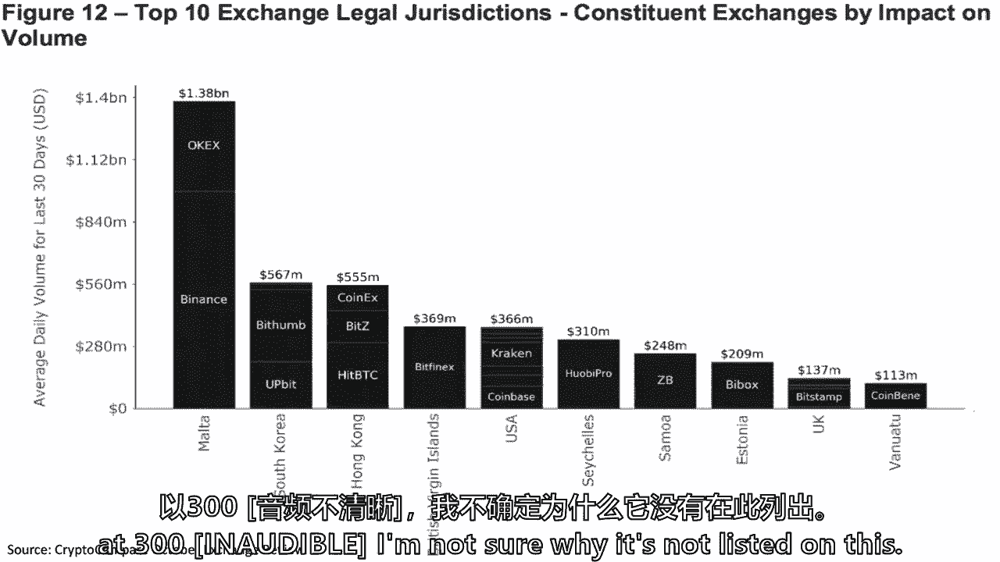
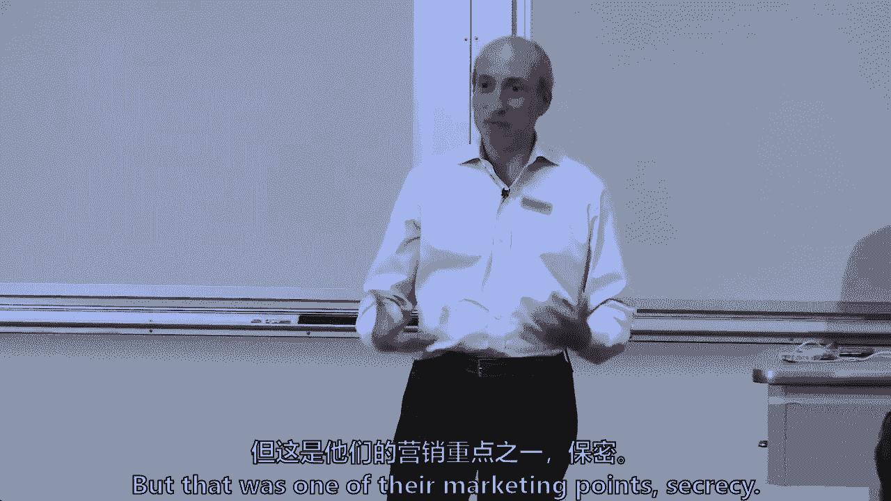

# 【麻省理工大学公开课】区块链与货币 - P17：17、二级市场和加密交易所 - 闰土聊Web3 - BV1sL411N7Mm

所以我们今天要谈谈密码交换，这与区块链技术非常相关，但不是区块链技术本身的直接应用，但它是加密金融生态系统的一部分，超过90%和一些加密货币，百分之九十五到九十八，加密交易所发生的实际交易，所以我想。

没有一门区块链技术和货币的课程能真正完成，不谈加密交换，但我敢说今天没有看到整个演讲，甚至在周四，当我们还将谈论加密交换时，和一些外面的客人，关于我们在哪里降低验证成本，或者我们在哪里降低网络成本。

这基本上是关于二级市场的，在这个2000亿美元的生态系统中，第一次密码交换出现了，实际上在两千年后，在2010年，我想是，但可能是十一点初，因为就在有一个区块链应用程序的时候，比特币，人们想移动比特币。

就像嗯，我怎么能这么做，我可以在区块链上和另一个人一起做，但我如何找到另一个人，如果我想卖掉它或换它，所以有一个商业机会，戈克斯山是最初的三四个，我不认为这是第一个，但这是第一批开始起飞的人之一。

我们来谈谈失败了几十次的戈克斯山，如果不是数百个早期失败，最初，只是比特币，比特币和菲亚特的对决，它也在为那些技术不熟练的人提供服务，因为麻省理工学院的一些学生，所以我想再问一遍。

房间里有多少人拥有一点加密货币，或者类似的东西，只是为了一切都好，所以是三分之一到一半，但你会看到它会少得多，即使在麻省理工学院的这个社区也直接在区块链上做到了这一点，还有区块链，嗯，所以它是线的吗。

其他人，在那三十只举手的人中，另外两个9人基本上是通过加密交换完成的，所以他们在那里提供服务，我们已经讨论过的是如何做，互联网上的点对点价值运动，没有中央当局，在整个90年代，这次失败的尝试。

最终他或她在2008年解开了这个谜语，这里有一种分散的方式来转移互联网上的价值，然后这里，即使在麻省理工学院，你们三十几个人，或者你们中的40个拥有加密资产的人，但你们中的一个，这是斯隆。

也不是计算机科学和人工智能课，但我怀疑，甚至在计算机科学课上，就不到一半了，实际上已经去下载了节点，因为有一个方便的因素，这是人之常情，所以这甚至是从2010年开始的，所以我想谈谈密码交换。

他们的一些挑战，还有一些机会，它也将为周四的讨论做好准备，我们将在那里谈论，如何将加密交易所用于支付解决方案，像杰夫·斯普雷彻这样的企业家是如何看待并拒绝的，这是他能看到价值的地方，你将在星期四听到。

一个忠于自己创业技能的人，试图在整个区块链技术比特币世界中找到价值，并选择了支付解决方案和加密交易所的混合体。

对双方来说，这可能不是绑在一起的，所以我会用老式的方法来做，所以我们要谈谈，当然啦，读数，加密交换机，一点点公共政策挑战，然后我对前进道路的思考，我在哪里看到加密交换空间，汤姆，你可以回答另一个问题。

密码交换是如何成为。

是啊，是啊，我是说很明显可用性，接口，我们关于，有多少人有数字钱包？那是职业的另一个版本，对呀，所以让我们去另一边，因为艾琳是一只向上的手，您已经下载了节点，你用过密码交换吗，如果你愿意分享。

所以你两样都做了，是啊，是啊，我用的是硬币基，我买了一些比特币，然后我在我的电脑上转移了，因为我在做一个研究项目，我想我要把它用在这个项目上，但我最终决定它太有价值了，不能研究。

如果现在是2018年你用比特币进行交易，您更喜欢使用加密交换还是，你只是比特币，我想这取决于安全目标，如果我累了，我会用这张纸条，我想寄钱给我妈妈，天数，就是这样，毫不奇怪，她是，她很开放，她是如此。

即使是懂电脑的人，既有节点又有交换，这撒于我有多累。我的目标是什么，证券目标，也许你没说累，但是。

这是时间的数量，在她解决天的那一刻出现的争端，定期交换，不能得到，哪种类型的纠纷，然后呢，就像从账户上借记了钱一样，或者当你没有拿出太多东西而不回来的时候，你知道的，有一个问题。

这些交易所与传统交易所相比如何，所以纽约证券交易所，怎么，Coinbase是如何，与纽约证券交易所相比，我们必须有某种储备，他们在那里买一些正手，然后呢，所以你是说他们有储备，准备金。

所以Coinbase本身，所以一个变化的差异，我要突出强调三点，看看我们是否能从这次讨论中解脱出来，一个是交易所本身，可能在交易的另一边，亚历克西斯打电话说他们有储备，有些人可能会称之为做市商，对不起。

是啊，是啊，我觉得，作为经纪人承担更多责任，所以他们面向右边，所以亚历克西斯所说的必然结果是他们可能是一个做市商，它又让我想起了你的名字，约翰尼是他们在金融界承担了经纪责任，上，总的来说。

早期的交易平台，不允许公众在纽约证券交易所交易，当它开始于18世纪晚期，你知道的，华尔街附近，实体华尔街，字面上，它是一个会员协会或会员俱乐部，你必须成为会员才能很好地交易，那些会员和俱乐部。

就像高尔夫球杆或网球杆，很好地有一套规则，在政府介入之前，他们会进行交易，这就是现在所说的中间访问，我不认为你们中的任何人是纽约证券交易所的会员，你是，我也不是，所以我们实际上不能和纽约证券交易所交易。

但我们可以用罗宾汉这样的应用程序，并要求他们与纽约证券交易所交易，或者高盛或者先锋，或，你知道是谁，这就是所谓的中间访问，所以我们有两件事，一个是硬币基，可能是另一边，我也是，他们不，他们缺乏中间通道。

埃里克，就在雷达交换硬币库实际上储存的，所以埃里克说第三个大区别，我是说还有其他区别，但第三大区别是加密交易所存储价值，纽约证券交易所不储存价值，从技术上来说，你的价值最终在分类账上，在存放处。

信托公司DTCC，就像支付系统有中央银行和商业银行，也就是DTCC，在美国，和其他国家，其他类似的结算组织，在它下面，或者持有东西的经纪人，它被称为街道名称，但不管它叫什么，知道大多数交易所。

传统证券市场，这就是三大区别，监护，中间接入，谁在做不利于你的市场，拜托了，也许我的问题是，当我用四天的抵押品迅速改变每笔交易时，如果我卖了一分，我一定有，承诺，这样我们就可以创造井。

所以你提出了一个问题，现金市场和衍生品市场之间的区别，已经存在了几百年，所以在现金市场上，你在出售所有权，购买所有权，在股票和债券中，甚至比特币，然后在衍生品市场上，你签订了一份合同。

或者有时人们称之为分歧契约，但一份与价格有关的合同，一些公司的定价机制，甲骨文，在计算机科学中可以称之为，所以我们叫它神谕，但在大宗商品市场上，一些指数提供商，一些定价提供商，这就是缓存和导数的区别。

但你是在说什么吗，即使除此之外，是啊，是啊，因为它会到冰的地步，我还没有深入到这一点，但在我看来，这是一个导数，不是现金对吧，所以我要求你们从现在到周四尽可能深入，因为你会有冰的创始人和我们在一起。

但是冰是一天期货合约，从字面上看，你正在购买比特币的衍生品，但这是一个非常不寻常的期货合约，因为它必须是百分之百的抵押，所以没有利润，一天后，你得到了比特币，所以周四有趣的问题之一。

你可以向杰夫和凯利施压的是这真的是一份衍生合同吗，还是一种刚开始作为衍生品的现金合约，两个四个小时后，它变成了现金，因为它是百分之百的抵押，一天后它就解决了，非常不寻常的未来合同，我不知道未来的某一天。

百分之百抵押合同，我觉得这实质上是另一个名字的一天现金合同，那是给那个的，但我以为你在说另一件事，你能卖空比特币吗，有没有人，肖恩，我不知道我怎么会，肖恩做空了以太，比特币和比特币现金，你怎么做到的。

做空就是卖出你不拥有的东西，并承担相反的价格风险，本质上，当价格下跌时赢，当价格上升时输，它已经存在了数百年。

这不是新的，但它太短了，大多数市场上的东西，你需要能够借用底层，卖掉你不拥有的股票，有一个完整的市场叫做股票借贷，在那里终极，有一天我们争论了这个问题，这个房间里有一些在股票借入方面工作过的专家。

你借证券的地方，然后你卖掉它，或者你卖掉它，在你必须交付的两天内，你的经纪人帮你借的，所以我想肖恩当你做空比特币的时候，嗯，所以只是，呃，进入第三个问题，所以三大区别，我们要深入调查这些监护权，中间体。

它断了，你知道，基本上你有中间人吗，还是你直接，所有的黑客攻击和操纵是什么。

等等，告诉你这些地方的安全状况，和市场诚信状况使三重，如此如此，本质上，条例，或专业业务，或反商业，或者专业比特币或者反，这是信任的问题，当你因盗窃而损失大量资产时，黑客只是偷窃的另一个词。

那么这往往有，你知道吗，对这些机构的信任度较低，我们可以讨论该怎么办，我公开有一个观点，我要和你分享，当我们今天上这堂课的时候，但你不需要分享第二部分，这就是我所在的地方，如何解决，认识到。

高水平的托管问题和高水平的市场操纵问题。

可能与对这些机构的信任度较低有关，即使现在你也知道，三千多万人使用过加密交易所，这个班三四十个人，所以有一定程度的信任，我只是说，我想这才是真正的问题，嗯，所以让我们有，所以我们有很多读数。

我就跳过那个，所以加密交换，这就是集中交换所做的，他们大约有两百人，可能在比特币的历史上，有一百到两百家已经开了又关，你知道的，所以在历史的某个地方，有三四百个，就他们的数量而言，它仍然是相当分散的。

我以后会说，我觉得，将会发生的事情之一是我们将看到更多的整合，他们太多了，那是一种不寻常的市场结构，几百年前你想买卖你的苹果，如果你想买到最好的价格，你会去中心或市场，发现，所以问题是。

我们有这么多加密交换机吗，我想这是促成它的原因，我会说，是呀，但我不认为这是唯一的原因，我觉得，所以你是说，传统交流，有，特别是实物，苹果，在中心广场有一个位置优势，我同意那一点。

在纽约或伦敦有地理位置优势，你知不知道，在十九世纪，费城证券交易所比纽约证券交易所还大，直到大约18世纪40年代或50年代，内战后，与费城相比，纽约起飞了，但有区位优势，但在数字时代，区位优势较小。

我同意那一点，我也认为现在还为时过早，在某些方面，不需要太多，有一个软件提供商为，超过一百个加密交换机，它们不是最大的，因为一些最大的公司编写自己的软件，但至少是首席执行官告诉我的，谁跑，软件公司说。

它超过了20%，也许是30%的数量，所以一半的密码交换，大约四分之一的卷都有相同的软件，意思是订单簿的软件，为了，为了，托管解决方案之类的东西你也可以开始加密交换，请遵守证券法，如果你要在美国经营，嗯。

其实，如果你要在任何国家经营，但尤其是在美国，所以启动并不难，那是另外一件事，现在启动密码交换并不难，如果你有一个软件提供商，可以给你一个基本上的包，你给它起了个新名字，然后你就走了。

但他们是匹配的代理，意思是他们在匹配买卖，他们也是我们谈到的交易对手，及其保管人，传统交易所做第一，但他们倾向于不做第二和第三个，分散交易所，分散的交易所只占市场的很小一部分。

我们稍后会看到一些数字，估计它比1少一点，2018年10月，现在成交量的0。5%，但它们是一种计算机算法，允许你对等交易，没有一个集中的，分散的空间有很多变化，我会回答任何关于它的问题。

但这是一篇有趣的文章，它说，凯利，我真的不需要Coinbase来交易，如果有一些应用程序可以找到我们每个人，我们可以找到彼此，如果我正确地理解了你说的话，但只是为了搭配很好，正确，对呀。

它只是没有另外两个，因为你可以尝试诡计，所以罗斯提高或分散了，真正集中的匹配，没有另外两个，让我反过来回答，分散的交易所没有任何保管职能，无监护功能，尽管我可以想象，他们可以建立一个分散的代管功能。

通过一些多签名，你甚至可以在技术上分散地做到这一点，但我现在知道的是他们都没有监护权的解决方案，没有一个是对手，这是准确的，不清楚它们是否都集中在一起，有一个开发商，有一组计算机技术人员。

但你实际上可以，如果你愿意，把那个算法拿出来，只是说这是一个有趣的项目，我是麻省理工学院的计算机科学家，只是把它放在那里，凯莉和我可以找到彼此，但通常有一种经济模式，即有人试图赚点钱。

所以软件有一些集中，美国证券交易委员会上周刚刚对一家分散的交易所提起了第一次法律诉讼，它本质上是针对软件开发人员的，别误会我的意思，这个国家显然有言论自由和表达自由，但你可能是一个软件开发人员。

仍然是一些犯罪的同谋，SEC和CFTC在过去的12个月里，对软件开发人员提起法律诉讼，有趣的是，在上周，SEC达成了和解，这是一种以太三角洲的东西，你认为SEC最感兴趣的交易平台是什么，什么。

那是什么类型的卡塔琳娜，伊科斯，是啊，是啊，所以它是一个分散的平台，以以太坊为基础进行贸易，更具体地说，ERC二十个代币，分散式埃隆，我可以用我们的ERC 20代币，但他们拒绝了，否，那是证券交易所。

这也是美国证券交易委员会首次对，任何密码交换，他们为什么选择它，分散成为他们的第一个，那是个故事，我不知道，但他们做到了，所以它分散在不到一半的体积上，而是一个有趣而坚韧的，你知道吗，新区。

它把你带回了中本，就像我说的，负责任，就像在这间教室里，大概95%的比特币和以太交易，你认为全球最大的卖家是比特币，矿工们，你认为以太F最畅销的是谁，因为科斯，百分之八十的科斯是在以太坊上完成的。

通常在早期他们出售比特币的代币，当维塔利克·布特林做他的，他把F卖给了比特币，但我们在过去的十二个月里搬家了，它基本上是以F的价格出售的，所以你想卖掉它，一般来说，我是说。

他们可能会保留三千多万直接会员，正如我们所说的，他们缺乏中间访问。

正如我们将看到的那样，市场诚信角色，所以这是，你知道，市场，就像它一样，在这次讨论中，这张幻灯片对我来说最重要的部分不是波动性，我们知道，坦白说，其实最近，我们已经六个月没有太大的波动了。

但六个月的统计相关性不足以说明未来六年，或者六十年，而是五个，4%是比特币，以太坊是什么百分之十六，所以他们之间。

那是百分之七十，所以我们已经知道在美国，在许多其他司法管辖区，四分之三的市场不是科斯或不是科斯，所谓的证券，即使在美国，s，加拿大和台湾，遵循类似豪伊检验的三个司法管辖区，我们已经谈了四分之三的市场。

非证券，它只是一种商品，现金密码，所以你会听到关于首次硬币发行和什么是证券的辩论，什么与安全无关，相关和重要的辩论，但对于四分之三的市场，作为一个法律问题，这并不特别相关，作为管理事项，野蛮的问题。

所以如果比特币要成为一种稳定价值的加密货币，一个，如果不是资产，还是这样，你的问题是野蛮吗，如果波动性有限，交换的价值是多少，价值仍然是有些人会想卖掉资产，或者购买该资产，有些人可能。

如果它是价值的储存，我可能还是想卖掉那个有价值的商店，这样我就可以买车上学付医药费，你不认为这和不稳定的资产一样令人兴奋吗？这就是你说的野蛮吗，嗯，就像高盛多年来，以前我被教导波动性，是我们的朋友。

当你是一个投资银行业务和做市，做市商喜欢波动，所以你可能会认为作为一个做市商，作为一名投资银行家，但我仍然认为如果比特币或其他任何东西变得非常稳定，价值储存，人们仍然想买卖它。

但你是说这对你来说不那么令人兴奋，还是为了市场。

你以为我没有，哦好吧，我也不知道，以下是顶级加密交易所，我提醒你这是一周前印的，唯一准确的说法是，网络组加密比较每月发布报告，我抓起十月的报告，我不相信这些数字是准确的。除了我可以告诉你。

加密比较与大约140个交易所有关系，这140个交易所将他们的信息提供给加密比较，但这里是大的，嗯，你从这张幻灯片中得到了什么，当你看平均贸易方面，两、四小时后交易，这些卷，任何我的意思。

有没有人在不在那里上市的交易所交易，如果你愿意说嘿，安有啊，Coinbase名列前十四，看看十月份的情况，提示硬币，我使用X Polyx，肯定比这个小，X说一个观察是所有这些，它在南亚，就是知道空间。

所以美国的太空交换不在上面，所以我们不知道这些数字是否准确，它们是密码比较的，从一百四十家交易所收集，但这并不意味着他们是准确的，他们可能不准确的一种方式，交换可以彻头彻尾地撒谎。

如果没有规则或法律反对它，他们可以用另一种方式做到这一点，他们能做到的是，他们可以对数字诚实，但通过一种叫做黄蜂交易的东西来夸大数字，黄蜂交易在美国是被禁止的，根据证券法和商品期货，贸易委员会法。

洗牌交易是指我在买东西的同时又卖东西，基本上是对我自己或我的附属机构或我的同事，如果我有，即使我和Elon在法律上没有联系，但如果我今天卖东西，伊兰和他买了，我们有一个协议，出于某种原因。

我们只是在增加音量，那是清仓大甩卖，为什么有人会在两个无关的政党之间做清洗销售，想歪了，像这样思考，你知道吗，机械手，你想让其他人认为其他人在使用它，是啊，是啊，你想确保别人认为有东西被用了，什么是。

那很有用，另一个原因，所以人为的流动性和另一件事，你可能会展示一个人为的，价格，谢谢。所以手表在市场上销售很长一段时间对操纵者来说是一个很好的方式，有点嘿，看看这个流动性，看看这个价格定价信号。

这就是为什么在美国的证券和商品市场，我们说不，这是一个，这是一个不允许的小核心事情，但没有禁止出售洗涤用品，所以有学术文献，有一些研究，一些竞争对手，一些交易所，学习，其他交易所作为。

那边有很多洗涤用品的销售，所以我们不知道这些数量数字有多真实，我觉得有趣的另一件事是一般的贸易方面。

两百到一千块，他们中的几个几千个，我是说，这些都不是大交易，凯利，所以这本身就很有趣，但红色比较交流说像童子军TRA，传统安全的一些问题，所以我想知道它基本上是在说看点，基本上有300亿注册。

两千万帐户，所以这显然很好，我想知道其他指标与，所以我四处寻找会员名单，我找不到别人的，也许这是一种，这比通过洗牌交易来提高你的数字要难一点，我是说你也可以谎报你的会员资格，连硬币都是两千万。

不代表他们是活跃分子，所以这里有另一种方式来看待它是根据法律管辖权，同样的数据库，你会有八张或十张幻灯片，相同的数据库Coinbase在美国，这意味着它比14万，否，我不太明白这条线是从哪里来的。

也许一天有一亿，而这只是十月，肖恩就在那里，为什么时间密码，对我来说不是这样吗，其实，相当，它在塞舌尔上市，专业的300英镑，我不知道为什么它没有列在这上面。

是同一个数据库，它不在那里，是啊，是啊，在那里，是五号。

你会怎么看待世界上最大的金融中心。

是呀，我想我在上一张幻灯片中得到的一个问题是，如果你把这些变化所声称的所有交易加起来，他们24小时都在做的事情，这不是比系统本身的容量大得多吗，记得那是什么感觉，每秒7个事务，所有的权利，所以问题是。

这看起来像是实际发生的更多的体积，我同意你的看法，你为什么认为那是可能的，两个原因，他们只是在内部进行交换，他们实际上不是在区块链上交易，提醒我，你的名字，千斤顶千斤顶，所以杰克的观点很好。

也许并不是所有这些都要去区块链，它发生在电子表格上，在某些情况下，Excel电子表格，但我不知道有人把它储存起来，即使在区块链上，第二个原因我也会这么说，第二波。

所以它可能会使用第二层溶液或者闪电或第二层，那很有可能，尽管我不知道是否有很多活动，这里有很多货币交叉，这不仅仅是比特币，每天可能有两三千双不同的鞋被交易，比特币以太，比特币，比特币系绳。

你可以用比特币，比特币现金，但是很多外币土地上的十字架是两种货币，它通常被称为我们的货币对，美元对欧元，美元兑日元，这些递归对，但现在我们可以，如果我们能在这里使用同样的术语，有成千上万的十字架或对。

所以不全是比特币，但第一个原因是最大的一个，杰克说的话，并不是所有这些交易所都会满足于区块链，立刻，事实上，即使对他们来说也是昂贵的，所以他们会冒一些价格风险，和他们在另一边的做市。

他们会冒一些价格风险，他们可能一天多次使用区块链，但只有当它们有暴露时才会稳定下来，我不知道他们的风险管理可能是，当我长的时候我会解决的，十个比特币或短十个比特币，但采取一些价格敞口。

风险管理，本质上是硬币基、海妖或双子座，或者我，或者基本上说，我要接受一些价格风险敞口，并只解决到最终解决，终局性，区块链，一天几次，当然也需要10到60分钟，所以这里发生了这种事，观察力好，是呀。

伊莎贝尔说了很多关于数字钱包，所有的网络以增加安全性，所以其他变化不会这样做，所以伊莎贝尔提高了硬币基数，促进他们有一个安全的监护解决方案，其中一部分是让你的比特币远离网络，术语是把它放在冰冷的钱包里。

而不是一个炙手可热的钱包，有人知道什么是热钱包是埃里克，这是软件，它是基于软件的，这个基于软件的钱包是什么，当前连接，而不是一个断开连接而没有注册的钱包，让我保留这个问题，因为我有一张幻灯片，但是是的。

答案是，其他，也有冷库，五年前的戈克斯山，没有太多的冷藏库，但是这里还有什么关于世界上伟大的金融中心的观察。

詹姆斯，MOTA金融与AX。

现在再来一次，财务和斧头号码是。

你是香港人，对呀，是啊，是啊，你是香港人，中国最大的出租车。

是啊，是啊，英国人，维尔京群岛，塞舌尔。

你知道，这是一种，这些是他们注册的国家，不一定是真正运作的国家，你的意思是，你不认识他们，有人想说Priya，它是法国西亚的一部分给你，我很惊讶你还不了解这个金融中心。

詹姆斯会告诉我们更多，在SIP周去Expedia要花多少钱，我认为斯隆应该从一次真正的旅行中受益，好的，所以这是一种不同的测量方法，这不是音量，我要花一点时间，这只是主要交易所的数量，有八个大的在。

我们从最大的硬币基地开始，它跟踪，我们说过的波洛尼亚克。

裂缝和双子座，它咬了，那些是基于你的，你们中的一些人，你可能有，我想在这张图表上，如果你在这张图表上找不到你的交换，我会没事的没事的，也许是因为它可能已经失败了，无论你有什么交换，但是埃里克，你在找谁。

我只是想看书，这些幻灯片都在画布上，对不起，乔，奎因，你有一个问题，我有点迷路了，有些人明白，如果我有一个I，怎么不是，所以所有的交易所在早期所做的，这是在十点末和十一点开始的，建立帐户结构。

字面上的Excel电子表格，而是他们所有客户的账户结构，假设你买了，比特币和凯利正在出售，也许我可以我可以做你和凯利之间的交易，对上，这将被称为Gensler交易所，就在詹斯勒交易所。

所以我不需要把它转移到区块链上，因为有一件很重要的事，当你开户时会发生什么，对不起，这是个好问题，现在我意识到我跳过了一些东西，当你在加密交易所开户时会发生什么，你有，你可能会做K Y C A L。

但那不是我们要找的，你会是一只留住你的鞋吗，在这里发出钥匙的是什么，你可能是什么，但实际上我在找的是你的，我有比特币，我开了一个账户，或者我有你的美元，我开了一个账户，我和他们签了用户协议。

他们会以他们的名义存储我的任何密码，钱币海妖汇，他们不是以阿尔法的名义储存的，我不知道你有没有帐户，但我只是在利用你，如果阿尔法有账户，他签署了一份用户协议，他说，当我买比特币的时候，它充其量是。

就在这个Excel上，它可能比Excel电子表格更好，但在他们的数据库里是以alph的名义，但是在比特币区块链上，在一堆比特币地址里，Coinbase控件或破解控件，所以这个问题，因为我加倍了。

那其实不是我的，它在一个单独的分类帐上有一个名字标签，你有一些法律权利反对她的双子座，我是说，你有，我是说，但我的意思是它是集中的正确，这是正确的，因为你们两个凯利和你签了协议。

他们把比特币转移到凯利身上，把比特币转移到你身上，或者如果你把美元放进去，你买比特币，明白了。

但这是因为市场，顾客也希望这样，所以又分散了交换，基于密码比较，这些是10月份成交量前五名，但这不是你读得最多的五个，你读到的文章，谈论别人，所以我对这些没有很大的信心，但这些是加密比较可以汇集的数字。

你可以看到它们的总数要小得多，在密码比较数据库中。

只有零点，体积的4%，说他们为了竞争而放弃了钥匙，我不明白商业模式，他们是如何获得收入的，你们中有多少人的手机上有罗宾汉应用程序，你们中大约有十个人，你们支付证券交易的费用吗，提醒我你的名字，亚伦不。

任何人支付任何费用或罗宾汉，否，那不是很整洁吗？好吧，你付了一些费用，在你的这个上，在您的数据上，你叫以撒，以撒对，所以艾萨克得到了它，他们看到了你的数据，他们缝制你的流量，你说的第三件事是什么？

所以我不知道他们的经纪保管权到底是怎么运作的，但我知道有一个优势，所以你的数据有三件事，你的流量和以撒所说的浮动，但我可以说他们有证券可以借，存量借款或存量土地，这就是Facebook赚钱的三种方式。

他们有你的数据，所以我们生活在一个平台出售你的数据的时代，并利用您的数据销售广告，我可以说罗宾汉，你也可以支付保费，让我们在这里可以去保证金，而不是支付利息，在页边空白处，你付固定的薪水。

然后他们也喜欢通过定居点前进，而不是花三天时间马上做，所有的权利，所以有一个高级服务，你可能可以走得更远，他们卖你的流量，这意味着有些政党会付钱，先锋也这么做，这不是忠诚，可能有，我不确定。

但是很多大的经纪公司，当我们都在我的县先锋和他们一起工作时，我没有佣金，但我知道他们在卖我的订单，流动，所以谁会对数据感兴趣，或者谁对流程感兴趣，我了解营销公司，好的，所以我们在这种情况下的目标。

是联邦机构还是，好的，否，谁对数据或实际订单流感兴趣，汤姆对冲基金交易，等待对冲基金，什么类型的贸易实体，高频，高频交易者，所以我相信，罗宾汉和，最初我想有三家，然后是五家高频交易店。

有人告诉我很多这样的名字，我不知道他们是不是公开的，所以我不打算在镜头前重复它们，但是很大，他们中的几个，美国高频交易商店，高频交易店为什么要买单，丹尼尔，为什么高频交易店。

所以他们认为有一些价值艾萨克，你是，你可以正面向右，所以任何读过的人，你知道一些关于高频交易的书，你可以跑在前面，但回答拉希姆的问题也有价值，订单流中有价值，因为如果你能看到市场向这边倾斜了一点。

哪怕是几秒钟，你可以优化你的算法并从中赚钱，U，中国的股票市场，超过60%的U，s，股票市场现在交易频率很高，商品市场的任何每日交易量，当我在CFDC的时候，一些合同，我们认为它可能高达90%。

标普500期货合约，或者利率收缩非常显著，他们提供服务，有做市功能，那些高频交易者，大多数情况下，他们是合法的，但订单流是有价值的，所以订单支付是金融市场的一个非常关键的部分，在全球各地。

和任何高流动性的货币市场，债券市场，股票市场，而且是的，比特币，所以罗宾汉，亚伦，你用比特币交易吗，你在那里交易普通股票，是啊，是啊，其实，我会用它，在你手机上，但是你用了一两次，你没有费用。

因为芝加哥的某个贸易公司和罗宾汉有合同，嗯这样做，和杰夫·斯普雷彻，你会遇到他，星期四会告诉你，拥有五百万账户的罗宾汉，现在，这对经纪模式是一个真正的威胁，为什么为什么，为什么你们这一代的人。

或者千禧一代，因为你不是你的同龄人，X的，我觉得，但我是婴儿潮一代，我知道我在哪里。

但是千禧一代你可以免费得到这么多服务，罗宾汉看到了机会，他们突然有了五百万顾客，但他们就是这样，这就是为什么这是个很好的问题，嗯，所以向前移动一点，只是为了给你，所以这些是这个密码的主要内容。

比较一下就在十月给你，一种感觉，体积的三分之二，他们测量斑点，一三是导数，我们不是在谈论芝加哥商品交易所，最大的衍生品交易所，实际上在加密中是Bitmax，有永久比特币交换的。

和没有结算日期的永久ETH，嗯，高杠杆，你可以把1%的保证金押在99%的借款上，每十个小时就有一次价格，但这是一个永远滚动的十个小时的未来，这就是为什么它被称为永恒的十字架，我看到你看起来很好奇。

它是永恒的，因为它正在滚动十个小时的定价结算，但你不在十个小时内解决，你要么贴更多的保证金，要么每十个小时收到一次利润，什么事？为什么不是只有10个小时，因为十个小时的未来可能不会，你或我在合同中继续。

所以他们创造了一个永久的滚动，我不在十个小时后发帖，这是正确的，位最大值是这个卷中最大的，他们说他们不在，u，It’因为如果是他们干的，肯定要在期货交易委员会注册才能出来，密码对密码与菲亚特对密码。

70%的音量是在加密到加密，再次交流，我们不知道这批货的数量是否准确。但仅仅根据这些数字，所以生态系统仍然是三分之二，密码对密码，而不是换到其他地方，权力下放，我们已经谈到了这个非常重要的创新。

我想它会，我们将看到更多关于分散的，但现在我们还处于早期，这只是十月，但百分之五十是对美元二十一日元。

韩国，谁是韩国人，任何人都有，我们有，任何人，所以告诉我们一点这个数字，为什么十六岁的韩国，你的观点，我知道上面没有读数，我不知道为什么，但是很多关于如何，有这么多，他们投资的所有钱。

就像你的一生到加密货币，因为他们有任何未来，喜欢边工作边赚钱，任何其他意见，你不是从心理上，许多投机者认为这是一件非常公平的事情，在股票市场上投机，我们需要一些基本的技术技能，纯洁甚至感觉不纯洁。

但要知道，即使是你也需要特定的技能，它只是纯粹的向上或向下，对资本管制感到好奇，泡菜有溢价，即使比特币的售价也要高一点，这就是它的名字，那个词不是我编造的，有一点溢价，有一些学术研究。

以及它是如何扩大和缩小的，有时候，取决于政府的所作所为，它是以个位数百分比来衡量的，但你可能会支付3%或4%的保费，有时是百分之一点五的溢价，但韩国交易所有溢价，但三年前。

你认为哪个交叉是最大的超过50%，就在三年前，它现在甚至不在图表上，汤姆·拉姆，b在2015年和2016年，它是市场的一半，是比特币，和美元的事情，然后占用了那个空间，很多人认为这真的是一美元。

这些数字不稳定。有几个月日元是最大的数字，我们谈到了这个国家出色的金融中心，然后K Y C一个有趣的统计数据，现在，这大约是140个加密比较的交换，在他们的数据库中，他们说只有一半，四七严守。

了解你的客户，四分之一部分，和二八绝对没有，这只是加密游戏的一种状态，但他们可能是，那么政策挑战是什么，一个是市场很容易受到欺诈的影响。

操纵，任何市场都是人之常情，我不认为我们会把人从人身上拿出来，它会寻找角度，寻找创造机会的方法，即使是最好的意义，乡亲们，如果你保管资产，你可能会让市场，因为你不适应区块链，即使是短暂的。

而这种市场模式，这种商业模式是为了制造市场。

也许有内在的利益冲突，几乎所有的金融都有利益冲突，但我们试着管理，我们要么通过某些关于透明度的规则来管理利益冲突，或拘留中的某些禁令，世界，银行也持有托管权，但我们禁止他们使用你的资产。

除非你允许他们使用你的资产之类的东西，所以我们试图用的，它通常是建立一些透明和肯定的责任制度，或禁止性行动，那三个桶透明度，有些肯定，但这个空间有冲突，如果没有这三样东西中的很多，透明度。

所以我不可避免地认为这是人之常情，你会有一些，你知道，正在进行的游戏，保管安排，我们谈到了巨大的挑战，我们将看到更多关于这一点的信息。

Kayc与在美国实施税务报告，至少美国的经纪人要向政府报告，当你买卖东西的时候，三五十年前这不是真的，但我们来到了一个地方，我认为它是，在过去的十五到二十年里，法律改变，也许是罗斯。

也许你知道在你的法律锻炼中，但法律的变化是经纪人的底盘，必须报告，这些报告进入美国政府和其他国家，所以经纪人说詹姆斯卖了这么多股票，它有一个基础，这里有更多的税收遵从，没有经纪人，所以很难把什么东西。

嗯，当国税局来敲硬币时，一些交易所相当缓慢，国税局有一点，当国税局要求那里的数据时，然后1300万顾客，他们定居下来，因为国税局正在对他们采取行动，当他们不给他们任何信息的时候。

他们结算并给他们关于他们一两万个最活跃的账户的信息，但现在有一段时间，Coinbase可以表现得像他们是瑞士银行账户，我希望有人从瑞士来，那我就可以说了，但你知道几十年来，等等谁，你在那里住得很好。

几十年来做了什么，也许几个世纪的瑞士银行账户，以保密著称，保密，那是在那里，他们还有很多其他的好事，但那是他们的营销点之一。

保密，嗯，现在有点难了，但它仍然是相对于德国银行或法国银行的，可能更秘密一点，对呀，是呀，因为你，它少了很多，s压力，仍然比，但密码交易所仍在思考，哦好吧，我们怎么能放弃保密，因为在竞争中。

其他交易所没有这样做，所以我认为Coinbase试图成为好公民，但也不把一切都交给国税局，状态，有一个很大的问题是什么是安全，什么是商品，什么是导数，在全球每一个法律管辖区，那么什么是证券。

什么不是安全，与现行法律规定的内容有关，我在美国作证，我说，不管怎么样，如果它只是一种商品，就像比特币一样，在U下面，中国的法律被视为商品，如果它是导数，在大多数司法管辖区，所以列表中的第一个和第三个。

商品交易所不是，但一点也不，所以定义的东西也与进来的东西有关，所以在美国，有一些交流会，我预测在接下来的18个月里，替代交易系统注册表，但我想他们只会这么做，如果它们是第一类，他们有一堆最初的硬币代币。

显然是安全的，他们注册，但如果你只交易比特币呢，只交易比特币和F等等，那些人可能会说我不想有所有这些额外的成本，星期四的问题，为什么洲际交易所创造了一天的未来，看起来就像，就像，走进去说。

这就是我的感觉，这是决定集的一部分，但你可以在周四问，嗯，跟踪受益所有权，我们在证券市场上追踪实益所有权已经有很长时间了，从第一批股份公司，因为你跟踪实益所有权以确保有人获得股息，如果他们每年投票一次。

在董事会之类的事情上，但在过去的三四十年里，并跟踪其他在证券法之上的东西，世界各地的执法机构说我们想知道谁拥有什么，在过去的五百年到一百年里，只是证券法关心跟踪实益所有权，但是有一些国际条约。

我记不起它的名字了，并确保有转移代理，有一个完整的制度，记录谁拥有什么，大多数司法管辖区的证券法都包含了这一点，对于这个空间来说，这是一个艰难的问题，不仅仅是因为它来自自由主义的基础。

但这也是一个艰难的问题，只是技术上，只是技术解决方案，密码交换是，他们中的一半有严格的密码比较，但是四分之一，我没有，这意味着他们没有跟踪实益所有权，我想那会，它会慢慢上升。

但是如果你看到很多注册的交易所离开一个国家去另一个国家，嗯哦，你如何补救不符合规定的交换，这里有一堆交换，我们那将注册证券交易委员会可以做一个看看，我们不会，我们不会找到你的。

我们不会因为你的过去而惩罚你，你能在接下来的12到18个月里遵守吗，这可能就是将要发生的事情，但就像以太三角洲的情况，就在上周，他们达成了某种和解，他们说你在过去的X个月里一直在违法，但你如何遵守。

所以这将是一种有趣的，会不会有，我想在某个时候会有罚款和处罚，但我想在美国，然后他们会，他们会留下更重的足迹，把锤子拿下来，如果你想在2019年或2020年，我不认为那会是在2018年，凯利。

这是周四的问题，但是交换的一面是什么，你认为他们会因为遵守规定而付出巨大的代价吗，还是他们，数字甚至可能增加，所以一个很好的问题，什么是顺从，有一些广泛的公共政策规范，我想可能有不同的商业模式。

如果你是现任，就像纳斯达克，有一篇简短的文章，当管理NASX的Adena Friedman，说她想在空间里，如果你是纳斯达克，如果你来了，如果你是德国人，德国的博尔施，如果你是冰。

你真的已经知道如何顺从了，注册可能是有利的，所有这些初创企业都要注册，在某些方面，它为进入创造了障碍，但你想这么做，如果你是一个初创企业，你可以走两条路中的一条，所以双子座在美国和Coinbase。

至少在公开场合说我们想遵守，我们怎么去那儿？Coinbase可能是因为现在他们几乎就像一个现任者，所以他们可能想保留，你知道下一轮创业，但我认为在全球范围内，毫无疑问，这将提高成本。

问题是这是否会确保你的市场份额或淘汰一些竞争对手，我认为这会增加市场的整体规模，因为会有更多的人感兴趣，但有些人担心这会使市场萎缩，因为一旦你知道实益所有权，如果你追踪这个市场100%的实益所有权。

有些担心，市场就会萎缩，那是一个商业概念，意思是，就像如果你在跟踪实益所有权，质疑比特币的全部本质，所有这些都是放松管制，远离政府，并在个人之间进行交易，没有任何规定，这么小，自由主义者。

所以你问题的本质是比特币和加密，关于一些越轨的事情，自由主义者亲自由主义者，对等，我想是创世纪埃里克，你想回答，有一本关于Coinbase的书即将出版，CEO，提到过，越来越多的人，以新的退休观点。

不断提醒他这有点背叛了那个理想，我们不必怪我，我是说，他是，他想以此为业，所以遵守，这实际上是试图把基本成本扔给他们，让业务更有利可图，从一个两千亿美元的市场到两万亿或十万亿，它必须进入公共政策的信封。

我只是不明白，特别是降低操纵和欺诈的风险，那么你就会有一个更广阔的，社会接纳和投资者保护事宜，但你知道还有其他人在另一边，这些都在数字上，我不打算呆在上面，但这只是说一件事加密比较。

是平均每日访客与他们的数量，Coinbase是平均每天的访问者是，它们可能有合法的用途，两个Z B和E XX几乎没有访客，他们报告了很多数量，所以这只是一个有趣的统计数据，你知道的。

很可能财务数量统计是准确的，他们只是密码交换的密码，但他们的游客数量与数量的比例与硬币基地有很大不同，嗯，只是为了给你一点疯狂的味道，投资者保护，我有点说，投资者保护至关重要。

我们将在一周左右的时间里讨论首次硬币发行，但这不仅仅是消费者保护，我们知道我们是诚实的，我们对此很认真，我们说好，有利益冲突，我们如何处理利益冲突，你不禁止利益冲突，但你会说有办法管理它。

我们如何促进市场诚信。

通过透明度和反操纵规则，所以有点，你知道的，人类的现实，我们说好，我们如何在系统中设置一些交通灯和速度限制，给人们开车的信心，顺便说一句，拉希姆，我不能告诉你，因为我不在辩论现场，在十九世纪和二十世纪。

但你可以肯定的是在是否把第一个红绿灯熄灭的问题上存在争议，字面上，你知道的，是否设置第一个人行横道，设置交通灯和人行横道，限制汽车的使用，绝对，但想想这个，他们促进汽车的销售吗，我会争辩说。

他们还促进了汽车的销售，让邻居开车，因为大多数人不开车，但是让他们的邻居从他们的，你知道吗，走在街上，行人，行人感到更安全，所以我想两者都有一点好吧，我可能会透露，我的观点，我认为投资者保护支持。

投资者对资本市场的信心，每个人都受益，但是你知道，你得平衡好，我尊重你们中一半的人说不，一半说得更多，我只是在透露我在哪里，至少背后的逻辑，你知道豪伊测试是什么吗。

我们将在一周后进行首次硬币发行时继续讨论这个问题，但那是密码交换的中心，这是个重要的问题，哪些加密交易所有ICO令牌，然后他们会做得更多，嗯，这些是最大的黑客，我可以找到，这些是被报道的黑客。

他们知道什么没有被报道，硬币检查和安装Gox，每个大约5亿，五十到一百两，这里有一堆小的，我把。

我是说他们会在画布上，但有一群基本上偷别人的硬币，因为他们都是，又是，多亏了法医密码，比较伊莎贝拉，这是你之前的问题对吧，所以我真的不能告诉你为什么，比特传单只有80%在冷藏中。

还有一些像Bitfnexis这样的96%或7%，但我认为如果你有一个高音量和高流量，你也许可以把更多的放在冷库里，或者你的模型更多的是关于保管而不是交易，你可以在冷库里有更多。

你确实需要一些你知道的东西，可能与给你的客户权杖流动性有关，这在一定程度上取决于你把东西从冷库移到热库需要多长时间，至少这些是什么，他们自己的，所以他们自己买了保险，双子座宣布他们与怡安签订了合同。

世界上最大的保险公司之一，以确保他们所保管的东西不会丢失。

但不要把它和百分之百的保险混为一谈，保险公司的收费很高，大约是每季度1。5%，所以有一些加密交换，这将允许你支付保险，双子座说他们已经和Aion签了合同，我不太清楚，那只是因为双子座要支付保险。

或者他们会允许你在监护权解决方案中支付保险，让我们看看我要说什么，哦，我们快结束了，我想监护权是这样的，我认为监护职责要么是固定的，要么是剥离的，我认为从公共政策的角度来看，他们最好分拆。

这是因为有这样一个内在的冲突，我想如果你持有某人的资金，只是太甜了，蜜罐不只是为了被偷，但是接线员说，我想用在我自己的身上，你知道，借出去，借一下，在它周围进行交易，但那是我的想法，修理它或旋转它。

将是监护非法活动，我想我们得去一个地方，如果不是100%接近100%的人实际上遵守了，如果他们中的四分之一甚至没有做AML和K Y C，还有很多，前面还有一段路，我知道这可能不适合拉希姆，你知道的。

的自由主义灵魂，这一切的起源，我不会说你可能在哪里，但这是我认为这将是前进的道路，如果我们还有两三年，四分之一的市场没有这样做，我认为市场诚信是最难的，也许我的个人观点不应该影响我的判断。

我个人的观点是我们需要市场诚信，反操纵，没有前面跑这样的事情，但实际上，这可能是由个人交易所完成的，或自律组织，英国的双子座和其他，有一些自律组织，我认为这还不够，这是朝着正确方向迈出的一步。

但我想如果事情变得更大，它需要是官方部门，安装一些交通灯和停车标志，嗯，首先确定您是否必须注册，然后遵守，在日本，这是一个多月或一年的时间，他们在2017年底开始注册，他们从16岁开始，又从16岁开始。

一些不得不在日本关闭，韩国正在注册，现在，其中一些登记制度实际上只是关于保管和银行保密法，他们没有达到我想要的程度，这是对市场诚信的追求，但我想你会看到更多的司法管辖区，注册补救，一些关闭。

以及类似的保证金和费用压缩，我想那是不可避免的，不管是来自罗宾汉还是洲际交易所，但现在果汁太多了，我是说其中一些收费1%到3%，你们都交易，你知道你的收费结构更好，但我认为会有利润和费用压缩。

我想会有一些整合，这里没有足够的空间容纳两百多台交换机，这就是我的预测，我认为分散的交流，一旦他们增强了客户UI，会有更多的领养。

他们现在，对大多数人来说不是那么容易使用，两个问题，然后我们可能要把它包起来，用那些加密交换盈利能力的东西，他们利润丰厚，Coinbase做了一个风险投资，估值为80亿美元。

一家加密交易所以4亿美元的价格出售了自己，和硬币支票，损失了5亿美元的NEM。

在日本经营的两个七岁的孩子没有宣布破产，因为在过去的12个月里他已经赚了超过5亿美元，他们利润丰厚。

