# 【麻省理工大学公开课】区块链与货币 - P18：19、主要市场，ICO和风险投资-第1部分 - 闰土聊Web3 - BV1sL411N7Mm

所以让我们来看看这个首次硬币发行的世界，所以我们将在今天和下周二讨论这个问题，事实上，证券交易委员会有一些新的东西，甚至在上周的首次硬币发行中，但我们今天会花一点时间在科斯上，所以。

当然我们已经讨论过后退了，我们来谈谈它们的特点，什么是首次硬币发行，这种新形式的众筹是什么，如何评估首次硬币发行，其中一些会很熟悉，因为这是如何真正评估任何区块链技术项目，在某些方面。

然后我要分享一些统计数据，然后祝大家感恩节快乐收工，这种新形式的众筹是什么，有人想告诉我ICO里有什么吗，以最简单的方式回家过感恩节，有人问你在学什么，你说，伊科斯，什么是ICO，是啊，是啊。

这是一个初创企业，那都是加密令牌来筹集资金，所以这是一个自己的加密代币来筹集资金，所以这是筹集资金的一种方式，用密码令牌很简单，除此之外，给人们带来了期待，代币的价值在未来会上升，有人读了今天的选读吗？

关于那个想出了这个主意的人，你记得他的名字吗？杰·杰·威利特明白了，我是说，我不知道是否有人看了录像，但是这个，2010年的这个人想出了一个主意，比特币在那里，我是说，比特币的售价大概是6到10美分。

他说你知道，如果可以的话，如果你能把一些东西放在比特币的上面，我甚至不知道他是否用了智能合约这个词，但他说如果你能把一个应用程序放在比特币上面，那是在维塔利克布特林和以太坊出现之前。

他说你可以筹到很多钱，他参加了一次又一次的会议，试图说服人们，甚至有一个反馈，有人在电子邮件中对他说，你可能触犯了法律，这不可能是合法的，但他不能让任何人采纳这个想法，他现在也不富裕。

他错过了整个ICO波，但他基本上是最初硬币的发明者，说比特币的技术，甚至脚本语言，就足够了，你也许可以在比特币的基础上筹集资金，使用应用层，我们现在来整理一下。

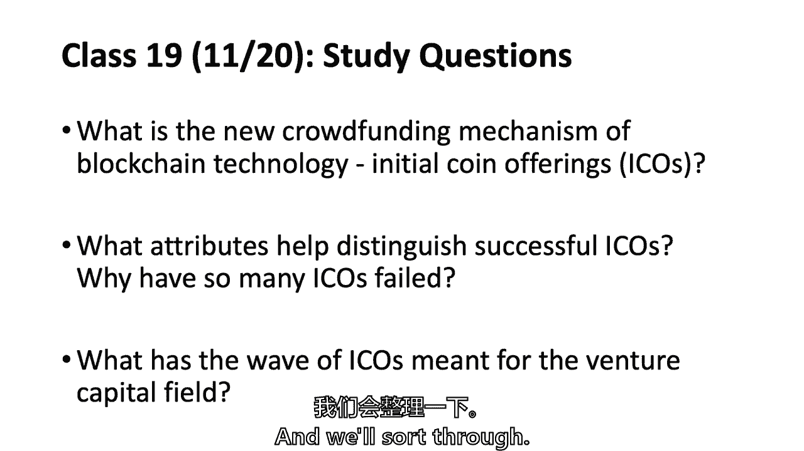

我看看能不能为你做个小视频，这对我来说应该不难，和，这是一个两分钟的视频，记录了所有发生过的科斯，和元素，我给你看了这张照片，但你知道没有太多，我们在哪里，我们现在在二十五。

所以你可以看到他们标记的第一个ICO，以太坊本身筹集了1800万美元，我向你道歉，只要两分钟，但你会看到科斯的整个历史，然后什么都没有，真的是这样，大家可以看到，没有国家。

在2016年没有官方部门真正关注这个问题，但在2016年中期会有一个大的供品，有人知道那是谁吗？一亿六千八百万，它失败了，它惊人地失败了，其中五千万被偷了，它通向以太坊，叉子之类的东西，但还是不多。

然后到了十七岁的夏天，凯蒂酒吧。

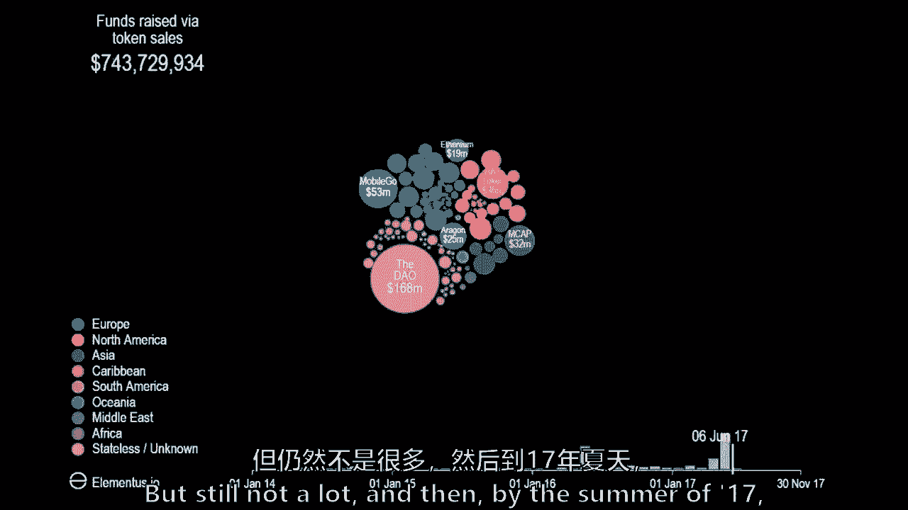

门和25万美元。

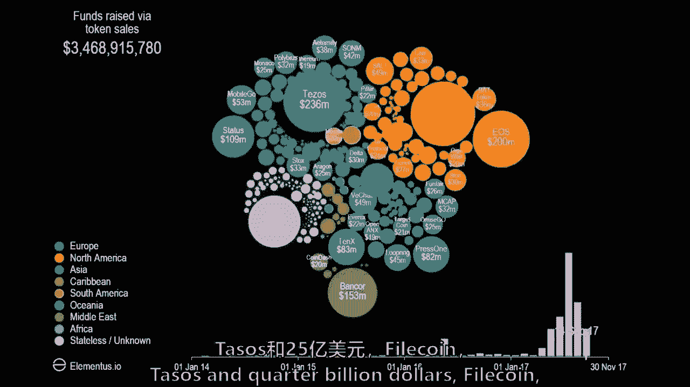

投入2。5亿美元，然后呢，哦，我拉了一个完成在二十七年，对不起，所以这是最终的图表，一直持续到八月，现在有人说这不是20个80亿，有人说是二十三个亿，因为没有真正好的数字，但是EOS筹集了42亿。

电报筹集了17亿，巨额资金，这不是一个时期，几乎所有这些都是在大约12个月内筹集的，从十七日六月到十八日六月，在那12个月里叫它25亿，现在它正在滴下来，现在每月不到5亿美元。

但12个月内的25亿与风险投资相比，西蒙妮，你可以帮我，但在12个月的时间里，全世界的风险资本每年约为1500亿，我想这个数字从一百二十五亿到一千七百亿不等，但为了给你一种感觉，在这十二个月期间。

它是所有风险基金规模的20%，百分之二十到三十，大约在所有风险基金中，然后再一次，它在尾随，但如果你能在这12个月里想出一个主意，这是很重要的，然后筹钱，杰·威利特的想法，你知道的，这就是这就是这一刻。

嗯，更详细的特征是什么，嗯，第一名，它们是帮助建立网络的收益，这就是维塔利克布特林实际上在做的，十三是他二十岁出版的时候，十四岁是他上线的时候，但他筹集了1800万美元，聘请了一家律师事务所。

大律师事务所，我不记得是帕金斯还是斯卡登阿尔普斯，而是一个大U，美国的律师事务所与加拿大人乔鲁宾合作，他在一个19岁或20岁的孩子身上看到了这种潜力，他有很好的，他伟大的写作技巧，他对比特币很了解。

他已经写了很多年了，但他也有一个很好的主意，因税收等原因设立基金会，而且做得很专业，但你可以看看它们的来源和用途，你可以回到最初的提议，说他们愿意说什么，他们打算用，1800万美元的律师费和点票费。

当你开始做某事时，你通常会做的事情，所以它继续帮助建立一个网络，但就像那一刻，在网络可以使用之前，所以它是功能前的，嗯，我们稍后会展示统计数据，但有人想看看过去三个月里，所以这不是回来了，二十四。

我说的是2018年第三季度，在网络运行之前提供的令牌产品的百分比是多少，九十九九十九，还有谁想和艾琳争论，就因为他是个计算机科学家汤姆，我本想说95，但好吧，九十五好的，所以我们有一个市场。

所以九十五九十九，有人想说超过5%的功能，否，所有的权利，我晚点给你号码，就在你们两个之间，就在你们两个之间，所以它是在某样东西发挥作用之前筹集资金，就像以前为百老汇戏剧筹集资金一样，你有演员和剧本。

或者比那更糟，你甚至不知道，但通常你有一个想法，通常有多大比例的icos在市场上销售，只是一个想法，任何人，我以后有那个统计数据，我也是，Rahim，你有风景，你觉得怎么样，我会想，也许我有个主意。

大概六七成，百分之六十到七十，肖恩六号，百分之九十，九十，所有的权利，就在你们两个之间，拉希姆更近了一点，大约是七十五，只是一个想法，或者至少是由某个跟踪中心定义的，所以通常你有一个想法，你推销它。

你筹点钱，或者至少在过去15个月的繁荣时期，嗯，开源在很大程度上是集中的。

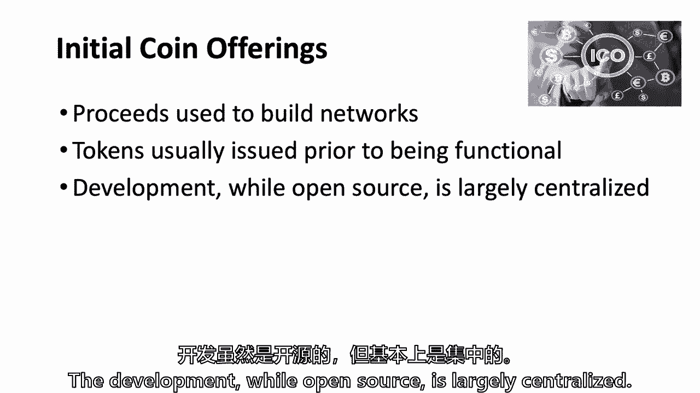

但事实上在过去三个月的最后一个季度，超过一半，甚至不再是开源技术了，部分原因是它是基于，只是一个想法，人们要到以后才会发布他们的源代码，他们最终会发布一些源代码，那时甚至没有开源软件。

即使他们说以后会发布这个软件，但即使是开源的，高度集中，拜托了，我不明白开源和许愿翼有什么关系，我说我会，呃，卖点东西，这些是你应该用来还钱的硬币，开源在哪里连接得很好，所以有一个技术和软件开发的运动。

这当然是始于20世纪90年代，但它可能更早，但现在很流行，在其中发布软件，每个人都能看到，所以它是透明和软件，这被称为区块链技术中的开源运动，在二千零九年一月，它是开源的。

这意味着每个人都可以看到计算机代码，你可以，即使它实际上是在麻省理工学院的许可下出版的，这意味着你不必支付任何费用来使用它，零费用你可以复制它，你可以使用比特币核心软件，那是，这就是定义。

这是开源的最佳定义，因为它有麻省理工学院的执照，但它是真正开放的，这就是我在这里指的，相关性在于，和区块链中的一个，当然在比特币和以太坊网络中也是开源的，很多，很多。

开发和最初的硬币发行要到几个月后才公布他们的代码，他们筹集资金，他们仍在开发代码，英国人，那么为什么这只是，呃，甚至在代码公布之前就投入了他们的钱，这不就像，所以说。

为什么投资者在《规范》公布前就把钱投进去了，为什么投资者把钱投入任何投资，害怕错过所有的权利，哦，顺便说一句，塞布丽娜和托莱多，我宣布今天在场的任何人都将获得双倍的荣誉，就在感恩节前。

所以我只想让你知道我以此为生，所以害怕错过，不然为什么人们会投资于任何投资，即使你只是投资苹果股票，或者为了得到回报，获得回报，获得利润，冒险和回报，英国人，我想在他们提到的一篇文章中，把钱放在一个。

ICC是一种代码和理解。

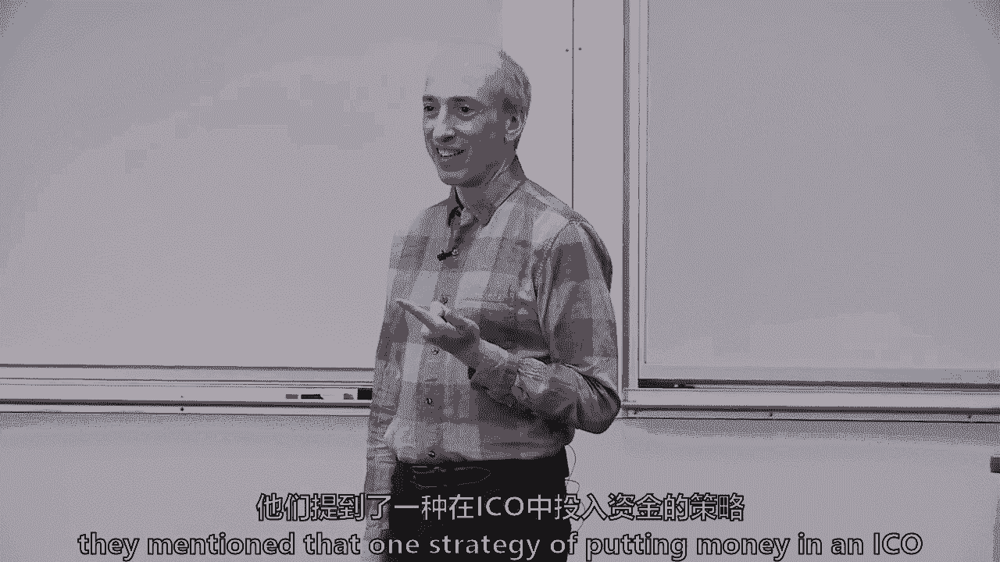

呃，所以我想这是这个行业的先决条件，我也碰巧参加了一个，呃，这里有一个叫锁单的公司的研讨会，它是由一个，它叫做块块测试测试，是啊，是啊，它是，我想这是不吉利的，可能是。

所以他们评估这些代码并运行一些模拟，来验证他们是否在里面做他们应该做的事情，我想这是一个先决条件，所以这就是问题所在，所以你假设你总是可以阅读代码来进行投资，在1917年秋天和1918年春天。

我认为情况并不总是这样，事实上，情况通常并非如此，我想如果这些事情要持续下去，我的预测是，你知道，你会看到越来越严格，哦，我跳过了发起人，开始的人，把一些硬币留给自己。

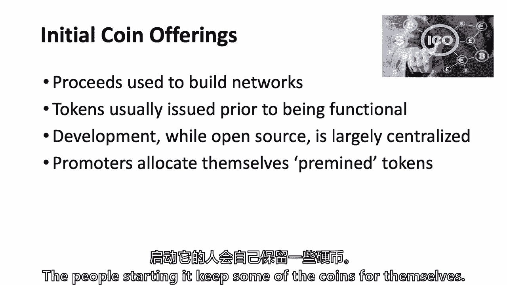

这与任何一轮风险投资都没有什么不同，当你筹集资金的时候，你在出售股票或优先股，你知道这一点，你们中有人上过风险投资课程吗，或者如果你在里面工作过，你也要为自己保留股权，这是你自己留的钱。

你们卖多少给公众，嗯，但只要把它转化为一种新的资本筹集形式，而不是应用于你的股权，你把它应用到这种新的筹款形式上，它们是可替换和可转让的，意思是你可以卖掉它们，有时几个月都卖不出去，从技术上讲。

有时在平台正常运行之前，你不能出售它们，但通常你仍然可以出售它们，让我提一下以太坊诞生时的一个定理，卖了十二个月，你购买以太坊的唯一记录是电子邮件回复，从Vitalic或其他答应的人那里回来，你买了它。

你甚至没有私钥12个月，你有一封电子邮件确认，但你可以根据电子邮件确认，出售以后你会得到一枚硬币的权利，对不起，是啊，是啊，所以沿着这些线，我见过很多人使用saps，就像未来代币的简单协议。

我想我想知道什么是权衡，在ICO时直接发行代币，然后更具体地说，感觉你连代币都拿不到，你甚至没有得到令牌的权利，直到网络启动，就像那似乎是第二顺序，就像远离，就像网络上任何形式的实用程序一样。

这是答案吗，是呀，所以嗯，不是因为在美国，我是说就像现在硬币被认为是一种安全，如果你在做科斯，那你只能把它卖给信用卡，投资者选择得很好，如果你在美国面临，你可以做一些其他的事情，而不是像在美国以外。

所以我认为南方就像试图看到，如果喜欢硬币的话，就可以，在某种程度上，它们可以被认为不是安全的，所以我认为员工的目的是，我想就像，你知道，就像扩大投资者基础，让更多的人，所以六个，所以你，这是对的。

但我要，1。你说的对，但是有一个它在卖一些将来交货的东西，因为令牌当前不可用，就在最后一个季度，我说的是2018年的最后一个季度，四分之三的启动或推出的科斯只是一个想法，所以他们还没有写代码。

一个代币甚至都没用，所以你有一些经济基础可以说，我想卖给你一些东西，这将是未来的交付当维塔利克布特林甚至做以太坊，你收到一封电子邮件，它不被称为未来代币的简单协议，这就是安全吗。

但这是一封简单的电子邮件，作为未来的代币，这本质上是一种经济安排你用比特币交换电子邮件，大约12个月后的那封电子邮件，你会得到一个私钥，当创世阻滞发生时，其中大多数仍然必须处理经济安排。

然后波士顿的一家律师事务所安排了一个安排，在证券发行中处理的，他们创造了一些东西，他们发布了一份法律白皮书，如果您希望称为未来代币的简单协议，Saft试图解决，他们认为他们认为我认为他们错了，不知何故。

这很安全，这可能必须根据美国证券法注册，但当你最终得到代币时，也许以后它就不一定是注册的证券了，他们试图做一个两层的安排，但甚至在你去做这件事的波士顿律师事务所之前。

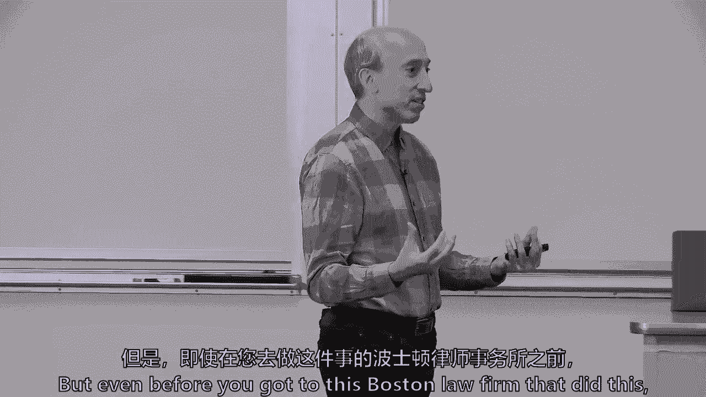

你仍然有经济现实，你今天试图筹集资金，以后去拿令牌，然后律师们参与进来试图，说我们第一件事就登记，我们给它起个好听的名字，我们称之为保险箱，12个月后，当你最终拿到代币时，我们不会登记第二件事。

我想他们最终可能会弄错，但我想这就是背景，让我，让我再提几个问题，稀缺性通常是，但并不总是通过一些货币政策来促进的，如果我们回到。

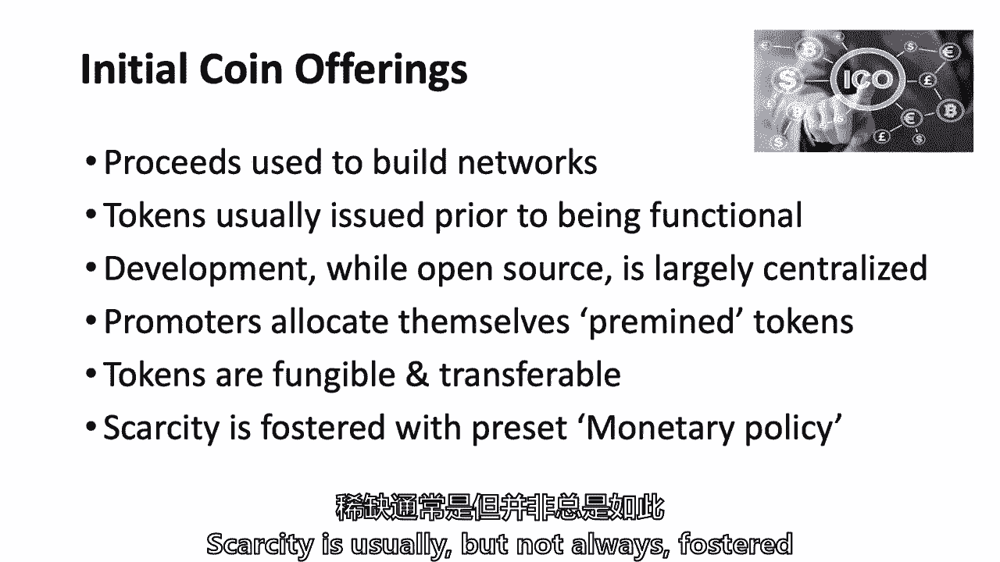

那里的货币政策是怎样的？有人记得那笔钱吗，我称之为货币政策，但这是对货币供应的控制，那么比特币的货币供应算法是什么，一条每二十万美元的线，什么井的一半，它开始在奖励或阻止动画师之间，所以有奖励。

比特币货币政策是对任何人的奖励，记住今天的奖励，今天十二枚半硬币，从50个硬币开始，每隔多少分钟，平均十分钟，但每二十万个街区，它就会减半，所以在20世纪的某个地方，它将以200万硬币为上限。

但在此之前，货币政策，它越来越慢，增长率，所以嵌入比特币算法中的是一种货币政策，是不变的吗，有多少人会说这是硬编码和不可变的，不是一只手，有多少人会说它实际上不是不变的，那么什么能改变它呢，瘦子。

不管怎样，你都没有举手，这取决于你找到你哈哈哈哈，是呀，我在听，如果你改变货币政策，你会有一把叉子，我们会让老人们坚持你的政策，和新政策坐在一起的新人，现在改变了，有些人认为什么都没变。

其他喜欢做一些机器的人好吧，所以艾莉指出，不是每个人都同意新的货币政策。

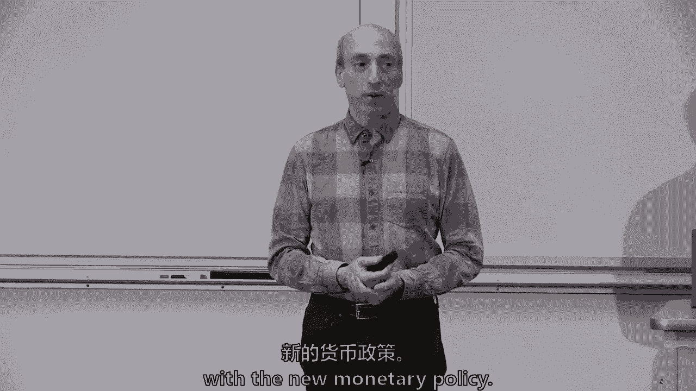

但我会注意到以太坊，他们已经改变货币政策两三次了，他们不用硬叉子，所以他们改变了他们的整体奖励，在改变一个整体奖励，通过协商一致降低块奖励，他们实际上正在改变货币政策，因为他们在改变，本质上。

他们的通货膨胀率，大多数初始硬币发行都有一些算法，有些是建立在我们所说的货币供应政策或货币政策中的，但不是所有人都做一些，如果你仔细阅读，他们可以在任何时候发布他们想要的任何东西，等等，但我想说。

大多数国家都有货币政策，如果这个空间，如果这个世界真的采取了大量的货币政策，经济学家会研究它，但是关于什么是有效的还没有很多深入的研究，什么不起作用，它有点像游乐场或沙箱，如果它曾经起飞，关于。

所以只要根据这六个标准，呃，也许最后一个的爆裂，在我看来。

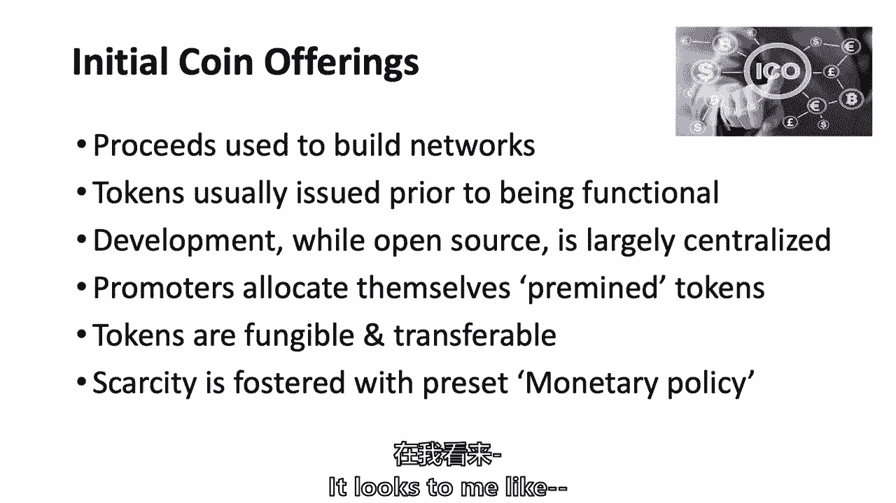

我能处理掉那个吗，是啊，是啊，在我看来，它就像粉红色的星星，就像一个什么Kickstarter，Kickstarter，所以对你来说，这看起来像Kickstarter。

但Kickstarter没有给你其他东西吗，任何事情都取决于结构术语，基本上就像我在Kickstarter上发布的大多数项目一样，他们用呃，制造他们产品的基础，那个呃，那是在它们真正发挥作用之前。

而且它也是开源的，嗯是的，差不多是一样的，是啊，是啊，有很大的区别，就是那个Kickstarter，你确定价格，让市场决定数量，对你你，你可以说你确定了数量，你让市场决定价格，这两者之间有很大的区别。

事实上，有一个二级市场，所以所以所以我喜欢这个超级早起的鸟项目二级市场，你当然可以，再说一遍，这没什么，是呀，你可以，我想我会争辩说这要困难得多，对，但同样的情况是，你知道你所知道的。

如果我在卖新的小部件，我我是你知道的，我要把它们卖给早起的鸟儿，三十块钱，对呀，就是这个价钱，你迟到了，你让那种。

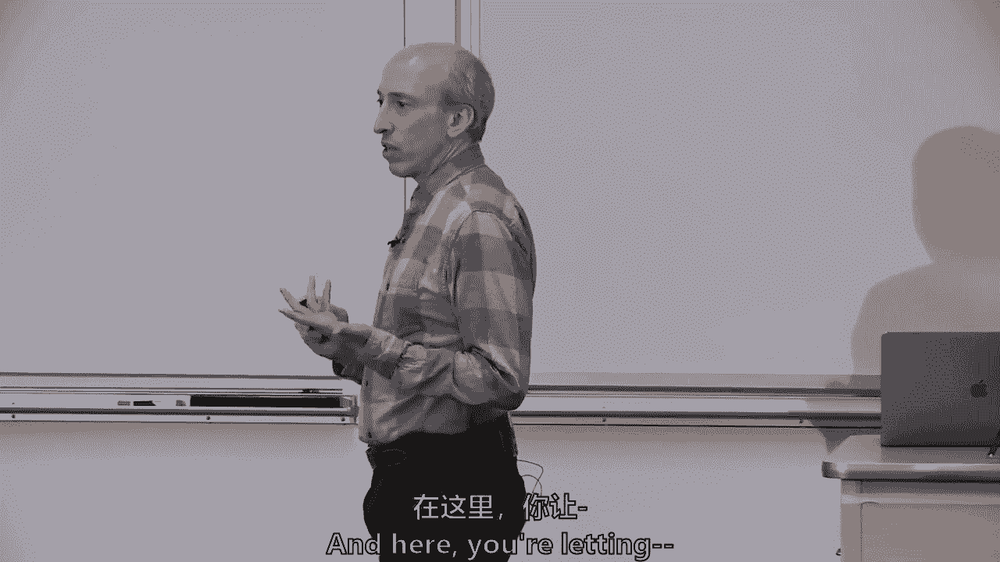

拍卖是为了价格，不是因为质量，所以和Kickstarter有相似之处，与其他众筹机制有相似之处，但在一个方面也有一些真正的区别，当然，这都是数字资产和Kickstarter，经常有服务或好的。

你得到的好处或服务，还有西蒙做什么雨果，你只是在推后最后一点，通常科斯的价格是以太坊，然后只有在二级市场上价格才会发生变化，如果你想在SEO里吐口水，他们会说，哦，嗯，这里有一千个硬币给第一点。

为了第一点，f，我想这是根据价格波动而变化的，如果你还在想你，就像美元一样，S元，但就像你用乙醚来支付ICO，波利斯雨果，说在进入二级市场之前，价格并不是真的可变的，嗯，但我认为。

Kickstarter上做的大部分事情，不是一切，而是最，在这里投资者真的在寻找和期待利润和回报，当我想到大多数进入Kickstarter的人时，他们得到了一种产品，一个，一个单位的东西作为奖励。

他们并不寻求显著的利润或升值，他们也许可以适度，但不是第二个，二门市场的超级血腥鸟，这只超级早起的鸟，是啊，是啊，所以有货币政策，最后一点，买家真的期望通过升值获得利润，所以这就是我现在想的，如何评价。

伊科斯，你不会对我的第一个感到惊讶的，这就是我们在这门课上讲了很多的，评估令牌用例的可行性，就像，有什么意义吗，有什么意义吗，需要使用追加吗，只有在一群可以写入分类账的各方达成共识的情况下才能记录。

所以只添加日志和共识，把一堆密码学也放进去，但是您需要本地令牌吗，你知道的，我们本学期讲了很多的基本经济学，希望能让你们免于投资于非常糟糕的科斯，但除此之外，我认为这是你应该做的50%以上，阅读白皮书。

我告诉你如果有人能看到电报，电报白皮书，他们筹集了17亿，请告诉我，请随时告诉我他们打算用这笔钱做什么，因为我读过很多次了，我也不会，我不会投资的，因为感觉他们可以筹到钱用它做任何他们想做的事，嗯。

我的意思是，他们是一家不可思议的公司，他们有数亿用户，他们有不可思议的资源可以利用，但我还是不确定他们用的是什么，我最终能用硬币做什么我能从中得到什么服务，他们用这些钱做什么，所以我会说读白皮书。

如果有源代码，不到一半的时间，有源代码，让你信任的人阅读源代码，如果你看不懂，你知道谁是团队，就像任何风险投资投资者一样，你想知道，谁是团队，他们有什么历史？他们有什么经验等等。

但我从经济学和白皮书开始，在我到达团队之前，网站就在那里，风险资本参与。

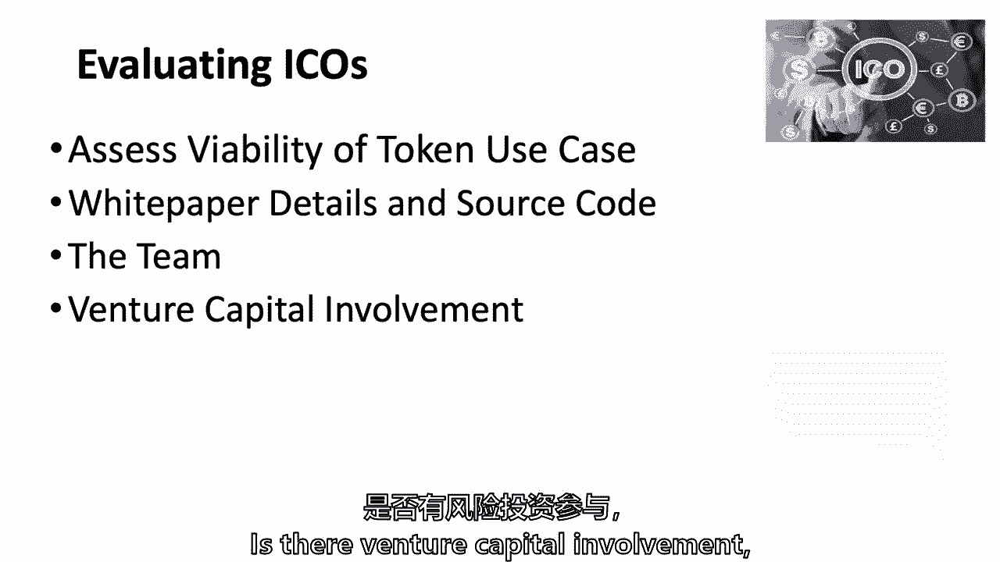

现在谁和哪些风投经常会参与，在此阶段将获得部分股权，也是硬币圆的一部分，所以他们在做混合投资，现在已经很少见了，在二一八年十一月，风险资本家只会参与象征性的一轮，在晚些时候和十七岁，并将Pre的一部分。

基本上是前期，一轮代币，但现在他们想要，他们想要部分实际股权和代币，是埃里克你问不不不，只是为了让我们，这正是我们从一个，呃风投提到他们有一个免费的ICO，第一轮投资，然后作为评估全身供品的一种手段。

然后经过理想的状态，对呀，但他们的第一笔投资要么是优先股，要么是类似股票的工具。

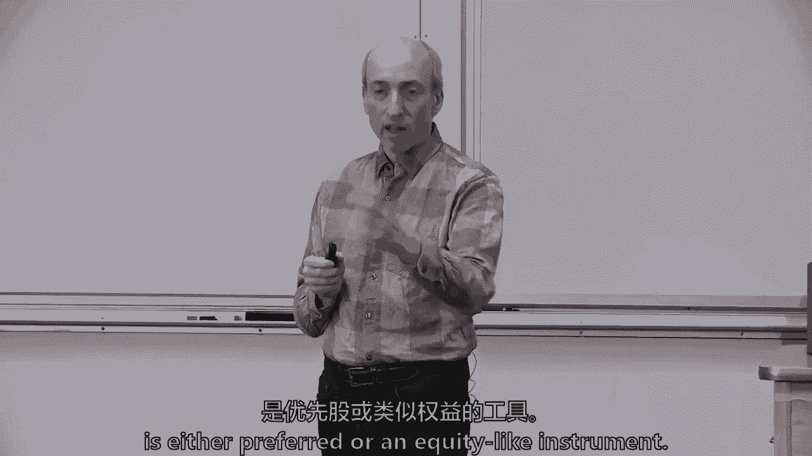

但我觉得它完全改变了，时间框架，像风险投资家一样的投资，就像平时一样，我不知道我会投资五到十年，这里就像他们要躲起来一样，你知道几个月，就像，时间框架是什么，所以亚历克西斯的观察是。

这可能会缩短风险资本家的时间框架，我会说是的，在这一二八期间，我不知道这种情况是否会持续下去，但是是的，我认为对于一个风险投资家来说，我可以把公司卖掉，我可以从我的投资者身上拿走，这是一个术语。

我该如何出售我的投资，我的外卖，我可以让公司上市，我可以卖掉公司，或者也许我可以ICO，如果你能早点做到，在17年秋天和18年发生了很多事情，许多风险资本家改变了他们的标准合同和标准文件。

当他们投资初创企业的时候，也说他们可以参加ICO回合，他们可以参加前几轮，但如果你在评估ICO，你在考虑投资它，你想知道是什么风险资本家支持它，然后人们看到的一件大事，我把它排在第五位，你可以说。

社区是什么，有多少人在关注比特币言论，等等等等等等，有八个或十个这样的，这些谈话频道，我不再知道比例了，但以前就像，如果你能找到你能，你所知道的一切你可以像在全盛时期一样成功地抚养一个ICO。

如果你能把你的号码给某个追随者，那就有足够的动力筹集1500万到3000万美元，我想那可能少了一点，所以现在汤姆，是啊，是啊，我是说这就像大傻瓜理论的定义一样，对呀。

就像如果有足够多的人相信你的信物是有价值的，它很有价值，所以我明白了，这是清单上的第五件事，这是有原因的，但如果你是一个动量投资者，你只是说，或者如果是Fomo投资，正如塞布丽娜所说。

你知道看看社区有多大，有人对此感兴趣吗，这有追随者吗，是一个，我说，我既不是最大化主义者也不是极简主义者，我只是我不是想，但这是一个真正的经济学，如果你在一个社区里有10万人跟随。

可能更有可能是一个成功的ICO，在筹集资金方面，并不意味着它会成功作为一个象征，稍后在这里，你其实不是把它作为一个具体的标准来做的，但你可以用它作为过滤器，第一个过滤器。

如果你有发布白皮书的人没有发布任何消息，他从没去过那儿，然后他提出了一点怀疑，然后你必须继续做一些更多的事情，呃，关于…的研究，关于那家伙想法的论文，不管我是什么意思，它是，它是。

这是一种查看是否有其他人收听的方式，并表现出兴趣，这可能是更大的完整理论，只是因为你知道，如果蒂姆·德雷珀·迈克·诺沃格拉茨投资，他们都是非常精明的投资者，非常成功的投资者，你可能会说我想在。

还是我该说这不是在，因为无论哪种方式，他们都已经得到了最好的，我是说他们仍然是很好的投资者，他们的货币政策是怎样的？你又知道了，怎么样？会有什么影响，他们是大多数有固定货币政策的国家之一吗。

还是完全没有货币政策的少数国家之一，他们是如何分配代币的我是说有两种方式。

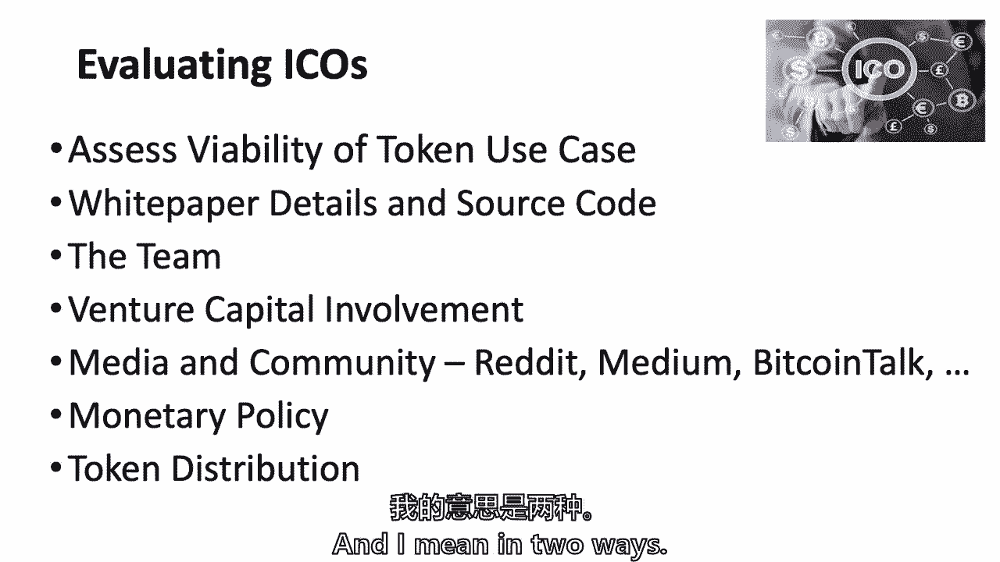

有些人实际上会透露一个上限表，令牌的大小写表，就像你可以想到权益的大小写表一样，但谁拥有代币的预售和售后，所以这就是我的意思，通过象征性的分配，他们为创始人保留10%吗，或者创始人的80%。

你可能会改变你对这一切的看法，而且令牌分发也是，他们是怎么卖的，通常是30到60天的时间，或15至60天期间，据我所知，最长的是三百五十天，每天销售超过350天的EO是一个，是荷兰式拍卖的一种形式。

这是一个了不起的方式，他们卖出了42亿，我怀疑一开始做EOS的人，以为他们会筹集超过10亿美元，事实上，他们可能没有人想到他们会筹集超过1亿美元，因为他们是从十七年夏天开始的。

但他们没有在三百五十天内分发，最，它们是在十五到六十天左右完成的，拜托了，所以你提到了帽子表，ICOS是如何核算的，就像他们作为我们收入的股权，他们落在哪里，这么棒的问题，怎么，ICO收益用于妇女。

谁是我们的会计？英杰华，不知道好吧，英杰华不知道，我会试着回答，但我认为这是SEO的另一个重要功能，是象征性的经济学，你怎么用，如何激励那些像火一样的东西，并为，呃，项目利润，项目将被购买。

以类似于股息的方式将此令牌，你怎么预订，什么是借方，什么是贷方，你聪明吗，那是什么，我希望，我希望这行得通，你知道吗，如果T帐户正确，我们有一个客户，因为你收到现金。

当你卖东西的时候，信用项目问号是什么，那收入是多少？你认为这是留存收益吗，是啊，是啊，你认为这只是留存收益吗，他们什么都没卖对，所以问题是它的收入，它是收入项目吗，当你卖掉它的时候。

或者有些人把它记为递延收入，递延收入，所以有两种方法可以预订，你也可以把它作为负债预订，但它要么是递延收入，要么是当期收入，所有的权利，什么能激励你把它作为递延收入预订，而不是当期收入是。

如果你那是什么税，所以有些人把它记为递延收入，因为他们不想记账税，天知道这是不是正确的预订方式，其他人预订它就像一个，作为现在的收入项目，但我不知道有谁，他们是记录他的递延收入还是当期收入，想预订的人。

它触发它是一个安全，所以据我所知，大多数律师事务所都不是，他们不是会计师，但他们不希望他们的客户以某种方式预订，这会让它看起来更像股权，所以要么是递延收入，要么是当期收入，我听说有人说这是一种负担。

但我想那是少数，我不知道浏览一个用例是否需要太多时间，让这些例子晒黑，因为如果我是，我保证会提供好的，然后他们公司就把代币拿回来了，你怎么把它放回市场，所以问题是，用例是什么，所以有些用例发出令牌。

这真的是为了社区，一些代币回到公司，所以一个文件存储文件硬币，例如，他们发布了，他们筹集了2。5亿美元，相当于，在这种情况下，我认为代币会在社区内使用而不是回到公司，所以即使像以太坊，当你用以太坊作为。

购买计算能力，它不会回到以太坊基金会，所以最具统治力的，这就是为什么它真的应该作为当期收入入账，因为软件提供商最近甚至没有提供服务，最主要的用例，就像以太坊，你在为网络中的其他人使用F。

这是一个不会回来的货币单位，有些地方它回来了，然后它基本上回到了公司的金库，所以这是两种不同的，两种不同的型号，如果我输了，年份，你和我在一起吗，一种方法是把它还给公司，那是更狭隘的情况。

通常是你在卖一个代币，我会把它交给一条线，因为一行给了我文件存储，一条线就会把它给汤姆，因为汤姆在以太坊提供了一个草坪文件存储，它一直在转来转去，它不会被归还，它永远不会被烧毁。

它永远不会熄灭并交还给公司，以及第一个的定价策略，那么取决于价值，或者它的存储值，理论上，理论上，我认为这很大程度上是基于猜测和信息，诸如此类的东西和泡沫，十五个月或十八个月的泡沫，但理论上是的。

它应该是一个均衡，它应该是存储未来价值的折扣，因为今天你要买一个代币，你明天可能会用的，但因为有一个概率加权，你就不能用它了，如果他们没有完成软件，如果他们没有完成推出，它应该在均衡的情况下出售它。

它应该以低于其最终价格的价格出售，一个效用值，这将是它在平衡萨满，所以这是一个甚至像，嗯，在那个用例中，他们不是预先确定一个单位的硬币对什么有好处，通常不是一些白皮书做的，但通常不会。

因为这不仅仅是如果他们告诉你，好的，一个单位右，我们现在给你买1TB的存储空间，当然，储存的价值将取决于电费，电力和硬件，以及未来的一切，我不知道，和用品，但他们甚至没有告诉我这一点，只是它。

很难确定里面那枚硬币的基本价值，就像它会很好地伸缩一样，社区会有多大，所有这些东西因为如此清楚，就像你知道的，在硬币和你得到的服务之间分配，使它使它，你在问，让我说你问的问题完全正确。

这是一个我一直在踢来踢去一点点，安托瓦内特和列昂尼德在这方面做了很多研究，我们都喜欢，我们不是很确定，这些是一些最世界级的才华横溢的金融教师，比如，您如何真正获得令牌的值，当这些白皮书中很少写到。

我给了一个读数，这是克里斯蒂安的读物，我向你道歉，因为它有很多公式和一切，但你知道他在努力解决这个问题，它在哪里平衡，均衡价格是多少，均衡价格应该是服务未来价值的一些折扣，还是好的。

如果这种服务或好处有更多的不确定性，几乎必须有更大的折扣，然而，市场似乎一直在以一种方式定价，保险费，我想我的意思是，如果你没有从克里斯蒂安的报纸上拿走任何东西，这就是我想做的。

你知道市场一直处于溢价状态，即使它可能应该打折，这就是为什么发行人，这就是为什么企业家们利用它，因为这是一种廉价融资的形式，这一直是一个廉价融资的显著领域，嗯，所以我们期待着像五枚硬币一样的秋天。

所以我们看那个，当它真正发挥作用时，我们会闪现出来，它不再是一个保险箱当，如果它真的出来了，所以它的想法是，在这一点上的最后一点将把这个过渡到像，实现收入，然后如果我付钱，你知道免费文件硬币。

或任何用于存储的单元，他把它记为收入，并为此纳税，或者有没有想过如何，如果唐卖的是假的，是呀，你必须预订收入，就我所知，你在转移一枚硬币，就像你转移欧元、日元或美元一样，嗯。

当国税局和这五个人说话的时候，六年前，它是在你，你知道的，本质上，送服务收硬币，我是说，我不完全确定如果你一天后拿到硬币会发生什么，但它基本上是标记，以当天的汇率回到菲亚特，总是把它换算回法定货币。

在这种情况下是美元，嗯，好的，所以如果你扩展这个例子，桩点在哪里获得收入的交易之间和打开，他们收交易费吗，我不知道，我尽量在下星期二之前弄明白，因为我们得到了两次科斯，我会努力回答的，如果还有人知道。

但成千上万的收入模式各不相同，以及在本质上是否归档硬币，整个收入模式是ICO，现在，收入模式的第二大部分是保留一些所有权，所以让我们来看看涟漪公司，使公司产生涟漪，尽管他们在2013年做了创世纪块。

他们基本上分配了20%的代币，保留了80%，随后他们一直在慢慢出售，他们现在下降到百分之六十一，但他们在XRP上的收入模式本质上是销售XRP，他们直到2018年才提出了XRP的真正用例。

和一个叫做X WRA的原型，有X电流，它以前是一个消息系统，根本不需要使用XRP，所以四年来你没有使用XRP，就我所知，今天零使用，它是第二高价值的加密货币，已经过了以太坊。

随着以太坊和比特币价值的下降，180亿美元，我不能告诉你它值多少钱，我可以告诉你，这就是Comarket，你知道吗，com或cap说他们值，但是，但在这种情况下，他们的收入模式是销售XRP。

他们中的许多人，他们的收入，莫内斯或最初的ICO保留一个桶，不管你留百分之十，或者在那种情况下是80%，然后试图货币化，随着时间的推移出售它，甚至在以太坊，那就是，本质上，一个ICO。

他们在以太坊基金会保留了大约9%，他们在以太坊基金会的所有权下降到1%，所以他们不会收到，当以太坊在网络中移动时，以太坊粉底和活力靴，不要收到任何东西，但我得看看文件，看看它们本质上是否燃烧了任何。

本质上对任何一个，返回发行人，我不这么认为，但我会检查，拿着这个，然后我们将继续几个统计数据，我们规范，伊塞，那么谁来管理科斯，我们星期二要谈很多，感恩节后，当我们可以感谢和吃火鸡的时候。

我们能把它保留到周二吗，但它真的，真的是，取决于这里的管辖权，U S，它将是证券交易委员会，但因为其中大多数都是不符合规定的证券发行，上周五，美国证券交易委员会，我是说他们放了很多，很多版本。

但上周五的，也许我们可以把它挂起来，塞布丽娜和塔利，如果你提醒我，我会给你一个链接，我们把它放进画布里，但只有两三页，但他们第一次真正谈论非法证券发行，所以他们用了非法这个词，和。

他们开始到达他们关闭的地方，其中一些下来，我们不一定，你知道的，欺诈或欺诈，但他们只是说你没有注册，但是一般来说，它不是，所以这是最重要的你能评估令牌用例的可用性吗，你还记得我的小幻灯片吗。

但这又是战略问题，这些都是我要求你们在期末论文中思考的问题，基本上价值创造的主张或痛点是什么，竞争对手在做什么，竞争对手在这场比赛中是如何对抗的，如果你在看任何ICO，想想竞争环境，其中一些充满了竞争。

假存储，坏硬币不是唯一的，所以你看看其他人，看看他们是如何解决同样的问题的，为什么区块链技术或原生令牌，甚至解决方案，然后你开始挖掘它，你为什么需要一个附件，仅日志，什么验证。

加密和网络成本实际上得到了解决，分类账上实际记录的交易是什么，我是说这些是基本的积木，如果你拿走任何东西，希望这就像一页的问题，有一些关键的技能，当你离开的时候，有人说好，我有一个很棒的区块链想法。

然后不要忘记所有的多恩挑战，我们仍然有可伸缩性，性能，隐私，安保，我只知道，你说互操作性没有挑战，但不不不，你在做什么，你知道这些我不打算再复习了，但它们将在帆布上。

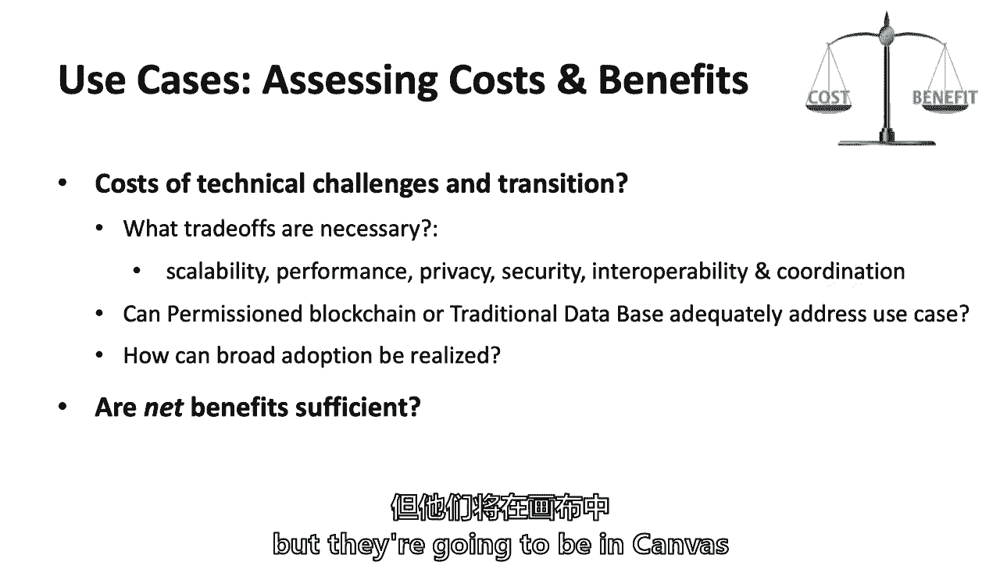

如果你想抓住它们，我是说这和康德的ICO概念框架是一样的，甚至在权限区块链中，我感觉到你们很多人都在想这样做，一些统计数据，然后我们就把它关掉，这些只是有趣的图表，我们都是画布，我只是到处找不同的网站。

我不知道你能相信这些数字，但他们是最好的数字，所以这里有一些行业，23%是基础设施，那是50亿美元的加薪，但大部分，我认为大部分是EOS，我想这叫做基础设施，项目基础设施，因为EOS正试图与以太坊竞争。

金融，通信，交易和投资付款，你会看到一些一致性，很多金融部门的用例游戏。

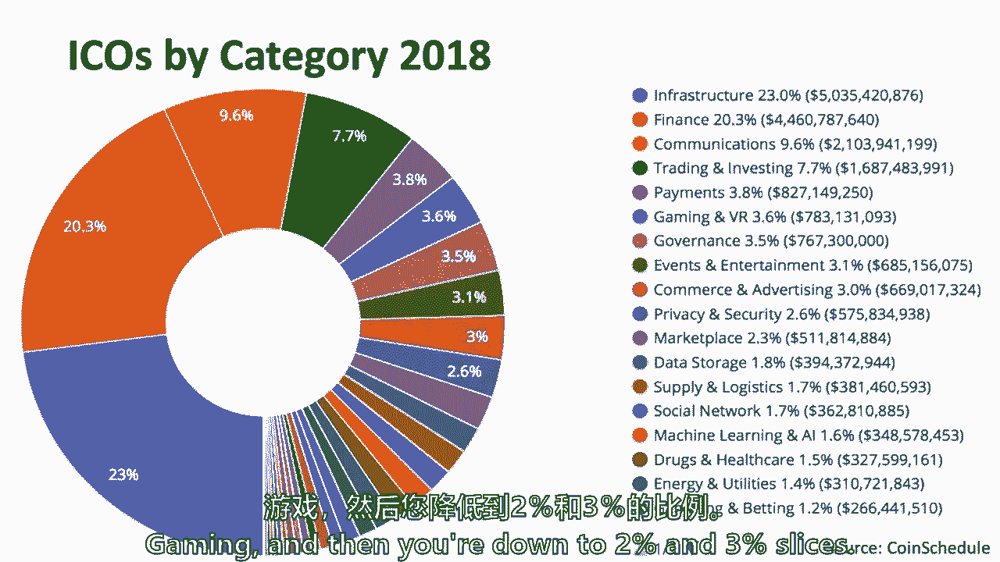

然后你只剩下两片和三片，所以只是对一些行业的一点了解，再一次，这一切都将在画布上，这是出版的科斯，我们在2月到4月的时候达到了每月500英镑的峰值，我们现在每月只剩下两百元了，现在，这意味着发布。

这并不意味着他们一定养了，我们只出版了不到五千本，大概3000左右，已经筹到了一些钱，今天只有大约一半的人真正存在，或者你可以在某个地方找到他们，你知道，市场等等，这是第三季度。

基于一个名为ICO评级的网站，他们发表季度报告，我不是说这是完全详尽无遗的，18亿美元的ICO比第二季度下降了78%，只是为了给你一个大小的感觉，但在同一个季度筹集了10亿美元的区块链风投。

在那次风投加薪更高之前，我想它又回来了，再过一两个季度，这是一个合理的机会，VC数将高于ICO数，但这只是一种预感，至于我们要去哪里，其他六百人的统计数据，这是四分之一，大约每月两百或四分之一六百。

他们追踪到的，百分之八十四，都在以太坊平台上，几乎我能找到的每一个数据源都在80%到85%之间，所以它仍然高度关注以太坊平台，我会说作为，随着ICO热潮的结束，这可能也是以太坊。

以太坊的价格和估价也下降了，只是因为关系，这六百或二十个中只有百分之四，其中四个在交易所上市，他们筹集了足够的资金，但看看57%的人每人筹集了不到10万英镑，所以它高度集中在一个小六十。

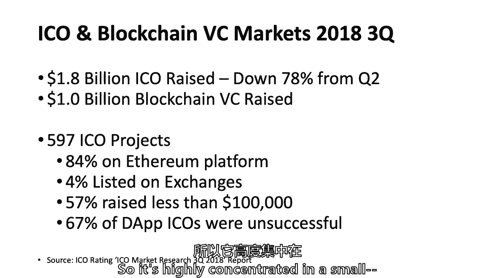

7%的Dap icos不成功，现在，不管衡量不成功的标准是什么，他们没有筹到钱，或者他们筹集了一点钱，但网站变黑了，这都是在三个月内一次又一次，我说不出他们是如何衡量成功的，但是，嗯。

76%只是一个想法，这也是基于ICO评级，和一点三，百分之七你在百分之一。

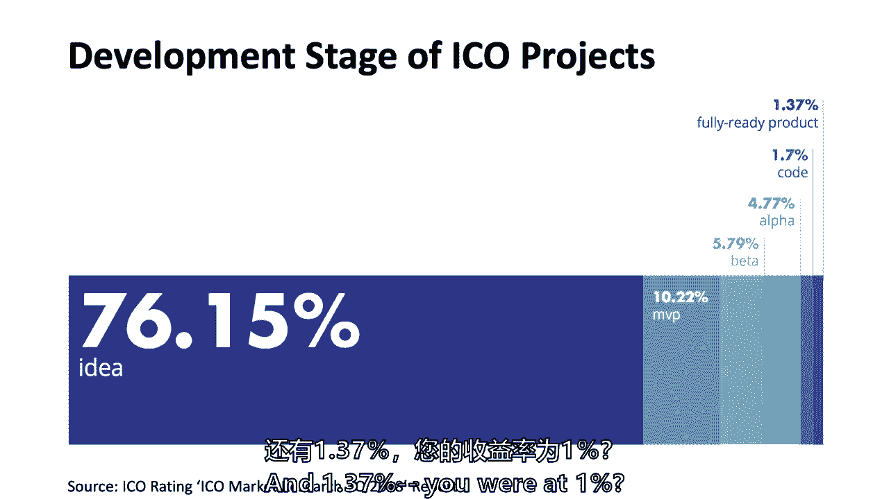

你是百分之五，但1。7%的人有他们的代码，所以3%的人要么完全准备好了，要么有他们的源代码，所以你想读白皮书，如果你真的很好奇，但是76你可能会说你怎么能在一个想法上筹集资金，这真的是预付资金。

这甚至是在市场繁荣之后，不在行，这是这是第三季度，二十八，这是第三季度的工业情况，兑换和钱包，金融服务交易，所以它有很大的资金，一点点医疗保健等等，让我们看看我是否认为我还有一两个这样的，哦。

他们就是这样做的，这对我来说很有趣，这是第三季度的回报，现在，我知道这实际上是在过去一周半的抛售之前，唯一上涨的板块是，我甚至不知道哪个科斯，这些是营销和广告，其他一切都被摧毁了。

我在市场上呆了很长时间，三四十年，当你得到这种类型的返回图片时，会有更少的科斯而不是更多的科斯，因为你知道这只会降低投资者的热情，我不认为它是福莫了，所以说，所有的权利，所以下周二的习题，我们要回到。

伊科斯，谈谈骗局和欺诈，我们要谈谈证券交易委员会，我们已经谈了很多关于它们的设计特点，所以它会像，我会试着查一下档案，还有硬币问题，嗯，我们将再下降一个读数，其中只是上周五SEC的两个寻呼机。

那也许值得一看，这是我能说的最好的话，感恩节快乐，我知道这是比特币火鸡，区块链火鸡之类的，但是嗯，我确实认为这是一件有趣的事情，ICOS是众筹的新手段，几个世纪以来，有很多不同的方法来筹集资金。

这不是公平，这不是债务，是别的东西，我不知道从现在开始的三五年里能维持多少，但是你可以预先资助一个想法的想法，递延收入，还是什么的，但这不是你的收入，嗯是金融市场的一个有趣的演变。

但我认为如果你不能评估用例的可行性，弄清楚象征性经济学的真正好处是什么，它又回到了，它们确实是在网络上拥有本机令牌的一个好处，为了一件商品或一项服务，用于文件存储，用于拼车等。

那么我想这只会在几十年后回头看，人们会回头说很好，这是一件有点奇怪的小事，发生在20世纪20年代的事情，但它可能是，我不是，我不是，我不是一直到零，我想人们想要本国货币可能是有原因的，本机令牌。

启动网络，并随着时间的推移激励一个网络，不管是像游戏网站里的剑、皮肤和盾牌，嗯，大部分cos。

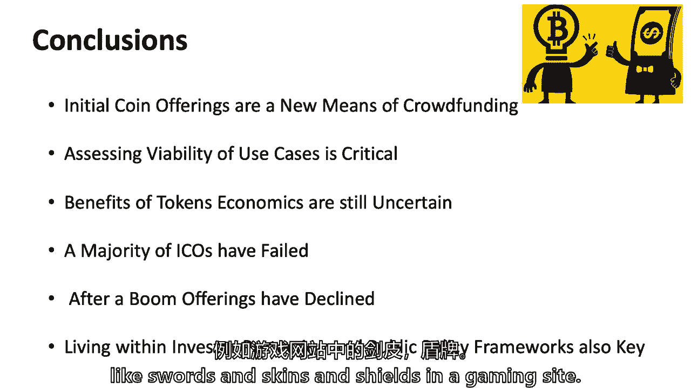

虽然已经失败了，因为他们总是失败得太快，我不知道今年年底，或者肯定在明年年中，超过九成或九成五的人都会失败，就像如果你把整个总数，所以很明显它会下降，会越来越少，可能在这个ICO的东西里。

并不意味着区块链技术就结束了，只是意味着这种波，我想会减少，感恩节快乐，在我们都去感恩节、机场和火车之前，有什么问题吗，这么快的问题，呃我明白了，拥有公司的所有权，除了拿代币，纯粹是为了说话。

所以我们来谈谈这个，星期二，问题是，你能拥有所有权吗，就在一个象征性的地方，答案是肯定的，治理权，股息权，有少数人这样做过，但在刀或大发之后，这确实赋予了一些治理权和现金流权，证券交易委员会谈过了。

在一年前或十五个月前的一篇论文中，他们很少，大多数都是你所说的，实用工具令牌或服务令牌，在那里你有权获得服务或良好的，通常来自网络的其他部分，而不是回来，我去查一个文件点，但答案是肯定的，你能做到。

但这种情况很少见，所以谢谢你，感恩节快乐。

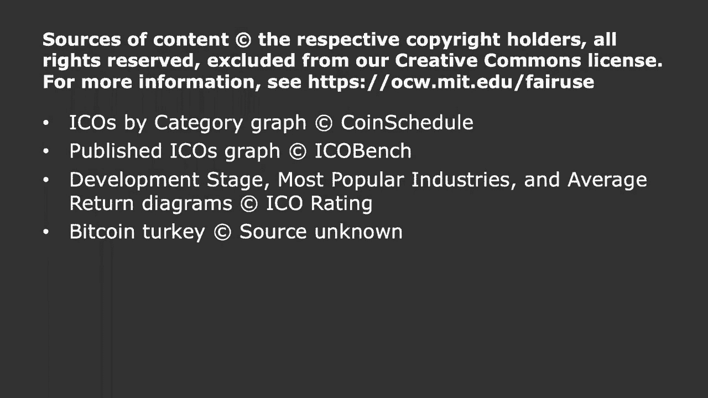

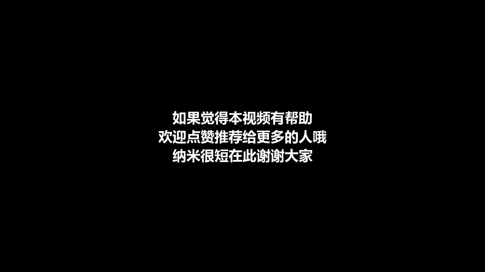