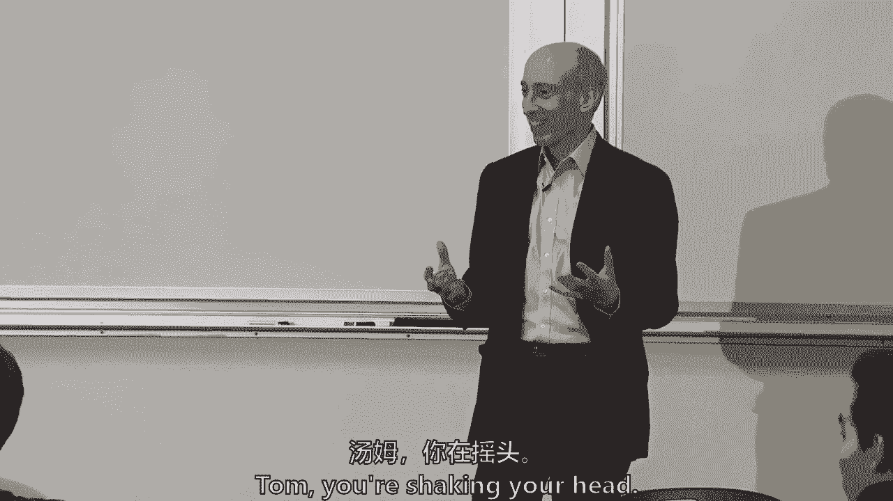
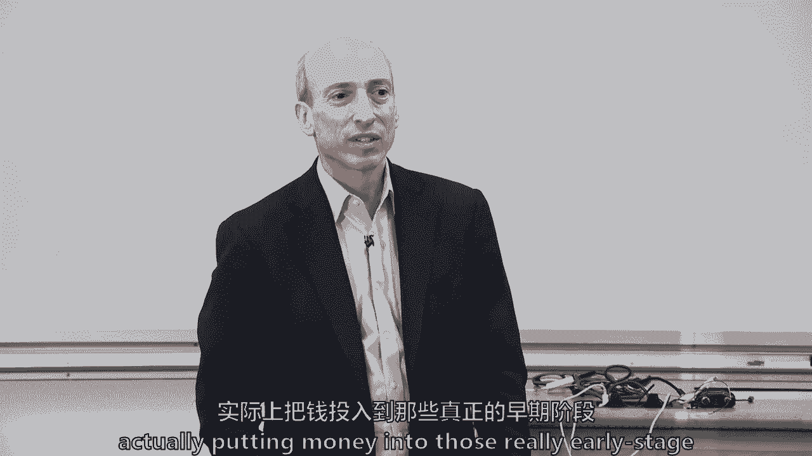
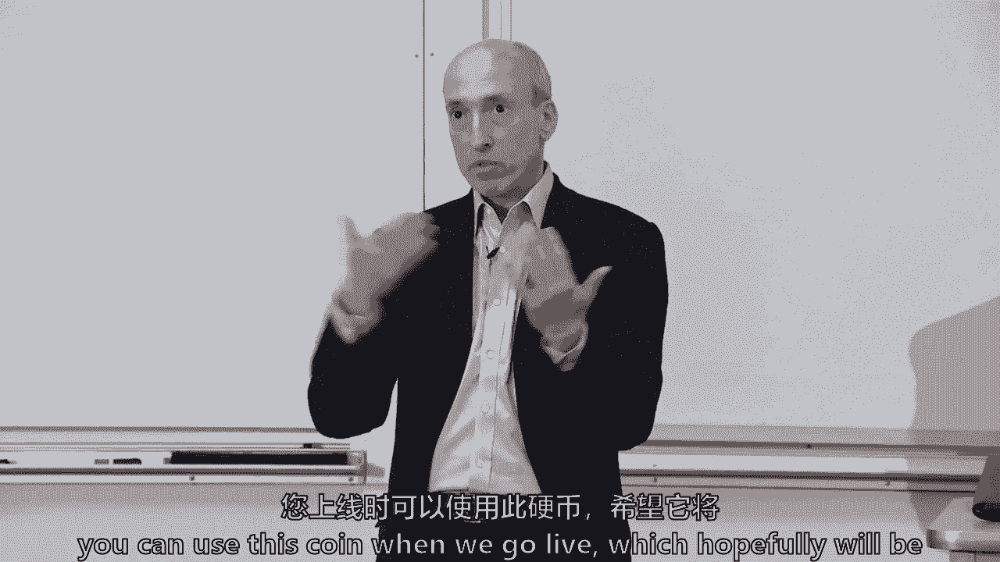

# 【麻省理工大学公开课】区块链与货币 - P19：20、主要市场，ICO和风险投资-第2部分 - 闰土聊Web3 - BV1sL411N7Mm

 We're going to turn back to ICOs and spend a little bit more time on initial coin offerings。

 in the markets and the regulation of initial coin offerings today。 But before I did that。

 I was going to talk about one short announcement that happened， was in the US。

 We've talked about fiat currencies are accepted for taxes。 Ohio。 James。

 what do you want to tell me about Ohio？

 We're taking Bitcoin for taxes， right？ Yeah。 Yeah。 What's that？

 So you want to say a little bit more about a hugel or Ross？ Sure。 Yeah。

 So they're accepting Bitcoin for taxes through BitPang which means that it's instant meat。

 transferring to fiat but still that's a pretty good thing。 So the state of Ohio。

 I guess it was the treasurer。 Tom， you're shaking your head。

 Ohio。 Ohio today breaks my heart。 It's not related but it's unrelated。

 So Ohio breaks your heart because they're accepting Bitcoin for taxes， unrelated。

 Do you want to share for the class or？ I'll let Governor DeWine's export your policy to speak for itself。

 So the state of Ohio has decided announced the state treasurer。 Is this an elected office。

 the state treasurer？ So he saw that it would be good for Ohio for the economics and for the job creation in。

 Ohio and maybe for his politics to move forward and say the state of Ohio would accept Bitcoin。

 for taxes。 It's the only US jurisdiction that I know that has done that。

 Now you can think of them as a vendor like they're saying they'll take it and they've。

 arranged it as Hugo said through BitPang。 BitPang is an application where whether you're Starbucks or the state of Ohio that you can。

 take a cryptocurrency like Bitcoin and they will take that Bitcoin， sell it quickly on。

 an exchange， take some price risk。 BitPang takes a little bit of price risk and for a 1% fee。

 give you fiat currency。 Now it's 1% and whatever exchange rate because I don't know how much a VIG or margin is in。

 the exchange rate transaction but their stated fee is 1% Hugo。

 I think a big question is whether or not that's a taxable event。 Is it taxable event for who？

 Or is it person who's paying the taxes of Bitcoin？ Does any transaction or Bitcoin be capital？

 So Hugo's raised the question is the sale of the Bitcoin to fiat because the fiat is。

 in essence being used to pay the state of Ohio taxes is the sale of that Bitcoin a taxable。

 event and I think somebody in the class will know。 It's noble。

 What if you bought Bitcoin in 3700 and the day that you sent in your taxes is valued at 3800。

 and that's correct。

 So at least here in the US， the IRS has spoken to this。

 If you acquire Bitcoin and then you use the Bitcoin in commerce， if you're using it to。

 fulfill an obligation and in this case， a debt to the Ohio government and if it moved。

 from 3700 to 3800 you would have a short term capital gains on the $100 difference。

 Whether everybody will comply and report properly is another thing but that is certainly my。

 reading of US law at this time。 Ross。 I saw this and it looked up a couple of times。

 It strikes me it wouldn't be taxable given what you said about the US thing and it really。

 is just changing it for fiat。 It's just a structure really。

 But what might make it seem more interesting or gain a little traction is if Ohio， if they。

 have state income tax， agree not to tax the game。 Ohio could agree not to do it。

 He's going to pay on the federal side but then they could make it more like a real transaction。

 that you're paying to get it on。 And have you bought it for Ohio here other than Tom？ Tom？

 Is it Ohio？ And if you want them to not charge a taxes， you're one voter。 I know。 Well。

 I'll say it during the vote during the war。 Oh， I don't know。

 So they charge a state of capital gains tax。 But that's the quick thing。

 I'm just saying that's how they could make it more real than like Hugo saying something。

 real right now。 They're just converting into dollars and taking into dollars。

 They did in this announcement if you read the fine print as I was wanting to do because。

 I was fascinated by this。

 For the first three months of the program， Ohio negotiated with BitPay。

 That BitPay which are at zero percent fee for the first three months。 But this was BitPay for going。

 It appears that that was their bonus to the state of Ohio， zero percent fee for three months。 Again。

 not knowing exactly what exchange rates you're getting and so forth。

 And you think it would be the cannabis industry？ Yeah。

 so Ohio passed a constitutional amendment two years ago。

 We're talking about Ohio that's now accepting BitCoin for taxes。

 And Tom is a resident of Ohio expert expert。 So yeah。

 Ohio will legalize the state voters passed an amendment to allow the marijuana。

 legalization subject to I think some time delay or regulatory approval。

 But the expectation will be approved and that marijuana industry still restricted in accessing。

 federal banking system。 So an alternate way for them to avoid carrying large sums of cash。

 Does carry the value in cryptocurrency？ And do you think that's what motivated the Ohio state treasurer？

 I see。 Sean？ I was just curious。 So if that's okay， if I make， well。

 we're probably not capital gains but if we include， losses on Bitcoin。

 does that part of the loss get carried forward that allows you to offset， some of your income？

 It's a capital loss。 Just as if you bought Apple stock and had a loss on Apple stock。

 So this cannot be careful。 But to offset the future。 Under US law。

 I can't speak to other jurisdictions' texts but you can apply losses against gains。

 and to the extent you have greater losses than gains， you can actually take some of those。

 losses against your income。 I don't remember the limit any longer。

 It's three thousand US dollars and then otherwise carry it forward。 So for most citizens。

 they would just take that loss。 If we had greater than that， you'd carry it forward。

 Any other thoughts on Ohio？ I mean。 Yeah， I'm just wondering philosophically。

 Ohio isn't actually carrying the price。 Like， given that they're converting it to fiat instant times。

 are they really accepting， or are they really accepting Bitcoin as payment for taxes？

 Or is it just a not being paid？ I don't know。 I mean， what would any other views on that？

 So the question is， is Ohio really taking cryptocurrency's Bitcoin？ Or is it just marketing？

 I think it's more of an in because if you had a bid pay， the whole point of bid pay is。

 turning back。 So which is why I think they can pay taxes on it。 If the state of Ohio had a wallet。

 Bitcoin， and they would accept those Bitcoins into their。

 wallet and hold those proceedings in their wallet， then they would be formally accepting。

 Bitcoin for taxes and you will not need to pay taxes on that transaction。 And I agree。

 But I would raise the question， what's the relevant？ With all respect。 What's the relevance？

 What does it matter to a tax payer in Ohio if this facilitates my paying my taxes， whether。

 it's in the cannabis trade or some other trade？ They're facilitating another means of paying my taxes。

 fulfilling my obligation to society。 Yeah。 So my response to that would be how we define what a currency is in one of those criteria。

 is。 Are they accepted to pay taxes？ I think it's relevant to that distinction。 Tom。

 do you want to defend your fellow Ohioans？ No。

 Why would I think it's relevant？ I mean， the Ohio state treasurer doesn't take bellies or cotton or even corn as paying。

 for taxes。 I don't know if they take gold。 No。 To my best of my knowledge now。 Yeah。

 So even for the short term transfer， I think it's relevant。

 So it's a bit of a hybrid， I guess， is what Tom's saying。 Ross？ I'm not。

 There's a real question about whether they could take it directly for taxes because under。

 the Constitution， the states cannot make anything legal tender。

 Only the federal government can make that in trouble。

 Only the federal government can establish legal tender， not the states， other than gold。

 So you're actually going to be a question about whether Ohio would object as another。

 question。

 But it's an issue。 What they're doing is marketing， I think， but they could， for example。 No。

 I'm not studied in the law of legal tender。 I could see a case that says this is not making it legal tender。

 This is just saying you can pay your taxes in another form of property。

 Is that make it legal tender？

 No。 It just makes it that we， the government of Ohio， will accept it for taxes。

 But it doesn't mean that we are saying that Starbucks has to take it for a cup of coffee。

 I also see it as a gateway as taking it in a few years having their own wallet。 So testing it out。

 see how many people actually use it。 If they want to eventually avoid the fees of the processing service。

 they could eventually， roll that out。 If it， if it。

 they said it is a precedent now and whether or not they're converting it immediately。

 it doesn't really have an effect as to whether it sets the precedent for future years to actually。

 use it as a medium tender as their own wallet as they want。 I mean。

 they might just be testing it out， James。 I guess， reversing it across this point。

 the legal tender being money is different。 So the criteria here， we're talking money。

 you can pay taxes， which in this case， I think， this is a version onto the hybrid situation where it's not a cow。

 it's not some corn， but， it certainly can pay taxes via to chameen。

 So it kind of make it more and more like a money。 Where a money is legal tender。

 that's money to buy。 I think it's just a big question of whether it's a high。

 whether you can get to a hybrid， using this。 I agree with it。 And they're testing it out。

 And maybe the state treasurer feels that it's good for his politics who appeal to some portion。

 of the electorate， whether it's millennials， whether it's Bitcoin maximalist， whether it's。

 the cannabis trade， or maybe he just looks more tech savvy that he can put an announcement。

 saying we are the only state in the land。 The website says that they're promoting it to lower fees。

 I don't know how many people would pay their taxes in Ohio using the credit card rails。

 but literally on the website they talk about， well， this is lower fees than the two and a。

 half or three percent you get charged in your credit cards。

 But I think that that would only be a very small portion of taxpayers。

 And they're accepting it for sales tax。 They're accepting it for all forms of tax。

 It's not just income tax。 So it's all the small transactional taxes as well as income tax and real estate tax。

 No， just an interesting thing。 So benefit for the taxpayer？ For the taxpayer？ It's a good question。

 What's the benefit for the taxpayer？

 It's the same question of what's the benefit for any consumer if I want to use Bitcoin maybe。

 to buy a Starbucks？ So any vendor could say， we'll accept Bitcoin here。

 The benefit for the consumer or taxpayer is if they find it more convenient， if it's， lower fees。

 if this is where they're storing their value rather than fiat。 Not many people are。

 but that would be。 And maybe as Tom pointed out that there's a specific idiosyncratic thing in Ohio that。

 they've just moved forward and they legalized marijuana trade in Ohio。

 I don't think it's fully legalized。 It's been like authorized to be legalized。

 I don't think they're dropped that day。 So they're in the process and Tom has a theory that maybe there's some that can't access。

 the banking system。 The fiat。 In essence， they're all fiat rails。

 So here's at least Tom's theory of the case。 There's might be some of that。 Anyway。

 what else happened in the last week， by the way， since we came together？

 Anything else in the crypto space？ 30% drop and Bitcoin。 30% drop。 I haven't checked recently。

 but yeah。 Do you have any theories on that before we go to crypto exchanges and ICOs and everything？

 No， no theories。 Oh， well， Brodish， we haven't heard from Brodish。 You have a theory。

 theory as to the 30% drop since we were last together。

 A different point about what happened recently。 We saw the news article about back postponing their launch of the Bitcoin future to February。

 which was supposed to happen in another one。 Do you think that is because they were here to talk with us？

 I mean， your questions were good。

 Do you have any views？ Sean， we'll come back to the back。 Because of the hot point。

 there was a hot point that happened last Saturday。

 A week ago on Bitcoin Cash， and then people kind of caused kind of the skepticism in the。

 market to say， like， which is going to be the majority kind of the consensus for the， currency。

 So there was a hard fork in Bitcoin Cash。

 The Bitcoin Cash split into yet Bitcoin Cash。 And is it now settled as Bitcoin SV？ What's that？

 The Toshi's vision。 Toshi's vision？ It's SV。 I couldn't make this stuff up。

 But that hard fork was timing-wise right at the center of a break in the markets。

 And so there's some that have written well。

 Is that the reason？ I've been around markets long enough to think that might be a news event。

 but I don't think， that was the reason there was such a softness and demand。

 The news event like that comes along and then market breaks and finds no support。

 It drops from what was it around？ 6，300 all the way through to 3，700 or 3，800。

 I don't know where it's trading right now， but it's somewhere in that range。 I'm sorry。 3，700。 4。

700。 The Ohioan has spoken。 3，700。

 14。 So that type of not finding a price support， there's other reasons I would think。

 Which really goes back to the heart and soul of valuation。 Yes。

 What about we were talking about taxability earlier？ It is approaching December。

 so tax law selling for people in tax policy。

 So maybe tax law selling。 There was something in the news about these and MasterCard that need anything related。

 to cryptocurrencies and initial client offerings。 So any transaction related to them。

 So there was something in the news about it。 There is also news， which we're going to review today。

 that the Securities and Exchange Commission， took two additional actions in the initial client offering space。

 But these actions were a little different than the past actions。

 So they've already taken about a dozen enforcement actions or settlements or orders in the initial。

 client offering space。 But these two， Paragon and Air Fox were different in that one。

 They weren't surrounded by obvious scam or fraud。 I'm not going to speak to their motivations。

 but they were more traditional。 12， 15， 18 million dollars raised in each of them。 Situations。 Two。

 they're about a year old。 And here they are finally coming to a settlement where the entrepreneurs。

 the venture capitalist， behind it said， all right， we get it。 We're going to come into compliance。

 We're going to do an offering statement。 We're going to put out the full and fair information about this。

 But also we're going to be willing to give back money to people who were。

 So they're not fighting in the court。 Some have gone into court against the SEC。

 But here also the other thing was the first time they pay penalties。 I think they were modest。

 relatively modest， quarter million dollars if I saw。 But that also happened in the midst of this。

 The SEC for the first time actually assessed penalties， had settlements。

 They were also not the clear， obvious scam and fraud cases。

 They were simply， hey， you didn't register and you were supposed to register。

 You're in essence an illegal securities offering， but now come into compliance。

 Pay a penalty and move forward as well。 A lot going on。 So today we already did Ohio。

 which was more fun than the rest of this stuff。 We're going to talk a little bit about the Howie test again。

 which we talked about a， month ago， but I wanted to bring it back into the discussion about initial coin offerings。

 We're going to talk a little bit about some realities。

 Ernst and Young put out a recent report that wasn't in your readings。 It just came out last week。

 but I want to review some of the findings that Ernst and Young did。

 on what they call the class of 2017。 They look at the top 140 ICOs from 2017 and where are they as of the end of September of。

 this year。 Not even speaking about the last six or eight weeks。 Some SEC enforcement actions。

 I want to walk through just to give you a flavor for at least this country's approach。

 to initial coin offerings。 How you can actually comply with securities law。

 I promise you that I'm not going to go deep diving。

 But I want to give you a little bit of a flavor for how to actually， if you were to be involved。

 in an initial coin offering， how to do it in a compliant way。

 And some personal thoughts on the path forward and ICO land。 So that's what we're going to do。

 The study questions we'll get to。

 I just want to ask the class， the middle question which is the easiest is maybe the hardest。

 Why is this market so rife with scams and fraud？ Whether it's Christian Catalites work that said 25% of the market or the smaller survey。

 status group that was part of today's readings up to 80%。

 Why do you think this market has so many scams？ Alene， what do you want it to you？ It's so easy。

 calm。 What's easy？ The question's easy or the getting， scamming the market's easy？ Scam people。

 but why would you do it？ I'm sorry。 The first part I got， remember we're on video。 All right。

 It's a rhetorical question。 It's a rhetorical question。

 It's so easy and thus it's easy for bad actors。 Jeehee。 I thought there were like two main reasons。

 One is because it's such a new thing， there is lack of the regulatory environment that。

 happens with the IPO and other ways of raising funds。 I think the second one is。

 as Alene pointed out， I think it's very easy to just go through， like。

 "I'm going to do ICO when there's only an idea。"， I think that's why a lot of investors or consumer just fall into scams and fraud。

 I think you have， the fact that you're publishing a white paper that no one actually is interacting。

 with you unless it's on a blog or something like that。

 They're publishing a white paper that could have this grandiose idea and then all of a。

 sudden they just run and there's really nothing stopping them from doing that。 It's just difficult。

 So I've heard it's easy。 It's not yet in a regulatory space。 It's at a distance。

 It's just a publishing of a white paper。 And there's simply demand because of the media。

 It's demand。 Yeah， there's just a lot of demand。 But the media around Bitcoin going upwards to 20。

000 last year， there's demand to get， into the bottom of one of these ICOs to hope to get the same kind of return。

 So there's tremendous demand and related to demand fear of missing out。 So whether it's greed。

 the animal spirits， the human spirits of markets around fear and， greed。

 so the greed of participating or the fear of missing out was certainly part of。

 late 2017 and into 2018。 Kelly。 A little bit more about what G said about the lack of the regulatory environment。

 That sort of leads to because a lot of these ICOs are not in compliance with securities。

 tax and regulations that allows them to sort of skirmish around investor protection so。

 investors don't necessarily， but not necessarily privy to material information about the financing。

 and what they might reasonably expect as a return。 So it kind of--， Right。

 If they're just taking advantage of a little--， I agree， but I think the core。

 Kelly's touching on one other thing， Jerome。 I have no question of these。

 They scam started to find a company that you can no longer reach or see if they came out。

 with a product， but I was wondering， given that this is a very early stage venture， how。

 much is really people who maliciously run away with the money or that just try something， and fail。

 They just raise money， try to-- because they deal with a PowerPoint， they realize it's。

 not going to be a good business case and they just abandon it。 I think， Jeremy。

 raises the right question。

 It's why one study says it's 5% to 25% scams or frauds and another study says 80%。

 What's in the definition？ A good faith actor could say this is easy money。

 A good faith actor could say this is cheap money。 I can raise money fast just on the backs of a white paper in the middle of a bull market。

 maybe even a bubble， and then find out three months later that their idea doesn't work， out。

 I accept that there are probably a lot of good faith actors that raised tens of millions of。

 dollars。 I wouldn't personally call that a scam， but nonetheless， somebody else might call that。

 a scam。 Telegram raised $1。7 billion in February of this year。 I don't know。

 How many people have ever read the white paper？ Not that it was ever assigned， but all right。

 I've read the white paper。 I couldn't figure out in February when they raised the money what they were going to use。

 that $1。7 billion for。 Now it's a remarkable technology。

 I think somewhere around 200 million users in their non-blockchain use。

 They were able to raise a lot of money with a lot of fancy words， but they still haven't， gone live。

 They haven't taken the $1。7 billion and created a network。

 Now coin that it seemed to be a good faith concept about using a token to motivate the。

 exchange of file storage。 Assume for a moment it's good faith actors。

 They raised the money in October of 2017。 It's 13 months later。

 They still do not have a live network。 They've announced the latest announcements as it will come either in the first or second。

 quarter of 2019。 Some people might call that a scam。 I think you're right。

 There's a range of activity。 There's one other thing about why I think this has been an easy place for scams and frauds。

 It's the technical nature of it as well。 I hope at the end of this class。

 whatever you think of the lectures， whatever you think， of the assignments。

 you come away with some critical reasoning skills that the 80 or so。

 of you who have been on this journey together will leave and say， "All right， I get it。"。

 But for most， for the hundreds of thousands or even millions of people that have invested。

 there's a lot of technical， whether it's hash functions or digital signatures。

 And so I think it's easier to scam the public when it's shrouded in jargon。

 And so maybe it's a lesson for all of us to always be careful about our own investments。

 when something is shrouded in jargon。

 And it doesn't have to be cryptographic jargon。 It could be other types of jargon as well。

 I think that's also one of the reasons why it's been easier to kind of scam and fleece。

 the public in the midst of a bubble， in the midst of a non-regulated space， in the midst。

 of just throw a white paper up。 It's also a nature of it just being important investing at such an early stage。

 So plenty of tech that ends up IPOing and has public investors when it's early on。

 It's only a VCs investing when they understand the tech， but you don't have regular consumer。

 retail investor actually putting money into those regular estate companies。

 But with ICOs， we're investing at the white paper。

 So it's regardless of whether it's blockchain or robotics company or whatever。

 It is very confusing that early on。

 Right。 Right。 So it's also a very early stage investing， which is a good point。

 So I'm going to skip over the reading。 So investor protection， I founded a conference in Paris。

 an OECD conference。 We got into a debate and there were regulators。

 I was not a regulator at the time。 This was earlier this year。 Regulators from 30 or 40 countries。

 And we got into a debate of what's the difference between investor protection and consumer protection。

 And so these are just some thoughts。 But investor protection。

 which has been the hallmark of the US markets that's in the 1930s， and in other jurisdictions。

 other decades， it's been adopted。 I think it's part of why the US capital markets were really at the forefront of this incredible。

 economy for 70 or 80 years here in the US。 And it's helped other economies subsequently。

 But it's four big things。 Investors do take risk， but they get full and fair disclosure from an issuer。

 And there's a concept that there's asymmetric knowledge that an issuer has a bunch of information。

 and an investor does not， through the laws of the land， can we balance that a little bit？

 Investors still have every opportunity to take risk。

 but can we address the asymmetry of information？

 And that's the， that's a really core part of investor protection， a little bit different。

 than consumer protection。 You still want to be protected that a crib that you buy isn't not going to hurt your。

 child or that the clothing you put on an infant does it isn't instantly flammable。

 Those are important consumer protections and often we protect them in the laws as well。

 But information asymmetry and the difference between information between an issuer， somebody。

 raising money and an investor， is something we try to embed in securities laws around， the globe。

 The two is the concept of sales practices。

 Various fraud and sales practices are prohibited。 Sometimes you hear this around securities laws about the marketing information。

 what， information you need to provide。 So the first and second are principles that go into why there's information statements。

 or securities offerings come with all that boilerplate。 And sometimes it's。

 you might say it's too much。 But， but all of that is to address information asymmetries and try to lessen or make it harder。

 to have fraud and deceptive practices。 Then we have something called secondary markets where buyers and sellers meet like on the New。

 York Stock Exchange or on a crypto exchange。 And the concept being can we promote market integrity？

 Then we promote those markets by either through transparency。

 Transparency is really being able to see what buy orders and sell orders。

 What's the price that people are willing to pay？ What's the amount they're willing to buy or sell？

 So pre-trade transparency says I'm going to share in the marketplace that there's not。

 somebody over here， some high frequency traders that get transparency but retail public does。

 not get transparency。 It brings it into one market。 And some rules against manipulation。

 The word manipulate one person's manipulations and other person's market practice。

 I respect that that too， just like the word scam。

 But there's traditional things about manipulation that have come to be， no we should forbid certain。

 practices。 Front running is one where a customer gives you a sell order and you say well the customer。

 sell order good I'll sell in front of them because I know that when they sell it's going。

 to push the market pressure either up pressure with a buy order or down pressure with a sell， order。

 So one is address asymmetries through information， prohibit or limit fraud and deceptive sales。

 practices and marketing， lying sort of promote the integrity of the secondary markets through。

 first price transparency and secondly anti manipulation。

 And then lastly recognizing that all financial markets have conflicts and we are not going。

 to repeal conflicts。 Anytime any one of you goes to a broker。

 that broker does want you to transact so that they， earn more money。

 So by the way when you sit down at a restaurant and they ask you if you want to drink before。

 you order， there's a bit of a conflict too。 They want you to buy the drink because your tip amount is a percent of your final bill。

 In most countries， I can't speak for every country here。

 But in finance those conflicts are so evident that there are sets of rules usually that。

 promote some transparency that you know what the advisor is getting but some practices。

 are prohibited。 So these are kind of some of the core things that at least I think are embedded as concepts。

 in our securities laws and not just here in the US but around the globe。

 Any questions on that before？ Brodish。 So on the first point like we are saying that we have some sort of a minimum disclosure。

 requirement for ICOs。 Do you think like in this kind of a field we have the regulators will have the expertise。

 to judge whether those requirements are met or not？ Like they can say that you would argue。

 You're asking whether the investors will have the expertise or the regulators？ It's a good question。

 I think that the concept is that issuers should share a certain level of material information。

 with potential investors and then investors assess the risk。

 Not that the regulator assesses the risk but the investors。

 So the question is what is material and what needs to be shared and what readable fashion。

 and maybe it's the case in this ecosystem that the information should be a little different。

 Historically you'd have to share three years of financials or two years of financials but。

 what if financials mean if it's a new concept， a new idea。

 So I think you raise a good point that it might need to shift a little bit but the core。

 concept is that the material information to make an investment decision should be shared。

 and then investors have an opportunity to assess that risk。

 And you're right the regulators are less experienced in this space to say what is a material bit。

 of information beyond who here's the team and here's the concept。 The howie test。

 So there's an individual in Florida。 He ran for governor twice in Florida and lost twice just a little background William。

 Howie。 He was also very successful in real estate and he had a hotel and he had something called。

 Howie on the Hills and he started buying a bunch of land and then he thought well I'll。

 sell some of the land and grow oranges。 Orange grows。

 And when he sold the land he gave the opportunity to investors in the land to enter into a separate。

 contract with a company he had but it was not required。

 You could buy the land you know an acre three acres but he said if you want you can enter。

 into a contract with my affiliate Howie on the Hills I think was the affiliate as well。

 but and will grow your oranges for you and give you the revenues from growing the oranges。

 So the question there was a new law in the US in the 1930s he was doing this in the late。

 1930s and the new law was called the securities laws of 33 and 34。

 The question was what William Howie was doing and then he passed away was his estate what。

 they were doing a security under the US securities law。

 When the US the word security was defined by our congress to include equity bonds options。

 and there was a comma and said investment contracts。

 So the real question was what was the definition of this two words investment contracts。

 1946 it went to our US Supreme Court and this was the four part test and this four part test。

 is gone back to the US Supreme Court three or four times since that and it's been affirmed。

 every time in the Edwards case and other cases and so forth over 70 years it this same four。

 part test went to the Taiwanese High Court in 2011 and they adopted it。

 I don't know enough about Taiwan law but it was adopted in Taiwan in 2011 and it's the。

 similar test is in Canada。 There's three jurisdictions that basically have this。

 Is it an investment of money or assets？ Is it investment in a common enterprise？

 Do you have a reasonable expectation of profits and is it based on the efforts of others？

 So they determined that William Howie and then his estate afterwards was basically a common。

 enterprise growing all these oranges and so it was the expectation of profits。

 That's the Howie test。 I've talked to you before about the duck test but when I see an investment that walks like。

 a duck swims like a duck and quacks like a duck I call that investment a security in。

 a way but that's really it。

 Now using your common sense。 Ethereum when it was first promoted in 2014 I believe passed this test and the word pass。

 means that you are a security just a little vocabulary thing。

 You want to fail the Howie test by the way。 Like if you are a venture capitalist you don't want to be regulated you want to fail。

 this test but to pass the Howie test Ethereum in 2014 exchanged Bitcoin for ETH。

 It was an investment in a common enterprise at that point in time a 20 or 21 year old。

 Vitalik Butyran running a Ethereum foundation out of Switzerland but it was one group。

 An expectation of profits they had no functioning network it was just an idea in a white paper。

 a really good idea and good faith actors and it was reliant on whether Vitalik and his。

 team of coders were going to stand this project up。

 To me I don't even think there's much doubt what this was in 2014 when they raised the。

 18 million dollars。 Now it was the largest ICO done at the time there hadn't been anything of its size at。

 18 million dollars and our US securities agency and others around the globe really weren't。

 looking and watching until the Dow happened in 2016 and raised 160 or so million and then。

 that sort of caught the attention so regulators start to wake up and think about it after that。

 So initial coin offerings we've already talked about this but the proceeds are used to build。

 networks and purchasers and tips pay profits through appreciation so that's like the core。

 of the Howie test。 Now some jurisdictions don't have the Howie test and some jurisdictions don't have those。

 two words and the definition of security investment contract。

 So I actually think in a lot of jurisdictions an initial coin offering may not be a security。

 because it's not defined in their statutes it's not some legislative body like ours in。

 the 1930s included it in a definition but I believe if this market were to grow it it。

 might not grow but if it were to grow other countries might want to address that and change。

 their statutory language because investors still having a symmetry and could benefit with more。

 disclosure。 As we've talked about the tokens are usually prior to being functional。

 What was the statistic does anybody remember？ How many in the last and third quarter of 2018 what was the percent that was functional？

 Anybody？ What's that alpha？ Five percent？ You're a little high。 Yeah 1。4 percent 1。

37 percent was fully ready product or 1。7 was code so we'll we'll。

 have round up but 76 percent were on ideas and this is in the third quarter of 2018 by。

 crypto compare and here are some large tokens that offerings that have yet to go live and。

 I just picked five really big ones。 That doesn't mean that all big ones haven't gone live but you were asking me about Filecoin。

 in their last class。 I think Filecoin if I went back and I looked at the white paper I've looked at a lot of。

 things about Filecoin since last Tuesday。 Filecoin is basically coin that says you can use this coin when we go live which hopefully。

 will be by the second quarter of 19 to buy file storage from others that are on the network。

 Their business model Filecoin sold 10 percent of the token so if it was truly worth 257。

 million at the time they in essence had a total value of two and a half billion。

 Some of the tokens were kept by the company some of the tokens were kept by founders but。

 it in essence capitalized the total stock at 10 times that。

 So in that model the usage of the coin was amongst the community。

 To answer I think that was a question you asked me to go back but that's not the case。

 for every ICO。 There's two stark variations one is one where you use the token to buy a good or service。

 from a service provider that's in the case of Filecoin say it's directly from Filecoin。

 or you use the token to buy a good or service from other people in the community。

 The Filecoin white paper suggests it's a year since they wrote it that it's a token to be。

 used amongst the community。 Which I think was a little confusing because they haven't gone live。

 We don't really know。 Here we go。 I have a question about Ripple。

 And if you have an opinion on whether XRP is a security that was sold by Ripple or currently。

 continuing to be sold by Ripple as they own like 55 billion of the coins。

 Because also like their product like they want XRP to be used on XRapid isn't really live。

 Xparent is the thing that they're using most most right now and that's just an alternative。

 for Swift that doesn't even use their coin。 So Hugo has asked about the token XRP and whether I think it's a non-compliant security。

 I've spoken publicly。 Yes I do think it's a non-compliant security。

 But this will not be resolved just by the securities and exchange commission。

 It will be resolved by some courts whether it's appellate courts or the Supreme Court。

 So what I believe is just that it's a belief。 But why would I say that？

 I think back to the Howie test。 I think they are exchanging XRP。

 Ripple the company is exchanging XRP for something of value。 And they're using it right now。

 They sell it every month。 It's in a lock up。 There's in an escrow。 And they sell XRP every month。

 Ripple the company initially did the Genesis block back in 2013 but kept 80% of the tokens。

 Now they have about 60% of the token。 But they sell it on a continuous 100 million to 200 million or so a month of value。

 Two， I think it is reliant on a common enterprise。 I think Ripple the company。

 XRP investors are very much reliant on Ripple the company。 And that if Ripple the company went away。

 as you noted， there's not much use of XRP。 In fact。

 for the first three or four years or five years even， there was no use and then。

 a prototype something called XRAPIT， the main product of Ripple the company is a messaging。

 And apparently a clever one that's competing with Swift but XRAPIT， the prototype doesn't。

 have a large community right now。 So it's highly centralized around Ripple the company。

 the development， the node network， the ownership is 55 or 60% owned by them。

 They're promoting it as such。 But it will be settled in some court at some point in time and there might be regulatory。

 forbearance and maybe it will be determined not to be but I've expressed my thoughts。

 I don't own any of this stuff。 I don't have any particular conflict。 I'm just speaking as I believe。

 Catalina。 Regarding how do you determine where the DICO took place？

 Where what？ Where the DICO took place where what is the jurisdiction like which will be the regulator。

 and if they're under the laws of the US or everywhere else because the blockchain is， useful。 No。

 it's a very good question。 So jurisdiction。 When does any country have jurisdiction or maybe I should ask it differently？

 When do you think countries try to exert their jurisdiction in the context of capital markets？

 We're not talking about the context of consumable goods but in terms of the capital markets。

 where do jurisdictions usually exert their jurisdiction？

 I think it should be a which investor will be the ITO。

 And there must be an investor who will be a US person so it should be a US regulator。

 So one approach theory is it's where the investors are and you even use the word a majority。

 of investors or just where the investors are。 All right。

 so where the investors are and then the question is how many investors are， investors， minority。

 majority， diminumest， so forth。 Another point of view， I think just counter。

 Where the company was incorporated。 All right， so where the company's legal jurisdiction is。

 maybe the company's incorporated somewhere。 So in essence where the issuer is and there's a third one。

 Tax consideration。 Tax consideration。 Tax considerations。 Can you collect taxes？

 Where the team is physically like that？ Where the what？ Where the team is physically like that？

 Where the what？ Where the team is physically like that？ Where the what？

 Where the team is physically like that？ Where the what？ Where the team is physically like that？

 Where the what？ Where the team is physically like that？

 Where the what？ Where the team is physically like that？ Where the what？

 Where the team is physically like that？ Where the what？

 Where the team is physically like that？ Where the what？ Where the team is physically like that？

 Where the what？ Where the team is physically like that？ Where the what？

 Where the team is physically like that？ Where the team is physically like that？ Where the what？

 Where the team is physically like that？ Where the what？ Where the team is physically like that？

 Where the team is physically like that？ Where the team is physically like that？

 Where the team is physically like that？ Where the team is physically like that？

 Where the team is physically like that？ Where the team is physically like that？

 Where the team is physically like that？ Where the team is physically like that？

 Where the team is physically like that？ Where the team is physically like that？

 Where the team is physically like that？ Where the team is physically like that？

 Where the team is physically like that？ Where the team is physically like that？

 Where the team is physically like that？ Where the team is physically like that？

 Where the team is physically like that？ Where the team is physically like that？

 Where the team is physically like that？ Where the team is physically like that？

 Where the team is physically like that？ Where the team is physically like that？

 Where the team is physically like that？ Where the team is physically like that？

 Where the team is physically like that？ Where the team is physically like that？

 Where the team is physically like that？ Where the team is physically like that？

 Where the team is physically like that？ Where the team is physically like that？

 Where the team is physically like that？ Where the team is physically like that？

 Where the team is physically like that？ Where the team is physically like that？

 Where the team is physically like that？ Where the team is physically like that？

 Where the team is physically like that？ Where the team is physically like that？

 Where the team is physically like that？ Where the team is physically like that？

 Where the team is physically like that？ Where the team is physically like that？

 Where the team is physically like that？ And then you get to some issuers have to deal with multiple jurisdictions。

 And almost every large corporation that has investors in multiple jurisdictions has to deal with the investor laws in multiple jurisdictions。

 So， initial coin offerings， they want to tap in the US。

 320 million people to buy some of these more than a diminumus。 It's not a majority。

 US law doesn't need a majority。 It just has to be more than a handful。

 There'll be US securities exchange question might exert jurisdiction。 Doesn't always。 So， please。

 So， some of these ICOs， pile coin， I think included only sold to accredited investors。 In my mind。

 that doesn't really change the definition of security or habitats or jurisdictions。

 What is the benefit of only selling to accredited investors？

 Can I hold that because I got a slide on that， but it's a very good question。 So。

 the Ernst & Young study， and I promise we'll get to it。 So， one year later。

 this is they looked at the top 141 ICOs of 2017。 I haven't looked at the whole list。

 but I think they pretty much got it。 The top end。 The 86% are trading below listed price as of September 30th。

 This does not take into consideration the last week， but the number would go up。

 86% nine months later。 30% have lost substantially all their value。

 They're not necessarily scams and frauds， but it's interesting to compare that to Christian。

 Catalini's 25% scam or fraud number。 But these are the top 141 in size。

 These aren't the small riff-raff size。 Collectively， the portfolio is down 66%。

 I didn't go back to compare what that would be versus Bitcoin because some of these were。

 issued in October， some December， but collectively， if you invest it in the port， it's not January。

 1st to September 30th。 It's from investment date。 And only 13% have working products and 16% have prototypes。

 Another interesting thing is the 13% that have working products， which is about 25 of these。

 Is that right？ Roughly。 Yeah， about 25。 Versailles 20 to 25。

 7 of them have decided subsequent to launch to accept fiat currency to get the good or service。

 So literally， if you dig into the Ernst & Young report， they've chosen to take something else。

 And you go back to your question about XRP。 As I understand it， as I studied it。

 it might be mistaken， but X， rapid， you can ask that。

 you can actually use something other than XRP as the bridge currency。 To give it more。

 it has to be another crypto， but 7 of 25 live projects that Ernst & Young。

 followed have decided subsequently maybe to take a fiat currency for the good or service， as well。

 So that kind of gives you the sense this was a note about Catalini report and the status report as well。

 What's going on on Ethereum？ Just as this is the most recent report。

 I summarize something from a site。 These are exchanges。 There's 179 dApps。

 This is just looking at Ethereum。 But there's only 25，000 uses a day for 179 sites， 17。

000 in gambling， but it's exchanges， gambling， games， finance， fourth， and then you can go down。

 The other category， which only has 275 daily uses， covers governance， identity， security， energy。

 insurance， and health。 All six of those use cases， 218 dApps。

 which means they're all being used like zero or once a day。 This is。

 I believe I pull this for the month of October。 I think all these stats are。 Yeah。

 this was for the month of October。 So it might be September， but it's all current information。

 So what is the SEC done in this space？ Well， they brought the DAO report in July of 2017。

 If you remember， this was the big， 150， 160 million dollar big ICO in 2016。

 A third of it was hacked。 It led to the break in the Ethereum network between Ethereum Classic。

 the hard fork， and Ethereum。 DAO actually shut down。 It kind of， it didn't take off。

 And a year later， the SEC did not bring an enforcement action。 They chose not to penalize anybody。

 but they laid out in pretty good detail as to why these things were security。

 I don't think they had planned for what was going to happen next， but the ICO boom took off。

 I don't think because of the DAO report， but it's an interesting coincidence whether this kind of gave a bunch of lawyers and entrepreneurs a sense。

 Alright， if I avoid doing what they did specifically and the DAO。

 they actually paid part of the revenues to the token holders。

 And they gave a sense of voting rights。 So it was all so security looking because there was a form of participation in governance and a form of participation in profits that everything took off。

 Then the SEC did two other things。 One was kind of the RE-coin complaint was a real fraudulent player。

 And the Munchy order in December last year。 I read that in January of February and I thought， well。

 that's pretty clear。 And Jay Clayton who runs the SEC then and is setting congressional testimony in February that he hadn't met an ICO that he didn't think was a security。

 His words were a little different， but I thought between the Munchy order and Chairman Clayton's statement in February。

 he had really set it。 But it wasn't quite enough。 And the Munchy order again。

 they didn't assess penalties， but it was an offering。 I can't remember the size 20 to 30 million。

 They knocked on Munchies。 It was a Munchy by the way。 Does anybody know what the coin did？

 It's for restaurant reviews。 Munchy food。 Yeah。 But they knocked on the Munchy folks door right as they were doing the offering and they basically shut down the offering。

 But then they did like a whole bunch of these five or six of these。

 almost all of which are really scammy， fraudy type things。 I mean， I can't speak to each one。

 but they'd have some celebrity that was paid a lot of money to go out to hawk the coins and there wasn't much behind it and so forth。

 Asset freezes， filing complaints in court， some emergency court orders， one settlement。

 It takes a long time to build a case having been the chairman of a smaller regulatory agency。

 I can tell you， it just takes a long time to build cases。 It's not like three months。

 Sometimes it's a year， sometimes it's even three years。

 But the last two airfox and peregan orders were two offerings that were done 12 to 15 months ago。

 So a long time to bring it together， but they were settlements and peregan and airfox。

 the cheats raised， I don't know， 12 or 18 million each or 15 or 18 million each。

 appeared on the surface to be more good faith actors。 I can't speak。 I don't know for sure。

 But they were really first time the SEC has gotten penalties。

 First time they've gotten somebody to say， "Yes， if somebody wants their money back a year later。

 we'll do that。"， And yes， we'll come into compliance and we'll do offering documents。

 So now I'm going to talk a little bit about what can you do？ And I think， Zhan。

 you asked this question。 What can you do？ And I'm going to do it in two different charts。

 but the first one is called restricted offerings。 And this is not a securities law class。

 This is just to give you a sense of what are the potentials。 A restricted offering。

 which comes out kind of 30 plus years ago at first， was the concept is。

 "I'm not doing a public offering。 I'm only selling these securities in a private placement。"。

 In my day when I was in Wall Street， we called these private placements。 But a restricted offering。

 and there's three different ones。

 The most likely one is the 506C， which came out of a recent law passed in 2012 called the Jobs Act in Congress。

 I love how we name our laws in the US the Jobs Act。 Accredited investors only。

 An accredited investor， and every jurisdiction is different。

 The concept is you have a little bit of net worth or a lot of net worth。

 depending upon your view about money。 But you have enough net worth that you supposedly are sophisticated or accredited or you can have less protection under the securities law。

 Unless you need less information。

 So 506C says credit investors。

 If that's all it is， it's a restricted security。 Restricted meaning you cannot sell it publicly for either six months or 12 months。

 depending upon how you structure these things。 And the big thing about all of the restricted offerings is you don't have to do one of those detail information statements。

 So the SEC says， "Alright， if you keep it restricted， it's only accredited investors。"。

 Or the five was six B。 Accredited investors， but 35 people can be sophisticated rather than accredited。

 Please don't challenge me on the definitions of what's sophisticated and not accredited。

 It's basically you can show sophistication even if you don't have money。

 Accredited is about how much money you have。 Sophisticated is knowledge but not money。

 Roughly speaking。 And then there's a small thing for small offerings。

 Regulation D is what most of them， Telegram did a regulation D's done to let you know。

 I think Filecoin did a Reg D offering。 Generally speaking， it's like quote accredited investors。

 Meaning they have enough money。 They have over a million bucks or whatever the number is。

 Regulation A is offering statement。 So you have to give a statement。

 You have to give something with the financials。 Not many ICOs want to do a Reg A offering。

 But if you were doing a startup， if you're thinking about like you're in one of the wonderful venture classes。

 FinTech Ventures or other venture classes， you might consider doing a Reg A offering rather than a Reg D。

 The benefit of Reg A regulation A is you can go to any investors。

 You don't have to only limit to accredited investors。 So Regulation D。

 only accredited investors generally with a little footnote about sophisticated investors。

 Regulation A， you've got to give them more information。

 You have to address some of that information。 A symmetry。 There's two tiers。

 20 million and 50 million。 The 50 million dollar offering。 You have one going。

 reporting obligations。

 The 20 million。 You just have to get yourself around doing something at the beginning。

 But how do you do financials for an ICO when there's， oh， I guess you just say you have no revenues。

 no income， etc。

 There's something very new called Regulation CF or crowdfunding。

 Unless you're raising less than a million dollars， you wouldn't put it on your list。

 So almost no initial coin offerings are looking at Reg CF。

 They're basically looking mostly at what we used to call， you know。

 private placements or restricted offerings Regulation D。

 That's where most of them are。 And you have to use good faith efforts to make sure that every one of your investors is in fact an accredited investor。

 And that's where it is。 Questions。 Do all of these Regulation D， A， and C， F， and Tail， K。

 what's the end of the email？

 Yes。 So the question is， do you have to do， know your customer， any money laundering？

 And the answer is yes， because over the last couple of decades。

 what's happened is finance ministries around the globe。 And this is not just here in the US。

 but kind of layered on top of securities laws。 Hey。

 we need your help here because there's this public policy goal of making sure that you can't money laundering。

 So yes， but in varying degrees。 So in the Regulation D requirements。

 you have to make the good faith efforts when you do the initial sale。

 And purportedly it's restricted and it's not supposed to be resoled for either six or 12 months。

 But on the resale， the issuer doesn't have the same obligations。

 Whereas some of the others you have more continuing obligations on the resale。

 So I think that some have tried to get around this and doing a reg D offering and then said。

 "Can I get some crypto exchange to list this ICO？"， And I'm going to turn a blind's eye。

 I think it's bad legal advice they're taking， but turn a blind's eye is to where it gets sold on that。

 I wouldn't recommend it， but I think some are doing that on the resale。

 And not maybe doing KYC or AML on the resale。 At least that's what some tell me。

 Please。 I think some crypto folks argue that the definition of the credit of the investor is not particularly relevant in this ICO space。

 And actually having investable assets doesn't make you well placed to understand with an ICO as a good product。

 And I'm actually having technical skills being able to read a white paper is a more relevant qualification to allow you to invest。

 And by having these regulations in a way you're restricting access and that promotes inequality。

 And only rich people are getting these investment opportunities。

 So I think crypto people make this argument。 So I guess what would your response to that thing？

 And I will hear your class base response。 Yeah， I would say that rich people don't know how to handle money。

 So there isn't a direct correlation between having wealth and knowing how to use it。

 The law exists the way it does because of diversification and because of asset allocation theory。

 And the idea that people don't understand that。 And I think that even if you have tech networks with decent crypto。

 you may not understand asset allocation theory and be able to balance what you need when。

 And basically the law is set up so you can lose all of that。 And even if you're very savvy。

 you can be very savvy and still be wrong。 And you've lost more than you are。

 And that wouldn't be okay。 So I think from the government's perspective it is what it is。 I'm not。

 I would just respond to that。 If the government's role to police that。 Can you speak up？

 I was just going to， I think both the points are right。

 I just don't think it's my opinion that it's not the government's role to decide that you don't get to invest in something that you believe in or work done because you don't。

 you may not understand portfolio theory。 Just because you don't have， you know。

 a two year track record of making two or $1 a year。 No， it's a very good question。

 And there's this public policy debate as to if you have a belief that investor protection has。

 And investor protection helps promote markets。 And investor protection is about addressing some information asymmetries and protecting against fraud and bad actors。

 Do you tear it？ Now in the US， we've decided on some multiple decade multiple Republicans and Democrats alike somehow we've come to a tiered system。

 Meaning that there's more investor protection， more rules and regulations for what's usually called the retail public。

 Then some tiering of usually higher net worth individuals， this term accredited investor。

 And that tiering， you could come to a point of view that we shouldn't have any tiering。

 Everybody should have the same protections and it should be maybe somewhere in the middle of the two。

 or you might be more pro protection or less pro protection。

 But we have come to a place in the US over multiple decades of this tiering where the quote accredited investors get a little less。

 They're allowed to risk their capital with less information。

 That's in essence what happens in this system。 And Congress even pressed harder because the regulation D restricted offerings。

 the 506C was added in this thing called the Jobs Act in 2012。

 It was like some of the politics behind it was a venture capital space and a lot of entrepreneurial space。

 We're saying we'd like a less restrictive， less regulated， restricted offering of exemption。

 Remember these are all called exempt security offerings。 They're exempt from the traditional rules。

 And that there was a coalition that came together in Congress with the support of President Obama。

 Actually not with the support of the head of his Securities and Exchange Commission。

 Mary Shapiro at the time was not fair， some of this。 There was an interesting event in 2012。

 But I think 506C if I remember was either expanded or was added to say， well。

 if it's accredited investors， there'll be no limitation on general solicitation。 If you see 506B。

 traditionally there was a limitation on general solicitation and the thought was in 2012。

 Now with the internet， we should be able to crowd sourcing it， started kickstarter and go fund me。

 it started。 So maybe we can have "general solicitation" if it's only accredited investors。

 So it was a bit of a compromise， legislative and policy compromise。

 but you could take the other side and say everybody should have the same one way or the other。

 But whether you're thinking about blockchain or you're thinking about all the other wonderful things you're thinking about as startups。

 these are your kind of three main ways。 And really probably regulation D and regulation A more than the small million。

 I have high hopes for all of you that you'll be raising more than a million dollars in your startups。

 This is just a much more detailed， I'm not going to go through it， but it's going to be in Canvas。

 I decided to throw it in the slide deck so you have it。

 but this really is a much more detailed review of the crowd check put together and I thought it was a good review of all these。

 So what do I think the path forward is and then we'll wrap。

 So I think we're going to continue to see high failure rates that something like 3。

000 ICOs have raised some bits of money， I mean some of them only raised $200，000。

 But you can only find about 700 or 800 of them listed on various websites if you want to see where they're traded。

 but there's probably more than 700 that are still around。

 But I think you're going to continue to see high failure rates like the Ernst and Young study showed。

 I think it's going to lead to a further decline in funding totals。

 We've already seen that we were running one and a half to $3 billion a month earlier this year and now we're less than a billion dollars a month。

 But I think high failure rates will probably lead to lower funding totals。

 This is just Gensler's view predicting markets is always a treacherous thing to do。

 I think that there'll be an increased number of enforcement cases and private litigation。

 We've seen only 11 or 12 actually at the SEC。 These cases are hard to put together。

 They take a long time， a lot of evidence and a lot of paper trails to put together and so forth。

 And even a civil law enforcement agency like the SEC， I don't know their head count right now。

 the whole agency might be about 4，000 people， their enforcement arm might be 1，000 people。

 They can't dedicate， you know， what are they dedicating to this？ I don't know the number。

 It's not a public figure。 There could be 50 or 100 people at most to this whole world。

 which probably has hundreds of frauds and scams and a couple thousand of unregistered。

 Basically illegal offerings。 But I do think the enforcement actions will pick up and you'll see more and also private litigation。

 which is also what you have in the XRP case， but you have it in other cases as well。

 I think regulators and courts will bring greater clarity to the security definition。

 At some point in time things like XRP will be decided。 It might be decided it's not a security。

 But I think that's going to roll out over the next 18 to 36 months。

 It's not like the next three weeks or six weeks， but I think that even the Securities and Exchange Commission will speak more definitively than Bill Hinman's speech he gave in。

 I was at June。 Yeah， June。 That was one of the readings， right？ Director Himmons。

 I like that he used my name in the speech， the title。 He was talking about Gary in the anode。

 But I do think just like what happened with AirFox and Paragon。

 more ICOs will be brought into compliance， either by registering in the US under Reg D or maybe Regulation A。

 or they'll just come into compliance， even if they didn't earlier come into compliance。

 I think that the early tokens will be tested as some platforms become functional。 Most will fail。

 Most will never hear from。 But what happens when Filecoin actually。

 they raised a quarter of a billion dollars。

 Let's， let's at least for now presume they will become functional sometime in 2019 or telegram。

 They will be interesting to see what the test of these large cap ICOs are。 We'll learn from that。

 I also think markets will better differentiate viability。

 They'll go through when do you need an append only log consensus among multiple parties and a native token on a distributed ledger。

 That wasn't happening probably enough in late 2017 and early 2018。

 I don't think they had to take this class even though we'll put it out live and people will be able to see it。

 But I think markets will start to differentiate viability by CO use cases a little better than they have the last 12 months。

 So any questions？ Yeah， there's a bunch of startups with being checking out their going through a new approach。

 There's actually a lot of venture capital firms are doing a financing stage free ICO to help the startup build the actual network。

 In that case， when they go post ICO， the ICO， you could argue that that help building the network before the ICO can actually make them fail the how we pay because there's no。

 in a sense， you have a network at the centralised arrangement that you don't have the single enterprise。

 So， I think you're raising two questions。 Is there ways to stage your financing to help build a network just as a pure money and finance。

 And secondly， what is the regulatory implication？ Because I think it's too， too poor。

 I think， like in any form of venture， you might stage your financing。 And in this case。

 sort of address the network possibility before you do the regulatory and it may be enough。 I mean。

 the US Securities Exchange Commission in the Hinman speech sort of said you could be sufficiently decentralized as a theory of they。

 So， they in essence had some regulatory forbearance。

 And there's a key sentence in that speech is to， I think the words were。

 regardless of what the theory of might have been in 2014。 Like， like。

 can men kind of push that to the side。 So I'm not going to address that question implicitly。

 But it's sufficiently decentralized。 That's the debate that's going on now between a bunch of venture firms and the SEC。

 When are you sufficiently decentralized？ And so that form that you just mentioned might get us there。

 might。 I don't know。 Did you have one last question？

 Maybe just on the second point about likely for the financial。 Obviously， agree。

 Is there any research？

 Just a prediction。 I bet on it。 How much of the ICO funding was crypto to fiat crypto people selling appreciated the coins。

 But to rip a question， almost all ICOs are priced crypto to crypto。

 So if you look at whether the initial ones all the way back when Ethereum was priced vis-a-vis Bitcoin。

 Or the most recent EOS that raised 4。2 billion。 They're actual pricing mechanism。

 I'm not familiar with any of the price versus fiat。

 Like they're pricing mechanism right in their auction or offering。

 It's almost always crypto to crypto。 But somebody might be funding it fiat to crypto。

 I think to answer your question， you should assume 99% or the actual exchange is crypto to crypto。

 So， I mean， just the decline in the price of Ethereum Bitcoin。

 Bitcoin Cash almost has to put pressure on it。 But I also think the decline。

 it is likely that the decline in the ICO market is put price pressure downward on Ethereum for sure。

 And so Ethereum was the second most valued crypto。 And now it's third。

 And it's had more price decline than Bitcoin or XRP。

 I think part of that story is the decline in ICO space is likely to put a little decline on that。

 And so， I think that's a good thing。 [Music]。

