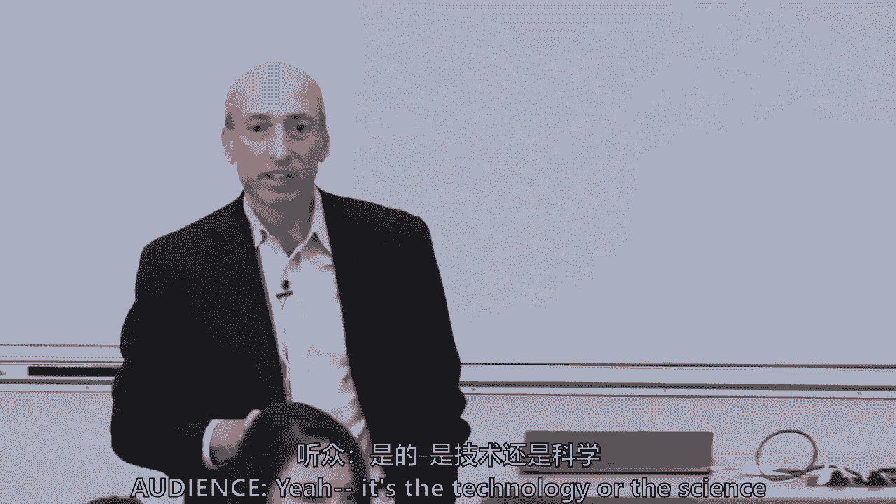
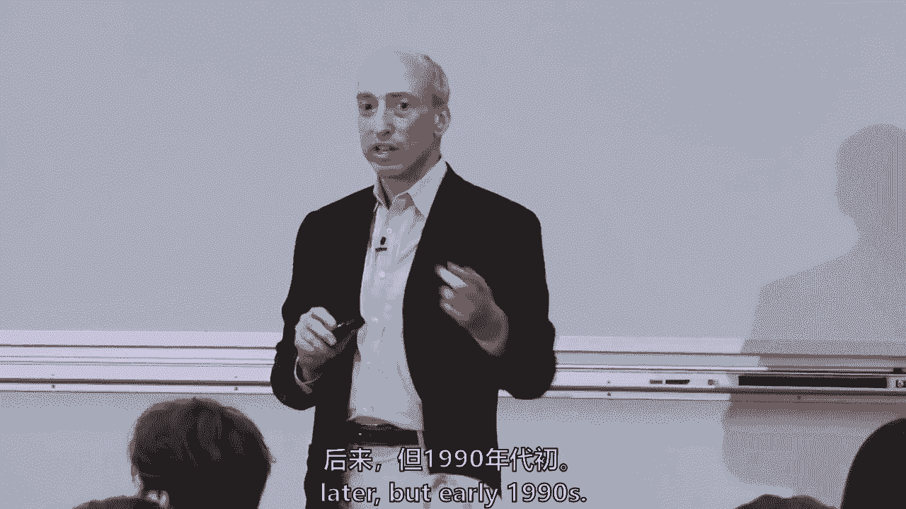
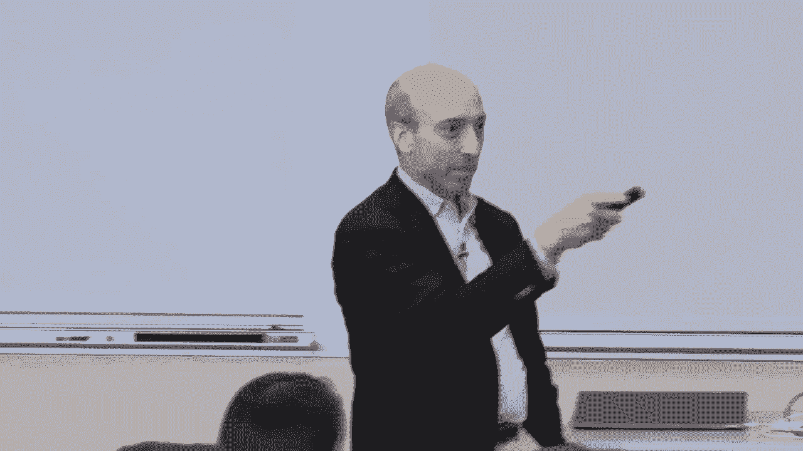
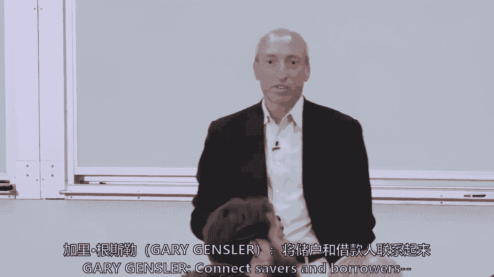
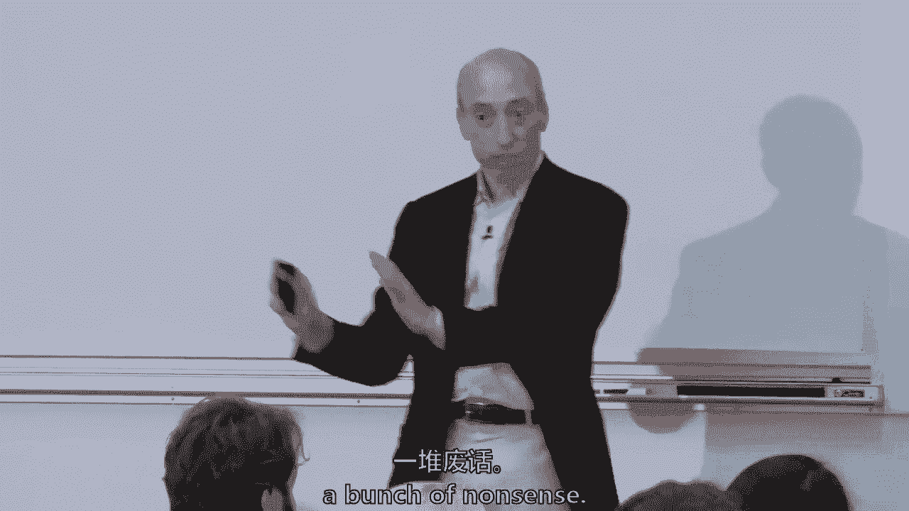
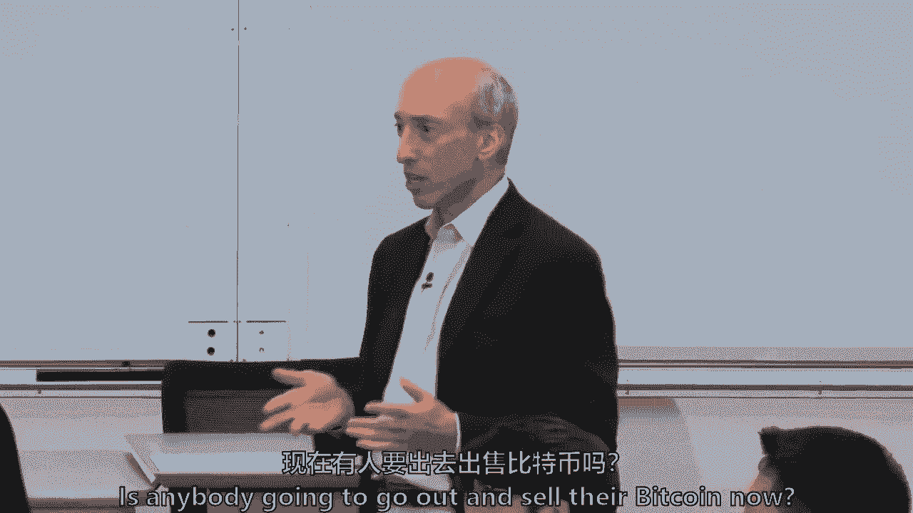
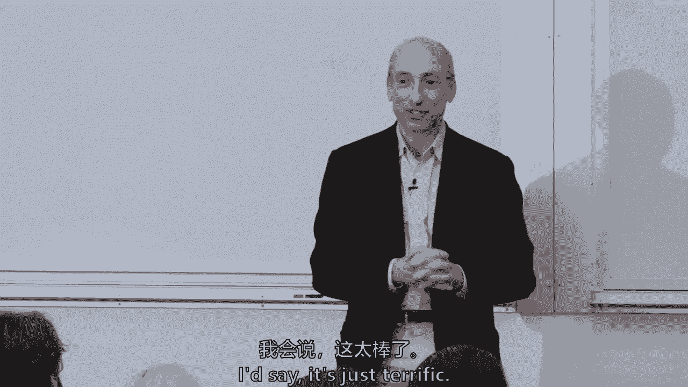

# 【麻省理工大学公开课】区块链与货币 - P1：1、区块链与货币课程简介 - 闰土聊Web3 - BV1sL411N7Mm

如果你想了解一点区块链，及其与金融和货币世界的交集，你在找1512，你来对地方了，如果你在这里不这样做，只是闲逛，玩得很开心，我想你仍然希望你在正确的地方，因为这学期我们会玩得很开心，我叫加里·詹斯勒。

我是麻省理工学院斯隆分校的高级讲师，我也是麻省理工学院媒体实验室的顾问，我花了一生的时间在金融、金钱和公共政策的世界里，我在麻省理工学院呆了八个月，我们将一起学习很多关于区块链和金钱的知识。

我们要在这里找点乐子，看看我们要做什么，我们在谈论区块链和金钱，顺便说一句，我们就在那里，我做冷电话，我真的来拜访你，如果你现在想离开，我明白，因为我想对此进行一点互动，所以我给大家的第一个问题。

是否注册，你们中有多少人拥有过加密货币，等一下，等一下，让我们看看胜算，好像是四点左右，你们中的5%，差不多吧好吧，所以请原谅，上，你想把你的手举得很久，你了解我，你们中有多少人参与过区块链相关的项目。

在创业环境或公司环境中，任何地方，所有的权利，好，所以房间里大约有三分之一，好的好的，所以你们可能比我更清楚，但我要试一试，我每周都会从，本周的学习问题是什么，你们中有多少人拿到了教学大纲。

这不是分级作业，我只想知道谁拿到了教学大纲，你们中有多少人，有多少人真正做了两次阅读，它没有分级，我只是要评估一下班级，哦谢谢你，谢谢。顺便把成绩写下来，否，不，好吧，所以本周讲座的两个主要问题。

真的是什么是区块链，为什么它可能是催化剂，我强调这个词，我们可以谈论很多金融和区块链世界之外的事情，可能确实有很多金融以外的应用，但我选择把范围缩小一点，所以这学期是关于区块链和货币或者区块链和金融。

其次你会看到每张圆桌上都有索引卡，下课前完成一项作业，2。你可以现在就做，也可以以后再做，我希望你们每个人都匿名写在球场上，这学期你想要达到的目标，可能是这个班上的任何东西，从学习区块链，从比特币赚钱。

从，我不在乎，如果你告诉我是去见你未来的配偶，我只是喜欢你在这门课上想取得什么成就，3号我帮不了你，但我会尽力在我能帮你的事情上帮你，塞布丽娜和托莱多会在晚些时候和下周二收集它们，我们会告诉你结果。

你想在这门课上取得什么成就，然后我们将在学期结束时看到，如果我们那样做了，所以这只是帮助引导我的一种方式，帮助你，这就是我们要做的，那么这两个读数是什么，一件是我做的一件小事。

一个是我和我的一些同事做的一件事，还有汤姆，因为我认识你，你从读数中提取了什么，呃，区块链有潜力提高稳定性，你是FRO的系统，你暑假过得好吗？你抬起头来了吗，你拥有比特币吗，否，他说你的名字很有潜力。

阿拉拉乌姆，嗯，我来自技术方面，所以技术方面，我只看到一堆炒作，自从比特币推出以来已经过去了十年对它来说几乎没有什么表现，除了他，这不是投票，或者只有两三个，有多少人同意汤姆的意见？还有更多。

你们中有多少人在第一天太害羞而不敢举手，所以我要开始回到互联网，我是怎么想到这个的，什么是区块链，它到底是关于什么的，嗯，互联网始于几十年前，在你们大多数人出生之前，但是1974年，我是说，有一些前辈。

即使从六十年代末开始，以太网，这就是两台电脑，然后你有TCP IP，它实际上是多台计算机的互联网协议，计算一下，然后后来，在一千九百九十，我们如何前进，有人知道我们在什么地方吗？你的名字会很有帮助。

埃里克埃里克，这是一个协议，Web内容，你知道谁与这项发明有关吗，我有点不记得了，其他人，有人知道是谁吗？不在读数里，或者任何蒂姆的伯纳德·李，有人知道谁与TCP有关联吗，ip。

这是一家由麻省理工学院教师发起的公司，我想可怜的酒吧，我不知道那是不是一家与麻省理工学院有关联的公司，但是Vint Cerf可能和麻省理工学院有一些联系，所以这是前三层，然后是公司商业化三个。

Booking。com和思科。

当然还有今天仍然存在的亚马逊，但还有别的事情发生，我们如何将互联网商业化，有人知道这一幕是什么吗，这是巴士披萨，或者通过比特币，好想法比特币出售的第一个披萨，但没有，电影里的，黑客什么的。

所有的权利，电影黑客，我从网上做的，做，你知道，你看过这部电影吗？

这不是一部好电影，所以这是网的开场场景，而且是的，那是桑德拉布洛克，1995年，你知道，一位总统参与了。

但实际上必胜客与第一次在线销售联系在一起，在世界任何地方，他们开始了一个叫披萨坚果的东西，这是屏幕，顺便说一句，如果你想继续，你可以点披萨。

但有一个问题，有人知道披萨网的问题是什么吗，我是说，可能有很多问题，没有艾伦，我明白了，你付不起，你不能在网上支付。

没有人知道如何在网上转移资金，你必须付钱，当你带着披萨出现的时候。

现在我要谈谈密码学，我们将在密码学上花很多时间，是加密货币之类的，你会假设这是一个地窖，神秘的东西，神秘的，好吧，现在你明白了，你得从那里开始。

有人想帮忙吗，出去，有人想帮忙吗，g是的。

是啊，是啊，告诉我你的名字，我们要问，我们要弄清楚如何，下周每个人都有名牌，但我们会和瑞安一起工作，这样做，但我确实知道。

是啊，是啊，呃，这是加密和解密背后的技术或科学，代码强化，那么如何加密特定的文本，如果没有描述，其他人是无法阅读的，好的，所以这是你如何加密一些东西。

所以不会被别人发现，或者本质上是在对手面前的交流，你有一个对手想要沟通，你想交流，不要让你的对手知道，这是古代的真理，所以在古代有一种叫做密码的东西，这是一种方式，你拿一块皮革或一块布，有很多信。

你会加密解密，因为圆柱体的尺寸不同有人看过这部电影吗，模仿小游戏，正确的谜机，现在这部电影太棒了，因为它说巡回演出破解了它，他确实以自动化的方式帮助破解了它。

但实际上波兰政府在20世纪30年代就破解了它，在他们落入德国人手中之前，但是巡回演出建立在所有这些的基础上，进一步打破了它，然后在二十世纪七十年代，这是在麻省理工学院，在某种程度上有私钥，公钥密码学。

我今天不打算深入探讨，但它是比特币和区块链的核心，它是互联网的核心，但关键是，在对手面前的通信，你怎么保守秘密，当每个人都想进去获取信息的时候，有很长的历史，是其中的中心。

许多早期的密码学在互联网上失败了，在90年代初和80年代末，大卫·查姆和其他人试图做一些事情，我们今天不讨论这些，但你们都有一个读数，我想要么是下周，它会给你那段历史，了解失败的历史是值得的。

但是密码学是今天互联网工作的原因。

有人想告诉我SSL和TLS是什么吗。

我们有计算机科学家提醒我你的名字吗，埃里克。

这是安装在TCP顶部的协议，IP堆栈使用对称大小写提供加密，它是公钥基础设施，生命安全的密码学正试图，所以它基本上使用非对称密码学。

我们将从现在开始讲两节课。

但它保护了整个互联网。

所以突然间你可以送披萨并得到PS代码，我得告诉你，我以前从来不知道这是怎么工作的，我在麻省理工学院，所以贝宝，出现在一千九百九十八，我提到过这个，一大堆其他数字货币，然后失败了。

但是这些稍后会阅读的人中的一些人，就像我们会读尼克·萨博关于智能合约的文章一样，后来亚当回来了，谁创造了哈希现金，一些真正有帮助和有效的创新是阿里·佩和梅佩萨。

有人知道M pesa是什么吗，我想它在肯尼亚就像移动蜂窝现金一样被使用，本质上，他们在肯尼亚发现，这是10-12年前，人们在交易移动分钟，他们没有银行，但他们有手机，他们把会议记录作为一种货币进行交易。

Safaricom意识到，说等一下，我们可以帮助人们成为数字经济的一部分，即使他们没有银行，每天在非洲，一半的成年人，根据世界银行的数据，仍然没有后盾，但其中一半有手机。

m pei说现在肯尼亚有两千万客户，所以它是一种货币形式。

这是一种交换移动分钟。

但谜语仍然存在，你如何在网上转移资金，或者本质上，你如何在没有集中中介的情况下将价值转移到点对点。

这就是区块链技术的核心，那么是谁解开了这个谜语呢？每个人都要告诉我，谁解开了谜语，谁解开了这个谜语，否，是啊，是啊，你。

你穿的T恤上写着昆汀·塔伦蒂诺，所以我认为昆汀·塔伦蒂诺应该解开一个谜语，那是什么，你叫什么名字鲁弗斯。

谁看见这谜语呢。是啊，是啊，所以点对点现金，这是真正的码头，在万圣节发出的一封电子邮件的顶部，二千零八年，但这是几个讲座中的学习问题，从现在开始请你告诉我是谁，我现在不会问这个。

他在电子邮件中从一个非常简单的句子开始，我一直在研究一种新的电子现金系统，它完全对等，没有可信的第三方，这是一种谦虚的说法，所以问题是，这是另一个互联网层吗，我们将在整个学期探索这一点，我不知道。

我真的没有答案，我不认为麻省理工学院最好的头脑真的能告诉你，有些人是最大化者，说是的，它会是，还有人会说不，不不不，在这门课中，我们将，我们将回顾极简主义和最大化主义，我们不是。

我们不会试图把它集中在一个地方，但这是关键问题，那么什么是区块链，我们将在很多讲座中这样做，但我会试着用一个简短的版本来做，所以有时间戳，追加日志，这意味着您可以为此添加一点信息，上面有时间戳。

所以这些是正在添加的块。

智史没有发明，区块链，要早得多，有人想猜猜是什么吗，你以后会有一个关于这个的阅读，但是1990年代初。

斯图尔特父亲，那是什么毛利人？斯图尔特·休伯特，斯图尔特·哈伯，斯图尔特·哈伯，在贝尔实验室工作，对呀，所以你们的一个任务，这不会是一个分级作业。

这将是一个有趣的任务，你们谁能，我想在下周四之前，只是去找点乐子，找到最长和时间明智的，运行时间最长的区块链，不是比特币，它从90年代中期就开始运行了，你的线索是纽约时报，我们下星期四再讨论。

块块块，数据块创建数据库，可审计的数据库，下周我们将特别讨论分类帐，但我们将在整个课程中讨论分类帐，以及它如何改变金融世界，现在它被密码学保护了，因为密码学记得通信，确保对手不能把你干掉。

我们将学习哈希函数，哈希函数是密码学中非常重要的一部分，最初用于数据库，以及如何在数据库中搜索和存储信息，但在这种情况下，哈希函数不仅是将下一个块追加到前一个块的方法，但真正重要的是压缩数据。

使其更容易操作并验证它，正如我在这里所写的，抗篡改与完整性数字签名，它必须执行公钥，私钥密码学，这门课没有先决条件，你不必学习计算机科学密码学算法，如果我能了解一点，哈希函数与非对称密码学。

这是两个关键的重要方面，这个房间里有足够多的计算机科学家可以解决我们的问题，如果我说错话，然后达成共识，所以区块链的一个非常重要的部分是，您如何决定谁追加下一个块，因为当我回到这里，有一个方块，方块。

这些块中的每一个，必须有人决定谁加入谁来选择下一个街区，这就是所谓的共识协议，关于共识协议有广泛的辩论，我们将讨论很多关于共识协议的问题，但本质上，它解决了一个叫做信任成本的术语。

我们将讨论拜占庭将军的问题，这是另一种阅读，拜占庭将军问题是作为一种数学博弈论问题提出的，大约三十年前，拜占庭将军们的最后一部分，比特币披萨，区块链，比特币，有人发邮件给你，你会收到这些幻灯片。

但这是真正的实时电子邮件，我给你一万个比特币买几个比萨饼，我只想吃比萨饼，发这个的人，他说，我喜欢洋葱，辣椒，香肠，蘑菇，拉兹洛，现在抓住日期，这是5月18日，他提供了一万个比特币。

但关键是我的目标是送餐，换取比特币，没有人使用比特币作为交换媒介，成立十六个月后，没有人用它买东西，Laszlo是佛罗里达的一名计算机科学家，只是有点感兴趣，他把这个放在电子邮件列表上，三天后。

他仍然没有他的两个比萨饼，所以没人愿意买我，一个披萨是比特币的数量，我出价太低了，又过了一天，他得到了他的比萨饼。

他发布照片，这是一张他的孩子伸手去拿爸爸约翰比萨饼的照片，有人知道那一万个比特币在当时的芝加哥值多少钱吗，我现在知道他们是什么了，当时有人想说。

拉兹洛说两个披萨可能值两个5到30英镑，因为有一整条电子邮件线程，他一直说为什么没人抓住我，我的披萨，你可以在这个上面赚钱，今天或昨天深夜早些时候。

六千六百万美元，你知道的，所以这是一个可爱的故事，每年的5月2日被称为披萨日或比特币，披萨日什么的，那么什么是区块链技术，这是我的话，但它们是从文献中挑选出来的，等等，它在分散的网络上可验证地移动数据。

区块链技术的经济性真的围绕着验证，验证经济学和网络经济学，在许多方面，区块链为验证增加了一定的成本。

通过我们将研究的共识协议，但它降低了其他一些验证成本，因为你不依赖一个集中的权威，所以这实际上是验证成本的权衡，我不认为我不是一个纯粹主义者，说是好是坏，但这是通过分散网络进行验证成本的权衡。

数据可以是有价值的，就像比特币是一个货币系统一样，或者数据实际上可以是计算机代码，我们将学习很多关于智能合约的知识，你可以让数据被验证，计算机代码和算法，我的世界金融，这直接关系到金融的管道。

因为金融从根本上说是通过网络转移资金和风险，这个网络是生活在这个世界上的70亿人，它在转移资金和风险，你们都学过金融课程，或者你们很多人都有，它是整个经济中货币和风险的中介，但有一大堆挑战。

在本学期的课程中，我们将讨论这些挑战，技术，商业和公共政策障碍，它们会被解决吗，他们会不会手软，但它可能是一个催化剂，但我们还不确定货币和金融世界的变化，有人想告诉我金钱在社会中的作用吗。

告诉我你的名字，托马斯，托马斯，基本上是一种自己交换东西的方式，人与人之间好吧，交换媒介。

没有电池就得到了那个，我是说这种交换媒介。

谁再给我一件黄衫，是啊，是啊，储蓄媒介。

所有的权利，所以这将是一个价值储存，是啊，是啊，第三次，对不起，这位先生，你需要一个帐户，记帐单位，就在那里，我们去那里我们去所以，下星期二我们将花些时间多谈谈钱的问题，以及货币在货币史上的作用。

我认为这奠定了这个项目的基础。

金融的作用呢，关于这一点，我已经说了一些事情，但是我很抱歉，我不知道你的名字，但我就在这里。

那个女人，是啊，是啊，金融的作用，我不会告诉任何金融教授你的答案是什么，为了筹钱。

所以继续前进，我要去找其他想联系的人。

储户和借款人可以连接Ssavers和酒吧。

所以联系是一种转移资金，移动。

估值，这就是它的碎片。

它在移动，进行估值，我用移动这个词，分配和定价。

定价是货币的估值。

但我们不要忘记，这也是关于风险的，当你买保险的时候，那是风险的转移。

当你购买股票时，那是风险的转移，如果你进行复杂的信用违约互换，那是风险的转移。

所以金融不仅仅是货币的流动，这是风险的运动，经济和我一直认为金融，我一直以为，我在高盛工作了18年，金融坐在沙漏的脖子上，这就是为什么它从社会上收取如此多的经济租金，因为当你坐在沙漏的脖子上。

数万亿粒沙粒经过，如果你收集一些CN颗粒，你得到了优步的财富，这些是给其他阶层的，但金融可以收取大量的经济租金，金融部门，虽然有一堆挑战。

本学期晚些时候我们会有一节课，讨论其中的一些挑战，我们有一个读数。

我想Sheela最近写了些东西，我让你们在这学期晚些时候读的，但我们将讨论金融危机和一些问题，但它有很多危机，法定货币有很多不稳定性，当然，当我躺下的时候，我们有集中的中间人。

我们将讨论收取大量的经济租金，所以有机会，区块链有真正的机会进入这个金融世界，也许做一些更好的事情，中央银行也有一堆遗留的支付系统。

那些遗留的支付系统正在慢慢适应，但它很慢。

为什么阿里支付在中国做得这么好是故事的一部分，因为有太多没有银行的人，就像肯尼亚的梅佩萨，但在美国，s，我们还是要付百分之二点五到三的互换费，签证费，万事达卡，之类的，和大量的清算和结算。

仍然有很大的交易对手风险，我非常关心金融包容性，世界上仍有17亿人没有银行。

但在许多产品中都是如此，即使在美国，s，这些是给我的，机会金融是U的7。5%，China’中国经济，那是1。5万亿美元的收入，所以你们中任何一个在考虑创业机会的人，就在美国的支付系统。

它只占我们经济的0。5%到1%。

那就是一千到两千亿美元的收入，我想这大约是180亿，你知道的，但你知道，当你把整个支付系统加起来，那是一千到两千亿美元的支付收入，所以这是一个机会。

区块链技术能进来吗，它有问题，它很慢，它的性能问题仍然存在，但它能和那个竞争吗。

以下是金融部门对区块链的一些问题，这些都是活生生的东西，我们将在本学期晚些时候学习。

他们说它没有性能可伸缩性，现代支付系统，你需要能够每秒移动大约10万笔付款，现代证券，清理保管人，信托公司，证券交易委员会说你一秒钟做大约3万笔交易，但我们需要你缩放，你的电脑和一切都必须有弹性。

到每秒10万笔交易，比特币，你可以做大约七笔交易，一秒钟，签证目前取决于，第二个每秒做两万到七万，所以这只是一种可伸缩性和性能的感觉，我们可能会到达那里，可能需要三到七年的时间，我很乐观。

但是仍然存在一系列性能和可伸缩性问题，隐私和安全区块链本质上是公共的，所以他们不完全抵制审查，但在使它们更加私密方面有很多创新，但这让公共部门有点紧张，互操作性，它们还不一定起作用。

与其他遗留系统或相互与Internet，互联网的伟大创新之一，它变得可互操作，所有这些不同的网站都可以相互交谈，治理是我们将要讨论的一个非常大的问题，关于治理的一件事是，区块链的软件很难更新。

因为如果你创造了一个没有人控制的分散的，没有人可以收取经济租金，你也没有那种有能力的人，必须更新软件，稍后我们将讨论比特币如何更新其软件，比特币核心开发者是什么等等，但是脸书，你知道一件事，虽然他们是。

他们是，收取大量利润和经济租金的公司，在他们的20亿成员中，他们知道如何更新他们的软件，这是一个治理问题，那是现实生活中的挑战，这就是为什么金融部门说我不确定这是否有效，这是为我准备好的。

那么商业用例是什么，公共政策问题是什么，所以现在金融部门更喜欢许可区块链而不是许可列表，这将是大约四周后，我们会经历这两个差异，但我想简单地把这个框起来，许可区块链有一群已知的实际参与的人。

你们中的一半说你拥有比特币，你知道这是任何人都可以更新的东西，账本权限区块链你不能这么做，本质上你挑三个或二十个，澳大利亚证券交易所正在更新他们的清算和结算，他们宣布他们正在做一个区块链项目。

他们正在用数字资产做这件事，他们正在使用超账本区块链，这是一个IBM软件开放源码软件，但澳大利亚证券交易所将把它放在三台电脑上，也就是所谓的三节点，他们控制了他们三个，托存。

信托公司正在为他们的一些数据仓库寻找受区块链启发的解决方案，但他们也会控制节点，我只是允许你这么做，区块链。

那没有错，他们就是这么看这个无许可的，区块链就像比特币，未知参与者，基于激励的证券，加密货币与加密经济学，加密金融大约是两千亿，但你知道你必须每天更新这些幻灯片，两天前是2300亿。

这个小饼图一半多一点是比特币。

下一片是一种叫做以太坊的东西，然后沿着线涟漪而下，这学期我们不会花太多时间，如果你如果你的目标是，你怎么能获利和交易，日间交易比特币和日间交易以太上帝保佑繁荣，你可以留在班上，我只是不会给你太多的建议。

你知道这不是一个以密码投资为中心的课程。

但我没事，如果这就是你要做的，有人知道全球资本市场的规模是多少吗。

有人想猜吗，你知道这是两千亿，它看起来像什么，我已经说过这是谦虚的，成百上千亿，几十万亿。

全球公平，大约80万亿，全球债券和债务市场。

250万亿，所以它还是很谦虚的。

与资本形成和黄金的广泛广度相比。

黄金的价值是多少？

它只会给你一种规模感，所以这个空间也有一些有趣的地方，它引起了公众的极大关注，即使在座的一百个人都证明了这一点，相对于大小，它是相对于今天的资本市场，有一堆公共政策问题，我们将有一个讲座。

我管理商品期货交易委员会，所以说，尽管我们必须总是回到规则上来，我们总是要把我们正在做的事情融入法规。

但让我给你一个小框架。

然后几个星期后你就得无聊了，是呀，它将是必读的，对不起，但它是为了防止非法活动，很多比特币和加密货币开始，在网络中，朋克运动和自由主义运动等等，确实你可以用它来进行非法活动，但我想说犯罪并不新鲜。

只是机制和手段是新的，是呀，我们会用这个，并把它用于非法活动，金融稳定，这会很好地动摇金融吗，只有两千亿，金融市场是三百万亿以上的，但通常是他们说的，但对一些国家来说，这是绕过资本管制的一种方式。

对于那些担心资本管制的国家来说也是如此，这是一系列非常真实和生动的问题。

然后保护投资公众，当我们在几周后这样做的时候，我要一一过目，投资者保护问题，而且是的，我们如何测试SEC，对于那些希望自己首次投币的人来说，我会给一些，你知道的，对SEC试图实现的目标的广义理解。

但它是一个移动的目标，所以这是一个很有趣的，而不是你的很多sloan类或者你的c cell类或者媒体实验室类，这是公共政策中一个非常不稳定的领域，所以它很有趣，如果你们都去成立公司，你实际上会有所帮助。

我总是说，只记得诗人莱利鸭子测试，这是一位诗人印第安纳诗人，所以那些不是美国人的人可能不知道鸭子测试，但基本上如果它像鸭子一样嘎嘎叫，像鸭子一样走路，是只鸭子，所以每当你考虑公共政策的时候。

像我这样的人，我们认为在鸭子测试中，你知道的，常识在哪里，如果它像鸭子一样嘎嘎叫和走路，可能是保安，也可能是这个或那个，嗯，像这个角落里的莱纳斯这样的现任者正盯着这个空间，因为有很大的波动性。

华尔街赚钱，波动性，波动性是华尔街的朋友，可能不是投资者的朋友，但它是华尔街的朋友，他们也喜欢交易量和价差，美国最大的加密交易所，s，有两千万个账户，它们可能并不都是活跃的。

但这是富达的会员帐户列表的大小，两次德·萧和罗宾汉。

你们中有多少人用过罗宾汉作为交易应用程序，哇哦，你们中的一半，所以你知道，自由贸易权，五百万会员给那些不知道的人，你可以下载罗宾汉，还可以免费炒股。

如果有人有兴趣，出现了，我会做办公时间。

想知道罗宾汉是如何商业化的，他们将你的订单流商业化。

他们不收佣金就赚钱，但这是一个很棒的应用程序。

千禧一代喜欢它，已经有500万会员了。

所以你最好相信德肖，现任者担心这样的事情。

他们愿意冒险乞求原谅，而现任者往往必须征得许可，所以有一个不平坦的场总是，它是不对称的，并不总是，我不喜欢为摩根哭泣，嗯，我是说，大的现任者也有，他们有自己的优势，Coinbase正在成为现任者。

而不仅仅是一个创业公司，我们将在这学期讨论一些现任者，我们可能会让杰夫·斯普雷克斯来这里，11月中旬将和你谈谈洲际交易所，纽约证券交易所正在与星巴克和微软合作，以及类似的金融部门用例，我不打算经历这些。

但这是课程的后半部分，要经历每一个，我们会在每个支付系统上做一到两次会议，中央银行，数字货币，风险投资和最初的投币空间将在这方面做一个课程，并通过，那么在整个课程中我们要做什么。

基本上我们的目标是学习基础知识，这大约是课程的前半部分，转向两次关于经济学的会议，我们将在整个课程中讨论经济学，但我想，我只想集中精力，深入研究经济学，关于其中两次讨论，然后在下半年的财务空间中裂开。

那是我们一起的旅程，对我来说，它是为任何想获得批判性推理技能的人准备的，这不仅仅是一种嘿，这将改变世界，彻底改变一切，嗯。

当将军不知道发生了什么的时候，但需要弄清楚，需要和那个谈谈，你知道地面上的下士，谁有污垢，你知道，全身都是，已经被枪杀了。

说，这是真正的真相，我们要试着谈谈，在这门课上的基本真理，把单纯的断言和炒作分开。

你的一些读数将是一些真正的比特币和区块链，极简主义，来自努里尔·鲁比尼，用文字。

我不应该在录音中重复这些东西，致保罗·克鲁格曼，谁和乔·斯蒂格利茨，和其他诺贝尔奖得主，谁说不，这是行不通的，或者沃伦·巴菲特，到最大化者，我们要试着把两边都盖住，拉里·莱西格向我致敬。

因为他在教室的后面，他非常受人尊敬，哈佛大学的教授，我不知道拉里也会来，我以前做过这个幻灯片，但在1999年我想你写了这本书，拉里是网络空间的正确代码和其他法律。

我把你放在，但我认为在这里考虑一下拉里的四个比特是值得的。

我不知道拉里，如果你想说什么，但我会试着注入这门课，你是怎么想的，我们在麻省理工学院的技术，我们会给你很多技术，如果你想要的比我能给你的多他以前是金融界的人，我的一生都会有一堆计算机科学，班里的人。

我们要钩住，你和媒体实验室和塞萨的人一起，并试图将您连接到技术方面，如果你想在那个池塘里游得更深，但技术真的真的很重要，这就是为什么我们要讨论哈希函数，通过非对称密码学等等，从商业角度来看。

为什么现任者或初创企业不这样做。

为什么十年后，目前还没有一个企业范围的解决方案，到使用区块链的支付，法律很重要，公共政策方面的事项，拉里的第四部阐述了社会规范。

这对我来说有点难教，这不是这门课的内容，但它也影响了这一切，不仅仅是技术，市场和法律，所以它不仅仅是一个三条腿的凳子，它有点像一个四条腿的凳子，我做得怎么样拉里很好，所有的权利。

我真的不知道他怎么会在这里，并将一起踏上这段旅程。

一系列的观点，我们不会成为比特币的极简主义者或最大化主义者。

我可能会在这里自我揭露，比特币的中心极简主义者。

智能合约极简最大化。

我可能很中锋，拉里可能有点中锋最大化，我猜，我希望我能，但你要教我我能教的。

哦，哦，所以你还是，你仍然是中心或中心极简主义者。

什么智能合约，然后区块链。

最大化或极简主义，我得说几周前我是个中心最大化者，我有点滑回到中间，嗯，允许的，区块链，我更多一点，有一些埃德，这里，艾伦是你的斯隆团队中的一员，你可能知道，六个月前，当我们相遇时。

他正在研究一个无许可系统，现在你在研究一个许可系统，你有一个正确的启动，是啊，是啊，因为就像你在市场上反弹一样，现实是，在这门课上我们会讲很多关于批判性思维的内容。

什么时候你真的需要分散的对等系统的优势。

在信托成本如此之高的情况下，那是正确的道路，但我是一个认为，金融体系中也有如此多的经济租金，这1。5万亿美元的收入，或者我们经济的7。5%，或者只是支付系统中的两千亿，例如。

有时你并不真正需要一个分散的系统，但这可能是你在下面掖好被子的机会，所有这些经济租金和所有这些收入，现在。

现任者会做出反应，你戳了一个现任的商业戳，嗯我是说，他们会做出反应，这就是为什么我认为，即使在职者在课程的要求中采用了很多，作为一名教师，课堂参与是一件很难判断的事情。

当我有这么多人，所以说。

如果你对下学期这方面有什么建议，32个个人写作UPS。

上半场一个，到了第十讲，基本上就是区块链的基本原理，你选个话题，我不在乎是哪一个。

但你会得到，你的成绩会好得多，如果是关于批判性推理。

如果它真的拿走了什么，那些文字是，而且而且而且不仅仅是重复，那个，这在读数中。

但真正进入下一步，说这是怎么回事，这是一所商学院，你不必，你知道的，让我相信你对计算机科学有所了解，这就像是对经济机会的批判性推理，实力，缺点，机会，老商学院对瓦特的威胁，关于那一周的。

不管是关于密码学早期的哈希函数，或者你在基础阶段等待。

到权限相对于权限少，你挑，但请在上课前把它交上来，因为我可能会在讲座中说，他今天写道，你想告诉我们你的想法吗，这可能有助于刺激课堂参与，然后在下半场写第二篇文章，当我们重复用例时，再次，批判推理。

最后是最多四个人的团队通常的方法不，我不想五个人一组，我现在就去处理。

在下半学期的某个时候，我们会讨论更多的内容，这里有几个和我一起工作的人，上学期在一个较小的小组里，你知道我希望你做得很好，所以我要给你一种感觉，我们想做什么，但基本上你是一个企业家，或者你是现任。

您将选择什么样的用例，以及它是允许的还是不允许的，提出一个建议。

做一个用例，围绕这项新技术运用你的批判性推理，在广阔的金融界的某个地方，我是说你知道，我很高兴发现金融真的很广泛，你知道你会选择，所以这就是其中的一部分，行动一个或基本原理，我不会一一细读。

但你知道这是在教学大纲里，当然啦，第二幕是经济学的中心，第三幕，我们的金融部门用例，希望在整个过程中我们会玩得很开心，所以下周二的学习问题，真的很快，货币的作用和特点是什么。

所以我真的想挖掘金钱背后的东西。

金钱不过是一种社会结构或社会习俗，交换媒介，价值的储存，记账单位，有一些关于这场辩论的阅读，货币最初是否来自易货制度。

或者一群非常好的人类学家和考古学家，所有的人都说不，它实际上是作为一个分类账系统出现的，没有人确切知道，一万到一万五千年前，钱是否来自境外系统，或更多作为记帐单位，记录贷项和分类账，但我想说。

当你读到其中的一些读数时，你开始好好思考，这只是一种社会结构，所以我们会支持它，什么是法定货币。

法定货币，这是一项发明，真的只是在过去的几百年里，我们现在认为理所当然，但这与整个历史有什么关系，更重要的是如何分类，会计分类账，我知道，无聊的东西，但这可能是我们走出黑暗时代的原因。

所以大约五六百年前，复式簿记，对不起，我喜欢分类账，嗯，我们将讨论一点分类帐，以及它如何融入货币和证券等等。

然后在历史的基础上分层比特币是如何适应的，下周二不是关于比特币的深入，只是上面的一小块，会有五六次读数，其中一个是三分钟的视频，第三个，很有趣，小心点，这只是一个关于什么是钱的有趣的小视频。

没必要看中本的整篇论文，当我说邮件的时候，我是说封面邮件。

是一段，我每周阅读的目标不是，每次会议基本上都是，尽量保持不到五十页，你说你要去看，有时你去，看起来更多，也许是，我想，你们自己会明白的，如何整理你的知识深度，但我预测你们中的一些人，可能高达四分之一。

或者有一天你们中的三分之一会掉进兔子洞。

在接下来的四个八小时里，你将做区块链，你不会知道时间去了哪里，因为这是一种瘾，在某个时候，你们中的一些人会得到，因为这是一个奇怪的想法。

我不是在预测，你们所有人的虚弱，我只是说你们中的一些人会有这种情况发生在你身上。

所以偶尔我有读数，为什么这种事经常发生在你身上。

我想是的，让我总结一下，然后回答任何其他问题都在上面，区块链，我认为确实提供了一个点对点的选择。

我想我希望拉里我能说服它确实提供了。

点对点的替代方案解决了信任成本，这并不意味着这是解决信任成本的唯一方法，但解决了信任的成本，金融业确实面临挑战，不仅仅是这样，它占美国经济的7。5%，和全球类似的比例，但是韧性，它是如何生存的。

冲击金融危机，像这样的事情是真实的，包容的，一分，70亿人没有银行，但如果你看看其他可以获得信用卡和抵押贷款的产品，之类的，然后是法定货币，肯·罗格夫，其他人写了很多关于未来的不稳定，法定货币。

我们将讨论一些历史和中央银行存在的原因，它们是如何产生的，下一个关键点是我们已经生活在一个电子时代，智史，中本和比特币没有创造，桑德拉·布洛克不能用电子支付，那是1995年。

他们拍了一部关于这一切的B级电影，但到今天你在网上交学费，你们这些工作的人在网上得到报酬，你在网上支付汽车贷款，不是百分之百，但是在一些国家，比如瑞典，已经接近百分之百了，我们将一起学习。

发现金钱只是社会和经济上的共识，UM区块链技术，然后很多东西伪装成事实。

但这只是断言，我们会试着解决这个问题，这些差异并不意味着你们所有人都要离开，同意保罗·克鲁格曼的观点，诺贝尔奖得主，或努里尔·鲁比尼。

这只是一堆废话。

顺便说一句，你们中的一些人可能会，但我想你会有真正的批判性思维能力，我希望你们中的一些人会说我实际上想通了，在金融界有真正的机会，利用区块链技术，使其成为一个更好的金融部门。

或者以某种方式以较低的成本提供服务，全程更好的服务，我希望自始至终我们能一起学习。

一路上我们会玩得很开心，那是我的想法，问题，我们正好有18分钟好了，但我们可以缩短它，我也是，我不在乎。

我们开始了，说你告诉我你的名字，我们要做标语牌。

瑞安会努力弄清楚，你知道并做标语牌，因为它还年轻。

我想知道戏弄有多难，表格定义项目，团队是如何组成的。

传统上，斯隆的任何人都可以谈论这个，但是学生们自己做，但我们倾向于后半部分，说好。

他们成群结队，当你知道它是否是一个较小的群体，就像嗯，还没有人组成一个团队，你们为什么不搬到房间的左手边，聚在一起，但我们也可以用电子方式做到这一点，你知道托莱达和塞布丽娜。

你认识的人可以帮助转变基本上有一个社交网络来帮助组建团队，因为这是一个很大的团体，你说的对，但传统上是学生自己做的。

现在会有人出去卖他们的比特币吗。

拉里，你为什么在这里。

我在这里，因为，我想你会给整个领域带来批判性的怀疑，你对财务方面非常了解，所以我想看看这些的组合，最后是否，我仍然相信那里有一个，我确信那里有一个，正如我们所说的。

因为我认为这可以从根本上改变世界各地的信任成本，但我想我还有很多问题，看看这个作文有什么帮助，谢谢你能来，任何一个星期你都可以在这里，任何一天我们受益，我希望这真的是一次对话，我比你快不了多少。

去年10月，西蒙·约翰逊找到我说，你觉得来麻省理工学院怎么样汤姆知道这个故事，我们在华盛顿坐下来吃午饭，那是我生命中的美好时光，我的三个女儿，我有三个女儿，我是一个单身爸爸，他们两个在研究生院。

一个或本科，那是我生命中的美好时光，我说为什么不呢，你知道的，来到这里参与媒体实验室的数字货币项目，我花了一生的时间，我在高盛投资银行工作了18年，帮助人们买卖被称为并购的公司，然后我去了交易方。

固定收益，去了亚洲，做了一堆，我在亚洲经营固定流入货币和掉期交易，然后我的上一份工作是共同财务官，所以我们当时的资产负债表大约有2。5万亿美元，高盛，我们太私密了，这意味着如果我们赔钱了，我们个人。

我是普通合伙人。

是卡普特，那是个专业术语，但我们有700个法律实体。

和一千人谁可以承诺公司的资本，我们一般叫他们叛徒，但你知道那是一段迷人的时光，然后我继续从事公共服务，因为鲍勃·鲁宾知道我会是一个温柔的人。

我以前是高盛的合伙人。

我去了美国，在90年代末，由于许多原因，与我们现在的时代有点不同，但我们在偿还债务，我们在处理亚洲债务危机，长期资本管理，俄罗斯债务危机，那是一段迷人的时光，我不知道，但和它一起工作很了不起。

即使在被称为E签名的短时间内，这是一个法案，基本上说你可以用电子方式签署一切，这是一个美妙的小，有时在政府，你可以在小事上下功夫，我负责重新设计货币，我可以告诉你为什么它看起来像这样。

以及如何重新设计纸币，和以后的讲座，我会告诉你一个仍然存在于货币中的设计特征，你可以直观地看到它，因为，当我要求的时候，负责雕刻局的人说为什么，我说'因为它看起来更好，我是批准它的人。

也许我们能把它做完，我们解决了这个问题，看起来确实更好，他很喜欢，他担心这样做的政治风险，这是一个更好的设计，他只是，我说，我会在政治上掩护你，让我们做吧，但后来我和保罗·萨班斯一起工作。

什么变成了索比，奥克斯利，我是他的高级顾问，我在一些政治活动中工作和踢来踢去，我们失去了其中的两个，那就是08年希拉里竞选和16年希拉里竞选，我是她的首席财务官，我是一个高级顾问，做经济政策和外联。

牵手和，然后在这两次竞选的中间，我经营一个叫商品期货交易委员会的机构，那是危机后，我们该怎么办，这是一项真正的公共政策，缺点，我把它看作是一个机会，正如我所说，所以我们试图带来透明度。

到一个三四百万亿美元的市场，叫做掉期，它们只是风险转移的合同，我们试图提高透明度，降低风险，通过中央清理啊，这就是我的职业生涯，正如我所说的，我有三个女儿，她们的处境很好，所以当西蒙说，上来吧。

我说太好了，我爱麻省理工学院，真是太棒了。

然后你们都很棒，除非有其他问题，我要让你早点走，你知道。

