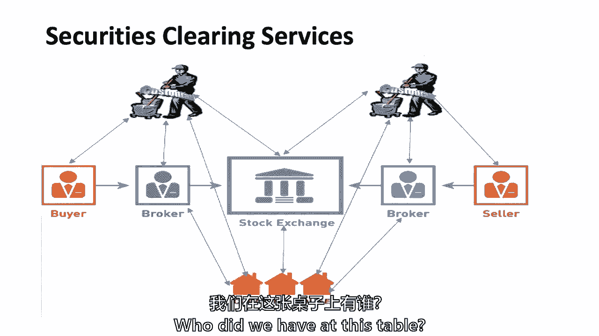
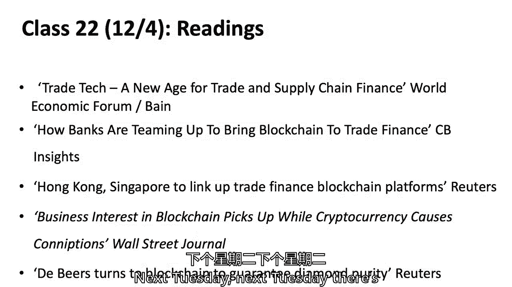

# 【麻省理工大学公开课】区块链与货币 - P20：21、交易后清算，结算和处理 - 闰土聊Web3 - BV1sL411N7Mm

今天是关于清算和结算系统的一点讨论，也许你觉得你已经从杰夫·斯普雷彻那里听到了你需要的一切，当他被问到一个问题时，当他和我们在一起的时候，杰夫经营着一些世界上最大的清算所，在洲际交易所，不仅。

因为他是从能源生意开始的，但他有很大的过错，交换信息交换所和能源信息交换所，之类的，他说得很好，我不知道区块链技术用于清算和结算，但我要试试你们都知道的比特币项目，他谈到了，但今天我们要试着挖井。

也许那里有什么东西，因为有项目在进行，为什么会有项目，它们大多是有许可的，而不是无许可的系统，但我觉得那里有些东西，这将是一个更乐观的，你知道吗，如果你在评判，我多久到达最大的一面。

我想那里可能有什么东西，至少为了许可，清算结算中的区块链项目，嗯，我要好了，当然要仔细阅读，这些都是，我们将办理清算和结算服务，所以我要试着搭建舞台，至于什么，坦率地说，这是我在华尔街18年的时候。

我真的不能定义什么是清理和解决，对不起罗斯，你以为我可以定义它，当我在华尔街的时候，那是什么只是，你知道的，别人也可以用，是啊，是啊，是啊，好吧，当你在并购区的时候，你通常不会考虑清除某事意味着什么。

并解决它，坦白说，即使通常当你在交易大厅，那是别人处理的事情，我是说，有多少人在这里的交易大厅工作过，所有的权利，所以我会让你们七八个人开始，你现在被注意到了，大约八到十分钟后，你就会。

你可能会证明我刚才对罗斯说的话，你无法定义什么是清算和结算，因为别人处理了，但我们走着瞧我们走着瞧，然后我们再讲区块链技术的适用性，正在进行的一些项目，然后移到这个，国际互换有一个读数，衍生工具协会。

是他们在做什么，这个空间里的智能合约，嗯，但我想先谈谈最终的项目，因为我们在一年中的那个时候，这是为了帮助，这不是，然后我会问八九个问题，如果你还没有仔细考虑过你的项目，这里有八九个问题，我想你会想的。

这是另一种说法，它可能会提高你的表现，第一名，这是一个小字，对不起还是不，还不算太糟，就是，价值创造主张或痛点是什么，如果你愿意，那么你在创造价值吗，你在解决痛点吗，或者就像杰夫·斯普林说的那样。

你在干什么，那会让一些东西，价值主张是什么，任何空间，有两三个团体在做贸易融资，有一两个在付款，有一些团体在做广告，信用评级之类的，我是说，种类繁多，有一两个团体来看我，做金融以外的事情，但不管怎样。

价值主张是什么，你在解决哪些痛点，或，就像杰夫说的，你要做什么更好更快，更便宜，如果你不能回答这个问题，你知道吗，门槛问题，把它摇松，把它踢来踢去，或者转移到不同的用例中，嗯，坦白说，其次，然后你进入。

就像，这个区块链技术是什么，将记录哪些交易或数据，因为这从根本上说是一种数据库技术，即使是无许可的系统，你会看到后面的问题，就像为什么这个和传统的数据库系统，但是什么交易，什么数据，不管是医疗记录。

沿着供应链移动一块财产，您记录的实际数据和事务是什么，多个涉众需要对分类账进行哪些写入和读取访问，我在多重这个词下了线，因为当你思考区块链技术的价值主张时，它是关于不可变的记录，或者所谓的不可变记录。

那是可以核实的，多方之间不可更改的记录，而且花了额外的钱，我们这学期所学的内容都是关于，有更多的复杂性，有更多的成本，以某种分散的方式，甚至允许的系统，权力下放的制度，但你得到了一些东西。

但你也必须有一些逻辑，有多方需要编写和读取分布式数据库，只是只读了，我可以读取我的美国银行账户，我能看出里面有什么，你知道的，账本不一定要在区块链上，所以多方写作，为什么这很重要，形成共识。

您正在降低哪些具体的验证或网络成本，我们讨论了很多验证成本，不管是不是隐私，审查制度，阻力，不管是一些直接的成本，也许你正在做某事，那里面有一堆经济租金，所以有一系列的验证费用。

我们谈到了你试图降低哪些网络成本，嗯，大概有四五千张白纸，你能找到的很多你找不到所有的，但如果你要做一些你认为已经写了白皮书的事情，或者一家区块链公司已经开始了，弄清楚竞争对手在做什么，对于这两个群体。

可能更多的是在贸易方面做些什么，金融与供应链，你知道的，你知道的，你知道的，有一堆东西你可以读，我们接下来会研究它，星期二艾琳，你能给我们一个网络成本的例子吗，我不知道那是什么，所以网络成本。

这就是为什么人们经常使用本机令牌，但是网络成本是如何启动网络，现在优步在某种意义上启动了一个没有区块链技术的网络，但是网络成本的一个例子，或者如果你走出机场，你不认为有司机在使用这个应用程序。

那么你就不会对使用它非常感兴趣了，那么谁承担费用呢，通常，建立网络的成本可能是一个巨大的启动成本，那么如何启动网络，你经常去找一群风险资本家，你筹钱，你做广告，你试图让参与者，医疗保健记录的挑战之一。

我们没有医疗保健，我环顾四周，我们有两个哈佛公共政策学院的学生在做研究生工作，有时加入我们，但是医疗保健记录，例如，有一些非常有趣的区块链技术解决方案，但网络挑战是，你怎么得到一堆，实际加入网络。

所以这将是一个网络成本的例子，基本上是采用，那通常有帮助吗，是啊，是啊，竞争对手在做什么，我不是在找剽窃，但如果你在空间支付，或者供应链，或者其他一些，外面有三六张或十张白皮书，也许有人甚至提高了。

一个ICO里有两千万或几亿，那就会很有趣，你应该可以随意看看这些，也许你会被它通知，你会说我做得更好，或者他们在这里做得很差，或他们在爱沙尼亚的项目，我不会羞于看到竞争对手，事实上。

我会说那是一所商学院，你总是看着比赛，你看看你是否能做他们做得更好的事情，或者他们在不同的地理位置或不同的市场做什么，回到艾琳喜欢定义事物，我还没有在这张幻灯片上使用区块链技术这个词。

但是为什么只在多方共识中添加日志，最佳解决方案，这可以追溯到，为什么不只是一个传统的数据库，但是为什么只附加带有时间戳的可验证日志，你知道它们是通过密码哈希函数连接的，但是为什么这些圆木。

以及为什么多方在本质上对账本的状态形成共识，嗯，莱恩，我有一个关于家庭日志时间戳的问题，这只与区块链相关吗，我的意思是传统数据库没有这些功能，时间戳，它们本质上可以有时间戳，但本质上是什么。

他对90年代初的创新，这是一个概念，你把一个数据块，然后用加密哈希函数将其连接到下一个块，一旦你做到了，那它就犯了，你不能修改任何东西，那是以前，没有类似的承诺计划，他们确实有其他承诺计划。

但不是这种获取数据块的承诺计划，具有哈希函数的，这就意味着你永远不会改变之前发生的事情，这就是我的理解你对传统数据库有不同的看法吗，嗯，我想这就触及到问题的根源了，区块链技术有新意吗，依我看，其实没有。

二十年前，我们知道如何制作一个传统的数据库，并使其容错，协商一致协议，或者现在人们喜欢称之为许可区块链，所以我们知道怎么做，我会给你一个朋友唯一的日志，这没什么，是啊，是啊，所以关于在哪里有争论。

允许的区块链和传统数据库之间的边界和边界在哪里，但我选择了至少在这门课上，超分类账结构，我们称之为区块链，认识到有些人会说，除非您有本机令牌，这不是真正的区块链，信任是关键，关键属性。

这不是这个等式中的因素，因为你可以得到一个倍数，我是说多方共识本身没有价值，其实是多方共识，这实际上是你必须想出来的东西，作为必要，这源于这样一个事实，即你正在处理一个分散的安排，你不相信任何一个。

这怎么会介入，信息交流方面的作用，嗯，我同意你的前半部分，你已经，你甚至不想使用超分类帐织物，除非你真的需要多方写信给分类账，我认为这确实把它分开了一点，您可以使用Oracle数据库，并允许它是多方。

我也是，但我想这把它分开了，在哪里，你可能比我更纯粹，埃里克，我不认为它必须完全开放，你不知道所有的参与者，但即使在金融领域，我们将在半小时左右讨论澳大利亚证券交易所，当我们谈论这个的时候。

那是一个有限的闭环，但他们相信他们实际上从核查方面拿走了很多成本，他们认为他们得到了很多，他们正在降低核查成本，他们会争辩说他们降低了网络成本，因为它们在多个数据库之间没有相同的协调。

现在你可以称之为验证成本，但我想他们会称之为验证和网络成本，这些多个后台不再协调，嗯，如果你的，如果您的最终项目有一个带有本机令牌的无权限系统，为什么需要本机令牌。

你想为ICO筹集资金是为了启动ICO吗，我不是，我并不反对，我是说如果那只是，但至少坦白说，这就是我们众包这件事的方式，如果是关于那个，你真的相信象征性经济学有一些好处，这是一个激励系统。

让你的新竞争对手去优步，或医疗记录奖励制度，或者供应链的激励制度，谈谈那个激励系统是什么，你是想激励，可能两者兼而有之，可能是，我只是说我们最好讨论一下，是本机令牌，只是众筹，是本机令牌。

可伸缩性的权衡，性能，隐私，安保，协调，我不是要你解决它们，事实上你甚至可以提前三年五年七年，并假设其中一些事情会得到处理，区块链，他们似乎有更高的性能，比本机令牌无权限系统的性能高得多。

但是如果您提出一个本机令牌无权限系统，我只是想，关于这些可伸缩性问题对您有多重要的简短讨论，尤其是当大多数本机无权限令牌系统可以处理，每天超过一千或几千笔交易，我是说比特币处理的确实比这多得多。

但你知道五到十笔交易，第二，无论你的解决方案是什么，它都将起作用，我不是，事实上，我希望看到一些组使用本机令牌，嗯，我想在十二月读各种各样的东西，而不是读取所有权限系统，但是。

权限区块链或传统数据库能充分解决任何用例吗，如果您确实有一个无许可的系统，你知道的，想着那个，嗯，如何实现广泛采用，您打算使用本机令牌来获得广泛的采用吗，你怎么能让一堆医院签约。

你打算怎么让一堆银行签约，你要做的是，杰夫·斯普雷彻把他50%的股权，他和高盛的那次谈话，他意识到这是他做生意的唯一方法，始于二十世纪九十年代末，嗯，但只是你知道，你打算怎么让别人收养你，嗯。

在某种程度上，你知道这可能是一个段落，但是什么类型的客户界面，或者怎么可能比其他客户好，如果你在考虑一个真正的生意，这些只是其中的一些事情，我认为市场正在远离，从那个泡沫的大牛市。

那里一个月有四五百科斯，它每月筹集20亿到50亿，现在是十月，大约两百科斯，大约有八亿，我认为它会继续下降，部分原因是它们并不都起作用，但部分原因是人们现在变得更加严格，至于到底发生了什么。

如果您正在使用权限区块链，你不必告诉我，不管是超级账本还是Corda，但如果有人这么做了，你在那里有一些深思熟虑的话要说，我很想知道，你知道为什么这个和那个，我是说这只是为了展示你对主题的批判性分析。

如果你想证明自己，为什么是Corda和Hyper分类帐织物，如果有人有观点，那就很有趣了，但我不想要那种程度的，这是从商业角度来看的，把我当成风险投资家，如果我在投资，你知道你是怎么把它放在一起的。

有什么问题吗，所以我们有六七个人实际上在银行业工作，这张桌子上有谁。

如果我没记错的话，你需要证明你的政党的身份，以确保您将资产发送到右边，所有的权利，所以你要证明身份，所以这是关于验证和认证它。

身份，清除中的其他任何东西，还有谁在贸易部门工作，后面桌子上的人，工作啊，是他们有可交易的资产，他们有可交易的资产，嗯，大多数股票市场在交易日交易，加两天，所以在那两天的某个地方。

你必须确认他们有正确的资产，你不必在，正常情况下t加0，t加1，我可能错了，但我认为你也必须这样做，证券交易所，知道，你在净曝光率上的净曝光率是多少，净接触，非常关键的事情。

所以在执行和事务之间的某个点上有身份验证，你必须知道你有安全感，然后是净暴露，我们将在另一页上看到，这个简单的图表，你知道吗，两个人在修剪草坪，但买卖双方相遇，但在传统证券市场中，买卖双方在交易所相遇。

通过经纪人，这被称为中间访问，在密码交易市场，左手边和右手边的那两个经纪人，买卖双方，经纪人，在密码交易市场，基本上你可以直接进入市场，但在传统的证券交易所，不管是伦敦，东京，纽约，北京，少校在哪儿？

是不是，印度的交易所在哪里？我忘记了三十年前我去过，走在地板上，当时叫孟买证券交易所，但不管证券交易所在哪里，有一些票据交换所，与证券交易所分开，做我们刚才谈到的这些功能，执行，执行交易意味着什么。

阿尔法，你知道不阅读就进行交易意味着什么吗，我该回去吗，是啊，是啊，所以我以前试过，是啊，是啊，所以我抓到了一只，是啊，是啊，我们做了，我们有一个单独的执行团队，做得很好，这对我们有帮助，但是签署文件。

确保嗯，贴花信息都在那里，如果它是通过，奈达，所有的权利，所以这听起来像是关于衍生品执行衍生品合约，但如果你只是买了100股苹果股票呢，我执行交易的意思是什么，在屏幕上打电话并商定价格，我们开始了。

只是你出价，有人打在床上或举起提议，这些是你打电话时的条件，我取消你的提议，我击中了你的出价，或者至少当我还在做的时候，或者没有，也许不是，那是什么，啊耶，就是这样，你刚才按了个按钮是什么。

只要按一个按钮，我在服装上做了金色的工作，所以我们没有掖好被子，你没跟任何人说话，你能几个月不打吗，任何人，那是什么好吧，所有的权利，我想我是恐龙，是啊，是啊，你的屏幕，我曾经看着，高盛，它是绿色的。

是啊，是啊，是啊，是啊，是啊，是啊，你知道，你知道，凯利的屏幕在想，1。他在说些什么，对呀，你在网上查，你可以，你飞，屏幕上没有任何颜色，所以执行是，基本上我买，你卖，我们商定了一个价格，价格和数量。

这才是真正的执行，但是当你执行的时候，你还需要做一些其他的事情，这叫做清理和结算，当我在交易大厅的时候，我无法告诉你清算和和解有什么区别，那是什么，另一个人坦率地说，他们真的是很棒的专业人士。

但他们有他们的工作，我有一份不同的工作，清除正在执行所有这些功能，认证，有人在那里，确保你真的有这些证券，重要的是，这种叫做网的东西，和解怎么样，有人想说，我知道上面写着，但有人想说，什么。

我们已经讨论分类帐七到十个星期了，现在，你认为和解到底意味着什么，在分类账中，我看到有人举手了吗？是呀，我做了，我确实看到一只手举起来了，什么和解，我想账本上的分录，什么是正确的，它正在进行决赛。

分类帐上的记录，终于在账本上移动了一些东西，你可能在移动，资产所有权或现金所有权，当你同时做这两件事的时候，这叫做交货与付款，或DVP，这只是分类账上数据记录的最后一次更改，在过去。

我说的是在我做这件事之前，但你知道，四十年到几百年前，它是物理地传递一张物理的纸，股票证券或债券证券，但这一切都变得非物质化了，从二十世纪七十年代开始，到了二十世纪九十年代，几乎是在这个国家。

在英国几乎是去物质化的，现在一切都数字化了的证券，在你们来自的几乎每个国家的股票市场上，也许除了一些小的例外，所以执行就是，我买，你出售数量价格，我们在法律上口头同意了一些事情。

数十亿美元可以在电话上交易，或者合法地在电脑里，已经执行了，清算是试图确保你实际上有证券，我实际上有缓存，我们做一些网，我们认证和结算实际上是移动分类账上的数据，三步，这就是织网的好处，这只是一张图表。

我可以在某个地方找到，实际上是澳大利亚证券交易所在他们的网站上有的，但是如果你有多方参与交易，它在左手边，这些只是它可能发生的所有不同事务的箭头，在一个小例子中，你可以，你可以做很多网络，看看参与者C。

参与者C只有卖出他们卖出的股票中的三五的风险敞口，相对于所有这些其他事务，这是一个非常简单的案例，但如果你有，二百个清算会员都是大经纪行，他们每天做成千上万甚至几十万笔交易，你有很多交易。

交易总额与净额有很大差异，网络可以减少90%以上的数字，甚至百分之九十九或更多，所以中央中间人，但是中央中介机构出现在证券市场有很多原因，但其中最大的一个是，我不熟悉这个概念，所以一种分类。

你说你很熟悉，我不熟悉这个概念，这是一个分类问题，请在我们需要的时候，认为我们在交叉交易中丢失了很多信息，所以资产的转移是通过会议完成的吗，但是所有交叉交易的记录，仍然有一个很好的问题。

我们是不是失去了信息，减少交易对手的队伍，风险和交易，答案是，如果做得好，你仍然保留着现实世界中所有这些的信息，不是这只是八笔交易，净额减少到四笔，对呀，所以这是一笔交易，下降了四个，通常。

这是数以百万计的交易，它减少到数万或数百万的交易，字面上的净额下降到，如果有一百个清理成员，这将是一百次交易，因为他们每个人都有一次净交易，所以你需要保存数百万笔交易的信息来正确地记录，为您的客户。

为了你的税，因为各种各样的其他原因，但由于交易对手的原因，你已经净赚了，这对这里的问题有帮助吗，肖恩我很好奇，如果它，呃它它，公平是很可以理解的，但对于商品，商品，而是在中间的空地上解释。

它实际上是否涉及商品食品网的实物交付，所以它更多，因为有一个不同的特克斯，它是怎么，好的，所以肖恩问了这个问题，如果你不是在处理数字化资产呢，但有形资产，我想你用了商品这个词，但我想你是指身体上的。

所以十九世纪的一些创新与这里有关，当他们开始有标准化的商品合同时，存放在仓库里的，他们开始本质上是为了促进这种网络，也是为什么中央仓库，这个在实物商品中间的清算所，可能是存放黄金的仓库，拿着银器。

拿着玉米或小麦，如果他们拿着玉米，小麦，他们开始对黄金和白银的标准有了具体的规定，它是百分比，它被称为，你知道那是一篇文章，我在努力记住这个词，但你知道它是多少百分比的黄金或白银，但在玉米和小麦中。

有一个更详细的，什么东西会进入仓库商品化，所以这是一份标准合同，如果它真的是实物而不是商品，那就难多了，那你就不能，你不能真的把我的房子和西蒙的房子联系起来，有两个不同的房子，那有帮助吗。

但实际上到了19世纪末，即使在芝加哥耗尽的商品空间，他们发现中央清算所可以降低很多交易对手的风险，所以我们有集中的清算所是有经济原因的，最大的经济原因是，所谓的对手风险，而不是有数以百万计的交易。

你的交易对手风险更小，它还降低了另一个东西，因此它降低了交易对手的风险，还有一件事，你认为它无论如何都会降低，交易费用，因为它很有效率，你只是你拿了很多线，我们以前叫它，你从页面上删除了很多行。

所以在过去的人类时代，你必须有更少的人真正推纸，你知道的，所以另一个澄清问题，嗯，所以从参与者的角度来看，所以从对冲基金的角度来看，或者像交易盘面，他们是不是每天都在交易，然后在一天结束的时候。

清除或第二天，票据交换所告诉他们，好的，你昨天做了所有这些交易，但我们真的只需要三个，五年，或者它是如何工作的，但在这种情况下，现在回头看这个，你要么是买家，要么是卖家，你在和一个经纪人打交道。

所以如果你是对冲基金，与经纪人达成协议，这被称为大宗经纪安排，你可能与不止一家华尔街公司达成了大宗经纪协议，但你很少会有超过三个，所以即使我通过美林进行交易，如果我的大宗经纪业务是在高盛。

美林不得不放弃，美林将获得佣金，但他们要把我的大宗经纪业务让给高盛，这有助于我获得对冲基金，也得到更多的网，这就是过去二十年的发展，大宗经纪的这个概念，但为了回答你的问题，是呀，我做我的事，我整天交易。

除非我接到我的大宗经纪公司的电话或电子通信，说你已经击中了你的线，你知道你有信用额度和持仓限额，本质上，但你的大宗经纪，我可能会说很好，我需要把东西移过来，我今天需要更多的信任，或者我是说，你知道吗。

那就这样吧，但是是的，你继续你的生意，直到你的主要经纪人说，减速，大喊，这是一个很好的问题，因为你知道，如果你很像LTCM，长期资本管理，在某个时候，他们的资产负债表上有一万亿美元，权利和部分原因。

当呃，破产的是，他们确实想用一个，呃，主要经纪人，因为他们不想暴露他们所有的特征，但那时主要经纪人不能正确地净出他们的头寸，因为我可能一条腿抱着你，另一条腿抱着你，对呀，他们可能他们网可能是，呃零。

但你没有办法真正调和这一点，或者调和这种风险，所以说，所以说，所以说，这是一个，这是一个真正的问题，长期资本管理公司是一家在康涅狄格州经营的对冲基金，它成立于二十世纪九十年代初。

一个叫约翰·梅里韦瑟的人，他是所罗门兄弟的一个非常著名的商人，非常成功，然后他从麻省理工学院和其他地方的一些杰出的金融教师开始，鲍勃·默顿，谁是诺贝尔奖得主，我是说一个才华横溢的，出色的团队。

但他们遇到了一个小挑战，四年后，他们大约有120个，50亿美元的资产负债表，40亿美元的资本和1。2万亿美元的掉期，为什么我知道数字，我接到电话，我一岁的孩子坐在我腿上，我拿起电话打了个招呼。

和另一条线上的声音，金库操作员说，当我打电话的时候，我去是的，鲍勃，是鲍勃·鲁宾，鲍勃，怎么了，那是个星期六，伊莎贝尔在我腿上，他说：“你了解长期资本管理吗？他浏览了一些数字，我永远不会忘记。

他说我收到艾伦的信，那就是艾伦·格林斯潘，我收到艾伦的信，他们有超过一万亿美元的衍生品，谢尔曼的号码，他说这是一个很大的数字，你要明白，鲍勃的幽默感相当，你知道在那一刻，你知道他知道这是一个很大的数字。

你知道，所以我第二天就飞上去了，和纽约联邦储备银行的彼得·费舍尔，我们围坐在会议桌旁，看着这些事实和数字，然后我回到飞机上飞回华盛顿，和我的家人在一起，第二天实际上是俄罗斯，闭嘴犹太节日。

我不打算去工作，我不得不打电话给鲍勃，和他的副手拉里，把我的反馈给他，我说这东西要下去了，贝尔斯登是他们的主要经纪人，和20年后失败的贝尔斯登，但是贝尔斯登说我们要取消大宗经纪账户。

如果你不能在周三之前再寄5亿美元，嗯，没有办法，他们可以再寄5亿美元，因为有40亿美元的资本，我们最好想想，那个星期天在那个时候徘徊在四五亿左右，及时，当你有很大的影响力，你有1。2万亿美元的衍生品。

以这样或那样的方式都是杠杆，你有1250亿美元的资产负债表，即使有最优秀的头脑，最好的金融系，他们真的是很棒的人，玛丽维尔·梅里韦瑟是个叛徒，有时市场对你不利，相关风险，流动性风险，等等。

所以他们第二天就拔掉了插头，嗯，基本上，这就是长期资本管理的故事，我记得，但这只是因为我不得不这样生活，但为了回答你的问题，你可以交易一整天，直到你的主要经纪人说，雨果，减速，因为他们在给你赊账。

本质上，主经纪人是，一天和最大的风险之一，金融危机的大风险是什么，s，美联储，其他人不得不处理它，在2008年中期，大多数商业银行，所以他们没有经纪人，经纪人自己，在2008年，这并不是很好的测量。

在回购市场和其他市场，后来情况发生了变化，但你不会是一家大银行，你可能会被关闭，对不起，也可能不是这样，净额结算是清算的最大好处，但这也是效率和删除大量操作行代码，这是一张图表。

我不打算在这上面花太多时间，但这是澳大利亚证券交易所网站上的，我想得很好，为什么不拿着那个，他们有两百万投资者，市场参与者或经纪人，在一个比美国小得多的市场上，美国和澳大利亚有七十七名经纪人。

注册受规管经纪，然后他们有一个叫做国际象棋的清算所，我不太记得这一切代表什么，但是S是结算系统，交换所，那是什么？你有子注册注册系统吗？谢谢。这是E的股权吗，什么都没有，没有。

但他们有澳大利亚证券交易所的结算和澳大利亚证券交易所的结算，因为他们实际上把它放在两个不同的地方，两件不同的事，票据交换所正在做我们谈过的事情，降低代码行，然后结算，基本上是因为我们在交易日期。

加上第一天的两天是所有的清理和净额，你最好带着你的证券出现，结了帐的第二日，所以在保留一些延迟结算的背后有很多经济和市场实践和结构，市场围绕着十字架发展起来，如果不耽搁的话，如果是瞬间的。

那不就取消了网络的好处吗，你必须让每一笔交易都经过它，所以你必须等到一天结束，什么的，所以罗斯提出了第一个原因，经济原因，那不太可能发生吗，市场围绕着网络的好处建立了自己，还有股票贷款。

在某个地方借用这种证券的能力，但你说得很对，如果同时执行和和解，这就是比特币网络本质上应该是的，而区块链网络可以，那么你本质上必须预先准备资金，你每次都要有你的安全，雨果贸易，他必须为交易提供担保。

但汤姆会更快地得到安全，它将改变整个大宗经纪模式，这并不意味着市场，罗斯不能适应这样的结构，但从根本上来说，这将是一个不同的结构，这是一只手，是啊，是啊，我是说，但病毒是真的很大，有衍生物，我没看到。

呃，我不明白我们用的是什么，我不认为这是像股票这样的主要问题，所以如果你要把这个应用到股票上，做任何形式的，像任何现金工具，基本上是对的，我不认为网络有巨大的经济价值，网络带来的巨大经济效益。

它目前的运营效率很高，当然可以，但如果你要用一些，然后也因为有两天的制革派对风险，你在降低那两天，无论用什么方法来衡量股票波动率，两日波动率，股票波动率，风险，哦，我只是在评论嗯，在评论这是否像。

你你你，你说你为更换这个系统付出的代价，就像这种基于区块链的，你无法摆脱，3。我应该说点有条件的话，市场参与者必须为他们的交易预先融资，我想我认为更大的事情，如此如此，如果我用太多金融科技说话，让我说。

目前的市场是，你可以在没有证券或现金的情况下出售或购买证券，你可以买一些东西，没有现金，你必须在两天内交付现金，通常在那天晚上或第二天，你必须证明你有现金，你可以在不拥有证券的情况下出售证券。

你只需要真正地传递它，一般来说，第二天在T加一，如果你去了一个真正的同时空地，结算与执行市场，在你执行之前，你必须有现金和担保，我想这是更大的一部分，比网大得多，我明白现金，你需要安全。

因为如果你要买它，如果你把它卖了，你没有它，你知道要花两天才能买到一个，呃，来覆盖你的第一个，所以通过你的大宗经纪安排，雨果，记得有一对夫妇，他是一个大的对冲基金，他有一个所谓的大宗经纪账户。

不再在贝尔斯登，但你知道，也许是高盛，他有点花哨，比他的主要经纪账户在他与他们的法律合同安排中，他们会为他找到安全感，可能是其他顾客，也许证券是由别人持有的，这就是所谓的保证金账户。

他们将进行所谓的股票借款，但当他在电话里执行死刑时，从技术上讲，他还没有那种安全感，他可能在做空它，他的大宗经纪账户可能会，你知道的，从高盛网络找到它，但这不是因为你有T加2，但这是因为你有一个经纪人。

是呀，对加上t加2，我们就拿这个吧，你能更进一步吗，就像为什么这就像为什么这是有好处的，而不仅仅是一个我们已经习惯的系统，我想这是个很好的问题，这只是我们已经习惯的制度吗，还是有益的，很难说它是，绝对。

我们几个世纪以来已经习惯的系统，由于我们已经从交易日加五个月，大多数市场是，我说的是五百年前，也许在某个时候甚至是T+10，但T加5，t+3到现在，不加二，我们已经开始挑战这一点，但在美国。

存款信托公司提供当日结算，很少有账户要求当天结算，我想可能他们已经习惯了，但我认为这种股票贷款有一些好处，股票借方，嗯，但我坚持我之前说过的话，我认为市场可以反过来运作，但这将是一个很大的调整。

也有一些好处，因为雨果这个对冲基金，主要经纪人从中赚了一些钱，但雨果也在冒险，提前融资将是一种不同的模式，一些人认为它在市场上的流动性会减少，会让它做空股票，贵一点，我不能肯定他们是对的。

但他们的论点是我必须借证券，总是百分之百地拥有一切所以在我出售之前，即使我是一个数十亿美元的对冲基金，有一些信誉，凯利，所以报纸上提到，嗯，他们的新系统基本上没有认识到这些挑战。

比如它将放弃资本和运营效率，但它接着说，这将是一个倒退，全球流动性最强的市场，那么，对流动性市场的必然影响是什么，基本上人们可以进行交易吗，你说的是集中清算的非流动性市场吗。

或者没有中央清算的流动性差的市场，我想也许两者都有，我只是想知道计数器会是一样的，在那里，他们将放弃流动性市场中的这些效率，但相反的情况会是什么，类似的，会不会对损害有影响，凯莉在问，我不记得评论了。

因为它在澳大利亚证券交易所，为什么，我房子里液体太多的东西，还没清除，没有集中清理，衍生品市场的某些部分没有集中清算，它们的流动性不够，所以我不知道，我不知道评论，也许在课堂上看到我，我会看看评论。

试着为你钉牢它，可以吗，所以我想把这张图表挂起来，因为它是从2011年开始的，我在CFTC的时候就记得了，但芝加哥联储的人做了一张关于U的图表，s结算系统，黄色的都是票据交换所，红色证券交易委员会。

纽约联邦储备银行，我最喜欢的是什么，是啊，是啊，SEC CFTC和美联储，但他们可能有纽约，我甚至不知道纽约某人是谁，是啊，是啊，芝加哥联储的人，事情有点复杂，我想这是在关于，多德，弗兰克。

他们认为对清算所的所有监督都应该转移到美联储，但我想起了图表并找到了它，我们想和你分享，黄色的是所有的清算所，美国有很多清算所，有一个是邦德的，有一个是股票的，导数有多个，现金及利率衍生工具。

到能量导数，信用违约衍生品等等，有一个选项，所以我只是我只是想把它放在那里，这是一个非常金融的，相当复杂，顺便说一句，这都是数字化的，嗯，但在这种复杂性中，这也是我认为有一些机会的地方。

不管是允许的区块链还是不完全的，使用令牌的权限较少，并受到，因为几乎在果岭上是格里尔人的交流，我甚至不认为他们为经纪人设置了颜色，他们有吗，因为那样你就会有数百个，有多方共享分类账并核对分类账。

汤姆记帐，都在我们的数据库系统里，我们不断测试并确保我们有相同的记录，这是一个系统，由于它的复杂性和它的多重共享，或多份分类账和对账有很多机会提高效率，问题是区块链技术是否，也许许可可以带来一些效率。

这就是我的想法，这就是图表试图做到的，但它会在，他们离开了SEC和CFTC的当局，这些都是为了故事，其他时候，我个人觉得这可能是一个共享的权威，我们最终得到了一些共享的权威。

但我认为CFTC和SEC有领域知识，让SEC参与证券清算非常重要，CFTC参与该领域知识的衍生品清算，但美联储也是以一种叫做头衔的形式出现的，多德·弗兰克之八，他们还得到了当局。

所以我们把它弄得更复杂了，因为现在有多条虚线，或者他们对每个人都有一些疏忽，那么关于区块链技术的问题，你能把票据交换所从中间拿出来，做右边的事情吗，我想问你们的问题是，你认为经济吗？我说的不是技术。

我不是在说它的表现，如果你愿意，你可以在这条路上走五年或十年，并说它具有所有的可伸缩性和性能，你认为没有中间东西的技术，这有什么经济学意义，我想要的任何人我都想支持左边的流动性抵押贷款，因为这个网。

因为用网，是呀，我只是我看不见，我可以看到一个区块链解决方案运行良好，我们需要网络来享受航行和做空的效率，整理棒球，是啊，是啊，但问题是，你能不能在右边，你知道的。

共享分类账仍然获得了一些净额结算的好处，你是说你倾向于这里，因为你出于经济原因想要得到网，作为分类账结构，3。你能在这儿撒网吗，西蒙，你知道你不，你不需要编织，都是，都是，它同时发生，针织，就是。

再次使用现金工具，我不是在说河流，衍生物，不同的人对现金工具有不同的问题，你有对手的唯一原因是因为它不清楚，我的理解是，我是说，纠正我是因为你没有和解，如果你有一个，那你就不在乎，你在乎。

因为他们支付了这么多交易费，但这会更有效率，那我又怎么样，我不认为再交易费是，他们是这里的一个大经济问题，是呀，我就是这么想的，对不起你，所以说，这就是为什么，我不知道，我是说。

我知道这真的取决于你在票据交换所每笔交易支付多少钱，如果没有，也许网络只会给你10%的交易，但拥有票据交换所的成本是十倍以上，也许是经济依赖于这些数字，这是个问题吗，还是这样吧，雨果，是啊，是啊。

我是说，仍然可以得到一些网，就像，让我们谈谈，比如比特币的连锁交易，就像你能做的那样，您可以批处理事务，所以你可以有多个输入和多个输出，这有点像网，但你必须在此基础上有第二个系统。

它记录了一天中发生的事情，然后每天的交易，或按小时计算，什么的，所以雨果就搞定了，争辩，你也许你可以得到这个叫做网络的经济东西，并且仍然有一个共享的分布式分类账，或者你可以不加锁链地做。

我想西蒙回答了你的问题，这也是一个很大的经济问题，因为我们已经习惯了几个世纪，或者这是市场交易的根本，我们没有预先融资，区块链技术将挑战的是经济学，那个值，经济本质上不是预先融资，因此一些延迟的结算。

而在过去，我们一开始总是拖延结算，因为有太多的文书工作，我们不得不推迟结算，我们数字化了，现在真的在2018年，我们不需要延迟结算或批处理，所以现在你暴露得很好，等一下，经济学汤姆是什么。

然后Aline你仍然有延迟的区块链系统结算，只需使用智能合约，你可以，绝对，我是说，你还是，是啊，是啊，这很好，保持人们习惯做的制度，没有清理的经济租金，是呀，奥地利证券交易所是这么说的，他们正在使用。

与数字资产公司布莱斯·马斯特斯公司，那是他们的外卖主，使用超勒布，他们用的是他们称之为的代码，机器语言，我不知道M是什么，但他们叫它木豆，是的，你不能在右边预存资金，正确的好，那是。

如果我认为你可以通过智能合约，我想你可以找到这个，但仅仅是照片的挑战，这幅图表明没有中央对手来做所有的网收，所以问题是，你能有这样的分类账结构并找到一种方法来减少所有的头寸，就像她说的，没必要那样。

为什么你通过记录一切并执行好，但如果你在录音，我也同意这一点，但这就是我要去的地方，如果你需要做垫片，同时执行和结算的方法，那么你需要预筹资金，即使前期资金是纳秒，但你需要提前做好资金准备，不一定。

你可以乐观地发布一个交易，上面写着，我想买只股票，我也不会向你证明我有钱买它，你把它录下来，观众的事情乐观地，后来你没有，但这取决于文字记录，让我换个词，和解是指最终的合法权利从一方转移到另一方。

所以解决这个词有一个意思，我只想回到它，意味着我在账本上记录，我不再有合法权利这样做，阿尔法对它有合法权利，嗯，我想你必须预付资金，如果你在做真正的和解，肯定是分类账，我想我是说，似乎你可以在。

在这张图片的右边，信息交换所只是分发它，使用共识协议，对呀，我想你是对的，你可以，但如果你一直走到西蒙就像比特币一样的地方，你在做最终结算，最后结算记录，那么我想你必须在这里预先资助几个问题。

埃里克·罗斯那不是，在块的验证中自动执行的预资助，我说它甚至可以在纳秒内完成，但必须在你移动定居点之前完成，这就是所谓的清理，所以这是一个你是否同时执行和和解的问题，或者你还有执行清算结算。

即使相隔数秒，但仍然会变得颗粒状，我向你道歉，这东西就是那种颗粒，我是说，但这就是这里的原因，然后我要继续前进，只是为了，你为什么考虑提前融资，也许你不知道，但似乎你之前考虑过预筹，你可以交易。

他们过着经济的生活，我不该那样说话，只是几百年来，我们延迟了结算，所以我说，如果您是同时执行和结算的系统的支持者，你只需要处理它，你正在改变在资本市场上如此普遍的经济模式，当你接受它的时候。

你只需要想清楚，这种转变的经济学意义是什么，实质上是拖延的解决，如此谦虚，但真正的交易对手风险雨果有一个主要经纪人，他得到了这一点，并在资本市场上转向这种新模式，所以我不应该给人留下消极的印象。

但我要说的是，至少，这是一个障碍，你有一个，你有一个采用曲线，这将是一个挑战，我觉得，dtcc，当我第一次和他们说话的时候，我和那里的人进行了生动的对话，偶尔，这是他们提出的最大的问题。

他们说他们从几年前就开始研究区块链技术，他们和他们的客户群谈过，他们找不到，他们的客户群真的想同时执行和结算，他们有当天结算。但这是一天结束的结算，所以还有几个小时，但他们说，我们的顾客不多。

真正想要同时执行和和解的，这是对需求方的评论，你们能否采用这种较低的成本是另一个问题，做点什么改变你的资本市场，这是另一个看它，我要去，这也是来自澳大利亚证券交易所，我认为网站，如果我记得。

但也许是另一个网站，问题是，你能把中间这一块，这就像清算的区块链架构，中央交易对手和中央证券存管处，因为也有人有中央登记处，而中央登记处，或者这两个东西你能把这个完全拿出来吗，从某种意义上说。

这是一个问题，所以这里是正在探索的实际项目，我们将谈谈澳大利亚证券交易所，几分钟后我们就离开了，但这个澳大利亚证券交易所项目始于2016年，一堆征求建议书，他们雇佣数字资产持有。

他们实际上正在积极地努力，这是一个有两个五年历史的系统，杰夫·斯普雷彻也说过，他说你知道他们有一个遗留系统，他们需要更换，他们决定采用当时的新技术，但杰夫不相信他们必须这么做，他们觉得去那里是正确的。

当时的新技术，他们相信，就在几周前，他们发布了报告，他们相信他们走在正确的道路上，十五年或二十年后，每个票据交换所都将使用，他们会考虑许可区块链解决方案，因为这将大大降低他们市场的后台成本。

现在持有记录的与会者，每家银行，就是这样，早些时候的77名成员，是啊，是啊，每家银行都要保存记录，它可以保存在共享分类账中，他们会降低对账成本，他们认为第二个优势是使用智能合约。

现在他们正是聪明的合同吗，就像在以太坊网络上，否，因为他们没有本地令牌，他们没有本地令牌的DAP，但它仍然在自动化某些过程，自动化某些，我称之为后台流程，所以他们非常投入，他们将在2020年推出。

然后在12个月内与他们的遗留系统同时运行，所以他们的剪裁，确保它的弹性是12个月的测试，推出产品的大多数主要市场基础设施，十二个月内不要同时滚动，但他们都同时滚动，不管是一个月，不管是九十天。

你不能做专业，你不能切断纽约证券交易所的后台，就测试一天，嗯，你可以，而且风险很大，嗯，好问题，都是，他们是，你要用一枚稳定的硬币来结算，就像，他们打算怎么推销介绍。

因为这样你就可以看到你如何以数字方式发行证券，但不能发布标题，所以非常好，非常好，所以所有这些清算所，他们是安全的最终保管人，证券非物质化，这意味着它们都是数字的，因此，这些数字资产被保存在分类账上。

所谓的金唱片，这是证券业务中使用的词，金唱片还是金唱片，意思是它是法律可验证的东西，你可以去法庭，法律，上面说这是阿尔法的主人，不拥有它，雨果，嗯，对不起，你在和高盛合作，虽然，对呀，嗯。

黄金记录是证券的黄金记录是现金的黄金记录，中央银行，中央银行或部分银行系统，他们的商业银行，潜艇，分类账，全球清算所，希望能够直接获得中央银行的资金，他们目前在我所知道的任何主要司法管辖区都没有。

我想是的，澳大利亚现在所做的，这就是他们现在做的，他们把每个人都网住了，他们得到T加2，他们在第二天，所有东西都被网住了，他们要做整个，收尾，在他们做安全结算前一秒钟，他们做现金结算。

他们称这种送货与付款为DVP，但他们是一个票据交换所，他们不想和中央银行冒险，他们拿走了所有的钱，并将所有的现金与澳大利亚皇家银行结算，rba，我想我的名字对吗，还是RBA，澳大利亚的银行之一。

但他们把所有的现金，就在一秒钟内，他们把所有的，我们认为它是DVP，但从技术上来说，它实际上不在他们的清算系统中，他们有一种形式的澳元，有效地在他们的系统中数字化，数字货币，本质上。

他们正在做的是清理他们内部的数字货币和皇家银行的钱，对不起，所以其他这些项目，爱沙尼亚塔林证券交易所正在探索代理投票和注册，有趣的是谁经营爱沙尼亚人，所以纳斯达克运行它，他们正在做这个项目。

纳斯达克宣布，并在2015年上线任何液体，所以凯莉，你刚才问我液体的事，纳斯达克在2015年启动了一个关于私人证券的区块链技术平台，不是，它们肯定不是液体，我对他们在那里的所作所为了解不够。

它们有多不流动，但他们感觉很好，这是一个我们可以做这个的地方，嗯，它还在直播，它是，它没有什么用处，但它还在那里，他们说他们会试着为共同基金做这件事，当你和我可以购买共同基金的利息。

NASDA将向共同基金提供这一点，部分原因是共同基金不在DTCC中，据我了解，其他的只是一些测试，日本已经做到了，东京证券交易所的日本交易所集团做了一些测试，他们写了论文，它们是一种有趣的报纸。

上一次是在今年早些时候，他们真的在尝试，只是在交易后，与日本的一家证券公司相匹配，我不记得是真的催促东京证券交易所这么做，所以有一些当地的商业政治正在进行，不记得哪个兑换没有兑换。

其中一家经纪公司正在推动他们做这件事，全部，权限系统，否，据我所知没有，无许可系统，嗯，让我们谈谈只是几分钟，衍生物，公用主，那是一个国际贸易组织，它在很大程度上由全球16家大银行主导。

它可能交易全球98%或99%的衍生品，嗯，它始于20世纪80年代，做所有的形式，订立法定合同义务的所有形式，叫做掉期，多年来，它是，它已经转变了，它也是一个倡导团体，S和亚洲，但大约一年前，我说。

等一下，我们可以拿走很多掉期的后台，尤其是不进入清算所的掉期，所以它被称为未清算掉期或未清算掉期，也许我们可以创建智能合同来自动化一堆合同条款，这是第二个要点，他们承包了，他们发出了征求建议书。

基本上是有人想出机器可读的标准表示，称之为代码，一种脚本语言，我不记得是不是哦，它是用JavaScript写的，所以用Java JavaScript写的，标准机器，各种事件的可读代码。

如果是20年的交换，每个季度都要付钱，八十季度付款，每个季度的固定付款和浮动付款，以某种方式放入机器可读的代码中，斯科特和艾达的观点是，如果我们能得到广泛的共识并发布机器可读的代码，大家都同意的。

也许机器可读代码可以取代法律合同，三十多年来，ISA一直从事他们的业务之一，正在创建那些法律合同，也许我们可以提前一步在这16家大银行中达成共识，大约有十万掉期用户，当你说所有的顾客。

它不是以数千万来衡量的，我怀疑这个房间里的任何人都有20年或10年的交换，但我不想让你难堪，也许有人知道，那是他们的产品，它涵盖了新的交易，费率重置，部分终止，当我在上面列出的时候，问题一。

它的灵感绝对来自，但本质上，这不是真正的区块链技术，它的灵感来自它，从某种意义上说，你只是在重写合同，而不是，他们认为，他们可以对合同的含义有更具体和更确定的了解，把它写在合同里，和，重要的是重要的是。

使人类仍在做的事情自动化的效率，即使是书面合同，所以也是自动化激励了他们，所以，但你是绝对正确的，这是法律合同，进入机器可读的JavaScript代码，就该守则达成共识正在让一些法院承认它。

然后你甚至不需要写这些，费率重置或合同的部分终止，长期目标是说，也许我们可以把更多的东西放在，嗯，人，对不起，人们必须把钱拉到某个地方，就像我们说的，对呀，它试图执行自己，你必须成为一个钱池。

你可能必须，你必须预购或出售基金什么的，让我回到这里，然后是如果他们在上面使用区块链，是不是，这不可能，他们称之为区块链项目，但这只是一个，我想我已经尽力抓住了他们的精髓，但这绝对是区块链的启发。

我只是不确定它真的存储在区块链上，因为如果你看看信用，默认交换，你必须在某个地方以数字方式引用信用读数，无论在哪里被数字引用，某人犯了一个错误，认为交易是基于这个错误发生的，它是固定的。

就像必须有人能够扭转这种情况，你不能这样做的交易，提出的是，如果它引用了某个甲骨文引用了某个价格来源，有一个错误，我相信，就我所知，他们也在代码中写入了一些，所以如果它引用的是纽约证券交易所的价格。

它是怎么做到的，什么开放API，它引用了，它是怎么拉的，他们想说，让我们确保它是真正可验证的，这上面还有一张幻灯片，那会有帮助的，这是他们的脚步，这是他们公开披露的五个步骤，这是在十月份的一份报纸上。

这不是你阅读的一部分，但是选择导数的部分，我们的合同，自动化是值得的，它们很有效，效率很高，让我们找一些我们可以自动化的东西，罗斯，那是他们的关键驱动力，然后尝试用更正式的方式来表达法律术语。

使法律标准化，得到表示为函数的，意思是计算机代码，那么我们在哪里可以高效和自动化，我们在哪里可以采取法律措施并达成一致，把它编成代码，将其组合成模板，我想其中一些是引用神谕，然后验证模板是否实际工作。

最终甚至让一些法院接受他们，那是他们的游戏计划，我只是觉得效率之外的巨大影响，呃呃和橘子郡的人签了合同，对呀，他们评估实际所写内容的能力，在发送的30页合同中，是最小的将是最小的，但是做起来容易多了。

风险管理或评估的种类，如果它是如果如果你可以只是如果有一个API，对，你现在有外面的公司，基本上为您提供风险分析，对，我同意我们仍然处于早期阶段，但我认为这是一个有趣的现实生活中的事情，这背后有很多钱。

这是一个市场或数十万亿美元，如果我以前的同事和伊萨成功了，他们可能会推动一些效率自动化，他们可能会降低一些交易对手风险和事件风险或危机风险，我认为你可以把这些嵌入到真正的区块链技术中。

但我不确定这取决于它，智能合约的自动化下周二下周二。

有几个额外的读数，我们交换了一些读数，这是贸易，金融，谢谢。

