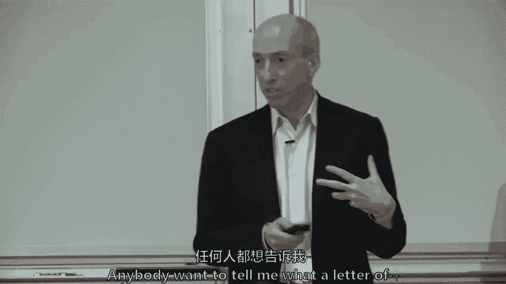

# 【麻省理工大学公开课】区块链与货币 - P21：22、贸易融资与供应链 - 闰土聊Web3 - BV1sL411N7Mm

今天我们将探索其中一个用例，那里实际上有很多活动在进行，在区块链技术贸易金融中。

我们也有，我认为最终项目中至少有两个小组正在做贸易融资方面的事情，可能有些人还没有向我透露这一点，或者今天之后可能会转向它，你永远不知道，我想你们中的八到十个人今天写了自己的作品。

所以你们中的十五到二十个人在贸易融资上花了很多时间。

我想原因是，底层技术有很多应用，这就是我要努力做的，今天是，然后希望得到两个小组的帮助他们有一些最终的项目，你们中的许多人今天写了这篇文章，什么是贸易融资，所以我们要跑过。

我将从我的角度向你们介绍什么是贸易融资，然后我们将进入区块链项目本身，所以我们跳过这些，因为我们要聊聊。

贸易融资到底有什么属性，嗯，阿尔法你有一个小组，贸易融资有什么属性，是什么吸引了你，正在变化的多个利益相关者，那是大数据和信息，我刚刚听到了两件事，多个利益相关者转移了大量数据，其他人，还有什么属性。

两个报告出口商之间转移了大量的文书工作。

开证行和受益行，所以不仅是数据，但实际上仍然有很多文书工作，实际上经常是实际的物理文书工作，还是有公司，我是说他们，他们现在不像几年前那样执着了，他们被称为文件快递员，这实际上把文件带到了全球。

有不同的规定，和不同的国家，很难看到，信任一个中央当局，它会给你所有你需要的，但也有不同的国家，所以你有一些信息不对称，因此在这些司法管辖区之间存在信任问题。

随之而来的还有很多欺诈行为，大量的反击能力和在空间中覆盖的双手枪，所以很多欺诈和双重支出或贸易融资，它实际上有另一个术语，但它基本上与双重支出是相同的概念框架，我能为一套商品融资吗。

横渡大西洋或太平洋的货物，我能资助两次吗。

所以这有点欺诈，也因为成本高，以及所有的尽职调查，像很多中升起来，很难，就像时间得到它，就像因为金融危机，那么你认为中小企业有困难的原因，你刚才说，还是有更广泛的事情发生了，甚至几个世纪，新来的。

我不知道，更像是来自，比如小额融资，他们无法访问，我需要，就像他们需要他们的业务需要，我不知道是不是有人举手，或者你把头发整理得很好，好的，我本想说小企业，通常就像没有行政资源来处理文书工作一样。

经常被转移的运营负担对他们来说变得如此昂贵，对他们来说，交易不再有利可图，还有小企业，如果你想添加好，他们只是没有信用记录，所以银行往往不想为他们融资，他们只是不相信他们为他。

然后我想列出一些数字让大家明白，我在看亚洲开发银行的一份研究报告，他们大约50%的贸易融资要求被银行拒绝，或百分之七给跨国公司，这么小，中型企业也较小，他们不那么出名，你是贸易融资，从定义上来说是跨境。

这是跨国管辖，怎么会有人在，你知道肯尼亚有一家小企业，或者选择你的国家，中国和墨西哥，嗯，所以有很多信息挑战，这已经是这个行业很长一段时间的历史了。

好吧，我们将推迟正在进行的项目，但我们会回来的，所以我们有很多读数，我更新了这个，因为它一直在变化。

我希望如果你有机会深入了解贝恩·贝恩的评论，我想随着这些作品的发展，它可能比一些，我很抱歉你们中的任何一个去咨询汤姆，你知道的，但是但是但是随着这些事情的发展，我认为这比德勤和普华永道的一些报纸要好。

还是很有帮助的，但我觉得这个更详细一点，那么背景是什么，经济背景，这只是来自，我想这是我从世界银行的一些数据中得出的，服务是五六万亿，但贸易融资实际上是围绕商品出口而不是服务出口。

我不太熟悉服务上下文中的它，嗯。

燃料农业，你可以看到所以这基本上是，它的身体，和国际金融筹资问题，我故意用文字，这是国际贸易的融资可以有两种不同的方式，一个是如果银行在担保什么，或者银行通过文件支持它。

这是贸易融资的传统定义，是信用证和跟单托收，有人想告诉我这封信。

这两件事有什么区别，因为我们有一大群人。

举起手来，信用证是给银行的正式信用证，我在提出给，比如说一个专家，好的，所以这是一封正式的信，批判性地列出条款，它在干什么，消除反二元风险，这是对手风险，从你的布景或你的买家到银行。

因此它消除了交易对手的风险，它保证，但银行支持这个市场还有第二种形式，一份非常大的明智的文件，毛圈收藏，熟悉DCS的人，基本上银行在移动文书工作，全球范围内令人难以置信的文书工作，我们将深入探讨这一点。

他们不是，他们没有承担交易对手的风险，但他们在文书工作方面提供了巨大的服务，从本质上讲，它是文档对性能或文档对身份验证，这有很多不同的方式，分解和晕倒，并不是说这是一个关于这些术语的测验。

但这些是不同的术语，保理是当你出售应收款时，短期应收款，没收是当他们是长期的，所以它们有点像，但一个是短期的，应收款，短期信用证，一个或更长期，你实际上可以把进出口贷款拿出来，嗯，长期的。

它们是关于整个库存和整个供应链的，你可以提前获得融资，你真正为整个供应链提供资金，但我们将主要关注前两个，这个领域的大多数区块链项目都集中在前两个，但国际贸易也有贸易信用，什么是开户。

这在任何行业中意味着什么，当我们在斯隆，某人的，Elenen，我不打算去拜访你，我不会逼你的，我把它换了，当你装运货物时，在被画出来之前，所以说，你们装运货物，付款前，是会费，所有的权利。

九十天后的皮多，所以让我们看看，九十天后，开户是大多数企业所做的，如果你只是说，我在运送一些东西，寄了一张发票，它是一个，条件可能是二三十，你可以得到百分之二的折扣，如果你及时付款，但三十天。

开户就行了，在国内业务中，这就是大多数服务是如何提供的，货物是如何作为开放账户运输的，这是国际出口业务，你会发现它不同于预付现金，当然是听起来像什么，寄售是出口商实际运输的所有其他方式。

你会把它放在你的架子上，你就不用付钱了，出口商继续有出售的风险，在国际贸易中使用不多。

这就是这17万亿美元贸易的整个世界。

所以说，这个范围，这给你一点味道，你可以想到的是，对出口商来说最安全的是这里，出口商将有最多的安全，如果他们提前拿到现金。

但是像那样的进口商，不是真正的进口商真的宁愿托运全程有风险，在另一边，寄售会说出口商承担所有风险，所以都是商业术语，但你可以想到。

就像这的另一边是，对进口商来说，最没有吸引力的是提前支付现金，对出口商最具吸引力的是预付现金，每一个都发生在一个17万亿美元的市场中，17万亿美元的出口，所有这些都是可以谈判的。

但想到出口商喜欢这条曲线，进口商喜欢这个，正如我将在一秒钟内展示的那样，大部分市场在中间，所以现在交易，金融。

你很快就要做什么，有很大的空间，也许是为了区块链技术，因为有很多运动部件，顺便说一句，正常情况下，如果你在墙上工作，街头或商业银行，你可能永远不会接触贸易融资，就像一个部门，如果你在交易大厅。

你不是真的想很多，他在这里的交易大厅工作，你有没有想过贸易融资没有。

但这是一个很大的市场，这是一个很大的市场，但基本上进口商，进出口声波合同，那是用来销售商品的，可能是油，可能是农产品或制造商，进口商，然后与开证行安排信用证，信用证被寄回给出口商。

有时出口商的银行对它提供第二次担保，出口商的银行实际上可能在担保，进口商银行的表现，数百种不同的安排，但最经典的是进口商会收到一张信用证，你看，你不了解我，但你可以冒这个险，我收到这张信用证。

你的出口商会根据一些单据得到你的钱，当你把一些文件放在一起寄给我的时候，你实际上把你的石油或农产品放在船上，所以运输是很大的一部分，第二块是，文档实际上是如何进行的，出口商随后装运了一些东西。

装运通常会导致一些单据，在装运时，你看这个小盒子里的第六个是出口商，当他们运送东西的时候，也寄一些文件到他们的银行，他们的银行把它寄到海外的银行，肯尼亚，让我们说，即使那是，埃塞俄比亚，你有端口对吧。

你有肯尼亚有港口，对不起，你是内陆的，所有的权利，对不起，所以我做对了，所以肯尼亚，我搞错了，但肯尼亚有港口，嗯，但是出口商，同时他们的运输也会发送文件，但是把文件送到他们的银行。

他们的银行把它寄给外国银行，外国银行说啊哈，触发信用证中的条件，货一上船就可以付款，货物到达国外时可能需要付款，所有这些安排都可能不同，所以这给了你一种变化的感觉，据估计，在1970年。

信用证约占所有贸易的一半，现在，它们大约占世界经济论坛贝恩纸的15%，你有阅读或略读的乐趣，或者你明天再看，嗯，但是信用证，作为市场的一部分，主要公开账户在市场上的份额已经扩大，我觉得，部分原因是。

现在的国际贸易可能比过去更受大公司的支配，在二十世纪七十年代，即使是大公司也不知道他们是否可以相互信任，较大的企业，大型跨国公司，我真的更愿意在公开账户上交易，并延长彼此的信用。

而不是利用银行系统来保证他们的信用，但是贸易融资仍然是一个很好的选择，称之为15%到20%，这仍然是相当大的数字。

这是关于贸易融资的一些问题，在我们开始谈论区块链项目之前，它是如何适应的。

我想我还有一件事这里有所有可以参与的各方，只是为了迷惑我们，全部，以下是一些文件的列表，这甚至不是一个完整的列表，我去了一个法律网站想知道所有不同的文件，你可能有，有人知道吗，什么是提单。

这是某种收据从，呃，为最好的承运人运送他们的货物，呃，无论谁拥有那帐单女士都有权认领货物，所以它就像一张仓库收据，记得我们说过货币的起源是围绕着仓库收据，因为我可能会把我的玉米、小麦或黄金。

仓库里的青铜，最初的提单，尽管这个定义已经发展了几个世纪，最初的定义是，就像船上的仓库收据，你把你的农产品或货物放在船上，你有提单，因为它在船上，你实际上可以喜欢那些原始形式的货币，仓库收据。

你可以卖掉提货单或者贴现来赚钱，所以提单已经有几个世纪的历史了，也许几千年的历史，类似于仓单，本质上，你可能会想到提单，一点点作为一种货币形式，但我列出了什么只是为了好玩，50份不同的文件艾琳。

假装其中一个说爱有多容易，伪造这些钞票有多容易，认领别人的货物，很好的问题，所以是不是又早又早，这可以追溯到几个世纪前，有很多关于伪造的欺诈，提单，或者汇票，所以你所拥有的是，在密码学之前。

你有很多形式的公证人，很多形式的公证人，在那里，各种运输代理和托运人必须真正有印章，以及说这是一个承诺的方式，Leonardo，我觉得，部分问题是每一个，这些文件很容易伪造。

这就是为什么这个系统在文书工作方面变得如此繁重，因为他们开始建立很多步骤，保证你知道你可以跟踪所有这些东西，确保你只是扭转，把这些东西弄到，这就是为什么许多人认为这实际上是一个更好的。

或者实际上区块链技术本身，很多多方，虽然我只列出了七个，你可以有多家银行，你可以把进口商要回来，出口商回到他们之间，你可以开一家代理行，所以至少有三家银行，有时甚至更多的货运代理，托运人，两国海关人员。

詹姆斯的问题，嗯，这么多派对，很多文件，欺诈几率高，保证验证和验证，是这个市场的一大部分，那么问题是，你能把人放在中间吗，看到中间那个小区块链，有点可爱，所有的权利，我和我一起笑了一点，你知道的。

这就是问题所在，所以多方参与，验证对经济学中的所有工作流都至关重要，它依赖于大量的文档流，这是基本的，你知道的，这就是今天的讲座真正想说的，嗯，不管你是在看医疗保健记录，你是否在考虑商业地产。

你在想物联网，提醒自己贸易融资，因为这可能是最好的用例之一，至少对于权限区块链，你可以争论它是否可以在传统数据库上完成，但是多方，大量的验证和验证是很重要的，很多不同的文件，而且涉及产权，批判性地。

有关键的产权，因为当你在高种子上运油时，或者在公海上运送这17万亿中的任何一部分，人们想用它来融资，我毫无疑问要更好地理解这一点，这有多不一样，从旧金山到波士顿送一个好东西，从某种意义上说。

为什么这是一个问题，我们需要所有这些文件，我们需要把区块链的文档，或者我们能不能把狗处理掉，为什么我们在我们的内心没有看到同样的东西，很好的问题，尽管贸易融资这个词已经有几十年的含义了，也许几百年。

国际贸易，国内贸易也是如此，尤其是当你要去的时候，就像你说的，旧金山至波士顿，你可以在……和……之间开信用证。一家主要的国内制造商和波士顿的一家小企业，所以他们可能会说我不想接受抱歉，乔，退出。

你知道的，但你是那个小制造商，你是波士顿的那个小实体，汤姆不愿意承担你的信用风险，你仍然可以想要一个信用证，从技术上讲，它不会被称为提单，如果不是在船上，尽管这个术语有时被用来，但是。

可能发生在国内贸易中，但大多数国内贸易通常不是以公开帐户进行的，但有些是用信用证做的，尤其是如果是小企业，那有帮助吗，是呀，但我在想，为什么我们需要，在一个案例中，在另一个案例中，还有更多。

我认为两者都适用，它更适用于国际贸易，因为你有更多，更多信任的挑战，我甚至会说信息不对称，如果你坐在中国，你向肯尼亚出口，你很少有机会真正了解当地社区和你在中国的银行，也不认识他们，所以是什么来满足。

这些信任问题是银行业在很大程度上得到了解决，那个，要么为单据担保要么为信用担保好了，也有话要说，比如边境管制，对呀，就像我知道的那样，在我的实验室里，我们有一些废物从国际上运到我们这里。

就像海关人员一样，真的很在乎那个，像这样，你得给它定价，即使它没有价格，就像，如果你能把东西放在车上，从旧金山开到波士顿，然后也许就像是的，如果你能从加拿大开车到美国，但就像有一个。

我认为信任问题出现得更多，我不是说它不存在于国内贸易中，它肯定存在于国内贸易中，但国际贸易很久以前就创造了一个处理不同语言的系统，不同的文化，征税制度，它在船上，更多的反钱洗衣。

所以还有其他的规定是这个过程的一部分，使它变得复杂，一个，你赚了很多钱，你需要确保你没有违反不同司法管辖区之间的任何规定，但我认为看着这个问题，似乎我们在使用一种技术，在这种情况下。

区块链适合于现有的事物如何工作的框架，但这个问题不应该被翻转说，稍等一下，我们需要区块链在一个更好的硬设计的系统中吗，有50个不同的文件，实际上思考，实际问题。

我可以理解信任的意义可能需要区块链解决方案，但其中很多是卡车收据，铁路收据，远期车辆收据，那些都是历史遗迹，肯定有区块链以外的技术可以解决这个问题，嗯，也许区块链技术正是合适的技术。

在21世纪出现的解决这个问题的方法，比最初的纸片和字面上的文件快递员更好，这些快递员必须被信任，呃在路上做，渡渡鸟很好，它们还没有完全消失，渡渡鸟，同时，我认为区块链有很多话要说，这在各方中建立了信任。

可能天生不信任对方，在我看来，这个问题，有很多事情不需要发生吗，在这个时代，就像你提到的，本地邮递服务，它在发送者和接收者之间，在这两者之间发生的事情被UPS或任何人跟踪，但我们看不到的肯定看不到。

当它发生的时候，所有的事情都在清单上，但它是一个，在国内你可能是，你可能是对的，但在区块链技术出现之前发生的事情是数字化，但部分交易无法实现，在证券业务中见，我们谈论过的，当我们谈到证券的清算和结算时。

股权已经非物质化，它开始发生在20世纪70年代，你拥有现金流的合法权利，称为…的股权，这种贸易的一部分没有数字化，公海上价值17万亿美元的实物，所以我仍然认为你需要，这表明身体上的好处已经在船上实现了。

或者在某种货船上，所以有一些区别，埃里克，许多手工过程分离项目在一开始就失败了，因为他们真的这么做了，他们试图准确地反映手工离线世界中发生的事情，进入数字化世界，这导致了许多低效率，而事实并非如此，呃。

我们实际上并没有试图使用区块链技术来完成离线过程，那不是另一种选择，但这实际上让我思考，我想指出这一点，关于集中数据库的论点，集中式数据库已经存在了六十多年，他们将手工过程数字化已经有一段时间了。

那么问题来了，为什么他们还没有把这类问题数字化，答案是因为这个，这个贸易融资问题有其特殊性，这使得它特别适合用这些特定的技术来解决，所以这就是为什么我会，我认为现在，你觉得怎么样，这种特殊性，正是事实。

你有多个利益相关者处理这些运动部件之间的信息，你有很高的信任成本，所以你实际上在做的是使用区块链技术，允许或以其他方式应对这一具体挑战，你也有财产权，当它在公海上时，人们经常想借它，但我同意。

区块链技术很可能不是解决这个问题的唯一方法，但它确实感觉它在一个特别肥沃的地区，我们现在要转向一些项目，在这个空间里有很多项目，然后我们会回到英杰华是我们的首要目标，这里，修复先前的，修复复杂性。

更高的目标是什么，嗯，这是个很好的问题，所以那些在项目上工作的人，更多的是关于欺诈吗，或者复杂性，大约效率，是的，复杂性，我想是事实的作用，这样你就可以，你可以提高效率，也就是复杂性。

我认为这是首要目标之一，是驱动效率，也降低了欺诈或欺诈的损失，两者都是，但我认为这更多的是由我对这次欺诈的解读所驱动的效率，更多的是效率，欺诈的原因是什么，我不知道欺诈的权利，这是个好问题。

我们看看能不能找到，英杰华会是下一个，假设贸易融资确实向区块链过渡，然后更多的是私人区块链，然后我们如何解决互操作互操作性的问题，我能拿着吗，因为这是一个很好的问题，当我们谈论IBM的一些项目时。

会提到这一点，尤其是与最大的托运人之一，所以这是正确的问题，但我们要谈谈当我们谈论，我能谈谈一些项目吗，还是有什么，那么我们在哪里，有五大财团，你可以看到其中两个在后面或在Corda上工作。

那是R四分之三，我们本学期早些时候谈到的，IBM上的两个，一个在一个在一个ping上，在群里不是，我们今年早些时候没有谈论过，应收款项和付款担保融资有点不同，我们已经有应收账款了，我们如何资助他们。

监测未结交易和信用证，然后香港集团是供应链和记录保存，如果你想看的话，有点视觉上的，这是参与每个财团的所有银行，你会看到基本上有一些重叠，我觉得，除非我弄错了，i和g可能在其中几个中。

我想其中两个财团现在可能已经合并了，但它走了一点，它不是，它不能完全回答你的万岁问题，但即使有五个不同的财团试图解决这个问题，在不同的银行集团之间，在某个时间点，真正获得更多的效率，他们是如何运作的。

他们如何交易，现在他们显然都不想放弃经济租金，他们不想把市场支配力让给某些人，他们不想，突然发现某个企业家在向他们收费，因为他们创造了一个网络，因为那个，一个很早就发现这一点的财团。

价格可能非常接近他们的成本结构，但后来可以，价格会更高收取很多垄断或经济租金，嗯，所以我不知道这会在哪里解决，我甚至不知道，他们会想要解决他们之间的互操作性问题，肖恩有趣，呃，财团的发现。

所有在那里上市的银行，或亚洲银行或欧洲银行，没有一个U，S的银行实际上是和U一起参与的，s银行，我叫一个，你看到了什么，JP摩根，蔡斯，现在谁是世界上最大的贸易融资发行者，那是什么不是美国政府是不不不。

我想是，我想是单纯疱疹病毒，我不是，我可能搞错了，我想是你认为也是汇丰银行，但你是对的，五大富国银行不在上面，要么，他们是，这并不意味着他们不在做其他项目，因为这里有一些其他的项目，这些不是财团。

我只是给你一个味道，这个空间里发生了很多事情，你们中正在做最后项目的人，我向你挑战，你知道，思考这些项目并说好，你推荐什么，那是不一样的，你知道的，不只是我也是，但我太有钱了，不是其他我太的东西。

这对我来说很有趣，有另一个财团不在那一页上，我可能念错了，好的，你熟悉吗？我想这只是一个发音，1。谢谢你帮我，我需要它来验证，单据及付款，所以他们不是真的说，我们只是贸易融资，但我们要验证所有的文件。

这更多的是欺诈，我认为这个项目验证了文件，说好，它们是真实而美好的，你可以凭这些文件贷款，很多时候这些文件是提单，更不用说汇票了。所以很多项目我只能找到一个，可能还有其他人，我只能找到一个有令牌的。

我最后把它放在那里，以太坊共识。

乔·鲁宾经营的公司，谁是风险投资加拿大人，风险投资家，他帮助支持滑石布特兰和以太坊的共识，至少有三四百人在共识中工作，做基于以太坊的项目，所以我很高兴看到，我可以找到一个本地基本令牌，但据我所知。

所有的财团和我列出的所有财团都是允许的，区块链，据我所知，但我很好奇，你们这些在这里工作的人，你找到什么了吗，这里没有被验证，这是媒体实验室的一个项目，没有一个没有本地托普斯，但使用无许可区块链。

现有无许可区块链基础设施，仓库接收用例，所以他们现在正在使用比特币网络中的交易来写，但只要验证一下，我有令牌，否，我是亨利，是啊，是啊，是啊，是啊，阿德琳是什么，我认为他们建立在我们从塞西尔的研究之上。

好的，铜绿，是呀，那正是，是啊，是啊，卡蒂诺是一个人，是啊，是啊，哥们，你的研究是对的吗，是啊，是啊，太棒了，但你是如此，你很高兴和埃里克谈话，但你没有代币，你不需要代币，这才是重点，就像外面的比特币。

这是一个伟大的系统，你可以在它的基础上高效地构建，为任何允许的，所以不要存储智能合约，必然，除非我知道，也许有一个，但在很多事情上，这不像数字身份，比如说，哦，是啊，是啊，有另一种选择。

但如果你在里面放一个代币，然后把它卖到牛市里，我想你不会坐在这个班上，但我的意思是我很高兴你没有把一个令牌，我很高兴你在这里，但我是说这是喜欢的一部分，你是说你不需要它，作为一个技术和商业点。

这就是你所说的。

Leonardo，是啊，是啊，我刚想说，我碰巧知道，从事这个项目的几个人，他们中的哪一个，最后一个，你能给我们介绍一下吗？

是啊，是啊，所以我不得不挖掘一点本地人，说到你提到的，但那里的大部分培训经验都是基于，为了大量的顾客而去，回到你的观点，商品空间中的洛杉矶观，女人的石油是，是交易最活跃的，他们经常易手，最好的其实是。

如果我能添加到这个，因为我对此有所了解，当我在美国商品期货交易委员会工作时，公海石油提单，DS可以交易数百手，如果不是上千次，从，到休斯顿的荷尔蒙海峡可能会改变一个。

我不知道15天或30天的旅行要花多长时间，是一次二十天的旅行，它可以改变所有权数百次，所以这些文件变成了可交易的商品，这不仅仅是理论上的，这是非常实际的，所以我要说的是，我怀疑当地人的谈话一定是某种。

所以阿尔法，我试着记住你们组里的每个人，你能告诉我们你在做什么吗，你打算怎么打败所有这些财团，我是说，我想你知道你的最终项目会做得比这些更好，对呀，我们是。

拿着这个，我确实给了这两个小组一个提示，我要去拜访他们，所以这是你知道的，只是但是是的，我们采取的方法非常具体，所以我们关注的是中国出口之间的狭窄走廊，进入埃塞俄比亚，所以显然有很多人在看那个空间。

至少现在还没有，是否涉及贸易融资方面？或者我称之为供应链方面，贸易融资贸易融资，是啊，是啊，所以我们认为它不仅在埃塞俄比亚特别有趣，因此，国内银行系统得到了发展，埃塞俄比亚和整个东非的国内银行系统。

我会说，因此，在那些进口沉重的经济体中，对贸易融资的依赖，我想更高，所以我觉得痛点更强，詹姆斯你有问题要问他们吗，有人向小组提问吗，蜂拥而至，他们会接受这个建议，但不是具体的，但更多关于澄清。

所以我可以清楚地看到贸易融资需要不同的各方，供应链上任何时间点的货物所有权都很重要，尤其是当它变得商品化的时候，像Oya之类的，但随着时间的推移，很多时候我听到人们说。

区块链在这个场景中的使用主要是在供应链上，考虑到他们并不是真的用它来换钱，实际上有没有关于供应链的真正有用的用例的商业案例，在区块链上，我是说，追踪我的咖啡豆从何而来，在区块链上，对我来说没什么用。

但人们似乎对此喋喋不休，那是件好事，我可以追溯到什么地方你是个喝咖啡的人吗？是呀，不是因为你的课，不不不，我只是说不，在我班上你也可以喝茶保持清醒，就是这样，但这些，但我就是不明白。

当人们一直在谈论供应链，需要在区块链上，我只是不明白为什么这对待金融，绝对没问题，你被卖了，在大家都进来之前等着，有人对中国埃塞俄比亚贸易融资有什么建议吗，嗯，我要给大家一个机会，在詹姆斯的问题上。

但是是的，你是中国埃塞俄比亚贸易融资的互操作性，我是说有什么解决办法，开放程序基本上只需要购买这些公司使用的任何系统，所以检查其他公司是否使用信用证，所以这是一个规定，所以现在一切都是完全手工完成的。

所以我们会提供一些非常非常具体的东西，像E提单，否则他会成为开票平台，我觉得自己像个聪明的合同，我的印象会更容易得到，埃塞俄比亚公司购买这个新系统，而中国公司可能有多种选择和多种制度。

那么你如何把它们具体地放在你的系统上呢，或者能够将您的系统与其他任何东西结合使用，所以是的，所以我们同意，所以我们必须让埃塞俄比亚的企业和银行进入系统，这样他们就会成为我们最初的客户。

对于任何想做生意或出口的中国国家来说，你必须经历，所以说，你永远不相信他们会经历这些，所以听起来你在试图建立一个解决方案，您的领养是通过进口商方进行的，最初通过埃塞俄比亚一侧，然后中国出口商会说好。

这就是我如何更安全地进入埃塞俄比亚市场，也许更有效率，但肯定更安全的方式，关于这个项目的其他想法，我以为那里有一个新的财团主要是中国托运人，和，那不是在那个漂亮的，也不是这个，这不是第一个，人民。

第一个不，这家有几家中国航运公司，所以它很新，就像十一月，第八或第九次，或者它发射的东西，所以才刚刚开始，他们在找小贩，然后，是啊，是啊，所以你财团，是啊，是啊，这是，这是最活跃的之一，它一直很活跃。

大多许可区块链技术，但它是最活跃的，你知道的，如果你不得不说概率加权，在这个领域会有成功的东西，可能比其他一些空间更多，嗯，那么谁想加入詹姆斯的供应呢，你要跳进去的这个单元。

所以我只想说这里只是一些运输的两个例子，我刚刚举了五个供应链项目的快速例子，但是埃里克，你想和詹姆斯说话吗，就是，你喜欢咖啡吗？比詹姆斯还多，说，我会，我将是它成本的一个很好的例子，比如说水果，我们有。

你有一个大的零售商连锁店，我认为例子是配料，你有，突然你有报告说突然感染了，在特定的水果中，好的，所以作为一个很好的负责任的措施，你必须零售商必须折叠，实际上必须知道水果槽的哪一部分是，是受影响的那个。

所以说，自从极地过程，你知道吗，在六周的巨堆中挖掘，这些家伙得忍住一大把食物，他们最终会，然后迷失在，你知道的，所涉经济问题，所以它是如此等待，等待塞莱斯特到达那里到达那里。

所以让你的供应链为我提供区块链可以让，你可以让你在几个小时内快速获得信息，并立即识别哪些是受到影响的，用降低的经济成本把它拿出来，所以我们至少还有三只手，我们就去，是啊，是啊。

所以我倾向于同意詹姆斯的观点，所以我听到了对将区块链用于供应链的批评，像血钻这样的东西，或者你知道防止假冒商品或任何钻石，我们必须我们必须是对的，是啊，是啊，所以我知道这些家伙，我知道这些家伙在这么做。

但我听到的批评是因为这些不是数字原生的，你知道在现实世界和区块链之间必须有一个接口，有一个很好的数字世界指南，我从批评家那里听到的，它是在这种欺诈或伪造的起源点，无论发生什么，它是数据需要发生的原点。

所以是垃圾进垃圾出，我们有假货，但随后通过供应链，所以西蒙·拉希姆，然后汤姆我要把詹姆斯的，我的天啊，我需要詹姆斯那边的人，也许我能帮上忙就像沃尔玛写作是一个最好的例子，他们已经实施了等等。

但基本上如果一个人这样说，基本上他们在使用IBM的基础设施，如果他们去供应链说，听着伙计们，我们雇佣了IBM，现在，你每次都要送这个，这个好东西可以转移你的手，你要把这些信息发送给IBM，就是这样。

我是说基本上就是这样，因为它存储在一个服务器上，我有喜欢，区块链是关于什么的，就像我，他们，他们，我听到他们说出来，这是选项，但我真的不明白他们，什么，布洛克尼怎么了，我是说，基本上是这样，谁想拿。

谁想替他走另一边，我认识詹姆斯，你不能站在詹姆斯的另一边，我觉得这有点争议，但当我在英国的时候，几年前有一些活动家在谈论武器的起源，以及一些战区走私武器的地区，这将是美国和英国。

如果你能追踪到武器的来源，在战区，你可以知道它是如何在那里结束的，你可以和我说话，我首先需要信任数据输入，你必须，在这种情况下是不被信任的，它会被信任，因为制造商，大多数制造商会，我撑不住了。

因为我想让汤姆，然后我会给你一个答复，汤姆，是啊，是啊，所以我在另一边，我想它起作用了，它可以追溯到，艾琳最初的问题是这是否是为了解决欺诈，或处理系统的效率，数据输入相同，我是说。

如果来自纸质系统或非区块链数字系统的数据输入，或者区块链系统不好，那么它是它总是会是坏的，但如果它是好的，如果像现在这样好，可能会像RFID一样好，切碎每一个单独的产品。

那么它所做的就是让同样的记录通过整个供应链，所以无论什么数据输入系统都认为这是一个冲突，免费，钻石被啤酒看到了，出口商，制作人，港口，货物的最终进口商，所以你可以节省现在的验证成本，通过处理铁路收据。

跟踪收据，装运收据，转发交换收据，通过使同一文档可见和不可变，对所有坐在椅子上的合伙人和谢尔曼的问题，我认为你提出了一个正确的问题，基本上很好，为什么不只是一个传统的数据库。

IBM是超级账本织物的软件提供商，为什么不直接把信息给IBM呢，事实上，也许这就是沃尔玛正在做的，是你说的，那是我的，现在，我还不够深，当你浏览这些网站和新闻文章时，和白皮书。

你不太清楚他们是如何使用IBM的，IBM，我想他们部门有一百个人在做超级账本项目，所以他们就在外面，IBM正在营销这个，但我认为至少理论上是这样，因为我无法回答，沃尔玛到底在做什么，理论是。

数据实际上是在多个节点上共享的，这更能抵抗审查，即使被允许，即使只有十五二十个节点，三十个，节点，它更抵制审查，如果它存储在IBM服务器上，我不知道答案，沃尔玛是否真的存储在30个不同的节点上。

但如果是那时，那么可以说，即使它是允许的和私人的，它更抵制审查，你可以对这个有更多的把握Viva的挑战之一是让房间开着，互操作性是第二个交易镜头。

这个公司怎么发音？Mercs是最大的，它是世界上最大的两三家航运公司之一，他们想出了一个项目，他们宣布了这件事，已经一年半了，没有领养，因为其他航运公司说，2。我为什么要和你一起去领养呢？那是一回事。

如果一些中立的标准制定者几乎就像在互联网上，图标什么的，但是一些中立的标准制定者想出了一个财团，世界上所有其他的托运人都说，我不想放弃沉浸我的数据，我的信息，也可能是市场力量，所以互操作性也在那里工作。

好吧，詹姆斯想要一个答复，但你没事吧？好吧，所以我们从我的路上拿两个，还有另一个问题，更多的是关于它的经济学，也可以，让我们这么说吧，呃，像你这样的沃尔玛领养，你基本上现在。

我们可以强迫很多供应采用这个，我是说有一个真正的问题，他们会怎么处理这些数据，对呀，因为本质上它的作用，它允许他们访问生产的N，所以芒果的生产是非常分散的，对，但你会得到巩固。

所以链条上有多个步骤实际上提取经济价值，不是种植者，我的意思是他们是不错的权利，但如果现在沃尔玛可以直接卖给种植者，因为现在他们可以获得种植者的数据，生产力是什么，他们生产多少，在一年中的什么时候。

等井，有一个问题是，呃，我是否要合作，或者我想和它分享多少信息，如果我在中间，我现在实际上正在提取经济租金，所以如果整个供应链以某种方式，它不仅仅是一种乐器，那是，是啊，是啊，这是正确的。

这些数据就像Facebook收集数据或Visa收集数据一样，也许沃尔玛会收集数据，我的问题是，以沃尔玛为例，我很想知道，你是否在这个过程的早期就安排了供应商，比如说一个卖给沃尔玛的农民什么的。

他们在区块链上，还是这变成了后端，知道像，i，我想我明白我们所说的了，就数字货币的私钥而言，我试图连接，所以他们有扫描仪，他们基本上扫描和，或者他们的手机什么的，所以你有第三方使用这些链接。

他们基本上不知道这些数据的去向，所以我不打算接受西蒙对它的描述。

我离沃尔玛不太近，我觉得，在贸易融资方面，这些财团，和，在最好的和最好的这些意味着有很多参与和曝光率，因为即使这看起来很复杂，这是他们的大机构，他们是银行，他们是货主，他们是货运代理。

可能除了埃塞俄比亚的中小企业，但有一个进口商需要参与，我认为在供应链方面，沃尔玛，芒果个体种植者，你是说从你的理解，沃尔玛不希望你获得这种优势，为此感到自豪，感到自豪的是，他们实际上可以影响为什么。

因为他们有那种，最后一英里，呃很简单，但他们必须有办法按照汤姆说的去做，他们必须能够以数字形式，有形资产，芒果就是这个，是啊，是啊，但这就像手机，你知道，所以你输入，好的，所以你知道就像扫描一样，是啊。

还是什么，詹姆斯，你想回复，然后我们会回到你的快速要点，我想你相信了吗，否，我觉得，最终毫无疑问一旦数字记录创造了数字的不变性，无论是区块链还是非常安全的标准化标准，传统数据库，他们会一样的，呃。

数字记录是，没事的，但在物理世界中，在供应链的背景下，不管是来自起源还是链条上的任何其他个体，只需要一个糟糕的演员就能做某事，所以一切都很好，但是当你的数字记录是不可改变的。

你的物理和数字之间的联系是不保证的，所以我还是不明白实物商品怎么能保证，从一端到另一端，供应链从未被篡改或改变，这仍然是一个大问题，我是说，你去，是啊，是啊，我想说我不知道这是不是目标，呃。

因为如果你把钻石拿对了，只要你喜欢，人们在购买钻石时关心的只是原产地，但我的观点是，这并不能阻止供应链上的任何人，它只是让它只是让它更贵，可能但是但是你看，我认为你在坚持更高的标准，因为即使是油。

我们回去吧，不是钻石，但是油，在相当长的一段时间里，你可以有一张提单，然后卖掉它，正如我前面提到的，从中东到休斯顿的二十天里，可能会交易二十次，今天一百次，在二十八个市场，没有人真的想看。

石油是否以某种方式从船上被抽走了，它已经不在那里了，所以系统中仍然存在信任的某些方面，当有人证明，当船是，我不记得这个词了，但在船上，当油装上船的时候，然后它就掉下来了，在那些时刻有验证。

然后与数字记录通信，但我想这是一个，你可以通过检查钻石来做到这一点，我不认为你会改变这一点，我想这仍然是一部分，但你能做的是李的早期观点，你可以降低很多成本，你可以提高效率。

你可能可以降低围绕文件的欺诈，是啊，是啊，所以我想我的一个，我想我的意思是，如果一开始就没有信任，或者你得依靠其他信任，区块链到底在物理和数字记录方面增加了什么，这就是我发现很难上网的地方。

但我想我会以一个快速的点结束，我在会议上和某人谈过，既然我们说的是石油，他在区块链的实现中做供应链，我向他挑战，为什么不使用标准化的数据库，他说好，是因为，如果你要让链条上的每个人都升级到一个新系统。

告诉他们要容易得多，哦，区块链，而不是说一个复杂的数据库，我要守住这一点，我同意这一点，但我们有丹和J，是啊，是啊，我只想说，我是说，我觉得这样更可行，呃对于较小的，有点，可能是垂直的。

集成垂直集成供应链，啤酒在哪里，就像，他们拥有这个过程的每一步，因此你可以，你真的可以信任和追踪产品的流动，而是像杂货一样的东西，你有的地方，世界各地的农民，你知道有季节性的变化，所以有很多小商店喜欢。

一种高水平的技术，你很可能是对的，尽管二维码已经被采用20年前数以百万计的零售机构，有点像，这是怎么回事，和，事实上，三十年前，他上新闻是因为他刚刚去世，但是乔治总统，赫伯特，助行器，灌木，有些人说的。

他在1992年的选举中失败的部分原因，他不知道，杂货店里的扫描仪是什么，他是美国总统，你能想象，但他没有，因为他成长在一个时代，这发生在他在白宫的时候，现在你无法想象不知道扫描仪是什么，所以我同意你。

但二十年后发生的事情有时很难预测，是啊，是啊，在此基础上再接再厉，我想如果你完全垂直，那么你一开始就不需要区块链，因为您有自己的数据库，你在跟踪它经过的一切，你区块链的原因是为了可追溯性。

当我们有20个不同的艺术家，而且一旦你把这整件事数字化，我是说现在都是文书工作，所以你你把它像，数字化是允许你使用其他工具，如物联网，所以你可以用钻石为例，利用计算机视觉来实际喜欢，告诉你有确切的钻石。

你从供应链或食品的末端开始，你可以你知道，测试温度，食物之类的东西，所以这也是关于质量的，顺便说一句，你可以用，还记得一开始西兰花的东西吗，您可以使用加密哈希，也可以拍照拍摄关于钻石的其他数据。

关于食物的其他数据，我只是想补充，嗯，尤其是钻石，我读了这篇文章，有点生气，因为我们都知道啤酒就像，什么是最好的营销人员，你所知道的一切，他们让每个女人相信他们需要潜入我们的生活。

他们发明了像钻石一样的概念，所以我认为这是一个完美的营销策略，他们需要钻石区块链，就像整个，就像德比尔，是整个类钻石行业，就像他们把一切都带到了家里，由他们控制，因为人们强烈反对。

例如来自冲突地区或冲突的冲突钻石，原生钻石，所以对我来说，这看起来像是一个大的营销计划，你知道他们已经觉得他们已经控制住了局面，但为了喜欢，购买更多消费者信心，用爵士乐。

我想你说到了营销和詹姆斯的问题上，已经说过了，一点点在所有这些，总之，石油高管说，这是我能被广泛接受的唯一方法，如果我把这个叫做区块链，这可能是真的，甚至澳大利亚证券交易所。

尽管我认为那里有一个真正的用例，但这是关于收养的，戴比尔斯这么做可能是因为他们想卖出更多的钻石，石油高管可能会这么做，因为他只是想摆脱一个遗留的系统，或者澳大利亚证券交易所可能会说。

这是我在摆脱遗留系统方面获得投资的唯一方法，因为我要么吓到我的董事会，说我们要做区块链，或者我可以激励我的董事会说我必须使用区块链，但尽管如此，区块链技术还是会得到一些采用，我想它会有更多的采用。

所以领养的时机比较成熟，我将再次谈到这个问题，你知道我要去的地方就像，是的，是的，你知道的，成本效益，这些是，我这么做是为了帮你们大家的忙，我也是，因为你们都在写期末作业，但这真的是关于。

这将是有多方参与数据的地方，并且该数据表示某种属性，对呀，有些人要么以非物质化的方式赚钱，更容易想象它的钱和安全，金钱与非物质化的东西，就像我们今天在供应链上所做的那样，这有点难，当它与实物资产对抗时。

但如果有多方，核查事项，核查费用，你可能会提高效率，用区块链技术解决方案，好问题，世蒙养得好，等一下，也许你只是把数据传送给IBM，你真的要把它运到，这就是所谓的传统数据库，分布式数据库。

还是你从审查阻力中得到了什么，如果它真的在2030年分享，五百个地方，你降低，正如澳大利亚证券交易所所相信的那样，他们会降低对账成本，这也是提高效率的一种方式，但在那里我不记得号码了，然后降低对账成本。

它仍然是某种程度上受到控制的，那七十七，它不是公共区块链，就像比特币一样，嗯，所以不管是今天在这里做贸易的两个团体，金融，顺便说一句，你有一个更难的挑战，因为你必须超越这个讲座，对呀，是啊，是啊，是啊。

是啊，阿尔法要走了，是啊，是啊，当然可以，你们之间有一些非常有趣的项目，他在想那个值在哪里，添加将降低哪些验证和网络成本，竞争对手在做什么，弄清楚，如果有任何财团在做你提议做的事情。

或者有三五千张白皮书中的任何一张，有ICO代币吗，然后如果你想扇一巴掌，说，为什么他们所做的是愚蠢的，不起作用的，你做得更好，或者你只是想学，只是请，不要抄袭，但只是，你知道吗，也看看竞争对手在做什么。

为什么只追加日志，你知道正确的前进道路，竞争对手呢，现任者，绝对如此，你还在做抵押贷款产品，对呀，我不知道你是否变了，是啊，是啊，抵押贷款市场正在发生什么，怎么样怎么样，不管是证券化的还是包销的。

以及是否是传统的数据库管理，但知道这也很有趣，如果其他人试图查看系统的允许或允许，你适合哪里，你实际上是想在这方面筹集资金，如果我记得，是啊，是啊，所以就你要筹集资金的程度而言。

那些风险资本家会问更棘手的问题，我会问，我希望我希望你不要，是啊，是啊，是啊，是啊，是啊，是啊，我拿到了，你想要便宜的钱，你想让我当硬汉，是啊，是啊，所有的权利，嗯，你知道，有什么权衡。

我不是要求你们解决可伸缩性和性能问题，一些可伸缩性和性能问题将无法解决，五年或十年，但至少要注意，虽然，至少说声嘿，在这个问题解决之前，这是行不通的，或者像那个星期四，我们要做身份，你们在一起，对呀。

是啊，是啊，所有的权利，准备好周四聊天分享，你在哪里，凯莉看起来你星期四要生病了，你会在这里，嗯，你们中有多少人会在区块链上获得麻省理工学院的文凭，我们有选择吗，他们有，是呀，是啊，是啊，这就像。

我们能选择不买吗，我不这么认为，哦，你是说，你觉得你必须，我想这是为你做的，哦，这是为你做的，好的给你，你兴奋的是什么？嗯，虽然，贸易融资17万亿美元，这是一个非常重要的角色。

为这17万亿美元的贸易融资，嗯，很多人参与其中，区块链技术的时机有点成熟，许多财团和项目正在进行中，但它们几乎都是许可系统，只有几个例外。

嗯，但感觉它是改变的催化剂，我认为，即使这只是因为这是获得收养的方式，我说的是贸易融资，然后是供应链管理的相关部分，等等，还有其他问题吗？我们提前休息了，你，你想要，我想好吧，我们早点休息。

