# 【麻省理工大学公开课】区块链与货币 - P22：23、数字身份证 - 闰土聊Web3 - BV1sL411N7Mm

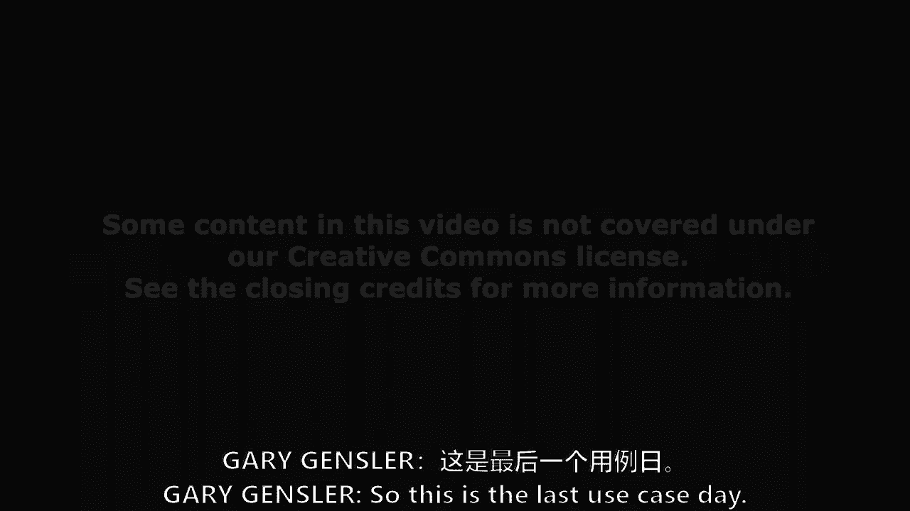

所以这是一天中的最后一个用例，然后星期二我们结束，我知道你们都在准备期末考试写期末项目，所以它在最后变薄了，所以我感谢你们的到来，你们这些还在这里的人，我也想称赞他们，我没有认真看完所有的文件。

但我尽我所能迅速阅读它们，昨晚今天，今天提交的，就像贸易融资一样，他们真的很好，我是说，如果有什么是学习的目的，别高兴得太早，詹姆斯，刚才很好玩，那是什么，是啊，是啊，我读了。

你两个小时前就把它放进去了，我有一个稍微改进的版本，我不认为帆布，就是这样，这将是一个双重咒语，不是吗？一定要送进去，把它送进去，嗯，是展示批判性推理技巧，这项新技术是什么，区块链技术为何有意义。

就像在贸易中一样，财务和身份管理，我们会谈谈这个，但数据确实关系到我们的身份等等，但我想回头谈一下贸易融资，因为詹姆斯向整个团队提出了供应链管理的挑战，劳伦有点安静，但她知道我要去拜访她。

所以这不是一个冷电话，但是劳伦，你想对此发表一点看法吗，在供应链管理部门工作了四五年的劳伦，是啊，是啊，我是说最重要的是我在供应链可持续发展部门工作，有一个巨大的推动，我是说有点像戴比尔斯的东西。

过去有一个巨大的推动，五到十年的时间来增加，比如供应链的可追溯性和透明度，以确保冲突，矿物是为了确保事情不是，你知道在水中使用大量的水，应力区，人们一直在大力推动供应链的透明度。

并试图弄清楚公司如何基本上喜欢审计和评估，他们的供应商可以把它层层带回去，所以现在有一件大事就是一切都完成了，我是说大多数公司都是这样做的，类似摊款，所以每年，比如公司评估他们的供应商。

希望他们提交所有这些准确的信息，希望他们的供应商在整个供应链中也做同样的事情，但它几乎没有透明度，很难证实，四面八方都有不对称的信息，所以区块链我认为是出于可持续发展的目的，因为现在。

你就像希望公司分配适当的时间和资源，就像经历，原材料供应商之类的，但没有真正的、可验证的或透明的方法来做到这一点，所以现在很多人基本上都像，很多客户希望他们的供应商，你知道当他们说，比如我们不使用童工。

或者我们不，你知道来自这些特定材料或地区的来源，但真的没有办法验证，所以像我想的一件大事，区块链和供应链的一个巨大机会正在帮助增加可追溯性，这样你就知道你不是来自童工可以的地方，你知道，理想情况下。

你要去的地方有很好的安全标准，诸如此类的事情我们有我们有，至少，我是说，你还在谷底吗，供应链的极简主义一面，区块链，但这就是这门课的奇妙之处，甚至我读到的八到十份报纸，身份管理。

身份和访问管理系统与区块链技术，我想我没有读过任何零分的书，没有绝对的极简主义者，但你的一些论文转向了这一点，艾琳，她要和我们谈谈，可能在白天的某个时候，我得说你的报纸转向了最大限度的一面。

我已经见过你了，关于数字的某一定义的类，和大多数人想象的完全不同，所有的权利，所以我们要，我们将听到艾琳的消息，也许二十分钟后什么的，但请注意，这是课程的惊喜，他转向了最大化的一方。

至少在一个区块链技术应用上，这也是，我认为正确的地方是这项技术可能会，有效的案例，还有一些只是炒作，甚至可能会有一些数字原生代币幸存下来，在我的思想中最多不会，但可能会有一些，再次。

在我们进入身份和访问管理系统之前，我们将讨论一点身份，但什么是身份，嗯，然后对它们的管理，尤其是在数字时代，印度和爱沙尼亚的一些国家项目，然后一些区块链技术项目，私营部门，本质上，当然。

你们中的一些人可能会毕业，我们会谈论麻省理工学院，麻省理工学院不得不这么做，学习问题是，有什么权衡，自我主权身份意味着什么，区块链技术如何解决这个问题，我们稍后会看到举手。

你们中有多少人计划在区块链上获得麻省理工学院的文凭，顺便说一句，我希望你们都计划拿到麻省理工学院的文凭，但是你们中的一些人来自哈佛和其他学校，所以也许你会回到麻省理工学院，然后有一些读数。

至少从报道来看他们做得很好。

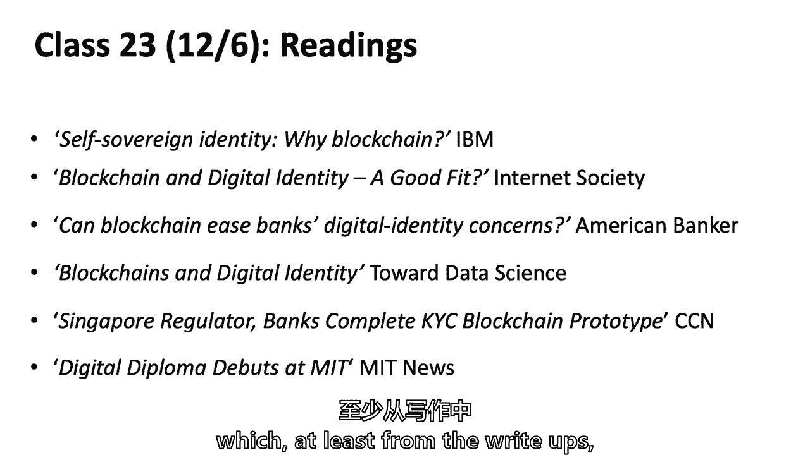

所以什么是身份是一个悬而未决的问题，汤姆，什么身份？我本打算听从今天写论文的人的意见，你是一只鹿，他们说就是这样，我说谁想说是什么，詹姆斯，你今天写了一篇论文，你的出生证明表明你是个人，对呀。

出生证明身份也是如此，你现在说，我不认为你的人是一个典型的身份，因为你也可以被识别，比如说，生物特征或你的指纹，所以不仅仅是你的出生证明，但它是一种身份，就像，如果你去，dmm，你会得到执照。

你需要出生证明才能在Elise出示，所有的权利，但是出生证明，不是什么识别，标识您的标识符，你拿到了，这是证书，对呀，古巴，是啊，是啊，我是说，我觉得这是一个超级哲学的问题，但你觉得这样舒服吗，好的。

所有的权利，很好嗯，我不知道，就像一个身份基本上就像你是谁，目前证明你身份的所有东西都是政府签发的文件，或者像学校发行的文件，证明其他人已经做了背景调查以确保你是，你说谁，你是，呃，刷子刷子。

我认为身份是一种语境，所以有时候可以是约会。

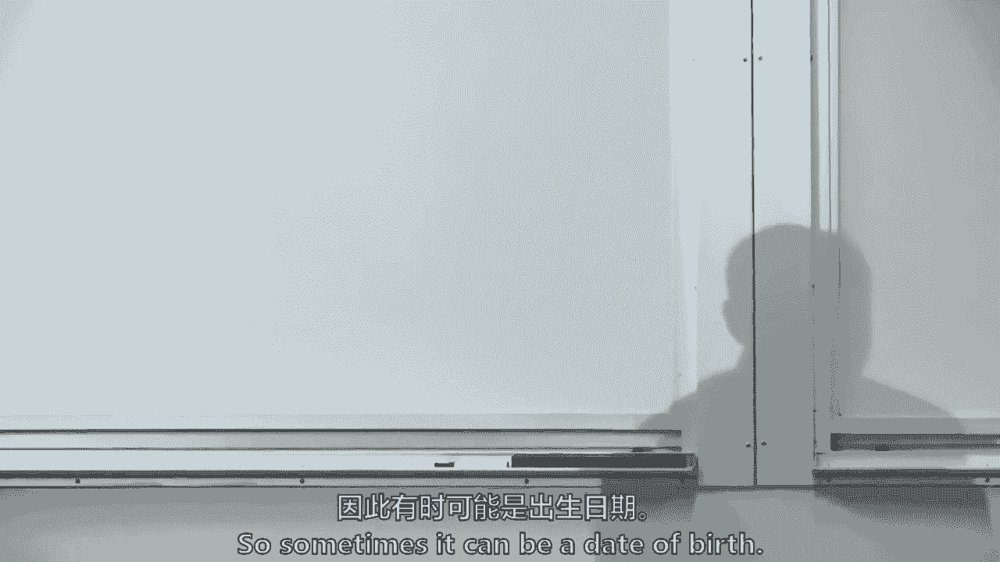

当然，有时它可以是一个国籍，有时它可以是一张脸，这取决于上下文，什么是身份，这是身份要回到，哲学领域的身份将你定义为一个独特的个体，把你和其他人区分开来，对吧，您可以使用额外的仪器，呃到。

为…的目的服务，将你识别为个人，在某些情况下，正如我们提到的，身份是一个人固有的，在我的理解中不是一个额外的人工制品，有多少人同意埃里克，这是一种独特的东西，我同意，我同意。

我认为它必须是你可以点燃的东西，才能成为身份，否则它只是一张纸，你认为什么时候你必须能够验证它，但埃里克说这是独一无二的，这是关于我们人性的东西，这是关于我们是谁，是啊，是啊，我想我是说。

我绝对我的意思是，如你所说，我认为这很有哲理，我想这就是我，就像我的身份就像我的名字，你知道这个出生日期，就像我的眼睛，像虹膜，就像我的手指，就像我就是这样，我觉得你说的更像是，社会如何验证。

就像你就是你声称的那个人，所以我认为我们谈论的是不同的层次，我想这不是唯一的，从某种意义上说，这并不是唯一的，从某种意义上说，就像，就像某人有的特征，但也许其他人也会有同样的特征，但更多的是，是啊。

是啊，作为呃，他只是说，就像，基本上就像有人可以验证，你说的都是真的，就像我们有这些特点，这是你身份的一部分，但这不是独一无二的，从某种意义上说，这只是如此亚历克西斯，你是说你的身份不是唯一的。

还是你在说我的某些特质，但就像它就像特征的集合，特色高等教育，我们要变得哲学，这是如果你想得到一个哲学，我们要做的就是，我们可以说，身份是社会强加给你的。

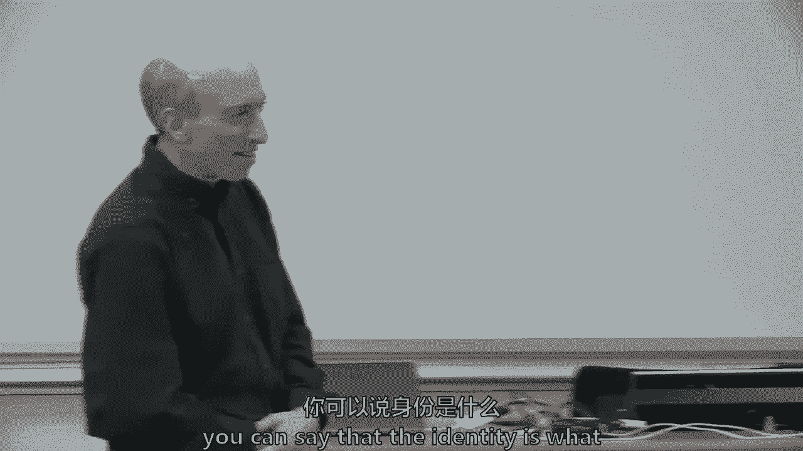

或者社会是由你组成的，因为空间是以自己命名的，名字本身不是，本身没有价值，一些嗯，这是什么，我知道是来打电话给我的，调用构造，所以你是说，不仅仅是你是谁，但社会如何接受你，在商业意义上，在经济意义上。

身份被用于很多事情，我相信，也许这是哲学上的，我相信我们每个人都是独一无二的灵魂，所以这是一个信仰体系，也许，但从经济意义上说，我们有各种各样的属性，所以这些属性可能会被共享，我知道，事实上。

上面有个家伙，我和他分享了完全可复制的DNA，但我个人认为我和他是独一无二的，我有一个不同的身份，你可以猜到为什么你把这个拉在画布上，谁是谁，这不是测试，那是什么，詹姆斯？

我不知道你对你的观点说了些什么，虽然技术上照片的一面较少，你在右边，就像我们在左边看到的，我看到右边了，是啊，是啊，是啊，是啊，你说的对，但你看，我们是独一无二的，不同的身份。

同样的DNA谁有一个人脸识别的iPhone，所以在感恩节，罗布把他的iPhone递给我，他说，你看到了什么，他说看看，我看着它，我说我看到一堆短信，为什么他诅咒，他说他说我把锁着的手机递给你了，所以说。

不管你对生物识别技术和高手机有什么看法，没有成功，或者它确实起作用了，我不知道，所以我把他还给了他，我的iPhone有点旧，我说，你能用你的指纹帮我打开吗？他不能，所以说，只是现在。

我们有许多同卵双胞胎，我父亲的家人，等等，所以他用两个试了一下，同卵双胞胎表兄弟，两个女人，他们也是，可以打开对方的手机，不，他们的人脸识别，不是用指纹，但是有了人脸识别。

所以这只是一个关于身份的小故事，很常见的是，Facebook上有一个功能可以向你展示，照片一览表，你可能会识别出你，所以我一直收到我孪生兄弟的照片，我也是，所以是的，今天的人脸识别很差，我要做一个兄弟。

那么我现在对Facebook还有一件事，但实际上有一个更简单的方法来定义哲学，你知道有这些肉体的人，地球上有数十亿这样的人，一个简单的思考方法是，你想把每个人，我们回来了，我们回到哈希函数，这很好。

但这实际上是你想做的，你想要哈希人，得到一个号码，它的特点是如果你来找我，我揍你，我得到一些数字，如果你再来，我得到同样的号码，所以我知道我在和同一个人打交道，这实际上是一种方式，即使你长胖了。

我可以哈希，因为我可以用你的眼睛，让我们说的权利，那么你的孪生兄弟大概就不会有同样的东西了，我其实不确定，但我不认为他会对，所以现在我散列到，我得到同样的号码，我知道我在处理什么。

这解决了商业世界中的许多问题，就像，我看到了吗，在银行办信用卡，诸如此类的东西，它也解决了问题，你是新客户吗，嗯，你是你的哈希，一个新的哈希，我是你的哈希或哈希，我在过去见过，对呀。

所以这是一个非常简单的方式来思考身份，然后你把哲学放在一边，你假设人类有一些肉体，呃，您可以区分使用某种哈希函数，所以问题就像，如何实现这个哈希函数，所以你要把，你不是真的把哲学放在一边。

你的意思是一切都很好，但你也可以拿一个物理物体，一个人应用哈希函数，密码学手段，并获得该个人的唯一标识符，我有一个反问题，所以假设你把一切都搞砸了，我可以有一个柜台，像五件事的脚，这本质上可能是一回事。

你只有五种不同的散列，对呀，就像它仍然必须来自一个非区块链酱汁，能够很好地，这并不是说它是人类，你没事吧，但就像你能干掉一个人，你还可以复制另外五个假人，有五个不同的假身份和不同的哈希，所以这就是。

这就是难点对吧，你其实不能，如果我把自己搞砸了，我得到了一个哈希，你会很难产生另一个人，当它像在哈希函数中找到冲突时，你有，你很难培养出一个人，与Mind具有相同哈希值的，因为哈希函数是抗碰撞的。

很难上来，百分之百克隆我，比如说，我的视网膜，即使我把我视网膜后面的所有数据都给你，你也有，在你自己的眼睛里产生视网膜是很难的，你可以扫描并假装是我，比如说，这是对付某人的一种方式，只要扫描视网膜。

即使你知道整个视网膜，嗯，这对你没有用，因为你必须把它放在眼睛里然后去那里接受扫描，就像没事一样，很好很好，我们的医疗技术还没到，对不起，我只想说，就像，如果你想把它当成，它甚至不是你的身体代表，对呀。

因为你可以像现在这样改变身体，所以就像你所知道的，你是什么，你有三件事可以放入这个哈希函数，但你应该它应该是，应该是，你说的对，不是你们全部都喜欢，你得非常小心地做，所以问题是密码学是如何让一个人。

因为就像，如果你按重量计算，假设你只是哈希哈希函数是你的方法，那很糟糕，因为你会有碰撞，所以你一定要非常小心，埃里克得到那个，但实际上在你的观点中，你阐述的要点是背后的生物识别技术，整个，不是散列。

使这一切成为可能，生物识别技术，因为你有，你必须把一些东西弄得乱七八糟，对呀，当你说，当你从说哈希的抽象结构，某人，你实际上是在说，你在胡搅蛮缠，一些生物特征，必须是独一无二的才能得到帽子。

这是一种吸引力，散列一个人是对，比如说做一个生物识别，实际上是碰撞，重点是，我们对你来说真的很重要的那个，谈到生物识别，这是正确的，这是正确的，然后问题是，生物识别技术被盗，你是怎么处理的。

你必须非常小心，事实证明你实际上可以，如果你小心的话，这仍然不是一个问题，所以在塔拉看来，对呀，我想这仍然是一个标识符，那不是你真正的身份，对呀，因为就像你们说的，就像你可以，你现在可以复制某人。

假设一千年或十年后，也许这是对的，这是正确的，或者喜欢，复制某人的指尖，这是正确的，这并不意味着你在复制他们的整个身份，所以我喜欢，所以我喜欢把某人的身份搞混的想法，打人。

但我不认为这只是触摸他们的眼睛，或者只是触摸那里，这是正确的，但我觉得你越来越有哲理了，我在找银行的角度来核实，银行实际上需要做什么，它只需要把每个人都映射到某个数字上，当你回来的时候。

它需要计算出你是哪个数字，或者如果你是一个新号码，这就是你所需要的，然后你知道，问题解决了，然后顺便说一句，个人数据属性，你只要把这些和那些数字联系起来，这不是一个难题，这是一个正交问题。

你很能解决那个问题，所以让我们创造它，阿莱娜在说什么，就是，他不是在谈论我们的灵魂或我们独特的身份，他说的是验证者或银行可能能做的事情，你可以说现在地球上有70亿人，有一天会有100亿或120亿。

但你可以把它们中的每一个都有一个唯一的标识符，一个哈希函数，其中每一个都不是从DNA上做的，因为埃里克和我，你知道的，和数亿其他人，所以DNA不是唯一的标识符。

我有时会想到的四件事有些报纸是关于三件事的，但有属性，索赔，证书，证明，什么是属性，只是一个的任何旧属性，任何人，那是什么，你的视网膜，也可能是你的年龄，地址，公民姓名，对呀，索赔是，我叫加里。

或者索赔可能是，我太老了，或者我是一个U，China’中国公民，或者索赔甚至可能是，我的银行账户里有五千美元。我是说，有时还有其他形式的索赔，我想我现在没有五千，不，好吧，凭据是我们开始的。

我想詹姆斯提到过，驾驶执照，标识线，公用事业帐单，有时我是说，有数百种形式的证书，我们认为政府的全权证书，证书的历史很有趣，人类最初的数万年没有任何，我们开始有他们，护照真的不是那么古老的发明。

十六世纪，英国国王有一些护照，但这是为了让他的公民在其他国家得到承认，这样他们的权利就会得到尊重，有人不会被搞砸，就像我在君主的统治下，不要，你难道不知道，惹我，但就真正的许可制度而言。

它基本上是在大约一百年前实施的，一百五十年前的任何地方，这不是一个古老的系统，但都是文书工作，我不知道你们中是否有人要求看，祖父母或曾祖父母，或者一个祖先，比如护照，或者那些文件，如果你有的话。

但强烈的纸，事实上，如果它们是十九世纪末的，没有照片，他在20世纪初开始摄影，所以这是一个很大的变化，在最近的三四十年里，数字化实际上让它变得更难，在某些方面，我是说，有效率，但这让它变得更难。

然后认证是第三方验证，这就是艾伦所说的，如果有人能验证你的身份，他们基本上是，我提出索赔，我叫加里，我可能会给一个证书，我的护照出示一下，这张照片看起来像我，一个人看着它，把它排成一行，说好吧。

你可以进来，你可以进入德国，或者我旅行的任何地方，他们不知道我真的，但他们做了一些验证，所以这些是大块的，身份和访问管理系统，功能，这些只是从一堆阅读中摘录的，认证，认证我有银行账户授权，我可以用它。

或认证，我是一个U，公民授权，我可以在这里进入德国，你知道的，所以说，基于某种属性，或者你们中的一些人在生命的某个阶段处理过的事情，你第一次进去递驾照，所以你可以在酒吧喝一杯，我要让它变得有形。

你知道这就像认证，你看起来像那个人吗？那么这个体系中的当事人是谁，用户，服务提供者，身份提供者，嗯，有人想告诉我这个生态系统吗，嗯，阿尔法，你没写，你上次又给汤姆写信了，我没有写身份提供者的想法很有趣。

根据我们的谈话，如果我们在谈论你的身份，成为，你是谁，对于身份验证提供程序，他们正在提供文件，我想那是对的，我是说，在某种意义上，尽管身份以一种更时髦的方式是你是谁，但是是的，身份提供者可以是像。

纽约州，或者马萨诸塞州联邦，出生证明，死亡证明书，结婚证，发明我不知道它们在一两百年前就存在了，但是一个属性权威说这些属性会验证它们，他们是同意的中央当局，这是这是正确的。

证书颁发机构尤其是四十年来的发明，也许是互联网，三十年，这篇论文是麻省理工学院在1976年的一篇论文，1976年在麻省理工学院的论文，我记得很清楚，嗯，有人想说什么是证书颁发机构吗，因为他们在所有。

顺便说一句，每次你今天上网，证书颁发机构参与该事务，可能每天在全球1000亿次，这可能是一个数量级，可能一天一千亿次，使用证书颁发机构，艾林，您想导致证书颁发机构，或者我们如何整天上网。

你想知道他们在网上是什么吗，是啊，是啊，对呀，所以在网上你有一堆网站，比如，假设你有脸书网站，你想访问它并给它你的密码，所以如果你有像我这样邪恶的人，我可能会设置一个假服务器，假装是脸书网站。

弄乱DNS记录，让你访问我的服务器，当你键入ww脸书网站时，您访问我的服务器，但你看不出来，域名服务器，是啊，是啊，名称服务器，但无论如何，这个想法是，当你实际上从Facebook。com进行查找时。

实际上非常不安全的IP地址，攻击者可以破坏它，并将其重定向到他们的服务器，所以他们可能会完全复制脸书页面，所以你可能认为你在和Facebook互动，或者你不是，你正在与攻击交互，网站。

然后键入密码或用户名，然后攻击者把它偷走，然后他只是重定向真正的脸书，你会注意到这次袭击这样说有道理吗，这一切都发生在纳秒内，对就这样就这样，这就是所谓的中间攻击，所以你要做的是。

您可以使用公钥密码学来解决这个问题，你说，好的，让我们给每个网站一个密钥对，所以Facebook主页会有一个守护者，秘钥和公钥，所以现在的问题是，Facebook。com有一个公钥。

但是你怎么知道你有Facebook。com的正确公钥，因为攻击者也可以给你他们假脸书的公钥，那么现在你如何区分这两者，这就是证书颁发机构的用武之地，因此证书颁发机构对这些公钥进行签名。

并且您拥有证书颁发机构的公钥，您在公共Facebook。com上有证书颁发机构的签名，你现在已经准备好相信，你在和真正的脸书网站打交道，你可以加密你的密码到Facebook点，www。icj-cij。

com，使用公钥，周围有很多公钥，我不知道这是否有意义，但如此，我们早些时候了解到公钥和私钥是区块链技术的一部分，她只是在用，非对称密码学，公钥-私钥密码学，是在20世纪70年代发明的，然后。

但随着互联网的出现和起飞，它被采纳了，在20世纪90年代有很多用处，到1996年保护互联网，以互联网在TSL和SSL上的安全方式，它的各种安全方式是公钥私钥密码学，在中本写论文之前整整12年。

但用于不同的情况，但是Facebook有一个公钥，你每天访问的所有网站的公钥，实际上有一百多个证书颁发机构，但是证书当局说这是Facebook的公钥，所以当你去你的脸书，或者你去谷歌。

或者你去亚马逊上的商店，你知道你其实很，那是一家公司，或者那是另一种形式的身份，它不是一个有灵魂的人，我认为这不是Facebook的负面影响，我只是不认为网站，但你们可能都有不同的哲学。

我不认为网站有灵魂教区，我不清楚，作为用户如何，我知道我要写他们的网站和认证有时会发生，但我怎么知道我有，我把这个排在有一个，我会试着用通俗的语言来做这件事，然后你把它，有一种交接，那个。

当你发出那个信号，当你试图访问，是脸书吗，你正在访问Facebook，他们给你发了一些信息，包括他们的公钥，你本质上是一个证书，当局正在自动检查，但艾伦会给你更多的技术，让我们用一个更简单的例子。

假设你想去纽约时报，你想读一个标题，上面写着一些重要的东西，比如明天会有暴风雪，显然你想知道你是否在处理真实的网站，在我看来，这似乎是问题所在，那么你是怎么处理的呢，记住纽约时报会有一个公钥。

它们会有相应的序列，所以你访问他们的网站，事实证明，当你从纽约时报下载网站时，关于暴风雪的声明，实际上是用他们的秘密钥匙签名的，所以你验证网站，你得到的你与公众进行验证，你知道只有他们知道秘钥。

所以只有他们才能撰写这些信息并签署，所以你知道你在处理正确的网站，从字面上看，纽约时报给你的每一条信息都会给你签名，您根据公钥进行了验证，然后您从证书颁发机构验证它。

如果你还记得我们今年早些时候做的一点西兰花，具有公钥和私钥的非对称密码学，也有数字签名，所以你现在有两件事，让我们回到比特币和比特币交易，您有公钥，然后有人签署了一笔交易，背后的数学。

它背后的密码学是一个签名，和来自同一私钥的公钥，有一种方法可以做一个函数，检查它们是否来自同一个私钥，以及20世纪70年代发明的东西的核心和灵魂，不仅仅是有公钥和私钥，而且你可以用数字签名。

然后当数字签名与公钥进行比较时，如果它们来自同一个私钥，这是唯一的，所以回到纽约时报，纽约时报，你有他们的公钥，然后每个标题，每条信息都有数字签名，当然，你确实有一个集中。

互联网上的许多集中与这些证书颁发机构有关，只是一个快速的点，也许是为了澄清这是在协议级别执行的，用户不是在，P堆栈是TLAS，也就是上面的安全协议，与HGDP一起工作，是湿的，这样就完成了。

这就是你在浏览器中发现这个小锁的地方，这保证了这是你正在访问的网站，因为整个的变化，呃，包括来自网站的公钥的信息，验证由浏览器完成，你不做任何互动的事情，我们什么都不做，那个小运气有那个意义。

您可以看到哪个证书颁发机构，我只是暂停一下，不仅是为了追溯早期关于公钥和私钥的对话，但是整个互联网都依赖于这些证书，当局和区块链技术可能是一种绕过，并有一个新的范式，因此，对于上下文示例。

我说我想进入我的经纪账户或其他什么，说我忘了密码，或，你知道他们每个月都想让你更换这个或那个检查你的公司，在这个过程中，一个人如何与这些不同的各方互动，当试图验证是您获得访问权限时，有什么意义。

有一个初始层，我们刚才说到你实际上在处理你的，我不知道我要弥补，不管有没有肖，那是对冲基金，而是用，美国银行很好，你真的这么做了，这就是我们正在谈论的，他们是美国银行，你真正要处理的是，美国银行。

你甚至不参与其中，但如果你忘记了密码，还有另一层，他们会问你一堆问题，比如，你知道的，关于谁是你的第一只宠物谁是你的第一只重要宠物，其他诸如此类的事情，但在某个时候，他们会把你拒之门外。

那是您注册的服务提供商，那是美国银行，那就是美国银行有反欺诈条款，我们刚才说的实际上是在互联网浏览器上，本质上，Facebook是一个试图被识别的人，你知道你一天有一千亿次。

全球各地的一些人正试图得到保护，他们知道他们在处理正确的身份，在另一边，我们在谈论人类的身份，还有网站的身份，这就是我们刚才谈论的，让我继续前进，然后我，如果我让你困惑，因为你在问发生了什么。

如果您忘记密码，对呀，比如他们如何验证你，不是，你验证，他们是怎么核实你的，嗯，我认为它还是有点过时，我是说，它它有点像，如果你，如果你忘了你的几次，您使用用户名和密码，当然，如果您有双重身份验证。

他们可能会给你发通知给另一个，你知道短信什么的，但是如果你忘记了密码，那就真的是后门了，有点像说，嗯，你还记得你的问题吗，我从来不记得那些问题，你知道，我是说，谁是你小学的第一个朋友，谁是你的第一个。

你开的第一辆车是什么，但它是粗糙的那些，然后他们通常会为了欺诈保护而冻结你，经过两三次的尝试，几乎总是有一些东西，他们可以把它送到另一个地方，嗯，牙科管理，一些痛点，嗯，什么，我们试图解决什么。

为什么区块链技术可能会帮助我们，嗯，有很多很多的盗窃案，身份盗窃，今年房间里有多少人有他们的信用卡，在二十八年，我们已经11个月了，他们的信用卡必须更换，因为银行联系上了，说它已经妥协了。

只有大约20%的人，我本以为会更多，我感觉我每18到24个月就会接到一个这样的电话，我不知道，也许我购物太多了，或者我的女儿们太用我的绳子了，你的银行余额足够大，可以成为目标，学生银行往往是负的。

你认为就是这样，我只是假设某个商人又被黑了，我是说每当一个商人损失一百万十万或五千万个账户，那么银行系统需要发出这些通知，我在马里兰州主持一个委员会或金融消费者保护委员会。

马里兰州的信用社倡导者来到我们的委员会，说我们需要帮助，我们银行和信用社必须保护大量数据，但每次商家丢失数据，是美国信用社和银行必须更换所有的信用卡，他们觉得有一种不对称，商业不对称。

银行部门首当其冲地受到其他商人的影响，非金融部门，数据泄露，马里兰州应该，这是一期直播，实际上在我们的委员会面前，马里兰州应该改变法律吗，赋予非金融部门行为者更高的网络安全责任，金融部门会说，是啊。

是啊，那种感觉你会在公平的竞争环境中，商人说你不能这么做，在每个杂货店和酒吧，好像是呃，有点不同步，它是，是啊，是啊，我想说像这样的信用卡是公共摄影的完美应用，公众的完美问题。

别把你的信用卡号码给这些人，你的信用卡，你有一对钥匙，您有一个秘钥和一个公钥，你把你的公钥给亚马逊，然后你怎么付钱给亚马逊，或者你用你的秘密钥匙签名，那是你的信用卡，所以没人知道你的秘密钥匙。

在你该死的卡上，永远不要丢了那张卡，解决问题，他们想偷多少公钥就偷多少公钥，问题解决了，SSM也一样，你为什么要分享，我向你透露，你成了麦克斯，几乎我在说加密，这里。

共识普查可能是所有这些中非常重要的一部分，所以所以所以让我打，这样，就大痛点而言，隐私和安全，一堆身份盗窃，伪造的证件回到护照上，或者驾照，或者信用卡，伪造的证书，不管那是什么。

当然还有我们如何在任何时候更新我们的个人身份，这个术语Pi是三个字母，你会在商业中学到的，因为在某个时候，你会经营一家企业，会有人进来，你的首席信息官，说我们有一个漏洞，不幸的是，我们也违反了一些法律。

因为在美国和其他国家，你必须保护某些数据，它通常被称为圆周率，i通常是您需要保护的数据桶，但是每次你更新你的个人信息，怎么，你怎么保持，罗斯，有问题吗，我刚刚有一个关于你在马里兰的例子的问题，我假设。

如果你们的委员会允许银行通过这项规定，也许这是错误的，我们只是个顾问，但如果我们向大会建议，银行不会向商人低头，那么他们试图用语言表达的美元数字是多少呢，我正在试尺寸，这些银行的成本是多少？

他们试图转移到商人那里，从而下降到银行的底线，我不知道，我没有一个数字，这是个很好的问题，我们所知道的是，关于欺诈和信用卡的总体统计数据是，我觉得，青少年基点，我不记得了，十五或十八个基点。

但不到二十个，它可能，十点多了，签证网络收费，二百七十个基点左右，和它的十五个或十八个基地的欺诈和欺诈部分，以及发行宴会，这两个多少钱，七十五，二二一，是啊，是啊，所以他们想搬家，不管是谁，但我不知道。

我不知道，这是特别的功劳，信用社来找我们说他们说，有外部性，商人们，所有的权利，所以你是，你是说我知道你会对我们的委员会投什么票，对嗯，那么数据泄露是怎么回事，我只是想列出一个超过一亿的客户。

但后来我不得不把Facebook放进去，因为它有5000万英镑，但这只是十几个真正的大数据泄露，仅在2018年就有如此多的数据泄露，你不能在这样的页面上列出它们，这是过去五年一亿人或更多的数据泄露。

所以网络安全有一个问题，这只是U，s，英国人不是印度的制度吗，超过十亿，一个进去，在印度，人们的思想被黑了，是啊，是啊，它是在今年1月宣布的，嗯，所以是的，这是一个很大的，发生了很多事，偶尔，政治上。

它抓住了，尤其是Equifax，Facebook做富国银行吗，我想缺口是三百万，它甚至没有赢得这个，它不会，写不到五十页，按大小，但这很好，有其他问题，这引起了公众的注意，以万豪为例。

这是最近的一条新闻，我想我是说这对这些公司来说代价太高了，我想万豪甚至说过他们会付钱给，你，会为受影响的人放置护照，就像，就是这样，我是说，也许这对他们来说只是杯水车薪，但你知道，就，这个值，你知道。

估价，痛点，有点像你说的，太多了，这是很多，但它是，我觉得，区块链技术解决方案的挑战之一是采用，你怎么得到，万豪酒店，为一个新系统做出贡献，如果你想出一个非常聪明的创造性的新系统。

因为有成千上万的商人试图处理他们的，网络安全，风险与万豪，突然间有了所有这些成本，但你如何让他们参与到你的新区块链技术解决方案中，我想只是领养问题，有人可能会解决，我只是它不是，而罗斯说，嗯，等一下。

如果银行恰到好处，他们想，他们想把B，让其他人，那很好，但是功劳，但商家没有议价能力，切脚是真的，所以嗯，所以几个州身份项目，爱沙尼亚有E身份，他们始于2002年远在区块链技术之前。

它运行在一个叫做X Rod软件的软件上，虽然有些人可能认为爱沙尼亚是一个对区块链友好的国家，嗯，有没有人想猜猜这个软件是不是区块链技术，共识是什么，否，它不是，嗯，这并不意味着它不起作用，但是嗯。

他们把自己包裹在这种精神中，区块链国家，他们也有电子健康记录和许多其他在线记录，它可能在某种程度上受到了他们有一个，三百万人，我认为一个更大的国家行为者，挑战对不起，野蛮人是Adhar。

所以有一个国家识别系统，它被推广是为了包容，金融包容性，以及为数亿穷人提供政府援助和福利的方法，印度，在它卷得很好的时候，超过一半的印度不是，没有一个12位数的银行账户，ID和生物识别，指纹和虹膜扫描。

我想他们会处理同卵双胞胎的问题，我觉得，我的孪生兄弟罗布的手指没有打开我的iPhone，但是有很多问题，这也不是区块链项目，但它有我读到的它是坚持，也许很野蛮，有一些观点在印度做了一些非常积极的事情。

但它也伴随着一些非常可怕的事情，对吧，这是一个快速的信息块，那上面写的是什么，这是一个关于其他信息的快速金块，它是世界上最快达到10亿用户的系统，比脸书或任何其他在线平台都快，它是可选的，我是说。

这不是一个强制性的系统，人们可以得到它，这是可选的系统，但它是最快达到一百万的，但它是可选的，但你再也得不到政府的援助了，如果你不在里面，它是，它是，不是那样的。

所以实际上政府已经做出了一些努力来做到这一点，但后来法院实际上拒绝了这些提议，所以他们说你不能强制，你知道的，使人们基于此获得福利，所以无论谁拥有它，他们可能会很容易获得这些好处，但没有它就不一样了。

你不能给自己说得准确，但法院只裁定今年在2018年，我觉得，有一段时间，很多数亿人认为，这是我得到帮助的唯一途径，但是十二位的ID和生物识别技术产生了一个系统，以及支付系统。

你可以在iPhone上做二维码获得商品和服务，而且效率很高，但这是一个国家的制度，一个国家体系，有很多挑战，不仅仅是黑客，但有时也会犯一些错误，基于那些错误，人们觉得他们失去了自己的身份。

我是说他们仍然是人类，但在政府的意义上，他们已经失去了它，因此他们不再得到他们的援助，人们在系统中不再被识别，因为他们是Adhar ID，所以有很多公众辩论，净效益，相对于一些成本，自我主权同一性。

我想的四件事，人和身份控制和实体，人们和实体比我们现在更多地控制他们的身份，这是一个概念，这些，我们的身份是可运输的，不是我们的人类身份，但是我们身份的属性，所以我在这里更宽松地使用这个术语。

然后它被广泛使用或互操作，自我主权同一性，那是什么我只是觉得无法忍受，是啊，是啊，我有点记得来来回回，嗯，自我主权身份不依赖区块链技术，这是一个关于，我们是否应该回到我们在19世纪的某种意义上。

甚至二十世纪初，我们可以走进任何一家商店，可能会有其他形式的审查，当然有很多偏见和种族主义，以及各种各样的挑战，但我们可以不带文件就进去，你知道我们不是走进来的，它不是，我们可能会有一些金子。

我们口袋里有些钱，他们会拿走金币或银币，自我主权身份也在思考，嗯，我们能让个人持有他们的证书吗，因为我们拿着一本实体护照，但把它放在钱包里，在某种程度上，罗斯，你十九世纪的榜样，与我有这个问题有关。

也就是，难道这不是唯一的工作，如果你也有一个分散的系统，但是去看你的例子，唯一有效的原因是，因为人们可以用完全匿名的钱进去付款，如果如果除非你有一个真正广泛的比特币分布式系统，你的银行会要求你放弃这个。

你注册了一个银行账户，你必须等待，它消失了，他们只会，所以罗斯养得很好，这能行吗，除非你有一个真正分散的，我不认为它依赖于分散的货币制度，我明白你的意思，它受益于分散的，任何商业交易，你有对手。

你知道的，脸书会让你挥手，右和谷歌，这是正确的，你可以切断自己与所有这些事情的联系，但不要只是把它作为合同的一部分，部分访问，你赢了，所以有一个自我主权身份的概念，我们所有人都可以控制我们的身份。

不仅仅是我们的出生和国籍，但也许甚至我们的数字足迹，我们的消费模式，等等，罗斯养得很好，也许脸书和谷歌不会和我们交易，作为商业现实，你是说他们的市场支配力，他们可能会把我们排除在外。

我想有些人可能会尝试，那将是，我是说，这还没有被真正采纳，自我主权同一性，我有个问题要你保护，是啊，是啊，是啊，是啊，马里兰州，可能不会太重，嗯，访问管理系统到区块链技术和。

你们中的八十个人就此写了论文，有人想对此发表评论吗？就像我的总结一样，你可以解决的一些好处，核查费用和欺诈，可能会降低一些成本和欺诈，我想你可以追踪来源，你处理审查等等。

如果你在区块链上存储个人身份信息，区块链技术通过将数据分布到所有节点来工作，所以三、四、五年前最初的写作是这样的，你能把一个本质上的自我主权身份放入区块链中并存储它吗，每个人都开始说不。

你真的不能那样做，因为你不会把我的，我在一万个节点上的所有私人物品，我是说那里的第一个好处，我认为应该防止身份，因为任何身份方案的主要安全目标，包括我描述的那个是，你想防止身份被盗，您想防止冒充。

我只是选择不阅读此页，我同意你，我只是，我是说这些是痛点，这一切都将解决，是啊，是啊，总的来说我认为当你想到身份时，你应该，你得透过那个镜头看，因为身份还有什么用，如果不是为了阻止人们索赔，有别人了。

这就是身份方案的作用，如果你的计划不能解决这个根本问题，就像，顺便说一句，所有这些初创企业都不是，呃，因为数字仍然存在，要求是最少的，只要是社会保险号码，是啊，是啊，说再见以防止那个家伙，但你在做什么。

然后你知道我在电脑上想，就像阅读中没有提到的东西，我想这也是一个事实如果你使用区块链技术，所以日志就像它是不变的，所以这通常被视为一件好事，但在这种情况下，就像欧洲通常的例子，通常在互联网上。

您可以请求删除您拥有的信息，如果谷歌有一个链接，例如提到你，但像这里你就做不到了，因为信息就在那里，就像有人偷了它，或者喜欢即使你想删除它，不知何故你不能，因为它是不变的，对呀。

那么我们该怎么处理这个呢，所以你提出了一个观点，在欧洲，根据新的隐私法，GDPR你有权被遗忘，或被删除的权利，那么区块链技术如何在其中交互和工作，如果你的实际信息在区块链上，我想你是对的，我觉得很难。

但我确实认为有解决办法，如果这只是你信息的杂凑，存储在区块链上的，我想这就是他们提到的，阅读也是，喜欢喜欢的事实，你基本上可以存储区块链的所有数据，然后当你转移的时候，你只是说喜欢作为一个认证，哦耶。

这是我的信息，这是真的，你可以验证它是真的，你没有的，就像分布式网络上的实际信息，凯利，我认为这是非常有趣的一点，其中一个用例是，我想这又回到了你所说的最初的属性，所以说，例如，公民身份呢，对呀。

我是说，如果你的数字身份显示你是美国公民，改变是可以改变的，你知道它是可变的，然后b，对呀，就像对那些没有，你知道的，也许这不像是一个完全可验证的公民身份，那么我们也有一大堆问题。

所以我认为你提出了一个很好的问题，但这是任何身份数据库的挑战之一，但这也是一个名为比特币的货币数据库的挑战，你今天拥有所有权，明天你可能不再拥有硬币，但一年后，当你得到你的好工作，无论你在哪里。

你可能不住在马萨诸塞州，你，所以我不认为这只是公民身份，只是更新，你不再可以投票的记录和属性，这里不能再，是啊，是啊，这又回到了我们最初谈论的权衡，你们很多人都知道，它当然有助于很多事情，比如捍卫身份。

但也有很多其他的，有挑战，但我认为我认为这个挑战是可以克服的，但就像即使它是不变的，你可以像这样，您可以添加新信息，所以这不就是，就像区块链，就像耶，你的公民可能会改变，但你结束了新的信息。

说你的公民身份已经更新，这成为真理的源泉，现在，就像我很擅长那样，我认为那是正确的，我认为这是一个可以解决的问题，挑战，嗯，嗯，雨果，他举起了手，然后我们要继续，所以我想质疑像拥有区块链这样的想法。

意味着死亡不再是一个问题，然后这就成了一个更大的问题，如果丢失私钥会发生什么，或者如果有人找到私钥，或者像有人把你的眼睛挖出来，不管你知道什么就像，不但是但是但是真的是对的。

如果有人盗用你的身份会发生什么，然后它就消失了，就像你没有把它做对一样，偷走了你的骄傲，窃取你的身份，所以它肯定会偷你的私钥，就像如果你不用生命保护它，就像你的生命消失了一样，我想你们提出的问题是对的。

但这只是意味着这不是正确的解决方案，你不能把一切都归咎于，只有一个丢失的私钥，当然好，答案也用了，多重生物识别，呃还有，如果你失去了你的手，你的眼睛，你的视网膜和你去车管所，嗯，也许他们会为你破例。

你知道，希望有十个人出现，我来试试这个，耕进去一秒钟，有哪些项目，这是一个简短的表示，我本可以多做三页陈述的，我要打三四个这样的只是为了好玩，有三四个很可爱，我会选择跳过所有这些，但有我想提的。

得到s o v r i n的君主，但在其他报纸上得到很多报道的君主，我们都是初次投币，使用一个令牌来激励一个通常是自我主权身份的系统，在某一点上，还没有开始运行，而且你知道。

我对一些最初的硬币发行有怀疑，但是有三四个，可能还有六到十个我没有很快找到，比特国家，一个有趣的项目，你可以自愿获得比特国家的公民身份，它是一个，但关键词是自愿，他们不是世界贸易组织的成员。

他们没有地理知识，但这个概念是你可以得到一个比特国护照，您可以通过它获得一些身份验证，关于你出生的一些属性，诸如此类的事情，嗯，有一个标准设置，组，我们一会儿要讲的分布式身份基础，我要放一张幻灯片。

这只是一大堆努力聚集在一起，说好，也许我们可以做一些标准，然后是重新启动运行事件的信任网络，我认为他们唯一的经济模式就是通过活动赚钱，但是他们的一些研究和一些论文非常有趣，你可以读到这个。

而且没有在这一个区域列出，在自我主权认同上花了很多时间，是万维网，我想是财团，但是WW三个你可以去的地方，在GitHub上，你可以从WW 3 C中读到关于自我主权身份的各种信息。

他们正在推广数字身份的方法，并试图形成标准，所以我认为W3C不是一个真正的区块链项目，这个分布式身份基础为你们中任何一个真正有兴趣追求，其中一些，你想跟上它，因为这是标准设置，我认为这也是相关的。

但是对于那些对其中一些进行过研究的人来说，问题或想法，除了碱，我们从一群人那里听说的，你有什么问题？我的第一个想法是他们在美国没有解决这个问题，在美国，他们不解决身份盗窃，为什么？因为美国有一项政策。

要求大家接受这个提升，如果詹姆斯有我的提升，詹姆斯是我所有密集的目的，所以这是一个政策问题，所以这些公司基本上是一种非常低效的改变政策的方式，比如数亿美元投资在所有这些人身上，顺便说一句。

他们都做公钥加密，这里不像是革命性的东西，但在某个时候，他们中的一些人会获得一些市场份额，也许能说服几家银行，但也许这些银行会说服政府开始，所以你是说一个潜在的挑战，至少在这个国家。

我们有一个过时的公共政策，与一个名为社会保障号码的税务ID有关，最初，社会保障号码甚至不是纳税身份证，最初，他们要参加一个叫做社会保障的退休计划，法律上不要求你有一个号码，在二十世纪三四十年代。

当它第一次出现的时候，嗯，我直到十四岁才得到我的社会保障号码，我想现在你几乎在出生时就得到了它们，在这个国家，你不能用太多，你不工作，但是但是你，你是说这是一项公共政策，挑战，至少在这里，我会说。

在每个国家，有一些公共政策挑战是非常真实的，如何衡量身份的属性，不管是免税还是出生记录，等等，我能拿着吗，因为我想打另外两个东西，这个基础，这些都是这个基金会里做所有这些工作的人，就像它只是一个列表。

你可以稍后再看，他们已经建立了，我向你道歉，他们建立了分散的ID服务器的整个想法，所以他们有一个完整的程序，他们在这方面的投资是一项不小的努力，我把它挂起来只是想说，有很多能量，倾斜可能是对的，关机了。

你知道吗，充满了一些风险，因为它是在政府身份证系统的背面，不仅仅是在美国，嗯，其中许多概念都是在分散的公钥基础设施上，基本上这些公钥在哪里，不管是Facebook的公钥，或任何公钥，存放在哪里。

我怀疑有一种倾向，你会说这至少是一个更好的方向，对呀，这是只是说的一个关键部分，而不是公钥。

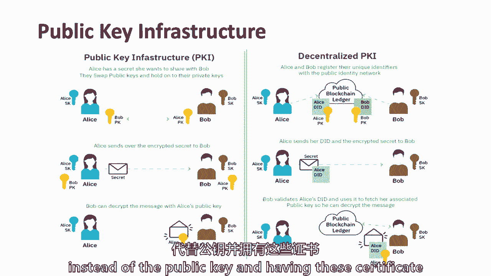

有这些证书，当局有一种安全的方式来存储公钥，在分散的哈希中，利用哈希函数和区块链技术，我想他们中间都有这个，在某个地方，这是一个共识问题，对呀，你想同意，每个人都需要同意Facebook的公钥是。

否则我们就有麻烦了，因为你可能会用我的假脸书服务器，所以这真的只是一个共识问题，这不是关于哈希，安保，忘了那件事吧，每个人都必须同意，Facebook的公共用途是什么，这就是区块链的用武之地，对呀。

对不起，肖恩，我只是想做，我觉得这个问题，基本上，呃，那不是。

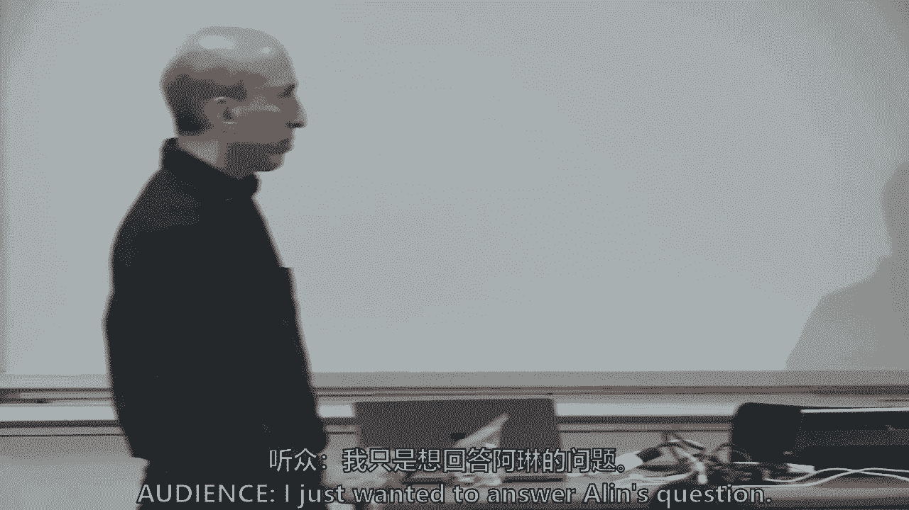

我不认为这是一个常见的政策问题，如果你想改变SSN系统，这是一种方法，你必须改变整个系统，比如如何保险疫情和费用。

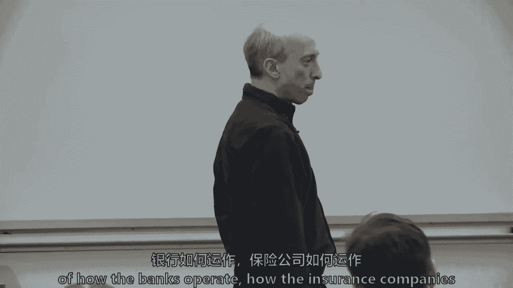

社会成本远不止键向上的高度，我是说，我想他完全是从，系统的实施，它没有考虑到隐藏的经济成本，这样的执行，有一个图片法案说银行必须把你的ssn寄给政府，这基本上意味着银行需要继续作为一种感觉。

所以从某种意义上说你是对的，但政府也必须做些什么，所以让我们继续前进，我不认为只是在美国，发生的事情是，我们身份的属性或身份凭证，不管是税收制度，在过去的三十多年里，银行系统，因为我们已经数字化了。

我们开始，了解你的客户，所以金融系统，税收制度和我们的身份系统现在都已经，你知道吗，有点联系在一起，并不总是出于最好的意图，我是说，也许他们是出于好意，但不是最好的结果，这也是为什么。

我想如果我们要涵盖金融领域的区块链技术，识别系统也很重要，因为它与银行和金融联系紧密，嗯，就不会是这样了，在数字革命和互联网之前，等等，嗯，我想这是最后一张封面幻灯片，但这是自我主权身份平台。

基本上现在，如果我们想保持我们的身份，如果我们想保持我们的身份，只有放弃，一个平台可以创建和执行管理工作流的规则，这是一个叫bit的小东西，我会说我在块网上得到比特。

但几乎大多数初创企业都在使用围绕这一点的架构，这碰巧是比特和块，对它的看法，但基本上我要保持我的身份属性，我选择什么时候可以放弃，当它被使用时。

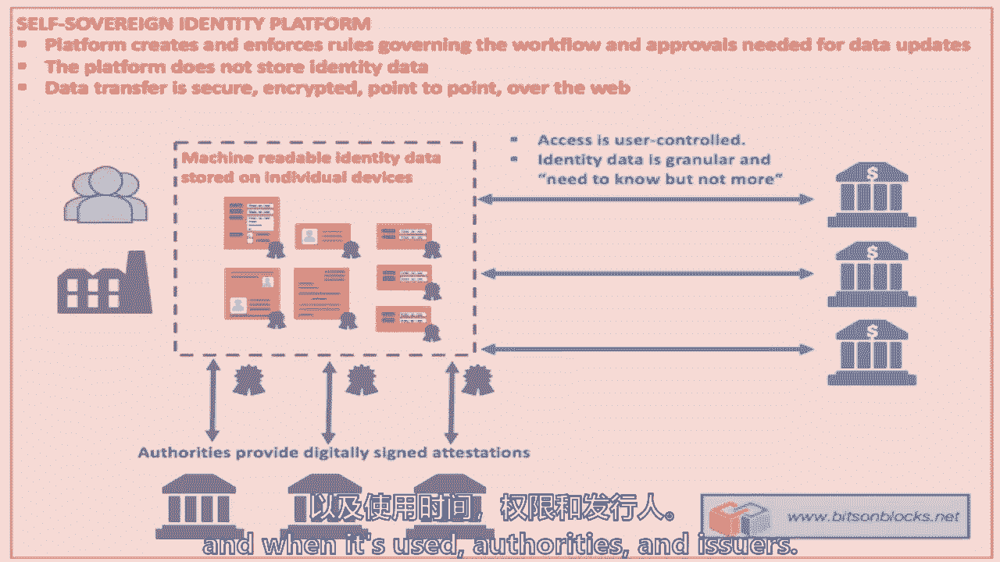

哦，是呀，那是我想去的地方，那么你们都认为你们读了什么，你读过，关于你自己的小文章，你会得到詹姆斯，你会得到你的区块链滴答，区块链文凭，我有一些经验，我开始试着找到我的呃，2000年的文凭。

一个学位12个，我去两千零七年，我的大学被宣布从伦敦大学独立出来。有完整的记录，搞砸了，试图得到我的成绩单副本，我拿不到，我不得不经历，很多不同的人说，哦，我能得到它吗，他们说，哦，我们得联系老大学。

因为我们去了，我们是他们的一部分，所以这是我的衬衫，你们中有多少人会获得区块链支持的文凭，当你从麻省理工学院毕业的时候，你们中的四分之一和那些不是的人，谁没有举手，什么是你没有，哦，你等一下。

我没看到这里有瞄准镜，所以你不是，我不在乎，真的，那是什么，哦。

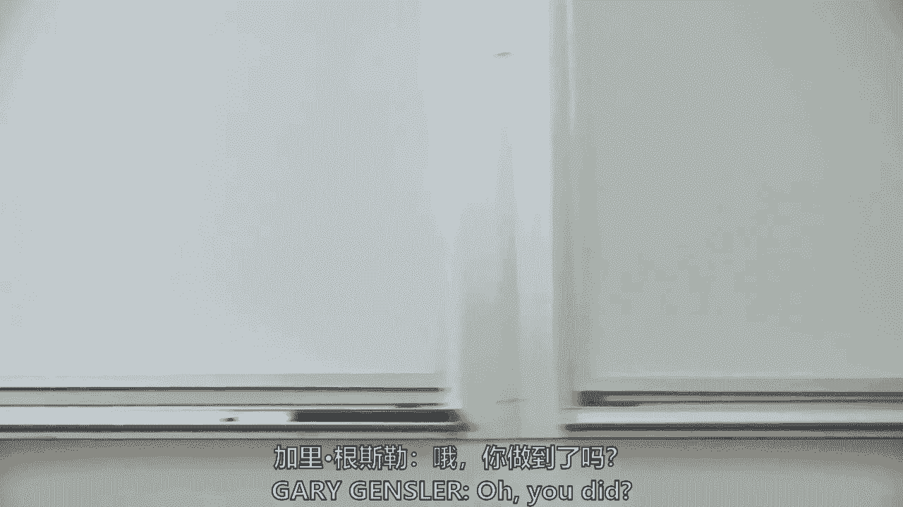

你做了，我想要一个没有举手的人，你为什么不去拿呢？只是纯粹缺乏关于这个过程的信息，如何获得，我要做的，所以说，我不知道，你知道，我们不是，所以说，你只是在说，有一条信息曲线，你必须了解它，举手的人。

说你明白了，你们中有多少人也会获得纸质文凭，哈哈哈哈，你想要墙上的东西吗？或为，其他，为子女或父母的权利，那还是有一些东西，顺便说一句，我甚至不知道我的大学文凭在哪里，但你还是想要那张纸。

有没有人只想拿到区块链文凭，你们中任何一个上不同大学的人，你希望你的大学获得区块链文凭吗，现在他要大声说出来了，也许不是好吧，所以这是一个新奇的东西，是麻省理工学院，我们是创新的，我们有了。

我希望你们下一个都来，星期二，这将是我们最后一次在一起，我会试着用一些基本的事实来结束，至于什么，我认为整个话题和主题是。

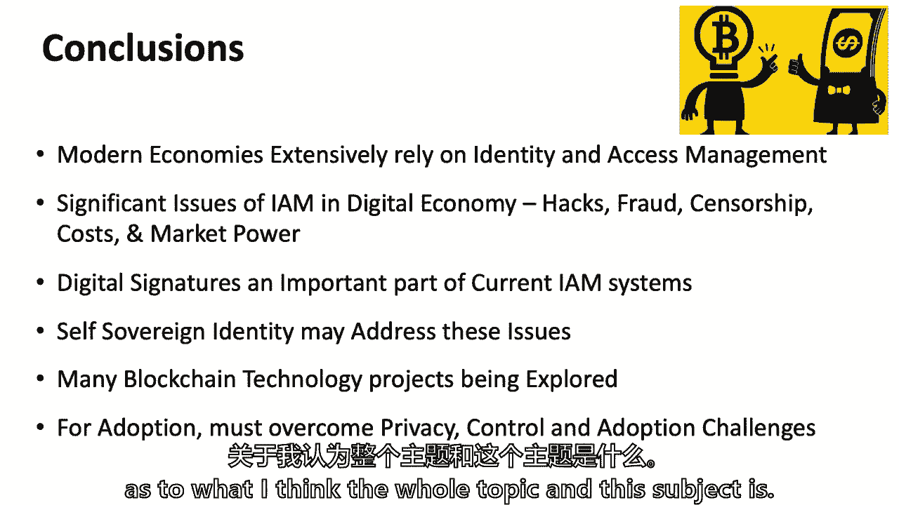

这是关于区块链技术的业务，至少了解足够的细节，知道这些细节，然后说好，这如何适用于，希望，希望，你觉得你得到了和星期二，我们总结一下，所有一些批判性的推理技巧，你可以通过炒作和现实来分类。

你们中那些参加最大化的人，你可能更在中间，你们中的一些极简主义者，也许来得很好，也许你还，但你来了，你知道一点点，因为我觉得那是个合适的地方，你们都给了我巨大的反馈，我从你们身上学到了很多。

但让我们继续下去，再见。

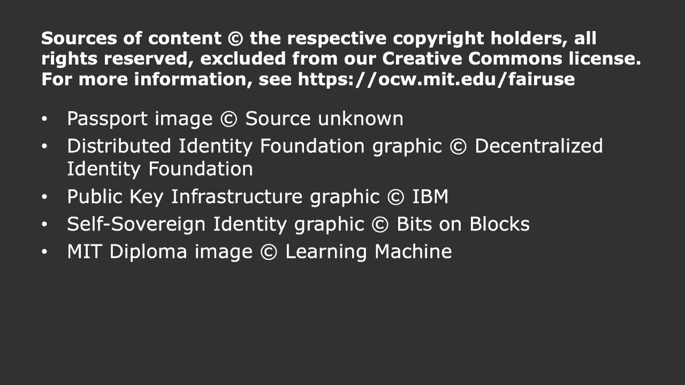

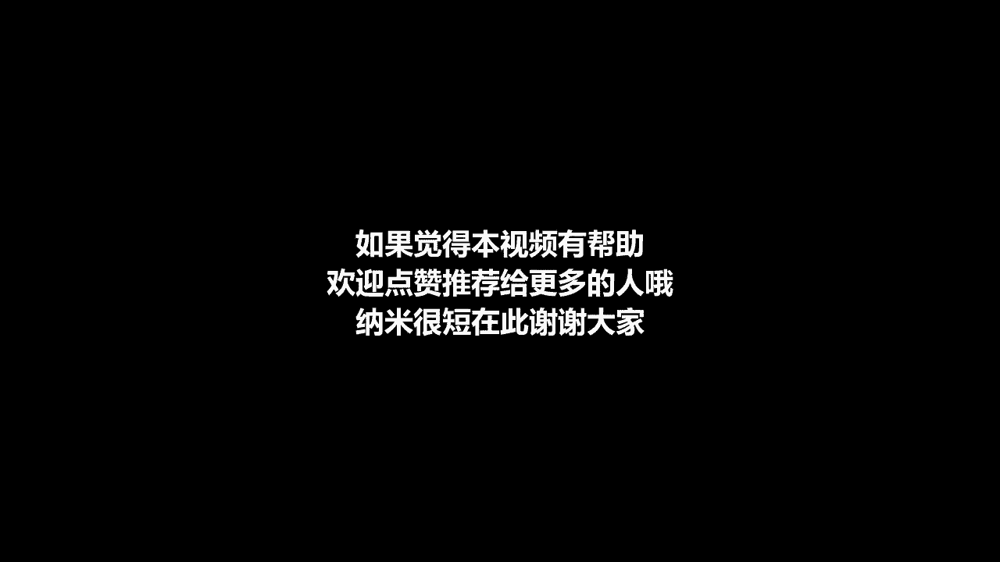