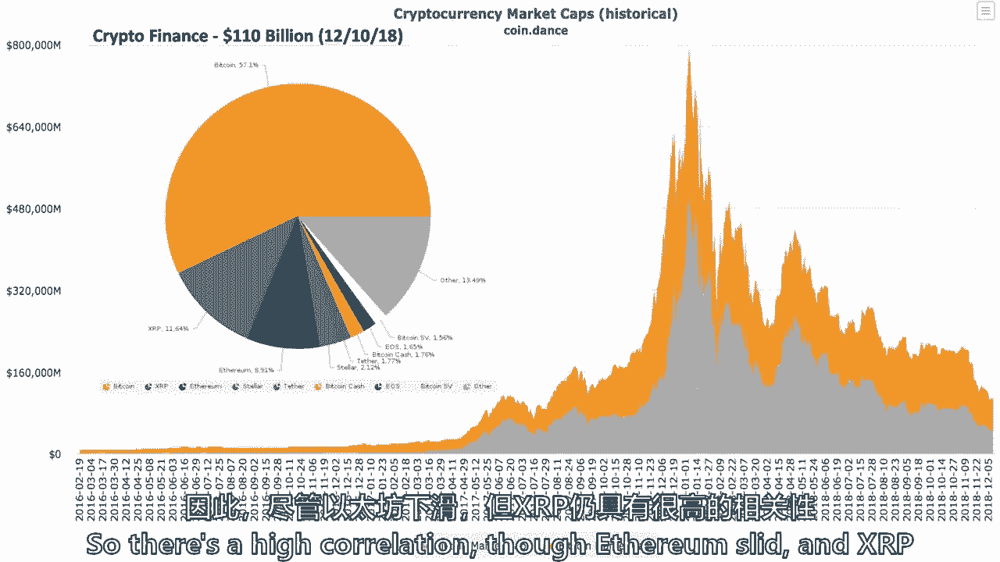
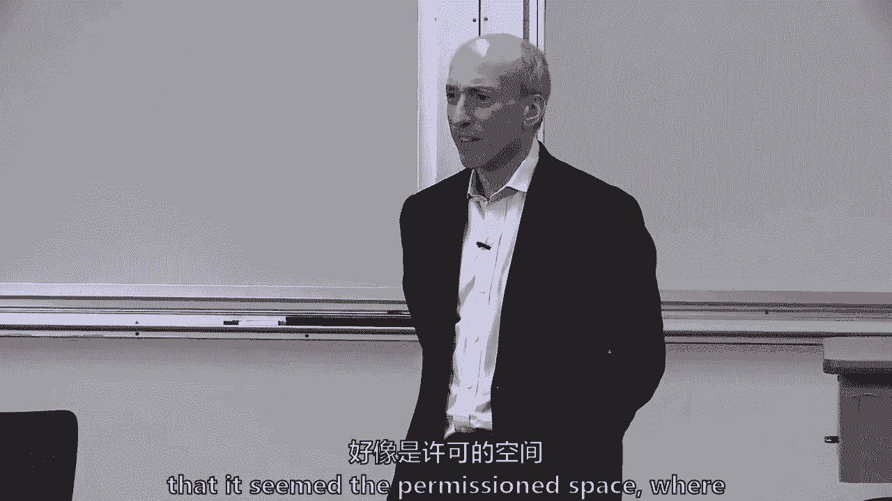

# 【麻省理工大学公开课】区块链与货币 - P23：24、结论 - 闰土聊Web3 - BV1sL411N7Mm

所有的权利，所以我们要，我们要试着，只是我得到了更多的时间让更多的人出现，聊一聊，这学期我们学了什么，所以我要试着谈谈，我们从金钱和账簿开始，为什么这很重要，如果你离开这一切，区块链技术的经济学。

为什么金融部门与这一切如此紧密地联系在一起，虽然，这不是我们唯一要去的地方，密码，财政和公共政策框架，然后引用本·富兰克林的话来结束它，将是我们最后谈论的关于向前支付的事情。

我不知道有多少人读了这篇文章，我为硬币台写的，它将在一两天内运行，但那也就像，呃，你知道的，帮我包起来，呃，呃，整个学期，嗯，正如我告诉过你的，我既不是最大化主义者也不是极简主义者。

但几分钟后我可能会问你们所有人，让我知道，你最终在哪里，所以钱的作用，有人记得吗，货币在经济中的作用，这三件事，交换媒介，计算和储存价值的单位，交换媒介，记账单位。

价值储存，我不认为我们真的知道，当我们回顾所有的历史和考古时，哪个先来，但这三个都很重要，那么有多少人认为比特币，只有比特币，我不是在说其他1600个代币，比特币完成了货币的这三个角色詹姆斯。

有人举手了吗，你在说是，是呀，雷克萨斯，哦，我们有两个雨果，谁去另一边汤姆，就是这样，就这样一整个学期，你只能说不，不，所有的权利，有人想给更多的野蛮，所以不确定，因为黑色的野蛮不是一个价值储存。

但不是吗，它现在价值600亿美元，我认为它是如此，有价值，但它是两颗子弹，i，当你想到它是一美元的交换时，它是不稳定的，但如果你改变你的心态，比特币是比特币是比特币权利，它是，我的天啊，在这里。

我们去十字架。

但玉米也是如此，对呀，蒲式耳玉米，我和Brosh在一起，对不起，你是反对阵营还是赞成阵营。

它是一种价值储存，不不不，它是一种交换媒介吗，没有一种货币是真的，作为一种货币，一切都要，呃，把它当成一对，所以你有，它是相对比较中的一切。

所以呃，你真的可以待人，独立的人，我不知道我是否同意这一点，但我想说几乎任何东西都可以装进这三个桶里，这取决于它有多可靠，和我们一起在那三个桶里，美元非常擅长成为一种新的交易所。

非常善于成为一个可靠的价值储存和稳定的记账单位，但我的意思是你也可以有像，我不知道就像一个，你知道的，推小麦什么的，这三件事都是，但这不是一种品质，就像法定货币一样，我像美国一样思考的原因，美元稳定是。

因为中央银行有一个U实际上影响了，因为它只是说是一种货币，它就像是中央银行的负债，这是一个可以有音乐的故事，我们变得如此认真，所以我认为价值的分数是不对的，所以你觉得哎呀，他说得很好，背后没有中央银行。

所以也许它撑不住，但如果你从课堂上拿走了什么，我要吃一些其他的外卖，我也是，记住关于金钱作用的三件事，但这是一种社会结构，即使有中央银行。

中央银行是，最终我们将其写入法律，我们把它供奉在一个大机构里，砖头、灰泥和柱子，通常总是有，你总是要有那些专栏，但它仍然是一种社会结构。

这三种方法都有，只是不能被广泛接受，它很少用作记账单位，但有时用作单位帐户，在一些最初的硬币发行中，它一般不用作交换媒介，但有些人是用比特币支付的，一些软件开发人员实际上是，它是600亿美元。

它可能是不稳定的，它有一个存储价值，所以我不是想采取最大化或极简主义，但我可能介于汤姆和詹姆斯之间，因为它确实有所有这些品质，在某种程度上在那里，早期资金，还记得我们在记忆中的一些漫步吗。

早期的一些钱分崩离析了。

当它们被贬低时就灭绝了，我们在学期早些时候讨论过，就连关于它的故事也是，我想一个英国人，当英国人到达雅浦岛时，他们离开了几百英里，采石，并不断地把更多的牦牛石带到那里，突然间它变得贬值了。

然后钱当然变成了纸币，在左下角，它开始是仓单。

所以纸只是价值储存的一种表示，金属或角落，或者我们之前吃的小麦，另一件重要的事情是分类账，他想提醒全班同学什么是账本，为什么分类账很重要，有人想要账本吗，我们没有，我不清楚，我没能成功，分类账。

事务历史记录，基本上您存储事务历史记录，还有什么，账户数，所以它存储余额和交易，所以你可以把它看作是一种流动和平衡，流量就是交易，我给雨果钱，不管是谁给雨果钱，这是他的余额，就像损益表一样。

资产负债表是一种流程和资产负债表，但是账簿和保存账簿可以追溯到几千年前，所以区块链技术真的是关于钱的，但它也是关于一个有分类账和分类账的数据库，通常储存有价值的东西，然后我们得到了法定货币和法定货币。

就像他说的，他们以中央银行纸币为代表，中央银行准备金和银行存款，所以有三件事大家都想看，如果有人在那些课上听，我在伊兰周围开玩笑，你会说，什么是，为什么，这三件事都是法定货币的形式。

我以为你问的是清单上的活动，问题回答问题，你想回答是的，如果货币中重要的东西，可能是货币，对纳税很重要，据称，这是由社会理解支持的，即中央银行将尊重那些，末端的那些节点，所以它实际上是一个到这个。

它被接受纳税，它是法定货币，所以实际上社会是通过议会聚集在一起的，通过其行政部门并通过一项法律，它说它是法定货币，给了它一个巨大的优势，但这才是真正的意义，它有巨大的网络效应。

我在硬币桌的文章里写了这个，对于任何新货币，我的问题是，它如何与那些令人难以置信的网络效应竞争，我们谈论Facebook有令人难以置信的网络效应，因为20亿成员，但即使是金钱作为一种技术也有网络效应。

因为人们很容易接受它作为记账单位，交换媒介，储值，它只会失去网络效应，通常当它变得贬值时，什么时候，当人们不能相信它是一个很好的价值储存时，因为别人可以赚很多，或者打印很多。

或者或者一个国王开始印刷太多，但它有一个非凡的效果网络，另一方面，有时货币有点挑战，就像现在的欧元，欧元最终会起作用吗，那是在不同的课堂上为不同的班级做的，但欧元最终会长期发挥作用吗。

我怀疑它在未来几十年是否行得通，因为有这么多的司法管辖区，没有一个统一的财政账户，不是统一的，那是法定货币，这是镇上的一种游戏，你们都读了八页的报纸，但那是第一行，一直在研究一种新的电子现金系统。

那是完全对等的，没有可信的第三方，基本上就像吉说的，没有中央银行，忘了中央银行吧，这就是和弦的灵感，但有趣的是，这不是第一次尝试，我们在本学期早些时候讨论了至少一些早期的尝试，都失败了。

因为他们仍然是集中的，就像Digi Cash仍然非常集中，嗯，或者他们无法解决在互联网上的双重支出，你可以发两次电子邮件，它不需要中央权威，如果它被复制了呢，但双重支出是个大问题，那么他是怎么解决的呢？

或者她解决了，我希望，我希望，嗯，所以我们讨论了数据块，所以如果你在晚宴上，你不记得这节课的其他内容了，也许只是记得有一些关于数据块的东西。

使用一堆密码学和共识，这些幻灯片是在画布上的，下载这张幻灯片，你是专家，Neha Naula实际上创建了这张幻灯片，我一直在用它，嗯，但有人记得是谁发明了数据块的整个概念吗。

詹姆斯·亚当·贝克是个好名字，但他不是发明这个的人，他发明了别的东西来证明工作，时间戳只追加日志，世界上运行时间最长的区块链是什么，纽约时报，就在这里，他是两个贝尔实验室的科学家，这是其中之一。

贝尔实验室的两位科学家提出了一个概念你可以把一堆数据，把它通过所谓的密码哈希函数。

这是一个承诺计划，你不能改变它，因为如果你改变了什么，哈希函数会改变，什么是密码哈希函数，那就是我使用这个想法的时候，你，把它放入一个叫做哈希函数的小东西中，最后得到一个，输出。

但哈希函数是这家伙发现的关键，当然，这是关键，如果整个班上只有两位密码学，我知道这看起来像是，哦，他为什么，我们为什么要教这个，但这是一个想法，你可以把一大堆数据，把它放入一个叫做哈希函数的东西中。

它承诺，因为如果你改变任何一段数据，任何单独的作品，你会得到不同的输出，所以它真的是一个，它的关键是它犯了一些事情，你可以用纽约时报的填字游戏来做，那只是我的，所以这是关于数据承诺。

非对称密码学或数字签名，我拿出了一张我们讨论过的图片。

但这个想法是很久以前密码学是，我如何加密一些东西，因为我在军事行动中，我可能会把，几千年前最简单的密码学是转置，每一封信，a a变成a b a b变成a c，这将是一个，嗯，很难想象有人能逃脱惩罚。

但那是早期的密码学，几千年前，只是简单的换位，到二十世纪中叶，有非常复杂的换位。

被称为钥匙和谜，如果你回去看那部电影模仿游戏，有五个转子，五个改变的金属转子或电子转子，每天德国人都会改变五个，五个转子，但它们仍然是对称密码学，U艇实际上有同样的五个，所以在20世纪70年代有人来了。

说什么，如果钥匙不一样，它是不对称的，有私钥和公钥，每个人都得到的公钥，但是你保存的私钥，一些计算机科学密码学家就在这里，在麻省理工学院，罗恩·里维斯特教授密码学的课程。

但20世纪70年代的发明真的很关键，所以它是哈希函数，私钥和公钥的概念，当然还有随之而来的数字签名，你可能甚至不需要记住太多关于这节课的内容，但要知道有一种叫做私钥和公钥的东西。

然后中本真正的创新来自亚当·贝克，亚当·贝克说，如果我用一些计算工作，我用计算工作找到一个哈希函数，具有预定数量的零，这不是什么难解的谜，就像一个随机数，一代，人们会说功的证明是一个计算难题。

它只是在运行，呃这个，这个叫采矿的东西在运行电力，直到你得到正确数量的前导零，嗯，但可以有效地验证，所以工作证明的特征是在1997年发明的，区块链发明于1991年，她所做的是，她在之后把它拼凑在一起。

二三十个，拥有数字非中央货币的失败尝试，然后说，啊，这就是区块链的灵感所在，工作证明，我用这个小视觉，但是每一个方块，你还记得nonce这个词是什么吗，什么是临时十字，让我骄傲，某人。

我不记得那是什么了，一次又一次的第一名，使用过一次的号码，那么为什么一个nonce对证明工作很重要呢，好，这是唯一的号码，因此建立了这些东西的完整性，所以所有这些工作的证明，我只是回去回顾一下。

但工作的全部证明是，你的计算机会随机选择一个改变所有数据的东西，所有的交易都是一样的，但不断改变这个叫奶奶的东西，直到我得到一些领先的零，和全球的整个比特币网络，它所做的只是运行一个随机数。

胡说八道的一代，直到哈希函数现在被解成有18个前导零，我应该说18个领先的零，当比特币的价值是60，500美元的比特币，我不会感到惊讶，如果它会下降到17个领先的零，或者16个前导零。

因为这样更容易找到，所有这些密码学只是为了使数据库结构，区块链中的这个数据库结构，让这个工作，所有哈希函数的密码学，数字签名，功的一个小证明是使它成为所谓的几乎不变，我几乎把这个词放进去了。

因为没有什么是真正不变的，你可以，你甚至可以压倒比特币网络，拜托了，你能在这里介绍一下前导零的数量吗，所以嗯，亚当·巴克提出的工作证明背后的概念，在二十世纪九十年代末是，得通过哈希函数运行一些数据。

可能在他的案子里，在亚当·巴克斯的案子里，是电子邮件，通过哈希函数运行一封电子邮件，然后向其添加额外的位数据，这个号码只使用过一次，随机运行这个nonce直到哈希出来。

我在底部的小图像上有一些前导零，嗯，所以哈希的开头将是零的数量，是呀，所以在这种情况下，在这种情况下，四个前导零。

那个小视觉，所有进入区块和比特币的数据，一千到一千五百笔交易都进去了，他们被卷起在这种叫做默克尔树的东西里，但一切都进去了，唯一改变的是，矿工们试图找到一个随机的nonce，有一定数量的前导零。

中本写论文的时候，困难在于，我想十个领先的零，你可以在笔记本电脑上解决这个问题，又有八个前导零，因为它是十六进制的，我猜是十六岁，16到8次方哈尔，嗯嗯，我们假设，你和我今天进行了一笔交易。

我会留一些呃硬币。

我需要这个，呃，每个处理了很多很多次并增加了层层难度的人，呃，我们的交易，如果我想在五年后用我的余额，我们怎么知道我的余额是多少，我需要回顾所有的历史，知道我有一个平衡，那么区块链技术的核心是什么。

比特币网络，而且所有其他网络都是，整个交易历史是公开的，这都给了我们力量，但这也是它的挑战之一，所以是的，即使五年后，如果你想用你的比特币，你必须能够证明这是五年前的事务输出。

如果您还记得有两个事务输出模型，比特币是一个将所有个人交易保存在一组的系统，叫做UTXO，未用交易产出，你必须能够在25年后证明你有这一点，你说二十三和二十三，你必须能够证明这一点，所以这也是一种平衡。

他们花了，是一种平衡，而不是基于事务的，它是单个事务输出的记录，所以是的，它就像一个平衡，但因为比特币并没有把所有这些个人加起来，比特币网络不会把这十三个加起来，您必须将其中的每一个单独用作新的输入。

也在最后一个街区，这样我就不用回去了，所以好吧，所以问题是，最后一个方块，比特币有550个，大约一千个数据块，现在最后一个块存储所有数据吗，答案是否定的，但它确实存储了上一个块的哈希函数。

它存储来自上一个块的哈希函数，所以您的事务输出可能位于块号为42万，十三万个街区前，但什么表明它是可以验证的，就是这些块中的每一个都链接到另一个块，通过这个叫做承诺计划的东西，称为哈希函数。

所以从技术上讲，最新的街区有一个，里面有一个数字，十六进制数，但是其中的一个数字叫做哈希函数，它被提交给，因为它之前的所有数据，之前数以百万计的交易，如果有人改变了其中一个，你就会知道它被篡改了。

所以假设我想用我所拥有的平衡，在哪里做街区，并验证我有。

就是最后一个街区，还是回去，只要它找到了反击的机会，本质上，它两者都有，因为最后一个块最好是有效的，但对你来说花一些钱必须真正回到过去发现你是你的，的，您现在要使用的输入是尚未使用的输出，埃里克。

你有什么你想做的吗，我是，我是，是啊，是啊，这是一个解释，你得一路走下去，您的交易在哪里，你得到比特币的地方是用任何块，甚至对区块链来说也是为了获得这些硬币而战，你知道你把它们作为输入。

在你想做的任何交易中，这种复杂性是它没有同样性能的部分原因，它还没有同样的可伸缩性，我是一个相信在，我很乐观，一些可伸缩性和性能问题将被克服，但可能需要三个，五个，七年，不是三七个月，但你是绝对正确的。

因为你必须回头看，嗯很久以前，以太坊网络不仅仅是在交易上做这件事，它有余额，所以这样更有效率，并有其他低效之处，许多其他严重的低效率，但在某些方面，我们谈到了智能合约，拉里·莱西格真的和我们说话了。

也是关于智能合约，Nick Sabo在1996年写到了这一点，我喜欢谈论历史说，不全是为了这个，一个我们不认识的人，而是一组以数字形式指定的承诺，包括各方信守承诺的协议，把它看作是自动化的现代方式。

所以如果你将来出去做生意，你在考虑投资吗？有人提出了一个聪明的合同，即使你是比特币极简主义者，你可能会说等等，等一下，等一下，可能有办法，我可以自动化目前由律师完成的事情，或者由后台人员或会计师。

所以还有一些东西在那里，我们讨论了一个用例，ISZDA，掉期和衍生品协会正在寻找智能合约，试图自动化，从整个街区出来的聪明的合同，链技术运动实际上早于区块链技术，但区块链技术也是如此。

也许我们可以在一个可验证的，也是，因此，移动价值或自动化某些形式的合同安排，但请记住，他们不是那么聪明，他们也不是那么多合同，嗯，你可能还需要法庭，仍然有一些模糊性，不能被推到这些文件中。

所以我们谈了很多关于区块链技术的经济学，它围绕着验证成本和网络成本，但这是关于降低验证成本，和，其中一些核查费用可能只是现任现任者的经济租金，所以区块链技术可能是降低直接验证成本的一个非常重要的方法。

并应对审查制度，我认为这就是中本创新的意义所在，正在处理审查制度，有人可以剥夺我用我的钱的权利，当我想用我的钱的时候，但这也可能是为了降低经济租金，然后我们说，如何评估用例，这是我硬币桌文章的核心。

就像在你做其他事情之前，是如何，到底会怎么样，这又是什么价值创造命题，验证和联网费用是多少，真的会减少，竞争对手在做什么，比如在贸易融资方面，有二三十个努力，所以值得，看着那二三十个，如果你。

如果你开始，如果你在一英寸，我不知道你们都在哪个领域，但如果你在一个没有人使用区块链技术的领域，没有竞争对手，然后他很好地问了这个问题，竞争对手如何使用传统数据库，你可能会，那可能是你的机会。

这可能是一个千载难逢的机会，但总是看着，价值主张是什么，验证和联网费用是多少，有什么竞争？然后你就进入了那种，如果你在投资，如果你是风险投资家，有人不能告诉你为什么，多个涉众需要写入分类账。

他们的趋势数据是什么，他们将在这个仅追加日志中存储哪些数据，那我建议你投资点别的，我是说你总是可以投资一些东西，因为你认为这是一个势头游戏，如果你投资，有人会，这是早期的种子投资，有人会把你保释出来。

但大多数风险资本家，你要投资三到六年或三到五年，所以我并不总是期望，会有人保释你的，比如问棘手的问题，但仅仅因为这是最好的解决方案，这并不意味着他们以后会成功，对呀，就像有很多例子，你知道吗。

显然不是最佳解决方案的产品、服务或阶层，但在市场上占据了主导地位，嗯，所以很好奇，就像，这应该是最好的解决办法吗，我想这是问题之一，但你说得很好，如果这不是最好的解决办法呢，回到什么，杰夫·斯普雷彻说。

它能做一些更便宜的东西吗，更快或更好，这可能不是最好的解决办法，但如果它至少能回答这个问题，便宜吗，更好或更便宜，更好或更快，你可能不会成功，在某些情况下，这不是最好的数据解决方案，但经济租金如此之高。

以至于，然而，按揭产品，保健品，产品正在交付中，你所说的支付解决方案，我可以，这不是最好的解决办法，但这是我如何更便宜地做的解决方案，因为他们有这么多的经济租金，所以也许这个词应该说。

为什么这是一个更好的解决方案而不是最好的解决方案，我同意那一点，然后如果有本地令牌，我想这就是你开始失去我的地方，但现在我要问全班同学，这学期有多少人，我想有很多，很多你想亲自投资的初始硬币发行。

所有的权利，班上有人拥有首枚硬币吗，提供代币，非比特币代币，好的，你想告诉我们为什么，是啊，是啊，给我们价值主张或推销，所以我在夏天去了一家初创公司Flustart工作，夏天过后，他们在商店付钱给我。

但夏天过后，他们给了我很多代币，我说了一点，所有的权利，所以你得到了报酬没有，夏天后，我沐浴在美元中，他们给了我大部分的权利，一堆代币作为奖金或奖金，是啊，是啊，我认为这是一种奖励，你做得很好。

你卖了一些，他们中的一些人把它们卖了，我看到他们了，我仍然，你认为这些本地代币有什么用吗，这个特定的启动，是啊，是啊，名字不会重复，正在拍摄，我不知道，我不知道，肖恩，呃，所以我买得很好。

我刚买了一点像创，它是一个创，什么游戏网站，呃，基本上是一家公司，由我的一个朋友开始，所以这是一种支持的象征，而不是像把所有的权利，所以你买了一些代币，作为对一个开公司的朋友的支持。

你觉得他们有什么用吗，你能用令牌，我不认为，嗯，它应该是最大的游戏网络的建设，但它是预功能的吗，还是功能性的，它是预功能的，雨果你，你有，你是，我有好吧好吧，他有一整个投资组合，我看得出来我不知道。

我对这个感兴趣已经有一年多了，所以我去了整个兔子洞，哦，这个看起来像，会很顺利的，但就像，这是一个骗局，就像，有些似乎是肯定的，从长远来看，可能会保留一些价值，但我可能做了一些糟糕的投资决定。

所以我不想让你伤心，那些糟糕的投资决定，但您目前持有或持有的任何代币，或其中任何功能，它们可以在网络上使用，是的，我实际上至少用了一个，你是主人吗，或者你有问题，但不是，我没有投票支持代币和挖掘代币。

但无论如何都不会无视，也许专注是一种有效的方式来产生一种启动网络的方法，呃，一些调解努力的集体行动，因为我是说，我觉得这样问有点不公平，如果我们加入或支持ICOS，在目前大量骗局的背景下，在媒体中。

但我不会忽视，er，我承认这是个不公平的问题，我只是想，我只是想在房间里得到一些支持来换取代币，嗯，这个概念对我来说绝对糟糕，我会认真探索探索如果我在区块链领域启动一家初创公司。

认真探索在无许可环境中使用本机焦点的可能性，如此相对于如此，我觉得，绝对是这项整体技术的未来，制作数据库，更难篡改，在规模上更不变，它可能不是百分之百不变的，但更接近于不可改变和不可验证。

我认为本机令牌可以帮助启动网络，我认为挑战是，我认为挑战是，你如何与菲亚特竞争，货币，安永研究，最近的研究，我想抓住了这一点，当他们观察来自2017年的140个最大的科斯时，只有大约。

我想是一百四十个中的十七个，现在有一个正常运作的网络，在那里您可以使用令牌，百分之十三，但在这十七个中，我想有七个，直播的网络，都说过，嗯，你猜怎么着，这项服务我们也接受法定货币，我们提供的。

他们是提供文件存储还是其他什么，所以他们肯定是用本机令牌跳的，作为众筹启动网络，但当他们进入后期功能阶段时，操作员，企业家说，我不想限制我的用户，我也要拿法定货币去买或安全，不管我有什么服务。

我认为这就是商业模式的挑战，而且而且而且，很可能有网络，就像在游戏网站上你想要皮肤或盾，有一些关于，但到目前为止，这是一个有限的课程，我可能会在那里宣布自己，我觉得，当然，在接下来的三到七年里。

会有一系列的权衡，这将围绕性能隐私安全进行整理，我们谈到了第二层，如果你们中有人真的对区块链技术领域的工作感兴趣，你会学到很多关于第二层的知识，解决方案和侧链，以及所有的性能可伸缩性。

数字货币倡议的同事们在这个问题上花了很多时间，就在这里，嗯，当然，这是一种商业模式，纯粹作为一个风险投资家，你得想想，我如何获得收养，我的客户用户界面是什么，我敢肯定埃兰，你对此想了很多，对吧。

你可以在数据结构中有最好的想法，你可以在本地令牌上有一个非常好的想法，但你还是要处理，风险投资要做的就是，如何让用户使用此领养，我的用户界面是什么，这是一系列更普遍的问题，这就是我对G的回答。

她告诉我的是对的，对呀，这一切都是关于，它是，它是，领养和领养之间的紧张关系，产品质量和这就是为什么我们啊，我们从以太坊搬来，这是一个公共收藏，我们不认为会被，被现任者大量采用。

所以我们转向许可许可区块链因为采用了，我不记得你能不能说出来，你在用哪个超分类账，织物或科达，或者我们使用他们提供的国家渠道解决方案的CORDA，所以我们讨论了框架，我觉得那条橙色的线，它的坡度会下降。

我们将更多地走向分散的一面，但是橙线，要下来的斜坡，本质上，可伸缩性安全性的成本，连协调都要下来，在治理上总是会有一些挑战，本质上，在一个真正分散的网络中，谁来支付软件开发的费用，比特币也得到了支持。

例如，一群不可思议的比特币核心开发者，部分原因是他们只是相信它，部分原因是一些是由麻省理工学院等机构资助的，但它仍然，这总是一个挑战，一个真正分散的人说，谁来资助，谁有经济利益来资助，持续的更新和软件。

我认为Uber可以完全是一个去中心化的网络，司机可能会得到更多的报酬，但那又有什么激励呢，他们会负责软件开发来更新他们的骑行应用程序，所以你知道那里有一个关键的痕迹，金融部门，嗯。

它移动和分配资金和风险，我们谈过了，但它依赖于一个分类账系统，它一直与技术有着共生的关系，这些是关键的机会，我认为任何金融科技，不仅仅是区块链，但即使是人工智能和机器学习也围绕着金融，作为客户接口。

有很多遗留的客户界面，你实际上可以与之竞争，如果你在创业，经济租金很高，有百分之七点五的经济是融资的，不是所有的百分之七点五都是仁，有很多额外的借口，表达，里面有很多额外的利息或果汁，UM模型，当然。

我们经历了反复的危机和不稳定，和，我们谈到了支付宝和M pesa等产品，真正关于金融包容性的，利用新技术，那么我们这个时代的技术是什么。

我只是在这里贴了一个很好的小图形，我在C细胞的一个叫Fintech的小组做一些工作，这里的计算机科学和人工智能实验室，当我们与融资公司会面时，那边那个单位的大融资公司，区块链在他们的名单上。

但它不是第一。

人工智能可能是最大的一块，但只是为了给嗯一个味道，但它是前三四名之一，但正如我们所说的，他们有挑战，金融业看到了很多挑战。

你想回到以前的幻灯片，虚拟现实将如何影响金融，我不太确定，让我们有一顶帽子，他们是博士，会影响金融，嗯，我对那个领域的项目不熟悉。

但我们，我相信我现在，你会激励我在接下来的一两天里做一些研究，用一些项目拍摄你的电子邮件，但是，确实允许更多的金融包容性，如果你能找到一种愉快的方式来花更多的钱。

通过虚拟现实，银行系统想利用这一点，这不是C细胞金融技术公司的顶级产品之一，我会说人工智能机器学习，生物识别与区块链，一切都在云端，所以他们现在不是在问，麻省理工学院帮助他们解决云问题。

开放API是一个非常大的问题，尤其是在英国伦敦，所以我想说AR和虚拟现实可能在榜单上排名第八。

我只是把它包括在内，因为我觉得，他们会找到改变用户界面的方法，我们说过，有一堆问题，这真的导致了使用，我们谈到了传统数据库，派对可以创造，改为，写账本，那个，当然是什么，大部分贸易融资，大部分付款。

或者从以太坊转移到做超分类账项目，新加坡和加拿大的碧玉，也许没有许可，但这真的是金融的第二个桶，现在埃里克。

这并不是说本地代币不会起飞和雨果，你的投资组合会有价值，也许是这样，在这里我们经历了一堆用例。

但到目前为止最大的用例是，通过科斯筹集的两三百亿美元，我个人认为这会下降，但是支付系统，我是说，我们可能对XRP一个令牌的观点有不同的看法，但是波纹，和其他公司做了很多努力，我们谈了很多关于贸易的事。

再次金融，它们更多地在权限中，而不是权限列表中，清算和结算，澳大利亚又发生了什么事，不允许不是我的意思，无权限，嗯，然后一些非金融的，呃，就供应链管理和詹姆斯进行了热烈的讨论。

我会永远记得你不是它的粉丝，但沃尔玛和嘉吉可能不同意詹姆斯的观点，他们在上面有活跃的项目，劳伦给了劳伦在哪里，她在这里，也许给了一个理由，为什么在供应链可持续性中，你可能在另一边，数字ID。

是我们谈论的最后一件事，所以发生了很多事情，当筹集到二三百亿美元时，会有，这些项目对他们来说会有一些生命，我们会从他们身上学到很多东西，一路走来，加密金融，当我第一次把这张幻灯片放上去的时候。

不是一千一百亿，天哪，我昨天就这么做了，所以我甚至不知道是什么，就是今天，相当不稳定的市场，有趣的是，比特币在五点左右雄鹿，五五个，百分之七的市场份额，所以有很高的相关性，尽管以太坊下滑。

XRP在该市场上排名第二。

自从我们九月份第一次在一起，嗯，这里是什么，我认为挑战是作为一个投资者，我不是想挑你的毛病，雨果，但你知道一个投资者，但我认为这是头号挑战，我真的有，那个令牌和埃里克的可行性是什么，我同意你。

一些代币会有一些价值，但它正在评估，但市场很容易受到欺诈的影响，我如何保管私钥保真度公布，他们将有一个新的私钥解决方案，所以很有趣的是，大的现任者正在进来，不仅仅是Zappos和，你知道的。

早期监护解决方案，甚至后退，洲际交易所投入了大量资金，他们基本上会有一个监护权的解决方案，因为你可以买比特币，有一天期货有比特币，然后他们基本上会为你保留监护权，然后我们谈到了密码交换。

最关键的是如果你拿走了任何关于交易所的东西除了现在，他们可能非常容易受到前跑和操纵，他们有点不同，因为他们不仅仅是匹配的代理，伦敦证券交易所或纽约证券交易所的匹配，但他们也是交易对手和保管人。

关于加密交换的另一件事要带走的是，他们高度集中，所以我只是在想核心外卖，如果你投资，还是你在想这个，或者你只是卷入了一场晚宴的谈话，这是一个核心的讽刺，在分散的空间里，95%的真实交易发生在。

我对加密交换的思考，虽然也不会有两百个这么长的时间，我们谈到了最初的硬币发行，中心外卖是他们是筹款工具，不管你是否相信美国和加拿大的做法，豪伊测试，但它们有助于建立一个网络。

在预期中筹集资金代币在发挥作用之前就发行了。

我想最新的研究是，1。5%实际上是有效的，98。5%是在功能前发布的，所以这不是问题，只是这就是方法，它可能是一个投资工具，不是实用工具令牌，关于实用工具令牌和安全令牌的整个事情，它伸展得很厉害。

我们谈到了公共政策框架，防范非法活动，金融稳定投资公众。

我对这件事的总体看法，我承认其他人有其他观点是任何新技术，如果它增长到整个经济，需要生活在公共政策框架或社会中，将适度改变这些公共政策框架，但你仍然想保护公众免受核心社会产品的影响。

这发生在铁路出现的时候，当电报在19世纪出现时，这发生在互联网社会，在我们想要创造的任何社会结构之外，没有完全的技术，我们通过政治和议会来做社会结构的事情，但我们不会把我们经济的大部分排除在外。

这东西还小，这是一千亿美元，全球资本市场超过300万亿，但它得到了很多公众的关注，特别是我们要防止非法活动，大多数人都有，也许不是每个人，但大多数人没有，我认识，希望你们都做得很好，我不知道。

所以我们谈到了U，中国证券法，我们如何测试，它不是，如果你忘记了我们如何测试，完全没问题，但这是这些最初硬币发行的核心。

这是四个部分的测试投资的钱。

和企业对利润的共同期望，所以如果你陷入一些争论，你想和某人玩得开心，你可以说你知道豪伊测试，但它真的更，这个，我更喜欢鸭子测试，只要用常识，这门课更多的是关于批判性推理技巧，如果有人想卖给你什么东西。

或者强迫你做什么，你现在是风险投资家，你在投资，用鸭子测试。

你甚至还记得鸭子测试，测试他们是否想卖给你什么东西，与法律无关，它只是，那么我认为加密交易所会走向何方，我想他们得解决监护责任的问题，他们可能都用，保真度，产品，否则他们会。

他们会把它留在家里或分拆出来，我们看到一项研究说，四分之一的交易所，我甚至没有任何AML，我想两年后这将会下降，我不认为会有两百个交换。

两三年后，在某个时候会有五到十个相关的交流。

首次投币，我想我们会继续看到很高的失败率，每月大约还有两百元，但他们可能会少一些，我认为会有很多执法行动，偶尔你会看到一些东西，证券交易委员会，或者其他的，也许会在日本，否则我们会带来更多的案件。

有趣的是。

在1919年是看，有没有大的上线。

我想这将是一个真正的考验，Ficoin知道该怎么做吗，他们筹集了25万美元，电报提出了一点，70亿，他们是否想好了该做什么并在2016年做出了真正的努力，这将考验经济学，顺便说一句，埃里克。

这可能会把我更多地拉向你说得对的地方，我是说电报，那边有很多聪明的人在做这个，顺便说一句，Facebook已经发布了广告，利用区块链技术招聘人员，所以有很多非常大的科技公司，在这个空间招聘和招聘。

但我想2019会很有趣，看看什么是电报，什么是秋天，什么是一些大的，让我们希望善意的公司用这些代币，主要处于监测阶段的中央银行。

但我想说值得关注的是瑞典，那真的很有趣，他们用他们的e克朗项目做什么，他们会直播说，受区块链启发，e克朗项目不是区块链技术。

说好，我们中央银行哎呀，他是中央银行，我们将有一个中央银行的数字令牌。

你可以在星巴克用，你可以在我看的任何地方使用它，我想委内瑞拉可能会在另一端失败，但不要有趣，可能会有一些陷入困境的国家做些什么，嗯，那么我该如何得出结论，我认为区块链有，这是我的披露。

我认为它确实提供了一个真正的点对点的选择，我认为这是一个合法的现场应用程序，可能不是最好的，但它比其他一些好吗，这是你能用的东西吗，验证和联网费用，这是关键，但你总是我认为必须评估，它是正确的用例吗。

这个用例是，正确的用例，但正如我们所说的，我认为有真正的用例，更多的是许可而不是无许可，我们现在活着的70亿人必须感谢某人，大约一万年前，但发明了一种叫做货币存储价值的技术，交换媒介，记账单位。

这只是一种社会结构，这就是为什么我说我们可以有一个社会结构，那是分散的货币，绝对相信我们能做到，但我们都得接受，我不那么乐观的地方，你会想接受它，对于一个封闭的，有界生态系统，仅用于文件存储。

这就是我有点挑战的地方，关于什么是真正的经济学，嗯，金融部门，特点和挑战是一个很好的，这是肥沃的土壤，因为金融是建立在分类账上的，金融很大，七，我们经济的8%，在全球范围内，从五点到五点不等。

可能有8%的经济体，大多数其他国家，它比美国的少，但是它，它还是，它很大，现任者是，当然是看许可，区块链和不幸的是，加密金融有一堆骗局和欺诈，这损害了发展，但我想领养会到来的。

但它依赖于解决一堆技术问题，比如数字货币倡议，试图解决，商业用例和公共政策是什么，我不会用公共政策来领导，我不认为这是这里的主要问题，但这将是任何事情，一定要克服这一点，嗯所以大部分，多于实际。

真实的。

在第三点这里，与传统数据库相比，um用例必须处理y，我一直有一种感觉，这似乎是MI的空间。

你最想或最想证明的地方，如果您的解决方案需要区块链解决方案，与传统的。

我是说，与分布式数据库相比，对集中式数据库进行辩护有点容易。

有点硬，但在不允许的空间里，你不必太挣扎，因为你可以绝对有理由。

因为您正在处理一个分散的配置，没有人负责的地方，保证我们有，啊，所以埃里克提出了这个问题，为什么不使用传统数据库，为什么要在权限空间中使用权限，因为权限在权限空间中是完全对齐的，我不是说这不合理，的。

关键是在我们的项目中，我们主张许可制度，好的，我们在那个空间做了一些辩解，所以重点是我只是想知道你的想法，这样在无许可的空间里，你就不必太挣扎了，你知道的，无许可区块链技术，期待若干年。

期待一些可伸缩性和性能变得更好，可以给你验证费用，实际上抵制审查，除非有人做5-1攻击，但我认为真正分散的，分布式无许可系统有很多可以提供的，但它伴随着很大的成本，也和挑战很难做治理很难得到协调行动。

正如你听到我说的，我觉得，本机令牌的用例可能非常有限，土特产，特定令牌，像一个文件硬币或者一个餐馆评论硬币，或者一个保健硬币，我对此表示怀疑。经济型硬币，像比特币这样的加密货币，我想有更多的用处。

尤其是如果你有一个软弱的中央银行，疲软的财政政策，像委内瑞拉这样的国家在未来可能会采用一些东西，我想对于无许可有很多话要说，但是允许的系统与传统数据库，我想也给了一些东西。

我会用澳大利亚证券交易所买一个，但他们知道他们的顾客，他们知道他们有，我想人数是七十七人，他们可以把他们的数据库分散并把它放在所有，77家成员公司，如果号码是对的，说你现在分享，所以没有单一的失败点。

我们可以降低所谓的和解成本，因为你们都需要一些数据，无论如何，历史性的，历史数据保存，它的历史性质产生了这77个成员中的每一个都有自己的数据库，所以我可以看到有一个真正的好处，可能是效率和降低成本。

这意味着降低核查成本，降低网络成本，因为有七十七个成员，贸易融资我也能看到一些，所以，但你可能是对的，Oracle也许可以在传统数据库中采用这种方法，Sabrina，是啊，是啊，所以你似乎在描述。

它们有某种形式的分布式共识，这就是主要原因，对吧，但有喜欢和分发的，数据存储在多个节点上，所以它是相同数据的多个副本，对啊，是啊，是啊，我的意思是，最好在没有区块链的情况下实现，我今天玩的是唯一的。

因为他不在这里，好像没有，这是一个早就解决的问题，即共识算法如何，或者您可以在共享的，在多台机器上喜欢相同的喜欢相同的状态，容忍一定f次失败，所以我我个人，没有真正看到区块链的使用和许可系统的许可。

但我确实看到了许可系统的很大潜力，仅仅因为这些算法是为了这样做而存在的，Sabrina在筹集什么，你可以坐Rina的座位，你知道你是个精灵，麻省理工学院计算机科学硕士生，所以可能知道她在说什么，你可以。

你可以做很多，你可以，你可以在没有区块链技术的情况下拥有分布式数据库，你可以拥有，这种拜占庭式的容错是有办法解决的，在分布式数据库中，你不需要区块链技术。

整体承诺的概念，哈希块，一个承诺哈希块技术，我接受这一点。

但我不是，我不会接受这样说，许可的区块链技术没有空间，这里的空间是让在座的八十个人有不同的意见，在这一切上，你想结束，我想，我还有一张幻灯片，我想，所以这是一门关于钱的课程。

所以我回去找了本杰明的一句话，我喜欢的富兰克林，对我来说，这是关于一个概念，我希望你们都生活在向前支付，部分原因是我们在座的所有人都有特权。

我们在麻省理工或哈佛或韦尔斯利，但我们在麻省理工学院，那么本·富兰克林说了什么，它确实接近金钱，我没有假装做这样的事，我只借给你，当你遇到另一个诚实的人，在类似的痛苦中，你一定要把这笔钱借给我。

和他一起通过类似的行动来偿还债务，向前支付，基本上他应该可以，并将遇到另一个机会，我希望这能。

虽然很多手，所以本杰明·富兰克林，两百多年前，他关上了，这是我做交易的一个诀窍。

