# 【麻省理工大学公开课】区块链与货币 - P2：2、金钱、分类帐和比特币 - 闰土聊Web3 - BV1sL411N7Mm

今天我们要做的是上周你给了我们一些反馈，你在课堂上想做什么，我们将讨论这些，并讨论读数。

我要去拜访你一下，并帮助你通过阅读来上课，然后我要做的六七件事，金钱的历史，分类账，法定货币，中央银行和信用卡。

金钱的作用，一些早期的数字货币，你有克拉克读数。

关于一堆失败的尝试，一直走下去，一点点移动货币，一直到星巴克和阿里支付，然而谜团仍然存在。

我们将在接下来的三节课中深入了解比特币，但这是为了给一些基本的钱和分类账。

中央银行和技术，当然我总是喜欢在课结束后说说为什么。

从现在到那时，我们正在做我们正在做的事情，即使读数是必需的，我知道你们都很忙，我知道你们都有一堆课，喜欢优秀的商科学生和商人，你优化，所以我想告诉你为什么你会读它，而不是每节课结束时要求的。

以及它如何适应课程叙述，然后我们会做一点结论，所以调查结果，你想学什么。

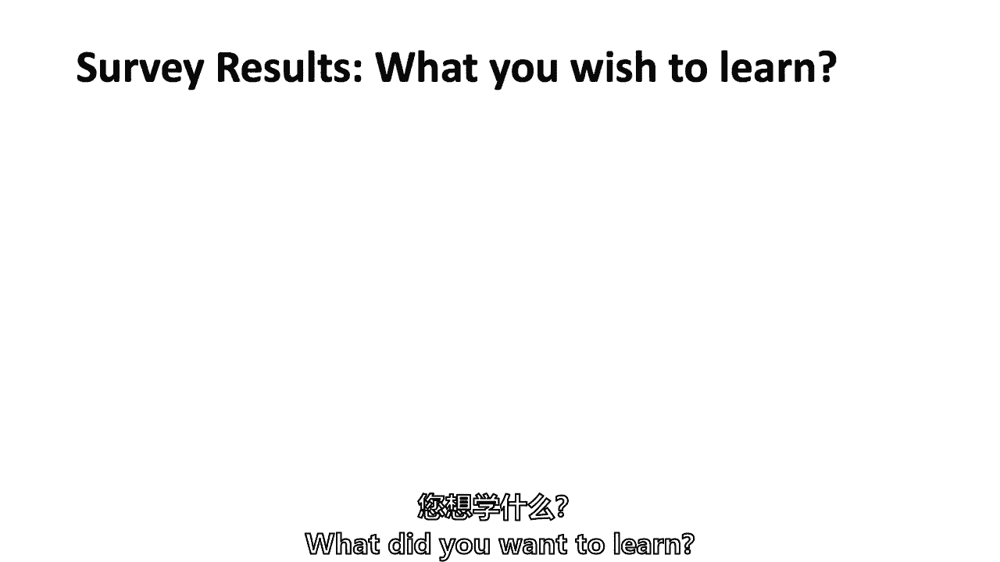

这真的是你的课，我会从你身上学到同样多的东西。

但希望我们能涵盖你想要的，所以这里有一个列表，列出了那些至少是由，你们两个首先是技术问题，你们中的18个人说了解区块链技术。

希望我们能做到这一点，但你可能会发现，在这节课后，你会想做更多的事情。

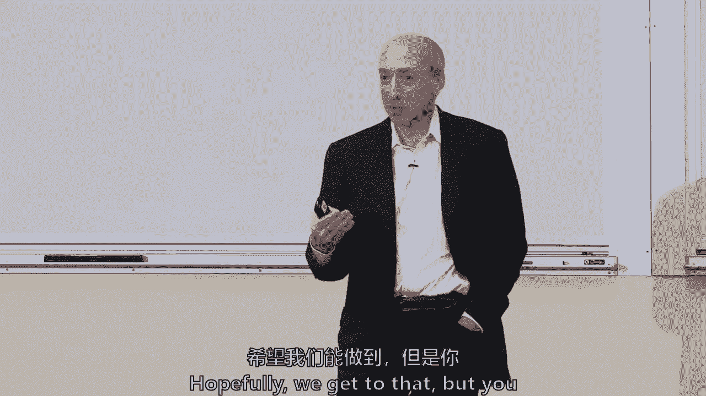

生态系统和能够进行有教育意义的讨论，围绕区块链的晚宴对话。

我想我们会成功的，但在学期结束时，我们要把这些幻灯片再拉起来，我们将看看我们作为一个团队做得如何，你们都谈了很多应用程序。

你如何实际应用它，在风险投资领域学习它，思考它在世界上真正起作用的地方。

我想我们会在这上面花很多时间，在下半场，但在整个过程中，我们将谈论经济学，现实和炒作是什么。

你也想了解它对人们生活的影响，规则大约你们六个人说了一些关于规则的事情。

我很高兴，因为我们只做一次关于这个的讲座。

但我们要把它摊开，因为正如我们在第一堂课上所说的，我很荣幸拉里又来了，但我们会一直思考拉里的四种方法。

我看到是他，拉里·莱西你是什么，摇了摇头，是呀，所以我知道。

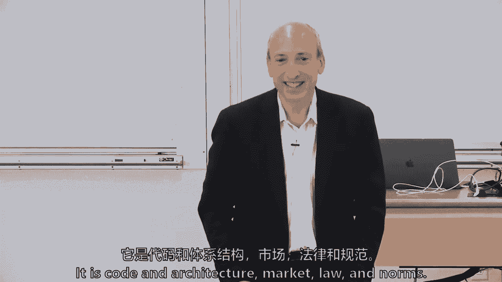

你得到了它，有人想说这和区块链有什么关系吗。

我们为什么要谈论这个，哦，我的天啊，我得感冒了，咳嗽得很快，对吧，哦，你是第三区的，笑话，是也不是，我记得上一节课的时候，但我现在可以把它和区块链联系起来。

你能和生活中的任何事情联系起来吗。

也许不是艾伦帮忙，你的桌子，我在等我的女人签字，不是这里，这是我玩得很开心，你知道这就是我要做的，我只是想玩得开心，别太担心，那么我为什么听说市场法典。

我看不见你的名字吗？但这是黑暗，是啊，是啊，为什么这和这一切有关系，你会很好地，你要重复这个问题，因为你经历过，拉里怎么，拉里的四种力与我们的，我们的话题是什么，这四种力量又是市场。

所以商法代码或体系结构，称之为技术和社会规范，嗯，所以我想这是因为它带来了一种做这些事情的新方式，就像一个新工具，为了，所以我从卷轴上得到的是这些账簿已经存在了，但考虑到现在我们有两件事，比如说。

和更多的事情帮助我们的社会走出去很好的方式说它看，这对我不公平，不是读数之一，我只是说生活中的每一件事，我发现这些东西互相摩擦。

我在华盛顿花了很多时间从政。

但是市场以及商业企业和经济是如何与技术对抗的，有点违法，当然还有社会规范行为，这四种力量几乎存在于一个人一生中所做的每一件事中，你会发现，所以我只要求你永远，不管是一种阅读还是另一种阅读。

把它带到你这堂课的思维过程中，我不打算给拉里分配任务，我甚至不知道他会在这里，但我一直认为思考是一种很好的训练，好的，商业现实是什么，市场，有什么技术，即使是在更早的一天，这是汽车取代马车的技术。

作为政府或官方部门。

把它变成一套需要的标准，然后我们作为一个社会如何。

即使不需要我们的行为，就是这四种力，这就是为什么我可能在拉里的课上挂了，但我就是这么想的，我做的可能是对的，你知道的，他在摇头，这就是为什么我停在那里。

所以我们每节课都有，但只有一次讲座。

货币与市场，那是另一种力量，你们五个说要赚钱，我为那些这么说的人鼓掌，因为拥有它，你在商学院，为什么不呢？

但是投资和转换，现在有一堆其他杂七杂八的话题。

我不打算穿过它们，我觉得最后两个是我过去的有趣轶事。

我不知道是谁说的，我不知道你想知道我三个女儿的什么，我的跑步还是这个，你知道墙。

街头用品和金融，我也想了解超比特币。

但我不知道是谁问的那个问题，我不知道那是什么，所以我会试着找出什么超，有人想承认这个问题吗。

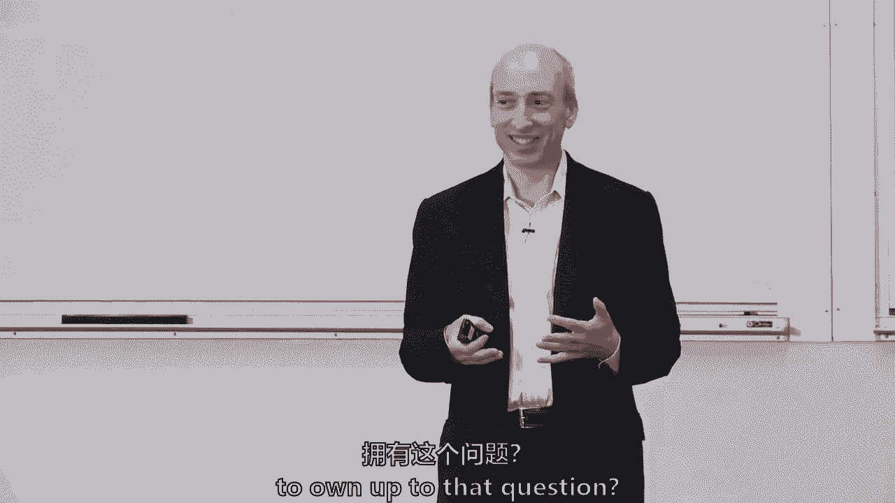

他们是匿名的，所有的权利，所有的权利，那么今天的学习问题，货币在历史上和今天的数字经济中扮演什么角色。

这是我要寻找讨论的时候，有人想告诉我钱的作用是什么吗，你对此作何回答？

交易媒介，和。

县单位的单位，也喜欢发展的状态，所有的权利，所以这三个，人们谈论的三卷经典的钱，凯利，你想重复你刚才说的话吗，这不是问题的一部分，但我认为从历史上看，你知道，并征服各种土地奖励，减税，所以很多，呃。

推动文明向前发展的社会事物，我们今天要讨论的，金钱是一种社会结构，这是社会走到一起的事情，是否很难说，不管是五千年前还是八千年前还是一万年前，它真的是，这是一种社会共识机制。

嗯，但我们一会儿要谈谈读数。

回到那个问题，法定货币是做什么的，有人想汤姆吗。

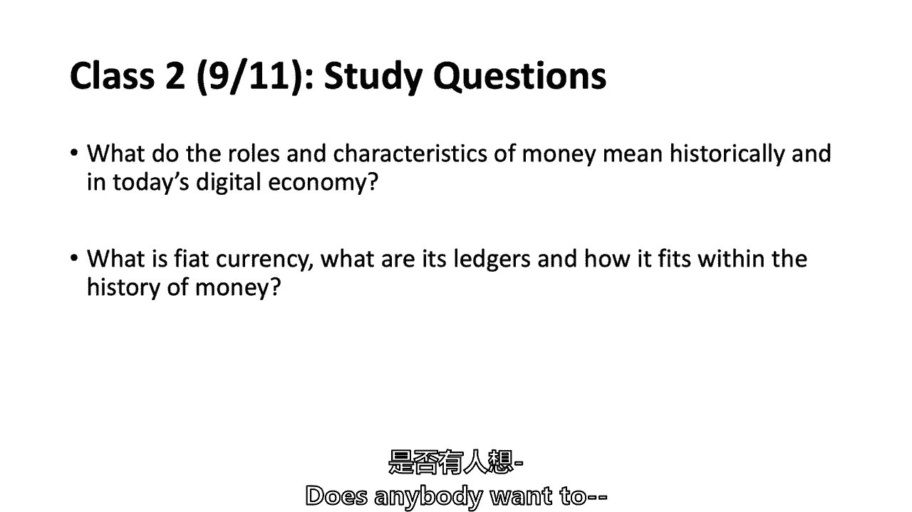

你想告诉我们什么，法定货币是，那是谢恩，托马斯，见，我认得你，所以这是一个景象，所以这就像是一种既定的货币，由中央政府，政府在市场上关闭，所有的权利，所以你说它是一种中心货币，它是由一个政府。

还有人想补充一些东西。

是凯尔吗，我只想补充一点，它没有任何实物商品的支持，任何东西，所以它没有任何实物商品的支持，真的只是为了国家的诚信和信用，发布它，丹尼尔，你想补充什么吗？有人让我们把金子拿回来。

或者类似的东西，但一直都是这样吗，货币可能有实物支持。

提醒我你的名字，对不起，乔希，我想专门可以用来还债。

特别是那些给政府的，所以税收所以税收，并提醒我你的名字，因为我看不到卡片，怎么样怎么样，所以基本上货币没有内在价值，所以基本上没有人意识到这就是问题所在，货币本身，没有那么，这里有个问题要问全班同学。

非法定货币有内在价值吗，因为肖恩唱歌，这可能是菲亚特的一个显著特征它没有内在价值，实际上，这同样适用于我们习惯的任何商品。

一般支持一种货币，因为这只是某种特定资源和社会共同协议的稀缺，那将是，当时说，有多少人更符合埃里克，或者没有一个正确的答案，这是一个已经争论了几十年或几个世纪的问题，但是肖恩的阵营里有多少人做到了，嗯。

我想这取决于，比如说，黄金绝对像社会概念，我们决定作为一个人类社会，目标是有价值的东西，但就像，如果这就像，你知道人类能吃的谷物，你知道，我认为有一个内在的价值。

所以我认为有非并发性，它们有内在的价值，这没有内在的价值。

呃只是想说，呃，第一个有另一个组件，也就是，呃，事实上，它是政府的法定货币，呃，一些县，呃迫使社会使用，呃，CO，这使得人们作为一个我们使用更舒服。

是说法定货币是法定货币。

所以首先我们要讨论什么是法定货币，有人想把那个打出棒球场吗。

谁还没有举手。

我想这可能是我之前的评论，它可以用来沉淀深度，特别是对政府的，所以你可以用黄金作为货币，它可以是价值的储存，它可以是一种交换的手段，但你不能支付你的税和黄金权利，你有，什么是正确的，十九世纪你能纳税吗。

在黄金在U，s，在英国，在其他有黄金货币的国家，只是一个是还是不是，但是詹姆斯，是的，但直到1970年，目标是，纸币的货币依附于金本位制，天生如此，有一种由政府或银行盯住的价值交换，或者中央银行。

所以在当时几乎是同一件事，直到最近几年，詹姆斯说你可以用黄金作为法定货币，法定货币也是一个社会聚集在一起制定法律的东西。

你知道的，回到小四，那是一个，你知道的，社会共同说这不仅仅是一种社会规范行为，这是法律，在美国，s，和英国，和许多国家，上面写着，所有债务，公共和私人，所以欠政府的债，或者商店里的债务，我们稍后会讨论。

什么时候真的有人要拿走你的现金。

但我打算等一下再讨论这个问题。

但我也认为，他说，他介于肖恩和埃里克之间，在课堂上都是身体上的，就她的说法而言，法定货币可能没有任何东西。

黄金背后大多没有任何内在的东西，然后一些形式的货币，如谷物，有更多。

所以说，也许是一个，这是一个连续体。

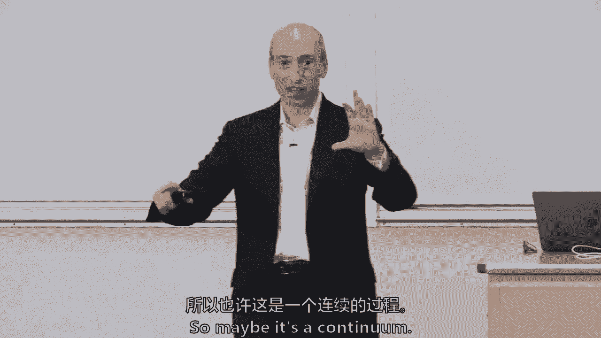

也许不是，你知道的，黑白，百分之百或零%，然后我们要谈谈，比特币是如何融入其中的，我们接下来的三节课将会深入比特币技术。

但在我看一些演讲幻灯片之前，我只是稍微梳理一下，谁想谈谈比特币如何融入货币的历史，然后我将在大约4-5分钟后回到这个问题，再问你一次，但有人想说从读数来看，如果你提醒我你的名字，带比特币的伊莎贝尔。

在社会赋予价值的地方也是一样的，除了用比特币，它没有中央银行的支持，所以人们不认为有内在的价值，但它就像，但读数指出它们是相同的历史，但事实并非如此，伊莎贝尔说比特币符合货币的历史。

因为就像法定货币一样，就像他说的金子，它不一定有任何固有的货币价值，但这是一套社会规范，人们接受它有价值，但伊莎贝尔说的关键区别是，它不是中心，它没有任何中央银行的支持，它没有中央银行或中央当局的支持。

一条线，是呀，那么是哪一个，依我看，是独一无二的，因为我认为频率的值随着时间的推移而变化，不是我们看到的波动，六千到一万九千美元，点本身的效用，所以今天，比如说。

我们也许可以用比特币买披萨或咖啡或其他东西，所以就最小交换而言，有一个内在的价值，它会随着社会越来越多地采用它而改变，所以我觉得很难定义。

是否有内在价值，所以安正在筹集比特币。

如果我能把一些话在你嘴里告诉我，如果我是正确的，比特币可能有一些与法定货币不同的特征，它的价值随着时间的推移而变化，我是说你没有用那个词。

嗯，请再告诉我你的名字。

我们是对的，像英国人，但你之前告诉我的是一个o，粗野的，所以所以我想，另一种思考货币问题的方式是后来技术的发展。

比如会计和货币的演变，和它一起，最初就像我们在阅读中看到的，以前的情况是怎么发生的，在茶的出现，然后是分布式层，这是基本的，比特币的基本块之一，对呀，所以这是另一种方式，你想要多少的自然进展，如此野蛮。

是啊，是啊。

所以布罗蒂什养的，比特币也符合分类账的历史吗，不管是复式簿记，分类账通过t账户或其他形式的分类账确认，所以它增加了账簿的悠久历史。

我同意那一点，这是一种保持账簿一致的新形式。

所以比特币也类似于黄金，有一种卡森的元素，稀缺性，是啊，是啊，所以我们不能生成那么多比特，每十分钟只产生50个比特币每四年发生一次。

如此稀缺，似乎稀缺性和分类账是Viva的重要组成部分。

是呀，所以它确实有固定的需求，就像一句对不起，固定的供应，就像你说的稀缺性而言，但我们越采用它，就单位而言，它就越可分，所以我们可以增加它的使用，因为现在你可以分割，你知道，你可以把它们分成。

这就像能见度是金钱的另一个特征，稀缺性。

对不起，托马斯，正如我提到的权力下放，因为这些是实现，它让这个，呃，使实现变得可行的比特币，在权力下放的环境中进行讨论，所以没有任何东西可以做设计，或者规定了共识的供应和其他方面，我们再拍一张。

然后我将开始谈论历史。

我们何不到这儿来呢？提醒我，你的名字，亚历克西斯，阿列克谢·钱，和其他形式的货币一样，即使它不受，像中央政府或中央银行，好像没有固定的汇率，与其他类型的货币波动极快。

所以我的意思是它仍然很深，所以亚历克西斯，如果我明白，亚历克西斯的观点是比特币没有固定汇率。

我们说的是，但我们真的不能把它扩大到所有形式的货币吗，我的意思是什么，一盎司黄金之间的汇率到底是多少，一蒲式耳玉米。

是呀，我是说是的，但就像，比如说。

我们还有其他机会，所有的权利，说得好，亚历克西斯说是和不是，因为一些政府现在试图修复市场，效果如何，我是说，只是一种阶级的感觉，那行得通吗，所以它在短时间内可能会很好地工作，效果不太好，用于，你知道吗。

十年一，我再拿一个。

然后我只想经历几件事，你可以在工作时间上修复它。

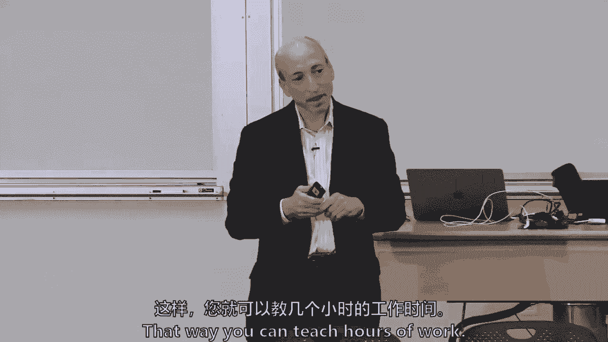

但如果不是，怎么是自由的权利，但我只想问什么，传说是什么，什么是分类账，很好的问题，嗯，我一会儿就会聊这个，但有人想，打那个。

哦，对不起，呃不，我们在这里，因为它只是以一种方式记录的一切的数字记录，数字记录。

我认为这是件好事，分类账基本上是记录，社会关系或财务关系，我想说这既是记录经济活动的一种方式，这是一个记录财务关系的系统，虽然我没有分配这些读数，有些很好，学术研究表明。

最初的书写方法和书写符号与数字有关，与账簿而不是文字有关，因为记录对社会来说是如此重要，社区成员之间的财务关系，不管是一个小村庄，或者几千年前社会从村庄爆发出来的时候，我们会回来的。

你在这里问这个比在你的会计基础上问更好。

类，我不知道，所以我们讨论过的读数。

读数，你们中有多少人看过这个三分钟的小视频，你在想什么我是说，只是一个。

我很抱歉，我们还没聊天呢，我认为广泛的基础是任何货币或任何类似的东西都有价值，如果你愿意，一个社会赋予它的权利，而是因为视频基本上只是展示了创造自己货币的人，只是把它卖给公众，他的全部主张是这是真的。

如果你相信是这样，只是，这是夏威夷的一首很好的小曲，对不起，我想给他一美元。

你就会给他一块钱，我知道比萨饼卖了多少钱，别人会给他一块钱吗？不，也许你真的。

我在用当地货币工作，这是一样的，但它们只是你可以在本地使用它，我的意思是它把钱留在社区里决定使用这种交易方式的人，我们将回顾这些读数中的每一个。

在接下来的四五分钟里，但是是的，我担心他真的犯法了，通过向美国发行自己的货币，合法的美元。

你显然没有和新话题竞争，但你知道，你是个很好的问题，我不知道任何。

成文法，联邦或州，关于货币形式，就像其他东西一样你知道门上的那个槽，那叫做你可以把信放进门或邮箱的地方，实际上有一条法律规定，s，邮政服务垄断。

这就是为什么UPS不允许把他们的盒子或任何东西放在里面。

有政府的法令垄断，但你提出了一个很好的问题，我们在过去十年中发现的，用比特币而不是过于简化，因为创造你自己的形式是合法的，但你必须遵守所有其他法律，以及我们在其他课上讲到的其他定律。

本质上落入防范非法活动的水桶。

所以银行保密法，金融，以此类推，一个人仍然必须支付你的税，如果你在这项投资中获利或亏损，美联储和全球其他当局仍然希望确保金融稳定，街上的家伙，我不记得纽约哪个城市卖他的美元了，马修花一美元买的时候。

我想在这里，那是什么是的买了它，我们可能会有，社会还是会稳定的，一切都会好起来的，但如果数百万人购买它，那么人们可能会担心，然后是我们看到的第三个大桶，作为投资者和消费者保护，但我认为这是允许的。

所以我们把这些称为乔，奎因，然后我要继续，你合法地支付，比如说，比特币工资，在美国，为什么你可以合法地用比特币支付工资，在美国有人，我知道这超出了读数，但为什么你认为这是允许的。

当任何合约容许该等补偿形式时，或者大多数事情，你可以在这些标语牌上付钱给某人，我真怀疑你会重视它们，但你可以用这个付钱给别人，你可以用金子付给某人。

比特币，有些公司在付钱，通常他们在开发区块链应用程序。

他们必须计算工资的价值来预扣税款，因为U，s，所以他们计算出公平的市场价值，美国有公司，It’那很划算，围绕区块链应用做开发工作的比特币人，但是税收需要计算和分析，然后付钱和U，s，美元。

因为今年早些时候亚利桑那州有一项立法倡议，成为美国第一个接受比特币征税的州，但在委员会中失败了，它甚至没有得到全体投票，我不记得了。

但是。

所以只要稍微回顾一下历史，我想做一点关于钱的历史，找点乐子。

嗯，所以在埃塞俄比亚，人们把盐棒放在一起。

这是不久前看到的，就像吉和之前说的那样，在社会上真的很有价值，他们规范了形状和大小，说这里有盐巴，我们稍后会讲到。

货币的所有特征，但你还觉得呢，埃塞俄比亚的一个盐巴，而不是其他国家，什么，它有什么，以及为什么人们会使用它，那是什么原油，地狱，所有的权利，我没有想到这一点，我会一直想的。

它不是，这不是金钱的共同特征，但是为什么盐巴，它在埃塞俄比亚还会有什么，你会看到你可以用盐来保存好吗。

你可以保存食物，而是因为它被布雷了。

也有一些稀缺，还有很多货币，随着时间的推移，很多钱都有一个基本问题，牛壳，有人知道…的历史吗，当考伊贝壳真的贬值了，从读数中不再使用时，我不记得读数里有没有，或者不是。

当欧洲人开始意识到他们被接受为一种价值观时，他们开始立足，这是一段非常悲伤和可怕的历史，我也是，因为它与整个奴隶贸易有关，欧洲人可以发现，社会接受这是一种有价值的东西。

但它们也使货币贬值，他们贬低土地，抓人当奴隶，我是说，这是一个相当多的不是特别好的事情的集合，英国的计数棒，从读数中有没有人，因为在第一次阅读中有一点关于货币历史的争论。

想聊天，我会把你的黑麦石头拔出来。

这与第一次阅读有何关系，争论的焦点是钱是来自历史上的边界，还是金钱来自账簿和信用的历史，这是第一次的设置。

我想一读，有什么想法吗，这四块钱是哪一个。

早期资金，或更多关于，也许以物易物。

呃，所以他们，他们很酷，两个理论，对呀，呃，与这个相对应的，这是测量棍子的方法，六个，计数说是的。

正确，这是这里的第二个，这实际上与债务有关，和贷项，所以值得注意的是，在雅浦岛上，这些石头如此之重。

他们不可能拖着它到处用，你知道在传统的交换媒介中，但也被认为是，我有六分之一的莱茵石，你有一个16，然后如果我做一个交换，我们会记得，社会很小，可以保留一种分类帐形式，甚至当一块莱茵石掉进河里时。

他们说，你知道的，河黑麦一号，我们每个人都有这一块，所以在雅浦岛上。

我可以向你保证这些石头不能用来做其他事情，有谁知道，因为它在读数之外，是什么使这些石头如此稀少。

所以黑麦石是在一个岛上开采的，离雅浦大约两百公里，所以像金子一样很难得到，就像开采黄金，这些天脑子里还有什么可能是钱。

那是什么，我听到每个人，那是什么，电池的电池。

这将是，在未来是非常困难的，用于电电池。

现在有什么想法，那是这门课的中心，比特币，对呀，Yap石基本上是在几百公里外开采的，是什么使这种货币贬值，从英国来的水手，有一个特定的水手，我想他的名字是19世纪末的奥基夫，他意识到这些石头很值钱。

他去了另一个岛，他开始采石，来来回回，几年之内，整个经济体系崩溃了。

我们转向金属货币，一开始它并没有真正盖章，只是很重，很难查询，罗马青铜。

瑞典有一些瓷器，这些开始被官方部门盖章。

然后我们铸造了钱，从大约两千五百年前的某个地方开始。

关于它是始于希腊还是始于中国，存在着争论。

嗯，和，但是官方徽章被放置在稀缺资源上。

纸币在某种意义上出现了。

出于什么原因，为什么社会首先向纸币倾斜？嗯，因为没有足够的黄金来支撑它。

我是说，好像有一个原因是金子不够，对不起，我没有，我想它只是很容易使用。

有点重，尤其是如果没有金子，如果是铜或青铜。

只是很重，或者是小麦，你得把它放在一个储藏室里，所以第一张纸币来自中国，基本上是仓单。

我花了五年时间经营一个叫做商品期货交易委员会的机构，所以我想我学到了很多关于仓库收据的知识，把商品放进仓库的商品收据，然后你得到一张纸，上面写着，是呀，你那里有那种商品。

所以在中国最早的纸币基本上是仓单，因为不管是谷物还是黄金。

然后你有一张纸支持它，这是英国的五英镑纸币和美国的大陆纸币。

但在中国，这个音符大约有七百年的历史，但在第一张纸币和18世纪之间。

你认为谁是17世纪末最早的银行家。

十八世纪初，在从事银行业之前，他们从事的是什么行业？

贸易，交易阿尔法，国际贸易，国际贸易，他们实际上做了更多的事情，当地。

我想谈谈这样的事情，那些有车道的。

有车道的和所有的地方车道，土地土地没有。

他们有其他的东西，他们正在做汤姆版画家，我喜欢我们还没到那一步，钱，那就是他们稍后会取消保险。

伦敦一些最初占主导地位的银行家。

他们是小金匠，他们拿走了金子，他们给了你一张纸，然后他们从那里走了，本学期晚些时候我们将讨论比特币信用。

它不在那里，然而，顺便说一句，我想在接下来的18到36个月里，我们将开始看到加密贷款，和加密金融的形式，类似于17世纪早期英国的金匠，对于有限数量的，在我看来，这是一个很好的问题。

以有限的抵押贷款是可扩展的吗，我想是的，但它不是，还没做完呢，对呀，嗯是的，因为当你借钱给别人的时候，我想它不可能是比特币的形式，但你借给别人美元，他们可以兑换比特币，增加货币供应量。

对呀，所以你不需要，你不是在到处转钱，所以这正是今天商业银行的中心。

这叫部分银行业务，我们稍后会讨论这个问题，而是对是，你可以，你可以，你可以降落，然后产生乘数效应，你也有，然后银行开始发行私人纸币，有效的私人钞票，该银行的负债，并说它会交易。

而私人纸币的历史通常是你所知道的。

好，直到它真的很糟糕。

和货币的历史，这个国家有很多私人银行破产了，革命时期前后，又是在内战前后，嗯，本质上，这就是我们现在所拥有的，有一百种不同的加密货币，我们有一个新的时期，有点私人，我只要求你记住，当我们开始看科斯。

最初的硬币供奉等等，所以分类帐，前面的问题是分类帐是什么。

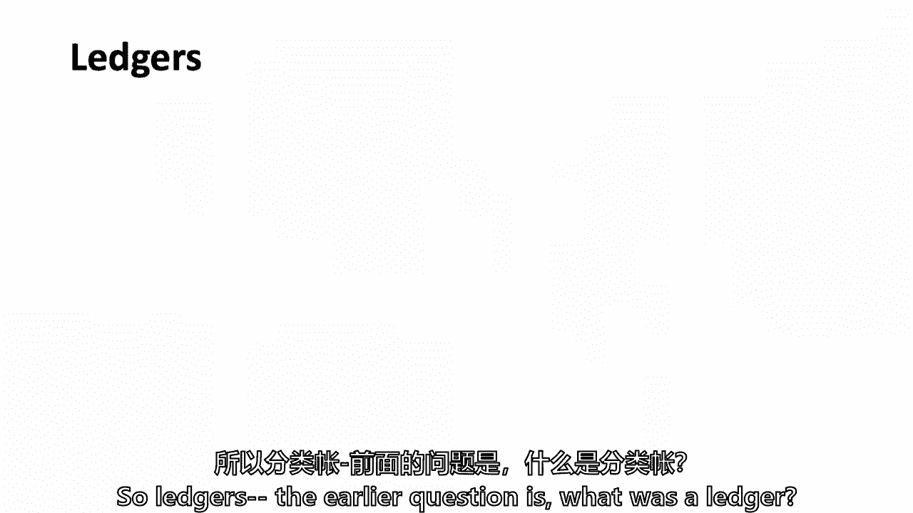

是你自己问的，你还记得什么是账本吗？这是记录经济交易的一种方式，你去那里去，五千年前你对这个有一点了解，只是一个中等的帖子，这不是一篇深刻的经济学术论文，但这是为了让全班同学思考，分类账。

这是乔治·华盛顿的个人账本，我们的第一任总统，他保存这本账本的时候才十五岁。

他显然一直保存着账簿，直到他死，让我们看看五年后，嗯，但账簿可以用来记录当天的交易。

他有一个在那里，玛丽·华盛顿，一定是表亲，或者我不记得是他妈妈了，所以如果它们是账户的主要记录，我已经说过了，它们记录经济活动和金融关系。

交易意义上的经济活动，财务关系，关键的财务关系是什么，分类账可能会记录，对不起，凯莉说的，债务，这可以追溯到你在阅读中的辩论是边境的历史，它是从边境出来的吗，它是出于债务、信用和价值储存的感觉吗。

今天为了这个目的，这并不重要，它可能来自两者，但要知道它有两面性，账本有两面性，我也是，当我们谈论比特币的时候，比特币，您将看到的是一种存储事务的机制，其他一些区块链，比如以太坊商店，结余。

所以即使在区块链世界里，你会看到一些是平衡分类帐，一些是交易分类帐。

不要失去你，迷惑你，但这是区块链的重要组成部分。

某些类型的分类账。

我刚才提到一笔交易与余额，乔治·华盛顿的账本，顺便说一句，我想是交易分类账，他只是在保持，你知道销售和活动的清单，但我没学过总统。

乔治·华盛顿的账本，足够近，有谁知道足够的会计告诉我。

总分类账和子分类账之间的区别，或总分类账和辅助分类账，我是说，我不想一个人做整节课。

你们中有多少人做过会计，所以刚才举手的人，谁做了会计。

我在房间后面看到了吗，你学过会计吗？那是英杰华，所有的权利，所有的权利，你通过注册会计师考试了吗？

哦，我们有一个认证的公共账户，将告诉我们总账和分账的区别，总账是记录各种交易的总账，发生在总分类账和子分类账中的任何类型的活动，你可以把它们称为专门化，所以，让我们说，如果有薪水或呃，待付。

有一个工资明细帐，但它也会出现在一般的传说中，以及薪金分类账中会计事项的其他部分，或者如果有，或者你买了一些新东西，所以所有这些都是在一般情况下，它们每个都有自己特定的leif。

你想说这个月你花了多少钱吗？你去你的工资传奇，但如果你想知道你花了多少钱又花了多少钱，然后你看你的英杰华将军，说得很清楚，比我能说的更好，谢谢，现在我们知道我们班上有一个注册会计师，但是重要性。

这不仅仅是一个短暂的音符，总账和分账的重要性在于，也有等级制度，子分类账有更多的细节，也许总分类账上有净数字，这是我们银行体系的核心，是我们金融市场体系的核心，中央银行就像货币的总账。

和每个商业银行在其中的9000个左右。

但他们无法控制什么，我会叫总账或总账，美联储，那么关于分类账的第三个区别是一个单一的条目，一个15岁的小年轻乔治·华盛顿保留了一个条目。

分类账，只是一系列正在发生的事情，我不认为我会去上阅读课，关于复式簿记，因为你做了会计，但除了英杰华，还有谁想告诉我，什么复式簿记，她会保释你，复式记账法基本上是指任何交易在分类账中有两个地方。

一个在信用端，一个在网站上，因为每笔交易都涉及一个人在另一个人在的地方放贷，它越来越，对我有效，其他人想要不同的观点。

看待这起事故的另一种方式，担保责任，两个地点，然后把基本的和支付的利息相互平衡，资产和负债之间有一种平衡，如果资产多于负债，在某种意义上是复式簿记，事实上，而它可能可以追溯到一千多年前。

当它真正被意大利人写出来的时候，在百分之十三，它开始帮助你走出黑暗时代，我指的是中世纪的商业复兴，有些人会说这在一定程度上不完全是，但部分原因是复式簿记，所以账本很重要是我的观点。

他们不会成为这个班的核心和灵魂，但是比特币是一种交易，分类账，以太坊，这是一个平衡的分类账，我们的金融体系，这都是建立在分类账上的，是一种相关的潜台词，你不必害怕它，就像你不必害怕哈希的力量一样。

我们将在周四讨论密码学，但你必须有一些，你知道的，基本的感觉，比特币适合哪里，在分类账方面。

我没有填这张幻灯片。

你会发现它是空白的，有人想告诉我，一本好的账本有什么特点，因为再一次，当你在学期后期开始考虑你的区块链项目时，就像一本好的账本。

我在这里没有任何答案，比特币世界是相互的。

所以你希望它是不变的，也许对ITA。

你能帮我个忙把这些，我们会把它们放在幻灯片上，当我们把。

我们会保留课程表，我们会把它们放在幻灯片里，不变的，我喜欢别人想拿东西。

这是一本很好的账本，时间戳是什么？

这样你就知道，当你进入时。

方钻杆所有权，你说的所有权是什么意思，本质上是接受者和给予者，谁在拿谁在给，如果有交易，交易的两个对手，如果这是一种平衡，那么谁拥有余额，我只是加了一点，让我们看看后面的桌子上是否有新的名字或面孔。

我还没和你聊天呢，那个罗斯罗斯是什么，谢谢。罗斯很高兴见到你，快乐，你的准确性准确性，所以罗斯说准确性，我们能再拿一两个吗，只是交易的描述，安德鲁说，交易的说明，最后一个，某人燃烧的欲望。

我们错过了一两个哎呀，好吧。

我只是对一致性很好奇，也许吧，但我不知道这是否是一致性，嗯，我想这就是永恒性的内在，从本质上说，它是有效的，你不能。

你不能改变它，你不能伪造它，之类的。

你会发现一个好的特点，分类账在某些方面也类似于好钱的特征。

他们不一样，但它们重叠了很多支付系统。

我只想说一句。

这是一种方法，基本上是修改和记录货币分类账的变化，我知道这不是你通常认为的支付系统，但如果你去星巴克买一杯咖啡，用你的手机，你不是在修改账簿吗，星巴克的账本上升，是的，你的账本下降得很好。

你的货币账本增加了你的效用，你从拿铁咖啡中获得的满足感可能会上升，我说的是财务账本，所以我只想接地，当我们谈论支付系统时，通常是双方账簿，一个在上升，一个正在下降，在更早的时候。

它递给某人一点金子或一点银子，中央账簿上没有记录，但我们已经生活在一个电子时代，所以这真的是一个支付系统，很大程度上是，不完全是，还有一些其他的方法可以做。

金融，那么支付系统的早期形式是什么呢，只是移动和改变账簿，它们被称为可转让订单，我敢说你们大多数人可能都没有使用过可协商的取款单。

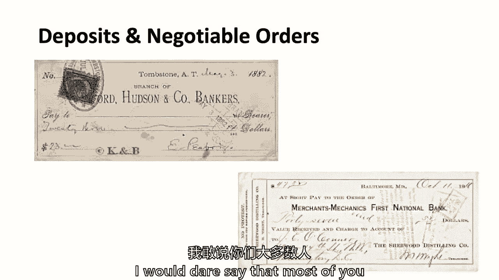

上周或上个月那么多，上周这里有人写过个人支票吗，但在更早的时代，会是全班同学，班上任何人都没有支票簿，班上四分之三的拉里，这让你有什么感觉。

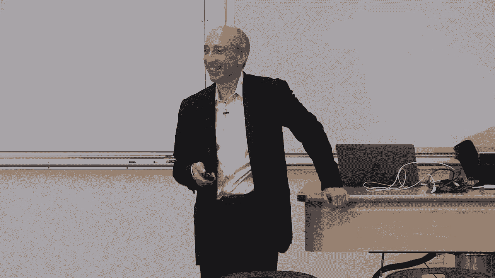

但支票簿本质上是一个，你在支票上写什么，这都是关于比特币的，现在我不这样做，就像在拉里和我的记忆中漫步。

可谈判订单的重要部分是什么。

取款或支票，我们会在上面签上你的名字，所以有一个签名。

还有什么，我只想让人们，我还没在后面说过话，我记不起你的名字了，你投入多少和它的用途，所以有一堆，所以一个签名，A支付E，多少钱，还有什么，有帐号和路由号码，帐号和路由号码，所以想想计数号码和路由号码。

只是说，本质上，这是什么账本，收款人是分类账，它要给谁，我很抱歉，丹也是一个日期和一个日期，所以有一个时间戳，签名，A支付E，付款或以帐号和金额的形式支付，这五个真的很关键，你会发现他们是对的。

在所有这些比特币中间，然后你为什么，你知道一些其他的信息。

对不起，还有别的事吗，我有个问题。

你会考虑像贝宝或Venmo这样的东西吗，就像可谈判的订单，他们可能是，它们可能是新的形式，它们当然是支付系统的一部分，为什么他们可能是不可谈判的命令撤回，它们可能不是直接授权，他们可能会进入自己的账本。

但是你问的问题是对的。

所以我们已经谈过的一些早期的钱，那是账本是英国的计数棒和雅普石，这些是账簿类型和货币形式。

有点有趣，所以分类帐不仅仅伴随着电和电脑。

现在让我们回到法定货币。

前面问题的核心，我们已经谈过了，所以让我们看看教授做得怎么样，因为你已经说过你说的一些东西是法定货币。

社会和经济共识。

我不我在那个学校，这只是历史的一部分，这和来的一切没有什么不同，尽管它是建立在中国的期票上的，七百年前，它得到的私人钞票，和17世纪的金匠。

它代表中央银行的负债。

这很重要，这是中央银行的责任，这不是资产，这是他们的责任方，但你猜怎么着，还有第二种形式的钱，那是你在银行存钱的时候，那是商业银行的债务。

中央银行是使用黄金一词的最高金本位制，但这是最高的账本，商业银行就像分类账，在某种意义上，拜托了，我不是经济学家，对于硬币或纸币来说意味着什么，成为中央银行的负担，在我回答之前，这到底是什么意思。

有人想试着回答什么吗，它是这里的一个。

责任基本上是一种义务，在这种情况下，你付一些。

某人，因为这是社会共识，这是一个，Elena问了一个很好的问题，作为中央银行的负债意味着什么。

当它只是我们口袋里的货币。

对呀，这张美联储票据，上面写着，美联储关于它的说明和，对呀，我们可以通过，我不怕只要一块钱，但是，你知道吗，对呀，加入我，大约二十秒，然后我想要他们回来，你知道，但上面写着美联储纸币。

对呀，所以这是商业银行的负债，在早些时候，据说你可以把它换成黄金或白银，所以这就是我，但到了20世纪30年代，零售存款。

罗斯福总统不再说了，你不能，你不能赎回金银，然后尼克松总统，在二十世纪七十年代，在官方部门说他要离开，直到那个时间点，其他政府可以用黄金赎回，但是当纸币开始的时候，它没有黄金作后盾。

我们有一个金本位制的时期，我们上上下下，我们从上面掉下来了，第二次世界大战后，第二次世界大战期间，我们又回去了，说这是一个错误的叙述，我们在最初的140年里一直处于金本位制，我只想澄清一下。

我是说我们采用了金本位制，我们离开了，我们又回去了等等，但这是账簿和记录上的负债，所以作为会计和复式簿记的问题，我马上给你们看美联储的资产负债表，我会回到这个问题，可以吗，你能澄清一下。

银行在给我一美元之前要承担什么责任，我现在就可以去找美元拿回黄金，它现在有什么责任。

它本质上是一种社会，这是第一点，我在分离中央银行，他们有责任在账簿上移动，如果你想把它搬到别的地方，所以你可以接受物理上的，然后说，我想把这个存银行。他们必须把它记录在银行的分类账上，他们就是这样。

那就是，和U，China’技术上独立于中央银行的政府，从技术上讲，它们都与银行分开，或者英格兰银行他们的政府说他们会接受它来抵税，所以它依赖于一套社会结构。

我将通过这个来回答你的问题，它依赖于一个分类账系统，它是银行系统和商业银行之间的分类账的集成。

在美国，我们有大约九千家商业银行，美联储的说法，关于欧洲中央银行是真的，如果你把你的纸币带进来，我们会记录在商业银行的分类账上，你可以把你的税付给我们在这里的妹妹，打电话给政府，对不起，让你失望了。

不过如此，对不起，埃兰。

我有一个潜在的答案，我可能完全错了，是的不，我认为进行庞氏骗局是一种合法和可持续的行为方式。

用，是啊，是啊，用适量的，价值将增加1%到3%，如果你，如果中央银行达到通货膨胀的目标，我看到的其他观点。

我看到，我不知道你的名字，哦不不，你没有，你什么都不想说，不，好吧，我想我要回到第一点，所以它是一个，这是一种结构，有人会给你一些东西。

所以你在中央银行的美元，中央银行欠你的，那一块钱值你想要的任何东西，有人会很高兴地从中央银行拿走那美元。

给你一个好的销售，你想要，所以这是个环形交叉路口。

的方式，这是处理某事的一种方式，一美元有一美元就有一美元，所以这也是中央银行的责任，因为，它可以发出新的节点，它有责任，所以这就是为什么它是一种负担，因为你只能根据你保留的一定数量的储备发行纸币。

所以这就是为什么你把它称为负债，因为你不能只发行新纸币，当你需要他们的时候，你不能凭空赚大钱，所以你在撒谎，我对此再做一次评论，然后在这里再给它几个东西，货币实际上是，的一小部分，联邦储备系统的储备。

我想也许银行储备，或者更适用的应用程序，因为银行实际上可以要求美联储通过发放更多贷款来印刷钞票，所以这样就有了这个机制来确保责任，我对这次讨论很满意，即使在莱恩对计划的贡献中，这是，这是辩论。

如果J·鲍威尔在这里，你们中有多少人知道J·POW是谁，这是杰伊·鲍威尔，很多杰伊·鲍威尔，你知道吗，谁是J鲍威尔，谢谢对不起，但如果杰·鲍尔我们在这里，他会笑的，加上艾伦刚才说的话。

但他也会说，责任是一种社会责任，也是，一个中央银行的核心相信他们正在努力做的事情，是为了保证这个社会事物的稳定，我们称之为钱，并确保它不会被贬低，它有一定的价值，所以它被接受纳税，我们谈到了纸币和硬币。

是法定货币，所有债务，公共和私人，我走进一家星巴克，我说我想喝杯咖啡，这是我的五美元，不管这些天花了什么钱，柜台后面的人必须煮咖啡吗，只是一个是还是不是，我能看看吗，谁想去争取，克里斯托弗拒绝了。

什么克里斯没事吧，克里斯拒绝了。

谁同意克里斯的观点，他们煮了一杯咖啡，我走到柜台的另一边，咖啡在那里，现在，到那时他们必须接受我的五个吗，是呀，在他们煮咖啡之前，没有人必须拿美元，但一旦债务成立，他们生产了好东西，他们提供了服务。

他们必须接受，只是一件小事，这就是法定货币，所以全球有很多机构基本上现在，张贴小标语，我们不接受瑞典计时。

我们不拿这个，我们不把它放在纸上，他们还是会把它电子化，有一种，关于法定货币有一点定义上的东西。

还有一些独特的税收待遇，但我不打算通过货币，所以中央银行和货币，我们谈了一点，这是一种图表，我从别人的报纸上借的。

但是高层的中央银行，它在中心，如果爱丽丝和鲍勃，我们将在比特币时间谈论爱丽丝和鲍勃，所以你可以把这个图表拉下来。

以后想交易，他们在同一家商业银行，那么第一商业银行必须改变他们的账簿把钱从爱丽丝转移到鲍勃。

本质上，如果你们都是美国银行的人，你可以在美国银行转移你的余额。

但如果你是美国银行去花旗，那么一定有什么东西在两者之间，分类账，美国银行的分类账和花旗的分类账，在两家银行的分类账之间进行交易的唯一方法，一些平衡的行为必须发生在被称为中央银行的最高分类账上。

稍后当我们谈论支付系统时，我将再次使用这张幻灯片，在学期晚些时候，这就是为什么我现在不打算在这上面花那么多时间，我们要谈谈分类帐。

当你在两家银行之间转移资金时，这一切都在一个封闭的系统中，那个国家的是，但后来它变得更加不确定和毛茸茸的，当你从一种货币转移到另一种货币时，因为你如何使两个封闭的分类账系统可操作，不是为了今天。

但我们以后再讨论，当我们做支付系统时，中央银行之类的，美国中央银行，这是唯一一张好的幻灯片，我可以找到，它大约有一年的历史，它的负债和资产约为4。25万亿美元，四点三万亿。

其中1。7万亿是货币，顺便问一下，我能拿回我的一美元吗，我是说我的责任，好的，是啊，是啊，所以这些美元中有1。7万亿美元在流通。

而且值得注意的是，尽管你们中的一半可能不太用现金，你甚至没有支票账户，你为什么认为那是。

一个可能一个词，2008年危机的后果和电视。

哦，那不只是一个词。

信任得很好，这确实与信任有关，但也与有关。

所以我们经济的某些部分和世界经济的某些部分，不想在电子银行系统中，我很快就会看完的，但我们全班还需要另一件。

这学期是学分和学分中介。

但只是一件小事，信用卡在六七十年前才开始。

但他们可以追溯到一百多年前的一本书。

信用卡这个词在这本书里用了十八次，一个1887年的科幻小说作家说世界会是什么样子，在2000年，这是我们第一次使用信用卡这个词，他说社会会有一种货币形式，你会有信用，这是一件令人着迷的事情。

有人可能是如此有远见，但是有商户卡开始了，也许他没有那么有远见，在20世纪20年代，石油公司的收费线正在分类，但它们是单一的商业绳索。

1946年在布鲁克林的一家银行，一个叫Biggins的家伙开始了，这是第一次真正的指控。

你可以在布鲁克林的几十个地方充电。

然后突然它起飞了，食客俱乐部始于20世纪50年代初，他们发现他们可以让一堆餐馆说，您不想赊帐吗？我们会支持它，最后在20世纪60年代中期，美国银行。

当时是加州的一家银行，他们发现他们会和一群其他的U建立一个合作社，有趣的是，要规范的法律，这一切直到二十世纪七十年代才发生，至少在美国，What’公平信用报告法，和所有其他法律，有三个大的。

在二十世纪七十年代，他们说，嗯，为什么政府现在不能解决这个问题，我提醒他们，从信用卡的出现开始，它花了十五到二十年的时间，在二十世纪五十年代初到中期，和20世纪60年代真正的起飞，那是1974年。

一九七七年，三大信用法，所以如果你要成为比特币的企业家，知道可能需要15年才能有一些密码法律。

嗯，在未来，那是加工机器，从二十世纪五十年代开始，我做得太小了，对不起签证让它变得更好，当然，这就是我们今天看到的，你的卡是如何处理的，所以我们已经讨论过的钱的作用。

所以我要跳过这一点。

但现在钱的特点是什么造就了好钱，我们之前谈过一些。

它很耐用，这意味着排序立方体不是最伟大的。

因为如果下了很多雨，会被冲走的，金银金属经久耐用。

它们是便携的，它就越重，便携程度就越低。

这就是为什么黄金是比白银更好的货币，你可以移动它。

比铜或青铜更好，它很容易被分割，你可以把东西切碎，统一的和可互换的，任何在这件事上陷入困境的人，如果你真的想了解钱，阅读关于克劳福德对皇家银行在1749年。

纸币早期有一位先生，寄了两张二十英镑的钞票，他就把自己的名字写在上面，他们在邮件中迷路了，他把银行告上法庭说这些钱是我的，当时，至于该怎么办，但如果你输了，或者有人偷了一件艺术品，你把它拿回来。

法律是在1749年制定的，你真的拿不回你的钱，有人想猜猜为什么法院，这是一个第一解释的问题，法院没有，他们在1749年之前没有这方面的判例，为什么法院裁定一件艺术品不同于货币。

它触及了什么是法定货币的根本，钱是谁想猜猜，为什么他们可以去法庭，另一边，你怎么能告诉我们。

他怎么签的，它是，事实上事实很清楚，是他签的货币，我只是在帮你，所以这是一个很好的观点，但他签了名，它不能作为交换媒介，如果你，如果它不属于那个人，本质上，如果你回去读，在这方面有一些历史。

阅读法庭案例，这就是重点，法院基本上说我们必须把这作为交换的媒介。

这是更大的社会利益，它必须是可替换的，苏格兰皇家银行，当然有点，你知道的，比这位克劳福德先生更接近法院，但银行也说我们不能跟踪这一点，所以这是两者的混合，但它使它具有可替代性，埃里克，有那么具体吗。

他签署的那些具体说明，是的，是的，是啊，是啊，在1749年它们都有序列号。

他们是以一种不是今天的方式签署的，当然可以接受，他们很稳定，我们将讨论最后一点，它们是稳定的。

因为它们很难开采，比特币也嵌入了这一点，货币的设计也很重要，你可以把它作为一个令牌，令牌类似于基于物理或帐户的东西，我们是，当然，现在生活在一个以账户为基础的货币世界里，它是数字化的。

不是身体上的，可以由私营部门发行，就像十八世纪的钞票，或私营部门，就像比特币一样，也可以是中心。

它可以被广泛接受，或者只是批发，有各种形式的批发货币，最大的形式之一，货币是中央银行的储备，只适用于商业银行系统。

我们等一下要研究一下这个摇钱花，但我把它放在幻灯片里了，因为这不是我创造的花。

你在这学期晚些时候有一个阅读，来自国际结算银行，里面有这个钱花，但基本上是跨越这四件事。

是基于令牌还是基于帐户，物理的或数字的，私人的或中央的或可广泛获得的。

然后所有的钱都落在这朵钱花里，有一个加勒特教授想出了这种花，在这学期的晚些时候，他有一个选读。

嗯，你有克拉克的读数，没有足够的时间，但所有这些东西都失败了。

有人想给我一个味道，有一两个原因，为什么一堆数字现金失败了，有人读过克拉克读一些数字现金的历史吗，这条线，有人在这里读吗。

我不记得了，别那又怎样，你做了什么亲爱的。

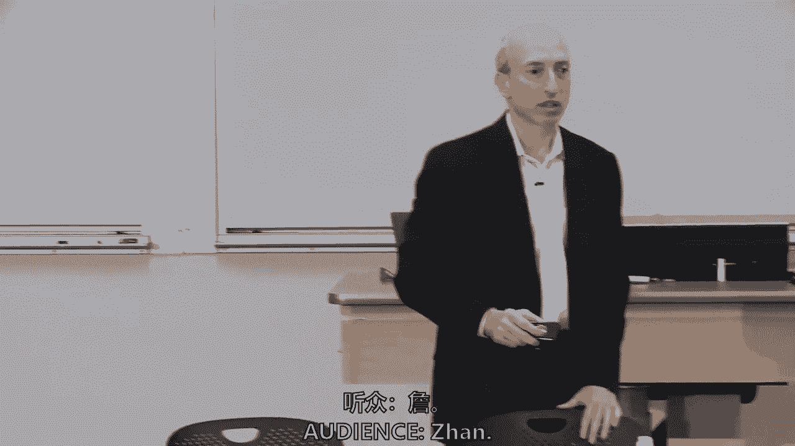

你从阅读中得到了什么，为什么这些都失败了，最大的一两个原因是什么，他们失败了，他们中的一个，他们中的大多数人仍然依赖，某种形式的中央权威，他们依靠的，本质上你有，当然是大卫·奇的作品，和其他一些。

任何其他重要的原因，你有没有，商人没有足够的采用，我记得，绝对不会被商家采用，非常好，他们失败的第三个原因，这是比特币解决的核心问题。

结束激励，就像一个分散的网络，保存那个账本，维护账本，激励她背后的账本，他们解决不了双重支出的问题，那是它不能花双倍的问题，一种货币能不仅仅花一次而是花两次吗，所以有四件事被提出来，双花。

他们不能让商人采用它，关于分类账是什么，有某种形式的共识，我要快速浏览一下，但数字货币和移动货币确实发生了，我们之前被问到贝宝，那是1998年在挪威，埃里克森和Telenor有了第一个手机应用程序。

它是在你的手机上看电影，1999巷子工资来了，我们以后付款时会讨论很多，当然还有我们上周在肯尼亚谈到的m pesa，那里是野生动物园，注意到一堆靠近钱的钱，在肯尼亚，移动分钟被用作货币。

现在有两千万用户，当然，现在有一堆规定等等，星巴克始于2011年，然后当然现在是移动货币的比赛。

关于移动货币的关键之一，我们将一起讨论和学习，问题是，每一个都是，其中存储值，我得告诉你，有时我很困惑，当我研究一个新的应用程序时，它们是否存储了价值。

或者他们只是一个处理提供商，就像我们之前说的，付款系统移动、更改和修改其他分类账，其中一些像M pesa。

最初它们存储的是价值而手机应用星巴克存储的是价值，但其中许多只是应用程序，把账本转移到其他地方的计算机代码。

但谜语仍然存在，你还记得如何转移资金的谜语吗？没有中央权威的点对点，这就是我要求下周四的课真正读的内容。

我不会即兴表演，也不会害怕。

如果你在麻省理工学院，而哈佛的人更少，我告诉你，大家可以看一下，你可能会明白其中的一半到三分之二，这不是很技术性的，它只有八九页，我还指派了国家科学技术研究所，大约20页来自NIST的阅读。

问题是那是不是比特币，我将略过学习问题，但研究问题实际上是关于密码学的。

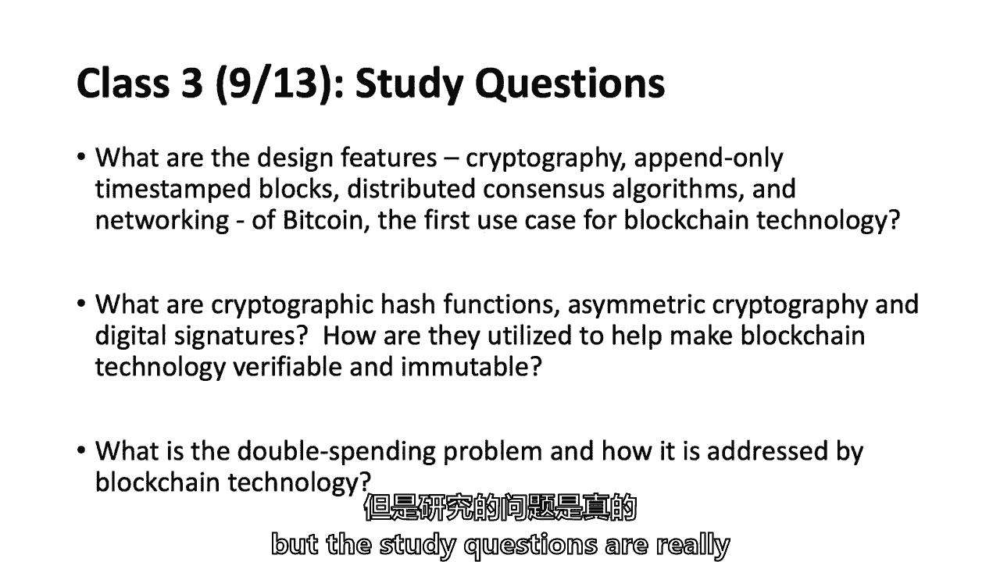

以及如何只附加时间戳，我们将在三节课上深入讨论细节，我不能把整个片段都录下来，整个学期的课程，但我想周四有三节课，下周有两节课，你随时都可以来找我，Sabrina在地板上的某个地方，谁是我们的助教。

是一门计算机科学，我是硕士生对上周来这里的毛利人了解得更多，我不知道毛利人在不在，他是数字货币倡议的一部分，三堂课以上，我们将试图通过密码学来研究什么是密码学，为什么这很重要。

时间戳是如何发生的，这怎么看起来像钱。

以及交易是如何保存的，是呀，你可以结束它，几乎。

因为这是最长的跑步，我可以回答，但任务是在星期四之前回答，好吧，到周四。

你的名字是什么？卡罗琳，卡罗琳，我说过我今天要接吗。

哦，我今天说了吗？现在我说的话有可变的记录吗。

我现在就接，如果你想，但是全班谁有答案呢？是啊，是啊，这是一个服务老雪莉，西方开始了。

他于1995年开始工作，是一个时间戳，呃，文件页数调查，他们的方法是使用哈希哈希函数，创建带有文档时间戳的印章，然后处理每周一批的印章，他们实际上在纽约出版了它，所以卡罗琳很好地提出了这个问题。

我以为是星期四，但是谢谢你，斯图尔特·哈伯，一个密码学家和贝尔实验室的一个同事，在90年代初说，我们如何对数字公证的信息进行公证，我们将讨论这个星期四，很多，他们使用了一种叫做哈希函数的密码方法。

他们只是想公证信息，到了一万九千，他们拿走了九百九十五个，他们是企业家，他们创建了一家名为保证的公司，他们每周在纽约时报上发表一次，他们仍然这样做，你可以得到一个纽约时报，我想是星期六或星期天。

他们把它放在机密区，它们有哈希函数，从现在到星期四，你会读到的，它们有所有预先存在的信息的散列，所以他们用纽约时报给它贴上时间戳，他们使用密码学，目前是两个，跑了三年，就…而言最长的，正确。

因为比特币大约有五十五万块，这将是任何，两三年，五二是时间最长的，谢谢。我期待着见到你。

