# 【麻省理工大学公开课】区块链与货币 - P3：3、区块链和密码学基础知识 - 闰土聊Web3 - BV1sL411N7Mm

我只想说我有多感动，你们都还在这里，我真的，你知道的，麻省理工学院的课程有很多购物机会，嗯，你读了智史的书，回来了，没有动摇，中本的，点对点，比特币，纸，或者你只是回来看看我是否会崩溃和燃烧，描述它。

但是我们在接下来的三节课上要做的是，只是为了把它框起来，这真的给了你一些技术上的东西，通过比特币的镜头展示区块链技术，比特币只是区块链技术的第一个用例，所以如果我经常说比特币这个或比特币那个。

它在很大程度上并不完全适用于区块链技术，我的感觉是我只领先你们八九个月，我可能把我的整个职业生涯都花在了金融和公共服务上，我可以谈论很多关于市场和公共政策的事情。

但麻省理工学院给了我思考区块链技术的天赋，我想给你们一点回报，房间里有几个计算机科学家会帮我摆脱困境，如果我没做对，Sabrina，然后呢，哦，我明白了，艾琳在忍受，你们都认识艾琳吗。

他实际上是麻省理工学院计算机科学专业的博士生，所以说，有人进入了他们生活的那一部分，谢谢。是啊，是啊，是啊，是啊，但他会把我们都保释出来，但我认为这是相关的原因，不仅仅是喋喋不休。

我真的相信我们能到达地面的唯一方法，真相是了解一点这项技术的内部工作原理，你不必做算法，或者实际执行哈希函数，但要知道在它下面，然后你可以走开说，我不再需要知道汽车上的化油器是如何工作的。

但我知道化油器是什么，或者你知道你想要的任何类比，所以与苏格拉底式的冷嘲热讽相反，我上节课做的，因为货币法定货币是核心，账簿是斯隆的核心，学生的教育或背景，这个核心少了一点，如果今天和接下来的几节课。

如果你能和我一起工作，我希望你随时打断我，你有一个问题，我不打算做太多冷冰冰的电话，哦，我不想让你太放松，我还是想让你做读数，接下来的三节课，但只要举起你的手，阻止我说好，但这到底是怎么回事。

这只是一种，我们可以在接下来的课程中做一些不同的工作，所以我总是要做一致性，学习问题是什么，那么它的设计特点是什么，这项新技术的主要设计特点是什么，区块链，我在教学大纲上写了一些。

我们将在今天和下周讨论这一切，在这节课的后面，你会看到八到十个，我想我们要真正挖掘的是十个，我能了解一下这个班吗，这不是托利亚或塞布丽娜写的关于参与的笔记，这是一个体面的假设吗。

你们大多数人或所有人至少读过中本的论文吗，所有的权利，好，好的太好了，只是一种感觉，你们中有多少人觉得自己至少得到了一半，可能不到三分之二，但至少有一半好吧，我第一次读的时候很好，我和你出去了。

所以没关系，伊莱恩，你答对了一半以上，我五年前读过，所以你五年前读过，是啊，是啊，是啊，是啊，是啊，是啊，是啊，是啊，人生选择说话，谈论它，所有的权利，嗯，你要上这门课，好的好的，嗯。

所以我们会仔细检查每一个，然后更具体地说，我们要剥离密码学，两个主要的，密码算法，或者你会听到的这些话，有时密码原语，海伦，什么是密码原语，野片，他们人太多了，但这两个词能把我聚集起来吗。

这就是我要说的，它可能是一个，它可能是一个哈希函数，可能是加密功能，可能是一个可验证的计算方案，可能是数据外包，可能是数据访问隐私，但它是任何基本上保护通信的东西，和对手的存在，嗯。

它也是你可以用的东西，以证明在不受信任的服务器上进行了正确的计算，所以不仅仅是交流，公司计算，因此需要保护或验证的通信和计算，有某种形式的密码算法，它碰巧被称为密码原语，两个主要的，还有第三个。

我们将在本学期晚些时候讨论，但是两个主要的，哈希函数，就像区块链的工作知识值得知道一样，我们要，我们会到达那里每个人都会到达那里，我们都要去那里，在那里你对什么是哈希函数有一些感觉。

然后数字签名的整个概念，它与非对称密码学有关，这两者是区块链技术的基础，在学期晚些时候，我们将讨论一点零知识证明，但它们不是第一个应用程序的基础，所以这就是为什么他们，你知道有点。

它们有助于使事情变得可验证和不可变，这是商业方面，市场方面，不然有什么关系，就像，谁在乎化油器里有什么，如果不重要的话，嗯，那么这一切与双重支出问题有什么关系，我可以拜访这个伊莎贝拉。

你还记得双倍消费问题是从哪里来的吗，当他们用同样的硬币，我猜，他们会在多个地方使用它，和其他像数字钱包和感知它，所以本质上双倍消费是当你有一条信息，你用两次，我们得把这条信息叫做钱，但你用了两次。

你可以给两个人发一封电子邮件，这没关系，我是说，有点尴尬，如果你把它发给一个朋友，告诉他们你有空吃晚饭，另一个朋友以为你是图腾，你没空，但你还是可以把它送到两个地方，但在货币体系中，1。

重要的是不要重复使用，嗯，阅读对演示很有帮助，我是说我们要，我们将在，我去年11月或12月看了那个演示，这是我从麻省理工学院的学生那里看到的第一件事之一，我不知道你是否认识这个博斯沃思。

我发现这很有帮助，所以我很高兴，我看到它实际上是演示在斯坦福，还有区块链课程，所以在西海岸，我们的一个竞争对手正在使用麻省理工学院的产品，嗯，所以我们要，我们要稍微复习一下二课的内容。

然后我们将讨论关键的设计特征，哈希函数，正如我提到的，什么是附加物，仅日志块标头，和默克尔树，非对称密码学和数字签名，疯狂，我们今天要涵盖所有五个，然后你要告诉我我们是怎么做的，哦，比特币地址。

这只是一件小事，实际上是六个，上次给那些不和我们在一起的人，我们一次又一次地谈论钱，金钱只是一种社会结构或经济共识机制。

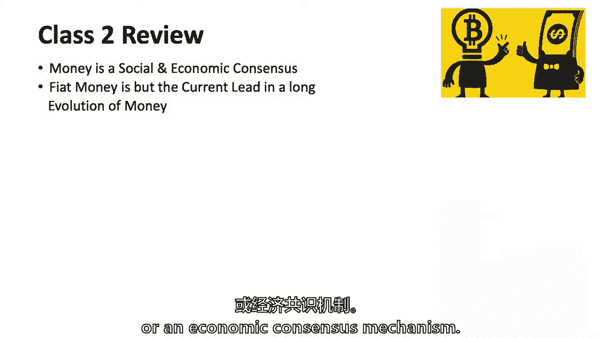

下周二我们将讨论很多关于共识的问题，当我们谈论比特币的共识协议时。

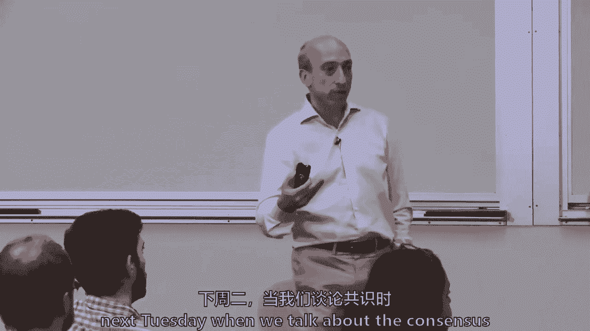

但请记住，金钱本身只是一种共识，周二有一个问题，我想艾琳实际上问过这个问题，但是作为中央银行的累赘意味着什么，为什么钱，这到底是什么意思，我说这只是意味着其他人会接受它，这是社会共识。

因为他们不会给你别的东西，只是你可以在银行存一笔钱，你可以交税，你可以在星巴克用，如果你已经喝了一杯咖啡，如果你还记得，它只是债务等的法定货币，所以钱就在那长长的队伍里，但它有它的挑战和能力。

这并不意味着它会消失，我不是比特币最大化者，并认为法定货币将会消失，但法定货币有其不稳定性，尤其是周围，本质上是当你贬值一种货币并允许大量发行，或者通常围绕不稳定的财政政策，所以要么政府花了很多钱。

国王去打仗了，英格兰银行实际上是在17世纪末成立的，本质上是为了控制货币，我想是在与法国的战争中，如果我能回忆起很多银行，中央银行就在大约，当一个君主离开时，货币贬值，在战争中花费太多，分类账。

我们谈到了账簿，分类账有多重要，本质上，分类帐是保持，这些记录可以是交易记录，也可以是余额记录，我们将看到比特币被设置为一种交易，后来，我们将谈论其他区块链技术，作为余额分类账设置的。

所以一个人不应该只是认为，不可改变的是，只有一种方法可以做到这一点，但交易和分类账是比特币的核心，中央银行当然是建立在分类账上的，中央银行的总帐，然后你可以想有时你的数字钱包可能是星巴克。

还没有第三层分类账，我们显然生活在一个电子时代，我们已经知道这一点，已经做出了很多努力，他们都死了，直到比特币，破解我们谈到的点对点之谜，没有中央当局，在本学期晚些时候，当我们谈论，用例是什么。

这将是核心的事情，这就是为什么我不是一个最大化者，我不是在任何情况下都能确定，这不是价值判断，这只是纯粹的货币和市场等等，但在某些情况下，权力下放确实会竞争并击败集中的中介机构。

所以让我们来谈谈他的小论文，那个，他当然谦虚，或者她很谦虚，请提醒我，我们不知道中本是谁，或者一群人，我一直在研究一种新的电子现金系统，那是完全对等的，没有信任，第三方，你以前看过这张幻灯片。

但是一个有时间戳的只附加法律，想想数据块，你知道有点过于简单化，但它有一个名字区块链，我不认为这是智史的报纸，这几天大家都看了，我昨天当然又看了一遍，只是为了确保我记得，我不记得他用过区块链这个词。

我说的对吗，所以区块链这个词真的是在他的，创新，所以信息块在继续，这基本上导致了一个数据库，但这是数据块，比特币现在大约有55万个区块，方块平均每十分钟加一次，我们会谈谈为什么每十分钟。

但他们如何维护以太坊等其他区块链，大约每七秒钟，所以不要太投入，都是一样的，这里有一些技术专家，西尔维娅·麦卡利正在研究艾伦，不到七秒就更紧了，所以没有一种方法，在添加块的频率上有多种设计。

但让我们从比特币开始，有担保，猜猜这两个密码原语，哈希函数和数字签名，我们还没有失去任何人，是啊，是啊，也许，然后就有了一致的共识，关于数据库的整个争论通常是谁来改变数据，这是真的，在所有数据库中。

从本质上讲，它通常是集中的，但在区块链中，这一切都是突然的，嗯，也许不是集中的，谁可以在下一个街区添加下一点信息，下周二我们将讨论的共识就是关于这个问题的，我想我以前在幻灯片上拍过一张漂亮的照片。

但我要，我打算把讨论推迟到下星期二，希望你们都能回来，那么关键功能是什么，我可能会打一个冷电话，你还记得报纸上汤姆的什么重要特写吗，哦对了，是啊，是啊，我的意思是你有哈希函数或哈希函数。

任何其他关键功能，让我们看看我要在这一页上有多少十个，公钥，右边那个按钮，公钥，私钥和公钥，是呀，所以非对称密码学或私钥和公钥，是呀，哈希函数，是呀，私钥和公钥，任何其他你不明白的关键设计特征或单词。

也许这是另一种说法，利奥·德雷和那个地址，比特币地址，三个十步，常戳，这是四件事进展顺利，右手，所以付款，双重支付是试图解决的问题，这不是一个真正的设计功能，但它是一个，他们有一个双重付款的解决方案。

所以我会把它归功于你，但它是，这确实是共识，所以我会说设计特征是工作的共识或证明，凯利，完整节点与轻量级节点，所有的权利，所以很有趣，节点和智的这个概念，实际上谈论的是全节点或轻量级节点。

本质上需要存储多少信息，我想保留那个凯利，当我们谈论块标题时，请提醒我，回到那个，但是节点和网络是这里一个非常重要的设计特征，分子默克尔树结构的重构，所以默克尔树结构是压缩大量数据的一种方式。

也要对这些数据进行排序，呃，哦，不，不，丽娜不会在这里，默克尔树结构在那里，我们要谈谈这个，还有两个音符，音符中的音符，那是什么，短暂的，好的，如此短暂，一年前有人知道nonce这个词是什么吗。

我不只是，我们都会成功的，我看什么，你知道什么是非是不在吗，在实际的协议中，这基本上是矿工们的猜测，所以nonce这个词的意思是一个随机数，用于一次和数字，一旦它是一个数字，那是随机的，只用过一次。

我就是这样学会的，哦，还有一个，因为这很好，实际上在这里玛尼你的名字，普里亚，普里亚，对等，这就是我的密码哈希函数，我们将更详细地讨论这些，时间戳，附录，只有日志，块头和默克尔树，所以讨论了默克尔树。

但我们需要说什么，什么信息保存在块的头部，而不是所有的机器人，身体，其中一些只是为了让它更容易管理，非对称密码学，就是这个公钥，私钥和签名，比特币自己寻址，有趣的是，这与公钥有点不同，然后我突破突破。

因为下周二我们将讨论这个问题，工作证明，矿工们，节点，废话都在那个小话题里，比特币里面其实有，一个非常重要的协议是信息如何在互联网上传播，只是网络通信，写的不多，你不会读到很多关于它的东西。

或者所有其他流行的书，但重要的是要提醒自己，信息必须在互联网上传播，所有这些事务都必须相互通信，目前比特币网络上大约有一万个节点，我们不知道他们都在哪里，但他们可能在一百八十个不同的国家。

所以这也是网络和沟通的问题，这对经济学很重要，有一种本国货币，这很有趣，这是唯一没有人说的话，这是一个实际的技术设计特征，他不仅创造了一种货币，但本国货币是经济激励体系的一部分，我们会玩得很开心的。

本质上他说当你挖掘并证明你创造的工作时，你得到了一些叫做比特币的本地货币，所以他创造了一个经济激励体系，或者对经济和技术都很了解，是的，只是想快点补充一下你说的话，所以你不仅创造了这种本国货币。

但是一旦达到有限的供应，货币可以作为交易费分配，我认为这是非常重要和激烈的，可能是你的名字，丹尼尔，所以丹尼尔刚才说的真的很有趣，不仅仅是为了忽视这个人或做这件事的人，但是比特币和其他加密货币的世界。

创建一个可以估价的记账单位，一旦它被重视，你有一种本国货币，但正如丹尼尔所说，中本还说会有一个有限的限制，碰巧是200万比特币是最多的，我们将在2040年左右到达那里，有人知道现在有多少比特币吗。

你们中的一半都投入了，所以这是一种可爱的雨果，现在大约1700万比特币，所有一千七百万都来自这个工作和采矿的证明过程，最初是每十分钟50个比特币，大约每十分钟，然后降到了两五，我们现在有12。5比特币。

有人知道今天的价值意味着什么吗，我总是应该说，比特币的所谓价值，因为我不知道我们是否能相信那些说，价值是什么，什么是什么，所以六千五百美元，十二点半的比特币，比特币挖矿，一块，你看，大约是八万美元。

挖个方块，对呀，所以他创造了一个激励系统，最初如果你有50个比特币它们一文不值，你不会承诺那么多，你必须是一个业余爱好者，基本上在二十九或者赛博朋克，或者只是有点好奇，因为你没有得到太多的激励。

如果它一天值六千五百英镑的话，你将得到八万美元，如果你真的成功地挖掘了一个块，然后是事务输入和输出，考虑一张支票，谁在上面签名，你转移钱的地方，有一种叫做未用交易分类账的东西，所以这是分类账部分。

所以当你想到我想到的技术，我想到了密码学，这是顶部的所有东西，我们今天要讨论的，其次，协商一致机制，本质上，这是任何数据库的关键问题，谁可以修改，决定改变状态的数据库，第三是分类账或交易分类账。

我们不打算深入研究脚本语言，但是我们将在下周四讨论一些关于底层脚本的问题，所以这给了你一条路吗，都是密码学，协商一致意见，然后交易，是呀，第一件事，如果每个人都是这个人，你只是好奇。

所以你提到对你名字的好奇，呃，只是好奇，你提到过看跌价值大约是8万美元，到现在为止，所以只是好奇，嗯，就CPU功率而言，开采时钟将消耗的电力，以美元计算，这相当于多少设备，所以问的问题是。

那个未成年人消耗了多少电，为了得到那个奖励，八万美元，我会试着在一分钟内回答，但我们稍后再讨论这个问题，本学期关于经济学、区块链经济学和矿业经济学，但这十年来发生的事情是。

越来越多正在使用的计算机试图挖掘比特币，所以今天在我看到的最新研究中，赢得一个街区的概率，有这么多是用Terra哈希来衡量的，我记不起号码了，而是有多少，塔拉哈希斯，也就是15个零。

是一个Terra哈希，这个追踪器在12井，无论如何，有这么多的散列正在进行，第二个X个恐怖哈希数，你获胜的概率很低，所以发生的事情是，大多数节点和矿工都达成了称为采矿池的协议，在那里他们消除了风险。

每个人都分享回报，但我们稍后将讨论的经济学，它被认为是，你需要每千瓦时3美分左右的电力才能成功，在世界大部分地区，你不能以每千瓦时3美分的价格获得电力，所以你会把你的钻机，在那里你可以获得低成本的电力。

或者在你可能的地方，你可以合法地得到它，低成本或非法低成本，所以有很多采矿平台，在一些地方官员允许这些钻机，而不是三美分一千瓦时给电力公司，对当地政府官员来说，每千瓦时1到2美分，所以。

但我们会讨论经济学，至少有一些关于为什么有些会在那里的理论，所以艾琳可能会把我清理干净，这不仅仅是在对手面前的交流，这也是在对手面前的计算，那就太好了，我们讨论了，我们不打算深潜，如果你还记得。

即使在古代，如果你要去打仗，有一个很好的小方法可以做密码学，然后任何看过的人，它，邀请小游戏，是啊，是啊，关于英国人，你知道吗，破译德国密码，尽管他们可能应该给波兰人更多的荣誉。

一个可能在20世纪30年代闯入它的政府，但巡回演出做得很好，然后我们今天要讨论非对称密码学，好的，什么是哈希函数，哈希函数，这些只是我想到的词，我把它看作是数据的指纹，但它有一定的性质，你会看到的是。

它接受输入的输入，它将任意大小的输入映射到固定大小，所以我们在美国使用的，一个哈希函数，我们都用邮政编码，在某种程度上，是五位数，这是一个固定的尺寸，3。我知道我这样做是无理取闹，你知道我怎么想的。

但是邮政编码，你可能有五万人或者五千人，都住在一个邮区，你可以把它们映射到邮政编码，它是一个，它现在是一个固定的长度，我不知道计算机系的朋友们，但这是哈希函数的早期意义，我只想说。

我们的生活中有一些有形的东西就像哈希函数一样，邮政编码问题，就是，它不会以任何方式，是一个安全的哈希函数，你马上就会看到，但它确实需要，你可以是300磅的人也可以是30磅的孩子，你仍然映射到同样的。

它是确定性的，总是一样的，所以如果你取一组数据，它总是会给你同样的哈希，这与背景有关，你可以有效地计算它，你不会想花一年时间做这件事的，你必须在短时间内做这件事，就比特币而言。

它在纳秒或更短的时间内完成，因为只有一台电脑，一个CPU就可以，我可能记不清一秒钟有多少百万，几个皮疹，说几个塔拉房子哈希一秒钟，所以这是一个非常有效的算法，是一群数学家和哈希，始于二十世纪五六十年代。

但我们在这里谈论的是最近的，但这是非常有才华的科学家，数学家，计算机科学家，有时国家研究所的技术标准在这里，U正在研究哈希函数，所以它需要任何大小的数组，把它变成一个固定的数字，我想一下邮政编码，嗯。

它是确定性的，从某种意义上说，你总是只住在一个邮政编码里，而且效率很高，但是现在密码属性是什么，因为邮政编码不能让它，它只是不会很好，计算机科学家使用这个术语前图像抵抗，我只想说这是一种方式。

你只能走一条路，这意味着从输出中确定输入是不可行的，从x的散列中确定x是不可行的，有人知道为什么我首先使用不可行而不是不可能这个词吗，所以因为你可以用更大的力量来做，所以你也许可以用它，蛮力。

你说的蛮力是什么意思，所以每个人都尝试选择，尝试所有的选择，但据我所知，几个世纪以来密码学的一种信条，不是让它在数学上不可能，关键是让它变得如此不可行，你的对手不能得到通信之类的，所以哈希函数。

我只是这么说，因为你不能假设比特币不能被打破，我们都称之为不可变，它是不变的，直到比特币内部的哈希函数可能被破坏，甚至聪在2010年也写过这件事，他收到电子邮件，有一本很棒的书，如果你们中有人想。

我在教学大纲末尾的书架上提到的，他说好，如果一个肖二五六，也就是哈希函数被破坏了，顺便说一句，他的回答很好，到时候会有更好的哈希函数，不管是什么都会破坏整个系统。

不管那是什么因为记住你可以拿任何大小的东西，与新系统散列并向前推进，所以他觉得他或她在这封美妙的电子邮件中感受到了，比特币实际上可以过渡到一个新的哈希函数，只要你，你知道的。

在一切都被破坏之前有一点时间，凯利，这篇文章叫做赌徒的破产问题，这就是你所描述的赌徒破产问题吗？攻击者赶上的概率就像重新创建它一样，不不，那是另一回事，就在那上面，是啊，是啊，所以这就是。

如果我没记错的话，你知道你想评估一下，有多难，第四个比特币，如果我有很大的计算能力，对我来说创造一个叉子有多难，所以她在论文的结尾做了一个分析，哦哦哦，我向你道歉，你在他的报纸上说的，是呀。

在他的论文里，他在说在计算上做什么有多难，有些人称之为5-1攻击，基本上接管所有的节点，下周二我们将讨论他论文的那一部分，但基本上你能接管节点吗，我说的是另一件事，你能破解密码吗。

他不会在报纸上写这件事，大约十个月后，他在一封电子邮件中写了这件事，差不多吧，第二个密钥加密的东西，所以我们说一种是一种方式，另一件事是碰撞的概念，我想如果这个房间里的每个人都告诉我你的生日。

这个房间里有多个人同一天生日，事实上，如果我们超过两点，六个人在一个房间里，有超过百分之五十的机会，你们两个生日是同一天，我们不需要到一百八十，房间里有三个人，一年中有一半的日子，我们可以到两个左右。

六七个，和，同样，关键是两组数据，这又是不可行的，x和y会散列成同样的东西，不是不可能，这是不可能的，如果你看看哈希函数的历史，这通常是在某个时间点发生的事情，这些哈希函数不会抗冲突。

一些量子计算会出现，或者会有什么事情发生，但现在你可以把任何大小的东西放进去，它们看起来也非常随机，这叫做雪崩效应，意味着你改变了一个小小的不同，整个事情看起来不一样了，所以当你注意到那个小视频。

如果你改变了一件事，一切看起来如此不同，为什么这很重要，因为它使它更安全，然后有一种叫做拼图友好的东西，即使你知道一点点输入，这并不意味着你会得到输出，我把这些放在这里，不是为了让你认识他们。

你不会接受测试的，如果你以埃隆的身份做生意，你什么时候开始的，你可能还没想好，你知道防撞，这个或那个，但我只想让你知道，这下面有一堆密码学，它不是，我不知道千千万万不变的，但这些东西还是有可能坏的。

量子计算和其他东西可能，但实际的概率应该是1/2的1/2/8次方，所以它比一千万亿多得多，所以是十几到四十左右，我是怎么算的，所有的权利，嗯，任何有兴趣的人都可以在办公时间来，所以它极不可能被打破。

但我认为总是值得说，嗯，否，有一些外在的，它是，它不像你想象的那么有界，嗯，那么它是用来做什么的，在许多地方，它被用于名称、引用和指针，在一种叫做承诺的东西中，在比特币中，它是用来指示的，但有一个街区。

指向另一个块，但它也用于承诺，嗯，你会听到这些话，我们不打算深究它们，但是头部和默克尔树使用了一种叫做肖二五六的东西，这是一个标准，字面上是二百五十六，这就像256个注册表的0和1，但是一个比特币地址。

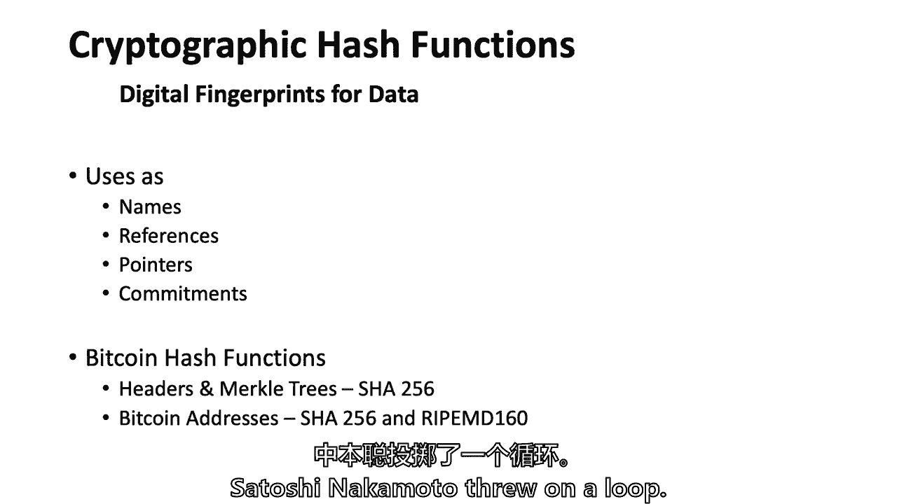

我很高兴辩论为什么，但他对比特币地址使用了两个哈希函数，我看到他写的一件事是，他说，如果其中一个坏了，至少另一个被打破的可能性较小，就像我读到的那样，我觉得用他自己的声音来说就是你必须把某件事搞砸两次。

他只是让它更安全，即使艾琳，十有八九，到第四十个机会是天文数字般的低，所有的权利，所以嗯，所以记住卡罗琳在哪里，我不记得我们在那里你问我，我想我已经为今天安排好了，但你很好地提醒了我星期二。

运行时间最长的哈希是多少，这是个很好的问题，谢谢你的。

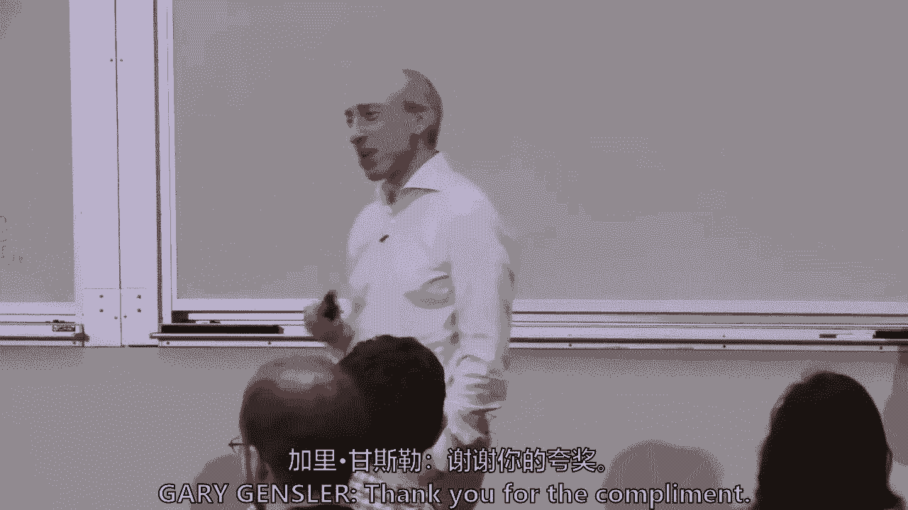

嗯，答案是，是啊，是啊，我不知道，我不知道语音，所以我不确定我是否完全屠宰了这一个，但它是和斯图尔特一起从戴尔实验室出来的，哈伯和施瓦蒂在那里，他是，是啊，是啊，所以哈伯，和他的同事，是呀，你得到了它。

我的室友，那是你的房间，太棒了，我只想说不是比特币，他在1991年做了这件事，但到了1995年他们成立了一家名为Shorty的公司，我不认为它起飞了那么多，它不是在与苹果争夺最大的市值，或者类似的东西。

但每周在通知部分你都可以看到一个哈希，从字面上看，有一个，有时间戳，因为它在纽约时报上，这是一个哈希，所有这些时髦的数字和所有的信息都出现在它面前，他们基本上是在散列任何文档，任何需要时间戳的文档。

在那一周你把它放在一个，跟着另一个，那是区块链，这不是钱的问题，没有本国货币等等，我相信哈伯和斯特内塔是八九个脚注中的三个，在智史的论文里，可能是四个人，所以他得到了他的荣誉，如果你去他的网站。

斯图尔特·哈伯，我想他在个人网站上说区块链的联合创始人，你知道，所以我们得到了，这是在国家研究所，NIST的纸，但时间戳相关，只登录比特币或区块链，放在一起的是标题，顶级信息。

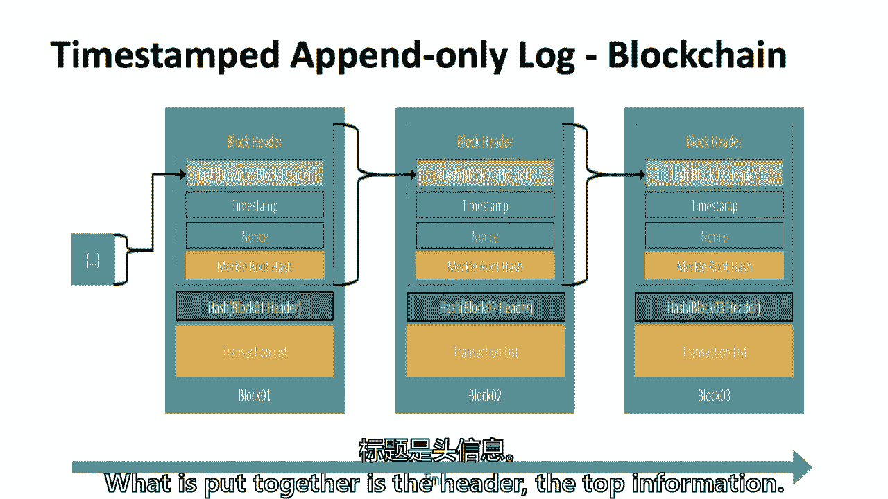

如果我能越过视觉，只是说，有什么，有五条关键信息，它不经常改变的版本，但是有一个版本号，前一组的哈希。

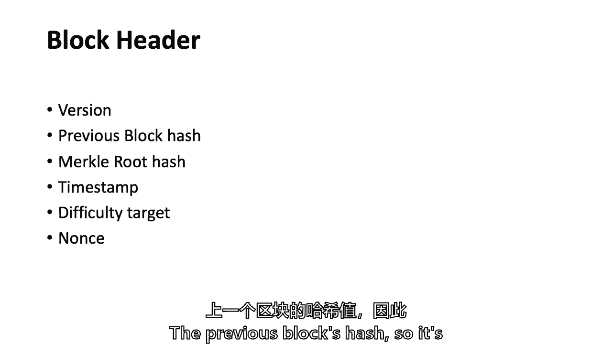

所以它是关于它之前所有街区的一些信息，默克尔根杂凑，有人想告诉我它是做什么的吗，默克尔根，所以它基本上把事务放在树的最底层，然后创建每个事务的哈希树，所以如果我，如果我回到这张漂亮的小照片。

这些块底部的黄色盒子，是所有的交易，一个街区可能有多达2000笔交易，所以这个区块链概念，一千两千，早在中本的论文之前就有手段和方法了，关于如何压缩，那个，如何保持信息更整洁。

它使用了一个叫做默克尔根的东西，所谓的块头，没有一千笔交易。

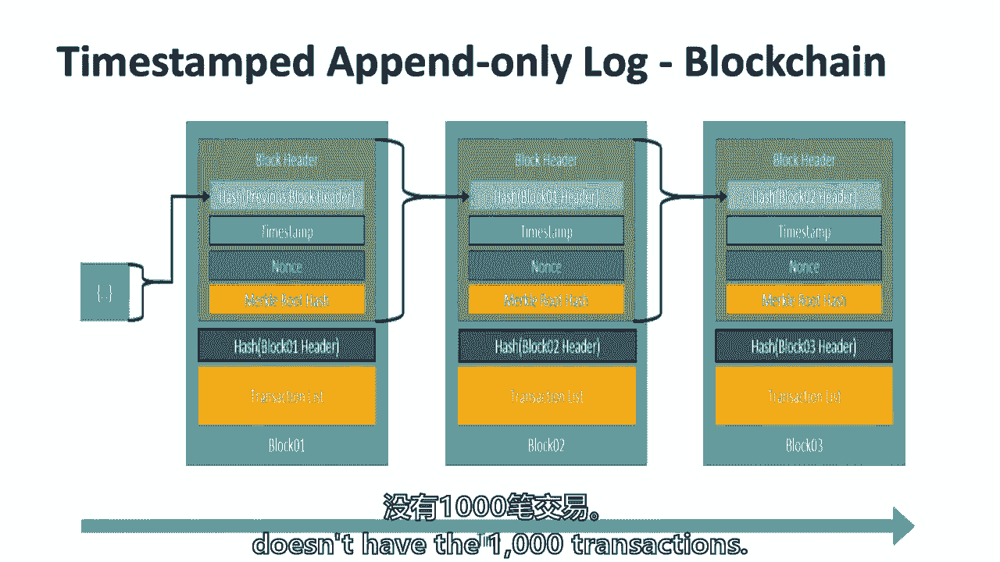

早些时候，Kelly你问我关于全节点的问题，一个灯节点或钱包，这里的任何人都可以在你的手机上下载，可能不会下载已经发生的数百万事务，在比特币的历史上，您不太可能下载所谓的完整节点。

但您可能会下载所有的标题，这一点信息，这是所有的标题，比特币的所有信息仍然没有那么大，不到两百场演出，嗯，但是所有的标题，我想是个位数的演出，我不记得现在是4G还是6G，数字是多少是八十字节。

所以它是八个字节和五十万，也就是五十兆字节，60兆字节的羽毛，所以它是六十兆字节，所以它要小得多，而不是像180个演出，所以智史事先就想好了，你要做的每一个区块链，可能我的意思是可能有一些。

它的概念是通过一点点信息来保持安全，一种叫做头的东西，然后把事务和数据的所有内容都推下来，当你喜欢以太坊时，这真的很重要，那里有大量的数据和大量的计算，在这些块中的每一个，这有点像如果斯图尔特哈伯，嗯。

他有很多文件和照片，还有他没有的一切，你不必拥有整部电影中所有的画质，你实际上可以把整部电影搞砸，你仍然得到这256位，因此头具有以前的哈希，这个默克尔根，这只是获得所有交易的一种方式。

把默克尔根想象成一种攫取2000笔交易的方式，在某种程度上，一个很容易的时间戳，我们可以得到，区块链比特币试图让它随着时间的推移变得或多或少困难，哦，粗野的，随着时间的推移，我们听说雨果越来越难相处了。

但这样它每十分钟就会保持一个很大的街区，所以有了更多的计算能力，就更难，所以很难找到一个方块，矿工就越多，所以每个块标头都需要有所谓的困难目标，采矿会有多难，因为我们下周二要讨论采矿，3。

这些都使我回到了原点，然后什么是暂时的，随机数，一次使用的随机数，一次又一次，这就是哈希函数，我们该怎么办，他们有点不对劲，打滑，我们是麻省理工学院，是呀，我应该是散列中需要的字符数，它的输出。

不是输入，把房子里的字符数，对吗，如此正确，您拥有的选项池，当你有很多很多的交易，那就像流动一样，对呀，所以在三个中，你只消耗一个消耗一个点，你要重复哈希的地方，但你知道吗，当你说哈希。

您有两个不同的信息要，您指的是哪些信息，所以你能帮我念出你的名字吗，只是一个吉列尔莫问了正确的问题，他说得很好，你怎么知道，尤其是当你有越来越多的时间，越来越多的时间。

您可能会从不同的输入获得相同的哈希输出，如果你还记得，有人记得以前从来没有在野蛮人面前说过话，是啊，是啊，在报纸上我提到过，两个真实的人有可能，呃，就像实际的x等于y，但这是如果喜欢，呃。

矿工们在同一时间工作，如果相同的信息不在相同的时间被处理，不会有问题的，因为那样我们就会像两个不同的人一样继续，所以你是对的，因为它与采矿有关，但它还有另一块，哈希函数。

如果它是一个好的加密安全哈希函数，就是所谓的抗撞，你所说的是如此不可行，事实上，一除以十除以四十，你知道那是1后面有4个0，这是不可能发生的，这是可能的，但不可能发生，你指的是什么。

如果双方解决了密码难题而不是冲突，由于困难，他们只是同时得到了它，拜托了，这似乎是一个愚蠢的问题，但对于时间戳归因于的信心，没有愚蠢的问题，从整个系统来看也是如此，所以时间戳不是比特币特别重要的一部分。

它们有时间戳，但有时如果有人把事情推迟了，它关闭了几分钟，甚至长达两个小时，嗯，有一个，有一个，在技术和脚本功能中有一个检查，如果计时器关闭超过几个小时，所以字面上，没那么精确，话虽如此。

时间戳发生的真正方式是如果一个块被挖掘，它是第五十四万个街区，它在所有节点中都被接受，这一万个节点开始挖掘，第五十四万零第一块，本质上，它只是把它想象成几乎像一个堆栈，所以本质上是什么。

比标题中的实际时间更相关，它们的标题上都有一个时间戳，但更相关的是块的顺序，和，最重要的是，上一个块哈希，是呀，我不得不说，没有时间戳，你不能做这个难度调整，时间戳很重要，如果你没有到街区的时间戳。

你不能做难度调整，这是保持十分钟雄鹿率所必需的，我部分地同意你，因为难度调整每两周进行一次，所以即使有人，个人，或者五六个时间戳在两周内有点搞砸了，算法基本上是在大约两千个块的过程中寻找，所以。

所以一点点它的罚款，没事的，但你需要时间，是啊，是啊，你需要时间戳，但更重要的是，基本上是这里。

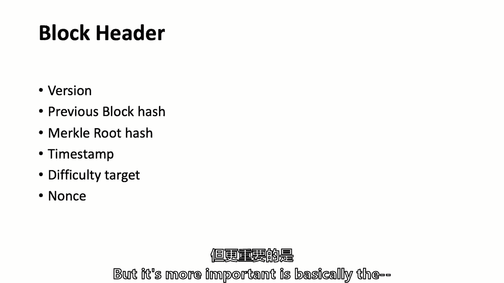

我去滑滑梯，这是方块的顺序。

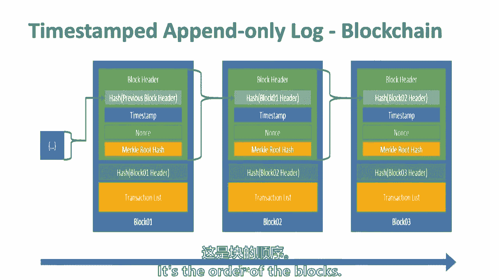

拜托了，我要回到碰撞，论文没有详细说明，但它说像，除了对力量2 8来说是多么不可能，即使有两个哈希给同一种时髦的文摘，在如此给定的背景下，它不太可能有效，比如什么是有效的区块链交易，甚至更远。

减少任何问题的可能性，有很多细节，至于为什么，就像区块链上下文到标题一样，更不可能，因为背景，嗯，我想把那个问题留到星期二问，但这与，而不是碰撞问题，报纸上说的是如果两个未成年人解决了这个难题。

这并不意味着他们有相同的哈希，因为这个谜题不是为了得到一个精确的哈希，比特币拼图有一定数量的前导零，所以它真的开始了，我想是九个或十个领先的零，我说的是十年前，现在你必须用，我想大概有二十六个领先的零。

这意味着它变得越来越困难，哈希的结果必须有一堆前导零，你在视频中看到的，对不起，我有个问题，就像，哈希是如何，本地do哈希出现，所以说，如果它只是散列交易，当上一个块的哈希值更改时，它如何更改。

它让我想起了那个老电视节目，约翰尼·卡森，你刚刚为喜剧演员做了一个很好的设置，所以谢谢你，所以我要去默克尔根，看起来像这样，如果一个人有一千个交易，我不会有漂亮的滑梯，所以这只有四个层次。

但想想底部的四笔交易，你串联，你把这两个哈希放在一起，你把它搞砸了，如果你有一千个，你就继续往托盘上走，因为那是二的十分之一，大致上，你会有这棵树的十个层次，这就是发生的事情，实际上。

挖掘池操作员正在为节点做很多这样的事情，软件中的应用程序，这个房间里的任何人都可以下载软件，如果你愿意，有一个软件可以帮助进行交易，把它们基本上放入这个二叉树中，叫做默克尔树，使用哈希函数。

基本上把它一直压缩到顶部，我想我的问题是，如果在这种情况下，呃，鉴于结构的存在，根哈希如何与上一个块更改，所以基本上我们看到，如果你改变前一个块的哈希，所有前进的方块都将无效，因为哈希会改变所以。

但它似乎没有使用以前的哈希，所以我要重复这个问题，默克尔的根是，基本上是在一个块更改中的一万个事务的摘要，如果标题的其余部分发生变化，或上一个块更改，答案是否定的。

只有当一万个事务中的一些数据发生变化时，它才会发生变化，所以如果你把不同的交易混合在一起，默克尔根就会改变，或者真的很重要，你今天得到12个半比特币的奖励之一，在所谓的硬币交易中。

所以这一千笔交易中的一笔是给未成年人的付款，所以默克尔根会根据谁赢而不同，但那不是你的问题，我只是说，但是默克尔根是一种非常有效的方式来处理成千上万的交易，把它储存起来，有一个点，拜托了，所以说。

对于哈希的每个人来说，不同事务的顺序必须完全相同，对呀，不，其实不是这样，如果你在散列，你在经营一个采矿钻机，埃兰在经营一个采矿钻机，如果艾伦解决了这个难题并在网络上传播，人们开始在艾伦的街区顶上采矿。

因为他们说好，他完蛋了，你不是，你可能会开始在他的街区顶部采矿，看看一个叫做记忆池的东西，内存池在这个由所有自由浮动事务组成的网络中，您将获得下一组事务，我们如何验证所有的交易，他写了他们真正的。

所以验证，下周四哪个更多，但我会试试看，不不不，这是个好问题，或者实际上你在给我设置数字签名，给你，谢谢。确实，你有问题吗，或者我要去，所以第二个密码学的东西，我们将继续来来回回。

哈希函数基本上是压缩大量数据的一种方法，有指纹，确保这基本上是一个承诺，数字签名，嗯，还记得我们有爱丽丝和鲍勃的那个小图表吗，爱丽丝想给鲍勃写封信，只是打个招呼，鲍勃，她想把它加密，她用鲍勃的公钥加密。

寄给他，他用私钥解密，你可能会说，我的天啊，詹斯勒，什么是私钥，密码学中的公钥是什么，这是一种扰乱信息的方法，我知道我真的在做这个链接，但它是如此，如果我们回到那个小机制，罗马人使用的，或者我们用了。

它们是对称密码学，两个人都有钥匙，在二十世纪七十年代，这里和其他地方的一些优秀的技术专家基本上说得很好，如果钥匙不一样怎么办，因为对手可以偷钥匙，如果它不对称怎么办，但它是不对称的，有私钥和公钥。

本质上，有两把钥匙有某种数学关系，这两把钥匙之间的数学对这样的课来说并不重要，但要知道公钥和私钥，但关键是关于数字签名，有三个函数，你必须生成一个密钥对，当生成密钥对时，同时生成公钥和私钥。

他们需要一个随机数才能进去，制造大量比特币和其他钱包的东西之一，不安全，这可能是一些人被黑客攻击的原因，钱包，不是比特币是因为他们没有好的随机数，一代，是呀，粗野的，我看到，我上周参加了一个会议。

宾夕法尼亚大学的一名技术专家，对150家对冲基金进行了调查，矿业公司和比特币钱包公司，所以他们实际上让一个网络安全人员进入，做一个150个你认为，真正忠诚的比特币矿工的高端用户。

这让他们的网络安全感到恐惧，他们是如何用私钥做什么的，在他拿到私钥之前，他们中的许多人并没有一种安全的方法来创建随机数，创建他们的私钥，所以当有人说他们有很好的私钥时，这只是一个部分，你脑海中的公钥。

只是不，一定有办法做一个随机数，一代，这是唯一的数学，我要你记住，有一个签名功能，关键是签名创建，您可以从消息和私钥创建数字签名，所以如果Kelly有私钥，想给房间对面的人发个秘密信息，伊莎贝拉。

你要凯利的口信吗？凯莉会留言的，你得到了这个凯利，你要把信息，你要用私钥签名，你把它寄给伊莎贝拉，伊莎贝拉怎么样了，既然是你送的，她得和她一起解密，她得核实一下，所以有一个函数叫做验证函数。

它回来只是是的，否，我是说，它可能会说这是一个不同的，但这只是一个，是呀，否，它是一个验证功能，伊莎贝拉，你想和我一起做这个，将验证您的签名对此消息是否有效，因为你有公钥，所以你是对的。

伊莎贝拉有你的公钥，但是使用您的公钥，她可以验证标志性的神奇数学，但这不是神奇的数学，这是真正的数学，但这不是数学，我们需要在这个班上学习，是呀，雨果在这里生成任何密钥，是啊，是啊。

所以它们都是从随机数中产生的，一个不一定像私钥不是由公钥或常规的，你可以把它想象成比特币，它使用椭圆曲线密码学，你可以把它想象成私钥是基于随机数的，它的基础是更技术性，这是呃。

随机数是让你找到公钥的原因，但我认为它是随机数的私钥，然后沿着它生成公钥，所以你随便选一个数字，实际上在零到二之间，那是你的私钥，选择公钥，直接从私钥派生它，事实上。

你所要做的就是用你的私钥求另一个数字的指数，所以你可以把公钥看作是私钥的单向功能，所以给定一个公钥，无法恢复私钥，如果可以的话，然后你可以签，这是灾难性的，而不是比特币的指数化。

它使用一个叫做椭圆曲线的函数，但是什么属性，这些是关键的经济属性，以及密码属性，基本上是不可行的，我再次使用不可行这个词，我没说不可能，尽管艾琳可能想告诉我，1。现在是十之八九还是十之八九。

但找私钥是不可行的，从公钥到反向工程，所以即使你找不到私钥，就像凯莉和伊莎贝拉的情况一样，我知道凯利的公钥，我能给伊莎贝拉带个口信吗？冒充凯利，现在你需要做一个签名。

如果你能用你的眼睛在上面做一个数字签名，您需要私钥和消息，它是私钥中消息的一个函数，让我们称之为复杂，数学，是从私钥创建的，公钥是从私钥创建的，并且过于简化，验证函数工作的原因。

是因为伊莎贝拉拥有的数字签名和公钥，伊莎贝拉有这个数字签名她有公钥她有信息，数学是这样的，基本上私钥，如果你希望几乎像因素出来，你知道你，但想到两个函数，她有伊莎贝拉有凯利的公钥，消息，数字签名。

它要么验证，要么不验证，但她从来不用看到私钥，事实上，Kelly不想让她看到私钥，埃里克·嗯，也许只是为了简化数字签名的验证方式，通过哈希函数运行，生成哈希并用她的私钥加密，然后信息没有加密。

数字签名就给了伊莎贝拉，伊莎贝拉，她所做的是使用相同的哈希函数与文档一起运行它，生成哈希函数，并使用Kelly的公钥对签名进行解密，并比较这两个哈希，如果这两个哈希对应，这意味着消息是凯利的。

它没有被篡改，所以这或多或少是对签名的简化，我不知道是不是这样我的意思是，关键是有一个与比特币无关的方案，在互联网上存在许多其他原因，商业和战争中的许多其他原因，这个公钥，私钥密码学。

这不仅仅是回到过去，不仅仅是爱丽丝送东西，也是数字签名，您生成密钥对，比特币的一切，以太坊的所有东西都有钥匙对，公钥和私钥，数字签名，但是Kelly永远不会丢失你的私钥，你得到了不要，顺便说一句。

你必须用一个很好的随机数生成器来创建它，因为世界上大多数老练的对冲基金都不是这样，你会比那些更好的，这是我在一次会议上学到的，我最近在，然后有一个验证功能，关于随机数发生器和验证功能的快速问题。

那么有没有像，第三方生成生成器或生成器就像一个已经存在的函数，我已经在那里了，所以欢迎，所以问题是，如果随机数生成如此重要，有没有有好软件的外方，本质上产生随机数生成，答案是肯定的，有一些不太好，是的。

一些好的笔记本电脑把它放在心上，我想跳过前面，椭圆曲线，数字签名算法，这是比特币用来获取私钥的实际算法，等等，但是很多钱包，如果你，如果您下载钱包应用程序，拿着你的比特币，拿着你的莱特币，拿着其他硬币。

那个钱包应用程序有一个，我可以证明所有的随机数生成软件，我不是网络安全专家，但可能有一系列更多的，有更强的，随机数生成的关键是如果你生成任何长度，它真的不是笨拙的，我要说的是最大熵，你知道的。

你真的没有任何结块，如果它都聚集在一个区域，那么这不是很大的随机性，所以我只想完成，因为我们还要谈一件事，奠定基础的是比特币地址，我把它挂起来了，你可以稍后再看幻灯片，细节并不重要，但关键是。

当你听到有人谈论公钥和比特币地址时，通俗地说，我们都提到他们是一样的，它们实际上不是中本所做的技术，他使用公钥，他真的把它打乱了两次，用这个程序，这个哈希函数，调用Shot 2 5 6另一个哈希函数。

然后连接并在末尾放一个小校验和，然后用一个叫底座5 8的东西让它更短，我回去看了一些中本的电子邮件，在他发表这一切后的两年里，我读过其他的东西，我的理解是有两个哈希函数的原因。

实际上是两种不同的只是为了让一切都更安全，公钥也是一个很长的，大约是512比特，所以你可以缩小数据，使数据更压缩，通过散列，它使它变成了256比特，他把它打乱了两次。

然后他做了这个基础五八让它更紧了一点，为了所有目的，你可以继续使用公钥和比特币地址，但记得在矿井里，哦，其实还有，它们有点不同，比特币地址更安全一点，据说，除非，当然啦，有人黑进了你的钱包。

弄清楚了所有这些小细节，比特币地址有点像签名，所以在我们谈到的这些音符上，记住你们中的一半人不使用支票账户，但这些是早期的检查形式，底部有个签名，这真的是一个比特币地址，对不起，签名是数字签名，地址。

比特币地址是为谁付费的，我保证，最后一张幻灯片，下周我们将讨论这个问题，交易，所有卷到默克尔树上的东西，所有那些小东西，重要信息，它们基本上有一个输入和一个输出，输入和锁定时间，但是输入是以前的事务。

这基本上是唯一识别金钱的，你要给智史送价值，2。他自己指定了记账单位，一个比特币里有很多聪，这就是为什么我们很少听到关于Satoshis的消息，但是每一个比特币里都有10到8个聪。

所以当你真正输入计算机代码和交易时，你在智史做，它被发送到公钥，那是一枚硬币，这就是，这只是我知道，有很多，我想知道你们中有多少人星期四要回来，不，让我说，让我说，不仅仅是我们在麻省理工学院。

但我们在麻省理工学院，来吧，来吧，这个房间里的每个人都可以得到这些关键概念，我们讨论的关键问题是时间，盖章，附录，只有日志，有人想告诉我该怎么做吗，如果这堂课在接下来的七分钟里能让这两个囚犯。

我们上一个小时就谈了这么多，所以我不知道穿橙色衬衫的你的名字，那是什么安德鲁，安德鲁，几点了，仅追加日志，结束日志的时间本质上是事务的记录，或者一个区块是区块链用一个时间，这在未来是无法改变的。

只能添加事务，所以它是不可改变的，因为所有这些密码学，斯图尔特·哈伯在一个时间戳里做到了，只有笔的日志，他把它放在卡罗琳，你还和我在一起，哈勃在哪里，把它放在纽约时报上，纽约时报，在那里，你去机密区。

嗯，所以它只是，它是一堆压缩起来的数据块，所以我们讨论了一种叫做默克尔树和默克尔根的东西，好好想想，这是一种获取大量信息并将其压缩的方法，而且以后也可以搜索，因为当我们下周谈论一千笔交易时。

你必须能够验证，有人问我如何验证，对呀，好的，当你回去验证的时候，你需要一个索引数字才能在默克尔树的情况下找到它，它是通过哈希函数保护的，有人想告诉我哈希的最简单的定义吗，哈希函数，这就像一个映射。

这些成员可以从一个，你可以给这个教室拍一张照片，每个人都是，它可以映射成一些东西，我不知道二维码是什么，哈希的一种形式，密码学上不安全，但它是一个，是哈希吗，某些数据的不同表示，而不是二进制。

你用得很好，所以我失败了，它没有，嗯，它经常储存，其实，所以说，密码哈希函数，是一种不仅能获取大量信息并将其转换成固定形式的方法，但这里的关键是哈希函数是将块连接在一起的。

因为哈希函数可以指向以前的信息，正如视频显示的那样，如果您更改任何基础信息，哈希值更改，那么这给了你什么，它基本上保护了数据，你知道的，如果有人篡改，所以真正了解哈希函数的唯一原因是，就是说，哦。

我明白了，这是防止数据篡改的方法之一，我有一个关于理论事件的问题，其中更好的哈希函数，找到哈希函数，然后呃六杆，这将如何在比特币网络中实现，实际上需要达成共识，所以。

如何将任何相关的变化引入比特币始终是一个挑战，因为这是一个分散的网络，所有分散的网络都有一点治理挑战，治理的挑战是如何进行软件更新，我们都知道在我们的笔记本电脑上，我们的iPhone。

这里可能正在进行软件更新，我不知道，对呀，它们可能只是苹果掉下来的，我是说，谁知道他们在这里干什么，右和优步，我真的是我最喜欢的人之一，谁知道这部手机里发生了什么，但是广告，企业。

中央当局有办法更新软件，我们可能已经签署了一些使用条款，允许他们这样做，在这样一个分散的网络中，必须有共识，因此，真正更新软件以获得新哈希函数的唯一方法，或者对大多数其他事情来说，本质上是节点。

软件的运营商以协商一致的形式集体，收养它，所以这是另一种方式，由于这些哈希函数，数据不仅是不可变的，但是软件是，这既有好处也有代价，有人会说这是区块链的一个bug，有些人会说这是一个功能。

你可以在这学期的课程中做出自己的判断，但是软件比中央当局的软件更难更新，因为中央当局只是说他们只是推动，现在，有时你必须点击并说更新，但不要天真，不是你点击的每一个软件，我是说有些事情正在发生。

但在这里你必须有共识，我知道它没有回答你关于哈希函数的问题，但是如果它是一个必须更新的哈希函数，每个人都说他们必须尽快更新，关于这个有有趣的争论，但你不需要回去，五十四万个以前的街区。

你可以把54万个方块都拼凑起来，180千兆字节到1256千兆字节，也可能是不同的，然后你会有，它将是防篡改的，所以这些是关键的事情，这就是我们所报道的，我们真正要报道的是，嗯，下周二的共识协议。

我们在这里谈了很多关于工作证明的问题，因为每个人都认为比特币是工作证明，但我们要谈谈工作证明，节点和本机货币，下周四我们将再次讨论交易，我试着分解这项技术，如果你想忘记这堂课，你要去，我的天啊。

就像去看牙医一样，你可以告诉你的朋友你实际上对密码学有所了解，它被称为加密货币，那么我们怎么会对密码学一无所知呢，但基本上是这三件事，这是密码学，这是一个共识机制，交易如此正确，密码学，共识机制交易。

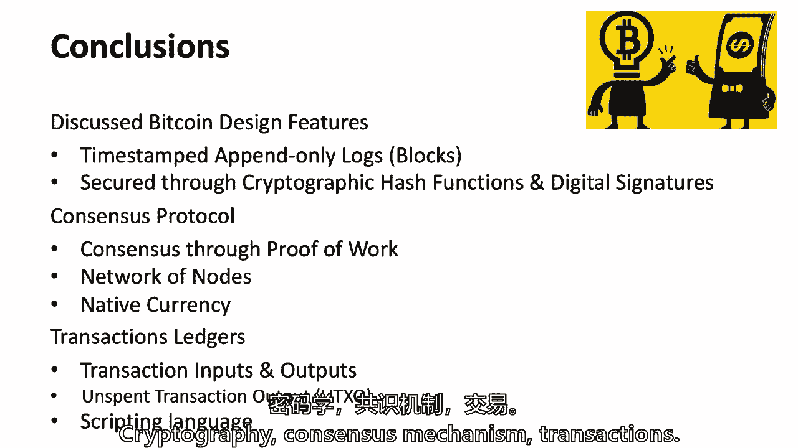

我们会挺过去的，然后你会发现这对财务很重要，以及它是否有用例。

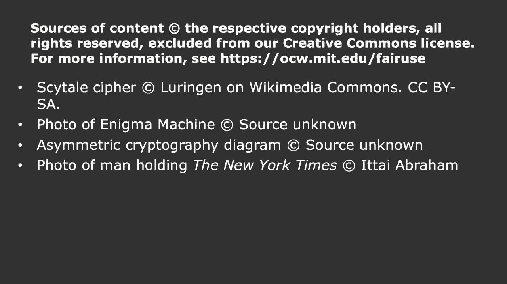

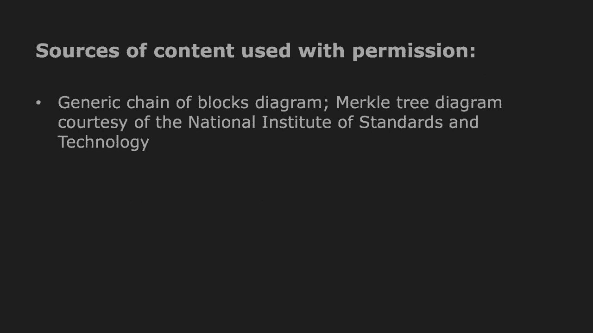

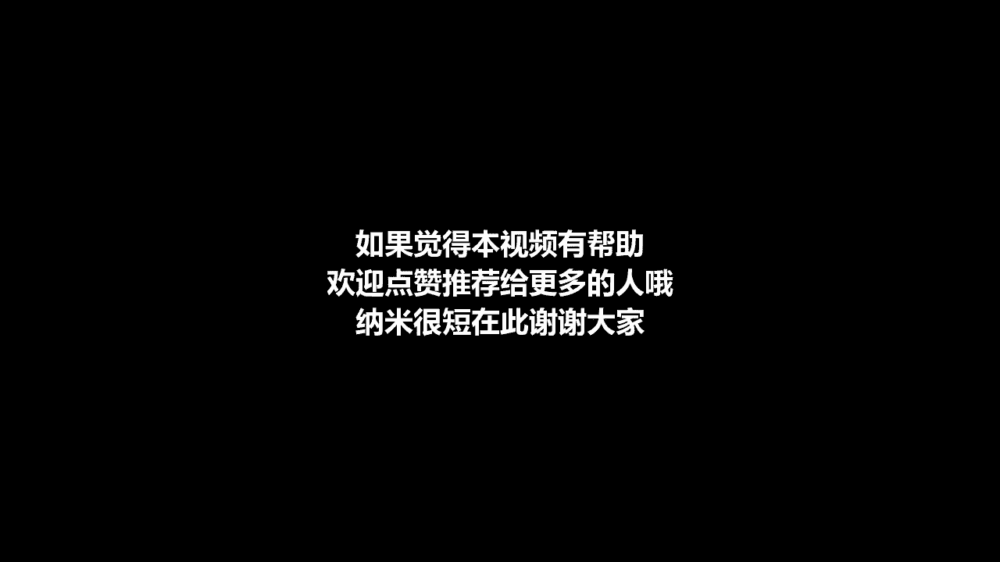