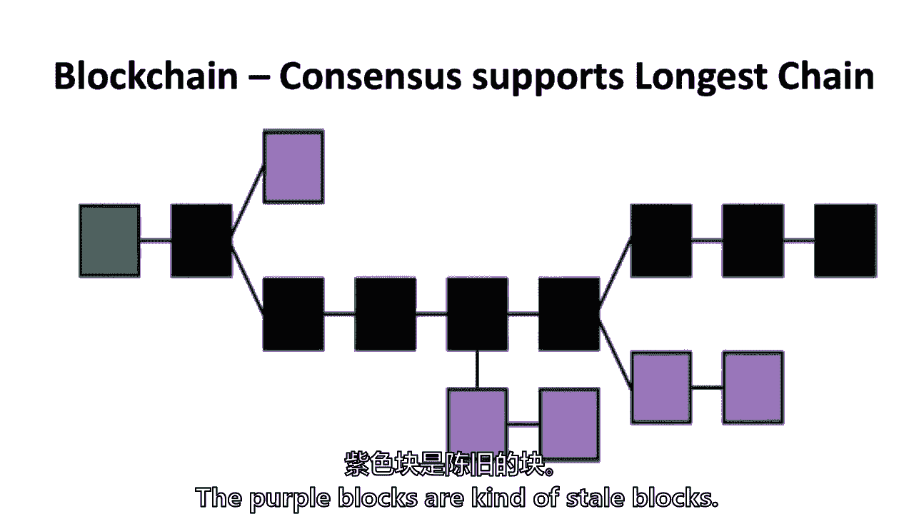

# 【麻省理工大学公开课】区块链与货币 - P4：4、区块链基础知识和共识 - 闰土聊Web3 - BV1sL411N7Mm

你好，大家周末好，大家保持干燥，我希望，所以我们要回到，区块链，我们没有，当我们做密码学的时候，我们没有失去太多的人，上周哈希函数和数字签名，所以我感谢你们回来，那么今天的学习问题是什么来着？

拜占庭将军的问题是什么，有人想告诉我拜占庭的普遍问题是什么吗，所以这是一个普遍的问题是一种普遍的数学难题，基本上它是什么，一个不符合团队最大利益的演员，是啊，是啊，所以可能有如何协调。

当某人的行为不真诚时，是恶意行为者，但也可能是一些人没有得到沟通，某人有一个想法，不管是不是恶意的，我们做得怎么样，艾琳，是啊，是啊，比特币中的工作证明和挖掘是如何解决的。

我们要走过这个，我要告诉你我对它的感觉，但有人想给一个简短的，的短版，工作的证明本质上是。

呃用概率的方式解决它用确定性的方式，我通过使用他们大量的CPU功率来解决一个一定复杂的问题，来证明一个共识已经被所有权利的大多数达成，所以野蛮人说的是，使用CPU电源是概率性的，而不是确定性的。

我想你是这么说的，我要更详细地介绍一下，但有人想给，再来一次，我应该这么说，当事务发生时，它贴在，然后矿工进去，他们试图竞争解决这个问题，谁第一个领奖，呃，我还想说这需要很多人推动同样的力量，有点拉。

呃，的，所以它需要由大型计算机供电，戒毒所说这是关于被称为矿工的人或被称为矿工的计算机，我们今天要讲的，但交易是其中的一部分，也是它如何结合在一起的一部分，我不会折磨你并要求更多，但是你，呃。

另一个重要的想法是，即使解决问题真的很难，验证解决方案是正确的很容易，所以这确保了，尽管矿工们需要大量的计算能力来解决，一旦函数被解决，它可以传播到节点，并验证了JN JN提出的一个关键点。

一旦有人解开了谜题，它可以通过网络传播，然后当网络可以验证它时，我们稍后要讨论的是，这是一个很难解决的难题，但这是一个很容易验证的谜题，这是一个重要的不对称，本质上，有很多资源来解决一个谜题。

但一旦知道了答案，可核实的资源非常有限，这是正确的答案，如果它不是不对称的，它也不会起作用，所以它是一个，它是许多密码设计的关键部分，但尤其是亚当·巴克的新奇之处，在二十世纪九十年代的工作证明中。

我不知道这对你来说是不是很轻松，或者你举起手来德里克，哦，那只是一个放松的姿势，我喜欢它，我们也将讨论其他共识协议，工作证明不是唯一的共识协议，而是如何称呼自己，到拜占庭容错性，然后一些经济激励。

所以我们来谈谈本国货币，第一个区块链应用的本币是什么，比特币，在座有多少人曾经拥有过比特币，所以你们都拥有有助于区块链的本币，你有机会读到一篇论文，这篇论文是我们麻省理工学院的一群人合著的。

我希望你们中的一些人能够下载它，好，很明显，即使你写了一些东西，它仍然在版权墙后面，所以我很高兴知道它实际上是可用的，然后回到国家标准和技术研究所的论文，这次是下一章。

然后是一篇大约两五年前关于拜占庭的论文，那么我们今天要做什么呢，我们要回顾一下设计，我们将讨论共识，通过工作证明，这很重要，这是相关的，但这也是一些有趣的事实，本国货币，当然是第一个比特币。

但是现在至少有一百种不同的本国货币，拥有一个网络意味着什么，为什么网络很重要，尤其是区块链，其他一些协商一致的议定书，然后把它包起来，只是回到复习，这就是我们周四讨论过的，但我认为这与，只是把它带回来。

我发现当我第一次学这个的时候，很难保持所有的运动部件，记住你整个学期都会看到多少张图表。

但都是不同的街区，它只是附加的，附加什么，只意味着安德鲁，那有什么关系，这个词，只附上我们上周四讨论过的，是呀，所以那不可改变的权利，所以它现在是不可变的，当然，因为密码学可能会被打破。

但我们用不变这个词，它不能改变，除了可能作为一个瘦，所以我喜欢这样，在他的书里，你们都得看看这个，这很聪明，你知道的，如何做一个，旗帜，也许它是不变的，除了十有八九到四十次可能会被打破，或者我可以插话。

实际上这样说，没那么好，实际上从技术上来说比特币，所有这些无许可的加密货币，攻击他们的一个方法是我要记住很多金钱权力，但另一种攻击它们的方法是控制实际的网络，就像互联网，所以如果你有互联网服务提供商。

或者如果你是中国，所以这实际上是一个假设背后的事情是如何工作的，也就是网络工作，因为每个人都看到了信息，我同意你，但也有一些假设，假设中国或任何国家行为者选择了，零挖掘，你可以在零挖掘的情况下摔倒。

你不需要钱，如果你控制了网络，如果你控制了全球网络，或者只是网络网络，实际我明白，你说的是全球互联网吗，或者你说的是一个国家的中国，有百分之五十的中国矿工，我在努力，我禁止这些带有屏蔽的中国迷你广播。

他们发现这个方块在这里，他们发现另一个街区在这里，它在这里，世界其他地方会发现街区在这里的时间，我有一个叉子在这里，我有两个给你，不要见面，所以我们稍后会讨论叉子，我们能把李的观点坚持到那时吗。

我要和你分享，什么，回到2010年，他就在后面，在那里你有采矿的力量，他以为网络又工作了，只是为了澄清，嗯，艾琳提出了一个观点，即有人是否抓住了互联网的一部分，如果互联网本身通过捕捉互联网的一部分。

你用叉子，说我会等一会儿，但我现在要掩护，这个问题是在一封电子邮件中提出的吗，我只是想和你分享，所有的一切都是，只要是互联网的那一部分被隔离了，不到多数，事实上，如果是中国，因为这是在例子中。

即使在八年前，这将大大低于50%，在合理的时间内，也许需要几个小时，但在合理的时间内，那里的大部分采矿力量，可能需要一段时间，但另一个可能会停下来，人们将停止在中国投资电力和CPU时间。

因为他们现在会意识到，至少理论上是这样，再加上一些需要意识到的东西，如果你说我们要去岔路口，但对于不知道的人来说，如果你有一把叉子，然后之后的任何事情你都继续工作。

所以这就像如果你失去了与主要比特币网络的连接，你还会有那个，只要你有私钥，所以如果中国有人意识到他们在错误的链条上，你又不是丢了你真正的比特币北约，这是正确的，他们不会失去它到。

如果我能用叉子之前的术语。

只是为了补充林的观点，所以他在后面说的方式，是啊，是啊，所以补充艾伦的观点，实际上，作为假设基础的假设也是如此，区块链背景下的一般问题，你有一个假设，网络实际上可以验证正在发生的事情。

首先什么网络实际上是一个有效的信息，所以这是一个潜在的，如果网络受到污染，那么解决问题的前提，所有的协议，这里给出的问题的解决方案实际上是无效的，如果网络是呃，受污染，所以你就在那里，所以我想。

因为我没有听懂每一个字，你只是说有一个潜在的假设网络协议，互联网的通信协议没有受到损害或隔离，但也知道它在起作用，它创建一个数据库，我们已经详细讨论过了，哈希函数和，数字签名然后共识。

那么技术特点是什么，我在上一节课的时候想了一下，在三桶里思考，我们上周四谈到的密码学和时间戳，我们今天要讲的，分散共识协议与网络，当然是用本国货币，然后最后，我们将在下周四讨论的交易脚本。

现在它不仅仅是三个桶，因为它是三个讲座，但它是三桶，因为它们彼此有关系，密码学，这是加密货币和区块链的核心，它是当今互联网上许多事情的核心，共识机制，然后是事务脚本本身，密码学。

正如我们所说的在对手面前的交流，也是作出承诺的一种方式。

哈希函数，如果你还记得我们谈过的，这里哈希函数的键是什么，在哈希一的键中，你只需要在电梯里，你知道，确保你的兄弟姐妹认识你，那是什么，如果您必须使用私钥和公钥，所有的权利，这是一个很好的，那是密码学。

但不是哈希函数，呃，它是任意数量数据的固定长度的指纹。

我喜欢单向数据压缩。

填字游戏，这里有人在手机应用程序上做纽约时报填字游戏吗，所以如果你做周三的纽约时报填字游戏，它能告诉你星期三你对不对吗，还是它没有告诉你什么时候你是正确的，我不做纽约时报的填字游戏，但是，亚伦，是啊。

是啊，事实上，我过去通常做一个，但我想它可能会告诉你那天或第二天，也可能我是斯蒂芬妮，所以一旦你完成拼图，它就会告诉你，你是否有任何错误，但它不会，但你不能真正检查错误是什么，除非你想喜欢。

使你那天的连胜无效，所以基本上你每次都有一个连胜。

我实际上不知道纽约时报是否使用哈希函数，但他们可以他们可以，因为他们可以把整个纵横字谜拼凑成一个哈希，这是一个承诺计划。

记住，如果您更改输入数据中的任何一件事，哈希出来的效果会不一样，所以纽约时报可以使用哈希函数，这样斯蒂芬妮就能发现，因为你只能推，看看它是否正确，当你完成整个，它要么告诉你你有或不对。

所以我只是把它带到现实生活中，哈希函数，想想纽约时报的填字游戏，如果你不记得，斯蒂芬妮问，我们说过，只添加日志并在区块链和比特币中回忆，在街区的头有一堆信息，和在街区头上的东西。

就像纽约时报的填字游戏一样拼凑在一起。

我们有一个区块链，大部分数据，虽然，被有效地储存在一个叫做默克尔托盘的东西里，同样，它使用了大量的哈希函数，所以这是一种高效的方法，但这也是保护数据的一种方法，所以现在我们要回到你最喜欢的事情上。

数字签名，那么什么是数字签名呢，你能证明你用私钥签署了类似交易的东西吗，另一边的另一个人，可以证明您是使用公钥签名的人，嗯，我上周四没有经历过这件事，但想想数字签名，两种不同的方式。

不使用哈希的数字签名，在比特币和区块链中，通常它实际上是，它与哈希结合在一起，所以乔·奎因刚刚经历了，你可以有一个私钥，您使用发件人的公钥和签名对某些内容进行签名，正是这样，但它也能做到。

你也有一个哈希，你把所有的数据，所有的信息，你用签名把它放进去，这有点太复杂了，那是上周四的讲座，但重要的是要知道区块链基本上在做什么，大多数区块链都有，就是，他们拿走了很多信息，交易，例如。

对该信息进行散列，为什么我们又把它搞砸了，凯利保护它免受其他人的伤害，网络中的其他用户，有点像我们谈论爱丽丝和鲍勃，以及一个人如何意识到对方的钥匙，然后返回验证传入，它还压缩了一些数据，但它是一个。

这是一个承诺计划，是这样的，是不是，这其实是，回答所有问题的纽约时报填字游戏，所以通常它先把它散列，意思是这是一种承诺，然后在上面放一个数字签名，上周我们谈了最后一件事，比特币地址是什么，伊莎贝拉。

你能告诉我什么是比特币地址吗，我想是这样吗，你怎么知道比特币被发送到哪里，所以它告诉你比特币在哪里被说，本，你想帮一点忙吗，所以这是公共哈希，公钥，公共缓存，所以基本上是在伊莎贝拉和你之间。

这基本上是如何识别任何本地货币比特币，但它是公钥，加上几个额外的散列，和一点花哨的步法，使它压缩和更小，但它实际上是什么，所以它是由公钥决定的，但它不完全相同，我找到了一个漂亮的小图表来定义它。

私钥导致公钥，通过比特币的某种形式，这叫椭圆曲线乘法，但是还有其他形式的公钥和私钥，公钥，然后它就被散列了，然后它通过一个代码，使它更短，也就是比特币地址，它被散列的部分原因和它通过的部分原因。

额外的代码是为了使它更加安全，嗯，这不是唯一的原因，它也会把它压缩得更多一点，但是你们这些曾经拥有比特币的人，你有钱包，钱包里保存着这些比特币地址，现在让我们来谈谈分散的网络，今天的话题。

对上周四的复习有什么问题吗，我知道很快坚持住，我有一个关于双哈希的问题，这是否意味着它现在不那么无形了，因为如果你拿着两位数的现金，把它承包给一个，我认为问题是，如果哈希函数的输出较短，有没有可能。

我想从数学上来说，这可能是正确的，然而，这实际上要经过两个哈希，一个是这个机制，叫沙阿，二五，六，另一只，我要发错音了，但是已经降到六十了，所以我想，因为它经历了两个不同的哈希，答案是。

要同时打破这两个就更难了，关于审查的其他问题，所以他说，哈希公钥使其更加安全，我只是在想，因为就像公钥是为了公钥，所以喜欢什么，增加的安全性从何而来，所以你唯一真正显示的是一个比特币地址，直到后来。

我们将在星期四讨论这个问题，当您实际进行事务时，然后您必须公开您的公钥，所以最初存储是在比特币地址周围，有些人会建议，这就是为什么许多钱包这样做，永远不要使用同一个公钥两次，尽管很多人在区块链上做。

但为了最安全，您将不断创建新的公钥，私钥对，一旦你用过它，继续前进，去拿一套新钥匙，明白了，所以分布式网络，我们谈到了拜占庭将军的问题，所以我找到了一些拜占庭将军，他们都想攻击那只猫一座城堡，还是什么。

如果他们中只有三个人这样做，其中两个说撤退，这就是视觉，那是，这就是问题所在，在这篇数学博弈论论文中获胜的唯一方法，这是大约两五年前写的，如果他们都说攻击，或者都说撤退，但同样的事情也出现在计算机上。

无许可系统的核心是没有中央权力，如果没有中央当局作为一个分布式网络，就像分散的将军们达成某种协议，我们攻击，我们撤退得好吗，它基于共识协议和本地货币，就是把一切都拉在一起，但它是建立在其他人的背上的。

亚当回到1997年，他提出了一种处理电子邮件的方法，垃圾邮件，和其他类型的计算机问题称为拒绝，服务攻击，现在它最终没有被使用，我是说，是他提出来的，用了一小会儿，然后后来就没有用了，但是。

重要的是要明白，比特币中间的工作证明是在11或12年前创造的，比特币纸，嗯，关键是基本上需要大量的计算工作，所以电子邮件或电子邮件的标题，这是亚当·巴克斯不是比特币。

但是电子邮件或电子邮件的标题进入了哈希函数，创建哈希。

它是在一定的哈希范围内，他引用了前导零，2。有人想知道他为什么这样做吗，或者阿琳可能会告诉我们，而不是猜测，但谁还没有说话，艾米丽，你想试试吗，我不能完全肯定，呃，我猜。

就像在电子邮件周围保留一些隐私一样，嗯，所以绝对保护了隐私，但他试图把一些计算工作，每封发送的电子邮件都需要一到两封，或者三秒钟的计算工作，那是在他最初的论文里，需要几秒钟的时间，呃，事实上。

事实上我们，我们越早谈论，事实上呃，我们需要一种方法，你必须让这个谜题变得难以解决，但容易验证，这正是通过将哈希设置为固定特征来完成整个事情的方式，比如领导一些领先的零。

你得到的是修改整个信息的一小部分。

尝试，尝试，直到你得到特定的哈希，这使得它非常需要计算，但是验证只是运行一个哈希函数，所以我们开始了，我是说，对呀，你需要尝试一堆不同的随机数，为了得到正确数量的前导零，它可能是，我不知道。

我想这可能就像让任何东西零收费一样，很不错吧，但就像你需要尝试一堆不同的随机数，为了得到正确的号码，在电子邮件的情况下，他的想法是，任何发邮件的人都需要两三秒钟来完成这项工作的证明。

但需要一纳秒或更短的时间来确认，但如果你发送垃圾邮件，你有一台电脑，说数百万次垃圾邮件，每次两三秒，这对垃圾邮件发送者来说太多了，就是这样所以任何人任何人发送一封电子邮件，不会太糟的。

任何人都在发送数百万封电子邮件，那就太糟糕了，所以这就是为什么这个概念出现在电子邮件中，它可以被有效地证明，所以回到区块链，创新是，基本上，我们怎么用链子做这个，我们如何用一系列的作品来做到这一点。

记住哈伯，关于区块链的整件事，纽约时报上有什么，这是信息链，但在这里，我们为什么不做一个链条之间的工作证明，我发现了一个小图形，但是国王二五六，这是用来散列的公式，标题，上一个哈希，事务哈希。

一个时间戳和一个结，你能找到一个有一定数量前导零的哈希吗。

从某种意义上说，这是关键的创新，这个是绿色的，因为它们每个都有散列，在这种情况下，如果我是对的，这是前导的四个零吗，领先四个零，如果我们改变一件事，会发生什么，是阿尔法吗，如果我们改变一件事会发生什么。

哈希应该完全改变，哈希将完全改变，那么发生了什么，我们在这里改变了什么，我会来来回回，改变颜色，那是什么？他改变了交易地点，所以那一百块钱，我想在这个例子中去找你而不是安德尔，为什么。

为什么我能免费得到一百美元，在这个例子中，我想Coinbase是针对未成年人的，对，所以有一个事务专用于谁的验证，方块现在得到，十二个半比特币，所以你加上，除了您正在验证的所有其他事务之外。

但在这种情况下，你实际上不是这个未成年人，所以你知道不应该得到那么多，所以上周四分配的18分钟的小视频，我刚进去，我试图，我试图得到，我想帮我弄到钱，它使它无效，链条的其余部分，那真的是，那是。

这就是创新或天才，如果你试图进入以前的街区，不管是最后一个方块还是一个方块，十万个街区外，在填字游戏中改变一点信息或一个字母，它将改变整个区块链，我把它带回填字游戏，或者猫身上的胡须，只是一点点信息。

哈希函数的一个创新，成为时间戳块的创新，突然之间就有了这个工作创新的证明，所以现在到锁链本身，嗯，区块链的共识，很多人会说，事实上，区块链的现实只是最长的链，就是其他矿工，其他人会在此基础上再接再厉。

据我所知，尽管它没有写入基本计算代码，这真的只是一个共识，这是一个例子，紫色方块和黑色方块，紫色的方块是那种不新鲜的方块。

他们被布雷了，它们是通过计算求解的，这是一个功的证明，但没有人在他们上面采矿，如果有人不在他们上面挖矿，然后最终，他们被忽视了，有人称之为孤儿方块，但我会称它们为陈腐块，因为它们实际上是被创造出来的。

但里面的信息有点一文不值，它在实际的比特币技术中是不需要的，这种情况时有发生，但这已经一年多没有发生了，它的技术，你可以在各种网站上找到这一点，可能在最大，最长的不新鲜的链条可以延伸到两三个街区。

但它非常，非常罕见，回到李的问题，如果中国，假设它可能不起作用，但假设是，假设中国是紫色的积木，因为中国封锁了整个网络，假设会有一些网络之外的通信，可能在电视上，可能是快递。

中国矿工会知道他们不是大多数，在这种情况下，他们甚至会停止用电来开采，因为不管是几个小时、几个星期还是几个月，他们知道他们的支出将是，这些不新鲜的积木，这四个街区是矿工。

就会有，如果我能回到这个，会有一个硬币基交易。

但它将一文不值，因为这是一个块中的Coinbase事务，那不在主街区，以后就不能用了，但在比特币本身，有软件说你不能在100个街区内使用Coinbase输出，它直接写在基本代码中，从一开始就是。

所以你没有证实，尽管在网络被隔离的情况下也是如此，人们开始在这个分段块的顶部采矿，他们不会意识到他们的比特币在100英镑的ID中吗，让我回到抱歉，链条，你是说汤姆的问题是。

如果紫色的侧链持续一百个街区呢，发生了什么，事实上，我们有这样的情况，比特币已经在比特币和比特币现金之间分裂，去年被称为硬叉子，让我们暂时把紫色的链子叫做，比特币现金，它不仅持续了一百个街区。

它现在已经持续了数万个街区，它现在是该社区自己的本国货币，紫色区块链现在已经很长了人们已经从中找到了价值，它是自己的本国货币，我分享的原因，这就是汤姆的问题，嗯，如果中国被隔离了这么久。

但似乎会有一些价值，并称之为比特币中国区块链，这将是什么是钱，而是一种社会共识，谁决定奖项，我是说作为发现外面思想数量的基础，然后我的另一个问题，谁来决定，一个支持和一个社区也是如此，世界的形式是什么。

问题是报酬，我要举行一个酒吧，它的一部分一点点，当我们谈论本地洋流时，但回报几乎在每一个区块链中，是区块链的一种新的原生货币，比特币对比特币，XRP或用于每个区块链，有一个本国货币。

第二个问题是谁来决定，通常，但并不总是很难编程到第一个版本中，是啊，是啊，回到你的问题，但回到比特币和比特币现金的问题，如果比特币现金是你在另一边看到的紫色线，这是否意味着它比区块比特币链更短。

那是不是意味着，呃，的假设，呃，大多数人的共识，即其价值本质上是，问题是，如果它更短，是不是，所以没有，在那条链上没有有效性，因此价值，所以有两个人用这个图表，作为一个例子，有两种方法。

这张图表的要点是说黑色，用黑色表示的黑色链条，是主链，这就是社会共识将停留的地方，这就是共识所在，一般来说，不新鲜的积木没有任何意义，不新鲜的积木就消失了，偶尔会有一种叫做硬叉子的东西。

社会共识继续维持的地方，我用这张图表作为一个粗略的答案，汤姆之前关于比特币现金的问题，如果紫色的链子一直走成千上万个街区，社会一致认为要让两条链条都继续下去，你会开始看到不同的货币。

就像你用比特币现金看到的那样，那有帮助吗，所以我是，我在用图形回答一个单独的问题，我要再回答两个问题，然后转到本国货币，我还没有丹尼尔的消息，问题类似于采矿，所以如果您的事务在其中一个紫色盒子上。

该交易是否无效，可以说，它并不是那么空虚，只是，这毫无意义，是的，在某种意义上，A实际上是空的，所以我想和某人，如果您发起了该事务，你意识到了吗，并重新启动它，一个很好的问题，仍然在所谓的记忆池中。

任何在主链上采矿的人，所以交易，我们将在周四讨论很多，这个即将到来的讲座，通过网络进去，它们通过网络传播到整个节点，网络和比特币，大约有一万个节点，他们将收到这些硬币和那些提议的交易。

所以紫色链子里的任何东西都会在其他链子里，内存池再来一个，然后我要去一些哈希名称，是呀，是呀，在硬核的情况下，所以在比特币和比特币现金之间，有什么区别，这两者之间的价值差异呢，那是一个更长的问题。

问题是，比特币和比特币现金的价值有什么不同，虽然我认为比特币的交易价格在6300美元左右，比特币现金是34，三十，四百三十五，谢谢。赞，嗯，这给了你大约15比1的货币差异，嗯。

但这需要更多的对话来解释为什么会在背景中发生等等，嗯，所以让我来谈谈困难因素，所以工作证明，至少在比特币的情况下有一个困难因素，关于这些前导零，我们每十分钟换一次，让我们确保每个街区平均每十分钟来一次。

需要多少前导零，它大约每两周调整一次，每个区块链都可以不同，它不必每两周调整一次，这正是比特币所做的，这就是中本所做的，以保持平均十分钟，那么目前发生了什么，它需要18个前导零，因为这是在一个。

它是十六进制的，每个小数，它是什么那四个比特，所以比特是64个前导零，出埃及记是18个，是不是，所以是2比64，找到块的概率是1/2的负，所以艾琳刚才说的是，找到一个街区的机会很小。

因为这相当于18个前导零，六十四多，十八乘以四，哦耶，所以我做不到，是啊，是啊，是啊，是啊，他是计算机科学博士，但不会算术，所以这是最近的街区，我今天早上抢了区块链，嗯，它有18个前导零。

然后所有其他数字，那是座号，五百四十，一千，九百七十四，创世方块，2009年1月的第一个街区有十个前导零，你只需要八个前导零，所以概率上升了，所以让我把它从幻想中拿走，你知道这样的数字，只是说。

这是对数尺度上比特币挖矿的实际困难，因为如果它不是对数的，你真的读不懂，1。困难被设定为小事。这一切都缩放成，2009年开矿的头一年半有多难，在2010年初，一个，万亿，它实际上超过一万亿。

因为它是对数的，大约是7万亿，目前要找到这个谜题的答案要困难7万亿倍，比2009年，和，那是因为有很多计算机试图散列，所有这些东西，集体或采矿池的工作也是如此，能够以更有效的方式实现这一点，对呀，正确。

正确，哈希率现在在某个地方，嗯，这不是地球杂凑，我在努力回忆，每秒50个六进制哈希是多少，这就像一千兆个哈希，因为一个Terra哈希是一万亿个哈希，我认为值得注意。

尽管它并没有随着网络上计算机的数量而线性扩展，硬件也变得更加复杂，所以你不能就这么假设，有15万亿人在挖掘比特币，只是同样的人做得更好，我不能要求比比特币挖矿进化更好的设置了，你做了吗，你看我的幻灯片。

你的思想，你知道进化是什么，所以它从中央处理器和CPU开始，我不确定我的数字是否准确，因为我今天可能会使用CPU电源而不是29年的CPU电源，为那些比我更了解CPU功率的人道歉。

你可以在CPU上每秒执行大约200万到2000万次哈希，适当齿轮，显然，到2010年，他们没有坚持那么久，一些人发现有更快的东西，它被一个图形处理单元抓住了，我们整天都在使用GPU。

因为这就是我们所有快速图形的原因，如果你在笔记本电脑和图形处理单元上直播一些东西，有人发现你可以用它，你可以更快地散列，然后突然间，爱好者们开始把GPU连接在一起，他们可以想出一个方法。

在每秒2000万到3亿个哈希之间，我听说即使在今天，你也可能接近10亿，哈希是第二个，或者十亿哈希是一秒钟，如果你做了一个GPU钻机，但那是比特币的过去，现在有一种叫做特定应用集成电路和ASIC的东西。

想想一个电路，这个电路唯一做的就是创建哈希，事实上，电路是有线的，我用有线这个词，因为我年纪大了，能记得电线，但电路板的制造方式，它所做的就是将二五六哈希函数转化为比特币挖矿，第一个是6。

用于采矿的专用电路板在2013年问世，即使从那以后，他们的规模也在上升，最贵的，在ASIC卖三四千元左右，每秒可以做16个Terra哈希，或者至少这是它的评级，如果你在亚马逊上尝试购买，你可以这么做。

一个现代化的比特币地图挖掘工厂有数千个ASICS。

他们有水冷却系统来保持它的冷却，他们可能以不到三千瓦的价格购买电力，每千瓦三美分，他们甚至可能付钱给当地政府官员，甚至不付钱给电力公司，只是贿赂来获得他们的电力，艾米丽，你这个愚蠢的问题。

但是把所有这些处理能力仅仅用于采矿会有经济机会成本吗，比特币喜欢，在以下方面，是否有更有效的处理能力分配，就像一个更稳定的。

当然有取舍所有比特币挖矿的总电力，与爱尔兰等国家的用电量进行了比较，在像丹麦这样的国家用电的路上，我想是在爱尔兰和丹麦之间，见拉里，嗯，来吧，来吧，再加上，成本是，让我们假设它是美元或任何货币。

奖励是比特币，比特币的波动性使得很难回答这个问题，因为你不知道对你来说是否有经济价值，因为你不知道这样做会发生什么，我我说，在我们的第一堂课上，我既不是区块链最大化者，也不是区块链极简主义者。

你们都将有机会通过这门课程形成自己的观点，但其中一场辩论是好的，艾米丽的辩论，这是对经济的一个很好的利用吗，嗯，善用资源，但我会注意到，已经有了限制供应的东西，所以现在我们用电子方式做。

通过这种开采并不意味着这是最好的用途，我只是说这是另一种方式，所以从地下提取黄金是非常困难的，在十九世纪，有很大的保险库门和拿着步枪的保安是确保，人们甚至可以说，拥有中央银行需要成本。

所以我认为这是一种权衡，如何确保一种货币是一种更硬的货币，但这并不意味着证明工作是最好的方法，也就是，当然啦，然后设置为，嗯，的问题，还有其他达成共识的方法吗，所以另一件事是所有这些哈希。

它是如何分布的，这是我今天早上从网上找到的，你每天都可以看到这些统计数据，工作和采矿证明，成形矿池，这些采矿池聚集在一起只是出于简单的经济原因，它不太可能解开这个谜语，破解挖矿难题。

如果你一年只能解决一次，甚至可能每十年一次，你不打算投资采矿，所以采矿池是在2010年左右开始的，他不想每十年得到一次，她可能会说，嗯，为什么这个房间里的八十个人，你可能阿曼达，我不知道，说。

我们为什么不都排成一个杆子呢？我们要用我们的笔记本电脑，现在仍然是两千零九千或两千零一万，当你可以在笔记本电脑上挖掘比特币的时候，但我们可以说，为什么我们不一起做呢，然后我们所有人都可以说好，阿曼达。

那是个好主意，但你能为我们创造默克尔根吗，1。你能帮我干点别的吗？这样我们的电脑就不必做所有其他花哨的事情，所以阿曼达可能会说，嗯，嗯，我想向你们所有人收取一点费用，不如，如果我收你百分之一的钱。

阿曼达会称自己为采矿池操作员，事情就是这样，基本上是采矿的经济性聚集在采矿池运营商周围，标准费用从1%到3%不等，采矿池运营商为矿工自己提供一些服务，这些服务得到补偿，正如我所说，大约1%到3%的回报。

但最重要的是，它为所有矿工铺平了经济道路，它还做了一些其他的事情，但那是主要的，所以我也有一个问题，你不能你，你布置了，开采难度越来越大，和断电的成本，甚至盈亏平衡点实际上已经变成了一个越来越低的电费。

在接下来的几年里，考虑到这一点，如果是这样的话，人们会开始失去动力继续采矿，一旦发生这种情况，这口井怎么了，它可以走任何一条路，就像我们说的，只有比特币，这是比特币，每两周调整一次开采难度。

所以如果采矿的人少了，难度就会降下来，如果你还记得我说过你必须有18个前导零，它可能会回到17个领先的零，或者16个前导零，每两周它会根据之前的2016块进行调整，平均十分钟，例如，如果它平均。

十四分钟，就会降低难度，如果平均六分钟，会增加难度，这就是牛排的用武之地吗，就像BTC总是得到他们的19%一样，因为他们在系统中拥有最大的股份，凯莉在问，这就是赌注的证据，什么是赌注证明。

任何读过硬币台文章的人，看你什么时候隐藏你的名字，我可以打电话给你，美国空军，这是真的博斯，bose，法院说美国空军是真的，所以看在上帝的份上，是硬币，所有的硬币都已经分散到网络上了。

验证分配按概率分配，基于赌注的证明，是一种替代的共识机制，嗯和波描述得很好，但是凯利，它与这里的图表无关，这都是工作的证明，BTC的哈希速率是，这意味着他们真的有大约。

如果比特币的总哈希功率是六十十六进制，我有这个词吗，十六进制，exa，Exa哈希，那么其中19%大约是12%，做某事，那不是国家，他们已经有了正确的，这样创造出来的硬币。

很少有矿工能长时间保存他们的硬币，我是说他们可能会好几天，他们可能会，他们可能会因为各种各样的原因保留一些，我真的相信，但不能证明，一些最大的采矿池，或者矿工在他们从事非法活动的地方，他们以低于。

在电网上真的很花钱，但尽管如此，他们还是有选择的，这里有一个问题，然后我想继续前进，如果采矿业是如此正式化，就像你有这么多游泳池，是什么阻止了所有的水池聚集在一起，说让我们解决较小的难题。

所以难度就降低了，然后对每个人的收费就低得多，所以问题是如果矿池串通一气聚集在一起会发生什么，要么，就像一个G JN说的，至，让我们说好，我们为什么要有一个，让我们作为欧佩克这样的卡特尔。

石油卡特尔说我们应该限制供应等等，我认为限制是，这是一个开放系统，但有可能这似乎是合理的，我想更大的问题是，有很多，围绕这一点的大量学术论文是，发生了什么，如果采矿池聚集在一起，试图做，所谓的五一攻击。

并试图接管区块链，这是一个更有趣的挑战，我们将在整个学期讨论这个问题，到目前为止还没有发生，我来谈谈本国货币，本国货币有助于实现这一切，中本说的是，这是一个激励系统，这是一个激励系统，但也是点对点。

创造新货币并嵌入大多数区块链的方法，不是百分之百，有什么东西，我在它周围加了引号，本质上的货币政策，这限制了供应，不是每个区块链都有这个，但绝大多数都有，当我们开始谈论最初的硬币发行时。

你会发现一些没有，但比特币限制了它，我只想说这是什么，它是在每个块的Coinbase事务中创建的，最初是每块50个比特币，但现在现在，因为每二十一万个街区就减半，只是十二个半比特币。

这是你每次赚的比特币数量，如果你挖一个街区，今天大约值七万五千美元，给予或接受，或者大概8万块来开采一个街区，比特币现在的通货膨胀率是4。1%，所以想想你们中任何一个拿了钱的人。

谈论美联储的政策课程或金融课程，比特币现在以每年4%的速度增长，但它每二十一万个街区减半，所以通货膨胀率会下降到百分之二然后再下降到百分之一，后来大约0。5%，它在20世纪40年代左右结束。

所以不管智史是一个人还是一群人，他们制定了一项货币政策，并将其硬编码到基于计算机的代码中，它应该会永远在那里，将比特币限制在200万比特币，我要吐乙醚，仅仅因为它是目前的一种选择，每个区块开采三个F。

通货膨胀率约为7。5%，这是一个不同的发展阶段，不同通货膨胀率，但最近有人提议，这是程序员的提议，我们真的应该降低通货膨胀率，如果它被接受，它将在11月被通过，嗯，费用，以太坊的费用主要是以。

一种叫做气体的东西，气体只是以太坊的一个小单位，比特币的小单位是多少，智史，所以气体和智史很相似，粗野的，我认为两千一百万的极限是在两千四百而不是两千四百，不是二十四三二一，哦是的，等等。

你觉得是2140吗？所以我打字很差，英杰华，你有问题吗，是呀，艾琳说是比特币，取决于，你对那个词的使用，但其他人写道比特币是一种通缩货币，因为它没有生长，如果经济在增长，它。

x%和x%比比特币的增长要大，这将定义，嗯，我只想指出那些喜欢的人，有很多学术文献，这可以追溯到几十年前，如果不是几个世纪的硬通货，货币政策绝对是公式驱动的，不管是泰勒规则还是基于其他角色规则。

货币政策会喜欢你可以放入计算机代码中的东西，那些认为人类应该参与的人，很多人认为需要一些，人类的参与会说这太难编码了，你会想要一些你可以修改和改变它的东西，这将是危险的，在战争时期，在压力的时候。

在经济危险时期，或者像2008年的危机那样这会让危机变得更糟，所以学术文献，以及过去几百年硬通货的现实生活，硬货币政策与人的参与，一些判断是一种有趣的辩论，在这一切的中间，这将被认为是递归的，资产艺术。

这是一笔巨大的资产，与货币有某些方面的关系，所以问题是这是一种真正的货币，或者它只是一种资产，具有货币本的某些方面，你觉得怎么样，所以有三种角色或三种方式可以定义一种货币，它是记账单位，价值储存，嗯。

交换媒介，所以我想这有所有这些属性你可以称之为委员会，你的意思是，如果它拥有所有这些，它确实拥有，它做得很好，所以本，认为是的，有多少人和本在一起，截至9月，一八二千一八，不是二十一八，所以伊莎贝尔。

安妮在吗，有多少人说汤姆，有多少人认为不是，我不知道，我想你们都可以自己决定，马克·卡尼，谁是英格兰银行的行长？今年早些时候发表了一次演讲，在以后的课上分配，他说我不认为我们应该称之为加密货币。

所以它们应该被称为加密资产，他们还没有证据证明，这三个，那是马克·卡尼，我非常尊敬的人，但也有人说不，这足以证明，我会这么说，尽管他们似乎会，他们和这个，如果你不从课堂上拿其他东西，在我看来。

他们可以提供，你可以有数字货币，没有中央当局的，我的意思是我认为创新是存在的，无论你称之为加密货币还是加密资产，在这个时候，我把你们所有人，在任何论文上都不会有正确的答案，你提交，你可以用。

无论哪个学期，你觉得，符合你的想法，我想谈谈网络，我们只有十分钟，但网络很重要，很多时候当你谈论比特币和区块链，人们不会谈论这件事，但我很快就会在网络上找到八九个玩家，嗯，有完整的节点。

完整节点是一个组，是一台电脑，我应该说存储了完整的区块链，并且能够验证所有事务，它不必，这是志愿者的事，但它可以验证所有事务，剪枝节点，你不会读到很多关于它的东西，但我只是拥有它，一旦事务经过验证。

它就会删除它们，他们有一定的年龄，你的意思是，你知道，所有这些早期的交易，我们不会集中注意力，一直以来，嗯，可能是已经发生的事务数量的六倍，与目前交易的实际范围相比，所以所有发生过的交易。

其中五六个已经用过了，他们已经不在了，为什么我们要把它拖到我们的数据集中，所以你可以有一个修剪节点，轻量级节点，那个，如果你们中有人有比特币钱包或其他钱包，你可能有一个轻量级的，某种形式的轻量级节点。

或者所谓的SPV节点，它只存储那些区块链头，而不是在更少的存储空间下的所有细节，但是轻量级节点必须依赖完整的节点进行验证，因为轻量级节点不会这样做，它继续矿工，我们谈到了矿工，我只想提到矿工。

不必是完整的节点，阿曼达，你在为全班进行采矿作业，我们付给你1%到3%，但你是对的，你可能在高端收费，对呀，那么你认为阿曼达作为一个采矿池操作员正在操作一个完整的节点，你是试探性的说，但是汤姆。

你付给一个男人百分之二的费用，你难道不想确认她确认了一切，她就是这么想的，哦，她认为百分之三，但是你们中任何一个只是矿工的人，记得阿曼达是我们的拉操作员吗，任何人的安德鲁，你觉得你需要一张完整的纸条吗。

如果阿曼达不，否，所以很多矿工没有操作完整的节点，他们有那么多架子，他们把所有的电都用上了，他们雇了一个人来检查，别让他们失望，我认为这是一件可怕的事情，因为原则上你有230个采矿工具。

这意味着你有二三十台电脑，验证新建议的区块，这是每个人都想相信的事情，这些系统是分散的，你有成千上万的，所以我可能会开始叫你努里尔·鲁比尼，但我不会，但努里尔·鲁比尼，谁是经济学家？

他有时被称为末日博士，他喜欢这句话，因为他造成了市场的低迷，有有后来的阅读，我甚至可能做了一个拉比的视频，有这样的观点，它没有分散在采矿池中，是这个系统的致命弱点，但是完整的节点。

这一万个节点实际上仍然在进行验证，有一个有趣的社会结构，那里有很多节点在无辜地做，无报酬工作，验证交易，任何未成年人安德鲁都可以验证，如果他想的话，所以有很多免费的搭便车，和搭便车的经济学，然后是钱包。

你们中可能有三四十个人在你的电脑上，他们存储、查看和发送所有事务的地方，但重要的是还要创建密钥对，所以有很多事情要做，有一个本身不是节点，一点都没有，它被称为记忆池或记忆po。

我们将在星期四进一步讨论这个问题，但是内存池存储了所有未经证实的，尚未验证的，所以它们已经被某人验证了，事务进入网络，一个完整的节点验证它，它被放在记忆池里，阿曼达抓起记忆池，把它发给班上的每个人。

在一个街区里，然后我们开采它，嗯，我们现在不谈这些，但我们说过有一篇硬币桌的文章，你们中有多少人真的浏览了它，看了看，这对你有什么意义吗，或者这只是意味着有一些替代方案，普瑞亚，那是什么？这就是有一些。

有别的选择，这就是它对我的意义，我第一次调查这件事大约六个月前，但我只想提到替代方案，他们，通常随机或委托选择，所以与其说一万个节点中的一个，能证明这是有效的，或委托，有时他们会做一点委托和随机选择。

谁来验证下一个块，一切都取决于谁在挑选下一个街区，是亚当·贝克斯的吗，我们称之为中本共识工作证明，周四你会有一份关于中本共识的论文，克拉克纸，但还是有其他随机委托的方式来做这件事，嗯，在其中一些地方。

他们有第二次检查，如果有一个委派的人来验证某事，他们在里面放了第二张支票，有另一个团体主持并判断这是否正确，嗯，所以有木桩的证据，它是基于木桩，你的基础货币，有活动的证据。

这是一种工作证明和赌注证明的混合体，烧伤证明，还是愿意放弃硬币，能力的证明，你们有存储容量吗，您可能有一个分层系统，主要的无许可区块链都使用工作证明，原因是没有人真正解决所有这些其他选择。

没有人真正解决他们的几个问题，嗯，但他们通常会通过授权和随机化来找到更有效的方法，并可能有一组备份检查，达什和尼奥会说他们用牛排的证据，但他们实际上使用了某种形式的主节点，或设置专业节点。

但是破折号和尼奥有点像，想想市场价值最大的十三个和十五个密码，这意味着其他一切，有点涟漪，涟漪真的很像一个许可系统，而不是无许可，我的意思是他们会说他们是不被允许的，但它是节点系统中的一组坚定的节点。

今天就到这里，我们将在星期四进行交易，我把那个学习问题，然后我要请你通读克拉克的论文，这是真正的学术谱系，这是建立在哪里的，背景是什么，但我认为这是一个把一切都结合在一起的好方法。

记得周四你们都来回答这个问题。

你自己的观点，没有正确的答案，但如果是区块链和货币类可以回答这个问题，我敢肯定，我们会得到一个书面记录，关于它的某个地方。

