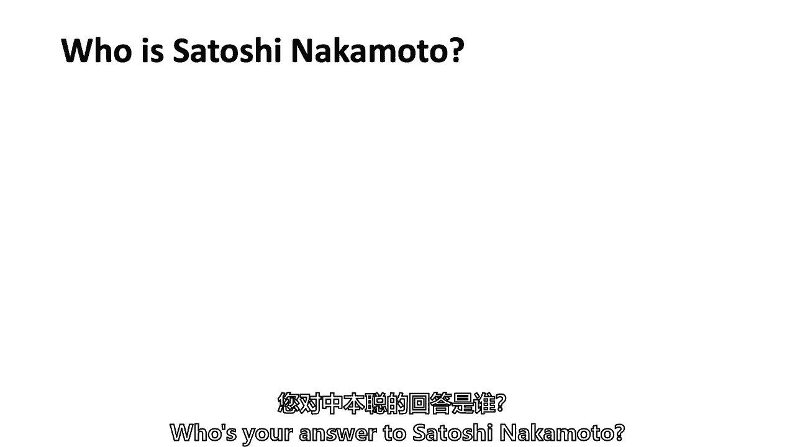
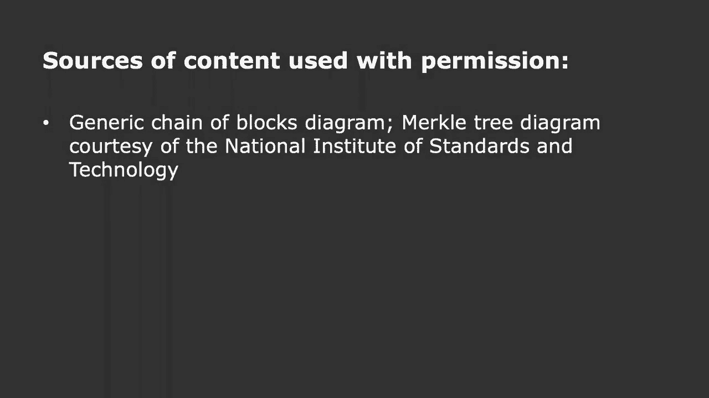
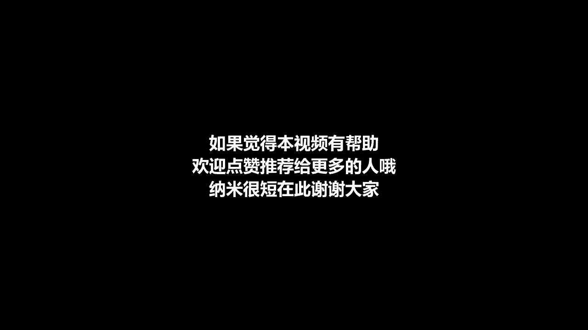

# 【麻省理工大学公开课】区块链与货币 - P5：5、区块链基础知识和交易，UTXO和脚本代码 - 闰土聊Web3 - BV1sL411N7Mm

谢谢大家回来我应该告诉你，当我，当我开始治疗时，对于你们中的一些人来说，我花了很多时间在政治上，我在政治上的角色之一是我，那个，如果有人请你做一个缔约国的财务主管，我可以给你一些建议。

你知道这是怎么回事吗，所以我不得不让一年一度的杰斐逊·杰克逊日晚宴安静下来，我组织这些大型晚宴，四五，六百人参加这些晚宴，我做不到，我无法引起他们的注意，以利亚·卡明斯上来了，他只是靠在麦克风上嘘。

它很安静，整个地方都倒了，我说，这是你在政治中学到的东西，你从你的牧师那里学到的东西，你的牧师，他是怎么说的，每次都管用每次都管用，所以以利亚·卡明斯给了我这个小职责，区块链与货币，我们在这里。

我知道这有点像吃花椰菜，最后几节课，因为我们研究了密码学，然后我们进入了共识协议，今天我们要把它拿起来试着完成设计，比特币比特币，我想介绍一下，虽然一个人走进来，在这个班里，我们会不时地有人走进来。

但是帕特里克·默克，他带着帽子和连帽衫躲在这里，他看起来像个律师，他已经在比特币周围呆了七年了，他目前隶属于哈佛大学的伯克曼克莱因。我不知道，帕特里克会在这里，所以我叫他出来。

他也是库利律师事务所的特别顾问，他有一群客户试图按照法律做正确的事情，但有时他们发现自己在与证券交易委员会打交道，或其他优良的政府机构，帕特里克还是比特币基金会的总法律顾问，你运行了一小段时间。

你不是在它发出噗的一声之前，是啊，是啊，我要了，是啊，是啊，但帕特里克是那种律师，穿着连帽衫戴着棒球帽，所以一个比特币律师，所以我想你会介绍，如果你需要帕特里克为你的创业努力。

我相信他的库利律师事务所会建议你，回答这个问题，那是什么需要一个，那个比特币是什么，我有帕特里克，所以其实，我从没买过比特币，得到100%的比特币，所以一切都很好，所以帕特里克。

当你从客户那里得到100%的比特币报酬时，你能坚持多久，这取决于，你知道在早期，不是很久，因为我必须支付我的抵押贷款和我的孩子日托和类似的事情，他们不接受比特币，所以呃，这些年来我卖了很多比特币。

有时可悲的是，但从来没有买过，刚刚赢得了他们，所以你就像个未成年人，除了你是个拿比特币的律师，我可能，我们要转向最后一篇关于交易的文章吗，还有一些叫做未用事务输出和脚本代码的东西。

这是比特币内部使用的计算机代码，我们将讨论一些设计特点，将所有这些都结合在一起，尤其是在阅读周围，这是学术血统的比特币，这也是帕特里克在这样做的时候分配的读数，他在哈佛法学院的学习小组，也是，然后是的。

你们所有人都将能够参与，我们要在你们中间做一个调查，啊耶，是啊，是啊，是啊，是啊，或者您更愿意在事务脚本上做更多的工作，所有的权利，好吧，我们会做一点两个读数，当然比特币的学术血统。

我们将在后半部分讨论，我会打一个冷电话，得到一些反馈，至于你从阅读中的想法，或者如果你还在略读，嗯，然后有一篇硬币桌文章，只是理解这一切，就像我说的，我们将通过交易，我们会做一点把它放在一起。

和学术血统，我们会和你一起玩得很开心，还是曾经，或委员会，所以您以前见过这个图表的事务，但是事务-事务中的格式，分类账，不仅仅是比特币，但实际上，一切都是交易一方的人，交易另一方的人。

所以在比特币中有一个输入，比特币内部的输入是以前输出的ID，所以比特币不仅是一系列信息块，每个街区有一千到两千，个别交易，但从某种意义上说，有一个单独的链条在进行，我有时会想到区块链是的。

有一个大块数据链，但也有一个个人交易链，西蒙是一只举起的手，或者只是挠头，这是正确的，你们中的一些人可能会选修他的金融课程，我想这里可能有人，嗯，所以说，所以输入实际上就是输出在哪里的想法。

你可以想到一个交易链，有人能告诉我所有的交易都是从哪里来的吗，在哪里，价值的起源在哪里，如果跟踪事务链返回其原点，雨果基地硬币基地，所以有人想说什么是硬币基地吗，呃，它是新铸造的比特币的一代，对呀。

所以新铸造的比特币的产生，不是帕特里克·默克得到它的方式，当他为法律出卖自己的服务时，但未成年人是怎么得到的，他们得到他们的交易，记得最初50个硬币是怎么回事吗，最初，回到2009年。

现在是十二个半硬币，在一对短短的夫妇里，大概十八、二十个月吧，一共是6。25个硬币，它不停地分裂一半一半，最终没有硬币基，但每一笔交易，从本质上说，必须回到所有的方式来建立一些硬币基础，有五十二个。

发行了五枚或十二枚半硬币，然后输出，所以事务格式非常简单，在某种意义上，输入是以前的输出和数字签名，你想寄给谁？它被发送到比特币地址，这就是为什么我们只花了一点时间，我们只是掩盖了什么是比特币地址。

这有点像公钥的翻译，但它与公钥不完全相同，当然，你需要用比特币或Satoshis来衡量价值，或者如果我们在以太坊网络上，它将是一种以太和气体，等等等等，在一百个不同的平台上，它可能是一种不同的本国货币。

锁定时间，它不是，我不认为任何读数中都有锁定时间，但有人想告诉我什么是锁定时间吗，因为它与技术的发展有关，有人想猜一猜吗，哪里有倾斜，不是斜面，博士，但从数字货币倡议中倾斜，否，你藏起来了。

你不想说什么是锁定时间，我以为这是某种保护机制，我以为这是某种保护机制，因为爱花钱，它是，它是一种保护机制，但不是关于双倍消费汤姆，我看到你举手了吗，这是猜测，是在事务散列的时候吗，所以是时候了。

是交易可能发生的时候，所以现在，现在是九月二十日两点四十五分，如果你把时间锁定在250或250，直到二五五才发生，因此，您实际上可以对所有锁定时间的事务进行条件化，但你可以说这不可能发生。

直到你能把明天的日期，对方是这么说的，所以这就像支票上的日期一样，这和支票上的日期有点不同，因为其中一个得到验证的东西，比特币不会提前验证交易，如果你把10月6日，尽管在一张手写的支票上。

银行可能还会拿走，即使他们可能不应该，所以它就像支票上的日期，它是经过验证和验证的，等等，我要带一个艾米丽，然后是西蒙所以如果你在未来设置锁定时间，会不会把链子里的块弄乱了，因为它就像。

你认识到的正确的事件链是什么样的，如果你选择在未来设定很多时间，我想更广泛的问题是，你为什么要在未来设定一个很长的时间，西蒙，你在回答吗，你是在问连兄弟，这么做的目的是什么，如果你不是真的。

它不是一种真正非常完整的语言，对所以，但这是一种条件，所以这是一个条件，因为在任何时间点，您可能需要条件付款，你可能需要一个按时付款的条件，我们将在几张幻灯片中讨论脚本语言，允许事务发生的计算机语言。

西蒙说巡回演出还没有完成，想告诉我们什么是计算机科学中的巡回演出，语言，没有，没有人知道巡回演出是谁，有人看到模仿游戏吗，有人知道巡回演出奖是什么吗？有点像计算机科学家的诺贝尔奖得主，那不是奖品吗。

当一台机器实际上可以成为一个，可以通过作为一个人，嗯，这是与旅游有关的一件事，但巡回演出奖是一年一度的奖项，有点像诺贝尔奖得主，但对计算机科学家来说，旅行完成允许你在计算机程序中做循环。

脚本语言不允许这种情况发生，每个函数都需要某种语言，我知道，艾琳看着我，我不潜水，但要回答艾米丽的问题，只是有这么多不同的方法来调节交易，让我们把它放在这里，以您可以按时条件的交易格式。

然后双方可以对你的问题这样做，关于它是否会无意中导致双倍支出，这是个很好的问题，我可以先确认一下吗，所以这是输入的唯一标识符，但它确实是从过去的输出中唯一识别的，区号是多少？是二十五万块还是三十万块。

所以它需要一个块ID，然后在这个区块内，它的1500个事务中的哪一个可能是，所以你可以通过了解区块链找到整个区块链上的任何交易，然后在哪个事务块内，它只是一个关于如何存储数据的数据机制，通过这种机制。

有一个交易链，以及区块链，然后我们谈到的价值，我想如果我做了我的数字，每个比特币的右十到八分之一，这有点难，因为我想有十个到九个，以太中的气体，所以说，那是一枚硬币，这就是硬币，那不是真的硬币。

因为这是一个问题，是否有人会给价值，直到大约18个月后，当那两个披萨卖了一万比特币，是什么，或者直到有人开始第一个，所以你也可以有多个输入和多个输出，我将使用我刚刚创建的一个例子。

我想寄一些比特币来辅导人们，我需要一些比特币，所以我可能会抓住三个以前的输入，这些只是事务ID 6索引3，当然不会是ID 6，可能是三十万，但关键是拿十个比特币，所以我想找到三个输入。

我需要寄六个比特币，让我们对阿曼达说，你喜欢那样吗，仅仅因为你坐在前面，詹姆斯是，我只想送三个，但我不会在詹姆斯的名字里用阿曼达的名字，我在用你的比特币地址，阿曼达的比特币地址和詹姆斯的。

所以不是基于帐户，比如如果你在美国银行有账户，你说我有，我想寄十个，我只是检查了一下，以确保我有超过十个比特币，我实际上必须找到单个事务输出加起来，在这种情况下，我想发送九个比特币，六比三传给詹姆斯。

谢谢。那真的很难，我们在麻省理工学院，但我可能不会送一个给我，我要把第9点还给我，这是我的改变，所以比特币交易甚至可能等于输入，等于输出，我本可以送一个回梅的，但我决定激励矿工，并留下一点额外的，零点。

一个比特币，这将是一个很大的费用，实际上那是关于什么，六百四十元左右，我可能不会那么做，我可能会有偿离开，十个、二十个、一百个智史，也许我不知道，我不知道目前的市场情况，但这是一笔交易，多输入，多输出。

但你总是要寄回给自己，这些输入会发生什么，如果这个事务真的发生了，他们走开了，一旦他们通过这个，实际输入就消失了，所以输入总是等于输出，当事务被验证时，验证方法之一是确保锁定时间确实发生了。

你已经过了锁的时间，另一个验证点是输入大于或等于输出，如果输出大于输入，交易将不会被验证，数字签名必须被验证回到之前的幻灯片，数字签名也必须得到验证，这个以前的索引实际上存在，这就是你的问题，艾米丽。

它仍然存在，但是这些输入，一旦你用过它们，它们在数据库中已不存在，他们有点过去了，这就是交易，这是核心，我知道这就像吃花椰菜，但它是所有区块链技术的重要组成部分，我们已经讨论过的Coinbase交易。

所以我会很快地滑过去，但这是解开谜题的奖励，在比特币的情况下，它正在解决工作证明汤姆，我们回到次要的激励点，其中一个或一个，这和信任的代价有什么不同，你使用金融机构，所以汤姆的问题是矿工们。

当然他们会得到他们的12。5比特币，他们可能会得到一些交易费汤姆的问题，另一边，这和付钱给某个中央中介有什么不同，尝试这样做，我可以引用电话是谁想，我是说，这是一个关于市场的经济学问题。

我想说发送交易的人有能力选择，这笔交易我们得付多少钱？你付钱也许这就是区别之一，所有的权利，所以一个区别是银行设定了一个通常固定的收费表，这是一个分散的市场机制来制定费用，肖恩，中间的费用要高得多。

与比特币相比，交易签证，肖恩的第二点是，目前这在未来可能不是真的，但目前，中央中介机构能够收取比这种分散系统更高的费用，我认为从概念上来说，这不是集中的，只是功能是一样的，数额，也许，我支付的金额。

费用的数额是不同的，但概念太艾伦了，基本上是说好，也许没有那么大的不同，我是说，尽管它可能是漂浮的而不是固定的，它目前可能是更低而不是更高，但你是说从根本上说，大概是一分钟的夏博，让我把它拿出来。

你真的要告诉我们答案，否，这是个很好的问题，不是强制性的，不是不是很好，这可能会造成一个很大的错位，所以不是强制性的，费用以市场为基础，像去年12月这样的时候，他们真的很高，现在他们很低。

部分原因是比特币网络没有满负荷运行，我是说它可以很容易地容纳一个街区1000到2000个交易，它不像，有一种干扰，要把一两万笔交易塞进一个街区，就像上次一样，我认为这是非常不同的意义上，你知道。

你基本上是在膨胀饲料在大多数来膨胀，对呀，所以即使你不含蓄地表达你的痛苦，对于其他交易的人，随着时间的推移，这种情况会改变，所以这实际上是她如何，在哪里，随着时间的推移，这些在网络中的结构将如何变化。

因为它有点开放，这里再拍一张，亚历克西斯，我们没听过像超人，控制动作，好像他们会把钱和大，他们可以用它来，就像，我不知道做项目，作为传播或其他什么，所以他们在价差上赚钱，而这里的比特币案例。

就像一个会留在系统里，它会把它扔给，就像另一个矿工，谁将用它进行另一笔交易，它将留在同一个网络中，我会说，而不仅仅是去，我听到了，但它实际上可能会把网络留给像帕特里克这样的律师，对呀。

或者如果你在星巴克使用它，它可能会离开网络，星巴克能不能接受，嗯，所以我只是，我在挑战你的想法，但你可以挑战我的，你知道，我们为什么不结束与埃里克，然后继续在视角上的差异，从起源的人那里。

交易基本上是一样的，但如果你把它看作一个系统，没有一个单一的实体从交易中收集所有的钱，你有一个网络，至少有…的网络，嗯，正在到达那里的笔记，而且一旦我们起床，有两千万，二千一百万，比特币，一代一代，呃。

那么所有的系统都必须以某种方式受到激励，两点两点，其他的点，但我想重复的两个，一个是这是更分散的，可能比现在的商业银行体系，例如，用于事务处理，或，或事务处理，签证和第一天要做的事情，当我们拿到付款时。

我们会研究的，嗯，所以它可能更分散，我记得你说过它更分散，但我把这个词可能在那里，第二，至少在比特币的情况下，提供服务有两个收入来源，矿工们这样做是为了Coinbase交易，每块12。5比特币。

目前每个街区大约8万美元，但也有一点费用的激励，随着时间的推移，它将不得不增长，当你往下走的时候，如果它只会是，你知道，一笔比特币交易，然后最终几乎为零的比特币交易，他们在费用方面必须更有智慧。

一些替代硬币而不是比特币更多地是基于费用，有些硬币更多的是模仿挖掘奖励，他们不是，无论他或她是谁，如果是一个团体，必须考虑一堆经济学，他们活了十年，这并不意味着，这是区块链系统最好的微观经济学。

你看起来很怀疑，但也许这将是我死去十二个小时的时刻，这是正确的，你已经准备好潜水了，所以Coinbase交易我们已经谈了很多关于奖励的事情，至少每210，000个区块就有一半的比特币。

中本放进去的一个很重要的东西是，你不能用你的硬币奖励一百个街区，所以它有点不新鲜或冷冻了一百个街区，我能想到两个原因，但也许你是，但想想另一个原因，有人想试一试吗，至于你为什么要在。

也许你挖掘了一个街区，你试图挖掘一个街区，那不应该是我们的阿丽娜，自我，你马上就把钱花了，这样你就可以得到，这是谈论的主要原因，不仅在文学中，但在早期的博客文章中，链条要经过多少块。

每个人都认为这是共识，我是说，你可以说5个10个20个聪选了100个街区，说那是那是那希望已经解决了，或者大约一千分钟，詹姆斯，如果你可以开采，然后你可以花，你能永远创造很多吗，然后付钱给自己。

创造更多，赚更多，然后不断积累，所以詹姆斯问，你能不能利用这个系统继续挖矿花钱挖矿花钱，否，下去，非常抱歉，英杰华，字字句句，否则我们会死得很好，那需要二十万，但如果你们中的许多人同时这样做。

然后你加速，所以在某些方面，这就是矿工们正在做的，但他们要等一百个街区，这就是智史试图得到的，如果你要等一百个街区，现在可能是共识链，它可能已经被验证了，除非我们遇到问题，帕特里克，你不在这里。

但是有同学提出了这个问题，嗯，如果像中国这么大的一个国家把他们的整个网络，只有中国走了一条路，世界其他地方又去了，这个案子的理论是在100个街区或1000分钟内，不知何故，这将被发现。

但如果不是你可能会，你知道的，詹姆斯提出的是一个问题，这至少是这个案子的理论，嗯，它总是被记录为默克尔托盘中的第一笔交易，高技术点，但它必须卷到那个该死的东西里，我们在讨论默克尔树的数据压缩。

这里有一个有趣的小事实，您可以在Coinbase中添加100字节的任意数据，你可能会说他为什么要养这么好，因为这只是一个有趣的小地方，一些人表达他们的创造性智慧，艺术的东西，互相发送秘密消息。

埋藏在Coinbase交易中，有一个完整的乐趣法医，有时矿工放进硬币库的小东西，对于那些有艺术天赋的人来说，一月三日，财政大臣即将对银行进行第二次救助，这是英国《金融时报》的一个标题，上面写着中本俊。

放入第一个块硬币基，这只是一个有趣的小地方，矿工们之间有一种嬉戏，有时互相交谈，你收到消息了吗，有人不是吗，我意识到，你不知道，我知道你在说什么，有一个矿工喜欢把天主教的教义问答，这已经把整个教义问答。

在每个街区，有一点大灾难，所以李，只是采矿池很小，好了好了他们也用比特币支付你吗，是啊，是啊，他们不是客户，我有个客户，好的，因此，所有这些都滚动到一个名为未使用事务输出的数据库中，这些是未使用的交易。

如果花了，这是一种烧毁和比特币交易，没有花掉，掉进这个，你可以用它，它的创建是因为它加快了整个系统的速度，而不是回去寻找所有这些东西，实际上有一个数据库，里面有所有未使用的交易，我包括在这里。

我发现了一种有趣的启示或讽刺，智史建造的时候，十年来出现的16个版本，所有的开发人员，比特币核心开发者，保留了未使用的交易输出，不是在区块链上，但是在一个叫做Level DB数据库的数据库中。

所以你们中那些比我更接近计算机科学的人，级别DB数据库的所有利弊，但我只是观察到即使在里面，使用最多的区块链第一个中央数据库叫做比特币，他们选择使用的不是区块链，但本质上是一个更标准的数据库。

以保存未使用的事务输出，现在，在某种意义上，这都是区块链解决方案的一部分，我不是，我只是说这是，这是区块链世界中的一个数据库，那其实不是区块链，这就像是一种有趣的讽刺，但它也在经济和技术上说。

智史试图建立一个货币体系，他并没有试图将区块链用于每一点数据，因此，这是未使用的事务输出的实际大小，如果你看不见，我想大概有五六千万，它更高，所以大约有6000万英镑没有花掉，不是六千万比特币。

因为大约有1700万比特币，所以你可以平均一下，你可以说每笔交易不到一个比特币，嗯其实，有调查和研究表明，这五个国家中约有一半，四百万笔交易是如此之小，以至于它们按，它们叫做灰尘，智史这么少。

试图赎回它们甚至不值得支付费用，它们加起来不到所有未偿比特币的0。5%，但它们只是灰尘，所以在这500万未使用的交易产出中，其中一半永远不会被使用，因为它们在经济上不值得，就像梳妆台最上面抽屉里的便士。

你们可能不会花，这里也有类似的事情，雨果，是啊，是啊，我想我对此有一个问题，现在可能不可行，但就像比特币上面的层，人们可以做这些微交易，因为我们的便士可能值很多钱，然后雨果提出了。

就像你梳妆台最上面抽屉里的便士一样，有一天可能会值点钱，我指的是比特币灰尘，这些未用交易产出的大约一半，智史，这里倾向于智史，也许有一天会有值得的东西，就像你梳妆台最上面抽屉里的便士一样，不过。

你在此期间失去他们了吗，好像它们可能值点什么，但与此同时，您是否丢失了那些，我在这里放了三个瞬间，只是为了让您了解已经发生的实际事务数量，已经有340个了，今天比特币网络上有200万笔交易。

或者一两天前，当我把幻灯片放在一起的时候，所以在三亿四千万笔交易中，只有大约五千四百万人仍未偿还，另外两亿九千万已经花了，如果你愿意，是呀，那么这些未完成的交易存储在哪里呢？就像如果他们不是。

它们还包括在块和单元格中吗，我们有未完成的交易，仍然可用的五四百万，这五千四百万都存在于比特币软件的数据库中，称为未用行动产出，Utxo和Utxo，这些不是字母，我在和好，这些是这些。

它们实际上是在区块链本身，所以说，所有发生过的3。4亿笔交易都在区块链中，而是为了让软件更容易，五个人，四百万从未花过，这回答了问题还是对我有效，它是所有不同节点之间的分布式数据库。

纠正所有的一万个节点可以，所有一万个节点都可以拥有完整的UTXO集，一些钱包提供商有完整的Utxo集，但它们不必有一些轻量级的节点，通常不会，但是可以，但是一个轻量级节点永远不会想要拥有所有3。4亿。

和完整的区块链，所以本质上它们在多个地方，因为它们在一万个节点上的完整区块链中，他们也在Utxo里，不仅在一万个节点上，但偶尔在别处海伦，所以我听到你说用完交易这个词，有点误导，因为交易可以花。

也可以不花，因为，比如说，如果我们有两个输出，一个输出被未来的事务花费，另一个输出没有花掉，所以说花掉的交易有点误导，因为只有当事务只有一个输出时，才会发生这种情况，产出花得很好，我用得很轻。

我是说在已经发生的三亿四千万笔交易中，二百九十有一个花在，1。你到底在说什么，因为事务有多个输出，他们可能有N个，也许有K个，所以其他产出没有用，我是说有三亿四千万，如果我，如果我的数据搜索正确。

我很容易犯错，所以我可能没有，但如果我的数据源正确，以前有三亿四千万个产出，其中两亿九千万人消失了，好的，好的，所以输出，所以说，那么您应该说事务输出，因为这些不同于交易，是呀，除了更容易放TXS。

就是就是，我相信，准确，这样人们就可以理解交易和交易是有区别的，本质上，艾伦的意思是目前有五个，UTXO中的400万个事务输出，它还说过去有产出，另外2。9亿已经花费的产出，所以有一种脚本语言。

有一点点计算机代码，没有必要，我说在你来之前没有修计算机科学的先决条件，我自己的电脑编程太旧了，因为当我在编程的时候，它是在Fortran和APL，你可以查一下，有点像楔形文字，你知道罗塞塔石，但是。

我不会把计数弄对的，但有几百个，但不是几千个小操作和代码你可以在比特币脚本中使用，它还没有完成巡回演出，这意味着你不能做很多你能做的事情，在计算机科学的其他所有领域，但更安全，本质上。

它的攻击载体比较少，很难降低一点，这是一个编程代码，就像我对那些感兴趣的人说的，这叫做基于堆栈，当代码被执行时，你一次移动一个代码，它给了一些灵活性，然后回到，艾米丽关于为什么有锁时间的问题。

或者Shimmon脚本代码允许一些条件，中本似乎是想给交易提供某种条件，这么多条件性，如此大的灵活性，以至于他需要一个完整的巡回演出，所以他有点我要说，选择了一个你本可以创造的中间位置。

我相信你可以创造比特币然后说没有脚本语言，这只是一个直截了当的指示，将此输出或此输入移动到另一个输出，创建了一点计算机代码，但不是很多，这就是我对经济和市场的看法，本周二和下周二，当我们谈论智能合约时。

我向你保证，我疯狂地谈论巡回演出是有原因的，完整的脚本代码，因为下周二我们将讨论智能合约，他们更灵活，所以这是基础，你不需要知道比你想要的更多的计算机科学，除非你和汤姆一起去那个兔子洞。

花更多的时间读书，所以有四种不同类型的，我称之为脚本类型，它们不是真正的脚本文字，但你会时不时地读到这些，我只想涵盖这四个，Utxo记得大约五个，四百万笔交易，有一篇很好的学术论文，我没有分配。

这是今年早些时候写的，调查了整个五个，四百万，所有未用交易，它就是这样崩溃的，八十，1%是发送到比特币地址哈希的交易，八九年前，当时智创造了这个，这不是最受欢迎的指导，但它基本上是向哈希发送输出，压缩。

比特币地址的承诺，我们现在上升到百分之十八，这并没有发生，这在三四年前是不存在的，真的，但18%的人选择了条件脚本，它是条件脚本的散列，有人说艾米丽，现在还不是时候，就像你只能得到它。

当脚本语言中的所有其他指令发生时，我要把条件隐藏在它的杂凑中，嗯，然后只有7%或没有唯一的点，百分之一就像他九年前第一次设想的那样，直接到比特币地址，所以它要么是比特币地址的哈希，条件脚本的哈希。

现在不到1%的人被多个签名，这意味着你需要三分之二或五分之三，信不信由你，这篇学术论文表明，有人说零中有零，现在，很难相信有人错误地编程了一些东西，到零签名，但显然有人这么做了，我只是想给你一个感觉。

计算机代码有一定的灵活性，没有太多的灵活性，但足以让你做一些真正有帮助的事情，他们将解决比特币的许多挑战，雨果提到第二层，我们将在本学期晚些时候讨论第二层，有一种完整的方式将技术置于比特币之上。

这是因为脚本语言在那里，你可以做到这一点，对剧本有什么问题吗，我知道我在试图报道一个很有分量的话题，你知道的，一百二十秒或更短，所以回到整个，这只是一个评论，我们谈了些什么，又是那个小图形。

当你知道它只是一堆街区，区块链就是这样，尽管今天我们意识到在街区下面我们有另一条链，我经常想到两条链子，比特币的区块链，大约有50万个街区，但在那下面，所有的交易实际上也是连锁的。

其中5 400万产出尚未支出，已经花费了2。9亿英镑，但在大约50万个街区下面，已经有三亿四千万了，你知道的，产出，可以说，它创建了一个数据库，比特币是一个交易数据库。

下周二我们将讨论以太坊中基于帐户的数据库，但它可能是一个分类账，即交易，或者是余额的分类账，我相信这是因为它的攻击载体较少，可能更安全一点，但我不能完全肯定，直到你解开谜语，我们不会知道答案，当然啦。

我们讨论过的哈希函数，和数字签名以及协商一致协议，所以我喜欢把它放在三桶里，不管是在晚宴上交谈，还是在三节课上钻研，这是密码学本身，我们上周四做了，如果你必须记住什么，只有两个密码原语。

哈希函数和数字签名，有多少人认为他们大致有，什么是哈希函数，所有的权利，所以我失去了你的一半，所有的权利，我能为Lawrentable做些什么吗，我一只手也没看见，上去和劳伦，你在看你的脸书页面吗。

还是你喜欢听课，你的电脑开着，你叫什么名字？所有的权利，那可能是因为你没有在听课，谢谢。我如何帮助什么是哈希函数，我的承诺是带大家一起来，你的桌子上没有人说你甚至粗略地知道了哈希函数是什么，你的。

我可能，我不是想让任何人难堪，我在努力工作，解决这个问题，得到一个，给我一个基线，你读过任何读数吗，可能不好，我有，是呀，你有，好的，哈希函数出现在几十年前，有助于促进数据库管理，有时它被称为注册表。

它需要大量的数据并将其缩小，把它压紧，把它缩小到，也许是一系列的数字，我有时把它看作是巴尔的摩信息的邮政编码，马里兰州，我在二一二零井，1。我是在2088年出生的，是我父母，邮政编码，我不会说我现在的。

我是这么想的，所以哈希函数，这和，比特币，来获取一堆数据并创建一个注册表，但通过这一点，它也成为了一种履行承诺的方式，是呀，你的名字，达纳，是啊，是啊，达纳，进入哈希函数并以哈希形式出现的内容。

这就是我注意到的，所以输入的是今天的任何一组数据，那可能是一整部电影，可能是这个房间里每个人的照片，最初主要是，嗯，而是因为在计算机技术中，所有数据都可以分解为一系列零或一的注册表，计算机从字面上开始。

第一个是从打开或关闭的注册表开始的，如果他们在，那叫一，如果它关闭了，称之为零，我不确定事情会怎样发展，但我一直在看一个靠，但是，所以所有的数据都可以归结为一系列的零和一，如果你把四个0和1放在前面。

两次两次，两次，两个，二到四等于十六，突然间你会发现如果你一直以2比0领先，你可以得到很多数据，所以回到你的答案，回答问题达纳，当我们上周谈到《纽约时报》的填字游戏时，纽约时报，如果他们愿意。

可以把他们的填字游戏的解决方案拼凑起来，然后斯蒂芬妮，斯蒂芬妮喜欢做纽约时报的填字游戏，她想知道她是否正确地完成了纽约时报的填字游戏，纽约时报可以对她的手机说，我们不会真正给你答案。

但我们会给你答案的杂凑，然后当她完成了，她按了一个按钮，她的申请可以说明她的答案，拜托了，拜托了，我们在这里一起学习，在区块链的情况下，你加载到区块链上的任何数据，然后用比特币，只是交易是这样吗。

所以在比特币和区块链中，他们在，你说的都对，但除了你说的一件事，只是因为他们实际上使用哈希函数，在工作证明的中间，因为哈希指针点阻止三个点阻止两个点，还有散列，他们使用哈希函数压缩一堆数据。

我所说的默克尔树，但它需要一千五百或两千笔交易，把它挤成一个，所以他们把所有这些都搞砸了，它在比特币地址中使用哈希函数，所以哈希函数就像中间的电一样，差不多用了六八个地方，还有一些，我不在任何方面。

了解我自己还是需要了解尼古拉斯，我们做得怎么样，我们是不是走近了一点，是的，劳伦，我们是不是走近了一点，是的，马特，哦耶，你会在那里，你在那里，我不在那里，然而，我离得更近了，顺便来看看。

给我发电子邮件，这是麻省理工学院的詹斯勒，我一周来四天，所以我想是时候让我真正明白，哈希函数是当我看到有人做一个现场，你知道这是一个围绕大脑的网站，当它像信息一样输入文本时，它实时地将其转换成哈希值。

好的，再说一遍网站本，这是个大脑钱包，伊奥，脑袋瓜IO，建议a，只要谷歌大脑钱包或区块链，您可以键入文本，你可以看到它实时地将它转换成比特币地址，你换一个字母，或者用大写字母写一个。

或者用一个来实时定位变化，只要你把任何文本放进去，它会传话进来，它把它变成了区块链地址，这就是它的散列，它把文本翻译成它，成批或整部电影，我们谈到了网络共识如何在信息状态上达成一致，没有中央权力。

你不想有中央银行或商业银行，或者脸书或父母单位，如果你愿意，嗯，我们所有人都在操场上，一起想办法，不知何故，哦，对不起，这里的问题是为了证明工作，我的问题是例如，我做了一笔交易。

这是不是意味着我要等十分钟才能完成交易，或者比如说，当我们做弹药的时候，就像瞬间，我可以马上得到结果，但安东的问题是，这是不是意味着我要等十分钟，文莫，许多其他支付实践可以进行得更快。

对你的回答是肯定的，这是区块链面临的商业挑战之一，正如我们所知，在比特币中，有一定的方法，技术分层，在它上面，称为第二层或闪电网络，我们不会潜入闪电网络，每个人都应该抓住安东问题，它是，这是正确的问题。

如果你们都把你们的批判性推理带到这节课上，关于市场和商业现实，一点关于法律和技术的知识，因为这就是我们要做的，哦好吧，这真的有关系吗，雨果，有用吗？所以那里的潜力很大，有点争论，哦，非常好，我喜欢那样。

所以如果你这么做了，如果你知道和你交易的人，您可以接受零确认的交易，只要它进入主池，并有合理的脚附着在上面，它最终会被包括在一个块中，这可能已经足够好了，雨果说的是，安东回到安东的问题。

这是不是意味着你要等十分钟，实际的技术答案是否定的，你不必等十分钟，除非你想最终解决，如果你想要终结，没有交易对手风险，无商业风险，雨果说得好，如果我愿意承担一些经济或商业交易对手的风险，在金融方面。

你一直拿着它，那么也许我可以做不到十分钟，事实上，甚至星巴克，当星巴克接受你的信用卡刷卡，他们从支付处理公司那里承担了一点交易对手的风险，第一数据，或，我不是说它可能也来自Visa和银行。

但我只想说这是支付系统有一些交易对手的风险，因为我们支付系统的最终结算不会在几秒钟内发生，所以实际的答案，谢谢。雨果，又把我清理干净了，你应该一直这样做，每个人都应该把我清理干净。

最终的解决是可能发生的，所以你必须找到其他的解决方案，不管是有交易对手风险的商业安排还是其他技术安排，争论是如果十分钟不是最终解决的权利因为它可能会工作，如果你想成为。

基本上是结局的概率随着时间的推移而增加，这与有多少呃，块连接到，所以西蒙的观点是，即使在十分钟内，块可能不是包含在最长链中的块，很多人说你也许应该等三个或六个街区，我想最长的，我要用这个词。

松散孤立链已经在比特币的五个街区内，最长的孤儿是什么，这是一个偶然的叉子，有二十多个街区，因为矿工们在做一些疯狂的事情，他们不小心把圆木叉成了白色，这么多年了，所以抬头看，三月二十三日岔路，在那之后。

2015年还有四个，也许有人放了一个兔子洞，所有的权利，所以说，但那是那是，英杰华仍然有一些概率风险，然后我们继续前进，好的，叉子是什么，所以我没有图表，但如果你还记得，有一张幻灯片显示了最长的街区。

它是黑色的，它有紫色的小方块，那是叉子，有一些叉，最终是两个链持续了很长时间，它们被称为硬叉子，有一种叫做比特币和比特币的东西，现金是最多的，艾琳使用或丢弃它的方式，我很抱歉，提醒我你的名字，亚伦。

所以这可能不是，我不知道，让我知道，现在不是问这个问题的时候，但我有点搞不清，或者我们需要知道的最重要的事情，以及它们之间的区别，呃，采矿技术，比特币与单纯交易，嗯，就像在区块链上，因为我不确定。

如果有一些重大的差异，我们需要，或者主要的区别是什么，我们需要一个很好的问题，亚伦·亚伦的问题，关于采矿我需要知道什么，关于交易我需要知道什么，是同一个吗，我向你道歉，它们是重叠的，但他们不一样。

所以想想维恩图，但这是一个很好的问题，挖掘的本质是，嗯，在没有中央权力的地方，验证和放置一组新的事务或数据，我要说得很宽泛，数据输入分类账，进入什么的公认状态，所以采矿有助于解决这个问题。

这就是整个过程，本质上，谁来决定下一个数据块，交易包括在数据中，但不完全相同，采矿真的很关键，但它不是交易的唯一组成部分，那你就得好好想想，还有另外一件事，嗯，已经有三亿四千万个这样的，在比特币网络中。

已经用过了吗，花了吗，它是否有适当的数字签名，如果有时间锁定，它，有条件吗，可能，甚至有一点点脚本代码，其他条件，就像必须有多个签名，是不是花了两倍，所以我希望这是一个很好的问题，它们有很多重叠。

你可以记住的一件事是采矿是关于，有50万块交易，已经有三亿四千万了，所以在所有这些交易中一定有其他事情发生，这有点帮助吗，因为我们在谈论所有的技术特性以及它们是如何重叠的，其中一个问题是。

它是把这一切聚集在一起的新奇之处，还是一件具体的事情，因为你知道报纸上谈到了账本和创造激励，然后解决整个拜占庭将军，我不太明白的问题，有什么特定的东西解锁了吗，所以凯利的问题，这是研究问题的核心。

是整个智史纸小说的原因，它只是把一切都聚集在一起，还是有更多的东西，我会给你一个提示，我想还有一件事，我认为，天才可以只是把事情聚集在一起，这本身就可以是纯粹的，天才，我是说。

还有一部分是创造货币的价值，但我不知道这是否正确，因此，建立一个激励结构，德里克，我有个问题，所以凯利问题的问题或答案，我有个问题好吧，我保留你的问题，德里克就一会儿，谁来帮我，因为这是学习问题的核心。

好的，谢谢你向我们证明了她在共识上所做的工作，它也是一部小说，是啊，是啊，小说，虽然没有把它们加回来，已经，在哈希缓存中做一些，所以它的应用是新颖的，所以这就是我出来的地方。

我认为天才把一切都聚集在一起，并使用亚当·巴克的工作证明，以一种真正解决双重支出的方式亚当回来不是在处理双重支出的问题，他有不同的挑战，是关于垃圾邮件的，坦率地说，它甚至不工作与电子邮件。

我们没有把这群人计算在内，他的工作完全是新奇的，我们将讨论它是如何出版的，但我想是的，我想它特别适用于双旋，所以我觉得帕特里克·默克，你能接一下吗？你怎么会，这是比特币基金会的负责人，但他是个律师。

你知道的，但我认为这是绝对正确的，所以通常，我想他们在那张纸上解决了这个问题，有人说比特币和其他东西有什么不同，答案不是科莫多共识对吧，中本共识，作为激励结构，把一切都集中起来，让每个人都对齐。

为这个数据库创建签名方，如果你不真正信任或识别这些政党，你就不能这样做，这是以前真正不存在的东西，所以这真的很新奇，这是一种突破，我想你可以归因于那份特别的白皮书，我也以此来给区块链一个清晰的定义。

这是一个被严重滥用的术语，我相信通过本课程的其余部分，你会发现，对我说，区块链是诞生于中本共识的东西，对呀，区块链，正如他们在那篇论文中讨论的那样，已经存在了几十年，对呀，这甚至不是一个新颖的数据结构。

但是用它来形成马达，这是正确的事情，总是会回到那个问题上，不管怎么说，也许是一个更长的阐述，所以我们有了它，你现在知道你所在的班级有特邀演讲者，我确实想对特邀演讲者说，点和德里克，我认识，你有问题吗。

但我们有12分钟，我只想，差不多吧，下周二，拉里·莱西格有时会出现在这个班上，同意和我一起客座演讲，所以我们要共同做智能合约，让我说说拉里，我是说你可以在这里看到他，他从哈佛骑车过来。

你知道你不能成为哈佛的正教授，他们把他从斯坦福偷走了，其实，他太容易成为正教授了，但他写得很广泛，这里有人吗？西翼扇子，电视连续剧《白宫风云》，所以他是唯一一个，或者你知道拉里·雷西格在白宫西翼。

现在你做得很好，拉里在克里斯托弗，劳埃德在一集里扮演拉里莱西格，但你会回去，你会发现这一集，拉里有一个有趣的故事看它的拍摄，他是波斯纳的办事员，他很懂合同，所以我问他，下周二他是否能帮忙教智能合约。

所以拉里要，我们要在这里杂种狗和杰夫，下周二，小心，小心，帕特里克，你可能有一天会在这里，这不是一个，我们会有很多客座讲座，嗯，在学期晚些时候，我希望我们偷了，确认杰夫·斯普雷彻。

谁是洲际交易所的首席执行官？掌管纽约证券交易所，杰夫可能会加入我们，我想现在是11月15日，嗯，但我真的很想学习，喜欢内容等等，德里克，你有什么问题？我可以跟你跟进，好的，跟进好的。

然后我们今天做了交易，记住哈希函数，纽约时报，我们有点，我们在一个更好的地方，我的目标是当你问这些问题时不要让任何人难堪，我的目标是我们都一起踏上这段旅程，我们不知何故有一些基础。

因为它确实与理解商业现实和经济学有关，我们讨论了时间戳和方块，默克尔树，这不是它的一个很深的部分，当然还有数字签名，我重播这个的部分原因，每次都是因为在政治上，我当然明白了重复是一件非常重要的事情。

但我也认为在学术环境中也是如此，嗯，然后比特币地址，那只是一次清理，它不等同于公众，然后是工作证明，回到问题，中本的共识是肯定的，所有这些和激励结构，但这是工作的证明，对亚伦的问题来说。

工作证明与我们谈到的交易有点不同，但是有很多重叠，然后它创建本地货币，我已经把幻灯片改成了两千一百四十，当然啦，网络真的很关键，我也是，在一个网络上有所有这些不同的演员，一万个节点，这么多光节点。

矿工和采矿池经营者，它们都有各自的经济学，所以如果有人想在办公时间来，谈论那些经济学，请进来吧，如果你从阅读中什么都不记得，我现在读了这篇论文，大概六次，慢慢地让它在我的脑海中浮现。

但每次我读克拉克的论文，我去哇，这真的对我有帮助，因为它不像智史，中本只是翻了翻手指，它就在…的背上，大量的密码学，早期的很多技术，但这是我回头看的图表，它有时帮助我啊，有时间戳，有数字现金。

有工作证明，这些东西是如何，也许十年后，他们会回头看，中本的东西会建立在，这是中心问题，这就是我们的一些同事在数字货币倡议中正在做的事情，在计算机科学实验室，他们说，他们能在此基础上更进一步吗。

你会在整个学期看到，这项技术还没有很多全面的应用，但它可能只是在这一整行中，是呀，我不记得你的名字了，这是另一个印度时刻，那是另一个，那是另一个印度运动，是啊，是啊，是啊，是啊，一百个人中最重要的是。

我们可以有两个阿维瓦斯，你知道，我们甚至可以有两个Avivas，如果有两个，普瑞亚，那是什么？我是普里亚，普里亚，哦普瑞亚，哦，对不起，谢谢。所以我只是在想，是哈希函数的应用之一。

哈希函数实际上是否替换了数据，所以我在想现在每个人，你知道吗，在云中保存数据，所以你能保存一个哈希函数而不是你的实际数据吗，然后它可以被压缩然后很好地质疑我对它的总结，尽管其他人可能更专家。

我的总结是你可以选择，你可以做任何一个，所以让我们把它放在区块链上，而不是放在，你可以选择在区块链中保存，只是散列，在其他地方有完整的图片，假设你要做一个图书馆的整个数据库，我会看到像图书馆一样的东西。

一个图书馆，所以图书馆里有十万本书，你可以把十万本书都拼凑起来，然后将哈希存储在区块链中，而不是书本身，这将形成对这些书的承诺的区块链，或者你可以把书放进区块链里，现在我看到中间有些人在摇头。

来自数字货币倡议的艾琳，我的理解是答案是否定的，你不能实际上你可以分享，您可以存储不替换数据的哈希，哈希的存储允许您证明您有数据，但你不能喜欢你储存舱门的事实，并不意味着你存储日期。

但是艾琳有一个两部分的问题，你永远无法摆脱这本书，你不应该扔掉这本书，因为哈希是一种方式，你不能拿着散列重新创建这本书，你不能拿着杂凑的东西重现《纽约时报》，填字游戏，但你不需要把它们存放在同一个地方。

我是这么问的，谢谢。因为这是问题的两个部分，您可以将散列存储在云中，并将书存储在其他地方，但你还是需要把书储存起来，也许，就是，我们只有几分钟的时间，但我们要坐的每一桌，每张桌子需要四分钟。

我们做得怎么样。

我们说我们可能会说由阿尔·芬尼领导的多个人，好的，第一个是由哈尔·芬尼领导的多个人，多么合适的H A L F I N N Y，在政府或政府内部，所以二号桌是政府行为者，A美国或外国，我不知道这是否重要。

但也许我们，但这可能无关紧要，我们在这里做得怎么样，多里安，多里安，中本，所以你要用新闻周刊的故事，是啊，是啊，普里亚，很抱歉你桌子前的名字，他们是密码双关语，它在一群加密朋克朋克自治。

就像一群密码朋克，经济学家，你怎么拼写密码朋克，尽管密码朋克，p，我们在哪里，国安局国安局，哦国安局好吧，激励与能力，哦，所以激励和能力，哦，呃，我们说过，一个叫加里·詹斯勒的人，有一个词可以形容。

但我不能在磁带上说，凯利·安东致倾斜，我们这里有什么，芝士，我们走吧，我们进去吧，尼克·萨博，尼克·萨博·萨博，谁写了第一篇关于智能合约的论文，所以英杰华尼克，我的天啊，我的哈希表，我是说，我是说。

你喜欢谁，我们确实有好吧，所以另一张桌子，你可以说这是尼克·萨博的另一桌，你在他旁边投了另一票，这里，我们要和你一起去，Gary，不不不，来吧好吧，我们认为是克雷格·史蒂文，赖特。

帕特里克·伯克的桌子将在这里排在最后，艾伦格林斯潘，艾伦格林斯潘，现在我真的知道艾伦，他真的很有天赋，但我不认为，我不认为安德里亚会让他在这里这么做，是啊，是啊，我们有谁，谁不能对我说不不。

但你说你想要的是谁，这张桌子，这张桌子说你，尼克·萨博的另一个，有人想告诉我们为什么是国安局，哦，哦，帕特里克，黑暗，对不起，这张桌子是什么，嗯，正如我所说，如果我是这样，我不知道，是啊，是啊，真的。

我想我不知道所以，我会创造尽可能多的，所以我觉得这是最糟糕的人，他们做了，只是对他们寻找多西的伤害，但我会让别人，你知道不，我不认为，但如果他知道，他会说，他不知道，德里克，你们的桌子是谁订的？

我们说过，克雷格，伟大的克雷格对，你可以看到我的影响，所以让我问这个，因为一分钟内只是为了好玩，有人说是国安局，你想说为什么，因为可以说他们拥有世界上最先进的密码学，如果有人这么做。

建立一个世界上所有黑钱都在流通的系统，而不是百元大钞，你会创建这个，并以一种方式创建它，你可以把它向后钉，然后弄清楚，他们有能力，哇哦，你知道吗，或者钱现在一个小时在哪里，有点好。

所以雨果会说如果是国安局，如果这对他来说不是很好，你们中那些说克雷格·赖特的人，我听到房间里其他人说不，谁说克雷格·赖特，哪两张桌子上写着克雷格·赖特，你为什么选伊莎贝拉和本，你为什么选克雷格，赖特。

所以我读到过，分析电子邮件中使用的英语，他们认为这可以追溯到，所有的权利，克雷格·赖特的语言分析，那些说不可能是克雷格·赖特的人，是谁干的，网站，他说，哦，这是密码证明，我想，但他们实际上搞砸了，就像。

如果你是摩托，你可以通过花第一个硬币来证明，但他做不到，所以好吧，所以说他考试不及格，他没有花掉两千零九张桌子上的第一枚硬币，选择了尼克·萨博，你为什么选尼克·萨博，三张桌子中的任何一张。

因为我们将在下节课中讨论它们，现在，所有的权利，你看，这有点有趣，我只是觉得值得，不会告诉我们，但随时欢迎你回来，谢谢。我们下期再见，星期二，记得拉里·莱西格在这里吗，所以请做阅读，拜托了，你知道。

