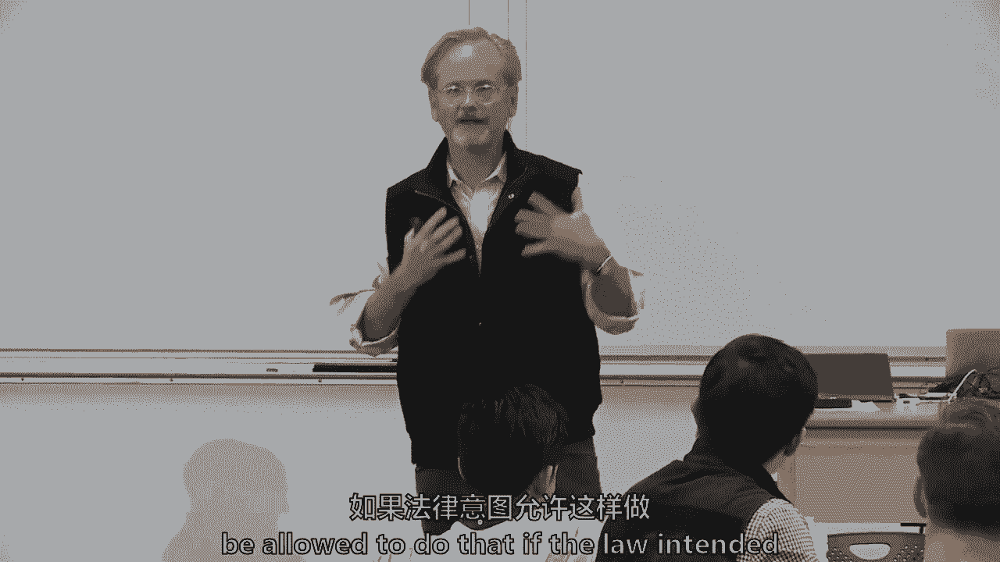

# 【麻省理工大学公开课】区块链与货币 - P6：6、智能合约和Dapp(去中心化应用) - 闰土聊Web3 - BV1sL411N7Mm

我很兴奋，因为我今天要得到共同教书的机会，用，我想其中一个学生，但这不是一个真正的学生和拉里，莱斯格同意几分钟后加入我们，所以我会比平时快一点，然后我们会教这个区块链和钱，我们到了智能合约的地方。

每个人似乎都回来了，这是你感兴趣的标志，比在我的教学中更多，但我感谢你能来，我们通过了最后三节课，在比特币和这项技术的基础上，在一节课上，我们要试着咀嚼，有点智能合约，市场上的技术方面都有一点。

然后拉里要带我们通过的法律，嗯，就像我说的，我想从行政管理开始，因为我们在六班，我将很快地回顾一下这些项目，我们要做智能合约，这个设计，什么设计特点，是呀，我们将回到哈希函数和默克尔树，但不要太多。

基本上是分散的应用程序和令牌销售，拉里将带我们讨论法律问题，然后我们总结一下，所以让我再快速解释一下行政方面，课堂参与度30%，这就是我们在一起的原因，这意味着希望阅读作业并参与，大概有一半的人参加过。

所以我想我会用更多的冷电话，星期四开始，我今天不打算做很多，因为拉里和我要加入，这样你就可以放松了，但要真正有意识，如果你没有参加过，试着加入谈话和讨论，两个单独的写作UPS，我想我们有七个。

但很有可能，你们中的一些人已经提交了，它只是意味着关键，商业推理，我们在一所商学院，在某种程度上，你只是总结了一些阅读，我相信我们会放过你的，但那不是我要找的，我真的在寻找批判性的推理和从商业角度思考。

为什么这很重要，它的优点或价值是什么，在商业推理和批判性推理方面，一个到十级，一个到二十三，总是在上课前，它可能意味着，我们将在八号得到大部分这些，第九和十年级，我知道这是怎么回事等等，这没关系。

没关系，但我只是提醒你，在小组研究论文方面，塞布丽娜和托莱达启动了一个谷歌应用程序，我想它在谷歌里，但你可以三四个人一组，下周二八节课前不要求做这件事，但我强烈建议你这样做是为了弄清楚你的团队是谁。

而不是等到下半学期，我想鼓励大家为你的用例选择一个区域，又到了中途，你不会被评分的，如果你再上一两节课才能弄清楚，但我只是觉得如果你，你知道你的团队，您知道您的用例将是什么，如果不是关于金融。

已经有一组问我了，如果可以的话，我只想知道更详细，会是什么，我可能会答应，但它需要一点预先批准，如果是在金融之外，所以有什么关于要求的问题吗，我只是想，今天的研究问题是智能合约以及它们与常规合约的比较。

里面使用的令牌是什么，有哪些平台，在与互联网非常相似的意义上，我们有互联网，然后在互联网上你有，你可能会说应用程序，脸书和其他应用程序，嗯，它也有一系列的平台，然后是分散的应用程序，可能在此基础上。

基本上是对分散应用程序的快速接触，在学期晚些时候，我们将就首次硬币发行进行两次会议，因此，我们将讨论很多关于令牌的问题，经济学，所以这只是第一次味觉测试，然后我们稍后再讨论，然后读数。

我希望每个人都读过智能合约，我以为数字商会，尽管这已经是将近两年前的事了，这种纸是一种很有帮助的味道，商界人士的想法，开发人员在想什么，我喜欢尼克·萨博，写了它的介绍，看到和质疑是很有趣的，为什么。

两年后，其中许多用例仍在讨论中，但被完全采纳后，嗯，然后是DAPS的状态，那么以太坊的竞争对手是谁，所以你感觉不好吗，我还没有问任何人冷冰冰的问题，我不知道，有人真的回去了吗，它们是可选的。

有人回去读过萨博二十年前的原作吗，关于智能合约，所以你们中的一些人有点喜欢那只兔子，区块链与以太之洞，嗯，粗野的，你觉得怎么样，你知道，那是二十年前的事了，他在尼克身上写了这件事，萨博写了这个，其实。

我花了更多的时间在以太坊白皮书上，所有的权利，那么你觉得以太坊白纸怎么样，我觉得很不错，给我一个很好的世界和平台的概述，所以是的，有趣的是，即使你不是为了上课而这么做的，在接下来的几个月里。

你发现自己对这个越来越感兴趣，甚至更晚，回去读以太坊白皮书，一开始技术含量不高，我不知道10页或15页，它真的给出了比特币的历史，它谈到了分布式应用程序，主要是由一个19岁的孩子写的。

然后拉里的一个同事，也可能是其中的两个，但菲律宾纸也是，就规管事宜，所以让我来谈谈智能合约和奠定基础，在拉里给我们法律之前，智能合约是一组以数字形式指定的承诺，我要说四件事，这只是一组数字形式的承诺。

所以不是手写的，它包括协议，什么是协议，安德鲁，标准作业程序，标准作业程序，我喜欢别人给我另一个词来形容它吗，也许，所以一组数字形式的承诺，但如果你愿意，它基本上可以包括，或标准作业程序，如果声明等等。

它在，是派对，然后违背这些承诺，猜猜尼克·萨博在1996年写了什么，我认为这可能仍然是智能合约的最佳定义，他创造了这个短语，两年前，这里有三张桌子，你们都投票给尼克·萨博，所以我认为这是最好的定义。

如果你有一个根，你知道吗，现在我也会说，然而，智能合约可能没那么聪明，很多人开始称它们为愚蠢的合同，它们只是执行一个函数的算法，所以不要把它们当成人工智能，那是西蒙·约翰逊下学期提供的另一门课。

把它们看作是愚蠢的合同，从某种意义上说，他们正在机械化人类之间本来可以做的事情，智能合约可能是也可能不是真正的合约，这就是为什么拉里要和它说话，所以我只记得，尽管尼克·斯沃斯称之为智能合约。

他们可能不聪明，它们可能不是合同，所以关于技术特性的一点，记住我们做这件事的三种方法，我们研究的主要技术特征是什么，我很抱歉这么做，安东，这三个大桶是什么，记得我们上了三节课和三桶信息吗。

这将是三大密码学之一，你有一个，另外两个人给了我其他的所以密码学你猜怎么着，比特币和以太坊都有相同的密码学，不是一模一样的，但为了设计特性的目的，它有密码散列，时间戳，块标头，默克尔树。

尽管以太坊有不止一棵默克尔树，比特币有一个，它有数字签名和地址，所以我们谈论的一切，三堂关于密码学的讲座，两种形式的区块链有人想告诉我我们的第二个桶是什么吗，权力下放，权力下放。

我们还谈到了ELAN人口普查共识，所以再说一遍，以太坊实际上使用工作证明，尽管有传言说以太将转向赌注证明，但它目前是工作的证明，有一种本国货币，或者F、H或以太代替比特币，它有一个网络。

我们谈到的关于alpha事务格式的第三件事，SO事务格式，所以我们讨论了事务和脚本，嗯，猜猜以太坊没有事务脚本或UTXO，这就是维塔利克·布特伦设计这一切的地方，说不，必须走不同的路。

而不是事务输入和输出，有一种叫做状态转换的东西，伊莎贝拉账簿，我们在第二节课上讲到的两种不同类型的分类帐是什么，是两种不同类型的区块链，再提醒我一次你的名字，斯蒂芬妮分类账和交易分类账，对呀。

所以余额分类账和交易分类账，您可以保留交易列表，这可以追溯到几千年前，这不是区块链，或者你可以保持平衡，比特币本质上是一个交易分类账，以太坊，许多其他智能合约平台都是余额分类账，有很多技术和数学原因。

为什么我很乐意在办公时间做，但正因为如此，当你从一组平衡中移动时，比如，奥博在美国银行有一百美元，给博101美元，你需要有一个过渡，这叫做状态转换，这意味着加一个但是，所以以太坊是一个基于帐户的。

然后它，事实上，甚至没有一种编程语言，你可以用六七种编程语言编写，对于那些如此倾向于，所以我会很快地通过，我的分析，和许多其他人，我对以太坊和比特币区别的演绎，但阻止我，如果有问题，所以创始人。

其实有一个创始人，围绕维塔利克的神话，但是一个19岁的记者在为，是一本比特币杂志，如果我记得他在哪里写作，我们可以在上面建造一些东西，利用尼克·萨博在大约六年后对智能合约的想法，他完成了巡回演出。

有人想提醒全班同学，什么是完整的旅游，我看到有人举手了吗，是呀，你真大胆，你叫什么名字来着？抓住阿尔瓦娜，嗯，你可以写得很好，你可以写循环，但是你可以写任何类似的程序，就像任何形式的洗衣一样，快递。

所以阿拉娜说，巡回演出完成意味着您可以编写循环，但这对，商业人群是，这意味着你可以编写一个程序来做任何事情，它有很高的柔韧性，我相信这里的技术员会说，也许你不能用它做什么，但重点和维塔利克所说的是。

我们不应该仅仅将它限制在一种不完整的脚本语言中，它可以在点对点上移动一点，他想做的价值，基本上是一个对等虚拟计算机，可以移动代码并完成代码，多年来，它能够被写在一堆东西里，但是坚固性是主要的程序语言。

因此，它是基于帐户而不是基于事务的，因为循环，如果您可以循环和巡回演出完成事务，有一个漏洞和攻击矢量，他把它作为计数的基础，存放在默克尔钥匙里，但你猜怎么着，如果你真的感兴趣，想了解关于以太坊的一切。

至少有四棵关键的默克尔树，这些内容被汇总到块标题中，有交易，本质上不是交易，他们称之为状态转换，有状态本身，一种叫做存储的东西，这与以太坊的每一个账户都有关系，信不信由你，实际上收据。

每个州的过渡都有收据的书面记录，所以以太坊区块链内部有更多的复杂性，他们每街区跑14秒而不是10分钟，出于某种原因，这改变了许多经济学的工作证明，别人可以研究的，维塔利克，决定使用不同的哈希函数。

它仍然是基于椭圆曲线，我觉得，但是一个不同的哈希函数，经济学呢，嗯，它被称为Aor et，它是以这样一种方式编程的，你不能故意使用它，使得采矿更加分散，你没有大工厂，整个哈希社区，整个采矿社区要小得多。

事实上，我认为它是关于什么的，它会小20万倍，截至昨天，每秒有260个Terra哈希值，比特币挖掘社区有五个四个xhash，这意味着更多的电脑，更多的电，更多关于资源的咬牙切齿。

比特币始于2009年1月，没有人拥有比特币，而以太坊是从预售和ICO开始的，我们会讨论的，大约七千二百万，以太坊维塔利克想筹集资金，他大概十九岁。

他与一位来自加拿大的风险投资家Joe Lubin串通一气。他现在管理着一个共识，鲁宾拿走了大约10%或9。5%的供品，他们在一个叫做以太坊基金会的基金会里投入了9。5%。

剩下的百分之八十以一千八百万美元的价格卖给了公众，我们这学期晚些时候再谈，关于这是否真的是一次证券发行，我公开说我这么认为，但那是在二千零一四年，在二千零一八年，证券交易委员会表示，不管十四年会是什么。

它现在已经足够分散了，我们会认为这不是一种安全，但本质上他们筹集了1800万美元，我们出发去比赛，哦，还有乔·鲁宾保留的10%，如果他还拥有，它现在大约值20亿美元，但他可能在路上卖了一些。

他们的街区奖励以太坊的货币政策，如果你记得它每四年分裂一次，你知道有一个街区奖励分裂，以太坊被设置为每块五个以太，然后一年前，他们刚刚宣布他们将把软件改为每块三个乙醚，一个月前。

他们宣布他们将把它改为每街区两个乙醚，所以比特币的货币政策据说是不可改变的，永远固定，但我想说，因为以太坊应该是固定的，现在他们两次改变了货币政策，有一种形式，如果所有的矿工和所有的计算机节点决定。

他们可以改变货币政策，以太坊已经表明，我认为以太坊更集中一点，有更多的领导力，因为维塔利克·布特兰是一个真正的人，谁愿意透露他是谁，他仍然有那种创始人的追随者，从某种意义上说。

他把我们所有人都变成了幽灵，因此，在某些方面，它在社会上更加分散，然后收费是自愿的比特币，引导一切艾米丽回到实践中的货币政策，这实际上意味着什么，就像比特币和以太坊的区别，它已经修好了。

但变化与保持相同的速度，艾米丽问，在实践中意味着什么，比特币的增长率或通货膨胀率要慢得多，它目前，如果我没弄错的话大约有一半，那是多少大约百分之四，但这大约是以太坊通货膨胀率的一半，它在七个范围内运行。

现在一百个活代币中的每一个，Aucoins有单独的货币政策，人们可以做一个完整的经济研究来了解这意味着什么，但就以太坊而言，相对于比特币和以太坊，通货膨胀率更高，其次，因为他们已经表明。

他们可以形成一些共识并改变它，我认为它向生态系统发出了一个有趣的问题，货币政策与更以人为本的货币政策，所以是不是，但是以太坊区块链的核心开发者决定，或者他们怎么，我不知道。

我不知道他们是怎样决定改变货币政策的，所以任何硬币的核心开发者都可以提出，对各种挖掘和节点进行更改，货币政策，即使在比特币中，如果核心开发商提出建议，货币政策可能会改变，在以太坊的情况下。

他们已经做了两次了，以太坊的核心开发高度集中在以太坊基础上，乔·鲁宾经营的公司在社区中也有一些规范的社会地位，但它一直是提议的一部分，在阅读建议时，这又回到了艾米丽的问题上。

核心开发商说我们应该降低通货膨胀率，就像有一个积极的倡导通过更新你的节点软件来降低，或者是，本质上，可能会导致一个硬叉子，我相信，这就是背景，让我谈谈平台，我们对以太坊的了解，我们刚刚聊过。

它目前的实际市值是20亿，嗯，我们不会在这件事上花太多时间，这学期关于市场价值的课，我想它能让你了解人们是怎么想的，其他五个你读了一些关于EOS的书，市值约50亿，太新了。

因为他们在7月份刚刚完成了首次硬币发行，他们七月才上线，但他们筹集了42亿美元，所以我的估计，我的预测是EOS将会成为现实，他们拿走了42亿中的10亿，并建立一个Kickstarter，风险投资公司。

字面上，这样他们就可以支持你们中的一些人，你可能会敲OS风险投资公司的门，说资助我，我有个好主意，他们有一个条件，除其他外，你必须使用EOS作为平台，所以你知道这是一种自我强化的商业模式。

Neo是我要提到的另一个大的，这是两年前在中国开始的，即使不是正式的，当然是在他们的口头和帮助下，嗯，有些人认为它是中国的以太坊，但它确实使用了不同的工作证明，这些是主要的。

以太坊经典之所以存在是因为以太坊有一个硬分叉，任何关于平台的快速问题，Neo和EOS被认为更高一点，吞吐量和更快，因为他们每个人都有不同的工作证明，所以也许它们比以太坊更可扩展，长期，所以雨果指出。

没有一个真正使用近地天体，EOS真正使用分散的工作证明，他们用，这是阅读中的，我们不打算在这上面花时间，但是数字商会想出了12个用例，我们将研究其中的大部分，不是所有这些都在学期晚些时候，请告诉我。

肖恩呃，所以从女孩的角度来看，不同的平台，你做，你有，你支持，呃MO编程语言平台，与单一语言相反，呃，单一语言编程平台，你有更多的潜力，问题是多语言平台是否有更大的潜力，或少于单一语言平台。

我没有做过真正的研究，我的直觉告诉我有一些权衡，多语言平台可能允许更多的应用程序开发，就像在网上一样，你知道如果你能有更多的应用程序开发，嗯，虽然，如果你只有一种语言，你可能有更少的漏洞。

攻击或下降的漏洞，所以可能会有一些权衡，嗯，所以我可能倾向于那些有多种语言潜力的人，但我不能肯定他们是否一定会赢，因为有一些权衡，如果有帮助的话，我们将在本学期晚些时候讨论所有这些内容，但有趣的是。

他们还没有起飞，事实上，如果你看看今天的DAPS，运行在去中心化区块链上的去中心化应用程序，它们通常有本地令牌，他们不必有本地令牌，顺便说一句，你可以运行一个基于以太的改编，您可以对基础令牌运行dap。

但他们几乎总是有自己的本地令牌，这是我昨天从网上找到的一份清单，和你的阅读相似，这些是工作在最高水平的实际DAPS，最活跃的差距是DAP，是一个每天只有一百个用户的赌博网站，在过去的两个四个小时里。

我昨天把这个拉下来的，所以那是一个星期一，所以这应该是周日晚上到周一晚上，只有一百个用户到最活跃的，你们中的一些人可能知道，在那24小时内有418个用户，这些不是你知道的，经济明智用例。

你知道你会看到成千上万的数字，或者如果它像脸书，有二十亿会员，可能在任何两四个小时内，有5亿到10亿人在Facebook上注册，所以在这个阶段这些是相当有限的，但它导致了一种叫做初始硬币发行的东西。

我们将在本学期晚些时候学习很多，首次硬币发行筹集资金建立网络，但代币通常在使用前就发出了，令牌是在网络上使用的某种本机货币，开发是开放的，但高度集中，发起人通常在游戏中给自己一些皮肤。

或者以太坊里的一些利息，首次投币，基金会保留了10%，乔·鲁宾保留了10%，剩下的百分之八十卖给了公众，但有的人自己留六八成，我是说这是一个广泛的经济激励和模式，令牌通常是可替换和可转让的。

所以你可以把它们放在交易所里卖掉，并推广它们，我们会再次回来，但我想如果我们说的是智能合约，它们与最初的硬币发行有关，丹尼尔，如果令牌不起作用，他们的评估是什么，这是个很好的问题，丹尼尔说。

对一些不起作用的东西的估值，有很多东西进去，最终，它是在对潜力的预期中，未来的利润和升值，所以如果你只是有一个自助洗衣店，剑桥街角的自助洗衣店，你可能只会付自助洗衣店的代币，你认为洗衣服的价值是什么。

不管是七十五美分还是什么，我不知道剑桥的代币值多少钱，有没有人，你要告诉我自助洗衣店的代币值多少钱，但如果它是前功能，自助洗衣店还没建成，你有信心会建立起来，你可能会打折。

你可能会付五十美分而不是七十五美分，最终，如果你认为它会是一个真正受欢迎的自助洗衣店，这将是所有麻省理工学院学生都能看到的地方，你认为那个代币有一天可能值五个，那么你就开始猜测社区的兴趣了。

如果你真的相信他们，你想为什么付出代价，将来别人会付钱的，经济平衡将被打折扣，所以你就买了，因为你认为他们会升值，你就不能跟我说说，就像新闻学，人们如何赋予实物硬币一定的审美价值。

所以你也可以有一种超越猜测的冲动，那是你的第一个以撒，以撒，说它可能有新闻传播或其他价值，有可能，我是说，当然，神秘的小动物被卷入了整个收藏品浪潮，让我试着把它包起来，这样我就可以把它交给拉里了。

所以有两个，每个网站元素筹集80亿美元，其他跟踪它的人，我想只有两千五百亿到两千五百亿之间，没有官方的算术，也没有官方的记录，但是筹集的20亿美元和最初的硬币发行，这是一个很整洁的视频。

我刚从元素中拿了最后一张幻灯片，你可以在一分半钟内观看，多年来，蓝色是大洋洲，澳大利亚等等，绿色是亚洲，北美，是橙色的，但是最大的，EOS提出四点，二十亿，电报十七亿，之类的，这些都不是小人物。

已经有四个了，五百，至少四千，五百个建议的首次硬币发行，他们中的许多人没有筹集到任何资金，但超过两三千人筹集了资金，我要用三千的数字，不到一半的人甚至今天还活着，大约五十，有一项研究表明，五个。

9%的人在头九个月内失败，还有其他研究表明四分之一到四分之三是结痂，克里斯蒂安·卡塔里尼，这里有一个研究，我认为可能是最有效和最可靠的，上面写着两个五的骗局或欺诈，作为一个说80%可能是，你说五十。

百分之九失败，你能在这里多谈谈失败的含义吗，这是否意味着它只是归零，或者是技术上的缺陷，或者我可以留到以后吗，当我们在课堂上深入讨论这些问题时，但失败的广义定义，所以不仅仅是技术。

这意味着你甚至找不到网站了，他们拿了你的钱跑了，或者他们还有一个网站，但不是现场直播，似乎不再有开发团队了，所以失败的多种定义，所以这就把我们带到了法律问题上，当拉里打开他的电脑时。

我来介绍一下我们的客座讲师，拉里·莱西格，受人尊敬的人，哈佛大学法学教授，他在斯坦福大学，他创办了一个叫互联网的东西，一个互联网和社会中心，斯卡利亚，所以你一定要。

你一定对这周发生的事情有一些真实的看法，然后呢，拉里也是他的第一本书，你现在已经有九到十本书了，一些我不知道的事，但他的第一个是法律中的代码，我在我们的第一个讲座中提到了，拉里要把它拿走，好的很好。

所以我真的很高兴能够说我在商学院教过书，麻省理工学院的学生，我是说，i，你知道的，我是一个技术爱好者，但从未被允许正式来到这里，所以这很令人兴奋，嗯，但我想做的是真正解决我所经历的。

作为对法律性质的误解，因为它可能与围绕数字合同的问题相互作用，所以我教合同，合同法是我从教以来所教的课程之一，所以我想为你们提出四点关于如何思考合同法的观点，它与这些潜在的数字合同有关，但首先要确保。

我们明白我们都在谈论同一件事，好的，以下是合同法的核心告诉我们的，合同是一种承诺或履行，以换取承诺或履行，交换真的很关键，这是交换条件，这有时被称为对承诺的考虑，但是注意这里。

这是在绘制四种不同的可能性，你可以用一个承诺来换取一个承诺，我答应付给你一万元，如果你答应明天为我唱歌剧，也可以是表演的承诺，我答应付给你五美元安迪，如果你现在为我们唱一首歌，所以这是我想要的表演，1。

我不想从他那儿得到任何承诺，因为我们知道安迪的承诺值多少钱，也可能是为了承诺而表演，如果你答应在我做完后付钱给我，我就唱歌，或者对我们来说真正有趣的是一场表演，如果你付我五千元，我就唱歌。

我不想从你那里得到承诺，因为我不信任你，你的商学院学生对吧，所以我只想要钱，但我不保证做任何事，我现在要为你做点什么，这就是我们要考虑的，在数字合同的背景下，我很抱歉，让我在这里解决一件事。

实际上我想说三点，但后来我决定我要做四个，所以让我解决关于合同的四点，所以关于合同的第一点是思考这个案例，这里有一个，它不是很数字化。

但它是一个物理合同机，从某种意义上说，这是一场表演的表演，如果你往这台机器里投一毛钱，好的，所以没有承诺，我们知道有一种机制会产生这种结果。

很明显这些已经在这里很长时间了，这些机制提供了真正的价值，因为在某种程度上，你不必雇人站在那里，你可以降低运送辣椒博士的成本，所以这就是动力，降低签订某一特定合同的交易成本，现在是性能换性能。

当你看着那份合同，你应该问问自己，这个合同的条款是什么，所以其中一些是表达的，它们很明显，上面写着一毛钱，上面写着，如果你在那里付一毛钱，或者这就是你所期望的一部伟大的卡通片，我找不到你从哪里来的机器。

上面说存款五毛钱，先存五毛钱，灯亮了，上面写着，非常感谢对，所以你认为你知道这份合同是什么，但你知道这个笑话是为了表明，也许你不知道合同是什么，但是我们所期望的明确条件，同意声明，这台机器。

但有一大堆隐含的术语，所以一个隐含的术语，如果这台机器在美国，当你把胡椒医生拿出来喝的时候，实际上喝起来是安全的，它实际上不会让你生病，相反，这是一个术语，由法律创造并被强加或包裹的合同条款。

那个把戏的交付，好的，这是你的第一点，第二点，然后是更多地思考这些隐含的术语意味着什么，因为如果这些隐含的条款是由法律制度隐含的，那就意味着法律系统对你的合同有兴趣，法律制度对你的合同不是无私的。

所以我们应该一直认为合同有两个当事方，我们称之为承诺或专业人士，尽管我告诉过你我们有合同，它可以是性能，表演，或者不是一个词，但让我们只说承诺或和承诺E，但总有第三者，哪一个是处于合同中间的国家。

从某种意义上说，国家将监督许多合同，并决定他们是否喜欢，国家喜不喜欢这个合同，如果国家不喜欢合同，那么国家就不会强制执行合同，或者国家可能会因为合同而惩罚你，例如，国家关心各种合同。

你可以有桌子的销售合同，你不能有卖人的合同，虽然你可以卖狗是有原因的，我不明白，但你知道，关键是我们在决定哪种类型的东西可以出售，哪些东西是不能卖的，国家关心合同的效力，如果合同使你的公司容易破产。

国家可能有兴趣决定，该合同是否将被强制执行，或者是否会被允许，破产法是否允许签订该合同，因为它会产生风险，州政府会关心合同条款的，所以如果你在出卖你的劳动力，我所在的州有最低工资法，国家会关心的。

指明你的工资的术语是否等于或超过最低工资，国家显然会关心，对国家来说最重要的是，以及国家如何对合同中的交易征税，那么什么时候对合同的交易征税呢，是不是，你知道的，将显示它的事件是什么，当然。

合同可以试着玩这个，去处理，是否会被征税，国家会关心合同如何处理，好的，所以重点是与第一个真正的偏见作斗争，它是，比如说技术人员，也许还有商业技术人员，引入合同法理念，合同与国家无关。

它们是关于私人聚会的，那不是真的，它们是关于私人聚会和国家的，国家现在总是在那里，所以如果我对你说，所以我想卖掉我父母的房子，我不能卖，所以如果我对你说，我愿意出一万元给任何人，谁会烧了我父母的房子。

你在努力接受那个合同，让我你举起你的手，所以你在努力接受，我想说，正式，这是个玩笑，所以没有人得到任何，嗯，对此的不确定性，现在你可以问一个问题，因为我不想让你接受，因为如果你接受我的提议，那就这样吧。

我卡住了，所以现在很清楚，这不是真正的提议，我可以问你一个问题，所以你说，合同不能在双方之间签订，他们必须在美国的两个政党之间，现在，我是说，所以说，让我说清楚一点，合同总是有状态存在。

所以它总是在两个政党之间或三个政党之间是四个，所以你和我签了一份合同，不是这个是另一个，但是国家在房间里决定国家是否，你知道在国家会允许合同发生，所以大多数合同，国家不在乎，但是有些合同，它会说地狱不。

我们不会允许的，就像这个，你知道的，如果你没有收到通知，这是个玩笑，你以为我是认真的，你就去了，你烧了我父母的房子好让我们买保险，不用担心卖房子的事，然后你来找我，你说好付一万元，我说这是个明显的笑话。

你上了法庭，然后你说，强迫莱斯格支付一万美元，法院会说这是非法合同，我可以强制执行这份合同，所以我的观点是国家，在某种意义上是这份合同的传感器，我们订立这个合同时，国家就在房间里。

国家对此的判断将决定我们是否执行它，有那么清楚吗，所以你不是说国家必须在那里，我不是说国家在技术上签署了这份文件，但我要让你认识到合同是有价值的，在可执行的范围内，国家是执法的基本代理人，在现实世界中。

我们是对的，所以我想这就是我的问题，真的，因为现在似乎我们可以有合同，而强制执行不是，像你一样的状态，我可以把合同放在那里，上面写着嘿，如果你能考虑这个数，并给出它的素因子，我给你十个乙醚。

当我给你看的时候。

这张照片是在说，其实，这是真的有一段时间了，对呀，那么这里的状态在什么意义上，嗯，国家在这里，如果你知道当你把一角钱放进去的时候，你把饮料拿出来，但里面有汽油，你知道国家会进来说，哦。

你违反了隐含的条款，即，这是安全的，所以国家也在这份合同中，所以我想引导的是，我要去我们约定的地方，永远是一个没有国家的地方，这就是，我觉得，你知道，你是区块链，就像祈祷一样。

所以说，那是那是个问题，我们要去，这是另一份合同，通过小时一零二，这份合同在我们看来很正常，你可以想象游说者一直都有这样的合同，事实上在十九世纪中叶，最高法院裁定这份合同是非法合同，所以再一次。

什么对所控制的合同合适或不合适的背景规范，允许哪种类型的合同，这就是合同的类型，但想想合同条款，所以我想，现在我想让你认识到，法律希望合同中的条款可以被否决的方式，或者不是通过技术，我要让你思考的方式。

那就是思考不是合同法，而是会创造直觉的东西，我想让你想想版权法，人人都知道版权法，对呀，我希望你对版权法有所了解，所以著作权法是一个基本的合同，与国家，国家说，如果你创造了一些东西。

那么你将获得它的独家权利或独家权利，一套权利，独家复制权，独家销售权，在一段时间内制作其衍生作品的专有权利，现在在美国，那是你的生活，加上七十年。

须合理使用，这意味着法律规定你不能控制我版权作品的每一次使用，如果你想拿我的一本书，引用一节，写一篇评论，上面写着，看看莱斯格有多白痴，你可以这样做，我不能把这本书包在合同里。

上面说你不允许引用它来批评它，我只是不被允许那样做，所以版权法想象了它提供的一系列权利。

但现在想象一下像DRM这样的东西，数字版权管理，所以DRM是一组代码，我们可以把受版权保护的材料包装在里面，在通过网络和其他任何东西向其他人提供它的过程中。

看到DRM的方式是相当微不足道的，实际上破坏了对术语的限制，你知道的，你可以把它包起来，给它加密，使它成为我控制它的能力将是我控制它的能力，你知道可以想象，只要机器在运转，你知道。

如果它是一个基于微软的系统，四年后，那是行不通的，但重点是原则上，合理使用可能永远是一回事，你可以想象它被包裹在一种。

使从事合理使用的能力丧失，所以，嗯，我是一个明星，你知道，我一直在做大量的演讲，我需要捕捉视频的地方，我很惊讶地发现了这个操作系统的最新一轮，基本上使翻录视频变得难以置信的困难，为了捕捉，哪怕是两秒钟。

所以如果你有一个视频程序正在捕捉你的屏幕，此操作系统现在将在任何一段时间内禁用它，你试图捕捉屏幕，就像他们建立了这项技术，所以现在没有能力，现在你可能会说为什么要允许他们这么做。

如果法律打算合同给你自由使用合理使用。

为什么要允许他们那样做呢？但这是关于DRM的战斗，自从互联网出现以来，关于受版权保护的作品的开始，在互联网上，所以我的观点是让你意识到代码是如何成为。

本合同的法律，你必须问自己这个问题，该法律是否尊重君主的法律，司法管辖区的法律，所以当苹果和迪斯尼走到一起的时候，他们出售这种技术，他们在iTunes平台上销售电影，这使得几乎不可能。

你知道甚至没有代码，我是说，如果你出去看看，你可以找到每个说，是啊，是啊，用这个版本，还没有人找到打破它的方法，所以现在我们所处的世界，现在我不可能用三秒钟的时间来做演示，提出的问题是。

这在多大程度上符合版权法，如果这项技术现在使你无法做版权法想要做的事情，所以这是权衡，思考法律想要的政策和技术政策之间的关系，没有理由相信，技术的政策永远是符合法律的，在不符合法律的程度上，它挑战法律。

上面说法律没问题，出来抓我，这显然与智能合约的上下文有关，因为对智能合约最大的恐惧，它们促成了一种可以逃避法律政策的交易，所以谎言的问题，你会怎么做才能介入，这就是我想你的问题要去的地方。

国家如何出现在合同的中间，但在我们到达那个地步之前，让我们再走一步，好的，这是第二点，这是第三点，技术人员经常有这样的直觉，合同法的特殊目的是，所以在我最开始的时候，写网络空间的规律。

麻省理工学院的某人我不会指名道姓，不是安迪，出现在哈佛法学院说，我已经解决了合同法的问题，我说。

你什么意思，他说我有一个系统可以消除合同中的风险，当我说你知道的时候，他真的很失望，合同法的目的不是消除风险，合同法的目的只是为了分配风险，找出谁有风险，这样我们每个人都可以根据风险找出该做什么。

所以如果我说，我要以三百五十英镑的价格向你买一万蒲式耳的玉米，一蒲式耳原来这是现在玉米的价格，他总是在网上查东西，2。我想我应该先看看，我出三点五十，现在一蒲式耳玉米的价格，九月一号交货。

那基本上是在做什么，它在分配玉米价格的风险，所以如果你是一个农民，你不想面对风险，玉米价格要跌到三个，你订立这份合同，如果你是买家，你接受这个合同，但是如果玉米价格跌到三美元，你是，你真倒霉。

所以关键是它重新分配了，嗯嗯，价格变动，重新分配价格变动的风险，也重新分配了交付的风险，所以如果我有这些玉米，我可以把它放在某个地方，以转移交货的风险，所以我再一次利用合同来转移我储存的风险。

或者我的交货风险，而你在另一边，所以合同法的首要目标是风险分配，来说只有如果为我，只有在有处理违约的系统的情况下，只有当你有一种技术，比如说处理漏洞，所以如果我和你有合同，一万蒲式耳玉米。

9月1日3元50分，你不交付，这是一个缺口，我的风险只是重新分配了，如果那时我有办法执行合同的话，所以它需要系统和我们通常认为理所当然的系统，是一种法律制度，我说我们认为这是理所当然的。

这意味着有些人可以认为这是理所当然的，就像法律环境发达的人一样，但这也强调了其他人不能认为这是理所当然的，例如，他们不能假设如果合同被违反，他们可以走进法庭说，执行合同或给我损害赔偿，或者如果你有合同。

在卢旺达的人和阿拉斯加的人之间，然后也有，有一个问题是我们是否有足够的基础设施来发展，我想强调的一点是，在这个小小的干预的最后，是暗示这个事实，它认为理所当然，执行系统显示了这类收缩装置的真正潜在好处。

因为如果我们把这看作是一个发达的法律体系的代表，我们认为第一世界国家有这些，没有这些发达的法律制度，你可能会说第一世界国家比第三世界国家更好，因为他们有法律基础设施来实现这种风险分配。

这将使各种市场交易发生，否则会映射它，但如果我们想象像区块链这样的基础设施，像基础设施或以太坊基础设施进入混合，但只需要代码，那就可以，那个可以，可以取代法律基础设施的，提供基础设施。

合同需要以低得多的成本，从而使人们能够签约，否则他们不会理性地签约，因为他们永远不能指望法律系统的基础设施来提供他们需要的东西，好的，关键是这张图试图说明关键值，这些技术的一个关键价值是。

它们将取代失败的法律体系，或者一个尚未发展起来的法律体系，它们将提供法律制度或法律制度的基础设施，他们怎么能真的做任何事情，因为你不能和，我给你三分，以太坊九月一日每蒲式耳五美元，因为你在陈述现实世界。

以太坊区块链无法验证我给了你蒲式耳，好的，所以我有两张幻灯片来确切地告诉你，有办法做到这一点，但他们很危险，我应该说，但括号内为，只是，我想是，我不确定是不是太，但它是N张幻灯片，但你知道n小于一百。

我保证，稍等一下，好的，所以如果你说这里的一个功能是替代一个失败的法律体系，这表明这里的另一个关键机会，就是启用现在交易成本太高的合同，所以这是一个关键的机会，可以降低合同交易成本的地方。

您将启用一个否则现在不可能存在的合同，所以我在一块木板上，保险公司的科学委员会，保险公司，我看到，上周我和总统见了面，他对一个新产品非常兴奋，他们正在投资的，它将提供航班延误保险。

这个产品将完全由区块链驱动，我想说的是，我想说的是你的观点，它会以完全自动的方式触发，根据来自，你知道，报告航班信息的N个不同网站，所以我买了合同，上面写着，如果我的航班延误超过一个小时。

我自动得到200美元的报酬，正如他所说，这是一种无接触产品，他的意思是没有人需要接触这个产品才能使这个合同生效。

这是一种以前从未出现过的产品，因为参与的交易成本太高了，但现在我们降低了交易成本，有了信任的基础设施，这就是区块链在这里提供的，现在合同有一个巨大的市场，否则你知道它以前就不在那里了。

现在市场依赖于做出几个假设，你不是说百分之百肯定，那个市场上的一切都在按它应该的方式运作，但重点是，你不需要百分之百的肯定，对于绝大多数这类合同，如果它偶尔出错，你知道的，对政府工作来说足够好。

对飞机工作来说足够好，因此，这将足以使市场认识到，那个，即使在法制市场你猜怎么着，它也不总是做对，或者它也不总是很好地执行合同，事实上，在法律体系中失败的成本要高得多，所以两种交易成本。

一个系统的交易成本表明，在法律系统不太发达的地方，区块链将提供一个真正的机会，因为您将降低这些系统的交易成本，另一个是合同交易成本。

会有一个巨大的市场爆炸，现在合同交易成本如此之高，我们可以降低它们，从而实现某种否则不会存在的事务，最后一点我想说另一件事，技术专家总是喜欢说，是我们做合同时要做的伟大的事情。

技术是，他们会被解决的，清晰度问题。

每个学期都会非常清楚，因为你把那些合同写出来。

有各种各样的模糊和模糊，一团糟，但是当我们编码，我们所有的合同都是智能合同，那么我们将完全确定每一个结果，那就太好了，我想建议你的一点是，那就是默默无闻往往是一种真正的价值，默默无闻是你想要的。

所以这里有一个方法可以看到它，想象这是一个决策树，它真的很小，因为我刚从网上偷来的，这与我在这里所说的没有任何关系，但是想象一下像这样一个非常复杂的决策树，它代表了我们交易中可能发生的所有事情。

所以我想买房子，但如果房子被流星击中怎么办，如果你破产了会发生什么所有这些可能的结果，原则上，我们可以说我们应该谈判这些蓝点中的每一个，我们应该说如果发生这种情况会发生什么，好的，那么这就是你得到的。

如果发生这种情况，就会发生这种情况，你能把好的，想象一下这个蓝点有一个点，发生的可能性为零2%，所以你知道这种情况发生的可能性几乎为零，那么你应该花多少合理的时间来谈判呢？尤其是因为你知道，如果你知道。

如果这个术语是，你知道他真的很生气，你永远无法就这个术语达成一致，如果整个合同都谈不拢，那就太可笑了。因为这个点，零，百分之二的可能性。

所以合同一直在做的是，他们创造这些模糊或模糊或模棱两可的地方作为赌博，就像没事一样，我们会勇往直前，我们要赌一把，这个点0，零二结果大多数时候不会发生。

事实上，你可以计算出这种情况发生的频率，所以大多数时候都很好，如果真的发生了，那么我们要做的就是问问别人，我们会说这个术语应该怎么解释，因为它模棱两可，那么答案应该是什么呢，你赢是公平的，还是他赢了。

所以关键是当你问这个问题的时候，你应该事先协商一个条款吗。

这个问题的答案是否定的，在这种情况下，模棱两可是事后谈判的一种方式，意思是，在使用COR暴露的事实之后，所以当我们思考这些数字智能合约时，这就是为什么智能合约被称为哑合约，有聪明的合同。

相当于投了一毛钱，可能性很小很小的事情，或者我的首席执行官真的很兴奋，你的飞机晚点了吗？是呀，我得到50美元不，我不做比较清楚的事情，但是有一个非常重要的概念问题是关于发生了什么。

当我们试图将它们用于合同时，我们想要的是模棱两可，这棵树中的所有结果，那你基本上是在说好，有一大堆合同，你只是不能在这个空间里，因为指定树的成本将高于这些契约的收益，所以这是一种奇怪的感觉。

一方面我对你说过这些，这项技术可以降低合同的交易成本，但对于这种合同，它实际上会增加合同的交易成本，因为对于这种合同，如果它揭示了我们需要谈判的模糊性，和，这些谈判达成的模糊性对我们来说代价太高了。

那么它就会阻止我们获得那份合同，迫使我们看到零点零点二，你和我必须达成协议，我们还没有一个好的方法来假装模棱两可，我是说法律制度假装模棱两可，因为我们只是说，哦耶，我们没看到他们看到了。

他们写合同的时候就知道了，但他们不必承认他们知道，但是代码必须承认，它知道有一个歧义，这对自己来说是一件很难的事情，自觉，好的，所以我给了你四个想法，我很乐意回答问题或辱骂，我经常被商学院的学生辱骂。

不过没关系，如果你能在合同中编码呢，就像简单的场景，然后像别人一样说如果或者上法庭，或者一些像跨国法庭，那就像以太坊法庭，是啊，是啊，管他呢是的，甚至以太坊线。

我们必须在它上面有一个法庭，如果它想避免政府说，如果你和以太坊有什么关系，我们要惩罚，这就是我想建议回到你的第一个问题，你知道的，如果你把它想象成洋葱的层层，把这层剥得足够长，你最终必须到达一个。

在某种意义上，我的意思是一个国家是作为一个可执行的机制，而这个可执行的机制，我的意思是不必每次都这样，99%的时间你掉下钻石，但有一个意外情况，你把钻石掉了，出来一瓶汽油，我得去找个人。

说你违反了这个合同，那个人，但如果是，呃，阿拉斯加的人和卢旺达的人之间的合同，想要，你仍然有去哪个州的问题，管辖范围是什么，所以我觉得必须有一些，是啊，是啊，所以你会在这些类型的合同中看到的是。

会有一大堆样板，规定法律选择的，事实证明，现在做这件事是一件相对容易的事情，大多数国家的司法管辖区选择，这很容易，有标准的方法可以做到这一点，所有这些都将自动插入，但又一次，所有这些都在代码之外。

所有这些都是长评论问题，所以呃，我不相信这个话题，或其他软件工程，他们有，提供具有法律约束力的合同的能力方面的法律理解，或者我相信法庭，我不相信一个软件工程师会买合适的，保护我或我的对手，就像。

你对此有什么看法，你对这事有什么看法？今晚那些聪明的合同，不仅仅是你对是否信任的看法，但现在欧洲和美国的法院，如果有人说合同是我写的，这是代码，所以当你说，让我明白这个问题，更好，就像我很抱歉。

你的名字就是路，雨果形容，我认为这很好，一大堆条件语句，这是代码，所以代码说，如果飞机晚点三十分钟以上，然后把一百块钱转到他的账户上，所以你不相信维塔利的系统，能够实现这个条件，我不明白，我是说。

我不知道密码，我不知道它是否易碎，我不知道G是否可以登录并更改它，我相信她能，但关键是对大多数人来说。

你知道这一切都是真的，你知道，当我对你说，我是律师，我要写合同，这样你就可以把你的车卖给安迪了，你知道你可以有同样的问题，或者你可以回答这个问题，安迪是否会，你知道，有办法翻转价格，所以不是一万。

一万五，所以这种不确定性无处不在，可能是，维塔利会说，其实，有一种更健壮的方法来验证我的代码，比莱斯格的合同，因为Lessig的合同代码是用英语写的，我们有各种各样的，但是我的代码。

你可以有独立的人来验证，所以在条件句的层面上，我很有信心，我不确定的是，我很高兴在2015年12月，和他们一起过周末，喜欢看那群人，你知道这是一种奇怪的，你知道他就像弥赛亚，就像人们坐在他周围的地板上。

倾听他的每一点智慧，这既鼓舞人心又让人害怕，因为你看到有多少钱落在这个弥赛亚结构上，我对他们做条件题的能力很有信心，但我不太相信，他们还考虑过它如何与更大的法律故事联系在一起。

这也是我试图向他们推销的一部分，这就是我想对他做的，这就是我想向你推销的，在澳大利亚的这次会议上，情况永远不会是这样，在那里我遇到了他们，那里的许多人都是这样说的，二十年前人们谈论互联网，就像，哦。

就像现实世界一样，我们有政府，但我们要像约翰一样创造，佩里·巴洛，我们要创造这个虚拟世界，没有政府的地方，我们只是生活在没有政府的地方，对这种东西的工作方式太天真了，因为它总是嵌入现实世界。

有一个真正的政府而真正的政府不会另眼相看，如果你造成了很大的损害或者没有纳税，所以问题不是，问题是否只是如何，我们回到那里有多少，是啊，是啊，所以我有一个问题，嗯，你有什么暗示。

你认为这项技术必须扩大法律服务的覆盖面，比如让人们知道他们什么时候被利用了或者能够喜欢，为雇佣合同或这些联系人提供更多真正常见的合同的标准版本，你觉得这会改变游戏规则吗，对于那些绝对的人，我的意思是。

你知道你必须鼓起勇气，打破律师在这一领域垄断的政治意愿，你知道，我会告诉你，我们将与它进行艰苦的斗争，但没有理由，律师做的事情有90%是由律师做的，就像你走的时候，如果你买房子，你喜欢。

你必须有一个律师坐在那里基本上为你签署文件，你说为什么，答案是因为律法已经写好了，要求那个人坐在那里签署文件，为什么因为拿钱签文件的人触犯了法律，所以有很多东西要清理，但如果我们能把它清理干净，绝对。

你知道的，百分之九十九的东西应该是自动的，然后让律师专注于棘手的案件，不在所有的东西都应该是自动的，这当然应该是真的，不仅在一个司法管辖区内，而且跨越司法管辖区，我可以回到你的保险例子吗，我有个想法。

你可以写一份聪明的合同，以后会自动付钱给你的飞机，但后来你说了，他把它放在区块链上，你能连接，为什么他把它放在区块链上，而不是把它放在他的光盘上，让你的信用卡被记入贷方，我是说区块链是从哪里开始的。

他为什么需要区块链，为了维持这一声明，我觉得，他认为他要退出区块链的东西，是增加第三方实际付款的可验证性，根据数据，所以如果我对你说，我将付给你500美元，如果你的计划晚了一个小时。

我们有关于飞机晚点的数据，如果他是在他的保险公司里做的，3。我怎么也不知道他付了你五百美元，因为飞机晚点，但如果是在区块链中，至少在概念上有一种方法可以做到这一点，不是说我要告诉你，但我们可以发出信号。

让你跟随，这取决于谁维护区块链，同时作为回报，突然间每个人都知道了保险公司的现金流，这可能不是他想用现金流做好的事情，保险公司比认证某些类型合同的真相更重要，你知道这部分业务的流程，是啊，是啊。

所以我的意思是你可能，他可能，他可能不想那样，我不想让每个人都知道我在开什么飞机，所以你暗示现在有一个公共区块链，每个人都可以验证，是啊，是啊，我所知道的一切，我是说所有人，我的意思是争论。

我没有审问他很远。

我正在录他的口供，所以我在想，他为什么要这么做，因为我也有同样的问题你想做吗，只是如果你想在你的赞誉周围创造可信度，我有理由相信这家保险公司吗，事实上，它会这样做，那么这就有了一些透明度。

不一定是你信用卡号码的透明度，或者你的名字，或者你乘坐的航班，但有人在上面，他有合同，然后我们做了这种付款，这可能是他现在的潜在价值，如果没有价值，那你是对的，区块链的开销。

或公共或私人或任何太高的东西，你可以在里面做，对于某些公司来说，比如，你知道吗，如果你去一家可信的保险公司，可信的保险公司，你知道你可能只是那个可信的保险公司，但又一次，如果你是一家不可信的保险公司。

如果你是一个初创企业，你在市场上，你在说，把你的钱给我，我会付钱给你，如果飞机晚点，人们会说，我凭什么相信你，你就像在这里一样，你不必真的相信我，这是数据，这里的证据比。

如果我只是在我的网站上发布了一份报告，说明我在照我说的做，我正在做，让我们试着代管，这五百元，安迪，让我们试着再问几个问题，但我的预感是，这可能是一个许可而不是无许可的区块链。

保险公司可能想利用区块链的嗡嗡声，但也有可能他认为会有更多的信任，消费者会信任它，如果叫区块链，所以说，但你没有面试，你可以在这里选择你想要的人，所以性能证明，因为这整个聪明解决了它，所以说，例如。

一些国家将收到，我和莱昂纳多谈过这件事，在嘉吉在他的公司，他们向一些国家运送小麦，而且性能证明总是延迟，所谓的智能合约之类的，是啊，是啊，如果你有另一种方法来可信地代表一个事实，一次又一次。

这有点和安迪的观点有关，就像这是什么，有没有其他方法，这是另一种方式吗，那么你就降低了那种合同的交易成本，因为我会更信任签约过程，如果我确信事实上我迟到了，我没有迟到，不会惩罚我，或者你不惩罚我。

声称我迟到了，所以在某种程度上，你降低了在世界上核实事实的成本，你增加了某些合同发生的机会，否则就不会发生，和，这是我想强调的唯一权衡，强调交易成本是这些合同的一部分，这里有一份合同你在这里有一个问题。

哦，哦耶，嗯，我只是说，也许区块链的好处之一，但对保险公司来说，也许会发生，聚合数以千计的事务，其中它们显示了性能，他们可以用这个作为一个，表明是的，人们在购买我们的保险时得到报酬，我们可以获得可信度。

你会把它框起来，因为这将是它提供的价值，否则，作为埃迪的观点，就没有理由去领养，在后面右边，我不记得你的名字了，凯尔，所以呃，我想更容易获得这种类似衍生合约的东西，你能预见一个有更多杠杆的世界吗。

金融市场以外的任何类型的市场，并预见到这将以这种方式产生某种风险，嗯，你什么意思，这是你的专长对吧，因为我是说，我们已经在衍生品市场看到了，事实上，政策制定者的选择是让它成为一个无形的市场。

明智的人可能认为不应该在那里，我认为这里有同样的潜力，这又回到了重点，别指望这里没有政府，我是说，你知道的，人们意识到这种风险的程度，不像华尔街那样有政治腐败的力量，在我们的系统中，你应该期待政府。

我会说是的，即使在比特币上，你可以创建一些叫做离散日志契约的东西来为差异或导数做契约，但有了智能合约，你可以在系统中投入大量的杠杆，交易可以快速进行，所以我想国家会有兴趣，尤其是如果它生长。

我们可能只有时间再问两个问题，我仍然想知道法院目前是如何看待这些的，作为法律问题，在二十世纪九十年代末，这成为了电子签名法，我只是在为U队打球，这真的是约翰·麦凯恩定律。

但我想知道今天的法院会如何看待这些合同，是不是像，我们需要像电子签名法这样的东西吗，e。g。①签名接受什么，我想E，我认为电子签名基础设施将是系统的99%，你的意思是，我二十年前做的。

解决了百分之九十九的问题，我也不知道，是啊，是啊，我是说因为没有，这就是为什么我想把这个包起来，汽水机的想法，对呀，所以这不是什么新鲜事，在某种意义上，合同法总是涉及到履行义务的机器。

这只是一套更复杂的证明，你将不得不在法庭上做出，但这是相同的--还有一个问题，我是说，只是，我们应该，我们总是在哪里麻省理工学院，我们应该提前五分钟结束，我不知道你在做什么，ori，不记得了，是啊。

是啊，哈佛法学院，你知道就在这里，所以嗯，我有一点与米兰相反的问题，就是嗯，你说的很多合同都是简单的合同，对呀，你有个人，在一边，你有大公司，就像你的保险公司，在另一边，保险公司可以，事实上。

浏览整个决策树，决定每个术语对他们有利，法律一直在处理这个问题，但这里你有另一个问题，现在它将是不透明的，它将被写在，评委们将如何处理，现在，它是用一种语言写的，处理这个问题将更加困难，很好的问题。

答案是，这实际上是你问题的另一个版本，答案是现在没人知道，因此，这个问题在许多平行的上下文中被提出。

比如说，他做了很多关于，预测你是否有可能再次犯罪的黑匣子问题，就像如果你被判有罪，问题是你是否会获得假释，假释，假释程序应该决定你犯罪的可能性，所以这些公司建立了这些黑匣子，你在那里吐出每一点数据。

它出来说是的，你是不是罪犯，你不是，然后律师们站出来说，嗯，我想审问黑匣子，我想知道什么，法院对此完全困惑，因为一方面他们说不，否，这是他们的商业秘密，但另一方面，他们就像等待，等一下。

你不能决定我是否有自由，基于这些黑匣子，这些黑匣子只是吐出正确的数字，所以我必须能够审问正确的，所以这是法律中最重要的创新，律师必须在技术上变得老练，能够读取代码，就像他们读法律合同一样。

他们必须对代码能做什么有一个概念上的理解，这样他们就可以创造性地思考代码，就像他们创造性地思考语言一样，我们最重要的创新之一，你知道就像，像伯克曼中心这样的人试图进入法律环境，就是坚持认为。

就像现在的律师一样，所有人都学习经济学，因为这是思考法律的核心方式，我们也应该学习基本的代码，不要指望人们会编写代码，但至少他们能想清楚，所以我完全同意，那是一个，那是一个，你知道一个软糖空间。

我根本没有谈论，但我认为这是一个非常重要的问题，思考法律系统是否能够处理它，因为如果没有一个律师明白，嗯是的，让我以一个关于这个的故事来结束，所以当我刚开始做这项工作的时候，谈论代码。

二十年前我去了巴黎，我向一些律师团体发表了演讲，演讲结束后我坐了下来，我做了自我介绍，他站起来，抓起我的名片，把它压碎了，他把它扔在地上，他说我不是技术员，他的观点是他作为一名律师。

永远不能接受他需要理解的代码，那是被禁止的，它在他下面，我认为这是一个，你知道的，喜欢是一个非常重要的文化问题，整合这种形式的知识，因为如果我们不，那么你所说的问题真的是一个巨大的问题，但我想我们可以。

因为我们见过很多人，所以我想代表全班同学感谢你，区块链与货币，我还想说你比克里斯托弗·劳埃德强多了，如果有人想知道这个笑话，看《白宫风云》中克里斯托弗·劳埃德扮演劳伦斯·莱西格教授的那一集，所以谢谢你。

