# 【麻省理工大学公开课】区块链与货币 - P7：7、技术挑战 - 闰土聊Web3 - BV1sL411N7Mm

再次感谢大家的到来，我们将谈谈区块链技术的挑战，我提前向你道歉，我应该穿过校园去参加一个四点钟的会议，所以最后我不会有太多时间，和即将到来的学生一起做小包装，我还会注意到，如果你想见我。

我对此持开放态度，顺便说一句，下周是很棒的一周，因为我在这里呆了四五天，但是我没有固定的办公时间，发邮件给我，复制迪伦，谁是新的课程管理员？瑞安换了一个，或者复制塔里塔或塞布丽娜什么的。

但只要给我发封电子邮件，然后我会和你安排一些事情，如果你想跟进，要么是你的项目要么是关于区块链的问题，我也要感谢，我们，这里通常没有穿夹克的人，但我们有六八个退伍军人为我们的国家服务，我感谢你的服务。

他们是来观察我们的，我不知道我们是否能把他们吓跑，但谢谢你加入我们，所以今天的话题将围绕，当然，我们会稍微看一下读数，我们没有拉里·莱斯格，它更放松一点，所以我可能在做一些感冒，如果可以的话。

我要回到技术特性上，在两张或三张幻灯片中快速包装，但我只想再做一次设置，当然，因为你们都非常喜欢哈希函数，这只是一种让它回到一些技术特性的方法，设置，我们有什么问题，我想是第十一课和第十二课，在那里。

这正是我所说的，第二幕是经济学，但我想谈谈经济学，你在阅读日内瓦二一报告时看到了，那个西蒙，约翰逊、霓虹、阿鲁阿、迈克·凯西和乔纳，我写了，所以现在你是，我只分配了其中的七页。

所以我希望你读了读了这七页，但是一些成本和权衡，区块链技术非常真实的挑战，我会给你我自己的观点，我认为这将在未来三到十年内解决，所以我会做一些预测，维塔利克布特林也谈到了三难困境，我想谈谈这个。

这是其中一个读数，如果我记得他是这个社区的领袖，当他写和说这样的事情时，这是相关的，我想每个人都明白，活力布丁的三难困境是，尽管有些人认为他是，一些可能的解决方案，我们有今天的主治医生，毛利人。

他实际上是一些关于零知识证明的解决方案的开发人员之一，他可能会被召唤，他负责数字货币倡议，我希望你准备好了，为什么我认为治理是最具挑战性的部分，所以读数。

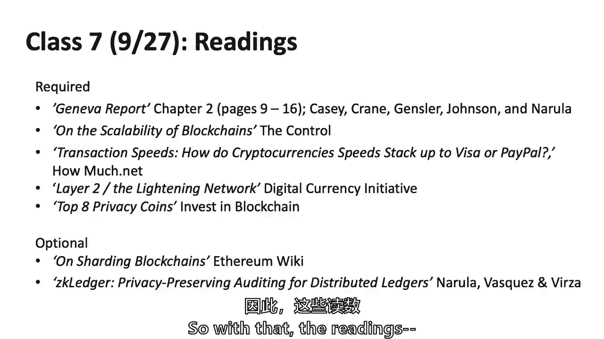

我有一张还没发言的人的名单，哈哈哈哈哈哈，所以目标是说话，这就是课堂参与，我会很轻松的，就在不久前，我是个学生，真的，我记得这一切，你知道你想把你的名字从名单上除名，我只想说那种鼓励。

所以我应该按名单上的字母顺序做吗？至于谁想告诉我，不不不，你看起来像是在低下头，你叫什么名字？那是什么，温迪，温迪，你从日内瓦报告的七页中得到了什么。

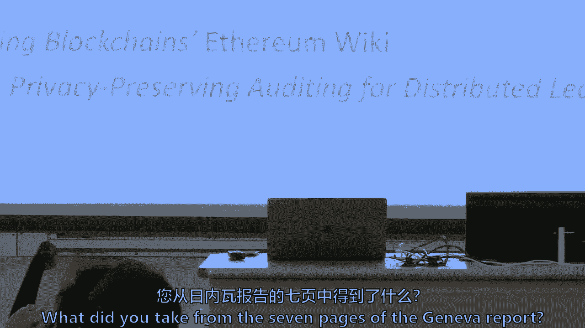

你读了吗？你做了读数吗，那么你从西蒙·约翰逊的伟大作品中吸取了什么，我帮了他一把，你知道的，关于区块链的商业挑战，从读数来看，需要很长时间，所以一个挑战是时间延迟，做温迪加薪需要很长时间，是呀。

如果你能说出你的名字卡塔琳娜，卡塔琳娜，它真的帮助塞布丽娜，把你从名单上除名，所以说你的名字是自我激励，所以卡塔琳娜，性能和可伸缩性也有问题，对呀，所以这有点相关，它们并不孤单，但性能可伸缩性。

做一笔交易所需的时间，其他挑战，是呀，有问题名字，哦耶，呃，他们在小额支付方面的问题以及他们的收入制度，那么如何进行小额支付，你想把它挑出来吗，为什么小额支付会有问题，我记不起具体的细节了，但事实是。

因为它们太小了，嗯，这个词本质上是这样的，如何做小额支付，和小微支付，部分原因是它们太小了，也许相对于网络的费用和成本，亚历克西斯，是啊，是啊，这是在罚款的地方，因为基本上矿工会先尝试加入区块链。

费用最高的交易，所以我只是交易，所以这里涉及到经济激励，我们现在有点远离这一切，你知道的，那些东西，西兰花，我说过我们都要吃哈希函数之类的东西，阿基拉，是啊，是啊，其他挑战是隐私和安全，有关金融机构。

的隐私保护，好的，所以阿基拉，刚刚提出了一堆关于隐私和安全的观点，关于个人，有人想把它挑出来一点吗，嗯，银行有更多的动机将事情保持在隐私方面，所以你有自然的公共政策，张力，这不仅仅存在于周围，区块链。

我撞到了吗，我只是，我不能穿这样的衣服，所以说，人们可以大声一点，好的，你想再说一遍吗？这是一个如此内在的，那些高高的堤岸，把我们的四五放在一边，在另一边把事情保密是有商业利益的，官方部门可能想窥视。

然后有趣的是在它上面，在上面分层，官方部门也希望除了官方部门之外的每个人都有隐私，就像在欧洲一样，有一个新的要求，这是不在该地区，别担心，但是有人熟悉，被称为国内生产总值的隐私指令主任，嗯，我不记得了。

我很抱歉，亚伦，亚伦，你想让我们给全班同学讲讲GDPR吗，或者如果你从那里，我只知道这是件大事，去找斯蒂芬妮，是啊，是啊，所以我的理解是，尤其是在向消费者做广告的时候，像欧盟这样的消费者必须喜欢。

真的很喜欢，勾选某些框以同意广告给，而不是自动地，那个权利，苏和乔，奎因，这是私人的，你也有权选择退出，就像跟踪你做的一切，迈克尔说，就像你说的，我们在这家公司工作，我在夏天工作。

我们必须将清除机制放入数据库，对呀，所以这是一项了不起的新法律，欧洲在某种意义上，如果你想说更多的隐私保护或在美国之前或，你知道的，每个司法管辖区都有自己的文化和政治规范。

但欧洲作为一个整体已经走得更远，在某种意义上，你有权被遗忘，你也有权访问这些信息，所以如何被遗忘，在不可变的区块链背景下是一个有趣的，只是技术问题，是呀，有一个问题，我本想问凯尔，但是我叫凯尔，凯尔。

今年夏天我在一家处理交易的公司工作，我们的理解是，与欧洲的律师交谈，在GDPR下，您可以请求您的交易，因为交易，个人信息种类，您可以请求您的交易，从分类账中删除，这显然为各种欺诈行为打开了大门。

我只是好奇想知道，如果你听说过任何解决办法，我还没有，今天早些时候我在一个会议上发言，在麻省理工学院，和一群成员公司一起去计算机科学和人工智能实验室，其中一个参与者说，他们认为他们有一套技术解决方案。

所以我们要多谈谈隐私问题，和GDPR在下周的公共政策会议上，所以我会试着，我会试着，提醒我，我会试着让更多的人了解凯利的情况，我发现它是专门从或章，有人提到了是什么让区块链具有独特的资格。

来解决很多这样的解决方案，我发现这和上一节课上说的问题差不多，有重大的权衡，通常归结为信任的成本，但这仍然回避了一个问题，就像这么多技术挑战，为什么他仍然如此受人追捧，所以我希望我们能澄清这一点。

我们要试一试，其他想法或问题，从读数来看，我早些时候和你说过关于层的真相，是啊，是啊，和所有，那就是有第二层来提供效率是可以的，以及高性能，它脱机运行，是啊，是啊。

所以我们开始相信第三层和第二层是脱机运行的，然后去放在区块链里面，可行性有多大，我们如何信任这个问题是关于解决性能和可伸缩性的可能解决方案，我有几张幻灯片，但本质上，如果主协议，比特币协议或以太坊协议。

也可能明天会是EOS，或者其他协议有一些性能问题，可能有些活动，那个通道可以被称为第二层，闪电网络有一个关于，这可能需要一点不同的技术，称为侧链或分片，我想这是一个可选的，是啊，是啊，我是有选择的。

我没有强迫你们，所以有很多，尽管这些技术对技术人员来说是重要的不同，切分侧链和第二层，让我模糊一下差异，Leonardroz问道，这意味着我们必须信任，我会争辩说。

我们已经必须相信比特币核心开发者编写的协议，它是开放的GitHub，这是开放代码，但很少有人真正去调查它，而不是得到保证，没有bug或错误，但我同意你的观点，核心是，比特币核心或以太坊核心一直生活在。

如果我可以称之为技术和商业沼泽，它受到了这么多病毒和虫子的攻击，你有理由相信它，但你永远不应该百分之百，确定侧面，侧链测试较少，但我同意你的观点，你有一些信任，除非我误解了这个问题。

我以为这是对底层代码的信任，我的观点是与中学合作，那是离线的，你不是真的在交易，在区块链中，是啊，是啊，它掉链子了，是啊，是啊，我可以这样说吗，所以问题是，如果你不守规矩，你应该更担心。

我只是在讨论代码的一个狭隘的部分，你的意思是，还是应该担心，因为它没有相同的验证模型，所以我可以把这个问题保留到幻灯片上吗，因为我觉得你确实得到了很好的认可，但我认为你是对的，这是一个。

这是一个有效的问题，是验证，这些断链仍然有效，后面有个问题，我只是想回应一下，有点信任这些离线机制，这不是一脉相承的，但就像90%的，根据这些加密交易所每天的交易量，所以这也像是从链条上发生的。

所以我认为在这个社区里目前正在参与的人，没有理由喜欢，我们不会相信，有点像第三方供应商，所以你提出了这一点，这只是对整个，加密货币，超过90%的实际每日交易，在交易所以非常集中的方式发生。

特别是集中式密码交换，我不记得是什么了，大约有一半的人在某个时候拥有过比特币，但我能问一下你们中有多少人真正操作过一个完整的节点，中间桌子上有两个技术员和雨果，他也是，如果我记得工程学博士生，好的。

所以我们有三个博士生，他们操作了完整的节点，向你致敬，但对你们大多数人来说有一半的人拥有比特币，您信任其他权威机构持有您的私钥，我不是说你是对是错，但这是关于这个生态系统的一个有趣而重要的观点。

所以让我让我，除非有其他点，回顾一下我对这些事情的想法并把它说出来，当然还有我们一直在讨论的学习问题，所以我会回来的，但我们会谈谈硬叉子，我没有听到任何人谈论互操作性，所以我们也会回到这个问题上。

我们更多地讨论了性能和隐私，回到技术特性，只是重复，对不起，但我确实认为这是值得的，当然还有密码学和时间戳日志，所以我们三四节课之前做过的这个技术的基石，你会发现在允许的系统中。

你会在无许可系统中找到它，那是一个基岩，你会在以太坊找到它，比特币和1600美元，哈希函数会有一些变化可能会有一点不同，但这是这项技术的基石，网络共识不一定总是和我们说的一样，有时它是工作的证明。

有时这是赌注的证明，或在权限系统中，共识是你真的是俱乐部的一员吗，然后有某种形式的俱乐部交易，如果你是澳大利亚证券交易所，俱乐部的唯一成员是澳大利亚证券交易所，但在其他许可系统中。

是二十家银行或十五家银行在分享，一些委托，随机权威说，然后是交易代码和分类账，很大程度上取决于它是交易分类账还是账户分类账，所以交易分类账必须有某种方式来记录交易，分类账必须有某种方法来记录账目的变化。

哪种以太导致状态转换，但要么你必须记录一笔交易，或者你必须记录状态的变化或帐户的变化，一个账户会说，这就像损益表和资产负债表，但你你需要，基本上所有这些技术，就我所知，我有办法保存那些账簿。

尽管有多种方法可以做到这一点，正如我们上周谈到的，有的只有一棵默克尔树有的有四五棵默克尔树等等，但它嵌入了这个，他们可能有不同的脚本问题，这就像缩略图，只是为了提醒你技术，这是T和麻省理工学院。

所以只是一个关于字母的快速问题，嗯，因此，对于基于帐户的分类账中的交易和帐户，上面写着像，如果你花五美元说你要花那五美元给谁，或者说你的账户少了五美元，另一个人出去了五美元，它从哪里来并不重要。

所以我要拿，据我所知，乙醚和毛利人，你会保释我的，但是，你把一个状态转换，而不是事务输入，这是一个状态转换输入，状态转换输入确实有一个帐户下降，另一个计数上升。

所以如果你调查一下你就能知道它是从哪里来的，你可以看到它的两面，据我所知，有收据分类帐，实际上有一个收据默克尔树，然后保持这种国家过渡发生，我大概猜对了，我的门，我告诉你，哦哇哦，所有的权利。

Majoris实际上是以此为生的，我是说他是Zcash的创始人之一，所以还有一堆其他美妙的事情，我不打算一一细说，但在这些幻灯片中大约有十五到二十个细节，关于比特币和以太的区别，我只是用它来提醒。

因为它说OK为什么为什么教授，为什么为什么加里把它放在那里，莱斯格教授对拉里很好，但对我来说你不需要，但本质上最大的区别是帐户基础和交易基础，最大的区别是乙醚似乎走得更快，但它没有太多的吞吐量。

他们仍然使用工作证明，尽管以太说他们将转向国家证明，他们不在那里，但当他们到达那里，我们会一起知道，经济学有点不同，当然也是，但所有这些细节都是问题的部分原因，所以你在日内瓦的报告中读到了。

关于一个教授的一点，二十世纪三十年代的经济学家，有人想试试吗，还是我应该只做我的幻灯片，开始了，你知道就像海岸故事，是啊，是啊，是啊，是啊，喜欢一切的事实，你应该在类似的成本效益分析上进行分析。

所以如果一个人想使用区块链分散的网络，你应该考虑到，就像在降低信任成本和增强安全性方面的所有好处一样，但也像切换到分散系统的成本一样，所以科斯是二十世纪三十年代的经济学家。

他写了大量关于成本和公司经验的文章，凯利，是啊，是啊，基本上就像试图理解为什么交易会聚集到公司，为什么要把你所有的活动都集中在一个权利上，所以在更早的时候，而是一种不同的方式。

为什么经济活动聚集成一个公司，而不是如果它真的是基于市场的，我可能只是在推销我的服务，本质上，他在问这个问题，为什么我们不在20世纪30年代有一个完全的零工经济，在那里每个人都有免费的劳动。

我们一起收集，这是他问题的核心，一位伟大的经济学家所研究的，所以在这里稍微考虑一下，我认为当你从分散到集中，你倾向于集中的一面，你被抓了，你得到经济租金，你确实有一个单一的失败点，在某种意义上。

系统的弹性，不管是在金融方面，你担心系统性风险，唯一的票据交换所，一个中央银行，一个政府，如果它被击倒了，与经济有关，很明显，它把它带下来，或者如果是一个数据库，你有一个点，本质上是失败的。

经济租金是一种收取超额利润的能力，我向你保证，这个班的每个人都想收经济租金，我们从风险资本家和企业家开始，但我们不想做非法的事，当然我是说，我们只想到达那里，你知道通过主导市场，对不起，这里有问题吗。

你只要，你在摇头，我不知道，但在另一边，有好处有好处，这里没有写Y音阶，Y刻度是，然而，你想想想，但我认为这是一种成本，所以Y放大，Y尺度就像更大的成本分散，随之而来的巨大成本，有协调。

你有很多集体行动的问题，如果这个房间里的一百多个人我们想一起做点什么，你得想出怎么做，集体和协调，每一个区块链都是如此，你可以考虑治理与协调和集体行动问题有关，然后是安全性和可伸缩性。

这两行不在任何读数中，但他们试图捕捉什么，并根据两条线的斜率，你可能会说，从理论上讲，市场可能倾向于更集中，如果我改变斜率，它将进一步分散，对呀，如果权力下放的成本是较低的斜率，而且集中的成本更高。

我们将更加紧张地走向权力下放，所以它只是一个，以下是集中的成本，基本上是捕捉租金和单点故障，并不是说集中没有其他成本，以下是权力下放的成本，我想在每一个应用程序中，当你考虑用例时，这是值得的。

这是一个核心问题，这个应用程序是否适合于低斜率分散曲线，和高边坡中心化曲线，有很多经济租金吗，单点故障或捕获是否存在真正的问题，如果是低斜率分散曲线，这意味着治理、协调和可伸缩性问题没有太多的成本。

你会更倾向于权力下放，这不是什么阅读或书，只是，你知道，试着把它形象化，肖恩有什么问题吗，没有人质疑，我有，这有点无关紧要，从这个时代，这就是为什么所有的住房隐私，呃，隐私点很难做什么。

他们中的许多人离开了中心，为了比特币，所以肖恩的问题是，为什么隐私币是分叉的，不是全部，但其中许多是从比特币分叉出来的，或者其中一个主要的硬币，荒原，你想说，你有隐私硬币吗。

所以比特币有一个非常强大和完善的代码库，所以有很多高质量的，你能这么说吗，哦，好的，比特币有很多高质量的代码，所以你可以在此基础上再接再厉，所以喜欢是很自然的，在叉子里的比特币上添加隐私。

而不是从头开始，所以Majoris的回答是，有些东西是免费提供的，比特币核心代码，它实际上是在麻省理工学院的版权许可下，让它自由，不是很好，可能中本在这里工作，线索，但它已经被开发出来了，它被敲来敲去。

就像我在众所周知的沼泽里所说的那样，我是说，所有这些攻击病毒等等，所以马达里斯说，以此为基础，基本上免费获得代码，然后叉子百分比，挑战是我们谈到了性能，可扩展性，效率，隐私安全，较少谈论的是互操作性。

治理和集体行动，我要再深入研究这两个，因为感觉那是值得的，我也相信第一桶，性能和隐私桶更容易受到修复的影响，尽管这可能需要三五年甚至八年或十年才能发生，我想他们更容易受到，给这些领域里聪明的男男女女。

致力于空间的计算机科学和密码学，而治理和集体行动可能是可以解决的，但我认为这是人类固有的因素，和商业安排，治理和集体行动是这四个桶中更难的一个，那只是一个人读到的，但我们也会讨论一些原因。

为什么我有点我得到了那个观点，也有商业用例的挑战，我们不打算在这里挖那么多，那主要是下半学期，但我只想提一下，这是一个真实的事情，很多人都在说，嗯，我必须确保这是最好的商业应用程序，等等，我能赚钱吗。

我是说，最终嗯在上面，下周我们将讨论公共政策问题和挑战，它们在某种程度上也是相交的，所以维塔利克，布特林，我想有一个中等的帖子。

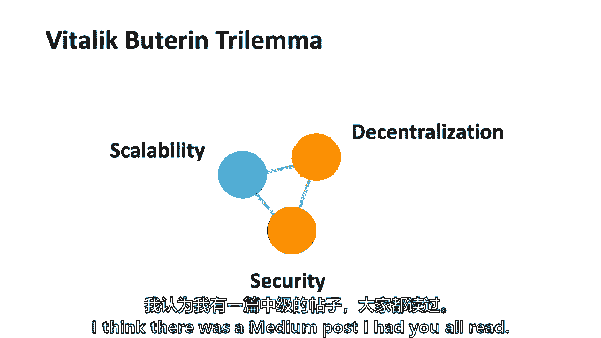

我让你们都读了，波，你想让我告诉你，告诉我们一点你认为重要的是什么，不仅是一位才华横溢的计算机科学家，但他对这一点的经济学理解正确吗，或者你认为他离开了，你可以，没有正确的答案。

我知道有些人对他的三难困境有两面性，所以我要陷害你，日内瓦的阅读，我先做的，好像很有道理，但他基本上是在说，选择构建，她不能拥有一切，这是一句老话，说你们中有多少人曾经雇佣过承包商，修理厨房或翻新厨房。

翻新某物，我是说，我有，我年纪大一点，对吧，你知道老话说这很好，快速便宜，但你不能，你不可能三个都得到，你只能得到三个中的两个，这是承包商的困境，但是但是你觉得呢，你认为他是对的吗？

或者你认为随着时间的推移你可以把这三个，物美价廉，快速可伸缩，权力下放，并确保我对这背后第二个方面的非常简单的知识，嗯，我想他是对的，你认为他是对的吗？他想去另一边，只是为了找点乐子和辩论。

当然去找莱昂纳多，所以是的，在那里，你得到了它，我们到了那里，我们得到了名字，我认为我们正在讨论的事情之一是时间系统必须发展，所以他们提到，比如说，Visa已经有60年的时间来开发一个有效的系统。

其中一些货币有三年、四年或五年、十年，所以他们会，我想甚至把数字，他个人对税收的看法是不到5%，他们不会战胜听说过的，嗯，我不知道那是对还是错，但我想这是最近的事，我想还没有定论，所以莱昂纳多的观点是。

这是最近的事，这是一项新技术，是呀，也许维塔利克是对的，只有百分之五，也许只有百分之一会成功，但要说没有人会处理这三点，以同时令人满意的方式，最终它必须以商业的方式令人满意，你知道吗，承担风险和权衡。

所以莱昂纳多站在另一边，有人想说为什么莱昂纳多·雨果是你吗，你站在列奥纳多哪边，或者维塔利克侧，在中间的某个地方，好的，我认为有一个权衡，但我同意同时提高这三个方面可能需要时间。

上周发生在比特币上的一件事，是否发现了一个漏洞，就像一个不知道如何检查代码库的人，真的像我不是一个计算机科学的人，所以我从来不喜欢检查bug或类似的东西，我没必要那么做，我只是把软件按原样下载并安装。

当他们说我需要更新我的软件时，因为有一个bug，我要更新软件，因为有漏洞，这感觉更像是一个集中的系统，但你得到了安全，但权力下放来自，网络仍然分布在这么多节点上的事实，所以我认为你可以在权衡的基础上。

然后爬上另一个悬崖，就像建立在每一个基础上，但不是同时，所以如果你去某个地方，我可能对人类的状况很乐观，技术人员将解决的不仅仅是生命，所以我不是说我一路走来，我们是列奥纳多，哪里会有。

但我可能更接近莱昂纳多而不是维塔利克，但那只是我的观点，我也觉得很有趣，是维多利亚，如果我说，雨果是个工程师，这里的博士生，但他没有检查代码，不对，因为对，所以有一个信任问题，在市场上，代码的信任。

我们也都信任Facebook和Dropbox。

和，从广义上讲，互联网也是如此，普里亚，我是说，我想让你说在人类互动的进化过程中有几个例子，这三件事在哪里被分类了，所以在某些系统中，在任何时候都可能不是，这三个节点都正常工作。

就像我们目前的支付系统一样，有脆弱的时刻，是呀，但你迟早会抓住它，所以我觉得这也许不是，而是要让一切都完美，现在，与之相对的是，你是否会达到这三个方面都基本到位并发挥作用的地步。

我想我喜欢Priya说的话，对呀，它不一定要伸缩到那个地方，每秒钟有数百万笔交易，但也许它需要比每秒七到十次交易更快，或以太坊每秒20个事务。

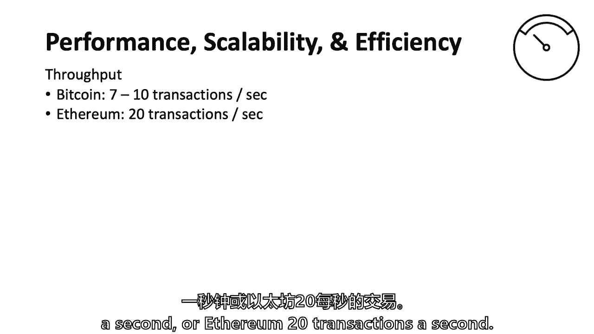

我们有，我也要提醒大家，星期二晚上，我们一起吃晚饭，西蒙，约翰逊治疗，每周二晚上，不必来，但它是五个，我们在区块链领域有一个外部扬声器，欢迎你来，米歇尔在这里，米歇尔迷上了一个邮件列表，所以请，嗯。

以后把我的名字写在黑板上，所以米歇尔把她的名字写在黑板上，任何想来的人，但在过去的一周里，有人谈到了可伸缩性问题，当他的公司做了一个二，首次发行500万枚硬币，献祭的日子，只有四五万买家。

所以那天有四五万买家，这意味着智能合约必须被多次触发，那一天占据了那天整个以太坊网络的三分之一，它很迟钝，结束并确定他的首次硬币发行，它在说，哎呀，这不是可伸缩性。

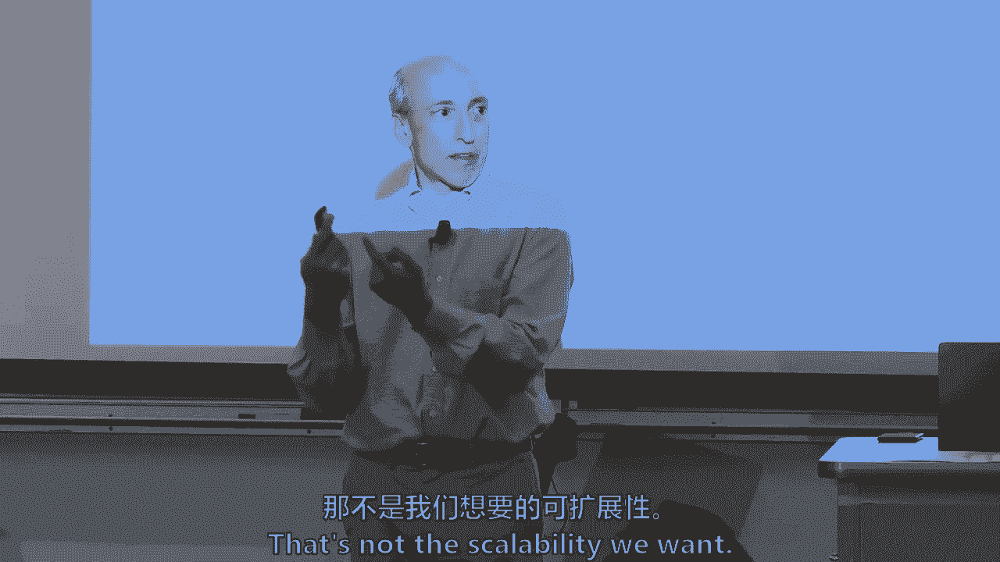

你知道我们想，所以我们知道这就是我们今天所处的位置，Visa大约有2万到3万笔交易，一秒钟，DTCC结算美国所有的股票和股票交易，S必须至少能交易10万，第二多的秒，五秒、十秒或几秒，三万。

但证券交易委员会说不行，你得被评为四次，你的平均水平，大概，因此，这让您了解了当前环境中的可伸缩性问题，如果一个人把物联网放在上面，在某个地方，我听到不同的估计。

目前有80亿到100亿台设备连接到互联网，随着更多的人，冰箱、路灯和交通灯都与互联网联系在一起，在接下来的五年或十年里，到50亿到1000亿台设备与互联网相连，如果他们开始互相交流。

会不会是物联网的区块链，你不能在，这些类型的缩放数字或，证明工作也是有一堆能耗的，我们在写作中没有那么多，我们选择不放一堆，日内瓦报告，一个估计是每天2亿千瓦时，这相当于大约700万U，中国的平均住房。

只是给你一个粗略的，数字经济学家估计，那是世界电力的三分之一，只是为了缩放缩放，如果你现在可以吃一顿丰盛的晚餐，你知道的，晚宴谈话点，嗯，它是，这是奥地利国家的电力，有人是奥地利人吗，否，我只是。

你知道的，所以这也是工作证明的一套权衡，但运行银行系统也要花很多钱，所以我想当有人说好的时候，太可怕了，很有挑战性，所有这些电费，是呀，我们总是希望降低成本。但是U。

China’中国的金融体系只占经济的百分之七点五，耗资1。5万亿美元，所以全球的支付系统花费了0。5%，占全球经济的百分之一，这超过了世界电力成本的三分之一，所以我只是把它放进去。

又回到了信任的成本问题上，它的成本，既不是最大化主义者也不是极简主义者，正如你所记得的，那么有什么替代方案呢。

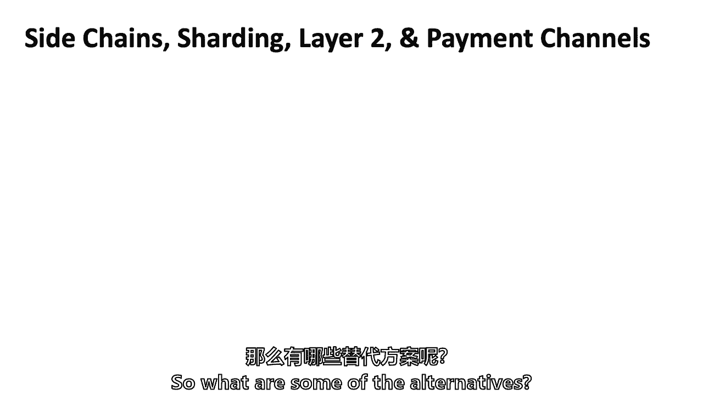

我们不打算挖掘这些侧链中的每一个，短路层，短路层，两个支付渠道，有人想试试吗，它们并不都一样，是毛利人，今天早些时候我和，我甚至可以让我的头，因为我很困惑，但有人想给基本的，我们之前讨论过，基本租户。

因为你读了一篇关于闪电网络的文章，关于正在尝试的经济和技术方面的事情是什么，在这四种类型的事情中，是詹姆斯，有人举手了吗，你要试一试，给它一个机会去，嗯，大部分都在链条上，所以这些大部分都是脱链的。

但有些在链条上，这个想法是你处理链，ER余额在，其中两个结果进入链条，所以你试着通过处理链条来加快速度，在那里你成千上万的交易，这只是进入，所以詹姆斯总结了粉碎的链条，是的，就像说有一条链子。

这个这个这个这个频道，如果你希望水是流进来的，还是数字货币在运行，只有一定的速度，它只能需要一定的性能，为什么不把大量的活动放在侧通道里，这就是所谓的支付通道，其实，但除了链或支付渠道，或者第二层。

所有的技术特征略有不同，也许在这里做数百万件事，只在这里放一些，区块链和比特币并不新鲜，我们在金融界已经有几十年了，以某种方式，一些活动不能进入中央结算系统，并召回分类账。

中央银行，不管是U，China’中国的中央银行或任何中央银行都可以成立，我们所有的存款账户都直接在中央银行，从某种意义上说，现在金融的侧链是9000家商业银行，9000家商业银行正在处理我们的资金流动。

然后净结算到中央银行的分类账上，在所谓的数字储备中，事实上，甚至银行系统，九千家银行，我们有他们的侧链，Visa万事达卡第一数据，所有的钱处理，所以已经有一个分层了，我看第二层。

和侧链采取类似的经济方法和技术方法，那已经存在了，但以一种新的方式，我从2015年抓起了一张图表，细节无关紧要，但这是我做的，因为它已经三岁了，这是一个，你知道吗，人的真理硬币，一个人的观点是什么侧链。

基本上詹姆斯，说，这里有很多活动，只有少数东西进入主链，视觉是我想传达的，只是因为，它有点认为这里有很多活动，然后我们只在主链的一些地方定居，另一个不同的可视化是闪电网络又有很多活动，似乎有一个权衡。

很多人都支持把街区面积做大，很多人说侧链，我很难理解，就像这两者之间的权衡，那么喜欢什么，它是什么样的，为什么不只是一个更大的街区，那里有什么问题？所以说，有一个，有一系列经济和技术的权衡。

你在里面放的越多，我们就叫它蓝色的主链吧，底部的蓝色盒子，可以这么说，你在里面放的越多，你把它压了下来，有更多的处理，当然还有更多的存储等等，嗯，但也有一些，比特币的延迟太多了，每隔十分钟。

直到三点你才真正确定，四五个，有些人会说六个街区到一个小时，如此经济地过去，如果你想要高频，低延迟，短期，你可能会说我不能把它放在主链上，因为主链想要低延迟，每十分钟是低延迟，现在，低延迟，为了更安全。

保持采矿成本和工作证明，所以有一些经济和技术的交叉，2。跟我刚才说的毫无关系，但重叠，还有一堆次要的和采矿池运营商的经济学，他们是想要大块还是小块，去年的部分分裂是。

但它更多的是围绕当地政治而不是全球政治，正如前众议院议长蒂普·奥尼尔所说，所有的政治都是地方性的，我认为去年的一些辩论是关于地方经济和未成年人经济的，但我不知道，毛利人，你有没有。

毛利斯可能在其中一些辩论中，但你会有不同的观众吗，去年有一场大辩论，比特币区块是应该变大还是保持大小，这不是唯一的原因，但这也是我们现在有比特币现金和比特币的部分原因，因为比特币现金的块尺寸更大。

和更短的两分半钟的处理时间，有一些东西可以只是挖掘集中，你的车挡得越大，当能够处理巨大区块的矿工能够继续营业时，更少的权力下放意味着更少的安全，所以分散和安全都有激励，让方块变小，大得多。

所以马约拉的意思是，方块越大，能处理的矿工就越少，矿工就越少，越集中，因此不那么安全，甚至可能是经济租金，因为每一个集中的系统都可以收集经济租金，眼睛，所以另一个问题是，如果你有更大的块。

它们传播到网络需要更长的时间，以一种不是不直观的方式，呃，如果发生这种情况，你会在区块链中得到更多的意外分叉，人们讨厌意外的第四，特别是微小的状态意外力，如果他们丢了硬币，当他们，什么时候。

当他们的块没有说一个技术功能，因为更大的块更有可能需要时间来通过网络传播，因此，您可能会无意中拥有，在某种意义上名誉扫地的链条，因为在第一个繁殖之前，一直在做工作，我的问题是关于跟踪交易的情况。

这是正确的，所以伦纳德·莱安德罗，毫无疑问，没有莱安德罗·奥克在问，我们如何验证闪电网络，我们如何确保这是，虽然，虽然，是啊，是啊，因为我们正在处理链中的网络传输，我们如何真正记录一切。

所以侧链不会记录在主链上，它们本质上是记录网，在闪电网里，我说我不打算讨论这些差异，但我来了，闪电网络更多的是一个双边网络，它可以是，它可以表现出多边的感觉，因为我可以和詹姆斯交易。

詹姆斯可能和凯利有交易，感觉就像我们三个人，但这是双方的詹姆斯和加里，双边詹姆斯和凯利，就我所知，因此，当这些单独的交易被记录时，把我留在这里，记录在闪电网，他们不在主链上，我们最终会把网结算到主链上。

我们实际上在某种意义上，它是一种松散的，It’刚开始生长，所以詹姆斯和我可能会互相捣乱，但我们是双边的，所以我们有另一种信任的方法，除了计算机代码，James和我可能还有其他值得信任的理由，乔，奎因。

对不起，是什么让我不重复消费，一次在闪电网上，另一次在区块链主网上，同时，因为有一个，有一个，我想小心点，因为我用的术语很松散，有一种预先资助的形式，这并不是说你真的向主链提供资金，但是有一点分割。

所有的权利，我一直在看毛利人，因为他实际上编码了这个，所以这就是保护你的东西，本质上詹姆斯，和我，如果我说得好，我明天给你寄一个比特币，如果明天太阳真的升起，你给我寄一半。

我们在分割一个比特币或他的半个比特币，它被写入脚本代码，它写得几乎像一份聪明的合同，但它不被称为智能契约来进行分区，或者您可能会松散地认为它是代管，即使从技术上来说可能不同，但顺道来看看，我们可以。

如果不是我们在数字货币倡议中的一些同事，就像泰姬陵，他为闪电网络编程，我是说那是麻省理工学院和其他人的合作，我们不，我们不推广它，就因为它是麻省理工学院，这就像是表演的主要方式之一，碰巧是麻省理工学院。

所以让我来谈谈其他的表演方式然后继续，我们已经谈到了替代共识协议，你看过这张幻灯片。

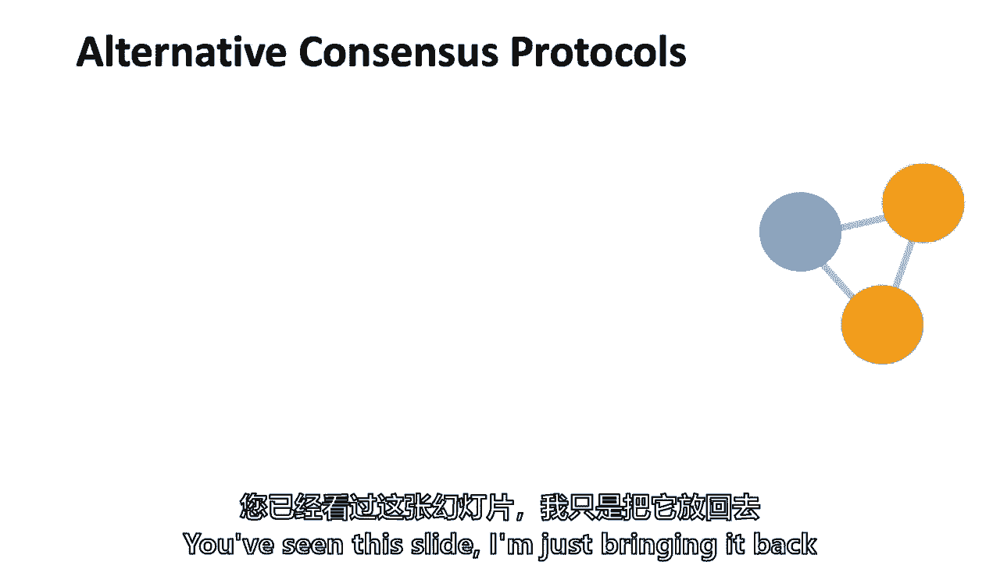

我只是把它带回来，因为这是处理可伸缩性的一种方法，这是一个非常关键的重要方法，工作证明是可伸缩性的问题之一。

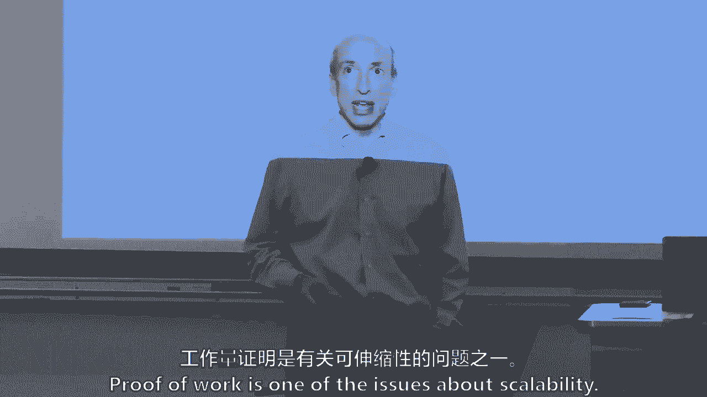

总的来说，我是在总结，我在简化一种感觉，但通常所有的备选方案都有某种方式来随机化或委派节点，它将完成下一个街区，一切都回来了，你如何在20世纪90年代增加另一个街区和斯图尔特·哈伯。

当他开始做区块链的时候，并把它放在纽约时报上，有中央权力，他设立了那家公司的保证人，他把它放在纽约时报上，什么是中本共识，就像他说的，嗯，否，我们不会有哈伯和一个重要的权威，它将被分散，因此。

这些其他共识协议通常有一些随机的方法来委派，下一个块的选择，并不总是这样，但它们也可能有一种机制来做第二件事，第二次触摸，西尔维奥·麦考利的奥兰，他是计算机科学和人工智能实验室的教授，图灵奖得主。

他的公司有一个有趣的东西，就像挑选珠宝一样，就像为珠宝挑选某人，那就是选择一个由12个节点组成的短组，它可能会做一些事情，每个块都有这个选择过程，但还有另一个更广泛的小组可以检查陪审团的工作。

所以通常有第二种自动化的方式，确保有快速的第二次检查，他们判定有罪或无罪正确吗？可以这么说，如果我有点过于简单化了，我道歉，西尔维奥的杰出作品，但是，所以它可能是赌注的证明，活动证明，烧伤证明。

当我们谈到能力的证明时，正如我上周提到的，没有大规模的用途，但达什和尼奥现在都有某种形式的这种情况，我很困惑，有两个项目，有血浆，有卡斯珀，Casper是他们的项目，以获得赌注证明，但他们不在那里。

隐私和安全，所以我在努力回忆是谁提出了矛盾的紧张局势，嗯，尽管联邦调查局做了，你知道吗，弄清楚，一些俄罗斯人用比特币扰乱我们的选举，他们想要更多的透明度，所以这不是双向的。

但我认为这些对消费者来说也是真正可以解决的，有破折号，米纳罗和兹卡什，甚至还有一种叫做混合和翻滚的机制，老实说，我不能告诉你其中的区别，但我可以告诉你，因为他们有时会邀请我作为前任，中间那个滑梯。

私密币，搅拌器和不倒翁，和执法部门的东西，这就是他们担心的地方，Midoris你想上来告诉我们关于Zcash的任何事情吗，或者你想从那里做，是什么启发你做隐私硬币，一群执法人员不喜欢的，我不是说我是说。

但这是合法的，我是说，这是一枚硬币，这是真的，就像现金可以用于非法目的一样，也是提供强大隐私的系统，类似或可用于非法目的，我们不应该放弃我们的经济独立，只是因为我想买副本，我不想透露我所有其他的交易。

我认为有机制，如何执法，但我认为隐私是基本权利，所以我们应该争取，你什么时候开始做这个项目的，当我们开始写论文的时候是十四岁，所以你从一张纸开始，然后我们有了原型代码库，我们把它开源。

然后是为了启动这个项目而成立的公司，我认为Zcash现在的市值大约在十亿美元左右，如果它波动，波动，波动，所以说，所以这就是你在这里的原因，它下去了，不不不，你不需要回答这个问题，真抱歉，隐私。

但本质上毛利人说他走到这一步，你在2014年做什么，我是麻省理工学院的学生，我大部分时间都在零知识专业零工作，是啊，是啊，它似乎是一个自然的应用程序，就像比特币一样，再加上分组技术，呃。

也许那里有什么东西，所以这里，麻省理工学院一位才华横溢的研究生和其他人合作说，这是一种叫做零知识证明的密码机制，它将在三十秒内聊天，这里有一种叫做比特币的东西，我们为什么不把他们聚在一起呢？

我们可以用他自己的话来推广，就像你买一杯咖啡，你不必说你是谁，呃，所以呃，我有一个关于你如何定义合法活动的问题，你知道吗，如果我用一个给莫内罗或绿色现金，作为把钱从伯爵那里拿出来的一种方法。

面向IT活动，那么你是怎么管理的，所以我不，我不知道，幸运的是，我不必给非法活动下定义，但一般来说，社会是走到一起的，合理机制，但是他们通过立法部门、行政部门和法院走到一起，并定义一些不允许的事情。

但是一般来说，当我在这门课上使用这个术语时，我在想四五桶，大多数社会不想缩小他们的税基，所以他们希望经济活动在税收信封内，而不是在税袋之外，那是税基，外面和里面是多少，其次。

大多数执法部门和大多数社会不想有钱，铁轨，银行业，和其他移动价值的方式，其他非法活动，所以它用钱来促进其他非法活动，可能是孩子，字面上，所以不管你知道的其他非法活动是用钱，或者其他东西。

所以你是绝对正确的，另一件事是，对于一些不到大多数的国家来说，但有些国家有资本管制，他们试图维持他们法定货币的价值，相对于其他法定货币，并努力保持一些固定的或关系，他们有资本管制，因此，在这些国家。

他们可能会说非法活动，也在绕着资本管制跑，但它是每个国家，每个社会和肖恩，你提出了一个很好的观点，至于这意味着什么，我的意思是不显示任何价值，我是说有一个，有一系列这样的事情，每个社会走到一起，说。

通常围绕税基，通常在试图不使用钱，促进其他不好的事情，在一些国家，资本管制，我看到一只手在这里，丹尼尔现在，向导，下周我们将对非法活动做更多的工作，关于防范非法活动，希望更正也被拍下来了。

所以围绕私钥还有另一组安全问题，对我们大多数有密码的人来说，你知道吗，如果您丢失了密码，它们本质上通常是后门，不知何故，平台，不管是Facebook还是美国银行，如果您丢失了密码，有后门。

他们可以说有一种方法可以验证，有足够的概率权重，我是加里·詹斯勒，他们会给我一个新密码，我是说，在某些情况下，这是一个很高的标准，这涉及到一些生物识别技术，但在大多数情况下，这是一个相当低的无聊。

他们会给你另一个密码，如果你能喜欢我，还记得我高中女朋友是谁的答案吗，什么的，你知道吗，像这样的问题，我记得是艾琳，但后来我就放弃了，我只是放弃了，太可怕了，我得换一下，私钥保管是一件非常真实的事情。

你读过黑客攻击的报道，当我们到达加密交易所时，我们会读到更多关于它的信息，这是一个非常重要的问题，不仅仅是对个人，但对机构行为者来说，对冲基金如何，或者更有可能，黑摇滚富达作为资产管理公司。

以有效的方式确保监护权，这是一个不对称的风险，对大多数金融机构来说，这是一个棘手的风险，他们不再拥有证券的保管权，当我开始在华尔街，笼子还在，c、g，有一个物理笼子，纸的残留物，股票还在笼子里。

我不是很久以前开始的，那是在DTCC之前，事情已经变得，你知道数码的，但仍然有一个物理笼子放一些物理纸质证书，如果你丢失了纸质证书，你仍然可以去政府或发行它的公司，回到她身边，拿到一张新的纸质证书。

花了点时间，很难，是为了验证它，但在这种情况下，如果丢失私钥，没有后门发行商来获得下一个，所以这是一个非常有趣的问题，不仅仅是技术问题，而是网络安全问题，但这是一整套财务托管问题和不对称风险。

如果你是高盛人，萨克斯或忠诚，你丢了一把钥匙，或者被黑了，这是数十亿美元，所以这只是一个有趣的，我不认为这是区块链独有的，但它相当具体地针对区块链和金融，以及它是如何重叠的，所以有些解决方案。

我确实认为有解决办法，以下是玛多和纳罕阿鲁阿的一些东西，谁管理数字货币倡议正在努力，他们正在使用两个密码基元，我们不打算深入探讨，我们做了哈希函数，我们做了数字签名，那些是算法，或者它们被称为密码原语。

有几十个密码原语，数学算法和井，另外两个在这个领域被大量使用的是零知识证明，更少的可能是彼得森承诺，我把它放在那里，我的话，我让Majoris帮我写这篇文章，但我的话是零知识证明。

让某人证明一个陈述是真的，没有透露为什么这种说法是正确的细节，你可能会说，等一下，你可以证明某件事是真的，就像你走进酒吧，他们需要知道，你们两个去喝一杯，让我们把它变得有形，你需要什么来证明你是二一。

你需要证明你以前出生过，但你不需要更多的细节，所以麻省理工学院的一些计算机科学家实际上做了基础工作，当零知识证明，二三十年前，西尔维奥麦卡利等人，我认为这也是他们赢得巡回演出奖的原因之一，嗯。

以及其他工作，嗯，所以零知识证明是一个非常有趣的密码数学难题，解决毛利人用于Zcash的问题，Neha和Doris正在用一个叫做ZK账本的东西，这是一个可选的阅读，我的直觉告诉我我们有办法前进。

同时金融部门也可以获得他们想要的隐私，这两者实际上可以通过现代技术方法共存，亚历克西是举手吗，或者只是挥手，否，所有的权利，你想添加任何Medora，既然你是ZK分类帐论文的合著者，那是可选的。

关于这件事的记录有一个有影响力的，开发了一个中间的硬币，称为中间协议，叫做零硬币，使用彼得森承诺和ZCash的零硬币，呃，不用豌豆和承诺，后面有很多非常有趣的历史，和彼得森承诺是另一种密码原语或算法。

那个，有趣的是，它们类似于哈希函数，你把一堆数据压扁在一起，从某种意义上说，你压缩了它，得到了一个承诺，但你实际上可以加减它们，这是一件有趣的事情，你可以提交数据，就像哈希，但你也可以加减承诺。

所以它有一些有趣的特点，如果你很感兴趣，我可能会找Sabrina来帮你，或者马约拉的可能会有帮助，因为我在边缘，但我从商业角度说的是我的预感，这是我们在，我们在最前沿，at。

麻省理工学院的一些人试图找出如何做到隐私和安全，同时，因为我们将讨论更棘手的事情，互操作性--将区块链应用程序链接到遗留数据库或将它们相互链接，所以你可能想链接一个区块链应用程序，如果你是。

如果你在考虑支付协议，支付协议和区块链世界是如何与菲亚特联系在一起的，因为最终如果你在做，比如说汇款，你想把钱从这里转移到墨西哥，有人想要墨西哥比索，他们可能从U开始，S元，你怎么。

你如何使用三种不同的系统，在这种情况下，你知道你巧妙的创新创业，但是美元未婚夫制度和墨西哥比索制度，所以这是互操作性的一种形式，以及围绕它的挑战，或者区块链到区块链，如果我们有一百个。

甚至主链的互操作性，其中一些第二层和侧链，这是一个更容易的互操作性，因为它的编码就在，但它总是，这并不是什么新鲜事，银行业务一直具有互操作性，以我的U为例，去墨西哥搬你。

将美元兑换成墨西哥比索是在两个完全不同的银行系统中进行的，和两个完全不同的分类账系统，所以我们必须有互操作性的问题，甚至在区块链之前，但它只是把它带到了这种新技术上，本质上，或者像我们所说的跨账簿。

所以它是一个，这是一个一直存在的问题，我们只需要看看我们如何在这里解决它，一个解决方案，这并不意味着，这是正确的解决办法，这是唯一的解决办法，但一个解决办法是通过，还是媒体实验室主任的最爱之一。

乔伊·伊藤认为，如果我们有第二层，我们也应该在所有这些下面有零层，也许我们可以在技术上创造一层，还没有人这样做，但乔伊是个有远见的人，乔伊拥有日本第一家互联网服务提供商，二十三岁的时候。

他买了1500美元的电脑设备放在浴室里，他就是这样开始的，是呀，是呀，他的浴室，这是他唯一的房产，嗯，所以你知道，1。这条路通向哪儿？你没听说过乔伊，所以这是创办公司的一种方式。

我认为还有更多的工作要做，嗯，所以它可能是可以解决的，我不是，我是，我是，我不太确定，然后软件更新所需的共识，开源软件更新很难，向后不兼容的，就像，我可以更新软件吗，但你不能用它。

已经有50万个比特币区块，或者在以太中的数百万块，所以问题经常发生，旧版本不能验证所有的新块，如果他们不验证所有的新块，我又在简化了，像Excel一样思考。

你可以在Excel或Word for Windows上获得更新，你不能打开自己的文件，我的意思是，你知道的，这是对这个问题的一个粗略的外行定义，所以它导致了一种叫做硬叉子的东西。

右手边的这个小视觉基本上是，发生的事情是你不能验证所有的旧块，因为新软件有点超越了它，硬分叉会发生，如果你把两兆字节的块，如果你把块的尺寸做得更大，老的，旧软件不会接受，如果我没记错的话。

那将是一个硬叉子，所以这是一个，这是个问题，它发生了，以太坊网络有以太坊经典，作为以太坊是因为维塔利克鼓励的硬叉子，布特林，比特币网络有一个去年的，它在哪里，关于块大小的争论。

所以几十年来大多数软件都在处理，我们如何更新软件，但他们可以把它推给我们，我们得到它，我们按下一个按钮，我们得到了它，过了一段时间，我们很恼火，如果你和我一样，我们不会更新，但是共识。

记得这是我们的一张图表，共识总是支持最长的链，如果共识是采用这项新技术，只有八九成的人采用，问题是另一个，10%或15%会继续保持较短的链条，他们用比特币和现金，所以本质上，现在你有两种货币。

如果由于某种原因它萎缩了，他们停止了维护，然后这个值，在某种意义上，在商业环境中可能会归零，有问题吗，所以从广义上讲，我认为最棘手的问题是关于集体行动和治理，你如何让一整群人朝着相似的方向前进。

区块链应用的部分价值来自网络上多方的参与，以及多人参与，不管他或她是谁都得到了这个，很多人，十年后，这个房间里有近百人在研究这个问题，但不知何故，他解决了一个集体行动问题。

因为它只是2009年的软件代码，但它仍然是例子，西尔维奥·麦卡利如何用一个非常聪明的区块链，他是如何让人们开始使用它的，直到它开始让人们使用它，值在哪里，或者如果你有一个文件共享或医疗记录的应用程序。

麻省理工学院有一个医疗记录项目，但是你如何开始让人们使用它，你知道这些每天都在互联网空间解决，但是区块链有更大的皱纹，所以有一个鸡和蛋的问题，普里亚，这就像这个房间里的异端邪说，但这是因为它不是真的吗。

而不是像病历，这真的是一件真实的事情，因为我很想知道它是否会扩散，因为它基本上没有太多的实际成本，所以前面的问题是，有没有一些感知，我能用那个词吗，有一些感知，这不是真的，所以它可能不会传播。

可能没有那么多，这很可能是商业挑战之一，埃隆，你有一些，是啊，是啊，我认为采用比特币的比特币，因为人们对创新感兴趣，在创新解决方案中，然后是以太坊和一个算法，也许几个月后就会发生，呃。

和其他区块链基本上是在向生态系统投入资金，向开发人员提供资金以开发解决方案，因为他们，他们，他们把赌注押在那个网络上，但对于你们每一个人，当你在思考你的最后项目时，这一集体行动问题具有多重特征。

对我来说，一个是区块链软件更新的治理，我们说过是关于硬叉子之类的，你是如何达成共识的，治理如何集中，我们会回来的，当我们谈论证券交易委员会时，所以治理的一部分，但还有集体行动问题。

如果你有付款或医疗记录或贸易融资，你怎么让人们收养，和银行业，银行是大的，房间里的大大象，占主导地位的大公司，你怎么让他们领养，或者你以某种方式竞争他们的利润，而不让他们收养。

这更多的是一个关于集体行动的商业商业问题，所以我们已经谈到了金融领域的优惠，许可区块链没有那么多，他们有一些集体行动问题，但他们没有那么多的集体行动问题，它们的可伸缩性和性能问题减少了四个。

因为他们说我不用工作证明，可能是十五，二十甚至七十五或一百个节点，但他们认为这样他们就可以保护自己的隐私和安全，一篇关于ZK分类帐的论文可能是一个解决方案，其中一些银行可能会开始使用它。

但我说的是二十八，我现在不是在说20 20或25 25，他们更喜欢有许可的闭环系统而不是无许可的开环系统，所以下周我们将搬到，嗯，公共政策，我的天啊，你要读我的证词，两页八页，是啊，是啊，听着我明白了。

但我被要求在7月份的众议院农业委员会作证，这是一个场地，我去过很多次，回到他们面前很有趣，a，来自明尼苏达州，但是是的，你可以读我的，它是，我知道今年不会有立法，我只想给你反馈。

他们可以邀请尽可能多的证人，然后他们让少数人邀请一个，有时两个证人，所以我接到了作证的电话，因为我就像一只老海狗，他们要把我带进来什么的，但很有趣，但不管怎样，我都在为这门课做准备，所以我帮你写了证词。

全部，它是一个，但这是最重要的，管理英格兰银行的马克科尼，写了一篇写得很漂亮的文章，他在春天给了，大概有一点点，历史货币等等，但马克也负责金融稳定，是的，是的，所以金融稳定委员会，金融巨头，我以前常去。

不是作为一个金融重量级的，但我过去经常去，因为他们想让我在帐篷里，而不是在帐篷外，因为我们在美国进行衍生品改革，当它到达那个地方，南非和其他四个人写了一封联名信给盖特纳部长，指出一些我们要说的。

对我们正在做的事情的观察，他们有分歧，我被邀请了，所以我经常去，我很了解马克，但这是一份好报纸，你会从，我想说马克既不是比特币，最大化或极简主义，但他确实说不要使用加密货币这个词，使用术语加密资产。

所以这是一件有趣的作品，我不知道你们中有多少人是斯隆，在这里的，我认识一些斯隆的研究员，我想班上大约有百分之二十到二十五的人都是斯隆研究员，你将会看到，乔·斯蒂格利茨几周后在纽约，是啊，是啊。

这是美国消费者新闻与商业频道的节目，乔，他是哥伦比亚大学的诺贝尔奖得主，对比特币有着鲜明的观点，关于这件事，我已经和乔谈了两三次了，在学期晚些时候，你会读保罗克鲁格曼和努里尔鲁比尼。

有一个比尔·盖茨谈论比特币的小视频，我想让你们都知道比特币的极简主义，明白他们在说什么，我会给乔打一到十的等级，大概一岁半，嗯，也许两个保罗，你稍后会读到保罗克鲁格曼的文章，他也在下面，我不能就这样。

它们不能在它们之间调节，但我认为了解什么真的很重要，一些真正伟大的头脑也在从那边考虑这个问题，这就是下周的三件事，然后结论，我认为它确实提供了一个网络，但它伴随着成本，正如我们所说，有很多权衡。

我认为可伸缩性，效率，隐私，那些是可以解决的，我无法证明，但我想几年后，可能是三年或十年，不会有三到十个月，尽管我认为这在很大程度上容易受到麻省理工学院和其他地方聪明头脑的影响，作为计算机科学家。

我认为更艰难的挑战，它确实与治理有关，我认为治理和集体行动，回到这两个图。

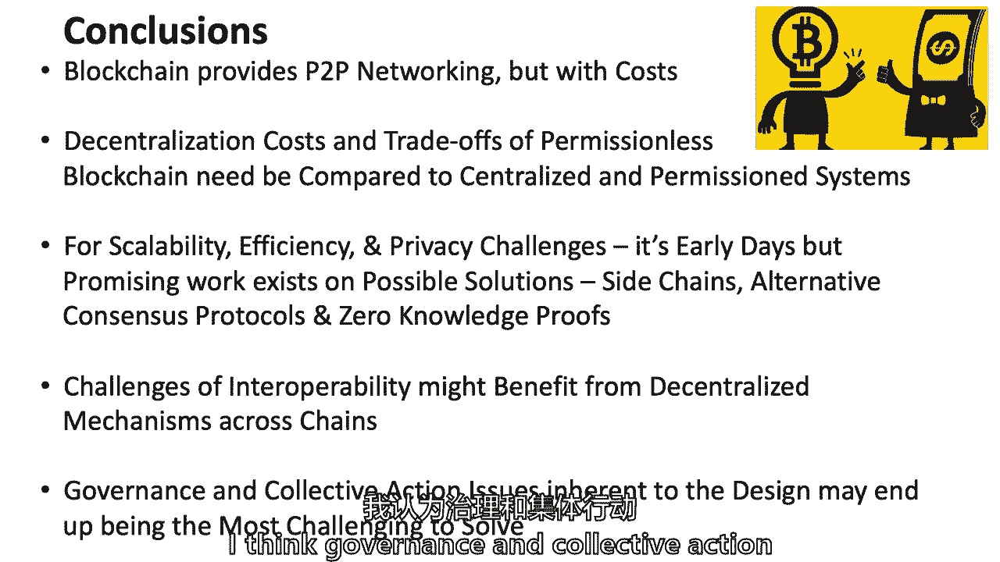

真的有更好的地方集中，然后分散，我们将在这学期剩下的时间里一起探索这个问题，所以谢谢你。

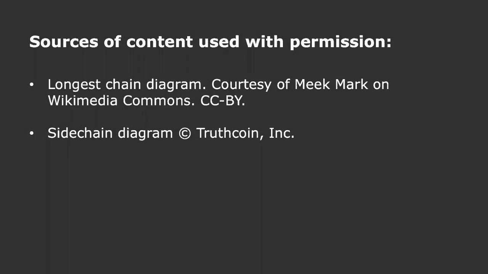

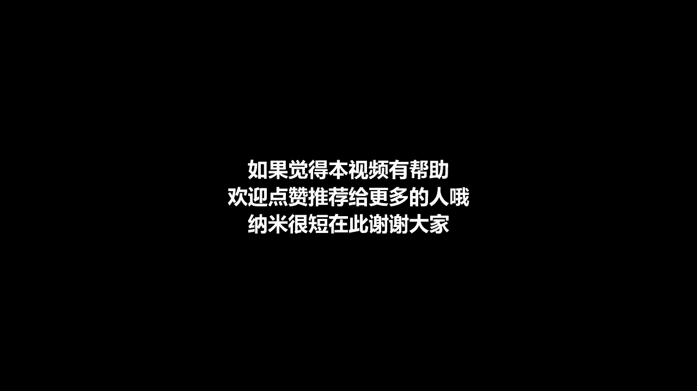