# 【麻省理工大学公开课】区块链与货币 - P8：8、公共政策 - 闰土聊Web3 - BV1sL411N7Mm

我把夹克穿上，我想我今天是在做公共政策，你知道，我必须看起来有点官方，让我们来谈谈公共政策，以及我们将要做的一些挑战和今天的概述，我们要谈谈读数，当然啦。

然后我会在加密金融上建立一点，只是这个两千五百亿美元空间的一个简单术语，因为很多公共政策都是关于加密金融的，尽管有一些关于底层区块链技术的公共政策，两者都是，但大部分是关于，围绕加密的金融市场。

加密货币和加密代币。

考虑到整体公共政策框架，说说这三个护栏，非法活动的大铁轨。

金融稳定和公众，然后我要，我要分享一些幻灯片，对公共政策发展的几点思考。

你们很多人都知道，在过去的二十年里，我一直在研究政治和公共政策，你们中的两三个人知道，在春天，西蒙·约翰逊和我开设了一门名为私营部门公共政策的课程。

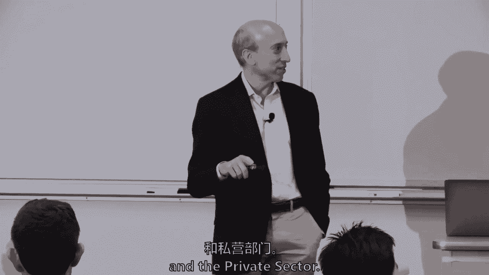

所以这可能是我明年春天的小广告，因为我们要再站起来，所以研究问题，基本上是围绕公共政策。

我很抱歉，因为Tolea没有给我我的友好名单，至于谁还没说出来，那就是托莱多，你得救了，你得救了，因为现在我不记得有谁不是，那是什么。

是啊，是啊，您可以发送到打印机。

你知道的，很难记住有85个注册的学生，至于谁没说过，谁说过。

但是你们都要来这里，现在他要做他的冷呼叫了。

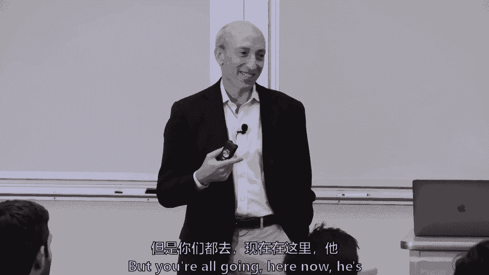

我们正在研究的主要问题基本上围绕着公共政策框架。

以及它与区块链技术的关系，但是卡塔琳娜，你从阅读中得到了什么，呃，阅读中的这个是什么，呃，那是四块三十美元吗，在政策体系中，所以说，这样，比如说，投资者会过得更好，他们会有类似的保护，他们会因为。

他们会有一定程度的确定性有人在照顾他们，卡塔琳娜说，她从读数中得出，为了进一步采用，投资者保护，和对市场的信心。

而且很重要，嗯劳伦，3。我说过你肯定。

是啊，是啊，所以我想说，我是说，其中一个读数有点相反。

但在此基础上再接再厉，就像，提到各种法规和对区块链的验证，一点点会帮助已经在市场上探索这个空间的玩家，只是因为他们更喜欢规避风险，所以他们还没有真正涉足初创企业。

事情有一个优势，所以从本质上说，有些人厌恶风险，现任者有点厌恶风险，为什么现任的大公司，哦，这是我的乐趣清单，这不是你的乐趣清单，但实际上还有三个，你们中的五个人在这节课里甚至没有说过话。

即使在这里也不行，甚至更好，更好的托伊塔。

我们也有报名表，它在转来转去，是啊，是啊，是啊，是啊，所有的权利。

手表。

我只想说大卫，然后看看哪个大卫说话了。

这会很有趣的。

所以你的意思是，这里没有大卫马丁，哦，关于你的第一个问题。

请从两个方面与我心目中当前的公共政策框架联系起来，嗯。

呃，好像不清楚，比如说，CFTC，因为这可能是一种商品。

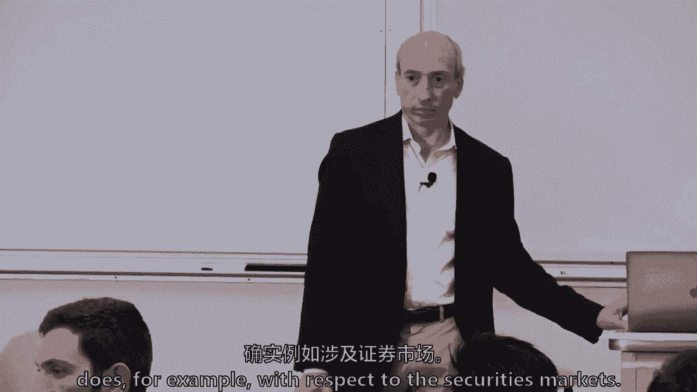

因此就证券市场而言，它有点在一个缝隙里，但第二件事是，即使这些差距被某些区块链技术弥合了，所以有两件事，有一个差距问题，然后是保密的影响，所以有一个，有一个差距，这是因为技术，但是还有其他的差距吗。

也是。

嗯，所以我想什么的问题，通过调节一个逻辑，在一般技术中，在一般技术中，因为缺乏中介，他们试图，呃更像是接近中间人，这样他们就可以控制中介，但现在没有中间人，所以你很难。

所以詹姆斯提出的是，这种生态系统可能会发生彻底改变，一点点商业模式，不管是投资者保护，甚至围绕着中介的非法活动中心，你认为为什么这么多的法律都围绕着中间人，读数中没有具体说明，但为什么你认为伊莎贝拉。

嗯，我想如果中介要被这项技术淘汰，那么很多玩家不会真的希望这项技术向前推进，所以没关系，所以伊莎贝尔提出了一个观点，也许中间人会因为这项技术而受到威胁，但我也在问，为什么你认为法律在历史上。

法律为何对中介人作出规定。

所以你可以看到在中间层发生的交易，比那些发生的，好的，穿着后面的红色球衣唱着，我记不起你的名字了，Dan。

所以我只是觉得，如果这些中间人中的任何一个经历了导致他们失败的事情，那么你摧毁的不仅仅是那个机构，所以两个想法，一个是这是一个附着点，对它有一些杠杆作用，在系统中，你可以，你可以。

它对公共政策产生一定的影响，一个是可能会有一个失败点，您需要保护系统免受故障。

回到这里的其他原因是，好吧好吧。

政府只是没有人力和资源来审视每个人，这些中介机构实际上通过收集这些数据来赚钱，所以政府可以利用这一点，所以杰克在提高，力倍增的一种变化。

它不仅仅是一个应用的节点，但他们有资源。

可以说，回到这里，我很抱歉。

你的名字，亚当，所以中介也在，允许当事人之间进行交易的信任机制，所以条例就会到位，有点像消费者保护的角色，以确保这些，那些中间人，中间人是值得信任的人，所以它是，这是出于一系列的原因。

世界各地的公共政策官员经常对中介机构提出要求。

因为完成它是一个节点。

它是一种资源，他们财大气粗，有时有时是因为他们可能会失败。

因为它造成了进入的障碍，通常不是在早期阶段，但后来实际上是现任者，这往往会造成一些进入障碍，他们收取一些经济租金，雨果，你可以看到现在开始的那种，在加密空间中使用like OG。

就像硬币基一样，或者像x，或者像早期开始交流的美国机构一样，有点后市场权，这么容易去的地方，你说的是什么信，d。

只是哦天哪，代表某事，我其实不知道是什么，这是原汁原味的黑帮，原班人马，谢谢。谢谢。我的女儿们会很高兴的，我现在知道了，嗯，那很好。

因此，它正在从干扰阶段转移到接近现有阶段，雨果像硬币一样长大的公司在哪里？或者他们现在是这个只有六十年历史的领域的现任者。

本质上，我们将谈论很多关于税收和银行保密的问题。

和豪伊试验，我要，我要把你从锄头测试的冷电话中解救出来，但我们不会，但要做好准备，当我们到了幻灯片，我们再聊一会儿，然后呢，当然是我的最爱，鸭子测试，确实，有人知道是谁吗，美国诗人莱利，哦真的很好。

他是哪里人，不能告诉任何人知道莱利是从哪里来的，不在那里面，我不认为它在。

在证词中，是啊，是啊，你说的对，这似乎是一首很好的中西部歌曲，你知道吗，走起路来像只鸭子。

她说话像鸭子，嘎嘎叫像鸭子，那里有只该死的鸭子，你去那里，你走不，否，如果是机器鸭的事呢，是电脑屏幕，像鸭子一样走路说话很漂亮，所以克里斯托弗提出了这个问题。

如果是机器鸭，像鸭子一样走路的机器鸭子。

像鸭子一样嘎嘎叫，像鸭子一样摇摇晃晃，为了公共政策的目的，它是一个该死的码头吗，也许是对的，如果是智能合约，像鸭子一样摇摇晃晃，像鸭子一样嘎嘎叫，也许它仍然对社会有影响。

像鸭子一样，这个鸭子测试不是我发起的，莱利一百多年前做的，就像那些东西中的一个，如果你在华盛顿，嗯。

其他人可能会叫它不同的东西，但是鸭子测试，就像，运用常识，然后回答这个问题。

我的天啊，我把自己的一篇文章作为阅读，所以我们跳过这个，所以加密，加密金融的世界，你以前看过这张幻灯片，但它一直很不稳定，在过去的几天里大约有2200亿，百分之五十多一点，54%是比特币。

和其他主要货币的市值，以太坊，波纹，之类的，我们会讨论很多关于最初的硬币发行，它们是证券吗，或者他们不是，但我要指出的是，就市场价值而言，大概四分之三的空间已经由证券交易委员会确定，不做保安，比特币。

五个，4%的乙醚大约，我不知道，十五分之类的，所以你突然上升到70分左右，然后还有一堆其他的事情加起来。

所以大约四分之三的市场价值。

现在是人们可以称之为缓存或商品的东西，但不是这个世界上的安全，这与正在进行的一些辩论无关。

我们谈论这个有点像角落里的母狮，现任者开始关注加密金融，所以这提出了一些挑战。

他们为什么对这个感兴趣，为什么现任者有兴趣进入这个地方，哦，来吧，来吧，我的情况不会这么糟。

我是，真的，所有这些人都一句话也没说。

嗯哼。

不错嘛，所以看看这个，这现在更容易了，我去看看是否有人替别人签到，就是这样，你认为现任者为什么想进入。

你说在你进来之前很难做，是啊，是啊，但他们为什么要进入这个空间，他们为什么想从事加密金融，好吧嗯，部分原因是它极不稳定，你怎么赚钱，把钱做得足够大，波动性足够大。

然后也有很多人，我想这就是为什么有两千万个Coinbase账户，所以当我在高盛工作多年的时候。

我们以前有句谚语，波动性是我们的朋友，它往往不是市场上许多人的朋友，但如果你在金融界，你在中间风险的世界里，持有波动性风险是风险的一种形式，所以波动性一直是我们的朋友。

他也是我们的朋友，因为通常如果它真的不稳定，有时我们的一些竞争对手也无法管理这种风险，他们会失去市场份额。

我们将获得市场份额，或者事实上他们也倒闭了，像波动性初创公司这样的人可以在事后乞求原谅。

现任者更多的时候觉得他们并不总是需要征得许可，所以有一点不对称的声誉风险，现在做生意很明智，一旦你在一个大的现任者，如果你在一个大地方工作，你会感觉到更多的约束，多一点合规官，你更有律师。

你有更多的会计师，但您应该仍然具有相同的值，我真诚地说。

别犯法，不不真诚，但当你在创业时，你倾向于，总是有一些模棱两可的地方，你冒了更多的声誉风险，你倾向于，所以有一群现任者试图进入，芝加哥商品交易所，UX洲际交易所，它拥有纽约证券交易所。

稍后会做一整节课关于他们在那里做什么，在学期忠诚度，那花了一大笔钱看它，及其他，所以我们所说的框架，防范非法活动。

稳定与投资公众，我要把这些一一分类，但这是税收遵从，没有一个政府想缩小他们的税基，现在，一些政府希望吸引缩小其他司法管辖区税基的活动，但这不是缩小你自己的税基，通常我的意思是你可以通过法律降低税收。

但你不是真的想，政府不想推广非法活动的任何定义，我们不需要在这个类中定义它，这是一个规范的事情发生，各文化文化，按管辖权划分的管辖权，但往往会有一些，贩卖儿童，我是说，当然有些事情被广义地定义为非法。

然后有一些你知道的变化，取决于文化和社会。

然后制裁，它是外交政策的工具，像我们这样的国家，但欧洲和其他地方经常使用制裁来试图，它有几个世纪的历史了，在上个世纪被称为封锁，你知道在船上，但现在我们做得更多的是电子和商业。

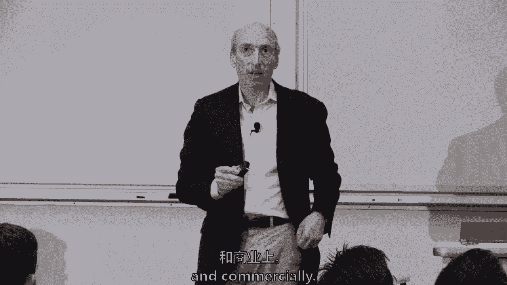

金融稳定往往是关于整体经济或法定货币的稳定，或者我把一个小集合放在那里，可以想象商业银行系统的稳定，所以金融稳定可能意味着很多不同的事情，但通常是关于货币的。

经济或，中央银行制度和商业银行制度，但对一些国家来说，不是大多数，一些国家的金融稳定取决于资本管制，如果一个国家在某个地方控制着他们法定货币的估值，记得我们谈了很多钱的事吗，但如果有些人不想洪水。

他们想控制他们法定货币的价值，然后他们经常有资本管制，对这些国家的影响，整个加密金融世界都触及了这一点。

然后是投资公众，消费大众，我们将讨论投资者保护和消费者保护并不完全相同，市场诚信这两个词基本上是指我们促进经济活动。

如果你能对中央市场结构有信心，这是不是苹果的价格，或者苹果股票的定价，从本质上说，这个市场上没有欺诈和操纵，在你做交易之前，价格就越透明，在所谓的贸易前透明度和贸易后透明度之后，越透明。

你就越能根除操纵和欺诈，有更多的正直，通常很简单，这是大量的经济研究，你降低了那个市场的风险溢价，从本质上说，你可以对那个市场更有信心，其次，你在价格发现功能上有更多的竞争，艾琳，一个非常愚蠢的问题。

但你说交易前的透明度。

那么这与，就像美国，当你去看医生的时候，你不知道你要付多少钱，我不应该，当你去看医生时，似乎没有交易前的透明度，我倾向于同意你的观点，有很多市场，不仅仅是医疗保健。

但在许多市场上，交易前的透明度有限。

我觉得只有有限的交易前透明度，当我现在开车去上班的时候，当然然后他们会给你定价，车已经在站台上了，他们告诉你需要新的刹车，那倒是真的，许多不同的市场以不同的方式运作，医疗保健可能不太透明。

部分原因是这是一个混合市场，我们有第三方支付提供商，保险公司和政府，为我们提供和支付大量的医疗保健。

在金融市场上，大量的交易前透明度促进了市场诚信，那会有一点帮助吗。

所以马克·卡尼，什么是，你们都从，马克·卡尼的论文，如果有人想自愿，或者我可以继续沿着我的列表，拉希姆。

我没记错你的名字吧，怎么了戒毒所。

六个被认为是。

马克·卡尼说的一件事是，他并没有真正考虑加密货币，货币，但他们是一种资产，马克还做了什么，我叫马特·达蒂，其中一个。

他说它不是货币的原因之一，是因为极端的波动性，那意味着它没有内在价值，我有点不同意，我不认为波动性应该等同于，缺乏内在价值，如此大规模的赛车，以至于马克·卡尼说。

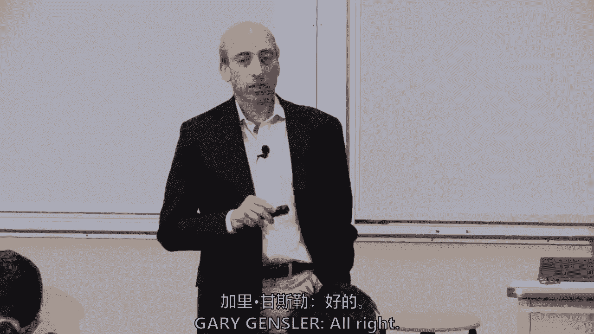

波动性不能有，不能成为货币。

我倾向于同意马特的观点，如果马克在这里。

我会直接对他说，我是说极不稳定的，但在他们通过的药物中仍然有三元价值，我想说甚至有一些法定货币。

一直很不稳定，嗯，所以我认为它确实有内在的价值。

但也许不一定是一种货币，这不是一个可靠的记账单位，它总是在波动，这是我的看法。

所以我同意，但我有不同的推理路线，为什么我不这么认为，你认为这是一个不同的原因，它有内在的价值，是啊，是啊，我认为它有内在的价值，我只是认为它应该被称为数字资产，不是因为它没有内在价值。

因为它不是一个可靠的记账单位，还有你的名字，我们很抱歉。

凯尔索凯尔，说这是因为它不是一个独立的计算单位，在这个时候，很少有地方用它作为计算单位，马特要，这很好，我们可以在这里辩论，但事实上，地方已经把它作为一个计算单位，应该使它，所以它是一种货币。

它过去一直被用作货币，以及是否有五个人用它，或者一百万人使用它，不应该，它可以使用的事实，使它有资格成为一种货币，不管是对一定数量的人，不一定，所以谁想在。

是啊，是啊，我想举一个国家的例子，人口超高的地方，有国内危机的地方，你失去了它真正的价值。

所以人们实际上自动开始使用美元，例如作为他们的参考，所以它可以发挥作用，在人们仍然可以交换的意义上发挥作用，但你不能真正衡量，直到你回到其他东西，我今天应该回到其他东西的价值。

这就是我认为计数的价值又在左边的地方，所以要看情况。

如果是在一个恶性通货膨胀的国家，我也不，我希望没有，你们中有人生活在一个恶性通货膨胀的国家，所以你们中的五六个人，所以你知道当你走进一家餐馆，有一套定价，但如果你吃得太久，在餐桌上逗留。

这是一个不同的定价水平，字面上是对的，总有一天你会拿到薪水的，然后你必须花得越快，因为你可以，因为一周后，这基本上是你在那天死去所需的一小部分，但从上面看，标记我从报纸上引用的一句话。

当局是从公共政策的角度来考虑这个问题的吗。

当局需要决定，你要孤立这个世界，调节它。

现在整合它，有些国家我不认为有人完全孤立了它，但一些国家在某种意义上说，让我们禁止大量的这种活动，和，其他国家会在多大程度上导致这样的评论，来决定他们将采取什么立场，凯利的问题是，在多大程度上。

来自标记的评论，卡尼，谁是英格兰银行的行长？但领导金融稳定委员会，这对官方部门的其他部门有多大影响，这是一个很好的问题，我想这一切都融入了混合，我认为，可能在任何公共政策领域，六到十几个真正需要。

不合法的领导，他们没有带头，法律上，他们只是带头，因为其他人遵循U中所说的，What’欧洲联盟在哪里？中国，日本，我是说，我们知道通常的国家，然后是正常的国家，但部分原因是他们经济的深度和广度。

它在这个世界上的一部分，他们金融市场的深度和广度，但这也是因为他们的意见领袖和他们的意见往往受到尊重，但我们有一百八十或一百九十个国家，他们每个人都有不同的文化。

每个国家都有不同的政治制度不同的历史和不同的经济状况。

以为它会，它是，这是一种反乌托邦的观点，几乎任何公共政策问题都将有一个世界性的制度，相当，我是说，我不知道它是否存在于任何地方，但当你到了金融服务部门，不太可能，因为所有这些不同的文化和历史。

政治制度和经济相互冲突。

是呀，我只是在想，你能多解释一下，3。你说的中国不允许外国公司进入是什么意思？就像，因为我们想喜欢中国已经禁止了，就像金钱的交换，我们喜欢密码，所以问题是中国。

在孤立类别中占主导地位，而不是在集成类别中占主导地位，所以四分之一或三分之一，很有趣，它真的是混血儿，中国来势汹汹，对很多活动说不，然而比特币最大的两个矿点在中国，一些加密交易所离开了中国。

但那些矿工是比特币最大的卖家，因为他们在收集比特币，需要出售它们，得找一些密码交换，已经不在中国的地方。

我要把交易所的名字念错了，但我仍然是一个中国人。

密码交换，我想现在在马耳他注册，如果我没弄错的话，也许所以有一个爱恨混合体，他们有一个完整的实验室和它的公众。

或者是公开的，是公开的，私人的，可能更大，我们只是不知道，所以有一点，混合方法，即使在中国，我不知道这是否回答了你的问题，嗯，所以让我走吧，这是，在过去的六个月里，我花了很多时间，周游世界。

在不同的会议上发言，OECD，在日本，在这里，u，这就是我所看到的，防范，列表活动，广泛共识，一百八十，一百九十个国家，是啊，是啊，我们必须这么做，有时从一个司法管辖区到另一个司法管辖区都是假的。

因为有些人实际上对逃税没意见，只要是逃税，和他人的管辖权，试图从其他地方夺走经济活动，但人们普遍认为，和相当于执法，你知道吗，想想那些发生联系的地方，各国，监测的普遍共识，现在没有什么深深的担忧。

因为空间只有四分之一万亿美元，和世界资本市场，全球债务市场有250万亿，大了近一千倍，全世界的股票市场大约有90万亿，甚至全世界的黄金储备也高达7万亿，它只是让你对现在的关系有一种感觉。

为什么让我们监控，但这可能不是系统性的不稳定，然而，有不同的观点，特别是在实行资本管制的国家，因为这样可能会破坏货币的稳定，第三是投资公众，保护，投资公众，我想说观点是广泛的。

在美国，s，加拿大更向前，多倾斜一点，是啊，是啊，很多这种东西，也许这些最初的硬币发行是证券，他们需要保护，嗯，在其他一些国家，就像百花齐放，让我们促进创新等等，视野相当开阔，我个人的看法是。

我在一些会议上说过，如果这是从四分之一，是它的5倍10倍20倍，或者如果ICO市场今天已经筹集了大约200亿到250亿，一直在提，但每年筹集1000亿英镑，那么一些国家可能会希望更多的投资者保护。

我想这只是我个人的看法。我们永远不会有统一的管辖权，统一法，但部分原因是，就是，这太新了，与资本市场相比，它仍然相对较小，如果它长出来了，我想更多的人。

更多的国家希望在金融稳定活动清单上提出一些保护问题。

当你去其他国家旅行时，他们用什么标准来衡量他们的成功或监控这些方面。

嗯，所以问题是。

各国在做什么来衡量成功，我要举一个例子，然后我们会继续讨论细节，日本有一些最早的加密交易所，安装Gox gex，Mount Gox是一个早期的交易，发起人，业主们搬到了东京，即使他们不是日本国民。

所以它以东京为中心。

当大约5亿美元的价值损失时，它就下降了，据说是黑客，密码被盗是个有趣的案子，它实际上被偷了几个月，这不是一个特定的黑客，所以日本和1917年终于改变了他们的法律，他们制定了一个完整的制度，监护权问题。

和围绕非法活动，他们实际上已经进去要求交易所注册，他们进去，实际上，嗯做考试，今年早些时候，我想是三十岁，一些注册交易所。

五到十个不得不停止运营，他们如何衡量成功或失败，今年1月的另一个交易所又因黑客攻击损失了5亿美元。

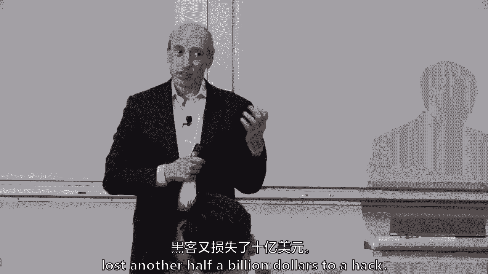

首席执行官，他们的首相，在新闻发布会上得到一个问题，那不是好事，所以有时你衡量成功或失败，你的老板是否在新闻发布会上被问到，你知道为什么它不起作用吗，顺便说一句，日本人很棒，就他们在做什么而言。

但我只是用它作为一个例子，就像。

有时候，嗯，所以让我来谈谈并深入研究其中的每一个。

你知道的，每次大概五到十分钟，你可以对每一个都做一整门课，但让我深潜一下，一点点防范非法活动，税收。

遵守和报告，你觉得怎么样，美国政府或任何政府的第一个大问题，这听起来像你的中心和凯利，谢谢你的论文，因为凯莉很好，如果我叫你出来，为今天写了一篇论文，今天早些时候我碰巧读到了。

说根勒的作品太，以美国为中心，我觉得很勇敢，我觉得很勇敢，但你是对的，它是以美国为中心的，所以这是你在政治中学到的东西，我也是，你试着衡量你的观众，但你是对的，但你觉得呢，第一件事，不管是美国政府。

或者任何政府都必须弄清楚这个世界，在2010年出现了，211212，第一个问题是什么？你可能从读数中挑出来了，但作为一个政策问题，有人想猜一下吗。

为了纳税的目的，你怎么吃，在纳税方面，你如何对待它，出于税收目的，你当时如何对待比特币，所以这个中心问题是第一个真正出现的问题。

它是一种货币吗，它是一种财产形式吗，是别的事吗，美国政府当年是怎么说的，我想是2013年，但它会在证词中，它是什么？它是货币还是财产，财产，谢谢你的付出，当你填税单的时候，你做任何交易，这是正确的。

所以这样做的结果是，你想再说一遍吗，你基本上每次兑换到另一种货币。

或者你花掉它，你必须记录成本基础，嗯是的，如果你做了我的纳税申报单。

今年有六百页，相当残忍，嗯，所以任何时候它都会改变，你不能巩固，我想这就像股票一样，你可以巩固。

如果一年中交易的是相同的证券，你可以在一天内巩固和展示你的开始。

只需在三角洲纳税，但你必须报告每一个趋势，所以这些类型的问题在208年是不知道的，但十年后它是一种货币，是财产吗，全球一些司法管辖区，很少，但有人说它的货币。

但几乎在全球占主导地位。

它是某种形式的财产，然后在法律范围内触发它，就像在美国一样。

It’资本利得等等，下一组问题是采矿的税收待遇是什么，交换器和叉子。

有人想告诉我什么吗，什么，如果你，如果你在挖矿，你收到比特币或任何其他密码，以太等等，有人想猜一猜吗，这不是猜测。

我想甚至在证词中，我写你有六百页的叉子，无论如何，你基本上为整件事纳税，就像比特币现金板，就像，基本上成本基础是零，以及你出售时的价值，你是说你必须在叉子的两边纳税。

所以这比股票拆分还难，股票分割，2。你就这么办吧。

比特币挖矿怎么样，你想拿一个。

我其实不认识这个，但我想我会把它当成收入来交易，收入赞的权利，它的收入，你是我的，你得到收入，所以这些都必须在税法中解决，下一件事是所谓的银行保密法。

有人想告诉我银行保密法是什么吗。

是尼古拉斯吗，只是为了看看，我可以在上面读出你的名字，看看效果如何，我不知道是什么，它是，好的，没关系，银行保密法是几十年前通过的，所以可能在我们在座的大多数人之前，我出生后，但你们大多数人都出生在。

有人想说什么是银行保密法吗。

丹尼尔是银行保密法，处理一个SC和L。

本质上了解与你互动的各方，正确，正确，它真的试图防止秘密交易。

所以你会听到这些信，了解你的客户。

根据它的银行保密法，有报告义务，任何根据银行保密法必须报告的人都必须报告，当有大额交易时，如果你去银行，你问他们，你能不能，2。我想向你取款11000美元，s货币，他们必须填写一份报告。

因为我相信这是导火索，一万美元你走进来，你得到500美元没有报告，但是有各种各样的可疑活动报告，和在美国触发的其他大型交易报告。

美国的银行保密法，但你会一遍又一遍地听到，即使你从未在区块链公司投资或工作过，你会听到一种叫做K、C和AML的东西，正是这两种制度起作用了，他们不是最好的，但他们做他们的工作给官方部门和银行部门。

对谁拥有账户的感觉，当有可疑活动时，有向当局报告的义务，以及匿名加密货币如何适应这里，我想在交换层面上你做K C NL。

但问也是，一切是如何适应的，那么货币传输法律是如何。

货币传输法是丹尼尔刚刚提到的法律，我是说华盛顿是一个充满这些字母和行话的世界。

和一切，那么它是如何适应的呢，起初是在U中的一件事。

但再次使其国际化，你们什么时候受到类似的法律的约束，您什么时候只是此属性的用户，因为它不是货币，而是为了混淆事情，U，s，虚拟货币。

它碰巧是税法的财产，这是同一个部门的两个部分，U，s，U的另一部分，s，他们之所以说这是一种虚拟货币，他们希望它受到这项法律的约束吗，银行保密法，不走，雨果。

好的，所以加密货币对货币来说是一个非常糟糕的说唱，你要说的呢，今年的生活事实，和通过的钱的数量，比如加密交换，可能有一千万，所以休在问这个问题，其他的呢，我会答应，雨果提醒我们的是罪犯，不要改变。

只是他们使用的技术确实改变了，但在一些司法管辖区，他们仍然使用成袋的现金，全球仍有手提箱和现金滴，我听说现在有一些人贩子，在加密和实物现金之间，在那里，快递员可以得到一定比例的报酬，从。

一边是毒贩子一边给他们一个U盘，或者另一边有比特币的私钥，所以它只是一个。

你知道的，新的手段和方法，对不起，我只是回复那个，我想说银行收取的钱可能只是其中的一小部分。

而可能有更高的比例，潜在的非法使用的加密货币，所以克里斯托弗说，也许加密的百分比更高，超过菲亚特的百分比。

这很可能是正确的，因为菲亚特的世界库存是以数万亿为单位的。

但那可能是，但这仍然是令人担忧的事情，因为。

如果如果像水，想找到最低的水平，会排水，你知道的，从任何非法泄漏的地方，活动会流向最低的地方。

所以挑战是关键的挑战是，你们都养了很多这样的，所以我不打算问问题，但假名地址对全球执法部门来说是一个真正的挑战，隐私硬币，就像我们之前说的，兹卡什和米内罗等等，有加密方法使其更难跟踪。

合规和报告只是没有很多甚至很好，这意味着人们不经常遵守并把600页，美国政府，谢谢。

你知道我的审计，你的婚礼上有什么，你的审计来了。

我会说另一个，其他挑战也是。

密码对密码，事务比加密到菲亚特更具挑战性。

有人想这样吗，调节和监控，在坡道上和下坡道上，所以当你和金融中介机构打交道时，本质上是把菲亚特带入密码，您可以监视事务，或者它出来了，但是生态系统中发生的事情，尤其是当你把莫内罗带进来的时候。

还有一些隐私币，所以真的很难，所以这个学期在坡道和下坡道上很多，我听说了很多，不仅仅是来自禅宗，但执法部门就是这么想的，因为他们在规范中介，削减讨论，我们大约三十分钟前，他们有银行。

行为遵从，即使有些人做得很草率，正如雨果指出的那样，他们在系统中，所以加密对官方部门来说更难，因为你不需要任何商业银行或感觉。

加密对某些人来说更容易。

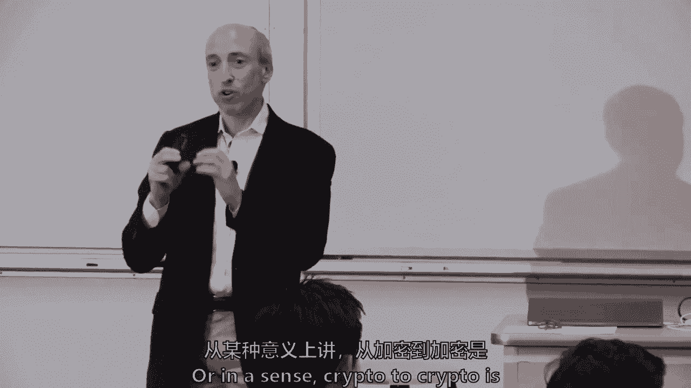

想远离税基的人，因为没有同样的报道，所以这也取决于你在镜头的哪一边，分散交易所。

我们将在大约五六节课上讨论，但相信我，对官方部门来说更难，分散交易所，或者基本上想象一个去中心化的算法，无中央中介，但是通过一个算法。

Elon和我可以用比特币和以太进行交易，以太对比特币，这种分散的交换允许它发生，他们中的大多数现在在两个之间，以太坊上的代币，所以以太坊对以太坊的信物，令牌到两个ICO令牌，但他们是一个真正的挑战。

我们以后再去找他们，有人知道什么是黑市吗，我不打算问，如果有人利用黑市，我不担心，它是，嗯，这是一个很深的，有人用D。

加上那家伙现在在海湾里，他有了贝特拉的想法，它被用于，所以它基本上是一个网站，你可以在那里买卖非法的东西。

付款通常是用比特币支付的，尽管有些人现在已经离开了比特币，他们使用的技术是一个火炬来参观。

这是一种你可以在网上进行交流而不被跟踪的方式，我是说，从广义上讲，在比特币之前，黑市是存在的，他们可能被称为黑市，所以他们有了一个新名字，它们是一种新技术，然后是国家行为者。

没有人应该怀疑国家行为者总是在相互竞争，即使我们不在热战中，有时你在和其他类型的竞争，因此，国家行为者也在使用，不仅仅是像，穆勒调查发现，他们声称俄罗斯人用比特币扰乱我们的选举，嗯，但在更广泛的意义上。

国家行为者可以在这个空间发挥作用，我只是觉得这张图表很有趣，我在一个网站上找到的，戴尔做了一份报告，但这是美国区块链分析的代理合同，外面有公司会进去做法医分析，这里是最高机构，这些数字不太相关。

是两百万还是一百五十万，但很有趣，是国税局，这是习俗，联邦调查局和财政服务，和缉毒署，那是U的部分，公开索取合约的公司，所以这个外部服务可以跟踪它，但它只是给了追逐比特币使用的人一种味道，在美国。

它是奇妙的透明度，那是非法活动，让我继续讨论金融稳定，因为我们快没时间了，金融稳定，金融稳定委员会的初步评估还不够大。

我会说，虽然再次，本质上，例如，在那里你不能取出很多货币，但如果你能去RIM B，我明白的一件事是，中国银行关注的是中国的大型矿商。

本质上，采矿业务是绕过资本管制的一种方式，这是一种，但这也可能是为什么中国的一些地方官员显然允许采矿继续进行的原因。

虽然你知道我没有任何书面证据，这就是为什么有些人认为可能有一些。

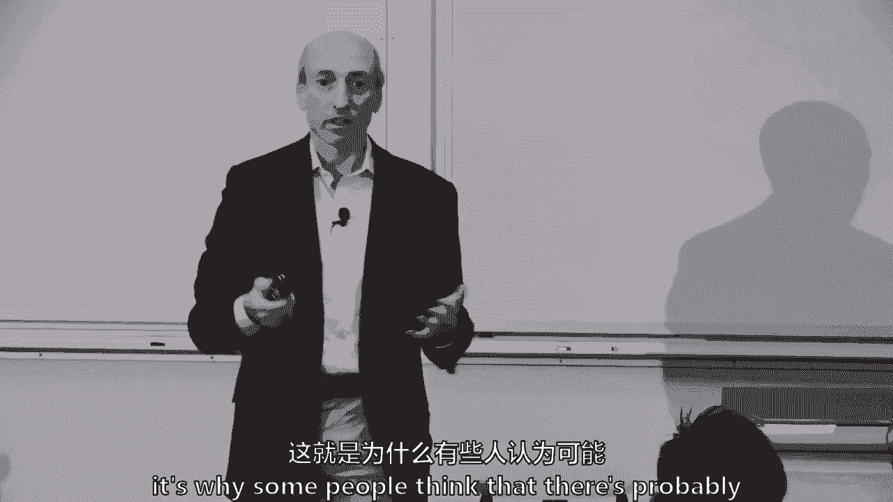

我在证词中提到了另外三个我认为即将出现的领域，值得思考的密码杠杆。

许多加密交易所提供了很多杠杆，你可以买比特币，在某些情况下，百分之一，杠杆大多数不是在101，但几乎都是十比一，上面说我们的叛徒，对呀，所以杠杆通常是你可以获得更多的地方，嗯，危机的加速。

如果它已经发生了更系统性的风险，这仍然是一个相当小的市场。

但杠杆可能是任何危机都可能传播的东西，如果真的发生了，市场基础设施本身，就像澳大利亚正在使用区块链技术，进行库存的清算和结算，他们还没有采用，但他们将在明年和2020年推出，所以说。

只是确保基础设施正常工作，我也许应该跳过这张幻灯片。

它们可能是顺周期性的，周群不必在银行存美元，他可以直接存入美联储。

或者在瑞典，离得足够近，你可以直接在瑞典中央银行存款。

我们将在几个星期后更多地讨论这个问题。

我想我的关键问题是，哦，如果你这样做，你会运行，呃，这将危及，中央银行实施货币政策的能力。

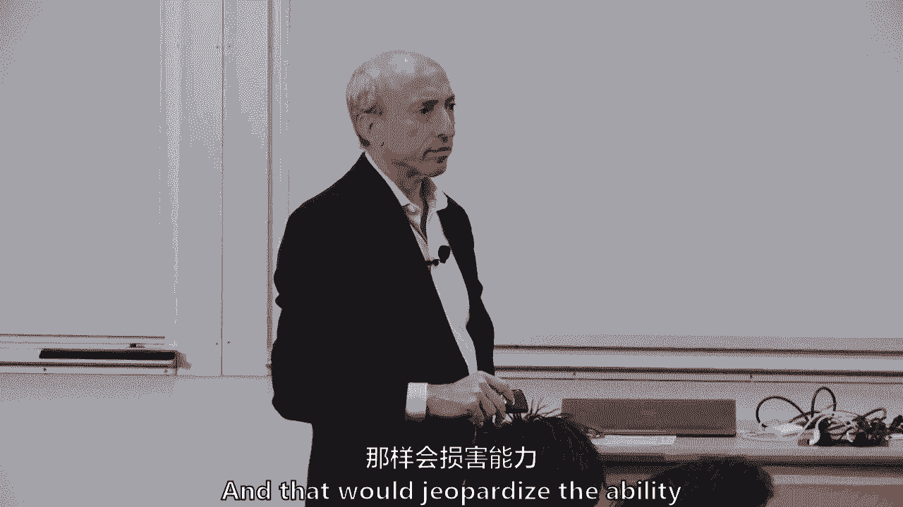

你知道的，尤其是如果你使用比特币的方式，如果这是布里奇特，嗯，你实际执行的能力，喜欢的人，嗯，提醒我你的名字，肖恩，所以肖恩，我同意肖恩的观点，你能帮我拿两个星期吗？当我们要深入。

我们要对所有这些进行深潜，但基本上肖恩的观点是，如果中央银行直接向公众发行货币，数字的，它是否也会破坏货币政策，这里有一堆巧妙的权衡，我把它留给你，只是想说。

我们会回到那个问题上来，投资公众，所以我们已经讨论过了，市场很容易受到欺诈，操纵。

我们将用几节课来讨论，这么简单的一件事，点赞提醒我，你的名字，迈克尔，迈克尔有交易，我想其中一些是在加密交换机上，所有的权利，所以当迈克尔向加密交易所下订单时，目前规则手册中没有规则。

法律上没有规定交易所不能领先，迈克尔，迈克尔说他想以6400美元的价格购买比特币，加密货币交易所可以在他面前以64英镑的价格买到一些，九十三，九十，六十三，九十，是啊，是啊，对不起，那叫跑在前面。

所以在迈克尔的订单上有很多很多赚钱的方法，这可能只是一种胡闹。

凯尔，这是个问题吗，或者我认为像前面跑和像在磁带上是犯罪活动，即使他们没有被Finrun的特定法律或法规涵盖，难道不是这样吗？凯尔养得很好，也许如果它不在投资者保护法的范围内，其他法律是否涵盖。

你提到了Finra，Finra，它是，U S用于投资，将是投资法，凯尔，你说的对，有些东西仍然违反消费者法律，我不认为前面跑是其中之一，但你可能是对的，我会争辩说。

通过将投资者保护置于消费者保护之上而受益，消费者保护是关于交易，以及交易中可能发生的欺诈，卖汽车，卖婴儿床等等，卖一瓶牛奶，投资者保护层在其他东西上，这与发行人的信息不对称有关，发行人知道一些事情。

筹款人和购买者不知道该信息，有很多信息不对称，你们试图在市场上解决的问题，其次是围绕交换，交易前透明度的概念，贸易后透明度，试图带来透明度，并说我们将促进经济活动。

所以在美国1933年和1934年通过了两项法律，交换法，所以我们必须记住《证券交易法》，但一个是给发行人的，这是第一个，第二个是交换三三三四。

我认为这些是关键，我只想提一个关键问题，我们在接下来的几周里将努力解决的定义，什么时候是安全的，什么时候是商品，什么时候是导数。

我们今天不必回答这些，但那些会像，是保安吗，它是商品吗，是衍生品吗，不仅每个人都有不同的法律，但是有不同的公共政策，和不同的规范行为，证券是指有发行人的时候，从公共政策的角度来看，存在信息不对称。

筹集资金的人比投资的人知道更多的信息。

他们可能永远都会，所以你可以，什么是信息的公平交换，嗯，我要去，我将略过几件事，只是说为什么投资者保护对凯尔的问题，它超越了，这里是，加里·詹斯勒是什么，四个要点，这是你在教科书上看不到的。

但这些是关键的事情，我觉得，消费者保护之上的投资者保护层。

一个投资者得到充分和公平的披露，你可以辩论什么是充分和公平的披露，但这不仅仅是，我卖给你，这盒牛奶。

欺诈和欺骗性的做法现在被禁止了，即使你买了一盒牛奶，欺诈也是被禁止的，但它有一些额外的部分，然后我说的关于二级市场促进价格透明度的事情。

然后是最后一个我没有谈论过的，顾问在金融市场上通常有很多冲突，在大多数国家几乎总是有，顾问周围的一些额外责任，不管是所谓的信托责任还是其他责任。

有时这只是最大的努力，但通常会有一些额外的，这四个要点，我不想在三分钟或更短的时间内教授一整门证券法课程。

但这是我对它的总结，汤姆，第一颗子弹是保险公司的，或从。

对不起，艾米丽有什么考虑吗，就像。

如何优先考虑投资者和消费者保护，对战，比如说税务执法，我可以想象如果有更多的保护，它将激励更多的投资，然后可以在没有事先，比如税收覆盖面，使它像ypwas这个词税收或黑客税，在那里。

我想更多的保护会鼓励更多的投资，但更多的人可能会逃税。

如果没有税收框架，所以艾米丽的问题是，从某种意义上说，任何社会都是如何在税收和，最终如果我能退一步，这就是一些国家现在正在做的，但他们已经做了几个世纪了。

你如何促进创新，可能促进经济活动的，所以我拓宽了你的问题，你如何促进经济活动，在中间的时候。

投资者保护，所以我把它做得最宽。

因为那是你会听到的，经常围绕区块链和比特币，但当铁路出现时，这是真的，最近，当互联网出现时，这是真的，如何推广互联网的这项新技术，同时实际上仍然广泛地促进我们试图实现的社会产品，我是营地里说。

防止非法活动，投资者保护的金融稳定，促进社会和经济福祉，我想这不是加里，詹斯勒，我不认为他们一定有冲突，也有人说不，否，不不不，你不能促进经济活动或税收，我认为那更短视。

我认为这个国家20世纪30年代和其他几十年的政权和改革，和其他国家，是我们拥有如此繁荣的部分原因，投资者保护实际上降低了，感谢您更正发行人。

它降低了发行人的风险，降低了资本成本，如果你有很好的投资者保护，我相信最终它降低了资本成本，嗯，这就是我在这两个要点中所说的，所以你，《证券法》有人想告诉我什么是豪伊测试吗？

那边的拱门是什么，让我们给某人起个新名字，实际上，测试是如何来自最高法院的一个案件，那是在一九四六年，当时最高法院即将做出决定，就我记得柑橘角色，在今天结束的时候，他们决定这两个柑橘卷轴是证券。

就在那之后，你知道的，有一种能够定义安全的东西，它必须是很差的标准，让我们暂停你在那里，让我们把它好了，所以佛罗里达的柑橘林。

不知何故是证券，绝对正确，一个叫威廉的人，豪伊。

他竞选州长，实际上在佛罗里达输了几次，他想他可以卖掉他的一部分土地作为柑橘林。

所以问题是他什么时候卖掉那块地，从技术上来说，这真的是一份投资合同吗，因为在1933年，这两个字，你知道吗，它说股权，股票期权，它一直有一堆逗号，有一个逗号，投资合同，逗号，它继续前进。

所以真正的法律问题是，最高法院不是，比尔·霍伊的柑橘林是否安全，比尔·霍华德的，豪伊的柑橘园是投资合同，这是一种安全，这将我们与欧盟和许多其他司法管辖区分开。

这与很多骗局和欺诈有关。

从十九世纪九十年代到二十世纪二十年代。

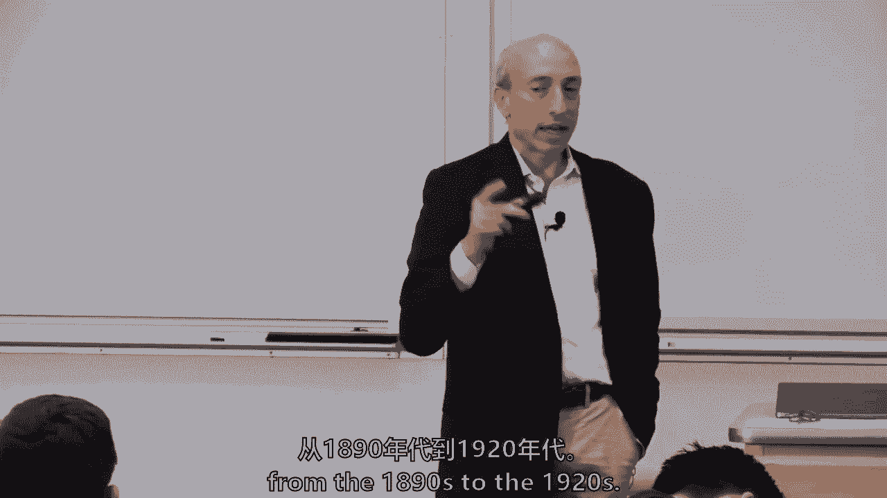

并符合投资合同测试，这个四部分测试是，是金钱还是资产的投资，基本上SCC说如果你给乙醚，或者你给比特币买以太。

或者你给比特币买阿曼达代币，所以好吧，那是金钱或资产的投资，SCC是这么说的，大多数律师都同意，那是对一个共同企业的投资。

那么有没有一群开发人员，就像一个普通的企业，有些人争论说，有人说好，我们不是真的，这是一个开放源码，如果你是一个开放源码软件，这不足以摆脱一个共同的企业，是否有合理的利润预期。

大多数人认为利润来自股息或债券利息。

证交会说，有相关的法庭案例表明，利润可能只是对资产升值的预期，所以我今天买了一个六乙醚的代币，明天我想它可能值一万，e，那是合理的利润预期，又是别人的努力，是的是的。

依靠别人的努力，这四个部分的测试，杰伊·克莱顿，从本质上说，他没有遇到过ICO，他不认为是安全的，他的话比那干净一点，但它基本上是在说最初的硬币发行市场可能又主要是证券。

它可能不到整个加密金融市场的四分之一，这是一个非常相关的问题，如果你们中有人想创业，但我认为这不是最大的公共政策问题，但是边界和边界是不同的。

鸭子测试，这基本上是我的想法。

克里斯托弗，你想再说一遍吗，你看到一只像鸭子一样走路的鸟，像鸭子一样游泳，像鸭子一样嘎嘎叫，我想那是只该死的鸭子，所以如果你有公共政策问题，比如我必须在银行备案吗，保密法，我必须是保安吗。

我一定要那样吗。

在你付给律师事务所每小时一千五百美元之前，我想有很多律师值得这样做，问自己这个问题，我也想把一个价值判断教给你们所有人。

不仅为您节省法律费用，但是有很多律师会试着帮你解决问题，但当你觉得他们只是想，在墙纸和墙壁之间，他们法律判断的狭隘性和单薄性，还记得克里斯托弗刚刚给我们做了鸭子测试吗，然后走开说，嗯。

也许有另一个商业解决方案来解决你正在努力做的事情，你可能会让国税局的朋友，或者证券交易委员会的朋友敲你的门，这些是你通常不想拥有的朋友，敲你的门，一个月还有两三百科斯，我只想说市场并没有消失。

和最初的硬币发行市场，我们将在几周后讨论，拥有豪伊测试筹集收益的所有这些属性，他们通常试图发挥作用，我想跳过一些关于公共政策的内容，我们要做密码交换，所以我道歉，我运行标题和时间，但我想做一些劳伦和。

好吧，让我在这里暂停一下，鉴于你的论文，你会喜欢这个的，但这是加密货币交易所的列表，摩根士丹利今年早些时候的一篇研究论文，但是如果你能看到左边的小切片，那是马耳他，贝利和塞舌尔。

三个真正深入的资本市场，不是真的不是真的，但是一堆来自韩国的交流，香港和亚洲在马耳他重新注册，塞舌尔和贝勒。

所以，只是。

这只有五分钟，但我只想提一下公共政策是如何结合在一起的，汤姆，你要帮我吗？你得到了它分析分析，汤姆从分析开始，他认为分析是公共政策中发生的事情的重中之重，汤姆不，什么是第一，你认为首先会发生什么。

什么事？

劳伦，我以为这会是你的人事政策，但人事政策会在这里，但是消息传递。

如果你没有得到正确的信息，你永远不会得到你的分析，但是在消息传递和分析之间还有一件事。

联盟，建立联盟或政治，所以用你的信息传递你可以建立一个联盟，这就是所谓的政治，如果你的政治正确，你实际上可以得到你的分析。

教科书里没有写的这种等级制度，来自一位来自德克萨斯州的老而出色的政治律师。

他大约二十年前和我分享了它，当我去华盛顿的时候，他说，年轻人，你对这个小镇一无所知，如果你没有得到正确的信息，你不会谈论你的政治，如果你的政治不正确，你永远不会得到你的分析和你的政策，这就是一切的方式。

那么我所说的消息传递是什么意思，所以让我们找点乐子，有人记得这个吗。

那是什么，那是什么，但信息是对的，这是2016年的消息，有人想回到208年告诉我。

给208的信息是什么。

那是什么变化？

你想回到两千。

再用力一点，再用力一点，我知道，差不多，历史书上没有，嗯还没有，他就是这样，他是，他很保守，但富有同情心，对温和一面的点头，九十二，哦，这会很难，嗯哼，是经济。

愚蠢的，那是比尔克林顿，顺便说一句。

愚蠢的是经济，所以给联盟大楼发信息基本上意味着，除非你真的能把人们聚集在一起。

所以在区块链比特币空间。

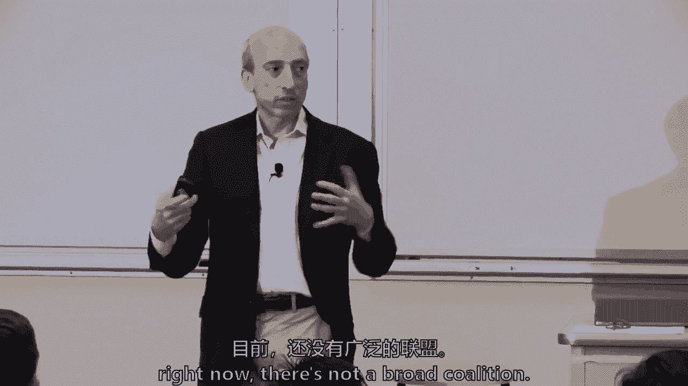

没有一个广泛的联盟，它不像人们投资区块链的深井，和比特币在美国，但如果你们试图改变立法或法规，你需要一些联盟，你们可能不能只是一群矿工，或者一群现任者、初创企业或密码交易所。

必须有某种形式的联盟建设随之而来。

分析确实重要，我不打算说汤姆，没关系，只是，否，否，否，否，只是，只是为了分析，你可能还需要詹姆斯。

说危机，都不是搞区块链的，比特币，但你被带去传递一些东西，马尔萨斯，经过了什么东西，俄罗斯人，嗯，杜马，谢谢你已经做了六八个月的事情了，不能在它周围结成联盟，我们已经通过了一些谦虚的事情。

亚利桑那州有一个法案，实际上被推广为允许比特币纳税，它在委员会中失败了，但这是一个有趣的问题。

否，我以为嗯，而且是的，劳伦。

你说的对，人事是政策，最终，谁坐在工作岗位上很重要，我会关闭它，想想那几层，有政治层，有政治洛杉矶，他们的风险偏好与高级职业水平不同，和日常职业水平，和日常职业水平，通常是我们都在与之接口的那个人。

但我们都知道，如果你走进机动车辆部，每天的人，那个官僚的决策范围真的很窄。

四十多岁或五十多岁的职业资深职业人士。

有更广泛的决策范围，但也要永远记住，他们生活在一个风险不对称的世界里，答应没有多大好处，新的、时髦的、艰难的、困难的东西，但他们可能会面临一系列下行风险，如果它在他们的眼皮底下爆炸了。

所以有不对称的风险，比特币和区块链给出了这一点，所以这就是一切，周四是许可与无许可系统，所以我们会深入研究一些，如果你有更多关于公共政策的问题。

就问吧，我们将在本学期余下的时间里讨论，结论基本上是公共政策问题。

