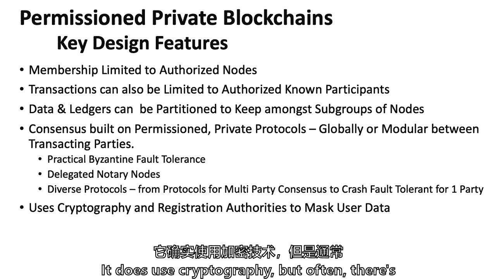

# 【麻省理工大学公开课】区块链与货币 - P9：9、许可系统 - 闰土聊Web3 - BV1sL411N7Mm

我知道我们都快到周末了，你们中的一些人可能想保持笔记本电脑开放，以便学习其他课程，期中考试，但我想请你们今天把注意力集中在区块链和货币上，今天我们要谈谈有许可和无许可的系统，我要感谢，我这里有客人。

客人来了我就招呼他们，我知道，马克·斯奈德曼在富达管理着一只基金，马克大约有60亿，你可能会说嗯，他为什么要来区块链和货币课程，因为我们是高中同学，我参加了他的婚礼，他下周又要结婚了，是啊，是啊。

但你们以后都可以淹没马克关于忠诚，因为他在那里已经很多年了，看看我要做什么，我为麻省理工学院和麻省理工学院的学生感到无耻。

所以让我们开始吧，我是，我在留出一点时间让更多的人进来闲逛，今天，我们要谈谈，当然我们会聊一些关于阅读和学习的问题，我要再回去，技术和商业挑战是什么，这是相对的，这与我们所有的讲座都相关。

但它在今天特别相关，因为我们将讨论两种不同的数据库结构，一个是比特币的无许可区块链，但今天我们要介绍，就像IBM。

超，分类帐，但技术问题与所有这些都有关，然后我们当然会讨论第三种类型的数据库。

传统数据库。

所以对齐无许可，就像比特币一样，然后是传统数据库，为什么在商业环境中你可能会想到一个和另一个，我敢肯定，如果我在传统数据库上跑题了，我没有亲自研究过，艾琳会在某个地方帮我摆脱困境，那是那是一笔交易。

也许没问题，是啊，是啊，我自找的，马克·阿林是一名计算机科学家，来自麻省理工学院其他地方，所以他在我不知道的科目上帮助我，甚至在科目上，我想我知道，所以让我们从，你从阅读中得到了什么，有四五次读数。

当然啦，现在我能做到了，我可以点亮它们，就像有些人说的，因为托利给了我名单，但是，再次课堂参与，还没说话的人，可能想插话试一试，我没看到任何志愿者。

所以我得到了，哦是的，你能再告诉我一次你的名字吗？你也是，所以神明们，喜欢这个许可，或者是不可信的，就像硬币一样，他们限制参与者的数量，本质上，他们要求参与者在进入技术领域之前获得授权，除此之外。

他们被称为利益相关者，因为他们是世界上唯一一个验证交易的人，除非呃，不像无许可的，一次，它必须由所有节点验证，限制了，呃，呃，呃，移动这些涉众所需的权限，这也增加了事务FE，所以它就像三角形，呃。

我们了解到的关于安全、权力下放和能力的困境，所以它从权力下放走向给予，好的，所以说，允许进入的节点数，它解决了一些启动者的三难困境，因此，它的核心是解决一些可伸缩性问题。

但它这样做的代价是它不是真正开放的，不是任何人都能写到账本上的，我是说，这是基本的事情，人们从核心读数中提取的其他任何东西，关于它是如何分离和不同的，我是说我们会有机会增加一点。

然后我们将深入到超级账本和科尔达一点。

我们将讨论数字资产持有量，什么是数字资产持有量，有人知道这家公司吗？伊恩知道，布罗蒂什知道很多，苏埃隆，是啊，是啊，这是一个。

它是，呃，它基本上是一个更好的机场，你试图建立一个，呃，允许金融机构交换信息和价值的协议，在我的理解中，他们始于2016年，这是在我们的COR两年后，基本上是一样多的钱，除了伊莱恩。

很多可以告诉我谁经营数字资产持有，只是这表明你读了，所以我是的，像白色一样的黑色面具，梅耶斯，有人知道布莱斯·马斯特斯是谁吗，除了数字资产持有之外，她还以什么而闻名。

假掉期，她在全世界都很有名，违约掉期吉利安·泰你们中的一些人，斯隆研究员，将有机会在纽约和吉莉安·泰特聊天，几周后，jillian tet写了一整本关于思想交换信用的书，这就是她现在正在做的。

她才华横溢，她是个很好的女商人，我管理商品期货交易委员会，有机会和她的家人见面，因为她当时经营着掉期交易商协会ISDA，还是Istiff的外面椅子，我记得，然后我们也要谈谈商业上的权衡。

但你认为一些中心业务的权衡，如果我能找两三个人来帮我，中心业务的权衡是什么，让我看看，如果我得到了Priya以外的东西，是呀，你让我想起了你的名字，肖恩，所以任务最好有隐私和保护，而且更好，呃。

可扩展性和不花钱，没钱，所以让我们，让我们暂停一下，所以更好的可伸缩性，更好的隐私，和，你说的第三点，禁止采矿，没有采矿或采矿与此工作证明有关，任何其他商业交易，您在治理方面有更大灵活性的信息。

如果您需要进行更改，您不需要依赖更灵活的治理，本质上是因为如果你有俱乐部交易或团体交易，而不是让成千上万的人参与凯利，还有一个关键技术的区别，哪一种是编码语言，输入可以在，所以用超级分类账。

他们可以在任何种类的合同中使用智能合约，与另一种选择，哪一种是特定于领域的语言，对呀，因为阅读真的是他们写的，他们的嵌入式语言要灵活得多，然后你可以用Java，你可以用go等等，至少他们说他们可以。

我不知道它是否真的像以太坊那样有限，但他们认为并宣传他们比以太坊更灵活，所以凯莉也是对的，嗯，这些是读数，现在我们又回到了基础，什么是区块链，我知道我们已经为此上了四、五堂课了，但是这些关键部件。

让我们开始追加，它们在无许可区块链中吗，我希望每个人都举手，它们是在允许的区块链中还是在封闭的区块链中，我在看，我不把，我只是去看好吧，每只手都要举起来，所以两组区块链都有一个概念可以追溯到近30年前。

给我们的朋友哈伯，你知道的，谁开创了整个区块链，那是在纽约时报上，这整个概念在两组区块链中，粗野的，有一个关于，呃，只附加在分类账的可变性上，然后我想我在其中一个读数中读到了，那个秩序有一个特点。

在那里您可以对历史记录进行一些更改，这并不等同于一个艰难的呃，所以这可能是一个例子，不是纯粹附加的，在方法中提出了，其中一个私人区块链Corrida推广了某些功能，这可能允许您不只追加。

但本质上是删除数据或替换数据，我不是，本质上，这是一种做空形式，而是对数据进行分区，我对奥托了解不够，他们是否真的允许你删除，还是这个分区里的什么东西，但也许雨果，我想表达一个类似的观点。

我的意思是我的理解，如果您有权限系统，只有一小部分，我们仍然称它们为节点，然后如果你意识到你做错了什么或者需要用链子锁住什么，他们就不能进去改变一下吗，所以说，如果你去是提高点，如果你减少到三个节点。

就像我和你分享的那样，所有澳大利亚证券交易所都在安装许可区块链，利用数字资产持有，我想这是由，还有超账本织物技术，但如果只是澳大利亚证券交易所，它的一个节点或三个节点，他们就不能把三个都换了吗。

我想本质上是的，我的意思是这可能不是数据库的结构，但我仍然认为这可能是肯定的，嗯，所以当你得到更多的注意力，你有更多的机会，但很野蛮，我会试着研究一下orda的事情，然后创建一个可审计的数据库。

一些具有密码哈希函数的数据库，班上一半的人说他们明白，另一半有点，你知道，稍微粗一点的线，一切都在许可系统中，以确保数据的有效性，可以说，数据的不可变性质，不同的是共识协议，本质上，一切都结束了。

除了布罗迪什的观点，也许是关于配额，至于谁有机会添加额外的数据，是俱乐部的小交易吗，还是宽泛，大开，所以回到技术特性，记住这是一堆密码学，爱它还是恨它，它实际上让我们所有人都可以在过去使用互联网。

很明显，我们在这节课上讨论的区块链，然后所有的账本。

所以允许和无许可都有分类帐都有密码学，两者之间的不同之处在于中间的那个桶，我们谈到的挑战是什么，区块链，我们十分钟前才讨论过，这就是列表，再看一次，这是容易的部分，如果你还没有说话。

这就像简单的问题，哦，我无耻得无可救药，是呀，你想说你的名字吗，所以对ITA来说，把你从名单上除名，她这么做了，所以你明白了不，你想大声点吗，因为托塔可以带你，但是，在可伸缩性方面有问题。

规模和方法技术，它需要时间来打破这个，好吧，那么可伸缩性，有时效率和可伸缩性，还有什么，隐私，隐私，所以基本上是隐私的可伸缩性，允许的系统解决互操作性的两个重要问题。

基本上这个区块链是如何与其他区块链对话的，或者这个区块链如何与其他遗留系统对话，许可系统和无许可系统都存在互操作性问题，然而，俱乐部交易越小，银行就越有可能。

或者澳大利亚证券交易所可以在系统内解决其互操作性问题，而如果它是一个大的开源，开放项目，所以IBM会说我们甚至可以在互操作性方面帮助你，IBM会说我们可以在所有四条线上帮助你。

我们可以帮助您提高可伸缩性效率，我们可以帮你保护隐私，我们可以在互操作性和治理方面帮助您，我想不太清楚他们是否能帮助这四个人，但他们肯定能帮助前两个，艾伦，您已经在启动时从使用权限列表切换到权限系统。

对了这四个中的哪一个是你换的原因，所以实际上我换了还是别的什么，别的东西所以对我来说，这是一个业务用例，所以我试着卖我的谢谢，这是下一个商业用例，它是，有一个圈套，你被调包的原因是什么？

所以我在以太坊公共建筑上，我想在不久的将来不太可能，银行将采用以太坊，因为他们是在线技术，然后我在Porta了解到R3，了解到银行实际上资助了这个项目，所以我换了银行把钱放在哪里。

所以我认为这有点关于互操作性，您觉得您的用户更有可能使用您的系统，如果你用的是科尔达，他们是他们熟悉的对，所以有一个商业原因和技术，技术原因，当然还有公共政策的原因，和，IBM。

甚至会说他们会在公共政策上得到更高的分数，如果没有其他原因，有更好的隐私和安全，我不是想为IBM买单，我只是说这些会是他们的卖点，或科尔塔或其他地方，我们谈到了Buteran的三难困境，但在另一个方面。

许多人会说分散与可伸缩性和安全性竞争，如果您想要可伸缩性和安全性，你不能分权，我不太相信这种三难困境，尽管我现在已经养了两次，但在区块链会议上经常谈论，和区块链论文和商业讨论，所以我一直告诉你。

我想公平地代表正在进行的辩论，我认为随着时间的推移，这三个问题比其他一些问题更有可能解决，但也许我只是一个愚蠢的技术乐观主义者。

公共政策框架，三大滑流是什么，我上次跑得很快，最后一堂课，Leonardo，你要告诉我什么，因为你在调整你的眼镜，是啊不，我们谈到了用它来实现一个框架的盘子，我们更多地谈论了，寻找领养，提供担保。

保护人民，保护人民，所以这是一个隐私的事情，我想我有一只来自卡塔琳娜的手，呃，有三件大事需要解决公共政策。

打击非法活动，给你，所有的权利，所以你知道我的风格。

我试着把东西放进三个桶里，但这是我唯一能记住任何事情的方法，但它是三个大桶，当然啦，我们会回到很多地方，但你有什么问题吗，这只是一个机会，野蛮人，所以我有一个关于金融稳定点的问题，呃，我喜欢你提到的。

因为总体上，呃，数字货币的价值非常小，与，假设所有的证券，甚至是加密金融价值的世界，金融现在大约是2200亿美元，与全球资本市场相比，总共超过300万亿美元的债务、债券和股票。

所以我的问题更像是想了解你对此的看法，这种价值也集中在有限数量的人身上，与我们所说的其他资产相比，因此，我的意思是，在金融稳定方面，规范仍然很重要，因为它可以产生与大小不成比例的影响。

rtish在问一个问题，尽管只有两千亿对三百亿，加上万亿美元的全球金融资产，是否仍与金融稳定有关，答案是肯定的，但是相对来说，不到一个，宽尺寸的千分之一，是呀，拜托，你比我好，所以基本上我们做到了，呃。

与公开市场的相关性分析，运动，比特币市场的公开市场，基本上有，大约有百分之八十到百分之八十五的相关性，在过去的一年里当公众或比特币市场下跌时，公开市场可能会推动这一点，因为系统中有很多杠杆，当曾经。

波动性带来了很多，用我们的保证金卡最好，他们必须从公开市场获得资金，这就变成了一个循环，所以你是说两者有关联，可能会有反馈循环汤姆类似于一个相关的问题，默文·金几个小时前在这个房间里。

他说的是在A危机中，两个信任问题，一个有对手的地方，信托发行银行，尽管整个衍生品市场，银行并不单独知道哪家银行面临的风险最大，所以他们不会互相交易，或借给对方，然后在溶液的反面。

救赎是两个人在一个房间里，彼此信任，中央银行，政府将资助十亿，数百亿美元的资本，所以我想知道你对区块链的作用有什么看法，在解决了解你的对手的第一个问题时，或者至少能够信任他们的立场。

然后风险消除了向金融体系注入资本的第二次机会，在区块链中，罗斯，我有一个与此有关的问题，所有的权利，谢谢你看你怎么不，但问题是，它确实打击了你，你只有一个财务稳定的问题，如果人们依赖，人们比特币的价值。

比如说，这是加密资产的大部分，对呀，你在危机中出现问题的原因，你有所有这些银行，他们的资产负债表上有这些资产，突然间，人们认为他们不知道自己值多少钱，如果有人真的在资产负债表上携带比特币资产。

别人依赖的，或者换个说法，谁在扩大杠杆，对呀，所以你让我让我把这些包在一起，我认为许多中央银行家和金融稳定委员会会说，两千亿对三千亿，在这一点上，这可能与财务无关，在那里它可以变得相关。

就像罗斯建议的那样，就好像背后有杠杆，如果它在资产负债表上，它是资产负债表上的一项资产，另一边也有责任，因此它可以摧毁那个实体，不管是对冲基金，不管是银行，但依赖的东西必须把它绑在，汤姆提出的问题是。

区块链能不能，系统性风险，可能是，如果这是一个更好的数据库解决方案，如果它，如果它能回答默文·金所说的，我们在90年代末也谈到了，我记得很清楚，当鲁宾部长把我们中的一些人抓进他的办公室，说，我不明白。

银行不能告诉我们他们在韩国的风险敞口，韩国即将拥有的一些国家，他们没有拖欠债务，但他们几乎拖欠债务，当然只有很短的时间其他国家比如印度尼西亚和泰国，陷入了同样的债务挑战，但为什么银行不能告诉美国，s。

他们通常通过衍生物和衍生物暴露，无论是在90年代末还是在金融危机中，通常是通过系统传播风险的东西，现在数字更大了，我是说，取决于时间，90年代比这还少，但这是340万亿美元的名义衍生品。

所以仅仅是名义上的大小，尽管风险资本和衍生品要小得多，是因为这个名义上的大杠杆，名义尺寸和透明度很低，不是零，其实，不是零，但真的很低，所以我想这就是默文·金会提到的。

我确实认为区块链可以帮助提高透明度，但这需要一个巨大的集体行动，所以欧洲、美国和亚洲，通过了很多法律来提高导数空间的透明度，英国人，我想说可能会有问题，我和当选的领导人谈过，别被骗了。

它不会有金融稳定问题，因为这就是20世纪80年代和90年代发生的事情，当人们说好的时候，只有机构投资者，老练的投资者，他们可以这么说，大男孩还是大女孩，你知道，我也是其中的一部分，那些辩论，形成的共识。

这只是制度性的，不会，但有很大的影响力和缺乏透明度，当大杠杆，与之相关的数万亿美元，这当然是危机的一部分，不是危机的唯一部分，但在雨果之前还有什么问题吗，是啊，是啊，关于保护，投资公众阵线，我只是在想。

就像很多人现在使用罗宾汉和零费用，投资股票市场，像Robin和Vanguard这样的公司经常向高频交易员出售订单簿数据，这样他们就可以知道发生了什么，也许前面跑，所以我在想这怎么能融入，我们上次说的。

在没有透明度的地方，许多加密货币交易所，然后除了大的机构投资者，我想任何股票的5%以上，然后等几天他们才不得不，之前，他们必须对此进行报告，所以这也会对股价产生巨大影响，然后他们可以在人们身上倾倒。

所以喜欢如何，这和现在发生的事情有什么不同，在加密货币交易所，所有的权利，所以这是投资者保护，一个在那里，另一个在，这是不是投资者保护，或者有点不同好吧，任何其他投资者的作品，因为我要收集它们。

然后我有点，对我来说有点额外，当你说，区块链可以帮助稳定金融市场回到金融稳定，是啊，是啊，所有的权利，我能拿着吗，我来回答雨果的投资者预测，嗯，所有市场--不仅仅是加密市场。

所有市场都容易受到某些形式的抢先的影响，本质上，如果你有客户关系，你从你的客户那里得到信息，可能影响市场定价的，你可能会跳到客户前面提供他们的信息，他们的信息可能是购买订单，卖单，或者坦率地说。

这可能是一些其他信息，但传统上，如果他们有买入订单或卖出订单，你有信息，然后你就跳到了前面，你知道，说好吧，我要在他们面前做买卖，这是典型的前跑，即使有其他方法，嗯，甚至在政府介入之前，在自律组织中。

在密码世界里，有一个，你知道，凯蒂把门关上，任何事都有可能发生，我相信许多密码交换，不是全部，不是全部，但许多加密交易所基本上是在客户面前交易，事实上，大多数加密交易所，他们都是做市商。

意思是当你卖啊卖的时候他们在买，当你买东西的时候，这就是做市商的本性，这是一个非常典型的，非常合法，市场的重要作用，但交易所都是做市商，然后他们展示订单簿，所以这有助于他们跑在前面。

很多人一定会同意我的观点，我认为这些市场会更好，如果在市场上有一些关于领先和操纵的规则，在你百分之五的问题上，我们能在办公时间讨论吗，因为它在加密之外，但我很乐意谈谈SEC的规则，大约5%是投资者保护。

我想是的，我们的阅读，谈到了织物技术，它提到了一些关于执行订单验证的东西，这种机制是否与，领先运行将适用所有区块链技术，不管是像这样的许可，如果是的话，如果它是高效和可伸缩的，可能会有所帮助。

因为你实际上可以在时间上戳，订单是什么时候来的？客户的信息是什么时候到达交易所的？有人站在前面吗，所以它有点像瀑布，你不一定会导致一个启动，对呀，所以如果你看看现在纽约证券交易所的算法，不是区块链。

他们不被允许，它们不是无许可的区块链，但是如果你看看算法和数据流，他们有很好的时间戳，我不会说它很完美，但他们有很好的时间戳，确定何时或订单基本上是消息时间戳，每一条进来的信息，还有一些订单。

比如纽约证券交易所，有些订单是价格和时间优先的，价格优先权，意味着高出价之前被击中，下一个比特或最低报价先被提升，那就是价格优先，但他们也可能有时间优先权，对于任何相同价格的出价和任何相同价格的出价。

所以他们必须有很好的时间戳，它不是，这是不允许的，你不能用，我真的相信，你不能在纽约证券交易所的订单簿上使用区块链解决方案，现在，十年后你能不能，我不太确定，但是时间延迟是如此相关，在那些订单簿中间。

你知道的，重要的纳秒，我要回答稳定性问题，有两种稳定性，然后我们继续今天剩下的课程，你现在玩得很开心，你能再解释一下，就像，说区块链是否能成为更好的数据库，所以它可以帮助稳定金融市场。

你能举几个例子吗区块链是如何成为稳定器的，很多，或金融市场以外，不稳定是一个复原力的问题，当事情集中的时候，您在任何系统中创建单点故障，它真的在军事或金融上，你把一些东西集中起来。

那么你就知道该攻击什么了，你也可以有更高的墙或更好的护城河，但你还是知道要攻击的东西，所以区块链，它的分散性质可能是一个更有弹性的数据库，因为即使它的一半或三分之二下去了，你还有另外三个。

我想再谈谈纽约证券交易所，不管是纽约证券交易所，伦敦证券交易所，芝加哥商品交易所，他们都被当地法律要求有备份数据中心，那些备份数据中心甚至必须在很远的地方，如果上帝不允许，一颗炸弹来了，把中心炸掉了。

它叫什么来着，基本上是灾难恢复，所以也许区块链会更有弹性，我知道我还要回答两个问题，然后回到许可与无许可，在角落里等着，你的名字是马特，谢谢马特，我应该知道的，我有点好奇，新生的本质怎么样。

因为没有更好的词了，像鼻音一样的中心，怎么样像新的，这个市场是如何影响政策的，因为当你制定政策时，你不一定有，就像几年来知道人们会对这项政策做出什么反应，我觉得这几乎可以是鸡和蛋，好的。

我理解其他人在同样的主题上，否，所以问题是，它如何影响政策制定者，当一项全新的技术，我想说我们在这方面有很多历史，不管是铁路电报电话电视，我们有很多历史，技术和商业应用领先于公共部门，我的意思是它只是。

只是不可避免，官方部门，公共部门，除非它基本上做了什么标记，卡尼说，选择是隔离一些东西，把一个社会的尘埃，并说我们不能在这里使用这种技术，除非你有那种技术，通常取代市场，市场和技术先于官方部门。

根据面积可以采取，个位数的时间，有时是几十年，公共部门才能赶上，字面上，但让我们把互联网，互联网已经发展了十五年左右，但帮助起飞的协议层是世界，1991年或1992年的宽网。

美国证券交易委员会在1995年被要求，如果有电子公告板，股票和债券上市，获豁免被视为证券交易所，嗯，问的人是贴布告栏的人，纽约证券交易所，从另一边过来，要求证券交易委员会关闭他们。

他们不希望来自破坏者的竞争，美国证券交易委员会花了三年时间才回答这个问题，我不想回答，就像用一封信，他们必须提出一个角色，他们必须扮演最后一个角色，在区块链上做到这一点花了三年时间。

我想我们已经解决了一些大问题，我们知道大多数司法管辖区是如何征税的，税收，它是财产而不是货币，还有一些税收问题，我们知道在大多数司法管辖区，它是如何适应广泛的银行的，保密，行为和非法活动。

有非常不稳定的实现，非常不稳定的实现，我想说投资者保护方面，我们还处于早期阶段，它将在大多数司法管辖区，再过三年，也许是为了整理，有些人已经，这只是加密金融，我不知道，马特那样做，只是，我给你一些预测。

其中一些可能是几十年，我们仍然是今天，试图弄清楚公共部门，脸书和谷歌，我要回答最后一个问题，因为我得得到许可，因为我有点喜欢，那种答案，喜欢的一面，跟随技术，但我想对我来说，我有点想知道的是。

我们是这样的吗，一旦你把规定应用到，至少有很大一部分市场似乎重视放松管制，似乎很多活动都会改变，在范围或规模上，所以马特在比赛，有一个，或者进入公众的，我可能只是其中的一个声音，但我想这可能是真的。

很少有经济活动发展壮大，完全置身于社会公共政策框架之外，这并不意味着公共政策框架不会改变，被领养，适应，互联网出现了，一开始是一个，你知道，与亚马逊，到底要不要征税，有销售税吗，后来你知道。

一开始不是后来，在一些司法管辖区，互联网上的问题是责任，这是早期互联网的一个非常关键的问题，是否对流动的任何信息负有责任，我说的是诽谤法和所有的责任问题等等，在美国也是如此，1996年通过了一项法律。

现在我们回来说，等等，给了两个，它基本上免除了互联网的责任运营商，但现在在1822年后进行了修改，如果必须这样做，我想基本上是贩卖儿童和奴役，和一切，也许我们应该把它收紧一点，嗯。

很高兴在这方面受到挑战，但是我认为区块链，尤其是加密金融充其量是努力进入的阶段，所以让我继续前进，因为这更多的是权限，而不是权限。

我只是想报道其中的一些，我们将涵盖首次硬币发行，公共政策问题是最初的硬币发行，和豪伊试验，我们将讨论加密交换，在这个学期的后半段，回到我们已经讨论过的权衡，集权与分权的权衡。

科斯从20世纪30年代开始关于公司的工作，这是成本，记住这是成本，当我们集中起来，经济租金的成本更高，单点故障和捕获，从某种意义上说，系统中的一些脆弱性，但权力下放也有代价。

你会注意到这两条线在某处相交，我试图说，你知道吗，也许有一个平衡，可能总体来说，而一些组织会找到权力下放的方法，和一些权力下放，我认为经济体系更倾向于集中的一面，但是你可以把这两条线的斜率，如果你想。

我只是想给你一个框架来思考，嗯，就像我们说过的，金融部门非常喜欢许可制度，金融部门说回去没有太多的协调成本，治理，安保，隐私性和可伸缩性，我们在另一边，这就是他们今天的处境。

我不确定五年或十年后他们会在那里，但这绝对是他们今天的处境，所以让我们回到我们的名单上，在某种意义上，你觉得我要去哪里，我会有一堆勾号，X在右边，你认为我会在哪里有复选标记和X，这是同样的三个大桶。

因为我什么都想不起来，艾米丽，你有什么看法，我是说，我认为在许可技术特征方面，其中之一显然是它没有使用那种类型的工作，同样的工作证明，不使用工作证明，所以我不得不放弃。

你知道吗，揭示电流，权限系统中使用的所有密码学，无权限系统用于权限系统，它的用法可能有点不同，我不打算说，默克尔树一模一样。

但是我们前几节课吃的花椰菜对双方都有意义，你在说什么？你喜欢，西兰花，一个计算机科学家什么都说，虽然，关于数字签名和哈希函数等等都与这两者相关，但它们不一定与每个传统数据库都相关，我们十分钟左右再谈。

但正如艾米丽所说，真的没有，我说不，没有分散，网络共识。

我把它拉长一点，因为许可系统可以分散，可能有五个、十个或二十个，你知道，节点，所以这是分散的，所以说，我真不该说不，我应该说也许或者混合。

而不是工作证明，权限系统使用一堆共识机制，我只是列出了几个公证节点或，拜占庭FT，再次容错，但他们没有本国货币，所以这是最重要的，这是一个非常大的区别，无本国货币，如果您对最终项目有解决方案。

或者你有一个创业业务的解决方案，你将来要做的事，你想要一种本国货币，可能还会进入无许可的世界，如果你想有一个激励结构，激励客户或用户的东西，或者创造象征性经济学，象征性经济学更多的是在无许可。

我说得更多，因为您可以创建一个令牌，即使在允许的空间中，我们一会儿再谈，然后是事务脚本或UTXOS。

从技术上来说，它们不是Utxos和一堆允许的系统，但你需要一些账本，最后这一盒，如果我只是抓住了它，分类账，你还会有账簿，所以这真的是中间的共识机制，就像艾米丽说的。

几个关键的设计特性，嗯，最初的成员资格基本上限于一组授权的节点。

有人想说如果你是一家银行，你可能会，你知道吗，如果你是一家银行，你会怎么做，如果你在做银行，你会授权谁，我不知道，嗯，假设是，贷款，或者是马克·斯奈德曼的房产，标记贷款，也许贷款可以。

所以贷款交易不那么多，区块链，谁可能是那个成员，有限的人，我是，这不仅仅是一个反问句，谁会真正关心贷款的数据库，经纪人，活跃于贷款的交易商，和活跃在贷款中的机构投资者，所以实际上交易贷款的经纪人。

也许还有投资者，是啊，是啊，评级机构，当你将这些贷款证券化时，贷款服务商，贷款服务机构和贷款服务机构，所以也许贷款服务机构，也许是文字，这些，所以基本上是谁有，谁有需要和需要这些数据。

我不确定这是正确的社区，但我想的是讨论，一次又一次，就像你在想的那样，我又跳到最后的项目上了，但当你想到，你知道谁真正需要数据，以及谁有理由修改数据或写入分类账，因为，如果你没有欲望和需要真正修改。

或更改系统中的数据移动值，您可能不需要打开的数据库，当我们谈论额外的图层块时，就是这一层，也是，你能用那个层改变成员资格吗，当你说增加一层积木时，我不太明白你的问题，哦，对不起，第二层，你能改变。

因为它就像存储的信息的不同级别的细化，所以凯莉的问题是，我们已经讨论过如何制作区块链，无许可区块链通过第二层更具可扩展性，就像闪电网络，这就是你所指的，所以在无许可的系统中，它对每个人开放，即使现在。

如果你在闪电网络上开辟个人支付渠道，这实际上只是两个对手打开了一个渠道，所以从某种意义上说，你已经缩小了范围，因为你可能只是在双方之间有一个支付渠道，一些侧链或多方，闪电网络和支付渠道往往是。

所以我不知道你问的是不是这个，本身就像一个成员机制，第二层可以是正确的成员资格，但这是一项人人都可以使用的技术，所以它有一些属性，你可以打开双边渠道，詹姆斯，我要请求允许，区块链。

你能想象第一层会是美联储。

与所有大型商业银行，但实际上，如果你在考虑一个不同的层，你可以在上面再放一层，我们有一个中后卫，所以你可以自然地处理，所以我们要去的是做，权限系统与无权限系统一样需要有第二层，即使他们没有相同的需求。

它是否真的提供了一些东西，所以说，我想说我不认为他们有同样的需要有第二层，因为它们的可伸缩性更强，他们现在效率更高，他们已经关门了，但即使他们没有同样的需求，他们可能真的想在上面放第二层。

他们中的一些人实际上在他们的技术中做到了这一点，和，这就是我在这里提出的第二个和第三个要点，交易只能限于授权的已知参与者。

所以在许多任务系统中，这是一项广泛的技术，可能只有20个人可以授权交易，但现在在一些交易中，只有安东和我以及其他交易，会是阿尔法和阿曼达，我是说，所以我可能不能给你，顺便说一句，阿尔法可能是高盛。

阿曼达可能是巴克莱，然后可能更有意义，马克可能是忠诚的，我不知道，我是我的U，嗯，马克和我都是从金融起家的，我后来去做公共服务了，但如此科达和超，分类账，就在区块链里，我不知道你是否需要在上面放第二层。

因为它们允许分区和分离的权限池，区块链内部，对不起，有一个问题，我以为，因为你看到保险公司喜欢高保险作为其中的一部分，你能大声点吗，我不是为了房子的产权，我认为区块链可能真的很有帮助。

因为有时候你会对谁为你拥有房子产生信任问题，或者它在历史上倒退的标题，所以我想，保险公司会被这个区块链抓住，所以你的意思是，它是，可能有一天，但每个小镇都有自己的财产记录系统，让他们都在区块链中合作。

一种解决方案似乎很遥远，他们不认为他们有真正的问题需要解决，所以说，是啊，是啊，也许有一天，但我怀疑这会很快发生，但这在逻辑上是有道理的，这可能是一个无许可的系统，因为一块财产交易权利的次数并不多。

所以这不像在世界各地转移资金，这太多了，这是一个简单得多的，较少的活动及土地纪录公开，人们经常要去镇上，镇办公室看看他们，是啊，是啊，你要支付大量的交易费用，在美国，你必须为标题支付相当多的费用。

保险公司，在我看来如果你有区块链这可能会消除这个角色，通过系统很酷，也许吧，但你付钱是因为你在问别人，律师清理，以确保标题是免费和清晰的，是呀，对财产所有权有各种各样的要求，修理屋顶的人。

或者公用事业公司在中间有地役权，你知道的，线条等等，所以有一些并发症不仅仅是转移，所以把它带回来拓宽它，拉赫姆的问题是，不动产和产权怎么样合适吗？因为马克给了我们一种是的感觉，可能是。

但我们又回到了集体行动的问题上，我们在以前的课上讨论过的，许多市政当局的集体行动，保存土地纪录，是啊，是啊，可能会有帮助，但我为什么要这么做，这也是第二件事，这是一个低音量，低交易，然而。

这可能是一个巨大的好处，因为有一种叫做潮汐保险和产权保险的东西，试图清理标题，确保一些东西是自由和清晰的，可以在未来记录下来，所以我会是一个长期的乐观主义者，我不认为这个问题在未来几年内就会解决。

个位数年，尤其是因为多恩集体行动问题，对不起，我们这里有人要去另一边，在我给出我的结论之前，你知道的，估计是，是呀，那正是我的创业之路，第一阶段是收集来自。

呃，来自所有这些社区，部门，搜索者，信息是公开的，所以是的，他们可能不会立即采用ora节点并记录他们的东西，但你可以公开提取这些信息，然后使用这些信息并将这些信息记录在区块链上，一旦我变得比他们强大。

他们可能不得不收养它，所以我，所以也许我会提高我的估计，从两位数年到个位数年，但我认为这将是恕我直言，有时间有时间，普里亚，那我就继续这件事，我以前在国际人类栖息地工作，因此。

获得适当的土地权利或土地所有权，这对我们海外来说是个大问题，在美国没有那么多，所以我可以在那里看到一个真正的应用程序，在几个没有土地记录的国家，或者没有头衔制度，它们被埋在一层层的分叉中吗。

这是一个很好的解决方案，在这种情况下开始这样的事情，在你知道的地方，有呃，你建立财产权，记录可能是一种不可估量的社会价值，我同意，我认为在过去的两年里有大量的文学作品，四个月左右。

区块链是否能帮助释放大量非流动性资本，本质上，我想这需要一些时间，取决于上下文，联系国家的权利，系统，法律制度，如何分散和如何强硬，集体行动问题是，技术特点，我们回去吧，成员资格仅限于授权节点。

事务也可以分区，这是凯利的观点，就在技术上，您可以对信息进行分区和隔离，因此可以对数据和分类帐进行分区，因为事务可以分区，这并不意味着你不能有第二层，我只是说不需要第二层。

因为它们是在数据结构本身中完成的，他们确实有共识，必须有人在下一个街区达成一致，但它是它是，这是一个紧，有限群体，它确实使用了密码学，但通常有一个叫做注册当局的东西。

帮助掩蔽数据的登记机关，所以他们解决了隐私问题，他们处理隐私的两种方式，因为它是一个较小的群体，他们实际上可以看到整个网络，但即使在网络内，甚至在网络上，他们进一步解决了隐私问题，阿尔法在我的交易中。

阿曼达，也许你甚至看不到，即使她在网络上，因为它是加密的，然后有一种叫做注册的东西，系统内可以揭露它的权威或权威，是呀，我有一个关于，如何隔离，两个不同的子群，不同于层，如果。

如果子组二已经在做一些计算的净额，或者不管是交易，然后网去掉，被你迷住了好吧，所以我还有一个问题，我得跟进，我得跟进布罗迪什的法庭，一个问题。

现在詹姆斯关于井的问题，等一下，这个分区和第二层有什么不同，这超出了我的知识范围，但我想看看能不能帮你买到，但他们都是，好问题，然后智能合约，是呀，智能合约可以在这些系统上发生。

以及，IBM，他们说他们用链码，但他们说链码真的可以是任何语言，至少他们做广告，没有本国货币，所以这是一种技术，技术不深，这不像学习哈希函数，但是是的，到密码学，嗯，他们把账簿分开，共识是闭环的，是呀。

他们有聪明的合同，但他们甚至可以有额外的隐私，但这是有代价的，有一个当局必须保护一些东西，内部的登记机关。

我忘了代码一般是开源的，它不一定是开源的，Hyper分类帐是开源的，但它不一定是开源的，所以这是，这是其中一个读数，我只是把图表放上去，这是在阅读中，我只是发现这很有帮助，这是一种不同的方式。

这不是绅士的方式，别人对以太坊的看法，超分类账和Corda，我只用超级传奇硬币，因为有两个最大的私人平台，还有很多其他的，不同的编程语言，你可能会说从商业的角度来看，谁在乎，在某种程度上，你可能是对的。

但你并不完全正确，我是说，人们可能可以在超级账本结构上写更多，他们说，更多的开发人员可以在这方面工作，而不是Solidity，um治理，这就是系统本身的治理，他们都能做智能合约，我们已经谈到了共识。

可伸缩性就更难了。

以太坊记得去年12月差点坠毁在密码虫身上，我分享了一个关于最初发行硬币的故事，在以太坊关闭的那一天，它有30%的网络，dtcc，可以在一天内完成多达1亿笔交易。

那是存款信托公司，以太坊每天处理大约150万笔交易，和比特币每天大约有四五十万笔交易，所以你知道我们在可伸缩性方面还有很长的路要走，嗯，那么传统数据库呢，我认为谈论权限和权限列表。

很多人，甚至我在麻省理工学院的一些同事也说，如果你说的是超低光、织物和科达，这只是一个，那就像神谕，那只是一个传统的数据库，那不是真正的区块链，比特币和区块链纯粹主义者会说，如果没有中本共识，算了吧。

它不是，它不是俱乐部的成员，那不是，我是如何选择教这门课的，如你所知。

我认为两者都是相关的，可能到业务解决方案，值得去想他们，但它的区别是什么，这不在阅读中，所以我要，你知道有点，但是它与传统数据库的区别是什么，回到最基本的，允许的，你在添加，我知道我知道，谢谢。野蛮人。

但基本上他们只添加了日志，传统数据库，我在知识的边缘，您可以创建，你可以阅读，你可以更新，你可以删除，但你又知道了，我走主流路线，传统数据库，或者所谓的污垢，如果你愿意，c或u d um。

而这些您总是添加到数据库中，这些数据库使用密码学来实现承诺方案，我是说，记住什么是哈希函数，它不仅压缩数据，但这意味着你要致力于数据，当你完成纽约时报的填字游戏，你实际上可以把它送进去。

如果它与它相同并对其进行哈希，如果你还记得我们关于纽约时报纵横字谜的讨论，如果它是哈希的，哈希是匹配的，瞧啊，你解决了纽约时报的填字游戏问题，因此，您可以对数据进行承诺计划。

而且可以分发，是呀，乔·克莱，所以即使它是附加的，只有当你拿走工作证明时，您可以以非常快的方式重写它，乔·奎因提出了一个非常重要的观点。

所以即使它是附加的，只有你摆脱了工作证明，就不能有人进去重写一下吗，许可的区块链在信任上做出了不同的权衡，无许可系统表示，我们将通过工作证明来解决信任问题，至少五个，所有网络的1%必须。

本质上同意和验证，以及类似的许可，基本上是说，我要相信，十个或十五个，或者系统中的20个节点可以相互验证，所以有，网络上有关于俱乐部的授权，但他们仍然只使用追加，你说的对，它在那二十个之内。

有人可能会匆匆忙忙地做一个全新的附加部分，但在俱乐部内部，如果我们，如果俱乐部同意最后两天必须重写，他们可以用一种非常简单的方法来做这件事，没错但我认为即使是比特币，如果一万个节点决定重写过去两天。

他们可以，要花很多时间，因为他们必须发现这是正确的，这是正确的，乔·奎因说的是比特币，什么能防止，这在一定程度上是工作的证明，重要的是这需要一万个或者至少百分之五十一，可能是为了重写过去的两天。

经济激励和比特币是，为什么要浪费你所有的电脑电源和电力等等，当你可以向前走的时候，我认为比特币可能容易受到国家行为者的影响，我想你知道，可能是个位数数十亿，但最多可能有100亿他们可以压倒整个系统。

他们可以通过购买足够的采矿设备来进行5-1攻击，A 6和整个系统的大脚，但它是数十亿，有关于这个的学术论文，现在是个位数数十亿，国家行为者，就可以，个人不想做这件事，因为你会把一千一百亿美元的市值压到。

所以这有点不明智，这对我来说是私人区块链的一个非常关键的部分，经济上，私人区块链能做什么，比传统数据库更好地促进什么，我不是说这份名单是唯一的名单，我甚至不是说这份名单是完全正确的。

这是加里·根勒的名单，想说，区分传统区块链的业务是什么，使数据不可变的一些密码学和方案，这样你就可以把它放在账本里，所以又回到了账本上，等等。

从而最终解决，有人想提醒全班同学和解意味着什么吗，有人开枪吗，我的会计阿维瓦不在。

和X有关，所以忘了Utxo吧，告诉我和解是什么意思，是啊，是啊，借方和贷方结算是指改变分类账中的数据，并最终做到这一点，本质上，我有10美元还是11美元，支付结算系统是当你最终说，我有十一个。

不再是十个，阿曼达有九个，美元而不是十美元，你倒下了，我上去了，可以吗，谢谢。你会听到很多关于清算和结算的事情，结算这个词的意思是最终改变分类账中的数据，我们不会再回来了，完成了，这是最后的决定。

如果我们移动有价值的东西，价值可能是葡萄，价值可能是钻石，价值可以是金钱，但如果我们移动有价值的东西并把它储存在分类账上，它更适合区块链，如果你在做一些数据库，那与价值和分类账无关，你不需要期末考试。

决赛，不可改变的解决办法，我会争辩说，你可能没有那么多理由使用这些区块链的东西，约翰，你能谈谈这个在现实世界中的实现吗，所以我最近看到沃尔玛强迫他们的供应商。

把自己加入到这个私人区块链中来跟踪你的供应链，我真的很难理解为什么，在区块链上，无论是否允许，都需要，所以问题是，为什么沃尔玛要把一堆农产品放在供应链上。

在区块链上，农产品是有价值的东西，什么是玉米，小麦，葡萄，这是有价值的东西，当它从一个主人转移到另一个主人时，如果你把它记在账本上，你可以记录阿曼达拿着葡萄和加里，葡萄不再，区块链帮助的另一件事是。

它们降低了协调我们可以保留的多个数据库的成本，就像在农业中一样，我们可以把账本分开，独立数据库，有谷物升降机的批发商正在保存他们的数据库，和供应链上游，从农场到谷物升降机，磨坊主和商人，一直到通用磨坊。

一直到克罗格和商店，现在，那些是多个数据库，总的来说，不必交流，所以问题是，沃尔玛会走到这是个好主意的地方吗，但我只是想指出，如果你，如果你在移动有价值的东西，您希望保留最终结算的地方。

你知道谁拥有账簿里有价值的东西，最后，如果你想降低任何和解，如果有多个分类账，如果你有多个分类账和有价值的东西区块链，我想更多的是，Z的要求很好，那是沃尔玛吗，我不知道我们会找到汤姆。

我有大约七分钟的时间来完成一个进来并谈论，他们当时正在试点这个项目，但他们用的例子是菠菜供应中的大肠杆菌爆发，而不是让整个供应商和整个批发商离线，通过区块链召回所有产品。

他们几乎可以在瞬间追踪到一个特定的农场在一个单一的起源点，只去掉一小部分，所以让我这么做，让我抱着，我知道我们有两个问题，让我让我抱着。

如果那样可以吗，我们得到了许可，所以我们讨论了这个，这就是我们之前谈到的CO的成本权衡，我再试一次，这将是我对区块链和传统数据库的尝试，一个是访问控制，谁有权访问分类账，谁访问，如果我可以的话。

三种不同类型的方法，我们谈到了无许可开放，多权限和客户端服务器。

我用的是客户机服务器这个词，只是想说，传统数据库你可以用另一个词，但我只是想说三种不同类型的数据结构。

和特赞的问题，为什么你会在一个桶里而不是另一个桶里，我要说的是，如果有一天你是一个风险投资家，有人拿着区块链来找你，你知道解决方案，这是一回事，希望你能让它变得更好，这只是我的方法，公共区块链。

你需要基本的公共权利能力吗，很多人可以写到这些分类账上，你需要那个吗，其次，您是否需要跨分布式分类帐的对等事务功能，你不想让任何中央中介，也许你不想要中央中介，因为他们行动迟缓，也许你不想要中央中介。

因为他们有很多经济租金，对我来说无所谓，为什么要摆脱中央中介，但如果你想摆脱一个中央中介，或者减少他们的控制，或者降低他们的控制力，提高对等事务，有很多公开写作，哦，顺便说一句。

如果你想要一些象征性的经济学，你可能在这里的某个地方，我不是说你必须四个都有，但对我来说，这些是漂浮在周围的三四个东西，为什么你会在那里，嗯，也许你真的不想要公共权利能力，你需要私人的。

不管是澳大利亚证券交易所还是15到20俱乐部的交易，你仍然想要多个人写，但你想让它是私人的，但是如果您仍然需要追加中数据的终结性，仅日志，您需要这个附加日志，你需要一些公开的可验证性。

您仍然需要在，这个公众意味着十五到二十个玩家，但你需要它能够被验证，所以信任机制不是成千上万的，是开放的，信托机制是十五、二十五个缔约方，但你仍然需要它，你可能就在我出来的地方。

是不是有些情况下你根本不需要这些。

有一个受信任的方托管数据，你的信任机制是一方，受信任的一方可以做到这一点，我用字母CRUD，这就是创建、更新和删除，等等，嗯，这是基于客户服务体系结构。

作为客户机-服务器体系结构，在那种情况下，中间的人基本上拥有，更新，统治着整个架构，商业判断是如果你在移动有价值的东西，你希望那些东西有价值，有一些最终的解决和不变和不变，仅追加日志。

给你一些最终的解决方案，我们简短地谈到了300多年前的一场诉讼，苏格兰的克劳福德案，你不必记住它，但是这个手表这个，所以从我这里偷走这个，帮我个忙，现在就偷，我有诉讼权，但如果你把它给，你打算把它给谁。

我对你没有任何权利，不，好吧，等等，那要看他知不知道是你偷的，但它消失了，这是最终解决的一部分，那两个已经走了，那是最后的解决，它是不变的，我拿不回来了，什么克里斯托弗，你想要他们，我只是要钱。

你在要钱，我只是把它作为一个可视化，金钱是一种社会共识，是一种社会建构，但如果你想到它，在分类账方面，你看，钱不见了，我拿不到，就是这样，你知道那很好，你们都去找斯隆，我看得出来，是啊，是啊，是啊。

是啊。

嗯，但这是一个重要的概念，我想我是这么想的，所以有两个问题，然后我们会然后然后这是分散的一端，比特币和以太坊处于分散的一端，我认为比特币在，以太坊和集中式数据库，我们以后会讲到的最初的硬币发行。

我想实际上可能更集中一点，甚至比权限区块链。

但我们会的，我们会的，没有人回答我的问题，然后另一个评论更多的是关于供应链，就像当你想到数百万美元，Bojan给所有人带来的透明度元素，当事人可能会节省，和你所说的一样多的钱，协调所有的数据库。

所以我有点，下星期四我们将讨论金融，以及金融的一些优势和劣势，还有一些属性，你知道，其中一个读数，希拉熊，有一堆可选读数，关于金融危机后发生的事情等等，然后我们将讨论经济学，但我有过几次。

我已经有三四个小组进来讨论最后的项目了，所以我只想说想想你在做什么，这个新技术区块链，不管是允许的还是无允许的，这项新技术确实解决了一些痛点，你想解决的问题，不管是关于支付系统。

或者实际上有一个小组正在讨论建立葡萄酒供应链，我想为什么不呢，我可能会批准，嗯，但这是你实际上试图解决的痛点，或将分散点对点联网，以某种方式创造一个商业机会和一个新的模式，可能不是痛点。

这可能是一个商业机会，分散的系统解决，也可能是象征性经济学可以帮助解决的机会，但如果你没有解决痛点，没有象征性的经济学，无分权对等，我要求你使用你的批判性推理，并转移到下一个用例，因为这真的是关于。

这是商务舱，这是关于为这些不可思议的新技术找到位置，在市场方面的作用，对地面有一种真正健康的感觉，关于什么是可能的真相，如果不是传统数据库移动一个，我不是在学期末找项目，使用传统数据库的，它得到了它。

它有一个真正用过的区块链。

所以我谢谢你。

