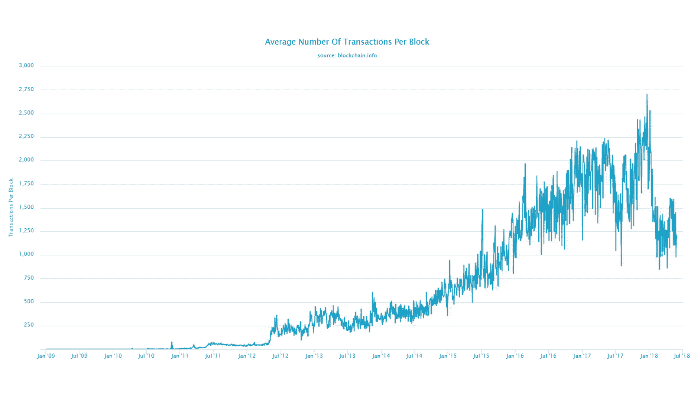

# 北京大学肖臻老师《区块链技术与应用》公开课 - P11：11-BTC-问答 - 北京大学计算机系肖臻 - BV1Vt411X7JF

这节课我们回顾一下前面几节课所学过的关于比特币的知识，以课堂提问的方式帮助大家加深一些理解，我们先说第一个问题，转账交易的时候，如果接收者不在线怎么办，就比如说你想把一些比特币转给某个人。

那个人呢当时没有连到比特币网络上，这个时候会出现什么情况，哪个同学说一下，这个应该不影响赚到这种事，如果我知道他的比特币账户继承了，然后其实跟他应该没有什么叫，除非他提这笔钱，如果只是单纯的转账的话。

我只需要知道他的地址，即使他是离线的，有没有关系，这个说的是对的，就这个时候不需要接收者在线转账交易，把我这个账户上的这些比特币转到他的账户上，他是不是当时连在比特币网络里，这个是没有关系的。

那么下一个问题，假设某个全节点收到了一个转账交易，有没有可能转账交易中接收者的这个收款地址，是这个节点以前从来没有听说过的，可能吗，可能这是可能的，就是比特币账户在创建的时候是不需要通知其他人的。

在本地产生一个公司要对就可以了，只有在以后产生的这个收款地址，第一次收到钱的时候，其他节点才知道这个账户的存在，下一个问题，如果你账户的私钥丢失了该怎么办，尽快的，因为此时需要就是泄露，其实很容易丢钱。

是应该把它尽快转移到一个比较安全账户，说的跟我问的不完全一样，我是说四要丢失了，你说的是私要泄露了，但你说的是对的，就私钥丢失之后呢，其实是没有办法，这个账户上的钱就变成了死钱，永远取不出来了。

这个跟我们平时的生活体验不太一样，像银行与银行的账户密码丢了，你可以去银行查验一下身份，然后呢进行重置密码，在去中心化的系统里，像比特币这种系统里是没有人可以给你重置密码的，这个大家一定要注意，另外。

我讲一下就有些加密货币的交易所，一般来说呢这些交易所是中心化的机构，那么在交易所开办一个账户的时候，就如果你想在某个加密货币的交易所有个自己的账户，一般也是要经过身份验证，这种情况下。

你把你的比特币保存在交易所里，那么私钥实际上是由交易所来保管的，你登录这个交易所的话，是按照登录银行差不多的程序，有一个密码，一般来说还需要二次验证，比如说用google身份验证器产生的一次性密码。

那么通过二次验证然后登录，那么这种情况下，如果你的账户密码丢失了，你是可以去跟交易所联系呃，通过身份验证之后重置密码，这个跟我们刚才讲的比特币账户的私钥丢失是很不一样，但是大家呢不要误解我的意思。

其实比特币的这些交易所，这个跟股票交易所是很不一样的，历史上曾经发生过很多次加密货币的交易所被黑了的情况，黑客从里面偷走了大量的这种加密货币，其中最著名的一个例子就是这个门头沟的例子。

大家听说过这个例子吗，这个中文翻译成门头沟，这个曾经是全世界最大的一个比特币交易所，交易量占到了全球比特币交易量的70%，他是设在日本的，后来就被黑客攻击了，丢失了大量的比特币，这个交易所后来破产了。

而且这个不是个例，就是各种加密货币交易所出现问题的情况发生过很多次，也有的是交易所监守自盗，有的工作人员管理层的卷款跑路都发生过，所以这个大家也要提高警惕，相比之下呢，下一个问题。

如果你的私钥泄露了怎么办，比如你发现你的账户上出现一些可疑的交易，这个时候该怎么办，这个其实刚才那个同学回答过了，这个呢也跟我们平时的生活体验不太一样，就如果你在银行账户上出现一些可疑的交易。

你可能首先想到的是通知银行能够能不能怎么把你的密码重置了，然后把你的账户冻结了，免得别人把你的钱取走，比特币这个账户所谓的密码是什么，就是他的私钥产生账户的时候生成的公钥和私钥，对这个是公司要对。

一旦生成之后是没有办法改的，也没有办法再改成另外一个私钥，你可以生成一个新的账户，但是原来那个账户的私钥是改不了的，那么同样的呢，你也没有办法阻止别人发布从这个账户上转账的交易。

任何有需要的人都可以发布一个转账交易，把这个账户上的钱转走，这个也是没有办法冻结的，所以你能做的只能是在第一时间抢在别人之前，把你自己账户上钱转到一个安全，的账户上，下一个问题。

如果转账的时候写错了地址该怎么办，比如说你本来想把钱转给某个人，但是你写错了，转给另外一个人，有什么办法吗，这也是这个回答也是对的，没有办法取消已经发布的交易，就没有办法取消了。

他没有提供这种机制来取消某个已经发布的交易，如果你转账转到别人的地址，如果你知道是谁的地址的话，可以跟对方联系一下，看看他愿不愿意把这个钱还给你，但这个也只能跟他商量，这个没有办法强迫。

如果你不知道是谁的地址，或者转的是一个不存在的地址，那就没有办法了，什么叫不存在的地址，就我们说这个地址是怎么，产生的是由公钥的哈希得到的，那么有些地址呢它其实不是公钥的哈希德的。

比如说我们第一节课讲的dj抽commitment的例子，这大家还记得吗，证明你曾经在某个时间知道某个事情，比如说你有某个文件，我们在几节课之前讲比特币脚本的时候，讲过一种比较经典的做法，大家还记得吗。

这个记得吗，你可以把你要发布的哈希值放在这个后面，这个后面写什么，反正是没有人管的，这个是个比较标准的做法，是推荐采用的方法，但是有的人他不这么干，他怎么干呢。

他用这个哈希值生成一个看上去像比特币地址的东西，就比如说，a转给b，这个正常情况下，b应该是某个比特币账户公要去哈希之后得到了地址，然后它这个地方呢就把它要保存的那个哈希值生成一个地址。

作为收款人的地址，这个地址是没有对应的私钥的，他其实是个假的地址，这个比特币系统并不知道你这个地址是真的还是假的，你这个哈希值是怎么来的，别人也看不出来，所以这样的转账的钱就变成了死钱了。

这个转账永远不可能被取出来，大家听明白了吗，这种做法呢一般的就是说牺牲一点比特币，比如说转很少一点钱，然后呢换取比如说0。001的比特币，这个做法是不提倡的，因为什么呢。

因为这样你这个转账交易的输出会永久地保存在utxo里面，全节点收到这样一个转账交易，他其实并不知道你这个地址是真的还是假的，他不知道你这个钱其实是花不出去的，所以他必须永久的把它保存起来。

这个对全节点是不友好的，那我们接着问一个问题啊，我们说到这个proof，说到这个of return，他们实际当中是怎么操作的，比如我们说当一个全节点收到一个转账交易的时候。

他首先要检查一下这个交易的合法性，对不对，而我们讲operation的时候，我们说过这个语句是无条件的，要返回错误，那么既然它无条件都返回错误，怎么可能通过验证，这个其实是有一个同学曾经问过我的问题。

有什么想法吗，这b门应该对operate他这个指引就是有特殊的操作，虽然它是无条件反，你说比特币里面对这个operreturn有特殊的处理，虽然它返回错误，我仍然是把这个交易写到比特币，其实不是的。

主要是因为你把这个发不出去了，然后你也没有什么你做的地方，那就是你发不出去这个区块，这个区块别的矿工验证的话就没什么问题，没什么问题就可以发过去，不管你里边是叫那个道具。

有就是会不会发生发生错误什么之类的，反正你这个只要别人能验证，这个就是一个合法，那就应该放在这，但问题就在于，只要能你说你说意思说，反正发不出去之后，不管有没有什么错误，但如果他验证过程中出现错误。

这里面有一些小的细节需要我们想清楚的，什么叫验证通过，这个动作是那个锁定脚本，先执行锁定脚本，然后没有问题啊，对认识结果解锁要拼起来再去执行啊，没有问题，如果抛出错误，怎么可能没有问题，就你们几个说的。

对于这个大的过程基本上都是对的，但其中有一个小的细节需要想清楚，验证的时候是怎么验证的，是把当前这个交易的输入脚本，跟前面那个交易那个b的来源的交易的输出脚本拼在一起，看能不能顺利执行。

这个执行过程中是不可以抛出错误的，如果抛出错误就不是合法交易，这些都没有错，关键在于这个地方是写在哪儿的，这是写在当前交易的输出脚本里的，大家听明白了吗，所以验证当前这个交易合法性的时候。

不会执行这个语句，这是一个大家要想清楚的一个细节，当前这个交易的输出脚本在验证这个交易的合法性的时候，是不会被执行的，什么时候会被执行下去，再花这笔钱啊，对有人想花这笔钱呢，后面要再有一个交易。

要花这个交易的输出的时候才会执行到这个交易的输出，交的，大家听明白了吗，是不是合法的时候，这个语句根本不会执行到，下一个问题，下面这个问题也是有一个同学问过我的，就我们讲挖矿嘛，比特币挖矿是在干嘛。

就是在尝试大量的n看看有没有哪个nice是符合难度要求的，那么会不会有的矿工偷答案，就比如说他自己没有找到合适的nice，其他矿工呢发布了一个n，他收到这个区块之后呢，查一下这个nice是符合要求的。

然后就把它作为自己找到的nice发布出去，就你怎么知道是哪个矿工最先找到的这个男，那个口，你能说得具体一点吗，这是他们该注意点，因为太厚了，还有把他改，这个说的是对的，大家听明白了吗。

就是发布的区块里有一个，coin base transaction里面有一个收款人地址，是这个挖到矿的矿工的地址，比如说a如果挖到了矿，那么这就是a的收款地址，如果你要偷答案的话。

那么要把这个收款地址换成你自己的地址对吧，而你这个地址如果一变的话，那么这个coin base traction的内容就发生了改变，这样会导致什么，就会出现，导致这个motree的根哈希值会变化。

没构锤的任何一个地方发生改变，就跟哈希句就会变，而这个nice是在哪儿的，在快手里面跟哈希值也是在快手里面block header的内容发生了变化之后，原来找到的nice就作废了，所以不可能偷答案。

因为每个矿工挖到的这个nice是和他自己的收款地址绑定在一起的，下一个问题就我们前面说过呢，交易费可以看作是发布一个交易的时候给矿工的一点小费，那么你怎么知道这个交易费该给哪个矿工。

就事先你怎么知道哪个矿工会挖到矿，时间不之前不知道，但是我会把交易费钱出去，会给多少，交易费，完了之后，哪个矿工能力对于我来说，我不需要知道，你这个说的很清楚，大家听明白了吗。

就事先不需要知道哪个矿工会得到这个交易费，交易费是怎么算的，只要total input大于total output，这个差额就是交易费，就你发布的交易的里面，一个交易可以有很多个输入。

也可以有很多个输出，总收入减去总输出，它的差额就是交易费给谁，不需要事先知道哪个矿工挖到矿了，所以他自己的交易费，好下面我们看一下比特币上面的一些统计数据，好我们看一下比特币的一些统计数据。

size不断增大，这个其实也不奇怪，只能往里面填东西，它的size就越来越大，目前这个size呢对于当前这个硬盘的容量来说还是完全没有问题的，这个是utxo这个集合的大小。

这个集合也是总的趋势是不断变大的，有一些波动，这个主要原因就是比特币上面这个交易多了之后，ut so的集合会跟着一起变大，所以呢这些账户对应的这些输出在ut里就要永久的保存下去，那么时间长了之后。

这种情况累积下来也会变多一点，这个是比特币矿池挖矿的情况，我们可以看到这个挖矿集中化的趋势也是很严重，所谓的叫manning centralization，几个大的矿池加上系统中总算力的很大一部分。

这个是比特币的价格变化情况，这个我们在第一节课的时候给大家看过这个图，这个是比特币的市值的变化情况，跟刚才那个价格的变化基本上是一样的，这个市值是绝对的市值呃，不是说在加密货币整体中占的百分比。

这个是比特币的交易量，这个大家看有一个什么样的趋势，最后这2年交易量窜得很厉害，而且波动非常大，它这个交易量是按照美元价格算出来的交易量，所以这个波动当中有一部分是比特币本身的价格波动造成的。

这个是每天的交易数目，总的趋势也是不断增长到这个今年年初的时候，比特币的价格掉下来了，他交易数目也掉下来了，这个是每个区块的交易数量，大家看看这个曲线的形状，跟我们前面这个曲线，是不是很接近。

看着很像对吧，这两个曲线这个不是偶然的，因为每天产生的区块数目是差不多的，这个难度调整算法要把出块时间稳定在十分钟，那么这样的话每天能产生多少个区块，就是差不多的，那么交易数目的变化。

我们看一下这个交易数目，我们以前算过一个理论上的上限，哪个区块有多少个交易，大家还记得吗，差不多4000个，按照一照的字节来算的话，差不多4000个，现在这个情况是远远没有达到这个上限。

这条线是1500个吗，所以有很多人说这个遗照的上限太小了，但是另外一方面呢。

实际上很多区块是没有装满的，大家看看还有问题吗。