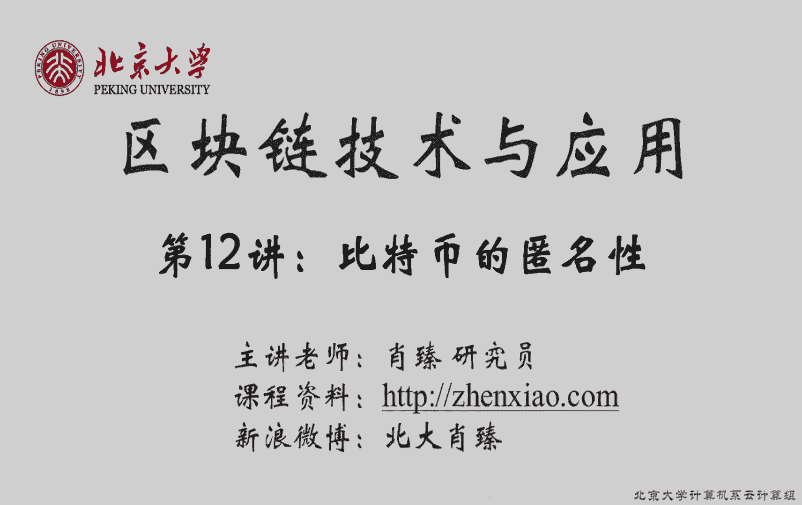
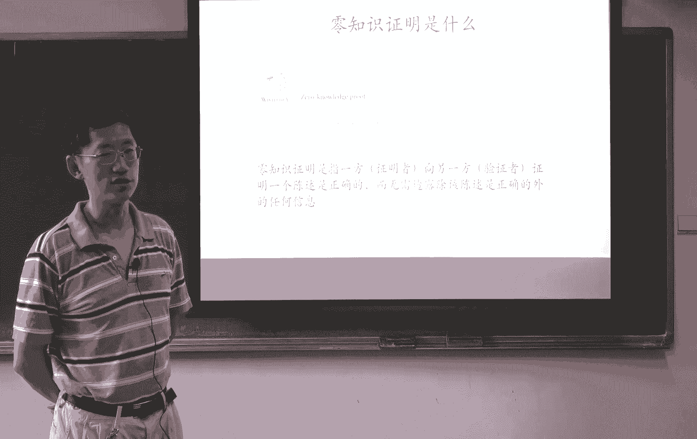
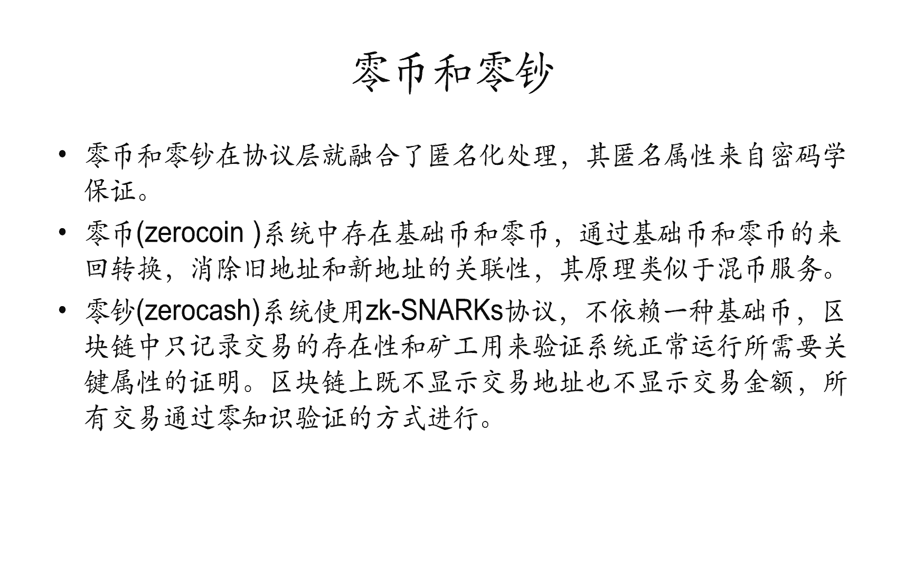

# 北京大学肖臻老师《区块链技术与应用》公开课 - P12：12-BTC-匿名性 - 北京大学计算机系肖臻 - BV1Vt411X7JF

好今天我们讲一下比特币中的匿名性，比特币是匿名的吗，同学们觉得呢就匿名性是怎么定义的，什么叫匿名，一般来说呢大家认为匿名是跟隐私保护联系在一起的，就跟privacy联系的，那么对于大多数人来说呢。

这个privacy的意思是你干的事情不希望让别人知道，比特币中呢不要求用真名呃，可以用公钥产生的地址，所以从这一点上来说呢，它有一定的匿名性，就你可以产生任意多个地址，然后用不同的地址干不同的事情。

但是呢他不是说完全没有名字呃，就是他用的十个化名，所以有人呢认为他用的这种叫做修多limit，大家知道北大最著名的景点是什么，你们觉得是什么，未名湖对吧，未名湖叫什么，i name的。

那就真正是没有名字的湖叫未名湖，这个不叫anonymous，那不是说匿名的糊，所以说比特币中的匿名，它不是一种真的匿名，它是一种假的匿名，就好像很多作家写作的时候有笔名，那么有些人在网上发帖子的时候。

用各种各样的网名，那么这是一样的，那么这个匿名性大概有多好呢，就它能给我们提供什么样的隐私保护呢，比如说跟法币相比，跟美元相比怎么样，跟现金相比呢，比如说跟我们手里的现金相比，它的匿名性没有现金好。

这个是完全匿名的，上面没有任何关于这个人的任何信息，假名都没有，所以很多非法交易用大额现金，那么用现金的问题就在于它不是很容易保管和运输，那么跟银行存款相比呢。

大家觉得比特币的匿名性跟银行存款相比哪个好，你认为比特币好一点，为什么你可以自己注册，或者说新建一个账，或者说和你这个人的身份证电话上的一些绑定，但是银行账户就说，因为你到银行账户的话是实名制。

你得要提交你的一些身份的信息，然后才能注册一个银行账户，而比特币的话不需要，所以从这一点上说，它的匿名性比比特币要好，其实国内的银行以前不是要求实名制度，就可以用化名的，就以前我上大学的时候。

你去银行存款，你可以编一个名字，然后将来你取钱的时候就拿这个存折去取水，有存折就可以把钱取出来，他以前是可以用化名的，这个实际上持续了很长一段时间，到我上大学的时候都可以用化名，有的有的同学听了很惊讶。

后来改成了实名制，如果银行用化名的话，隐私性匿名性跟比特币相比哪个好，哈哈哈哈，哈哈哈哈，你认为还是比特币，为什么比特币只是在网上做这事，如果你赢了，就前面说的，你还得拿孙女和去赢。

你本人还得就是谁用这个钱，就是谁就拿孙女去干那个事儿，你说因为比特币是在网上交易的，银行的话呢，你就算是化名，你取钱的时候，你还得人去取，这个其实牵扯到一个很重要的问题，比特币如果把钱要取出来怎么办。

你在网上做交易，这个没有问题，但是网上那些交易最终是要跟实体世界发生联系的，比如说你要网上买个东西，那个商家得把东西发给你，你要用比特币换成法币，换成美元，你还是得有办法把钱取出来，从某种意义上说。

如果银行允许用化名的话，它的匿名性比比特币要好，为什么呢，所有人都能查的，而银行的账本呢是受控制的，银行里面工作人员可以查得到，然后有一些司法手段可以调取银行的信息，但是普通老百姓你说要查一下别人的账。

你是查不到的，所以他这方面控制的比比特币要好，比特币是完全公开的，把整个信息都下载下来，大家听明白了吗，那好我们再说一下比特币当中什么情况下有可能破坏你明星，从表面上看，就很多第一次接触比特币的人。

都觉得比特币的匿名性非常好，我需要用到账户，我生成一个公司要对，然后下次我再需要生成一个账户，我再这么干一次，有的人实际上推荐你每次收款的时候都用一个新的地址，这样的话你有各种各样不同的地址。

谁也不知道哪些是属于你的，这好像性明显很强，但是实际上有很有很多情况下，你创造的这些不同的地址是可以被关联在一起的，大家想想为什么，我们以前讲的哪些操作是可以让你把不同的地址关联在一起的，比如网上购物。

比特币交易允许有多个输入和多个输出，对不对，比如你想去买东西，比如这个交易的input，可能有两个账户，一个是第一个地址中来的，然后是第二个地址来的，output也可以有两个，比如说第三个地址。

这是第四个地址，他能告诉我们什么，这个address一跟address 2很有可能是同一个人的，因为这个人同时控制这两个账户的私钥，对不对，为什么会出现多个输，因为你要买的那个东西一般很难。

恰好是你某一个账户的全部的值，所以它会有多个输，也会有多个输出，就这两个地址中有一个很可能是个找零钱的地址，就你网上买个东西，那个东西花的钱剩下来不分钱，你转给你的一个新地址，也是为了隐私保护。

那有没有可能把输入地址和输出地址也关联起来呢，就我们刚才讲的是说的，这些输入的地址有n个，我们可以认为它都是属于同一个人的，因为都受同一个人控制，输出地址当中呢一般也会有一个找零钱的地址。

那么有没有可能我们把这个找零钱的地址也找到，好像有一点难度是吧，因为你有两个地址，你哪个知道是找零钱的，就比特币生成这个交易的时候，并没有规定找零钱的地址在output当中出现的位置。

就不是说他一定要出现在第一个输出或者是最后一个输出，但是其实有些情况下呢，你可以把它分析出来，比如说我们看到具体的例子，比如说第一个地址账户上呢有四个比特币，第二个地址账户上呢有五个比特币。

产生了两个输出，第一个输出转入了六个比特币，第二个输出转入了三个比特币，这个六写得不太好，那么这时候你们觉得哪个是找零的地址，这个是找零的地址，这为什么，如果你是一四转账的话，那你根本没必要用两个数字。

直接一个因数是四或者五就可以搞定，大家听明白了吗，如果这个是商家的地址，我干嘛要用两个input，实际上一个就够了，所以通过这种方法，我们也可以把输入地址跟输出地址也关联起来，那么从理论上说。

如果你要想更强的隐私保护，你可以怎么办，你可以人为地产生一些没必要的输出，就为了迷惑敌人，现在很少有人手工生成这些比特币的转账交易，大家有问题吗，好这是我们讲的有可能破坏比特币匿名性的第一个方面。

就是这个人可以生成很多的地址账户，但是这些地址账户是有可能被关联起来的，第二个方面是，这个地址账户跟你在社会现实世界中的真实身份也可能产生关联，什么时候会有这样的关联，就什么情况下。

别人有可能知道这个比特币账户对应着现实生活中的某个人呢，你们觉得呢，任何让这个比特币系统中的这个比特币，这个虚拟货币跟实体世界发生联系的时候，都有可能泄露身份，跟实体世界从来不发生任何联系。

这个是没有问题的，一旦跟实体世界发生联系，就可能泄露你的真实身份，这里面其中一个最明显的是什么，是资金的转入和转出，我们大家平时是没有比特币的对吧，你怎么得到你的比特币，你说你用钱去买，大家听明白了吗。

就是你可以去交易所买，那么交易所的话你要登记注册，它一般是要有你的身份信息的，两个人私下不经过交易所哎，对两个人私下交易，比如说你有比特币了，然后呢这个同学想要买他呢，底下把钱给你，你把比特币给他。

比如哪个公园旁边距离一大堆人，我不但这个也会泄露你的身份，那么过去的经验表明呢，盯住这个资金的转入转出链其实是一个常用的手段，就如果你有特别大的资金，你要转入到比特链比特币里面，或者是你有很多的比特币。

你想转回成法币，实际是很难的，就资金的转入转，出，还要什么时候，用比特币做支付的时候，就如果是实体世界中，你用比特币做支付，比如说国外有的商家是接受比特币支付的，你去一个咖啡店。

你买一杯咖啡可以用比特币支付，有的餐馆你去吃饭可以用比特币支付，这当然了，我个人觉得这是一个白的idea，大家想想这为什么是个白的idea，隔壁支付对啊，他就可以信用卡支付，信用卡可以支付。

比特币也可以支付，有的商家他是接受这种比特币支付，低延迟很大对吧，你要真的等六个确认的话，你得等多长时间，等一个小时，第二什么交易费也很贵，就传达省份，你一杯靠费才多少钱。

你那个交易费可能跟咖啡本身差不多贵了，就这是个白的idea，但不论怎么说，国外确实有收比特币的，那么收比特币这个时候就会引起隐私泄露，就是你用于支付的这个账户跟你的真实身份是建立的联系，而我们前面讲过。

这个账户可能跟你比特币的其他账户之间也是有联系的，所以合在一起就很容易把这个人的很多情况都给摸清楚，其他人其实也会知道，我讲以前的一个例子，以前曾经有一家信用卡公司，他为了支持这种学术界的科研。

把他的一些他收集到的一些信用卡的交易记录给公开了，当你公开的时候呢，他做一些隐私保护，就是信用卡的号码都是取了哈，希值的，你没有办法反推出信用卡号码是什么，然后个人信息向姓名性别年龄这些信息都给抹掉了。

信用卡号码不能完全抹掉，因为他这个目的是为了科研中，只要你要研究各种不同的社会群体，或者是根据这个人过去的消费行为推测他将来的消费，所以你这个你要有办法让这个研究人员把同一个人的不同的信用卡。

刷卡记录要关联在一起，所以呢信用卡号码不能完全不要它取一个哈，希只要你知道哪些交易是同一个人做的，但是你不知道这个人具体的信息是什么，好他发布这些信用卡交易记录，为了科研目的，结果就真的有人做一个科研。

这个科研其实不是研究信用卡的消费行为，而是研究怎么通过这些公开的数据能够推测出这个人实际上是谁，他证明你这种方法是不行的，你们想想为什么，比如说我想知道你是谁，我是你的邻居。

然后呢去咱们那个labour hood旁边的一个grocery stor买菜的时候，你排在我前面，我看到你刷个卡，但我不可能看到你的信用卡号码，我也不知道它的哈希值是多少，但我知道在今天的这个时候。

你在这个gros store买的东西，有一个消费记录，这个能有什么用，就在公布的这些那么多的消费记录当中，我可以过滤到很多，只留下那些在我这个时刻在这个国store买过东西的一些消费记录。

然后呢过一段时间，比如说我们去pharmacy去买一些prescription药的时候，医生开的处方药，你去领药的时候也是要交钱的，有cpayment啊，我又看到了，你在这个时候去做一个copment。

然后我再查一下有哪些信用卡号码的哈，希值在这个时间去去过pharmacy，那么你这样过滤几次之后呢，那个研究就发现用不了多少次，很快就能够精准定位出哪个哈，希值是对应的是你，大家听明白了吗。

比特币为什么讲这个例子，比特币有什么特点，就是对信用卡来说，有这个研究结果告诉我们什么，信用卡记录不能公开，你采取匿名化措施，你取哈希之后仍然是不应该公开的，但是比特币这个交易记录它不是可以保密的。

它都是公开的，所以你去咖啡店，你去喝咖啡店的操作，你把你这个比特币账户告诉我，比如说对方的营业员，不光是那个人知道你的这个账户了，你周围其他的人如果有认识你的。

也都会意识到你在这个时候在比特币网上做一笔消费，在这个时候在这个咖啡店进行了消费，然后就可以推算出哪些账户有可能是你的，这么干一两次之后，你下次再去买披萨，游泳，比特币去买，很快就能知道哪些账户是你的。

这也是破坏匿名性的一种方法，就大家听明白了，一个是不同的账户之间可以进行关联，另外一个就是你的账户跟你的实体世界中的真实身份也可以建立关联，所以比特币的匿名性并不是绝对的，没有想象中的那么好。

那么实际当中怎么样呢，实际当中那些用比特币的人，他们的匿名性保持得有多好，保持得最好的是谁，所有用比特币用户的年终一名性保持得最好的是谁，之间的一个政府没有发生的交易，你说建立一个账户。

没有发生过交易的人，仅仅明星保持最好，这个回答是对的，但是这个人算不算真正意义上的比特币用户，值得探讨，有一个人参与比特币的时间最长，全世界都想知道他是谁，但到现在也没有人知道他是谁。

他的匿名性保持得最好，他女明星为什么保持这么好，找我打篮球，跟他根本没有花钱，早期的时候他为了宣传推广比特币，其实还是花了很大的功夫的，他在各论坛forum上去去说这个事情，有人说是为了钱。

因为早期比特币挖矿非常容易，他用他自己的笔记本电脑都可以挖矿，据说是囤积了大量的比特币，现在的话可能价值有几百个亿，所以有人说他发明这个比特币可以赚一笔，其实呢的那些比特币到现在也没有花出去。

为什么如果一旦花出去怎么样，你就要跟现实世界中的银行啊，交易所发生联系，因为你要把比特币换成法币，比如说换成日元，就现在大家普遍认为这是个日本人，因为他名字是个日本人的名字，那这就会暴露他的真实身份。

他宁愿这些比特币一个都不花，他也不愿意暴露自己的真实身份，所以呢他干这件事情应该说不是为了钱，可能是为了某种信念，为某种事业，再举一个例子，就以前呢曾经有一个叫湿度的网站，大家注意啊。

这个思路跟咱们国家说的思路基金没有任何关系，他这个是个非法的网站，就有人管它叫做，100佛一的狗转了，就它像ebay一样有一个这个网上交易平台。

而且呢它也像ebay一样有一套reputation system，就你在网上进行交易之后，这个商家的诚信怎么样，可以打分，它都有一整套的，有各种各样的非法的物品，他支付手段用的就是比特币。

然后呢底下这个网络层用的是洋葱路由，就叫做拓，然后他在美国还用一种一些匿名的邮寄的服务，anonymous smell，最后怎么样呢，运行了大概23年就被政府给查封了，他的幕后老板在旧金山被捕。

被抓起来了，更重要的一点是，这个人呢靠经营这个网站赚了很多比特币，就他被抓的时候，美国政府没收了十几万个比特币，这个在当时大概是价值几千万美元，所以这个人是很有钱的，但是它只是在纸面上很有钱。

他在旧金山过的是非常简朴的生活，就住在一个一室一厅的公寓里面，根本看不出有限转的这个比特币，十几万个，一个都没有画，为什么林一滑就暴露身份吗，所以他一个都不敢花，即使这样，最后还是被抓起来了。

具体抓的原因就具体抓的这个为什么，这是怎么发现的，这个细节没有公开，据说是这个人有几次是不小心用同一台电脑登录，它在真实世界中的某个账号和它的这个非法网站上的某个账号，这个网站被查封之后呢。

过一段时间有人又开了第二版的思路，这个叫super road to，也是运行没几年也被查封了，还有一些类似的网上黑店，最后下场都不好，这个时间告诉我们什么，比特币的匿名性没有我们想象中的好。

尤其是如果你想用它来干坏事，就过去的经验表明，凡是用比特币从事违法活动的，最后都能被抓起来，实际上是属于个例，就并不是一个常态，而且他没有干坏事，另外其实还有很重要的一点。

这个比特币这个项目走上正轨之后，就大家听不到他的声音，早期的时候他花了很多功夫，走上正轨之后，他就功成身退了，这也是他到现在都没有泄露身份的一个原因，就他干那个事情，不但不是为了钱，而且也不是为了明。

他如果现在站出来的话，应该是很有名的，他也不愿意出头露面，你要如果是从事非法交易的话，你没法留那么消失，你得保持经营，所以回到我们一开始问的那个问题，比特币的匿名性有多好，匿名是跟隐私保互相关联的。

就我干的事情，这个不想暴露真实身份，害得有identity，但这个问题就在于呢，你不想向谁暴露身份，如果你就是个普通老百姓，你不想让你的周围的同事亲戚朋友知道你有多少比特币，你有多少钱。

你说这是我的隐私，我账户上多少钱，我也不想让周围的人知道，这个是比较容易实现的，就比特币现有的机制在这种程度上保护你的隐私是比较容易的，如果是非法组织从事那种黑市活动，像那个哥们儿开丝路，那个哥们儿。

美国联邦调查局想要抓他，这个时候要保持隐私就难很难的很多了，所以我们这种要有一种reasonable expectation，那我们说一些技术问题，就假设你是一个比特币用户，你能采取什么样的方法。

尽量地提高你的匿名性，哈哈，我们前文说过，比特币协议实际上是运行在应用层的底层是什么，是个p to p的over the network，所以要提高匿名性，要从两个方面入手，网络层怎么提高匿名性。

你去网吧，你用网名发一个帖子，别人有没有办法知道你是谁，去网吧，去网吧喜欢的也是明日，如果知道你网吧的ip地址填的什么时候发的，然后再去网吧查一个事，你可以称知道是谁干的，大家听明白了吗。

你去网吧你得有身份证对吧，它会登记，所以呢查一下你的ip地址，就能知道实际上是谁做的，就ip地址跟现实社会当中的真实身份是有很强关联性的，所以你比特币要实现这个匿名性，首先要实现在网络层的匿名性。

对比特币来说，这实际上说的是什么，你比特币交易发布到这个网络上的时候，如果不保证网络层的匿名性，那么很多节点如果发现这个交易都是从同一个节点发出来的，那么从这个节点的ip地址就可以推算出在物理世界中。

他的真实身份是什么，好在呢网络层的匿名性是比较好解决的，就是在这个以前的研究当中，已经有很多的这个方法了，但是网络层的匿名性，学术界已经有了很好的解决方案，那么比较普遍的就是用一种叫做多路径转发的方法。

像我们前面讲那个洋葱路由，就这个拓，就是这个原理，这怎么才能让大家不知道这个消息是谁发出来的，这个消息不是由三的直接发给receiver，而是中间要经过很多跳。

就application这个level要经过很多次转发，中间的每一个节点只知道他的上一个节点是谁，但是并不知道最早发出这个消息的人是谁，当然了，中间这些节点当中有一些可能是坏的，可能是cp买的。

但是只要这个路径上有一个节点是诚实的，就能够把这个最初发现人的身份给隐藏起来，这是洋葱路由的一个基本的思想，好那我们下面说application内容application，那要怎么实现匿名性。

我们前面讲破坏匿明星的一个原因是什么，同一个人的各个不同的比特币账户之间会被关联起来，你花的每一个币都可以追溯到它的源头，从这个币最早是由哪个铸币交易中产生的。

然后这个b产生的参加的每一次交易都可以追溯过来，所以呢要起到匿名保护的作用，一种做法就是罢了，各个不同的人的b混在一起叫call me mixing，就是在其他所有的领域需要达到匿名性的领域。

这都是个常用的做法，就是把你的身份跟周围的人混在一起，让人分不清楚谁是谁，就call me mixing，让人分不清楚这些b是从哪来的，那么怎么做到call and mixing呢。

有一些专门做coon mixing的网站，就他提供这种服务，收取一定的服务费，那么所有想做call me mixing的人呢，把这个b发给这些网站，它内部进行一些重组，然后你再把这个b取回来。

那么你取回来的b一般来说就不是你当初发到这个网站上的币，它是随机抽取一些笔给你，这个coin max的话，真正实施前有一定的复杂性，就如果你设计不好的话，可能有一些side channel。

比如根据你当初存进去b的数额，能够推断出来哪些b实际上是你存进去的，还有更重要的一点是什么，没有什么信誉度非常高的，com mixing的服务，就很多，这种call me mixing的服务。

它本身也是要保持匿名的，那么他一匿名造成的结果是什么，如果这个投进去的这些币被他卷款跑路了，你实际上是一点办法都没有，我们前面讲这个比特币的交易所，然后讲那些东西，我们也讲过，法律是鞭长莫及的。

交易所经常会出事，像那个门头沟的事件，也有些交易所卷币跑路的，那么commix service也是一样的，那么还有一种做法是什么，就是我们的不一定要特意的去做call on mixing，有一些应用。

这些应用本身带有call me mixing的性质，就比如说在线情报，那么他就有可能把这些人的币给混起来，然后你将来从这，可能就不是你当初存进去的币，这个应用就有可能带有这种commix的效果。

还有一个是什么，交易所就这种加密货币的交易所，一般来说它是有一种天然的call me mixing的性质，大家想想为什么，比如说我有一些比特币，我把它上传到一个交易所存在里面，过一段时间呢。

我觉得比特币的价格会下跌，我就把它卖出去，换成美元，或者换成u s d t，然后又过一段时间呢，我可能买入以太币，然后呢我有可能把它换成莱特币，那么折腾几次之后呢，我可能又把它再买回比特币。

然后我可以把它提笔提出来，存在我的本地，那么这个时候我存在本地的这些比特币，一般来说就不是我当初存进去的比特币了，你想想是不是因为我纯净的那些比特币我已经卖掉了，你不知道他可能已经被。

所以这个本身带有一定的call mixing的性质，当然这个前提是什么，前提是这个交易所不会泄露相关的记录，就相关的提币存币这种转换的记录，否则的话这个整个过程暴露出去也是不行的。

这是我们说的这个应用层，这为什么保护隐私性难度挺大，而且是什么是不可篡改的，其实这种不可篡改性对于隐私保护来说是灾难性的，因为一旦你某一个交易不小心把你的身份暴露出去，一想抹都抹不掉了。

这也是为什么我们说对账户之间的关联性是要小心的，如果每个账户都是单独使用的，这个影响还是比较有限的，如果都串在一起，能够关联在一起的话，那么一个账户暴露出去，后面就都晚了，大家有问题吗，没有问题。

我们下面讲一下零知识证明，那么这部分内容我们会用一下p p t，好我们想一下零知识证明，零知识证明是指的一方，这个证明者向另一方验证者证明一个乘数是正确的，而无需透露除了该陈述是正确的之外的任何信息。

大家能明白吗，你们能想到某个灵芝是证明的例子吗，就是我们以前讲的那些比特币的相关内容当中，有哪些可以认为是零知识证明的。

比如说我说某一个比特币账户是我的，我要证明这一点，怎么证明，如果这个比特币账户是我的，说明什么，说明我应该知道他的私钥对吧，所以实际上是要证明我知道他的私钥，但是我不能把私要告诉你，这显然的。

所以我要向你证明我知道私要，但我又不能把私要告诉你怎么办，签名就我可以产生一个用这个私钥进行的签名，假设你是知道这个账户的公钥的，那么你可以验证一下这个签名的正确性，那么，这个例子当中这个证明者是谁。

是我对吧，验证者呢是你证明这个陈述是什么，我知道这个账户的私钥，但是我没有把这个私钥透露给你，大家注意一点啊，就我举的这个例子算不算是灵芝，是证明其实是有争议的，就这个证明过程中，我没有把私钥泄露给你。

但是我泄露了用这个私药产生的一个签名，对不对，这个跟零知识证明中的要求无需透露，除了该乘数是正确之外的任何信息还是有一定差距的，所以这个算不算零时零知识证明其实有一定争议。

这个其实在实际当中要看你的应用场景，就你透露的这些额外信息有没有问题，要看你的应用场景，大家明白这个零知识证明的意思了吧，我们讲一下同态隐藏，零知识证明的数学基础是同态隐藏。

大家看一下同态隐藏的三个性质，第一个性质说的是什么，说的是这个加密函数值，这个e不会出现碰撞，就这个跟我们说的哈希函数不一样，哈希函数有可能有哈希碰撞，这个是不会出现碰撞的，如果这个输入是不相等的。

x y不等于y，那么一算出来的加密值ex跟y也是不等的，那么这个性质反过来说明什么，你说es跟e y不等的话，跟y是不等的，这个反过来说明什么，说明如果两个加密函数值是相等的。

那么它原来的输入也是相等的，大家听明白吗，这是它的逆否命题，就如果e跟e y是相等的，说明s跟y一定也得是相等的，第二个性质说明什么，说明那个加密函数是不可逆的。

你知道这个加密的值没有办法推出原来的输入的值，我们第一节课讲那个密码学当中的哈希函数的时候，那个性质跟这个是类似的，大家还记得这个性质叫什么吗，叫hiding property。

从这个哈希值没有办法知道原来的输入值，那么这个也是类似，第三个是最重要的，这个叫同同态运算，他说的是什么，他说的是对这些加密之后的函数值进行某些代数运算，等价于对这些输入直接进行代数运算，然后再加密。

比如说第一个同态加法，加密值的和就等于和的加密，或者说它不一定非要相等，它可以通过这种和的加密能够算出来，那么同代乘法也是类似的，在加密后的函数值的乘积等于乘积之后再加密，那么我们有了这两个性质。

同态加法和同态乘法就可以把它扩展到这个多项式上，下面我们看一个例子，这个例子当中的证明者是谁，是阿里对吧，验证者呢是报要证明的陈述是什么，alex知道两个数x和y x加y等于七，需要隐藏的是什么。

x和y的具体数值，大家想想怎么挣，给出来ex和ky的嗯，然后这个boss的求助x加y的值，然后把前面的ex点进来，爱丽丝给出的颜值意外加起来和他x加y等于七的这个在进行一个，但结果是我想大家听明白了吗。

alex呢把ex和e y的值发给bob，然后bob可以通过这两个值算出ex加y的值，然后再算一下e7 的值，如果这两个相等，说明验证就通过，这个证明的方法为什么满足我们前面说的要求。

x给出了ex的基本都是女子意外反推出来，这是哪个性质，这是第二个性质，不可逆的性质，alex给出e x e y boss没有办法知道x和y的值，你接着说，所以他就满足了。

就是说没有给出x和y满足了这个条件，而对另外两个性质在哪用呢，另外一辆车嗯，这就是凌晨证明的，第一不是我说同态运算的另外两个性质在哪用啊，一个式子加了在加了在加了，就是同态加法的性质是在这用的。

就是bob可以通过e和e y算出ex加y的值是是是，然后呢第一个性质又没用到，第一个性质是没有碰撞，就ex加y等于e7 说明什么，说明x加y一定等于七，为什么，因为没有碰撞。

就我们前面讲的逆否命题没有碰撞，说明s跟y不等，e s跟e y一定不等，反过来说，如果这两个是相等的，那么两个输入也一定相等，这是一个最简单的证明的例子，这个例子其实有一些缺陷，就这是个比较简单的版本。

bob可以用蛮力算法去拆除原始的x和y是多少，就是bob虽然从这个ex没有办法知道x是多少，但是它可以便利x的各种取值，用蛮力算法去一个一个比，看哪个恰好跟ex相等，所以呢在更复杂的这种解法当中呢。

alex在书把书送给bob之前，要对这个x和y的值做一些随机化处理，这随机化处理的方法是保证s和y加起来还是不变的，盲猜这是个很有意思的时候，大家还记得吗，我们第一节课讲那个比特币共识的。

第一节课的时候，我在讲比特币的共识协议之前，举过两个简单的共识协议的例子，我们先不考虑去中心化的问题，他发布一个100块钱呢，发布一个50块钱，我支付的时候就把这个带签名的这个货币直接给你就行了。

我们说那个方法是不行的，还记得原因是什么吗，因为容易被复制，因为他没有办法防范double spending a tag，然后我们又说了第二个方案是什么来着，但是每一张钱在谁手上做了一个账户的话。

做了一个维护的数据处理，就每一个数字货币有一个编号，就跟人民币有编号一样，数字货币也得有个编号，我是应该是在谁手里的，这样可以检测double spending，就是我们当时讲的第二方案。

第二个方案有个什么问题，但一个问题就是它是中心化的方案，还有一个问题就是跟我们今天讲的隐私保护相比，the删除bank都the everything，那么有没有什么办法，double spending。

又不让他知道呢，大家听明白这个需求了吗，改成水产生的，改成我产生的，什么币样币，然后呢我要取一个央壁出来，这个每个b也得是有一个编号，我自己在本地产生一个编号，这个编号不能告诉央号。

我们前面那个方案说是我花钱的时候，我把钱给你，你可以用公钥验证你整个这个b的正确性，那这个编号怎么保证是正真的不会被篡改掉，进入到盲前，这个用户提供这个编号，这个序号银行是要签名的。

但是银行签名的时候看不到这个序号的内容，返回这个token，这个token就是银行对这个序号的一个签名，同时减少a的存款，比如说我取了一个b，他把我的钱就会减少一个单位。

然后用户a给b进行转账交易的时候，把这个序号的内容，这个时候是铭文，就b这个人是知道这个编号的具体内容的，然后b呢要把这个序号和这个签名给银行验证，这个时候这个序号也是明文，也是告诉银行的。

这个验证的目的是什么，double spending，对不对，就银行要记录一下这个序号的币是不是被花过，他要维护一个数据库，然后验证，比如说没有花过，验证通过之后增加这个币的存款，这样设计的目的是什么。

他不知道b的这个b b的这个coin是从哪来的，因为当初银行把这个钱给a的时，候，把这个虚拟货币给a的时候，这个编号是a自己产生的，而且没有告诉银行，所以银行只知道我给你一个币是哪个编号的币，我不知道。

然后你拿着这个币去给别人花的时候，别人说来问我验证有一个编号的b，我没有办法知道你的币是从哪来的，大家听明白了吗，这里面用到一些crypal magic，其实原理并不复杂，如果大家真想学的话。

这个盲钱的原理并不复杂，在不知道具体内容的情况下，还要对他签名，最后我们讲一下零币和灵超这个motivation是什么，我们说比特币在一定程度上或者说在很大程度上提供了匿名性，就sudo limit。

但是它不能够完全消除关联性，就管它叫林可比雷特，那么我们能不能设计一种新的加密货币，这个加密货币从一开始这个体系结构设计上就用了密码学的原理，保证匿名性了，这就是0b和灵超的这个motivation。

专门为了匿名性设计的加密货币。

这个灵力呢是存在一种基础b bass cn，比如说这个基础币可以是比特币，还有这个0b zero com，你用的时候，你要证明你本来是有一个基础币的，你把这个基础币搞的是不能花了，就安spable。

然后换取一个零币，然后灵力在花的时候只需要证明，用零知识证明证明你花掉的b是系统中存在的某一个合法的b就行了，但是不用透露你花的具体是系统中的哪一个b，听明白了吗，这个是跟比特币的一个本质区别。

比特币是怎么样的，每一笔转账交易都要说明b的来源，你这个交易中花掉的币是过去的哪个交易中产生的，这样才能够保证你花掉的b的真实性，不是凭空捏造出来的，但是0b和灵超是不一样的。

零币和灵超是说你证明的时候，从数学上可以保证，但是不知道具体是哪一个，这样的话就把这些关联性给破坏掉了，你没法追溯了，这个零钞呢根本就没有基础弊，就完全这种就是那种zero co。

这个0d和零超怎么实现的，我们在课上就不详细讲了，这里面的数学原理是很复杂的，这个如果要讲的话，涉及到比较深的密码学数学方面的知识，大家有兴趣的话，可以看一下参考的一些文献，另外一个原因。

为什么我不在课上讲，就是这些专门为匿名性设计的新的加密货币，到现在也不是很主流，我像那个零超这个zero cash，有的交易所上是可以买得到的，但是也不是很常用，就这些都不是主流的加密货币，为什么呢。

一方面是说这些加密货币为的匿名性是付出了一定代价的，它在性能上是有一定的损失的，而且他对数学原理上对初始化有比较严格的要求，就初始的时候用的随机源要能够销毁掉，如果没有很好的销毁掉的话。

那么会有一定的安全漏洞，还有一个更重要的原因是什么，可能需要强匿名性的用户本来也不是很多，就可能大多数用户觉得比特币的这种匿名性其实也够用了，反正我也不干什么坏事，有比特币这个匿名就够了。

就他就不愿意为了有更强的匿名性，再去用一种新的加密货币，还有一个什么原因，就虽然这个灵币和人凌超在数学原理上提供了很强的匿名性，就刚才我们讲这个基本的运行过程，但是它真的就是百分之百匿名安全的吗。

我们前面讲过影响匿名性的因素，有没有哪个因素它仍然没有解决掉，交易对与尸体发生交互的时候，比如说真的有人想用这些币去干坏事，你把很大的金额转换成这种加密货币的时候，或者是把这些加密货币转换成现金的时候。

仍然要暴露身份，你这些加密货币数学上设计的再好，它进行转账有匿名性，他跟外面交互，这个匿名性仍然是一个它的弱点，所以从这个意义上说，它仍然没有提供百分之百的利率，同学们有问题吗，好没有问题的话。

