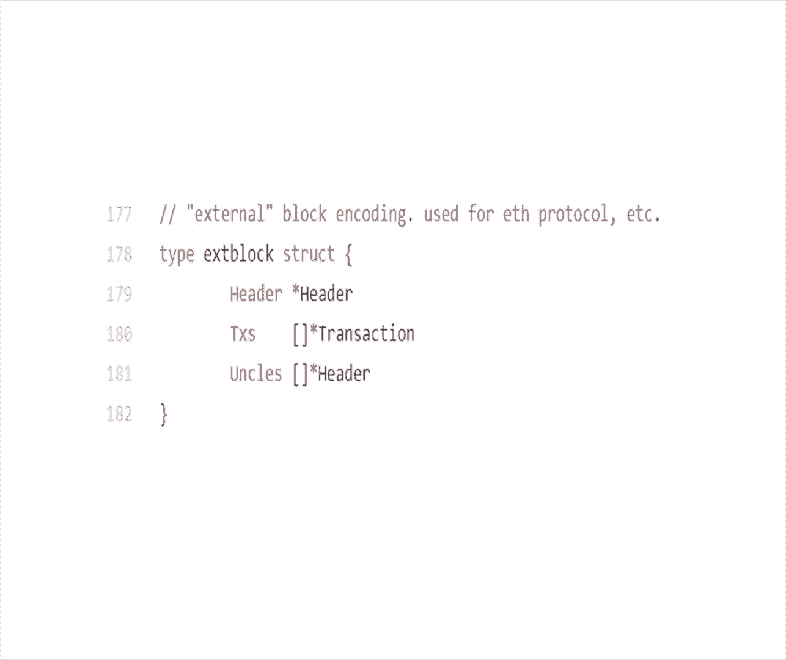

# 北京大学肖臻老师《区块链技术与应用》公开课 - P16：16-ETH-状态树 - 北京大学计算机系肖臻 - BV1Vt411X7JF

我们上节课说过，以太坊中采用的是一种基于账户的模式，系统中显示的维护每个账户上有多少余额，那么我们今天看一下用什么样的数据结构来实现这样一个呃，account base的来着，我们要完成的是什么功能。

是一个从账户地址到账户状态的映射，这个address就是这个账户的地址，以太坊中用的账户地址是160位的，也就是20个字节，那么一般把它表示成40个16进制的数，40个16进制的数。

这个状态呢就是我们上节课说的外部账户和合约账户的状态，交易次数nice，那么我们设计什么样的数据结构来实现这个映射呢，这个从直观上看像是个很典型的key value pair，对不对，你给出个账户地址。

我要找到相应的账户状态，所以一个比较直观的想法是，我们就用一个哈希表来实现怎么样，就系统中的全节点维护一个哈希表，那么插入到哈希表里面，你要查询账户的余额，就直接在哈希表中查询。

如果你不考虑哈希碰撞的话，那么基本上这个查询的效率是常数时间内完成的，更新也是很容易在哈希表中更新，所以大家觉得这样的设计方案怎么样，我是不是该低于那个丈夫的私信，一个地址对应的这个对应的这个电影的话。

假如这样意识到别人给他转的话，都是对一个不是你说这个不利于隐私性不育隐私性是因为什么呢，就是别人每次转都得有这个同一个，那不一定这个地址是可以创建很多个的，你如果想保护隐私。

我们好像上节课最后一个地方最后一点说的嘛，以太坊中你也可以创建很多个地址，每个地址有对应的状态，那么对于这些哈希表来说呢，他看到的就是很多不同的地址，它本身并没有什么方法能够知道这些。

地址是不是属于同一个人呢，这个不是隐私性的问题，有没有别的问题，没有的话，我们的任务就简单了，我们只要用个哈希表就行了，大家想不出来吗，那我来问个问题啊，用这个哈希表的话。

如果需要提供meral prove，怎么提供，比如说你要跟一个人签合同，希望他能证明一下他有多少钱，证明一下账户余额，这个怎么提供这个证明呢，一种方法是把这个哈希表中的元素组织成一颗mctr。

然后算出一个根哈希值，这个根哈希值得保存在block header里，就像我们说的比特币当中也有mo tr，也有跟哈希值保存在block header里公布出去，那么这根哈希值只要是正确的。

就能保证底下的树不会被篡改，所以一种方法是你要证明账户余额，就把这个哈希表的内容组织成一颗没扣税，这个有什么问题吗，就我不想直接告诉你们，以太坊的数据结构，咱们一步一步去思考。

去想想它的数据结构是怎么设计出来的，你们觉得没有问题，问题就在于什么，那如果有个新区块发布怎么办，我们要执行这个交易，就必然会使这个哈希表的内容发生变化，然后呢我们发布下一个区块的时候。

要把这些哈希表中的内容再重新组织成一颗没扣tr，那这个代价是不是太大的，实际上真正发生变化的账户状态只是一小部分对吧，大多数账户的状态是不变的，所以每次你都重新构造一颗没扣税，这个代价是很大的。

那我来问个问题，比特币系统当中难道不是每出一个新的区块，你也要构造一个摩托税吗，对不对，那个为什么就没这问题，那个摩托税是干嘛的，在区块中的交易，每次发布一个新的区块，又有一个一一系列新的交易。

所以比特币中的那个moco tr它是immutable，就是每次发布一个新的区块，对应着一颗mo锤，然后这个门口税构建完之后是不会再改的，下次再发布一个新的区块，再构建一个新的mo口水。

区块里有多少个交易呢，我们大概几节课以前大概算过一下，最多差不多4000个，按照一兆字节，每个交易大概是250个字节左右，最多4000个，这个其实是一个上线了，很多区块里的交易数目根本到不了4000个。

有好多区块就只有几百个，甚至还有的可能更少的，所以我们每次发布一个区块，比特币里构建一个moto tr，是要把这几百个到几千个交易构建成一个模构水，这里如果我们采用这种方法会是个什么情况。

是要把所有的以太坊账户一起构建成一个某个税，那这个数目就比我们刚才说的每个区块当中的几百个，几千个交易要高出好几个数量级，相当于你每次发布一个区块，你要把所有的账户遍历一遍，构建出一个模口水。

下次再有新的区块，再把所有的账户遍了一遍，构建出个模口水，除了提供mal proof证明这个账户上有多少钱之外，这个moree还有另外一个很重要的作用是什么，维护各个全节点之间状态的一致性。

如果你没有这个根哈希值不是发布出来，每个节点就是在内部等地为回归数据结构，那怎么知道你这个数据结构的状态，跟别人数据结构的状态是不是一致呢，我们去各个全节点之间要保持状态的一致才行。

这其实也是比特币中为什么把这个跟哈希只写在快手里的一个原因，所有的全节点要有一个共识，是大家听明白吗，如果就简单的每个全节点在本地维护一个哈希表，这个方法是不行的，哈希表本身的效率是挺好的。

你插入啊更改呀，这都效率都很好，但是呢每次去构建这个mole tree的代价是太大的，那我们考虑第二种方案，能不能我们就不要哈，希表了，我们直接就用一颗moo脆，把所有的账户都放进去。

你要改的时候直接在那moctr里改，因为你每个区块更新的只是一小部分账户对吧，所以你改的只是mogo tr中的一小部分，这个方法行吗，大家没什么想法，这个方法的问题在于什么。

mo没有提供一个高效的查找和更新的方法，是最底下一层是传达神，然后哈希值放到上面节点里，两两结合，然后再取个哈希往上转，正，从底下一层的往上去，它没有提供一个快速查找和更新的方法，还有一个什么问题。

如果我们这样构建门口吹，就直接把账户都放了一个大的摩托车里，这个光头脆要不要排序，我们以前讲过这个第二节课讲的吧，往口吃，要排序吗，如果我们不排序会怎么样，你说什么，我排序的话，你要查找账户的话。

是不是得偶尔带你排序之后就能打，我们不排序的话，查找的速度会慢，它其实不排序，还有另外一个问题，这个文课税是为了为了证明这个一笔交易在这个区块中，但是如果你要它是摸排序统，没法证明。

就是这个交易不存在的事，就是没法证明南蛮不是，就比特币中，是需要用排序的版本，否则的话它的证明的代价就变成了线性的，变成sn的不排序，其实还有另外一个问题，这些账户。

组成这个moo tra夜节点是这些账户的信息，对不对，如果不规定这些账户在夜节点的出现顺序，那么这样构建出来的moral tree不是唯一的，每个技能都不对啊，比如说系统中有那么多全节点。

每个全节点按照自己的某个顺序，比如说他听到某个交易的顺序，构建一个moctr，那叶节点的顺序是乱的，哪个节点自己决定的，最后构建出来的moco ree是不一样的，算出的跟哈希值也是不一样的。

那我问个问题啊，那比特币当中不也是不排序吗，为什么比特币当中就没有这个问题，你又不用改变，再加上你做那个某路的时候，你看你自己把你，we were here，你说的基本上对的，比特币当中。

其实每个全节点收到的交易的顺序也是不一样的，这从理论上说，你这样构建出的猫和脆的跟哈希值也是不一样，但是比特币有一个什么区别，中文说的他不是定的啊，每个虚幻性顺序是定的对，实际上我想听到的答案是什么。

就这个顺序的话，每个节点确实是不一样，这个可能每个人采取措施不一样，但是最后是谁说了算，获得记账权的那个节点说了算，所以比特币种是怎么运行的，是这个节点自己决定，然后去挖矿，去竞争记账权。

如果他没有抢到，记账权他做的什么决定，别人是没必要知道的，他发不出去了，而且这个区块最终成为一个被大家接受的区块，那么这个时候顺序决定了发布这个区块的节点，确定了，这比特币中虽然也没有用排序的门口吹。

但是它这个顺序是唯一的，是由发布区块的那个节点确定，那我们这里为什么不能这么干，我希望同学们以后上完这个课之后，不光是知道比特币和以太坊怎么工作，我希望有些同学能够设计出自己的加密货币。

那么实际出更好的数据结构，如果以太坊中也这么干，需要怎么样，需要把这个账户的状态发布到区块里，就你也可以说是每个全节点自己决定，怎么把账户组织成一个vocal tr，算出我跟哈希值来挖出矿来。

但是你怎么让别人知道这个顺序，你得把它发布到区块里，但你发布的是一个所有账户的状态，就前面刚才讲过，这差好几个数量级，你发布一个交易的话，是只需要几百个几千个交易，而且这个交易是必须得发布的。

他这个代价你必须得付出，你不发布怎么办，别人怎么知道你这个交易，所以这个交易是必须得发布的，账户状态是可以维护在本地的，而且大多数账户状态是不变的，你一个区块里那些交易只能改很少的装账户。

大多数账户状态你是不变的，而且你重复发布，每隔十几秒发布一个新区块，下次再过十几秒再发布一遍，这又是不可行的，好我们接着这个方案继续讲，刚才只是说明了什么，不排序的猫科吹是不行的，存在好多问题。

你们刚才说的问题也对，另外这个树的形状不唯一也是个问题，那我排序我用缩腿的moo tra是不是就没问题了，就是看他家账户的，你觉得会有什么问题，正在构建，然后，没什么问题吗，我说有问题，你说的是对的。

你新增一个账户怎么办，你产生一个账户的账户地址是随机的，它很啊对啊，听进去，它在夜间剪中的位置很可能是插在中间的，对不对，它随机产生的一个账户地址嘛，那后面这些数的结构都得变，在产生一个重新再产生一遍。

那又变成了每次我要产生一遍，那那当初干嘛不用哈哈，希表不是，你不是每个人都维护一个本地的吗，对然后你维护一个本地的，只要产生一个，然后你就应该让几乎所有人都应该知道你产生了一个新账，按照你太棒了。

这个呃基本上就是严格地说你产生账户的时候，别人是没必要知道的，只有这个账户对外发生了一些交互，就比如它往外转账，或者别人往里面转账，这个系统才需要知道，这是第一点，就假设这个账户做个交易。

别人是需要知道的，然后呢，你的本地没有，你这时候你就可以先更新你本地的那些，然后你把它比如说把那个插进去，插进去之后，然后你再根据那个来把你的摩托tr再生成那次。

然后你就能够验证那个跟那个root那个对新产生一个账户，对外发生了交互，我需要把它加入到我的数据结构里，这话没有错，但问题这个加入的代价得有多大，如果你直接用哈希表的话，那代价是常数的，你要摸tr的话。

这就是他的代价，这个代价同样是太大了，要不然的话我们前面为什么不直接用哈希表，每次有什么更改发布区块的时候，所以你用排序版的门门口吹也有问题，你插入的话代价太大，删除代价也大，删除其实可以不删。

是说你往里添东西容易，你想删东西呢，其实以太坊中没有显示的删除账户的操作，有的账户上就一点钱，就一两个v，你也不能把它删掉，好我们大家都达成一致了，这两个简单的数据结构是不行的，那怎么办呢。

这个以太坊呢采用的方法是用一个叫mt的结构，mo portra吹讲这个之前呢，我们先讲一个简单的数据结构，这个大家学过吗，try本科的数据结构课讲过这个吧，这个try是从哪来的呢。

英文中有个单词叫retro，从这里来的信息检索，就一般来说啊，这个中翻译成中文叫字典数，叫前缀数，就是它是它也是一种，key 6的速度，一般来说这个key是字符串用的比较多，比如说我们有一些单词。

我们去把它排成一个try的树形结构，比如说我们有这几个单词，general，genesis，gogo，good，还记得genesis是什么意思吗，genesis block，创世纪块对吧。

下面我们看一下结果，我们用投影仪看是吧，这就是组织成一个try的结果，这几个单词呢都是以g开头的，一开始是这个g，然后第二个字母就开始分裂了，左边是一，右边是o，然后呢前两个单词接下来都是n和e。

然后在下面再分开，左边是r，右边是s，然后是后三个字母，右边那个分支呢o这个分支呢只有go就已经结束了，就这个例子中，我们可以看到单词有可能在这个try的一个中间节点结束，然后呢左边是d，右边是o。

左边变成了高，右边下来是good，这就是这个try的结构，大家有什么问题吗，那么这个结构呢有一些特点，第一个呢就是在try当中呢，每个节点的分支数目取决于这个key值里每个元素的取值范围。

这个例子当中呢每个都是英文单词，而且是小写的，所以呢每个节点的分叉数目最多是26个，加上一个结束标志位，表示到这个地方，这个单词是不是就结束了，那在我们这个以太坊里面是什么样的，我们刚才说过。

地址是表示成40个16进制的数，所以呢这个分叉数目有时候管它叫brunching factor，是17对吧，因为是16进制的，零到f加上一个那个结束标志符，所以是17，第二个特点是什么。

try的查找效率取决于这个key的长度，键值它越长，查找需要访问内存的次数就越多，那么我们的应用当中，这个key值有多长呢，跟这个有一个区别，这个的例子当中不同的单词长度是不一样的，我们这个应用当中呢。

所有的键值都是一样长，都是40，因为地址都是40位，16进制的数，就大家我顺便说一句啊，比特币跟以太坊的地址是不通用的，两个地址的格式长度都是不一样的，但有一点是类似的。

就是以太坊中的地址也是公要经过转换得来的，其实就是公要娶了哈希然后前面截一段前面的，第三个特点是什么，我们一开始说，如果我们用哈希表来存储这个k864 多，从理论上说是有可能出现哈希碰撞的，对不对。

就有可能有两个账户，这两个账户的地址是不一样的，但是恰好映射到了哈希表的同一个位置，那try呢，踹会不会出现碰撞，只要两个地址不一样，最后肯定映射到书中的两个不同分支，所以try是不会出现碰撞。

这第三个特点，第四个特点是什么，我们前面讲moo tr，如果你不排序的话，一个问题是你这个账户插入到moctr中的顺序不一样，得到了数的结构也不一样，那try呢。

比如说我这五个单词我换一个顺序插到书里面，得到的是一棵不同的树吗，是一样的对吧，这就是出一个特点，不论你只要给定一组输入，这个输入不变，不论你这个输入怎么打乱重排，最后插入到这个try当中。

构成了try是同一棵树，这个对我们的英文来说也是很有用的，就不同的节点，不论你怎么按照顺序去插入这些账户，最后构造出来的数是一样的，第五个性质，跟更新相关的，我们说每次发布一个区块系统中。

绝大多数账户的状态是不变的，只有个别受到影响的账户的状态才会变，所以更新操作的局部性很重要，这个的局部性呢，比如说我要更新genesis这个key对应的value，就这个图当中只画出了key。

没有画出value，要更新这个genesis对应的value，我只用访问这下面这个分支，对不对，其他分支是不用访问的，也不用遍历整棵树，所以这是它的更新的局部性是很好的，好我们说了try的这么多优点。

try就没有缺点吗，其实你们看看这车的缺点也挺明显的，是不是存储有点浪费，像这些节点，都只有一个子节点，就是对于这种一脉单传的情况，如果我们能把这些节点进行合并，那么可以减少存储的开销。

同时也提高查找的效率，不用一次一个一个往下找了，那么这就引入了我们说的pora，也有人把它写成他吹着踹，这个都没什么，没什么太大关系，就是这种经过了路径压缩的前缀树，有时候管它叫压缩前缀树。

那么这个例子如果进行路径压缩是个什么样子的，这就是portrait tra，这个结果我们可以看到一开始的时候，这个g下面还是e跟o进行分叉对吧，e下面之后跟的都是n1 ，然后再往下又是e跟s分差。

然后后面几个都合在一起了，右边那个分支也是一样的，所以这样压缩之后有什么好处，直观上看，这个树的高度明显缩短了，这树变得比较浅了，效率就提高了，大家注意一点啊，对于这个怕吹着吹印来说。

如果你先插入一个单词，原来压缩的路径可能需要扩展开来，比如说这个例子当中，假设我们又加入个死，会变成什么样子，如果你加9mm垂的话，左边那个分支就不能这么压缩了，对吧。

那么路径压缩在什么情况下效果比较好，就我们这个例子中效果很明显，但也可能有些例子当中效果就不明显，什么情况下它效果会比较好，你说公共前缀怎么样，比较多的比较多的时候，这些就是这些所有的这些地址。

他们的公共前缀都相处的比较多的时候，公共前缀相同的比较多的时候，这个说法不太严格，公共前缀相同的同比较多的话也不一定效果，就好比如说有几个词是第一个相同，再有几个词是下一个长度长度。

然后长度为三的时候又有一些相同的，那时候你可能就没法压，你说这你说是相反，公共前缀金可能不同，比如说两个单词前缀完全不一样，放到一棵树里，那显然如果你要是不采取措施的话，就变成两条线了，就这个说的。

你们说的就是这个说得更严格一点，叫什么，这个数中插入的这些键值的分布，如果是比较稀疏的情况下，你做不做路径压缩，效果差距比较大，比如说我们这个例子当中是用英文单词，如果你这个英文单词每个单词都很长。

但是一共没有几个单词，那这个时候呢我们举个例子，比如说有，miss and understanding，这是一个比较长的单词，去中心化的还有一个词叫做第四因特。

mediation这个词大家知道什么意思了，第一时间排名第，啊还要查字典，intermediary是什么意思啊，这个intermediate是中间商的意思。

第一次intermediation是把中间商去掉，就去掉这些中间商，让这个系统中的价值提供者跟消费者直接进行交互，好我们说这三个单词，如果你插入到一个try里面，普通的try里面会是什么样的。

这就是这个结果，这个字比较小，可能比较难看清楚，就可以看到这样的结构效率是很低的，基本上退化成一条线，如果用它吹着吹呢，这就是用跑车热衰的结果，这个树的高度明显改善多了，在最后这个底下。

因为这两个单词比较长，他有些one app，但大家是能明白这个意思的，所以键值分布比较稀疏的时候，路径压缩效果比较好，那我们这个应用场景当中，建筑分布是不是稀疏的，是吗，我们在应用中间值是什么。

是地址对吧，地址是160位的，所以整个地址空间有多大，二的160次方，这是一个非常非常大的数，如果你设计一个计算机程序的算法，它需要进行的运算次数是二的160次方。

那这个带我们整个所有人的有生之年都不可能算出来，这是个非常非常大的数，以太坊中的账户数目，全世界的账户数目加在一起也远远没有这么大，跟这个数比是微乎其微的，所以它是非常非常稀疏的，干嘛搞得这么稀疏啊。

为啥不把地址长度缩短一点，这样访问效率还快，也没必要那么稀疏了，地址容易被破解，有道理或者换种说法了，我们第一节课上讲过的一个密码学原理，讲过诶，对碰撞就是以太坊跟比特币中。

就以太坊中的普通账户创建方法跟比特币是一样的，你在本地产生一个公司要对就是一个账户，那你怎么防止两个人的账户正好碰撞呢，产生的一样呢，这种可能性是存在的，但是我们第一节课说比地球爆炸的概率还要小。

怎么达到这么小的概率，就是你的地址要足够长，要分布足够稀疏，才不会产生碰撞，这个可能呢看上去有点浪费，但这是一个去中心化的系统，防止账户冲突的唯一办法，所以它是非常稀疏的。

这就是为什么我们在这个数据结构中要用patricia tra，好我们讲了try，讲了putra tramp t是什么，门口，他吹啥吹，那mp t跟p t有什么区别，木口跑出热水跟跑车热水有什么区别。

我们先说一说，moco吹，跟binary水有什么区别，把普通指针换成了哈希指针，那么这里也是一样的，把普通指针换成了哈希指针，所以呢大家听明白了吗，就是所有的账户组织成一个porter tra。

用路径压缩提高效率，然后把普通指针换成哈希指针，所以呢你就可以计算出一个根哈希值了，就这个根哈希值也是写在block header里的，这比特币的block header里只有一个根哈希值。

以太坊中有三个，以太坊中也有一个交易组成的叫交易术，我们现在讲的是叫状态数，账户状态，最后组织成了一个没口吹，它的根哈希值，好这个根哈希值有啥用，第一是防止篡改对吧，只要跟哈希值不变。

整个树的任何部分都没有办法被篡改，也就是说每个账户的状态都能保证它的integrity是没有被篡改过的，第二vocal proof这个数能证明什么，能证明你有多少钱对吧，证明你账户上的余额是多少。

怎么证明，就是你这个账户所在的那个分支，整个分支自己向上，作为vocp发给这个清洁点，清洁点就可以验证一下你账户了多少钱，还能证明什么，因为一笔交易它会导致两个账状态发生改变。

他这个其实不能直接证明一笔交易，就这个要挣一个交易的发生是比较难的，因为一般情况下，这个书中有很一一个区块发布，有很多节点会发生变化，你不是很容易说清楚它具体是怎么交易的，它有专门的交易数和收据数。

我们就不休息，我们继续讲完，能不能证明某个账户是不存在的，我们说sorted moo的一个好处是可以证明南版ership这个能不能挣，不能有些我自己创建一个账户，然后这个账根本没有发生交易。

所以说这个账号只有我自己知道，这个说的对，如果你创建一个账户，别人都不知道的话，那确实是是没法挣出来的，但就是说如果假设这个能不能证明某个发生了交易的账户，不怎么说，这个话怎么说，就是画出了一个转折。

给一个空气值，在这个区块上有记录的对，在这在这里面有记录，这就是你想给一个地址转账之前，你想验证一下这个这个全节点里有没有这个账户信息，这个能挣出来吗，或者说得更直白一点。

能不能证明这个mmp t中某个键值是不存在的，能对吧，怎么着，你怎么反着找，只要你们没有一个找不到的，其实证明方法跟那个缩腿摩托车类似，如果存在的话，它是在什么样的分支，把这个分支作为猫科普布发过去。

可以证明它是不存在的，还有问题吗，这个以太坊中用到的还不是原生版的mp t，用的叫modify m p t，就对这个mp的结构做一些修改，这些修改不是很本质的修改，我们看一个例子。

这个例子当中呢有四个账户，右上角这四个账户，为了简单起见呢，这个账户地址都比较短，我们假设只有七位的地址，而不是40位的，然后账户状态呢我们也只显示了余额，其他的账户状态没有显示出来。

第一个账户有45个以太币，第二个账户比较穷，只有一微，这是以太坊中最小的计量单位，ev基本上可以忽略不计了，后两个咱们就不说了，然后它的节点这个数中的节点是分为三种，就这个例子当中。

extension lo，如果这个数这个部位出现路径压缩，就会有一个extension，所以这四个地址大家看一下，前两位开头都是一样的，a7 对吧，所以它的根节点就是一个extension load。

这些share nel，这个neo是16进制数的意思，一个neo就是一个16进制数，然后第三位开始就分开了，有一有七有f，所以就有一个跟着一个brunch load e7 f，我们先说一吧。

这个一完之后实际上就是1355，他只有这一个地址，所以就是跟着一个leaf load 1355，七这个位置呢有两个地址，这两个地址接下来都是d和三，所以连着是个extension node。

也是路径压缩d和三，然后再往下呢是三和九分开了，所以跟着一个brunch node分支节点三和九，然后下面两个离谱的就是最后一位，这个例子当中呢，最后一位都是七。

最后这个f呢就上面分开的f a7 f下面就是9365，就跟着一个leaf load，9365，这就是这个状态数，大家有问题吗，这个是modify，这就是modified mp，哪里motif。

你这看上去明显跟那个m p t不完全一样，它是有tion node，有这种不让ch node跟m p t不是完全一样，另外还有一个就是这个根节点，这个树的根节点取哈希之后得到了一个根哈希值。

就这个是要写在块头里的，什么不太一样，它有分奇数个这个尼泊尔和偶数跟尼泊，那你说就是他那个节点与节点之间的连接，不是通过哈希市场，而就是就是不它是用哈希指针，它这个意思不是说简单指针，比如说七这个位置。

它连着一个extension no，是说七这个位置里面存的值是下面这个节点的哈希值，你想如果是普通指针的话，是什么，也是七这个位置存的这个值是下面这个节点的地址对吧，只不过把这个地址换成了哈希值。

这是网上的一个例子，有问题吗，每次发布一个新的区块的时候，这个状态书中有一些节点的值会发生变化，这些改变不是在原地改的，而是新建一些分支，原来的状态其实是保留下来的，像这个例子当中呢。

我们显示有两个区块，这是两个相邻的区块，这个state rt就是状态树的根哈希值，下面显示的是这棵树，这个呢是新的区块的状态数，我们可以看到，虽然每个区块有一个状态数，但是这两棵树的大部分节点是共享的。

像右边这棵树主要都是指向左边这棵树的节点，只有那些发生改变的节点是需要新建一个分支，那么这个例子当中呢，是这个账户是发生了变化，这个账户是一个合约账户对吧，因为它有这种扣的嘛，有代码，还有存储。

就是合约账户的存储也是用pc的形式保存下来的，这个存储是什么，其实也是一个key value stor，就是维护的是从这个变量到这个变量取值的一个映射，它也是一个k864 度。

在以太坊当中也是用了一颗mm p t，所以以太坊中的这个结构是一个大的mp，每一个合约账户的存储都是一颗小的mp，那么回到我们这个例子，这个账户呢新的区块里这个交易次数nth是发生变化了。

这个balance余额也发生了变化了，这个代码是不变的，所以这个code hash是指向原来的这个节点，原来书中的节点存储是变了的，但是存储在底下，这个就叫存储数，存储数中大部分节点也是没有改变。

这个例子当中呢，只有这底下的一个节点，这个整数变量从29就是29吗，29变成了45，最新建的一个分支，大家看看有问题吗，所以呢系统中每个全节点需要维护的不是一颗mp。

而是每次出现一个区块都要新建一个mp，只不过呢这些状态数中大部分的节点是共享的，只有少数发生变化的节点是要新建分支，那么我们问一个问题啊，为什么要保留历史状态，干嘛不在原地直接改了。

这样可能是如果这个一个账户的这个，发生一些改变的时候，嗯，就是如果这个是平行捏造的话，以便于就是说后面出现什么情况的时候，便于有迹，可能就是他的技术是怎么变化的一个技术，你说是因为作为aud。

就擅自被人改掉了，让你收到这样一个消息之后，你可以查一下历史记录，这个账户原来一笔一笔是怎么来的，就像银行一样，银行实际上是保留你的账户的历史信息的，你查过去什么交易都可以查得到的是audit。

还有什么别的想法呢，有什么别的目的吗，为了怀旧，想当年我以前账户上是非常有钱的，我可以证明给你们看，我们说系统当中有的时候会出现分叉对吧，临时性的分叉其实是很普遍的，就以太坊把出块时间降到十几秒之后。

这种临时性的分叉是一种常态，因为你这个区块在网上传播时间可能也需要十几秒，说这是常态，假设有一个分叉，两个节点同时获得记账权，这两个分叉最后会有一个胜出对吧，比如上面那个点也生出了。

下面这个分差的节点该怎么办，回滚，叫rob，怎么回滚呢，就是把它这个区块，就是就这个节点当前的状态就接受了，这个下面这个区块的状态要取消掉，退回到上一个区块的状态，然后再沿着上面这条链往下推进，对不对。

就有的时候我们可能需要把当前状态退回到，没有处理到这个区块中交易的前一个状态，那怎么实现回滚呢，就是要维护这些历史记录，不是为了证明以前我有多少钱，而是因为当前这个交易有可能要暗度。

这个跟比特币还不太一样，如果是比特币的话，他交易类型比较简单，有的时候你可以通过这种反向操作推算出前一个状态，比如说如果就是简单的转账交易，a转给b，十个比特币，那这个对账户余额有什么影响。

a的账户上少了十个比特币，币的账户多了十个比特币对吧，假设这个交易要回归了，退回到前一个状态，那就把b这个账户减少十个比特币，把a这个账户加回去十个比特币就行了，这个是简单的转账交易。

你要回滚其实是比较容易的，以太坊中为什么不行，同学们今天比较安静，以太坊中有什么智能合约，大家听明白了吗，就是以太坊的智能合约是图灵完备的，它编程功能是很强的，从理论上理论上说可以实现很复杂的功能。

它跟比特币的那个简单的脚本还不一样，所以以太坊中如果你不保存以前的状态，智能合约执行完之后，你想再推算出前面是什么状态，这是不可能的，学校在合约里代码是怎么回事，你说你没有办法可以自动推断出前的状态。

所以要想支持回滚，必须得保存历史状态，大家听明白了吗，进进进进，下面我们看一下以太坊中代码的一些数据结构，这个是block header这个块头的定义。

第一个呢一个是parent hash是副区块的哈希值，不是整个虚化人物，不是整个区块的，你什么意思啊，对区块的块头的哈希值这个对你说的很对，只有区块块头的哈，希值第二个uncle hash。

这是比较新鲜的，他是叔父区块的哈希值，我们后面讲这个构思协议的时候，每个区块还可以有舒服区块，而且呢我们后面会看到就比较奇怪的一点是。

就大多数人你看那个表面上parent hash和uncle hash，感觉这两个应该是同一个辈分的对吧，副区块跟舒服区块好像是个旁的分支，但是以太坊中不是这样的。

这个uncle可能比parent大好多好多辈份，第三个coin base就是挖出这个矿的这个区块的矿工的地址，下面这三个就是跟我们这几节课讲的很相关的，就三棵树的根哈，希以太坊中有三棵树，有状态书。

交易书和收据书，这个root是我们今天讲的状态数的根哈希值，这个transaction hash是交易数的根哈希值，这个有点类似于比特币系统中的那个根哈希值。

received hash是一个新的叫收据数，下面那个bloom是bloom filter，这个跟那个收集数是相关的，就提供了一种高效的查询，符合某种条件的交易的执行结果，进水口铁是挖矿的难度。

这个也是要根据需要调整的，这个gas limit和gas used的是跟汽油费相关的，就是智能合约要消耗汽油费，就有点类似于比特币中的交易费，我们后面讲智能合约的时候再讲吧。

他是这个区块的大致的产生时间，这个mix digest和lance呢，这两个是跟挖矿过程相关的，这个nice也是一个挖矿时猜的那个随机数，就是类似于比特币的挖矿，以太坊中挖矿也是要采很多随机数写的。

这个块头里的这个随机数是最后找到的，符合难度要求的，这个mix digest是从这个nice这个随机数经过一些计算算出了一个哈希值，这个我们后面具体也会讲，下面这个是区块的结构，对我们这个课来说呢。

比较相关的就是前面三个域header，uncle和transaction，这第一个header就是指向block header的指针，就我们上一页刚刚看过那个block header的结果。

指向它的指针，这个uncle呢是指向叔父区块的header的指针，而且它是个数组，因为一个区块可以有多个舒服区块，transaction就是这个区块中的交易的列表。

这个install block就是这个区块真正在网上发布的时候，发布的就是这些信息，其实就是我们刚才那个ppt上看到的前三项，真正发布出去的，大家有问题吗。

没有问题，我们把这个投影仪关了，还有最后一点要讲，我们说我们讲了半天，状态数中保存的是key value pair，p就是地址，我们讲到现在主要讲的是这个键值这个地址的管理方式。

那么这个value这个账户的状态它是怎么存储在状态数当中的，实际上它是要经过一个序列化的过程，llp用这个编码做序列化之后再存储rp是什么意思，recursive，是一种做序列化的方法，特点是简单。

是极简主义，越简单越好，大家听说过普格巴赫吗，听说过这玩意吗，有时候有些简称，说说吧，好像是在发送那个，这是个很有名的做序列化的库，就很常用的做序列化库，就跟这些库相比，rp的理念就是越简单越好。

它只支持一种类型，nice to array of base，说白了就是自服术主有一个一个字符字节字节数组吧，因为一个字节组成的数组可以嵌套，以太坊中所有的其他类型整数也好，比较复杂的哈希表也好。

最后都要变成这个next ref biss，所以呢你要实现一个r l p比实现protocol buff要容易得很多，因为难的东西他都不做，都推给应用程度，大家有问题吗，今天这个课的内容是比较多的。

我们从以太坊中设计的理念开始讲，为什么要这样设计，一步一步讲到这儿，大家回去之后好好消化吸收一下，下节课我们会讲一下以太坊中另外两棵树，交易书和收据树，好吧。

