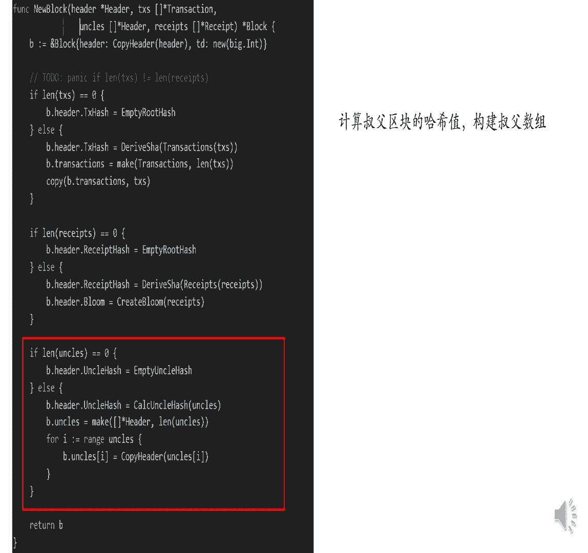
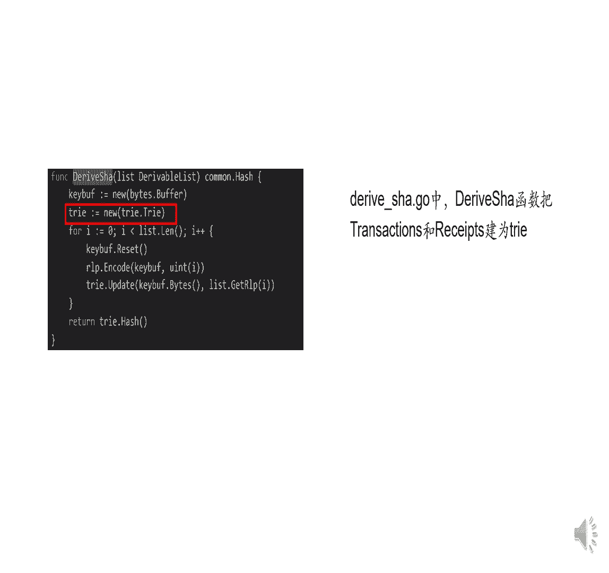
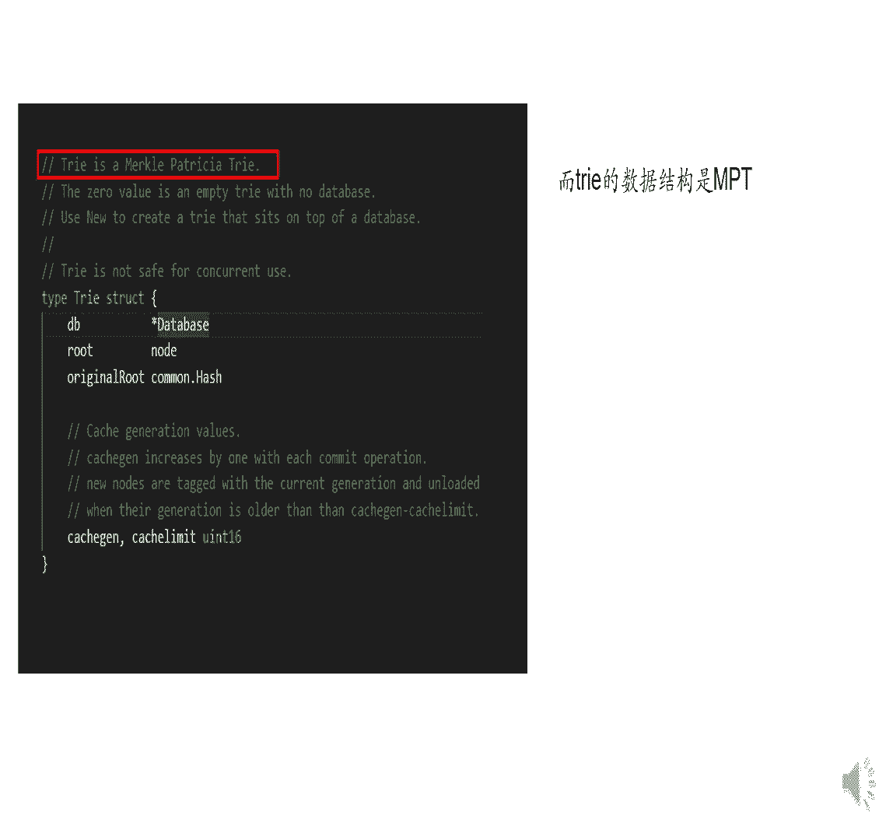
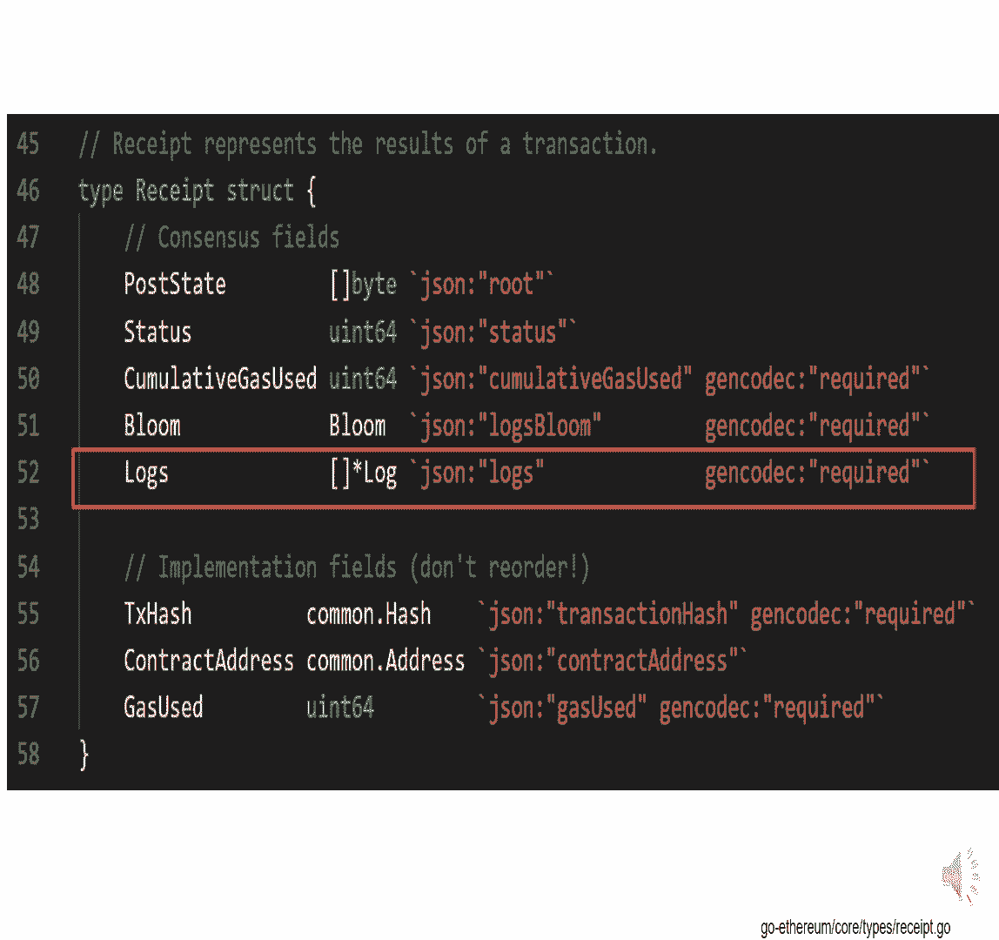
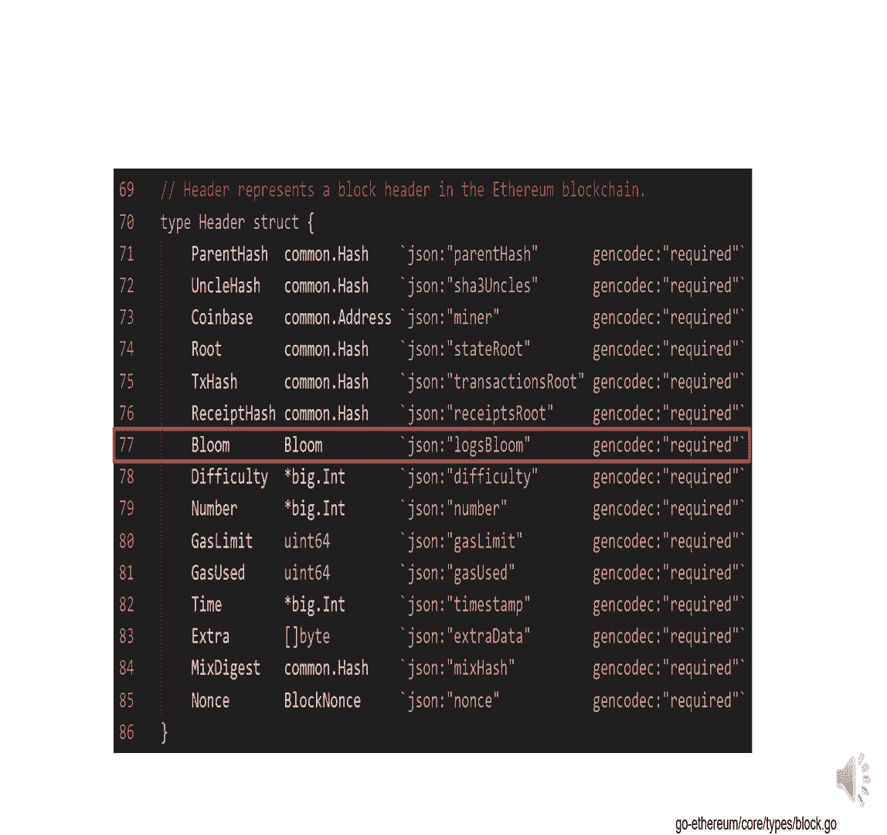
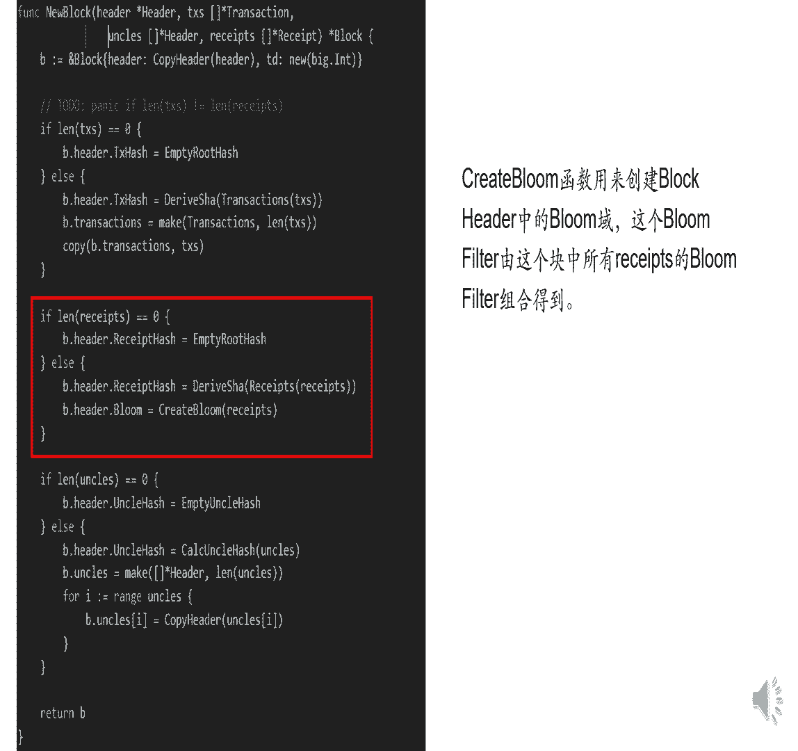
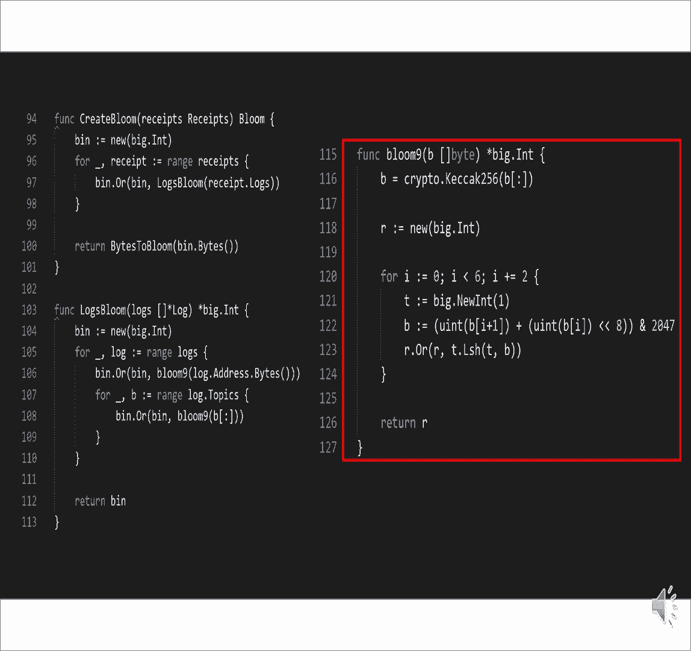
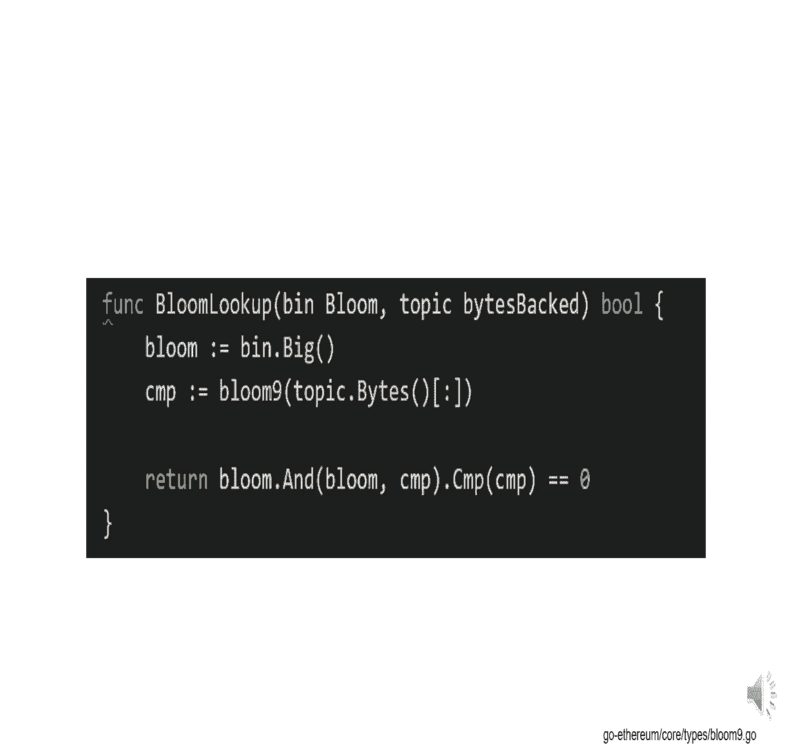

# 北京大学肖臻老师《区块链技术与应用》公开课 - P17：17-ETH-交易树和收据树 - 北京大学计算机系肖臻 - BV1Vt411X7JF

我们上节课讲了以太坊中的状态书，以太坊中还有另外两棵树，交易数和收据数，每次发布一个区块的时候，也是一颗merctr，跟比特币中的情况是类似的，同时呢以太坊还增加了一个收据数。

每个交易执行完之后会形成一个收据记录，这个交易的相关信息就是交易数跟收据数上面的节点是一一对应的，增加这个收据书主要是考虑到以太坊的智能合约执行过程比较复杂，所以通过增加这个收据书的结构。

有利于我们快速查询一些执行的结果，从数据结构上呢，交易书和收据书都是m p t，就我们上节课讲的，这个数据结构这个呢跟比特币有所区别，比特币中的交易书就是用普通的ml tr就去跨你的所有交易。

就组织成一个普通的猫口水，当然你mpt也是一种摸头吹，这个叫moco porra tree，它也是一种vocal吹，但是跟比特币中用的不是完全一样，为什么有这个区别呢。

我猜其实就是为了方便以太坊中的三棵树都用同样的数据结构，这样代码比较统一，便于管理，不一定非要有什么更深层次的原因，当然了，用mp t的一个好处是它支持查找操作。

就是你可以通过键值重顶向下沿着这个数进行查找，对于状态时来说，查找的兼职就是这个账户的地址，对于交易书和收据书来说，查找的价值就是这个交易在发布的区块里面的序号，就他排第几。

这个交易的排列顺序是由发布区块的那个节点决定的，这三棵树有一个比较重要的区别，就是交易数和收据数，都是只把当前发布的这个区块里的交易组织起来的，不管这些账户跟当前区块的交易有没有什么关系。

从这个数据结构上来说呢，我们上节课讲过多个区块的状态数是共享节点的，在每次新发布一个区块的时候，只有这个区块中的交易影响了，就改变了状态的那些节点需要新建一个分支。

其他的节点都是沿用原来重战出场的节点就行了，相比之下呢，交易数和收据书，就他们是不会共享节点的，就一个区块跟另外一个区块发布的交易本身，那么交易书和收据书有什么用呢，一个用途就是提供vocal pop。

就像比特币当中呢，就可以向清洁点提供这样的模科普，收据书呢也是类似的，你要证明某个交易的执行结果，也可以在收据书里面提供一个某科普，除此之外呢，以太坊还支持一些更加复杂的查询操作。

比如说你想找到过去十天当中所有跟某个智能合约有关的交易，那这个应该怎么查呢，一种方法是把过去十天产生的所有区块都扫描一遍，看看其中有哪些交易是跟这个智能合约相关的，但是这种方法呢它的复杂度就比较高。

而且呢你对于清洁点来说，实际上清洁点没有交易列表，它只有一个块头的信息，来找到符合这种查询条件的交易，与之类似的一些查询，比如说找到过去十天当中符合某种类型的所有事件，比如说所有的众筹事件。

或者是所有的发行新币的事件，那么这些呢都是需要一个比较高效的方法才能支持，怎么办呢，以太坊中引入了bloom filter这个数据结构，大家以前学过blue filter吗，blue filter。

这个数据结构可以支持比较高效的查找某个元素，是不是在一个比较大的集合里面，比如说你有一个集合里面有很多元素，那么现在你想知道某个指定的元素是不是在这个集合里怎么办，大家能想到什么样的查询方法。

一个最笨的方法是什么，我把这个集合中的元素编译一遍，看看有没有我想找的那个元素，这个的复杂度是线性的对吧，是是c他n的复杂度，另外这有一个前提是什么，你得有足够的存储来保存整个集合的元素。

那么对于清洁点来说呢，它其实没有这个交易列表，它没有整个集合的元素信息，所以这种方法它是用不了的，那怎么办呢，不用filter，计算出一个很紧凑的摘要，比如说一个128倍的向量，比如我们这个例子当中。

假设有一个集合a dc，这是个集合，我们要给它计算出一个digest，底下是一个，向量，这个向量呢初始的时候都是零，然后我们有一个哈希函数h他把每一个元素映射到向量中的某个位置。

比如说a这个元素取哈希之后映射到这个位置，然后我就把这个位置的元素呢从零变成一，然后b呢可能映射到这个位置，那么这个地方也制成1c呢，比如c影射到这个位置变成一，就是把每一个元素都取哈希。

找到向量中的对应位置，然后把它制成一所有的元素都处理完了，得到这个向量就是原来集合的一个摘要，这个摘要比原来的集合要小很多，就我们这个例子当中。

比如说你就用一个128个beats就可以代表这个摘要有什么用呢，比如说我们有一个元素叫d，我们想知道d这个元素是不是在这个集合里，但是这个集合本身我们不一定能够保存下来，应该怎么办。

我们用这个哈希函数对d取哈希值，比如说取完之后发现映射到这个地方，应该到一个是零的位置，说明什么，说明这个元素一定不在这个集合里，假设呢学完哈希只有映射过来，映射到这个位置说明什么。

你说啥也不能说明为什么啥也不能说是如果d d在a a中，还有一些其他元素可能映射到那个地方，也是一可能并不存在，但是有一个元素和d经过映射可能映射到相同的位置。

所以这地方是一就是d有可能是也有可能你想说就是哈希碰撞，这映射到一个11的地方，有可能是它确实是集合中的元素，比如说d就等于a所以我们把它找到了，也有可能呢他不在这个集合里面，但是出现了哈希碰撞。

恰好映射到了一个跟集合中某个元素一样的位置，所以呢用这个blue filter，我们要注意它有可能出现，for positive，但是不会出现false negative，就是有可能出现误报。

但是不会出现漏报，就在里面，他一定说在里面，不在里面，他也有可能说在里面，这是不用filter的一个基本的工作原理，不努斯尤特有各种各样的变种，比如说想解决这个哈希碰撞。

有的blue filter的设计用的不是一个哈希函数，而是一组哈希函数，那么每个哈希函数呢，用一组哈希函数的好处是如果出现哈希碰撞。

我们这里讲的呢是blue filter的一个high level的工作原理，后面我们会看一下以太坊中的具体代码，看它那里面的blue filter具体是怎么设计的，回到我们这个例子当中。

如果从这个集合中删除一个元素，该怎么操作，该怎么操作，把相应的位置改成零不行，因为其他民族意识到已经，那就是你把其他人不给看，你说的是对的，没法操作。

就blue filter这个数据结构的一个局限性是不支持删除操作，原原因就是刚才那个同学说的，比如说你把a这个元素删掉了，这个地方是一你要不要改，你把它改成零的话。

这个集合中有可能有另外一个元素也映射到这个位置，就哈希碰撞是有可能的，所以这种简单的不用学是不支持删除操作的，如果你要支持删除操作的话，这个地方就不能用binary，就不能是零和一了。

你把它改成得是一个计数器，记录这个位置有多少个元素映射过来，而且你还要考虑到这个计数器会不会over flow，那这样数据结构就复杂得多了，当初设计不同filter的初衷是相违背的。

所以一般来说不用future是不支持删除操作的，大家对这个原理搞明白了吗，那以太坊中要这个不用filter有什么用呢，我们说每个交易执行完了之后会形成一个收据，记录这个交易的类型。

然后呢地址等其他信息发布的区块，在它的块头里也有一个总的不同的filter，这个总的blue filter是这个区块里所有交易的不能filter的一个并集，所以回到我们刚才那个例子。

比如说你要查找过去十天发生的跟这个智能合约相关的所有交易，你怎么找呢，先查一下哪个区块的块头里的blue filter，有我要的这个交易的类型，如果块头你呢不用filter里没有的话。

那么我们就知道这个区块不是我们想要的，如果块头的不用filter，有的话，里面的那些blue f，就每个收据的blue fter看看哪个有也可能都没有，大家听明白。

因为他有可能是for positive，所以有可能是都没有，如果是有的话呢，我们再找到相对应的交易，直接进行一下确认，这个好处是什么，就很多区块你一看块头的。

不用future就知道肯定不会有我要的交易的，我们再仔细查看，就比如说你是一个清洁点，你清洁点的话，你只有块头信息，那么根据块头就已经能够过滤掉很多区块，剩下有可能是你想要的那些区块，你再去问全节点。

要一些进一步的信息，大家有什么问题吗，那么基本上呢我们就把以太坊中的三棵树给讲完了，以太坊的运行过程可以把它看作是一个交易驱动的状态机，这个状态机的状态是什么，就是所有账户的状态，那么交易是什么。

这些交易呢通过执行这些交易，会驱动系统从当前的状态转移到下一个状态，比特币呢，比特币你也可以认为是一个交易驱动的状态机，那么比特币中的状态是什么，而utxo没有被花掉的那些输出，那么每次新发布一个区块。

会从utxo里用掉一些输出，又会增加一些新的输出，所以呢发布的这个区块会驱动这个状态机，从当前的状态转移到下一个状态，所以utxo可以认为是比特币状态集中的状态，而且这两个状态机有一个共同的特点。

就是状态转移都得是确定性的，对一个给定的当前状态，一个给定的一组给定的交易，能够确定性地转移到下一个状态，因为所有的全节点，所有的矿工都要执行同样的状态转移，所以状态转移必须是确定性的，有问题吗。

没有问题，我来问一个问题啊，比如说有人在以太坊上发布一个交易，某个节点收到这个交易，这个交易说转账从a转到b有没有可能这个收款人的地址，这个节点以前从来没听说过，可能吗。

你觉得可能的就是以太坊跟比特币是一样的，创建账户的时候是不需要通知其他人的，只有这个账户第一次收到钱的时候，其他的节点才会知道这个账户的存在，这个时候呢要在这个状态数中新插入一个节点。

因为这是一个新增加的账户，好下一个问题稍微难一点，我们前面讲状态数和交易书收集书的一个区别是，无论这些账户是否参与了当前区块中的交易，那么能不能把这个状态数的设计改一下，改成状态数。

这样就跟交易书和收据书一致了，而且可以大幅度地削减每个区块所对应的状态数的大小，因为大部分的账户状态是不会变的，这样可以吗，有谁想说一下，你觉得可以吗，存在肯定是要是可以的话，肯定这么做。

你说他肯定是不可以的，要可以的话，为他那个肯定就这么做，那当然也不一定，已有的系统设计就是最优的，但你这首歌好几天了，如果要是好的话，肯定这得好几年啊，如果好的话，早就改了。

那也许有一个新的加密货币会用这种方法了，其实我觉得是不是可能存在的问题，还是在那个比如说他那个新的那个交易块里面，是不是这样的，回这样会有什么问题，一致性的问题，一致性问题你不保存的话。

会账户状态不一致，你的一棵树就是弄出来树，就他这个这个账户在这个书里放的位置有可能会不一致，对对对，然后他这边这个状态时，他就其他同学有什么想法，就是如果这么设计的话，实际上相当于什么，相相当于比特币。

相当于比特币，比特币是就是基于交易的账户模型，哎你这个说的对，就是如果这么设计的话，实际上是个什么结果，就每个区块没有一颗完整的状态树，涉及到的那些账户的状态，所以这么设计的一个问题是什么。

你要想查找某个账户的状态就不方便了，就比如说你有个转账交易，a转给b 10个以太币，那么我们前面讲过要检查什么，a这个账户里是不是真的有十个以太币，那问题是你a这个账户当前区块或最近一个区块了。

最近一个区块的那个对应的状态数可能没有a这个账户对吧，所以你往前走往前一直找，找到最最近的一个区块，然后才能知道a的账户余额是多少，对不对，就不方便的地方就在于。

如果a这个账户有比较长的一段时间没有发生任何交易，你可能要从后往前扫描很多个区块，才能找到他最近一次的账户状态，还有一个更大的问题是什么，跟上一个问题相关的，为什么要问同学们上一个简单的问题。

你要查找一个，比如说我新建了一个账户，然后我这个账户我发生了转账，那么新建的账户可能他的记录只在某一个区块中，其他一些节点可能根本没有保存，新建的这个账户中的这个就是这个信息。

你实际上想说节点之间状态不一致，这个其实我想念一个人，不是你的思路是对的，但其实不是节点状态不一致的问题，它有一个更严重的问题是什么，我们说a转给b这个钱的时候，你要知道a账户的状态。

才能知道a是不是有足够的钱转给b 10个以太币，你也要知道b的账户状态是，什么他当前的余额是多少，因为你要往上面加十个以太币，对不对，所以你也要找b这个账户的状态，而b这个账户有可能是个新建的账户。

这个时候你要找到哪儿去，你要找到创世纪块儿去从当前区块一直扫荡到创世这块，发现b这个账户没有，才知道原来是个新建的账户，大家听明白了吗，这就是这么设计的问题所在。

那好我们下面看一下代码中的一些具体的数据结构，首先我们看一下交易数和收据数的创建过程，在new blog这个函数里面创建了交易数和收据数，并且得到他们的根哈希值，我们先看一下交易书的代码。

首先判断一下交易列表是否为空，如果是空的话，那么这个区块的块头里的交易数的根哈希值就是一个空的哈希值，否则的话通过调用deserve上这个函数来得到交易数的根哈希值，然后创建这个区块的交易列表。

中间这段代码是收据数，首先判断一下收据列表是否为空，如果是空的话，那么块头里收据树的根哈希值就是一个空的哈，希值如果不为空的话，那么也是通过调用direct上这个函数来得到收据数的根哈希值。

然后创建块头里的blofter，我们前面讲过，每个交易执行完后会得到一个收据，所以交易列表的长度跟收据列表的长度应该是一样的，下面这段代码是处理舒服区块，我们下节课讲构思的协议时会详细点。

这里我们先大概过一下，首先判断一下舒服列表是不是为空，如果是的话，那么块头里舒服区块的哈希值就是一个空的哈希值，否则的话通过调用calculate的uncle hash这个函数计算出哈希值。

然后通过一个循环构建出区块里的舒服速度，是我们下节课讲构思协议当中会用到的。

下面我们看一下derive函数，前面new blog函数创建交易数和收集数的时候，调用的都是这个函数，它这里创建的数据结构是一颗串。

而try的数据结构是一颗mmo porsha try，大家看明白了吧，以太坊中的三棵树状态树，交易数，收据数用的都是mp。

这是receipt的数据结构，每个交易执行完之后形成一个收据，记录了这个交易的执行结果，这里的blue语就是这个收据的blue filter。

这个收据的blue filter就是根据这些logo产生出来的。

这是我们上节课看过的区块的块头的数据结构里面那个bloom域，就是整个区块的bloom filter，它是由我们刚才看到的每个收据的boom filter合并在一起得到的。

这是我们刚才看过的new blog函数，红框里的这段代码，就是创建块头里的，不用future，通过调用create boom这个函数。

这是相关的三个函数的代码实现，create blue，lock blue和bloom 9，这三个函数的代码实现，可以的，bloom函数的参数是这个区块的所有收据。

这个for循环对每个收据调用log bloom函数来生成这个收据的blue filter，然后把这些bloom filter合并起来，用这个or操作合并起来，得到整个区块的bloom filter。

log不是函数的功能，是生成每个收据的，不它的参数是这个收据的log速度，我们刚才看过receipt的数据结构，这个函数有两层for循环，外层循环对logs数组里的每一个logo进行处理。

首先把这个logo的地址取哈希后，加到布鲁姆特里面，这里的bloom 9是不用的，filter中用的哈希函数，这样就得到了这个收据的布鲁斯特，不那么久，是不是filter中使用的哈希函数。

它跟我们课上讲的有一点区别，我们那个例子中的哈希函数，是把集合中的每个元素映射到digest中的某一个位置，我们说这个集合要生成一个digest，那么这个哈希函数就是把每个元素映射到要生成的这个。

digest中的某一个位置，把这个位置只为一，这里的bloom 9函数呢是把输入映射到dijs中的三个位置，也就是说把三个位置都置为一，我们看一下这个函数的代码，第一行调用create里面的这个函数。

生成一个256位的哈希值，就这里的b在第一行中的，b这个变量是个32个字节的哈希值，第二行的r是我们最后要返回的bloom filter，那么我们在这里呢把它初始化为零，接下来是个循环。

把刚才生成的32字节的哈希值，前六个字节每两个字节组成一组拼接在一起，然后按得上2047，这个就是按这个v就按得上2047，就相当于是对2048取得到了一个位于0~2047，这个区间里的数。

之所以要这样做，是因为以太坊中blue filter的长度是2048位，这个循环的最后一行一，就这个一左一这么多位，然后合并到上一轮。

得到的bgm future就通过过运算合并到前面的不同filter里，这样经过三轮循环，把三个位置视为一后返回所创建的不同需求同。

前面讲的是生成不用filter的过程，这是通过调用bloom look up函数来实现，就这个不能look up，这个topic首先用刚才讲的bloom 9函数。

把这个topic转换成一个bevector，然后把它跟这个bfilter取and的操作，看看得到的结果是不是跟这个bevector相等，就大家注意一下，就除了我们要查找的这个topic之外。

这个是正常的，所以要先做一个and，然后再跟它自身比较，相当于判断一下我们要查找的这个topic，在不用filter中对应的位置是不是都是一。

