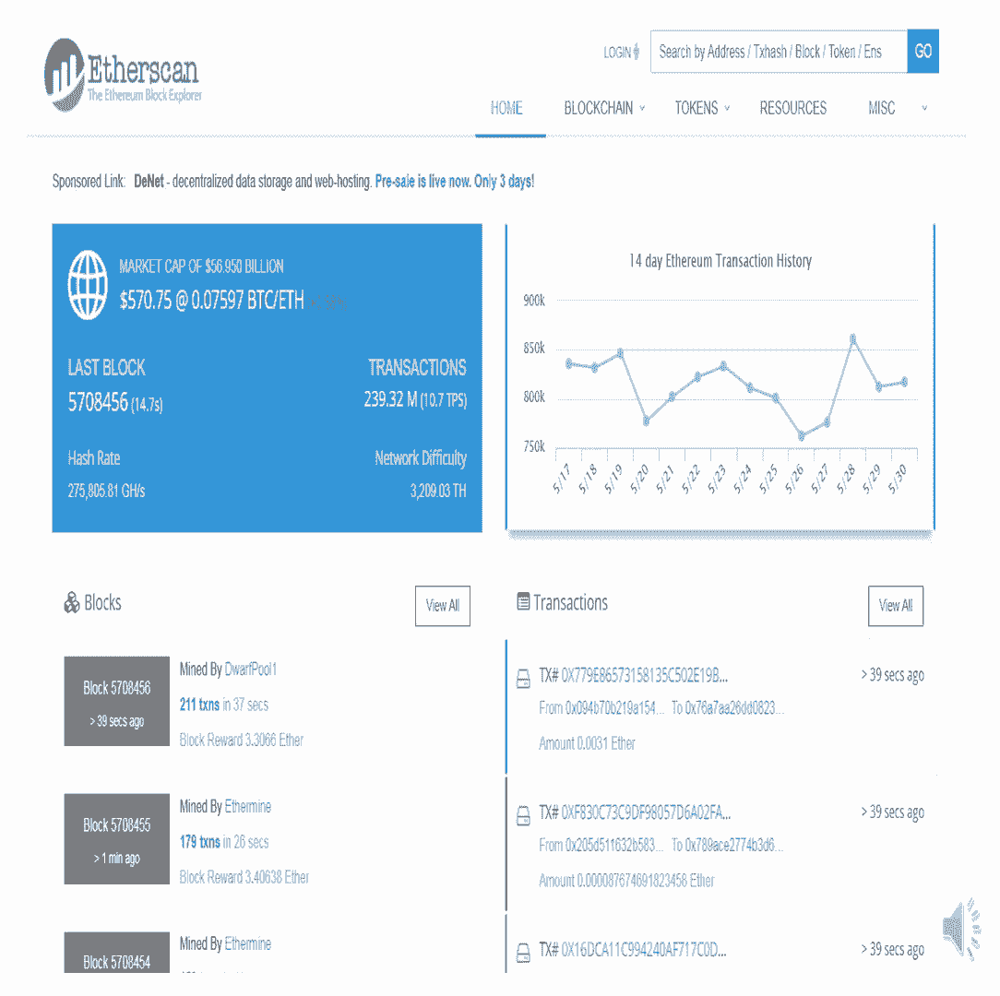
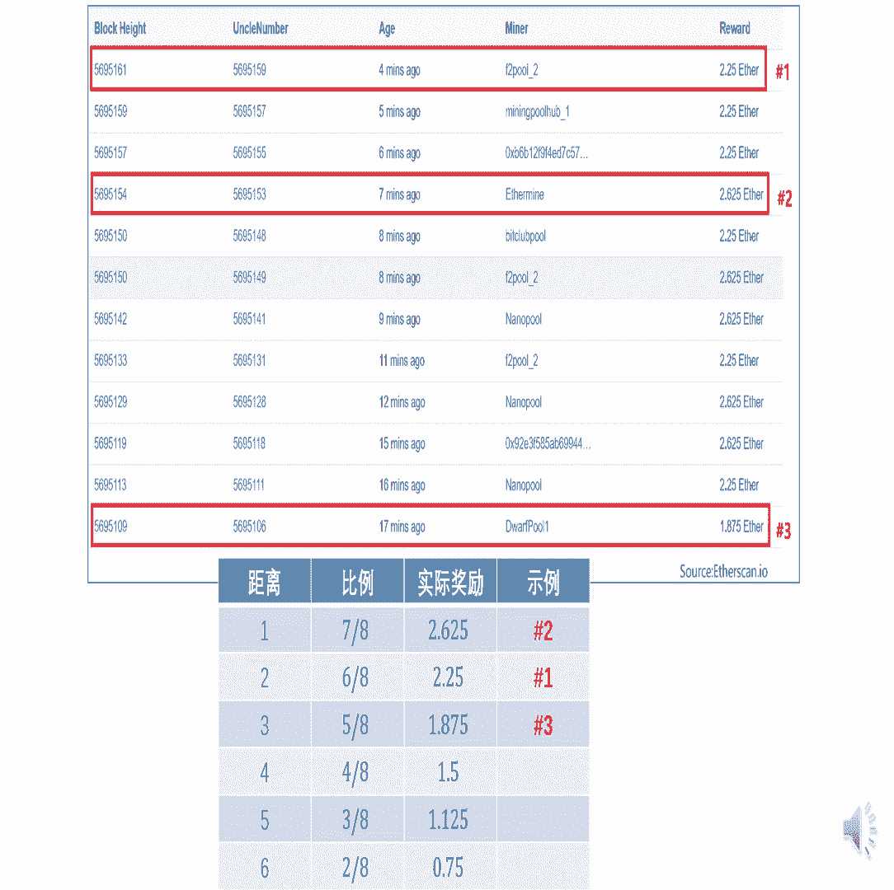
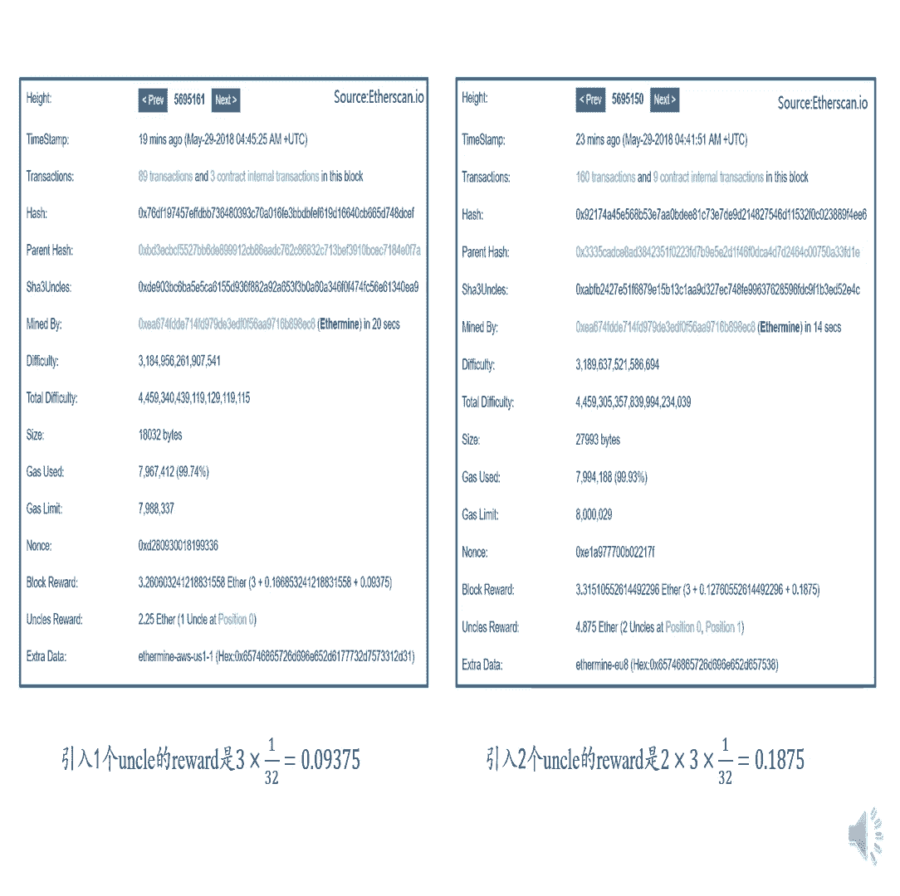
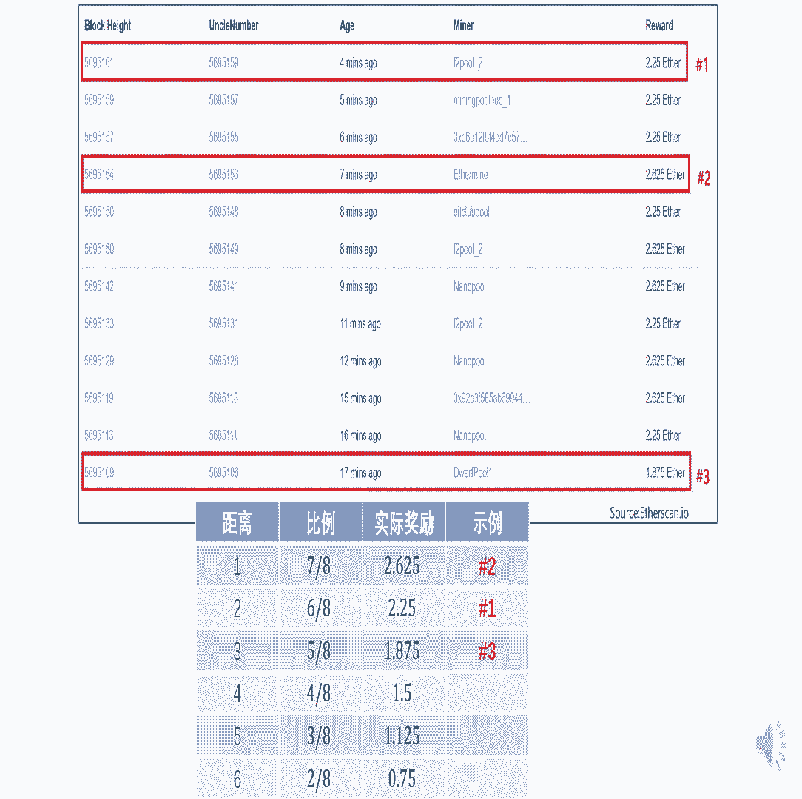

# 北京大学肖臻老师《区块链技术与应用》公开课 - P18：18-ETH-GHOST - 北京大学计算机系肖臻 - BV1Vt411X7JF

好今天我们讲一下以太坊中的共识机制，ghost的协议，以太坊把出块时间降到了十几秒，这对于提高系统的思路，put和降低反应时间来说都是很有帮助的，就跟比特币的十分钟的出块时间相比。

以太坊的出块速度相当于提高到了40倍，但是这样大幅度降低出款时间之后呢，也带来一些新的问题，我们前面讲过，比特币和以太坊都是运行在应用层的共识协议，它底层是一个p图p的over the network。

这个oa的network本身传输的时间是比较长的，因为他的托福协议做flooding的时候，没有考虑实际的拓扑结构，这就带来一个问题，就你发布一个区块之后，区块在网络上传到其他节点。

可能需要十几秒的时间，对于比特币来说，十分钟的出块时间相当于600秒，那么这个是足够让这个新发布的区块传播到网上的其他节点，当然了，即使这样，因为挖矿是个概率的过程。

所以仍然有可能只有两个矿工同时获得记账权，同时发布区块，我们前面讲过，这种情况下会带来临时性的分差，那么对于以太坊来说呢，这种临时性的分叉就会变成了常态，而且分叉的数目也会更多，因为十几秒的出块时间。

很有可能别的节点其实还没有来得及收到你发布的区块，等到他收到你的区块的时候，可能他自己已经挖出了一个新的区块，那么这对于共识协议来说有什么样的挑战呢，比特币的情况是这样的。

只有在最长合法链上的那些区块里面，其他的一些分叉的链上的出块奖励，其实最后是作废了的，我们可以画一个例子，然后呢这个地方分叉了，比如说分了三个叉，这三个差不多是同一个时间取得记账权。

那么最后有一个会胜出，成为最长合法链，比如说中间这个，那么像下面这个这个和上面这个这个区块，我们管它叫often block，或者叫still block，有的管叫still blog。

就是挖到这个区块的矿工，在这个区块里面有一个铸币交易，比如coin base transaction，能够得到一定数量的比特币，但这个实际上最后是没有用的，因为它不在最长合法链上。

所以这里得到的出块奖励最后等于是作废了，对于比特币来说呢，因为出现这种临时性分差的情况不是很多，所以呢这么规定还是可以接受的，但是对于以太坊来说，如果也这样处理的话，那么意味着什么。

意味着这个矿工挖到的区块有很大概率可能是白挖了，大家听明白了吗，你辛辛苦苦挖出一个区块，因为系统中分差很多呀，所以很有可能你挖出这个区块，他最后没有成为最强合法猎人，这时候你怎么办就作废了。

那这样对挖到矿的矿工来说不是很公平，尤其是对于个体矿工这种情况更为严重，我们前面讲过，现在呢挖矿呈现出两个趋势，一个是挖矿设备的专业化，现在已经很少有人用我们自己普通的桌面机啊去挖矿。

服务器多少一般都是用专门的设备，像asic芯片，或者对于以太坊来说呢，用gpu去挖矿，第二个趋势是什么，是大型矿池的出现，就是个体矿工啊，算力有限，有很多是组成的大型矿池。

就资本的运作有很多算力实际上是集中在大型矿池，这个不光是我们前面看到过比特币，是这样，我们下节课还会看到以太坊其实也是这样的，叫ming po，那么为什么说对个体矿工尤其是不公平的，正常情况下。

我们希望的情况是，你这个矿池能够得到的收益应该跟你所在的算力比例是一致的，比如说你这个矿石，你的算力是整个系统总算力的30%，假设你是个大矿石，那么你得到了挖矿的收益，也应该是整个系统的30%。

这样才算公平，但是如果我们这个共识协议设计不好的话，有可能这个大矿池得到的收益超过它算力的比例，比如说我们，刚出院分叉的时候，这个时候假设上下两个是个体矿工挖出来的区块，中间这个是某一个大矿石挖出来的。

那么下面会怎么变化呢，这个大矿石肯定是沿着它自己这个分叉往下挖，因为它的算力很强，所以它挖出下一个区块的概率是比较大的，而上下这两个分叉呢，他们是个体矿工的，它主要得寄希望于别的矿工。

会沿着他们的两个分叉往下挖，因为他自己的算力是微不足道的，它就是个个体矿工，光靠他自己沿着这个往下拉是比不过别人的，所以他只能是希望别人能够沿着他的脸望，但对于别的矿工来说呢，他看到这三个分叉。

他其实没有什么理由倾向于沿着这两个个体矿工的分叉去，挖就换句话说呢，你个体矿工如果是作为一个整体的话，它的算力是分散的，出现分叉之后，它算力是分散的，这样造成的结果是什么。

就是假设这个矿石本身挖到区块的概率是30%，但是他挖到区块之后成为最长合法链的概率是很高的，就很可能变成这个样子，这样就会造成什么叫manning centralization，是占便宜的。

这个挖矿的集中化，实际情况呢可能比这个更糟，有的可能是在网络中多个地方都有接口，所以呢这个大型矿池发布出去的区块，有可能会更早地被其他节点所收到，所以这三个区块就算是同时挖出来的。

那么中间那个大型矿石发布的区块，可能是别的节点最先收到的就是这个区块，而且呢从过去的历史经验来看，这个大型矿石所在的分差更有可能成为最长合法链，这个其实也就促使别的矿工会沿着这个分叉去继续挖。

因为你沿着别的分叉去挖的话，很有可能就白挖了，越是大型矿石得到的收益越大，这个manusation他的情况就更严重，这个有有的时候我们管它叫centralization bias。

就是中心化带来的不成比例的优势，大家听明白这个motivation了吗，就如果我们就什么都不改，以太坊就沿用比特币的共识机制，就会有一定问题，这个其实我们在很多节课以前已经暗示过了。

就讲为什么它这个设计是存在问题的，为什么要调整挖矿难度，调整罚款难度的目的是为了稳定出块时间，不是说越短越好，那怎么办呢，以太坊中呢采用了一个基于构思的协议，的共识机制。

这个构思的协议并不是以太坊发明的，就在以太坊出现以前，就已经有了ghost的协议了，以太坊对这个协议做一些修改，这个协议的核心思想是什么，就是你挖到了矿，发布一个区块，这个区块最后作废了，你挺伤心的。

我们给你一些安慰，给你一些奖励，所以这个时候你也能够得到一些出块奖励，就比如说我们说这种区块它没有成为最长合法链，变成了orphan block或者still block。

这个以太坊呢给他一个好听的名字，叫uncle block，为什么叫uncle blog，就这个区块，相对于这个最长合法链上的当前区块来说，它是它的舒服区块，就他跟他的父亲是一个辈分的，他他是舒服区块。

叫uncle block，然后呢它是这样规定了，就是说把这个认为是舒服区块，这样的话呢这个区块能够得到7/8的出块奖励，就以太坊的出块奖励呢，以前刚开始的时候是五个以太币。

就发布一个区块也能够得到五个以太币，去年下半年的时候呢，改了改成三个亿台币，所以这个出块奖励是多少，是7/8乘以三个以太币，说你挖到矿了，最后没有被认可，也能得到一定的好处，那对这个当前区块来说。

就对它是有好处的，大家听明白了吗，对它有啥好处，可以得到1/32的额外的出块奖励，就1/32乘以三，然后你自己本身挖到那个，三个以太币的奖励还是成立的，所以这就是你可以得到这么多出口角度。

说这个例子当中呢，上下两个，那么他得到了出发奖励呢，前面这部分还要乘以个二，大家听明白了吗，就这个协议的核心思想是对于你挖到了矿，但是最后没有得到认可的那些矿工给予一种安慰。

就虽然你挖的区块没有成为最长合法链上的区块，但是你仍然能够得到大部分的出块奖励，就7/8的出口奖励，这个比例是很高了，实际上大部分奖励你仍然是拿得到的。

这样设计呢有利于鼓励系统中出现分叉之后及时进行合并，就相当于是底下这个链上面的这个区块，把另外两个分叉链给招安过来了，就给你一点好处，你合并过来给他招安过来了，这是构思写一个最初的版本。

那下面我来问一个问题啊，这个版本的协议有没有什么缺陷，就如果就按照我刚才描述的这样设计，有没有什么缺陷，大家听明白这个协议怎么运作的呢，有一个问题他是怎么确定我出的这个块是奥可。

他怎么确定我出的这个块是uncle blog，你发布区块的时候，你不知道你是希望你发布的是个最长合法链上的区块，但是你可能你发布出去之后呢，别人也发布了，那么别人在发布下一个区块的时候。

就我们详细讲一下吧，就假设这个区块没有了，假设你发布这个区块，然后呢你听到有这个区块，那么这个需要跟你实际上是兄弟关系对吧，然后你开始挖下一个区块，因为你知道这个区块存在，所以你在挖下一个区块的时候。

就可以把这个区块认作你是你的舒服区块，就我们是两节课前吧，讲这个block header的数据结构，大家还记得吗，里面有一项就是舒服区块的哈，希值就有负区块的哈，希值也有舒服区块的哈。

希值就是你挖下一个区块的时候，就可以把这个设成你舒服区块，大家听明白了吗，过了一阵还有另外一个循环，那岂不是不下雨嗯，过一会儿你发现还有另外一个输入区块，那你下个区块要改对，就你挖矿的时候。

比如说你挖着挖着还没挖出来呢，发现这个数字区块也是存在的，你得改block header，然后你再继续挖，这个其实是对你挖矿来说没有什么损失，因为挖矿的过程是什么，我们前面说一个词。

无记忆的是memory，叫progress frame，就只要你当前还没有挖到区块，你把这个high的改完之后，重头再挖，跟你一开始就重头再挖是一样的，你并不吃亏，倒是，那你说你刚说的是他那个行log。

一般出现第三次哎，这是个问题，uncle blog只能爆发两个，如果出现第三个，这个哥们儿就不开心了，就我们首先设计这个协议的目的是什么，就如果你不给这两个一点好处的话，他们可能不愿意合并馆。

因为他一旦放弃自己所在的分叉，就什么好处都没有了对吧，所以你给他好处，把他招安过来，但只能招安两个，有出现第三个怎么办，这是一个问题，还有没有别的问题，就是我们说呀这个区块，就这个区块吧。

把它作为叔父区块的前提是什么，就刚才我们讲的过程是在挖这个区块的时候，已经知道这个区块的存在了，对不对，就是你发布这个区块的时候，然后你听到有这么个区块，你开始挖下一个的时候。

如果是你已经发布过这个区块，然后才知道这个区块，这个时候呢就来不及了，那这个虚化又变成什么好处都没有了对吧，还有就是说你知道的时候，如果出现三个舒服区块，那么也会存在一定的损失。

因为你这个舒服虚化得到7/8的出货奖励是很高的，你要不限制的话，一任100个叔父，那以太坊中的以太币就太不值钱了，所以他还是要有一定限制，还有一个什么问题，如果这个矿工比较自私的话，这也不叫也不叫自私。

就是都是矿石嘛，矿石是有竞争关系的，他出于商业利益，我挖这个区块的时候，我知道有这个区块，你这样会有什么后果，这样对这个叔父区块来说呢，7/8的出块奖励就得不到了，对他自己来说呢。

1/32的出货奖励是得不到的，好像是损人不利己是吧，但是你要从商业竞争的角度上讲，这么做对他的损失是比较小的，对这个矿工的损失是比较大的，所以有的矿石可能故意就这么做，大家听明白了吗，那怎么办呢。

把这个协议改一改，它往下再有一个区块，按道理来说呢，这个不是舒服区块对吧，他跟他爷爷是一辈儿的，但是以太坊规定不能论资排辈，这个还可以当做它的舒服区块，大家听明白了吗，这个如果再往下挖一个呢。

那这个好像更不对了，他是他的曾祖父那一辈的，但以太坊不管他还是他的叔父区块，这么规定有什么好处，能解决我们刚才说的那几个问题吗，其实你觉得可以解决这些问题，比如说如果他有第四个的话。

他就能拿多的1/32的出，下边那个挖出来，它就把那钱挣，就相当于你不仅没有把别人损了，你自己还把自己，就像你说的是这个如果某个矿石处于竞争关系，就不一定是你挖出来的对吧，你不可能这条链上都是你挖出来的。

甚至有可能是什么，这个区块不但不会是跟他一家，这个区块有可能跟他是一家的，大家想想是不是就挖出这个区块的那个矿工，看到底下这条链成为最长合法链之后，可能切换到这个地方来挖，大家明白了吗。

最后解决那个问题，其他的问题解决了吗，还有就是如果出现三个数字，出现三个数字区块，但是是不是，那那像您刚说的是，如果他要是有一一百个，这样是不是，对应该得做限制，就是我有个情况我知道。

比如说我是一个个人见，我知道我，但是呢我就在特定的阶，我持续产生这个输出性，首先你持续产生舒服节点，对你有什么好处，就你问的那个问题是很对的，我们实际上马上就会讲以太坊是怎么规定的。

就是因为我可能竞争不过打赢了，我要是在那个最长合法人，我可能发物品，不如我自己去搞一个输入方面，别人跟我结婚，反正我也不花时间，而且这个输入方式怎么着才会有，叔父矿池，不是你说的这个肯瑟是对的。

所以这个规定还是有问题，我们把协议改成这样，还有点问题，其实本质是什么，本质就是我们为了改进最初版本的构思协议存在的一些问题，所以呢我们把舒服的定义扩展不一定是当代叔父，可能是隔着几代的束缚。

但问题就在于隔多少代，是不是可以隔100袋，隔1000袋行不行，就刚才那个同学问的问题，就是那我就在很久很久以前挖矿难度比较低的时候，不断的产生舒服区块，大家听明白这个问题了吗，所以以太坊中怎么规定的。

这个黑板不够长，我们把它涂个重新画一遍嘛，假设这是最长合法链，这是最近挖出的区块，这是当前区块，如果在这个地方有一个分叉，这个区块是这个区块的，真的舒服，就是按辈分算，他确实是他的舒服，那么以太坊规定。

这个时候可以得到7/8的出牌奖励，如果往前推一代呢，是这个地方，他比他来说，那是上一代的舒服，这是当代舒服，这是上一代舒服，那么他就得到的是6/8的出块奖励，再往上推一代呢，这个越来越远。

得到5/8的出牌奖励，以此类推，这是4/8的书法奖励，3/8，2/8，这个地方呢，你们觉得是1/8对吧，以太坊中规定，这个就不算了，这个不行，这个画是不是太难看了，给它擦掉了。

只有这六个叔父区块再往前就不舒服了，大家听明白了吗，舒服区块的定义是什么，必须跟当前这个区块，就是这个区块在七代以内有共同的祖先才行，就从这个地方开始算，到我们这个地方，at most，seven。

在nation，超过期待就不认了，就这个区块的负区块是这个区块，然后这是当前区块，所以你数一下吗，1234567，正好七在眼内，换句话说，合法的叔父只有六个辈份，大家想想为什么要这么设计。

首先呢如果你不限制舒服的辈份，不限制隔多少代的话，那么这个实现起来对于一个全节点来说，他要维护的状态就太多了，因为他可能要记着隔着100代以前有哪些舒服区块，其他节点同样也是要验证一下的。

另外一个问题呢，设计最多隔着期待，并且在七代以内出块奖励是逐渐递减的，这样有利于鼓励出现分叉之后尽早进行核定，一出现分叉，你马上就要合并的时候，这个时候你能得到的出块奖励是最多的，是7/8。

你如果隔了好几代之后呢，初二奖励就越来越少了，你哥的代数太多了，就得不到任何书法奖励了，所以鼓励出现分叉之后及早进行合并，有一个问题我们刚才没有说这是叔父区块的奖励，我们管它叫做。

uncle reward，那对于这个区块来说呢，可以得到1/32的奖励，这个是固定的，就这个六个备份，对这个当前区块来说，得到了出块奖励，都是1/32，有问题吗，如果这个地方呢加一个区块。

这个区块算什么，这个什么也不算，他跟他是兄弟关系，就这个不算舒服，取款，另外呢我再解释一下，就我们设计这个协议呢，主要目的是为了解决系统中出现的叫临时性分差，以太坊也好，为什么规定这个最长合法链的原则。

为了防止篡改，使得交易不容易被篡改，其实也是为了解决临时性分叉，就最长合法链提供了一个出现临时性分叉之后进行合并的一种机制，就是最长链会胜出，如果这个分叉是别的原因造成的，那么这种方法是解决不了的。

就我们前面讲分叉的时候说过，我们这个讲的例子都叫state fork对吧，临时性的意见分歧，我们想办法把它合并，如果是别的原因，像我们以前讲那个比特币脚本的时候，check multic。

还记得这个操作是干嘛的吗，检查检查多重签名的合法性，我们讲这个操作的实现上有一个bug，他检查的时候会从堆栈里多弹出一个元素，所以实际上如果你正常操作的话，检查是通不过的。

你得先往里面压一个多余的没用的元素，就为了应付这个玩，为什么不把这个bug改掉，你改完之后版本不一样，中心化的系统不一样，中心化系统发布一个新版本，很容易你去中心化的系统，你这么一改的话，出现硬分叉。

就是这两条链如果不是因为对当前状态有意见分歧，而是说互相认为对方是非法的，那么用这种方法是合并不到的，大家听明白了吗，但是这个矿工如果认为这条链是非法的，他还是不会沿着你继续挖。

他还是沿着它那个分叉链是吧，因为他认为你的那个主链虽然最长，但它是非法的，再讲一个问题啊，我们说比特币发布一个区块，实际上得到的是两部分奖励，一部分呢叫做block，是reward的。

一部分叫做transaction fe，那么有的时候呢把这个叫做静态奖励，static reward，这个叫做动态奖励，因为你要执行这个交易才能得到传单和身份，以太坊中呢也是类似的。

也有一个静态的block reward，就是那三个以太币，就是block reward，动态奖励，它这个叫什么，叫gas费，汽油费，执行智能合约的时候可以得到汽油费，叫gasp。

我们讲的叔父区块得到7/8的奖励，只限于这个block reward，就是7/8乘以三个以太币底下，这个汽油费是得不到的，输出区块是得不到汽油费的，但是这个问题呢其实也不大，因为我们会看到。

我们待会儿会看一些实际的例子，汽油费所占的比例是很小的，大部分都是静态的出口奖励，这个跟比特币的情况是类似的，比特币也是说traction费只占很小一部分，我们之前看的那个例子。

喘那个身份大概是占了出块奖励的1%，有问题吗，好像这个是如果这个出块一块，那个出完之后，所有的那个，我没有听明白是就是后面到后面的这个区块的价值，这个矿工的收益完全比交易费这个。

你说因为比特币他这个出怪奖励是每隔4年减半，所以等到它趋于零的时候，就变成交易费占主流了，如果按照这个情况，在这个以太坊里面看到后面的话，他的uncle去玩什么。

所以你担心的就是以太坊当中如果也变成了block reward趋于零，那么那个舒服区块uncle reward是7/8的乘以一个趋于零的数，也是趋于零的，呃这个是这样的。

以太坊当中没有规定定期要把出块奖励减半，这个没有这个规定，就是比特币，那么规定是为了人为制造稀缺性，以太坊中没有这么规定，以太坊中的五个以太币去，年下半年降降为三个以太币，不是为了这种人为制造稀缺性。

它实际上是跟我们下节课要讲的，下节课或者下两节课要讲的挖矿难度调整有关的，就去年大概10月份左右出过什么事情呢，挖矿难度的计算公式里，那个难度炸弹被回调了300万个区块，这样导致挖矿难度大幅度下降。

他为了维护公平性，也是为了维护总供以太币的供给量不要出现剧烈变化，所以他就把这个以太币的block reward从五个降到了三个，这是一次性的，并没有说以后会不断的下调，就你顺便说一下比特币。

实际上大家一般把它当做什么，它是用来储值的，以太坊呢这个以太币呢有些人把它比喻成石油，它是用来花的，用来消耗，然后可以执行智能合约的，这个比喻不是完全的恰当，因为呢石油是什么，你花完之后，这石油就没了。

比如说你开汽车消耗汽油的，汽油消耗掉之后就没了，以太坊当中你执行智能合约是要消耗gas的，但这个gas只是从一个账户转移到另外一个账户，因为你是你，你执行智能合约的时候，你发布智能合约要付出gas费。

执行智能合约的那个矿工可以得到盖茨费，所以说这个比喻也不是完全恰当，但这这，这就这两个加密货币的设计理念是不一样的，以太币没有定期减半的这种说法，还有别的问题吗，那我来问一个问题啊，叔父去划你的交易。

要不要执行，我们上节课说过以太坊是什么，是一个交易驱动的状态机，比特币其实也是一样的，所以你在这条链上每次发布一个新的区块，都会使当前状态转移到下一个状态，对不对，现在你引入了舒服区块。

要不要执行叔父区块中的交易，你觉得不应该，为什么，万一他那个不是他那个区块，跟他他的上一个区块跟他舒服一块，可以交易40那个线条，那个量词那个什么，所以说如果输入区块里面有跟我相同的教学，那我就不用。

但是有一些就是说了不一样的交易输入区块，刚才那个同学说的其实是对的，你说的这个情况，就是那个同学说是不应该执行，原因是什么，就这个主链上的最强合法链上的负区块，这是它的输副区啊。

他们两个交易是有可能有冲突的，你刚才从哪种方法呢，只执行一次就行了，就合在一起都执行，问题是不同交易有可能是不能够执行的，就比如就像比特币一样，可能也是有有冲突的交易，他这里没有那种。

就就他跟比特币不太一样，就是说比特币我们说要做double spending attack detection，要检测是不是双花攻击，你这个呢双方攻击是通过账户余额，你花两次，我给你截两次对吧。

但是有可能一个交易花了之后，另一个交易都没法花了，你要去执行这个叔父区块的交易，可能有些交易就变成了非法交易，它的舒服区块本身不一定是非法的，你执行完你负区块的交易，再去执行副区块。

再去执行舒服区块的交易可能就变成非法了，执行之前不是有个查一个交易，那你可以进来进来吧，我后面还有好多呢，我担心你是不是生病了，哈哈哈哈哈，你等多久了，没等我说完啊，行那个刚才说哪来着。

你刚才说什么来着，就是说就是说他对确实就是他说服里面有一个交易，跟他这个不仅的这个交易可能会冲突，但是我的意思执行就是说我把它舒服的交易放在提前，我也会检查一下这个何不可。

反正带我去进我本身区块这个交易我检查完之后再回去检查，他输入这个交易不合法，不是有这一步，不是你实际上说是改进一下，不能执行就算了，你是这个意思吧，不是有检查，总得就是检查这个交易的合法，总得有这一。

其实以太坊不是这么做的，就这么做会很乱，就这状态机的这个状态就弄乱了，就不是沿着一条链下来了，就等于是你执行这一条链上的交易，同时还把分叉链上交易也都执行了，这个实际上不是这样的。

以太坊中只有在最长合法链上一条线下来，叔父区块这些交易，这个区块是不执行的，而且他根本就不检查这个舒服区块交易的合法性，问题来检查过不是输错虚化t的，检查过了。

就是他收到这样一个他知道这样一个舒服区块的时候，它只检查一个东西是什么，什么你这个区块有没有是啥意思，就是你不是说在说的一个数和区块二分音比较单，还不知道有这个舒服区块，我不是说这种情况。

但是检查出的区块的那个收收收款地址，检查师傅去外收款地址，不是检就检查那玩意干嘛，他是要查一个东西，他查的是什么，他查的这是不是一个合法发布的区块，换句话说这个区块是不是符合挖矿难度，这个是要查的。

只要不查的话，因为有束缚区块机制，你随便发布一个垃圾东西，就是你可能根本没有获得记账权，就发布一个东西出去，我也不要求在主链上，你把我当叔父就行了，这个是要查的。

就是只要那个舒服区块是符合挖矿难度要求的，这个只差ht就行了，那么我们就认为它是个合法的舒服区块，这个是不减少的，反正也不执行舒服，区块的交易也不会执行，因为执行起来就跟那个同学说的。

可能跟我们这个主链上的交易是冲突的，大家听明白了吧，这就有可能再来一个问题，然后这个以太坊说我15秒钟，而那就是说其实我这里交易未必真的被打败了，但是这个主链上可以再把这个交易放进去。

就你的问题是说我有个交易发布，所以我那个交易本身并没有得到执行，这个矿工不吃亏，他还是得到奖励了，但我那个交易没执行，那主链上的节点收到你这个交易之后还会继续执行，可能你会要再等一个区块。

但还是会执行的，最终是flooding到所有节点的，还有问题吗，他是那个输出曲儿，它是怎么检测的，就是说他前面的那个多少，他怎么检测他前面的链上有多少舒服区块，但是听到一个就查一下。

就是每个发布区块你得说明你的负区块是哪个区块对吧，所以可以检测到你是不是你的副区块跟我当前区块是不是有共同属性，没有问题，我再问一个问题啊，我到这节课举的所有叔父区块的例子，有一个共同的特点。

你们发现没有，都是分叉之后的第一个区块，对不对，产生后果有第二个块块哎，对我就想说这个如果分叉之后，后面还跟着一串那些怎么办，就比如说我把这例子改一改啊，就不是这样，改成啥样了，这个地方还是连着的。

然后后面是这么串起来的，前面是个最长合法链，下面是一个分叉列，比如说这个区块，这个区块算不算是他的舒服区块，好像应该算是吧，按辈份是算，那为什么我们不能设计成一个协议，把这个整条链当作舒服去画，给他们。

每个区块一点奖励，鼓励它合并上去，一分差的这个就是鼓励分叉过一个不合并，生产生产没关系，我会继续追的，我分产的这个，反正我也有奖励，但是合并之后才有奖励，就这么规定会有什么问题，你们几个的直觉都是对的。

觉得这样有有些奇怪的地方，不对劲的地方，如果你这么规定，会有什么问题，就相当于以前我们是招安的时候是单个招安，现在呢你已经拉出一个队伍来，把你整个队伍招揽过来，大家还是一家，免得出现两个分叉的链。

我觉得就这样做的，就是我觉得他还是只给他那个头，只给那个头，后边不能飞，但是呢把头的前面后面跟了多少下分了啊，你说你把这个协议改了，这个奖励还是只给这个投，但是给这个投的奖励要跟后面的人评分还是不能改。

我觉得就只是给给那个头，后边那个都不怎么算，如果要是后面那个也算的话，那就相当于他那个就他就可以不在那儿病了，他就可以往后再挖几个，然后再去湖南上，你说的基本是对的，实际上如果这么改的话。

会找这有什么问题，分叉攻击就变得太便宜了，大家还记得分叉攻击是怎么搞的吗，比如说在这个地方有一个大额的交易，a转给b一大笔以太币，那么b呢看到这个交易之后等了一些确认，等了这么多的确认区块。

他认为肯定没问题了对吧，后面都跟着这么一长串，然后呢，a发动分叉攻击，把它转给他自己，这个如果要分叉攻击成功，需要下面这条链比上半条链还要长，对不对，这个代价是比较大的，因为风险很高。

如果这条链不能变得比上面的长，那这一长串的区块都白挖了，这就是分叉攻击的代价，但是如果你把构思协议改了，把这些都认作是叔父区块，每个给一点奖励，让他整体合并上来的话，那样分叉攻击的风险就大幅度下降了。

反正我就先分叉攻击，你，攻击成了，我就把你的交易回滚了，攻击不成，你反正把我招安过去，我也能得到一些出块奖励，大家听明白了吗，所以以太坊中规定只有分叉后的第一个区块可以得到uncle reward。

后面的都不行，这个其实跟刚才你说的这个想法是差不多的，就鼓励出现分叉之后及时进行合并，如果你再沿着那个分叉往后面挖的话，就白挖了，有问题吗，没有问题，我们下面看一下以太坊中的一些真实的情况。

大家知道it s can dot io这个网站吗，可以实时查看以太坊的当前状态，右边这个曲线显示的是过去两个星期的交易历史，这个截图的时间比较早，这是5月底截的图，然后呢左下方显示的是最新被挖出的区块。

右下方显示的是最新的交易。

这个显示的是输出区块的几种情况，这里的每一行对应一个束缚区块，第一列的block heat就是区块的序号，也就是block number，像第一行就是图中第一个红框。

这个舒服区块的序号比这个区块本身要小两个，这个说明是一个距离为二的舒服区块，应该得到6/8的奖励，那么6/8乘以三个以太币的话，就是2。25个以太币呃，接下来的两行都属于这种情况的舒服。

再往下一行就是到第二个红框，这一行输入区块的区号只比它小一个，说明是当代舒服，那么应该得到7/8的奖励，7/8乘以三就是2。625个以太币，然后接下来这几行都是属于要么是当代束缚，要么是在上一代的束缚。

说明实际系统中大多数分差都很快得到了合并，最下面这一行呢舒服区块的序号比这个区块小三个，那么应该得到5/8的奖励，5/8乘以三是1。875个以太币，下面这个表格给出了不同辈份的束缚。

得到的uncle reward的数目。

我们看两个区块的具体例子，应该是距离为二的舒服，我们可以看到倒数第二行这个uncle reward是2。25，这个区块得到的奖励，就他本身得到的reward，倒数第三行，这个部分是由三块内容。

第一部分是固定的三个以太币的出块奖励，第二部分是汽油费，就是这个0。16685，后面一长串，这个这个就是汽油费，就是这个1/32的呃，出块奖励是0。09375个亿台币，一个是距离为一的当代舒服。

另外一个是距离为二的上一代的束缚，所以他这里倒数第二行的uncle reward，2。25+2。625，就等于这里的4。875个以太币，是两个uncle的reward，合在一起是4。875个以太币。

然后这个区块得到的reward就倒数第三行也是三部分内容，其中第三部分0。1875比左边那个区块恰好是多了一倍，因为它引入的是两个n口，所以要乘一个二，这两个区块在前面一页的ppt上都是有的。

大家可以通过第一行这个had就区块的had来查一下，比如说左边那个区块的hide是5695161。

这个就是呃第一个红框对应的这一行，然后右边那个区块呢是第二个红框下面的这两行就是block hide，是5695150的，这两行每个舒服区块单独占一行，大家看看有什么问题吗。

那没有问题的话。