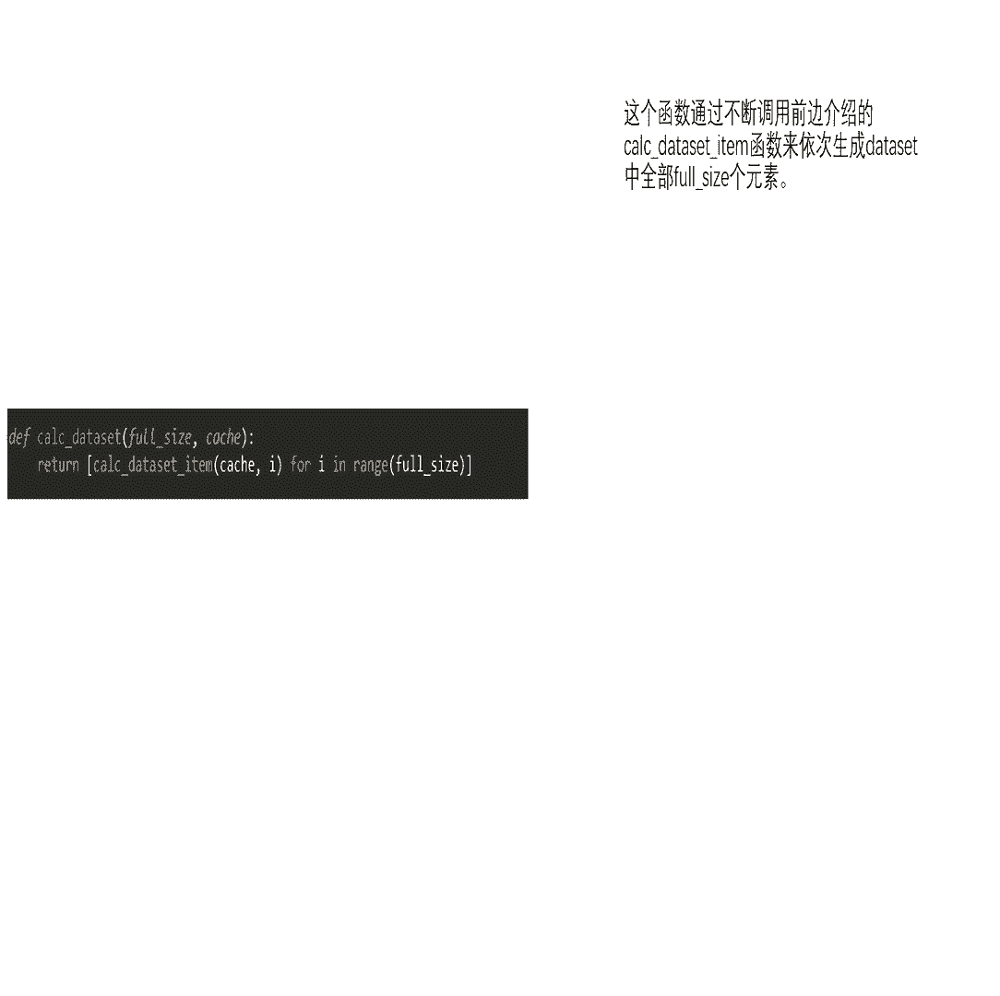
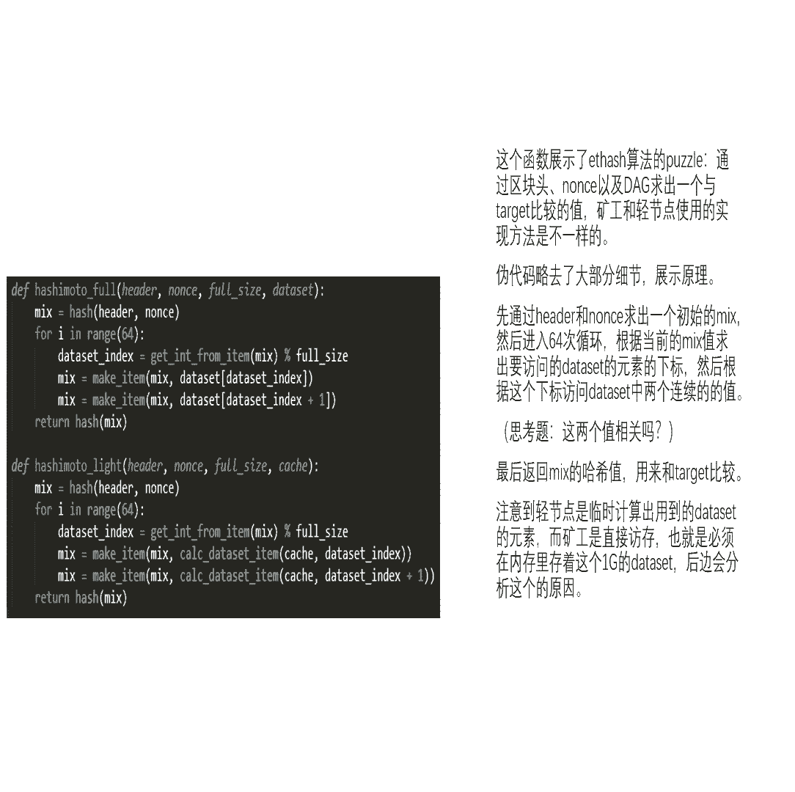
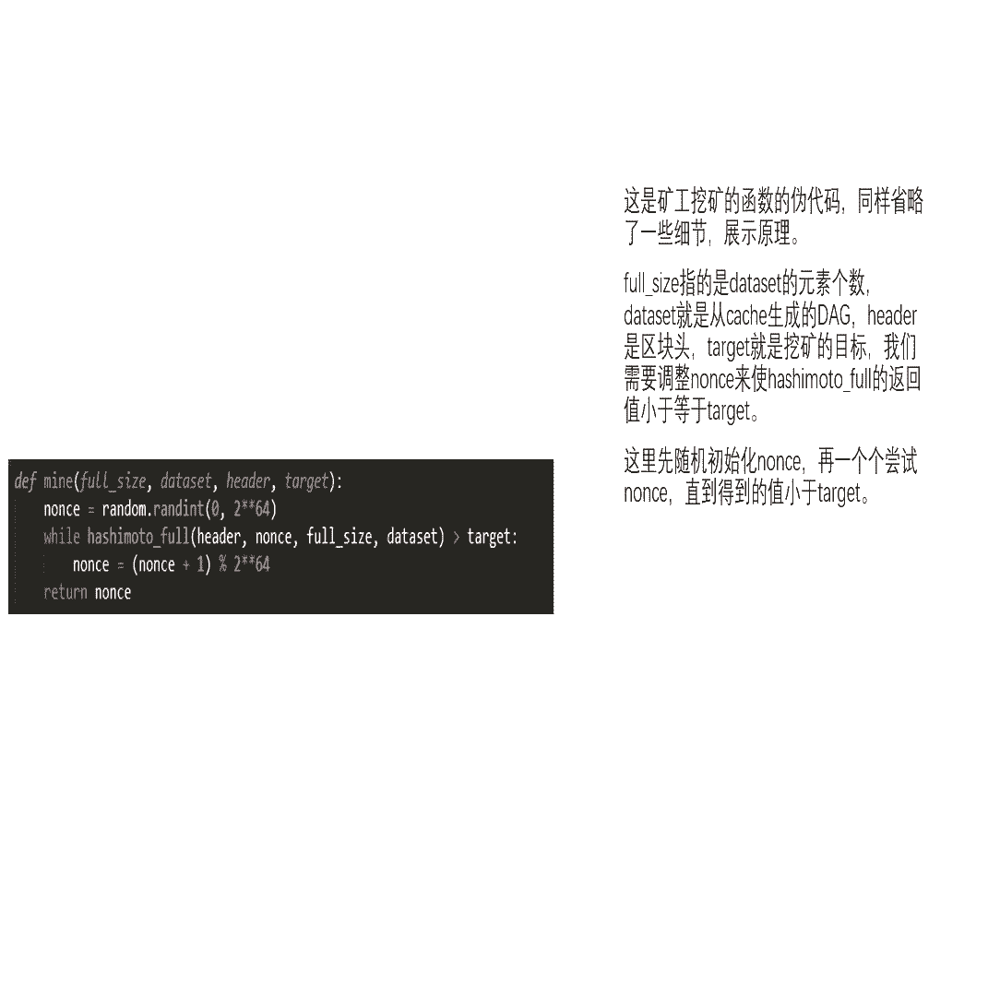
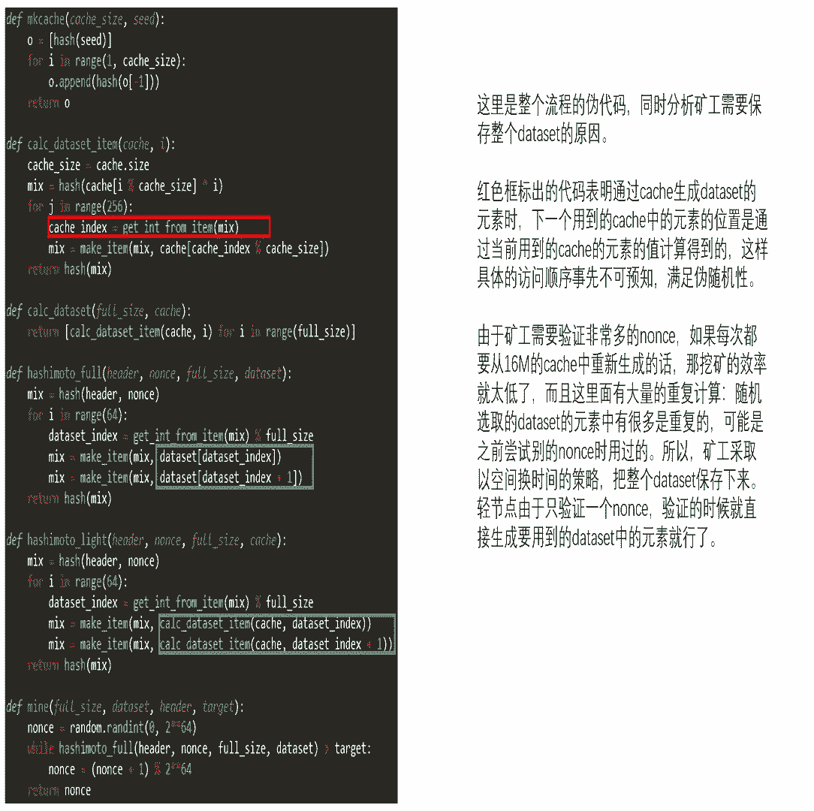
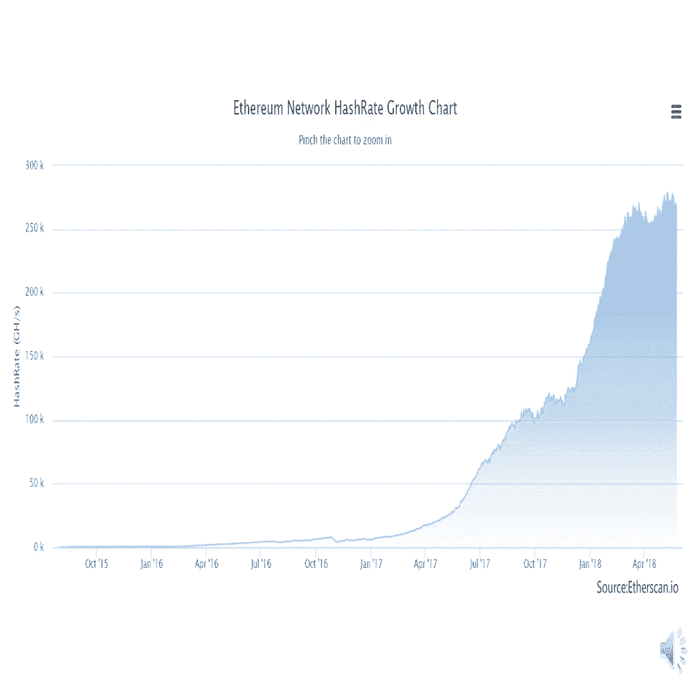

# 北京大学肖臻老师《区块链技术与应用》公开课 - P19：19-ETH-挖矿算法 - 北京大学计算机系肖臻 - BV1Vt411X7JF

今天我们讲以太坊中的挖矿算法，所以我们有时候说，blockchain，is secure，比特币当中用的挖矿算法，总的来说是比较成功的，经受了时间的检验，到目前为止呢，没有人发现里面有什么大的漏洞。

大家听说过八个帮体吗，有谁听说过这个词吗，bt这个词的意思是赏金的意思，就是我们看有的美国电影里有叫，当天行程，赏金猎人专门去抓那些政府悬赏捉拿的逃犯，那这个bug帮体的意思是说。

有的公司悬赏来找软件中的漏洞，如果你能够找到他们软件中的什么安全漏洞，就可以得到一笔赏金，这叫bug帮挺比特币的挖矿算法是一个天然的bug，帮铁如果你能找到里面的漏洞，或者是某一个挖矿的捷径。

就所谓叫shortcut，就能取得很大的利益，但是到目前为止还没有人能够发现有什么捷径可走，所以说比特币的这个挖矿算法总的来说是比较成功的，是经受住时间检验的。

但是比特币的挖矿算法也有一些值得改进的地方，其中有一个饱受争议的问题，就是挖矿设备的专业化，用普通的计算机挖不到矿，只能用专门的设备，专用的asic芯片来挖矿。

那么很多人认为这种做法与去中心化的理念是背道而驰的，也跟比特币的设计初衷是相违背的，它里面提出了一个说法叫做，one cpu，one mo，理想状况下应该让普通的老百姓也能够参与挖矿的过程。

就用自己家里的桌面机，笔记本电脑甚至手机来挖矿，这样也更安全，因为算力分散之后，有恶意的攻击者想要聚集到51%的算力发动攻击，这个难度就会大得多，所以呢比特币之后出现的很多加密货币。

一个目标就是要做到asic resistance，那么怎么才能够设计出一个对ac的芯片不友好的manding puzzle，一个常用的做法就是增加这个puzzle对内存访问的需求。

也就是所谓的memory hard慢镜帕走，为什么要这么做呢，ac的芯片相对于普通计算机而言，它的主要优势是什么，主要优势是算力强，就计算能力很强，但是在内存访问的性能上并没有那么大的优势。

就比如说你用同样的价格，你买一个ac矿机跟买一个普通的计算机，这个a c矿机的计算能力可能是普通计算机的几千倍，因为它里面有很多核能进行大量的并行计算，但是内存访问上面的性能差距并没有这么大。

远远没有这么大，所以如果我们能设计出一个对内存要求很高的puzzle，那么就能够起到遏制asic芯片的作用，那怎么设计呢，这方面一个早期的例子就是莱特比。

这个莱特币曾经是市值仅次于比特币的第二大加密货币，他用的这个paddle是基于ascript，这个是一个对内存要求很高的哈希函数，以前适用于计算机安全领域的，跟密码相关的。

那么它的具体设计思想是说我开设一个很大的数组，比如说我们画在哪儿呢，画这儿吧，然后呢按照顺序填充一些尾随激素，就比如说第一个数呢，我有一个种子节点，有个seed的值。

把这个seed的值通过一些运算算出一个数来填在第一个位置，然后后面每个位置都是前一个位置的值，取哈希得到的，这为什么叫尾随基数，因为你哈希取完之后算出来的值是什么，你也不知道，看上去就是乱七八糟的书。

就好像是随机数一样，但实际上我们不可能真的用随机数，真的用水泥树的话没法验证，就这样填充完，那么这个数组填充的一个特点是里面的取值是有前后依赖关系的，是从第一个数依次算出来的。

然后需要求解这个paddle的时候，按照伪随机的顺序从这个数组当中读取一些数，每次读取的位置也是跟前一个数是相关的，就比如说我们要解puzzle了，我们一开始读取读取这个位置的数，就a这个位置的数。

把a这个位置的数值读取读出来之后呢，根据它的取值进行一些运算，算出下次要读取的位置，比如说是b这个位置，然后把b这个位置数读出来，再经过一些运算得到下一个读取的位置，比如说c这个位置。

这个也是一种伪随机的顺序，因为它经过哈希运算之后，得到下一个读取的位置，这样做有什么好处呢，如果这个数组开得足够大的话，那么对于挖矿的矿工来说就是memory hear，因为如果你不保存这个数组。

那么挖矿的计算复杂度会大幅度上升，大家听明白了吗，就比如说需要读取这里面这些书的时候，你没有保存这个数组，那你怎么办，比如说求解paddle的时候，一开始需要读取a这个位置的数，你没有这个数组的话。

你还得从第一个数依次算算出a这个数的值，然后呢要读取第二个未知数，你这些没有存起来，那么再算一遍，算到b这个位置值，然后下面是c也一样啊，算到c这个位置是这个计，算复杂度会大幅度上升。

所以要要想高效的挖矿，这个内存区域是需要保存的，当然了，有的矿工可能保存一部分内存区域的内容，比如说这个数组当中只保留基数位置的元素，偶数位置的元素就不存了，这样数组可以少一半儿。

那你用到偶数位置怎么办呢，你根据另外一半去算一下，就它计算复杂度会提高一点，但它内存呢可以减少一半，这个有时候管它叫做，写哪儿呢，time，memory，迟到，大家听明白这个设计了吗。

这个设计你们觉得怎么样，哈哈哈哈哈，有什么想法吗，大家听明白的怎么设计的吗，就是大体上意思是感觉，就是说不是让那个不能让他一直就是只使用cpu进行计算，而且就是要尽量让它进行保存，这个操作降低呃。

对就是你说的基本上是对的，就是核心思想是什么，不能像比特币那样主要就行哈，希运算比特币其实也不是取一次哈，希他学了两次哈，希但这个不够，要增加它的运算过程中对内存访问的需求。

就是我们要设计一个对ac的芯片不友好的，让普通计算机能参与的，那怎么办呢，就按你设计的这个任务，更像是一个普通计算机干的事情，而不像是一个挖矿专用的asic芯片怪的事情，普通计算机呢内存是很大的。

然后的话当然普通计算机还有别的特性，它还有一些很大的硬盘什么的，所以就就要利用它这个特性设计这个puzzle的资源，对资源的需求，特别像是普通计算机对资源的配备比例。

所以大家觉得这个paddle挺好是吗，这个puzzle好的地方是对矿工来说，挖矿的时候是memory hard，坏的地方是什么，唉对对清洁点来说也是memory哈，我们前面讲过。

我们设计paddle的时候的一个原则是什么，要求解ple很难，但求解完之后呢，要验证那个ple应该很容易才对，这个问题就在于验证这个puzzle需要的内存区域。

跟求解这个puzzle需要的区域几乎是一样大的，你清洁点要验证的时候，你也得保存这个数据，要不然的话它计算复杂度也是大幅度提高，就对于ascript的早期的计算机安全领域，这个密码方面的话。

这个不是个问题，它没有清节点验证的问题，但对于我们这个厂商来说是不行的，这样造成一个什么结果呢，就是莱特币真正使用的时候，这个内存区域不敢设置的太大，比如说你设一个1g的数组，这对于计算机来说呢。

问题是不大的，1g的内存问题不大，但是如果是一个手机上的app，1g的内存可能就太大了，因为这个原因呢，实际莱特币在使用的时候，这个数组只有，128k，这个是非常小的，连一兆都不到，就100多k。

就是为了照顾清节点，那么最后的效果怎么样呢，当初莱特币在发行的时候，目标不仅仅是asic resistance，而且还是gpu resistance，就是你挖矿最好是连gpu都不要用。

就大家都用普通的cpu挖矿就行了，结果怎么样呢，后来就出现了用gpu挖矿，再后来就出现了ac的芯片挖矿，实践证明，莱特币要求的这个128k的内存，不足以对ac的芯片的生产和设计带来实质性的障碍。

所以从这一点来说，莱特币这个设计目标是没有达到，但是他早期宣传了这个设计目标，对于解决莱特币的能启动问题是很有帮助的，任何一个加密货币都存在能启动的问题，一开始的时候没有人知道你这个加密货币。

你就发现一个货币也没有人理你，那怎么办呢，没有人参与，这是一个问题，而且对于基于工作量证明的加密货币来说，挖矿人太少是不安全的，因为发动恶意攻击的难度就太低了，比特币的早期也是不安全的。

后来呢变成少数几个人在挖矿，那个时候如果你想对比特币系统发动恶意攻击是很容易的，那么比特币是怎么解决这个能启动的问题呢，现在，谁也说不清楚了，但总的来说是一个循环迭代的过程中，本聪宣传的多了。

对比特币感兴趣的人就多了，然后参与挖矿的人就多了，比特币就变得更安全了，那么它的价值也就提高了，然后呢对比特币感兴趣的人就更多了，挖矿的人也就更多了，然后比特币变得更安全了，价值就更进一步提高了。

就形成一个良性循环，莱特币呢虽然没有达到当初的设计目标，但是他早期的这种宣传，让更多人参与的这个理念，对于聚集人气来说是很重要的，所以呢莱特币一直到现在仍然是一，个比较主流的加密货币。

除了这个many puzzle之外，莱特币跟比特币的另外一个区别是莱特币的出快速度是比特币的四倍，它的出怪间隔是两分半，而不是十分钟，除此之外呢，这两种加密货币基本上是一样的，嘿嘿。

那以太坊呢也是用一种memory harman pad，但是在设计上呢跟莱特币有很大的不同，以太坊用的是两个数据集，一大一小小的是一个16兆的cash，大的数据集是一个一致的data set。

这个叫做蛋，这1g的数据集是从这16兆的cash生成出来的，为什么要设计成一大一小的两个数据集，就是为了便于验证清洁点，只要保存这16兆的cash就行了。

只有需要挖挖矿的这个矿工才需要保存这1g的大数据集，那他的基本思想呢是这样的，这个小的数据集，这个cash的生成方式，跟我们前面讲的这个数组的生成方式是比较类似的，首先从一个种子节点经过一些运算。

算出数组的第一个元素，然后呢依次取哈希，第一个元素取哈希得到第二个元素，第二个元素取哈希得到第三个元素，这样把这个数组从前往后填充这些尾随激素就得到一个cash，然后下面呢跟莱特币就不一样了。

莱特币是直接从这个数组当中按照伪随机的顺序读取一些数，然后进行运算，以太坊呢是要先生成一个更大的数组，我们这地方没有按比例画，就这个大数组应该比下面这个小数主要大得多，这个图上看好像就大一点。

因为黑板画不下了，而且呢有一点就是这个小的cash跟这个大的dataset都是定期增长的，每隔一段时间它这个大小要增大，因为计算机的内存容量也是定期增长的，比如说这个大的dataset现在已经涨到2。

5g就已经不是一个g了，那个大的数据集怎么生成的呢，它的每个元素都是从这个小的cash里按照伪随机的顺序读取一些元素，方法跟刚才讲的莱特币里面求解拍照的过程是类似的，比如说第一次它实际上是说第一次。

比如说读取a这个位置的元素，读取完之后呢，对当前的哈希值进行一些更新迭代，算出下一个要读取的位置，比如说b这个位置，然后把b位置的数呢再进行一些哈希值的更新，算出c这个位置。

那么从这个cs里面怎么来回读，一共读256次，读256个数，最后算出来一个数，放着，这个大的data set的第一个元素，然后第二个元素也是一样的。

就这个data set的每个元素都是从这个cash里面，按照伪随机的顺序读取256个数，然后不断地进行迭代更新，最后得到一个哈希值存在这里面，然后求解这个pd的时候用的是这个大数据集中的数。

这个cash是不用的，按照伪随机的顺序，从这个大的数据集中读取128个数，就一开始的时候呢，根据这个区块的块头，算出一个初始的哈希，根据这个哈希映射到这个大数据集中的某个位置。

比如说这个位置把这个数读取出来，然后呢进行一些运算，算出下一个要读取的位置，比如说是这个位置再把这个数读取出来，它这里有一个什么区别呢，他每次读取的时候，除了计算出这个位置的元素之外。

要把它相邻的一个元素也要读取出来，所以这个例子当中呢是每次读取的时候是读取两个相邻的元素，这样循环64次，64轮循环，每次读两个元素，所以一共是128个数，大家听明白了吗，最后算出一个哈希值呢。

跟我们挖矿难度的目标阈值比较一下是不是符合难度要求，如果不是的话，把这个block header的lance再替换一下，换另外一个nice，然后重新，因为你nice换之后。

你第一次算出的那个哈希值就变了，然后又重复这个过程，根据这个哈希值找到数组中的元素，读取两个相邻的元素，然后反复循环64次，再得到一个哈希值，然后再去比较。

这个high level的过程大家有什么问题吗，这个听上去是比较抽象，所以这部分内容我们准备一个ppt，我们先有没有什么还需要回答的问题，好那下面我们可以看一下这个p p t。

这个p p t用的代码呢是我们自己写的一个伪代码，我们没有直接用以太坊当中的源代码，我们这个伪代码呢省略了源代码中的一些实现的细节，这样更有利于同学们直接理解，对于我们这节课这个教学目的来说。

这个伪代码是已经足够了好吧，我们来看一下这个伪代码，第一步，首先生成16兆的cash catch中，每个元素都是64个字节的哈希值，生成的方法与莱特比类似。

第一个元素种子的哈希就是这个参数seed的哈希，后面每个元素是前一个的哈希，这个cash的内容每隔3万个区块会变化一次，这个c的每隔3万个区块会发生变化，然后重新生成cash中的内容。

同时cash的容量要增加原始大小的1/128，也就是16兆的1/128，等于128k，第二步是从这个cash生成一致的大数据集，我们先看一下这一页上calculate dataset item这个函数。

这个函数的功能是通过cash来生成大数据集中的第二个元素，基本思想是按照伪随机的顺序读取cash中的256个数，每次读取的位置是由上一个数的数值经过计算得到的，这里用的两个函数。

get int from item和make item，是我们自己定义的，源代码中是没有的，我们把源代码中一些相关的内容总结成了这两个函数，这样可以屏蔽掉很多源代码中不是很重要的细节。

这个get in from item函数，就是用当前算出来的哈希值求出下一个要读取的位置，然后make item函数，用cash中这个位置的数和当前的哈希值计算出下一个哈希值，这样迭代256轮。

最后得到一个64字节的哈希值，作为大数据集中的第二个元素，这个calculate dataset是生成整个1g数据集的过程，就是不断地调用前面这个函数来依次生成大数据集中的每个元素。

这一页的两个函数分别是矿工用来挖矿的函数，和清洁点用来验证的函数，我们先看一下上面这个函数，这个矿工用来挖矿的函数，它有四个参数，hide是当前要生成的这个区块的块头，以太坊跟比特币一样。

挖矿只用到块头的信息，大家还记得这样设计的原因吗，就为什么要设计成挖矿只用块头的信息，这样的话清洁点只下载块头，就可以验证这个区块是否符合挖矿的难度要求。

第二个参数nice就是当前尝试的nice值以太坊，就像比特币一样，挖矿的时候也是要尝试大量的nt才能找到一个符合要求的，第三个参数，复赛是大数据集中元素的个数，这个元素的个数每3万个区块会增加一次。

增加原始大小的1/128，也就是一致的1/128等于八兆，最后这个参数dataset就是前面生成的那个大数据集，挖矿的过程是这样的，首先根据块头的信息和当前的nice算出一个初始的哈希值。

然后要经过64轮的循环，每一轮循环读取大数据集中，两个相邻的数读取的位置是由当前哈希值计算出来的，然后再根据这个位置上的数值来更新当前的哈希值，这跟前面生成大数据及时的方法是类似的，循环64次。

最后返回一个哈希值，用于跟挖矿难度的目标阈值相比较，这里我们提一个小问题，每次读取大数据集中两个相邻位置的哈希值，这两个哈希值有什么联系吗，是没有关系的。

每个都是由前面那个16兆的cash中的256个数生成的，而且这256个数的位置是按照伪随机的顺序产生的，这个是构造大数据集的一个重要特点，这才给清洁点的验证提供了方便。

所以每次读取的这两个相邻位置的哈希值是没有什么联系的，下面这个函数呢是清洁点用来验证的函数，也是有四个参数，但是含义呢跟上面那个矿工用的函数有所不同，清洁点是不挖矿。

当他收到某个矿工发布的一个区块的时候，这里用来验证的这个函数的第一个参数header是这个区块的块头，nice是发布这个区块的矿工选好的，清洁点的任务是验证这个nice是否符合要求。

验证用的是16兆的cash，也就是最后这个参数这个cash注意第三个参数，复赛仍然是大数据集的元素，个数跟上面那个挖矿用的函数里的for size的含义是一样的，这个并不是cash中的元素个数。

验证的过程也是64轮循环，看上去与挖矿的过程类似，只有一个地方有区别，大家看出来了吗，就比较一下这一页的两个函数，上下两个函数有什么区别，每次需要从大数据集中读取元素的时候，因为清洁点没有保留大数据集。

所以要从cash中重新生成其他地方的代码逻辑是一样的，每次从当前的哈希值算出要读取的元素的位置，这个位置是指在大数据集中的位置，但是清洁点并没有这个大数据集。

所以要从cash中生成大数据集中这个位置的元素，我们前面说过。

最后这个函数是矿工挖矿的主循环，其实就是不断尝试各个nice的过程，这里的target就是挖矿的难度，目标跟比特币类似，也是可以动态调整的，nice的可能取值是从0~2的64次方。

对每个nice用前面讲的那个函数算出一个哈希值，看看是不是小于难度目标，如果不行的话，那么就再试下一个nice。

最后这一页是前面讲过的所有函数的一个汇总，同时解释了为什么清洁点可以只保存cash，而矿工要保存整个大数据集，大家能看明白上面的解释吗，这个能看明白吗，其实清洁点做一次验证的计算量也不算少。

同样要经过64轮循环，每次循环用到大数据集中的两个数，所以一共是128个数，每个数是从cs里的256个数计算得到的，跟比特币相比，以太坊中验证一个nice的计算量要大很多，但是仍然在可以接受的范围内。

相比之下，矿工如果每次都这么折腾的话，代价就太大了。

因为要常识的nt太多了，那以太坊设计的这个puzzle实际效果怎么样呢，到目前为止，以太坊挖矿主要还是以gpu为主，用asic矿机的很少，所以从这一点上来说呢，他比莱特币要成功。

起到了asic resistance的作用，这个跟以太坊这个挖矿算法需要的大内存是很有关系的，就这个算法叫做，yes hash，以太坊的挖矿算法，这个名字起的很有意思。

前三个字母e t h是以太坊的代码叫eta，后面那个hash h是用了两遍意思hash，矿工挖矿需要1g的内存，跟莱特币的这个128k比，这个差的有8000多倍，即使你这个16兆的cash。

跟这个128kb也要大了100多倍，所以这个差距是很大的，而且这个还是按照这两个数据集的最初的大小来算的，因为它定期会增长嘛，你要按照现在这个大数据低2。5g来算的话，那差距就更大了。

以太坊呢没有出现四个矿机，还有另外一个原因，就以太坊从很早就开始计划要从工作量证明转向权益证明，就所谓的从这个proof of work转向proof of，这个我们以前提到过一下。

所谓的权益证明就是按照所占的权益进行投票来形成共识，就不用挖矿了，权益证明是不挖矿的，就类似于股份制公司，按照股票多少来进行投票，这个呢对于a c矿机的厂商来说是个很大的威胁。

因为ac的芯片的研发周期是很长的，一款芯片，从设计研发流片到最后生产出来1年的周期就已经算是很快的了，而且研发的成本也很高，那么将来以太坊转入权益证明之后就不挖矿了，那么这些投入的研发费用就都白费了。

其实呢以太坊到现在为止还是基于工作量证明，这个以太坊很早就说要转入权益证明，但是转移的时间点一再的往后推迟，到现在也没转过来，但是他不停地宣称要这么做，所以呢要想达到aic resistance。

一个简单的办法就是不断地吓唬大家，大家注意啊，我可说了，我们下面要搞权益证明是不挖矿，所以你就不要设计a c矿机了，你设计出来到时候也没用了，因为你涉及到1年嘛，我们1年以后就不挖矿。

那等过了1年发现不行，还是得继续挖矿，那怎么办呢，再吓唬一次，我们最多再挖1年，然后真的就是不挖了，所以你还是不要再设计了，不要搞ac的芯片，就大家如果看一下历史的话，以太坊成为一个主流的加密货币。

其实就是最近2年的事情，以前市值很小的时候，没有人会去设计asic芯片，因为划不来啊，无利可图，等到市值上来之后呢，你这么吓唬他几次，就能起到ethic resistance的作用。

这也是另外一方面的原因，关于以太坊的挖矿呢，还有一个要说明的就是，以太坊当中呢采用了预挖矿的过程，所谓的预挖矿并不是说真的去挖矿，而是说在当初发行货币的时候，预留一部分货币给以太坊的开发者。

就有点像创业公司会留一部分股票给创始人和早期员工赢，将来这个加密货币成功了的话呢，这些预留的币就变得是很值钱了，像以太坊的早期开发者现在就都很有钱，比北大教授要有钱多了，那么跟这个比特币相比呢。

比特币就没有采用primanding的模式，所有的比特币都是挖出来的，只不过早期的时候挖矿的难度要容易得多，与priming相关的一个概念叫preserve。

precel就是把prem当中预留的那些币通过出售的方法来换取一些资产，然后用于加密货币的开发工作，就有点类似于像拿风投或者众筹，如果你看好这个加密货币的未来，那么可以在preceil的时候买入。

将来这个加密货币成功之后呢，同样可以赚很大一笔钱，大家有问题吗，那下面我们看一下以太坊上的一些统计数据，这个图显示了以太坊中货币供应量的分布情况，总共有大约1亿个以太币。

每个以太币的市场价格是500多美元，这里的数据是两个月前的，现在以太币的价格已经降到460多美元了，整个以太坊的市值大概是500多亿美元，下面这个图显示了这一个以太币的来源。

绝大部分是通过primanding的方法产生的，上线以后再挖出来的一台b中，block reward占了绝大多数，uncle reward就是上节课讲的舒服区块，得到了奖励，只占很少一部分，大家看。

到这些有什么感想，有没有觉得毁三观，挖矿挖得再努力，关键还是不能输在起跑线上，这个图显示的是最大的25个以太坊矿石所占的算力比重，可以看出挖矿集中化的程度也是很高的，尤其是最大的几个矿池所占的比例很高。

与比特币的情况类似，这个图显示的是以太币的价格随时间变化的情况，我们可以看到在以太坊早期的那几年，价格基本没怎么涨，真正的大涨是去年才开始的，2017年这1年价格涨得非常猛，直到今年初达到了顶峰。

1300 400美元，然后开始走下坡路，这个图显示的是以太坊的市值叫market capitalization，这个跟上一页刚才显示的价格的走势基本上是符合的。

这个图显示的是以太坊的hash rate的变化情况，我们前面讲过，哈斯瑞德是指系统中所有的矿工加在一起，每秒钟计算的哈希次数，可以看到hash rate从总体来说是处于上升趋势的。

而且也是从去年开始大幅度上升的，今年以太币的价格下跌了不少，hash rate总体上趋于平稳，并没有出现明显的下降，大家注意不同的加密货币，如果采用的many puzzle不一样的话。

那么他们的hash rate是不可比的，比特币和以太坊的hash rate就不能直接比较，因为以太坊中尝试一个nice的工作量要比比特币大得多。

同学们有什么问题吗，那最后我再说明一点啊，到目前为止，我们这节课上讲的都是挖矿的算法设计，要尽可能的让通用计算设备也能够参加，参加的人越多，挖矿的过程越民族。

这也是为什么莱特币以太坊要设计这种memory hear慢镜帕子，但是也有一些人有不同的观点，认为让通用计算设备参与挖矿反而是不安全的，像比特币那样，只能用专门的aic的芯片挖矿才是更安全的，为什么呢。

你们谁能猜一下吗，就是如果他说他的意思是如果用ac平面上比较安全，其实意思是攻击比特币的成本会比较，但是如果是每个人的电脑都可以起到这样的，那么攻击它的成本就是比较低的，哎这个说的很对。

就假设你要对比特币系统发动攻击，你应该怎么做，你需要投入大量的资金买入这些a4 个矿机，这样才能够聚集到发动攻击所需要的算力，而这些矿机呢除了挖矿之外，干不了别的任何事情。

而且是为某一个加密货币设计的挖矿芯片，只能挖这种加密货币，像比特币的a c的芯片，你去挖莱特币就不行，所以呢发动这个攻击的成本是很高的，早期需要投入大量的硬件资源，而且一旦攻击成功之后，会出现什么情况。

比特币系统的安全性被证明存在问题，大家对比特币的信心会大幅度下跌，然后比特币的价格也会跳水，这样早期投入的硬件成本就收不回来了，你比特币本身都不值钱了，你买的那些比特币的矿机当然也不值钱了，相反的呢。

如果让通用计算设备能参与挖矿的话，那么发动攻击的成本就大幅度下降了，因为没有必要为了发动攻击而去专门购买特制的硬件设备，比如说有很多大公司，大的互联网公司，它在全世界的服务器有几10万台甚至上百万台。

那么需要发动攻击的时候怎么办呢，只需要把这些服务器调动起来，都来挖矿就行了，就平时这些服务器可能是为了满足公司的日常业务而服务的，攻击的时候，临时征用起来用来挖矿，没有必要专门买特殊的设备。

那么攻击结束之后呢，这些服务器又可以恢复原来的用途，该干嘛就干嘛，这样的话发动攻击的成本就大幅度下降了，当然了，你可能说这种大型的互联网巨头不会干这种事情，它的业务发展会不会干这种事情。

即使这个互联网公司本身不干这种事，情，有恶意的那些攻击者，某些组织机构也有可能通过云服务来租用这些服务器集群，达到同样的目的，所以呢有些人就认为让通用设备参与挖矿是不好的。

ac和矿机一统天下才是最安全的，大家有问题吗，没有问题，我们这节课就上到这儿了。