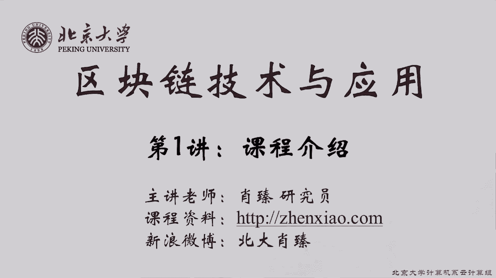
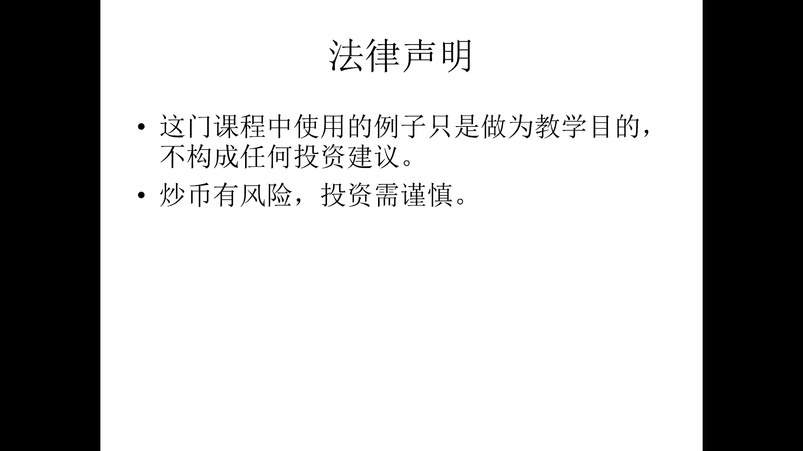

# 北京大学肖臻老师《区块链技术与应用》公开课 - P1：01-课程简介 - 北京大学计算机系肖臻 - BV1Vt411X7JF

大家好，欢迎同学们来参加我们的这个暑期课，这个夏天天气很热，大家能够安下心来学一门课是非常好的，我是北京大学计算机系的肖真研究员，平时呢我在北大是教研究生的算法课的。

所以同学们如果是计算机系或者是智能系的研究生的话，那么应该上过我的课，就最近2年非常火的一个技术，互联网，也有人说它是世界上最慢的数据库，好像是今年3月份刚刚有人这么说的。

那么确实如果你把它当数据库用的话，它是非常的慢，而且只实现了数据库中很小一部分功能，从历史上看，说它是像蒸汽机一样伟大的发明，但无论是哪一种呢，就，但是这些说的人很少，很多是其实是不怎么懂的。

有很多其实只是在讨论商业模式，而且是比较务虚的商业模式，这个其实也是我们开设这门暑期课的目的，比社会上绝大多数人都要强，这个图显示的是比特币的价格变化情况，我们可以看到早些那些年比特币刚发行的时候。

价格变化不是很明显，从去年开始，比特币有一个爆发式的增长，这是2017年的1月，你看那穿在上面多猛，去年是加密货币大爆发了1年，各种加密货币涨得都非常的猛，今年呢又从这个上面这个尖峰又开始往下掉了。

就这个图呢我要说明两点，错过了比特币暴涨的好时候，现在还是处于非常早期的阶段，所以大家从现在入手的话，应该算是这个领域的先行者，算是排面，第二点呢，不要被比特币限制了想象力。

这个图显示的是各种加密货币所占的市场份额，这个是按百分比显示的，我们可以看到早期的时候基本上是比特币一家独大，底下有很少一点，这个份额是莱特币，而到了现在呢，比特币所占的市场份额按照百分比来算的话。

已经是萎缩了很多了，大概是2015年，这个时候出现了以太坊，一开始的时候呢还不是特别引人注目，但后来逐渐成为一种主流的加密货币，我们这门课主要讲的就是比特币和以太坊这两种加密货币。

这是我们这门课的基本信息，这门课程呢是面向计算机专业的研究生，就我们假设大家在本科的时候已经有了一定的计算机基础，了解数据结构，了解一些基本的算法，有一定的编程经验。

这门课的教材是bitcoin and cryptocurrency technology，这个呢中英文版本都可以，市面上都是有卖的，大家注意一点，就我们这门课的内容跟这个教科书的内容有很大的区别。

这本书虽然是2016年出版的，但是现在呢已经比较过时了，而且呢我们讲课的时候也不按照书上的顺序讲，而是按照我自己的思路讲，我们也不会用他的ppt，我们这门课是以板书为主的。

然后会配合一些我们自己准备的ppt，这本书主要是讲比特币的，就以太坊部分呢我们没有找到很合适的教科书，所以以太坊这方面主要是大家得看一些它的白皮书，黄皮书，还有就是涉及到智能合约编程的。

看一下solidity的这个文档，另外就是看源代码，以太坊他这个技术发展的比较快，另外中间也经过了很多轮的修改，所以文档都不是很完美，甚至以太坊黄皮书上的一些内容，跟它真正的代码实现也有一些小的差别。

我们遵循的是以代码为准的原则，所以有遇到遇到有一些搞不清楚的地方，我们都是看源代码，这门课是一门公开课，是全程录像的，就大家可以看到后面这个摄像机呃，将来这个课结束之后，我们会把拍摄的视频放到网上。

给全社会公开来看，当然这个录像呢是录我不是录你们，就是前面这几个座位是会被摄像机拍到的，你们要是不想被拍到的话，你们可以坐到教室的其他地方去，其他地方应该都是拍不到的，另外就是课上的提问和讨论。

有可能把你们的声音会录进去，这个呢如果你不希望你的声音被出现在公开课上的话，那么你在课后跟我说一下，我们在后期制作的时候，可以把你的声音这个提问的过程给你抹掉。

另外就是同学们不要因为这个有了课程视频就不来上课了，看视频跟到课堂上这个效果是不一样的，而且呢有些ppt的内容，这个摄像机拍出来是看不清楚的，像这种文字的问题不大，这个文字的你可以看清楚。

如果是要展示代码的话，那么他摄像机拍出来之后，有的时候是比较比较模糊的，这个当然我们后期视频制作的时候也会想一些办法来处理一下，但总的还是希望大家能够呃能够来上课，这是我们这门课的教学大纲。

这是第一部分比特币，这个是第二部分，以太坊，然后我们说一下教学人员安排，我叫肖珍，有关我的个人信息，大家可以去我的home page上看一下，就是这个真小点com这个home page呃。

你们也可以关注我的新浪微博，北大肖真，不过我最近几年很少更新微博了，现在主要是用朋友圈了，这门课的助教是潘立臣和张振超，他们分别是我的博士生和硕士生，就这是一门新开的课，这两位助教是非常的辛苦。

为这门课做了很多的准备工作，进行调研啊，查阅各种文档啊，准备ppt，这门课有一个微信群，方便大家进行一些讨论啊，助教答疑之类的，如果你选了这门课的话，一定要加入这个微信群。

因为有的时候呢上课时间有可能做一些临时性的调整，比如说像下个星期是学院的夏令营呃，招收明年入学的博士生，这个可能就会对我们课程的安排有一些影响，最后说一下啊，不是教大家怎么炒币。

所以我们不会讲哪个币能够涨十倍，其实你们以为我知道吗，这我也不知道这些东西嗯，这门课用的所有的这个例子，加密货币的例子都是出于教学的目的，不构成任何投资的建议，炒币有风险，投资需谨慎。

大家对于这个课的安排还有什么问题吗。

好没有问题的话。