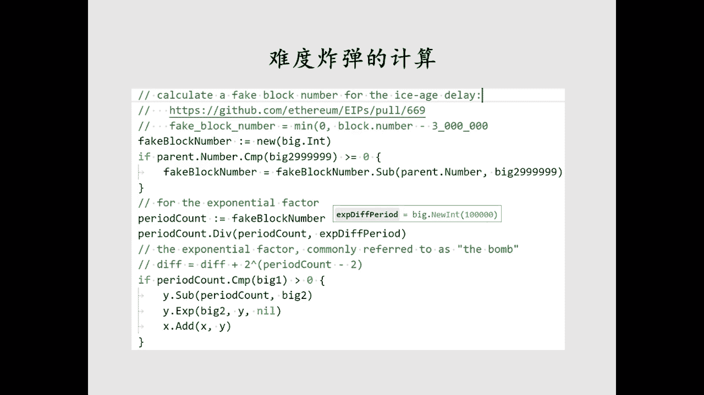
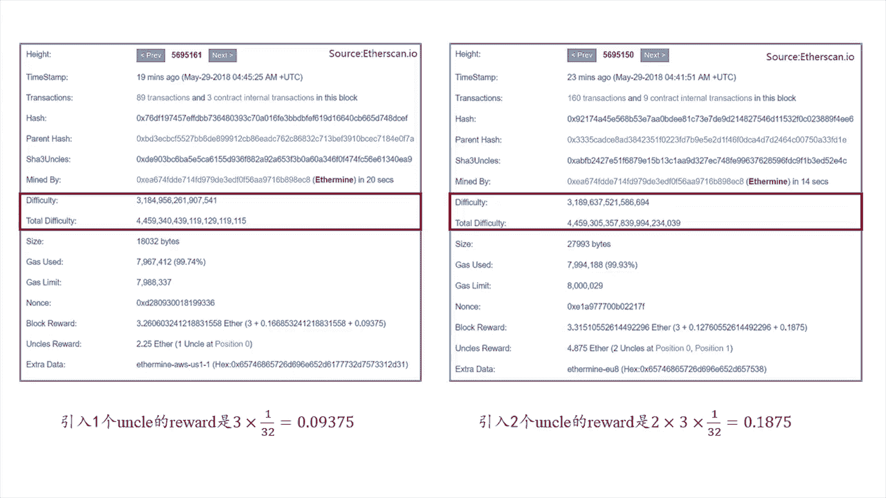

# 北京大学肖臻老师《区块链技术与应用》公开课 - P20：20-ETH-难度调整 - 北京大学计算机系肖臻 - BV1Vt411X7JF

这节课我们讲一下以太坊当中的难度调整算法，比特币是每隔2016个区块会调整一下挖矿难度，目标是维持出块时间平均在十分钟左右，以太坊是每个区块都有可能调整挖矿难度，调整的方法也比较复杂。

而且改过好几个版本，网上的一些资料，像论坛啊，博客呀，对这方面的介绍也有很多不一致的地方，包括以太坊的黄皮书跟实际代码也有一些出入，我们呢遵循以代码为准的原则，从以太坊的代码当中找到了这部分的内容。

把它们总结了一个ppt，这是难度调整的公式，这里的h是指当前这个区块，这个hi就是这个区块的序号，dh是这个区块的当前的难度，那么这个难度调整的公式有两部分，这个max括号里的是第一部分。

我们有时候也管它叫基础部分，它的目的是为了维持出块时间，大概在15秒左右，后面这个根的abco是第二部分，也称为难度炸弹，它主要是为了向权益证明过度。

就将来的以太坊呢想把共识机制从工作量证明逐步转入权益证明，我们先看一下第一部分，第一部分调整的方法是在负区块的难度基础上加上一些字调整的部分，这个ph这个红框里的就是负虚化的难度，后面那个字调整的部分。

我们下一页ppt会详细介绍，所谓的负区块就是当前区块链的最后一个区块，我们正在挖的这个区块来说，它是这个区块的负区块，那第一部分的难度调整呢有一个下限，就是这里的d0131072 ，就是这一部分呢。

不论你去怎么调整，最小不能低于这个难度，这是为了保证挖矿有一个最低的难度，后面这个伊布就是难度炸弹部分，我们先看一下第一部分，这里的x是调整的力度，是负区块的难度除以2048，所以呢调整难度的时候。

不论是上调还是下调，都是按照这个力度的整数倍进行调整的，按照副区块的难度的1/2048作为调整的一个单位，下面这个看上去比较奇怪的符号是c格玛，那么它是y减去后面的一项是sega的取值呢。

跟两个因素有关，一个是出块时间，另外一个就是有没有舒服区，管就是副区块，有没有舒服区块，那么为什么要跟叔父区块相关呢，因为如果是就当前区块链的最后一个区块，它包含有舒服区块的话。

那么这个时候系统中的货币总供应量是增加的，因为舒服区块要得到区块区块奖励，那么包含舒服区块的这个副区块也要得到一定的奖励，所以这两个合在一起呢，就会使货币的总供应量增加。

那么它为了维持系统的总供应量的稳定，一种平衡，所以当前正在挖这个区块的难度就要提高一个单位，后面这个-99是说难度调整这个系数部分有一个下限，就前面这部分max的，前面这部分有可能是正的。

也有可能是负的，如果是负的话，说明难度要往下调，那么最多是一次性只能调整99个单位，每个单位就刚才说的是副区块难度的1/2048，所以一次性下调难度最多是2048分之九十九，我们仔细看一下这个公式啊。

这个y就是我们刚才说的，取决于有没有输出区块，有输出区块的话，y等于二，没有束缚，虚化的话，y等于一，那么不论是哪种情况呢，它都是个常数，所以实际上是个常数减去后面这一项。

但如果后面这一项比前面这个常数大的话，剪出来是个负数，说明这个难度是要下调的，相反的呢，如果后面这一项比前面那一项要小的话，剪出来就是个正数，说明难度要上调，我们看几个具体的例子。

像hs是我们当前这个区块的时间处，后面这个ph是负区块的时间处，那么，这两项相减就是当前这个区块的出块间隔，这个出块间隔除以九，然后向下取整，为什么要这么设计。

比如说我们当前这个区块的区块时间是在一秒到八秒之间，这个时候呢这部分算出来是多少，是零对吧，那么y减去零，我们假设没有束缚区块，那么y是等于一的，那么这整个就是等于是一说明这种情况下难度要上调一个单位。

这个也是合理的，因为我们希望保持的出块时间是稳定在15秒，现在的触发时间变成了一秒到八秒，说明出块速度有点太快了，我们把难度上调一个单位，维持一下平衡，相反的呢，如果初二时间是在九秒到17秒之间。

那么这部分算出来多少，算出来就是一对吧，前面也是11-1，就等于零，说明这个时候出块时间是符合要求的，我们希望是15秒才九到17秒之间，这个时候可以不用调，就是光考虑基础部分，不考虑后面的难度。

炸弹的话，这个就是可以不用调，第三种情况，如果上面这一项减完之后是在18~26之间，那么这个算算是多少，12对吧，就变成了1-2等于-1，说明难度要下调一个单位，我们希望出块时间是稳定在15秒左右。

你现在超过18秒了，所以要下调难度，那如果这个出块时间更长呢，比26秒更长，那么下调的幅度也会更大，但是不要忘了我们上一页的时候，那个公式里max的第二项，就这个地方有一个-99。

就如果单词的出发时间非常非常长，你可能前面算出来是个负的很厉害的数，但是你一次性下调也不能超过99个单位，这个主要是为了防止一些系统中出现的异常情况，像一些，黑天鹅事件，正常情况下。

它不应该出现这么大幅度的下调，前面就讲完了，第一部分，基础部分，下面讲难度炸弹，这个呢是以太坊中设计的比较有意思的地方，他的初衷是这样的，以太坊的共识机制要从工作量证明逐步转入权益证明。

而权益证明是不挖矿的，这就带来一个问题，那些已经在挖矿设备上投入了大量资金的矿工，会不会联合起来抵制这个转换，大家听明白了吗，就比如说我已经花了好多钱买这些矿机，投入了很多资金用来以太坊上了挖矿。

现在告诉你告诉我，你说你要改成搞权益证明了，那我这些挖矿的设备都没用了，那我肯定就，有意见，所以以太坊就担心到那个时候大家不愿意转入权益证明，本来呢从工作量证明转入权益证明，就是要经过硬分叉来实现的。

就大家可以想想，为什么相当于你改了这个共识协议了，如果因为这个挖矿设备，有些人不愿意转过来，造成社区的分裂，那么可能出现的情况就是以太坊可能分裂成两条平行的，那那怎么办呢，为了避免出现这种情况。

所以以太坊在设计这个难度调整公式的时候，就加了一个难度炸弹，我们看一下这个难度炸弹的设计有什么特点，就当初设计这个难度炸，弹的时候没有，第二行没有减去300万。

这一行就是第一行直接用的就是hr当前区块的序号，没有这个hr一撇这一项，这公式有什么特点，当前的区块号除以10万向下取整，然后作为二的指数，也就是说难度炸弹这部分的取值是呈指数形式增长的。

那么指数函数的特点是什么，早期的时候就以太坊刚刚上线不久的时候，区块号都比较小，所以难度炸弹这部分算出来的值是很小的，就基本上可以忽略不计，那么难度调整主要还是由我们刚才讲完的第一部分基础部分来决定的。

或者说是由系统中的出块时间来决定，然而呢随着时间的推移，区块号变得越来越大，这个时候难度炸弹的威力开始逐渐的显现出来，我们知道指，数函数增长到后期速度是非常恐怖的，所以当初设计的思想是。

等到这个难度炸弹的威力开始发挥出来的时候，也正好是以太坊需要从工作量证明转入权益证明的时候，那个时候因为挖矿变得越来越难了，所以大家也就愿意转入权益证明了，因为你不转的话，你你想挖出矿来就太费劲了。

这是当初设计以太坊的时候的一个如意算盘，但实际情况怎么样呢，基于权益证明的共识机制，实际设计出来，有很多问题要解决，远远没有当初想象的那么顺利，这样造成的结果就是转入权益证明的时间点被一再的推迟。

然后出现的情况啊，就是挖矿已经变得越来越难了，因为难度炸弹的威力已经显现出来了，但是大家还是得继续挖，因为没有别的方法可以达成共识，大家听明白了吗，就原来是担心大家不愿意转。

现在变成了你就是想转也没法转，因为权益证明的共识机制还没有开发出来呢，这个情况到去年大概45月份到中旬的时候就已经很明显了，就是出块时间就逐渐的开始增长了，原来是说要稳定在15秒。

那个时候就变成了从15秒不断地增加16秒，17秒，最后增加到30秒左右，而且如果你不采取措施，还会继续增长上去，那怎么办呢，以太坊最后在一个e i p当中。

就ism improvement proposal当中决定计算难度炸弹的时候，要把区块号回退300万，个区块来计算，就在公式中把真实的区块号hi减去300万，算出这个hr一撇。

这个可以看作是一个假的区块号，然后算难度炸弹的时候是用这个假的区块号去算，大家听明白了吗，这个给权益证明的上限争取了一些时间，那么这样做的结果怎么样呢，我们可以大致的算一下。

就这个图就显示按前面那个公式，这个y轴是难度炸弹，这个fc的取值x轴是区块号，是以10万为单位的，我们可以看到在早期的时候，区块好像比较小的时候，这个难度炸弹的作用是很不明显的，基本可以忽略不计。

那么难度调整主要是根据系统中的出块时间进行调整，然后呢就我说明一下，就是这个图的前半部分是按照原来那个公式算的，就是在没有决定回调之前的原始公式算的，就直接用正常的区块二算，就大概在这个地方可以看出来。

这个大概是370万个区块左右，这个难度炸弹的威力开始指数的上升到上面这个尖峰，就这个尖峰的位置就是以太坊决定回调这个难度炸弹的时候，减了300万个区块，所以它一下就掉下来了。

这个难度炸弹的取值一下就掉下来，后面看上去好像是个平的直线，其实也是在增长的，只不过是因为那个尖峰，的位置太高了，所以看上去好像是直线，前面那个部分其实也是在增长，也是因为这个尖峰太高，所以看不出来。

大家听明白了吗，有什么问题吗，以太坊的发展呢被分成了四个阶段，frontier，homestead，metro police和serenity，其中的metro police又分为两个阶段。

我们处于其中的第一个阶段叫做拜占庭阶段，那么难度展览的回调就是在拜占庭阶段进行的，这个e i p叫issue improvement proposal，同学们可能有的时候还看到一个叫bp的。

那么在难度回调的同时呢，把出块奖励从五个以太币降到了三个以太币，大家想想为什么要这么调整，你看像低了啊，发所以说就是按照前面所述的，它们应该保持这个比特币的供应量的话，他们应该把整体上讲义介绍。

因为如果不这么调的话，对于回调之前的矿工是不公平的，他这个回调是突然进行的，昨天我挖矿的时候挖得很辛苦，得到的是五个以太币，今天一夜之间难度降低了，你挖矿也是得到五个亿台币，那对我来说就不公平。

而且从这个系统当中货币的总供应量来说，也要维护总供应量的稳定，现在变得是挖矿要容易了，那么所以就相应的把出块奖励减少一些，这里说明一点啊，就是比特币当中那种每隔一段时间出块奖励减半的做法。

在以太坊中是没有的，这个我们以前课上也说过，像这个把五个以太币的奖励降为三个，这是一次性的，并不是说我们以后会定期的都怎么做，下面呢我们看一下具体的代码实现，我们在这个课刚开始的时候说过。

这部分的资料是比较乱的，所以呢同学们如果对于什么地方有拿不准的，最好的办法是直接看代码，这个代码是比较容易看懂的，这里面的注释写得都很清楚，大家可以看看这个代码是在干嘛。

这个是拜占庭阶段计算挖矿难度调整的代码，它的输入是负区块的时间戳和副区块的难度，计算出当前正在挖的这个区块的难度，这里面的注释呢给出了这个难度计算公式，跟我们前面ppt中讲的是一样的。

当然这个不是偶然的，因为我们的ppt是根据这个代码写出来的，大家能看懂这个吗，它也是分成两部分，这个括号里面是第一部分，就是难度调整的基础部分，后面加上这个二的periodic count减20次方。

这个就是难度炸弹，基础部分是在parent def，parent difficult基础上加后面这一项，后面这一项就是前面那个力度，难度调整的力度。

pan的difficult除以2048乘以后面那个系数，后面那个系数的max的前面这一串就是那个y，就是我们前面p p t公式中的那个y，如果有舒服区块是二。

没有的话是一减去后面这个就是出块间隔除以九之后向下取整，后面那个负的99也是一个难度调整的下行，这个注释写得很清楚，下面那几行代码呢，这个big time就是当前这个区块的时间戳。

第一个parent time就是负区块的时间处，这一页的代码呢主要是计算基础部分的难度调整，第一行就是把当前时间戳减去负区块的时间戳，算出出块时间，然后第二行除以九向下取整下面那个if else。

就是判断一下是不是有舒服区块，有的话呢是用二减去前面那个数，没有的话，用一减去前面那个数，然后接下来是在干嘛，是在跟负的99相比，这就是我们前面说的，往下调有一个界限，不能比负的99还要小。

那么接下来呢，这个算的是什么，这个算的是难度调整的力度对吧，副区块的难度除以这个difficult b的divider，这个实际上就是，2048÷2048，然后跟前面算出的系数相乘。

加到副区块的难度上面去，最后这个if是干嘛，我们前面说过，基础部分的难度调整有一个下限，难度再小也不能小于那个d0 ，这个minimum difficult，就是那个d0131072 。

这部分代码有问题吗，下一页就是难度炸弹的计算，这个fake block amer甲的区块号就是我们前面那讲的hr一撇，下面这个if的判断大家能看明白吗，跟这个2999999相比。

比他大的话就要减掉2999999，那我问一个问题啊，为什么不减300万，前面那个公式不是应该减300万吗，如果有，那可能是小于等于300多，他就是个画质，那个减max，甚至就是说啊。

其实你们俩说的都不对，你是认为区块号是从零开始的，所以要减去2999999，你刚才说是什么意思来着，它它有一个，你说是因为严格小于，而不是血，对不，其实原因是这个它这里判断的是负区块的时候。

而我当前正在挖的这个区块比负区块的序号要多一个，所以你按照负序化的这个序号算的话，就正好差一个，然后呢是下面是把这个这个shi一撇，这个假的序号号除以这个explential def period。

这个是多少，就是100000÷100000，然后向下取整，然后把这个结果呢当做这个这个第一行sub就是减去二，然后当作二的指数部分算出来的是难度炸弹的取值，然后加到x上面。

x就是上一页代码中算出来的基础部分的难度x，有问题吗，代码就这么简单就没了。

没有问题的话，我们下面看一下以太坊中的一些实际统计情况，这个就是以太坊中的难度统计，这个图显示的是以太坊中挖矿难度的变化曲线，我们可以看到在以太坊的早期，挖矿难度的增长是不明显的，增长的是比较慢的。

当时呢以太坊市值很小，谁也没有想到以太坊未来会成为一个主流的加密货币，从去年开始，这个挖矿难度的增长就比较明显了，尤其是难度炸弹这一部分，你们看看这部分的曲线，这个看上去像不像是指数形状。

到这个先锋的位置，就是以太坊决定回滚这个难度，炸弹回滚300万个区块，所以呢这个挖矿难度一下子就掉下来了，就好像从悬崖中掉下来了，之后呢，又震荡了一会儿，然后逐步上升。

就现在这个以太坊的挖矿难度已经恢复到了以前的水平，而且还略有一些增加，我们可以从图上看出，目前这个阶段的以太坊的挖矿难度基本上是趋于稳定的，这个图呢显示的是出块时间，我们可以看到。

如果不考虑个别的一些波动的话，总体来说这个出块时间稳定在15秒上下，有了很长时间，说明在早期的时候挖矿难度的调整主要是以稳定出块时间为主的，它达到这个预期的效果，同样是在去年大概中旬吧，56月份的时候。

出块时间出现了大幅度增长，就是这个难度炸弹的效应，到这个地方我们可以看到出块时间已经达到了30秒左右，然后就是难度炸弹的回调，一下子断崖式的下降，又恢复到15秒，而且一直维持到现在。

就我们如果这个图跟前一个图对比，前一个图显示的是难度炸弹回调之后，总的挖矿难度逐渐又恢复到了原来的水平，这个呢是因为挖矿变容易之后，有更多的矿工加入，竞争更激烈了，而我们这个图显示呢。

从初画时间的角度来讲，并没有受到影响，出块时间一直到现在还都是维持的比较好的，在15秒左右，最后这个图呢显示的是我们之前看过的两个区块，就我们课上讲ghost的协议的时候，看过的两个区块。

我们主要看这两行这个低费口铁和偷偷地费扣点，低费口铁就是当前这个区块的难度，偷偷difficulty，是把当前这个区块所在的这条链上的所有区块的难度加在一起，也就是这条链的总难度。

所以呢我们之前讲的最长合法链，对于以太坊来说，其实应该叫做最难合法链，就是总难度最大的合法链，每个区块的难度反映的是挖出这个区块所需要的工作量，而总难度最大就是挖出这条链上所有区块需要的总工作量最大。

一般来说呢靠后的区块它挖出来需要的工作量也是比较大的，大家有什，么问题吗，没有问题的话。