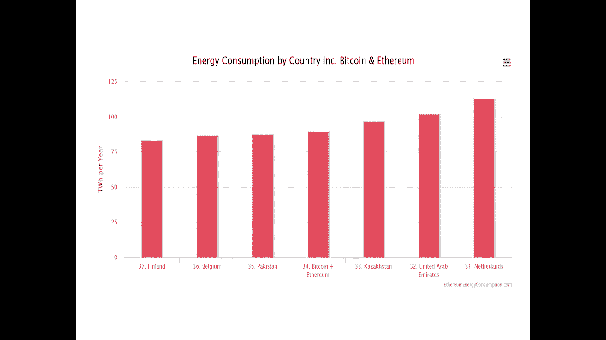

# 北京大学肖臻老师《区块链技术与应用》公开课 - P21：21权益证明 - 北京大学计算机系肖臻 - BV1Vt411X7JF

这节课呢我们讲权益证明，proof of stake，比特币和以太坊，目前用的都是基于工作量的证明，这种共识机制受到了一个普遍的批评，就是浪费电，我们这个图上显示了，比特币能耗随时间变化的情况。

这个y轴呢是t w h是tr，what our，这是十的12次方，大家平时可能比较熟悉的是kw h，kindle，what our，十的三次方，就所谓的叫千瓦时1度电的意思，那么这个图上我们可以看出。

比特币的能耗随时间是不断增长的，下面这个图呢给出了一些具体的统计数据，比特币每年的总能耗大概是70个t w h，td word wor，这相当于智利这个国家的能耗，也相当于647万多个，美国家庭的能耗。

占全世界总能耗的0。31%，具体到每个交易上来说呢，平均每个交易的能耗，使1014个千瓦时，相当于34。2，六个美国家庭一天的能耗，这个能耗是相当大的，就大家可以想象一下，一个交易要花1000度电。

这听起来都觉得吓人，信用卡公司处理一个交易的能耗，远远到不了这个数字，比特币挖矿的每年总收入是60多亿美元，接近61亿美元，然后费用呢是差不多35亿美元，占总收入的57。48%。

说明挖矿的利润空间还是很大的，下面这个是以太坊的统计数据，以太坊的能耗也是随时间增长的，中间有一些波动，从具体的数据上来看，以太坊1年的能耗大概是20个，tire what our。

这跟刚才比特币的70个泰尔沃v比起来，还是少了不少，相当于冰岛这个国家的能耗，也相当于183万个美国家庭的能耗，啊，这个能耗占全世界总能耗的0。0%，九，平均到每个交易上，每个交易的能耗是67个千瓦时。

相当于2。25个美国家庭一天的能耗，这个跟比特币前面1000个千瓦时相比，实际上是少了很多的，大家有没有觉得比较奇怪，从道理上讲，比特币的交易是比较简单的，就是一些单纯的转账交易，以太坊中的交易。

所以以太坊的能耗应该更高才对，而实际上是比比特币要低了很多，一个是67度电，一个是1000度电，这个为什么呢，初二初二时间长，因为比特币要十分钟才能挖出一个区块，以太坊呢15秒就可以挖出个区块。

所以太坊这出块时间很短，它挖矿挖的时间就短，所以它的每个交易，平均下来的能耗要小很多，当然以太坊的这个单位交易的能耗，仍然比信用卡公司要高了很多，这两个还是不在一个数量级上。

以太坊每年挖矿的收入是50多亿美元，505500万这么多美元，然后它的费用是接近24亿美元，所以同样的挖矿了，利润空间是很大的，如果我们把比特币跟以太坊的能耗加在一，起，当做一个国家来算的话。

那么他在国家中的排行榜是这样的，是芬兰，比利时，巴基斯坦，然后就是比特币加以太坊，阿联酋河南，就这样一个顺序。

大家有问题吗，没有问题的话，我们把这个投影仪就关了，我们接下来继续讲，我们来仔细想一下挖矿这个过程，这些能耗是不是必须的，就大家思考几个问题，矿工为什么要挖矿，你们觉得呢，为了取得出块奖励。

为了获得收益，那为什么要给矿工这些收益呢，为什么要给矿工这些出块奖励，这个区块上的，完全是靠这个矿工类这个东西，就如果不给出块奖励的话，那么矿工没有这种引三体来参与记账，那矿工具体是怎么挖矿的呢。

就比如说你决定参与挖矿，要成为一个矿工，你需要怎么做，你觉得你会怎么做，你需要找一大笔资金，然后去买这些挖矿设备，这些设备都一起一些现成的设备，你可以买矿机，买gpu，然后开始挖矿。

那挖矿的收益是由什么决定的呢，有挖多少区块，决定挖多少区块是由什么决定的，算了还有就由你的算力所占的比例决定了，你的算力是由什么决定呢，一个是机器人的二，你你有多少矿机，你占了多少硬件设备。

而且设备是由谁决定的呢，是由你投入多少资金决定，因为设备都是标准化的，你投入的资金越多，你买到的设备也就越多，你挖矿的算力就越大，你得到的收益也就越高，所以说白了挖矿的收益是由什么决定，是靠拼钱决定的。

看谁的钱多决定的，那这就带来一个问题，既然最终是拼钱，那么我们直接把钱拿出来，比一比不就行了吗，现在是矿工通过竞争算力来决定，这个挖矿的收益如何分配，我们能不能把它改成，直接靠比钱的多少来决定收益分配。

比如我出100万，你出50万，现在的做法是咱们用这些钱都去买矿机，然后呢大家的矿机开始挖矿，比拼一下算力，看谁挖的区块多，那与其这样，还不如，将来呢就按照每个人投入的资金的多少，来决定收益的分配。

那还挖矿干嘛呀，就直接拼钱不就行了吗，这个就是权益证明的一个基本思想，有的时候呢管这种方法教，播出慢点，虚拟挖矿，采用权益证明的交易货币，一般在正式发行之前，会先预留一部分货币给开发者。

也会出售一部分货币，来换取开发这个加密货币所需要的资金，那么将来呢按照权力证明的共识机制，每个人是按照持有货币的数量，来进行投票的，这种方法呢跟工作量证明相比有什么优点。

一个很明显的好处就是省去了挖矿的过程，也避免了由此带来的能耗和对环境的影响，减少了温室气体的排放，还有没有什么别的优点，你们还能想到别的优点吗，基于工作量证明的共识系统，从某种意义上说，这是什么意思呢。

我们说blockchain is secured by mu，那么man的equipment是从哪来的呢，是用法币买来的，用美元可以购买矿机，然后参与挖矿，也就是说。

师从这个加密货币的生态系统外面得到的，这就带来一个什么问题呢，虽然最近2年，加密货币的总市值有了很大的增长，当然了，今年开始又下跌了不少，但是不论怎么说，它跟世界经济总量相比仍然是微乎其微的。

比如说你跟美国股市的总市值相比，这两个完全不在同一个数量级上，所以呢如果有某个组织想要发动恶意攻，击，他只需要用足够的资金来购买挖矿设备，然后聚集到这个加密货币，总算力一半以上的算力就行了，也就是说呢。

发动这种攻击，比如说这个组织可能在股票市场上很有钱，在其他的石油金融领域很有限，这些领域的资源都可以转化成挖矿的算力，转换成对这个加密货币攻击的这种能力，像比特币这样比较主流的加密货币。

抗攻击的能力还是相对比较强的，因为它系统的总算力是比较大的，如果是一些刚刚发行不久的小的币种，那么遇到这样的攻击可能就是致命性的，就我们前面讲过old coin，我偷到替补corn。

就是除了比特币之外的一些小的加密货币，如果这种小的币种刚刚发行不久，就遇到这种攻击，那么很可能这个b价就直线下降，甚至归零了，那么对于这个b的开发者和早期矿工来说，遭受了损失，可能是灾难性。

这个其实专门有一个词，叫auto coin infantic，大家知道英分的这个词吧，婴儿的意思，英分体赛就是把它扼杀在摇篮里，不等这个加密货币长大，就把他先干掉了，那么如果我们采用的是权益证明。

情况会有什么不同呢，外部的他根本没有机会来攻击这个区块，应该没有决定权的，这个也不是绝对，我们想象一下权益证明是怎么工作的，它是有点类似于股份制公司，按每个人占的股份进行投票。

那么权益证明是按照你有多少个币种的b，进行投票，所以呢如果有某个人想发动恶意攻击，比如说我们前面说的51%的攻击，他需要怎么做，他首先要设法获得这个币种发行量的，一半以上的份额才行，也就是说。

发动攻击的资源，只能从这个加密货币系统内部得到，这就是为什么我们说它是一个闭环，无论你这个攻击的组织者在外面有多少钱，你有多少美元，你金融界有多少资源，你有多少股票，你是石油大亨也好。

都不会对这个加密货币系统造成，直接的影响，你必须首先要用这些钱去买b，买到足够多的b，然后才能发动攻击，而一旦有人大量买入这个加密货币，会出现什么情况，价格会大涨，对不对。

这本来一个刚刚发行不久的小币种，没有多少人买的，价值也不高，突然有人为了搞垮它，大量买入这个币种，结果价格大涨，如果你是这个b的开发者，或者是早期投资者，出现这种情况，你会怎么想。

你会觉得这不一定是坏事儿啊，我正好可以从中大赚一笔，这有点类似于股份制公司遭受恶意收购，大家听明白这个区别了吗，维护他安全的资源，不是一个闭环，权益证明它就是个闭环，权益证明跟工作量证明并不是互斥的。

有的加密货币采用的是一种混合模型，就它仍然是要挖矿的，但是挖矿的难度跟你占有的权益，你持有多少b是相关的，比如说每个矿工持有一定数量的这种b，那么挖矿的时候呢，你持有的币越多，你挖矿的难度就越小。

大家听明白吗，根据你持有的这个b的权益降低，适时的调整你的挖矿难度，当然了，如果你就像我刚才说的这么简单的去设计，其实是有一定问题的，大家想想有什么问题，那样的话，系统中持有币的数量最多的那个人。

每次挖矿都是最容易的，对不对，所以呢有的加密货币要求，你投入的b会被锁定一段时间，不能够重复使用，比如挖当前这个区块的时候，你投入一定数量的b用于降低挖矿难度，那么等这个区块发布出来之后呢。

你投入这些b就会被锁定一段时间，你下次再挖下一个区块的时候，这个b就不能再用了，要过一段时间，过多少个区块以后才能再被重复使用，就这个有时候管它叫做proof deposit。

基于权益证明的共识机制该怎么设计，有很多挑战，其中早期的这种权益证明，nothing at stick，倒地倒地倒地倒地倒地，击倒击倒击倒，这个地方出现了分叉，如果是挖矿的话，你会怎么挖。

你会沿着上面这条链去挖对吧，因为这个是最长合法链，其实呢，下面这个链也有可能成为最长合法链，就如果这个地方连续挖出好几个区块，它有可能比上面这个链还要长，但是呢你不会两边都吧，因为这样做对你没好处。

你两边都挖的话，算力分散了，你挖到区块的概率就小了，但是如果你用权益证明的话，如果上面这条链成为最长合法链，你在下面这个地方，锁定的那些b是没有影响的，就比如说你挖的下面这个区块。

投入的b只是记录在下面那个分叉上，并不影响你在上面那个分叉的使用，这就是为什么管这个叫做，nothing at stick，这是早期基于权益证明的共识机制，遇到的一个问题，进攻进攻进攻进攻进攻。

以太坊中呢准备采用的权益证明协议，叫做casper，它在过渡阶段也是要跟工作量证明，混合使用的，为工作量证明提供叫做finity，这个finity，这个反弹那题是一种最终的状态，单纯基于工作量证明。

就基于挖矿的交易是有可能被回滚的，然后呢有人从前面开始分叉，挖出一条更长的分叉链，那个交易有可能就无效了，像比特币当中规定要等六个确认区块，那个只是说你等了六个确认区块之后。

发生回滚的可能性已经非常小了，但是如果有某个有恶意的攻击者，从前面开始分叉，只要它算力足够强，比如说占到了半数以上的算力，那么仍然有可能让这个分叉链，变得比原来的链更长，所以单纯基。

那么casper协议具体是怎么做的呢，它引入一个概念叫做value data验证者，要想成为一个value data，必须要投入一定数量的以太币作为保证金，这个保证金会被系统里面给锁定住。

那么vi data的作用是干嘛呢，职责是要推动这个系统达成共识，投票决定哪条链是最长合法链，投票的权重取决于保证金的数目大小，这个具体的做法呢有点类似于数据库里的，two face commit。

挖矿的时候就是这个时候混用的时候，还是有人挖矿的，挖矿的时候每挖出100个区块，就作为一个apple，然后要决定他能不能成为finity，要进行一个投票，大家知道这个to fit吧，这个本科都学过吧。

第一轮投票是一个prepare message，然后第二轮投票是commit message，那么casper中规定了，每一轮投票，都要得到2/3以上的验证者才能通过，这是按照保证金的金额大小来算的。

实际系统当中呢不再区分这两个message，而且把这个ipod呢从原来的100个区块，减少到50个区块，就变成了每50个区块就是一个app，然后呢每个app只用一轮投票就行了。

这一轮投票对于上一个app来说，它是commit message，对于下一个app来说呢，它是个prepare message，那么要连续两轮投票，两个app都得到2/3以上的多数，才算有效，哈哈哈哈。

好我们把这个过程画一下，我们假设从这个地方吧，到这个地方，这是间隔了100个区块，所以呢原始版本的这个casper协议，是把这个定义成一个app，然后这个ipod结束呢有两轮投票。

先是有一个prepare message，然后是一个commit，这两轮投票，每一轮都要有2/3的验证者，才能算通过，这是原始的版本，那么优化以后呢，就把这个地方从中间再切一刀。

原来这个100个区块的app，分成50个区块的apple，就这是一个app，这也是一个app，然后每个ip结束的时候只有一轮投票，比如这个地方有个投票，那么这一轮投票呢。

对于前一个app来说是commit message，对于后一个app来说是prepare message，大家听明白了吗，然后要连续两个app，这个投票都要有2/3的验证者支持，才算通过。

这就是这两个的区别，那么验证者参与这个过程有什么好处呢，如果验证者履行职责的话，那么可以得到相应的奖励，就像矿工挖矿能得到出块奖励一样，验证者做的这个工作也可以得到奖励，相反的呢。

如果验证者有不良行为被发现的话，要受到相应的处罚，比如某个验证者行政不作为，该投票的时候他不去投票，结果导致系统迟迟达不成共识，那么这种情况下要扣掉它的一部分保证金，如果某个验证者呢乱作为就乱投票。

给两个有冲突的分叉，都投票，这种情况如果发现的话，要没收全部的保证金，那没收的保证金到哪儿去呢，就是被销毁掉了，就没收完之后就直接销毁了，相当于减少了系统中以太币的总供应量，就即使你交了保证金。

也不是说可以永远当验证者，要经过一定时间的等待期，这个等待期呢是为了让其他的节点可以，检举，揭发，这个验证者有没有什么不良行为进行惩处，如果等待期过了，没有什么问题，那么验证者可以取回当初的保证金。

和应该得到的奖励，这就是casper协议的这样一个过程，那么大家思考一个问题啊，我们原来说cast协议可以给挖矿，做一个检查点，做一个check point，那这个checkpoint是不是绝对安全的。

换句话说呢，通过这个验证者投票达成的finity，有没有可能被推翻，就我们原来说，这个是不是绝对的，假设有某个有恶意的组织要发动攻击，如果这个组织仅仅是矿工的话。

那么它是没有办法推翻已经达成的finity，为什么，因为finity是验证者投票投出来的，单纯是矿工，有恶意的矿工，不论是他算力有多强，如果没有验证者作为同伙是不可能推翻的，那么什么样的情况下。

会出现攻击成功的情况，那么我们前面说过，cap协议要求，每轮投票有2/3以上的验证者，知识才算通过，所以如果出现这种情况，那么至少有1/3的验证者，是两边都投票了，这个一旦发现的话。

这1/3验证者的保证金将会被没收，大家听明白了吗，所以呢我们可以看到，基于权益证明的共识机制，和基于工作量证明的共识机制，是很不一样的，以太坊的设想是，要逐步从工作量证明过渡到权益证明，随着时间的推移。

挖矿得到的奖励是越来越少的，权益证明得到的奖励是越来越多的，最后达到完全不用挖矿的境界，我们今天讲了权益证明的这么多好处，那既然权益证明这么好，为什么以太坊不从一开始就用权益证明呢，你们觉得为什么。

因为权益证明不是很成熟，工作量证明是比较成熟的，是经过了时间的检验，我们大概两节课前吧，讲过这个bug帮体大家还记得吗，比特币和以太坊的挖矿算法都经历了bug，bt的检验，没有人发现什么漏洞。

很多人认为权益证明是未来的方向，但是目前主流的加密货币，用的还是工作量证明，像以太坊，一直到现在仍然是在用工作量证明，上个月呢有个叫eos的加密货币上线了，大家听说过这个加密货币吗，这个俗称叫柚子。

曾经有很多人看好这个加密货币，他用的就是权益证明的思想，完全不用挖矿，但是用的不是casper协议，而是一个叫depose的协议，嘿嘿，先用投票的方法选出21个超级节点，然后再由这些超级节点产生区块。

那么这个eos是6月上旬上线的，现在已经过去了一个多月了，还处于一种调试和完善的过程当中，就总的来说呢，基于权益证明的共识机制，目前还是处于一个探索状态，那边有什么问题吗，那我最后再说一点啊。

就到目前为止，我们都是假设工作量证明，消耗那么多的电是不好的，但是呢也有人持有不同的观点，就这些人认为，首先挖矿消耗的电并不是很多，我们这节课开始的时候看的那个统计数据，比特币的能耗。

占全世界总能耗的0。3%，一，以太坊呢只占0。09%，就这两个加在一起也就占0。4%，并不是很多，很多人对工作量证明有反感，是因为觉得做的是无用功，白白浪费了很多点，其实挖矿对环境的影响是有限的。

挖矿的一个好处是，提供了把电能转换成钱的一种手段，我们知道电是很难存储的，很多发电站在白天用电高峰的时候，这个电是不够用的，到了半夜呢又有多余的电，用不完，电也是很难传输的，很多大型数据中心。

要建在电比较便宜的地方，就是因为传输数据比传输电要容易，像现在很多地方搞清洁能源，建了风力发电站，这些发电站发出大家的电，除了满足当地需要之外，怎么样才能传回主电网，其实是一个问题。

很多国家的主电网设计的时候，是单向传输的，就从主电网往边远地区送电是可以的，但是从边远地区，把这些清洁能源发出来的电，传回主电网就没有那么容易了，需要进行电网改造，挖矿呢。

为解决这些问题提供一个很好的手段，把多余的电能转换成加密货币，像很多比特币的矿场，都是建在电力资源丰富的地方，比如一些南方小水电站的旁边，只要是有电有网络的地方就可以挖矿。

挖出来的加密货币存储传输都不是问题，只要保管好私钥就行了，所以呢这些人认为挖矿需要消耗电能，并不是坏事儿，可以有效地化解过剩产能带，动当地经济的发展，大家有问题吗，好没有问题。

