# 北京大学肖臻老师《区块链技术与应用》公开课 - P22：22-ETH-智能合约 - 北京大学计算机系肖臻 - BV1Vt411X7JF

今天我们讲智能合约，智能合约是以太坊的精髓，也是以太坊和比特币的一个最大的区别，这个代码的逻辑就定义智能合约的内容，智能合约的账户里保存了这个合约当前的运行状态，我们前面讲过合约的状态。

有当前的余额交易次数，合约代码和存储存储的数据结构是一颗mp，智能合约的代码一般是用solidity语言来编写的，语法上跟javascript是很接近的。

所以呢熟悉javascript的人学solidity是比较容易的，这个图呢显示了智能合约的代码结构，第一行，首先声明一下所使用的手雷地铁的版本号，不同版本的solidity语言在语法上有一些小的差别。

solidity是面向对象的编程语言，这里的这个contract类似于c加加当中的类class，我们这个country的定义了很多状态变量，solidity是强类型语言，叫stronger type。

这里的类型呢大部分跟普通的编程语言，像c加加之类的是比较接近的，比如说这个uint，这个uint类型是安散的，int无符号的整数，这个address类型是sot语言中所特有的。

我们后面会讲一下这个地址类型的成员变量和成员函数，接下来是两个一半的事件，这个事件的作用是用来记录日志的，也就是说用来打logo的，第一个事件是highest the beat increase。

拍卖的最高出价增加了，就我们这个代码的例子，是一个网上拍卖的例子，拍卖的具体规则我们后面会讲，那么如果出现某个人出一个新的最高价，那么我们记录一下这个参数是address逼的，然后呢金额是amount。

第二个事件是pay to beneficiary，那么它的参数是赢得拍卖的这个人的地址，这个winner以及他最后的出价，amount，手雷t语言呢跟普通的编程语言比呢，它有一些比较特别的之处。

比如说我们上面这个map，我们可以看到这个map是一个哈希表，保存了一个从地址到安塞的int的一个映射，那么sot语言中的哈希表的一个比较奇怪的地方是，它不支持便利，如果你想毕利哈希表中的所有元素。

那么你自己需要想个办法记录一下哈希表中有哪些元素，我们这里是用这个b的这个数组来记录的，sot语言中的数组可以是固定长度的，也可以是动态改变长度的，那么这里是一个动态改变长度的数组。

比如说你要想从往这个数组里增加一个元素，就用push操作，逼得点push，逼的就新增加一个出嫁人，在宿主的末尾，你要想知道这个数组有多少个元素可以用它的nice语，如果这个地方是一个固定长度的数组的话。

那么需要在这里写明这个数组的长度，比如说，那这个就是一个长度为1024的速度，再往下呢是它的构造函数，solidity语言中定义构造函数有两种方法，一种方法就是像c加加中的构造函数一样。

定义一个与这个contract同名的函数，这个函数可以有参数，但是不能有返回值，这是一种方法，那么新版本的soc语言实际上更推荐的是用我们这里的这种方法，就是用construct来定义一个构造函数。

那么这个构造函数只有在合约创建的时候会被调用一次，接下来是三个成员函数，这三个函数都是public，说明其他账户可以调用这些函数，我们注意就是这个b的这个函数，这里标志有一个叫payable。

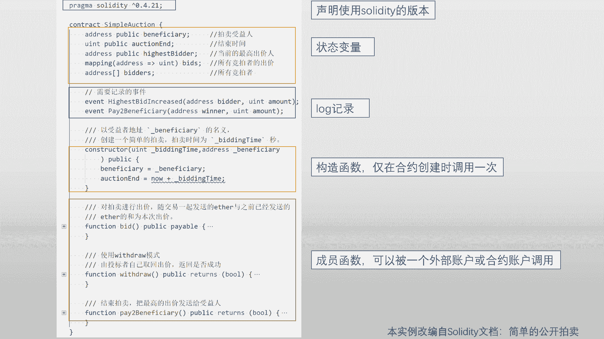

这个我们后面会解释一下是什么意思，就这个代码结构大家还有什么问题吗，这个construct是的有一个对construct只能有一个构造函数，只能有一个，就代码上的字能看清楚吗，可以还可以是吧。

好我们说一下怎么调用智能合约，调用智能合约其实就跟转账是类似的，比如说a发起一个交易转账给b，如果b是一个普通的账户，那么这就是一个普通的转账交易，就跟比特币当中的转账交易是一样的。

如果b是一个合约账户的话，那么这个转账实际上是发起一次对b这个合约的调用，那么具体调的是这个合约中的哪个函数呢，是在数据域里说明了，就这个data域，而在data语中说明，我们这个例子当中呢。

三的address是发起这个调用的账户的地址，to contract address是被调用的合约的地址，调用的函数呢，这是transaction data左下角这个地方给出要调用的函数。

如果这个函数是有参数的话，那么参数的取值也是在这个data域里说明的，我们上一页看的那个代码样例，那个网上拍卖的样例当中，三个成员函数都没有参数，但是有的成员函数是可以有参数的。

那么中间那一行呢是这个调用的参数，这个value是说我发起这个调用的时候，转过去多少钱，这里是零，就我这个调用的目的仅仅是为了调用它的函数，并不是真的要转账，说它的value是零。

gas used是我这个交易花了多少汽油费，就gas used，gas price是单位汽油的价格，gas limit是这个交易，我最多愿意支付多少汽油，我们后面会详细讲汽油费的事情，大家有问题吗。

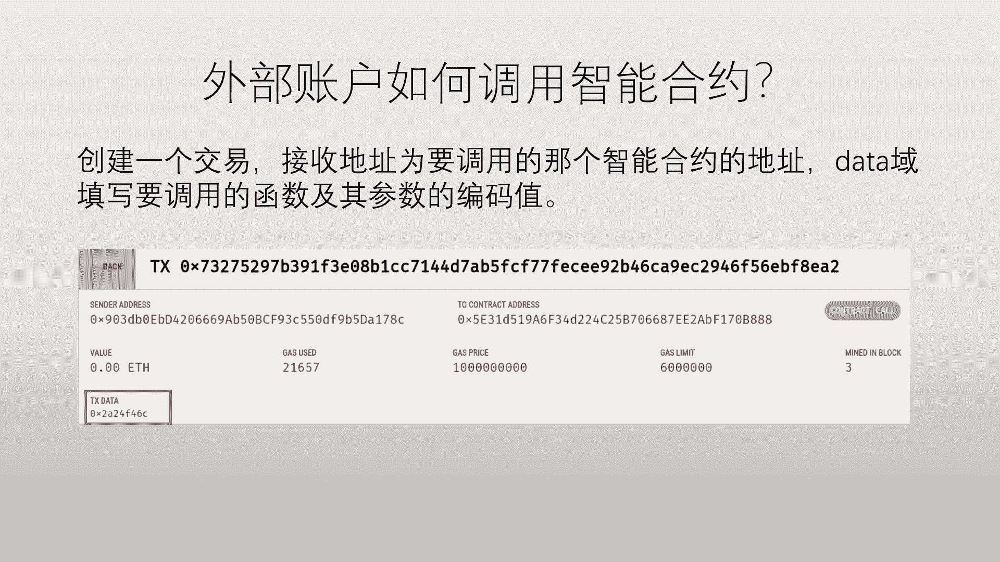

那么除了一个外部账户可以调用一个合约函数之外，一个合约也可以调用另外一个合约函数，那么调用的时候有几种方法，这种方法呢我们显示的是直接调用，就由a和b两个合约，a这个合约呢就只是写一条log。

就我们前面说过万的是定义一个事件，就叫lof emit引到这个logo服，就用emit这个操作来调用这个时间这个的作用，这个emit语句的作用就是写一个log，对于程序的运行逻辑是没有影响的。

那么b这个合约这个函数参数是一个地址，就是a这个合约的地址，然后这个语句把这个地址转换成a这个合约的一个实例，然后调用其中的负这个函数，大家听明白了吗。

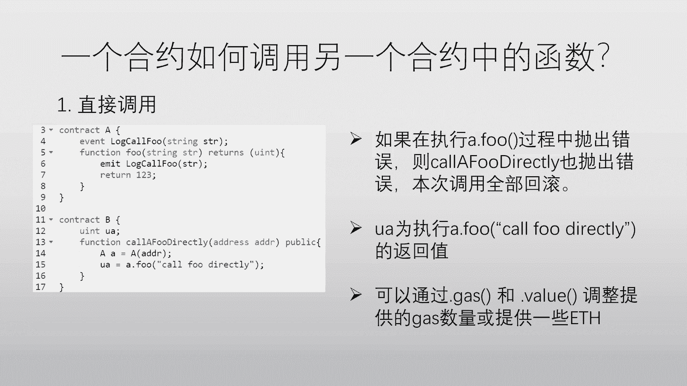

因为我说明一点啊，就以太坊中规定一个交易只有外部账户才能够发起合约，账户不能够自己主动发起一个交易，调用了合约b当中的这个函数，那么第二种调用方式呢是用我们这个地址类型，address。co这个方式。

这个时候第一个参数是要调用的那个函数的签名，signature，然后后面跟的是调用的参数，这种调用方法呢跟上一种直接调用的方法相比，一个区别是对于错误处理的不同。

上一种方法就比如说我们这个时候调用的时候，如果你调用了那个合约，在执行过程中出现错误，那么会导致发起调用的这个合约也跟着一起回滚，就比如说这个例子中，如果a在执行过程中出现什么异常的，抛出一个异常。

会导致b这个合约也跟着一起出错，而这个扩这种方法address点扩这种形式，那么这个扩函数会返回false。

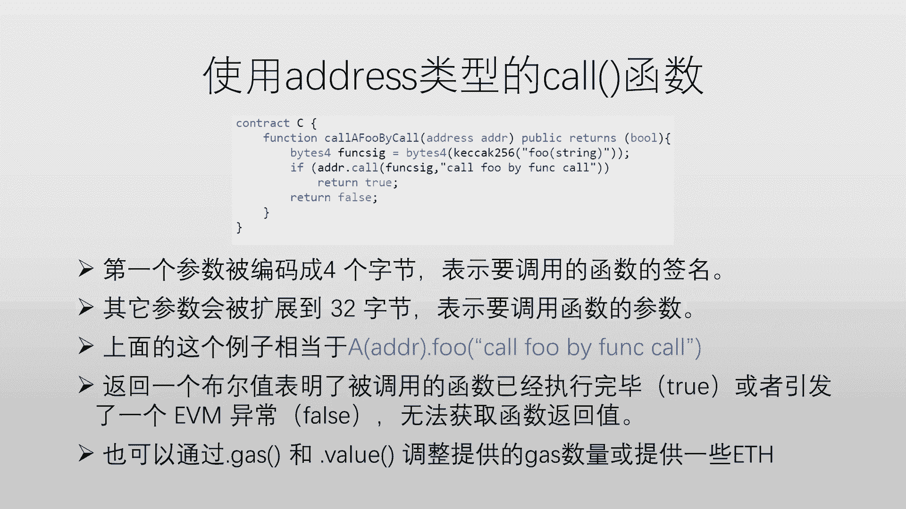

就表明这个调用是失败的，但是发起调用的这个函数并不会抛出异常，而是可以继续执行，这是两种调用方法在错误处理上的区别，那么还有一种调用方法是delegate co。

这个跟刚才讲的这种call的方法基本上是一样的，一个主要的区别就是，单利给的扩不需要切换到被调用的合约的环境中去执行，而是在当前合约者环境中执行就可以了，比如说就用当前这个合约的账户余额存储之类的。

大家有问题吗。

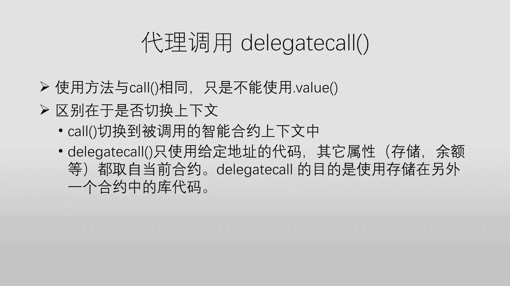

好没有问题，我们再看一下我们刚才讲过的这个代码的结构，我们说这个b的函数这里有一个payable，另外两个函数都没有，那这是什么意思呢，就是以太坊中规定，如果你这个合约账户要能接受外部转账的话。

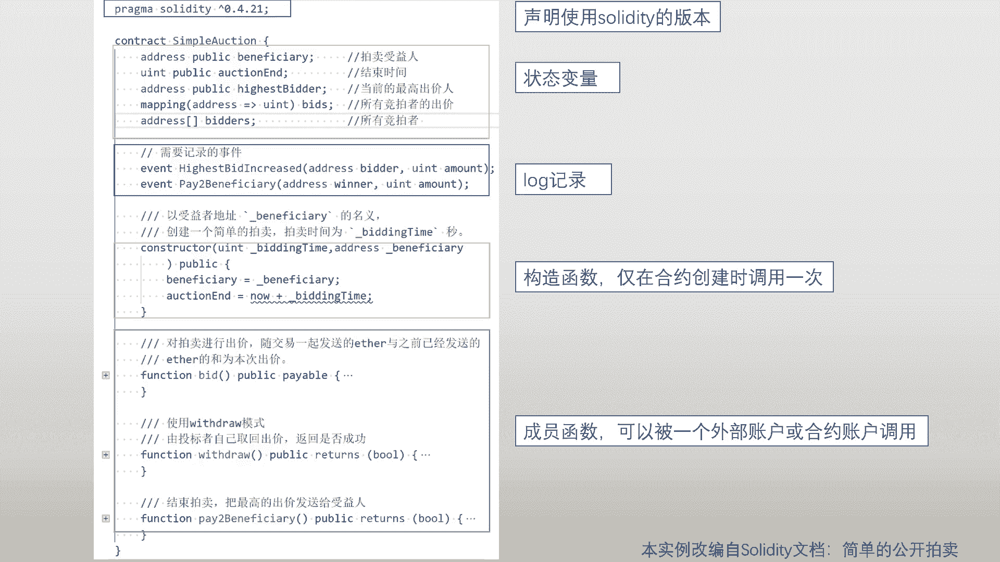

那么必须标注成payable，那么这个例子中这个b的函数是什么意思，我们这是一个网上拍卖的合约，那么b的函数是用来进行竞拍出价的，比如说你要参与拍卖，你说你出100个以太币。

那么你就调用这个合约中的这个b的函数，所以呢他这个拍卖的规则是你调用这个b的函数的时候，要把你拍卖的出价那100个以太币也发送过去，存储到这个合约里锁定那里，一直到拍卖结束，大家听明白了吗。

就避免有的人就是凭空出价，你说你出好多亿台币，出1万个以太币，实际上你没这么多钱，所以你要拍卖的时候，要把你出的价钱要发到智能合约里锁定权，所以这个b的函数要有要有能够接受外部转账的能力。

所以才标注一个payable这个v字做这个函数，第二个尾子做函数，它就没有payable with draw是干嘛用的呢，就拍卖结束了，其他人呢没有拍到想要的东西，那么可以调用韦德做这个函数。

把自己当初出的价钱，就是原来b的时候锁定在智能合约里的那些以太币再取回来，因为这个的目的不是为了真的转账，他不需要把钱转给这个智能合约，而仅仅是通过调用这个尾字做函数。

把当初锁定在智能合约里的那部分钱取回来，所以他没必要用payable，就比如这是我们刚才看的那个例子，大家还记得吗，转账交易的例子，这个时候这个value就是零，就这个交易就是属于并没有真的把钱转过去。

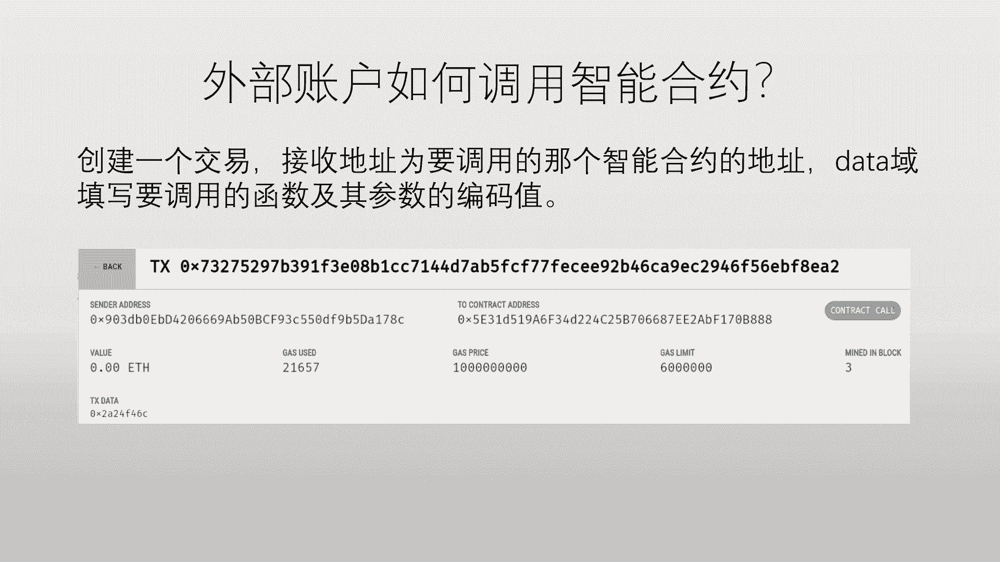

所以这个contract to ctrl dress这个函数就不用定义成payable，以太坊中凡是要接受外部转账的函数，都必须标志为payable，否则的话，如果你给这个函数转过去钱的话。

会引发错误处理，会抛出异常，如果你不需要接受外部转账，这个函数就不用写成payable，在最后呢有一个比较特殊的函数叫for bag函数，大家看一下这个函数的定义，这个函数既没有参数，也没有返回值。

而且也没有函数名。

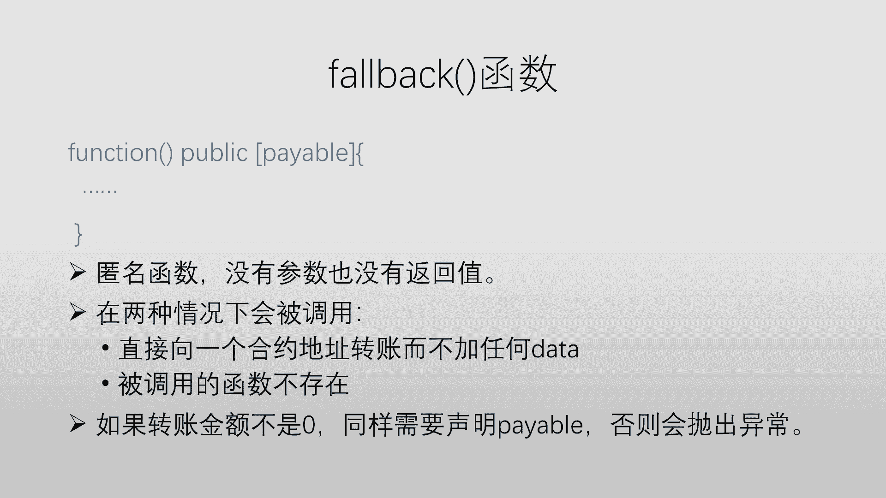

是个匿名函数，我们说这是for back函数，但是for back这个关键字也没有出现在这个函数名里面，他什么意思呢，就是我们前面说你调用一个合约的时候，a调用b这个合约。

然后呢要在转账交易里的data域，说明你调用的是b这个合约当中的哪一个函数，对不对，那如果a给这个合约b转了一笔钱，没有说明调用的是哪个函数，那怎么办呢，就比如说它的data域是空的。

那么这个时候缺省的就是调用这个for bag函数，这就是为什么管它叫for back函数，因为没有别的函数可掉了就掉它，还有一种情况就是你要调的函数不存在在你的那个data域里，你说你要调这个函数。

而实际这个合约当中呢，它没有这个函数，那怎么办呢，也是调用这个fba函数，这就是为什么这个函数没有参数，也没有返回值，它没法提供参数，对于这个for bug函数来说。

也可能需要标注payable这个关键词，就如果这个for bug函数需要有接受转账的能力的话，那么也需要写明是payable，这个一般情况下都是写成payable。

就如果你这个合约账户没有任何函数标志为payable，那么这个合约没有任何能力可以接受外部的转正，大家听明白了吗，就如果这个合约没有for bug函数，或者是他有for bug函数，没有写pyable。

那么其他人如果就往这合约里转一笔钱，别的什么都不说，data域是空的，就会引发异常，有问题吗，所以就是我这个科学定义的时候要先学，但是呢我给你转向的，我这个人比较喜没有。

我只觉得心头白不是for bag和payable，都是在合约定义的时候写的，我给你转账的时候，我不用写payable，也不用写for ba，不就是说我如果给你转账，别的什么都不写。

没有调用你其中的任何一个函数，那么就自动会调用这个flag函数，这个佛bug函数不是必须定义的，就是你这个合约可以没有佛bug函数，如果没有这个函数的话，出现前面说的那几种情况，就会抛出异常。

就比如我给一个合约转账，没有说调哪个函数，那个合约也没有定义for bag函数，那么这个转账就是错误的，就会引发错误处理，另外只有合约账户才有这些东西，对以前有的同学学的有些混淆。

外部账户跟这个都没关系，外部账户没有代码，没有什么for back，不for back，也没有什么payable，payable，他根本就没有代码，只有合约账户才有这些东西，另外还有一点啊。

我们说转账金额是可以是零对吧，但是汽油费是要给的，这是两码事儿，就转账金额是给收款人的，你转给谁，这个金额是给谁的，汽油费是给发布这个区块的矿工的，转账金额可以是零，但汽油费如果你不给的话。

我们到目前为止讲的都是智能合约的调用，我们讲两种调用方法，那智能合约是怎么创建的呢，是由某一个外部账户发起一个转账交易，转给0x0 这个地址，就这个地址。

然然后呢把这个要发布的合约的代码放到这个data域里面。

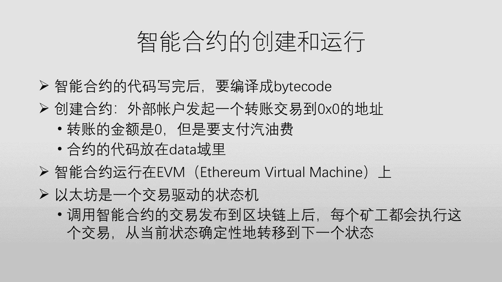

大家听明白了吗，就你要创建一个合约，你发起一个转账交易给零，这个地址转账转账的金额都是零，因为你实际上不是真的想转账，你只是想发布一个智能合约，你发布那个智能合约的代码就放在这个数据就行了。

然后合约的代码写完之后呢，都是要编译成白的扣的，然后运行在这个叫vm上，issue virtual machine，大家听说过jvm，java veral machine，听说过吧。

g vm的目的是什么，为什么要加一个这位，增强可移植性对吧，e d m也是类似的设计思想，通过呢加一层虚拟机，对智能合约的运行提供一个一致性的平台。

所以呢ev m有的时候叫做word wide computer，全世界的一个计算机e v m的寻址空间是非常大的，是256位的，像我们前面讲那个uint i3 的int就是256位。

你们平时用的机器是多少位的，以前是32位的，现在很多服务器是64位的，跟这个256倍的是没法比的，然后我们现在讲一下汽油费，他们的设计理念是有很大差别的，比特币的设计理念呢是简单。

这脚本语言的功能很有限，比如说不支持循环，而以太坊呢它是要提供一个图灵完备的编程模型，就这里写的图，in complete programming model，很多功能呢在比特币平台上实现起来很困难。

甚至是根本实现不了，而到以太坊平台上呢就实现起来就很容易，当然了，这样也带来一个问题，比如说出现死循环怎么办，当一个全节点收到一个对智能合约的调用，怎么知道这个调用执行起来会不会导致死循环。

有什么办法吗，没有办法，这个实际上是个什么问题，停机问题对吧，hing problem，停机问题是不可解的，这里大家注意一点啊，这个问题不是npc的，n p c的问题是可解的。

只不过它没有多项式时间的解法，很多npc问题有很自然的指数时间的解法，比如说汉密尔顿回路问题，就判断一个图有没有哈密尔顿回路，这个其实是很容易解的，就你想到一个解法是很容易的，如果你不考虑复杂度的话。

你觉得怎么解，把所有的可能性枚举一遍，比如说你有n个顶点，那么n个顶点的排列是n的阶乘这么多个组合，把每一个组合检查一下是不是构成一个合法的回路，就知道他有没有汉密尔顿回路。

所以哈密尔顿回路问题是可解的，只不过这个解的复杂度是指数级的，而停机问题呢是根本就不可解的，从理论上可以证明，不存在这样一个算法，能够对任意给定的输入程序，判断出这个程序是否会停机，那这是不可解的。

那怎么办呢，办法就是把这个问题推给发起交易的那个账户，就以太坊引入了汽油费机制，你发起一个对智能合约的调用，你要支付相应的汽油费，我们看一下，这是一个交易的数据结构。

这个account lance就是这个交易的序号，用于防止我们前面说的那种replay attack，这个press和gas limit就是跟汽油费相关的。

gas limit是我这个交易愿意支付的最大汽油量，price是单位汽油的价格，所以这两个乘在一起就是这个交易可能消耗的最大汽油费，这个receipt的是收款人的地址，这个转账交易转给谁的收款人地址啊。

mt是转账金额，把among这么多的钱转给这个recip，所以我们也可以看到交易当中的汽油费跟这个转账金额是分开的，pay no的，就是我们前面说的data语，用于存放调用的是这个合约中的哪一个函数。

这些函数的参数取值是什么，都在po里面。

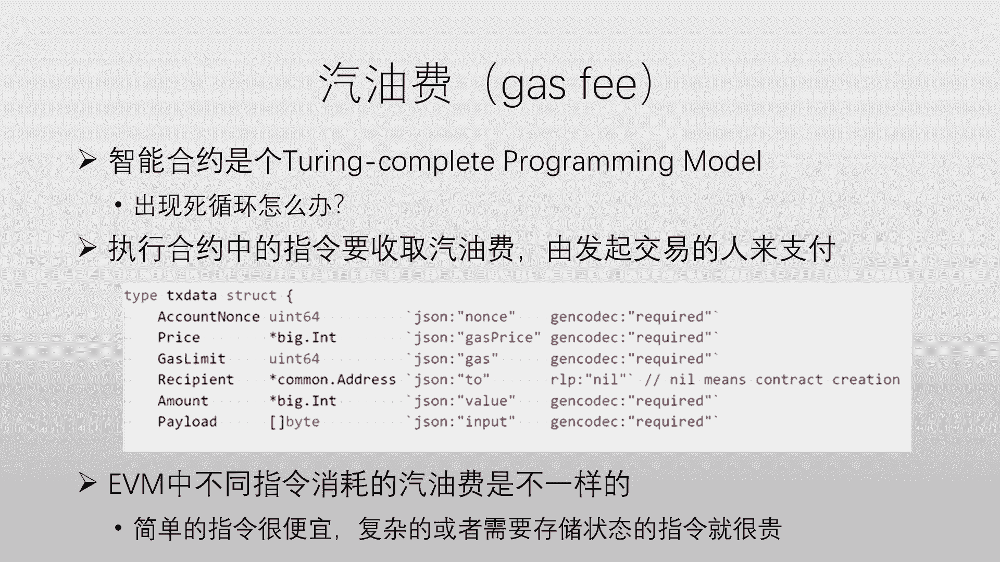

那么当一个全节点收到一个对智能合约的调用的时候，先按照这个调用中给出的gas limit，算出可能花掉的最大汽油费，然后一次性的把这个汽油费从这个发起调用的账户上扣掉，然后呢再根据实际执行的情况。

算出实际花了多少汽油费，多退少补，其实不叫多退少补，如果你的汽油费不够的话，会引起回滚，就一次性先把这个汽油费都扣掉，不同的指令消耗了汽油费是不一样的，一些简单的指令，比如说加法。

减法消耗的汽油费是很少的，复杂的指令消耗的汽油费就比较多，比如说取哈希这个运算，一条指令就可以完成，但是汽油费就比较贵，除了计算量之外呢，需要存储状态的指令，消耗的汽油费也是比较大的，那么相比之下。

如果你仅仅是为了读取公共数据，那么那些指令可以是免费的，然后我们说一下这个以太坊中的错误助理，以太坊中的交易执行起来具有原子性，一个交易要么全部执行，要么完全不执行，不会只执行一部分，大家听明白了吗。

要么完全执行，要么完全不执行，不会执行到一半，会导致整个交易的执行回滚退回到开始执行之前的状态，就好像这个交易完全没有执行过，那么什么情况下会出现错误呢，一种情况就是刚才我们说的汽油费。

如果这个交易执行完之后，没有达到当初的gas limit，那么多余的汽油费会被退回到这个账户里，就一开始的时候不是按照最大的gas limit把修费扣掉了吗，如果最后运行完了，还有剩下来的。

那么实际上是用了多少汽油，收多少钱，剩的可以退回去，相反的，如果执行到一半，这个gas limit已经都用完了，那么这个时候这个机合约的执行要退回到开始执行之前的状态，这就是一种错误处理。

而且这个时候已经消耗掉的汽油费是不退的，大家想一下为什么要这么设计，执行的状态要回滚，但已经耗掉，汽油费是不退的，避免他没事给你发一个交易，然后这个交易没有交易放在以前免费的，我们体面，你说的对。

要不然的话就会有恶意的节点，可能会发动dna of service attack，就可能他发布一个计算量很大的合约，然后不停地掉这个合约，每次调用的时候给的汽油费都不够，反正最后汽油费还会退回来。

那么对我来说没有什么损失，但是对矿工来说是白白浪费了很多的资源，就是为什么说如果汽油费不够的话，那么执行到一半会回滚，花掉的汽油费是不退的，那么除了这个期费不够的情况之外，还有一些时候会引起错误处理的。

比如说这个assert语句和require语句，这两个语句都是用来判断某种条件。

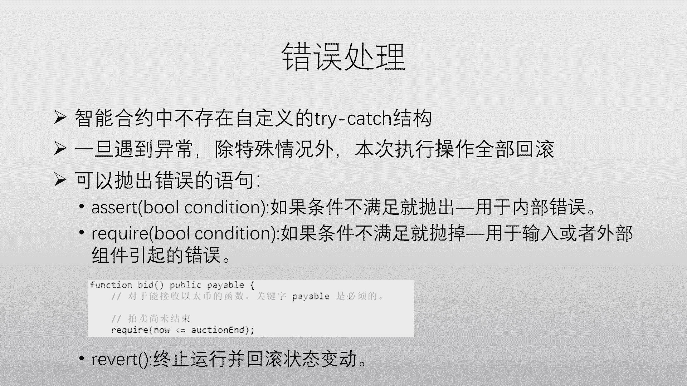

如果条件不满足的话，那么就会导致抛出异常，assert语句一般来说适用于判断某种内部条件，就有点像我们c语言中的assert是一样的，这个require语句一般用来判断某种外部条件。

比如说判断函数的输入是否符合要求，那么这里就给一个简单的例子，这个b的这个函数，这个竞拍的函数，判断一下当前时间，这个law是小于等于拍卖的结束时间ocean如果符合条件的话，那么继续执行。

如果不符合的话，拍卖都已经结束了，你还在出价，那么这个时候就会抛出异常，那么第三个语句是这个revert，这个revert是无条件的会抛出异常，就如果你执行到这个revert这个语句。

那么它自动的就会导致回滚，这个早期的版本里，他用的是，through这个语句，新版本的solidity建议改用revert这个语句，那么最后一点大家注意啊。

就是solidity里面当中没有这种try catch这种结构，就有的编程语言像java用户可以自己定义，出现异常后怎么办，还有这种try catch，手机地址当中没有这个结构。

好我们前面说智能合约执行过程中出现错误，会导致回滚，那么如果是嵌套调用一个智能合约，调用另外一个智能合约，那么被调用的那个智能合约出现错误，是不是会导致发起调的智能合约也跟着一起回滚呢。

这个所谓的叫连锁，是回归这个呢不一定，这个取决于调用这个智能合约的方式，如果这个智能合约，比如说我们前面讲过两种方式是直接调用的话，那么它会触发连锁式的回归，就整个交易都会回归。

如果调用的方式是用比如说扩这种方式哦，这里没有写前面讲那种扩的方，式它就不会引起连锁式回滚，只会使这个当前的调用失败返回一个force的返回值，那么最后注意一点，有些情况下从表面上看。

你并没有调用任何一个函数，比如说你就是往一个账户里转账，但是如果这个账户它是个合约账户的话，你转账这个操作本身就有可能触发对函数的调用，大家想想为什么，又有for bag函数。

这就是一种嵌套调用一个合约往另一个合约里转账，就可能调用这个合约当中的flag函数，有问题吗，这个简单的，你大概是就是这个签到调了，你说我我转账的时候没有调用平台，他有个电影和背。

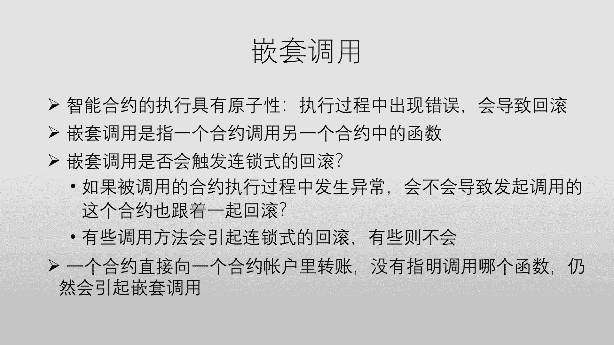

在for败的时候，我们前面说过，还剩这样的方式有两种，一个是靠，一个是呃，那个在函数里面去调查，那个好像加入，那这个挺难跳了，会掉里面有规定，没人说，我在这取决于你是怎么给他转账。

就你转账的时候也有不同的方法去转账，就是比如说像sd或者是穿梭是一种方式，然后呢你用扩点value也是另一种方式，它不同的方式会有不同的效果，实现会有致命。

就是有就是我们下面会讲address这个类型的成员函数，的成员函数里会有这些区别，比如说用扩点value就属于不会引起连锁式回归，就是扩点value的话，如果这个调用失败了，比如说你给合约转账。

那个合约里没有fbg函数，你也没有说调哪个函数，那么这个扩本身就会返回false，但是不会引起连锁式回管，这是我们当初看的这个block header的数据结构，大家还记得吗。

我们以前把这个数据结构都讲过一遍，我们想说的是什么呢，就这个地方有一个gas limit和gas used，这两个月也是跟汽油费相关的，guest use是什么意思。

block header里的gas used是这个区块里所有交易所消耗的汽油费加在一起，就是gas used，那gas limit是什么意思，你是这么觉得的。

这正常人的想法就是这个区块里所有的交易的gas limit加在一起，就是这个区块块头里的gas limit，这种直观上的想法其实不是这样的，我跟你讲一下它的用意是什么，发布区块需要消耗一定的资源对吧。

那么我们要不要对这个区块消耗的资源有一个限制，比特币当中对于发布的区块也是有一个限制的，是什么限制大小的限制最多不能超过一兆，因为你发布的区块如果没有任何限制，然后发布出去。

所以它规定每个区块最多不能超过一兆，就比特币的交易是比较简单的，基本上你可以用交易的字节数来衡量出这个交易消耗的资源有多少，在以太坊中，如果这么规定是不行的，因为以太坊中智能合约的逻辑很复杂。

有的交易可能从字节数上看是很小的，但是它消耗的资源可能很大，比如说他可能调用别的合约之类的，所以怎么办呢，我们要根据这个交易的具体操作来收费，这就是汽油费，所以这个gas limit是什么意思呢。

那就吃饭睡觉，所以最难听的它是这个区块里所有交易能够消耗的汽油的一个上限，大家听明白吗，这个不是说把区块里每个交易的gas里面的加在一起，如果那样的话，就等于没有限制。

因为每个交易的gas limit是发布交易的这个账户你自己定的，你定多少是你自己说了算，但是我这个区块中的所有交易实际能够消耗的汽油是有一个上限的，不能无限的消耗。

否则的话你也可能发布一个对资源消耗很大的一个区块数据，那对整个系统的运行是没有好处的，大家听明白这个gas里面是什么意思，所以这个智能合约去执行，还说先去执行再打，这个问题问得非常好。

实际上是我待会想问的一个问题，我们先稍微放一下，其他同学听明白他问什么了吗，我们待会儿回顾一下好这个gas limit，这个gas limit我还要说明另外一点，就它跟比特币的区别。

比特币我们说限制资源是按照大小来限制的，遗照的上限，而且这个遗照的上限是固定了的，是写死在协议里面的，就是一种有些人认为一兆太小了，而且有的分叉币的产生就是因为想提高这个上限。

以太坊中呢也有一个上限这个gas limit，但是每个矿工在发布区块的时候，可以对这个gas limit进行微调，它可以在上一个区块的gas limit的基础上，上调或者下调1/1024。

比如说如果出现像比特币那种情况，我们大家都觉得这个gas limit的不行，设的太小，这个协议写得不好，那轮到你发布区块的时候，你可以增加1/1024，大家不要觉得好像这个比例很小。

1/1024听起来很小，以太坊的出号速度很快，十几秒就是一个新的区块，所以的话呢如果大家都觉得当前的gas limit太小，那么很快就可以翻一翻，就也可能有的矿工认为gas limit太大了，需要下调。

所以呢这种机制实际上求出的gas limit是所有矿工认为比较合理的，gas limit的一个平均值，大家听明白了吗，有的矿工可能认为gas limit要上调，有的可能认为下调。

那么每个矿工在获得记账权之后，就按照自己的意愿进行这种上调或者下调的微调，所以最后整个系统的gas limit就趋向于所有矿工的一个平均意见，下面我们说这个rec的数据结构，说的是c的数据结构。

之前呢我们回过来回答一下刚才那个同学的问题，这些交易里呢有一些是对智能合约的调用，那么这个全节点是应该先把这些智能合约都执行完之后再去挖矿呢，还是说应该先挖矿，获得了记账权，然后再去执行这些智能合约。

先挖先挖矿，再有一个指定的，你如果先去执行，再去放到纸花糖，因为有很多矿工都在换头，如果大家都去执行这个制度，很有可能一笔账，好多人可能都去转了，然后大家又没有同步做交流，说谁干这个事儿，谁不干这个事。

所以我觉得应该先把考不好，大家听明白他的逻辑了吗，他认为应该先挖矿，确认我有权利发布区块，然后再执行智能合约，然后你给出的理由是比较奇怪的一个理由说如果先执行的话，也不知道谁会挖矿。

可能很多人都执行了同一个智能合约，一笔转账操作可能转了好几次，你是这个意思吗，这个其实我们要注意，本来就是需要所有的全节点都执行的，这个不是浪费，也不是一种出问题了，就是所有的全节点要同步状态。

大家都要在本地执行这个转账交易，如果要有一个全面点不执行，那就出问题了，那他的状态跟别人状态是不一样的，比特币也是一样的，也是要所有的全节点都得执行这个转账交易，要不然怎么更新ut xo啊。

其他同学有什么看法吗，别人都没意见，其实我的意思就是以智能合约调用的时候，就是说每执行一个职业需要汽油废了，就这一次啊，但是我不知道这个制度科学是被谁执行，我假定是这个矿工来执行。

那么就是说我收到这个交易之后，一个矿工收到这个交易，它会指引这个存，所以他就会收取汽油费，另外一个矿工他可能在一个另外一个节点，他也收到了这个能学，他也许也去执行这个事，那么他也要收取汽油费。

可能这个最后的账户的操作可能只有一次，但是汽油费按照这个状态的话，可能被两个狂暴或者更多的矿都会收取气功，大家听明白了吗，就是如果他就是你，你还认为应该是先挖矿，然后再执行智能合约。

否则的话可能每个人都执行，可能合约执行智能合约要收取汽油费，就是从那个发起交易，那个人的账户上要收起又费，那么如果有多个人都执行这个智能合约，会把这个汽油费收很多份，就我觉得应该是那个合约的。

最后再往前打了一个帐篷，执行完之后，这个钱立刻就打你账户，然后把合约上，最后你把那个发不出去，可以让我们才会把那个钱拿到你的账，所以说这个你说这个不是问题，但是你给的理由是是这样的。

你说因为是这个汽油费的收取，不是矿工直接收取，是合约收取的，然后合约的话一开始先把机油费打到合约账户上，然后你挖到矿发不出去之后，合约账户再把钱打到你的账户上，不是还有我们那往回退一步。

我们先不回答这个问题，我们说在全节点收到一个对合约的调用的时候，要一次性的先把这个调用可能花掉的最大汽油费，从发起这个调用的账户上扣掉，这个具体是怎么操作的，或者说就是按照你跟那个同学的问题。

如果有几个全节点都要执行这个交易，那那岂不是大家都要扣一分，全节点全节点应该不止一全景点是不止一个，矿工也不止一个，不是我们这个课上有时候不是很严格的区分全节点和矿工，就我们以前讲比特币的时候讲过一下。

就是一个全节点可能用于验证交易，后面可能跟着一大堆矿工，光是进行挖矿，就是比特币种，有些矿工就光是算哈，希值它就有一个ac的矿机不停地算哈，希值他没有全节点的其他功能，像验证交易啊，监听交易啊，验证。

发布的区块啊，它可能都是outsource给那个全节点做了，就我们说的时候，有时候不是很区分这两个概念，全节点和矿工，所以这就是一个问题，就是他一个收到一个智能会员，然后我一个拳击的要扣除，谁来扣这个。

所以这个过程我们要仔细讲一下汽油费是怎么扣的，我们还大家还记得三棵树吗，招红书交易书，叫状态数，交易书和收据数，这个实际上是收据书的收据的结果，每个节点这三棵树是在哪儿的。

状态数在全节点交易数涨到哪儿去了，也是在前年内收集书呢，还是在全节点，就这三棵树都是全叠点，在本地维护的数据结构，然后嫉妒了什么，比如状态说嫉妒是什么，所以扣汽油费的时候实际怎么扣的。

我这个全景点收到这个调用的时候，从我本地维护的数据结构里把他账户的余额减掉就行了，听明白了吗，他如果余额不够的话，这个交易就不能执行，就一次性要按gas limit把它这个余额减掉，如果他没有这么多钱。

就不执行，执行完之后如果有剩的，再把他的余额给加回去一点，所以你说这个问题是什么情况，多个全节点，大家每人扣一分，多个全舰店，每个人在他本地的数据结构里扣一下而已，刚才那个同学说的也不对。

你说是一个新发的合约账户，合约账户再给你一个矿工，没有什么东西，这都是就是在给本地的数据结构智能合约执行过程中，任何对状态的修改都是在改本地的这个数据结构，只有在合约执行完了。

这个本地的修改才会变成外部可见的，还有问题吗，所以就是其他全地点刚才也做了这个事，但是建造区块之后，再去重新维护，他以前，就是这个你刚才说的是说我们有很多全节点，每个全节点都在本地做这个事情。

执行的智能合约可能不完全一样，因为根据你收到的交易可能执行不同一样，如果某个全节点发布一个区块，我收到这个区块之后呢，我本地执行的就扔掉了，完了这个区块的交易再执行一遍，更新我本地的三棵树。

这是不是浪费，对他本来他就一个执行的一点袋子，按照他那个工作那个袋子，这是小鱼，如果他要是没挖到那个，反正他得你自己说的是对的，就如果我本来已经执行一遍，然后我没有挖到矿，那个人发过来，我又得执行一遍。

我得执行两遍，多浪费啊，问题是你不这样还能怎么办，你那个区块里的交易，跟他发布的那个交易不一定完全一样，至少有一个肯定不一样，就是给出块奖励，那个肯定不一样，他不会给你别的交易也不一定就一样。

所以这个没有办法，都是得要重新执行一遍，还有问题吗，回来一开始没有，那是应该先先把放了以后还，你说就回到原来那个问题是应该先挖矿，还是应该先执行，你说呢那个我觉得先执行有没有可能我先挖矿，他现在不对的。

就是因为这个你要到合约账户去，关于这个交易去执行过程中的问题，你说这个要先执行的原因是如果先挖矿没有执行，没有执行的话呢，实际的执行过程中可能出现错误，要回滚，你你都不知道，到时候改不了了，那汽油费啊。

他那个机制真的错了，也得把这汽油被套了，不是我意思，你的内容在区块上改的，但实际上并不是这样的，所以会造成数据错误或者教程数据说，我看我们还是退回来看一下这个数据结构吧，先问一下各位同学。

以太坊挖矿是怎么挖来着，其实也是尝试各种n找到一个符合要求的，那么计算哈希的时候要用到什么，要用到这个block header的内容，对不对，block header中的内容，这三项是干嘛的来着。

这个root traction hash receipt hush，是那三棵树的根哈希值。

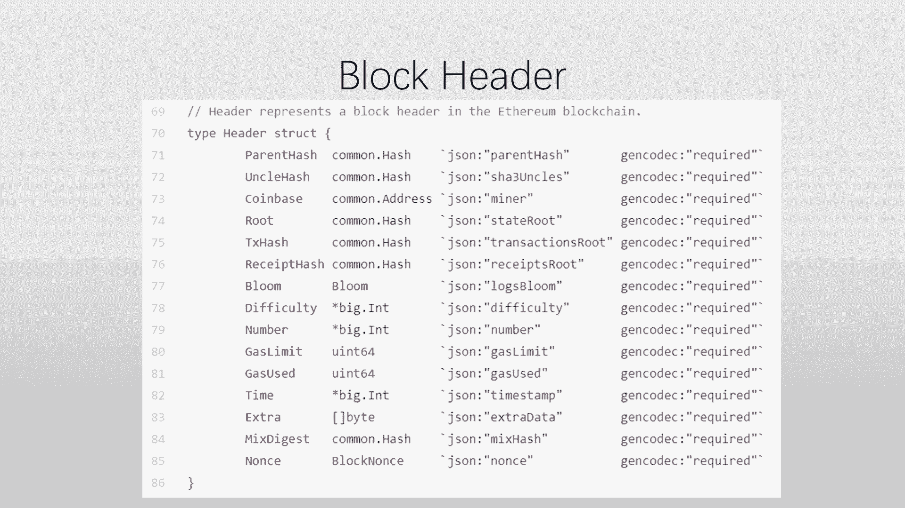

所以应该先干嘛，你得先执行完这个区块中的所有交易，这样才能够更新这三棵树，这样才能知道这三个根哈希值，这样这个block header的内容才能确定，然后你才能尝试各个n，大家听明白了吗。

好我们解决了第一个问题，就这个同学问的问题，是应该先挖矿还是先执行，结论是得先执行，没有办法先挖矿，那这样带来一个问题啊，假设我是一个矿工，我费了半天劲执行这些智能合约，消耗了我本地的好多资源。

最后我挖矿没挖到怎么办，就比如说因为挖矿是竞争对吧，很多矿工竞争记账权被别人抢先了，那我能得到啥补偿，我能得到汽油费吗，汽油费什么费，汽油费是没有的，因为汽油费只给那个获得记账权发布区块的那个矿工。

那我能得到啥补偿，有歌词的那个协议，你就换一个，说不清有你说，你说有构思的协议，你就当一个舒服区玩好了，那你的意思是别人发布区块，我不管他，我还继续挖，目的是为了成为一个舒服区块，这个当然也是一种策略。

不过一般不这么干，如果都像你说的这么干的话，这个共识机制就比较难达成共识了，等于你故意造成分差，其实你这么干对你其实没什么好处，你想想为什么，就比如说假设按你说的，别人发布区块，你你不管他。

你沿着原来那个链继续挖，想成为一个舒服区块，然后挖出舒服区块之后，你怎么办，你还是得切换到那个最长合法链上是吧，所以这个代价你没有省下来，那你干嘛不先切换到最长合法链再继续挖呢，你是之前做的工作浪费了。

但之前做的工作肯定也得浪费，你只要切换过去肯定都得浪费，而且挖矿是无记忆的，你之前挖了多少，跟你后面挖矿的成功概率是没关系的，所以你还不如先去切换到那个最长合法链，然后再继续问问题才有关。

会最先结合最早切，根据这个没有记忆性，不知明我最先天就可以有概率不是，但是你不是，我不是说最先切干掉，因为你反正最后总得切，你挖出舒服区块也得切过去，所以你还不如把你继续把舒服虚化。

那个时间改成切换完之后在新的那个链上挖呢，那样的话更好，大家听明白了吗，我想我们怎么说到这个地方来着啊，我说那个他能得到什么补偿，能得到什么补偿，你就也得给他一点，不给点意思，意思也不合适。

因为他毕竟他也得告知他要被问题来了，谁给问题来了，是谁给这个问得很好，以太坊中没有任何补偿，他得不到汽油费，也得不到任何补偿，不仅如此，他还要把别人发布里的那个区块里的交易在本地执行一遍。

就是以太坊中规定要验证发布区块的正确性，那怎么验证呢，就别人发布一个交易区块，你把那个区块的所有交易在本地执行完一遍，更新三棵树的内容，算出跟哈希值，再跟他那个他发布的那个跟哈希值比较一下。

看是不是一直所有这些都是免费的，没有人给你补偿，所以呢这种机制下挖矿慢的矿工就特别吃亏，就本来汽油费的设置是什么，目的是对于矿工执行这些智能合约所消耗的资源的一种补偿。

但是这种补偿只有挖到矿的矿工才能得到，其他的矿工，等于是陪太子读书，有问题吗，一般来说这个初二讲的这个一个区块里面的这个体格位置，整体这个价格差距，这个我们好像有一节课看过这个数据吧，就到目前为止。

主要的incentive还是出块奖励，就那三个以太币，汽油费只占很少一部分，油费，所以你说这个不是个大问题，反正汽油费也没多少，亏，就亏一点，竟然给这么多，相比于人家得到一个那个除了脚艺人来说。

这点基本你这个说的是有一定道理的，就在目前情况下，因为汽油费占的比例很小，所以这个问题也许不是很严重，你又不是每一个区块，或者说每隔固定的几个区块，觉得挖的一个，比如说你和2万美还挖了一个。

但是2万个区块所有的学费加起来就已经不是一个小时，这个说的也有道理，大家听明白了吗，就出画奖励，不是每个区块都能给你的，你看他那个例子说你挖2万个区块，挖到一次获得记账权，得到一次出块奖励。

就2万个区块，每个区块都有一点小的汽油费，如果你东德得到汽油费的话，这2万个区块的汽油费加在一起可能就超过了出牌奖率，问题在于这两块分到你身上该有多大，不他的意见是应该都应该分我的。

我的意思是说那个汽油可以开，只要执行了，他应该给你点，因为你想的话，你就感觉你挖那么久，然后你也滞销了那么多，但是你一点收益都没有，你说的是属于呃社会分配不公的一个现实情况，但实际上就是这样。

你就是一点都没有，但实际上就觉得那也不如不给机会，还不如不给，不给汽油费就有的问题，汽油费不是光是为了补偿矿工消耗的资源，也是为了遏制发起调用的那个涨幅，对如果不给西邮费的话，那个账户可以下发了。

但是问题不是，你不给汽油费就更不公平了，那别人所有的矿工都得不到，哈哈哈哈，那我问下一个问题啊，会不会有的矿工跟同学们的想法一样，你不给我汽油费，那我就不验证了，比如说我没有挖到矿，我挖了半天没挖到矿。

你发布一个区块，按照协议我要验证一下你发布这个区块的正确性，我验证他能得啥好处，你又不给我去邮费，我也让他干嘛，我就认为你是正确的不就行了吗，我就接着挖，会不会有矿工想不开，我们先说一下。

如果出现这种情况，会导致什么后果，不是一致性的问呃，呃也可以说是一致性，如果某个矿工想不通，不给钱，我就不验证了，那么这样这样的风气蔓延开来，会不会有这种情况，你说这种人毕竟是少数，而且还不错。

不是而且一旦踏上大，假设大多数都是好的，这么做的，然后他那个他肯定把那条件不是最强的，别人不认他，别人就接着发，别人为什么不认他，因为别人要演啊，别人要验，跟他不厌没问题，我就假设你是对的就行了。

我接着玩就行了，那他那个那个那几棵树，那肯定就不一样了，他那个还是他怎么算出来，别人就不认他，他这个说的才是对的，大家听明白了吗，如果他跳过验证这个步骤，他以后就没法再挖矿了。

为什么你验证的时候是要把这个区块的交易都执行一遍，更新本地的那三棵树，如果你不去验证的话，你本地三个数的内容没有办法更新，以后你再发布区块，你怎么发布你本地的这些状态就不对了。

你算出的根哈希值发布出去之后，别人认为是错的，大家听明白了吗，这个没有办法跳过验证这个步骤，他的状态更新还必须得执行，不执行，他没法直接按照那个结果去改，结果为什么必须要执行才能更新状态。

因为发布的区块里没有这三棵树的内容，只是块头里有个根哈希值，这三棵树的账户状态具体是什么余额啊，什么东西发不出来是没有的，大家记得我们大概很多节课以前讲中战术都讲过，那太多了，而且很多是重复的。

大部分状态是不改的，听明白了吗，所以不会跳过验证这一步骤，以太坊的安全还是有保证的，还有一个办法，还有一个办法，什么办法告诉他，你把你那给我一份，超过我就抄过来，就我自己不验证了，重难受，怎么更新呢。

问别人要你把他告诉我干这个呢，其实是属于类似于矿石的做法，矿石实际上就是很多矿工合在一起，矿工本身就不验证了，有一个矿石的poor manager，这个全节点我们以前课上讲过，全节点是要负责统一验证。

然后大家这些矿工就相信那个全节点验证完之后的正确性，就全连点分配给矿工的时候，矿工看的只是一个具体的puzzle的内容，这个paddle是怎么来的，你们刚才还问过别的问题吗，我来我问一个问题。

就你们那是有个类似的问题，如果智能合约执行过程中出现了错误，要么，没有必要，他都执行错了，非法交易，我发布它干嘛，你说什么要扣掉汽油费，说这个同学说的是对的，否则的话你汽油费扣不掉。

你光是在本地的数据结构上把他的账户扣了，西油费是没用的，你拿不到钱，你得把它发布出去之后形成共识，扣掉的汽油费才能成为你账户上的钱，但是我要告诉大家为什么扣篮汽油费了，他这个虽然失败。

对你要告诉大家为什么扣起油费，而且别人也得验证一遍，也要把这个交易执行完一遍，看你扣的是不是对的，那怎么知道一个交易是不是执行成功了，我们前面说过这三棵树，每个交易执行完之后形成一个收据。

这个是几个收据的内容，其中这个state是这个玉，就是告诉你这个交易执行的情况是什么样的，到目前为止还有什么别的问题吗。

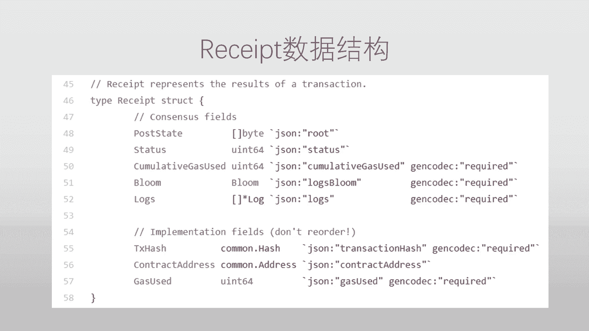

那我再问一个问题吧，智能合约师不是支持多线程的，就现在大家知道吗，多核处理器很普遍，一个计算机有十几和几十个核都是正常的，那么智能合约支不支持多核并行处理，是可以的，应该是可以的啊。

里面有个写日志的那个操作，是隐蔽发射一个信号，因为这个他执行的状态应该就是说好坏，对面是他的日志总结记录下来，如果这个行崩了，可能会影响到，你这个想的有点多了，你的意思是说那个鞋是那个隐秘的操作。

这个日志要写下来，即使这个合约调用的时候，合约崩掉了，这个日式单独用一个线程，还能survive把它给写下来，我们到目前为止没有讲任何对多线程的支持，多线程多线程有必要吗，多线程可以提高程序的运行效率。

为什么没有必要，是但是对于如果一个对于简单的东西都写成，没有必要，你上下文切换这个，你说因为智能合约都太简单了啊，对没看，真的可以到多线程上下文切换，反而更浪费时。

首先线程的切换不不属于contact switch那种东西，跟进程的context switch是不一样的，它内存什么都是共享的，每个县城自己拥有的状态是很少的，寄存器是自己共享，是自己独有的。

但大多数都是属于，扫楼地铁不支持多线程，他根本没有支持多线程的语句，原因是什么，啊你要这是多线程，有一个问题，就是线程同步的问题，可能会不会更，你说的不完全对，你说是因为出现线程同步的问题。

你说的有点有点关系，就是我们说以太坊是什么，是一个交易驱动的状态机，这个状态机必须是完全确定性的，就给定一个智能合约，面对同一组输入，它产生了输出，或者说转移到的下一个状态必须是完全确定的。

为什么要求这个，因为所有的全节点都得执行同一组操作，到达同一个状态要验证，如果状态不确定的话，你那三个数的根哈希值根本对不上，这必须完全确定才行，这个大家听明白了吗，多线程的问题在于什么。

多个和对内存访问顺序不同的话，执行结果有可能是不确定的，这个大家如果感兴趣的话，可以看一下我以前的一些论文，这是我的home配置，论文的话，在这个配合的目录下。

以前我们研究过的就是在多核环境下怎么样实现确定性重演，这是一个难度很大的课题，除了多线程之外，其它可能造成执行结果不确定的操作也都不支持，你们想到的还有什么。

有一个最直接最简单的会导致执行结果不确定的操作，同时写，如果你没有多线程是确定性的，产生随机数，这个操作就是不确定的，而且这个操作必须得是不确定的，如果不同的机器产生的随机数都一样，那不叫随机数了。

所以以太坊中的智能合约没有办法产生真正意义下的随机数，它可以用一些伪随机数，不能是真的随机数，否则的话又会出现前面的问题，每个全节点执行完一遍得到的结果都不一样，大家听明白了吗。

这个是智能合约可以获得的区块信息，为什么我要问刚才那个问题，智能合约的执行必须是确定性的，这也就导致了智能合约不能像通用的编程语言那样，通过系统调用来得到一些这种system call的一些信息。

一些环境信息，因为每个全节点的执行环境不是完全一样的，所以它只有通过一些固定的一些变量的值能够得到一些状态信息，这个大概看一下吧，应该没有什么需要解释的，下面这个是智能合约可以获得的调用的信息。

像message。三的就是发起这个调用的人是谁，它调用了一个合约叫c1 ，这个合约中有一个函数f1 ，然后f一呢又调用了另外一个合约，c2 里面的函数f2 ，那么对这个f2 这个函数来说呢。

message。三的是谁，是c一这个合约，因为当前这个message扩这个调用是c一这个合约发起的，但是传达上点origin是什么，是a这个账户，因为整个这个交易最初的发起者是a这个账户。

这个message的gas就是当前这个调用还剩下多少汽油费，这个决定了我还能做哪些操作，前提是还有足够的汽油费，剩下来，这个message。data就是那个所谓的数据在里面写了。

调用哪个函数和这个函数的参数取值，message c跟你说是这个message data的前四个字节就是函数标志符，调用的是哪个函数，那就是当前区块的时间戳这个跟上一页这个。

这个block their time stamp是一个意思，就是智能合约里没有办法获得很精确的时间，只能获得跟这个当前区块信息的一些事件，大家看看还有问题吗。

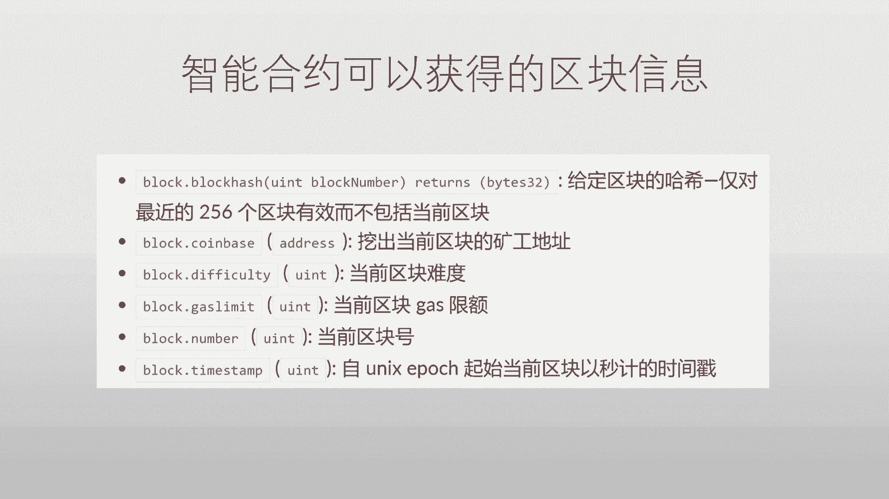

这是我们说这个智能合约中地址类型，大家先看一下这些，这个第一个是一个成员变量，剩下的都是成员函数，这个成员变量就是这个账户的余额，balance，注意这个uint 256，这是这个成员变量的类型。

不是函数调用，就不是说它有一个参数，这个参数是个油印的，256，不是的，所以这个成员变量本身的256，这个是以v为单位的，这是个很小的单位，所以这个账户余额看着都很吓人，好像每个人都特别有钱。

其实没多少钱，下面那些成员函数的话，有一点要注意的，就是这些成员函数的语义跟我们直观上的理解不是很一样，跟第一个这个成员变量balance也不太一样，这个address。

balance你们觉得是什么意思，是address这个地址上的这个账户，它的余额对不对，啊dress点，transfer，比如说12345是什么意思呢。

感觉像是address这个账户往外转了1235个v，是不是这个意思，往外转移，哎对这就说了，如果是这个意思的话，就问题在于它只有一个参数，它只有转账的金额，没有说转给谁。

所以address transport是什么意思呢，并不是说address这个账户往外转了多少钱，而是当前这个合约往这个address这个地址里转入多少钱，大家听明白了吗。

这个address是转入的地址，不是转出的地址，转出的地址是哪个，比如说这是个智能合约，address transfer，意思是从c这个合约的账上往这个address地址里转入12345，这么多的钱。

大家听明白了吗，这比较诡异，这个括咱们以前讲过对吧，咱们很多页p p t以前讲过这个扩调用函数，这个其实也是一样的语义，这个不是说就address点扩，并不是说address这个合约账户发起一个调用。

调哪了别的合约账户，而说当前这个合约发起一个调用，调的是address这个合约，有问题吗，这字太小，看不清是吗，那下面那个address code，还有cocoa delegate call。

是不是函数叫你三种方式，这就是dk的call，我们上课不讲过了吗，就dk的coo的区别，就是说它不需要切换到被调用的函数的环境中，就用当前合约的余额，当前合约的存储这些状态去进行运行就可以了。

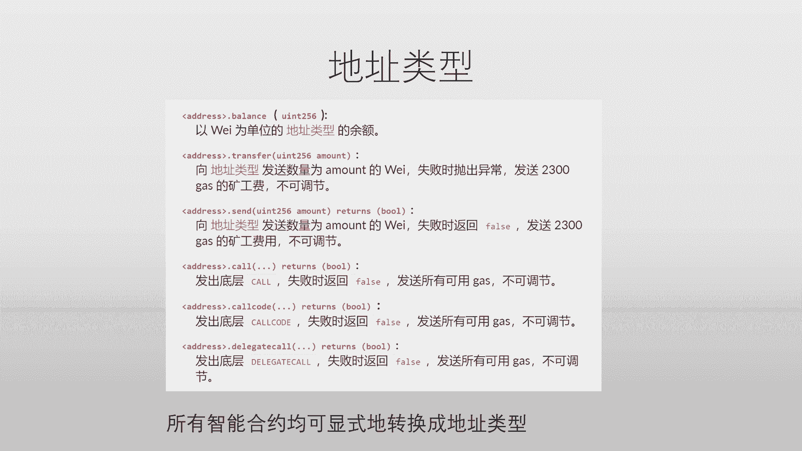

那好之前有同学是谁问的，是你问的还是他问的，就是比如说我上一个账户转账，说这个账户没有定义fbg函数，会引起错误，就会不会连锁回滚，这取决于你怎么转账，就转账有三种方法，这三种形式都可以发送eta。

区别是什么呢，就是这个transform和sn这两个专门是为了转账的函数，区别在于transform会导致连锁性回滚，就类似于你直接调用那个函数，直接调用的方法是一样的，失败的时候抛出异常。

而s返回一个force，不会导致连锁式回管，扩其实也是可以转账，就是扩点挖流，然后把这个扩点value，然后把这个转账金额送进去，后面这个呢你如果不用调用函数，可以是空的。

区别在于sd和transport是专门用于转账的，扩的话本意是发动函数调用，但是也可以用来转账，这个也不会引起连锁式回问失败时返回false，另外一个区别是什么，这两个在发起调用的时候。

只给了一点的汽油，就汽油是2300个单位，就是非常少的，那么收到这个转账的这个合约，基本上干不了别的事儿，也就写一个log就行了，别的事都干不了。

而这个扩这个呢是把当前这个调用剩下的所有的汽油都发过去了，比如说这个扩所在的这个合约，它本身被调用的时候，可能还生8000个汽油，然后他去调别的合约的时候，如果是用扩这种方法去转账。

就把剩多少汽油都发过去，就是另外一个区别，如果考完了，我还要我考完之后，我下面我还有我自己执行的程序，我把记录就能把我，这没有用完会退回来的，你不一定不是发给你的，你不一定都用完。

那就是他立马得直系完毕就立马退回来，什么叫执行完毕就立马退款，我靠孩子执行完毕之，前面两句是请别的，就你扩函数，扩别人另外一个合约用的函数，那个函数执行什么，你是控制不了的，他可能再去调别的合约。

所以什么叫做马上就退回来的，那期我就是我考完了之后，我想想还有我的代码，对不起我的操作，我把机会给全都发过去了啊，那他花多少，你控制不了，他可能会他拿到这个汽油费之后，可能调用很多别的合约。

然后都施行完之后，还有什么汽油费，返回来之后，你还可以接着运行，还有问题吗，好我们回到我们一开始讲的这个例子，这个拍卖的例子。

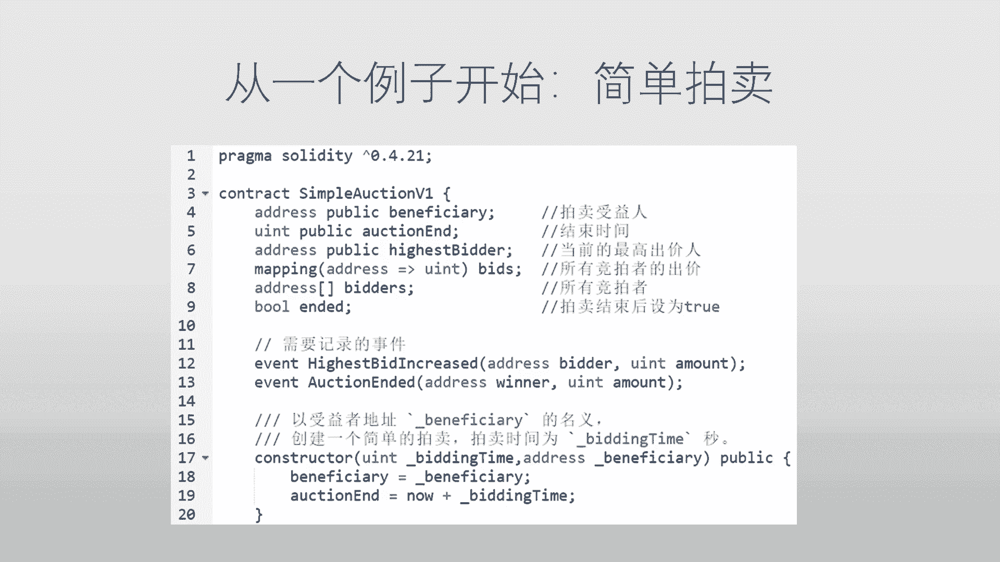

我们说一下这个拍卖的规则吧，这个拍卖有一个受益人，就这个百年非洲人，比如说你有一个古董叫拍卖，那么这个受益人就是你这个ocean是整个拍卖的结束时间，highest beer是最高出价的人。

就这个拍卖的规则是这样的，在拍卖结束之前，每个人都可以去出价，可以去竞拍，竞拍的时候，为了保证诚信，你要把你竞拍的价格的相应的以太币发过去，比如说你出价出100个以太币，那么你竞拍的时候用那个b的函数。

竞拍的时候啊，b的函数在那没写，你就把这100个以太币要发到这个智能合约里，而且会锁在这里面，直到这个拍卖结束，就这个拍卖的规则不允许中途退出，你说我去竞拍，我发了100个亿台币，过一会儿呢我后悔了。

想把钱要回来，这个不行，大家听明白了吗，然后拍卖结束的时候呢，就这个highest beer，他掏出去的钱会给这个受益人，这个beneficiary，当然了，你也应该把那个古董想办法给这个最高出价的人。

那么其他没有竞拍成功的人怎么办呢，可以把当初投进去的钱再取回来，大家听明白了吗，有这么一个过程，竞拍是可以多次出价的，比如说我出了个价钱100个亿台币，然后呢另外一个人出个价钱110个以太币。

然后我再出个价钱120个亿台币，这个时候我只要补差价就行了，就是把我这次的出价跟上次出价的差额发到这个智能合约里，我上次投标的时候已经发了100个亿台币，所以这次只要再发20个亿台币就行了。

出价要有效的话，必须比最高出价还要高，就比如说当前的最高出价是100个亿台币，我去竞拍，我投80个亿台币，那这是无效的，这等于是非法的拍卖，然后这就是我们说的那两个事件。

这个constructor会记录一下这个受益人是谁呃，结束时间是什么时候，这个构造函数在合约创建的时候，把这两个就记下来了，这个呢是拍卖的用的两个函数，左边那个b的函数是竞拍的时候用的，就你要竞拍。

你就发起一个交易，调用这个拍卖合约中的这个b的函数，这个b的函数有一个奇怪的地方，它没有参数，感觉上你竞拍的时候，难道你不需要告诉对方，你出的价格是多少吗，哎对他在哪个地方写的呢。

message value，这是发起这个调用的时候，送转转转过去的以太币数目，以a为单位的转账金额，所以这个逻辑是什么，首先查一下当前这个拍卖还没有结束，如果拍卖结束了，你还出价，那么会抛出异常。

加上当前这个调用的时候发过去的以太币大于这个最高的出价，如果你以前没有出嫁过，会怎么样，这个篦子是个哈希表，如果你要查询的那个键值不存在，那么它返回默认值就是零，所以如果没有出过价，第一部分就是零。

然后呢第一次拍卖的时候把这个拍卖者的信息放到b的数组里，这个原因我们就是一开始讲的所得地址的哈希表不支持便利，你要遍历哈希表的话，然后的话记录一下新的最高出价人是谁，写一些日志之类的。

右边这个是拍卖结束之后的合约，拍卖结束之后的函数，首先查一下拍卖是不是已经结束了，如果拍卖还没有结束，有人调用这个函数就是非法的，会抛出异常，然后这个是判断一下这个函数是不是已经被调过了。

如果已经被调过，首先把这个金额给这个半年非洲人，这就是我们前面那个ppt讲的，大家理解一下这是什么意思，bin fishare transfer是当前这个合约，把后面这个金额给这个班级复转过去了。

就是最高出价人的钱是给受益人了，然后剩下那些没有竞拍成功的怎么办，用一个循环对于没有成功的人，把这个金额退回给这个逼的，然后标注一下这个函数已经执行完了，写一个lo，有什么问题吗。

candy是那个安静的一面，是一个全局变量标识，被当年进来时候，你说安倍的应该是个全局变量，标志这个当年你们是否结束，什么叫权利变，你说成员变量是吗，你是想指成员变量吗，这就是成员变量，ended。

你说什么问题，就是这个拍卖他俩肯定是时间不会自动，不会像个什么一分钟之内就嗯然后把它放在链上，它这个具体是怎么弄的，比如说那个叫就是竞拍那个竞价的话，他怎么知道，就是他那个竞价的那些东西。

他要写在那个你的问题是说这个拍卖时间不会很短，它要持续挺久的，那么竞拍的时候，这些出价什么的记录在哪个地方，我们可能还需要理清一下智能合约是怎么工作的，我前面是不是讲得太快了。

就你写完一个智能合约的时候，比如说你写这个拍卖程序，怎么发布来着，往那个零那个地址发一笔转账交易，转账的金额是零，然后把这个智能合约的代码放到data域里面，然后矿这汽油费是要交的，就转账金额是零。

汽油费是要造给的，会返回给你一个这个合约的地址，所有人都可以调用它，所以回答你那个问题，你的问题是什么来着，就是那个你每次竞拍它存在哪，里面有他的状态信息，这些都是在它的存储，都是在一个p里存着的。

这些东西用不着强攻来啊，那他就用不着强攻，来自小猫，要要矿工执行，你拍卖的时候怎么拍卖，只是这个流程还是没有搞明白拍卖的时候怎么拍，拍卖的时候是你这个比如说你个外部账户，你要拍卖，你要发起一个交易。

这个交易要调用这个b的函数，那这个就是这个叫价过程还是得写了，这样对呀，每一次每任何一个人出价参与这个竞拍，你还得转账转过去，对不对啊，转，你不能自己闹着玩儿，你不你不发不出去的话，别人不认账的。

那如果别人去，我是不是还得搞一个合约账户，目前基本牌是谁，谁就得搞一个公开的这种信息类的这种东西，但这种东西应该不是全阶段不会给你提供，这同学们可能是不是我没讲清楚，怎么你们还没有这个概念，你说要我。

你要搞一个竞拍，你得先去申请一个合约账户，得搞一个什么东西，不是你搞一竞拍，你就写一个程序，写一个扫雷的程序，然后你发布一个交易，把这个合约放在网上，然后别人怎么知道你这个合约，那你得线下宣传。

你用别的方法宣传，就像你的我们以前讲比特币的时候讲过的，你的比特币地址，别人怎么能知道，你自己去宣传，咱们这门课其实可以搞一个比特币机制，接受大家的捐款，这个你自己得旋转，然后你这个合约地址执照之后。

别人去竞拍，没有问题了吗，别的同学也没有问题了吗，主要是快要下课了，要知道吃饭时间了，这个我说是有问题的，智能合约这么写是有问题的，那个嘴巴那个破坏，你到底想说什么问题啊，那就不是。

写智能合约一定要小心，说的好听点叫不可篡改，说的不好听点，就是你没法改bug，一有bug没法改，这有什么问题，哦你知道啊，是不是那个拍卖结束的时候，他那个自己的那个他放的位置不对，拍卖结束。

这安迪放的位置不对，为什么不问，是不是应该放在那个前面，那个转给那个受益人，那个前面如果有好几个是同时调用的话，它前两个那个片，你说这个安迪的这个成员变量赋值成处应该在转账之前复制成处。

否则的话可能有多个这个参与拍卖的人都调用这个option and，然后把这个转账都执行一遍，对他可能非常多的这个其实你说了一个很重要的问题，就是奥特案的这个函数必须要某个人调用才能执行。

这个也是守着这些语言跟其他编程语言不同的一个地方，就是没有办法把它设置成拍卖结束了，自动执行auction，你可能是拍卖的受益人百年分数去调用ocean，也可能是某一个参与竞拍没有成功的人去调用。

但总之得有一个人去调用，但是你说的那种情况不是一个问题，就是如果两个人都去调用欧诗案的矿工，在执行的时候把第一个调用执行完了，然后第二个调用再执行就执行不了了，因为第一个执行完之后，安倍就是处了。

没有并发执行，你还是想着多线程并发执行，没有并发执行。

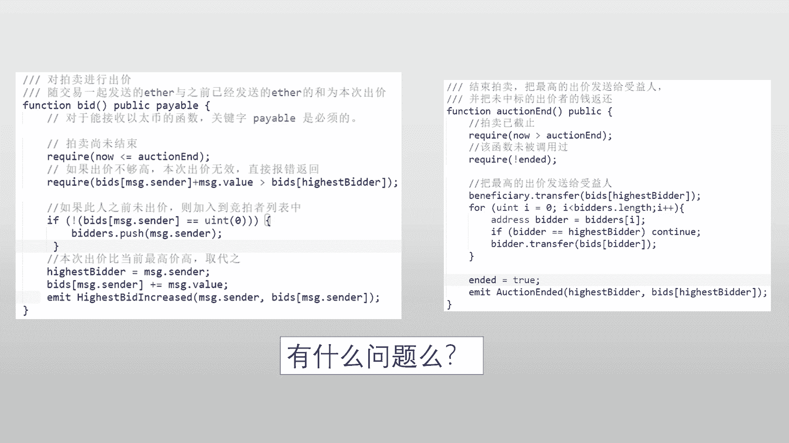

那我看答案了，假设有一个人通过这样一个合约账户参与竞拍，会有什么结果，这个合约实际上就一个函数对吧，hacker be这个函数在干嘛，它的参数就是那个拍卖合约的地址。

然后他把它转成这个拍卖合约的一个实例，然后调用拍卖合约用的b的函数，把这个钱发送过去，这个实际上应该怎么用，因为这是个合约账户，合约账户不能自己发起交易。

所以实际上得有一个黑客从他自己的一个外部账户发起一个交易，调用这个合约账户的这个哈er b的函数，然后这个函数呢再去调用拍卖合约中的b的函数，把他自己收到的这个转过来的钱。

这个黑客外部账户转过来的钱再转给这个拍卖合约中的b的函数，就参与拍卖了，有问题吗，好像还是没有问题，还是没有问题是吗，我们看一下我们上一页的这个函数，这个auction and。

这个合约参与拍卖没有问题，最后拍卖结束，退款的时候会有什么问题，这个红框里通过这个循环退款，退到这个合约账户上的钱，会出现什么情况，他那个就这个调它的这个质感对啊，推到这个智商。

这个黑客合约上的钱会有什么情况，是问题在于一个合约，就用这个盒子，又要调用黑盒，这个，黑客外部账户对这个拍卖合约来说是不可见的，拍卖合约能看到的只是这个黑客的合约。

然后他这个他这个小模型应该是这个合约涨不去降这个合约掌握，但是现在这个合约掌握它，他根本不知道他有什么看的书法的，所以就会掉到那个fbg里面去，不是说它不知道它有什么函数。

这个转账的时候没有调用任何函数，那么当一个合约账户收到转账，没有调用任何函数的时候，应该调用fb的函数，而这个合约没有定义fbg函数，所以会怎么样，会调用失败对吧，而调用失败会抛出异常。

这个transform函数是什么意思，它会引起连锁式的回滚，所以导致这个转账操作是失败了，收不到钱了，对不对，那对他有什么好处呢，我先问一个问题啊，谁收不到钱，然后只要最高下面的不需要石油进。

不是就最高价，不是一个这个受益人，对手也没有对其他所有的就是没有竞拍到这个人类，没有竞拍到这个人的人，没有竞拍到，这个主要是太原竞拍，你们俩说的不一样，就我们说的更具体一点，比如说有20个人参与竞拍了。

这个黑客合约排在第十个班尼菲特瑞这个最高出价应该给百年菲特，最高出价者排在第16个，那么最后是有哪些能够收到钱，哪些收不到钱，听明白我问什么了吗，你再给他会问到底会不会到哪，那这排位就没法接受了。

这个水，你说的回滚到哪儿，如果你看这个的话，ocean你的这个函数就可能会回归，那这样你一回合的这个排名就没有结束，拍卖结束了，ocean的这个时间点是过了，比如说先说这个收益人能不能收到钱。

开始执行的时候，先把这个钱转给这个收益人了，你说他会收到之后，至少回款又收不到了，你们俩的观点不一样，不是要吧，会不会到你会上哎，对回款时退回到执行之前的状态，所以所以前面那个转账到底是收到还是收不到。

所以你说我们俩到底退到哪去，他到底退到哪去，是啥意思，我觉得整个函数，为什么我要问这个问题，其实关键在于这个转账操作是怎么转的，是说我银行上有一笔钱，我转给你，按照这个顺序，20个人转让，转转到第十个。

转账出错了，是这样吗，转向不是男人像发起交易一样这样发起交易进去了，所以其实他写了一名意，你说是这里转账，不是银行转账，是是发起交易，它实际上写一笔笔交易要转给谁，这边这样谁对，他想把那个交易在打。

那就值得，他自己交的钱，他自己拿不回来了，你要立场坚定，你原来说的是对的，现在你要动摇哈哈可没有动摇，我来跟他说一这个过程是怎么样的，这个转账实际上是在干嘛。

是你这个矿工或者说全节点执行到这个百年分裂穿刺破的时候，把相应账户的余额进行了调整，大家听明白了吗，就智能合约执行过程中的任何语句，对状态的修改，改的都是本地的状态，都是改的本地的数据结构。

所以这个循环当中，不论是排在这个黑客合约前面，还是排在他后面，都是在改本地数据结构，只不过排在后面的这个彼得根本没有机会来得及执行，然后整个都回滚了，听明白了吗，就好像这个智能合约从来没有被执行过。

所以排在前面的这些转账并没有执行，也不像你说的是形成一条条交易，它不形成交易，就是改本地的数据结构，然后如果都顺利执行完了，发布出去之后，别的矿工也把这个ocean的从头到尾执行一遍。

也改它本地的数据结构，跟你的能对得上，这就叫形成共识，是产生一个新的交易，不是这样的，所以谁收不到钱，都收不到钱，没有任何人能收到钱，发起这个攻击的人的好处，有可能这个人是故意捣乱写这样一个程序。

让大家都拿不到钱，也可能是这个人不懂，他就忘了写for bag函数了，也有可能，那出现这种情况怎么办呢，怎么办，然后吸引大家很多人来拍卖，拍卖完之后发现有这样一个问题，这个黑客合约你怎么办。

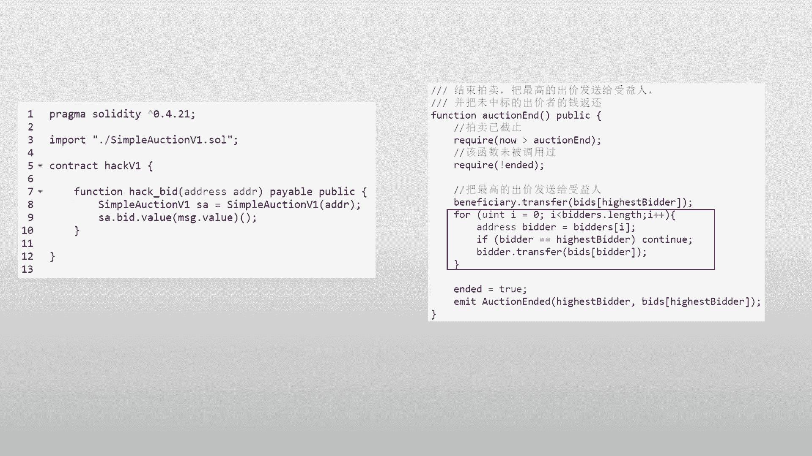

老师问一下，就是这个这个拍卖失败的最后的结果，就是说所有人的所有转账的那些人的钱会回到他自己的状态，就是相当于这个排片从来没有发生过，是这个状态回到这个状态，不是你的问题，是回滚是啥意思，是不说。

就好像这个拍卖的事情在网上从来没有发生过，如果这样的话就好了，现在的问题是什么，你已经把钱投进去了，锁在里面了，你怎么把它取出来的问题，怎么慢出现这种情况，一直回滚到还没有往里面打钱的时候。

怎么回滚到那个时候，这不可能吧，那首先你那些技术，还有那些交易已经发出去，外面的话，所以同学们的回答是对的，没有办法出现这种情况，没有办法了，大家听说过一种说法吗。

cold也是路智能合约的规则是由代码逻辑决定的，这样的坏处是规则中有漏洞，你也改不了了，这个大家要注意啊，智能合约如果设计得不好的话，有可能把收到的以太币永久的锁起来，水也取不出来。

以前还有那种用智能合约锁仓的，就比如说我们要开发一个新的加密货币，然后呢就像前面说那个priman先预留一部分币给这个开发者，然后这些币我们都打了一个智能合约账户，锁仓3年，3年以后这些币才能卖。

这样做主要是为了大家一开始的时候能集中精力开发这些加密货币，这个挺好的对吧，智能合约所长是个常用的操作，万一你要是写的时候写错了，多写一个零，变成30年，这些币就会锁上30年，没有办法，这个有点像什么。

像那种不可撤销的信托，这个叫做，revocable trust，大家听说过这个吗，美国有一些有钱人用这种信托来达到财产保护或者是减税的目的，这个就是一个法律上的合同，如果制定这种不可撤销的信托的时候。

法律条款的设计有问题，也可能会导致存进去的钱取不出来，所以在你发布一个智能合约之前，一定要测试测试再测试，你可以在专门的那种test测试的网上，用假的以太币做测试确认完全没有问题的情况下再去发布。

那我再问一个问题，那我能不能在这个智能合约里留一个后门，用来修复bug，比如说给这个合约的创建者，超级用户的权利，比如我们前面这个，这个构造函数里我们加一个叫欧了，记录一下结果on那是谁。

然后对这个欧拉的地址，允许他做一些类似于系统管理员的操作，比如可以任意转账，把钱转给哪个地址都行，那样的话，如果出现这种，像这种bug，这个超级管理员就可以发挥作用，把锁进去的钱给转出来了。

因为反正对他没有限制，他转给谁都行，这样行不行，这样有可能出现卷款跑路的情况，就是这样做的，前提是所有人都要信任这个系统管理员，这个超级用户，这个跟去中心化的理念是背道而驰的，好回到我们这个程序。

那怎么办呢，难道不拍卖了吗，第二个版本我们把前面那个凹深案的拆成两个函数，左边的是尾子，坐右边的是p图班尼菲，大家先看一下这两个函数，这个尾字弱是什么意思呢，我们再不用循环了，我们在这里就不用循环了。

每个竞拍没有成功的人，自己调用位子做函数，把那份钱取回来，首先判断一下这个拍卖是不是结束了，然后看一看调用的这个人是不是最高出价者，如果是的话，不能把钱给他，因为要留着给那个拍卖的百年分数。

然后看一下这个人账户的余额是不是正的，这个俺忘了是什么，就是她的账户余额，然后呢，message。三的就是把这个账户余额转给这个message。三的就发起调用的这个人，然后把他的账户余额清成零。

免得他下次再来取一次钱，就是围得住，配图版的菲特瑞是说把最高出价给这个受益人，也是判断一下拍卖已经结束了，最高出价的金额大于零，然后下面就把它转过去，这样可以了吗。

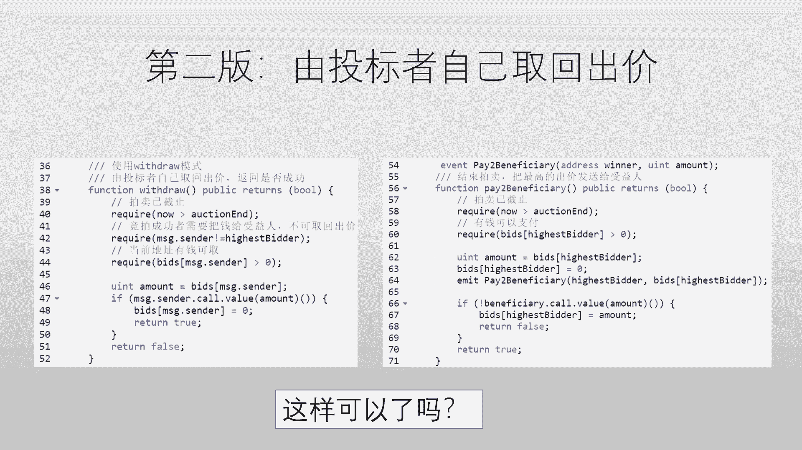

有什么问题，是不是那个投标的，比如说你投标的人，你自己提前的时候，你还是把它写在那个账户里边，但是你自己写的那个播报才出，大家听明白了吗，他说的是对的，这有什么问题重入攻击。

如果有一个黑客写这样一个程序会怎么样，这个hacker beat就跟我们前面那个黑客合约里的hacker beat是一样的，通过调用拍卖合约的币的函数参与竞拍，hack尾字做呢就在拍卖结束的时候。

就要用尾字做函数，把钱取回，这两个看上去好像都没什么问题，问题在哪，这个for back函数就for back函数在干一个什么事情，又把钱取了一遍对吧，这是我们刚才显示的，为了做函数，哈克瑞斯弱调。

用拍卖合约的尾数函数的时候，执行到这个地方，会向这个黑客合约转账对吧，这个message。三的就是这个黑客的合约，把他当初出价的金额转给他，而这个合约在干嘛，他又调用了这个拍卖函数的尾数做函数。

又去取钱，这里的message。三的就是这个拍卖合约，因为是拍卖合约，把这个钱转给这个合约的，然后这个拍卖合约在干嘛呢，又执行人员执行到这里面，再给他转一次钱，注意这个清零的操作。

把这个黑客合约账户清零的操作，只有在这个转账交易完成之后才会进行，而前面那个转账的语句已经陷入到了跟黑客合约之间的递归调用当中，根本执行不到下面这个清零的操作。

所以最后的结果就是这个黑客一开始出嫁的时候给出一个价格，拍卖结束之后就按照这个价格不停地从这个拍卖合约中去取钱，第一次娶的是他自己的出价，后面娶的就是别人的墙，那这个递归重复取钱持续到什么时候会结束。

有三种情况，一个是这个拍卖合约上的余额不够了，不足以在支持这样一个转账的语句，第二种情况是汽油费不够了，因为每次递归调用还是消耗汽油费的，到最后没有足够的汽油剩下来了，第三种情况，调用栈溢出了。

所以在这个地方判断一下这个黑客合约的佛back函数，判断一下这个拍卖合约的余额，还足以支持转账，汽油呢，当前调用了剩余汽油，message or gas，还有6000个单位以上。

调用站的深度不超过500，那么就再发起一轮攻击，那怎么办呢。

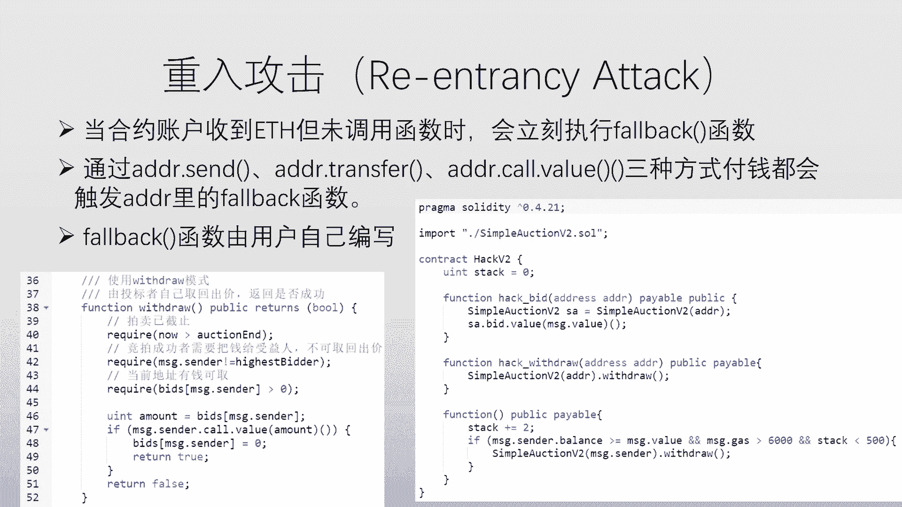

这个该怎么修改，一个最简单的就是先清零再转章，其实就是我们右边的这种写法，右边配图百年飞写法是正确的，在这个地方已经把孩子逼得的账户余额清成零了，就在b字里面的哈希表的余额清成零了，然后再转账转账。

如果不成功的话，再把余额恢复，这个实际上是对于可能跟其他合约发生交互的情况，一种经典的编程模式就先要判断条件。

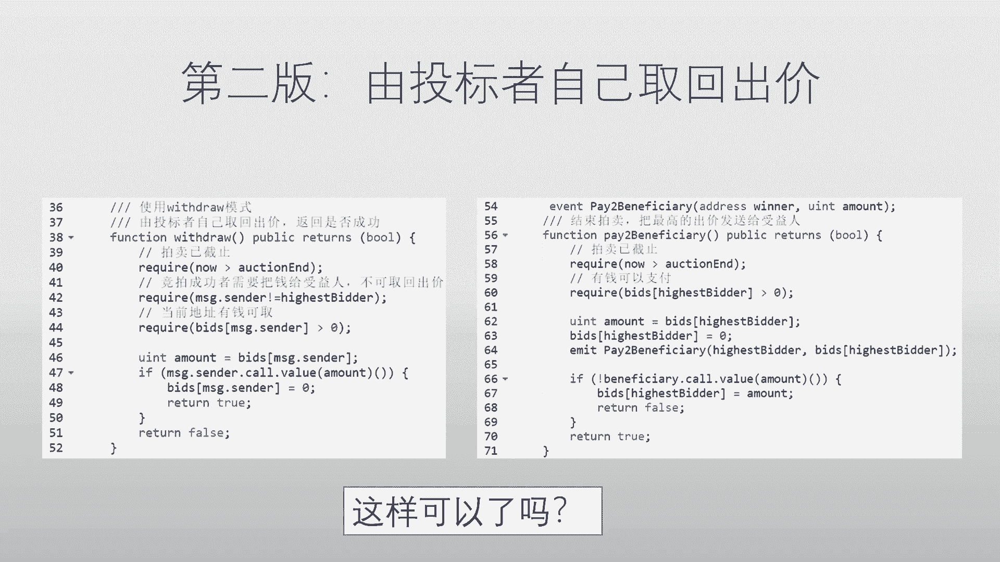

然后改变条件，最后再跟别的合约发生交互，任何未知的合约都可能是有恶意的，所以每次你向对方转账或者是调用对方的某个函数的时候，都要提醒一下自己这个合约，这个函数有可能反过来调用你当前的这个合约。

并且修改状态，better safe than sorry，小心一点总是好的，除了这个修改方式之外，还有一种办法，就是不要用扩点value的方法转正，我们对比一下修改前后的两段代码。

区别就是绿框这个部分，首先呢我们把这个清明的位置提前了，先清零再转正，而且，我们转账的时候用的是s，用transform，也可以就set和transform，我们说有一个共同的特点是什么。

转账的时候发送过去的汽油费只有2300个单位，这个不足以让接收的那个合约再发起一个新的调用，只够写一个log而已，大家有问题吗，网上拍卖不容易吧，还有问题吗，没有问题，这个程序就正确了，大家还有问题吗。

就刚才那个同学问的那个问题，就像第一个那种错误，就是我们说有一个黑客合约没有写for bag函数，大概是在这个位置吧，就是这个如果这个不是一个黑客合约，就是一个普通的账户，它忘了写fbg函数怎么办。

也没有办法，就算这个账户愿意改，也是改不了的。

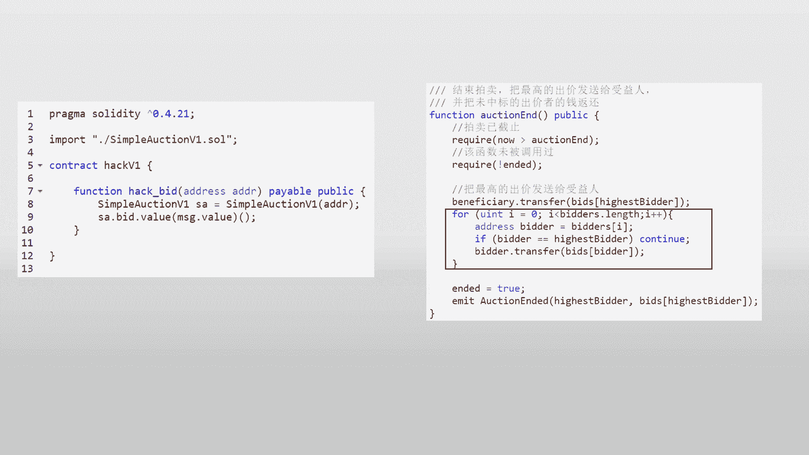

他没有办法再把fbg函数补上了，你可以再创建一个新的合约，但是这个合约已经参与了这个拍卖了，已经被记录在这个循环里面了，也没有办法，今天我们这个课讲的内容比较多，大家回去好好消化吸收一下。

我们讲了智能合约中可能出现安全漏洞的一些例子，那么这些安全漏洞在实际当中是不是真的会发生呢，我们下节课讲一些实际的例子。

