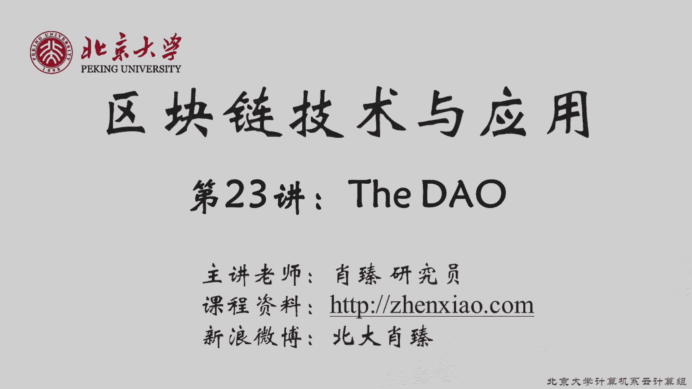
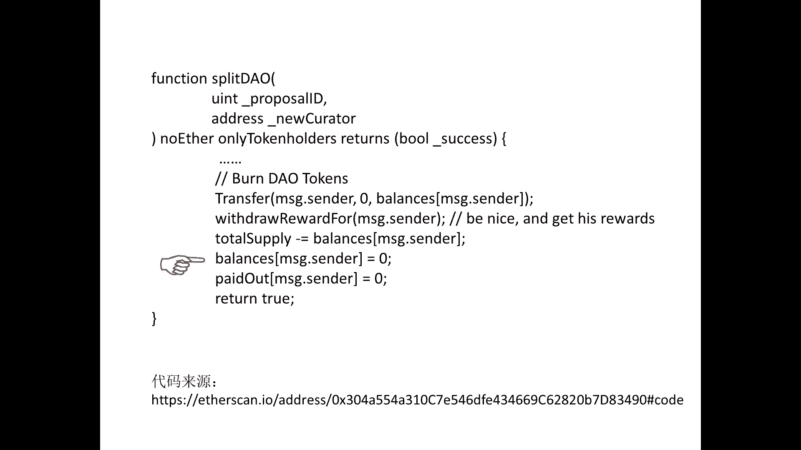

# 北京大学肖臻老师《区块链技术与应用》公开课 - P23：23-ETH-TheDAO - 北京大学计算机系肖臻 - BV1Vt411X7JF

上节课我们讲了重弩攻击的原理，那么这样的攻击在现实中真的会发生吗，这节课我们就讲一下2年前的一个真实的案例，这个案例在以太坊的历史上赫赫有名，造成了以太坊的分裂，可以说整个以太坊的历史都被他改写了。

我们说比特币实现了去中心化的货币，以太坊实现了去中心化的合约，那么既然去中心化这么好，为什么不把所有的都改成去中心化呢，所以就有人提出一个口号。

叫做nice decentralize everything，到这个概念就是在这样一个背景下产生的。

就传统社会当中呢，组织是建立在某种法律文件基础上，比如说可以有一个书面的章程规范这个组织的行为，有时候可能还需要到政府进行登记注册，到这个组织就是建立在代码基础上，组织的规章制度是写在在哪里的。

这就是道这个概念，在2016年5月的时候出现了一个致力于众筹投资的道，它的名字叫做the do，这个名字呢其实有点容易引起歧义，就是道是一个通用的概念，the doll是指具体这个道叫the door。

他这个名字起得比较奇怪，他的这个工作原理呢有点像一个就众筹的投资基金，就用来投资项目的，得到的，它本质是一个运行在以太坊上的智能合约呃，然后投哪个项目呢，就是如果你想参与这个the door。

那么你可以把呃以太币发给这个智能合约，然后可以换回the door的代币，那么需要决定投资哪个项目的时候，是大家投票决定的，你手里的这种代币越多，投票的权重就越大，那么最后如果有了收益。

就投资之后有了收益，那么也是按照这个智能合约中制定的规章制度来进行收益分配的，这就是the dog这样一个工作的原理，所以呢这个工作方法呢实际上有点像是像是dk的形式，就这不是有个道吗，还有一个是dk。

dk前面都跟他是一样的，最后是叫corporation，去中心化的自制公司，就这两个的区别，就dk和道，一般来说呢duck是出于盈利目的的，是为了经营赚钱的，道的话，可以使出于非盈利性目的。

比如说就是为了某种公益事业，呃，虽然这个dk从名字上来说，它叫一个公司，叫一个corporation，但是在现实社会当中呢，它并不具有公司应有的法人地位，我们回过头来说这个的道。

直到2016年5月份开始众筹的时候，在当时呢受到了很大的关注度，大家都听说过一些，风投吧，一般的风投就是几个vc partner说了算，所以在当时呢被称为是一种伟大的尝试。

引起了当时这个互联网这个社区里很大的兴奋，他从2016年5月份开始众筹，那么一个月的时间就筹集到了价值1。5亿美元的以太币，当时的以太币价格还是比较便宜的，这些以太币如果放到现在的话。

大概是价值几10亿美元，所以呢那个时候呢就在互联网社区上有很多人发表各种各样的文章，就讨论这个事情，因为他这个众筹的速度和规模在历史上是非常罕见的，比很多众筹网站要快得多。

所以当时有互联网上有各种各样的评论，大家预测若干年以后得到的影响力会有多么多么的大，有的人甚至说3~5年以后，the door的影响力会超过以太坊本身，遗憾的是，the到没有能等到3~5年。

一共只存活了三个月，问题出在哪里，比如说你是一个the door的投资者，你怎么取回你的收益，就比如说你参与得到你投了一币以太币过去换回一些the道的代币，你用这个代币可以投票决定投哪个项目之类的。

过一段时间之后呢，你需要用钱了，先把这个以前投资的那些以太币换回来，怎么办，这个在the door这个基金里是通过拆分的方法来实现的，就叫做split door。

拆分到这个拆分的方法呢不是单纯用来取回你的收益，也是一种建立子基因的方法，叫child到，就拆分完之后得到一个child到，这个设计的理念是这样的。

就我们说这个the到投资项目是靠大家一起用手中的这种代币去投票，那么如果有一小部分人，他的投资理念跟其他人不一样，怎么办，比如说有某一个小众化的项目，可能呢少数一些人认为很好，是值得投的。

但是得不到大多数人的认可，这种情况下呢，成立一个自己的子基金，就是叫child of，然后呢在拆分的时候呢，他们手中的这些代币是要被收回去的，然后呢换成相应数量的以太币，就把相应数量的以太。

币打到他们那个子基经理，然后他们就可以投他们想投的项目，就大家听明白了吗，这个拆分的过程，拆分的一个极端的例子，就是单个投资者成立一个子基金，就这个child dog里面就他一个人，然后到这个子集经理。

他就可以把所有的钱投给他自己，这是投资者取回投资和收益的唯一途径，就他没有像我们上节课说的那种尾子做函数，就大家还记得上节课那个网上拍卖的例子吗，拍卖结束之后，你如果没有竞拍成功。

你可以调用这里面的伪字做函数，把钱取回来，the到这个基金里没有实现，这个v字数函数，所以你要想取回钱，只能用拆分的方法，那么拆分之前呢有七天的辩论期，大家可以讨论一下这个拆分好不好之类的。

也可以决定要不要加入这个拆分，拆分之后有28天的锁定期，就是成立一个子鸡丁之后，不是要把相应的这个以太币打到这个紫鸡丁里面吗，然后在里面要28天以后才能取出来，我们后面会看到就是这28天的锁定期。

给了以太坊社区采用补救措施的时间，拆分的理念并没有错，就拆分子基金的理念并没有错，既然这个拆分的理念没有错，那问题出在哪里呢，问题就出在了sprit down的实现上，我们看一下这部分的代码。

这是split down的代码，大家注意这个地方，就这个语句呢，首先把钱还给调用这个函数的人，然后把the道中的总金额减少相应的数量，再把调用者的账户清零，看到这里，大家应该已经引起警觉了吧。

我们上节课讲过，正确的操作顺序是先把账户清零，然后再转账，黑客就是利用这个漏洞进行的重入攻击。

我们前面讲过，the do是从2016年5月开始众筹的，差不多一个月的时间筹集到了价值1。5亿美元的一台币，然后黑客就利用这个重入攻击，从里面转走了5000万美元的以太币，差不多1/3。

这件事情当时在以太坊社区引起了很大的恐慌，就大家本来认为前途无量的这个热道去中心化这么美好的一个理念，在现实当中被证明是不堪一击的，这个事件也引起了以太币价格的大跳水。

那么以太坊社区呢对此进行了激烈的讨论，就是该怎么办，社区的意见分裂为两派，一派认为要回滚交易，就是我们前面说过嘛，成立的子基金有28天的锁定期，所以呢黑客暂时还没有办法把钱取走。

还有时间可以采取补救措施，那么通过回滚交易呢，就不能让黑客得逞，这样能够保障广大投资者的正当利益，另一派认为呢不需要采取补救措施，因为黑客的行为并没有违法，他犯什么法了吗，既然我们说扣的引路。

大家听说过这个说法吧，我们上节课讲过，规则是由代码来决定的，那么代码中的漏洞呢也是规则的一部分，就这个事情发生之后呢，我只是利用了你代码中的一个feature，就spring down那么写。

他认为是个feature，既然你代码写的可以让我重复多次取钱，我就利用这个飞车来达到了我想要做的目的，并没有违反任何法律，所以呢以太坊社区有一派人是认为不应该采取补救措施，尤其是不应该回滚交易。

是不可篡改性，如果出了问题就回滚，那怎么能叫不可篡改呢，而且你想想这次出问题的是什么，只是以太坊上运行的一个应用而已，the doll是一个以太坊上的智能合约，以太坊本身的代码没有问题。

只是上面的智能合约里有一个安全漏洞，那以太坊有那么多的智能合约，对不对，如果每个智能合约出了问题都回滚的话，那不得乱套了吗，那你还说什么叫做不可篡改的去中心化的账本呢，这是以太坊社区两派不同的观点。

以太坊的开发团队就是为他那个那帮人是知识采取补救措施的，主要是这个事情的影响太大了，就是the道筹集的这个以太币数目，大概是10%几，这就已经很大了，一个智能合约能占到10%几，就已经很大了。

如果我们放纵不管，那么这些以太币当中有大概1/3要落入到黑客的手里，我们真的希望这么多的以太币都集中在黑客手里吗，而且我们那么多投资者的利益怎么办，就会套用一句这个美国金融危机当时的说法，the到。

这个基金叫做too big to fail，大家听说过这个说法吗，2008年美国金融危机的时候，美国有一半的home mortgage都是由这两家公司提供的担保，当时发生金融危机好多，这个房贷还不了了。

两家公司撑不住了，快要破产怎么办呢，最后美国政府出面拯救了这两家公司，原因就是他们太大了，如果垮掉会对美国经济造成严重的打击，所以这叫too big to fail。

那么以太坊社区有些人认为the到这个基金也是属于to b to feel，所以还是要救的，就我们今天讲完这个事情呢，大家不要产生，一种错误的安全感，好像以太坊社区会介入干预一些事情。

如果就是个小的智能合约出了问题，或者是你自己转账转错了，转到别人的账上，以太坊社区是不管的，开发团队也是不管的，好假设我们要采取补救措施，怎么补救，比如说我们就从发生攻击的那个区块之前开始分叉。

这样行不行，我们可以画一个例子，比如说，从这个区块开始，黑客进行了盗取以太币的攻击，那么我们从前一个区块开始分叉，就大家商量好了，上面这条链我们不认了，从下面继续开始挖，最后让上面这条链。

下面这条链比上面那条链还要长，这是我们以前常见的一种分差工具的方法，这样行不行，大家觉得可以吗，所谓来说的一把黑客的那个区块之后的都给抛弃，比所有人都，我不是干这个事，这个问题倒不是所有人要都统一。

假设我们有一种方法，所有人统一往下面挖，这样会有什么后果，不光是这个黑客攻击的交易回滚了，上面这条链后面的所有交易都回滚了，大家听明白了吗，这里面有很多是合法的交易，the道只是以太坊上的一个智能合约。

还有好多别的智能合约在运行呢，另外还有一些正常的网上支付啊，网上转账的交易，本来我转给你钱，以为没事了，结果一回滚的转账就作废了，那不乱套了嘛对吧，所以这么干是不行的，大家听明白了吗，要回滚的话。

必须要精确定位，只能是针对黑客盗取以太币的那些交易，其他发生的正常的交易不能够受到影响，这是采取补救措施的一个原则，那怎么操作呢，以太坊团队制定了两步走的方案，第一步首先要锁定黑客的账户。

第二步再设法把这个盗取的以太币设法退回去，先说第一步，怎么锁定这些账户，以太坊团队呢发布了一个软件升级，在这升级的软件里增加了一条规则，凡是跟the到这个基金上的账户相关的，不允许做任何交易。

大家听明白了吗，这发布之后呢，大多数以太坊的矿工都升级了这个软件，好，那我来问一下这个是属于软分叉还是硬分叉，你说什么这是软软分叉，为什么软分叉就是就是我这个神奇的这个框呢。

我是说我的这个区块我可能不认，就是说他们根本到有关的这个交易，不但是如果以前的那个区块，它没有这个得到的交易，我还是认就是他还是那以前的区块，没有身体的狂风，还是任务升级的这一步把我挖出来一块。

这个说的是对的，就这个软件升级本质是干一件什么事情，是增加了一条判断的规则，就当一个节点收到一个交易的时候，判断这个交易是不是合法，增加一条新的规则，就，是the到相关的账户不准做任何交易。

说如果这个交易是跟the door的账户相关的，就认为这个交易是非法的，就等于加一条规则，那么增加这个规则之后，新矿工挖出的区块，旧矿工是认可的，因为旧矿工不知道这个新规则，他也不会去查这个。

但是旧矿工挖出的区块，新矿工有可能不认可，新矿物就不认可，所以这是一个软分叉，就大家还记得这个区别吧，就如果你这个软件升级之后，这叫硬分叉，如果只能造成临时性，的分叉，最后还是能合在一起，就叫软分叉。

所以这是个软分成，这个软件升级的想法呢是挺好的，也得到了大多数矿工的知识，遗憾的是，升级之后的这个软件有一个bug，这个bug不是功能上的bug，也不是安全漏洞，就不是说像那种有宠物攻击风险那种bug。

而是跟汽油费相关的，我们说你增加一条规则，收到一个交易，判断一下这个交易是不是跟the道的账户相关的，如果是的话，认定是非法交易，不予执行，这个时候还要不要收取汽油费，你们觉得要不要。

本来这个交易应该是合法的，没有这个新规则是合法的，现在我加了规则之后变成非法了，所以这个交易是不能正常执行的，汽油费还要不要收他的，消费也不收的话，就是不收的话，他可能会一直发出对比。

有可能就是发生攻击，然后一直给你发这个根本和相关交易，然后你就得执行一半又不对，然后就给他嗯，就是前面我们讲机油费是为了防止他无限的随便发，交易日是为了防止这个人，但是如果不收期油费的话。

基本上没有成本的这种可以干这种事情，就汽油费的机制很大的一方面是为了防范delof service attack，就如果不发收取邮费的话，可能会有一些恶意的攻击者不断的去发放这种非法交易。

浪费矿工的资源，反正对他来说成本很低，以太坊社区发布的这个软件升级，恰恰就是在这种情况下，没有收汽油费，就检查地址发生错误的时候没有收取邮费。

结果呢网上有大量的这种deny service attack，都是这种非法的交易进行冲击，本来呢是大多数矿工都已经升级了软件的，但是升级之后就不停地受到这种攻击，过不了多久，这些矿工就已经受不了了。

于是纷纷回滚它的软件升级又改成了原来的版本，于是这个软分叉的方案就失败了，这个时候形势就比较严峻了，我们前面说过，紫基金成立之后有28天的锁定期，然后黑客就可以把钱取走了，软分叉的方案失败之后。

剩下的时间就不多了，那怎么办呢，既然软的不行，我们就来硬的，以太坊这个团队呢设计一个硬分叉的方案，通过软件升级的方法，把the door账户上的所有资金强行转到另外一个新的智能合约上去。

这个新的智能合约只有一个功能，就是退钱，你当初不是用以太币买的得到的代币吗，现在可以把这个代币退回成以太币，就这一个功能，大家想一想，这个为，什么是硬分叉，这种做法的本质是什么。

用软件升级的方法强行重新记账，就本来呢要转账得有合法的签名，比如说我要把你账上的钱转走，那得经过你的同意，有你的签名才行，这个时候就不管这些了，这是非常时期，凡是惹到账户的上面的资金。

不管本人同意不同意，都要强行转到一个新的智能合约上去，就有点像是法院的强制执行，大家听明白了吗，那么升级的软件里规定了强制执行的具体日期，挖到第192万个区块的时候。

就所有升级软件的矿工挖到第192万个区块自动执行，这个转账交易不用什么合法的签名，不合法的签名，这是在升级的软件里写死的一条规则，旧矿工是不会认可这个区块的，因为没有合法签名，你这是非法交易。

大家听明白了吗，这个硬分叉的方案一提出来，在以太坊社区引起了非常激烈的辩论，我们前面不是说过吗，社区本来就分成两派，有一派是认为不应该采取补救措施的，这些人认为这种强行重新记账的方法是完全不能接受的。

这不是耍流氓吗，你凭什么把别人这样的钱转走了，就以太坊开发团队发布一个软件升级，就能把别人的账上的钱转走，那你这叫什么去中心化的那个什么不可篡改的账本啊，你这跟中心化的组织没有区别。

其实比中心化的组织还要差，你法院要强制执行，还得走法律程序，对不，对那被告还能聘请律师为他辩护呢，你这个就是开发团队发布一个软件升级，把人家钱就给转走了，哪有这么干的，对不对。

支持硬分叉和反对硬分叉的两派，争论得非常激烈，那么最后怎么办呢，投票以太坊团队呢实现了一个用智能合约投票的功能，就你可以把手里的以太币发到智能合约里去进行投票，最后投票的结果是大部分人支持硬分叉。

于是呢绝大多数矿工也升级了这个硬分叉的版本，大家就平心静气地等着挖出第192万个区块的历史性时刻，这一次没有出现意外，硬分叉成功了，黑客盗取以太币的行为，最终还是没有能够获利，大家听明白了吗。

所以听到这里呢，我们这个故事应该是圆满的结束了，我们这节课好像还剩下十几分钟，我们可以提前下课，但等一下，其实这个故事没有结束，当初那些反对硬分叉的人，并没有因为这个投票结果而改变历程，他们认为。

首先这次投票参与的人不是很多，因为投票怎么投，它是由两个智能合约，你如果支持硬分叉，你把以太币发到一个智能合约里，你要是反对硬分叉，你发到另外一个智能合约里，然后用锁在这个智能合约里。

等投票结束之后再退回来，有很多以太币根本就，没有参加投票，这是第一点，第二点也是更重要一点，投票就能说明问题吗，大多数人的意见一定是对的吗，像中国现在有很多超级富豪，非常非常有钱，普通老百姓买不起房子。

看不起病，就跟上星期热播的一个那个电影，我不是药神，有的得到绝症了，没有钱买药，那我们现在中国发起一个投票，把那些首付的钱给平分了，大家觉得好不好，你们觉得投票结果是什么，肯定大多数人都支持，对不对。

反正分的又不是我的钱，但是你这样做是不是真的公平，硬分叉之后呢，旧的那条链并没有消亡，还是有一些矿工留在上面继续挖，只不过算力是大幅度下降，不到原来的1/10，但是这样也有一个好处。

就是挖矿难度也大幅度下调了，因为竞争没有这么多，没有这么激烈了，所以还是有一些矿工愿意留在教练上去挖，过一段时间呢，有一些交易所开始上市交易，就练上了以太币，哈哈哈哈哈哈哈哈哈哈。

我们说以太币这个符号叫做e t h对吧，硬分叉之后，新的那条链继承了这个符号，还叫eta h，那么旧链上继续挖挖出的以太币叫etc，经典以太坊，那么在教练上挖的那些矿工，有一些是出于投机目的。

因为旧链上挖矿难度小，容易挖到币，而且上了交易所之后呢，盈利就有了途径，但是也有一些矿工在教练上挖，是出于信仰，就这些人坚持纯而又纯的去中心化的理念，认为教练才是正中的，以太坊更正苗红。

所以也有一帮人是非常坚实的，就练上去玩，这个etc刚开始上交易所的时候，有很多人认为他的前途有非常大的不确定性，因为以太坊的核心开发团队都是支持硬分叉的，都是转到星链上去开发的，那么就练还能存活多久。

这是当时大家的一个疑问，结果呢他一直存活到了现在，就一直到现在，以太坊还是星链和旧链两条链并存，在刚开始硬分叉的时候，两条链并存其实带来了很多问题，因为这两条链的代码基本上是一样的。

就除了硬分叉相关的规则是不一样之外，其他大部分代码都是一样的，而且硬分叉之前用的也是同一套，历史账本用的同一套账户私钥都一样，这样会带来一个什么问题，重放攻击在星链上，一个合法的交易放到旧链上去。

同样是合法的，你重逢之后也是可以执行的，反过来就连上了一个合法交易，放到星链上也是能执行，就带来很大的一些管理上的混乱，后来呢给这个两条链增加一个chain id，就把它区分开了。

现在就是两条separty的链，交易所上还是有两种不同的以太币，eth和etc并存，而且就链上的算力已经比当初刚刚应分差的时候提高了很多倍了，到这里我们这个故事是真正的讲完了，同学们有什么问题吗。

没有问题，我问一个问题啊，我们前面讲的时候有一个细节，大家注意没有，无论是软分叉的解决方案和硬分叉的解决方案，我们的目标都是为了锁定黑客倒闭的那些账户对吧，但是我们讲解决方案的时候。

都是把the door的所有账户作为目标，比如软分叉的时候，the door的所有账户都不准交易，硬分叉的时候得到的所有账户都要强行转入新的智能合约，为什么不能只针对黑客的那些账户。

我现在可能是回退的时候根本不知费可拿的那一分钱，你说回退的时候找不到黑客的账户，不知道哪些账户具体是黑客，黑客黑客拿了一些钱，这些钱给退给谁，你说因为不知道黑客的钱该退给谁，但是我把他的钱反正没收了。

然后按照发生攻击之前，每个账每个人账户上的余额去退，实际上最后也是这么操作的，就智能合约的内容都是公开的，就我们上节课讲的成员函数定义成public，是其他账户可以调用，但是即使你不定义成public。

那个函数本身的内容都是大家可以看得见的，都是开源的，大家能想到更深层次的原因吗，初代不是初代码以外的，如果我们只冻结黑客的账户，那么the dot其他账户该怎么处理，其他账户是好人的，所以不用管它。

还正常运行，我们上节课讲过一个很重要的一点，如果你的智能合约写得有bug，the到这个智能合约是有bug的，这个bug黑客这次用了，下次别人也可以用，大家听明白了吗，你光是把黑客的账户冻结了。

剩下的账户呢继续运行吗，那任何人都可以成为黑客，再用同样的方法偷这个以太币，这个bug你修不了，所以智能合约出现这种致命的bug就作废了，事实上最后他也作废了，为什么它只存活了三个月，硬分叉之后。

这个曾经红极一时的投资基金得到就随之解体了，大家听明白了吗，所有的账户都不安全了，人任何人都可以重新模仿一下黑客的供给，好没有问题。

