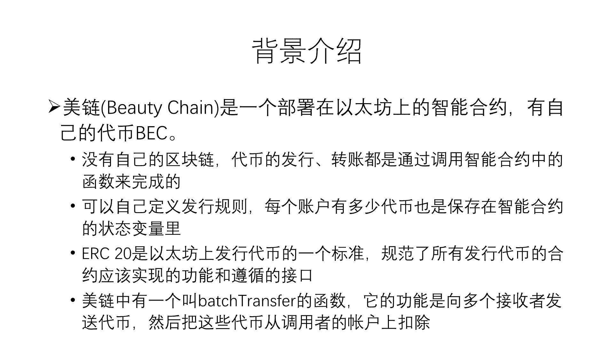
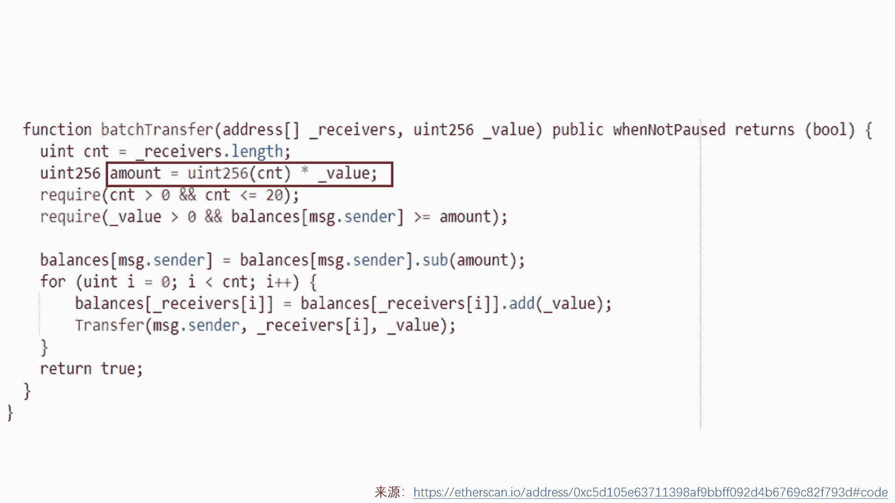
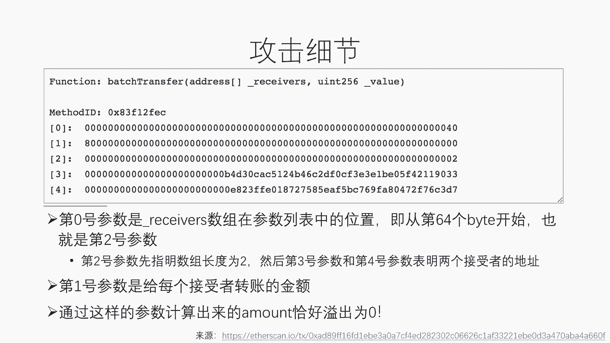
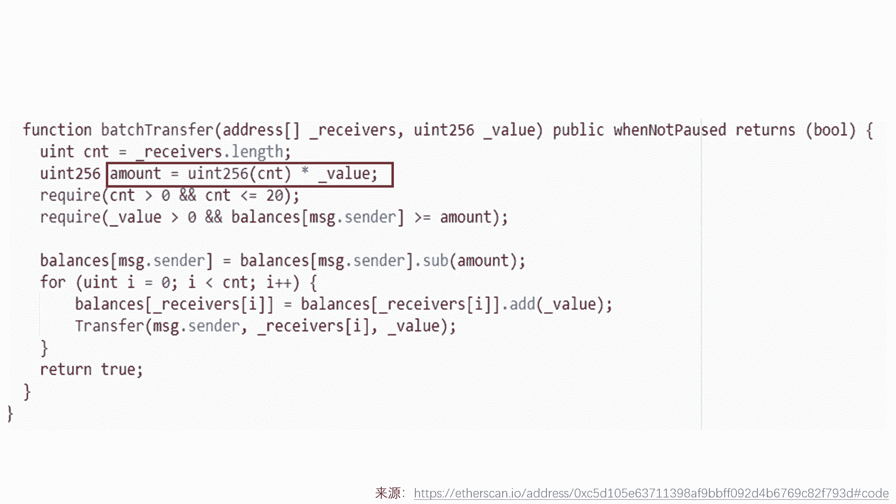

# 北京大学肖臻老师《区块链技术与应用》公开课 - P25：25-ETH-美链 - 北京大学计算机系肖臻 - BV1Vt411X7JF

今天我们讲智能合约中另外一个安全漏洞的例子，我们上节课讲的the道的例子是2年前的，今天这个例子呢是今年4月份刚刚发生的，也就是大概三个多月前吧，出问题的这个智能合约叫做美丽beauty ch。

美丽是一个在以太坊发行以太坊平台上发行的代币呃，以太坊上面有很多发行各种各样的代币的，像去年1年以太坊的价格涨了非常多，其中的一个主要原因就是有很多在这上面做i c o的，大家听说过i c o吗。

没听说过，ipo听说过吗，这个听说过吧，ipo，i co是把这个public offering改成了com，一定是烤羊，而是以智能合约的形式运行在以太坊的eevm平台上。

发行这个代币的智能合约对应的是以太坊状态书中的一个节点，这个节点有他自己的账户余额，就相当于这个智能合约一共有多少个以太币，就这个发行代币的智能合约，它总的资产是有多少个以太币，然后在这个合约里呢。

每个账户上有多少个代币，这个是作为存储数中的呃变量，存储在这个智能合约的账户里的代币的发行转让销毁，都是通过调用智能合约中的函数来实现的，这个也是跟以太坊上的以太币不太一样的地方。

就是它不像以太坊那样需要通过挖矿来维护一个底层的基础链，像以太坊上每个账户有多少个以太币，这个是直接保存在状态树上的变量，然后转账的话，比如说以太坊上两个账户之间转账呃，而代币不是这样的代币。

你要转账的话，实际上就是你这个智能合约的，两个账户之间发生转账，就通过调用这个智能合约的函数就可以完成了，呃每个代币可以制定自己的发行规则，比如说某一个代币可以是一个以太币兑换100个代币。

那么你比如说从某个外部账户，你的外部账户给这个智能合约发进去一个以太币，那么这个智能合约就可以给你在这个合约里的代币账户上呃，发送100个代币，这就是个转换的过程，这个每个代币账户上有多少个代币。

这些信息都是维护在这个存储数里面，这个发行这个代币的智能合约账户里的存储数里面，以太坊这个平台的出现呢，为各种代币的发行提供了很大的方便，大家还记得吗，就我们以前讲权益证明的时候，我们说这个用的是。

d p o s的权益证明机制形成共识，这个呢在上线之前也是作为以太坊上一个代币的形式发行的，就这个本身是要目标是要做成一个基础链，就跟以太坊要竞争的，但是他还没有上线的时候，也是以太坊上的一个代币。

所以呢没有，所以上不上线，就是说像我们说它大概是一个多月前上线了，就是上线之后它有自己的基础量，像转账什么交易都可以用他自己的基础链来完成了，不用再依附在以太坊上，这个e lc 20。

这个是以太坊上发行代币的一个标准，因为有很多智能合约都要发行代币，所以就制定了一个就是这些发行代币的合约要实现哪些功能呃，要遵循什么样的一个接口规范，那么就是e r c20 里规定了。

大家知道点什么意思吧。

这个rc的意思是，ec，request，for comments，美练也是一台坊上的一个代币，它里面定一个batch transer的函数，就是一次性的向很多个接受者发送代币。

然后把发送的这些代币的总量从调用这个函数的账户上扣掉，比如说我要给十个账户发送代币，比如说我自己有好多没练的代币，叫做b e c没练，他每列他自己的代币叫b e c，我要给十个账户发送代币。

我就调用这个batch transfer函数，每个人发送100个代币，那么这个函数呢就先从我的账户上扣掉1000个代币，然后给那十个账户，每个账户增加100个代币，那么这是bh transfer的实现。

大家可以先看一下，这个函数呢有两个参数，第一个参数是一个数组，接收这些代币的接收者的宿主，他们的地址，那么这底下呢实际上要检查一下这个接收者的数目最多是20个，这是它对函数中规定的第二个参数。

这个value是转账的金额，给每个人转多少，那么这个函数呢先算一下一个总的金额，这个amount就这些receiver每人发送这么多代币，一共要这么多个代币，然后检查一下呢。

发起调用的这个账户确实是有这么多代币，然后把这个发起账账户上的这个代币数目减去这个总的amount，下面的用一个循环给每一，个接收者接收value这么多的代币，大家看一下这个有什么问题吗。

这个问题是不是跟上次智能合约的问题一样，你觉得是宠辱攻击的问题，对我觉得他应该扣钱的时候，不应该巴斯光mt哦，他是把所有要发的钱都给扣完了，对他把这个发送的总金额扣掉，然后给每一个receiver。

再加上他自己应该得到的那份代币，有什么问题吗，这个跟上次的例子不是同一个问题，否则我就没必要再讲一个例子，那我说答案了，问题出在哪，出在这个函数上计算这个乘法的时候，如果这个value的值非常大。

就是给每个人发送的代币数目很大的话，这个惩罚有可能溢出，发生溢出之后，这个算出来的among可能是一个很小的值，所以这个地方从调用者的账户上去捡的时候，捡的是很小的一部分代币。

但是底下仍然是按照这个很大的value数目，给每个receiver增加这么多的代币，这样做最后造成的结果是什么，就相当于系统当中凭空多发行了很多的代币，大家听明白了吗。

我们看一下攻击的具体细节，这个地方显示的是攻击时的调用的函数呃，函数的参数，这个函数有两个参数，分别对应着这个地方的前两行，这是第一个参数，这是第二个参数，第一个参数是个地址，他这里是16进制的。

所以这个40实际上是64，是64，他的意思是说第一个参数出现在第64个字节的位置，它这里每一行是32个字节，所以就实际上是从这个地方开始出现的，大家听明白了吗，第二行呢就是这个value的值。

这个值实际上是很，大的数，前面是个八，后面都是零，这是个很大的数，然后第三行呢是这个数组的具体内容，这个第三行是这个数组的长度是二，然后接下来两行呢是两个接收的地址，这就是发生攻击时用的参数。

这个参数的设计有一个什么特点。

这个地方已经是八了，开头再乘以二算出来的amount恰好溢出为零，大家听明白了吗，所以前面那个页p p t这地方算出来恰好是零，然后往下加的时候呢，还是加那个特别大的一串数，还是加的这一串数。

我们看一下攻击的时候区块的情况，这个攻击是在今年4月22号的时候发生的，这个红框里面就是发生攻击时，这两个接收的地址，我们可以看到每个地址上都是接收了很大的一串这个代币，大家看明白了吧，这是攻击的结果。

就攻击发生以后，对这个代币的价格造成了致命性的打击，就从这个地方断崖式的降到这儿都差不多快要归零了，这个代币上市的那个交易所出现这种情况之后，就宣布暂停提币的功能，就是这个代币你提不出去了。

防止这个黑客获利之后逃跑，两天以后呢就决定把这个交易都回滚了，就这个事件的影响远远没有得到的事件影响的大，因为这个代币其实本来就不是很热门，主要就是这个交易所在在进行交易，这就是整个攻击的情况。

这个事情应该给我们什么样的反思，一定要考虑溢出的可能性，solidity其实是有一个专门的库，就这个safe math库，它里面提供的操作运算都会自动检测有没有出现溢出。

比如说这就是safe mars库里对乘法的运算，我们可以看一下他是怎么做的，他首先用a乘以b得到c，然后再用c去除以a看能不能得到b，如果发生溢出的话，这个assert是不会成立的，会抛出异常。

另外我再插一句啊，有些同学觉得这样进行检验会不会出现小的误差，比如说像c里面有两个数相乘，它会有一定精度的损失，再除以一个其中的数，一定能够得到原来的书吗，大家听明白这个问题了吗。

但这个问题在solidity里面是不存在的，为什么，因为这两个实际上都是整数，256位的整数，实际上在整数进行乘法再进行处罚，其实呢我们如果再回去看一下原来的代码，这是原来的代码，你们发现什么特点没有。

它只有这地方上的乘法，没有检测溢出，这个减法和这种加法用的都是safe math里的库，都不是直接减或者直接加，都是掉水库，就这个乘法的地方不小心，结果就酿成了悲剧。

曾经有人怀疑他是不是故意这样写的，不过从事情的结果来看，也不像是故意的，大家有问题吗，没有问题的话。