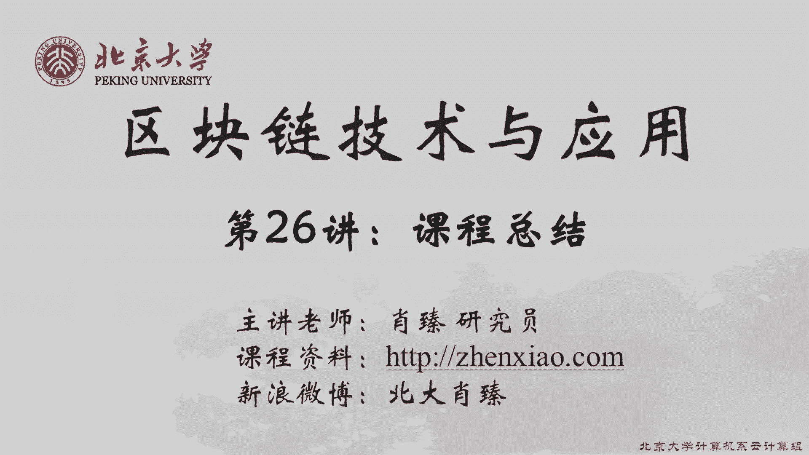
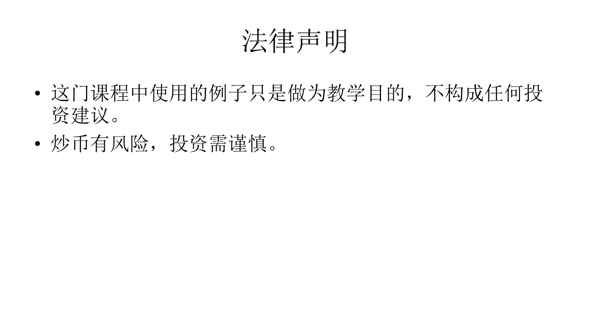

# 北京大学肖臻老师《区块链技术与应用》公开课 - P26：26-总结 - 北京大学计算机系肖臻 - BV1Vt411X7JF

今天是最后一节暑期课，在这么炎热的一个夏天，我们花了很多的时间和精力把这些技术学好，这是很有价值的，就像我在第一节课的时候说的，所以呢你们都是这个领域的先行者，这门课如果你们认真跟下来的话。

那么你们现在的水平已经比社会上绝大多数人都要强了，到目前为止，我们讲的比较多的都是技术相关的东西，今天呢是最后一节课，我们就讲一些应用方，面的东西，但为什么有那么多人会质疑这个技术，不论有什么问题。

这个是不对的，那我举一个例子，原因是现有的这个保险理赔过程非常的慢，可能，需要几个星期甚至更长的时间，比如说比特币等六个确认区块，也就是大概一个小时的时间就可以完成。

这比现在的保险理赔几个星期的速度要好很多了，那大家想想这个应用场景有什么问题吗，保险理赔的速度慢并不是支付技术本身的局限性，只要你决定了理赔的金额需要给多少，对方多少钱，就用普通的银行转账。

很快能够把钱转到对方的账户上，那么他为什么会慢呢，主要是因为理赔的内容需要人工审核，就你说你这个需要理赔，你是汽车保险也好，除了什么剐蹭事故也好，还是说健康保险也好。

这个理赔的内容很多时候是需要人工审核的，这就是为什么它会比较慢，也就是说支付技术本身不是瓶颈，从这个蔬菜是哪块地里生产出来的，采摘之后呢，到最后销售的时候，到哪个市场进行销售的，那么他们的观点是。

所以这是一个很好的应用场景，大家觉得这个应用场景有什么问题吗，这个应用本身没有问题，就能保证你买到的蔬菜真正是有机的，这个是不一定的，如果这块地是吃过化肥的，或者是这个蔬菜本身是撒农药的。

同样的在运输销售过程中，把某些不是有机的蔬菜换当做有机蔬菜拿上去卖，是没有办法篡改的，但是如果你写入的时候本身写的就是假的内容，那么这个是没有办法检测出来了，是跟信任机制相关的。

它的目的是要在互不信任的实体之间建立共识，那么有些人认为呢，这个本身就是一个伪命题，因为互不信任的实体之间是没有办法进行交易的，比如说网上购物，假设有某个电商网站，它是去中心化的，你不信任他。

那你不信任他，你怎么能够在上面买东西呢，比如说你把比特币付给这个电商网站，对，方不给你发货怎么办，或者是发货之后，你发现它的商品有质量问题怎么办，你可以通过各种机构，比如说信用卡有一些保护措施。

有些像papl这样的机构也可以建立线上和线下之间的信任关系，但是在去中心化的世界里，这些都是没有办法做到的，那么这个质疑有没有道理呢，有一定道理，但同时大家要注意。

中心化和去中心化的界限并不是黑白分明的，在一个成功的商业模式里面，既可以有中心化的成分，也可以有去中心化的成分，比特币只不过是一种支付方式，并不是说采用比特币作为支付方式的商业模式。

本身也得是去中心化的，这个大家听明白了吗，比如说像亚马逊在美国很著名的一个网上网站，那么这个网站本身是中心化的一个网站，但是它在将来也许也可以采用比数比特币作为一种支付方式，它可以接受比特币支付。

那么这种情况下就属于中心化的商业模式中，接受了非中心化的支付方式，这是完全正常的，也得是去中心化的，这个其实是两码事儿，是没有办法撤销的，就你已经决定转账转给谁了，你说你后悔了，想把这个转账交易取消掉。

那么共识协议里没有设置这样的机制，有些人认为这是有问题的，比如说前面说的网上购物的例子，你在网上买一个东西，付款之后，对方没有给你发货，或者是发货的质量有问题，如果是想用信用卡这种支付方式的话。

你可以找对方申诉，要求退款，对方可以把钱还给你，但是比特币呢，你这个转账交易写，那么大家想想这种说法有什么问题吗，我们要分清楚一点，就所谓的这种退款，用银行转账，用其他方式的退款。

并不是把原来的付款交易取消掉，而是说在应用层发起一个新的交易，把原来你付出去的钱还给你，比如说你用信用卡在网上买东西，支付完成之后，你发现有什么问题，要求对方退款，对方把钱退到你的信用卡上。

这个时候你信用卡记录上是有两笔交易，一笔是当初你把钱付给对方的交易，另一笔是对方把钱退给你的交易，大家听明白了吗，就实际上是两笔不同的交易，那么用比特币支付其实也可以达到同样的效果，比如说你购物的时候。

你付给对方一个比特币，然后对方退款的时候可以把这个比特币再退给你，跟信用卡实际上是一样的，并没有什么问题，有些支付方式对这个用户，对消费者是有一定的法律保护的，有些人认为这是一个好事情。

因为他觉得去中心化的方式的一个好处，就是可以不受到中心化的这种管理方式，同时也意味着没有司法保护，就出了问题之后，没有人能够保护你，比如说用信用卡支付，美国法律规定，信用卡如果被盗刷的话。

只要你及时报告，那么你最多承受50美元的损失，就比如说你信用卡的号码泄露出去了，别人用你的信用卡买了一大堆东西，只要你在两个月以内向信用卡公司报告，那么你自己承受的损失最多是50美元。

剩下的损失由信用卡公司来承担，如果是储蓄卡的话，那么你最多承受500美元的损失，就比如说你的银行储蓄卡被人给偷了，然后别人呢用你这个储蓄卡在atm机上取了好多钱出来，如果你在两个月以内向银行报告的话。

那么你自己最多承担500美元的损失，剩下的损失由银行来承担，那么如果你用比特币支付的话，那么这些保护的功能就都没有了，这也是有些人反对比特币的一个原因，你用比特币有啥好处，这里我们要注意的一点是。

比如说我们前面说的信用卡被盗刷之后的保护，各个国家的法律规定差别是很大的，我前面说的是美国的法律，有些国家的法律就不提供这样的保护，比如说欧洲，有些国家它就没有规定信用卡被盗刷之后会有什么样的保护措施。

即使是美国各州的法律规定也不是完全一样的，我前面说的是美国的联邦法，那么美国的不同的州，那么还有一些进一步的法律保护措施，像美国加州，一般来说。

是这个consumer protection做得比较好的一个州，在技术层面上的设计其实是没有什么必然联系的，更重要的是，比特币本来就不应该用于跟已有的支付方式进行竞争，就我们前面讲过。

国外有些餐馆接受比特币作为支付方式，有些咖啡店，有些比萨饼店，他接受比特币，我的观点是，这样做没有什么实际意义，因为你就可以付现金，你也可以服用信用卡，这种属于已有的支付方式，已经解决的很好的领域。

没必要再引入加密货币作为一种新的支付方式，既然信用卡有那么好的保护功能，你干嘛不用信用卡呢，那么加密货币应该干嘛用呢，应该用在已有的支付方式解决的不是很好的领域，大家能想想是什么样的场景吗。

有什么样的场景是已有的支付方式解决的，不是很好的，有人说internet就这个互联网是过去一个世纪以来最伟大的发明，那么internet的最大作用是什么，它使得信息传播变得非常的方便。

但是支付方式并没有跟上，就如果你仅仅是想获取信息，比如说你想在网上查一些资料，那么这个是比较容易的，网上有各种文章论坛博客视频资料，这个是比较容易的，但是如果你想要支付的话，难度就会大很多。

就比如说巴西有一个人，他看了我网上的一些资料，觉得我是某个领域的专家，想要聘请我当技术顾问，就比如说他觉得我是分布式系统领域的专家，他有一些问题想请我做技术咨询，这个咨询的过程在网上是可以完成的。

我们网上可以交互email，可以网上聊天，还有一些视频通话软件，这些都是比较方便的，但是到支付的时候，他怎么把钱给我，这个没有什么很方便的途径，如果是走现有的银行体系的话，是比较麻烦的，这周期很长。

我做完报告之后呢，对方给了我一张支票，就港币的支票，我那天正好是比较忙，然后我就飞回北京来了，回到北京之后，要把这个港币的支票存到银行里，实际上是很麻烦的，那个支票本身没多少钱，你要存一张支票。

而且周期很长，像类似这样的例子还有很多，你可能碰到某一个领域的专家，然后呢大家谈得比较好呃，交换一下联系方式，我回到北京之后呢，我还可以跟他联系，但是如果你想请他做一些具体的工作。

那么这个支付就是个问题，比如这个专家可能是以色列领域的某个领域的专家，你要让他做一些具体工作，你怎么把钱给他，这个没有什么很方便的支付方式，比特币被称为what why的currency是有一定道理的。

而且这个货币的支付方式要能够跟信息传播的方式融合在一起，现有的体系当中，支付渠道跟信息传播的渠道，是分开的，有人说下一代互联网是价值交换网络，叫internet of value。

我们现在的互联网可以认为是信息传播网络，现在的问题就在于信息传播很方便，信息的交互也比较方便，但是价值交换是不方便的。

information can follow freely on the internet，but payment can not，那么未来的发展趋势就是支付渠道跟信息传播渠道将会逐渐融合。

使得价值交换也会变得跟信息传播一样的方面，是跟这个支付方式的效率相关的，有些人认为这个加密货币的支付方式是非常低效的，我们前面也看过一些这个能耗的分析，大家还记得吧。

就是我们以前课上对比过一些这个无论是比特币还是以太坊，平均到每个交易上，它的能耗都是很大的，比信用卡的交易要大得多，所以呢有些人觉得你用这种方式有什么好处，又不能做到绿色环保，耗费那么多的电能。

用信用卡实际上就好好很多，这个呢我想从三个方面来讲，第一加密货币本来就不是应该用于跟已有的支付方式做竞争，这个话我刚才已经说过一遍了，就如果你觉得信用卡这个能耗方面，绿色环保方面都很好的话。

那么能用信用卡支付的，你就可以用信用卡支付，没必要用加密货币，第二点呢，共识协议的不断改进，我们知道比特币就是原始版本的比特币，每个区块只能有一兆字节，然后出发时间平均是十分钟。

我们推算过大概它每秒钟支持的交易是七笔交易，现在有些新型的加密货币，号称每秒钟能够支持几百万个交易，就这个效率已经是有了质的飞跃，其实就是以太坊跟比特币相比，以太坊的支付效率也已经比比特币高很多了。

这是，发展的一个大的趋势，第三点也是最重要的一点，我们评价一个支付方式，它的效率的好坏，要在当时特定的历史条件下去看，要跟当时存在的其他支付方式相比较，以前我在美国att实验室工作过。

大家知道a t n t是什么的缩写吗，american telephone and telegram，美国电话电报公司，你们有谁发过电报吗，同学们当中还有发过电报的吗。

你们这一代人已经没有这种生活体验了，我那个时候还是有发电报的，一直到我上大学的时候，那个时候我在北大读本科的时候，开学注册，有的外地的同学来不及赶过来发个电报来请假，说买不到火车票，那个时候还有用电报。

那么现在为什么不用电报呢，因为有了更方便的通讯方式，你可以用手机打电话，你可以发短信，可以发微信，比如说我要到深圳去出差，想约我在深圳的大学同学一起吃个饭，如果用电报商量这个事情该怎么办。

你发电报得到电报局去，在家里没法发电报，到电报局去，你发个电报到深圳，然后说我某天要到深圳去要待多长时间，然后问对方有没有时间一起吃个饭，然后深圳那边的电报局呢收到这个电报之后，要通知我的大学同学。

然后他们呢要跟我商量的话，比如说具体是哪天吃饭，在哪儿吃饭，还要再发个电报给我，他们还要再到电报局去发个电报过来，然后北京的电报局呢在通知我，然后我要回复行还是不行，我还得再去发个电报过去。

你们听这个都觉得好像很可笑，好像是电报是一种非常低效的通讯手段，但其实呢电报在我们国家历史上是试用了很长一段时间的，一直到我上大学的时候，还有人在用，可以见到它的生命周期有多长。

那么为什么这样低效的一种通讯方式能够在中国存活这么长的时间呢，因为在当时没有更高效的通讯方式，你如果不用电报的话，你还能怎么办，要写信的话太慢了，打长途电话的话呢比较贵，电报相对来说还是比较便宜的。

电报收费是按照每个字多少钱收费的，所以你看电报的内容都是非常简短的，而且你打长途电话的前提是对方得有电话，我小的时候普通老百姓家里是没有电话的，你打长途电话得到电话局去打，对方如果没有电话的话。

也得到电话局去打，那样才行，一直到我上大学的时候，当初我上北大的时候，我申请到国外去留学，找老师写推荐信，那个时候有些北大老师的家里还是没有电话的，所以在当时的情况下，电。

报就变成一种相对高效的通讯手段，那么我说这个什么意思呢，我们判断一个通讯手段的效率好坏，要在当时的历史条件下去看，要跟当时存在的其他的通讯手段做对比，那么同样的我们判断一种支付手段效率的高低。

也要在当时的历史条件下去看，也是要跟当时存在的其他支付手段做对比，加密货币在某些应用场景下已经是相对高效的，就比如说我刚才讲的那些应用场景，像巴西有一个人要把咨询费付给我。

或者是我需要聘请以色列的某个专家做一些什么工作，如果你不用加，密货币的话，这个支付的效率是更低的，而且能耗也不一定少，就大家不要觉得光是挖矿是消耗能量，那是看得见的能量，银行体系也要消耗很多能量。

你要安排一个办公室里面有人上班，这都是要消耗能量，所以支付手段的好坏要在特定的历史条件下去评判，将来随着技术的发展，会有更高效的支付手段出现，这是正常的，这是个大趋势，还有一些质疑呢是跟智能合约相关的。

智能合约出现了一系列的安全漏洞之后，有些人就觉得用智能合约有什么好处，还不如用传统的法律合同，法律合同是用自然语言书写的，老百姓还能看得懂，当然里面可能有一些法律术语。

但至少他写这个合同的语言是给普通老百姓看的，智能合约是用编程语言书写的，除了程序员之外，别人都看不懂，反而不利于检查安全漏洞，对于这种观点呢，首先我们要意识到程序化是个大趋势，大家有没有听到一种说法。

software is eating the word，软件将会改变世界，也，有人把它翻译成软件，任何技术，任何领域在转型的早期都会有一些问题，这是正常的，说到智能合约，我在讲智能合约的那节课。

曾经举过一个现实世界中智能合约的例子，大家还记得吗，我举过一个，我打过一个比方，就是物理世界中的智能合约，我用的是atm机的例子，自动取款机可以看作是物理世界里的智能合约，按照事先设定好的规则进行操作。

你把银行卡插进去，输入密码，它会自动的把钱取出来，这就是一个物理世界里的智能合约，那么atm机会不会出问题，当然会出问题，像北大校园里的这个几个atm机，我看见过好几次有人在维修。

那么atm机出现多少年了，出现了几十年，到现在还会发生故障，那么可以想象，在atm机刚刚出现的时候，发生故障的频率肯定是要高很多的，那么我们是不是因为atm机出现过各种各样的故障，就不应该用它了。

不是的，智能合约其实也是一样的，智能合约的历史相对是比较短的，只有23年，所以他在早期的时候出现一些安全漏洞，其实也不是很奇怪，很多软件都出现过各种各样的安全漏洞，随着时间的推移，技术的不断完善。

将来会出现一些智能合约当中常用功能的一些成熟的模板，软件将会改变世界，这是个大趋势，这个大家要意识到这一点，但是另一方面呢，也不要以为智能合约能解决所有的问题，或者说以为去中心化能解决所有的问题。

这就变成了另外一个极端，大家还记得the door的例子吗，我们讲那个投资基金得到这个投资基金，即使不出现黑客倒闭的事件，the dao的商业模式是不是就没有问题，得到这个基金刚刚开始众筹的时候。

曾经引起了很大的一阵兴奋，投哪个项目，不是几个合伙人说了算，而是大家一起投票来决定，大多数人的决策就一定是正确的吗，大家想想这句话是什么意思，同学们都经历过高考，高考是一种很完美的制度吗。

如果发牢骚的话，每个人都可以说出高考的很多弊病，不重视素质教育，选拔出来的学生可能是高分低能的，但是没有高考的话怎么办呢，如果不搞高考，还有什么更好的选拔人才的方法吗，那样的话更糟糕。

所以说高考不是一种最好的制度，而是一种最不坏的制度，跟其他的制度相比，高考是一种相对公平的选拔制度，封建制度相比，它是一种历史的进步，也有它的弊病，这方面的问题，那如果真是这样的话。

那这个世界就太简单了，不论社会上存在什么样的问题，让大家投一次票就都解决了，那就太好了，国外有些地方政府就是郡的政府尝试过这种方法，就是有事情，就是大家都投票，连议会都不用了，就直接老百姓投票。

结果发现什么现象，那这样带来的问题就是没有税收，好回过头来说我们这个the道德基金的例子去中心的话一定是好事情吗，一是第三条，人生，always a good thing，这个其实是不一定的。

我们想想在现实生活当中，这些投资基金，这些风投决定要从某一个项目该怎么进行判断，得考察一下这个项目，跟几个创始人谈话，看看这些人是不是靠谱，如果这个公司已经运行了一段时间。

还要去检查一下这个公司的财务状况，所谓叫尽职调查，然后可能要试用一下这个公司的产品，然后看看这个公司的这个技术路线，然后员工的工作状态，所有这些都不是简单的通过在智能合约中投票就可以完成的。

所以呢不要以为去中心化能解决所有的问题，不要以为去中心化的商业模式就一定是好的，这种跟风的现象在以前也出现过，98年，99年的时候，互联网淘金热就internet bble。

那时候所有跟互联网概念相关的股票都是一飞冲天，所以在互联网淘金热的时候，有些人就是把所有的概念都往互联网上套，就卖那个dog food，结果赔得是一塌糊涂，你们想想为什么，刀哥负的是很沉的。

你在互联网上卖的话，他邮费就得非常贵，所以当时就有人总结说，if the business model is bad is still bad on the internet，就把他捧上天。

中心化的管理方式跟去中心化的管理方式其实是各有利弊的，要具体问题具体分析，像得到这样的投资基金，本来就不应该受到那样的热捧，好同学们有什么问题吗，好到这里，我们这边暑期课就结束了，以后呢。

我们根据同学们的反馈，可能还会推出后续的课程，那么最后我还是强调一点，不是教大家怎么炒币，那么这门课上讲的所有的加密货币的例子，都是作为教学目的，不构成任何投资建议，好吧。

