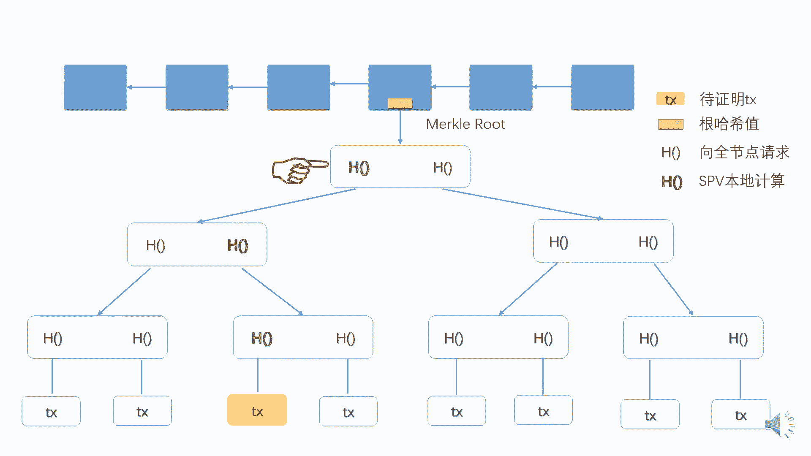

# 北京大学肖臻老师《区块链技术与应用》公开课 - P3：03-BTC-数据结构 - 北京大学计算机系肖臻 - BV1Vt411X7JF

下面我们讲一下比特币中的数据结构，这里要用到的一个重要的概念就是哈希指针，普通的指针存储的是某个结构体在内存中的地址，比如说，这是一个结构体，p是指向它的一个指针。

那么这个p里面存放的就是这个结构体在内存中的起始位置，哈希指针呢除了要存这个地址之外，还要保存这个结构体的哈希值，我们一般是用h表示一个哈希指针，这样做的好处是。

从这个哈希指针我们不光是可以找到这个结构体的位置，同时还能够检测出这个结构体的内容有没有被篡改，因为我们保存了它的哈希值，就是一个一个区块组成的链表，一个区别就是用哈希指针代替了普通的指针。

最前面那个区块是系统中产生的第一个区块，叫做创世纪块，genesis block，最后这个区块是最近产生的区块，所以这里面都是有一个小的hash p，最后这个区块也有一个还是，保存在系统里。

这种数据结构的好处是什么呢，大家注意啊，这个取哈希的时候是把整个区块的内容合在一起取哈希，比如说这个哈希指针怎么算出来的，是把前面整个区块的内容，取个哈希，算出这个值。

我们通过这样的数据结构可以实现temple resistant log，time of evident lo，比如说改了这个地方的某个内容，会有什么结果啊，这个地方内容改了之后呢，这个哈希指针就对不上。

因为它是根据这个整个区块内容算出来的，所以呢这个哈希指针也得改，而这个哈希值一改呢，在下一个区块里的哈希又对不上，所以也得改到最后这个系统中保留的这个哈希也得改，而这个哈希值是我们保存下来的。

所以这个数据结构的好处是，你不论是在哪个部位做了改动，最后都会导致我保存的那个哈希值会发生变化，区别就普通链表的话，你可以改变其中一个元素，对链表中的其他元素是没有影响的。

你改变前面的任何一个区块都会引发多米诺骨牌效应，后面所有的区块都得跟着干，所以我只要保存最后这个哈希值，有这个性质之后呢，比如说它可以只保存最近的几千个取款，以前的就不用存了。

那么如果你用到以前的区块怎么办呢，可以再问系统中的其他节点去要这个区块，有些节点可能是有恶意的，这是一个去中心化的系统，那你怎么知道别人给你的区块是不是正确的，这就用到我们哈希指针的这个性质。

比如说我们这个地方画条线，我只保存了后面这几个区块，前面的没有保存的，用到前面的区块，我问别人要，比如有人给我这样一，个区块，这个区块是不是正确的。

我算一下它的哈希值跟我保存在这里面的哈希值对比一下就知道了，大家听明白了吗，比特币中的另外一个数据结构是mo tr，大家可能没有听说过猫口水，但是应该听说过白鸟热水。

那meral tra和binary tree有什么区别呢，一个区别就是用哈希指针代替了普通的指针，我们可以画一个摩托车的例子，这就是一颗毛口水，最下面的一层是数据块，上面这些内部节点都是哈希指针。

比如说这个数据块它的哈希值存在上面那个节点旁边，这个数据块哈希值也是存在这个节点，这两个哈希值拼在一起，再取一个哈希，存在上层节点，这边这个分支也是一样，算出个哈希值存在这里。

然后这两个再拼在一起取个哈希，最后这个是个根节点，这样一层层推上去，这根节点也可以取个哈希，画到这儿吧，这个叫做根哈希值，root hash，这个数据结构有什么好处呢，只要我记住这个根哈希值。

就能检测出对树中任何部位的修改，大家想想为什么，只要记住最后这个哈希值就能检测出这个链表中任何部位的修改，这个是类似的，效率更高一点，它是一个二叉树的形式，只要记住最上面这个对根节点取哈希的哈希值。

那么整棵树都保护了你哪个地方进行了修改，我都能检测得到，比如说这个区块里做个修改，然后呢这个哈希值就对不上了对吧，所以这个得跟着改，这个改完之后呢，这个哈希值得改，所以会一层层传导到根节点。

最后这个根哈希值也是会发生变化，这是mogo ree的一个特点，比特币当中各个区块之间用哈希指针连接在一起的，像这种摩托锤底下这个每个数据块实际上是一个交易transaction，每个区块分为两部分。

分为块头和块深，我们可以叫做这个黑板太小了，这个擦掉吧，在这个block header里面有这个根哈希值，moto tr的根哈希值是存在这个区块的blog里面，但是block header里没有交易的。

具体内容，只有一个根哈希值，block body里面是有交易的列表的，摸口水有什么用呢，一个用途就是提供moo po，比特币中的节点分为两类，一类是全节点，还有一类是清节点。

全节点呢是保存整个区块的内容，就这个block header，block body，全节点是都有的，它有交易的具体信息，但是清洁点呢，它只保存一个block header，那么这样就带来一个问题。

该怎么证明，比如说你像我买一些东西需要给我转一笔钱，这个支付已经完成了，我是个清洁点，比如我就只能在手机上查一查，这个就要用到这个墨al pro，找到这个交易所在的位置，比如说这就是你转给我钱的交易。

然后从这个交易网上一直到根节点这条路径，这条路径就是我们说的莫科普，我看拿什么颜色比较好，你们喜欢黄色吗，这个交易本身的内容，上一层的这个节点，再往上一层的节点，一直到根节点。

这个路径上这些节点就属于一个mcp，这是vocal rap的示意图，因为黑板上能用的粉笔颜色有限，所以我们做一页ppt来演示这个过程，我们把其中的一个区块的vocal tree展现出来了。

假设某个清洁点，想知道黄色这个交易就是这个图中标成黄色的，这个清洁点没有保存交易列表，没有这个mogo tr的具体内容，只有一个根哈希值，因为更希值是保存在block header里面的。

这个情节点是有的，那怎么办呢，就怎么这个清洁圈怎么才，这个清洁点像某个全节点发出请求请求，收到这个请求之后，只要把图中标为红色的这三个哈希值发给这个清洁点就行了，有了这些哈希值之后。

清节点在本地可以计算出图中标为绿色的这三个哈希值，首先算出这个黄色交易的哈希值，就是这个节点中绿色的这个哈希值，然后跟旁边这个红色的哈希值，就是全节点提供的，右边这个红色的哈希值拼接起来。

可以算出上一层节点里的这个绿色的哈希值，就是这个哈希值，然后再跟左边这个红色的哈希值拼接起来，可以再算出上一层的这个绿色的哈希值，就是这个哈希值，然后呢这个绿色的哈希值再跟旁边那个红色的哈希值拼接起来。

就可以算出整棵树的根哈希值，清洁点，把这个跟哈希值跟block header里的跟哈希值比较一下，就能知道这个黄色的交易是不是在这个mogo处里，大家听明白了吗。

全节点在mobile top里提供的这几个哈希值，就是从这个黄色的交易所在的叶节点的位置到树根的路径上。

用到的这些哈希值，清洁点收到这样一个moral proof之后呢，只要从下往上验证沿途的这些哈希值都是正确的就行了，大家想想为什么，我想知道你给我转钱的交易是不是真的写到了这个区块里，我是个清洁点。

我只有block header，block header里只有这个根哈希值，你传给我这样一个路径，我检查一下这些哈希值算的都是正确的，注意啊，我查的时候只能查这个分支上的哈希值。

旁边这些哈希之我是查不了的，比如说这个哈希值对不对，我没有这个交易的内容，这个交易的内容不在里面，所以这个哈希值的正确性我不知道，这个也是一样的，我能查这个，因为我知道这两个的值这边是查不了的。

因为这整个分支都不在里面，我只要验证我有数据的这个交易所在的分支是符合要求的，然后最后这个根节点取一个哈希，跟我保存的blog hd里的哈希值是一样的就行了，为什么呢，这是刚才我们说的这个性质。

就摩托ree的性质，你这树中任何一个部位做一个修改，都会影响到根哈希值，如果跟哈希值是保持不变的，那说明里面所有这些内容都是没有被改过的，大家有什么疑问吗，只能验证这次的减震交易，但如果验证错误呢。

并不保证生活这一块交易处理的也有人保护他，我是没有完全听明白的，有可能也是别的问题导致我只能如果是正确，不能验证这块交易，但如果验证中出了问题，也不一定保证是人家没有第一进这个交易。

就是有可能是他旁边的那一块交易被修改了呃，应该不会呃，你的意思就是比如说你要向我证明你转给我钱了，然后的话你要提供这个猫al po，因为我是个清洁点，我没有办法直接验证，所以。

我要求你要提供一个模糊铺发给我，然后你发给我这个蒙古普普，如果是不正确的话，我就认为你没有证明转给我钱，但是问题可能也不一定出在你转给你的这个人身上，就是有可能也是其他交易。

你的意思是说这些交易都没有问题，旁边一个交易被篡改了对，然后篡改他如果改这个不改，这个也没问题，他不光要改这个，他还得连这个一起改，才会影响到我这个mc proof，那那这种情况下，你转给我钱的时候。

你干嘛要发这样一个vocp，就说你没有提供足够的证，明来说明你这个交易是被写到这个区块里的，我们再稍微引申一下这个问题啊，因为我们说明了我们验证的时候，只能验证这个交易所在的分支旁边这些哈希值。

还有这个哈希值，我们没有办法验证，这个从表面上看好像给篡改数据提供了一定的自由度，比如说有人伪造这个交易中的内容，你把这个改了之后呢，这个哈希值就不对了对吧，但是旁边这个哈希值是不用验证。

所以你可以取任意的数，就我能不能调整一下旁边这个不用验证的哈希值，使得整个节点的哈希值保持不变，这样反映到上一层的话，这个哈希指针就不用变了，那我就检测不出来了，旁边那个去了就不行。

这个交易本来就不在里面，但是别人检验这个交易，这个交易别人检验这个交易是我在发另外一个mo个图，我把这个再改了，大师难度有点大，你觉得是可以的，是可以操作，这个回答也不能算错，这个在实际中是不可行的。

就是我们上节课讲过这个可莉人resistance的性质，就这个实在是在干嘛，在人为制造哈希碰撞，因为你改了这个交易内容对吧，这个已经改了，你要通过调旁边这个哈希值制造出一个整个节点的哈希值不变的情况。

这是属于人为制造哈希碰撞，即使我给你这个自由度旁边这个可以随便选的话，你也制造不出这样的哈希碰撞的，这是可莉认resisting形式保证了，大家有问题吗，这个颜色能看清吗，黄色上面再写点白的。

好我们刚才讲的是mcal proof，所以呢这种证明也叫做proof和membership，或者叫proof the inclusion，对于新节点来说，你发给我这样一个猫科普，我要验证它复杂度是多少。

时间和空间的复杂度是多少，如果底下这一层，如果一共有n个交易的话，那么moral proof的复杂度是对数级别的对吧，这个是比较高效的，就是现在挣的是proof membership。

能不能证明proof和南南ship，可以吗，有一个最简单的证明方法，然后我清洁点收到之后呢，我验证一下这个树的构造都是对的，这个每一层用到的哈希值都是正确的，说明什么，说明这个数里只有这些业界点。

没有别的，那我找的这个交易呢不在里面，就证明了proof南版本ship，这是一种比较笨的方法，问题在于什么呢，这个复杂度是什么，是线性的，就不是对数级别的，就大家听明白了吗。

那有没有比较高效的方法能证明不存在，我把这个擦了吧，不要欺负这个区块，如果我们不对这个叶节点的排列顺序多任何假设的话，那么是没有的，没有什么更高效的方法，因为你想想啊。

我们要找的那个交易可能出现在这个叶节点中任何位置，对不对，除非你把整个交易都发过去，否则你怎么知道你找的那个交易，它不在里面，对不对，所以没有什么好办法，但是如果我们对这些叶节点的排列顺序做一些要求。

比如说按照这个交易的哈希值排序，就是每个叶节点不是一个交易对吧，对这个交易的内容取一次哈，希按照哈希值从小到大排个序，那么这个时候是有一个好的证明方法的，大家想怎么整，爬行，然后在这里没进去。

就是我要查的那个交易，我先算出一个哈希来，然后看看如果他在里面的话，应该是在哪个位置，比如说是在这两个之间，然后我提供那个瀑布是什么呢，是这两个交易都要往上到根节点，所以除了这边这个之外。

这个也得算进去，这两个都往上到这个，这个为什么是一个证明，我倾斜点收到这样一个证明之后，我验证一下这两个交易网上这个路径都是正确的，最后根节点算出来的哈，希值也是没有被改过的，说明什么。

说明这两个节点在原来的moco tree里面确实是相邻的节点，我要找到那个交易，如果存在的话，应该是差在这两个之间的，但是他没有出现，所以就是不存在，就这个复杂度也是闹鬼的，代价是要排个序。

这种排好序的叫做，所有铁的门口出，比特币当中没有用到这种排好序的logo，是因为比特币当中并不需要做这种，不存在证明没有这种硬性需求，所以比特币中的vocal tri不要求排序。

这就是我们今天要讲的比特币中的两种最基本的结构，一个是moco tr，都是用哈希指针来构造，那么除了这两种结构之外，哈希只能还能用在什么地方吗，其实只要这个数据结构是无环的。

都可以用哈希指针来代替普通的指针，有环的话会有一定的问题，比如说我们这个例子，如果用普通指针的话，这个其实是一个很常见的循环链表，这是完全合法的，但如果这是哈希指针的话，就会有问题，大家想想什么问题。

就变成循环依赖了对吧，这个哈希指针要依赖于这个区块内容，所以我得把这个区块内容定下来，才能定这个区块内容，这个区块的内容呢就依赖于这个区块内容，而这个区块内容又依赖于这个区块内容。

最后你哪个区块都定不下来，会出现循环一般，所以有环的不行，没有环的情况下都可以用哈希指针好。