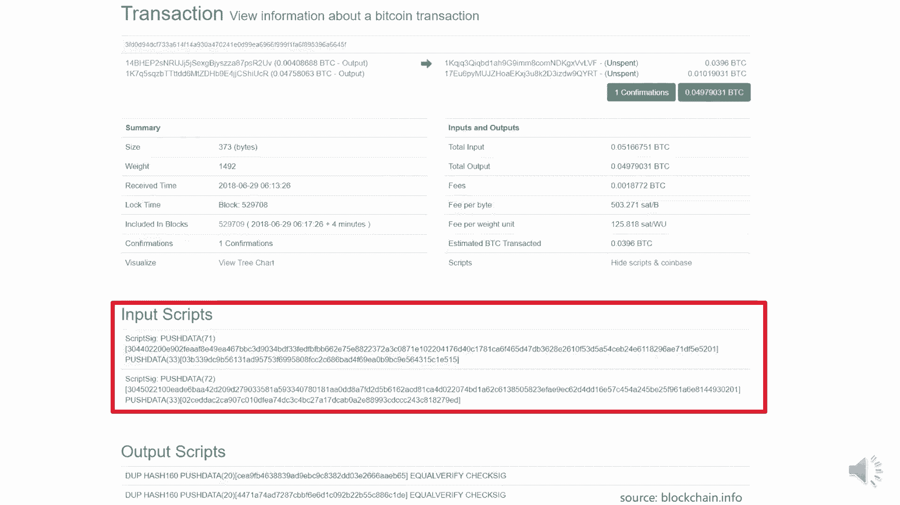
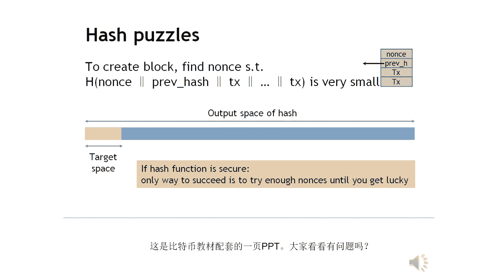

# 北京大学肖臻老师《区块链技术与应用》公开课 - P5：05-BTC-实现 - 北京大学计算机系肖臻 - BV1Vt411X7JF

好上节课我们讲了比特币协议的共识机制，这节课我们讲一下比特币系统的具体实现，那么比特币采用的是基于交易的这种账本模式，transaction base的那种，每个区块里记录的是交易信息，有转账交易。

有铸币交易，但是系统当中呢并没有哪个地方显示的记录，每个账户上有多少钱，比如说你想知道a这个账户上有多少钱，这个需要通过交易记录来推算，转入了多少个b这些币当中呢，有哪些已经被花掉了，有哪些还没有。

所以这样你就可以推算出a这个账户上当前的余额是多少，比特币系统的全节点要维护一个叫做utxo的数据结构，还没有被花出去的交易的输出，有些交易的输出可能已经被花掉了，有些还没有被花掉。

那么所有那些还没有被花掉的交易的输出组成的集合，就是这个u t o，注意啊，一个交易可能有多个输出，比如说a的一个转账交易，可能是给b转了五个比特币，给c呢转了三个比特币，b呢拿到这五个比特币之后呢。

把它花掉了，所以这个输出就不再u t o里面了，c收到这三个比特币呢还没发出去，所以这个输出是在ut so里面的，就同一个交易，可能有的叔叔在里面，有的叔叔不在这个utxo集合当中的。

每个元素要给出产生这个输出的交易的哈希值，以及他在这个交易里是第几个叔叔，就这两个信息就可以定位到在一个u t s o中的输出，那要这个utxo集合干嘛用呢，为了为什么要维护这样一个数据结构。

因为我以后要花钱，要用的话，就需要查这个账户的钱，可能直接可以，对为了检测double spending，就是新发布的一个交易是不是合法，我们要查一下这个ut，你想花掉的b只有在这个集合里面才是合法的。

如果不在这个集合里面，说明这个你要花掉这个b要么是不存在的，要么是以前已经被花过了，所以全节点呢要在内存中维护ut so这样一个数据结构，以便快速检测double s3 顶，每个交易呢会消耗掉一些输出。

同时也会产生新的输出，比如我们这个例子当中，a把这五个比特币转给b之后，我们说d把它花出去了，把这五个比特币给给d了，这个时候呢这个输出就不在ut so里面了，但是它要产生一个新的输出。

这个输出又要保存在ut里面，是随着交易的发布，每个交易要消耗一些u t o中的输出，但是又会产生一些新的输出，如果某个人收到比特币的转账交易之后，这个钱始终都不花，那么这个信息就要永久地保存在ut里面。

可能是这个人不想话，他就是不花的，还有一些人可能是想花没法还，因为他把密钥给丢了，就这些东西就属于要永久的保存在u t o里面，这个u t s的集合也是逐渐增大，但到目前为止呢。

装在一个普通的服务器的内存里，还是完全没有问题的，每个交易呢可以有多个输入，也可以有多个输出，所有输入的金额加起来要等于所有输出的金额，这个叫做，学这个，我们这个例子当中呢是给出了两个输出的例子。

输入也可以是有多个的，而且这多个输入不一定是来自于同一个地址，这也是为什么一个交易可能需要有多个签名，每个输入地址都要提供对应的签名，大家看有问题吗，这中间裤子都破的，裤子不一定。

这个交易费一般是不会算到这个好东西，就等我马上就要讲这个东西，有些交易呢他可能偷偷in pos略微大于total output，比如说total input，可能是，一个比特币土豆oppo的可能是0。

99个b3 b，这个里面的差额呢，这0。01个比特币就作为交易费给获得记账权，发布区块的那个节点，我们上节课说过，为什么节点要消耗计算资源来竞争这个记账权，为了获得出块奖励，你发布一个区块。

可以有一个特殊的coin base traction，获得一定数量的比特币作为报酬，所谓的block reward，但是光有这个出块奖励可能是不够的，这样做对他有什么好处吗，大家觉得有什么好处吗。

比如某个比较自私的节点，别的交易都不管，对他来说没什么好处，而且还有一定的代价，因为你要验证这个交易的合法性，而且你区块里如果是装了交易多了的话，它占用的带宽也比较多，在网络上传播的速度也会慢。

所以如果只是有出块奖励这个机制的话，就可能会出现有些情况，就是这个节点如果比较自私的话，他就不管别人的交易，所以呢比特币系统设计了第二个激励机制，就是这个交易费，这个叫，transaction fi。

这个可以理解成是一种小费，我给你一点小费，目前这个比特币系统当中呢，交易费的金额都很小，像我们这个例子当中呢，0。01个比特币就算是比较大的交易费了，有很多交易费只有零点几个比特币。

也有一些简单的交易是没有交易费的，目前来说呢矿工去挖矿，去争夺这个记账权，主要的目的还是为了得到出块奖励，因为那个有12。5个比特币，但是我们上节课也讲过，这个出块奖励呢是要逐渐减小的。

每隔21万个区块要减半，21万个区块大概是多长时间呢，21万个区块，比特币系统设计的平均出块时间是十分钟，就整个系统平均每隔十分钟会产生一个新的区块，一个小时呢是60分钟，一天有24个小时。

1年有365天，说你这么算一下的话呢，这个差不多是4年的时间，就21万个区块，平均下来大概是4年的时间，每隔4年这个出块奖励会减半，那么很多年以后，这个出块奖励可能变得就很小了。

到那个时候可能这个交易费就变成主要的，大家有问题吗，除了比特币这种transaction base的night之外，与之对应的还有另一种模式是基于账户的模式，像我们后面要讲的以太坊用的就是这种模式。

在这种模式当中呢，系统是要显示的，记录每个账户上有多少个币，这个跟我们平时的日常体验就比较接近了，就像你要知道你银行账户的余额，你去登录银行网站就可以查得到，比特币这种基于交易的模式。

它隐私保护性比较好一点，但是也有一些也有一些代价，比如我们上节课反复强调的，比特币当中的转账交易，要说明b的来源，为什么要说明b的来源，比如说你要转给别人十个比特币，那谁知道你有没有这十个比特币。

他没有这个账户的概念，没有地方记录你一共有多少个比特币，所以每个交易都必须得说清楚，你这个b是从哪来的，是从其之前的哪一个交易的哪个输出中来的，就是他没有这种账户的概念，他要付出这个代价。

以太坊系统当中呢就不存在这个问题，我们后面会讲到，就不需要显示着说明b的来源，我们看一下比特币系统中的一些具体的区块的信息，我们来看一些区块的例子，这个是从blockchain。

info这个网站上截的图，总的输出是这么多个比特币，这是总的交易费，一共是这么多，最下面一行是出块奖励，我们可以比较一下，这两者差了有100倍，就出块奖励还是大头，跟交易费相比。

出块奖励是交易费的差不多100倍，这是矿工挖矿的主要动力，还是为了得到这个block reward，这个height就是区块的序号，time stem是这个区块的时间戳，这个是上个月月底产生的。

difficult是挖矿的难度，每隔2016个区块要调整这个难度，保持出块时间在十分钟左右，nice就是挖矿时尝试的这个随机数，这里的nice值是最后找到的，符合难度要求的，右边显示的是三个哈希值。

第一个是这个区块的块头的哈希值，这是前一个区块的块头的哈希值，注意计算哈希值的时候都是只算block header，大家看看这两个哈希值有什么共同的特点，前面都有一长串的零，对不对。

这个区块的哈希值和上一个区块的哈希值开头都是有一长串的零，这个不是偶然的，我们上节课说过，所谓的挖矿就是不断地调整这个随机数nice，使得整个block header的哈希值小于等于给定的目标阈值。

这个目标阈值表示成16进制，就是前面有一长串的零，所以凡是符合难度要求的区块，它的块头的哈希值算出来都是要有一长串的零，跟哈希值，这是block header的数据结构。

这里面的几个月我们上节课已经解释过了，大家注意nice这个语，它的类型是32位的无符号整数，我们说挖矿的时候要调整这个nice，但是这个nice最多只有二的32次方个可能的取值。

按照比特币现在的挖矿难度，就算把这二的32次方个可能的取值都遍历一遍，很可能仍然是找不到符合难度要求的，大家听明白了吗，因为最近几年比特币的价格涨得太猛了，挖矿的人太多了，竞争非常激烈。

挖矿难度已经被调得非常高了，单纯靠调整block header里这个nice的鱼比较大的概率是找不到符合要求的，搜索空间不够大，那怎么办呢，这个head的数据结构里还有哪些域是可以调整的吗。

这是block header里个个域的描述，第一个这个version是当前使用的比特币协议的版本号，这个是没法改的，第二个域呢是前一个区块的块头的哈希值，这个也没法改，第三个玉是猫狗ree的根哈希值。

这个能改吗，第四个域是这个区块产生的时间，这个其实是有一定的调整的余地的，比特币系统并不要求非常精确的时间，可以对这几个时间呢在一定范围内进行调整，只要别太离谱就行，这个玉也只有四个字节。

第五个玉是挖矿的时候用的目标阈值，这里是这个目标阈值的一个编码后的版本，因为它只有四个字节，是一个编码后的版本，这个只能按照协议中的要求定期进行调整，不能随便改，最后这个域就是我们调整的这个nice。

既然光改难死不够，那还能改什么呢，这里面还有哪个玉可以改吗，改这个跟哈希值，有同学可能觉得奇怪，这个根哈希值怎么能随便改呢，我们前面讲过，每个发布的区块里有一个特殊的铸币交易。

coin base transaction，这是比特币系统中产生新的比特币的唯一方式，这个交易没有输入，因为b是凭空造出来的，它有一个coin base语，可以写入任何的内容。

你在这个域里写什么内容是没有人管的，我们前面讲过的digital commitment，那么可以把commit it的哈希值写在这里，大家还记得吗，我们第一节课的时候讲过。

我们当时举的是一个预测股票市场的例子，那么提前公布预测结果会影响股市，那么事先可以公布一个预测结果的哈希值，这个哈希值就可以写在cohn base这个域里，因为这个玉写什么内容。

反正是没有人没有人去检查的，你也可以写点别的东西，比如人生的感想，挖矿不容易，好不容易挖到了，且挖且珍惜，那么这个玉对我们有什么用呢，如果我们改变这个域的内容，会对块头里的根哈希值有什么影响吗。

上面一排是几个block header组成的链表，我们把最后一个block header里的根哈希值对应的moco ree画出来了，左下角这个交易是cn base transaction。

我们改的这个coin base日之后，这个交易的哈希值就发生了变化，这个变化会沿着moctr的结构往上传递，最后导致block header里的根哈希值发生变化。

所以我们可以把这个域当作extra nice，块头里四个字节的nice不够用，这里还有很多自己可以用，比如把coin base这个域的前八个字节当做extra nice来用。

这样搜索空间一下子就增大了到了二的96次方，所以真正挖矿的时候是有两层循环，外层循环调整这个coin base域的extra nice，算出block header里的根哈希值之后。

我们再看一个普通的转账交易的例子，这个交易有两个输入和两个输出，这两个写的是output，其实对这个交易来说是输入，这里写的output的意思是说他们花掉的是之前哪个交易的output。

这两个输出都还没有被划掉，都是安斯坦会保存在ut里面，输入的总金额是这么多，就是输出的总金额，这两者之间的差值就是这个交易的传达真费，这里可以看到输入和输出都是用脚本的形式来指定的。

比特币系统中验证交易的合法性，就是把input script和output script配对后执行来完成的，注意啊，不是把这两个script配对，这两个脚本是同一个交易中的脚本。

不是把同一个交易里的输入脚本和输出脚本配对，而是把这个交易里的输入脚本跟前面那个提供b的来源的，那个交易里的输出脚本配对，如果输入脚本和输出脚本拼接在一起，能够顺利执行，不出现错误。

那么这个交易就是合法的。

最后这页ppt是咱们这门课用的教科书配套的一页ppt，这是在解释求解puzzle的过程，大家看看有什么问题吗，这页ppt的内容有什么问题吗。

为什么我把它单独拿出来，就是怕你们看这个ppt的时候有些误解，这个哈希里面你看一个txt，所以就把这个交易对，就这个地方的写法是容易引起误解的，是他是不是其实指的是那种那个税，他竟然还是。

但是他这个为什么要给他写个tx，就他容易给人一种误解，就是求哈希的时候是把这些交易的信息也放到你们一起求的哈希，这个是不对的，实际上求哈希的时候只是用到了block header的内容。

而这些交易的具体信息在block header里面是没有的，block header里只有一个没ree的根哈希值那个其实就够了，大家看这个ppt的时候就注意一下，不要产生误解，我建议。

我不是说让你去改这个ppt就没有问题的话，我们就接着讲课了，我把这个收起来了，下面我们对挖矿的过程做一些概率分析，挖矿就是不断地尝试各种n来求解这个puzzle。

每次尝试nice呢可以看作是一个bly trial，a bali trial is a random experiment with binary outcome。

大家能想到的最典型的billy trial的例子是什么，就是支硬币对吧，每次扔一下硬币，两种可能性，正面朝上或者是反面朝上，这两种可能性的概率不一定一样，比如说正面朝上的概率是p。

反面朝上的概率是一减p，对于我们这个挖矿的例子来说呢，这两个概率是非常的不一样，每次尝试一个nice成功的概率是微乎其微的，大概率是不行的，那么如果我们做很多的blue trial，每个实验都是随机的。

那么这些呢blue trial就构成了一个blooding process，a sequence of independent of blue trial，本能力process的一个性质是无记忆性。

所谓的memory property，这个意思是说呢你做大量的实验，前面的实验结果对后面的实验是没有影响的，比如支硬币，以致很多次硬币都是反面朝上的，那是不是说你下次再掷硬币的时候。

正面朝上的概率就会大一些呢，不是的，仍然是原来的概率，正面朝上的概率始终都是p，跟过去的实验结果是没有关系的，那么对于挖矿来说呢，每次尝试nice成功的可能性很小，那么需要尝试大量的nice。

才有可能找到符合要求的，那么这种情况下呢，这个blowing process可以用泊松process乃进四，实验的次数很多，每次实验成功的概率很小，这时候可以用psprocess来进行。

我们关心的是什么，我们关心的是出块时间，系统里产生下一个区块的时间，这个呢在概率上可以推导出来，这个出块时间是服从指数分布，我们可以把它画一下，这个纵轴呢是概率密度，横轴是出块时间。

time to nice block，大家注意啊，即使整个系统的初号事件并不是每个具体矿工的出发时间，整个系统呢平均的出发时间是十分钟，这个平均时间呢是比特币协议设计出来的，通过定期的调整挖矿难度。

使得平均的出发时间维持在十分钟左右，那么具体到每一个矿工呢，它能够挖到下一个区块的时间，取决于这个矿工的算力占系统总算力的百分比，比如说你的算力占到总算力的1%，那么平均下来呢。

系统里每产生100个区块，其中有一个区块是你挖矿挖到的，那么你平均就要等1000分钟才能产生一个区块，这个指数分布，也是无记忆的，也是这个memory list。

大家看这个probability density的这个曲线，这个概率密度曲线有什么特点呢，你从任何一个地方把它截断，剩下这部分曲线的形状跟原来是一样的，仍然是服从指数分布。

这就是他memories的性质，比如说现在已经过去了十分钟了，还没有人找到合法的区块，那么接下来还要再等多久呢，仍然是这个概率密度分布，平均还是要等十分钟，就这个呢可能有点不太符合大家的直觉。

因为感觉上说嘛平均出块时间是十分钟，你现在已经挖了十分钟都还没有挖到，那么感觉上应该快了，应该很快就能挖到下一个区块，不是这样的，就这个概率分析告诉大家，将来还要挖多少时间。

跟过去已经挖多少时间是没有关系的，仍然是服从这个指数分布，平均还是要十分钟，所以这个性质有的时候也管它叫，progress free，就过去的progress是没有用的，是不算数的。

大家有没有觉得这个性质很无情，过去做的工作都白做了，那我们设想一下，如果有某个puzzle，它不满足这个性质，不是progress fate，那么会出现什么情况，比如说过去做的工作越多。

那么接下来尝试nice的时候，成功的概率就越大，就相当于掷硬币的时候，每次结果不是随机的，你过去治了好多次硬币，都是反面朝上，那么你下次再制硬币的时候，正面朝上概率就会增加。

如果有某一个加密货币设计出这样一个pdd，会有什么结果，算力强的矿工会有不成比例的优势，因为算力强的矿工过去做的工作肯定是多的，什么叫不成比例的优势，比如系统中有两个矿工，一个的算力是另一个的十倍。

那么理想状况下，算力强的那个矿工能够挖到矿，找到这个琶洲死猪神的概率也应该是另一个的十倍，这才算是公平，因为这个算力强的矿工能够尝试的nice的数目是另一个的十倍。

这恰恰就是我们说的这个progress free或者叫那个memory性质所保证的，如果不是这样的话，那么算力强的矿工获得记账权的概率就会超过十倍，因为他过去尝试了那么多不成功的nice之后。

吓死nice，成功的概率就会增大，这就叫做不成比例的优势，所以呢大家不要觉得这个progress free的性质很无情，其实它恰恰是挖矿公平性的保证，大家看看有什么问题吗。

那下面我们分析一下比特币的总量，我们前面说过，出块奖励就是那个block reward，是系统中产生新的比特币的唯一途径，而这个出块奖励呢是每隔4年要减半的。

这样呢产生出来的比特币数量就构成了一个几何序列，一开始的时候呢，21万个区块能够生成的比特币是50个，那么接下来的21万个区块，能够生成的比特币就变成了25个，再往下的21万个区块，变成了12。5个。

那么以此类推，我们把这210000x50抽出来，这里面是什么，1+1/2+1/4，这一部分，大家应该都很熟悉吧，这个是最经典的，只有metric theory，对吧，这个等于二。

所以整个等式化解成是210000x100 2100万，这就是系统中所有比特币的总量，一共就这么多，有一些不太了解比特币的人，有一个错误的观点，以为这个挖矿是在解决某个数学难题。

比如说寻找符合某种条件的质数，而比特币呢越来越难被挖到，是因为越到后面符合这种条件的质数就越来越少了，其实不是这样的，比特币求解的这个puzzle除了比拼算力之外，没有其他的实际意义。

比特币越来越难被挖到，是因为这个出块奖励被人为地减少了，他这样不断地减半，比特币的稀缺性是人为造成的，这里大家注意一点啊，虽然我们说挖矿求解的这个puzzle本身是没有什么实际意义的。

但是挖矿的过程对于维护比特币系统的安全性是至关重要的，所以有一种说法嘛，bitcoin，yes，secure by money，对于一个去中心化的，没有membership不控制的系统来说。

挖矿提供了一种凭借算力投票的有效手段，只要大部分算力是掌握在诚实的节点手里，系统的安全性就能够得到保证，所以挖矿这个过程虽然从表面上看没有什么实际意义，好像做的是无用功，还挺浪费电的。

但是这个这个机制的设立，对于维护整个系统的安全性是非常有效的，好我们说出块奖励每隔4年要减半，就会变得越来越小，那么是不是说大家挖矿的动力也会变得越来越小呢，从过去几年的情况来看，恰恰是相反的。

挖矿和竞争是越来越激烈了，因为比特币的价格是飙升的，所以虽然你得到的这个出块奖励的数目是减少了，但是价值反而更高了，当然了，从今年开始，比特币的价格又跌下来了。

从原来最高的2万美元到现在大概是6000多美元，那么出块奖励越来越少，最后趋于零的时候，是不是大家就没有动力挖矿了，也不是的，还有第二种激励机制，就是我们刚才讲过的交易费，大家对于这部分还有问题吗。

那我们对比特币的安全性做一些分析，假设大部分算力是掌握在诚实的矿工手里，我们能得到什么样的安全保证，能吗，就大家注意啊，挖矿给出的只是个概率上的保证，只能说有比较大的概率。

下一个区块是由一个诚实的矿工发布的，但是不能保证记账权不会落到有恶意的节点手里，比如好的矿工占90%的算力，坏的矿工占10%的算力，那么平均下来10%的情况下，这个记账权会落到一个有恶意的节点手里。

这时候会出现什么情况，我们考虑第一个问题，他能不能投币，能不能把别人账上的钱转给他自己，不能因为他没有办法伪造别人的签名，就假设我们有一个节点，m是有恶意的，malicious，他要把a账上的钱转走。

所以他发布一个a转给m的这个交易，但这个交易呢要有a的签名才有效，m虽然获得记账权，但是他不知道a的寺庙，所以伪造不了a的签名，现在呢m这个节点有记账权了，他发布一个区块，就把这个交易硬往里写。

会有什么结果，诚实的节点不会接受这个区块，所以城市的节点呢会继续沿着上一个区块挖，就变成了这个样子，就是我们定义像这种攻击，有恶意的攻击是否成功的，标准是要看它能不能让诚实的节点接受这个交易。

如果仅仅是有恶意的节点之间互相认账，城市的节点都不认账，那是没有用的，这个例子当中呢，城市的节点都会沿着上面这条链吧，因为比特币要求是扩展最长合法链，这个不是合法链，它多长都没有用。

所以这个区块实际上等于是作废了，这对于这个攻击者来说呢，付出的代价是很大的，因为他得不到出块奖励了，等于是没有偷到钱，而且还白白损失了8万美元，所以这个攻击是成功不了的，那第二个问题。

他能不能把已经花出的笔再画一遍，就所谓的double sp，他能做到这一点吗，比如说，m这个节点，那么现在呢他获得了去记账权，他又发布另一个交易，把这个钱再转回给他自己，比如说m把钱再转给他自己。

这个区块如果是直接连在后面，这肯定是不行的，凡是诚实的节点都不会接受这个区块是连在这是不行的，他要想发布这个交易的话，他只能插在这个地方，就是我们前面说的分叉攻击的例子，focking attack。

大家注意啊，这个区块插在哪个位置，是要在刚开始挖矿的时候就要决定的，因为设置的block header里要填上前一个区块的哈，希所以m这个节点想插到这个位置的话，一开始就要把这个区块设置成前一个区块。

而不是说等获得记账权以后再说，那么这种情况下会有什么呢，出了两个等长的合法令，这都是合法的，取决于其他节点沿着哪一个链往下扩展，最后有一个会胜出，另一个就作废了，那么这种攻击的目的是什么。

如果上面那个转账交易m转给a的钱，产生了某种不可逆的外部效果，然后呢下面这个再把这个交易给回滚了，那么m就可以从中不当获利，比如说网上购物，m呢购买一些商品，然后呢这个网站接受比特币支付。

他发起一个交易，说把账转给这个网站，以为支付成功了，所以就把商品给了m m拿到这个商品之后呢，又发起一个交易，把钱转给他自己，然后呢把下面这个扩展成最长合法链，这样上面这个区块就作废了。

所以他这样攻击的目的是既得到商品，又把花出去的钱收回来了，就达到double spending attack的目的，那么怎么防范这种攻击呢，如果这个转账交易不是在最后一个区块，而是后面又跟了几个区块。

你要想回滚这个交易的话，还是得在这个地方插入对吧，还是要插在这儿，然后要想办法让这个成为最长合法链，这个难度是很大的，因为诚实的节点不会沿着这个区块往下扩展，为什么，因为它不是最长合法链。

上面这个链比它长，所以呢这个相当于是这两条链在赛跑，如果大部分算力是掌握在城市节点手里，那么这样攻击成功的可能性很小，有恶意的节点只获得一次记账权是不够的，还需要接下来不断地获得记账权才行。

所以呢一种简单的防范这种工艺的方法，就是多等几个区块，或者呢叫做多等几个确认，就在这个地方，这个交易刚刚写到这个区块里的时候，我们管它叫one conformation，到了这里后面又跟了一个区块。

就叫to conformation，那么以此类推，就这个叫做three confirmation，就是for conformation，比特币协议当中缺省的是要等六个抗，分别是。

到这个时候才认为前面这个交易是不可篡改的，这个需要等多长时间呢，平均出货时间是十分钟，这个要等一个小时，所以这个等待时间还是很长的，大家应该都听过一种说法吧，账本叫做，经过我们刚才的分析，大家应该明白。

这种不可篡改性只是一种概率上的保证，相对来说还是比较容易被改掉的，经过一段等待时间之后，或者说后面跟着好几个确认之后，被篡改的概率就大幅度的下降，是指数级别的下降。

其实呢还有一种叫zero confirmation，零的确认，这个意思是说这个转账交易发不出去了，那这个例子当中呢，这个时间点，就对应着zero conformation。

就这个交易已经在这个交易已经发不出去了，但是下一个区块还没有被挖出来，就那个电商购物的例子当中，你发布一个转账交易，告诉电商，我已经把钱转给你了，这个电商呢它运行一个全节点，他收到这个转账交易之后。

要验证一下这个交易的合法性，有合法的签名，以前没有被划过，这个听起来风险很大是吧，其实呢zero confirmation在实际当中，用的还是比较普遍的，为什么呢，有两个原因。

一个呢比特币协议缺省的设置是节点接收最先听到的那个交易，就两个交易有冲突，你最先收到哪个就接受哪个，所以呢这个zero confirmation这个位置m转给a了，节点收到了，你再发布一个转载。

他自己的有比较大的概率，诚实的节点是不会接受的，第二点呢，是有一定的时间间隔的，他天然有一定的处理时间，比如说你要买个笔记本电脑，你在网上支付成功了，但是这个电商呢可能要第二天才会把这个电脑发货。

所以呢如果发现你这个转账交易最后没有被写到最长合法链上，那么电商就可以选择取消发货就行了，这个相当于是比特币系统以外，还是有一些手段的，好回到我们前面那个问题，假设某个有恶意的节点获得记账权。

他还能干什么坏事，这是可以的对吧，比特币协议并没有规定获得记账权的节点，但是出现这种情况呢，问题也不大，因为这些合法的交易反正可以被写到下一个区块里，就总有诚实的节点愿意发布这些交易的。

也会出现合法的交易，可能就是这段时间交易的数目太多了，比特币协议中规定每个区块的大小是有限制的，最多不能超过一兆字节，所以如果交易的数目太多了，那么有些交易可能就只能等到下一个区块再发布，大家有问题吗。

就当他m转给a的路，刚开始转给a了，他后面对我确实还没有，然后呢就是我又转给我自己，有这个过程，但是呢我提前可不可以，我提前准备很多个区块，我就提前算好，比如说现在是第6000个区块。

我把6001~0时的我提前算好，我就准备我我把我自己给自己转的，就这一一笔交易，我就是放一笔交易，然后我就给我自己转十字，我提前晚上就去管全，暂时先不发布对，然后等到时候m到a这一个区块出现。

我立马开始分差，因为我提前准备好了，所以我的分差肯定比这六个还要关，大家听明白了吗，我重复一下，就这个同学说呀，这个为什么我说成功很难呢，因为这个交易发布出去之后，后面跟了这么多个确认到六个确认。

这时候呢你再在这里分叉，让这条链去赶上这条链是太慢了，所以呢有一种攻击方法呢，是我这个呢先不发布，我偷偷的挖挖出来的还不止挖一个挖挖挖挖，它上面有六个区块，我挖的比他多，我挖出七个区块来，先藏着。

等到六个确认过了，对方把这东西给我了，一下子都发不出去，一长串，把上面那个链给盖掉，是这个意思吧，这个呢这种攻击方法有，一个名字，叫selfie什么，这个本来我打算后面课上讲的，现在既然有人问到。

我们提前讲了，消费是many，就是说正常情况下，我们应该说是挖到一个区块，马上就发不出去，原因是什么，你不发布的话，别人可能就发布了，别人发布之后，你这个区块就作废了，等于得不到出块奖励了。

就跟就跟我们写论文一样对吧，你写论文你有一个好的idea，你肯定是希望抢先发布出去，你不会说写好论文在办公室里藏着，你藏了藏，最后别人先发表你的论文不就作废了吗，所以正常的情况是挖到区块马上发布。

但这个消费是many呢，不是，的消费man是挖到区块先藏了，先不急着发布，那么为什么要这么做呢，刚才那个同学举的例子就是focking attack，分叉攻击的时候，我底下藏着一条链。

然后突然一下子都甩出来，我有四个二炸弹，把上面都给炸了，这是分叉攻击的一种手段，但这样做的话呢，有一个前提，就就在大家想一想，普通的矿工这么做成功的可能性仍然是不大的，就如果我我前面那个例子。

好的节点占90%的算力，有恶意的节点占10%的算力，那你这种藏着消费是慢性的方法，成功的概率并不，大，你刚才想说什么，因为如果他在挖那个，比如说他他知道自己发布了一个m到a的交易。

然后他自己也想发一个m到m的，于是乎他在刚一发的时候，那个m到a的那块还没有挖出来的时候，他就开始自己偷偷的往下面那条链，但是他那个算命按你刚刚说的，如果只有10%的话。

他还是竞争不过上面那一个就是这个前提，因为你这个藏着没有发布，所以这个块呢别的节点是不知道的，其他所有的节点能看到的是上面这条路，它都是沿着上面往下挖，只有你自己，还有这个你的同伙，会挖下面这条链。

所以这样的攻击是有可能的，但是前提是有恶意的节点，得占据很大一部分算力，比如说51%的算力一半以上，这种成功的可能性才会比较大，对不是我的意思，假如说你现在挖到了1000多块嗯。

我直接把那个号号改成2000，我开始算超超前就是我1000多块，我开始算2000块，我的意思我准备把这个挂到第2000号上，因此我现在算未来的2000多，这是不可能的，这是不可能的。

你的意思是说我当前只挖出了1000多块，你不你你不去挖1001个，你直接挖第2000，个块后面要注意的几个，提前准备好，你怎么提前准备，每一个块是要有前面一个区块的哈，希你前面的区块没有挖出来。

你没法提前准备好，所以说你前面后面全都算好了，结果这块卡西对不上对啊，你不可能提前，就是你不知道，你不可能跳着去吧，这是不行的，那么我既然讲到这个地方，要不然咱们就多讲一点吧，消费是man。

还有什么目的，就是刚才那个同学举的是个分叉攻击的目的，就为了底下能够挖出一个长串，然后一下子把它发布出去，把上面都改掉，假设我们不是为了回滚以前的交易，就是为了正常的挖矿，赚取出块奖励。

selfish manu有没有什么好处，有好处吗，写论文不投出去，先藏着有好处吗，其实也有一些好处是什么呢，就是比如说呢这个某一个节点，就当前是这个样子，挖到一个区块，如果他马上发布的话。

大家就都知道了，然后我就沿着这个往下挖就行了，就大家一起原来是竞争这个区块的，下一个区块没有竞争成功被你抢到了，那下面咱们就沿着这个往下竞争嘛，重新开始竞争对吧，如果他不发布呢，他不发布。

别人以为这是最后一个区块对吧，所以大家还是沿着这个再往下挖，是想挖这个区块，如果它的算力比较强，他已经挖到了，再下一个区块，就这个还没有发布，别人还在抢着沿着这条链挖，他往下挖，他已经挖出了第二个区块。

然后听到有人挖到上面这个区块，把这两个马上都发不出去，这样会出现什么情况，上面这个就白挖了，他得到了两个出口奖励，好处在什么地方，减少了竞争，他如果一开始把这个发布出去的话，大家一起抢着挖下一个。

现在呢他先不发布，其他人都在浪费算力挖这个，然后这前提是它的算力还是要足够强，然后别人挖出一个的时候，他已经挖出了两个，然后逃出去，这样这个就白挖了，我觉得他可以继续玩，你说继续挖。

就别人发布一个的时候，他两个也不发布，他继续挖，再挖出三个来，然后等别人挖出两个的时候，他就发不出去，风险很大，这样风险很大，风险在哪里，就是如果你妈很长，然后你发不出结果，你可能就是算不过别人。

别人运气稍微好一点，结果比你超前的，这样等于你什么都没有，就会出现什么情况，就是你挖出一个，你不发布，但是你是以为在挖别人，挖出这个的时候，你能挖到下一个，如果你没有发布，还没挖到下一个。

别人已经挖出这个了，这时候是什么呀，这时候变成等长了练对吧，这时候你要赶快把这个发布出去，跟别人抢一抢，有可能你还能抢得赢，这就是selfish man的一个风险，大家听明白了吗，十个都没有。

回报也不是很高，他能够在一定程度上对自己有好处，就是让别人做些无用的功，他少一些竞争，好那我们今天基本上把比特币系统的具体实现就讲完了，这节课的内容也是比较多，大家回去好好消化吸收一下。

接下来呢比特币系统中还有一些呃各个方方面面，我们下面会分成几个小专题。