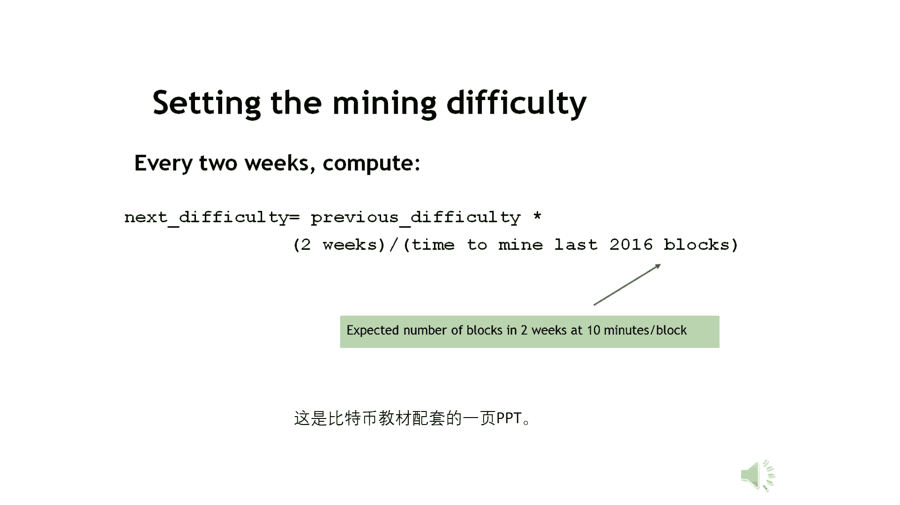

# 北京大学肖臻老师《区块链技术与应用》公开课 - P7：07-BTC-挖矿难度 - 北京大学计算机系肖臻 - BV1Vt411X7JF

今天我们讲一下比特币系统中怎么调整挖矿难度，挖矿就是不断地尝试block header里的男子值，使整个block head的哈希值小于等于给定的目标阈值，这个target的就是目标预制这个tb的越小。

挖矿难度是越大，调整挖矿难度就是调整目标空间在整个输出空间中所占的比例，比特币用的哈希算法是s h a256 ，这个产生的哈希值是256位，所以整个输出空间是，二的256次方个可能的取值。

调整这个比例呢，目标空间占输出空间的比例呢，有的时候通俗地说就是这个哈希值前面要多少个零，就比如说256位的哈希值要是合法的区块要求算出来的哈，希前面至少有70个零，当然这个呢是一种通俗的说法。

不是特别的准确，因为这个目标阈值并不是说前面都是零，从某一个位置开始，后面就都变成一了，它不是这样的，所以呢就是严格的话还是按照这个定义去去看这个问题，那么，我们听到的另外一种概念就是挖矿难度。

这个挖矿难度呢跟这个目标阈值是成反比的，这个difficult一差别是指挖矿难度等于一的时候所对应的目标阈值，挖矿难度是最小，就是一，它最小就是一，这个时候对应的目标阈值是个非常大的数。

就我们这个不等式，它比的是越大的时候挖矿是越容易的，因为你这个目标空间占的比例非常大，所以难度为一的时候，它对应的这个目标阈值是很大的一个数，因为这个很大的数除以当前的目标阈值，得到的就是当前的挖矿难。

就这俩是成反比，那我们为什么要调整挖矿难度呢，如果不调的话，会有什么问题，系统里的总算力越来越强，挖矿难度保持不变的话，那么这个初画时间是越来越短的，一开始的时候呢，没有多少人参与这个比特币游戏的时候。

可能你按照设计时十分钟出一个区块，后来的参与的人多了，变成一分钟就能出一个区块，那再到后来呢，挖矿的人越来越多，用的设备越来越先进，可能只要十秒钟就出一个区块，甚至到最后不到一秒就出一个区块就出发。

时间会直接越短，当然有人可能觉得这是好事啊，你出版时间越来越短，说明我要是发布一个交易的话，很快就能被写到区，块链，你这个提高了系统的响应时间，增加了系统的修复，那这不是好事吗，这个如果要是好事的话。

那实际上我们没必要把这个出块时间设成十分钟，初二时间太短，会有什么问题吗，这个区块呢在网络上传播的时间可能需要几十秒的，底层的比特币网络可能要几十秒的时间才能让其他节点都收到。

那么别的节点在没有收到这个区块之前呢，那么如果有两个节点差不多同时都受到这个区块，而且差不多同时都发布了一个区块，那么这个时候会出现分叉，比如说这个时候，两个节点同时挖到矿，这两个区块同时被发布出来。

就出现了一个二分产，那么出货时间如果是越来越短的话，这种分叉会成为常态，而且就不仅仅是二分叉，可能出现很多的分叉，比如说如果有十个区块差不多同时都被挖出来了，那么这个系统中会出现一个十分差。

这个地方我还画不下十分看我们画个大概的，分差如果过多的话，对于系统达成共识是没有好处的，而且也危害到系统的安全区，比特币协议是假设大部分算力掌握在诚实的矿工手里，系统当中的总算力越强，安全性就越好。

因为你要发动51%攻击，所需要的算力就越大，这个叫做，hd版的三和塔，这意思就是说呀有恶劣的节点，掌握了系统当中51%以上的算力，这时候他就可以干各种各样的坏事，比如说在，a转给b一大笔比特币。

赚了很多钱，我们这个画的比较短，假设在后面跟着六个确认区块，就跟经过六个确认之后呢，b认为这个转账交易已经成功了，这个时候呢a从这个地方开始分叉，要回滚这个交易，把钱转给他自己，正常情况下。

这个攻击的难度是比较大的，如果大部分算力是掌握在诚实的矿工手里，你想让这个链比上面这个链还要长，这个难度是比较大，但是如果出现了很多个分叉，那么这个时候呢系统里的总算力就被分散了，就比如说这个例子当中。

我们假设出现十的分差，那么节点根据在网络中位置的不同，可能会选择沿着其中的某个分叉继续往下扩展，而这个有恶意的节点可以集中算力，就扩展它这个分差，这样很快就可以使这个分差变成最长合法律。

因为好人的算力被分散在这个时候，可能你就不需要51%的算力才能发动攻击的，可能10%几的算力就够了，所以呢这个出块时间不是越短越好，当然了，出发时间不是越短越好。

那么是不是说对比特币协议中设计的这个十分钟的触发间隔，就是最优的吗，这个不一定，比如说你把它改成八分钟行不行，改成五分钟行不行，应该也都是可以的，这个只是说呢出发时间要有一个常数的波动范围。

不能无限地减少下去，有些人觉得比特币当中的十分钟的触发间隔有点太长了，这对于一个支付系统来说，你做一个支付，你要等那么长时间才能得到确认，这个时间要开膛，我们后面会讲到以太坊。

以太坊里的出货时间就降低到了15秒，所，以太坊的出块速度是比特币的40倍，这个出块时间大幅度下降之后，以太坊就要设计一个新的公司协议，叫ghost，在这个协议当中呢，这些分叉产生的这个叫所谓叫窝粉不到。

我们以前讲过，这些orphan blog就不能够简单地丢弃掉，而是你要给他一些奖励，这个叫做uncle reward，关于这个以太坊的具体运行情况，我们后面的课会讲，这里我的强调一点。

以太坊中同样需要调整挖矿难度，使得出块时间保持稳定，它降到15秒以后，这个15秒也要设法保持稳定，所以呢平均出发时间到底设计成多长，这个没有一定之规，但是不论设计成多长，都需要保持稳定。

而不能无限地减少下去，大家有问题吗，好我们讲了怎么去，就是为什么我们要调整挖矿难度，下面我们讲一下具体怎么调整挖矿难度，比特币协议中规定的是每俄2016个区块，要重新调一下这个目标阈值。

这个大概是多长时间呢，大概是每两个星期调整一下，2016个区块，每个区块是十分钟，一个小时是60分钟，一天是24小时，所以这个大概是14天，14天要调整，那具体是怎么调整呢，看到这个公式。

这是tb的这个目标阈值迭代更新的方法，这里的expect time就是2016x10分钟，就是两个星期，这如果是理想状况下，每十分钟产生一个区块，那么产生2016个区块就要这么多的时间。

就是他预期的时间，这个after time呢是系统中产生最近的2016个区块，实际花费的时间，就这个是，十几万创世界，这公式是什么意思呢，就如果这个实际时间超过了两个星期。

说明平均下来呢出块的间隔超过了十分钟，那么这个时候这个挖矿难度是应该调得低一点对吧，应该让出口更容易，那么这个时候我们看这个公式，它是比两个星期大，所以这部分呢是大于一的，所以乘完之后呢。

这个target会变大有些成反比，以它这个变大之后，挖矿难度就降下来，如果这个实际时间是小于两个星期的，说明这个初号速度有点太快了，那么这时候应该提高挖矿的难度，可这个比两个星期小。

这个就是个小于一的数对吧，所以算出来的tp呢会变小，相当于挖矿难度提高了，实际代码当中呢上调和下调都是有四倍的线，就比如说这个实际时间非常长，超过了八个星期，就正常应该是两个星期，它超过了八个星期。

那么我们算的时候也只按照八个星期来算，就这个地方啊，这个目标阈值增大最多也是增大四倍，不会超过，不会一次性超过四倍，这个主要是为了避免系统中出现什么意外情况，导致这个目标阈值有特别大的活动。

相反的呢如果这个实际时间非常短，不到半个星期，不到半个星期就把这个2100 16个区块都出来了，这个时候我们也按照半个星期来算，就这个地方呢最小它也是1/4，相当于这个目标阈值，最小是就减小的时候。

最多是减小四倍，也不会一次性减小的特别多，这就是调整目标阈值的方法，那怎么才能让所有的矿工同时调整目标阈值呢，因为这个去中心化的系统，你怎么能让大家都那么听话，到处都听这个计算。

他给的方法是写在比特币系统的代码里，每挖到这2016个取款，它会自动进行调整，因为这个代码里就这么写了，到这个时候就得调整，当然了，这个代码呢是开源的，所以呢如果有某个有恶意的节点。

到这个时候他就故意不调会怎么办，大家听明白的问题了，他故意不跳，就是他的难度可能比别人要小一点，所以他自己的那个出门的速度会比高的快一点，但是如果发现就是他这个阈值刚好又符合这个新的难度的话。

它这块刚好有也是性发生，但是如果他这个阈值刚好就比这个他这个性格要大的话，他可能就不行，这个说的基本上对，就说白了是什么，你如果不调的话，那么你发布的区块城市的旷工不会认他。

大家还记得我们讲blog开的结构，我们将有一个这个语，你还记得吗，nb是什么，这个是我们这个copy的一个编码的版本，就在block header里没有直接存储这个target的。

因为这个域呢是256位，你直接存这个的话要32个字节，这个nb是在hd里只有四个数据，所以可以认为是他的一个压缩编码，那么如果遇到有恶意的矿工，该调的时候，它就不调。

那么这个时候检查的这个区块合法性就通不过，如果你投机取巧，设一个过大的目标阈值，使得，你自己挖矿动力了，但是别人算出来已经设的不对，这个区块是不会被接受的，大家觉得这个比特币调整难度的方法复杂吗。

其实是比较简单的对吧，我们后面讲到以太坊的时候，会会看到以太坊也是要定期调整挖矿难度，但它这个定期不是说隔多少个区块，而是每个新出的区块都有可能进行调整，而且调整的方法也比这里讲的要复杂得多，有问题吗。

老师问一下，这个刚才不一定这个调整是吧，前两周的这个时间，突然说这个时间调整得有四倍，你看这各种是是经验谕旨，还是说这个谕旨是他事先经过论文发表推断出来的，还是经验举重，也不叫拍脑来想，就是他根据。

他的就过去有很多就是有些人觉得没有买比特币特别可惜，因为比特币当初那么便宜的时候，怎么没有买，现在回过头去，你可以说比特币是一个多么伟大的发明啊，其实呢如果你了解历史的话。

在比特币之前有很多加密货币都是失败的，就是比特币出现之前大概有20年的研究，研究各种各样的加密货币，最后都不行了，比特币成功其实呢并不是因为它更实用，从某种意义上说是因为他更不实用。

就以前失败的那些家庭货币都是怎么设计的，是设计成它是现，实货币的一个电子支付，就是电子支付渠道，网上支付的方法，就你得有一些真的货币，线上不方便，那么它有一个线上的版本，比特币是没有任何真正法币背书的。

他没有底下的保证金，完全是凭空造的这种货币，里面有很多参数，出货时间设成十分钟是不是最好的，这个有争议，每个块最多一兆字节是不是合适，还有刚才你说的为什么是2016个区块调一次要以太法律。

就是每个区块都可以调，对不对，就这些参数，是个经验参数吗，还是怎么来，你是问这个数，我觉得可能是他看过一些调研，也经过思考选的这些参数，总的来说还是make sense还是比较有比较合理的。

但是不是最优的，这有争议，就比特币系统的设计总的来说是比较保守的，你从出块时间啊，从区块大小，从它支持的脚本语言来说都是很高手的，就比特币社区的一些哈德霍的支持者也是比较保守的。

他可能是因为自己已经有了很多比特币，他不愿意危及他，他自己，的财富，所以要改什么东西都是很难的，就是为什么后面有以太坊，还有各种各样新的最终价值货币，就是这个原因造成。

我不知道这个参数是不是经过很严格的论证，也可能就是他自己怎么想一想还算比较合理，有别的问题吗，没有问题的话，我们看一下比特币系统中的一些实际情况，这张图显示了比特币系统中总算力的变化情况。

在比特币没有流行起来之前，有很长一段时间算力没有太明显的增长，前面这些年的hash rate看上去几乎是零贴着x轴，其实这些年算力也是在增长的，只不过是后面这几年算力增长得太快了。

所以前面这部分看上去像是一条直线，去年是加密货币涨得非常猛的1年，这也体现在了hash rate的增长上，这一部分曲线是从去年年初到现在，我们可以看到算力呈现出指数级的增长，注意即使是在这段黄金时期。

算力也不是单调递增的，中间也是有很多波动，但总的来说是增长得非常快的，这是挖矿难度的变化情况，跟算力的增长基本上是同步的，这也符合难度调整的设计目标，通过调整挖矿难度，使得出块时间保持稳定。

注意这个图显示的是挖矿难度，不是目标阈值，这是最近半年的难度调整曲线，可以看出很明显的是一段一段的，每隔两个星期难度上一个台阶，说明挖矿的人越来越多，用的设备越来越先进。

反映出大家对比特币的热情越来越高，如果出现相反的情况，比如某个加密货币的挖矿难度越调越小，说明什么，挖矿变得越来越容易了，但这不是好事儿，说明大家对这个b的热情是逐渐减少的，如果持续出现这种情况。

一般来说这个b就慢慢不行了，这个图显示的是每天的出块时间，从2010年到现在，我们可以看到，总的来说出块时间稳定在十分钟上下，震动说明难度调整达到了预期目的，这是最近半年的出货时间，也是按天做了。

平均也是维持在十分钟左右，最后这页ppt是咱们这门课用的教科书配套的一页ppt，上面给出了调整挖矿难度的公式，大家看看他这个公式跟我们课上给出的公式有什么区别。

就这个地方正好是反过来的对吧，他那个是despactime，在分子分母是实际实际这两个公式都是对的，在这里算的是挖矿难度，我们这里算的是什么，等于是目标阈值，就这个是一个容易引起混淆的地方。

大家看到这种公式的时候注意一下，因为这两个是成反比的，看清楚它到底算的是挖矿的难度还是目标一致，实际比特币代码里用的是目标语数，好吧。

