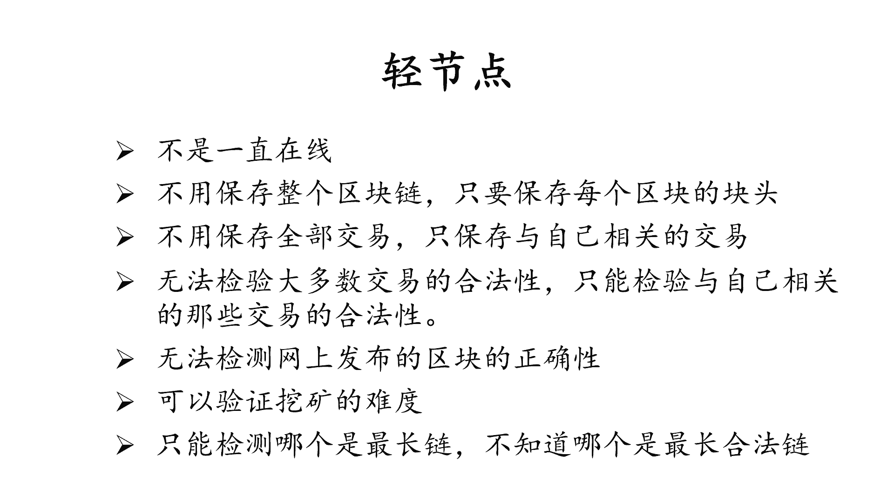
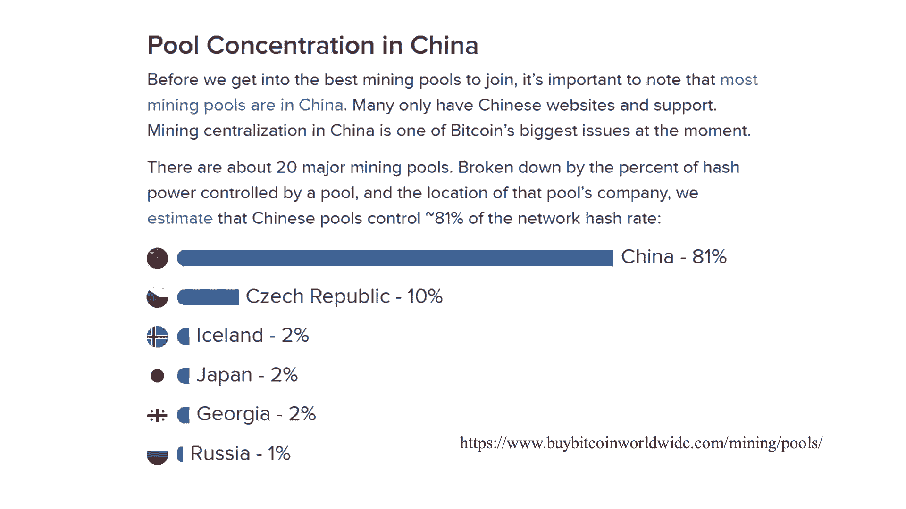
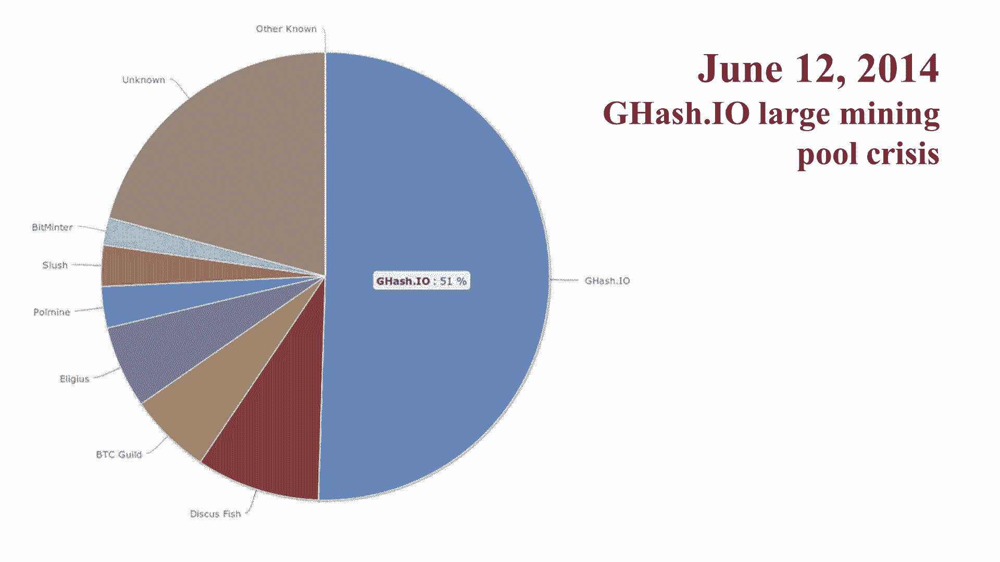
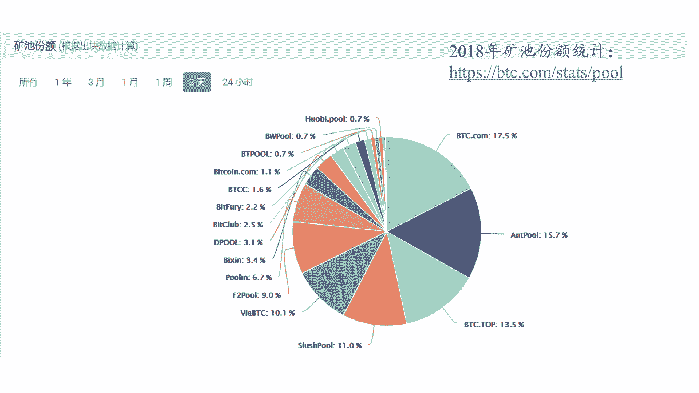

# 北京大学肖臻老师《区块链技术与应用》公开课 - P8：08-BTC-挖矿 - 北京大学计算机系肖臻 - BV1Vt411X7JF

前面几节课我们已经把比特币工作的基本原理都讲完了，那么这节课呢我们先把相关的内容总结一下，然后讲一下比特币挖矿中出现的一些趋势，我们前面说过，比特币中有两种节点，一种是全节点，一种是清节点。

全节点一般是一直在线的，在内存当中要维护ut xo集合，就是这个as pd transaction output集合，以便快速检验交易的正确性，监听比特币网络上的交易信息，然后验证每个交易的合法性。

有没有合法的签名，是不是double finding，那么缺省状况下，只要是合法的交易，并且交易费符合要求，同时要监听别的矿工挖出来的区块，验证其合法性，那么这个验证呢从三个方面验证。

首先看一下这个区块中的每个交易都要合，比如说有没有篡改block reward，就出块奖励，现在是12。5个比特币，这个有没有篡改发布的这个区块是不是符合难度要求的，那么通俗的说呢。

就是你检查一下这个block header取哈希值之后，前面有没有足够多的零，同时也要检查一下不到g head里面难度目标阈值设置是不是正确的。

然后这个全节点呢每两周还要按照比特币协议的要求调整挖矿难度，那么第三点是检查一下这个区块是在延伸最长合法链，然后是挖矿，前面这几个步骤都是在为挖矿做准备，这一步才是真正能够带来收益的这个挖矿。

那么这个呢分为两部分，第一个呢要决定沿着哪条链挖下去，缺省情况下应该是沿着最长合法链挖下去，当出现等长的分叉的时候，选择哪一个分叉，缺省情况下是选择最先听到的那个分差，这是全节点的职责，那么清洁点呢。

这个清洁点有时候也把它叫做sp v client，simplified payment verification，清洁点一般来说呢不是一直在线，就全节点一般是呃一直都连到比特币网络当中的，但清洁点不是。

只要保存某每个区块的high的就可以了，这个的大小差了有差不多有1000倍，就是你存整个区块跟你只存这个block header能够差有1000倍的大小，清洁点不用保存全部的交易。

只要保存与自己相关的那些交易就行了，那么他也没有办法验证大多数交易的合法性，因为它没有保存完整的交易信息，所以就没有办法检测double spending，它只能检测与自己相关的，那些交易的合法性。

接下来这个也是跟它相关的，就是无法检测网上发布的区块的正确性，但是它可以验证挖矿的难度，就是你发布的这个区块是不是符合难度要求，这个清洁点是可以验证的，因为挖矿的时候呢，计算哈希值只用到了块头的信息。

而块头的信息清洁点是保留不的，所以清洁点虽然没有办法检查网上发布的这个区块，但是可以检查发布的这个区块是符合难度要求的，那么清洁点假设发布这个区块的全节点，是不会把非法的交易发布出来的。

因为发布这样的交易，它是对他没有好处，那另外注意一点，就是我们经常说的最长合法链，清洁点只能检测哪个是最常练，不知道哪个是最常合法链，清洁点假设矿工是有理智的，不会沿着不合法的电挖下去。

因为挖出一个区块的代价是很大的，这所谓的工作量证明要做很多的工作才能把一个区块挖出来，那就白挖了，所以清洁点假设这个全，节点矿工不会干这种事情。

好大家有什么问题吗，比特币网络中大部分节点都是清洁点，就如果你只是想进行转账，不需要挖矿的话，那么没必要运行一个全节点，就用一个清洁点就可以了，在挖矿过程中，如果你监听到别人发布了一个区块。

这个区块是合法的，也是在延伸最长合法链，这时候你应该怎么办，你应该停止已有的挖矿，然后重新进行挖矿，为什么要这样做，因为你要沿着这个新发布的区块往下挖的话。

另外这个block header的内容也会变化，像不到header里有这个交易所组成的moco ree的跟哈希值，还有这个指向前一个区块的指针，这些也都会发生变化，所以要停止已有的挖矿，然后从头开始挖。

那这样做是不是有些可惜，就我费了半天劲，已经挖了很长时间了，现在呢别人发布一个新的区块，我前面都白挖了，我得重新组装一个区块，然后再继续挖，这个是不是比较可惜，其实不可惜的，因为什么。

因为我们前面讲过挖矿的一个性质是什么，是无记忆性，叫memories，也可以管它叫progress free，所以呢无论你是继续和原来的区块，还是说停下来改成挖一个新组装出来的区块，成功的概率是一样的。

只要你当前还没有挖到符合要求的这个nice值，你前面已经挖了多长时间，其实是没有关系的，对最后的结果没有影响，所以这个是并不可惜的，即使挖到了合法的区块，你把它发布出去，也不是说就胜利了。

有可能你发布的这个区块最终没有成为最长合法链，可能存在一些race condition，别人发布了一个同时发布一个合法的区块，使得你，这个区块中某些交易最后变成是有冲突的，大家对这个过程有什么问题吗。

我们讲的是全节点，还有清洁点的职责，以及挖矿中的一些注意事项，那我来问个问题，比特币是怎么保证安全性的，比特币当中的安全性是从两方面来保证的，一方面是密码学上的保证，另一方面是共识机制。

密码学生的保证是别人没有你的私钥，就没有办法伪造你的签名，所以也就不能够把你账上的钱转走，大家注意一点，这个的前提是系统中拥有大多数算力的矿工是好的，是遵守协议的，不会接受那些没有合法签名的交易。

如果没有这一点的话，那么密码学上的保证也就没有用武之地，就打一个比方，就好比你去银行里取钱，那么按照规定你取钱的话得出示合法的证据，然后银行的工作人员才，能够把钱给你。

那么这个合法的证件就相当于密码学上的签名，密码学的性质保证了别人没有办法伪造你的签名，也就没有办法伪造你的身份，说前面我们为什么讲这个密码学原理的时候，讲，产生私钥的时候。

以及签名的时候都要有好的随机源，产生了水金素要足够随机，就是为了这种密码学上的性质，但是光有这一条也是不够的，银行的这个工作人员还要遵守规定，不会把钱交给那些没有合法证件的人，只有这两条合在一起。

才能够保证别人没有办法把你账上的钱取走，大家看看，有什么问题吗，没有问题，我们接下来讲一些跟挖矿相关的，我们首先讲一下挖矿的设备，挖矿设备的演化趋势是越来越趋于专业化，最早的时候呢。

大家就是用普通的cpu去挖矿，像家里的计算机，笔记本电脑都可以用来挖矿，但是你要是仔细想想的话，如果你买一台计算机专门是用来挖矿的话，其实是非常不划算的，这个计算机当中的大部分内存都是闲置的。

挖矿只用到其中很少一部分内存，cpu当中的大部分部件也是闲置的，因为挖矿当中计算哈希值的操作只用到了通用cpu中的很少一部分指令，硬盘和其他很多资源也都是闲置的，所以呢随着比特币这个挖矿难度的提高。

用cpu挖矿，用通用计算机挖矿，很快就变得是无利可图了，因为性价比太低，所以呢这个挖矿设备就转入第二代设备是gpu，就第一代我们说是cpu，第二代就是gpu。

gpu挖矿呢比cpu挖矿的效率已经提高了很多了，大家知道gpu吧，就主要是用于大规模的并行计算，它有大量的矩阵乘法，但是gpu用来挖矿其实还是有点浪费了，你想想为什么gpu是为了通用并行计算而设计的。

用来挖矿的话，它里面有很多部件仍然是处于闲置状态，比如说用于浮点数运算的那些部件，但是比特币的挖矿只用到了整数操作，所以gpu挖矿比cpu效率有很大提高，但仍然是有不少的浪费，那么这里我们顺便说一下啊。

最近几年gpu的价格涨得很快，其实有很多gpu是，用来挖矿，不过有一个好消息就是现在这个比特币挖矿难度的提升，用gpu挖矿已经是划不来了，他已经超过了gpu的算力范围。

所以的话就没有那么多的人去因为挖矿而竞争，去买这个gpu，给打游戏之类的应用来服务，有一些新开发的这些加密货币，有的还用gpu挖矿，那么现在一般用什么挖矿呢，用asic芯片。

大家知道这个ac是什么意思吧，这是专门为了挖矿而设计的芯片，它上面没有多余的电路逻辑，整个芯片就是为了这个比特币挖矿计算哈希值的操作而设计的，所以它的性价比是最高的，这个芯片也干不了别的。

就除了挖矿之外，别的什么事都干不了，而且呢为某一种这个加密货币设计的asic芯片，只能挖这种加密货币，你挖别的就不行了，除非这两个加密货币用同一同一个慢镜puz。

这个挖矿的时候求解的puzzle叫manding pud，那么有些加密货币在新发行的时候，为了解决能启动问题，比如说跟比特币一样的慢镜pao，这样可以吸引更多的人来挖矿，这种情况叫做磨制的many。

就除了这种情况之外，其他的都是属于一个芯片，只能为一个加密货币去挖矿，a c芯片的研发周期是很长的，一款芯片，从设计流片到最后生产出来需要很长的周期，像比特币的这个ac的芯片可能需要1年的时间。

而这个已经算是非常快的，就是跟通用的芯片相比，这样的研发速度基本上可以说是创造了芯片史上的奇迹，那么在这么长的周期里面，如果比特币的价格出现剧烈的变化的话，那么前期投入的研发费用有可能就打水漂了。

从历史上看，比特币的价格变化是比较剧烈的，曾经发生过好几次，比特币的价格在几个月的时间内下跌了80%，然后又慢慢恢复上去，这个如果放在股票市场上，基本上是不可以想象，如果比特币价格大幅度下降的话。

那么挖矿可能是赔本的，可能还抵不上电费，这就是用ac的芯片挖矿一个情况，即使是在比特币发展的黄金时期，价格不断上涨，这个时候挖矿是有利可图的，但是竞争也是越来越激烈。

定制的ic芯片可能用不了几个月就过时了，又得买新的，更强大的芯片，就相当于是一个军备竞赛，有研究表明，一款ac矿机刚刚上市的时候，大部分的利润是在它上市的前两个月获得的，因为这个时候。

它的算力是在同类产品当中是最强的，基本上的头两个月就能够获得它这个整个生命周期当中，一半以上的利润，然后再往后可能就要被淘汰掉，会有更强的矿机出来，所以呢购买这个矿机的时候，这个时机很重要。

就是你要买这个矿机，你要先交钱，然后呢过很长一段时间，这个厂商才能够把矿机发给你，如果厂商不能够及时交货的话，那么对矿工是个很大的伤害，有些不良的厂商，他把这些aic的矿机生产出来之后。

不是马上提供给这个用户，而是自己用这些矿机先挖矿，挖一段时间赚取比特币，等到最赚钱的这黄金时间在头两个月过去之后才把这个矿机发给用户，他跟用户说，他找一些借口说我这个矿机还在生产测试当中。

其实这个真正的情况你看得出来的，就比特币系统当中算力突然有了一个明显的提高，这个时候大家就知道一般是某个大的厂商，它的一些一款新的矿机生产出来了，所以说在比特币浪潮中，真正赚大钱的不一定是那些。

挖矿的可能是卖矿机的，那么我们总结一下挖矿设备总的演化趋势是从通用变成越来越专用，cpu是属于通用计算，gpu呢是通用并行计算，asic就变成挖矿专用，那么现在基本上大家都得用ac的芯片去挖矿。

a这个芯片除了挖矿之外，别的也干不了，就如果他一旦过时之后就是作废了，他不像cpu和gpu还能用来干点别的，那么很多很多人认为这个情况是是不好的，这跟当初所谓的说的叫做去中心化的理念是不相符的。

也违背了比特币设计的初衷，大家就用cpu去挖矿，就用普通家里的计算机，就不论你是不是搞it的，家里都有计算机，都可以用来挖矿，进入到gpu时代之后，用普通家里的计算机挖矿就已经比较困难。

而且gpu的噪音比较大，就如果你一台计算机配上四块gpu的话，那么跑起来之后这个噪音是很大的，基本上你人在房间里就没法呆下去了，我们后面会讲到有些新的加密货币。

他设计的叫alternative manipo，就这个不是叫曼妮塔do吗，那设计标，我特别提过mpoo，那么设计这些maple的一个出发点就是叫，is it resistance，能够抗asic芯片化。

目的是为了让通用的计算机也能够参与挖矿的过程，大家看看有问题吗，挖矿的另一个趋势是大型矿石的出现，单个矿工即使用了ac的芯片挖矿，从平均收益上看是有利可图的，但是他的收入是非常不稳定的。

就我们说比特币当中平均每十分钟除以的区块，这是说比特币系统的所有矿工作为一个整体来看，平均十分钟会产生一个虚空，但是如果具体到某一个矿工来说，他可能要挖很长的时间才能挖出一个区块。

比如他用一台ac和矿机，可能要挖上1~2年才能挖出一个区块，而现在的初号奖励是12。5个比特币，这个还是值很多钱的，有好几万美元，那么这样一搞就变成了像买彩票中奖的概率是很小的。

但是你挖到就等于是中了一个大奖，你挖不到呢，挖不到的话，你那些电费就白白交上去了，单个矿工还有另外一个问题，就是它除了挖矿之外，还要承担全节点的其他责任，就是我们这节课开始的时候。

我们讲了全节点要做的事情，还是有很多事情要做，他的任务挺重的，那怎么办呢，这就是我们要引入这个矿石的概念，所有的矿石就是把这些矿工组织起来，作为一个整体，那么矿石的架构一般来说是一个全节点。

会驱动很多矿机，一个矿石一般有一个矿主，这个破manager下面呢连着很多矿工，这个矿工呢只负责计算哈希值，其他的功能，就全节点的其他职责都由这个矿主这个put manager来承担。

就这个put manag者要负责监听网上的交易，同时要看一看有没有其他的节点抢先发布区块，如果有的话，还怎么进行调整，就我们前面说的，全节点的其他功能是由这个矿主来完成的，只有计算哈希值的操作。

由这个矿工来实现，ac的芯片只能负责计算哈希值，它不能干全节点的其他功能，矿石的出现呢还有另外一个目的，就是为了解决这个收入不稳定的问题，我们说单个矿工的收入是不稳定的，所以大家合在一起干。

有了收益之后呢，大家一起分配一下，那么这就牵扯到一个收益该如何分配的问题，矿石一般来说有两种组织形式，一种是像大型数据中心那样，非得考虑口老kk，就我们看有的互联网公司，它有成千上万的服务器。

那么大的矿石里面也有成千上万的矿机，这些矿机呢如果是属于同一个机构的话，那么这个收入怎么分配就无所谓了，但也有的时候这个矿机是来自于不同机构的，就第二种组织方式就是分布式的。

这个矿工和这个矿主不在同一个地方，可能分散在世界各地，那么矿工要加入一个矿池，就是按照这个矿池规定的通讯协议跟这个矿主进行联系，然后矿主呢把要计算的哈希值的任务分配给他。

矿工计算完之后把这个结果返回给这个矿主，然后呢将来有这个出发奖励的时候，一起参与分红，大家听明白吗，就这么一个过程，那么如果这个矿工是来自于五湖四海的，不是属于同一个机构的，那么利益该怎么分配。

平均分配行不行，就比如说每个矿工挖出一个区块，得到区块出挂两粒，然后就平分给其他矿工，这样行吗，这样一个明显的问题是什么是吃大锅饭，干好干坏一个样，所以如果是这样的话，有的矿工可能就不干活了。

因为你要挖矿还要费电，它还要交电费，所以他就尽量的少啊，因此呢我们要分配收益，要按照每个矿工的贡献大小进行分配，也就是说这个地方我们同样需要工作量证明，证明每个矿工所做的工作，那怎么证明呢。

怎么证明每个矿工做了多少工作，其实这个想法很简单，为什么矿工的收入会不稳定，因为挖矿太难了，那么如果我们把挖矿的难度降低之后，那么矿工的收入就会变得稳定了，怎么降低难度呢。

比如说我们原来的要求是这个矿工要找到一个nice，用这个nice呢计算block header的哈希值，前面至少有70个零才是合法的序号，就是我们原来的要求，现在呢我们降低挖矿难度之后。

比如说前面只要有60个零就行了，这样挖到的叫做一个share，这个share叫做almost valid block，大家听明白了吗，所以原来那个挖矿难度太难了，要挖可能挖上12年才能挖到一个区块。

所以矿工的收入就不稳定，所以我们把挖矿难度降下来，只要挖到这个区块，差不多是符合难度要求的就可以了，那么矿工挖到这样的share之后，这个almost valid blog之后，把它提交给这个矿主。

矿主拿到这个区块有什么用呢，没有用处，这个除了作为证明这个矿工所做的工作量之外，没有其他用处，这个矿主不可能把这个区块去发布出去，得到出块奖励或者别的什么好处，因为这个区块不是合法的。

所以矿主就记录一下每个矿工提交了多少这样的share，这样的almost value的block，将来等到某个矿工真的挖到了合法的区块之后，再把这个出块奖励，按照每个矿工所做的这个工作量。

提交的这个share数目进行分配，大家听明白了吗，好大家想一下这个为什么是可行的，每个矿工挖到矿的概率是取决于什么，每个矿工挖到矿的概率取决于他尝试的难死数目，他尝试的nice越多。

能够找到的这样的share就越多，这种almost valid的blog就越多，所以我们可以用这个矿工提交了这个share的数目，作为他做多少工作的一个衡量，大家有问题吗，没有问题，我来提一个问题啊。

有没有可能某个矿工挖到一个合法的区块之后，不把他提交给矿主，而是自己偷偷摸摸地发布出去，得到出泡奖励，就所谓的他偷这个出块奖励，他平时挖的时候，如果挖的是一个share。

一个almost value的blog，他把这个share提交给矿主，作为自己的一个工作量证明，等到他真正挖到一个合法的区块的时候，它就不提交了，他自己去发布，得到出块奖励，有没有可能哪个矿工会这么做。

这是不可能的，为什么每个矿工的任务是由矿主来分配的，矿主负责组装好一，个区块，然后交给这个矿工去尝试各种各样的nice，而且我们前面还讲过，光是调整这个nice，这个玉一般来说是不够的。

还需要调整connbs parameter，所以这个矿主呢可能就是把不同的cohn base parameter所对应的nice值的范围，交给不同的矿工去尝试。

com bass transaction里面有一个收款人的地址，这个地址填的是矿主的地址，这个poor manager的地址，所以矿工挖到这个区块之后，如果他不提交给矿主的话，他自己发不出去是没有用的。

里面那个收款地址是矿主的，他取不出钱来，大家听明白了吗，所以，只要它是按照当初矿组给他分配的任务进行挖矿的，就不可能偷出块奖励，那么如果他一开始就不管这个矿主的任务，自己组装一个区块。

偷偷的把这个收款地址改成他自己的地址会怎么样，那样的话他提交这个share去给矿主的话，矿主是不认的，因为你它里面那个交易列表已经被改过了。

the columbiss transaction的内容发生变化，算出的这个mogo ree的跟哈希值也是不一样的，所以这种情况矿主是不会给他认为是工作量证明的。

那么就相当于这个矿工从一开始就是自己单干，跟矿池是没关系的，那第二，个问题啊，我们刚才说了，他不可能偷出块奖励，但是他有没有可能捣乱，就比如说平时挖到一个share，他提交给矿组作为工作量证明。

等他挖到一个真正合法的区块之后，他把它扔掉，就不提交，把它丢弃掉，有没有可能这样做，有可能的，就如果这个矿工就是想捣乱的话，他可以这样做，这样做对他来说呢并没有什么经济上的好处。

就本来他挖到一个合法的区块，如果提交上去的话，得到了初画奖励，大家都可以分到一份，他自己也可以得一份，他现在把他这个扔掉之后，就谁也得不到了，所以好，像是损人不利己，但是矿石之间是存在竞争关系的。

所以有可能呢他为了打击竞争对手，故意派一些矿工加入到竞争对手的矿石里去挖矿，然后采用这种方法来起到一些搞破坏的作用，就等于这些矿工还是参与了分红，分的是别的矿工挖出来的出块奖励他自己挖到的区块。

就把它丢掉，这种搞破坏的方法，下面我们看一些关于矿石的统计数据，那么这部分内容我们会用一下ppt，这个显示的是矿石在各个国家的分布比例，按照这个网站的统计，中国的矿石占到了81%的算力。

远远超过其他国家，所以如果把所有在中国的矿池的算力作为一个整体来看的话。

在比特币系统中是有绝对优势的，如果看单个矿石的话，在2014年的时候，曾经有个叫g hush dot io的矿石，这个矿池的算力占到了全球算力的一半以上，这个在当时引起了一些恐慌。

这一个矿石的算力就已经足以发动51%的攻击了，这个事情公布出来之后，jr是这个矿石主动地把算力占比大幅度的减少。

以免动摇大家对比特币的信心，这是目前的算力分布，看上去没有这么集中了，前面说的那个g hs矿石已经不存在了，早就停止运营了，当然挖矿集中化的程度仍然是比较大的，几个大型矿池占了相当大的比重。

但是没有哪个矿值占到一半以上，这样看好像比较安全了，但可能只是一个表面现象，假设某个机构有半数以上的算力。

他不一定要把所有的算力都放在一个框子里，而是可以把这些算力分散隐藏在很多个矿石里面，平时的时候是分散隐藏的，真正需要发动攻击的时候再集中起来发动攻击，矿工转换矿石是很容易的，我们前面讲过，加入一个矿石。

就是按照这个矿石的协议跟这个矿主联系，矿主把组装好的区块信息发给这个矿工，矿工来尝试各种烂死值就可以了，那么要换到另外一个矿石，就是按照另外一个矿石的通讯协议跟那个矿主去联系就可以了。

所以转换矿池是很容易的，所以呢这就是矿石带来的一个危害，如果没有矿石的话，要想发动51%的攻击，这个攻击者自己要投入大量的硬件成本来购买到足够的矿机，能够达到系统中半数以上的算力，有了矿石之后。

他自己可能只占很少一定比例的算力，只要能够吸引到足够多的矿工，就足够多的不明真相的群众加入到他这个矿车里来就行了，一般来说呢这个矿石的矿主要收取一定比例的出块奖励作为管理费，就是他要管理经营这个矿石。

它也是要有一定的收益的，他按照一定的比例抽取管理费，那有的是按照这个出块奖励的比例，也有的是抽取这个交易费，那么有的一些有恶意的矿石在发动攻击之前，可能故意把管理费降得特别的低，甚至是赔本赚吆喝。

吸引到足够多的矿工加入之后，然后就可以发动攻击了，大家听明白，这个实际上是大型矿石的一个弊病，使得51%的攻击更加容易，那么假设有某个矿石占到了半数以上的算力，它具体能够发动哪些攻击呢。

一个最常见的攻击就是分叉攻击，就 attack，这个地方呢就有某个大额的转账，教育a转给b很多比特币，然后呢等了六个确认的区块，这时候b认为这个交易已经安全了，然后呢a在前面发动一个分叉攻击。

把钱转给他自己，那么分叉时候要要下面这条链成为最长合法链，这个看上去好像追赶的道路是很漫长的，要比上面这个还要长，但是如果这个攻击者有51%的算力的话，那么下面这条链的平均增长速度是比上面这条链要快的。

所以它最终还是会成为最长合法律，到那个时候，这个a到b这个转账交易就被回滚了，大家听明白了吗，为什么我们说这个攻击者它矿池里的这些矿工是不明真相的群众，因为每个矿工只是负责计算哈。

希值他并不知道这个网上有什么样的交易，发布什么样的区块，并不知道这种double spending的出现，他根本就不知道有这种分叉攻击的存在，另外呢不要把51%的阈值当作是一个绝对的门槛。

是达到51%就可以发动攻击，不到51%就不能发动攻击，这个其实都是概率，而且每个矿石所占的算力比重本身也是一个估计而已，而且是在不断变化的，这是第一种分叉攻击，这个攻击者还能干什么坏事。

还可以做boycott，就是封锁禁欲，就比如说这个攻击者不喜欢某个账户，像a这个账户，他怀疑a这个账户上参与一些非法交易，想把这个账户封锁掉，所有跟a这个账户相关的交易都不让上链，那么怎么办呢。

那么它马上进行分叉，就所有跟a这个账户有关的交易，那么这种方法呢跟我们前面讲的为了回滚，他这个时候没必要等后面这个六个确认区块，这个时候等是因为什么，是为了让这个b放心。

就b以为后面有六个确认区块都已经没事了，然后再发动分叉攻击，如果目的是为这个薄与靠子的话，没有这个必要，这个交易一上链的时候马上就可以分叉，越早越红，因为你实际上是希望别人沿着你这个链往下挖的。

这个情况我们以前曾经在课上讲过一个类似的场景，大家还记得吗，我们以前讲，讲分布式共识协议的时候，我们说即使系统当中大部分算力是掌握在好人手里，掌握在诚实的矿工手里，也不是说记账权就不可能落到坏人手里。

因为它都是一种概率，如果某一次因为概率上的原因，有个坏的节点获得记账权，他能干什么事情，这是我们以前的课上问过这个问题，当时我们说是可以的，但是如果这个人这个坏人拥有51%以上的算力的话。

那么情况就不一样了，他可能是仗着自己算力强，公开抵制这样的交易，就只要出现这样的交易，他马上就要分叉，然后它有半数以上的算力，它可以让这个分叉链变得更长，这样一来呢。

这样的话它挖出来的区块就别人挖出来的区块可能就白挖了，有没有可能说这个攻击者掌握了半数以上的算力之后，把别人账的钱转走，这是不可能的，因为他没有别人账户的私钥，没有办法伪造签名。

那么他如果是仗着自己算力很强，会有什么样的结果，会造成分叉，因为诚实的矿工会沿着另外的一条分叉去挖，不会沿着他发布的这个区块往下挖，所以倒闭是不可能的，好到这里。

我们今天基本上就把这个比特币挖矿中出现了一些问题都讲明白了，总结一下，大型矿石的出现有一定的好处，给矿工减轻了负担，就矿工你就负责挖矿计算哈，希值就行了。

别的事情都可以由这个矿主这个put manager来完成，你的收入分配也更加稳定了，就原来这个没有矿石的时候，你可能要挖很长时间，然后呢挖到矿之后可以得到一大笔钱，就用我们前面那个买彩票的例子。

就原来是相当于你有很小的概率能够得到一个大奖，现在变成了什么，中奖概率提高了，你每天都有一个概率可以得到一个小的奖，大家听明白吗，以前是要么你挖不到，什么都得不到，挖到就中大奖，现在相当于你每天都可以。

也不一定每天就比较容易能挖到一些almost value的block，然后每天都有一些小的收益，但是矿石的出现也有一定的危害，就我们前面讲的就是发动50%的攻击变得容易了。

他不一定非要自己有这么多的算力，只要他能够动员召集起来这些算力就可以了，这个有点类似于我们前面说的叫，这个有点类似于这个云计算中说的叫on demd computing，大家听说过这种说法吗。

called computing里面说called computing的一个优势是什么，是on demand computing，你平时不用自己去维护很大的计算机群，需要用的时候可以随时召唤。

那么它这里实际上是什么，是on demm，就是矿石可能带来的潜在危害，大家有问题吗。