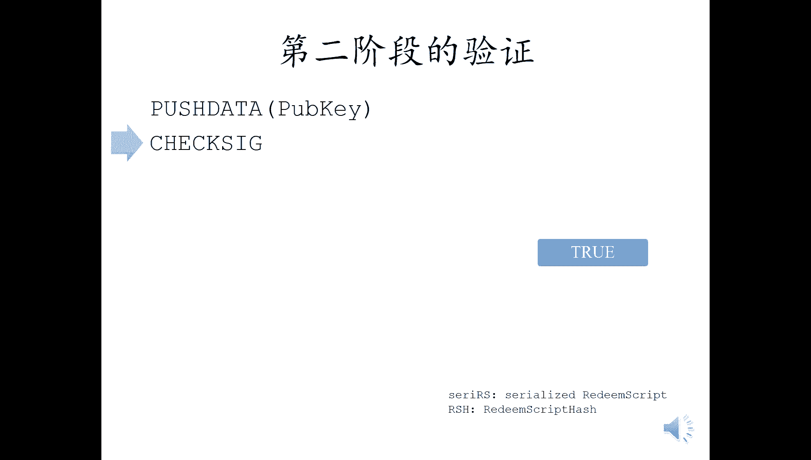
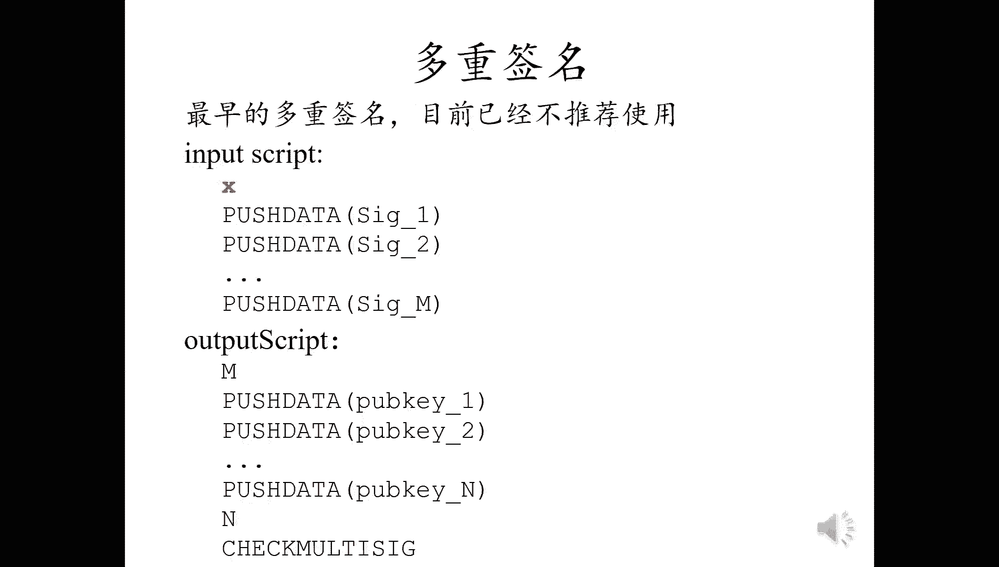
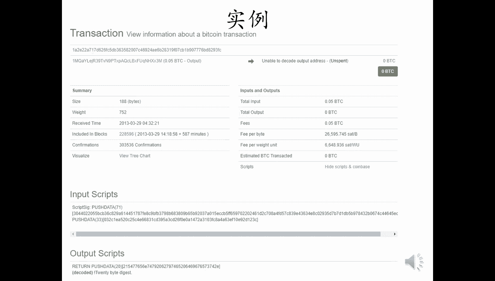

# 北京大学肖臻老师《区块链技术与应用》公开课 - P9：09-BTC-比特币脚本 - 北京大学计算机系肖臻 - BV1Vt411X7JF

今天我们讲一下比特币交易里使用的脚本语言，这是比特币的一个交易实例，这个交易有一个输入，两个输出，左边这个地方写的是output，其实是这个交易的输入。

他的意思是说这个输入中使用的b是来自前面哪个交易的输出，右边的两个output中，下面那个已经花出去了，上面那个还没花出去，这个交易已经收到了23个确认，所以回滚的可能性很小了。

下面是这个交易的输入和输出脚本，分别把两个很长的数压入栈里，比特币使用的脚本语言是非常简单的，唯一能访问的内存空间就是一个堆栈，不像通用的编程语言，像c啊，c加加呀那样有全局变量。

局部变量还有什么动态分配的内存空间，他这里就是一个站，所以叫做基于站的语言，stock based language，这里的输出脚本呢有两行，分别对应上面的两个输出，每个输出有自己单独的一段脚本。

下面我们看一下这个交易的具体内容，首先看一下这个交易的一些宏观信息，就所谓的叫metadata，然后第二行的hash这个交易的哈希值，然后接下来是version使用的比特币协议的版本号。

size是这个交易的大小，这个knock time的话，我们以前没有接触过，knock time是指用来设定交易的生效时间，他这里写的是零，表示立即生效，就绝大多数情况下。

这个knock time都是零，如果是非零值的话，那么这个交易要过一段时间才能生效，有一些比较特，殊的traction会用到这些，not time就是飞车下面这个v in和v out是输入输出部分。

我们后面会详细讲，就在这个p p t上，我们没有把它展开写，block hash是这个交易所在的区块的哈希值，那么我们可以看到这个哈希值也是有一长串的零开头就是挖矿要求的，这个难度要求都是这样。

confirmation是这个交易已经有多少个确认信息，那么就像我们前面一页看到的，这个交易是有23个确认信息，他们是这个交易产生的时间，block time是这个区块产生的时间。

这两个时间呢就这个time和block time都是表示从从某个很，早的时间点到现在过了多少秒，这是交易的输入结构呃，是个数组，一个交易可以有多个收入，我们这个例子当中呢，它只有一个输入。

每个输入都要说明这个输入花的b是来自之前哪个交易的输出，所以他这个前两行就是给出这个输出这个b的来源，这个第一个传达圣id就是之前这个交易的哈希值，vr的表示是这个交易里的第几个输出。

这这大家听明白了吗，就这个例子当中，他就说花的这个b就是来自于这个哈希值，就是这个c0 c b开头的这个交易中第零个输出，接下来就是输入脚本，这个输入脚本叫做script sg。

因为输入脚本最简单的形式就是给出一个signature就行了，证明你有权利花这个钱，我们后面的这个ppt当中，这个script sag我们就直接写成input script，有输入脚本。

那如果一个交易有多个输入的话，每个输入都要说明b的来源，并且要给出签名，也就是说比特币中的一个交易可能需要多个签名，这是交易的输出，也是一个数组结构，那我们这个例子当中呢是有两个输出。

这个value是输出的金额，就是给对方转过去多少钱，这里的单位是比特币，所以它这里是0。22684个比特币，也有的地方是表示成satoshi，就si就是叫一冲嘛。

比特币里的最小单位satosha这个单位是很小的，所以如果表示成satoshi的话，转账的金额看上去都是很大的，像这个例子当中，如果我们把它表示成si的话，就是22684000冲。

这个n是序号表示这是这个交易里的第几个输出，这个script pop key就是输出脚本，就是我们后面都写成output script，那为什么它这里叫script public key。

因为输出脚本最简单的形式就是给出一个public key，下面这个assm显示的是输出脚本的内容，这个我们后面会详细解释它这个操作是什么意思，require，这个是说这个输出需要多少个签名才能兑现。

那么这两个例子当中呢都是只需要一个签名就够了，我们后面会讲到multic就是多重签名，有的输出要多个签名才行，这个type是输出的类型，这两个类型都是public key，hash是公钥的哈。

希address是输出的地址，下面我们看一下这些输入和输出脚本是怎么执行的，在前面这个区块里呢，有一个a给b的转账交易，a转给了b，那b收到这个转过来的b之后呢，在后面这个区块里就隔了两个区块里。

把这些b又转给了c，也就是说呢我们这个例子当中，b给c的这个交易中，b的来源是来自于前面a转给b的这个交易，所以呢下面这个这个内容里，我们就可以看到b转给c的这个交易的收入里。

这个传达性和v out指向的是a转给b的这个交易的输出，那么，要验证这个交易的合法性呢，是要把b转给c的这个交易的输入脚本，跟a转给b的这个交易的输出脚本拼接在一起来执行的，注意这里有个交叉。

前面这个交易的输出脚本放在后面，后面这个交易的输入脚本放在前面，在早期的比特币实现中，这两个脚本是拼接在一起，从头到尾执行一遍，后来出于安全因素的考虑，这两个脚本改为分别执行，首先执行输入脚本。

如果没有出错，那么在执行输出脚本，如果能顺利执行，最后占领的结果为非零值，也就是处，那么验证通过这个交易就是合，法的，这个交易就是非法的，如果一个交易有多个输入的话。

那么每一个输入脚本都要和所对应的交易的输出脚本匹配之后，来进行验证，全都验证通过这个交易才是合法的，我们来看看输入输出脚本的几种形式，一种最简单的形式就是pay to public key。

输出脚本里直接给出收款人的公钥，第二行的这个check是检查签名的操作，在输入脚本里直接给出签名就行了，这个签名是用私钥对这个输入脚本所在的整个交易的签名，这种形式是最简单的。

因为public key是直接，在输出脚本里给出的，我们看一下实际执行情况，这三行是把输入脚本和输出脚本拼接起来之后的结果，第一行来自输入脚本，后两行来自输出脚本，注意就像刚才说的，实际代码中。

出于安全考虑，这两段脚本实际上是分别执行的，我们这个ppt里面为了方便起见，就把这两段脚本拼接在一起显示，然后从上往下一条一条语句来执行，第一条语句，把输入脚本里提供了签名，压入站。

第二条呢是把输出里提供的公钥加入战，第三条这个check ig它的作用是把栈顶的这两个元素弹出来，用公钥检查一下这个签名是否正确，如果正确的话，返回处说明验证通过，否则的话执行出错。

那么这个交易就是非法的，这是pay to public key的一个实例，上面这个交易的输入脚本就是把签名押入站，它就一行就押入这个签名，下面这个交易呢是上面这个输入的b的来源，它的出处有两行。

第一行是把公钥压入站，第二行就是check it，这是第一种形式，那么下面我们看一下第二种形式，pay to public key hash，这种形式与刚才讲的那种形式的区别在于。

输出脚本里没有直接给出收款人的公钥，给出的是公钥的哈，希公钥是在输入脚本里给出的，输入脚本既要给出签名，也要给出公，要输出脚本里，其他还有一些操作，这个像一开始的第5p啊，然后第二行的hr是160啊。

这些操作呢都是为了验证这个签名的正确性，这种形式实际上是最常用的，就是这个pay to public key hash，是最常用的一种形式，下面我们看一下这个脚本执行起来的结果。

这个是把上一页的输入脚本和数据脚本拼接之后，得到了前两条语句来自输入脚本，后面的语句来自输出脚本，还是冲上往下执行，第一条语句呢先把签名压入站，第二条语句，把公钥押入站，第三条语句。

这个due它的含义是把栈顶的元素复制一遍，所以栈顶又多了一个公钥，下一条语句还是160，是把这个站点元素弹出来取哈希，然后把得到了哈希值再加入战，所以站顶变成了公钥的哈希值。

下面一条语句呢是把输出脚本里提供的公钥的，哈希值压入站，这个时候呢栈顶有两个哈希值，大家注意搞清楚啊，他们是怎么来的，上面这个哈希值是输出脚本里面提供的收款人的公钥的哈希，就是我发布这个交易的时候。

我这个转账的钱要转给谁的，在输出焦段里提供一个收款人的公有的哈希，那么下面这个哈希值呢是你要花这个钱的时候，在数脚本里给出的公钥，然后前面那个操作就has是160操作取哈希后得到的。

那么在下面这个eq反这个操作的作用是弹出栈顶的两个元素，比较它们是否相等，就比较这个栈顶的两个哈希值是否相等，这样做的目的是什么，我们前面课上讲过，用他自己的公钥冒充收款人的公钥。

假设这两个哈希值是相等的，那么就从占领消失了，最后一条这个check这个我们前面已经讲过了，弹出栈顶的两个元素，用公钥检查这个签名是否正确，假设这个签名是正确的，那么整个脚本顺利运行结束占领留下的是处。

如果执行过程中任何一个环节发生错误，比如输入里给出的公钥跟输出里给出的哈希值对不上，或者是输入里给出的签名跟给出的公钥对不上，那么这个交易就是非法的。

pay to public key hash是最常用的脚本性质，我们这个ppt第一页显示的那个实例用的就是这种形式的脚本，现在我们应该能够看懂了吧。

这个input script和output script这个输入脚本就是把签名压入站，把公钥压入站，下面这个输出脚本呢复制栈顶元素这个due，然后呢取哈希值还是160，第三个是把公钥的哈希加入战。

最后呢equal verify比较站顶的两个哈希值，然后check sk检查签名，最后一种也是最复杂的一种脚本形式是pay to script hush，这种形式的输出脚本给出的不是收款人的公钥的哈希。

而是收款人提供了一个脚本的哈希，这个脚本叫redeem script，赎回脚本，将来花这个钱的时候，输入脚本里要给出这个redeem script这个赎回脚本的具体内容。

同时还要给出让这个赎回脚本能够正确运行所需要的签名，验证的时候分为两步，第一步验证输入脚本里给出的这个赎回脚本，是不是跟输出脚本里给出的哈希值匹配，如果不匹配的话，那么说明给出的赎回脚本是不对的。

就类似于刚才讲的那种pay to public key hash，里面给出的公钥不对一样，这个地方呢如果这个跟哈希值匹配不上，说明你给出的赎回脚本是不对的，那么验证就失败了。

如果输入里给出的石灰脚本是正确的，那么第二步还要把这个赎回脚本的内容当作操作指令来执行一遍，看看最后能不能顺利执行，如果两步验证都通过了，那么这，个交易才是合法的，这个听上去好像有点抽象。

我们下面看一个具体的例子，用pay to script hush实现我们前面说的pay to public key的功能，这里的输入脚本就是给出签名，再给出序列化的赎回脚本，赎回脚本的内容就是给出公钥。

然后用这个check检查签名，下面这个输出脚本是用来验证输入脚本里给出的赎回脚本是否正确，我们看一下这个pay to script hash的执行过程，开始的时候呢，也是把输入脚本和输出脚本拼接在一起。

前两行来自输入脚本，后面三行来自输出脚本，首先把输入脚本的signature压入站，然后把赎回脚本压入站，然后是这个取哈希的操作得到赎回脚本的哈希，这个rh是指redeem script hash。

赎回脚本的哈希值，接下来呢还要把输出脚本里给出的这个哈希值压入站，这个时候呢这个站里就有两个哈希值了，最后用一口比较一下这两个哈希值是否相等，如果不等的话，那就game over了，假设这两个相等。

那这两个哈希值就从栈顶消失了，到这里呢第一阶段的验证就算结束了，接下来还要进行第二个阶段的验证，第二个阶段，首先要把输入脚本里提供的序列化的赎回脚本进行反序列化。

这个反序列化的操作在这个ppt上并没有展现出来，就是每个节点自己要完成的，然后呢执行这个赎回脚本，首先把这个pp压入站，然后用这个check验证一下输入脚本里给出的这个signature的正确性。

验证通过之后，整个pay to script hash才算执行完成。

看到这里，同学们可能会有一个疑问，搞这么复杂干嘛呀，就用前面讲过的pay to public key不就行了吗，为什么一定要把这部分功能嵌入到赎回脚本里面，确实对这个简单的例子来说，这么搞是有点复杂了。

pay to script hash，这个功能在最初版本的比特币里面是没有的，后来通过软分叉的形式加进去了，它的一个常见的应用场景就是对多重签名的支持。

比特币系统中一个输出可能要求多个签名才能把钱取出来，比如某个公司的账户，可能要求五个合伙人中任意三个人的签名，才能把这个公司账户上的钱取走，这样呢为私药的泄露提供了一些安全的保护。

比如说有某个合伙人私钥泄露出去了，那么问题也不大，因为还需要另外两个人的签名才能把钱取出来，同时呢他也为私药的丢失提供了一些冗余，就五个合伙人中，即使有两个人把私钥给忘掉了。

剩下三个人仍然可以把钱取出来，然后转到某一个安全的账户，这个功能是通过check multic来实现。

就是这一页最后一行，这个check multic的操作输出脚本里给出n个公钥，同时指定一个阈值m输入脚本，只要提供这n个公钥对应的签名中，任意m个合法的签名就能通过验证，比如刚才举的那个例子当中。

n等于五，m等于三，五个合伙人中任意三个人的签名都可以，输入脚本的第一行有一个红色的叉子，它这个是情况是这样的，比特币中check multic的实现有一个bug，执行的时候会从堆栈上多弹出一个元素。

这个就是他代码实现的一个bug，这个bug现在已经没有办法改了，因为这是个去中心化的系统，你要想通过软件升级的方法去修复这个bug，这个代价是很大的，要改的话需要硬分叉。

所以呢实际采用的解决方案是在输入脚本里往站上多压进去，一个没用的元素，第一行我们写的这个红色的叉子，就是代表这个多余的元素，为了迁就这个check multic实现上的bug，往堆栈上多压进去的元素。

另外呢注意给出的这m个签名的相对顺序，要跟他们在n个公钥中的相对顺序是一致的才行，这是check mountain sig的执行过程，这个例子中呢，假设三个签名中给出两个就行。

那大家可以看到这两个签名给出的相对顺序，也是跟他们在公钥中的顺序是一样的，在公钥当中呢，第一个公钥排在第二个公钥的前面，那么相对应的签名呢，给出这两个签名的时候，也是第一个签名排在第二个签名的签名。

这个第一行的force就是我们前面说的那个多余的元素，首先把这个多余的元素压入站内，然后把这两个签名依次加入战，这个时候呢输入脚本就执行完了，接下来的输出脚本里，把m的值这个阈值m压入站。

然后把三个公钥押入站，然后把n的值加入战，最后就执行check multic，如果是的话，那么验证通过，大家看看有什么问题吗，注意这个过程当中呢并没有用到pay to script cash。

就是用比特币脚本中原生的check multic来实现的，这么实现有什么问题吗，早期的多重签名就是这样实现了，在实际应用当中呢，有一些不是很方便的地方，比如网上购物，某个电商用冒充签名。

那么要求五个合伙人中任意三个人的签名才能把钱取出来，这就要求用户网上购物的用户，在支付的时候生成的转账交易里给出这五个合伙人的公钥，同时还要给出n和m的值，像这个例子当中要写明n等于五，m等于三。

这些都是用户在网上购物的时候，生成转账交易时输出脚本里要给出的信息，给出这五个公钥，给出n和m是多少，那么用户怎么知道这些信息呢，需要这个购物网站在它的网上公布出来，所以这个网上可以公布。

我们用了多重签名，我们用了五个签名中要给出三个，这是五个公钥，然后用户生成这个转账交易的时候，又把这些信息填进去，那么不同的电商呢采用的多重签名的规则是不一样的，就有的电商可能是五个签名中任意三个。

有的可能要求五个，五个签名中你要给出四个，也有可能电商要求六个签名当中，你要给出三个，这都是有可能的，这就给用户生成转账交易带来一些不方便的地方，因为这些复杂复杂性都暴露给用户了，那么怎么办呢。

这就要用到pay to script hash，这是用pay to script hash实现的多重签名，它的本质是把复杂度从输出脚本转移到了输入脚本，现在这个输出脚本变得非常简单，只有这三行。

原来的复杂度被转移到了这个redeem script赎回脚本里面，输出脚本只要给出这个赎回脚本的哈希值就行了，这个赎回脚本里要给出这n个公钥，还有n和m的值，这个赎回脚本是在输入脚本里提供的。

也就是说是由收款人提供的，大家明白这样做的用意了吗，像前面那个网上购物的例子，收款人是电商，他只要在网站上公布这个赎回脚本的哈希值，然后用户生成转账交易的时候，至于这个电商用什么样的多重签名规则。

15个里选三个还是三个里选两个，对于用户来说是不可见的，用户没必要指的，从用户的角度来看，采用这种支付方式，跟采用前面说的pay to public key hash没有多大区别。

只不过把公钥的哈希值换成了赎回脚本的哈希值，当然了，输出脚本的写法上也有一些区别，但不是本质性的，这个输入脚本是电商在花掉这笔输出的时候提供的，将来如果这个电商改变了所采用的多重签名规则。

比如原来是五个里选三个，现在变成三个里选两个，那么只要改变这个输入脚本和赎回脚本的内容，然后把新的哈希值公布出去就行了，对用户来说，我们看一下具体的执行过程，即使把输入脚本和输出脚本拼接在一起后的情况。

第一行的这个force就是为了应付check multic那个bug而准备的一个没用的元素，执行的时候先把他押入站，然后依次把两个签名压入站，接下来是这个序列化的赎回脚本，目前只是把它作为数据压入战。

到这里输入脚本就执行完了，下面是输出脚本取哈，希，然后把输出脚本里提供的这个哈希值压入栈顶，最后判断一下这两个哈希值是否相等，到这里，第一阶段的验证就完成了，下面开始第二个阶段的验证。

把赎回脚本展开后执行，先把m压入站，然后把三个公钥压入站，把n压入站，最后检查一下多重签名的正确性，三个里面有两个是正确，第二阶段的验证过程跟前面直接使用check multic的情况是类似的。

这是网上使用pay to slip hash来做多重签名的一个实例，上面输入脚本的最后一个就是序列化的赎回脚本，反序列化之后得到的就是三个里面取两个的多重签名脚本。

下面这个输出脚本的内容跟我们前面讲的是一样的，现在的多重签名一般都是采用这种pay to script hush的形式，最后我们要讲的这种脚本格式是比较特殊的，这种格式的输出脚本开头是return。

这个操作后面可以跟任意的内容，return这个操作的作用是无条件的返回错误，执行到这个return语句就会出错，然后执行就终止了，后面跟的内容根本没有机会执行，同学们听到这里可能觉得很奇怪。

为什么要设计这样的输出脚本，这样的输出岂不是永远花不出去吗，你不论输入脚本写的是什么内容，执行到输出的这个return语句，他就报错了，那么这里的钱永远都花不出去，确实是这样的。

这个脚本是证明销毁比特币的一种方法，那么为什么要销毁比特币呢，比特币现在这么值钱，你这么销毁掉岂不是非常可惜呃，这个一般是有两种应用场景，一种场景呢是有些小的币种要求销毁一定数量的比特币。

才能够得到这个b中，这个有时候我们管这种小币，种叫auto coin，除了比特币之外的其他小的加密货币，你都可以认为叫auto co，比如有的小币种可能要求你销毁一个比特币。

可以得到1000个这样的小b，也就是说你要用这种方法证明你付出了一定的代价，才能够得到这个小币种，那么有人就利用这个特性往里面添加一些需要永久保存的内容。

比如说我们第一节课讲的一个场景是digital commitment，你要证明在某个时间知道某些事情，比如说涉及到知识产权保护的，把某项知识产权的内容取哈希之后，把哈希值放在这个return语句的后面。

这后面的内容反正是永远不会执行的，你往里写什么都没关系，而且呢你放在这里的是一个哈希值，你有什么知识产权，取个哈希之后把哈希值放在这儿，这个呢不会占太大的地方，而且也没有泄露出来，以知识产权的具体内容。

将来如果出现纠纷，像知识产权的一些专利诉讼，那么你再把这个具体内容公布出去，就这个哈希值的当初的输入公布出，去证明你在某个时间点已经知道某个知识了，同学们有没有觉得这个应用场景听起来比较耳熟。

我们以前课上讲其他某个地方的时候，也讲到类似的应用场景，就是那个coin base语对吧，我们讲，cohn base transaction里面有一个coo n b s语，你在这个域里写什么内容。

同样是没人管的，所以为什么不用这种方法，这个还不用销毁比特币了，就可以直接往里写，这种方法只有获得记账权的那个节点才能用，就如果你是一个全节点，你挖矿挖到了，然后你发布一个区块。

可以往这个cn base transaction里的cn base与写入一些内容，这是可以的，而我们说的这种方法呢是所有的节点都可以用的，甚至你不一定是个节点，可能就是一个普通的比特币上的用户。

任何人都可以用这种方法去写入一些内容，大家听明白了吗，发布交易不需要有记账权，发布区块才需要有记账权，那么任何用户都可以用这种方法销毁很少一点比特币，比如说0。001个比特币换取。

我们接下来会看一些例子，有些交易其实根本就没有销毁比特币，只不过支付了交易费，我们下面看两个实例，这是个coln base transaction，这个交易有两个输出，第一个输出的脚本是正常的。

pay to public tehash，输出的金额就是得到的block reward，加上transaction fe，第二个输出的金额是零，输出脚本就是刚才说的那种格式，开头是return。

后面跟了一些乱七八糟的内容，这是个普通的转账交易输出脚本也是以return开头的，这个交易的收入是0。05个，比特币，输出金额是零，说明输入金额全部用来支付交易费了，这个交易其实并没有销毁任何比特币。

只不过把输入里的比特币作为交易费转给这个挖到矿的矿工了。

这种形式的脚本的一个好处是旷工，看到这种脚本的时候，知道它里面的输出永远不可能兑现，所以呢就没有必要把它保存在ut里面，这样对全节点是比较友好的，大家有什么问题吗，就有一点说明一下啊。

我们这个ppt当中涉及到的比特币脚本的操作，为了简单起见都没有加上op前缀，就比如说我们前面写着，实际上应该是up check，那么check multiceg也是of check multiple。

还有这个de应该也叫做of du，我们这个ppt简单起见就没有把它写上去，那最后总结一下比特币系统当中用的这个脚本语言是非常简单的，甚至连专门的名字都没有，它就叫比特币脚本语言。

bitcoin scripting language，我们后面可以看到像以太坊当中用的智能合约的语言，就这就比这个要复杂得多。

比如说比特币的脚本语言不支持循环，所以有很多功能这个语言是实现不了的，这样的设计是有其用意的，不支持循环就不会有死循环，就不用担心停机问题，大家听说过吧，hooting problem，像以太坊当中。

它的智能合约的语言是图灵完备的，表达能力很强，所以就要需要靠汽油费的机制来防止这个程序陷入死循环，另外一方面我们注意这个语言呢虽然在某些方面功能是很有限的，但是在另外一些方面，它的功能却很强大。

就是跟密码学相关的功能是很强大的，比如说这个check multic，检查多重签名，用一条语句就能够完成，这个比很多通用的编程语言要方便得多，所以呢比特币的脚本语言虽然看上去很简单。

但其实针对比特币的应用场景做了很好的优化，还有问题吗。