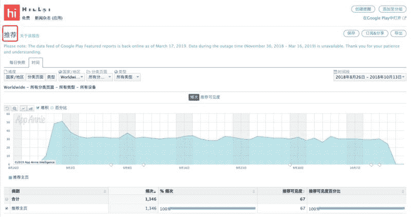
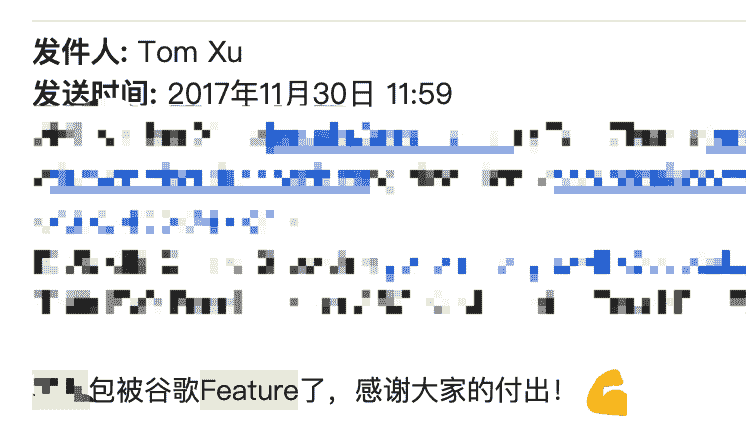

# AppStore 和 Googleplay 的官方推荐，业界俗称被爸爸 Featured

关于亦仁提到弹出的 dialog 里“OK”和“Cancel”位置要遵循大平台规范的事情，一下子就勾起了我的伤心又甜蜜的往事。

先卖个关子，国内有很多小而美的创业团队，抱着创造梦想、改变世界、造福用户、不忘初心的理念，笃定自己产品的品质过硬，酒香不怕巷子深，几乎从来不买量。

尝试过花钱去投放，但为了体现自己公司和产品的逼格、调性、品牌，投放的物料（文案，图片，视频，落地页）都是严格遵守广告法。

换句话说，就是高大上不接地气，点击转化率做不过利用人性弱点游走在规则边缘的同行，导致投放的获客成本太高，然后抱怨世道不公，劣币驱逐良币。

如果不是资本实力足够雄厚，产品刚需/好用/易用足以甩开同行十条街，那最后只能自怨自艾。

针对这部分团队和产品，怎么获取流量呢？靠口碑？量太少了。

细水长流，要等几年才能量变到质变，到时候黄花菜都凉了，投资人也撤资了。

更何况，大部分品类还不合适口碑传播。

所谓的病毒传播，更多是运气+天时地利人和的加持因素。

这时候大杀器就来了：

苹果 AppStore 和 Googleplay 的官方推荐

业界俗称被爸爸 Featured。

苹果 Today 位置的威力，做流量的都知道吧。

去年（18 年）到北京出差，见了一个创业团队，我问他们流量从哪里来，老板就说了三个词：Featured+换量+ASO，基本是“能不花钱就不花钱”，“能少花钱就少花钱”。

在 Tom 叔 6 年前刚出海的时候，那时候应用商店产品少，三天两头就被推荐，开发者自己还不知道。只能事后知葛亮，去查新增用户曲线上升的原因：噢，原来被 Featured 了。很早的时候，AppAnnie 还不能跟踪被 Featured，那更是盲人摸象。

套用今天的流行语，开发者还以为 K-factor 起来了，用户裂变了。结果自己都不知道真正的原因是被爸爸们宠幸了。

大概从 15 年开始，Tom 叔就默默给自己定了个指标：每个季度争取一次 Global Featured（全球推荐）。因为是工具类 App，没有文化差异，所以全球推荐很合适。一般工具类 App 每次被全球推荐，都能拿到几十万到上百万不等的下载量。

16 年做海外游戏发行，由于语言和文化的限制，只能申请特定地区的 Feature。比如当时发了一款菠菜游戏，在北美地区，拿了一个月美国和加拿大的分类推荐，由于品类限制，也不是特别优质的位置，但一个月也因为推荐免费获取了小几万菠菜用户。如果去 facebook 或者 Google adwords 买量，至少需要 10-20 万美金。

被苹果谷歌两个爸爸钦点的时候，经常会遇到打回来的情况。主要是商务团队和审核团队不是一帮人，商务是亚太区，在北京香港新加坡，审核（Review）团队基本在美国。

流程一般是：开发者和商店商务团队（BD+AM+CSM）处理好关系，然后提前一个月（一定要提前至少一个月，注意排期）和你的商店客户经理沟通好，申请推荐的主要理由有:

1、接下来会有个重要的版本上线，我们全面翻新了产品，balabala……不建议每个版本都去申请，一定要是 2.0，3.0，4.0 这种大的 version 去申请，否则，人家还嫌你烦，拎不清。Bug fixed 版本也来申请，就把你打入黑名单。所以，综合下来，3-6 个月一次较为合适。

2、每年爸爸们都会发布新的 OS 系统。这时候，会哭的娃有奶喝，会叫的鸟儿有食吃。和爸爸们说，我们是先进分子，第一时间适配了 iOS12、Android Q 等，比如 3D Touch，Siri 唤醒，统统全面来一套（即使可能是使用率不到 1%的鸡肋功能）。爸爸们心情一好，就会给你个推荐，还放到一个 category 里，美其名曰：适配最新 iOS。

3、付费功能，尤其是最近几年很火爆的订阅/连续订阅等功能。你想想，苹果谷歌一看，这开发者下载量不低呀，最近要做收入规模了，我们还能有 30%分成，赶紧给他导流看看。如果小的位置推荐后流水大，ROI 效果好，恭喜你，上 Today 不是梦。

4、卖弄情怀，比如独立开发者，讲个地下室头悬梁锥刺股封闭开发 3 个月的故事，山姆大哥们很容易被此类故事感动。手一松，推荐位就来了。注意，措辞注意分寸感，不能用感动中国的煽情度去感动美国。此类旁门左道，在早期比较合适。现在审美疲劳后，成功率大幅降低。

主要还是产品品质说话。

发散太多了，回到最开始说的，大家猜到我要说啥了吧。Bingo！

谈到被美国审核团队打回来，我们最开始经常犯的错误，就是 Android 和 iOS 设计规范的差别。比如从苹果拟物化设计，到扁平化设计，再到微软的 Metro 设计，谷歌的 Material Design，每次设计语言的改动，都会把我们的产品+研发+测试团队折腾个 1-2 天。

以 OK 和 Cancel 的位置来说，一般团队会以 iOS 开发优先，专业的 iOS 开发工程师会把 Action Button（即 OK）放右边，Cancel Button 放左边。移植到 Android 和 WP 平台时，UED 设计师给的稿子，也会依葫芦画瓢下。这就埋下了一个大坑。

这种 Dialog 修改的看上去细枝末节无足轻重的工作，主管经理们基本都会丢给刚毕业的小 RD、UED 去做。所以，几乎每次被推荐的时候，我都要帮着擦屁股。

三番五次后，我总结出了经验，自己先钻研一遍各大平台的开发者最新文档。如果下次要申请 Feature，我就先把平台最新版本的 RD 和 Design Guideline 先发给相关小伙伴，大家先自查一下，有则改之，无则加勉，然后再去申请推荐，审核团队开心，我们也省事。Tom 叔后来甚至组织过新入职的研发和产品同学，定期学习谷歌和苹果的培训课程（毕竟能主动拥抱规则变化的人不多）

举个印象最深刻的例子。

几年前，有一次经过各种软磨硬泡（黄金三法则：不要脸，坚持，不要脸）。我们商店客户经理给我们排期到一次全球推荐，然后转到审核团队，直接抛出 14 个产品里需要修改的点。如果算上我们违反 Material Design 的各种设计细节，估计超过 20 个。此外，适配 Android 不同分辨率也是个大坑，以及物理键和虚拟键的坑（Back 位置的设计）。

我当时就一头黑线。

你没看错，需要改 14 个点。

爸爸要求 7 天内必须改完。

否则前面的付出就白搭了。

更糟糕的是，Email 送达时间：

美国时间周五（北京时间周六）

结果呢？我们周末加班，2 天不到，周一下班前（美国时间周日）全部修改优化掉，并测试上线了。

爸爸周一一上班，收到我们邮件，都惊呆了，连连 Congratulation 我们，表扬我们中国人做事效率就是快。

不过，这种心惊肉跳的事情，其实没啥可吹的。应该从源头就去防微杜渐，需要团队有极高的产品和技术素养，去关注最前沿的技术和美学语言。

泼个冷水，随着 App Store 和 GooglePlay 商业化压力的增大，Featured 的难度也越来越大， 流量质量也越来越参差不齐。比如 17 年的几次全球推荐，每次大概带来了 30~50w 用户，国家分部也比较均匀，比如美国 10%，印度 20%这种，和全球人口分布比重接近。但到了 18 年，明明约定是美国、日本、韩国的用户，最后被推荐的绝大多数是印度和印尼的用户，用户留存也掉到冰点。呵呵，咱也不知道，咱也不敢问。

总结一下，我的职业生涯里，迄今为止被官方正式 officially 提名 Featured，至少 10 次以上。后面可以专开一个帖子，再详细讲讲怎么能获得全球流量最大的两个爸爸们的青睐。否则我很可能就忘记了，里面的个中滋味，只有亲历过才知道，几乎全是坑，说多了都是泪。

AppAnnie 报告

Feature

Google Play

评论：

田宝 ₁₈₅ ₀₃₀₉ ₈₉₀₉ ： 经历都是财富

黄北钦 ： 我们一直被 iOS 不过审的问题折磨，产品上不了线