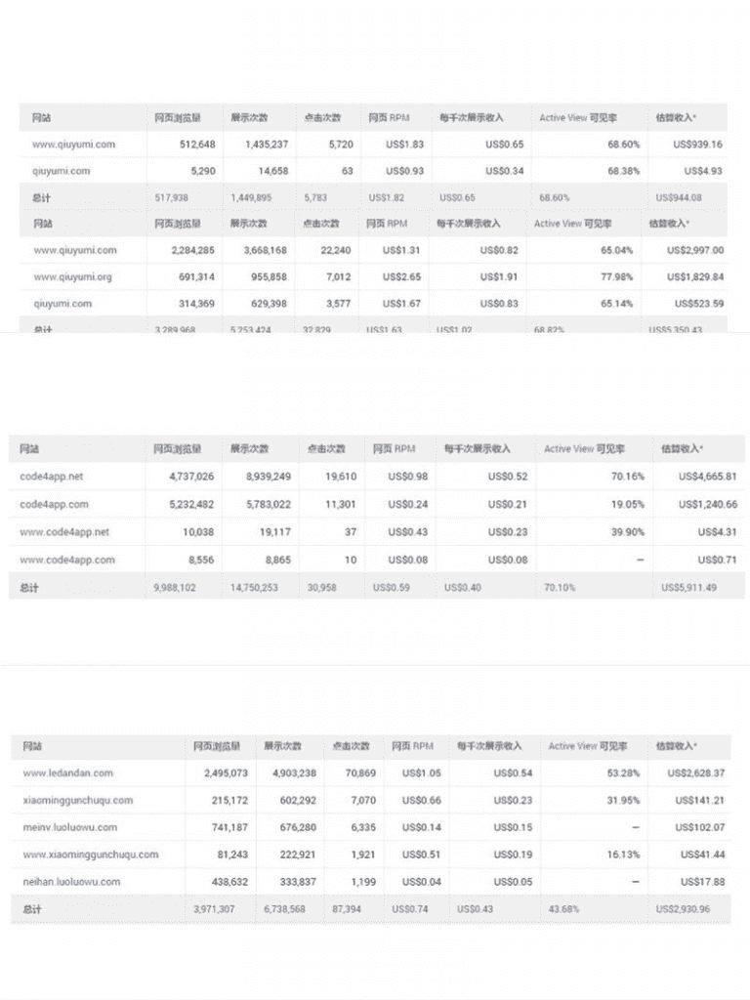
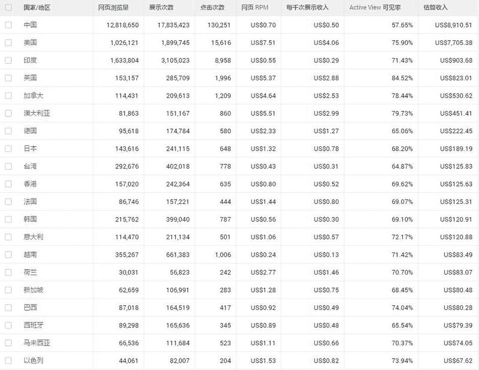
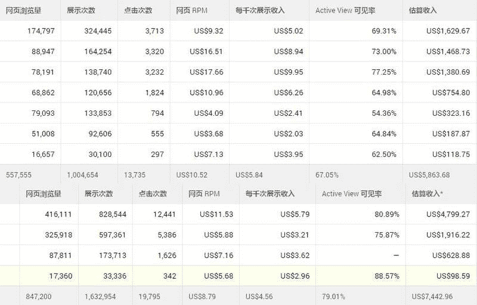
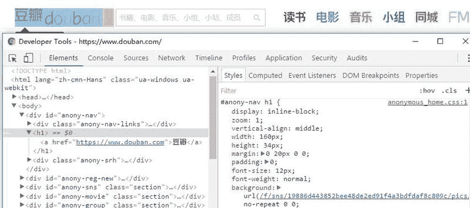
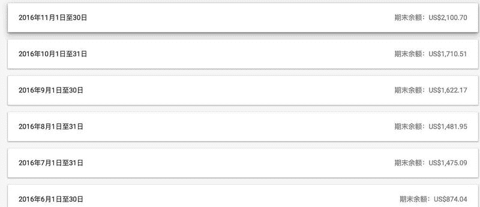

# 实操经验：做 Adsense 网站赚到 3 万美金

每周一，邀请一位圈友分享他行走江湖的生财之术。

今天邀请的是@今天有课 朱鹏飞，他将分享他做 Adsense 网站赚到 3 万美金的实操经验。

这篇文章之前在 Gitchat 上是一篇付费内容，卖掉近 3000 份，考虑到生财有术的圈友与 gitchat 的用户重叠度并不高，我请他再分享一次。

以下是今天的#轻享# 内容，enjoy！

大家好，我是朱鹏飞，谢谢亦仁的邀请，来做一次分享。

这次分享主要从以下四块进行：我的做站经历、Adsense 网站数据分析、Adsene 网站分类和 SEO 小知识。

一、我的做站经历

1.1 秋玉米

2009 年我从网上下载了一个桌面版的扫域名软件，用了几年，发现很好用。它能按要求生成各种组合的域名列表去逐个查询注册情况，并把未注册的标注出来。并且可以自定义词库，但是它本身没有自带词库，几年时间，我自己做了好几个词库，如拼音、区号、邮编、人名、水果名、动植物名等等。

2012 年 2 月底，我想其他玩域名的人也会有同样的需求，为什么不做一个网页版的扫域名工具出来呢，并且把我的词库都内置进去，就节省了大家自己搜集整理词库的时间，而且网页版随时随地想搜就搜。开发了两周左右，做了第一版出来，到 3 月 7 日 qiuyumi.com 就上线了，这个域名也是用那个桌面版软件扫出来的。

后面因为各种原因，到现在五年了，都没去花时间把第二版给做出来。我设想中的第二版需要有账户系统，用户可以自建词库，并且提交搜索需求之后就不用管了，有结果了直接通知给用户。还有定时任务，比如每天扫描一下某个组合，发现未注册域名也通知。另外围绕域名的各种需求，做更多更好用的工具补充到秋玉米上。

秋玉米从上线到现在，总 PV 应该在 380 万左右，平均每天两千多 PV。因为后面一直没增加新功能，也没有去推广，所以流量一直比较稳定。这就是一个小众人群使用的工具而已，流量做不大，赚点零花钱可以。而累计广告费却有六千二百多美元，相当于四万多一点人民币。相比于花费的精力，这个投入产出比倒是还可以。

1.2 Code4App.com/.net

注：这两个站后来卖掉了，并且 .com 卖之前也只放了一小段时间的广告，所以这里只有放了广告代码期间的数据

（图 1）

还是 2012 年，那是秋玉米上线一个月后的 4 月 6 日，Code4App.com 上线了。Code4App 是一个给 iOS 开发人员用的代码下载网站，最初上线是因为我搭档自己就是一个 iOS 开发者，他以前是在 Oracle 做 JAVA 相关工作，对于 iOS 也是边学边开发。

学习期间他积攒了一百多份源代码，有实现某些功能的，有实现某些界面特效的。他发现想要实现某个功能的代码，只能通过搜索引擎，或者去各个论坛搜索下载，但是下载之前根本不知道代码是否有用，适合哪个系统，对于代码的使用方法也需要花时间摸索。

他就想，如果把每一份代码都测试一遍之后，用自己的语言去描述代码的作用，写出代码的使用方法，并且给出代码运行效果截图，对于其他开发者一定有用，因为能够节省开发者时间。

然后我们几个分工，他负责整理代码，测试、截图、写描述。我开发网站，当时的实习设计师妹子设计了第一版界面。很快，我们花了两周多时间就把网站做出来了，并且把这一百多份代码都放到网站上面去了，Code4App 有了初始内容。

然后在 V2EX 发帖宣传了一下，大家都很喜欢，站长 Livid 还帮我们在 Twitter 上面发推做推荐了。

后来 7 月份，我们做了一个英文版，就是 Code4App.net 。没有任何宣传，只是在中文版底部放了英文版的链接，过段时间就慢慢被 Google 收录了。慢慢有 iOS 开发者通过搜索引擎来到网站，觉得网站好用之后，成为了网站的常客，并且在 StackOverflow 里边回答问题时，把我们英文版链接贴上去。外链越来越多的，这使得英文版在搜索引擎的权重越来越高，流量也不断变大。

对于中文版 Code4App ，为了体验，我们很克制，只是放了一段时间的广告用来测试广告点击情况，后来发现广告费不多之后，就撤掉了广告代码。后来遇到有人想要购买 Code4App ，而且开的价格我们也还接受，就把这个站给卖掉了。当时我们没有去分析英文版的广告数据，所以傻傻的把 .net 英文站也一并送给买家了。

中文版放广告期间的累计 PV 大概在 530 万左右，广告费才 1250 美元。而英文站从上线到卖掉，总流量大概才 480 万 PV 左右，但是广告费却有 4670 美元。

1.3 娱乐类网站（趣味测试、笑话、美女图片）

当年微博上很流行“你是 XXX 里的谁”这种趣味测试，而且通过接入微博接口，可以@ 好友，形成爆发传播。我做了一个后台，通过简单设置，上传好图片，就可以快速生成各种测试，这就是乐蛋蛋网站。

我让我弟去运营推广，那时候，微博上爆发的好机会已经过去了，所以我们选择了去贴吧推广。每一个电视剧都有自己的贴吧，做好相关测试之后，把自己的测试结果发个帖子，然后给出截图，再在二楼给出链接，因为一楼容易喂度娘。电视剧《继承者们》火的时候，每天从这一个测试就能够来几万的 PV。不过，后来因为想用乐蛋蛋做 H5 游戏，旧版网站被我们关掉了。再后来，H5 游戏也没做，乐蛋蛋也就这样没了。

笑话网站则是专门为了优化“小明滚出去”这个词建立的，上线没多久就排到了百度 PC 端和手机端的第一，中间也有掉下去过，不过现在还保持第一。之前这个词火的时候，每天有两三千的 UV，四五千的 PV，现在百度指数值降了，网站流量也只剩几百了。

美女图片、内涵图片则是为了了解这类网站的数据而建的，后来发现竞争太大，而且单价又低，没做多久就关门大吉了。

几个网站，累计流量在 400 万 PV 左右，累计广告费不到 3000 美元。查看数据发现，主要广告费是乐蛋蛋产生的，250 万的 PV 产生了 2600 美元的广告费。而内涵和美女加起来 50 万 PV ，按照乐蛋蛋的数据应该有 500 多美元的，但实际却只有 120 多。

1.4 类 Pinterest/Fancy 图片网站

Pinterest 带火了瀑布流这种全新的网站布局，国内也出现了好多类似网站。我也想做一个类似网站，但是需要差异化。后来看到 Fancy.com 的出现，发现垂直类也许是一个机会。服务垂直人群的垂直网站，需要离钱近一点，那就引导用户分享购物网站上的商品图片吧。

为了测试，我从 eBay 用程序抓取了几千个商品的图片，做了个简单网站来展示这些图片，结果上线之后，发现数据很不错。搜索引擎收录很快，带来的流量也还可以，更主要是同样的流量，能赚更多的广告费，点击率一般，但是点击单价高。

继续分析发现，主要流量来自于图片搜索。那时候图片识别技术还没有像现在强大，搜索引擎对于图片的理解主要来自于网页上图片周围的文字，以及图片标签的 alt 和 title 等。我把 alt 和 title 都写了，而大多数网站都是不写的，或者随便乱写，所以我的页面就能够排到更前。

我调整了一下页面布局，使图片和网页 h1 靠近一些，这个靠近是指代码上而不是显示出来的效果。然后给标题分词，做索引，每个词做了一个页面，把含有这个词的商品图片全部展示到一起。事实证明，这样优化是有显著效果的。

这个时候，因为有其他事情要做，就没有去继续开发更完善的功能，比如账户系统，用户分享、收藏、点、评论等功能。

后来用这个简陋的网站程序，用不同的域名陆续做了几个网站，都是垂直类的，也就是一个域名下面只放一类商品图片。这几个网站，有婚纱类的，宠物用品类的，收藏品类（瓶子、钱币等），女性衣帽服饰类等。到了这一步，其实就可以算是垃圾站了，这些网站本身并不能给用户带来更多的价值，但是那时候见有利可图，也就没管那么多。

这几个网站，因为不能很好的留住用户，没有多少回头客，只能靠搜索引擎带来流量，所以流量不太稳定。好的时候，某个类别的关键词刚好竞争不大，一上线就有流量，当月就有广告费，并且后面每个月广告费都增加不少。其中一个站前三个的广告费分别是 30 美元，60 美元，110 美元，然后后面就一直稳定在一百多一个月了。

最终这几个网站加起来累计流量才 140 万 PV 左右，但是广告费却有一万三千多美元。

二、广告数据分析

2.1 每百万 PV 广告费

按照每 100 万 PV 产生的广告费算，以上几类网站的数据如下：

瀑布流商品图片类网站：$9500/百万 PV；

秋玉米：$1656/百万 PV；

趣味测试网站：$1053/百万 PV；

Code4App 英文站：$970/百万 PV；

Code4App 中文站：$233/百万 PV；

笑话、图片类网站：$204/百万 PV。

所以不能简单的说，中文网站的点击单价就低，英文站的点击单价就高，还是要看网站的内容和用户群，内容离钱越近，价格就越高，用户群的购买欲望越强烈，价格也越高。

2.2 Adsense 产品类型

Adsense 产品类型分为，PC 网站的内容广告和移动端的内容广告两种。

在我的网站上，PC 上的内容广告赚钱效果是更好的，这可能跟我没有专门为移动端去优化网页有关。

2.3 哪个国家的钱好赚

从 PRM（每千次搜索产生的广告收入）角度来看，美国、澳大利亚、英国、加拿大等几个国家的钱是更好赚的。 从每千次展示收入来看，前几个国家还是美国、澳大利亚、英国、加拿大。

2.4 哪种出价类型更高价

每次互动出价的千次展示收入最高，但是需要用户与网页上的广告互动（比如鼠标放在广告上几秒，会展开一个更大的广告浮层），所以整体收入没有其他出价类型多。

收入最多的还是按照点击计费，因为只有用户点击了，到达了广告主的落地页，对于广告主来说，才更有效。

2.5 广告定位方式

内容相关意思是，用户在你的网页上看到的广告是根据你广告代码周围的文字内容来展示的相关广告。个性化意思是，用户看到的是因为用户在其他网站的行为导致的专门针对该用户显示的个性化广告。展示位置我也不太清楚。

所以，其实个性化的广告，是收入最高的，然后才是内容相关。为什么呢，因为这样的用户更有可能有消费意愿，广告主为了让用户最终达成消费，愿意出更多钱。

2.6 广告类型

文字广告的千次收入是最高的，次之是图片广告。所以创建广告单元的时候，广告类型建议选择默认的“文字广告和展示广告”。

三、网站分类

我把网站简单粗暴的分为两类，工具站和内容站。

工具站提供好用的工具，帮助用户解决某些需求，如个人所得税计算器、万年历、IP 信息查询等。

内容站提供优质的内容，帮助用户获取信息。这又分为 PGC 和 UGC，前者是网站自己找专业人士做内容，比如早期的什么值得买（现在已经是 PGC+UGC 都有了）；后者则所有内容来自于用户生成，如社区论坛。

工具类网站开发完成之后，日常维护花费的精力比较少，可以自动运行。而且如果工具做得的确好用，用户会自己记住网址或者放入书签以备以后访问。但是一般工具类站，都是细分市场，只能吸引到有这一类需求的人群访问，流量有天花板。所以当你幸运的发现流量一直在上升，但是后面怎么也升不上去了，就是到达天花板了。

而内容类的网站，需要稳定并且持续不断的生产内容，花费的精力多，PGC 需要花精力生产内容，UGC 需要花时间维护，运营。但是只要内容质量好，用户认可，除了用户自发的分享传播之外，搜索引擎也就会给更高的权重，从而得到更多的搜索引擎来的流量。

换句话说，工具类网站，做好了，躺着赚钱就行，成本不高，但是赚得也不多。内容类网站，成本高，潜力也大，赚钱能力当然更强。

四、SEO 小知识

4.1 网页 title/description/h1/h2/h3 要用对

title 标签的内容表示当前这个网页的主题主旨，description 则是对 title 的进一步补充。这两个地方虽然关键词堆积有一些效果，但是最好还是提炼一下，同一个关键字最好不要出现超过 2 遍。keywords 可写可不写，我一般都不写。

h1 则是在网页的正文部分告诉用户也告诉搜索引擎，你这个正文的主题是什么，每一个网页都必须要写 h1 。在网站首页， h1 可以用来显示 logo ，参考豆瓣的做法，logo 用背景图片实现，就保证了 h1 内部是文字。

在首页，列表页面，给每一个板块加一个 h2 标签。在文章页面，h1、h2 等标签则出现在正文里即可。

4.2 内链要做好

在网站首页最好把把最新的几条内容展示出来，方便用户每次刷首页就可以知道你网站更新没有，当然也方便搜索引擎抓取你的最新内容。

网站底部给出网站的主要入口的链接，比如每一个分类，每一个频道等等。每一个内页，需要有回到首页的链接。

内容列表页面的分页，不要只是简单的上一页下一页，因为这样搜索引擎需要爬取更多次才能把你的列表页面都爬完。给出最近的 10 个页面是合适的，比如在第 6 页时，有第 1 页到第 5 页，第 7 页到第 11 页的链接。

对于内容比较多的，甚至需要给出整十和整百的链接，如第 10 页、第 20 页、第 30 页……第 90 页、第 100 页、第 200 页、第 300 页……第 900 页等。

4.3 外链可以做

外链一般有三种，一种是跟其他网站交换的友情链接，第二种是用户自发发布到其他网站的链接，第三种就是站长主动到其他网站发的链接。

第一种主要靠刷脸，交换的一般也是首页，而且一般都是文字链接，对于网站提升关键字权重还是有一定帮助的。第二种主要靠内容好，用户自发的传播，这种链接，搜索引擎是最喜欢的。第三种就八仙过海各显神通了，有机器发的，有手工发的，但是搜索引擎可能会惩罚。

所以，外链可以做做，但不要强求，更不要去别的网站发垃圾广告。

五、如何找需求

市场不是越大越好，比如外卖市场的确很大，但是现在巨头已经形成，如果你现在想去做外卖，那就是自找苦吃。

一般来说，用户需求越强烈的，总市场容量越大，但是竞争也大，你不一定能做得过别人，也就是最终你花了精力，但是会发现流量上不去。这里边你就要找准一个平衡点，找一个你能够 Hold 住的市场，或者一个细分角度切入，然后再做大。

我建议先从自身的需求找起，工作生活中，有没有什么不方便的地方，能够通过什么方式来改进呢？拿秋玉米和 Code4App 来说，就是我们本身就有这个需求，所以猜想其他人（域名玩家和 iOS 开发者）也会有类似的需求。

我是程序员，我发现工作中一天可能会用十几次以上搜索引擎，但是，目前不管是 Google 还是百度，给出的结果都被一些垃圾站所占据，那些内容可能都是几年前的，复制来复制去，错误百出。

所以这里就有两个需求了，一个是做一个更好用的搜索引擎，但是还有一个更容易实现的需求就是做一个专门给程序员用的内容网站，类似于维基百科的机制，把工作中会用到的知识都一个一个条目列出来，由所有程序员共同维护，随时更新最新的内容。

再发散一下，是否这些内容就一定需要放到一个网站上呢，放在大家各自的博客上也同样是可以的，只需要把链接统一到一起，方便检索就行，这不就是搜索引擎嘛。

所以，做一个专门给程序员用的搜索引擎要怎么做呢？我选择用维基+搜索的形式。一方面爬虫去爬取筛选优质内容，一方面也让程序员自主提交链接和内容。另外还要找技术达人来给内容质量打分，这些人点赞过的内容能够排到更前。

这样的搜索引擎有没有人用呢？我自己是很需要的。我又问了一些程序员朋友，他们都说如果你能够帮助我每一次搜索都在第一页的十个结果中就解决我的问题，我一定天天用你的搜索引擎。

六、一次真实改版

最后用我 2016 年给一个朋友的网站改版的案例，来说一说网站内部 SEO 该怎么做，以及广告位该怎么设置。

先看下改版效果，改版前，6 月 20~24 这几天，网站 PV 在 9.7 万 ~ 9.9 万之间徘徊，6.25 是周六，下降到了 7.9 万。平常都是周一到周五流量高一些，周六日降一些。 6 月 26 日周日下午，新版网站上线了，当天流量升了一些，到了 11.5 万。6.27 日，周一，PV 立马变成了 20.2 万。此后一直上升，在 10 月 9 日到了最高峰 28.6 万。

上图是每个月广告费的截图，6 月广告费是八百多美元，之前几个月其实也差不多在六七八百美元左右。7 月广告费接近 1500 美元了。到 9 月就翻一倍，到 11 月 2100 美元，是 6 月的 2.4 倍。

改版前，我分析他网站时发现，网站打开比较卡，说明访问量比较大，已经到了服务器能够承受的极限了，也说明了有很多人访问被挡在外面了，别人开了几秒没打开你网站，直接就关闭了。

整个网站只有两个页面，一个是内容列表，一个是内容页，首页和分类页是内容列表页面，首页直接就是列表页的第一页。页面也是单栏结构，不能很好的展示内容。并且在网站导航下方放了一个横幅广告，这个位置其实并不是放广告的最佳位置，太伤用户体验了。

朋友自己不会技术，是下载别人一个学习 CodeIgniter 框架的练手作品来做的网站。我看了一下代码，所有数据查询是直接在视图里边写的，还在循环里边查数据库。

所以解决方案是，重写程序，上缓存（没上 CDN），重新设计页面布局，重新规划广告位。这里特别说一下，网站改版，最好是新版 URL 结构与旧版保持一致。如果实在旧版的 URL 规划不好，那也需要把旧版的所有网址全部 301 跳转到新的网址。

网站页面改为两栏结构，左边栏是正文，宽度 728 像素，右边栏是侧边栏，宽度 336 像素，再加上中间空白 16 像素，刚好 1080 像素。728 和 336 怎么来的？ Adsense 的横幅广告最推荐的尺寸是 728×90 ，矩形广告推荐的是 336×280 。所以设计页面时，建议正文宽度不要小于 728 ，矩形广告还有一个尺寸是 300×250 ，所以侧边栏也可以是 300 宽度。

首页保持了之前的内容列表第一页形式，但是在侧边栏增加了热门内容，网站公告等板块。内容页左侧分区块介绍内容，每一个区块用一个 h2 标签，内容标题用 h1 标签。右侧增加相关内容板块。

我观察到一个现象，比如你要优化“周星驰电影”这个词，那么只需要在页面 title 和 h1 中出现“周星驰电影”各一次，然后在这个页面放 10 个周星驰电影的名字会比页面中出现 10 次“周星驰电影”效果好。因为搜索引擎能够“读懂”你页面要表达的意思。

所以，我给内容做了打标签功能，然后增加标签页，把打了同一个标签的内容找出来显示到该页面。不仅方便用户查找同一个标签的内容，也能在搜索引擎中增加页面数量以及获得不错的流量。

广告位，左侧是在内容列表页面的分页和内容之间，以及内容页的板块间放了一个 728×90 的横幅广告。右侧在顶部和底部分别放了一个 336×280 的矩形广告。

最后网站上线，页面打开速度大大提升，之前被堵在外面的用户全进来了，所以才能够第二天流量就翻倍。看两个数据，2016 年 1 月到 6 月，人均浏览页数 9.04 ，平均访问深度 3.15 。2016 年 7 月到 12 月人均浏览页数 13.56 ，平均访问深度 7.3 。人均浏览页数增加了 50%，平均访问深度增加了 130%。说明这次网站改版是有效的。

不过关于广告位，这里有个数据很有意思，每个页面广告位由一个增加到三个。但是计算一下发现，每百万 PV 带来的广告费，改版前是 267 美元（用 6 月份流量 327 万 PV 计算），改版后最高是 345 美元（用 11 月份 608 万 PV 计算），才增加了 29%。这说明网站内容一开始定位完成，那么用户群体也就确定了，那么同样的流量能够带来的广告费是不会变化太大的。

也就是说，你一个网页放一个广告位还是放三个广告位，对于你最终拿到的广告费不会相差太大。Google 规定，一个页面最多放三个广告位，但我觉得放两个就差不多了。但是具体广告位要放在页面的哪个位置，你可以用实验的方式测试不同位置的收入情况，然后最终定下来，把广告位放在能够带来最高收入的地方。

七、附录

推荐的 SEO 学习网站： SEO 每天一贴

推荐的 SEO 学习书籍：《SEO 实战密码》（作者：昝辉 Zac）

Adsense 帮助文档： https://support.google.com/adsense/

Adsense 官方中文博客：谷歌 AdSense 官方微博 _ 新浪博客

朋友的界面精美实用导航网站： 创造狮 创意工作者导航 创造师导航

啰七八嗦讲了一大堆，希望能够对你有所帮助。

最后打个硬广，我们最近在做一个课程返利的公众号叫做今天有课，今天有课是一个网课返利公众号，目前支持极客时间（返 24 元/课）、GitChat(返 25%/课)、掘金小册(返 30%/课)等，如果有兴趣的话可以扫描最后一张二维码关注。

（本文完）

Adsense

Adsense

Adsense

Adsense

Adsense

Adsense

Adsense

Adsense

**评论：**

今天有课：感谢亦仁邀请，一点小经验分享给大家，希望对大家有所帮助。 可以加我微信 qiayue 交流 Adsense 相关经验教训。

柚子（别摸我头会长不大）：认真看完了，感慨：1.羡慕程序猿，看到什么不爽，都可以用代码快速上线测试，方向对不对，很快能有反馈；2，看的过程中，一直在想几百万的 UV，如果用按会员订阅收费，应该大概率比广告收入多吧？没做这种收费模式的原因是？

今天有课 回复 柚子（别摸我头会长不大）：会员收费模式也就最近几年大家用习惯了微信红包之后才有付费习惯，以前很少会有人付费。 最近几年没做是因为工作重心不在这里了。

书豪：秋玉米在 15 年大牛市中用过 当时很有名 哈哈

阿彪：感谢分享啊，数据内容详实，很实在很干货啊！请问一下，您这边收款是怎么解决的？

今天有课 回复 阿彪：西联收款

王巍：这是轻享？！！！满满干货，重的不得了

无为：感谢分享，seo 部分简单明了，干货十足