# （北京）互联网3.0产业创新发展方案 - P1 - 赏味不足 - BV1wx4y1N7VW

好大家好啊，呃对，感谢大家的催稿，我就过了几分钟就有人来吹是吧。

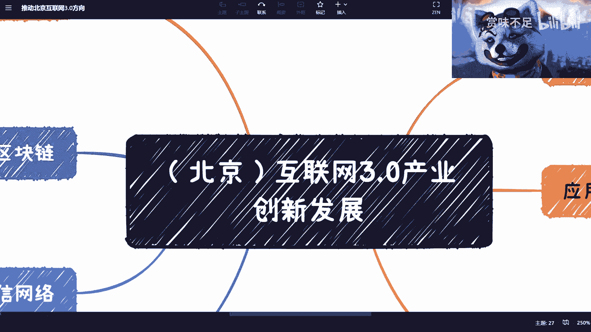

对那他们说那个我所以我现在发微博都写，我是驴对吧，我是母猪啊，那个首先先说一下啊，就是我不是全职要做up主。

我真的是闲着就是抽这个闲的空的时间。

因为我今天写了一天的那个叫什么商业计划书，就bp，而且大家你们你们也看嘛，这视频对吧，我就录个十分钟，我也不剪辑。

所以说就是花不了多长时间啊，呃然后是这样子的，就是啊就是前两天大概前天吧，应该是发布了这么一个呃，叫做北京的互联网三点，产业创新发展的一个一个一个什么呢，类似于像宏的文件东西啊，你们要是感兴趣呢。

你们到百度啊或者being啊。

或者google上面去搜一下好吧，我就跟你们说一下这个信息。

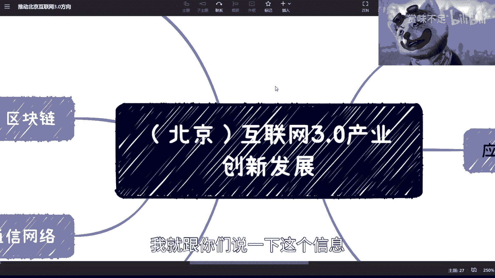

然后呢我稍微给你们总结一下，呃，这个上面因为大家不是也找方向嘛对吧。

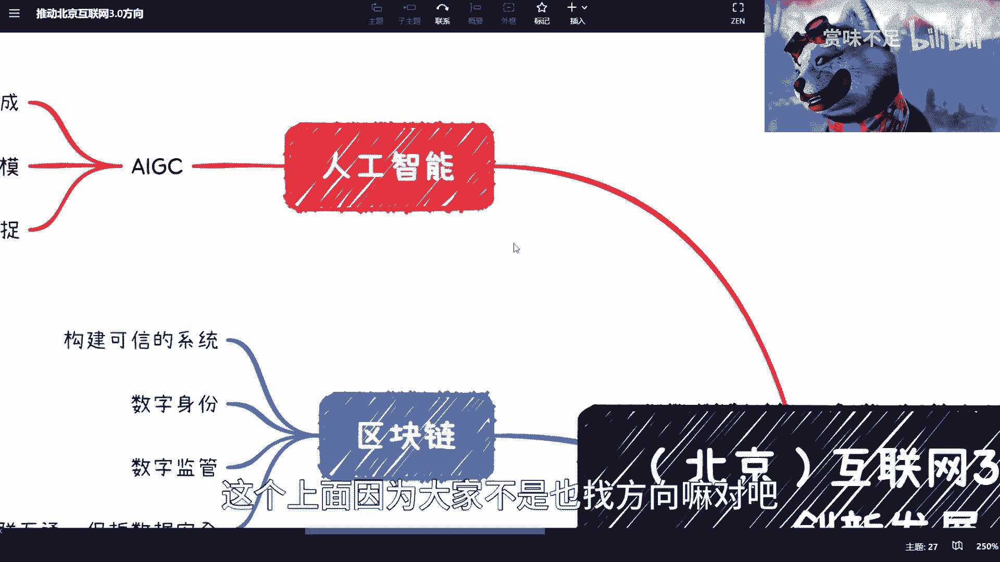

那那我们总归是以政策为主啊是吧，上面写的很清楚啊。

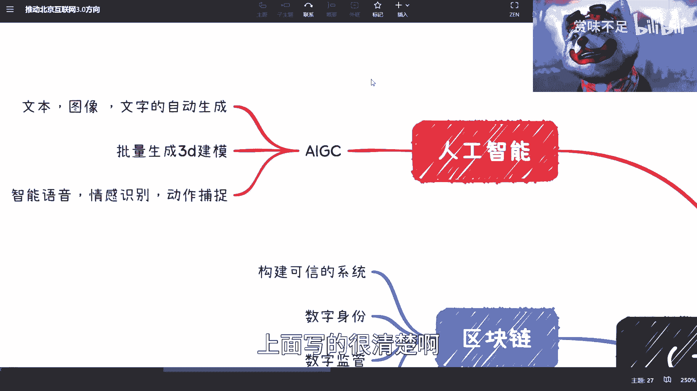

就几块，那当然这个是北京的啊，别的每个地区可能有所不一样啊。

呃但是大家可以先了解一下，第一个呢是人工智能a i g c啊，ai gc这边提了几个，一个是哎，我看看能不能看到那一个是文本图像对吧，文字都能生成，这个就是现在ai那个拆gb t这边。

最近这个大家都在玩的一个对吧，然后批量生成3d建模，这个呢我估计是应该跟那个数字人有关啊，生存有关，或者跟一些就是叫做虚拟形象的文创，或者是可能未来会用到一些娱乐文娱相关的。

然后智能语音情感识别跟动作捕捉，这个是之前就在做的啊，然后这一块也被写进去了，那这个东西可能用的地方就很多，它不仅仅只是那个比如说客服啊对吧，或者是直播啊，或者其他的，就这个东西是一个通用性的一个技术。

那这个呢其实现在呃也的确是个很好的方向，就如果要做的话啊，因为上海这边我是认识两家做的很好很好的，就专门提供给呃抖音和快手那边这个直播的，然后提供给他们一套捕捉加硬件软硬件，然后他们也专门做，就工业呃。

那个怎么说，就是工业级别的那个产品啊，那就很不一样了。

那这是一块，然后那个第二块就是区块链啊。

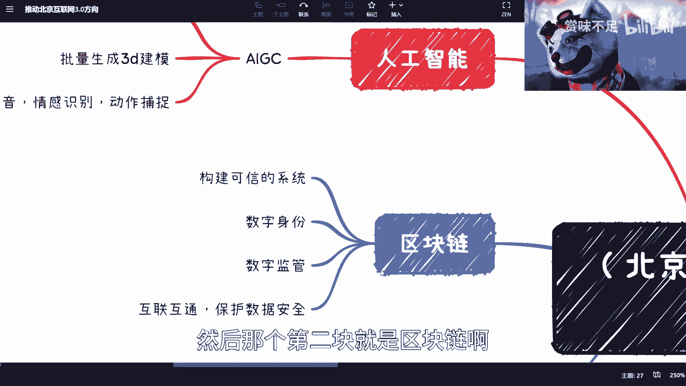

然后区块链终于对吧，又又又上榜了啊，呃跟我前两天其实说的差不多，一个是构建可信系统，数字身份啊，数字监管，互联互通，保护数据安全，这个基本上啊跟我就是上一期给你们讲的那个。

数字经济的整个大方向是完全一致的哦。

说完全一致的，所以说在这点上面，我觉得我还是把得很准啊。

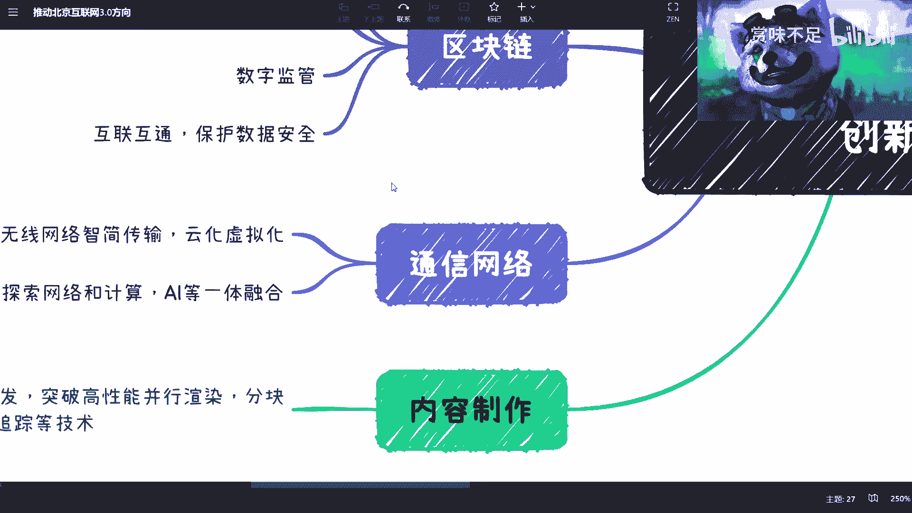

然后是通信网络，通信网络这边也提了，就是说无线网络质检传输对吧，云化虚拟化，还有探索网络技术a i等融合一体呃，通信说实话呢就是这么多年都在讲，但是唉反正对吧。

但大家也懂，我这不方便多说，但是方向没问题啊，方向没问题，但是这个做的呢，反正就是有点温水煮青蛙的感觉啊，然后内容制作呢我们能够看到就支持3d对吧，渲染引擎开发，这个可能这个你对吧，这个很很多了。

3d引擎开发用的很多地方，你比如我以前说的元宇宙也要用对吧，包括以后的那个这个web三点，他们会认为就是从政府角度来讲，会认为有很多的就是虚拟空间啊对吧，或者a r v r对吧，那其实用的也会比较多。

然后是那个你既然要用这个3d渲染，那么就一定会涉及到就是高性能，高并发对吧，然后实时渲染对吧等等等这么一些。

那这个就全部放在这个渲染角度了，嗯然后的话是这个这个老生常谈对吧。

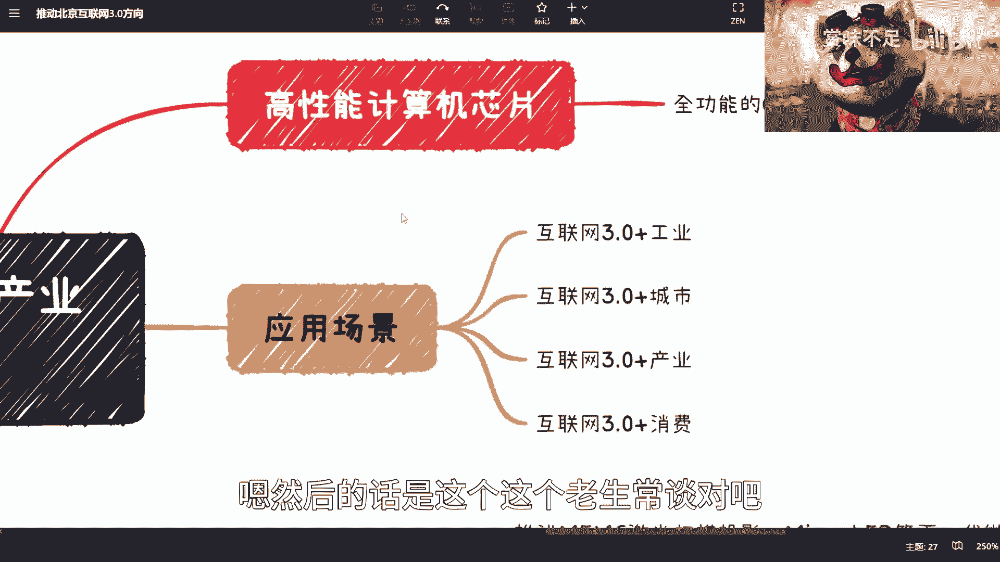

这个我觉得就不说了，老生常谈这个东西，哎有有有有有有待时间吧，有待时间吧，啊然后是xr终端，我估计这个东西呢其实，我刚刚看了一下啊，就是说这个和这个我估计啊就是micro micro l e d。

和这个叫做啊，高鲁棒性的这个油量弯追踪系统对吧，环境3d重建技术升级，这个感觉像还是赋能工业的，或者说赋能在呃，就城市化对吧，高校啊，工业工业制造啊，可能相关的哦，但这个我也不了解，我只是猜测啊。

然后这个我倒是很感兴趣，就是研发基于ai的低代码开发软件，哎我跟你们说啊，这一块写在里面，我说实话我是比较惊讶的哦，我是比较惊讶的这块嗯，怎么说呢，就是我觉得倒不是说，一定会跟这个大家的工作有关吧。

但是应该会大大增加单人，单个人的这种这个单兵作战能力，那其实很多时候，理论上可能某一个岗位就不需要这么多人啊，这个其实也是变相的是个那当然这是个利好了，但对于大家这个找工作来讲可能是有点对吧。

但是你们可以去学啊对吧，你说啊我我可能会这个工具对吧，会这个软件，那你们就有一定的竞争力嘛，啊然后你看啊，降低这个互联网三点的这个内容制作门槛，呃这个呢在文件里面写的很清楚，就是他是希望开放给c端的啊。

就是我们叫的u u g c啊，呃u g c这个。

但这个我觉得可能还还早了一点啊，还早了一点，然后其中也提到了应用场景。

应用场景就四块啊，互联网三点分别是工业城市产业消费，你们感兴趣的你们可以详细去看一下哦，但是我反正大概看了一下，那我觉得就是大家主要啊。

因为我跟大家解释分析一下我的理解啊，反正就是整个方向上面来讲呢。

大家去看一下最新的方向，因为这个我觉得网上不是大家都不是很清楚，现在到底是注重什么啊对吧，哪些方向好嘛对吧，那么这个文件这个官方程度和这个叫什么，严谨程度总比我强吧对吧，你们可以去看一下，这是第一点。

第二点呢我觉得你们也不用太认真，因为什么呢，因为呃对吧，第一它是一个城市，就是局限在北京的这么一个东西，那别的城市也不一定对吧，这是第一点，第二点呢就是说呃应用场景。

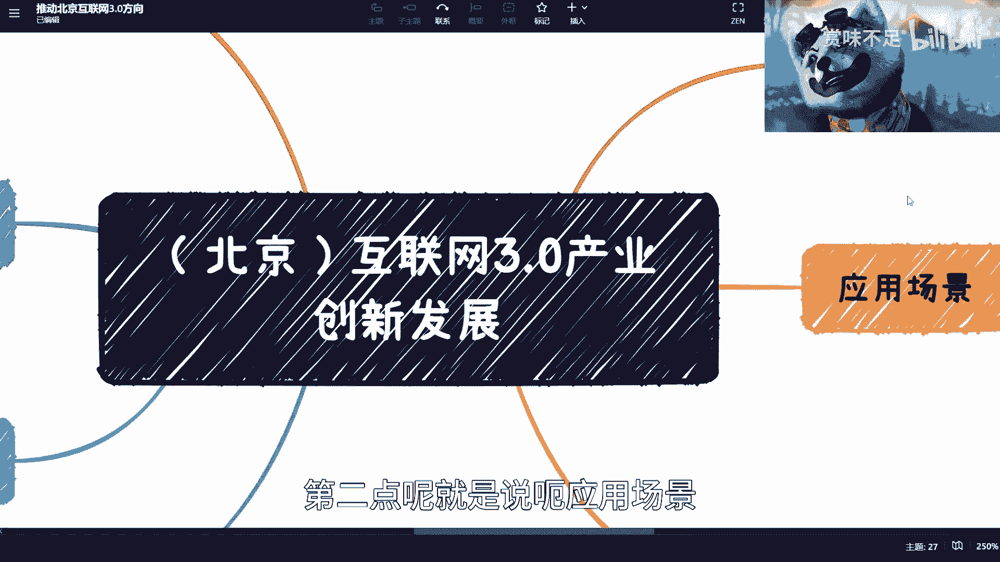

你们这个去看它的详细内容，因为我没有写出来，为什么呢，是因为我觉得他写的这些内容呢，还有有一部分还是拍脑袋的啊，还要拍脑袋来拍膝盖也有可能啊，但是呃也有一定的方向啊，但是就是说可能当下来讲呢。

就是我我觉得这个也就是个影子啊。

这就是个引子，就是说这个东西呢其实为的目的。

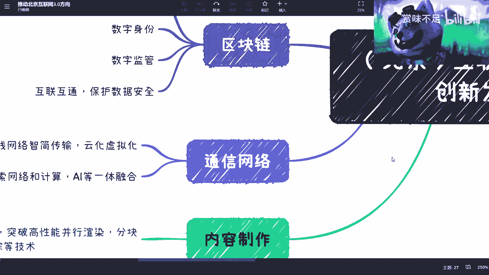

并不是说一定要把这些场景啊，就是按照文件上一定做出来，不一定，但更多的还是需要把这些基础设施做掉。

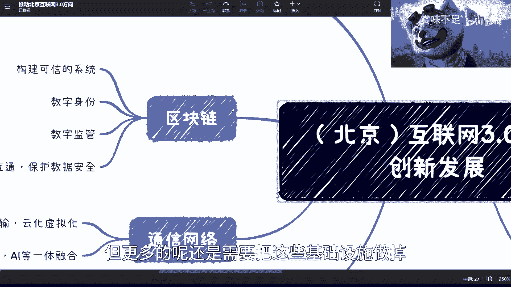

因为相对来讲你看嘛a i g c也好。

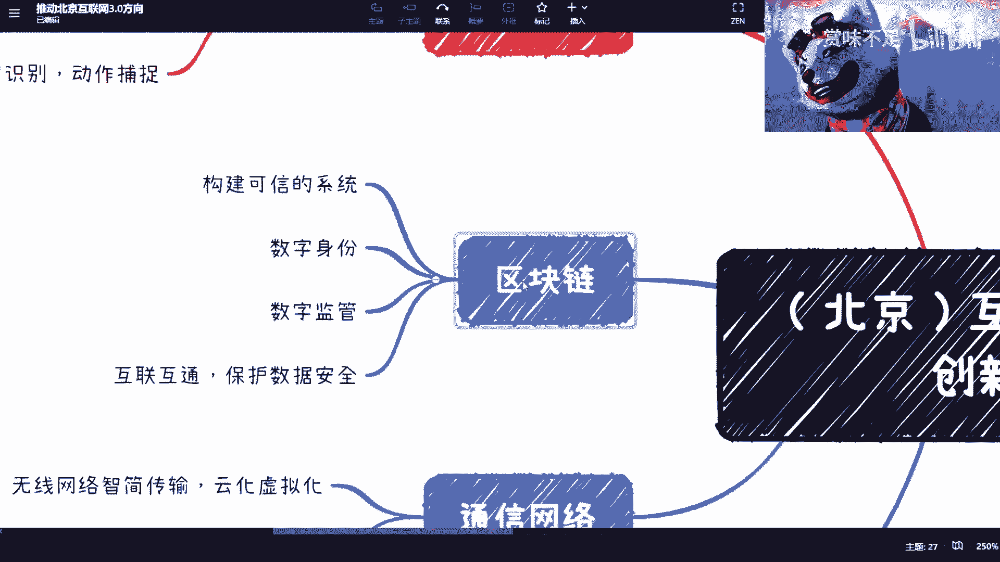

区块链也好对吧，通信也好，内容制作也好，那个高线的新品也好，其实这些作为作为最终应用前提的基础设施。

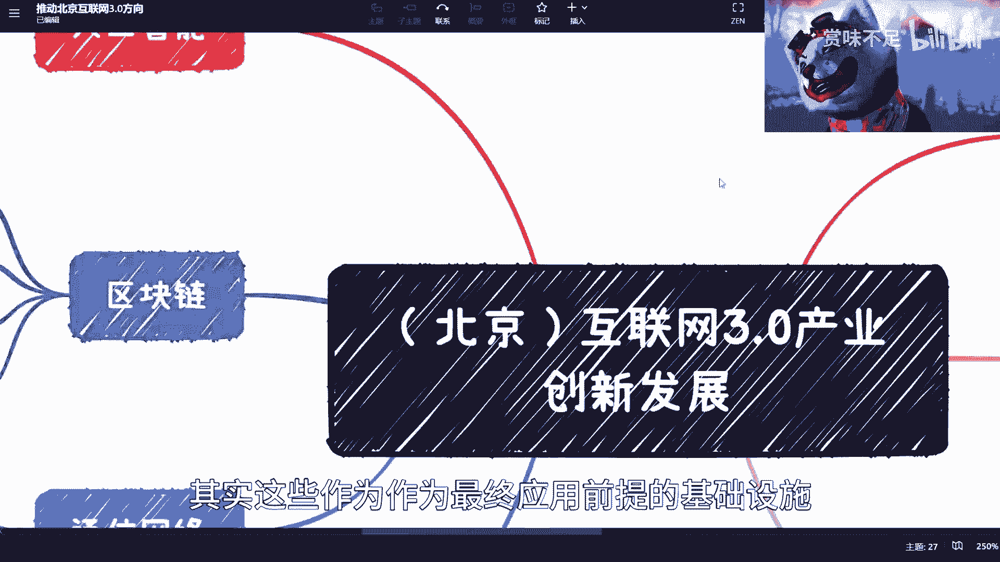

其实还没有完善啊，还有很多很多需要进步的地方。

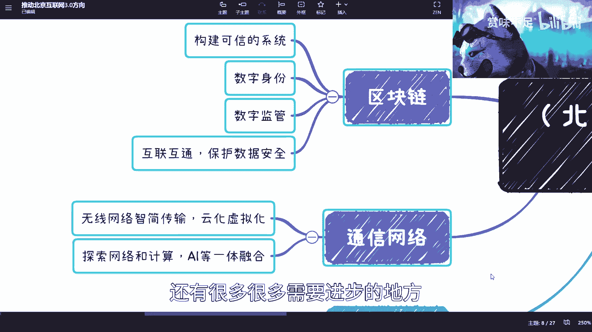

你就拿这四个这个东西我熟嘛对吧，那1234这四个我可以，就这现在都没什么进展啊，啊就就怎么说呢，0~0点五吧啊对吧，然后0。5到一，然后1~99对吧。

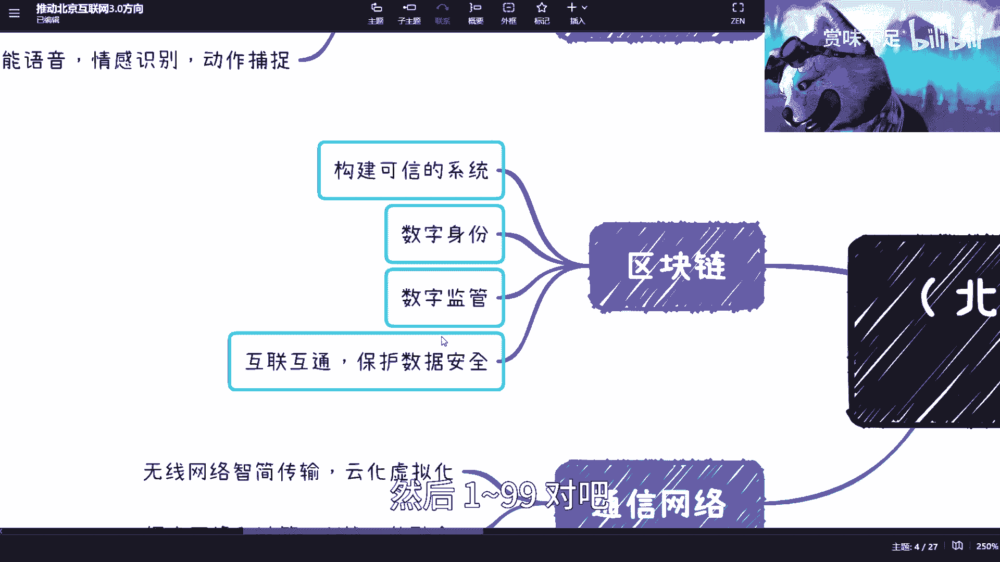

那那这个还有一段时间呢啊还有一段时间呢啊，但是不管怎么样啊。

就是你们会看到，就是首先呢呃国家从整个文件上面呢，有一点就告诉大家来，ok啊，互联网以前的世界过去了啊。

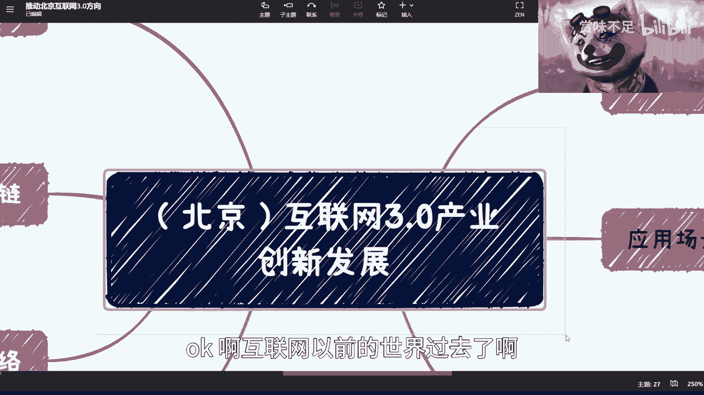

咱们要说互联网三点了，那当然了，三点是啥，咱也不知道对吧，不用管它啊。

但是不管怎么样呢，这里面告诉我们了，其实整体啊就是说啊ai啊。

区块链啊，通信啊，内容啊对吧，包括芯片啊，呃全部是要赋能的，因为最终其实都是要赋能的，他并没有单纯的去提某些技术啊，要赋能，而且呢就是啊要整个要做到数字。

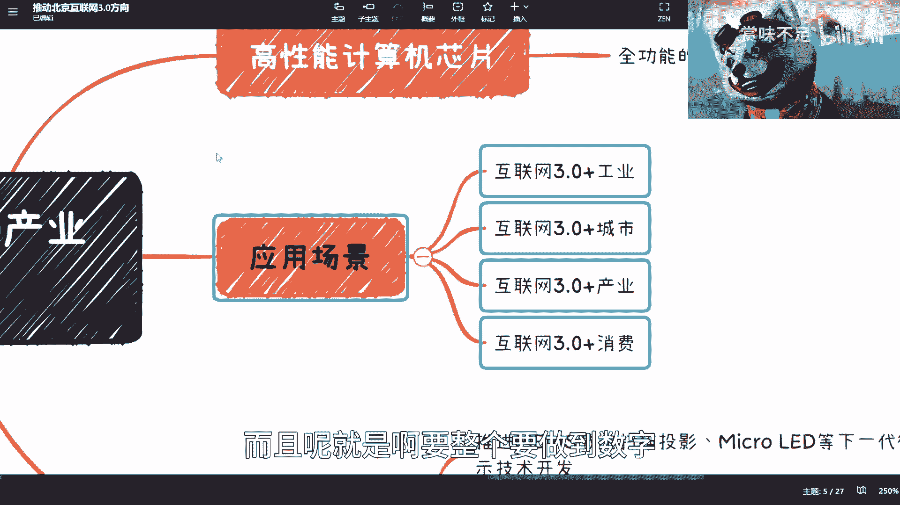

叫做数字经济的这个闭环啊，所以就是我觉得嗯就给大家那个吧。

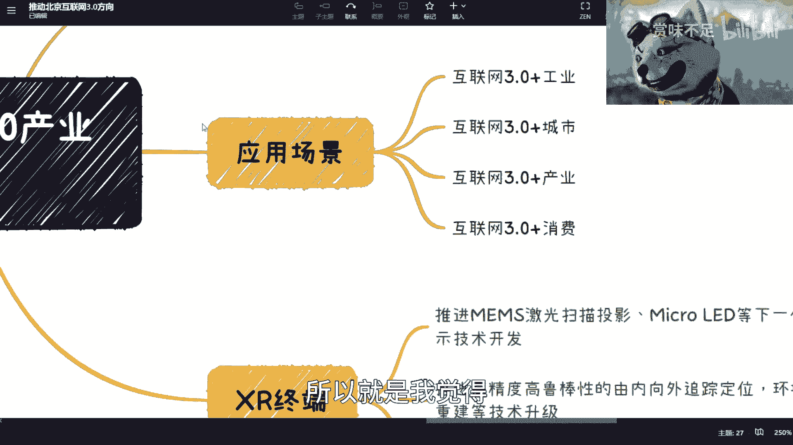

给大家提供一个最新的消息吧好吧，然后回头要是有什么消息吗，反正我也会做出来，这个大家懒得看吗，就就看我视频也行好吧，对你们结束。

