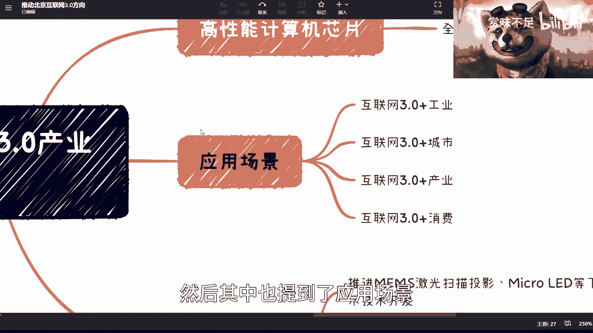

# -北京-互联网3-0产业创新发展方案---P1---赏味不足---BV1wx4y1N7VW

在本节课中，我们将一起学习并解读北京市近期发布的《互联网3.0产业创新发展方案》。这份文件为我们揭示了未来一段时间内，政府层面关注和推动的关键技术方向与应用场景。我们将逐一梳理其中的核心内容，帮助初学者理解政策导向，并思考其可能带来的机遇。

## 方案背景与获取方式

该方案是北京市发布的一份关于互联网3.0产业发展的宏观指导文件。它明确了未来技术发展的重点领域。

如果你对原文感兴趣，可以通过百度、必应或谷歌等搜索引擎，搜索“北京 互联网3.0 产业创新发展方案”来获取完整文件内容。

## 核心技术与方向解读

上一节我们介绍了方案的背景，本节中我们来看看方案中具体提及了哪些核心技术方向。文件主要明确了以下几个重点领域。

以下是方案中列出的关键技术方向：

1.  **人工智能与内容生成（AIGC）**
    *   **文本与图像生成**：类似于当前热门的ChatGPT等技术，能够根据文字描述自动生成文本或图像。
    *   **批量3D建模生成**：可能与数字人、虚拟形象创作相关，应用于文娱、文创等领域。
    *   **智能语音、情感识别与动作捕捉**：这是一项通用技术，不仅用于客服、直播，在工业级产品中也有广泛应用。例如，已有公司为抖音、快手等平台提供专业的动作捕捉软硬件解决方案。

2.  **区块链技术**
    *   重点在于**构建可信系统**，具体应用包括数字身份、数字监管、互联互通以及数据安全保护。这一方向与数字经济发展的整体大方向完全一致。

3.  **通信网络**
    *   强调**无线网络、质保传输、云化虚拟化**，并探索与人工智能（AI）等技术的融合。通信技术是长期发展的基础，方向明确，但进展需要持续观察。

4.  **内容制作**
    *   支持**3D渲染引擎**的开发。这在元宇宙、Web3.0的虚拟空间以及AR/VR应用中都是核心需求，涉及高性能、高并发和实时渲染等技术挑战。

5.  **XR终端与新型显示**
    *   涉及**Micro LED**、高鲁棒性的交互追踪系统以及环境3D重建技术。这些技术很可能主要服务于工业制造、城市化和高校科研等B端（企业端）场景。

6.  **低代码/无代码开发工具**
    *   提出研发**基于AI的低代码开发软件**，旨在降低互联网3.0内容制作的门槛，甚至向C端（用户端）和UGC（用户生成内容）开放。这可能会提升个人开发效率，但也可能对传统岗位结构产生影响。

## 主要应用场景

在了解了技术基础之后，我们来看看这些技术计划在哪些领域落地。方案中指出了四个主要的应用方向。

以下是文件规划的核心应用场景：

*   **工业**
*   **城市**
*   **文化**
*   **消费**

你可以通过查阅文件原文来了解每个场景下的具体规划细节。

## 分析与个人见解

基于以上内容，我们可以进行一些总结和分析。

首先，这份文件为关注行业动态的人提供了一个清晰的官方风向标，指明了当前重点发展的技术领域，其权威性值得参考。

其次，也需要理性看待。第一，这是北京市的地方性方案，其他地区的侧重点可能有所不同。第二，部分应用场景的规划可能尚在探索阶段。文件更重要的价值在于引导和推动**基础设施**的建设。

目前，无论是AIGC、区块链、通信网络还是内容制作，这些作为应用基石的技术本身都还处于不断发展与完善的阶段，从技术成熟到大规模商业应用还有很长的路要走。

最后，文件传递出一个明确信号：互联网发展进入了新阶段（即所谓的“互联网3.0”）。其核心逻辑是，以**人工智能（AI）、区块链、通信、内容制作、芯片**等技术为工具，全面赋能工业、城市、文化和消费等领域，最终目标是构建完整的**数字经济闭环**。

## 课程总结

本节课中，我们一起学习了《北京市互联网3.0产业创新发展方案》的核心内容。我们梳理了其重点关注的六大技术方向：AIGC、区块链、通信网络、内容制作、XR终端和低代码工具，以及工业、城市、文化、消费四大应用场景。

总的来说，这份方案为我们描绘了未来技术赋能实体经济的蓝图。对于初学者而言，关注这些政策导向的技术领域，有助于把握学习和发展的大方向。技术设施的建设是长期过程，保持关注并持续学习，才能更好地迎接未来的机遇。