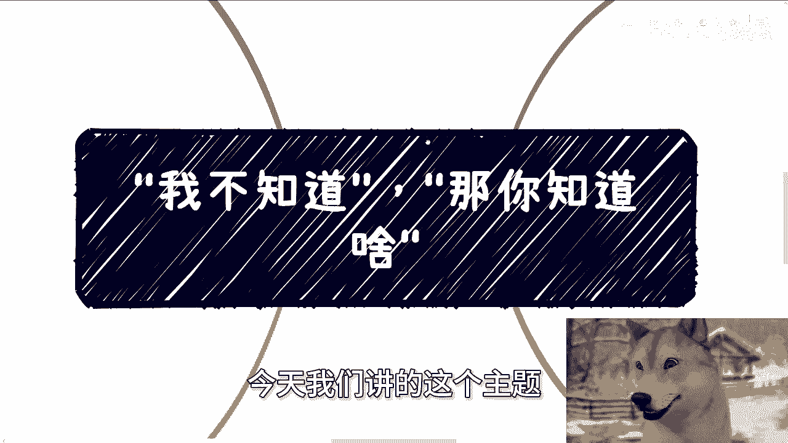
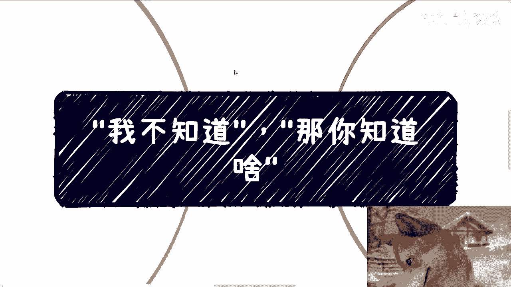
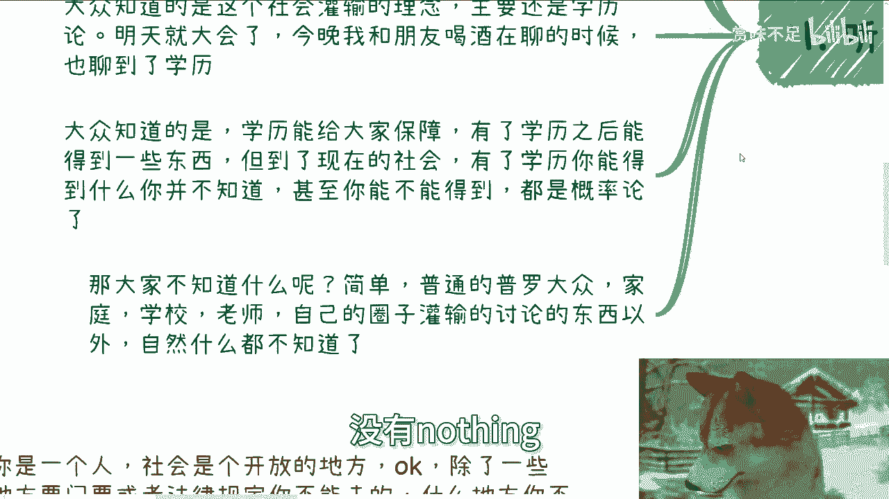
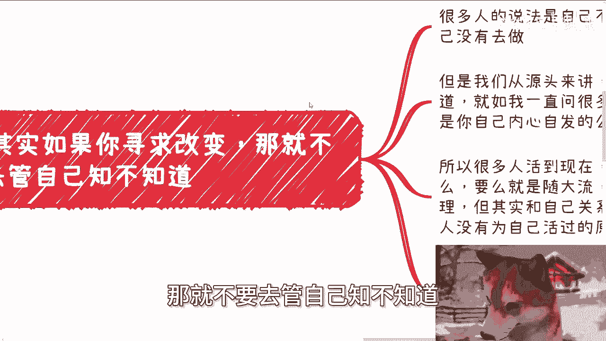
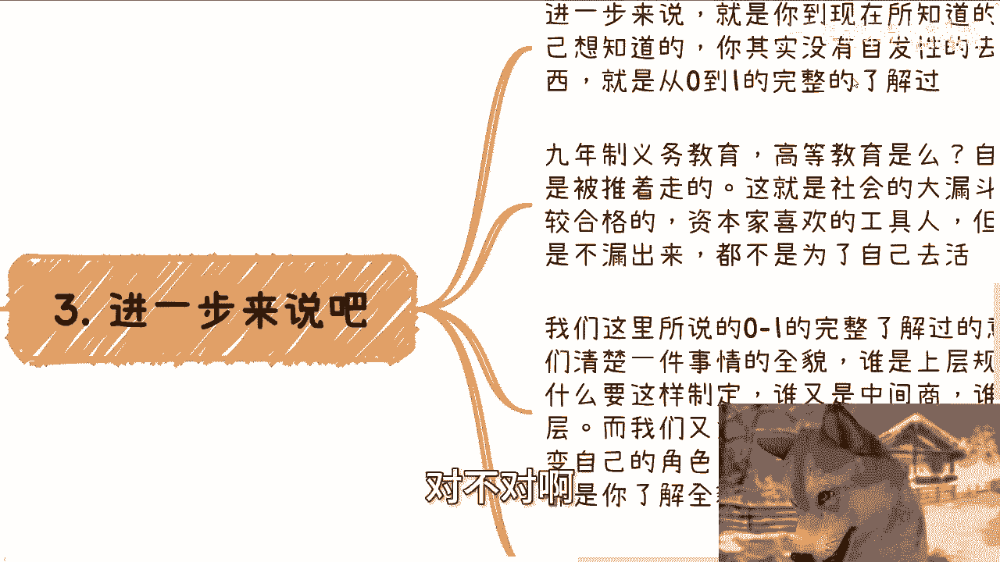
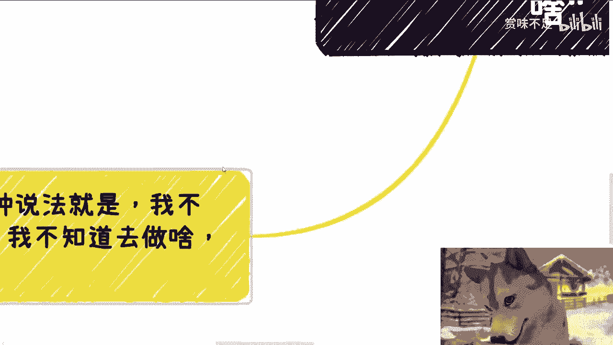

# ”我不知道”，“那你知道啥？” - P1 - 赏味不足 - BV13Zpte7E82

好啊大家好啊，这个明天就大会了啊，我刚刚喝完酒回来啊，嗯众所周知啊，这个喝酒还是有作用的啊，因为毕竟酒后吐真言对吧，那我觉得相比以前的内容可能更真一点啊。

那最近呢充电视频的频率，大家会看到也变高了啊，同时我讲的内容可能也会有所变化，为什么啊，因为我觉得也时间也差不多了，也没啥好遮遮掩掩掩掩的了对吧，就是该直击本质的，叫直击本质了，嗯没什么好再绕的啊。

所以说我觉得大家如果想要有寻求改变，或者说想要有些变化，本质上还是需要就是对一些呃，怎么说呢，内核得要有了解。

你对内核没有了解，我觉得大家的驱动力是不够的啊，今天我们讲的这个主题。

你看两个双引号对吧，就是这是一段对话，就往往别人会跟我说，陈老师我不知道，那我就会问他，那他妈你知道什么，对不对。

好我们来展开来说，首先其实就是我们刚刚说的，他说陈老师这个事，因为我不知道啊，所以呢我啊巴拉巴拉巴拉巴拉，反正一大堆啊，那仔细想想看，其实对于大部分我们所口中的普通人来讲，不知道是常态，对吧啊。

这没毛病啊，好那么说白了我很清楚大家不知道是什么，我也很清楚大家知道些什么对吧，为什么，因为我是一个旁观者，或者说我是一个把整个经历都经历过一遍的人，我自然很清楚对吧。

不管是金字塔下面还是上面的整个过程，我都很清楚，那大众知道的是什么，大众知道的就是这个社会灌输的理念，主要就是学历论对吧，这就是大众知道的，不要他妈的讲那些有的没的。

说白了所有所有的普通人只知道这个事情，他还知道什么，知道个屁对吧，他还知道就是媒体灌输的，他妈吹牛逼，接下来对吧，好那么我们就说明天就开会了，今晚我跟我朋友喝酒的时候也聊到了雪莉，大众知道是什么。

大众知道的是学历能给自己保障，有了学历之后能够得到一些东西对吧，但到了今天的2024年的社会，有了学历，你能得到什么，说实话你并不知道你心里有底吗，你没有底，你只能知道的是我可能能得到什么，对不对。

所以说现在的学历已经变成了叫做叫做什么，叫做概率论对吧，也就是说你有能够一定推出是推出什么吗，不能，那么大家不知道点什么呢，很简单啊，所有的普罗大众除家庭学校老师自己的圈子，从小到大的灌输讨论东西以外。

什么都不知道对吧，还知道能知道什么，知道的就是学历论，知道的就是就是啊亲戚借钱，知道的就是家长里短对吧，知道的就是大家有相互的攀比对吧，知道的就是说啊，这个世界上有所谓的政府，有所谓的领导。

有所谓的富二，富二代，剩下所有东西都是外面所道听途说的，没了没了，有哪些东西是自己经历过的吗，没有nothing。

这就是大家知道的对吧，嗯好第二。

其实如果你要寻求改变，那就不要去管自己。

知不知道为什么有很多人说法说自己不知道，所以自己没有行动，自己不知道怎么去做，对吧好，这个后面我们会来讲的啊，但是我们先从源头来讲，你知道啥，你知道傻对不对，其实你啥都不知道。

你就如果如我一直问很多人的，你读书是你想读的吗，你知道吗，你不知道你寻求学历是你想寻求吗，你不知道你找工作是你自己内心，发自内心想找吗，可能吗，啊妈谁信啊，对不对，也许14亿人或者全球的人里面。

有一定比例的人，他他妈生下来，刚生下来一秒钟，他内心就有个信仰，就他妈老子要读书，老子要求学历，老子要找工作，也许他他妈上辈子记忆没有清干净，对不对，但是正常人你告诉我哪个人发自内心有吗，不好意思。

我不认为有对不对，所以很多人活到现在，本质上他就是没有自发性的做过什么，你们仔细想想看对吧，大部分人做事情是什么，要么就是随大流，要么就是貌似追求一个学校老师，家庭给自己的一个真理。

但是无论是前者还是后者，其实他妈的跟你们自己没什么关系，有什么关系啊，有关系吗对吧，这也是我为什么说很多人，他没有为自己活过的原因，所以说如果你真的想寻求改变你，那么你需要的就是把你真正的自己。

迈出自己想迈的那一步，而不是说自己不知道去思考了啊，那就是说你要这么说吧，而不是说用自己不知道这个借口再去说服自己。

那他妈还是自己不想寻求改变，对吧啊，当然我这地方也提一点，寻求也好，不寻求也好，无所谓，都是人，都是一辈子，没啥对和不对的，我一直这么说对吧，对跟不对，只有每个人自己去想的，所以说你就像我一直跟你们讲。

我只是阐述我的观点，你爱认可那是你的事情，你不爱认可，那也是你的事情，关我事，对不对啊，第三进一步来讲啊。

你想啊，我们进一步来讲，就是你现在所知道的一切，并不是你自己想知道的，对不对，因为你现在所知道的一切其实都是你，就像我们刚刚说的，你随大流，要么就是追求个真理，你所学到的。

那其实你并没有自发性的去了解过一个东西，也就是从0~1完整的了解过，那么我们几乎就可以推出来，你们对任何一件事情都是没有0~1的了解的，因为你们的了解都不是自发性的对吧，9年制义务教育。

根等高等教育是你们想的吗，不是是你们被迫的，所以大家都是被推着走的，这个这本来就是社会的一个大漏斗，漏漏出来的是资本家认为比较合格的，比较喜欢的工具人，但无论你露出来还是不露出来，都不是为了自己去火。

你想想看是不是对吧，我们这里所说的0~1的，完整了解过的意思是什么，就是我们自发性的，发自内心的去搞清楚一件事情的全貌，谁是上层的规定的制定者，为什么要这么制定，谁又是中间的合作方，中间商。

谁又是底层的执行层，而我们自己如果在这里面已经是，比如说整个链路当中的一份子对吧，那我们又为什么要去做现在这些事情，我们能不能改变自己的角色，我们有没有别的选择。

其实这些答案都是你了解全貌之后才能知道的，对吧哦但是我们随便想想看啊，你说我今天活在世界上有哪件事情你跟我说哦，我们必须要去做，不做他妈我就得死有吗啊不做，我明天太阳升不起来了有吗。

哦还有就是说我不可能改变我自己角色，我他妈角色我生出来就定了有吗，定死了有吗，有多少事情是这样子的对吧，然后然后你还说啊，我我们这个普通人没有没有别的选择，什么选择都没有有吗，有这种说法吗。

没有不存在的，你所知道这种说法只不过是人云亦亦云对吧。

那问题来了，你知你就像我们刚说的，0~1的完整的这么一个东西，你知问题来了，你知道吗，我不说单纯的教育机制，所有别的机制你知道吗，你知道啥，对不对啊，第四来五来文文五来啊，第四最常见的一种说法是什么。

就是我不知道该怎么做。

我不知道是做什么，以及不知道从什么地方做，哎我跟你讲，这就很奇怪，哎你我们哎我就像我说的，怕怕什么，怕就怕摆事实，讲道理对吧，好我们打打个比方啊，你是一个人对吧，你是个正常人啊，正常人啊。

思维正常的智商，正常的对吧，好社会是不是一个开放的地方，OK除了一些地方要门票，除了一些地方法律规定你可能不能去啊，就是明令禁止，你不能去，那我就问什么地方，你不能去，剩下什么地方，你不能去诶。

谁谁拦着你了，谁他妈用刀架架在你脖子上，有不啦，诶我也很奇怪呀，对不对，哎你们难道不觉得一个20多岁的人，30多岁的人，甚至40多岁的人，他跟我说，就是他自己压根就没有接触过这个社会，哪怕就说一丝。

他都没接触过，剩下的只有害怕，只有未知，只有恐惧，你不觉得从我角度看，这他妈才是真正的恐怖片吗，啊哎奇了怪了，哎，你知道吗，他们竟然会问我，他说哎陈老师，我不知道该怎么做。

我不知道应该哪到哪边去了解哪些地方，你不能了解了哪个地方，你告诉我，你不能去了去了，怎么地违法啦，去了他妈怎么地坐牢啦，啊去了他妈赔钱了，哎我就很奇怪对吧，那按照这个说法，我就很奇怪，你们做数学题。

做阅读理解，做数理化的时候，你们一开始就懂了，不是吧，对不对，你一开始就了解嘛，也不是吧对吧，那肯定不是吧，那我们想想看，为什么我们还要去学，为什么我们当时不恐惧，为什么我们还会去接触这些东西。

事实上啊，大家所有的人并不是不恐惧，其实我们面对数理化，面对那些不懂的东西，心里都是一样的，区别是在于我们从小被灌输了，你只能做这些事情，你没有别的选择，而你之所以会去学，是因为你你没得学。

你是被迫的对吧，而你想想看啊，你别的你你要这么想，所以说你被灌输的事只能做这些别的，但是问题在哪里，问题是别的东西不是做不了，而是不知道对吧啊，然后被灌输的时候，你你的不知道，基本上就对你来讲。

或者对普罗大众来讲，不知道就代表着做不了，为什么，因为你是个普通人，好这个逻辑就这么走出来的对吧，但是你仔细想看这个逻辑成立吗，哦我不知道的东西多了，那我不知道就代表我做不了，哎我他妈奇了怪了对吧。

或者说我我不知道东西代表我了解不了，你不觉得这才是恐怖片吗。

对吧，所以说我才一直跟你们讲，就是说工作归工作呃，了解归了解哦，社会归社会，就像我前两年给他举了一个例子，我说你今天就算稳定的，我们随便说啊，比如说你今天就算稳定的在字节，在百度。

甚至在MICROSOFT，在google对吧，你稳定做了10年，我就这么说，你稳定做了10年，10年后，我比如说你是个硕士毕业或者博士毕业，maybe啊，Maybe。

也许你是一个很牛逼的engineer，就很牛逼的工程师，也许你是一个很牛逼的，怎么说呢，就是公司里面啊，MANAG也拥有很强management的管理能力的这么一个人啊，我不管你是谁。

但是你有没有发现你只要出来到了社会上，你跟一个婴儿是没有区别的，对不对，那么又回到那个问题上面，你知道啥对吧，就有很多人其实每天在那边焦虑的东西也好，或者在那边呃，所所自己关心的问题也好。

就他自己也知道，哎我想赚钱哎，当下情势很难对吧，或者我我想怎么样怎么样，但是你你从根源上面我们来讲你知道些什么，如果来说你有没有想过，如果大众他根源上他其实就不知道很多东西，他在那边一个劲的焦虑。

一个劲的在那边，怎么说呢，就是培训或者一个劲的呃怎么说呢，父亲给别人对吧，或者怎么样子没有意义啊，因为你本源你的根源上面，你甚至什么都不知道，那那就就你你你们有没有看到网上那个图啊。

就是一个人已经病入膏肓了，然后呢就是在他的这个病床面前给他什么啊，什么剁椒牛蛙对吧，呃呃13香小龙虾对吧，各种东西，不好意思啊，我都已经病入膏肓了，你给我这些东西我补不进去啊对吧，鸡汤海参有用吗，拉。

对吧，其实就是说唉，其实就是说你会发现很多人花钱花吗，花了很多人努力努力了吗，努力了，但他根源就不对对吧，就像我们造一个房子，根基就没造，你跟我说好，他妈的，我现在还要付钱啊培训，然后呢，你妈怎么造啊。

是吧，哎呀行啊，那我们就这说这么多吧好吧，然后明天晚上就大会了，我明天一早七点钟就得到会场去布置啊，先这么着吧，反正就是大家要是嗯想了解些什么，或者怎么样子，或者想觉得我可以让我聊聊的。

你们也可以评论或者私信告诉我，好吧啊行，就这么着吧啊，呃职业规划好吧，商业规划啊，就是工作上面啊，包括合同啊，分润啊对吧，就是商副业啊，你们在这里面反正有些什么问题的。

你们可以整理好对应的问题和个人背景好不好。

