# 课程一：从“我不知道”到“你知道什么” 🧠

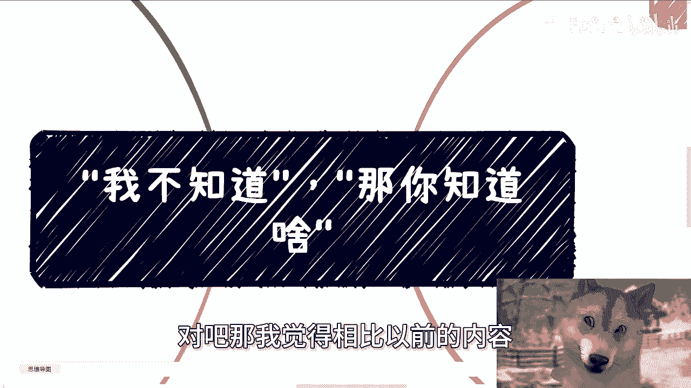

在本节课中，我们将探讨一个常见的思维困境：当人们说“我不知道”时，背后究竟意味着什么。我们将分析大众普遍认知的来源、自发行动的缺失，以及如何打破“不知道”的借口，从而为寻求真正的改变奠定基础。

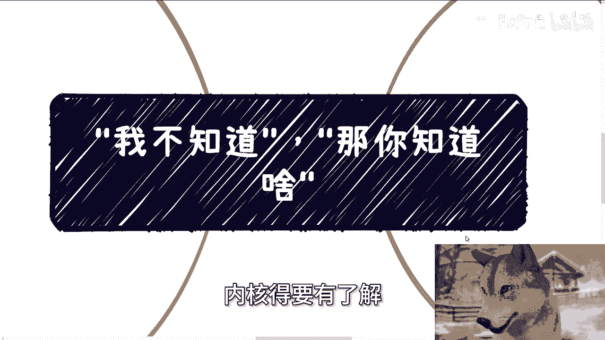

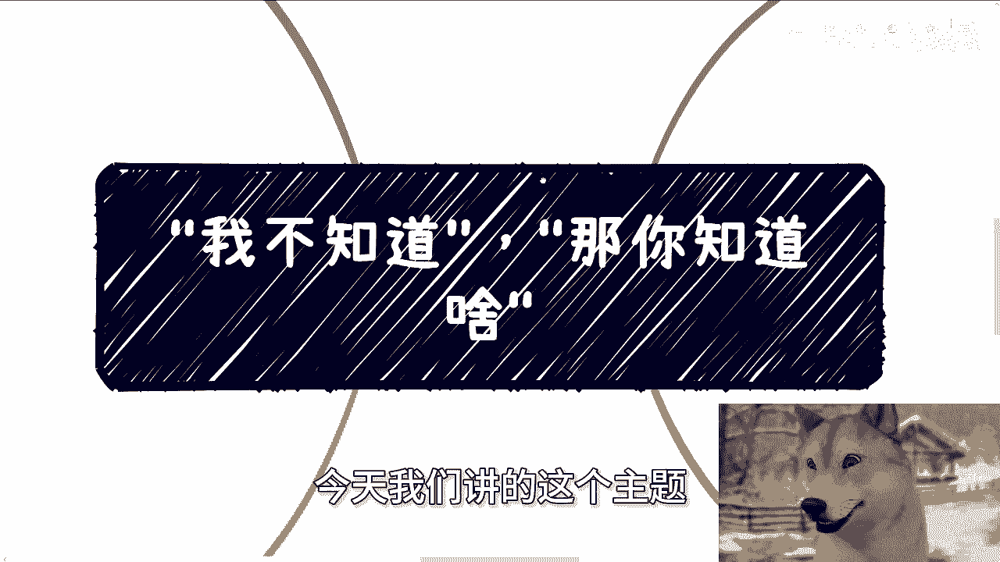

---

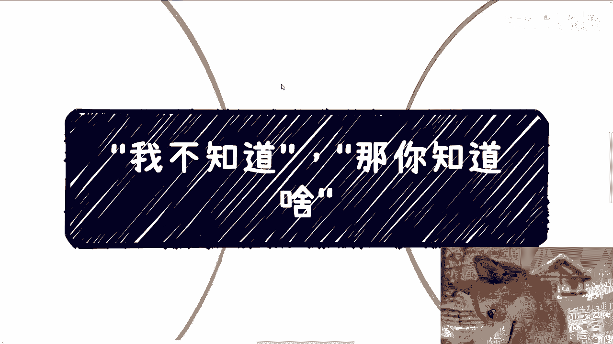

## 1. 大众的“知道”与“不知道” 📚

上一节我们提到了“我不知道”这个普遍说法，本节中我们来看看人们通常“知道”和“不知道”的究竟是什么。

作为经历过社会各个阶段的旁观者，我清楚地看到大众所知道的内容非常有限。社会灌输给大众的核心理念主要是**学历论**，即认为高学历能带来保障和成功。在2024年的今天，学历带来的回报已不再是确定性事件，而更像一个概率事件。

**公式表示**：`高学历 -> 成功` 这个推导关系已不成立，更接近 `高学历 -> P(成功)`，其中P代表概率。

以下是大众通常知道的内容列表：
*   社会灌输的学历论。
*   媒体传播的各种信息。
*   亲戚朋友间的家长里短与人际攀比。
*   关于政府、领导、富二代等概念的道听途说。

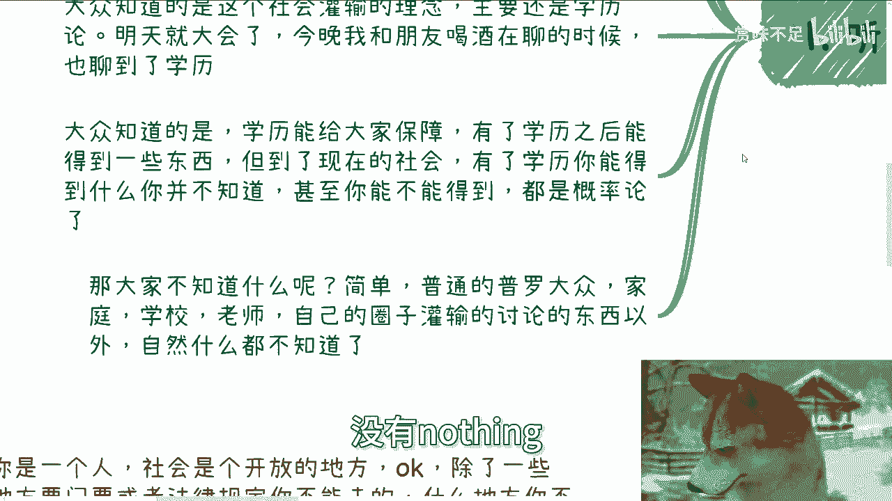

相反，大众不知道的是：
*   除了家庭、学校和自身小圈子灌输的内容外，几乎一无所知。
*   几乎没有基于自身亲身经历和深度探索获得的知识。

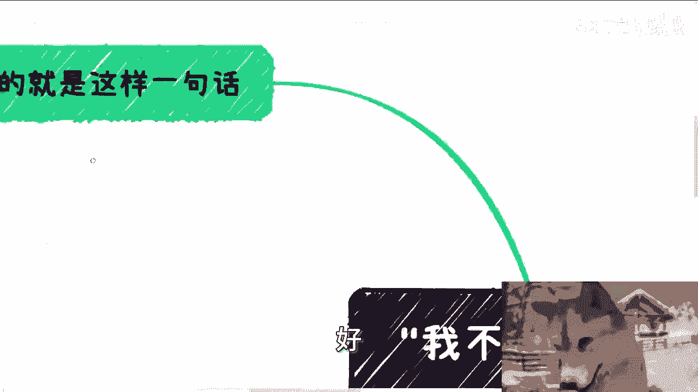

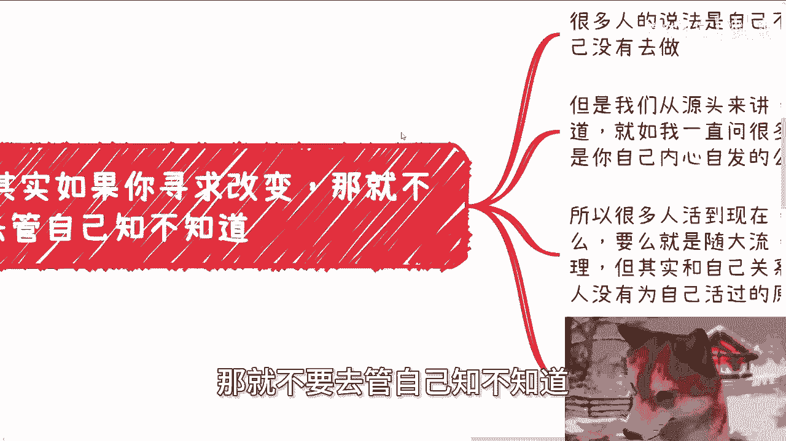

**结论是**：大众的认知范围非常狭窄，且大多并非来自主动探索。

---

## 2. 行动的根源：自发性的缺失 🚶‍♂️

了解了大众的认知状态后，本节我们来看看这如何影响人们的行动。许多人以“不知道”为理由，解释自己为何没有行动或不知如何开始。

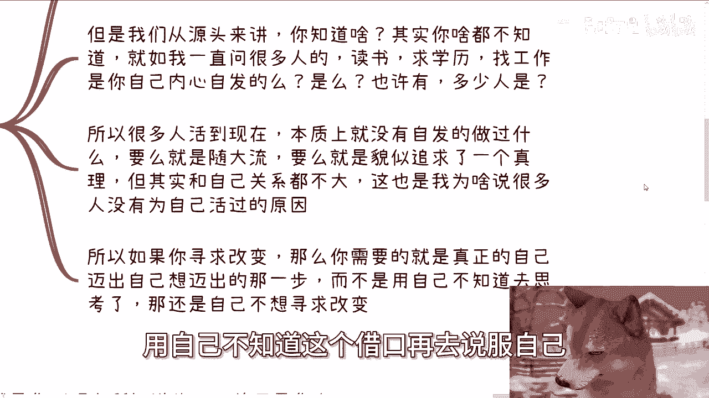

但问题的根源在于，很多人从未自发地做过决定。仔细回想，你读书、求学历、找工作，是内心真正想做的吗？对绝大多数人而言，答案是否定的。人们要么随大流，要么在追求一个被外界定义的“真理”，这些都与真实的自我无关。

因此，很多人并没有真正为自己活过。如果你真心寻求改变，关键不在于用“不知道”作为借口，而在于迈出自己想迈的那一步。是否寻求改变，本身没有对错，这只是个人选择。但必须认识到，“不知道”常常是逃避自我驱动的托词。

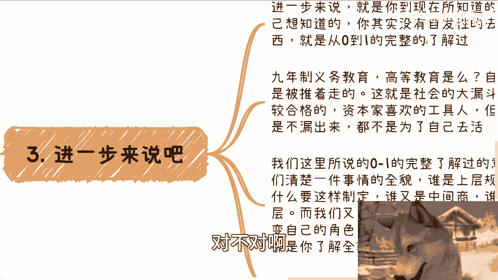

**核心逻辑**：`“不知道” -> 不行动` 这个链条的起点，往往是 `缺乏自发性 -> 不知道`。

---

## 3. 认知的深度：从0到1的了解 🔍

上一节我们指出了自发性行动的缺失，本节中我们进一步探讨这种缺失导致的认知浅薄。你现在所知道的一切，大多不是你自己主动想知道的，而是被动接受的。

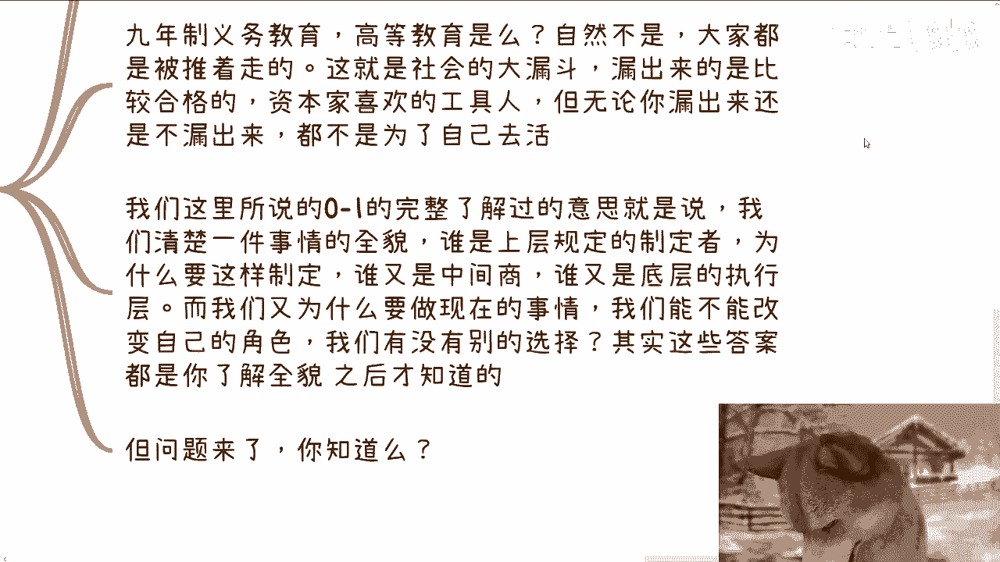

由于缺乏自发性，你对任何事情都缺乏从0到1的完整了解。义务教育乃至高等教育，对大多数人而言是被动的过程，是社会筛选机制的一部分。这导致人们只是被推着走的工具人，而非为了自己而活。

所谓 **“从0到1的完整了解”**，是指自发地、彻底地弄清一件事的全貌：
*   上层的规则制定者是谁？为何如此制定？
*   中层的合作方与中间商扮演什么角色？
*   底层的执行层如何运作？
*   如果自己是链条中的一环，为何在做此事？能否改变角色？是否有其他选择？

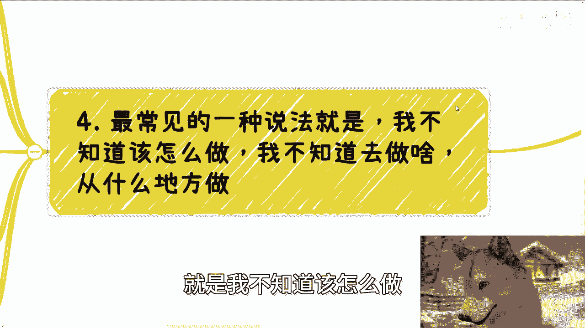

了解全貌后，你才能回答这些问题。世界上很少有“不做就会死”或“角色天生注定”的事情。认为“没有选择”往往只是人云亦云。

**关键问题**：你对教育机制或其他任何社会机制，有过这种从0到1的完整了解吗？

---

## 4. 突破“不知道”的实践之问 🛠️

分析了认知的局限性后，本节我们来解决一个最具体的障碍。最常见的说法是：“我不知道该怎么做，不知道做什么，也不知道从何开始。”

这个说法值得深究。社会本质上是开放的，除了法律明令禁止的场所，哪里不能去？谁在阻止你探索？一个二三十岁甚至更年长的人，声称自己从未真正接触过社会，只剩下恐惧和未知，这本身才是可怕的事情。

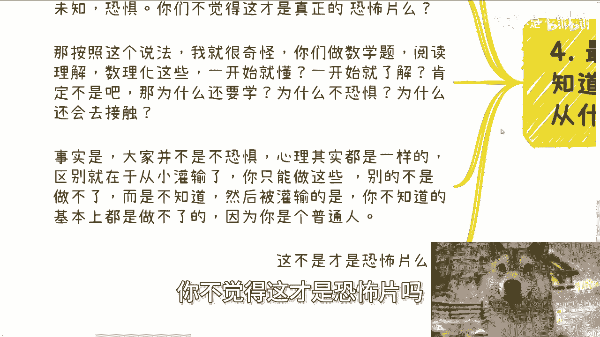

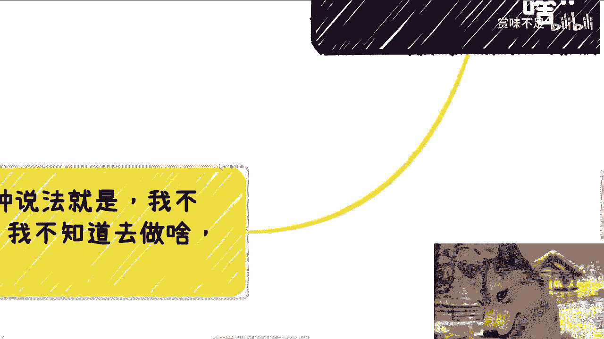

这与学习数理化的情景类似。我们最初也不懂，也会恐惧，但为何最终去学了？因为从小被灌输“你只能做这些，别无选择”。对于其他领域，“不知道”在潜意识里就被等同于“做不了”或“无法了解”。

**代码逻辑类比**：
```python
if 状态 == “不知道”:
    大众普遍反应 = “做不了” # 这是一个错误的逻辑跳转
else:
    行动 = 尝试了解或执行
```

真正的逻辑应该是：`不知道 -> 尝试了解 -> 可能学会`。将“不知道”直接等同于“做不了”，是自我设限的核心。

许多人即使在工作上很成功（例如在大公司做了十年高级工程师或管理者），一旦踏入更广阔的社会领域，认知可能仍如婴儿。如果根源上对世界一无所知，那么表面的焦虑、盲目努力或参加培训，就像给病入膏肓的人喂山珍海味，无法解决根本问题。必须先打好认知的基础。

---

## 总结 📝

本节课我们一起学习了：
1.  **大众认知的局限性**：所知甚少，且多来自被动灌输，如单一的学历论。
2.  **行动乏力的根源**：缺乏自发性，常用“不知道”作为逃避真实选择的借口。
3.  **深度认知的缺失**：对事物缺乏从0到1的、主动的、全景式的了解。
4.  **突破借口的方法**：识别“不知道=做不了”的错误逻辑，社会是开放的，恐惧源于灌输而非事实。真正的改变始于主动探索和建立认知根基。

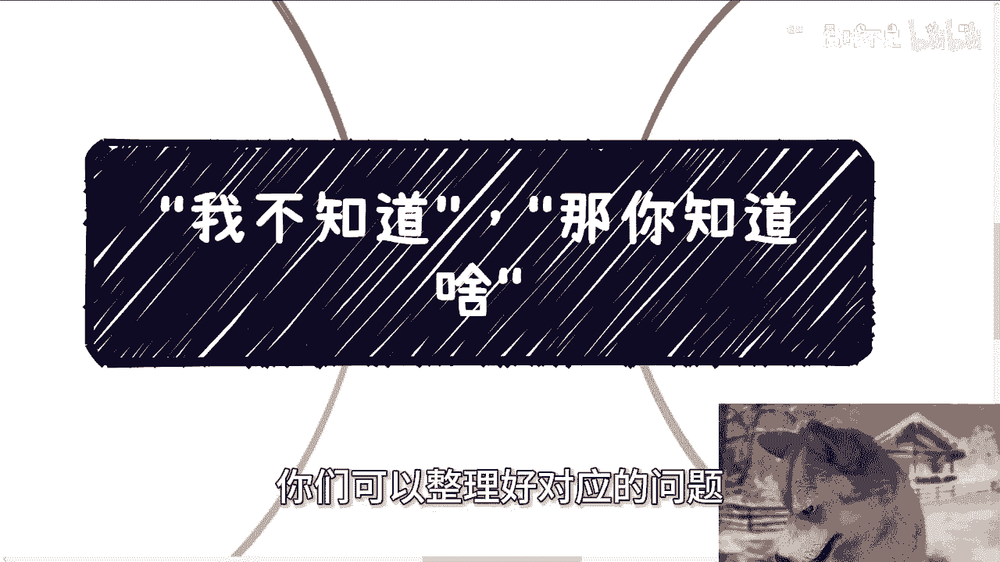

改变始于认清“你知道什么”的真相，并勇敢地向“你不知道”的领域迈出第一步。