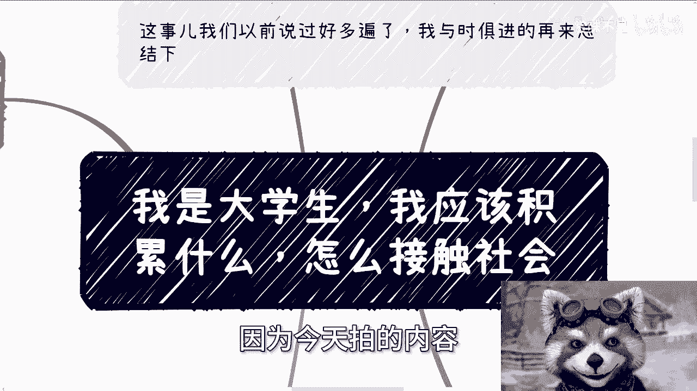

# 课程：大学生如何接触社会 - P1 🎓

在本节课中，我们将探讨一个大学生普遍关心的问题：如何有效地接触和融入社会。我们将摒弃学生身份的自我设限，以成年人的视角，通过一套具体、可操作的步骤，帮助你从零开始建立社会认知、积累人脉并创造价值。

---

## 概述：成年人的第一课

首先需要明确一个核心观点：你首先是一个成年人，其次才是一名学生。社会不会因为你的学生身份而对你区别对待或给予特殊照顾。社会运作的核心是**资源、价值和利益的交换**。因此，摆脱“学生思维”，以成年人的身份和规则去思考和行动，是接触社会的第一步。

---

## 第一步：广撒网，目的是“识人” 🔍

上一节我们明确了身份认知的转变，本节中我们来看看具体行动的第一步。

在与社会完全脱节、认知几乎为零的情况下，首要任务不是急于创造价值，而是进行广泛的学习和观察。这个过程如同大海淘沙，目标是先收集大量的“沙子”——即初步的社会接触和信息。

以下是具体行动建议：

*   **参与各类活动**：无论是行业演讲、线下交流会、展会还是销售讲座，尽可能多地参与。
*   **利用免费资源**：优先选择免费渠道去“蹭”活动，目的是学习和观察。
*   **核心行动准则**：多看、多听、多学，暂时不做价值判断。此时的目标是扩大接触面，积累对各行各业、各类人群的初步印象。

通过这一步，你会在有限的认知里，初步过滤出一批你觉得“可能靠谱”、“可能有机会”的人或机构，这就是你的第一批“沙子”。

---

## 第二步：验证谁是真正的“傻子” 🧪

在收集了初步的“沙子”之后，我们需要进一步筛选。本节的核心是学习如何验证这些初步接触对象的成色。

“沙子”是常态，“金子”是少数。“沙子”并非没有价值，它们是你建立认知的必经过程。验证的方法不是空谈，而是尝试进行浅层或深度的互动与合作探讨，目的是检验对方的思维逻辑和实战能力。

验证过程中的关键操作：

*   **提出具体问题**：针对对方提到的任何合作或项目意向，追问与**变现**和**执行**相关的细节。例如：“这个产品具体如何赚钱？”“客户从哪里来？”“第一步具体做什么？”
*   **警惕模糊承诺**：如果对方回答总是“先做做看”、“试试再说”、“效果好了再分钱”，这通常是缺乏具体规划和诚意的表现，本质可能是想“白嫖”你的劳动或时间。
*   **进行小型实践**：在安全可控的前提下，尝试进行一些小型的合作或任务。真正的合作是检验对方是否靠谱的唯一标准。

**核心公式**：`靠谱程度 = 逻辑清晰度 × 方案具体度 × 过往成果证据`

你需要通过沟通和尝试性合作，过滤掉那些纸上谈兵、逻辑混乱或缺乏诚意的人。记住，在真正一起赚到钱之前，不要给任何人加上“靠谱”的滤镜。

---

## 第三步：筛选出你的“金子” ⭐

经过前两步的大量筛选和验证，我们才有可能找到极少数的“金子”。本节将定义什么是“金子”以及如何对待这种关系。

“金子”是相对的，它的定义是：**有能力、有逻辑、有资源，并且愿意在当下与你合作，并且你们已经通过实践共同创造过价值的人**。

关于“金子”需要理解的重点：

*   **动态变化**：合作关系并非一成不变。今天无法合作的人，未来可能成为你的“金子”，反之亦然。这取决于双方所处的阶段、拥有的资源和时机。
*   **极其稀少**：你需要通过海量的“广撒网”（第一步）和严格的“验证”（第二步），才可能筛选出个位数的“金子”。这是社会的常态，因为优质且匹配的合作资源本就稀缺。
*   **时间窗口**：对于在校生，拥有更多时间去经历这个筛选过程。对于已毕业者，则需要更高效、更紧迫地执行这一流程。

这个过程没有捷径。社会的现实是，大多数人都停留在“沙子”阶段，而少数“金子”在形势严峻时，会更倾向于与已有信任基础或能带来即时价值的伙伴合作，而非花费精力培养新人。

---

## 总结与心态建设 💪

本节课我们一起学习了接触社会的三步法：**广撒网识人、验证筛选、最终锚定金子**。

最后，回到最初的问题：“我应该怎么接触社会？”答案不在任何教程、视频或“贵人”口中，而在于你自身的行动。你需要：

1.  **抛开恐惧与纠结**：学生思维、对未来的过度担忧都是行动的阻碍。社会遵循二八定律，大部分财富和资源集中在少数人手中，这是固有结构。思考这个结构本身无法改变你的位置。
2.  **立刻开始行动**：按照上述步骤，走出校园，开始你的“淘沙”过程。只有通过亲身实践、碰撞、总结，甚至赚到你的第一笔钱，你获得的认知才是真实有效的。
3.  **接受现实并聚焦自身**：不要纠结于“大多数人是否失败”。你的关注点应该是“我如何成为那少数人”。要么想明白就去干，要么就在纠结中随波逐流。

**最终路径**：`接触社会 -> 实践试错 -> 创造价值 -> 获得回报` 这是一个需要你亲自启动并滚动的雪球。

---

**附加提示**：如果你在具体职业规划、项目判断、合作条款等方面需要更个性化的梳理和分析，可以寻求专业的咨询，借助外部视角厘清自身资源、优势与可行路径。