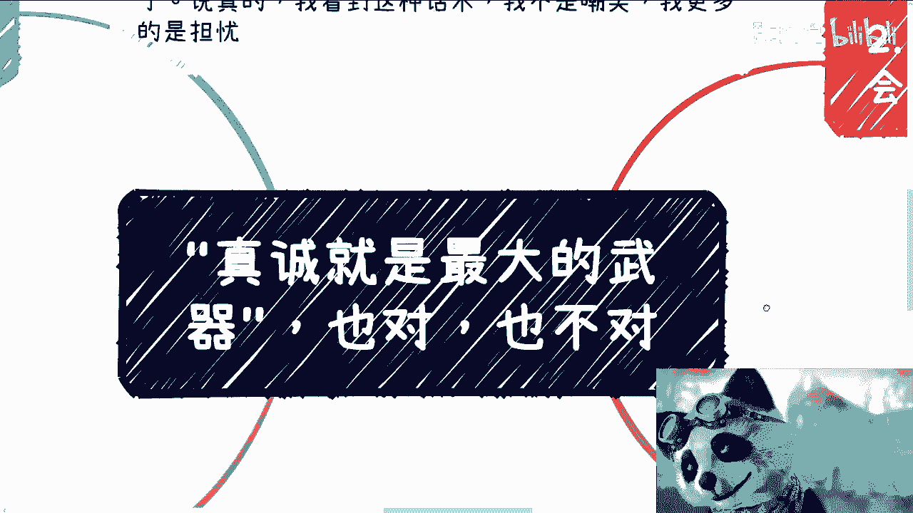
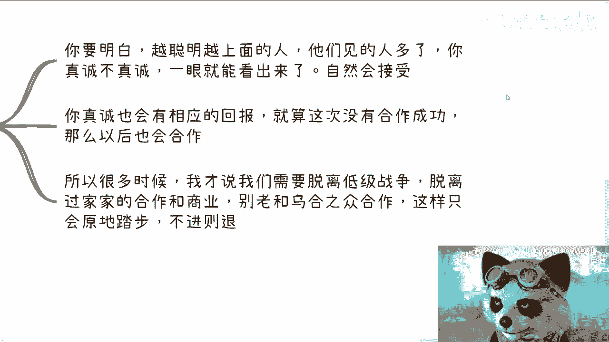
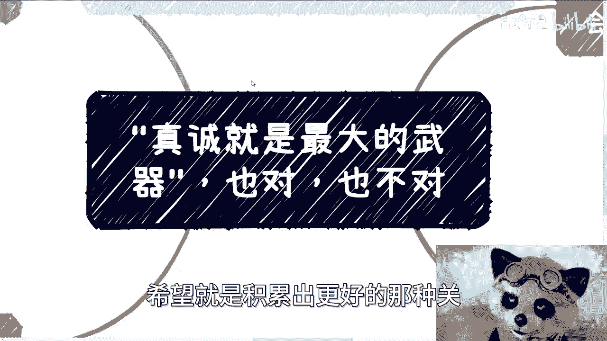
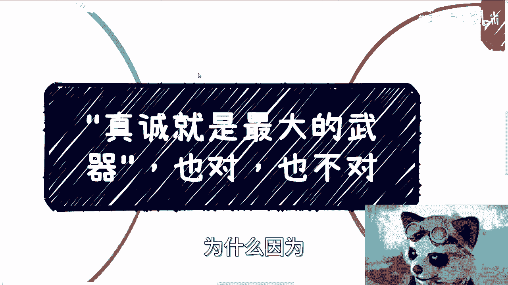

# 课程名称：商业合作中的“真诚”迷思 - 第1课




## 概述


在本节课中，我们将要学习一个在商业和人际交往中常见的观点：“真诚就是最大的武器”。我们将深入剖析这句话在不同层级和圈子中的适用性，并探讨其背后的现实逻辑。课程旨在帮助初学者理解，在追求成功和有效合作时，除了主观意愿，还有哪些更关键的因素需要考虑。


---

## 核心问题：如何定义“真诚”？

上一节我们介绍了本节课的主题，本节中我们来看看关于“真诚”的第一个根本性问题。

“真诚”是一个主观概念。你认为自己很真诚，但你的合作方可能持相反看法。关键在于，**谁来定义和关心你是否真诚？** 在大多数商业合作中，除了你自己，很少有人真正关心这一点。你认为的“真诚”，在他人眼中可能只是一种自我感动。


---

## 现实拷问：利益与“真诚”的抉择

理解了“真诚”的主观性后，我们面临一个更现实的抉择。

以下是两个常见的商业合作情景，请你做出选择：
*   **情景A**：合作方很不真诚，但能直接为你带来丰厚的金钱收益。
*   **情景B**：合作方非常真诚，但无法帮助你赚到钱，甚至缺乏基本的社会资源和地位。


在现实的商业世界里，多数人会选择**情景A**。这揭示了一个残酷的事实：**社会是围绕价值和利益运转的，而非围绕个人的“真诚”感运转。** 合作能否达成、能否赚钱，最终是由市场和他人的判断决定的，而非你自己的感觉。


---

## 关键因素：你的层级决定游戏规则

上一节我们探讨了利益优先的现实，本节中我们来看看决定“真诚”效用的核心因素：你所在的层级。

你所处的社会层级和圈子，直接决定了“真诚”这句话的价值。
*   **在底层或初级的合作中**：参与者往往不成熟，人性中的自私面更为凸显。在这种环境中强调“真诚”，很可能被他人视为“傻”，结果轻则被白嫖劳动力，重则遭受财务损失甚至法律风险。除了至亲，没人会为你的“真诚”买单。
*   **在高层级的合作中**：情况则完全不同。越是凭借自身能力达到高位的人，往往格局越大，越懂得尊重他人。他们能识别并理解真诚，但**他们更看重的是你的能力、资源和头脑**。公式可以简单表示为：
    **有效合作 = 能力 + 资源 + 真诚 (可选加成)**
    在这里，真诚是锦上添花，而非雪中送炭。

因此，脱离低效、幼稚的“过家家”式圈子，向更高层级的圈层努力，是让“真诚”等品质产生价值的前提。



---


## 普遍法则：替换“真诚”一词

“真诚就是最大的武器”这句话可以推广为一个普遍法则。

你可以将“真诚”替换为任何主观品质词汇，例如“努力”、“勤奋”或“跪舔”。这句话本身没有错，但其正确性**高度依赖于你所处的环境**。

以下是不同环境下的对比：
*   **在低层级圈子**：大家认知相似，都相信“努力就有回报”。但这种共识可能无法带领群体取得实质性突破，目标可能仅限于“一起傻乐”。
*   **在高层级圈子**：当你渴望接触更优秀的人、见识更广阔的世界时，你会发现单靠“努力”或“真诚”是无效的。那个圈层的人时间宝贵，他们只关注核心问题：**价值交换**。代码可以描述为：
    ```python
    if 对方能提供价值:
        建立连接，深入交流
    else:
        # 没有时间浪费在无意义的对话上
        pass  # 或礼貌终止对话
    ```
    他们入股的是你的能力和资源，而非你的情绪或态度。





---

## 行动指南：聚焦价值，避免自我欺骗

上一节我们分析了不同圈层的规则，本节中我们将给出具体的行动建议。

核心行动原则是：**你可以用“真诚”之类的鸡汤去影响或说服他人（这是你的本事），但切勿用来自我麻痹和欺骗。**

1.  **承担所有结果**：你所有的选择，最终结果都由自己承担。自我感动无法带来实际收益。
2.  **焦虑应导向行动**：看到更高层级的人更努力，会产生焦虑。正确的做法是将焦虑转化为动力，去接触更高价值的信息和人脉，而非空想。
3.  **格局向上突破**：即使当前在做小额业务，也要不断思考如何提升业务的性价比和格局。想不明白就去学习、去交流、去请教。
4.  **职场与人生通用**：这一原则不仅适用于商业合作，也适用于职场和整个人生规划。核心只有一点：**你可以对外展示任何形象，但对自己必须保持清醒和诚实。**

---

## 总结


本节课中我们一起学习了关于“真诚”的迷思。我们认识到：
1.  “真诚”的定义是主观的，在商业世界中很少被他人真正关心。
2.  现实合作中，利益和价值通常优先于个人的“真诚”感受。
3.  **你所处的层级决定了“真诚”的效用**，高层级看重能力与价值，低层级则可能充满无效内耗。
4.  类似“真诚就是武器”的话术，其正确性完全取决于应用的环境和圈层。
5.  最终，所有结果需自己承担，因此必须**聚焦于提升自身价值、扩大格局，并对自己绝对诚实**，避免用美好的话语进行自我欺骗。


希望本课能帮助你以更清醒、更现实的视角看待商业合作与个人成长。